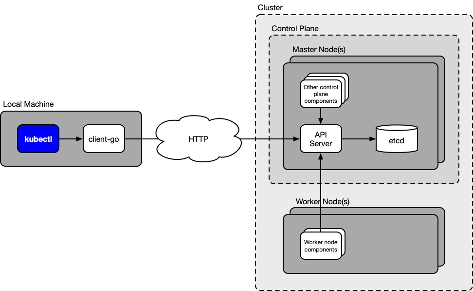
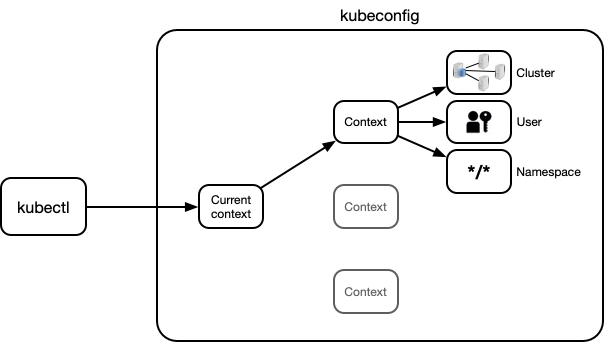

If you use Kubernetes, you use kubectl. And you probably use it *a lot*. If you spend so much time using a certain tool, it's worth knowing it very well and being able to use it *efficiently* and *effectively*. This article presents a series of tips and tricks to power-up your usage of kubectl, and along the way, giving you a deeper understanding of the kubectl/Kubernetes ecosystem. The ultimate goal of this article is not only to make your daily work with Kubernetes more professional, but also more fun and enjoyable!

<!--more-->

## What is kubectl?

In order to use a took efficiently and effectively, you need to understand what it is an how it works. The following diagram gives an overview of where kubectl is in the Kubernetes ecosystem:

To understand the role of kubectl, you also need to have a basic understanding of how Kubernetes works.

Kubernetes itself consists of a set of independent **components** that run on different nodes of a cluster. A subset of these components are **control plane components** and they usually run on one or more dedicated nodes that only run control plane components and don't execute any workloads. These nodes are called master nodes. The remaining components are **worker nodes components**, and they run on those nodes of the cluster that execute the application workloads. These nodes are called worker nodes.

Each component has a very specific job. For example, the **[etcd](https://coreos.com/etcd/)** component (a control plane component) stores all the resource specifications that have been defined for the cluster, such as pods and services. The **scheduler** component (a control plane component) assigns pending pods to worker nodes for execution. The **kubelet** component (a worker node component) is responsible for running the container(s) of a pod that has been assigned to its node by the scheduler.

However, there is one very important component that I didn't mention yet: the **API server**. The API server is the switching point for all interactions between components within the cluster, as well as the main entry point for interactions from outside the cluster. The individual components in a cluster don't talk to each other directly, but they only talk to the API server (in fact components don't even know about each others' existence). Similarly, an external user (such as you) interacts with a Kubernetes cluster by talking to the API server.

The API server defines an **HTTP REST API** through which all these interactions happen. This is commonly known as the [Kubernetes API](https://kubernetes.io/docs/reference/using-api/api-overview/). All Kubernetes operations are implemented as **CRUD** operations (create, read, update, delete) on Kubernetes **resources**. Everything, from a pod to a service to a deployment or namespace is a Kubernetes resource, and all Kubernetes operations are CRUD operations on these resources, carried out through the HTTP REST API of the API server. You can find the full list of these resources with all their fields for the latest version of Kubernetes (currently v1.13) [here](https://kubernetes.io/docs/reference/kubernetes-api/).

And now you can see what **kubectl** is: kubectl is a command-line tool that carries out HTTP requests to the API server. If you run `kubectl get pods`, then kubectl issues an HTTP request that corresponds to a *read* operation on the *pod* resources to the API server

So, if kubectl just makes HTTP requests to the API server, couldn't you also access this API directly? Sure. Nothing stops you from making raw HTTP requests to the API server with a tool like `curl`. If you know the relevant API endpoints and request formats, then you could fully control your cluster that way without ever using kubectl. However, this would be a lot of work and pretty error-prone. The whole point of kubectl is to make it easier for you to interact with the Kubernetes API server.

However, what's more common than accessing the API server directly is to use one of the Kubernetes [client libraries](https://kubernetes.io/docs/reference/using-api/client-libraries/) that exist for different programming languages. These are API client libraries that allow you to carry out requests to the API server programmatically. This allows you to write programs that communicate with the Kubernetes API server, just like kubectl.

In fact, kubectl is nothing else than a program that uses a Kubernetes client library to communicate with the Kubernetes API server. In particular, kubectl is a Go program that uses the [client-go](https://github.com/kubernetes/client-go) library.

The take-away message here is that, regarding cluster control, the crucial point is the HTTP REST API provided by the API server. Everything happens through this API. Kubectl is one of the means to access this API, but there are others, for example issuing raw HTTP requests (e.g. with `curl`) or using a Kubernetes client library. In the end, all these means are equivalent, that is, they all allow you to do the same things.

Now that you have a good idea of what kubectl is, let's look at a series of tips and tricks to make your usage of kubectl more efficient.

## Save typing with command completion

One of the most obvious, but often overlooked, tricks to make your kubectl usage more efficient is shell completion. This is a feature that kubectl provides for the **Bash** and **zsh** shells (see [here](https://kubernetes.io/docs/tasks/tools/install-kubectl/#enabling-shell-autocompletion)). It allows you to auto-complete kubectl sub-commands, options, and arguments, including hard-to-type things like pod or node names. This can save you really a lot of typing or copy-pasting!

Here is a small demonstration of shell completion in action:

You use completion by hitting *Tab* to auto-complete the current word (if there is only a single match), and hitting *Tab* two times to display a list of all the possible completions (if there are multiple matches).

The setup procedure for shell completion depends on whether you use Bash or zsh and Linux or Mac. Each case is explained in the following. But first, some general notes that apply to all setups.

### General Notes

- The completion functionality for kubectl is provided by a **completion script**. This is a shell script that instructs the shell how completion should work for this command. kubectl outputs this script for the Bash and zsh shells with the command `kubectl completion bash` and `kubectl completion zsh`, respectively. You have to source this script for enabling completion.
- For Bash, the kubectl completion script depends on a third-party project called [**bash-completion**](https://github.com/scop/bash-completion). You need to install this project on your system to make kubectl completion work for Bash.

### Bash on Linux

As mentioned, for Bash you first have to install a project called [bash-completion](https://github.com/scop/bash-completion). This project provides Bash functions that are used by the kubectl completion script (that is, the output of `kubectl completion bash`).

You can install bash-completion as follows:

~~~bash
sudo apt-get install bash-completion
~~~

This creates the file `/etc/bash_completion`, which you have to source in your `~/.bashrc` file. So add the following to your `~/.bashrc` file:

~~~bash
source /etc/bash_completion
~~~

Now, you just need to make sure the kubectl completion script is sourced in every shell session. You can do this by adding the following command to your `~/.bashrc` file (after the above command):

~~~bash
source <(kubectl completion bash)
~~~

And that's it! After starting a new shell (or sourcing `~/.bashrc`), kubectl completion should work.

### Bash on macOS

On macOS, the story is (unfortunately) a bit more complicated. The reason for this is that Apple includes a completely outdated version of Bash in macOS. In particular, this is version 3.2 which dates from 2007 (you can test it on your Mac by running `bash --version`). Apple does this for licensing reasons: Bash 3.2 is the last version that uses the GPLv2 license, whereas later versions use GPLv3, and Apple is unwilling to accept GPLv3.

The problem is that the kubectl completion script (that you generate with `kubectl completion bash`) does not work properly with Bash 3.2. It requires at least Bash 4.1.

The only solution to this problem is to install a newer version of Bash on your Mac (the currently latest version is 5.0). This is actually not difficult and I wrote an entire article about it [here](https://itnext.io/upgrading-bash-on-macos-7138bd1066ba). I recommend you to follow the steps in this article before proceeding.

Once you have upgraded Bash to a newer version, you have to install bash-completion.

You can do this conveniently with the [Homebrew](https://brew.sh/) package manager:

~~~bash
brew install bash-completion@2
~~~

The `@2` at the end of the Homebrew formula stands for major version 2 of bash-completion. This version has to be used for Bash 4.1 and newer (which you are hopefully using by now).

The above command will prompt you in the "Caveats" section to add the following command to your `~/.bash_profile` or `~/.bashrc` file:

~~~bash
[[ -r "/usr/local/etc/profile.d/bash_completion.sh" ]] && . "/usr/local/etc/profile.d/bash_completion.sh"
~~~

You have to do this in order to enable the bash-completion functionality.

After that, you just need to source the kubectl completion script, which you can do by adding the following command to your `~/.bashrc` file (after the above command):

~~~bash
source <(kubectl completion bash)
~~~

And that's it! After starting a new shell, kubectl completion should be working.

### zsh

With zsh, the setup procedure is the same for macOS and Linux, and furthermore, it doesn't depend on a third-party project like bash-completion. So, all you have to do is to source the kubectl completion script.

You can do this by adding the following to your `~/.zshrc` file:

~~~zsh
source <(kubectl completion zsh)
~~~

If you get an error like `complete:13: command not found: compdef` when you execute the above command, you have to enable the `compdef` builtin in your shell. You can do this by adding the following to the beginning of your `~/.zshrc` file:

~~~zsh
autoload -Uz compinit
compinit
~~~

## Quickly access resource documentation with `kubectl explain`

As mentioned, the core of Kubernetes consists of resources. You manage a Kubernetes cluster by applying CRUD operations on resources that are stored in the control plane of the cluster (more precisely, in the etcd component). Resources have a hierarchical structure (consisting of fields and sub-fields) that is specified in the [API reference](https://kubernetes.io/docs/reference/kubernetes-api/).

When you create, read, or update a resource, you need to know the structure of this resource (for example, if you want to specify or retrieve the image of a container in a pod, you need to know that this information is located in the `pod.spec.containters.image` field).

You could do this by consulting the API reference on the web, but this is a time-consuming and tedious process. Looking up this information should be faster and more integrated in your workflow.

This is where `kubectl explain` comes in. This command provides the complete API reference right in your terminal.

For example, if you want to know the fields of a pod, you can run:

~~~bash
kubectl explain pod
~~~

This command shows you all top-level fields of a pod including their type and a description.

You can then drill down into any fields that you're interested in to get their documentation, for example:

~~~bash
kubectl explain pod.spec
kubectl explain pod.spec.containers
kubectl explain pod.spec.containers.image
~~~

The information shown by `kubectl explain` is identical to the information in the [API reference](https://kubernetes.io/docs/reference/kubernetes-api/) on the web. The only difference is that with `kubectl explain`, you have it right at your fingertips.

By default, `kubectl explain` displays only one level of fields. You can recursively display the entire tree of fields (including the type of each field but omitting the description) with the `--recursive` flag:

~~~bash
kubectl explain pod.spec --recursive
~~~

In case you're not sure about the top-level resource names that you can use with `kubectl explain` (e.g. *pod*, *service*), you can display all of them with the following command:

~~~bash
kubectl api-resources
~~~

Note that this command displays the resource names in their plural form (e.g. *services* instead of *service*). It also displays the short name for those resources that have a short name (e.g. *svc* for the service resource). You can use any of these options with `kubectl explain`.

For example, the following invocations are all equivalent:

~~~bash
kubectl explain svc.spec
kubectl explain service.spec
kubectl explain services.spec
~~~

## Get the information you need with custom output formats

When you execute a `kubectl get` command, retrievng one or more resource objects from the cluster, the default output is a table-like plain text format. Below is an example:

~~~bash
$ kubectl get pods
NAME                      READY   STATUS    RESTARTS   AGE
engine-544b6b6467-22qr6   1/1     Running   0          78d
engine-544b6b6467-lw5t8   1/1     Running   0          78d
engine-544b6b6467-tvgmg   1/1     Running   0          78d
web-ui-6db964458-8pdw4    1/1     Running   0          78d
~~~

As you can see, each object is represented by a few fields. However, the above command actually retrieves the *full* specification of each object from the cluster (coming straight out of the etcd storage via the API server). Thus, you are not confined to view only these few default fields, but you can customise the output to display whatever fields you're interested in.

The way to do this is to use the `custom-columns` output format (see [here](https://kubernetes.io/docs/reference/kubectl/overview/#custom-columns)). It is used in the following way:

~~~
-o custom-columns=<COL>:<PATH>[,...]
~~~

You specify a comma-separated list of `<COL>:<PATH>` pairs, where `<COL>` is a column name (freely chosen by you), and `<PATH>` is a "path" in the hierarchical object specification to the field you wish to display in this column. `<PATH>` can refer to *any* field in an object (remember that you can inspect the field structure of any object with the `kubectl explain` command).

This is best explained with an example:

~~~bash
$ kubectl get -o custom-columns="POD:.metadata.name,IMAGES:.spec.containers[*].image" pods
POD                       IMAGES
engine-544b6b6467-22qr6   foo/engine:0.0.1,foo/sidecar:0.0.1
engine-544b6b6467-lw5t8   foo/engine:0.0.1,foo/sidecar:0.0.1
engine-544b6b6467-tvgmg   foo/engine:0.0.1,foo/sidecar:0.0.1
web-ui-6db964458-8pdw4    foo/web-ui:0.0.1
~~~

This command displays the container images of each pod in the default namespace of the cluster.

The output has two columns. The first column (entitled `POD`) contains the name of each pod, which is defined in the `pod.metadata.name` field of a pod resource object. The second column (entitled `IMAGES`) contains the names of all the container images in this pod, which are defined in the `pod.spec.containers[*].image` fields.

For convenience, you can wrap this command in a shell alias, so that you can easily execute it, for example as `kgi` (standing for **k**ubectl **g**et **i**mages):

~~~bash
alias kgi='kubectl get -o custom-columns="POD:.metadata.name,IMAGES:.spec.containers[*].image" pods'
~~~

Note two things about using the `custom-columns` in general:

- Since the resource object itself (e.g. *pod*) is defined by the `kubectl get` command, you **don't** have to add it at the beginning of the path expressions (e.g. you write `.metadata` and **not** `pod.metadata`).
- If a field is a list rather than a single object (like `pod.spec.containers`), then you have to use brackets `[]` and a subscript operator between them to specify to which objects of the list the path applies. You can use a number or a wildcard `*` as a subscript operator.

Again, you can find out the nature of each field in a resource object (whether it's an object or a list, which sub-fields it contains, etc.) with the `kubectl explain` command.

## Quickly change contexts and namespaces

This tip (which are actually two tips) makes it easier for you to work with multiple clusters from your system, as well as working with multiple namespaces in the same cluster. It will enable you to effortlessly update your configuration so that subsequent kubectl commands apply to exactly the cluster or namespace you want.

However, to this end, you need to understand the basics of said configuration, which is explained in the next section.

### What is kubeconfig?

Did you ever wonder where kubectl gets connection parameters, such as the API server URL and authentication credentials, from? The answer is, from a local configuration called **kubeconfig**. Your kubeconfig contains all the information that a tool like kubectl (or a Kubernetes client library) needs to interact with an API server.

> Note that you can have multiple clusters configured in your kubeconfig, which allows you to work with multiple clusters from your system.

Your kubeconfig is specified in one or more YAML files called **kubeconfig files**. The default kubeconfig file is `~/.kube/config`. You can have multiple kubeconfig files by listing them in them in the `KUBECONFIG` environment variable. If you have multiple kubeconfig files, then the effective kubeconfig configuration is the merge of all your kubeconfig files. All these things are described [here](https://kubernetes.io/docs/tasks/access-application-cluster/configure-access-multiple-clusters/) and [here](https://kubernetes.io/docs/concepts/configuration/organize-cluster-access-kubeconfig/) in the Kubernetes documentation.

So what does kubeconfig contain? The following figure shows the main kubeconfig components:

As you can see, kubeconfig has the following four main components (in alphabetical order):

- Clusters
- Contexts
- Current context
- Users

The **clusters** component is a list of cluster entries. Each cluster entry corresponds to a Kubernetes cluster that you want to be able to access with kubectl. Technically, a cluster entry consists of the API server URL and possibly a server authentication certificate.

The **users** component is a list of user entries. A user entry contains client authentication information. In other words, the information in a user entry allows to authenticate requests to an API server (which is defined in one of the cluster entries). The structure of the user entry is dictated by the [authentication strategy](https://kubernetes.io/docs/reference/access-authn-authz/authentication/) used by the API server. It can range from simple username/password credentials to more complex mechanisms.

The **contexts** component is a list of context entries. Each context entry has exactly three elements:

- Cluster
- Namespace
- User

The **cluster** element is the name of one of the clusters in the clusters component. The **namespace** element is the name of a namespace of this cluster. And the **user** element is the name of one of the users in the users component.

The purpose of a context is to bundle elements that are needed for a request (cluster, user, and namespace), so that they can referenced as a single entity.

Finally, the **current context** component is simply a pointer to one of the contexts in the contexts component. This target context is generally known as the "current context* of the kubeconfig configuration.

Whenever you use kubectl, it considers the **current context**. That means, when you issue a command like `kubectl get pods`, then kubectl connects to the cluster found in the **cluster** of the current context, authenticates the request using the credentials found in the **user** of the current context, and applies the Kubernetes operation to the Kubernetes namespace found in the **namespace** of the current context.

> Note that it's possible to overwrite each of these elements for every kubectl command with the `--cluster`, `--namespace`, and `--user` options. You can also overwrite the current context with the `--context` option.

### How are kubeconfig files created?

If you're already working with one or more clusters, then you must have a kubeconfig file (for example, the default `~/.kube/config`). Most probably you didn't write this file yourself, so how did it get there?

If you created your clusters with a managed Kubernetes service, such as [Amazon Elastic Container Service for Kubernetes (EKS)](https://aws.amazon.com/eks/) or [Google Kubernetes Engine (GKE)](https://cloud.google.com/kubernetes-engine/), then it was either the cluster creation command or a dedicated command that created or updated your kubeconfig file.

The dedicated commands that create or update a kubeconfig file with the information of a specific cluster are as follows for Amazon EKS and GKE, respectively:

- `aws eks update-kubeconfig -name <cluster>`
- `gcloud container clusters get-credentials <cluster>`

What these commands do is adding a **cluster**, **user** and **context** element to your kubeconfig file. As explained in the last subsection, the **cluster** element contains the URL of the API server of the given cluster. The **user** element contains authentication credentials for this cluster. And the **context** element points to these new cluster and user elements and usually specifies the default namespace (the namespace element may be absent in a context, in which case, the default namespace is assumed).

The effect of all this is that you now have a new context in your kubeconfig file that you can use to connect to the new cluster.

Apart from that, kubectl also provides native commands for editing kubeconfig files. These are:

- `kubectl config set-cluster`
- `kubectl config set-context`
- `kubectl config set-credential`
- `kubectl config use-context`

However, you usually don't need to use these commands if you use managed Kubernetes services. And by no means you ever need create or update a kubeconfig manually.

The next subsection explains why you might want to change the current context and how you can do it efficiently without manually editing the kubeconfig file.

### Changing contexts

Imagine you have a bunch of entries from different clusters in your kubeconfig file. At any point in time, you are using one specific context (that is, a combination of a cluster, user, and namespace). At some point, you will want to change to another context.

There are multiple reasons that you want to change to another context. The most common is probably that you want to work on another cluster. But it's also imaginable that you want to change to a context that uses the same cluster and namespace, but a different user (thus switching Kubernetes users). Or you may want to change to a context that uses the same cluster and user, but a different namespace (thus switching namespaces, which will be the topic of the [next section](#changing-namespaces)).

In any case, changing contexts is done by changing the value of the **current context** field in the kubeconfig file. This section shows you how you can do this efficiently.

But before that, let's take a step back and think about the tasks that you typically have to do when you work with multiple contexts. They include the following:

- Get the current context
- List all contexts
- Change the current context

All these tasks could be done by inspecting or editing your kubeconfig file. But that's tedious and we want to have it simpler.

If you look at kubectl, you see that it actually provides commands for exactly these tasks:

- Get the current context
    ~~~bash
    kubectl config current-context
    ~~~
- List all contexts
    ~~~bash
    kubectl config get-contexts
    ~~~
- Change the current context
    ~~~bash
    kubectl config use-context <context>
    ~~~

That's already better than working on the kubeconfig file directly. However, using these commands is still not very efficient for reasons explained in the following.

First, the commands are relatively long to type (even with command completion it still takes some time to enter them). Second, for changing the context, you need to enter the name of the new context. Managed services like Amazon EKS and GKE create pretty long context names that are not easy to type. So, if you use these services, you would probably have to copy-paste the context names, which is very tedious. You could also use command completion for the context names, but if the contexts have common prefixes (which is often the case with auto-generated contexts), this is still not an optimal solution.

Our ultimate solution is to create short shell aliases that address both of these problems. Below are the definitions of these aliases:

~~~bash
# Get current context
alias kcc='kubectl config current-context'
# List all contexts
alias klc='kubectl config get-contexts -o name | sed "s/^/  /;\|$(kcc)|s/ /*/"'
# Change current context
alias ksc='kubectl config use-context "$(klc | fzf -e | sed "s/^..//")"'
~~~

And here you can see them in action:

As you can see, you can now carry out all tasks by just typing three letters, and you can select the new context with a convenient fuzzy search (how this works will be explained below).

In general, the aliases build on the kubectl commands shown above and extend them with tools like *sed* and command substitution in classical UNIX manner (I'm omitting to explain the application of these tools in detail, because this is not specific to kubectl or Kubernetes).

To use these aliases you just have to copy the alias definitions to your `~/.bashrc` or `~/.zshrc` file.

> All aliases work for both Bash and Zsh.

However, before you start using these aliases, some notes are necessary.

First, some aliases have invocations of other aliases in their definition. This means that you must maintain the order of the alias definitions (every alias must be defined before it is invoked). Furthermore, if you rename an alias, you must rename all invocations of the alias too.

Second, the `ksc` alias (changing context) depends on a tool called [*fzf*](https://github.com/junegunn/fzf). This tool provides the fuzzy search interface that allows you to select a context by typing any parts of its name. You must install *fzf* on your system according to the instructions [here](https://github.com/junegunn/fzf#installation) in order to use the `ksc` alias.

*fzf* stands for *fuzzy finder* and is an amazingly useful and versatile tool. In essence, it reads lines from stdin, and lets the user select one of these lines with a fuzzy search. The selected line is then written to stdout. *fzf* has uses much beyond of what is shown here, and you will see it again in the next section about changing namespaces.

### Changing namespaces

Imagine you're working with a specific cluster in a specific namespace and now want to switch to another namespace (for example, from *dev* to *prod*). One solution would be to use the `--namespace` option with kubectl. But if you want to use the new namespace for more than a single operation, this is not an efficient solution.

In that case, the way to go is to update your kubeconfig configuration so that the new namespace is permanently set (until you change it again).

In general, there are two ways to achieve this:

- Change to a context with the same cluster and user, but a different namespace (requires you to create this context first).
- Change the namespace entry of the current context.

Both are legitimate solutions. However, in practice, people often prefer the second solution. The reason is that it doesn't increase the number of contexts (that you need to deal with when you change contexts) and it keeps the kubeconfig file small. Furthermore, people often have a single context per cluster (as created by some managed Kubernetes service command) and this solution maintains this property.

So, with this solution you are going to edit the **namespace** entry of the **context** pointed to by the **current context** field. Compare this with the solution for changing contexts from the last subsection where you edited the **current context** field.

Before investigating how to implement this, let's look at the typical tasks that you have to do when working with multiple namespaces:

- Get the current namespace
- List all namespaces
- Change the current namespace

This is analogous to the context tasks from the last subsection. Also analogous to the contexts, we are going to implement these tasks as convenient shell aliases.

The definitions of of these aliases are shown below:

~~~bash
# Get current namespace
alias kcn='kubectl config get-contexts --no-headers "$(kubectl config current-context)" | awk "{print \$5}" | sed "s/^$/default/"'
# List all namespaces
alias kln='kubectl get -o name ns | sed "s|^.*/|  |;\|$(kcn)|s/ /*/"'
# Change current namespace
alias ksn='kubectl config set-context --current --namespace "$(kln | fzf -e | sed "s/^..//")"'
~~~

And here you can see them in action:

As you can see, the aliases work pretty similarly to the context aliases. Also, the design principles of these aliases are similar to the context aliases. In particular, native kubectl commands are used to get raw data, which is then processed with tools like *sed* and *awk*.

To use these aliases you just have to copy the alias definitions to your `~/.bashrc` or `~/.zshrc` file.

> All aliases work for both Bash and Zsh.

Some notes about these aliases are appropriate too.

First, the namespace aliases are a bit more complex than the context aliases. This is due to the fact that contexts are first-class citizens of kubeconfig (and have native kubectl commands to manage them), whereas namespaces are not. Rather, namespaces are a property of each cluster, and they are included in kubeconfig contexts mainly for convenience. 

Second, as for the context aliases, some aliases have invocation of other aliases in their definition. So, you must maintain their relative order, and if you rename an alias, don't forget to rename all its invocations too. Furthermore, one of the aliases (`ksn` for switching to a new namespace) depends on [*fzf*](https://github.com/junegunn/fzf) too. So you must [install](https://github.com/junegunn/fzf#installation) this tool in order to use this alias.

Third, the list of namespaces of a cluster must be obtained from the API server. It can't be obtained from the kubeconfig file like, for example, the list of contexts. This means that the `kln` alias (list namespaces) includes a network round-trip to the API server and thus may be much slower than the other aliases which only work on the local kubeconfig file.

Last, since the `ksn` alias (changing namespaces) uses the `kln` alias (for presenting you with the full list of namespaces to choose from), the running time of `ksn` is at least as long as the one of `kln`.

> The issue of long running times for getting the list of namespaces is alleviated by an alternative solution to manage namespaces that I provide [here](https://github.com/weibeld/kubectl-ns) as a kubectl plugin (see [*Extend kubectl with plugins*](#extend-kubectl-with-plugins)).

### Alternative tools

Switching contexts and namespaces is such a common task that others have addressed it too.

A very popular solution is the [**kubectx**](https://github.com/ahmetb/kubectx) project. This project provides two commands, `kubectx` and `kubens`. These commands allow you to do basically the same things as our aliases, but with some additional bells and whistles.

For example, `kubectx` provides completion of context names, a shortcut to switch back to the previous context, and sub-commands for renaming and deleting a context. `kubens` also provides completion of namespaces and a shortcut to switch back to the previous namespace.

You can install and use `kubectx` and `kubens` as a more complete alternative to the aliases. However, one difference between the two solutions is worth pointing out: the source files of `kubectx` and `kubens` together have more than 400 lines of shell code, whereas our aliases make up just 6 (**six**) lines of code. If that isn't minimalistic! 😉

I personally created two other tools called [**kubectl-ctx**](https://github.com/weibeld/kubectl-ctx) and [**kubectl-ns**](https://github.com/weibeld/kubectl-ns). These tools are based on the aliases from the last subsections, and they can be installed as kubectl plugins (kubectl plugins will be explained in the [*Extend kubectl with plugins*](#extend-kubectl-with-plugins) section). An advantage of kubectl-ns is that it locally caches the namespaces of each cluster so that the commands for listing and changing namespaces can omit requests to the API server and are thus much faster.

## Save even more typing with more shell aliases

Shell aliases are generally used to abbreviate long commands (including sub-commands, options, arguments, etc.) to short "alias" strings. Then, all you have to do is to type the alias string, and the shell expands the alias and executes the corresponding command, just as if you typed the long command yourself. Defining aliases pays off particularly for frequently used commands.

With kubectl you naturally use certain commands very frequently (for example, `kubectl get pods`). So, it would be nice to define aliases for these commands, right? You would just need to figure out which commands you use most frequently, choose an alias name for each one, and then define the aliases in your `~/.bashrc` or `~/.zshrc` file (for example, as `alias kgpo='kubectl get pods'`).

> In the following, the notation `~/*rc` is used to refer to either `~/.bashrc` or `~/.zshrc`.

But there's a better solution. There's a project called [*kubectl-aliases*](https://github.com/ahmetb/kubectl-aliases) which defines **800 aliases** for frequently used kubectl commands. You can just include these alias definitions in your `~/*rc` file and start using them immediately.

> All aliases in *kubectl-aliases* work with both, Bash and Zsh.

To install the project, just download the `.kubectl_aliases` file (which contains all the alias definitions) from the  GitHub repository [here](https://itnext.io/upgrading-bash-on-macos-7138bd1066ba), and source it in your `~/*rc` file:

~~~bash
source ~/.kubectl_aliases
~~~

You might wonder how you could possibly remember 800 aliases? Well, actually you don't need to. The aliases in `.kubectl_aliases` are all auto-generated according to a simple scheme, which is shown in the following figure (taken from a [blog post](https://ahmet.im/blog/kubectl-aliases/) of the maker of the project):

All aliases start with `k`, and then you can append components from left to right, according to the above figure (the `sys` component is optional). Here are some example aliases and the commands that they stand for:

- `k` &#10230; kubectl
- `kg` &#10230; `kubectl get`
- `kgpo` &#10230; `kubectl get pods`
- `kgpooyaml` &#10230; `kubectl get pods -o yaml`

And so on, for all the possible combinations. So, if you want to list all pods, you can just type `kgpo`. If you want to get a specific pod, you can type `kgpo <pod>` (where `<pod>` is the name of the pod you want to retrieve). If you want to get the YAML specification of a specific pod, you can type `kgpooyaml <pod>`.

Nothing prevents you from using these aliases only as parts of your commands. For example, you can use `k` at any place where you would type kubectl otherwise. This means, you can type `k api-resources` (since there's no alias for this command as a whole). Or you can type `kg roles` (since there are no aliases defined for *role* resources). Just look at the command an alias stands for, and you can append further arguments to the alias at will. This allows you to minimise typing even fore use cases that are not explicitly covered by *kubectl-aliases*.

If you use Zsh, it gets even better. The kubectl command completion works with the aliases too. That means, you can type, for example, `kgpo [tab][tab]` and Zsh will complete the available pod names for you. Like this, you can combine two typing reduction mechanisms (aliases and completion) to an "ultra typing reduction" workflow.

If you use Bash, the bad news is that completion for aliases doesn't work by default. The good news is that you can make it working quite easily, which is explained in the following. This will allow you to have your "ultra typing reduction" workflow" also on Bash.

### Making alias completion work with Bash

The problem with Bash is that, unlike Zsh, it doesn't expand aliases before attempting command completion on them. So, for example, if you type `kgpo` and hit *Tab*, then Bash tries to find a completion specification for a command  called `kgpo`, which of course doesn't exist. The solution to this problem is a project called [*complete-alias*](https://github.com/cykerway/complete-alias).

This project provides a Bash function called `_complete_alias`. If you specify this function as the completion specification of any alias (using the [`complete`](https://www.gnu.org/software/bash/manual/html_node/Programmable-Completion-Builtins.html) builtin), it "magically" makes completion work (it's actually not "magic" and I will briefly explain how it works below).

For example, if you want to enable completion for the `kgpo` alias, you have to execute the following command:

~~~bash
complete -F _complete_alias kgpo
~~~

And this works with *any* alias (hence, *complete-alias* is very useful in general, not just for *kubectl-aliases*).

Let's first look at how to install *complete-alias*, and then how to run a sequence of commands like the above for every alias in *kubectl-aliases*.

Installing *complete-alias* itself is easy, but it depends on [*bash-completion*](https://github.com/scop/bash-completion) (presented earlier in this post). Most probably you have *bash-completion* already installed. If not, then you have to install it now according to the instructions given in section [*Shell Completion*](#shell-completion).

> **Important note for macOS users:** Apple includes an outdated version of Bash (version 3.2) in macOS. With this version, you are restricted to an old version of *bash-completion* that does **not** work with *complete-alias*. This means, if you use the default version of Bash, the below instructions will **not** work for you. The solution is to install a newer version of Bash on your macOS and set it as your default shell. Instructions to do this can be found [here](https://itnext.io/upgrading-bash-on-macos-7138bd1066ba).

Installing *complete-alias* is done by simply downloading the project's [main file](https://raw.githubusercontent.com/cykerway/complete-alias/master/bash_completion.sh) (confusingly called `bash_completion.sh`) and source it in your `~/.bashrc` file. So, if you save the file, for example, as `~/.complete_alias`, then add the following command to your `~/.bashrc` file:

~~~bash
source ~/.complete_alias
~~~

Now, to enable completion for all the aliases of *kubectl-aliases*, you have to execute a command like `complete -F _complete_alias <alias>` for every alias of *kubectl-aliases*. You can do this by adding the following snippet to your `~/.bashrc` file (adapt `~/.kubectl_aliases` to the location of your *kubectl-aliases* file):

~~~bash
for _a in $(sed '/^alias /!d;s/^alias //;s/=.*$//' ~/.kubectl_aliases); do
  complete -F _complete_alias "$_a"
done
~~~

And that's it! Now completion should work with all the aliases. You can test it by typing, for example, `k [tab][tab]` or `kgpo [tab][tab]`.

In case you wonder how the `_complete_alias` function can enable appropriate completion for *any* alias: this function internally expands the alias and looks at the aliased command. It then invokes *bash-completion* to retrieve the completion suggestions for the expanded command and return them to the shell.

<!--
- https://github.com/ahmetb/kubectl-aliases
- Described here: https://ahmet.im/blog/kubectl-aliases/
- 800 auto-generated aliases
- Just download the `.kubectl_aliases` file and source it from your `~/.bashrc` of `~/.zshrc`

### Programmable Completion

- With Zsh, command completion keeps working with aliases
- With Bash, command completion doesn't work with aliases by default

#### Solution for Bash Problem

- https://github.com/cykerway/complete-alias
- Simply download the https://github.com/cykerway/complete-alias/blob/master/bash_completion.sh file and source it in your `~/.bashrc`
- This provides the function `_complete_alias`
- Then, for every alias for which you want to enable command completion:
    - `complete -F _complete_alias <alias>`
- This works by internally expanding the alias and getting the completion options in the same way as the aliased command
- The implementation depends on bash-completion https://github.com/scop/bash-completion
- Problem with macOS
    - complete-alias depends on bash-completion 2.0 or newer
    - macOS indludes Bash 3.2 which uses bash-completion 1.3 (when installed with Homebrew)
    - This results in an error: `_completion_loader: command not found`
        - The `_completion_loader` function has been added in bash-completion 2.0 (i.e. does not exist in bash-completion 1.3)
    - Solution: install a newer version of Bash on macOS and use bash-completion 2.8
-->

<!--## Kubernetes Shells-->

## Extend kubectl with plugins

Plugins are a kubectl feature that only few people know about. They have existed for a while, but the plugin system has been completely redesigned in **version 1.12** (released in September 2018) of kubectl. With the new plugin system, you can add custom sub-commands to kubectl as shown below:

Plugins are described [here](https://kubernetes.io/docs/tasks/extend-kubectl/kubectl-plugins/) in the Kubernetes documentation.

It is very easy to install kubectl plugins, and it can be explained in a single sentence (there are some further minor details to this, which are explained later): 

*Any executable named `kubectl-<name>` (where `<name>` is any string) in any directory of your `PATH` is detected by kubectl as a plugin and made available as `kubectl <name>`.*

The executable can be of any type: a shell script, a compiled C program, a Python script, and so on, there are no requirements. There is no interface against which you have to program, no plugin manifest to create, and no registration process. The only requirements are that the name of the executable starts with `kubectl-` and that it's located somewhere in your `PATH`.

For example, to create a "Hello World" plugin as shown above, all you have to do is the following:

- Create an executable file named `kubectl-hello`, for example as a shell script (don't forget to set its executable flag with `chmod +x`):
    ~~~bash
    #!/bin/bash
    echo "Hello, I'm a kubectl plugin!"
    ~~~
- Place the file in any directory of your `PATH`

That's all! Now you can invoke your plugin with `kubectl hello`.

What technically happens when you run `kubectl hello` is that kubectl executes the corresponding `kubectl-hello` executable. The executable can do anything it wants, it doesn't even have to be related to Kubernetes (as the above example shows).

Any arguments that you pass to a plugin are passed as-is to the executable. For example, if you run `kubectl hello -o opt` then the `-o` and `opt` arguments are passed to the `kubectl-hello` executable as the first and second arguments, as if it was invoked with `kubectl-hello -o opt`. Furthermore, the plugin executable runs in the same environment as kubectl. That means, any environment variables that are available to kubectl, are also available to the plugin executable.

There are the following further details about kubectl plugins:

- If the executable is named `kubectl-foo-bar`, it is made available as `kubectl foo bar`.
    - This allows you to create plugins that appear to have sub-commands.
- If the executable is named `kubectl-foo_bar` (note the underscore), it is made available as `kubectl foo_bar` *and* `kubectl foo-bar`.
    - This allows you to create plugins with dashes in their name.

Kubectl provides a single native command that is related to plugins:

~~~bash
kubectl plugin list
~~~

This command lists all the plugins that kubectl detects in the `PATH` of your system. This gives you an overview of which plugins are available for you to use.

The above command also includes warnings if a plugin has the same name as a native kubectl command (in which case the plugin will be ignored) or if there are multiple plugins with the same name (in which case, the plugin that appears first in the `PATH` will be used.

### Why plugins?

So, if plugins are just executables that are invoked by kubectl, why even bother with creating a plugin and not just executing the executable yourself? Instead of creating an executable named `kubectl-hello` and run it as `kubectl hello`, you could just create an executable named `hello` and execute it directly. There would be effectively no difference.

The main argument to use the plugin system is to avoid "command overload" (something like app overload on smartphones). Kubectl lends itself to create tools around it, and without plugins, each of these tools is a separate command. This clutters your system with many, often cryptically named, commands. If you design these tools as plugins, you have them all under the kubectl "namespace", which makes it easier to remember and give meaningful names to them. In addition, you can get an overview of all the plugins you are using at any time with the `kubectl plugins list` command.

Furthermore, if you want to distribute a tool to other users, distributing it as a plugin reduces the risk of name clashes with existing tools on the users' system.

At the present time, the plugin mechanism does unfortunately not yet support **completion**. That means, you always have to fully type the plugin names, and can't complete them like native kubectl sub-commands (e.g. `kubectl h[tab]` does not complete to `kubectl hello`). However, there is an open [feature request](https://github.com/kubernetes/kubectl/issues/585) for this on GitHub, so hopefully we will see this feature some time in the future.

### Creating and installing plugins

So far in this article, you have created a couple of convenience tools around kubectl. One example is the `kgi` alias from section [Custom Output Format](#custom-output-format) that displays the container image names n each pod of your cluster. As a reminder, this alias was defined as follows:

~~~bash
alias kgi='kubectl get -o custom-columns="POD:.metadata.name,IMAGES:.spec.containers[*].image" pods'
~~~

What about making this tool a  plugin named `img`, so that you can execute it as `kubectl img`? That's definitely a good alternative to having the cryptic `kgi` alias around.

All you have to do transform this command to a plugin is the following:

- Add the alias command to a shell script named `kubectl-img`:
    ~~~bash
    #!/bin/bash
    kubectl get -o custom-columns="POD:.metadata.name,IMAGES:.spec.containers[*].image" pods
    ~~~
- Make `kubectl-img` executable:
    ~~~bash
    chmod +x kubectl-img
    ~~~
- Move `kubectl-img` to any directory in your `PATH`
- Verify the installation by checking that the plugin is listed in the output of the following command:
    ~~~bash
    kubectl plugin list
    ~~~

That's it! Now you should be able to execute your container image listing plugin with `kubectl img`.

Some other tools that you created in this article include the aliases for changing the context and namespace from section [Contexts and Namespaces](contexts-and-namespaces). You can transform these tools into plugins exactly like the example above.

Alternatively, I did this already and created two plugins named `ctx` and `ns`, for changing the context and namespace, respectively. You can find them on GitHub:

- [weibeld/kubectl-ctx](https://github.com/weibeld/kubectl-ctx)
- [weibeld/kubectl-ns](https://github.com/weibeld/kubectl-ns)

You can install these plugins on your system by simply downloading the [kubectl-ctx](https://raw.githubusercontent.com/weibeld/kubectl-ctx/master/kubectl-ctx) or [kubectl-ns](https://raw.githubusercontent.com/weibeld/kubectl-ns/master/kubectl-ns) and place it in any directory in your `PATH`.

If you end up installing many plugins, a possible approach for keeping things organised is to create a dedicated directory, e.g. `~/.kubectl-plugins`, add it to your `PATH`, and then install all plugin executables there.

### How to write plugins

The plugins you saw so far are simple shell scripts that include invocations of kubectl. So there, you have basically a sub-command of kubectl that invokes the main command. This is completely legitimate, and made possible by the fact that a plugin executable can be sure that kubectl is installed on the local system (otherwise, the plugin executable couldn't be used as a kubectl plugin).

In fact, many common use cases can be solved by plugins that are implemented as shell scripts that carry out kubectl command.

However, for more complex use cases, nothing stops you from writing plugins as real programs that get their job done without kubectl. If your plugin needs to interact with the Kubernetes API server, you can use one of the Kubernetes [client libraries](https://kubernetes.io/docs/reference/using-api/client-libraries/) (note that kubectl itself is nothing but a program that uses a Kubernetes client library to interact with the Kubernetes API server, namely the [client-go](https://github.com/kubernetes/client-go) library).

If you decide to write your plugin in Go, then Kubernetes has you covered especially well. Kubernetes provides a library called [*cli-runtime*](https://github.com/kubernetes/cli-runtime) which includes helper functionality for interacting with the API server, working with local *kubeconfig* configuration, and more. This library is used by kubectl itself to implement its sub-commands, and if you write a plugin in Go, then you can use it too. There exists also an [example plugin](https://github.com/kubernetes/sample-cli-plugin) that uses this library.

But remember that this is not a requirement. A plugin does neither have to use the *cli-runtime* library, nor does it have to be written in Go. It can be *any* executable.

### krew: a package manager for kubectl plugins

So far you have seen that you can create and install your own plugins or you can install plugins that others created. If you want to do the latter, you might have the followin questions:

- Where can I find available plugins?
- How do I have to install each plugin?
- How can I keep installed plugins up-to-date?

There is a community project called [*krew*](https://github.com/GoogleContainerTools/krew) that attempts to solve these problems. *Krew* is a package manager for kubectl plugins (its name is a reference to [*brew*](https://brew.sh/), a package manager for macOS). 

*Krew* maintains an index of kubectl plugins to which plugin developers can add their plugins. As a plugin user, you can easily discover all the plugins in this index and install (and upgrade) them in standardised procedure.

The *krew* tool is provided as a kubectl plugin itself. You can install it as described [here](https://github.com/GoogleContainerTools/krew#installation) in the official instructions.

Once installed, you can use *krew* as follows:

- List all plugins in the *krew* index:
    ~~~bash
    kubectl krew search
    ~~~
- List all plugins that match a search query:
    ~~~bash
    kubectl krew search <query>
    ~~~
- Get information about a specific plugin:
    ~~~bash
    kubectl krew info <plugin>
    ~~~
- Install a specific plugin:
    ~~~bash
    kubectl krew install <plugin>
    ~~~
- List all plugins installed with *krew*:
    ~~~bash
    kubectl krew list
    ~~~
- Upgrade all plugins (if new versions are available):
    ~~~bash
    kubectl krew upgrade 
    ~~~
- Uninstall a specific plugin:
    ~~~bash
    kubectl krew remove <plugin>
    ~~~

As you can see, this makes it really easy to manage kubectl plugins on your system. Note that using *krew* doesn't exclude the installation of plugins in the conventional way. If you use *krew*, you can still install plugins that are not in the *krew* index by simply copying their executables to your `PATH`. These plugins will not be listed by `kubectl krew list`, but they will be listed by the native `kubectl plugin list`.

As a side note, *krew* is still in an early stage (like the plugin system as a whole), and at the moment there are about 30 plugins in the *krew* index. However, the project has gained promising traction, and there have even been [attempts](https://github.com/kubernetes/community/pull/2340) to add it natively to kubectl. So, it is definitely worth keeping an eye on!

#### Distribute your own plugins via krew

If you created a plugin and want to add it to the *krew* index, so that other users can discover and install it via *krew*, you can do that. The instructions for this can be found in the [developer guide](https://github.com/GoogleContainerTools/krew/blob/master/docs/DEVELOPER_GUIDE.md) of the *krew* documentation.

In short, you have create two artefacts for publishing your plugin to *krew*:

- A `.zip` or `.tar.gz` archive containing the executables of your plugin (possibly for different platforms)
- A *krew* [plugin manifest](https://github.com/GoogleContainerTools/krew/blob/master/docs/DEVELOPER_GUIDE.md#writing-a-plugin-manifest) YAML file

The **archive** with the executables must be publicly downloadable via a URL. You can achieve this, for example, by adding it as a binary to a GitHub [release](https://help.github.com/articles/creating-releases/).

The **plugin manifest** must contain all the required information for *krew* to install the plugin. This includes the URL of the archive with the executables, and the names of the executables to install for each platform. The plugin manifest is what will be uploaded to the *krew* index.

To publish your plugin to the *krew* index, you have to create a pull request to the [krew-index](https://github.com/GoogleContainerTools/krew-index) repository adding your plugin manifest to the [`plugins`](https://github.com/GoogleContainerTools/krew-index/tree/master/plugins) directory of this repository. This is were the manifests of all the plugins in the *krew* index are maintained.

Once the pull request is accepted, you plugin will be publicly listed by `kubectl krew search` and users can install it with `kubectl install <plugin>`. If you create a new version of your plugin, you have to update your plugin manifest in the krew-index repository with a new pull request.

Again, the detailed instructions for publishing plugins to *krew* can be found in the *krew* [developer guide](https://github.com/GoogleContainerTools/krew/blob/master/docs/DEVELOPER_GUIDE.md).

