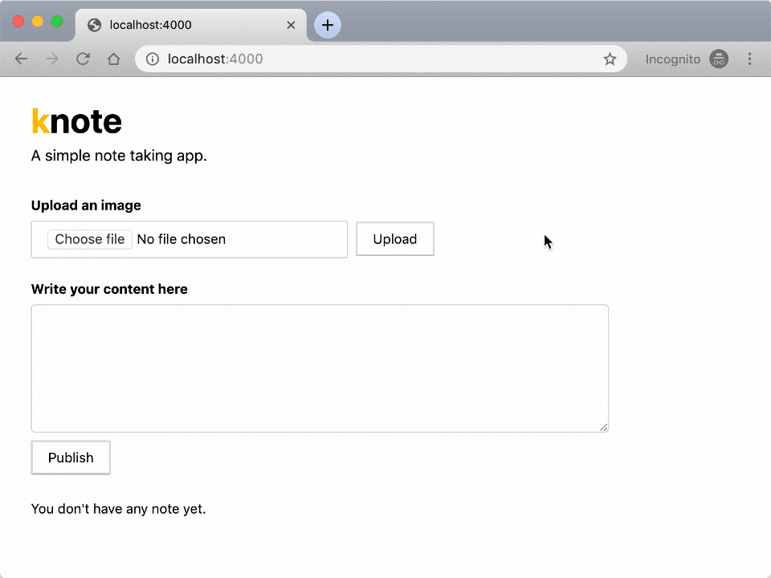
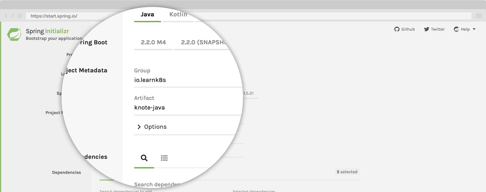
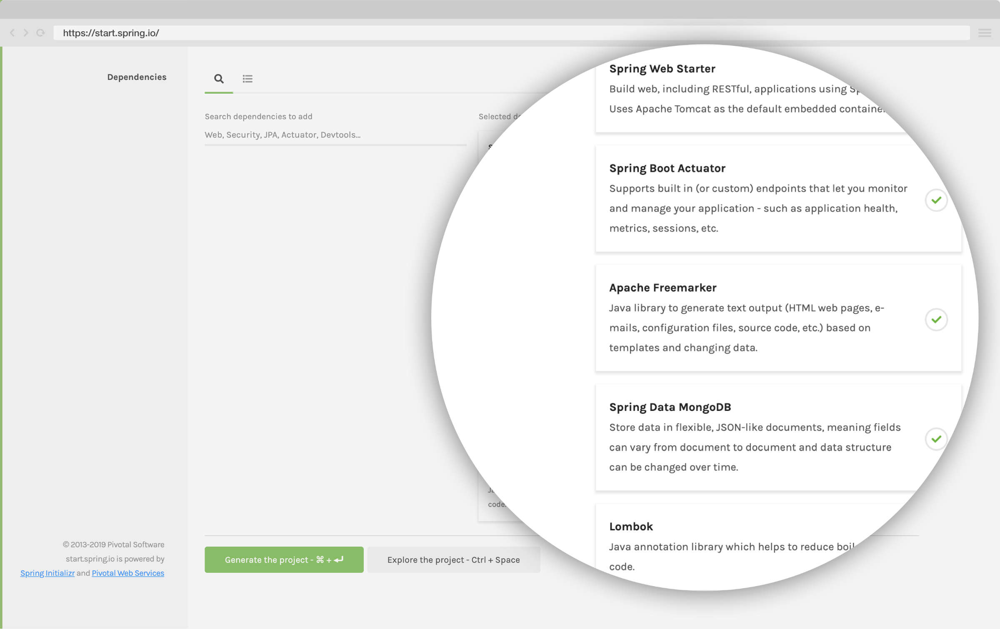

The essential ingredient to learning how to deploy and scale applications in Kubernetes is the application itself.

As you'll learn throughout this guide, **mastering Kubernetes doesn't guarantee that you have zero incidents in production.**

If your application isn't designed to be resilient and observable, the risk of downtime in production is high — even if you're using Kubernetes.

You should also be aware that Kubernetes makes a few assumptions on how your application behaves.

As an example, Kubernetes assumes that your app can be stopped and restarted in another node at any given time.

But what if you're building a real-time app that uses Websockets, **would you be okay with your app being terminated and restarted at any time?**

_Probably not._

Learning how to design and architect applications that leverage Kubernetes is the most valuable skill that you could learn to be successful in deploying and scaling your traffic to 30 million requests and beyond.

In this guide, you will develop a small application for note-taking similar to [Evernote](https://evernote.com/) and [Google Keep](https://www.google.com/keep/).

The app lets you:

1. record notes and
1. attach images to your notes

Notes aren't lost when the app is killed or stopped.

So you will use a database to store the content.

Here is how the app looks like:



## Bootstrapping the app

You will build the app with Spring Boot.

> If at any time you're stuck, you can find the final code of the app [in this repository](https://github.com/learnk8s/knote-java/tree/01/).

_Let's get started._

First, you need to go to <http://start.spring.io> to generate the skeleton of the project:



You should enter the **Group** and **Name** for your application:

- GroupId: learnk8s.io
- Name: knote-java



Next, go to the dependencies section and choose:

- **Web** -> Spring Web Starter: basic web stack support in Spring Boot
- **Actuator** -> Spring Boot Actuator: provide health endpoints for our application
- **FreeMarker** -> Apache FreeMarker: templating engine for HTMLs
- **MongoDB** -> Spring Data MongoDB: driver and implementation for Spring Data interfaces to work with MongoDB
- **Lombok** -> Lombok: library to avoid a lot of boilerplate code

Then click _Generate the project_ to download a zip file containing the skeleton of your app.

Unzip the file and start a terminal session in that directory.

_You will do the front-end stuff first._

Within `knote-java` application, there are two files in charge of rendering the Front End:

- [Tachyons CSS](https://github.com/learnk8s/knote-java/tree/01/src/main/resources/static) that needs to be placed inside `src/main/resources/static/`
- [Freemarker Template](https://github.com/learnk8s/knote-java/tree/01/src/main/resources/templates) for our index view that needs to be placed inside `src/main/resources/templates/`

> You can find the Freemarker template [in this repository](https://github.com/learnk8s/knote-java/tree/01/).

Apache FreeMarker™ is a template engine: a Java library to generate text output (HTML web pages, e-mails, configuration files, source code, etc.) based on templates and changing data.

_With the front-end stuff out of the way, let's turn to code._

You can open our application in our favourite IDE and import it as a Maven Project.

Now, open `src/main/java/io/learnk8s/knote-java/KnoteJavaApplication.java`:

```java|title=KnoteJavaApplication.java
package io.learnk8s.knote;

import org.springframework.boot.SpringApplication;
import org.springframework.boot.autoconfigure.SpringBootApplication;

@SpringBootApplication
public class KnoteJavaApplication {

    public static void main(String[] args) {
        SpringApplication.run(KnoteJavaApplication.class, args);
    }

}
```

This is not much more than a standard Spring Boot Application.

It doesn't yet do anything useful.

_But you will change this now by connecting it to a database._

## Connecting a database

The database will store the notes.

_What database should you use? MySQL? Redis? Oracle?_

[MongoDB](https://www.mongodb.com/) is well-suited for your note-taking application because it's easy to set up and doesn't introduce the overhead of a relational database.

Because you had included the Spring Data MongoDB support, there is not much that you need to do to connect to the database.

You should open the `src/main/resources/application.properties` file and enter the URL for the database.

```properties|title=application.properties
spring.data.mongodb.uri=mongodb://localhost:27017/dev
```

**You have to consider something important here.**

_When the app starts, it shouldn't crash because the database isn't ready too._

Instead, the app should keep retrying to connect to the database until it succeeds.

Kubernetes expects that application components can be started in any order.

_If you make this code change, you can deploy your apps to Kubernetes in any order._

Luckily for you, Spring Data automatically reconnects to the database until the connection is successful.

_The next step is to use the database._

## Saving and retrieving notes

When the main page of your app loads, two things happen:

- All the existing notes are displayed
- Users can create new notes through an HTML form

_Let's address the displaying of existing notes first._

First, you should create a `Note` class that holds the note's details.

The same note is also stored in the "notes" MongoDB collection.

```java|title=KnoteJavaApplication
@SpringBootApplication
public class KnoteJavaApplication {
    public static void main(String[] args) {
        SpringApplication.run(KnoteJavaApplication.class, args);
    }
}

@Document(collection = "notes")
@Setter
@Getter
@NoArgsConstructor
@AllArgsConstructor
class Note {
    @Id
    private String id;
    private String description;

    @Override
    public String toString() {
        return description;
    }
}
```

Next, you should leverage Spring Template to create a new repository to store the notes.

```java|highlight=17-19|title=KnoteJavaApplication.java
@Document(collection = "notes")
@Setter
@Getter
@NoArgsConstructor
@AllArgsConstructor
class Note {
    @Id
    private String id;
    private String description;

    @Override
    public String toString() {
        return description;
    }
}

interface NotesRepository extends MongoRepository<Note, String> {

}
```

As you can see, you define an interface and Spring Data MongoDB generates the implementation.

Also, notice how the notes are persisted in the database:

- The type of the Note is Note
- The id of the notes is of type String

You should notice the two types in the interface signature `MongoRepository<Note, String>`.

You can access the repository by autowiring it.

You should create a new class with the `@Controller` annotation to select the views in your application.

```java|title=KnoteJavaApplication.java
...

@Controller
class KNoteController {

    @Autowired
    private NotesRepository notesRepository;

}
```

When a user accesses the `/` route, they should see all notes.

You should add a `@GetMapping` endpoint to return the FreeMarker template `index.ftl`.

> Please notice how we dropped the `.ftl` extension from the filename to refer to it.

```java|highlight=7-11|title=KnoteJavaApplication.java
@Controller
class KNoteController {

    @Autowired
    private NotesRepository notesRepository;

    @GetMapping("/")
    public String index(Model model) {
        getAllNotes(model);
        return "index";
    }

    private void getAllNotes(Model model) {
        List<Note> notes = notesRepository.findAll();
        Collections.reverse(notes);
        model.addAttribute("notes", notes);
    }
    ...
}
```

The `getAllNotes(Model model)` method is in charge of

1. retrieving all the notes stored in MongoDB
1. reversing the order of the notes (to show the last one first) and
1. updating the model consumed by the view

_Next, let's address the creation of new notes._

You should add a method to save a single note in the database:

```java|title=KnoteJavaApplication.java
private void saveNote(String description, Model model) {
  if (description != null && !description.trim().isEmpty()) {
    notesRepository.save(new Note(null, description.trim()));
    //After publish you need to clean up the textarea
    model.addAttribute("description", "");
  }
}
```

The form for creating notes is defined in the `index.ftl` template.

Note that the form handles both the creation of notes and the uploading of pictures.

The form submits to the `/note` route, so you need to another endpoint to your `@Controller`:

```java|title=KnoteJavaApplication.java
@PostMapping("/note")
public String saveNotes(@RequestParam("image") MultipartFile file,
                        @RequestParam String description,
                        @RequestParam(required = false) String publish,
                        @RequestParam(required = false) String upload,
                        Model model) throws IOException {

  if (publish != null && publish.equals("Publish")) {
    saveNote(description, model);
    getAllNotes(model);
    return "redirect:/";
  }
  // After save fetch all notes again
  return "index";
}
```

The above endpoint calls the `saveNote` method with the content of the text box, which causes the note to be saved in the database.

It then redirects to the main page ("index"), so that the newly created note appears immediately on the screen.

**Your app is functional now (although not yet complete)!**

You can already run your app at this stage.

But to do so, you need to run MongoDB as well.

You can install MongoDB following the instructions in the [official MongoDB documentation](https://docs.mongodb.com/manual/installation/).

Once MongoDB is installed, start a MongoDB server with:

```terminal|command=1|title=bash
mongod
```

Now run your app with:

```terminal|command=1|title=bash
mvn clean install spring-boot:run
```

The app should connect to MongoDB and then listen for requests.

You can access your app on <http://localhost:8080>.

You should see the main page of the app.

Try to create a note — you should see it being displayed on the main page.

_Your app seems to works._

**But it's not yet complete.**

The following requirements are missing:

- Markdown text is not formatted but just displayed verbatim
- Uploading pictures does not yet work

_Let's fix those next._

## Rendering Markdown to HTML

The Markdown notes should be rendered to HTML so that you can read them properly formatted.

You will use [commonmark-java](https://github.com/atlassian/commonmark-java) from Atlassian to parse the notes and render HTML.

But first you should add a dependency to your `pom.xml` file:

```xml|highlight=3-7|title=pom.xml
<dependencies>
  ...
  <dependency>
    <groupId>com.atlassian.commonmark</groupId>
    <artifactId>commonmark</artifactId>
    <version>0.12.1</version>
  </dependency>
  ...
</dependencies>
```

Then, change the `saveNote` method as follows (changed lines are highlighted):

```java|highlight=4-6|title=KnoteJavaApplication.java
private void saveNote(String description, Model model) {
  if (description != null && !description.trim().isEmpty()) {
    //You need to translate markup to HTML
    Node document = parser.parse(description.trim());
    String html = renderer.render(document);
    notesRepository.save(new Note(null, html));
    //After publish you need to clean up the textarea
    model.addAttribute("description", "");
  }
}
```

You also need to add to the `@Controller` itself:

```java|highlight=6-7|title=KnoteJavaApplication.java
@Controller
class KNoteController {

    @Autowired
    private NotesRepository notesRepository;
    private Parser parser = Parser.builder().build();
    private HtmlRenderer renderer = HtmlRenderer.builder().build();
```

The new code converts all the notes from Markdown to HTML before storing them into the database.

Kill the app with `CTRL + C` and then start it again:

```terminal|command=1|title=bash
mvn clean install spring-boot:run
```

Access it on <http://localhost:8080>.

Now you can add a note with the following text:

```markdown|title=snippet.md
Hello World! **Kubernetes Rocks!**
```

And you should see `Kubernetes Rocks!` in bold fonts.

**All your notes should now be nicely formatted.**

_Let's tackle uploading files._

## Uploading pictures

When a user uploads a picture, the file should be saved on disk, and a link should be inserted in the text box.

This is similar to how adding pictures on StackOverflow works.

> Note that for this to work, the picture upload endpoint must have access to the text box — this is the reason that picture uploading and note creation are combined in the same form.

For now, the pictures will be stored on the local file system.

Change the endpoint for the POST `/note` inside the `@Controller` (changed lines are highlighted):

```java|highlight=10-18,23-32|title=KnoteJavaApplication.java
@PostMapping("/note")
public String saveNotes(@RequestParam("image") MultipartFile file,
                        @RequestParam String description,
                        @RequestParam(required = false) String publish,
                        @RequestParam(required = false) String upload,
                        Model model) throws IOException {
  if (publish != null && publish.equals("Publish")) {
    saveNote(description, model);
    getAllNotes(model);
    return "redirect:/";
  }
  if (upload != null && upload.equals("Upload")) {
    if (file != null && file.getOriginalFilename() != null
          && !file.getOriginalFilename().isEmpty()) {
      uploadImage(file, description, model);
    }
    getAllNotes(model);
    return "index";
  }
  return "index";
}

private void uploadImage(MultipartFile file, String description, Model model) throws Exception {
  File uploadsDir = new File(properties.getUploadDir());
  if (!uploadsDir.exists()) {
    uploadsDir.mkdir();
  }
  String fileId = UUID.randomUUID().toString() + "."
                    + file.getOriginalFilename().split("\\.")[1];
  file.transferTo(new File(properties.getUploadDir() + fileId));
  model.addAttribute("description", description + " ");
}
```

As you can see from the `uploadImage()` method, you are using Spring Boot configuration properties to inject application configurations.

These properties can be defined in the `application.properties` file or as environmental variables.

But you should define the `@ConfigurationProperties` class to retrieve those values.

Outside of the Controller class, you should define the `KnoteProperties` class annotated with `@ConfigurationProperties(prefix = "knote")`:

```java|title=KnoteJavaApplication.java
@ConfigurationProperties(prefix = "knote")
class KnoteProperties {
    @Value("${uploadDir:/tmp/uploads/}")
    private String uploadDir;

    public String getUploadDir() {
        return uploadDir;
    }
}
```

By default, the `uploadImage` method uses the `/tmp/uploads/` directory to store the images.

Notice that the `uploadImage` method checks if the directory exists and creates it if it doesn't.

> If you decide to change the path, make sure that the application has write access to that folder.

One last code change is required for the webserver (embedded in the spring boot application) to host files outside of the JVM classpath:

```java|title=KnoteJavaApplication.java
...
@Configuration
@EnableConfigurationProperties(KnoteProperties.class)
class KnoteConfig implements WebMvcConfigurer {

    @Autowired
    private KnoteProperties properties;

    @Override
    public void addResourceHandlers(ResourceHandlerRegistry registry) {
        registry
                .addResourceHandler("/uploads/**")
                .addResourceLocations("file:" + properties.getUploadDir())
                .setCachePeriod(3600)
                .resourceChain(true)
                .addResolver(new PathResourceResolver());
    }

}
...
```

The class annotated with the `@Configuration` annotation maps the path `/uploads/` to the files located inside the `file:/tmp/uploads/` directory.

The class annotated with `@EnableConfigurationProperties(KnoteProperties.class)` allows Spring Boot to read and autowire the application properties.

You can override those properties in `application.properties` file or with environment variables.

Kill the app with `CTRL + C` and then start the application again:

```terminal|command=1|title=bash
mvn clean install spring-boot:run
```

Access it on <http://localhost:8080>.

Try to upload a picture — you should see a link is inserted in the text box.

And when you publish the note, the picture should be displayed in the rendered note.

**Your app is feature complete now.**

> Note that you can find the complete code for the app in [in this repository](https://github.com/learnk8s/knote-java/tree/01/).

The next step is to containerise your app.

## Containerising the app

First of all, you have to install the Docker Community Edition (CE).

You can follow the instructions in the [official Docker documentation](https://docs.docker.com/install/).

> If you're on Windows, you can [follow our handy guide on how to install Docker on Windows](https://learnk8s.io/blog/installing-docker-and-kubernetes-on-windows/).

You can verify that Docker is installed correctly with the following command:

```terminal|command=1|title=bash
docker run hello-world

Hello from Docker!
This message shows that your installation appears to be working correctly.
```

**You're now ready to build Docker containers.**

Docker containers are built from Dockerfiles.

A Dockerfile is like a recipe — it defines what goes in a container.

A Dockerfile consists of a sequence of commands.

You can find the full list of commands in the [Dockerfile reference](https://docs.docker.com/engine/reference/builder/).

Here is a Dockerfile that packages your app into a container image:

```docker|title=Dockerfile
FROM adoptopenjdk/openjdk11:jdk-11.0.2.9-slim
WORKDIR /opt
ENV PORT 8080
EXPOSE 8080
COPY target/*.jar /opt/app.jar
ENTRYPOINT exec java $JAVA_OPTS -jar app.jar
```

Go on and save this as `Dockerfile` in the root directory of your app.

The above Dockerfile includes the following commands:

- [`FROM`](https://docs.docker.com/engine/reference/builder/#from) defines the base layer for the container, in this case, a version of OpenJDK 11
- ['WORKDIR'](https://docs.docker.com/engine/reference/builder/#workdir) sets the working directory to `/opt/`. Every subsequent instruction runs from within that folder
- ['ENV'](https://docs.docker.com/engine/reference/builder/#env) is used to set an environment variable
- [`COPY`](https://docs.docker.com/engine/reference/builder/#copy) copies the jar files from the `/target/` into the `/opt/` directory inside the container
- [`ENTRYPOINT`](https://docs.docker.com/engine/reference/builder/#entrypoint) executes `java $JAVA_OPTS -jar app.jar` inside the container

You can now build a container image from your app with the following command:

```terminal|command=1|title=bash
docker build -t knote-java .
```

Note the following about this command:

- `-t knote-java` defines the name ("tag") of your container — in this case, your container is just called `knote-java`
- `.` is the location of the Dockerfile and application code — in this case, it's the current directory

The command executes the steps outlined in the `Dockerfile`, one by one:

```animation
{
  "description": "Layers in Docker images",
  "animation": "layers.svg",
  "fallback": "layers-fallback.svg"
}
```

**The output is a Docker image.**

_What is a Docker image?_

A Docker image is an archive containing all the files that go in a container.

You can create many Docker containers from the same Docker image:

```animation
{
  "description": "Relationship between Dockerfiles, images and containers",
  "animation": "dockerfile-image-container.svg",
  "fallback": "docker-image-container-fallback.svg"
}
```

> Don't believe that Docker images are archives? Save the image locally with `docker save knote-java > knote-java.tar` and inspect it.

You can list all the images on your system with the following command:

```terminal|command=1|title=bash
docker images
REPOSITORY    TAG         IMAGE ID         CREATED            SIZE
knote-java                  latest              b9dfdd2b85ca        About a minute ago   385MB
adoptopenjdk/openjdk11      jdk-11.0.2.9-slim   9a223081d1a1        2 months ago         358MB
```

You should see the `knote-java` image that you just built.

You should also see the `adoptopenjdk/openjdk11` which is the base layer of your `knote-java` image — it is just an ordinary image as well, and the `docker run` command downloaded it automatically from Docker Hub.

> Docker Hub is a container registry — a place to distribute and share container images.

_You packaged your app as a Docker image — let's run it as a container._

## Running the container

Remember that your app requires a MongoDB database.

In the previous section, you installed MongoDB on your machine and ran it with the `mongod` command.

You could do the same now.

_But guess what: you can run MongoDB as a container too._

MongoDB is provided as a Docker image named [`mongo`](https://hub.docker.com/_/mongo?tab=description) on Docker Hub.

_You can run MongoDB without actually "installing" it on your machine._

You can run it with `docker run mongo`.

**But before you do that, you need to connect the containers.**

The `knote` and `mongo` cointainers should communicate with each other, but they can do so only if they are on the same [Docker network](https://docs.docker.com/network/).

So, create a new Docker network as follows:

```terminal|command=1|title=bash
docker network create knote
```

**Now you can run MongoDB with:**

```terminal|command=1-4|title=bash
docker run \
  --name=mongo \
  --rm \
  --network=knote mongo
```

Note the following about this command:

- `--name` defines the name for the container — if you don't specify a name explicitly, then a name is generated automatically
- `--rm` automatically cleans up the container and removes the file system when the container exits
- `--network` represents the Docker network in which the container should run — when omitted, the container runs in the default network
- `mongo` is the name of the Docker image that you want to run

Note that the `docker run` command automatically downloads the `mongo` image from Docker Hub if it's not yet present on your machine.

MongoDB is now running.

**Now you can run your app as follows:**

```terminal|command=1-7|title=bash
docker run \
  --name=knote-java \
  --rm \
  --network=knote \
  -p 8080:8080 \
  -e MONGO_URL=mongodb://mongo:27017/dev \
  knote-java
```

Note the following about this command:

- `--name` defines the name for the container
- `--rm` automatically cleans up the container and removes the file system when the container exits
- `--network` represents the Docker network in which the container should run
- `-p 8080:8080` publishes port 8080 of the container to port 8080 of your local machine. That means, if you now access port 8080 on your computer, the request is forwarded to port 8080 of the Knote container. You can use the forwarding to access the app from your local machine.
- `-e` sets an environment variable inside the container

Regarding the last point, remember that your app reads the URL of the MongoDB server to connect to from the `MONGO_URL` environment variable.

If you look closely at the value of `MONGO_URL`, you see that the hostname is `mongo`.

_Why is it `mongo` and not an IP address?_

`mongo` is precisely the name that you gave to the MongoDB container with the `--name=mongo` flag.

If you named your MongoDB container `foo`, then you would need to change the value of `MONGO_URL` to `mongodb://foo:27017`.

**Containers in the same Docker network can talk to each other by their names.**

This is made possible by a built-in DNS mechanism.

_You should now have two containers running on your machine, `knote-java` and `mongo`._

You can display all running containers with the following command:

```terminal|command=1|title=bash
docker ps
CONTAINER ID    IMAGE       COMMAND                 PORTS                    NAMES
9b908ee0798a    knote-java  "/bin/sh -c 'exec ja…"  0.0.0.0:8080->8080/tcp   knote-java
1fb37b278231    mongo       "docker-entrypoint.s…"  27017/tcp                mongo
```

Great!

_It's time to test your application!_

Since you published port 8080 of your container to port 8080 of your local machine, your app is accessible on <http://localhost:8080>.

Go on and open the URL in your web browser.

**You should see your app!**

Verify that everything works as expected by creating some notes with pictures.

When you're done experimenting, stop and remove the containers as follows:

```terminal|command=1,2|title=bash
docker stop mongo knote-java
docker rm mongo knote-java
```

## Uploading the container image to a container registry

Imagine you want to share your app with a friend — how would you go about sharing your container image?

Sure, you could save the image to disk and send it to your friend.

_But there is a better way._

When you ran the MongoDB container, you specified its Docker Hub ID (`mongo`), and Docker automatically downloaded the image.

_You could create your images and upload them to DockerHub._

If your friend doesn't have the image locally, Docker automatically pulls the image from DockerHub.

> There exist other public container registries, such as [Quay](https://quay.io/) — however, Docker Hub is the default registry used by Docker.

**To use Docker Hub, you first have to [create a Docker ID](https://hub.docker.com/signup).**

A Docker ID is your Docker Hub username.

Once you have your Docker ID, you have to authorise Docker to connect to the Docker Hub account:

```terminal|command=1|title=bash
docker login
```

Before you can upload your image, there is one last thing to do.

**Images uploaded to Docker Hub must have a name of the form `username/image:tag`:**

- `username` is your Docker ID
- `image` is the name of the image
- `tag` is an optional additional attribute — often it is used to indicate the version of the image

To rename your image according to this format, run the following command:

```terminal|command=1|title=bash
docker tag knote-java <username>/knote-java:1.0.0
```

> Please replace `<username>` with your Docker ID.

**Now you can upload your image to Docker Hub:**

```terminal|command=1|title=bash
docker push username/knote-java:1.0.0
```

Your image is now publicly available as `<username>/knote-java:1.0.0` on Docker Hub and everybody can download and run it.

To verify this, you can re-run your app, but this time using the new image name.

> Please notice that the command below runs the `learnk8s/knote-java:1.0.0` image. If you wish to use yours, replace `learnk8s` with your Docker ID.

```terminal|command=1-5,6-12|title=bash
docker run \
  --name=mongo \
  --rm \
  --network=knote \
  mongo
docker run \
  --name=knote-java \
  --rm \
  --network=knote \
  -p 8080:8080 \
  -e MONGO_URL=mongodb://mongo:27017/dev \
  learnk8s/knote-java:1.0.0
```

Everything should work exactly as before.

**Note that now everybody in the world can run your application by executing the above two commands.**

And the app will run on their machine precisely as it runs on yours — without installing any dependencies.

_This is the power of containerisation!_

Once you're done testing your app, you can stop and remove the containers with:

```terminal|command=1,2|title=bash
docker stop mongo knote-java
docker rm mongo knote-java
```

So far, you have written a Java application and packaged it as a Docker image so that it can be run as a container.

The next step is to run this containerised app on a container orchestrator.

## Kubernetes — the container orchestrator

Container orchestrators are designed to run complex applications with large numbers of scalable components.

They work by inspecting the underlying infrastructure and determining the best server to run each container.

They can scale to thousands of computers and tens of thousands of containers and still work efficiently and reliably.

You can imagine a container orchestrator as a highly-skilled Tetris player.

Containers are the blocks, servers are the boards, and the container orchestrator is the player.

```animation
{
  "description": "Kubernetes is the best tetris player",
  "animation": "tetris.svg",
  "fallback": "tetris-fallback.svg"
}
```

A few key points to remember about Kubernetes. It's:

1. **Open-source:** you can download and use it without paying any fee. You're also encouraged to contribute to the official project with bug fixes and new features
1. **Battle-tested:** there're plenty of examples of companies running it in production. There's even [a website where you can learn from the mistake of others](https://k8s.af/).
1. **Well-looked-after:** Redhat, Google, Microsoft, IBM, Cisco are only a few of the companies that have heavily invested in the future of Kubernetes by creating managed services, contributing to upstream development and offering training and consulting.

Kubernetes is an excellent choice to deploy your containerised application.

_But how do you do that?_

It all starts by creating a Kubernetes cluster.

## Creating a local Kubernetes cluster

There are several ways to create a Kubernetes cluster:

- Using a managed Kubernetes service like [Google Kubernetes Service (GKE)](https://cloud.google.com/kubernetes-engine/), [Azure Kubernetes Service (AKS)](https://docs.microsoft.com/en-us/azure/aks/), or [Amazon Elastic Kubernetes Service (EKS)](https://aws.amazon.com/eks/)
- Installing Kubernetes yourself on cloud or on-premises infrastructure with a Kubernetes installation tool like [kubeadm](https://kubernetes.io/docs/setup/production-environment/tools/kubeadm/create-cluster-kubeadm/) or [kops](https://github.com/kubernetes/kops)
- Creating a Kubernetes cluster on your local machine with a tool like [Minikube](https://kubernetes.io/docs/setup/learning-environment/minikube/), [MicroK8s](https://microk8s.io/), or [k3s](https://k3s.io/)

**In this section, you are going to use Minikube.**

Minikube creates a single-node Kubernetes cluster running in a virtual machine.

> A Minikube cluster is only intended for testing purposes, not for production. Later in this course, you will create an Amazon EKS cluster, which is suited for production.

**Before you install Minikube, you have to [install kubectl](https://kubernetes.io/docs/tasks/tools/install-kubectl/).**

kubectl is the primary Kubernetes CLI — you use it for all interactions with a Kubernetes cluster, no matter how the cluster was created.

**Once kubectl is installed, go on and install Minikube according to the [official documentation](https://kubernetes.io/docs/tasks/tools/install-minikube/).**

> If you're on Windows, you can [follow our handy guide on how to install Minikube on Windows](https://learnk8s.io/blog/installing-docker-and-kubernetes-on-windows/).

With Minikube installed, you can create a cluster as follows:

```terminal|command=1|title=bash
minikube start
```

The command creates a virtual machine and installs Kubernetes.

_Starting the virtual machine and cluster may take a couple of minutes, so please be patient!_

When the command completes, you can verify that the cluster is created with:

```terminal|command=1|title=bash
kubectl cluster-info
```

You have a fully-functioning Kubernetes cluster on your machine now.

_Time to learn about some fundamental Kubernetes concepts._

## Kubernetes resources

**Kubernetes has a declarative interface.**

In other words, you describe how you want the deployment of your application to look like, and Kubernetes figures out the necessary steps to reach this state.

The "language" that you use to communciate with Kubernetes consists of so-called Kubernetes resources.

There are many different Kubernetes resources — each is responsible for a specific aspect of your application.

> You can find the full list of Kubernetes resources in the [Kubernetes API reference](https://kubernetes.io/docs/reference/generated/kubernetes-api/v1.15/).

Kubernetes resources are defined in YAML files and submitted to the cluster through the Kubernetes HTTP API.

> Kubernetes resource definitions are also sometimes called "resource manifests" or "resource configurations".

As soon as Kubernetes receives your resource definitions, it takes the necessary steps to reach the target state.

Similarly, to query the state of your applications, you retrieve Kubernetes resources through the Kubernetes HTTP API.

In practice, you do all these interactions with kubectl - your primary client for the Kubernetes API.

In the remainder of this section, you will define a set of Kubernetes resources that describe your Knote application, and in the end, you will submit them to your Kubernets cluster.

The resources that you will use are the [Deployment](https://kubernetes.io/docs/reference/generated/kubernetes-api/v1.15/#deployment-v1-apps) and the [Service](https://kubernetes.io/docs/reference/generated/kubernetes-api/v1.15/#service-v1-core).

_Let's start with the Deployment._

## Defining a Deployment

First of all, create a folder named `kube` in your application directory:

```terminal|command=1|title=bash
mkdir kube
```

The purpose of this folder is to hold all the Kubernetes YAML files that you will create.

> It's a [best practice](https://kubernetes.io/docs/concepts/cluster-administration/manage-deployment/#organizing-resource-configurations) to group all resource definitions for an application in the same folder because this allows to submit them to the cluster with a single command.

The first Kubernetes resource is a [Deployment](https://kubernetes.io/docs/reference/generated/kubernetes-api/v1.15/#deployment-v1-apps).

A Deployment creates and runs containers and keeps them alive.

Here is the definition of a Deployment for your Knote app:

```yaml|title=kube/knote.yaml
apiVersion: apps/v1
kind: Deployment
metadata:
  name: knote
spec:
  replicas: 1
  selector:
    matchLabels:
      app: knote
  template:
    metadata:
      labels:
        app: knote
    spec:
      containers:
        - name: app
          image: learnk8s/knote-java:1.0.0
          ports:
            - containerPort: 8080
          env:
            - name: MONGO_URL
              value: mongodb://mongo:27017/dev
          imagePullPolicy: Always
```

_That looks complicated, but we will break it down and explain it in detail._

For now, save the above content in a file named `knote.yaml` in the `kube` folder.

> Please replace `learnk8s` with your Docker ID (username) in the container's image value. If you didn't upload your image to Docker Hub, you can use the `learnk8s/knote-java:1.0.0` image provided by Learnk8s on Docker Hub.

**You must be wondering how you can you find out about the structure of a Kubernetes resource.**

The answer is, in the [Kubernetes API reference](https://kubernetes.io/docs/reference/generated/kubernetes-api/v1.15/).

The Kubernetes API reference contains the specification for every Kubernetes resource, including all the available fields, their data types, default values, required fields, and so on.

Here is the specification of the [Deployment](https://kubernetes.io/docs/reference/generated/kubernetes-api/v1.15/#deployment-v1-apps) resource.

_If you prefer to work in the command-line, there's an even better way._

The `kubectl explain` command can print the specification of every Kubernetes resource directly in your terminal:

```terminal|command=1|title=bash
kubectl explain deployment
```

The command outputs exactly the same information as the web-based API reference.

To drill down to a specific field use:

```terminal|command=1|title=bash
kubectl explain deployment.spec.replicas
```

**Now that you know how to look up the documentation of Kubernetes resources, let's turn back to the Deployment.**

The first four lines define the type of resource (Deployment), the version of this resource type (`apps/v1`), and the name of this specific resource (`knote`):

```yaml|highlight=1-4|title=kube/knote.yaml
apiVersion: apps/v1
kind: Deployment
metadata:
  name: knote
spec:
  replicas: 1
  selector:
    matchLabels:
      app: knote
  template:
    metadata:
      labels:
        app: knote
    spec:
      containers:
        - name: app
          image: learnk8s/knote-java:1.0.0
          ports:
            - containerPort: 8080
          env:
            - name: MONGO_URL
              value: mongodb://mongo:27017/dev
          imagePullPolicy: Always
```

Next, you have the desired number of replicas of your container:

```yaml|highlight=6|title=kube/knote.yaml
apiVersion: apps/v1
kind: Deployment
metadata:
  name: knote
spec:
  replicas: 1
  selector:
    matchLabels:
      app: knote
  template:
    metadata:
      labels:
        app: knote
    spec:
      containers:
        - name: app
          image: learnk8s/knote-java:1.0.0
          ports:
            - containerPort: 8080
          env:
            - name: MONGO_URL
              value: mongodb://mongo:27017/dev
          imagePullPolicy: Always
```

You don't usually talk about containers in Kubernetes.

Instead, you talk about Pods.

**What is a Pod?**

A Pod is a wrapper around one or more containers.

Most often, a Pod contains only a single container — however, for advanced use cases, a Pod may contain multiple containers.

If a Pod contains multiple containers, they are treated by Kubernetes as a unit — for example, they are started and stopped together and executed on the same node.

_A Pod is the smallest unit of deployment in Kubernetes — you never work with containers directly, but with Pods that wrap containers._

Technically, a [Pod](https://kubernetes.io/docs/reference/generated/kubernetes-api/v1.15/#pod-v1-core) is a Kubernetes resource, like a Deployment or Service.

**Let's turn back to the Deployment resource.**

The next part ties together the Deployment resource with the Pod replicas:

```yaml|highlight=7-13|title=kube/knote.yaml
apiVersion: apps/v1
kind: Deployment
metadata:
  name: knote
spec:
  replicas: 1
  selector:
    matchLabels:
      app: knote
  template:
    metadata:
      labels:
        app: knote
    spec:
      containers:
        - name: app
          image: learnk8s/knote-java:1.0.0
          ports:
            - containerPort: 8080
          env:
            - name: MONGO_URL
              value: mongodb://mongo:27017/dev
          imagePullPolicy: Always
```

The `template.metadata.labels` field defines a label for the Pods that wrap your Knote container (`app: knote`).

The `selector.matchLabels` field selects those Pods with a `app: knote` label to belong to this Deployment resource.

> Note that there must be at least one shared label between these two fields.

The next part in the Deployment defines the actual container that you want to run:

```yaml|highlight=15-23|title=kube/knote.yaml
apiVersion: apps/v1
kind: Deployment
metadata:
  name: knote
spec:
  replicas: 1
  selector:
    matchLabels:
      app: knote
  template:
    metadata:
      labels:
        app: knote
    spec:
      containers:
        - name: app
          image: learnk8s/knote-java:1.0.0
          ports:
            - containerPort: 8080
          env:
            - name: MONGO_URL
              value: mongodb://mongo:27017/dev
          imagePullPolicy: Always
```

It defines the following things:

- A name for the container (`knote`)
- The name of the Docker image (`learnk8s/knote-java:1.0.0`), you can change this one to point to your docker image by replacing `learnk8s` to your Docker ID.
- The port that the container listens on (8080)
- An environment variable (`MONGO_URL`) that will be made available to the process in the container

The above arguments should look familiar to you: you used similar ones when you ran your app with `docker run` previously.

That's not a coincidence.

When you submit a Deployment resource to the cluster, you can imagine Kubernetes executing `docker run` and launching your container in one of the computers.

The container specification also defines an `imagePullPolicy` of `Always` — the instruction forces the Docker image to be downloaded, even if it was already downloaded.

A Deployment defines how to run an app in the cluster, but it doesn't make it available to other apps.

_To expose your app, you need a Service._

## Defining a Service

A Service resource makes Pods accessible to other Pods or users outside the cluster.

Without a Service, a Pod cannot be accessed at all.

A Service forwards requests to a set of Pods:



In this regard, a Service is akin to a load balancer.

Here is the definition of a Service that makes your Knote Pod accessible from outside the cluster:

```yaml|title=kube/knote.yaml
apiVersion: v1
kind: Service
metadata:
  name: knote
spec:
  selector:
    app: knote
  ports:
    - port: 80
      targetPort: 8080
  type: LoadBalancer
```

> Again, to find out about the available fields of a Service, look it up [in the API reference](https://kubernetes.io/docs/reference/generated/kubernetes-api/v1.15/#service-v1-core), or, even better, use `kubectl explain service`.

_Where should you save the above definition?_

It is a [best-practice](https://kubernetes.io/docs/concepts/cluster-administration/manage-deployment/#organizing-resource-configurations) to save resource definitions that belong to the same application in the same YAML file.

To do so, paste the above content at the beginning of your existing `knote.yaml` file, and separate the Service and Deployment resources with three dashes like this:

```yaml|title=kube/knote.yaml
# ... Deployment YAML definition
---
# ... Service YAML definition
```

> You can find the final YAML files for this section in [this repository](https://github.com/learnk8s/knote-java/tree/03/).

**Let's break down the Service resource.**

It consists of three crucial parts.

The first part is the selector:

```yaml|highlight=6-7|title=kube/knote.yaml
apiVersion: v1
kind: Service
metadata:
  name: knote
spec:
  selector:
    app: knote
  ports:
    - port: 80
      targetPort: 8080
  type: LoadBalancer
```

It selects the Pods to expose according to their labels.

In this case, all Pods that have a label of `app: knote` will be exposed by the Service.

Note how this label corresponds exactly to what you specified for the Pods in the Deployment resource:

```yaml|highlight=10|title=kube/knote.yaml
apiVersion: apps/v1
kind: Deployment
metadata:
  name: knote
spec:
  # ...
  template:
    metadata:
      labels:
        app: knote
    # ...
```

It is this label that ties your Service to your Deployment resource.

The next important part is the port:

```yaml|highlight=8-10|title=kube/knote.yaml
apiVersion: v1
kind: Service
metadata:
  name: knote
spec:
  selector:
    app: knote
  ports:
    - port: 80
      targetPort: 8080
  type: LoadBalancer
```

In this case, the Service listens for requests on port 80 and forwards them to port 8080 of the target Pods:


The last important part is the type of the Service:

```yaml|highlight=11|title=kube/knote.yaml
apiVersion: v1
kind: Service
metadata:
  name: knote
spec:
  selector:
    app: knote
  ports:
    - port: 80
      targetPort: 8080
  type: LoadBalancer
```

In this case, the type is `LoadBalancer`, which makes the exposed Pods accessible from outside the cluster.

The default Service type is `ClusterIP`, which makes the exposed Pods only accessible from within the cluster.

> **Pro tip:** find out about all available Service types with `kubectl explain service.spec.type`.

Beyond exposing your containers, a Service also ensures continuous availability for your app.

If one of the Pod crashes and is restarted, the Service makes sure not to route traffic to this container until it is ready again.

Also, when the Pod is restarted, and a new IP address is assigned, the Service automatically handles the update too.

```animation
{
  "description": "A load balancer can remove the need of keeping track of IP addresses",
  "animation": "service-come-and-go.svg",
  "fallback": "service-come-and-go-fallback.svg"
}
```

Furthermore, if you decide to scale your Deployment to 2, 3, 4, or 100 replicas, the Service keeps track of all of these Pods.

This completes the description of your app — a Deployment and Service is all you need.

_You need to do the same thing for the database component now._

## Defining the database tier

In principle, a MongoDB Pod can be deployed similarly as your app — that is, by defining a Deployment and Service resource.

However, deploying MongoDB needs some additional configuration.

**MongoDB requires a persistent storage.**

This storage must not be affected by whatever happens to the MongoDB Pod.

_If the MongoDB Pod is deleted, the storage must persist — if the MongoDB Pod is moved to another node, the storage must persist._

There exists a Kubernetes resource that allows obtaining persistent storage volume: the [PersistentVolumeClaim](https://kubernetes.io/docs/reference/generated/kubernetes-api/v1.15/#persistentvolumeclaim-v1-core).

Consequently, the description of your database component should consist of three resource definitions:

- PersistentVolumeClaim
- Service
- Deployment

Here's the complete configuration:

```yaml|title=kube/mongo.yaml
apiVersion: v1
kind: PersistentVolumeClaim
metadata:
  name: mongo-pvc
spec:
  accessModes:
    - ReadWriteOnce
  resources:
    requests:
      storage: 256Mi
---
apiVersion: v1
kind: Service
metadata:
  name: mongo
spec:
  selector:
    app: mongo
  ports:
    - port: 27017
      targetPort: 27017
---
apiVersion: apps/v1
kind: Deployment
metadata:
  name: mongo
spec:
  selector:
    matchLabels:
      app: mongo
  template:
    metadata:
      labels:
        app: mongo
    spec:
      containers:
        - name: mongo
          image: mongo
          ports:
            - containerPort: 27017
          volumeMounts:
            - name: storage
              mountPath: /data/db
      volumes:
        - name: storage
          persistentVolumeClaim:
            claimName: mongo-pvc
```

Please save this YAML definition in a file named `mongo.yaml` in the `kube` directory.

Let's look at each of the three parts of the definition.

**PersistentVolumeClaim**

The PersistentVolumeClaim requests a persistent storage volume of 256 MB.

This volume is made available to the MongoDB container to save its data.

**Service**

The Service is similar to the Service you defined for the app component.

However, note that it does not have a `type` field.

If a Service does not have a `type` field, Kubernetes assigns it the default type `ClusterIP`.

`ClusterIP` makes the Pod accessible from within the cluster, but not from outside — this is fine because the only entity that has to access the MongoDB Pod is your app.

**Deployment**

The Deployment has a similar structure to the other Deployment.

However, it contains an additional field that you haven't seen yet: `volumes`.

The `volumes` field defines a storage volume named `storage`, which references the PersistentVolumeClaim.

Furthermore, the volume is referenced from the `volumeMounts` field in the definition of the MongoDB container.

The `volumeMount` field mounts the referenced volume at the specified path in the container, which in this case is `/data/db`.

And `/data/db` is where MongoDB saves its data.

In other words, the MongoDB database data is stored in a persistent storage volume that has a lifecycle independent of the MongoDB container.

> Deploying stateful applications to Kubernetes is a complex but essential topic. You can learn more about it in Managing State module of the [Learnk8s Academy](https://academy.learnk8s.io).

**There's one more important thing to note.**

Do you remember the value of the `MONGO_URL` environment variable in the Knote Deployment?

It is `mongodb://mongo:27017/dev`.

The hostname is `mongo`.

_Why is it `mongo`?_

Because the name of the MongoDB Service is `mongo`.

If you named your MongoDB service `foo`, then you would need to change the value of the `MONGO_URL` variable to `monogdb://foo:27017/dev`.

Service discovery is a critical Kubernetes concept.

**Pods within a cluster can talk to each other through the names of the Services exposing them.**

Kubernetes has an internal DNS system that keeps track of domain names and IP addresses.

Similarly to how Docker provides DNS resolution for containers, Kubernetes provides DNS resolution for Services.

_All components of your app are described by Kubernetes resources now — let's deploy them to the cluster._

## Deploying the application

So far, you created a few YAML files with resource definitions.

_You didn't yet touch the cluster._

**But now comes the big moment!**

You are going to submit your resource definitions to Kubernetes.

And Kubernetes will bring your application to life.

First of all, make sure that you have a `knote.yaml` and `mongo.yaml` file inside the `kube` directory:

```terminal|command=1|title=bash
tree .
kube/
├── knote.yaml
└── mongo.yaml
```

> You can find these files also in [this repository](https://github.com/learnk8s/knote-java/tree/03/).

Also, make sure that your Minikube cluster is running:

```terminal|command=1|title=bash
minikube status
```

Then submit your resource definitions to Kubernetes with the following command:

```terminal|command=1|title=bash
kubectl apply -f kube
```

This command submits all the YAML files in the `kube` directory to Kubernetes.

> The `-f` flag accepts either a single filename or a directory. In the latter case, all YAML files in the directory are submitted.

As soon as Kubernetes receives your resources, it creates the Pods.

You can watch your Pods coming alive with:

```terminal|command=1|title=bash
kubectl get pods --watch
```

You should see two Pods transitioning from _Pending_ to _ContainerCreating_ to _Running_.

These Pods correspond to the Knote and MongoDB containers.

_As soon as both Pods are in the Running state, your application is ready._

You can now access your application through the `knote` Service.

In Minikube, a Service can be accessed with the following command:

```terminal|command=1|title=bash
minikube service knote
```

The command should open the URL of the `knote` Service in a web browser.

**You should see your application.**

Verify that your app works as expected by creating some notes with pictures.

The app should work as it did when you ran it locally with Docker.

_But now it's running on Kubernetes._

## Scaling your app

Kubernetes makes it very easy to increase the number of replicas to 2 or more:

```terminal|command=1|title=bash
kubectl scale --replicas=2 deployment/knote
```

You can watch how a new Pod is created with:

```terminal|command=1|title=bash
kubectl get pods -l app=knote --watch
```

> The `-l` flag restricts the output to only those Pods with a `app=knote` label.

There are now two replicas of the Knote Pod running.

_Did it work?_

Reaccess your app:

```terminal|command=1|title=bash
minikube service knote
```

And create a note with a picture.

Now try to reload your app a couple of times (i.e. hit your browser's reload button).

_Did you notice any glitch?_

**The picture that you added to your note is not displayed on every reload.**

If you pay attention, the picture is only displayed on every second reload, on average.

_Why is that?_

Remember that your application saves uploaded pictures in the local file system.

If your app runs in a container, then pictures are saved within the container's file system.

When you had only a single Pod, this was fine.

But since you have two replicas, there's an issue.

The picture that you previously uploaded is saved in only one of the two Pods.

When you access your app, the `knote` Service selects one of the available Pods.

When it selects the Pod that has the picture in its file system, the image is displayed.

But when it selects the other Pod, the picture isn't displayed, because the container doesn't have it.

```animation
{
  "description": "Uploading files inside the app makes it stateful",
  "animation": "stateful.svg",
  "fallback": "stateful-fallback.svg"
}
```

**Your application is stateful.**

The pictures in the local filesystem constitute a state that is local to each container.

**To be scalable, applications must be stateless.**

Stateless means that an instance can be killed restarted or duplicated at any time without any data loss or inconsistent behaviour.

_You must make your app stateless before you can scale it._

_How do you refactor your app to make it stateless?_

## Making the app stateless and next steps

So far you've learnt how to:

1. develop a note taking applicaiton that stores notes in MongoDB
1. packaged it as a Docker container
1. deployed it in a local Kubernetes cluster

The next steps are:

1. refactoring the app to make it stateless
1. deploying the same app in the cloud

This guide in a excerpt of the Learnk8s Academy — the online course designed to learn Kubernetes.
