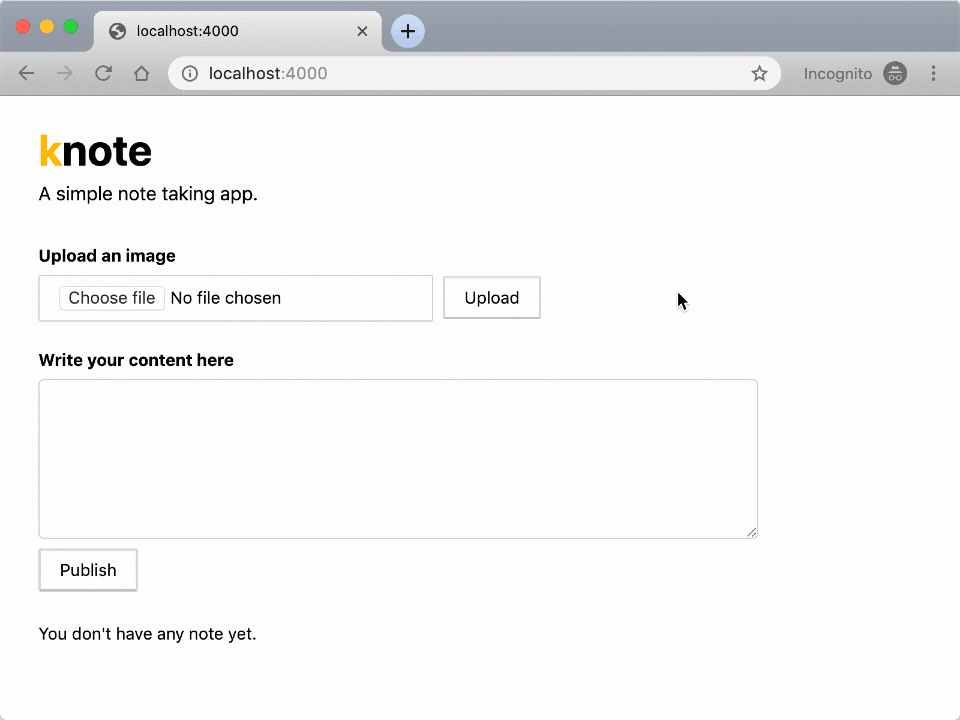

> **TL;DR:** In this guide you will launch a local Kubernetes cluster, develop an app using the Spring Boot framework and deploy it as a container in Kubernetes.

Learning how to design and architect applications that leverage Kubernetes is the most valuable skill that you could learn to be successful in deploying and scaling in the cloud.

In this guide, you will develop a small application for note-taking similar to [Evernote](https://evernote.com/) and [Google Keep](https://www.google.com/keep/).

The app lets you:

1. record notes and
1. attach images to your notes

Notes aren't lost when the app is killed or stopped.

So you will use a database to store the content.

Here is how the app looks like:



The app is available [in this repository](https://github.com/learnk8s/knote-js/tree/master/01).

Go and check out the code with:

```terminal|command=1,2|title=bash
git clone https://github.com/learnk8s/knote-js
cd knote-js/01
```

You should launch and test the app locally.

You can install and start it with:

```terminal|command=1,2|title=bash
npm install
node index.js
```

You can visit the app on <http://localhost:3000>.

Try to upload a picture — you should see a link inserted in the text box.

And when you publish the note, the picture should be displayed in the rendered note.

There're a couple of code choices worth discussing.

## Standard Express.js stack

[Express](https://expressjs.com/) and [Pug](https://pugjs.org/api/getting-started.html) are two popular choices when it comes to web servers and templating engines in Node.js.

The note taking app uses both as well as [Multer](https://github.com/expressjs/multer), a middleware for multi-part form data, to handle the uploaded data.

Since your are probably familiar with Express.js and Pug already, let's focus on Multer.

When you create a note with an attachment and click on "Publish", the form submits to the content of the note and the attachment to the `/note` route.

The route is handled in Express as follows:

```js|highlight=5|title=index.js
async function start() {
  // ...
  app.post('/note', multer({ dest: path.join(__dirname, 'public/uploads/') }).single('image'), async (req, res) => {
    if (!req.body.upload && req.body.description) {
      await saveNote(db, { description: req.body.description })
      res.redirect('/')
    } else if (req.body.upload && req.file) {
      const link = `/uploads/${encodeURIComponent(req.file.filename)}`
      res.render('index', {
        content: `${req.body.description} `,
        notes: await retrieveNotes(db),
      })
    }
  })
  // ...
}
```

The above handler calls:

- the Multer middleware to upload the picture in the `public/uploads` folder
- the `saveNote` function with the content of the text box, which causes the note to be saved in the database.

## Connecting a database

The database stores the notes.

_What database should you use? MySQL? Redis? Oracle?_

[MongoDB](https://www.mongodb.com/) is well-suited for your note-taking application because it's easy to set up and doesn't introduce the overhead of a relational database.

Now your code should connect to MongoDB.

**You have to consider something important here.**

_When the app starts, it shouldn't crash because the database isn't ready._

Instead, the app should keep retrying to connect to the database until it succeeds.

_Kubernetes expects that application components can be started in any order._

If you pay attention to the `index.js` file you should notice the following lines of code:

```js|title=index.js
async function initMongo() {
  console.log('Initialising MongoDB...')
  let success = false
  while (!success) {
    try {
      client = await MongoClient.connect(mongoURL, { useNewUrlParser: true })
      success = true
    } catch {
      console.log('Error connecting to MongoDB, retrying in 1 second')
      await new Promise(resolve => setTimeout(resolve, 1000))
    }
  }
  console.log('MongoDB initialised')
  return client.db(client.s.options.dbName).collection('notes')
}
```

This function keeps trying to connect to a MongoDB database at the given URL until the connection succeeds.

It then connects to a database and creates a collection called `notes`.

## Packaging the app as a container

In this part you will package and run the application using Linux (and Docker) containers.

Linux containers are a clever mechanism to encapsulate apps with all of their dependencies into a single archive.

To run the app, you only need the archive.

With Linux containers, you can start the application even if you don't have Node.js installed.

Let's see how it works.

First of all, you have to install the Docker Community Edition (CE).

You can follow the instructions in the [official Docker documentation](https://docs.docker.com/install/).

> If you're on Windows, you can [follow our handy guide on how to install Docker on Windows](https://learnk8s.io/blog/installing-docker-and-kubernetes-on-windows/).

You can verify that Docker is installed correctly with the following command:

```terminal|command=1|title=bash
docker run hello-world

Hello from Docker!
This message shows that your installation appears to be working correctly.
```

**You're now ready to build Docker containers.**

Docker containers are built from `Dockerfile`s.

A Dockerfile is like a recipe — it defines what goes in a container.

A Dockerfile consists of a sequence of commands.

You can find the full list of commands in the [Dockerfile reference](https://docs.docker.com/engine/reference/builder/).

Here is a Dockerfile that packages your app into a container image:

```docker|title=Dockerfile
FROM node:12.0-slim
COPY . .
RUN npm install
CMD [ "node", "index.js" ]
```

Go on and save this as `Dockerfile` in the root directory of your app.

The above Dockerfile includes the following commands:

- [`FROM`](https://docs.docker.com/engine/reference/builder/#from) defines the base layer for the container, in this case, a version of Ubuntu with Node.js installed
- [`COPY`](https://docs.docker.com/engine/reference/builder/#copy) copies the files of your app into the container
- [`RUN`](https://docs.docker.com/engine/reference/builder/#run) executes `npm install` inside the container
- [`CMD`](https://docs.docker.com/engine/reference/builder/#cmd) defines the command that should be executed when the container starts

You can now build a container image from your app with the following command:

```terminal|command=1|title=bash
docker build -t knote .
```

Note the following about this command:

- `-t knote` defines the name ("tag") of your container — in this case, your container is just called `knote`
- `.` is the location of the Dockerfile and application code — in this case, it's the current directory

The command executes the steps outlined in the `Dockerfile`, one by one:

```animation
{
  "description": "Layers in Docker images",
  "animation": "layers.svg",
  "fallback": "layers-fallback.svg"
}
```

**The output is a Docker image.**

_What is a Docker image?_

A Docker image is an archive containing all the files that are packaged in a container.

You can create many Docker containers from the same Docker image:

```animation
{
  "description": "Relationship between Dockerfiles, images and containers",
  "animation": "dockerfile-image-container.svg",
  "fallback": "docker-image-container-fallback.svg"
}
```

> Don't believe that Docker images are archives? Save the image locally with `docker save knote > knote.tar` and inspect it.

You can list all the images on your system with the following command:

```terminal|command=1|title=bash
docker images
REPOSITORY    TAG         IMAGE ID         CREATED            SIZE
knote         latest      dc2a8fd35e2e     30 seconds ago     165MB
node          12-slim     d9bfca6c7741     2 weeks ago        150MB
```

You should see the `knote` image that you built.

You should also see the `node:12-slim` which is the base layer of your `knote` image — it is just an ordinary image as well, and the `docker run` command downloaded it automatically from Docker Hub.

> Docker Hub is a container registry — a place to distribute and share container images.

_You packaged your app as a Docker image — let's run it as a container._

## Running the container

Remember that your app requires a MongoDB database.

If you tried to run the app locally, you might have realised that you needed MongoDB.

So you installed MongoDB on your machine and ran it with the `mongod` command.

You could do the same now, but without installing MongoDB.

_But guess what: you can run MongoDB as a container too._

MongoDB is provided as a Docker image named [`mongo`](https://hub.docker.com/_/mongo?tab=description) on Docker Hub.

_You can run MongoDB without actually "installing" it on your machine._

You can run it with `docker run mongo`.

**But before you do that, you need to connect the containers.**

The `knote` and `mongo` cointainers should communicate with each other, but they can do so only if they are on the same [Docker network](https://docs.docker.com/network/).

So, create a new Docker network as follows:

```terminal|command=1|title=bash
docker network create knote
```

**Now you can run MongoDB with:**

```terminal|command=1-4|title=bash
docker run \
  --name=mongo \
  --rm \
  --network=knote mongo
```

Note the following about this command:

- `--name` defines the name for the container — if you don't specify a name explicitly, then a name is generated automatically
- `--rm` automatically cleans up the container and removes the file system when the container exits
- `--network` represents the Docker network in which the container should run — when omitted, the container runs in the default network
- `mongo` is the name of the Docker image that you want to run

Note that the `docker run` command automatically downloads the `mongo` image from Docker Hub if it's not yet present on your machine.

MongoDB is now running.

**Now you can run your app as follows:**

```terminal|command=1-7|title=bash
docker run \
  --name=knote \
  --rm \
  --network=knote \
  -p 3000:3000 \
  -e MONGO_URL=mongodb://mongo:27017/dev \
  knote
```

Note the following about this command:

- `--name` defines the name for the container
- `--rm` automatically cleans up the container and removes the file system when the container exits
- `--network` represents the Docker network in which the container should run
- `-p 3000:3000` publishes port 3000 of the container to port 3000 of your local machine. That means, if you now access port 3000 on your computer, the request is forwarded to port 3000 of the Knote container. You can use the forwarding to access the app from your local machine.
- `-e` sets an environment variable inside the container

Regarding the last point, remember that your app reads the URL of the MongoDB server to connect to from the `MONGO_URL` environment variable.

If you look closely at the value of `MONGO_URL`, you see that the hostname is `mongo`.

_Why is it `mongo` and not an IP address?_

`mongo` is precisely the name that you gave to the MongoDB container with the `--name=mongo` flag.

If you named your MongoDB container `foo`, then you would need to change the value of `MONGO_URL` to `mongodb://foo:27017`.

**Containers in the same Docker network can talk to each other by their names.**

This is made possible by a built-in DNS mechanism.

_You should now have two containers running on your machine, `knote` and `mongo`._

You can display all running containers with the following command:

```terminal|command=1|title=bash
docker ps
CONTAINER ID    IMAGE    COMMAND                  PORTS                    NAMES
2fc0a10bf0f1    knote    "node index.js"          0.0.0.0:3001->3000/tcp   knote
41b50740a920    mongo    "docker-entrypoint.s…"   27017/tcp                mongo
```

Great!

_It's time to test your application!_

Since you published port 3000 of your container to port 3000 of your local machine, your app is accessible on <http://localhost:3000>.

Go on and open the URL in your web browser.

**You should see your app!**

Verify that everything works as expected by creating some notes with pictures.

When you're done experimenting, stop and remove the containers as follows:

```terminal|command=1,2|title=bash
docker stop mongo knote
docker rm mongo knote
```

## Uploading the container image to a container registry

Imagine you want to share your app with a friend — how would you go about sharing your container image?

Sure, you could save the image to disk and send it to your friend.

_But there is a better way._

When you ran the MongoDB container, you specified its Docker Hub ID (`mongo`), and Docker automatically downloaded the image.

_You could create your images and upload them to DockerHub._

If your friend doesn't have the image locally, Docker automatically pulls the image from DockerHub.

> There exist other public container registries, such as [Quay](https://quay.io/) — however, Docker Hub is the default registry used by Docker.

**To use Docker Hub, you first have to [create a Docker ID](https://hub.docker.com/signup).**

A Docker ID is your Docker Hub username.

Once you have your Docker ID, you have to authorise Docker to connect to the Docker Hub account:

```terminal|command=1|title=bash
docker login
```

Before you can upload your image, there is one last thing to do.

**Images uploaded to Docker Hub must have a name of the form `username/image:tag`:**

- `username` is your Docker ID
- `image` is the name of the image
- `tag` is an optional additional attribute — often it is used to indicate the version of the image

To rename your image according to this format, run the following command:

```terminal|command=1|title=bash
docker tag knote <username>/knote-js:1.0.0
```

> Please replace `<username>` with your Docker ID.

**Now you can upload your image to Docker Hub:**

```terminal|command=1|title=bash
docker push <username>/knote-js:1.0.0
```

Your image is now publicly available as `<username>/knote-js:1.0.0` on Docker Hub and everybody can download and run it.

To verify this, you can re-run your app, but this time using the new image name.

> Please notice that the command below runs the `learnk8s/knote-js:1.0.0` image. If you wish to use yours, replace `learnk8s` with your Docker ID.

```terminal|command=1-5,6-12|title=bash
docker run \
  --name=mongo \
  --rm \
  --network=knote \
  mongo
docker run \
  --name=knote \
  --rm \
  --network=knote \
  -p 3000:3000 \
  -e MONGO_URL=mongodb://mongo:27017/dev \
  learnk8s/knote-js:1.0.0
```

Everything should work exactly as before.

**Note that now everybody in the world can run your application by executing the above two commands.**

And the app will run on their machine precisely as it runs on yours — without installing any dependencies.

_This is the power of containerisation!_

Once you're done testing your app, you can stop and remove the containers with:

```terminal|command=1,2|title=bash
docker stop mongo knote
docker rm mongo knote
```

Packaging processes and apps as containers sets your free from setting up the right environment before you launch it.

The next logical step is to deploy your container.

## Deploying at scale

There're several services where you can deploy Docker containers, for example, [AWS Elastic Beanstalk](https://aws.amazon.com/elasticbeanstalk/) or [Azure App Service](https://azure.microsoft.com/en-in/services/app-service/).

Those services are excellent if you wish to deploy a single or a small number of containers.

However, when you're building production-grade applications, it's common to have a large number of components that are all connected.

This is especially true if you follow the [microservices](https://microservices.io/) pattern.

Each component, or "microservice", should be scalable independently.

Solutions such as AWS Elastic Beanstalk and Azure App Service aren't designed to run those kinds of workloads.

_So how do you run complex containerised applications?_

With Kubernetes.

## Kubernetes — the container orchestrators

Container orchestrators are designed to run complex applications with large numbers of scalable components.

They work by inspecting the underlying infrastructure and determining the best server to run each container.

They can scale to thousands of computers and tens of thousands of containers and still work efficiently and reliably.

You can imagine a container orchestrator as a highly-skilled Tetris player.

Containers are the blocks, servers are the boards, and the container orchestrator is the player.

```animation
{
  "description": "Kubernetes is the best tetris player",
  "animation": "tetris.svg",
  "fallback": "tetris-fallback.svg"
}
```

A few key points to remember about Kubernetes. It's:

1. **Open-source:** you can download and use it without paying any fee. You're also encouraged to contribute to the official project with bug fixes and new features
1. **Battle-tested:** there're plenty of examples of companies running it in production. There's even [a website where you can learn from the mistake of others](https://k8s.af/).
1. **Well-looked-after:** Redhat, Google, Microsoft, IBM, Cisco are only a few of the companies that have heavily invested in the future of Kubernetes by creating managed services, contributing to upstream development and offering training and consulting.

Kubernetes is an excellent choice to deploy your containerised application.

_But how do you do that?_

It all starts by creating a Kubernetes cluster.

## Creating a local Kubernetes cluster

There are several ways to create a Kubernetes cluster:

- Using a managed Kubernetes service like [Google Kubernetes Service (GKE)](https://cloud.google.com/kubernetes-engine/), [Azure Kubernetes Service (AKS)](https://docs.microsoft.com/en-us/azure/aks/), or [Amazon Elastic Kubernetes Service (EKS)](https://aws.amazon.com/eks/)
- Installing Kubernetes yourself on cloud or on-premises infrastructure with a Kubernetes installation tool like [kubeadm](https://kubernetes.io/docs/setup/production-environment/tools/kubeadm/create-cluster-kubeadm/) or [kops](https://github.com/kubernetes/kops)
- Creating a Kubernetes cluster on your local machine with a tool like [Minikube](https://kubernetes.io/docs/setup/learning-environment/minikube/), [MicroK8s](https://microk8s.io/), or [k3s](https://k3s.io/)

**In this section, you are going to use Minikube.**

Minikube creates a single-node Kubernetes cluster running in a virtual machine.

> A Minikube cluster is only intended for testing purposes, not for production. Later in this course, you will create an Amazon EKS cluster, which is suited for production.

**Before you install Minikube, you have to [install kubectl](https://kubernetes.io/docs/tasks/tools/install-kubectl/).**

kubectl is the primary Kubernetes CLI — you use it for all interactions with a Kubernetes cluster, no matter how the cluster was created.

**Once kubectl is installed, go on and install Minikube according to the [official documentation](https://kubernetes.io/docs/tasks/tools/install-minikube/).**

> If you're on Windows, you can [follow our handy guide on how to install Minikube on Windows](https://learnk8s.io/blog/installing-docker-and-kubernetes-on-windows/).

With Minikube installed, you can create a cluster as follows:

```terminal|command=1|title=bash
minikube start
```

The command creates a virtual machine and installs Kubernetes.

_Starting the virtual machine and cluster may take a couple of minutes, so please be patient!_

When the command completes, you can verify that the cluster is created with:

```terminal|command=1|title=bash
kubectl cluster-info
```

You have a fully-functioning Kubernetes cluster on your machine now.

_Time to learn about some fundamental Kubernetes concepts._

## Kubernetes resources

**Kubernetes has a declarative interface.**

In other words, you describe how you want the deployment of your application to look like, and Kubernetes figures out the necessary steps to reach this state.

The "language" that you use to communciate with Kubernetes consists of so-called Kubernetes resources.

There are many different Kubernetes resources — each is responsible for a specific aspect of your application.

> You can find the full list of Kubernetes resources in the [Kubernetes API reference](https://kubernetes.io/docs/reference/generated/kubernetes-api/v1.15/).

Kubernetes resources are defined in YAML files and submitted to the cluster through the Kubernetes HTTP API.

> Kubernetes resource definitions are also sometimes called "resource manifests" or "resource configurations".

As soon as Kubernetes receives your resource definitions, it takes the necessary steps to reach the target state.

Similarly, to query the state of your applications, you retrieve Kubernetes resources through the Kubernetes HTTP API.

In practice, you do all these interactions with kubectl - your primary client for the Kubernetes API.

In the remainder of this section, you will define a set of Kubernetes resources that describe your Knote application, and in the end, you will submit them to your Kubernets cluster.

The resources that you will use are the [Deployment](https://kubernetes.io/docs/reference/generated/kubernetes-api/v1.15/#deployment-v1-apps) and the [Service](https://kubernetes.io/docs/reference/generated/kubernetes-api/v1.15/#service-v1-core).

_Let's start with the Deployment._

## Defining a Deployment

First of all, create a folder named `kube` in your application directory:

```terminal|command=1|title=bash
mkdir kube
```

The purpose of this folder is to hold all the Kubernetes YAML files that you will create.

> It's a [best practice](https://kubernetes.io/docs/concepts/cluster-administration/manage-deployment/#organizing-resource-configurations) to group all resource definitions for an application in the same folder because this allows to submit them to the cluster with a single command.

The first Kubernetes resource is a [Deployment](https://kubernetes.io/docs/reference/generated/kubernetes-api/v1.15/#deployment-v1-apps).

A Deployment creates and runs containers and keeps them alive.

Here is the definition of a Deployment for your Knote app:

```yaml|title=kube/knote.yaml
apiVersion: apps/v1
kind: Deployment
metadata:
  name: knote
spec:
  replicas: 1
  selector:
    matchLabels:
      app: knote
  template:
    metadata:
      labels:
        app: knote
    spec:
      containers:
        - name: app
          image: learnk8s/knote-js:1.0.0
          ports:
            - containerPort: 3000
          env:
            - name: MONGO_URL
              value: mongodb://mongo:27017/dev
          imagePullPolicy: Always
```

_That looks complicated, but we will break it down and explain it in detail._

For now, save the above content in a file named `knote.yaml` in the `kube` folder.

> Please notice that the command below runs the `learnk8s/knote-js:1.0.0` image. If you wish to use yours, replace `learnk8s` with your Docker ID.

**You must be wondering how you can you find out about the structure of a Kubernetes resource.**

The answer is, in the [Kubernetes API reference](https://kubernetes.io/docs/reference/generated/kubernetes-api/v1.15/).

The Kubernetes API reference contains the specification for every Kubernetes resource, including all the available fields, their data types, default values, required fields, and so on.

Here is the specification of the [Deployment](https://kubernetes.io/docs/reference/generated/kubernetes-api/v1.15/#deployment-v1-apps) resource.

_If you prefer to work in the command-line, there's an even better way._

The `kubectl explain` command can print the specification of every Kubernetes resource directly in your terminal:

```terminal|command=1|title=bash
kubectl explain deployment
```

The command outputs exactly the same information as the web-based API reference.

To drill down to a specific field use:

```terminal|command=1|title=bash
kubectl explain deployment.spec.replicas
```

**Now that you know how to look up the documentation of Kubernetes resources, let's turn back to the Deployment.**

The first four lines define the type of resource (Deployment), the version of this resource type (`apps/v1`), and the name of this specific resource (`knote`):

```yaml|highlight=1-4|title=kube/knote.yaml
apiVersion: apps/v1
kind: Deployment
metadata:
  name: knote
spec:
  replicas: 1
  selector:
    matchLabels:
      app: knote
  template:
    metadata:
      labels:
        app: knote
    spec:
      containers:
        - name: knote
          image: learnk8s/knote-js:1.0.0
          ports:
            - containerPort: 3000
          env:
            - name: MONGO_URL
              value: mongodb://mongo:27017/dev
          imagePullPolicy: Always
```

Next, you have the desired number of replicas of your container:

```yaml|highlight=6|title=kube/knote.yaml
apiVersion: apps/v1
kind: Deployment
metadata:
  name: knote
spec:
  replicas: 1
  selector:
    matchLabels:
      app: knote
  template:
    metadata:
      labels:
        app: knote
    spec:
      containers:
        - name: knote
          image: learnk8s/knote-js:1.0.0
          ports:
            - containerPort: 3000
          env:
            - name: MONGO_URL
              value: mongodb://mongo:27017/dev
          imagePullPolicy: Always
```

You don't usually talk about containers in Kubernetes.

Instead, you talk about Pods.

**What is a Pod?**

A Pod is a wrapper around one or more containers.

Most often, a Pod contains only a single container — however, for advanced use cases, a Pod may contain multiple containers.

If a Pod contains multiple containers, they are treated by Kubernetes as a unit — for example, they are started and stopped together and executed on the same node.

_A Pod is the smallest unit of deployment in Kubernetes — you never work with containers directly, but with Pods that wrap containers._

Technically, a [Pod](https://kubernetes.io/docs/reference/generated/kubernetes-api/v1.15/#pod-v1-core) is a Kubernetes resource, like a Deployment or Service.

**Let's turn back to the Deployment resource.**

The next part ties together the Deployment resource with the Pod replicas:

```yaml|highlight=7-13|title=kube/knote.yaml
apiVersion: apps/v1
kind: Deployment
metadata:
  name: knote
spec:
  replicas: 1
  selector:
    matchLabels:
      app: knote
  template:
    metadata:
      labels:
        app: knote
    spec:
      containers:
        - name: knote
          image: learnk8s/knote-js:1.0.0
          ports:
            - containerPort: 3000
          env:
            - name: MONGO_URL
              value: mongodb://mongo:27017/dev
          imagePullPolicy: Always
```

The `template.metadata.labels` field defines a label for the Pods that wrap your Knote container (`app: knote`).

The `selector.matchLabels` field selects those Pods with a `app: knote` label to belong to this Deployment resource.

> Note that there must be at least one shared label between these two fields.

The next part in the Deployment defines the actual container that you want to run:

```yaml|highlight=15-23|title=kube/knote.yaml
apiVersion: apps/v1
kind: Deployment
metadata:
  name: knote
spec:
  replicas: 1
  selector:
    matchLabels:
      app: knote
  template:
    metadata:
      labels:
        app: knote
    spec:
      containers:
        - name: knote
          image: learnk8s/knote-js:1.0.0
          ports:
            - containerPort: 3000
          env:
            - name: MONGO_URL
              value: mongodb://mongo:27017/dev
          imagePullPolicy: Always
```

It defines the following things:

- A name for the container (`knote`)
- The name of the Docker image (`learnk8s/knote-js:1.0.0` or `<username>/knote-js:1.0.0` if you're using your image)
- The port that the container listens on (3000)
- An environment variable (`MONGO_URL`) that will be made available to the process in the container

The above arguments should look familiar to you: you used similar ones when you ran your app with `docker run` in the [previous section](#running-the-container).

That's not a coincidence.

When you submit a Deployment resource to the cluster, you can imagine Kubernetes executing `docker run` and launching your container in one of the computers.

The container specification also defines an `imagePullPolicy` of `Always` — the instruction forces the Docker image to be downloaded, even if it was already downloaded.

A Deployment defines how to run an app in the cluster, but it doesn't make it available to other apps.

_To expose your app, you need a Service._

## Defining a Service

A Service resource makes Pods accessible to other Pods or users outside the cluster.

Without a Service, a Pod cannot be accessed at all.

A Service forwards requests to a set of Pods:


In this regard, a Service is akin to a load balancer.

Here is the definition of a Service that makes your Knote Pod accessible from outside the cluster:

```yaml|title=kube/knote.yaml
apiVersion: v1
kind: Service
metadata:
  name: knote
spec:
  selector:
    app: knote
  ports:
    - port: 80
      targetPort: 3000
  type: LoadBalancer
```

> Again, to find out about the available fields of a Service, look it up [in the API reference](https://kubernetes.io/docs/reference/generated/kubernetes-api/v1.15/#service-v1-core), or, even better, use `kubectl explain service`.

**Let's break down the Service resource.**

It consists of three crucial parts.

The first part is the selector:

```yaml|highlight=6-7|title=kube/knote.yaml
apiVersion: v1
kind: Service
metadata:
  name: knote
spec:
  selector:
    app: knote
  ports:
    - port: 80
      targetPort: 3000
  type: LoadBalancer
```

It selects the Pods to expose according to their labels.

In this case, all Pods that have a label of `app: knote` will be exposed by the Service.

Note how this label corresponds exactly to what you specified for the Pods in the Deployment resource:

```yaml|highlight=10|title=kube/knote.yaml
apiVersion: apps/v1
kind: Deployment
metadata:
  name: knote
spec:
  # ...
  template:
    metadata:
      labels:
        app: knote
    # ...
```

It is this label that ties your Service to your Deployment resource.

The next important part is the port:

```yaml|highlight=8-10|title=kube/knote.yaml
apiVersion: v1
kind: Service
metadata:
  name: knote
spec:
  selector:
    app: knote
  ports:
    - port: 80
      targetPort: 3000
  type: LoadBalancer
```

In this case, the Service listens for requests on port 80 and forwards them to port 3000 of the target Pods:


The last important part is the type of the Service:

```yaml|highlight=11|title=kube/knote.yaml
apiVersion: v1
kind: Service
metadata:
  name: knote
spec:
  selector:
    app: knote
  ports:
    - port: 80
      targetPort: 3000
  type: LoadBalancer
```

In this case, the type is `LoadBalancer`, which makes the exposed Pods accessible from outside the cluster.

The default Service type is `ClusterIP`, which makes the exposed Pods only accessible from within the cluster.

> **Pro tip:** find out about all available Service types with `kubectl explain service.spec.type`.

Beyond exposing your containers, a Service also ensures continuous availability for your app.

If one of the Pod crashes and is restarted, the Service makes sure not to route traffic to this container until it is ready again.

Also, when the Pod is restarted, and a new IP address is assigned, the Service automatically handles the update too.

```animation
{
  "description": "A load balancer can remove the need of keeping track of IP addresses",
  "animation": "service-come-and-go.svg",
  "fallback": "service-come-and-go-fallback.svg"
}
```

Furthermore, if you decide to scale your Deployment to 2, 3, 4, or 100 replicas, the Service keeps track of all of these Pods.

This completes the description of your app — a Deployment and Service is all you need.

_You need to do the same thing for the database component now._

## Defining the database tier

In principle, a MongoDB Pod can be deployed similarly as your app — that is, by defining a Deployment and Service resource.

However, deploying MongoDB needs some additional configuration.

**MongoDB requires a persistent storage.**

This storage must not be affected by whatever happens to the MongoDB Pod.

_If the MongoDB Pod is deleted, the storage must persist — if the MongoDB Pod is moved to another node, the storage must persist._

There exists a Kubernetes resource that allows obtaining persistent storage volume: the [PersistentVolumeClaim](https://kubernetes.io/docs/reference/generated/kubernetes-api/v1.15/#persistentvolumeclaim-v1-core).

Consequently, the description of your database component should consist of three resource definitions:

- PersistentVolumeClaim
- Service
- Deployment

Here's the complete configuration:

```yaml|title=kube/mongo.yaml
apiVersion: v1
kind: PersistentVolumeClaim
metadata:
  name: mongo-pvc
spec:
  accessModes:
    - ReadWriteOnce
  resources:
    requests:
      storage: 256Mi
---
apiVersion: v1
kind: Service
metadata:
  name: mongo
spec:
  selector:
    app: mongo
  ports:
    - port: 27017
      targetPort: 27017
---
apiVersion: apps/v1
kind: Deployment
metadata:
  name: mongo
spec:
  selector:
    matchLabels:
      app: mongo
  template:
    metadata:
      labels:
        app: mongo
    spec:
      containers:
        - name: mongo
          image: mongo
          ports:
            - containerPort: 27017
          volumeMounts:
            - name: storage
              mountPath: /data/db
      volumes:
        - name: storage
          persistentVolumeClaim:
            claimName: mongo-pvc
```

Please save this YAML definition in a file named `mongo.yaml` in the `kube` directory.

Let's look at each of the three parts of the definition.

**PersistentVolumeClaim**

The PersistentVolumeClaim requests a persistent storage volume of 256 MB.

This volume is made available to the MongoDB container to save its data.

**Service**

The Service is similar to the Service you defined for the app component.

However, note that it does not have a `type` field.

If a Service does not have a `type` field, Kubernetes assigns it the default type `ClusterIP`.

`ClusterIP` makes the Pod accessible from within the cluster, but not from outside — this is fine because the only entity that has to access the MongoDB Pod is your app.

**Deployment**

The Deployment has a similar structure to the other Deployment.

However, it contains an additional field that you haven't seen yet: `volumes`.

The `volumes` field defines a storage volume named `storage`, which references the PersistentVolumeClaim.

Furthermore, the volume is referenced from the `volumeMounts` field in the definition of the MongoDB container.

The `volumeMount` field mounts the referenced volume at the specified path in the container, which in this case is `/data/db`.

And `/data/db` is where MongoDB saves its data.

In other words, the MongoDB database data is stored in a persistent storage volume that has a lifecycle independent of the MongoDB container.

> Deploying stateful applications to Kubernetes is a complex but essential topic. You can learn more about it in Managing State module of the [Learnk8s Academy](https://learnk8s.io/academy).

**There's one more important thing to note.**

Do you remember the value of the `MONGO_URL` environment variable in the Knote Deployment?

It is `mongodb://mongo:27017/dev`.

The hostname is `mongo`.

_Why is it `mongo`?_

Because the name of the MongoDB Service is `mongo`.

If you named your MongoDB service `foo`, then you would need to change the value of the `MONGO_URL` variable to `monogdb://foo:27017`.

Service discovery is a critical Kubernetes concept.

**Pods within a cluster can talk to each other through the names of the Services exposing them.**

Kubernetes has an internal DNS system that keeps track of domain names and IP addresses.

Similarly to how Docker provides DNS resolution for containers, Kubernetes provides DNS resolution for Services.

_All components of your app are described by Kubernetes resources now — let's deploy them to the cluster._

## Deploying the application

So far, you created a few YAML files with resource definitions.

_You didn't yet touch the cluster._

**But now comes the big moment!**

You are going to submit your resource definitions to Kubernetes.

And Kubernetes will bring your application to life.

First of all, make sure that you have a `knote.yaml` and `mongo.yaml` file inside the `kube` directory:

```terminal|command=1|title=bash
tree .
kube/
├── knote.yaml
└── mongo.yaml
```

> You can find these files also in [this repository](https://github.com/learnk8s/knote-js/tree/master/03).

Also, make sure that your Minikube cluster is running:

```terminal|command=1|title=bash
minikube status
```

Then submit your resource definitions to Kubernetes with the following command:

```terminal|command=1|title=bash
kubectl apply -f kube
```

This command submits all the YAML files in the `kube` directory to Kubernetes.

> The `-f` flag accepts either a single filename or a directory. In the latter case, all YAML files in the directory are submitted.

As soon as Kubernetes receives your resources, it creates the Pods.

You can watch your Pods coming alive with:

```terminal|command=1|title=bash
kubectl get pods --watch
```

You should see two Pods transitioning from _Pending_ to _ContainerCreating_ to _Running_.

These Pods correspond to the Knote and MongoDB containers.

_As soon as both Pods are in the Running state, your application is ready._

You can now access your application through the `knote` Service.

In Minikube, a Service can be accessed with the following command:

```terminal|command=1|title=bash
minikube service knote
```

The command should open the URL of the `knote` Service in a web browser.

**You should see your application.**

Verify that your app works as expected by creating some notes with pictures.

The app should work as it did when you ran it locally with Docker.

_But now it's running on Kubernetes._

## Scaling your app

Kubernetes makes it very easy to increase the number of replicas to 2 or more:

```terminal|command=1|title=bash
kubectl scale --replicas=2 deployment/knote
```

You can watch how a new Pod is created with:

```terminal|command=1|title=bash
kubectl get pods -l app=knote --watch
```

> The `-l` flag restricts the output to only those Pods with a `app=knote` label.

There are now two replicas of the Knote Pod running.

_Did it work?_

Reaccess your app:

```terminal|command=1|title=bash
minikube service knote
```

And create a note with a picture.

Now try to reload your app a couple of times (i.e. hit your browser's reload button).

_Did you notice any glitch?_

**The picture that you added to your note is not displayed on every reload.**

If you pay attention, the picture is only displayed on every second reload, on average.

_Why is that?_

Remember that your application saves uploaded pictures in the local file system.

If your app runs in a container, then pictures are saved within the container's file system.

When you had only a single Pod, this was fine.

But since you have two replicas, there's an issue.

The picture that you previously uploaded is saved in only one of the two Pods.

When you access your app, the `knote` Service selects one of the available Pods.

When it selects the Pod that has the picture in its file system, the image is displayed.

But when it selects the other Pod, the picture isn't displayed, because the container doesn't have it.

```animation
{
  "description": "Uploading files inside the app makes it stateful",
  "animation": "stateful.svg",
  "fallback": "stateful-fallback.svg"
}
```

**Your application is stateful.**

The pictures in the local filesystem constitute a state that is local to each container.

**To be scalable, applications must be stateless.**

Stateless means that an instance can be killed restarted or duplicated at any time without any data loss or inconsistent behaviour.

_You must make your app stateless before you can scale it._

_How do you refactor your app to make it stateless?_

## Making the app stateless and next steps

So far you've learnt how to:

1. develop a note taking applicaiton that stores notes in MongoDB
1. packaged it as a Docker container
1. deployed it in a local Kubernetes cluster

The next steps are:

1. refactoring the app to make it stateless
1. deploying the same app in the cloud

This guide in a excerpt of the [Learnk8s Academy — the online course designed to learn Kubernetes](/academy).
