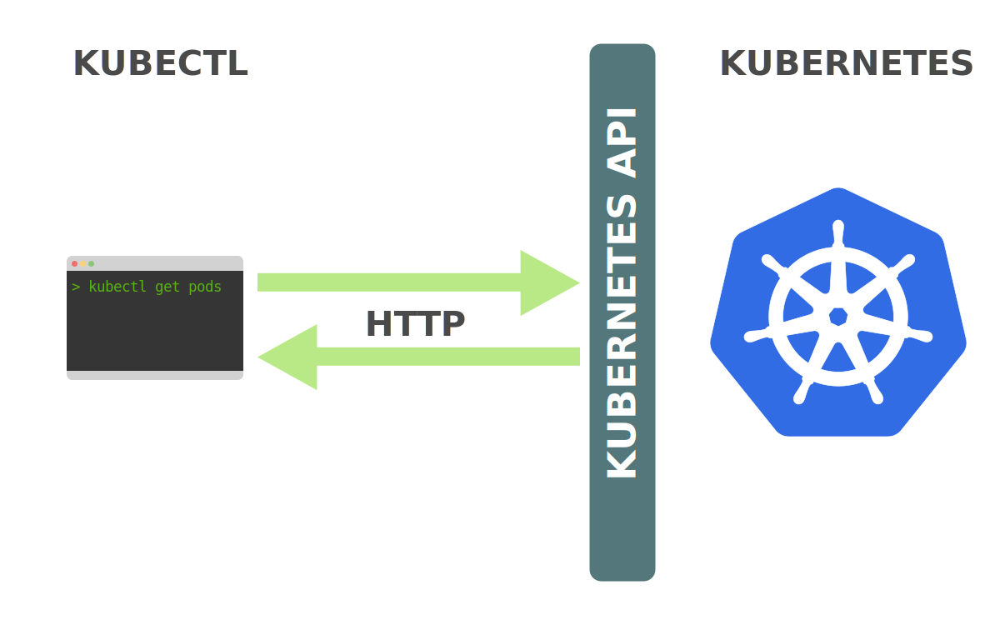
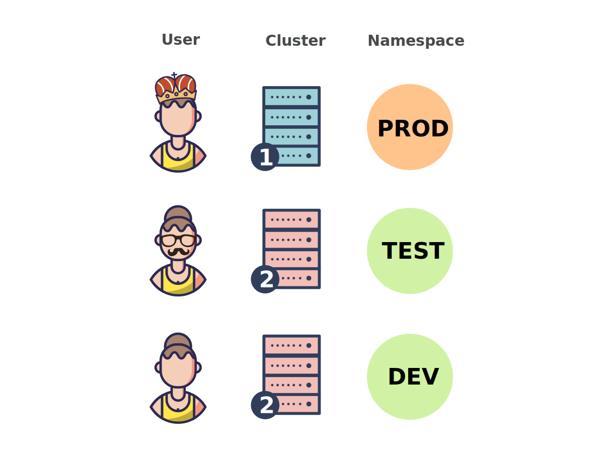
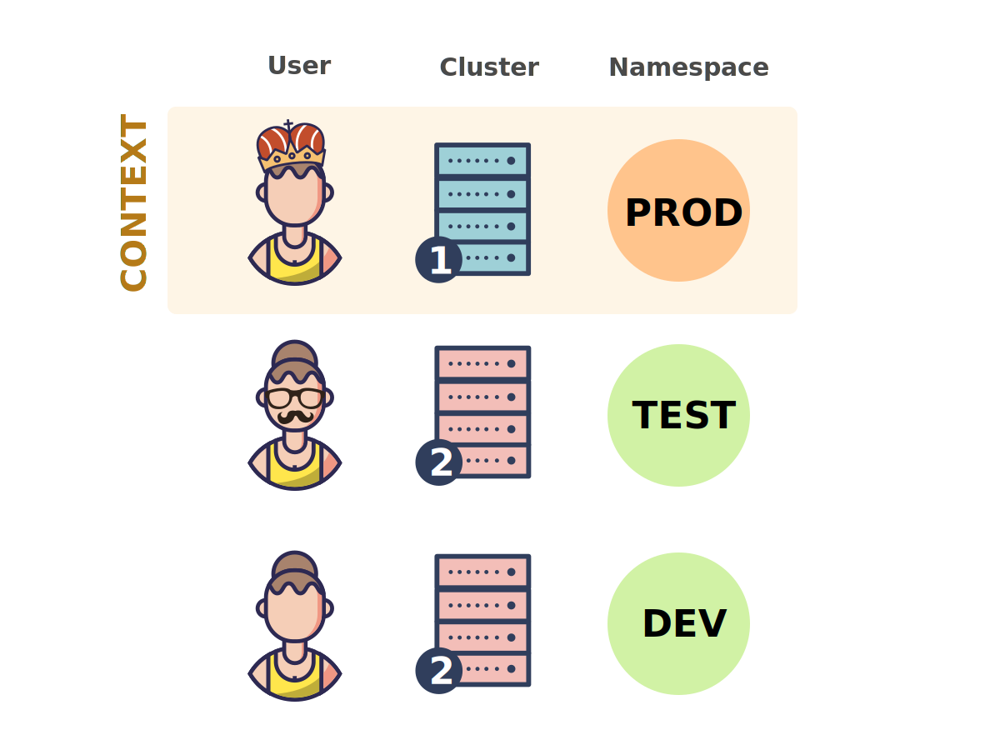
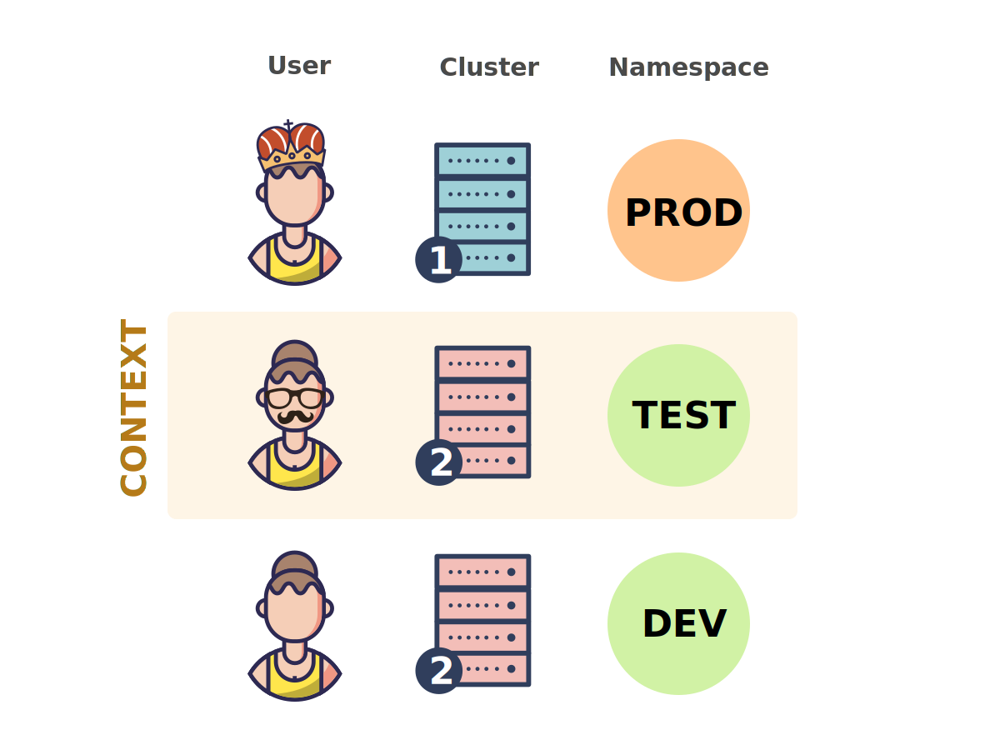
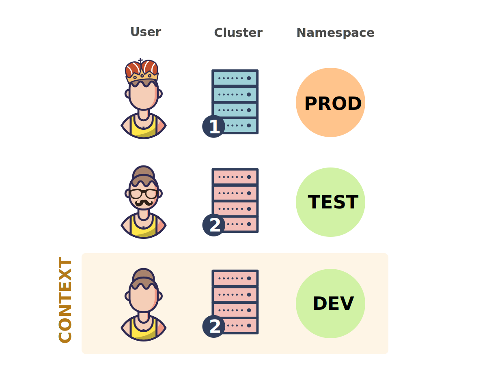

If you work with Kubernetes, you use kubectl. And you probably use it *a lot*. Whenever you spend a lot of time working with a tool, it is worth to get to know it very well and learn to use it as efficiently as possible.

This article contains a set of tips and tricks to make boost your kubectl productivity. At the same time, this article also aims at deepening your understanding of how various aspects of Kubernetes work.

The goal of this article is not only to make your daily work with Kubernetes more efficient, but also more enjoyable!

## Understanding kubectl

Before learning how to use kubectl more efficiently, you should have a basic understanding of what it actually is.

From a user's point of view, kubectl your cockpit to control Kubernetes. It allows you to perform every possible Kubernetes operation.

From a technical point of view, kubectl is a client for the **Kubernetes API**.

The Kubernetes API is an **HTTP REST API**. This API is the real Kubernetes **user interface**. Kubernetes is fully controlled through this API. This means that every Kubernetes operation is exposed as an API endpoint and can be executed by an HTTP request to this endpoint.

Consequently, the main job of kubectl is to carry out HTTP requests to the Kubernetes API:



> Kubernetes is fully **resource-centred**. That means, Kubernetes maintains an internal state of resources, and all Kubernetes operations are [**CRUD**](https://en.wikipedia.org/wiki/Create%2C_read%2C_update_and_delete) operations on these resources. You fully control Kubernetes through manipulation of these resources (and Kubernetes figures out what to do based on the current state of resources). For this reason, the Kubernetes [**API reference**](https://kubernetes.io/docs/reference/generated/kubernetes-api/v1.13/) is organised as a list of resource types with their associated operations.

Let's consider an example.

Imagine you want to create a [ReplicaSet](https://kubernetes.io/docs/reference/generated/kubernetes-api/v1.13/#replicaset-v1-apps) resource. To do so, you would define the ReplicaSet in the `replicaset.yaml` file, and then run the following command:

~~~bash
kubectl create -f replicaset.yaml
~~~

Obviously, this creates your ReplicaSet in Kubernetes. But what happens behind the scenes?

Kubernetes has a *create ReplicaSet* operation, and the API endpoint that exposes this operation is as follows:

~~~
POST /apis/apps/v1/namespaces/{namespace}/replicasets
~~~

> You can find the API endpoints of all Kubernetes operations in the [API reference](https://kubernetes.io/docs/reference/generated/kubernetes-api/v1.13) (including the [above endpoint](https://kubernetes.io/docs/reference/generated/kubernetes-api/v1.13/#create-replicaset-v1-apps)).

Thus, behind the scenes, the above kubectl command makes an HTTP POST request to the above endpoint, passing the ReplicaSet definition (the content of the `replicaset.yaml` file) in the request body.

This is how *all* kubectl command (that access the Kubernetes API) are implemented. They simply make HTTP requests to endopints of the Kubernetes API.

> It's totally possible to fully control Kubernetes with a tool like `curl` by manually issuing HTTP requests to the Kubernetes API. Kubectl just makes it easier for you to use the Kubernetes API.

These are the basics of what kubectl is. But there is much more about the Kubernetes API that every kubectl user should know. To this end, let's briefly dive into the Kubernetes internals.

<!--If you're very impatient, you can [jump to the next section →](#1-save-typing-with-command-completion)-->

### Kubernetes internals

Kubernetes consists of a set of independent components that run as separate processes on the nodes of a cluster. Each component has a very specific function, and some components run on the master nodes and others on the worker nodes.

The most important components on the master nodes are:

- **Storage backend:** stores resource definitions (usually [etcd](https://coreos.com/etcd/))
- **API server:** provides Kubernetes API and manages storage backend
- **Controller manager:** ensures resource statuses match specifications
- **Scheduler:** schedules Pods to worker nodes

And the most important component running on each worker node is:

- **kubelet:** manages execution of containers on a worker node

To see how these components work together, let's consider an example. Actually, let's just continue the ReplicaSet example from above.

Assume, you just executed `kubectl create -f replicaset.yaml`, upon which kubectl made an HTTP POST request to the [*create ReplicaSet* API endpoint](https://kubernetes.io/docs/reference/generated/kubernetes-api/v1.13/#create-replicaset-v1-apps).

What happens now?


```slideshow
{
  "description": "Walkthrough from the creation of a ReplicaSet to the execution of the containers on the worker nodes.",
  "slides": [
    {
      "image": "kubernetes-internals-1.svg",
      "description": "After running `kubectl create -f replicaset.yaml`, the API server saves you ReplicaSet resource definition in the storage backend."
    },
    {
      "image": "kubernetes-internals-2.svg",
      "description": "This triggers the ReplicaSet controller in the controller manager, who watches for creations, updates, and deletions of ReplicaSet resources."
    },
    {
      "image": "kubernetes-internals-3.svg",
      "description": "The ReplicaSet controller creates a Pod definition for each replica of the ReplicaSet (according to the Pod template in the ReplicaSet definition) and saves them in the storage backend."
    },
    {
      "image": "kubernetes-internals-4.svg",
      "description": "This triggers the scheduler who watches for Pods that have not yet been assigned to a worker node."
    },
    {
      "image": "kubernetes-internals-5.svg",
      "description": "The scheduler chooses a suitable worker node for each Pod and adds this information to the Pod definitions in the storage backend."
    },
    {
      "image": "kubernetes-internals-6.svg",
      "description": "This triggers the kubelet on the worker node that the Pods have been scheduled to, who watches for Pods that have been scheduled to its worker node."
    },
    {
      "image": "kubernetes-internals-7.svg",
      "description": "The kubelet reads the Pod definitions, downloads the required container images, and runs the containers via Docker (or another container runtime) on the worker node."
    }
  ]
}
```

The API request to the *create ReplicaSet* endpoint is handled by the **API server**. The API server authenticates the request and saves your ReplicaSet resource definition in the storage backend.

This event triggers the **ReplicaSet controller**, which is a sub-process of the **controller manager**. The ReplicaSet controller watches for creations, updates, and deletions of ReplicaSet resources in the storage backend, and gets notified by an event when this happens.

The job of the ReplicaSet controller is to make sure that the required number of replica Pods of a ReplicaSet exists. In our example, no Pods exist yet, so the ReplicaSet controller creates these Pod definitions (according to the Pod template in the ReplicaSet definition) and saves them in the storage backend.

The creation of the new Pods triggers the **scheduler**, which watches for Pod definitions that are not yet associated to a worker node. The scheduler chooses a suitable worker node for each Pod and updates the Pod definitions in the storage backend with this information.

> Note that up to this point, no workload code is being run anywhere on the infrastructure. All that has been done so far is creating and updating resources in the storage backend on the master node.

This event triggers the **kubelets** who watch for Pods that are scheduled to their worker nodes. The kubelet worker node your ReplicaSet Pods have been scheduled to, downloads the container images of these Pods (if not already present on the machine), and runs them with the configured container runtime (which may be Docker).

At this point, finally, your ReplicaSet application is running!

### The role of the Kubernetes API

As you can see from the above example, Kubernetes components (except the API server and the storage backend) work by watching for resource changes in the storage backend, and manipulating resources in the storage backend.

However, these components **do not** access the storage backend directly, but only **through the Kubernetes API**.

Consider the following examples:

- The ReplicaSet controller uses the [*list ReplicaSets*](https://kubernetes.io/docs/reference/generated/kubernetes-api/v1.13/#list-replicaset-v1-apps) API operation with a `watch` parameter for watching for changes to ReplicaSet resources.
- The ReplicaSet controller uses the [*create Pod*](https://kubernetes.io/docs/reference/generated/kubernetes-api/v1.13/#create-pod-v1-core) API operation for creating Pods.
- The scheduler uses the [*patch Pod*](https://kubernetes.io/docs/reference/generated/kubernetes-api/v1.13/#patch-pod-v1-core) API operation for updating Pods with the information of the worker nodes the Pods were scheduled to.

As you can see, this is the **same API that is also used by kubectl**.

This double usage of the Kubernetes API for internal components as well as for external users is a fundamental design concept of Kubernetes.

With this knowledge, you can create a model of how Kubernetes works:

- The storage backend stores the state (i.e. resources) of Kubernetes.
- The API server provides an interface to the storage backend in the form of the Kubernetes API.
- All other components, as well as external users, read, watch, and manipulate the state (i.e. resources) of Kubernetes through the Kubernetes API.

Being familiar with these concepts and the Kubernetes API **will help you a lot** to understand kubectl better and make the most use of it!

Let's now look at a series of concrete tips and tricks to help you boosting your kubectl productivity.

## 1. Save typing with command completion

One of the most useful, but often overlooked, tricks to boost your kubectl productivity is command completion.

This allows you to auto-complete command-line tokens for kubectl commands with the *Tab* key. These command-line tokens may be sub-commands, options, or arguments, including hard-to-type things like resource names.

Here you can see kubectl command completion in action:


Command completion is available for the [**Bash**](https://www.gnu.org/software/bash/) and [**Zsh**](https://www.zsh.org/) shells.

There are detailed instructions for setting up command completion in the [official documentation](https://kubernetes.io/docs/tasks/tools/install-kubectl/#enabling-shell-autocompletion), but below is a short recap.

### General notes

In general, command completion works by the means of **completion scripts**. A completion script is shell script that defines the completion behaviour for a specific command. Sourcing a completion script in your shell, enables command completion for the corresponding command.

Kubectl can conveniently print out its completion scripts for Bash and Zsh with the following commands:

~~~
kubectl completion bash
kubectl completion zsh
~~~

In principle, sourcing the output of these commands in the respective shells, enables kubectl command completion.

However, the details differ for Bash (including a difference between Linux and macOS) and Zsh. All these cases are explained in the following.

- [Setting up command completion for Bash on Linux](#bash-on-linux)
- [Setting up command completion for Bash on macOS](#bash-on-macos)
- [Setting up command completion for Zsh](#zsh)

### Bash on Linux

The completion script for Bash depends on the [**bash-completion**](https://github.com/scop/bash-completion) package, so you have to install that first.

You can install bash-completion with [various package managers](https://github.com/scop/bash-completion#installation). For example:

~~~
sudo apt-get install bash-completion
yum install bash-completion
~~~

You can test if bash-completion is correctly installed with the following command:

~~~bash
type _init_completion
~~~

If this outputs the code of a function, then the installation is complete. If it outputs a `not found` error, you have to add the following line to your `~/.bashrc` file:

~~~bash
source /usr/share/bash-completion/bash_completion
~~~

> Whether you have to add this line to your `~/.bashrc` file or not, depends on the package manager you used to install bash-completion. For APT it's necessary, for yum not.

Once bash-completion is installed, you have to ensure that the kubectl **completion script** gets sourced in all your shell sessions.

One way to do this is to add the following line to your `~/.bashrc` file:

~~~bash
source <(kubectl completion bash)
~~~

Another possibility is to add the completion script to the `/etc/bash_completion.d` directory (you might have to create this directory if it doesn't exist):

~~~bash
kubectl completion bash >/etc/bash_completion.d/kubectl
~~~

> Completion scripts in `/etc/bash_completion.d` are sourced by bash-completion.

Both approaches are equivalent.

After reloading your shell, kubectl completion should be working!

[Jump to the next section →](#quickly-access-resource-documentation-with-kubectl-explain)

### Bash on macOS

With macOS there is a slight complication. The reason is that the default version of Bash on macOS is 3.2, which is hopelessly outdated. The kubectl completion script unfortunately doesn't work with this version of Bash, it requires at least Bash 4.1.

> The reason that Apple includes an outdated version of Bash in macOS is that newer versions use the [GPLv3](https://en.wikipedia.org/wiki/GNU_General_Public_License) license, which Apple doesn't support.

That means, to use kubectl command completion on macOS, you have to **install a newer version of Bash**. You can even make this new Bash your default shell, which will save you a lot of trouble of this kind in the future. It's actually a quick and easy process, and I wrote an [**Upgrading Bash on macOS**](https://itnext.io/upgrading-bash-on-macos-7138bd1066ba) article about it.

*Before continuing, make sure that you are now indeed using Bash 4.1 or newer (find out with `bash --version`).*

The kubectl completion script for Bash depends on [**bash-completion**](https://github.com/scop/bash-completion), so you have to install this first.

You can install bash-completion with [Homebrew](https://brew.sh):

~~~bash
brew install bash-completion@2
~~~

> The `@2` at stands for version 2 of bash-completion, and the kubectl completion script works only with this version. However, bash-completion 2 works only with Bash 4.1+, and that's the reason that you can use the kubectl completion script only with Bash 4.1+.

The output of the `brew install` command includes instructions to add the following lines to your `~/.bash_profile` file:

~~~bash
export BASH_COMPLETION_COMPAT_DIR=/usr/local/etc/bash_completion.d
[[ -r "/usr/local/etc/profile.d/bash_completion.sh" ]] && . "/usr/local/etc/profile.d/bash_completion.sh"
~~~

You have to do this to complete the installation of bash-completion, but I recommend adding it to the `~/.bashrc` file instead. This ensures that bash-completion is also available in sub-shells.

After reloading your shell, you can test if bash-completion is correctly installed with the following command:

~~~bash
type _init_completion
~~~

If this outputs the code of a function, then the installation was successful.

Now, all you have to do is ensuring that the kubectl **completion script** gets sourced in all your shell sessions.

One way to do this is to add the following line to your `~/.bashrc` file:

~~~bash
source <(kubectl completion bash)
~~~

Another option is to add the completion script to the `/usr/local/etc/bash_completion.d` directory:

~~~bash
kubectl completion bash >/usr/local/etc/bash_completion.d/kubectl
~~~

> This only works if you installed bash-completion with Homebrew. In that case, bash-completion sources all completion scripts in this directory.

In case you [installed kubectl with Homebrew](https://kubernetes.io/docs/tasks/tools/install-kubectl/#install-with-homebrew-on-macos), you don't even have to do the above, because the completion script has already been put in the `/usr/local/etc/bash_completion.d` directory by the kubectl Homebrew formula.

All these approaches are equivalent.

After reloading your shell, kubectl completion should be working!

[Jump to the next section →](#quickly-access-resource-documentation-with-kubectl-explain)

### Zsh

The completion script for Zsh doesn't have any dependencies. So, all you have to do is to ensure that it gets sourced in all your shell sessions.

You can do this by adding the following line to your `~/.zshrc` file:

~~~bash
source <(kubectl completion zsh)
~~~

In case you get a `command not found: compdef` error after reloading your shell, you have to enable the `compdef` builtin, which you can do by adding the following to the beginning of your `~/.zshrc` file:

~~~bash
autoload -Uz compinit
compinit
~~~

## 2. Quickly look up resource definitions

This tip will prove useful for many of the subsequent tips, and for your Kubernetes usage in general.

When you define a YAML or JSON manifest for a resource (e.g. a Deployment or a Service), you need to know the structure of this resource.

In general, resources have a hierarchical structure consisting of fields and sub-fields, each field must be of a specific data type, and some fields are mandatory whereas other are optional.

One way to look up all this information is in the [API reference](https://kubernetes.io/docs/reference/generated/kubernetes-api/v1.13/) on the web.

However, there is a better and quicker way, namely the `kubectl explain` command.

This command displays you the fields and sub-fields of each resource type, including a description and the data type of each field.

The information displayed by `kubectl explain` is the same as in the API reference, but you get it right in your terminal.

The usage of this command is as follows:

~~~bash
kubectl explain resource[.field][.field]...
~~~

For example, if you want to look up the fields of a Deployment (one level deep), you can do that as follows:

~~~bash
kubectl explain deployment
~~~

If you then want to drill down into the `spec` field of a Deployment, you can do it like that:

~~~bash
kubectl explain deployment.spec
~~~

And so on, for any fields and sub-fields.


By default, `kubectl explain` displays only a single level of fields.

You can recursively display all the fields and sub-fields (without their descriptions) with the `--recursive` flag. For example:

~~~bash
kubectl explain deployment.spec --recursive
~~~

In case you're not sure about which resources you can use with `kubectl explain`, you can display all of them with the following command:

~~~bash
kubectl api-resources
~~~

The above command displays the resource names in their plural forms (e.g. `deployments` instead of `deployment`). For applicable resources, it also displays their "shortname" (e.g. `deploy`). All of these name variants are in general equivalent for kubectl. That is, you can use any of these variants for `kubectl explain`.

For example, all the following commands are equivalent:

~~~bash
kubectl explain deployments.spec
kubectl explain deployment.spec
kubectl explain deploy.spec
~~~

## 3. Use custom output formats

When you use `kubectl get` to read Kubernetes resources, you get by default an output format like in the following example:

~~~bash
$ kubectl get pods
NAME                      READY   STATUS    RESTARTS   AGE
engine-544b6b6467-22qr6   1/1     Running   0          78d
engine-544b6b6467-lw5t8   1/1     Running   0          78d
engine-544b6b6467-tvgmg   1/1     Running   0          78d
web-ui-6db964458-8pdw4    1/1     Running   0          78d
~~~

This format is practical for human consumption, but it displays only a limited amount of information for each resource instance.

If you want more information, you could use the `-o json` or `-o yaml` option, but then kubectl displays the *full* definition of each resource, and that's probably more information than you want.

Furthermore, JSON and YAML are intended for machine processing, and not as human-readable as the above table format.

The ["custom columns"](https://kubernetes.io/docs/reference/kubectl/overview/#custom-columns) output format displays resources in a human-readable table format (as above), but allows you to define the information displayed in the table yourself.

You use the custom columns output format with the `-o custom-columns=<spec>` option. Here is an example:

~~~bash
kubectl get pods -o custom-columns='NAME:metadata.name,IMAGES:spec.containers[*].image'
~~~

As you can see, the `<spec>` part of the `-o custom-columns` option is as follows:

~~~
NAME:metadata.name,IMAGES:spec.containers[*].image
~~~

It specifies two columns, one entitled `NAME` and the other entitled `IMAGES`, and defines which resource field value(s) to display in these columns. If you run this command, the output will be something like this:

~~~
NAME                       IMAGES
rabbitmq-d4b77b989-t4wzm   rabbitmq:3.7.8-management,nginx
test-pod                   nginx
test-rc-hnhqm              nginx
test-rc-zqz4n              nginx
~~~

As you can see, the output shows the name of each pod as well as the image names of all the containers that run as part of this pod.

In general, the custom columns output format is used as follows:

~~~
-o custom-columns=<header>:<jsonpath>[,<header>:<jsonpath>]...
~~~

That is, you specify a comma-separated list of `<header>:<jsonpath>` pairs, one for each column that you want in the output table.

The `<header>` part is the header of the column and you can freely choose it (it may also be empty). The `<jsonpath>` part is a specifier based on [JSONPath](https://goessner.net/articles/JsonPath/index.html) that selects a field value (or collection of field values) to display in the column.

### JSONPath expressions

JSONPath is a language to extract data from JSON documents. In kubectl, JSONPath is used to specify fields of resources for display.

For example, in the above command the JSONPath expression for the `NAME` column is:

~~~
metadata.name
~~~

If you look at the resource definition of a pod (which you can do either in the [API reference](https://kubernetes.io/docs/reference/generated/kubernetes-api/v1.13/) or with `kubectl explain`), you see that the name of a pod is defined in the `metadata.name` field (see `kubectl explain pod.metadata.name`).

Thus, if you want to display the name of a pod in the output table, you have to use this JSONPath expression.

The JSONPath expression for the `IMAGES` column is:

~~~
spec.containers[*].image
~~~

This is also a valid JSONPath expression, but this time it contains an array operator. If you look at the definition of a pod, you see that the `spec.containers` field is a **list**, each element containing the definition of a container of this pod (see `kubectl explain pod.spec.containers`).

When you encounter resource fields that are lists, then you can use the array operator `[]` in a JSONPath expression. The `*` is a wildcard array subscript operator that selects *all* elements of the array.

Thus, in effect, this JSONPath expression the image names of *all* the containers in the pod, which will be displayed by kubectl as a comma-separated list.

[JSONPath can do more than only that]((https://goessner.net/articles/JsonPath/index.html#e3)).

However, for the kubectl custom columns output format, only a subset of these capabilites is supported.

The supported capabilities are listed in the following with examples:

~~~bash
# Select all elements of a list
kubectl get pods -o custom-columns='DATA:spec.containers[*].image'

# Select a specific element of a list
kubectl get pods -o custom-columns='DATA:spec.containers[0].image'

# Select those elements of a list that match a filter expression
kubectl get pods -o custom-columns='DATA:spec.containers[?(@.image!="nginx")].image'

# Select all fields under a specific location, regardless their name
kubectl get pods -o custom-columns='DATA:metadata.*'

# Select all fields with a specific name, regardless their location
kubectl get pods -o custom-columns='DATA:..image'
~~~

### What else you can do with custom columns output

The uses cases of the custom column output format are endless. You can display any combination of data you want and thus creating your custom "reports" of what's going on in your cluster. Just follow these steps:

1. Explore the definition of a resource
  - In the [API reference](https://kubernetes.io/docs/reference/generated/kubernetes-api/v1.13/)
  - With `kubectl explain`
  - In the YAML or JSON representation of a resource that you get with `kubectl get -o <yaml|json>`
2. Create JSONPath expressions to extract the data you want to display
3. Assemble the `-o custom-columns` option

Here is another example:

~~~bash
$ kubectl get nodes -o custom-columns='NAME:metadata.name,ZONE:metadata.labels.failure-domain\.beta\.kubernetes\.io/zone'
NAME                          ZONE
ip-10-0-118-34.ec2.internal   us-east-1b
ip-10-0-36-80.ec2.internal    us-east-1a
ip-10-0-80-67.ec2.internal    us-east-1b
~~~

As you can see, this command displays which "zone" each node in the cluster is in. This applies if your cluster runs on a cloud infrastructure, such as AWS or GCP. In these environments, a "zone" is a replication area within a "region".

The JSONPath expression for the `ZONE` column selects the value of a special label called [`failure-domain.beta.kubernetes.io/zone`](https://kubernetes.io/docs/reference/kubernetes-api/labels-annotations-taints/#failure-domainbetakubernetesiozone).

This label is populated with the "zone" of the node, if the cluster runs on a cloud infrastructure.

Labels are custom data and are not specified in the API reference or in `kubectl explain`.

So to see the full range of data you can display, you can explore the YAML or JSON definitions of your resources that you get with `kubectl get -o yaml` or `kubectl get -o json`.

This is just one of many examples of what you can do with the custom columns output format. Feel free to explore your resources and find new use cases!

<!--
### What `kubectl get` gets from the API server

- You can set the log level for kubectl with the `-v` option
    - Default is 0 (`-v 0`), highest is 10 (`-v 10`)
- If you set the log level to 9+, the output includes each request kubectl makes to the API server, including the full request and response bodies
    - Thus, you can see what exactly the response to a `kubectl get` API request is
- The response bodies to GET requests issued by `kubectl get` are:
    - Always JSON
    - For the default output format and `-o wide` with `--server-print=true` (this is the default)
        - JSON object of kind *Table* that defines the columns and rows of the output table
        - https://kubernetes.io/docs/reference/using-api/api-concepts/#receiving-resources-as-tables
        - Since v1.10
    - The above with `--server-print=false` and all other output formats:
        - List* operation:
            - JSON object representing resource of kind *XList* (e.g. *PodList*) according to [API reference](https://kubernetes.io/docs/reference/kubernetes-api/)
            - Similar, but not identical, to the output with the `-o json` option (this output object is of kind *List*)
            - In Kubernetes v1.13, for all resources except the following ones there exists a *XList* object (where *X* is the resource type):
                - Container
                - Volume
                - Binding
                - LocalSubjectAccessReview
                - SelfSubjectAccessReview
                - SelfSubjectRulesReview
                - SubjectAccessReview
                - TokenReview
        - Read operation:
            - JSON object representing a resource of kind *X* (e.g. *Pod*) according to [API reference](https://kubernetes.io/docs/reference/kubernetes-api/)
            - Exactly the same as the output with the `-o json` option

### When creating resources with kubectl: what is sent to the API server

- The request bodies for POST request issued, for example, by `kubectl create` are:
    - Always JSON
    - A JSON representation fo the resource specification that is passed to `kubectl create` (no matter if the specification is in YAML or JSON)

### Creating resources by talking to the API server directly

- Start a proxy to the API server with kubectl: kubectl proxy
    - API server can now be accessed as http://127.0.0.1:8001
- Now, you can create resources as follows (example for a pod):
    - `curl -H "Content-Type: <in>" -H "Accept: <out>" -d "$(cat file)" -X POST http://127.0.0.1:8001/api/v1/namespaces/default/pods`
        - Where:
            - `<in>` is the data type of the resource specification in `file`. It can be one of:
            - `<out>` is the desired data type of the response
            - Both `<in>` and `<out>` can be one of:
                - `application/json` (default for `<out>`)
                - `application/yaml`
                - `application/vnd.kubernetes.protobuf`
    - That means, the API server accepts resource specifications in three formats: JSON, YAML, and Protocol Buffers
        - This is as explained in [Managing Kubernetes, Chapter 4](https://www.oreilly.com/library/view/managing-kubernetes/9781492033905/ch04.html) (Alternate Encodings)
        - Protobuf support is a newer feature, see here: https://github.com/kubernetes/community/blob/master/contributors/design-proposals/api-machinery/protobuf.md
    - On a POST request, the API server returns the completed specification of the created resource
        - This returned specifications contains all the default and initialised values that were not present in the specification initially passed to the API server
    - You can choose any combinations of input and output formats (i.e. `<in>` and `<out>`)
        - For example, post a specification in YAML (set `<in>` to `application/yaml`) and get the response in Protocol Buffers (set `<out>` to `application/vnd.kubernetes.protobuf`
    - https://kubernetes.io/docs/reference/using-api/api-concepts/#alternate-representations-of-resources
-->

## 4. Switch effortlessly between clusters and namespaces

Kubectl uses a YAML configuration called **kubeconfig** to decide to [which cluster to connect](https://kubernetes.io/docs/tasks/access-application-cluster/configure-access-multiple-clusters/) and [how to connect to it](https://kubernetes.io/docs/concepts/configuration/organize-cluster-access-kubeconfig/).

You can have multiple clusters configured in your kubeconfig file, which allows you to easily switch between clusters by "pointing" kubectl to a new cluster (for example, do some work on cluster *A*, switch to cluster *B*, and do some work on cluster *B*).

Similarly, the kubeconfig file also contains the [**namespace**](https://kubernetes.io/docs/concepts/overview/working-with-objects/namespaces/) that kubectl uses by default for any cluster.

This allows you to switch between namespaces within a given cluster (for example, do some work in the *dev* namespace of a cluster, then switch to the *prod* namespace and do some work there).

> The default kubeconfig file that kubectl looks for is `~/.kube/config`. However, you can also use a different filename, and you can have multiple kubeconfig files. In this case, you have to list the kubeconfig file(s) in the `KUBECONFIG` environment variable. You can also explicitly specify the kubeconfig file for each invocation of kubectl with the `--kubeconfig` option.

This tip will show you different tools to switch between clusters and namespaces effortlessly.

But to understand what these tools do, first you should have a basic understanding of kubeconfig files.

### kubeconfig files

kubeconfig files are centred around so-called **contexts**.

A context references a specific cluster, an authentication mechanism (user), and a namespace of the cluster.

A kubeconfig file could have multiple contexts.



However, at any time, one of these contexts is set as the **current context**.

Whenever kubectl reads a kubeconfig file, it connects to the cluster of the current context (using the corresponding authentication mechanism) and it uses the namespace that is also set in the current context.



> Note that it's possible to overwrite each of these elements for every kubectl command with the `--cluster`, `--namespace`, and `--user` options. You can also overwrite the current context with the `--context` option.

That means, to switch to another cluster, you can just change the current context in your kubeconfig file:



Once this is done, the next invocation of kubectl will use the new context and thus connect to your desired cluster.

Similarly, to switch to another namespace in the same cluster, you can change the namespace entry of the current context, as shown here:



Now, the next time kubectl is invoked, it will send API requests to the new namespace **in the same cluster**.

The tools that are presented in the next section all perform exactly these changes to your kubeconfig file.

### Approaches to change contexts and namespaces

Here are the approaches and tools you can use to effortlessly switch between clusters and namespaces.

#### kubectx

The most popular approach for these tasks is the [kubectx](https://github.com/ahmetb/kubectx/) project.

This software provides two commands called `kubectx` and `kubens` which allow you to switch between contexts and namespaces, respectively.


Under the hood, these commands perform exactly the operations that have been explained in the previous section.

You can install `kubectx` according to the instructions [on the official project page](https://github.com/ahmetb/kubectx/#installation).

A particularly useful feature of kubectx is the [**interactive mode**](https://github.com/ahmetb/kubectx/#interactive-mode).

It allows you to select the target context or namespace interactively through a fuzzy search.

This can be extremely useful if you have long and cryptic context names like the ones generated by managed Kubernetes services like [Amazon Elastic Container Service for Kubernetes (EKS)](https://aws.amazon.com/eks/) or [Google Kubernetes Engine (GKE)](https://cloud.google.com/kubernetes-engine/).

The interactive mode depends on a third-party tool called [fzf](https://github.com/junegunn/fzf), which provides the fuzzy search interace.

You must install `fzf` in order to use the interactive mode of `kubectx`.

#### Aliases

`kubectx` is a full-blown software package that allows you to make some edits to your kubeconfig files.

But actually, you can achieve the same thing in a much simpler way by using native kubectl commands.

kubectl provides a whole suite of commands editing kubeconfig files. The relevant ones for switching between clusters and namespaces are those:

- `kubectl config get-contexts`: list all contexts
- `kubectl config current-context`: get the current context
- `kubectl config use-context`: switch the current context
- `kubectl config set-context`: edit a context

However, using these commands directly is not very convenient.

But what you can do is wrapping them into shell aliases so that you can execute them more easily.

This also allows you to enhance them with additional tools to produce a streamlined user experience. In particular, you can combine them with [fzf](https://github.com/junegunn/fzf) (also used by kubectx) to allow you to select the target context and namespace interactively.

Below is an example set of such aliases. There is an alias for each of those operations:

- Get the current context/namespace (`kcc`/`kcn`)
- List all contexts/namespaces (`klc`/`kln`)
- Switch to another context/namespace (`ksc`/`ksn`)

~~~bash
# Contexts
alias kcc='kubectl config current-context'
alias klc='kubectl config get-contexts -o name | sed "s/^/  /;\|^  $(kcc)$|s/ /*/"'
alias ksc='kubectl config use-context "$(klc | fzf -e | sed "s/^..//")"'
# Namespaces
alias kcn='kubectl config get-contexts --no-headers "$(kcc)" | awk "{print \$5}" | sed "s/^$/default/"'
alias kln='kubectl get -o name ns | sed "s|^.*/|  |;\|$(kcn)|s/ /*/"'
alias ksn='kubectl config set-context --current --namespace "$(kln | fzf -e | sed "s/^..//")"'
~~~

Here you can see the aliases in action:


To use the aliases yourself, you just need to copy their definitions to your `~/.bashrc` or `~/.zshrc` file (all aliases work for both Bash an Zsh).

Note that these aliases also depend on fzf, so you have to [install it](https://github.com/junegunn/fzf#installation) in order to make them work.

#### kubectx and kubens as plugins

This approach anticipates something that will be explained in depth in a [later section](#extend-kubectl-with-plugins), namely kubectl plugins.

**Kubectl allows to install plugins that can be invoked like native commands.**

The mechanism is straightforward.

If you have an executable named `kubectl-foo`, and it is in your `PATH`, then you can invoke it as `kubectl foo`.

It would be nice to have functionality for switching contexts and namespaces available as plugins.

So you could, for example, change the context with `kubectl ctx` and change the namespace with `kubectl ns`.

In this way, you don't need to use separate commands for these tasks (like with [kubectx](https://github.com/ahmetb/kubectx)), and the plugin names are probably easier to remember than the short alias names proposed above.

For this reason, I created two such plugins named [**kubectl-ctx**](https://github.com/weibeld/kubectl-ctx) and [**kubectl-ns**](https://github.com/weibeld/kubectl-ns).

The installation is extremely easy. Just copy the shell script to any location in your `PATH`, make it executable, and that's it!

Now you can change your context with `kubectl ctx` and change your namespace with `kubectl ns`.

> Please note that the implementation of the plugins is based on the alias commands from the last section, and also depends on `fzf`. So, you must [install fzf](https://github.com/junegunn/fzf#installation) in order to use the plugins.

The [kubectl-ns](https://github.com/weibeld/kubectl-ns) plugin furthermore fixes a small annoyance that you might have noticed with the `kubens` command from [kubectx](https://github.com/ahmetb/kubectx) or the `kln` and `ksn` aliases from above.

When you execute these commands, it might take a while until you see the list of namespaces that you can choose from.

This is because the list of namespaces of a cluster is not locally saved and must be retrieved throught the Kubernetes API.

That is, these commands include a round-trip to the API server, which is why they take longer to complete than the other commands.

The kubectl-ns plugins fixes this by locally caching the list of namespaces of each cluster, so that the information is immediately available for subsequent requests.

## 5. Save more typing with auto-generated aliases

Shell aliases are a great way to save typing.

You can wrap long and complicated commands in short aliases, and then execute them by just typing the alias name.

> Note that in general you can do the same with shell functions as with shell aliases (and even in a more flexible way). However, aliases are still often used.

Using aliases for kubectl makes a lot of sense, because commands can get quite long, and you use certain commands very frequently.

The [**kubectl-aliases**](https://github.com/ahmetb/kubectl-aliases) project takes this idea seriously.

**It defines about 800 aliases** for common kubectl commands.**

Among them ar alises like `k` for `kubectl` and `kding` for `kubectl describe ingress`.

You can explore all the alias definitions [in the official repository](https://github.com/ahmetb/kubectl-aliases/blob/master/.kubectl_aliases).

You must be wondering how you could possible remember 800 aliases?

Well, actually you don't need to remember them, because they are all auto-generated according to a simple scheme.

Here's an example for `kubectl get pods -o yaml`. Try to interact with the letters below:

```include
<template>
<ul class="list pl0 flex justify-center f-headline b pointer mv4">
  <li class="hover-sky relative hide-child pv2">k <span class="child absolute bottom--2 left-0 f2">kubectl</span></li>
  <li class="hover-sky relative hide-child pv2">g <span class="child absolute bottom--2 left-0 f2">get</li>
  <li class="hover-sky relative hide-child pv2">po <span class="child absolute bottom--2 left-0 f2">pods</li>
  <li class="hover-sky relative hide-child pv2">oyaml <span class="child absolute bottom--2 left-0 f2">-o yaml</li>
</ul>
</template>
<script>
</script>
```

Another example is `kubect describe services all`:

```include
<template>
<ul class="list pl0 flex justify-center f-headline b pointer mv4">
  <li class="hover-sky relative hide-child pv2">k <span class="child absolute bottom--2 left-0 f2">kubectl</span></li>
  <li class="hover-sky relative hide-child pv2">d <span class="child absolute bottom--2 left-0 f2">describe</li>
  <li class="hover-sky relative hide-child pv2">svc <span class="child absolute bottom--2 left-0 f2">services</li>
  <li class="hover-sky relative hide-child pv2">all <span class="child absolute bottom--2 left-0 f2 no-wrap">--all-namespaces</li>
</ul>
</template>
<style>
.no-wrap {
  white-space: nowrap;
}
</style>
```

The table below summarises the aliases and explores further examples:

```include
<template>
<div class="list pl0 flex flex-wrap f1">
<div class="mv3 b tc order-last pointer ksysgdepowide w-50">ksysgdepowide</div>
<div class="mv3 b tc order-last pointer krmcm w-50">krmcm</div>
<div class="mv3 b tc order-last pointer kgpowall w-50">kgpowall</div>
<div class="mv3 b tc order-last pointer kdsvcowide w-50">kdsvcowide</div>
<ul class="abbreviations list pl0 flex justify-center items-center f4 b mv4 w-100">
  <li class="mh2 relative">
    <p class="absolute top--2 left-0 ttu black-50 f6 mv0">base</p>
    <ul class="list pl0 flex flex-column">
      <li><span class="alias-k sky">k</span>ubectl</li>
    </ul>
  </li>
  <li class="mh2 relative">
    <p class="absolute top--2 left-0 ttu black-50 f6 mv0">System?</p>
    <ul class="list pl0 flex flex-column">
      <li>-n=kube-<span class="alias-sys sky">sys</span>tem</li>
    </ul>
  <li class="mh2 relative">
    <p class="absolute top--2 left-0 ttu black-50 f6 mv0">Operation</p>
    <ul class="list pl0 flex flex-column">
      <li><span class="alias-g sky">g</span>et</li>
      <li><span class="alias-d sky">d</span>escribe</li>
      <li><span class="alias-rm sky">rm</span>:delete</li>
      <li><span class="sky">lo</span>gs</li>
      <li><span class="sky">ex</span>ec</li>
      <li><span class="sky">a</span>pply</li>
    </ul>
  </li>
  <li class="mh2 relative">
    <p class="absolute top--2 left-0 ttu black-50 f6 mv0">Resource</p>
    <ul class="list pl0 flex flex-column">
      <li><span class="alias-po sky">po</span>ds</li>
      <li><span class="alias-dep sky">dep</span>loyment</li>
      <li><span class="sky">sec</span>ret</li>
      <li><span class="sky">ing</span>ress</li>
      <li><span class="sky">no</span>de</li>
      <li><span class="alias-svc sky">svc</span>:service</li>
      <li><span class="sky">ns</span>:namespace</li>
      <li><span class="alias-cm sky">cm</span>:configmap</li>
    </ul>
  </li>
  <li class="mh2 relative">
    <p class="absolute top--2 left-0 ttu black-50 f6 mv0">Flags</p>
    <ul class="list pl0 flex flex-column">
      <li><span class="sky">oyaml</span>:-o yaml</li>
      <li><span class="sky">ojson</span>:-o json</li>
      <li><span class="alias-owide sky">owide</span>:-o wide</li>
      <li><span class="alias-all sky">all</span>:--all-namespaces</li>
      <li><span class="sky">w</span>atch</li>
      <li><span class="sky">f</span>ile</li>
      <li><span class="sky">l</span>abel</li>
    </ul>
  </li>
</ul>
</div>
</template>
<style>
.ksysgdepowide:hover ~ .abbreviations .alias-k,
.ksysgdepowide:hover ~ .abbreviations .alias-sys,
.ksysgdepowide:hover ~ .abbreviations .alias-g,
.ksysgdepowide:hover ~ .abbreviations .alias-dep,
.ksysgdepowide:hover ~ .abbreviations .alias-owide,

.krmcm:hover ~ .abbreviations .alias-k,
.krmcm:hover ~ .abbreviations .alias-rm,
.krmcm:hover ~ .abbreviations .alias-cm,

.kgpowall:hover ~ .abbreviations .alias-k,
.kgpowall:hover ~ .abbreviations .alias-g,
.kgpowall:hover ~ .abbreviations .alias-po,
.kgpowall:hover ~ .abbreviations .alias-all,

.kdsvcowide:hover ~ .abbreviations .alias-k,
.kdsvcowide:hover ~ .abbreviations .alias-d,
.kdsvcowide:hover ~ .abbreviations .alias-svc,
.kdsvcowide:hover ~ .abbreviations .alias-owide {
  color: #E7040F;
}
</style>
```

The nature of aliases allows to append any arguments to an alias on the command-line.

If, for example, you want to get the YAML definition of a *specific* pod (not of all pods), you can just append the pod name to the `kgpooyaml` alias:

~~~bash
kgpooyaml test-pod
~~~

This will actually execute `kubectl get pods -o yaml test-pod`, which is a valid kubectl command that does exactly what you want.

You could also use, for example, the `kg` alias for resources for which no aliases exist.

For example, if you want to get all ReplicaSets, you could run `kg replicasets` (or using the shortname `kg rs`).

Or you could use the `k` alias to start *any* kubectl command, for example, `k explain pod`.

### Installation

The installation of kubectl-aliases is very easy. The only thing you have to do is download the [`.kubectl-aliases`](https://raw.githubusercontent.com/ahmetb/kubectl-aliases/master/.kubectl_aliases) file (which contains all the alias definitions), and source it in your `~/.bashrc` or `~/.zshrc` file:

~~~bash
source ~/.kubectl_aliases
~~~

> Note that all aliases work for both Bash and Zsh.

After restarting your shell, all the aliases should be ready to use!

### Command completion

The [first tip](#1-save-typing-with-command-completion) in this article was about enabling command completion, which allows you to auto-complete things like kubectl sub-commands, options, resource names, and other arguments.

You probably expect command completion to also work with the aliases. Imagine you type the following:

~~~
kgpooyaml [tab][tab]
~~~

This should display all the pod names, exactly as if you typed `kubectl get pods -o yaml [tab][tab]`.

There should be no difference regarding auto-completion whether you use aliases or the full commands.

If you use **Zsh**, then there is good news for you.

Command completion for aliases works exactly like that by default.

So you can just go on auto-completing all the aliases as you would the full commands.

If you use **Bash** (as probably the majority of people), then there is good and bad news.

The bad news is that command completion for aliases doesn't work natively in Bash.

The good news is that it can be made working quite easily, which is explained in the following section.

If you use Zsh, or don't care about command completion for aliases in Bash, you can [jump to the next tip →](#6-extending-kubectl-with-plugins).

### Make Bash completion work for aliases

A general and reliable solution to make command completion work for aliases in Bash is the [**complete-alias**](https://github.com/cykerway/complete-alias) project.

Technically, this software provides a Bash function called `_complete_alias`.

If you set this function as the completion specification ([compspec](https://www.gnu.org/software/bash/manual/html_node/Programmable-Completion.html#Programmable-Completion)) of *any* alias, then it makes command completion "magically" work for this alias.

Concretely, if you have an alias `foo`, then you just need to execute the following command (read can find more about the `complete` builtin [on the official GNU website](https://www.gnu.org/software/bash/manual/html_node/Programmable-Completion-Builtins.html#Programmable-Completion-Builtins)):

~~~bash
complete -F _complete_alias foo
~~~

And after that, command completion works for the `foo` alias exactly as it does for the alias command.

Technically, the `_complete_alias` function looks at the aliased command, gets the completion suggestions for this command, and returns them to the shell.

This is the reason that the same completion function can be used for *any* alias.

The solution for our kubectl-aliases problem is to execute the above command for each alias of kubectl-aliases (a snippet that does this automatically will be shown further below).

#### Install complete-alias

complete-alias depends on the [**bash-completion**](https://github.com/scop/bash-completion) project.

So, you first have to install bash-completion (if you haven't already), which you can do easily with various package managers.

For example, on Debian-based systems:

~~~bash
sudo apt-get install bash-completion
~~~

Or on macOS:

~~~bash
brew install bash-completion@2
~~~~

> **Important note for macOS users:** complete-alias requires bash-completion 2 (indicated by the `@2` in the Homebrew formula). However, bash-completion 2 runs only on Bash 4.1+, and the default Bash version on macOS is 3.2. This means that complete-alias won't work on the default version of Bash on macOS. To make it work, you have to [install a newer version of Bash](https://itnext.io/upgrading-bash-on-macos-7138bd1066ba). If you try to use complete-alias with bash-completion 1 and Bash 3.2, you will get an error of the form `_completion_loader: command not found`.

Once bash-completion is installed, you can install **complete-alias**.

All you have to do for this, is downloading the [`bash_completion.sh`](https://raw.githubusercontent.com/cykerway/complete-alias/master/bash_completion.sh) script and source it in your `~/.bashrc` file. So, for example:

~~~bash
source ~/bash_completion.sh
~~~

That's it! Now complete-alias is installed and ready to be used to enable command completion for your aliases.

#### Enable completion for the kubectl aliases

As mentioned, complete-alias provides the `_complete_alias` shell function, and you have to set this function as the completion function for all the aliases of kubectl-aliases.

You can do this by adding the below snippet anywhere in your `~/.bashrc` file (just adapt the actual location of your `.kubectl-aliases` file):

~~~bash
for _a in $(sed '/^alias /!d;s/^alias //;s/=.*$//' ~/.kubectl_aliases); do
  complete -F _complete_alias "$_a"
done
~~~

That's it!

After restarting your shell, everything should be correctly configured so that you can now use command completion with all the 800 kubectl aliases!

<!--
- https://github.com/ahmetb/kubectl-aliases
- Described here: https://ahmet.im/blog/kubectl-aliases/
- 800 auto-generated aliases
- Just download the `.kubectl_aliases` file and source it from your `~/.bashrc` of `~/.zshrc`

### Programmable Completion

- With Zsh, command completion keeps working with aliases
- With Bash, command completion doesn't work with aliases by default

#### Solution for Bash Problem

- https://github.com/cykerway/complete-alias
- Simply download the https://github.com/cykerway/complete-alias/blob/master/bash_completion.sh file and source it in your `~/.bashrc`
- This provides the function `_complete_alias`
- Then, for every alias for which you want to enable command completion:
    - `complete -F _complete_alias <alias>`
- This works by internally expanding the alias and getting the completion options in the same way as the aliased command
- The implementation depends on bash-completion https://github.com/scop/bash-completion
- Problem with macOS
    - complete-alias depends on bash-completion 2.0 or newer
    - macOS indludes Bash 3.2 which uses bash-completion 1.3 (when installed with Homebrew)
    - This results in an error: `_completion_loader: command not found`
        - The `_completion_loader` function has been added in bash-completion 2.0 (i.e. does not exist in bash-completion 1.3)
    - Solution: install a newer version of Bash on macOS and use bash-completion 2.8
-->

## 6. Extend kubectl with plugins

One thing that many people don't know is that [kubectl includes a plugin system](https://kubernetes.io/docs/tasks/extend-kubectl/kubectl-plugins/) that allows you to "extend" kubectl with custom commands.

For example, you can install a plugin named `kubectl-hello` that you can then execute as `kubectl hello`:


The kubectl plugin system has been introduced in kubectl v1.12 (released in September 2018), and it is currently (v1.13) in beta (which means that the feature is here to stay).

> Note that the kubectl plugin system was inspired by, and works exactly like, the [Git plugin system](https://adamcod.es/2013/07/12/how-to-create-git-plugin.html).

### Installing plugins

Installing kubectl plugins is extremely straightforward.

Plugins are distributed as executable files named `kubectl-x` (where `x` is the name of the plugin).

To install a plugin, all you have to do is to copy this file to any directory in your `PATH` and make sure it is executable.

If that's the case, you can immediately start using the plugin as `kubectl x`.

To uninstall a plugin, simply delete the corresponding plugin file.

### Listing plugins

You can use the following command to list all the kubectl plugins that are installed on your system:

~~~bash
kubectl plugin list
~~~

This command also displays warnings if you have multiple plugins with the same name, or if you forgot to make a plugin file executable.

### Disovering plugins

One of the places to look for existing plugins is on GitHub, for example, in the [**kubectl-plugins**](https://github.com/topics/kubectl-plugins) topic.

You will find several dozens of plugins there that might give you some inspiration of what else you can use kubectl for.

Furthermore, there is a project called **krew** aiming at streamlining the discovery and installation of kubectl plugins, which is presented next.

#### Using krew to discover and install kubectl plugins

[Krew](https://github.com/GoogleContainerTools/krew) is a package manager for kubectl plugins (the name *krew* is a pun on the [*brew*](https://brew.sh/) package manager for macOS).

It allows to browse kubectl plugins that are in the krew index and to install, upgrade, and uninstall them with a single command.

To use krew, you have to install it first.

Krew is itself distributed as a plugin, and you can install it according to the instructions [on the official project](https://github.com/GoogleContainerTools/krew/#installation).

Once krew is installed, you can invoke it as `kubectl krew`. You can browse the plugins in the krew index as follows:

~~~bash
kubectl krew search
~~~

And you can install a particular plugin like that:

~~~bash
kubectl krew install <plugin>
~~~

This command lists all the plugins that have been installed via krew:

~~~bash
kubectl krew list
~~~

Note that the above command does *not* list the plugins that have been installed manually (that is, not with krew).

To list *all* plugins on your system, you can use the `kubectl plugin list` command.

In general, the use of krew does not prevent you from installing plugins manually.

Plugins installed by krew and plugins installed manually can live side by side on your system.

### Creating your own plugins

If you don't find an existing plugin that does what you want, you can create your own.

A kubectl plugin can be any type of an executable file (a Bash script, a compiled C program, a Python script, etc.).

The only requirement is that it is named `kubectl-x`, where `x` is the name of your plugin.

For example, do you remember the command for listing the container images of all pods in your cluster from a [previous section](#3-using-custom-output-formats)?

You can easily transform it to a plugin that you can invoke as `kubectl images`.

All you have to do for this is to create a file named `kubectl-images` with the following content:

~~~bash
#!/bin/bash
kubectl get pods -o custom-columns='NAME:metadata.name,IMAGES:spec.containers[*].image'
~~~

That's it! The `kubectl-images` file is a valid kubectl plugin and can be [installed](#installing-plugins) by anyone, and invoked as `kubectl images`.

This example plugin is just a simple shell script, but plugins can be arbitrarily sophisticated.

Nothing prevents you from implementing a plugin in Java or Go, possibly using a [Kubernetes client library](https://kubernetes.io/docs/reference/using-api/client-libraries/) (for Go there exists even a utility library called [cli-runtime](https://github.com/kubernetes/cli-runtime) specifically for kubectl plugins).

Detailed information about creating plugins can be found [on the official website](https://kubernetes.io/docs/tasks/extend-kubectl/kubectl-plugins/).

Feel free to distribute your plugins on GitHub if you think they might be useful for others too (just add the [kubectl-plugins](https://github.com/topics/kubectl-plugins) topic to make them easily discoverable).

You can even try to [add a plugin to the krew index](https://github.com/GoogleContainerTools/krew-index) [according to the instructions here](https://github.com/GoogleContainerTools/krew/blob/master/docs/DEVELOPER_GUIDE.md) (it requires your plugin to be accepted by the krew maintainers).

### Command completion

Currently, the kubectl plugin mechanism does unfortunately not yet support command completion.

This means that you have to fully type the plugin names and any arguments.

For example, consider you type the following:

~~~
kubectl im[tab][tab]
~~~

This will **not** auto-complete to `kubectl images` (if you have the `kubectl-images` plugin installed). Similarly, if the plugin would take any arguments, you couldn't auto-complete them.

However, there is an open [**feature request**](https://github.com/kubernetes/kubectl/issues/585) in the kubectl repository on GitHub that asks for exactly that. So there is hope that some time in the future, command completion will also work for plugins.

<!--
#### Distribute your own plugins via krew

If you created a plugin and want to add it to the *krew* index, so that other users can discover and install it via *krew*, you can do that. The instructions for this can be found in the [developer guide](https://github.com/GoogleContainerTools/krew/blob/master/docs/DEVELOPER_GUIDE.md) of the *krew* documentation.

In short, you have create two artefacts for publishing your plugin to *krew*:

- A `.zip` or `.tar.gz` archive containing the executables of your plugin (possibly for different platforms)
- A *krew* [plugin manifest](https://github.com/GoogleContainerTools/krew/blob/master/docs/DEVELOPER_GUIDE.md#writing-a-plugin-manifest) YAML file

The **archive** with the executables must be publicly downloadable via a URL. You can achieve this, for example, by adding it as a binary to a GitHub [release](https://help.github.com/articles/creating-releases/).

The **plugin manifest** must contain all the required information for *krew* to install the plugin. This includes the URL of the archive with the executables, and the names of the executables to install for each platform. The plugin manifest is what will be uploaded to the *krew* index.

To publish your plugin to the *krew* index, you have to create a pull request to the [krew-index](https://github.com/GoogleContainerTools/krew-index) repository adding your plugin manifest to the [`plugins`](https://github.com/GoogleContainerTools/krew-index/tree/master/plugins) directory of this repository. This is were the manifests of all the plugins in the *krew* index are maintained.

Once the pull request is accepted, you plugin will be publicly listed by `kubectl krew search` and users can install it with `kubectl install <plugin>`. If you create a new version of your plugin, you have to update your plugin manifest in the krew-index repository with a new pull request.

Again, the detailed instructions for publishing plugins to *krew* can be found in the *krew* [developer guide](https://github.com/GoogleContainerTools/krew/blob/master/docs/DEVELOPER_GUIDE.md).
