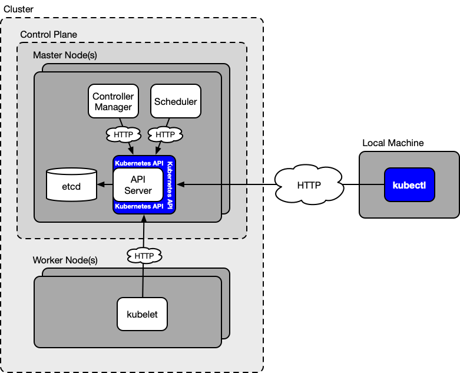
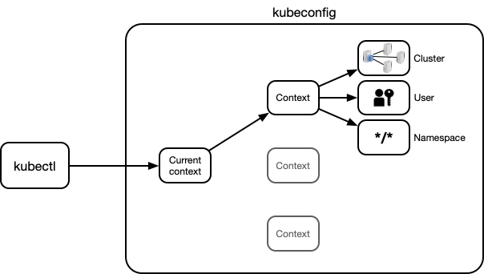
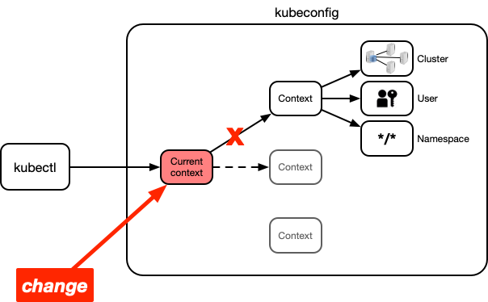
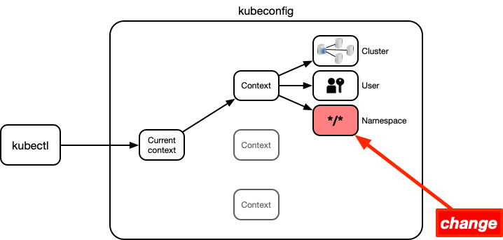
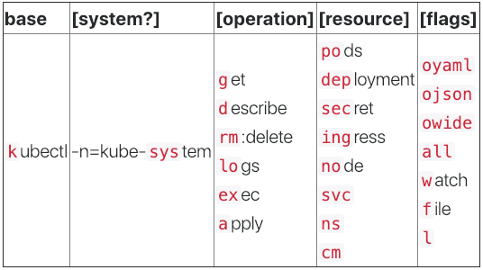

If you work with Kubernetes, you most probably use kubectl. And you probably use it *a lot*. Whenever you spend a lot of time working with a specific tool, it is worth truly "mastering" it and using it efficiently.

This article contains a set of tips and tricks to make your usage of kubectl more efficient. By the way, this article also aims at deepening your understanding of how Kubernetes works.

The goal of all this is not only to make your daily work with Kubernetes more efficient, but also more enjoyable!

## What is kubectl?

Before focussing on how to *use* kubectl more efficienly, you should know what it actually *is*. The following diagram shows an overview of the Kubernetes internals and the role kubectl plays in there:

As you can see, kubectl is in fact an HTTP-based client to the Kubernetes API. But what is the Kubernetes API? To understand this, let's briefly look at the Kubernetes internals.

### Kubernetes internals

Kubernetes consists of a set of independent components that run on the nodes (i.e. machines) of the cluster. Each component runs as a separate operating system process.

The most important Kubernetes components are shown in the above diagram. Some components run on the master nodes of the cluster (forming the cluster control plane) and others run on the worker nodes. In the following, they are listed again:

On master nodes:

- **API server:** provides the Kubernetes API, manages etcd storage
- **etcd:** storage backend (see [here](https://coreos.com/etcd/))
- **Controller manager:** ensures status matches spec of all resources
- **Scheduler:** schedules pods to worker nodes

On worker nodes:

- **kubelet:** controls execution of containers on worker node

To see how these components work together, let's see consider an example. Imagine you create a [ReplicaSet](https://kubernetes.io/docs/reference/generated/kubernetes-api/v1.13/#replicaset-v1-apps) resource in your cluster (a ReplicaSet consists of a pod template and "replica count", that is, the number of replicas of this pod that should be running at all times) by preparing a YAML manifest of the resource and then creating it with `kubectl apply`.

When you create the ReplicaSet resource, the **API server** saves its manifest in the **etcd** storage. This event triggers the ReplicaSet controller, a sub-process of the **controller manager**. It detects that there is now a ReplicaSet, but no corresponding pods, so it creates manifests for these pods and saves them in the etcd storage (through the API server). This in turn triggers the **scheduler**, as it sees that there now exists a number of pods that are not assigned to a worker node yet. Thus, it selects a worker node for each of these pods and adds the respective node names to the pod manifests in the etcd storage (through the API server). This in turn triggers the **kubelets** on the corresponding worker nodes, as they detect that a pod has been assigned to them. The kubelets then run the containers of these pods on their worker nodes.

### The Kubernetes API

The Kubernetes API is an **HTTP REST API** provided by the API server, and *all* interactions between Kubernetes components happen as [CRUD](https://en.wikipedia.org/wiki/Create,_read,_update_and_delete) operations through this API. That means, Kubernetes resources (such as ReplicaSets, pods, etc.) are created, read, updated, and deleted through this API (persisted in the etcd storage backend).

The special thing about Kubernetes is that the same management API is used for internal operations as well as for users of the cluster. That means, kubectl talks to exactly the same API as the internal components, such as the scheduler or kubelet.

The full specification of this API for the currently latest version of Kubernetes (v1.13) can be found [here](https://kubernetes.io/docs/reference/generated/kubernetes-api/v1.13/). As you can see, the specification is organised as a list of resource types. These are the resources that can be created, read, updated, and deleted (CRUD) through the Kubernetes API.

For each resource, the specification lists its **structure**, as well as the **operations** that can be applied to this resource. For example, you can see [here](https://kubernetes.io/docs/reference/generated/kubernetes-api/v1.13/#create-replicaset-v1-apps) that the *create* operation for a ReplicaSet is implemented by the following HTTP API endpoint:

~~~
POST /apis/apps/v1/namespaces/{namespace}/replicasets
~~~

The body for this HTTP POST request must be a manifest of a ReplicaSet in one of the supported formats (YAML, JSON, or [protobuf](https://developers.google.com/protocol-buffers/)).

So, when you execute a command like `kubectl create -f rs.yaml`, then kubectl makes the above API request behind the scenes. Similarly, internal Kubernetes components themselves use the same API endpoints when they have to create, read, update, or delete Kubernetes resources.

Note that Kubernetes is organised in such a way that the whole cluster can be operated and used through CRUD operations on Kubernetes resources through the Kubernetes API.

After this introductory section, you should now have a good understanding what kubectl in essence is. Namely a tool that carries out HTTP requests to the Kubernetes API on your behalf, allowing you to create, read, update, and delete Kubernetes resources.

Let's now look at a series of tips and tricks to make your usage of kubectl more efficient.

## 1. Save typing with command completion

One of the most useful, but often overlooked, tricks to make your kubectl usage more efficient is shell completion. This feature is provided by kubectl for the [**Bash**](https://www.gnu.org/software/bash/) and [**Zsh**](https://www.zsh.org/) shells (see [here](https://kubernetes.io/docs/tasks/tools/install-kubectl/#enabling-shell-autocompletion)).

Command completion allows you to auto-complete kubectl sub-commands, options, and arguments. This includes hard-to-type things like resource names, such as pod names or node names. This can save you a tremendous amount of typing and copy-pasting!

Here is a small demonstration of kubectl command completion in action:

<!--To use command completion, hit *Tab* to auto-complete the current word (if there is only a single match), and hit *Tab* two times to display a list of all the possible completions (if there are multiple matches).-->

Command completion works by the means of a **completion script** that defines the completion behaviour for a specific command. Kubectl can auto-generate its completion script for Bash and Zsh with the following command:

~~~bash
kubectl completion <shell>
~~~

Where `<shell>` is either `bash` or `zsh`.

In the end, this script must be sourced by your shell to enable command completion. However, the procedure to set everything up properly is different for Bash and Zsh, and furthermore, there is a small complication if you use Bash on macOS. The following sections cover all these cases and you can click on one of the links below to directly jump to the instructions for your scenario:

- [Setting up command completion for Bash](#bash)
- [Setting up command completion for Bash on macOS](#bash-on-macos)
- [Setting up command completion for Zsh](#zsh)

### Bash

For Bash, the kubectl completion script depends on a third-party project called [bash-completion](https://github.com/scop/bash-completion). You have to install this software on your system to make kubectl command completion work for Bash.

There are bash-completion packages for many common package managers (see [here](https://github.com/scop/bash-completion#installation)). For example, if you use APT, you can install the package as follows:

~~~bash
sudo apt-get install bash-completion
~~~

This creates the file `/etc/bash_completion`, which you have to source in your `~/.bashrc` file. So add the following to your `~/.bashrc` file:

~~~bash
source /etc/bash_completion
~~~

Now, everything is set up for the kubectl completion script to work, and you just have to source this script itself in your `~/.bashrc` file. You can do this by adding the following command to your `~/.bashrc` file:

~~~bash
source <(kubectl completion bash)
~~~

And that's it! After restarting your shell (or sourcing `~/.bashrc`), kubectl command completion should work.

[Jump to the next section →](#quickly-access-resource-documentation-with-kubectl-explain)

### Bash on macOS

Apple includes an old version of Bash in macOS, and unfortunately the kubectl completion script does not work with this version. In particular, macOS includes Bash 3.2, and the kubectl completion script requires at least Bash 4.1 (the current version of Bash is 5.0).

> In case you're interested why Apply includes such an old version of Bash in macOS (Bash 3.2 is from 2007): it is for licensing reasons. Bash 3.2 is the last version that uses the [GNU General Public License](https://en.wikipedia.org/wiki/GNU_General_Public_License) v2 (GPLv2), whereas later versions use GPLv3. Apple is generally unwilling to accept GPLv3.

The only way around this is to install a newer version of Bash on macOS. This is something that is generally recommended if you use Bash on macOS, as it can save you from a lot of trouble when using shell scripts and software that is designed for newer versions of Bash.

Installing a newer version of Bash on macOS and making it the default shell is actually not difficult, and I wrote an entire article about it [here](https://itnext.io/upgrading-bash-on-macos-7138bd1066ba). If you want to use kubectl command completion on macOS, then you should follow the steps in this article before proceeding.

Once you have upgraded Bash to a newer version, you can set up kubectl command completion.

For Bash, the kubectl command completion script depends on a third-party project called [bash-completion](https://github.com/scop/bash-completion). You have to install this software on your system in order to make kubectl command completion work.

You can install bash-completion conveniently with the [Homebrew](https://brew.sh/) package manager:

~~~bash
brew install bash-completion@2
~~~

> The `@2` at the end of the Homebrew formula stands for version 2 of bash-completion. This version targets Bash 4.1 and later, whereas version 1 (without the `@2`) targets versions up to Bash 3.2. The kubectl completion script only works with version 2, that's why you had to install a newer version of Bash.

The `brew install` command asks you in the "Caveats" section to add the following snippet to your `~/.bash_profile`:

~~~bash
[[ -r "/usr/local/etc/profile.d/bash_completion.sh" ]] && . "/usr/local/etc/profile.d/bash_completion.sh"
~~~

I recommend adding it to your `~/.bashrc` file instead, so that bash-completion is also available in sub-shells.

Now all that is left to do is to ensure that the kubectl completion script is sourced in your shell. The simplest way to do this is by simply adding the following command to your `~/.bashrc` file:

~~~bash
source <(kubectl completion bash)
~~~

Optionally, **if you installed kubectl with Homebrew** (`brew install kubernetes-cli`), you can achieve the same in another way (which will be useful for other commands that you installed with Homebrew too).

Homebrew formulas install completion scripts (if any) to the `/usr/local/etc/bash_completion.d` directory. If you installed kubectl with Homebrew, then the kubectl completion script has been placed in this directory by the Homebrew formula. You can instruct bash-completion to source all the completion script in this directory by adding the following line to your `~/.bashrc` file (this is also indicated in the "Caveats" section of the `brew install` command for bash-completion):

~~~bash
export BASH_COMPLETION_COMPAT_DIR="/usr/local/etc/bash_completion.d"
~~~

You just have to make sure this line comes *before* the above line of the "Caveats" section in your `~/.bashrc` file.

Once this is done, you don't need to source the kubectl completion script in your `~/.bashrc` file anymore. In addition, all completion scripts of other Homebrew formula will be automatically sourced too.

No matter which approach you use, after restarting your shell, kubectl command completion should be working!

[Jump to the next section →](#quickly-access-resource-documentation-with-kubectl-explain)

### Zsh

Setting up kubectl completion for Zsh is easy. All you have to do is to source the kubectl completion script for Zsh. You can do this by adding the following command to your `~/.zshrc` file:

~~~bash
source <(kubectl completion zsh)
~~~

That's it! After restarting your shell, kubectl command completion should be working.

If after restarting your shell, you get an error like `complete:13: command not found: compdef`, then you have to enable the `compdef` builtin in your shell. You can do this by adding the following to the beginning of your `~/.zshrc` file:

~~~bash
autoload -Uz compinit
compinit
~~~

## 2. Quickly look up resource definitions

This tip will prove useful for many of the subsequent tips, and for your Kubernetes usage in general. When you define a YAML or JSON manifest for a resource (e.g. a Deployment or a Service), you need to know the structure of this resource.

In general, resources have a hierarchical structure consisting of fields and sub-fields, each field must be of a specific data type, and some fields are mandatory whereas other are optional. One way to look up all this information is in the [API reference](https://kubernetes.io/docs/reference/generated/kubernetes-api/v1.13/) on the web.

However, there is a better and quicker way, namely the `kubectl explain` command. This command displays you the fields and sub-fields of each resource type, including a description and the data type of each field. The information displayed by `kubectl explain` is the same as in the API reference, but you get it right in your terminal.

The usage of this command is as follows:

~~~bash
kubectl explain resource[.field][.field]...
~~~

For example, if you want to look up the fields of a Deployment (one level deep), you can do that as follows:

~~~bash
kubectl explain deployment
~~~

If you then want to drill down into the `spec` field of a Deployment, you can do it like that:

~~~bash
kubectl explain deployment.spec
~~~

And so on, for any fields and sub-fields.

By default, `kubectl explain` displays only a single level of fields. You can recursively display all the fields and sub-fields (without their descriptions) with the `--recursive` flag. For example:

~~~bash
kubectl explain deployment.spec --recursive
~~~

In case you're not sure about which resources you can use with `kubectl explain`, you can display all of them with the following command:

~~~bash
kubectl api-resources
~~~

The above command displays the resource names in their plural forms (e.g. `deployments` instead of `deployment`). For applicable resources, it also displays their "shortname" (e.g. `deploy`). All of these name variants are in general equivalent for kubectl. That is, you can use any of these variants for `kubectl explain`.

For example, all the following commands are equivalent:

~~~bash
kubectl explain deployments.spec
kubectl explain deployment.spec
kubectl explain deploy.spec
~~~

## 3. Use custom output formats

When you use `kubectl get` to read Kubernetes resources, you get by default an output format like in the following example:

~~~bash
$ kubectl get pods
NAME                      READY   STATUS    RESTARTS   AGE
engine-544b6b6467-22qr6   1/1     Running   0          78d
engine-544b6b6467-lw5t8   1/1     Running   0          78d
engine-544b6b6467-tvgmg   1/1     Running   0          78d
web-ui-6db964458-8pdw4    1/1     Running   0          78d
~~~

This format is practical for human consumption, but it displays only a limited amount of information for each resource instance. If you want more information, you could use the `-o json` or `-o yaml` option, but then kubectl displays the *full* definition of each resource, and that's probably more information than you want. Furthermore, JSON and YAML are intended for machine processing, and not as human-readable as the above table format.

The ["custom columns"](https://kubernetes.io/docs/reference/kubectl/overview/#custom-columns) output format displays resources in a human-readable table format (as above), but allows you to define the information displayed in the table yourself.

You use the custom columns output format with the `-o custom-columns=<spec>` option. Here is an example:

~~~bash
kubectl get pods -o custom-columns='NAME:metadata.name,IMAGES:spec.containers[*].image'
~~~

As you can see, the `<spec>` part of the `-o custom-columns` option is as follows:

~~~
NAME:metadata.name,IMAGES:spec.containers[*].image
~~~

It specifies two columns, one entitled `NAME` and the other entitled `IMAGES`, and defines which resource field value(s) to display in these columns. If you run this command, the output will be something like this:

~~~
NAME                       IMAGES
rabbitmq-d4b77b989-t4wzm   rabbitmq:3.7.8-management,nginx
test-pod                   nginx
test-rc-hnhqm              nginx
test-rc-zqz4n              nginx
~~~

As you can see, the output shows the name of each pod as well as the image names of all the containers that run as part of this pod.

In general, the custom columns output format is used as follows:

~~~
-o custom-columns=<header>:<jsonpath>[,<header>:<jsonpath>]...
~~~

That is, you specify a comma-separated list of `<header>:<jsonpath>` pairs, one for each column that you want in the output table.

The `<header>` part is the header of the column and you can freely choose it (it may also be empty). The `<jsonpath>` part is a specifier based on [JSONPath](https://goessner.net/articles/JsonPath/index.html) that selects a field value (or collection of field values) to display in the column.

### JSONPath expressions

JSONPath is a language to extract data from JSON documents. In kubectl, JSONPath is used to specify fields of resources for display.

For example, in the above command the JSONPath expression for the `NAME` column is:

~~~
metadata.name
~~~

If you look at the resource definition of a pod (which you can do either in the [API reference](https://kubernetes.io/docs/reference/generated/kubernetes-api/v1.13/) or with `kubectl explain`), you see that the name of a pod is defined in the `metadata.name` field (see `kubectl explain pod.metadata.name`). Thus, if you want to display the name of a pod in the output table, you have to use this JSONPath expression.

The JSONPath expression for the `IMAGES` column is:

~~~
spec.containers[*].image
~~~

This is also a valid JSONPath expression, but this time it contains an array operator. If you look at the definition of a pod, you see that the `spec.containers` field is a **list**, each element containing the definition of a container of this pod (see `kubectl explain pod.spec.containers`).

When you encounter resource fields that are lists, then you can use the array operator `[]` in a JSONPath expression. The `*` is a wildcard array subscript operator that selects *all* elements of the array. Thus, in effect, this JSONPath expression the image names of *all* the containers in the pod, which will be displayed by kubectl as a comma-separated list.

JSONPath can do more than only that. You can see its most important capabilites for example [here](https://goessner.net/articles/JsonPath/index.html#e3). However, for the kubectl custom columns output format, only a subset of these capabilites is supported. The supported capabilities are listed in the following with examples:

~~~bash
# Select all elements of a list
kubectl get pods -o custom-columns='DATA:spec.containers[*].image'

# Select a specific element of a list
kubectl get pods -o custom-columns='DATA:spec.containers[0].image'

# Select those elements of a list that match a filter expression
kubectl get pods -o custom-columns='DATA:spec.containers[?(@.image!="nginx")].image'

# Select all fields under a specific location, regardless their name
kubectl get pods -o custom-columns='DATA:metadata.*'

# Select all fields with a specific name, regardless their location
kubectl get pods -o custom-columns='DATA:..image'
~~~

### What else you can do with custom columns output

The uses cases of the custom column output format are endless. You can display any combination of data you want and thus creating your custom "reports" of what's going on in your cluster. Just follow these steps:

1. Explore the definition of a resource
    - In the [API reference](https://kubernetes.io/docs/reference/generated/kubernetes-api/v1.13/)
    - With `kubectl explain`
    - In the YAML or JSON representation of a resource that you get with `kubectl get -o <yaml|json>`
2. Create JSONPath expressions to extract the data you want to display
3. Assemble the `-o custom-columns` option

Here is another example:

~~~bash
$ kubectl get nodes -o custom-columns='NAME:metadata.name,ZONE:metadata.labels.failure-domain\.beta\.kubernetes\.io/zone'
NAME                          ZONE
ip-10-0-118-34.ec2.internal   us-east-1b
ip-10-0-36-80.ec2.internal    us-east-1a
ip-10-0-80-67.ec2.internal    us-east-1b
~~~

As you can see, this command displays which "zone" each node in the cluster is in. This applies if your cluster runs on a cloud infrastructure, such as AWS or GCP. In these environments, a "zone" is a replication area within a "region".

The JSONPath expression for the `ZONE` column selects the value of a special label called [`failure-domain.beta.kubernetes.io/zone`](https://kubernetes.io/docs/reference/kubernetes-api/labels-annotations-taints/#failure-domainbetakubernetesiozone). This label is populated with the "zone" of the node, if the cluster runs on a cloud infrastructure.

Labels are custom data and are not specified in the API reference or in `kubectl explain`. So to see the full range of data you can display, you can explore the YAML or JSON definitions of your resources that you get with `kubectl get -o yaml` or `kubectl get -o json`.

This is just one of many examples of what you can do with the custom columns output format. Feel free to explore your resources and find new use cases!

<!--
### What `kubectl get` gets from the API server

- You can set the log level for kubectl with the `-v` option
    - Default is 0 (`-v 0`), highest is 10 (`-v 10`)
- If you set the log level to 9+, the output includes each request kubectl makes to the API server, including the full request and response bodies
    - Thus, you can see what exactly the response to a `kubectl get` API request is
- The response bodies to GET requests issued by `kubectl get` are:
    - Always JSON
    - For the default output format and `-o wide` with `--server-print=true` (this is the default)
        - JSON object of kind *Table* that defines the columns and rows of the output table
        - https://kubernetes.io/docs/reference/using-api/api-concepts/#receiving-resources-as-tables
        - Since v1.10
    - The above with `--server-print=false` and all other output formats:
        - List* operation:
            - JSON object representing resource of kind *XList* (e.g. *PodList*) according to [API reference](https://kubernetes.io/docs/reference/kubernetes-api/)
            - Similar, but not identical, to the output with the `-o json` option (this output object is of kind *List*)
            - In Kubernetes v1.13, for all resources except the following ones there exists a *XList* object (where *X* is the resource type):
                - Container
                - Volume
                - Binding
                - LocalSubjectAccessReview
                - SelfSubjectAccessReview
                - SelfSubjectRulesReview
                - SubjectAccessReview
                - TokenReview
        - Read operation:
            - JSON object representing a resource of kind *X* (e.g. *Pod*) according to [API reference](https://kubernetes.io/docs/reference/kubernetes-api/)
            - Exactly the same as the output with the `-o json` option

### When creating resources with kubectl: what is sent to the API server

- The request bodies for POST request issued, for example, by `kubectl create` are:
    - Always JSON
    - A JSON representation fo the resource specification that is passed to `kubectl create` (no matter if the specification is in YAML or JSON)

### Creating resources by talking to the API server directly

- Start a proxy to the API server with kubectl: kubectl proxy
    - API server can now be accessed as http://127.0.0.1:8001
- Now, you can create resources as follows (example for a pod):
    - `curl -H "Content-Type: <in>" -H "Accept: <out>" -d "$(cat file)" -X POST http://127.0.0.1:8001/api/v1/namespaces/default/pods`
        - Where:
            - `<in>` is the data type of the resource specification in `file`. It can be one of:
            - `<out>` is the desired data type of the response
            - Both `<in>` and `<out>` can be one of:
                - `application/json` (default for `<out>`)
                - `application/yaml`
                - `application/vnd.kubernetes.protobuf`
    - That means, the API server accepts resource specifications in three formats: JSON, YAML, and Protocol Buffers
        - This is as explained in [Managing Kubernetes, Chapter 4](https://www.oreilly.com/library/view/managing-kubernetes/9781492033905/ch04.html) (Alternate Encodings)
        - Protobuf support is a newer feature, see here: https://github.com/kubernetes/community/blob/master/contributors/design-proposals/api-machinery/protobuf.md
    - On a POST request, the API server returns the completed specification of the created resource
        - This returned specifications contains all the default and initialised values that were not present in the specification initially passed to the API server
    - You can choose any combinations of input and output formats (i.e. `<in>` and `<out>`)
        - For example, post a specification in YAML (set `<in>` to `application/yaml`) and get the response in Protocol Buffers (set `<out>` to `application/vnd.kubernetes.protobuf`
    - https://kubernetes.io/docs/reference/using-api/api-concepts/#alternate-representations-of-resources
-->

## 4. Switch effortlessly between clusters and namespaces

Kubectl uses a YAML configuration called **kubeconfig** to decide to which **cluster** to connect and how to connect to it (see [here](https://kubernetes.io/docs/tasks/access-application-cluster/configure-access-multiple-clusters/) and [here](https://kubernetes.io/docs/concepts/configuration/organize-cluster-access-kubeconfig/)) . You can have multiple clusters configured in your kubeconfig file, which allows you to easily switch between clusters by "pointing" kubectl to a new cluster (for example, do some work on cluster *A*, switch to cluster *B*, and do some work on cluster *B*).

Similarly, the kubeconfig file also contains the [**namespace**](https://kubernetes.io/docs/concepts/overview/working-with-objects/namespaces/) that kubectl uses by default for any cluster. This allows you to switch between namespaces within a given cluster (for example, do some work in the *dev* namespace of a cluster, then switch to the *prod* namespace and do some work there).

> The default kubeconfig file that kubectl looks for is `~/.kube/config`. However, you can also use a different filename, and you can have multiple kubeconfig files. In this case, you have to list the kubeconfig file(s) in the `KUBECONFIG` environment variable (see [here](https://kubernetes.io/docs/tasks/access-application-cluster/configure-access-multiple-clusters/#set-the-kubeconfig-environment-variable)). You can also explicitly specify the kubeconfig file for each invocation of kubectl with the `--kubeconfig` option.

This tip will show you different tools to switch between clusters and namespaces effortlessly. But to understand what these tools do, you should have a basic understanding of kubeconfig files.

### kubeconfig files

The following diagram shows what a kubeconfig file contains and how kubectl uses it:

As you can see, kubeconfig files are centred around so-called **contexts**. A context references a specific cluster, an authentication mechanism (user), and a namespace of the cluster.

At any time, one of these contexts is set as the **current context**. Whenever kubectl reads a kubeconfig file, it connects to the cluster of the current context (using the corresponding authentication mechanism) and it uses the namespace that is also set in the current context.

> Note that it's possible to overwrite each of these elements for every kubectl command with the `--cluster`, `--namespace`, and `--user` options. You can also overwrite the current context with the `--context` option.

That means, to switch to another cluster, you can just change the current context in your kubeconfig file, as shown in the following diagram:

Once this is done, the next invocation of kubectl will use the new context and thus connect to your desired cluster.

Similarly, to switch to another namespace in the same cluster, you can change the namespace entry of the current context, as shown here:

Now, the next time kubectl is invoked, it will apply its Kubernetes operations to the new namespace.

The tools that are presented in the next section all perform exactly these changes to your kubeconfig file.

### Approaches to change contexts and namespaces

Here are the approaches and tools you can use to effortlessly switch between clusters and namespaces.

#### kubectx

The most popular approach for these tasks is the [kubectx](https://github.com/ahmetb/kubectx/) project. This software provides two commands called `kubectx` and `kubens` which allow you to switch between contexts and namespaces, respectively. Under the hood, these commands perform exactly the operations that have been explained in the previous section.

You can install kubectx according to the instructions [here](https://github.com/ahmetb/kubectx/#installation) (it is distributed as a Homebrew formula, as well as a Debian package).

A particularly useful feature of kubectx is the [**interactive mode**](https://github.com/ahmetb/kubectx/#interactive-mode). It allows you to select the target context or namespace interactively through a fuzzy search. This can be extremely useful if you have long and cryptic context names like the ones generated by managed Kubernetes services like [Amazon Elastic Container Service for Kubernetes (EKS)](https://aws.amazon.com/eks/) or [Google Kubernetes Engine (GKE)](https://cloud.google.com/kubernetes-engine/).

The interactive mode depends on a third-party tool called [fzf](https://github.com/junegunn/fzf), which provides the fuzzy search interace. You must install fzf in order to use the interactive mode of kubectx.

fzf (meaning *fuzzy finder*) is an extremely useful and versatile tool. In a nutshell, it reads lines from stdin, lets the user select one of these lines by a fuzzy search query, and writes the selected line to stdout. You will see fzf again in the alternative tools below.

#### Aliases

kubectx is a full-blown software package that allows you to make some edits to your kubeconfig files. But actually, you can achieve the same thing in a much simpler way by using native kubectl commands.

kubectl provides a whole suite of commands editing kubeconfig files. The relevant ones for switching between clusters and namespaces are those:

- `kubectl config get-contexts`: list all contexts
- `kubectl config current-context`: get the current context
- `kubectl config use-context`: switch the current context
- `kubectl config set-context`: edit a context

However, using these commands directly is not very convenient. But what you can do is wrapping them into shell aliases so that you can execute them more easily.

This also allows you to enhance them with additional tools to produce a streamlined user experience. In particular, you can combine them with [fzf](https://github.com/junegunn/fzf) (also used by kubectx) to allow you to select the target context and namespace interactively.

Below is an example set of such aliases. There is an alias for each of those operations:

- Get the current context/namespace (`kcc`/`kcn`)
- List all contexts/namespaces (`klc`/`kln`)
- Switch to another context/namespace (`ksc`/`ksn`)

~~~bash
# Contexts
alias kcc='kubectl config current-context'
alias klc='kubectl config get-contexts -o name | sed "s/^/  /;\|$(kcc)|s/ /*/"'
alias ksc='kubectl config use-context "$(klc | fzf -e | sed "s/^..//")"'
# Namespaces
alias kcn='kubectl config get-contexts --no-headers "$(kcc)" | awk "{print \$5}" | sed "s/^$/default/"'
alias kln='kubectl get -o name ns | sed "s|^.*/|  |;\|$(kcn)|s/ /*/"'
alias ksn='kubectl config set-context --current --namespace "$(kln | fzf -e | sed "s/^..//")"'
~~~

Here you can see the aliases in action:

To use the aliases yourself, you just need to copy their definitions to your `~/.bashrc` or `~/.zshrc` file (all aliases work for both Bash an Zsh). Note that these aliases also depend on fzf, so you have to [install it](https://github.com/junegunn/fzf#installation) in order to make them work.

#### Plugins

This approach anticipates something that will be explained in depth in a [later section](#extend-kubectl-with-plugins), namely kubectl plugins. Kubectl allows to install plugins that can be invoked like native commands. The mechanism is extremely easy. If you have an executable named `kubectl-foo`, and it is in your `PATH`, then you can invoke it as `kubectl foo`.

It would be nice to have functionality for switching contexts and namespaces available as plugins. So you could, for example, change the context with `kubectl ctx` and change the namespace with `kubectl ns`. In this way, you don't need to use separate commands for these tasks (like with [kubectx](https://github.com/ahmetb/kubectx)), and the plugin names are probably easier to remember than the short alias names proposed above.

For this reason, I created two such plugins named [**kubectl-ctx**](https://github.com/weibeld/kubectl-ctx) and [**kubectl-ns**](https://github.com/weibeld/kubectl-ns). The installation is extremely easy. Just copy the shell script to any location in your `PATH`, make it executable, and that's it! Now you can change your context with `kubectl ctx` and change your namespace with `kubectl ns`.

The implementation of the plugins is based on the alias commands from the last section, and also depends on fzf. So, you must [install fzf](https://github.com/junegunn/fzf#installation) in order to use the plugins.

The [kubectl-ns](https://github.com/weibeld/kubectl-ns) plugin furthermore fixes a small annoyance that you might have noticed with the `kubens` command from [kubectx](https://github.com/ahmetb/kubectx) or the `kln` and `ksn` aliases from above. When you execute these commands, it might take a while until you see the list of namespaces that you can choose from. This is because the list of namespaces of a cluster is not locally saved and must be retrieved throught the Kubernetes API. That is, these commands include a round-trip to the API server, which is why they take longer to complete than the other commands.

The kubectl-ns plugins fixes this by locally caching the list of namespaces of each cluster, so that the information is immediately available for subsequent requests.

## 5. Save more typing with auto-generated aliases

Shell aliases are a great way to save typing. You can wrap long and complicated commands in short aliases, and then execute them by just typing the alias name.

> Note that in general you can do the same with shell functions as with shell aliases (and even in a more flexible way). However, aliases are still often used.

Using aliases for kubectl makes a lot of sense, because commands can get quite long, and you use certain commands very frequently.

The [**kubectl-aliases**](https://github.com/ahmetb/kubectl-aliases) project takes this idea seriously. It defines about **800 aliases** for common kubectl commands. Among them ar alises like `k` for `kubectl` and `kding` for `kubectl describe ingress`. You can explore all the alias definitions [here](https://github.com/ahmetb/kubectl-aliases/blob/master/.kubectl_aliases).

You must be wondering how you could possible remember 800 aliases? Well, actually you don't need to remember them, because they are all auto-generated according to a simple scheme, which is shown in the following table (taken from a [blog post](https://ahmet.im/blog/kubectl-aliases/) of the kubectl-aliases author):

All aliases start with `k` (standing for `kubectl`) and then you can append optional components from left to right, as shown in the above table.

Here are some example aliases and the commands that they stand for:

- `k` &#10230; `kubectl`
- `kg` &#10230; `kubectl get`
- `kgpo` &#10230; `kubectl get pods`
- `kgpooyaml` &#10230; `kubectl get pods -o yaml`
- `ksysgpooyaml` &#10230; `kubectl -n kube-system get pods -o yaml`

If you get the hang of this scheme (explained also [here](https://github.com/ahmetb/kubectl-aliases#syntax-explanation)), you can easily deduce the alias name from the command that you want to execute.

The nature of aliases allows to append any arguments to an alias on the command-line. If, for example, you want to get the YAML definition of a *specific* pod (not of all pods), you can just append the pod name to the `kgpooyaml` alias:

~~~bash
kgpooyaml test-pod
~~~

This will actually execute `kubectl get pods -o yaml test-pod`, which is a valid kubectl command that does exactly what you want.

You could also use, for example, the `kg` alias for resources for which no aliases exist. For example, if you want to get all ReplicaSets, you could run `kg replicasets` (or using the shortname `kg rs`). Or you could use the `k` alias to start *any* kubectl command, for example, `k explain pod`.

### Installation

The installation of kubectl-aliases is very easy. The only thing you have to do is download the [`.kubectl-aliases`](https://raw.githubusercontent.com/ahmetb/kubectl-aliases/master/.kubectl_aliases) file (which contains all the alias definitions), and source it in your `~/.bashrc` or `~/.zshrc` file:

~~~bash
source ~/.kubectl_aliases
~~~

> Note that all aliases work for both Bash and Zsh.

After restarting your shell, all the aliases should be ready to use!

### Command completion

The [first tip](#1-save-typing-with-command-completion) in this article was about enabling command completion, which allows you to auto-complete things like kubectl sub-commands, options, resource names, and other arguments.

You probably expect command completion to also work with the aliases. Imagine you type the following:

~~~
kgpooyaml [tab][tab]
~~~

This should display all the pod names, exactly as if you typed `kubectl get pods -o yaml [tab][tab]`. There should be no difference regarding auto-completion whether you use aliases or the full commands.

If you use **Zsh**, then there is good news for you. Command completion for aliases works exactly like that by default. So you can just go on auto-completing all the aliases as you would the full commands.

If you use **Bash** (as probably the majority of people), then there is good and bad news. The bad news is that command completion for aliases doesn't work natively in Bash. The good news is that it can be made working quite easily, which is explained in the following section.

If you use Zsh, or don't care about command completion for aliases in Bash, you can [jump to the next tip →](#6-extending-kubectl-with-plugins).

### Make Bash completion work for aliases

A general and reliable solution to make command completion work for aliases in Bash is the [**complete-alias**](https://github.com/cykerway/complete-alias) project. Technically, this software provides a Bash function called `_complete_alias`. If you set this function as the completion specification ([compspec](https://www.gnu.org/software/bash/manual/html_node/Programmable-Completion.html#Programmable-Completion)) of *any* alias, then it makes command completion "magically" work for this alias.

Concretely, if you have an alias `foo`, then you just need to execute the following command (read [here](https://www.gnu.org/software/bash/manual/html_node/Programmable-Completion-Builtins.html#Programmable-Completion-Builtins) about the `complete` builtin):

~~~bash
complete -F _complete_alias foo
~~~

And after that, command completion works for the `foo` alias exactly as it does for the alias command.

Technically, the `_complete_alias` function looks at the aliased command, gets the completion suggestions for this command, and returns them to the shell. This is the reason that the same completion function can be used for *any* alias.

The solution for our kubectl-aliases problem is to execute the above command for each alias of kubectl-aliases (a snippet that does this automatically will be shown further below).

#### Install complete-alias

complete-alias depends on the [**bash-completion**](https://github.com/scop/bash-completion) project. So, you first have to install bash-completion (if you haven't already), which you can do easily with various package managers.

For example, on Debian-based systems:

~~~bash
sudo apt-get install bash-completion
~~~

Or on macOS:

~~~bash
brew install bash-completion@2
~~~~

> **Important note for macOS users:** complete-alias requires bash-completion 2 (indicated by the `@2` in the Homebrew formula). However, bash-completion 2 runs only on Bash 4.1+, and the default Bash version on macOS is 3.2. This means that complete-alias won't work on the default version of Bash on macOS. To make it work, you have to install a newer version of Bash, which is explained [here](https://itnext.io/upgrading-bash-on-macos-7138bd1066ba). If you try to use complete-alias with bash-completion 1 and Bash 3.2, you will get an error of the form `_completion_loader: command not found`.

Once bash-completion is installed, you can install **complete-alias**. All you have to do for this, is downloading the [`bash_completion.sh`](https://raw.githubusercontent.com/cykerway/complete-alias/master/bash_completion.sh) script and source it in your `~/.bashrc` file. So, for example:

~~~bash
source ~/bash_completion.sh
~~~

That's it! Now complete-alias is installed and ready to be used to enable command completion for your aliases.

#### Enable completion for the kubectl aliases

As mentioned, complete-alias provides the `_complete_alias` shell function, and you have to set this function as the completion function for all the aliases of kubectl-aliases.

You can do this by adding the below snippet anywhere in your `~/.bashrc` file (just adapt the actual location of your `.kubectl-aliases` file):

~~~bash
for _a in $(sed '/^alias /!d;s/^alias //;s/=.*$//' ~/.kubectl_aliases); do
  complete -F _complete_alias "$_a"
done
~~~

That's it!

After restarting your shell, everything should be correctly configured so that you can now use command completion with all the 800 kubectl aliases!

<!--
- https://github.com/ahmetb/kubectl-aliases
- Described here: https://ahmet.im/blog/kubectl-aliases/
- 800 auto-generated aliases
- Just download the `.kubectl_aliases` file and source it from your `~/.bashrc` of `~/.zshrc`

### Programmable Completion

- With Zsh, command completion keeps working with aliases
- With Bash, command completion doesn't work with aliases by default

#### Solution for Bash Problem

- https://github.com/cykerway/complete-alias
- Simply download the https://github.com/cykerway/complete-alias/blob/master/bash_completion.sh file and source it in your `~/.bashrc`
- This provides the function `_complete_alias`
- Then, for every alias for which you want to enable command completion:
    - `complete -F _complete_alias <alias>`
- This works by internally expanding the alias and getting the completion options in the same way as the aliased command
- The implementation depends on bash-completion https://github.com/scop/bash-completion
- Problem with macOS
    - complete-alias depends on bash-completion 2.0 or newer
    - macOS indludes Bash 3.2 which uses bash-completion 1.3 (when installed with Homebrew)
    - This results in an error: `_completion_loader: command not found`
        - The `_completion_loader` function has been added in bash-completion 2.0 (i.e. does not exist in bash-completion 1.3)
    - Solution: install a newer version of Bash on macOS and use bash-completion 2.8
-->

## 6. Extend kubectl with plugins

One thing that many people don't know is that kubectl includes a [plugin system](https://kubernetes.io/docs/tasks/extend-kubectl/kubectl-plugins/) that allows you to "extend" kubectl with custom commands. For example, you can install a plugin named `kubectl-hello` that you can then execute as `kubectl hello`:

The kubectl plugin system has been introduced in kubectl v1.12 (released in September 2018), and it is currently (v1.13) in beta (which means that the feature is here to stay).

> Note that the kubectl plugin system was inspired by, and works exactly like, the [Git plugin system](https://adamcod.es/2013/07/12/how-to-create-git-plugin.html).

### Installing plugins

Installing kubectl plugins is extremely easy. Plugins are distributed as executable files named `kubectl-x` (where `x` is the name of the plugin).

To install a plugin, all you have to do is to copy this file to any directory in your `PATH` and make sure it is executable. If that's the case, you can immediately start using the plugin as `kubectl x`.

To uninstall a plugin, simply delete the corresponding plugin file.

### Listing plugins

You can use the following command to list all the kubectl plugins that are installed on your system:

~~~bash
kubectl plugin list
~~~

This command also displays warnings if you have multiple plugins with the same name, or if you forgot to make a plugin file executable.

### Disovering plugins

One of the places to look for existing plugins is on GitHub, for example, in the [**kubectl-plugins**](https://github.com/topics/kubectl-plugins) topic. You will find several dozens of plugins there that might give you some inspiration of what else you can use kubectl for.

Furthermore, there is a project called **krew** aiming at streamlining the discovery and installation of kubectl plugins, which is presented next.

#### Using krew to discover and install kubectl plugins

[Krew](https://github.com/GoogleContainerTools/krew) is a package manager for kubectl plugins (the name *krew* is a pun on the [*brew*](https://brew.sh/) package manager for macOS). It allows to browse kubectl plugins that are in the krew index and to install, upgrade, and uninstall them with a single command.

To use krew, you have to install it first. Krew is itself distributed as a plugin, and you can install it according to the instructions [here](https://github.com/GoogleContainerTools/krew/#installation).

Once krew is installed, you can invoke it as `kubectl krew`. You can browse the plugins in the krew index as follows:

~~~bash
kubectl krew search
~~~

And you can install a particular plugin like that:

~~~bash
kubectl krew install <plugin>
~~~

This command lists all the plugins that have been installed via krew:

~~~bash
kubectl krew list
~~~

Note that the above command does *not* list the plugins that have been installed manually (that is, not with krew). To list *all* plugins on your system, you can use the `kubectl plugin list` command.

In general, the use of krew does not prevent you from installing plugins manually (as shown [above](#installing-plugins)). Plugins installed by krew and plugins installed manually can live side by side on your system.

### Creating your own plugins

If you don't find an existing plugin that does what you want, you can create your own. Creating kubectl plugins is extremely easy.

A kubectl plugin can be any type of an executable file (a Bash script, a compiled C program, a Python script, etc.). The only requirement is that it is named `kubectl-x`, where `x` is the name of your plugin.

For example, do you remember the command for listing the container images of all pods in your cluster from a [previous section](#3-using-custom-output-formats)? You can easily transform it to a plugin that you can invoke as `kubectl images`.

All you have to do for this is to create a file named `kubectl-images` with the following content:

~~~bash
#!/bin/bash
kubectl get pods -o custom-columns='NAME:metadata.name,IMAGES:spec.containers[*].image'
~~~

That's it! The `kubectl-images` file is a valid kubectl plugin and can be [installed](#installing-plugins) by anyone, and invoked as `kubectl images`.

This example plugin is just a simple shell script, but plugins can be arbitrarily sophisticated. Nothing prevents you from implementing a plugin in Java or Go, possibly using a [Kubernetes client library](https://kubernetes.io/docs/reference/using-api/client-libraries/) (for Go there exists even a utility library called [cli-runtime](https://github.com/kubernetes/cli-runtime) specifically for kubectl plugins). Detailed information about creating plugins can be found [here](https://kubernetes.io/docs/tasks/extend-kubectl/kubectl-plugins/).

Feel free to distribute your plugins on GitHub if you think they might be useful for others too (just add the [kubectl-plugins](https://github.com/topics/kubectl-plugins) topic to make them easily discoverable). You can even try to add a plugin to the [krew index](https://github.com/GoogleContainerTools/krew-index) according to the instructions [here](https://github.com/GoogleContainerTools/krew/blob/master/docs/DEVELOPER_GUIDE.md) (it requires your plugin to be accepted by the krew maintainers).

### Command completion

Currently, the kubectl plugin mechanism does unfortunately not yet support command completion. This means that you have to fully type the plugin names and any arguments.

For example, consider you type the following:

~~~
kubectl im[tab][tab]
~~~

This will **not** auto-complete to `kubectl images` (if you have the `kubectl-images` plugin installed). Similarly, if the plugin would take any arguments, you couldn't auto-complete them.

However, there is an open [**feature request**](https://github.com/kubernetes/kubectl/issues/585) in the kubectl repository on GitHub that asks for exactly that. So there is hope that some time in the future, command completion will also work for plugins.

<!--
#### Distribute your own plugins via krew

If you created a plugin and want to add it to the *krew* index, so that other users can discover and install it via *krew*, you can do that. The instructions for this can be found in the [developer guide](https://github.com/GoogleContainerTools/krew/blob/master/docs/DEVELOPER_GUIDE.md) of the *krew* documentation.

In short, you have create two artefacts for publishing your plugin to *krew*:

- A `.zip` or `.tar.gz` archive containing the executables of your plugin (possibly for different platforms)
- A *krew* [plugin manifest](https://github.com/GoogleContainerTools/krew/blob/master/docs/DEVELOPER_GUIDE.md#writing-a-plugin-manifest) YAML file

The **archive** with the executables must be publicly downloadable via a URL. You can achieve this, for example, by adding it as a binary to a GitHub [release](https://help.github.com/articles/creating-releases/).

The **plugin manifest** must contain all the required information for *krew* to install the plugin. This includes the URL of the archive with the executables, and the names of the executables to install for each platform. The plugin manifest is what will be uploaded to the *krew* index.

To publish your plugin to the *krew* index, you have to create a pull request to the [krew-index](https://github.com/GoogleContainerTools/krew-index) repository adding your plugin manifest to the [`plugins`](https://github.com/GoogleContainerTools/krew-index/tree/master/plugins) directory of this repository. This is were the manifests of all the plugins in the *krew* index are maintained.

Once the pull request is accepted, you plugin will be publicly listed by `kubectl krew search` and users can install it with `kubectl install <plugin>`. If you create a new version of your plugin, you have to update your plugin manifest in the krew-index repository with a new pull request.

Again, the detailed instructions for publishing plugins to *krew* can be found in the *krew* [developer guide](https://github.com/GoogleContainerTools/krew/blob/master/docs/DEVELOPER_GUIDE.md).