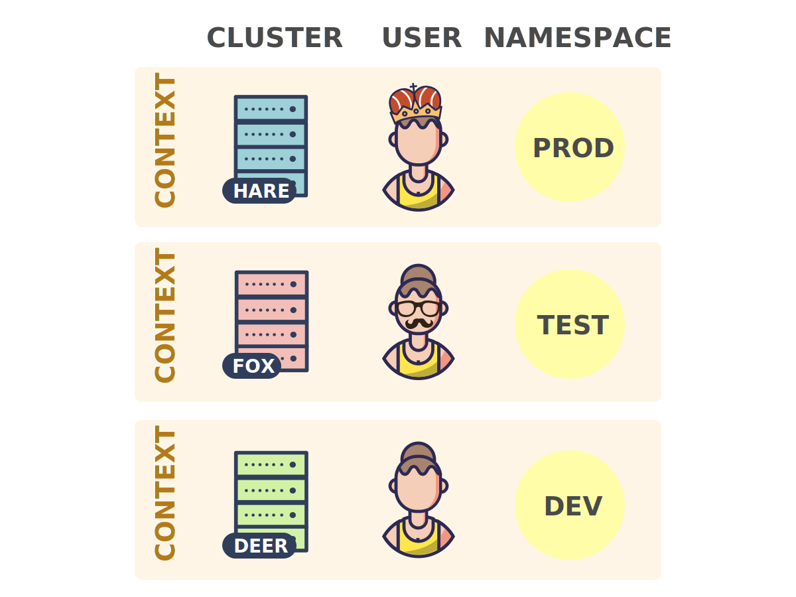
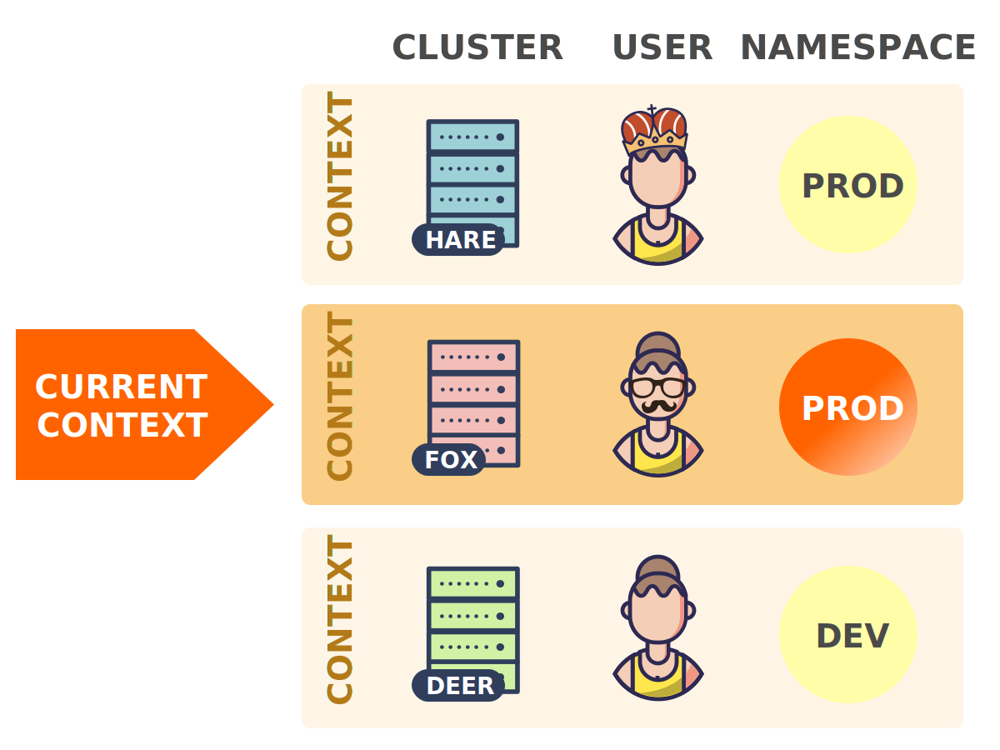

If you work with Kubernetes, then kubectl is probably one of your most-used tools. Whenever you spend a lot of time working with a specific tool, it is worth to get to know it very well and learn how to use it efficiently.

This article contains a series of tips and tricks to help you boosting your kubectl productivity. At the same time, this article aims at deepening your understanding of how various aspects of Kubernetes work.

The goal of this article is not only to make your daily work with Kubernetes more efficient, but also more enjoyable!

## Contents

- [**Introduction: what is kubectl?**](#introduction-what-is-kubectl-)
- [**1. Save typing with command completion**](#1-save-typing-with-command-completion)
- [**2. Quickly look up resource specifications**](#2-quickly-look-up-resource-specifications)
- [**3. Use the custom columns output format**](#3-use-the-custom-columns-output-format)
- [**4. Switch between clusters and namespaces with ease**](#4-switch-between-clusters-and-namespaces-with-ease)
- [**5. Save typing with auto-generated aliases**](#5-save-typing-with-auto-generated-aliases)
- [**6. Extend kubectl with plugins**](#6-extend-kubectl-with-plugins)

## Introduction: what is kubectl?

Before learning how to use kubectl more efficiently, you should have a basic understanding of what it is and how it works.

From a user's point of view, kubectl your cockpit to control Kubernetes. It allows you to perform every possible Kubernetes operation.

From a technical point of view, kubectl is a client for the **Kubernetes API**.

The Kubernetes API is an **HTTP REST API**. This API is the real Kubernetes **user interface**. Kubernetes is fully controlled through this API. This means that every Kubernetes operation is exposed as an API endpoint and can be executed by an HTTP request to this endpoint.

Consequently, the main job of kubectl is to carry out HTTP requests to the Kubernetes API:


> Kubernetes is fully **resource-centred**. That means, Kubernetes maintains an internal state of resources, and all Kubernetes operations are [**CRUD**](https://en.wikipedia.org/wiki/Create%2C_read%2C_update_and_delete) operations on these resources. You fully control Kubernetes through manipulation of these resources (and Kubernetes figures out what to do based on the current state of resources). For this reason, the Kubernetes [**API reference**](https://kubernetes.io/docs/reference/generated/kubernetes-api/v1.13/) is organised as a list of resource types with their associated operations.

Let's consider an example.

Imagine you want to create a [ReplicaSet](https://kubernetes.io/docs/reference/generated/kubernetes-api/v1.13/#replicaset-v1-apps) resource. To do so, you would define the ReplicaSet in a file named `replicaset.yaml` file, and then run the following command:

~~~bash
kubectl create -f replicaset.yaml
~~~

Obviously, this creates your ReplicaSet in Kubernetes. But what happens behind the scenes?

Kubernetes has a *create ReplicaSet* operation, and like all Kubernetes operations, it is exposed as an API endpoint. The specific API endpoint for this operation is as follows:

~~~
POST /apis/apps/v1/namespaces/{namespace}/replicasets
~~~

> You can find the API endpoints of all Kubernetes operations in the [API reference](https://kubernetes.io/docs/reference/generated/kubernetes-api/v1.13) (including the [above endpoint](https://kubernetes.io/docs/reference/generated/kubernetes-api/v1.13/#create-replicaset-v1-apps)). Note that to make a request, you need to prepend IP address or DNS name of the API server to the endpoint paths that are listed in the API reference.

Consequently, what the above kubectl command actually does, is an HTTP POST request to the above API endpoint. The ReplicaSet definition (that you provided in the `replicaset.yaml` file) is passed in the body of the request.

This is how *all* kubectl command (that interact with Kubernetes) are implemented. They simply make appropriate HTTP requests to the endopints of the Kubernetes API.

> Note that it's totally possible to control Kubernetes with a tool like `curl` by manually issuing HTTP requests to the Kubernetes API. Kubectl just makes it easier for you to use the Kubernetes API.

These are the basics of what kubectl is. But there is much more about the Kubernetes API that every kubectl user should know. To this end, let's briefly dive into the Kubernetes internals.


### Kubernetes internals

Kubernetes consists of a set of independent components that run as separate processes on the nodes of a cluster. Each component has a very specific function, and some components run on the master nodes and others on the worker nodes.

The most important components on the master nodes are:

- **Storage backend:** stores resource definitions (usually [etcd](https://coreos.com/etcd/))
- **API server:** provides Kubernetes API and manages storage backend
- **Controller manager:** ensures resource statuses match specifications
- **Scheduler:** schedules Pods to worker nodes

And the most important component running on each worker node is:

- **kubelet:** manages execution of containers on a worker node

To see how these components work together, let's consider an example.

Assume, you just executed `kubectl create -f replicaset.yaml`, upon which kubectl made an HTTP POST request to the [*create ReplicaSet* API endpoint](https://kubernetes.io/docs/reference/generated/kubernetes-api/v1.13/#create-replicaset-v1-apps) (passing along your ReplicaSet resource definition).

What happens now inside Kubernetes?


```slideshow
{
  "description": "Walkthrough from the creation of a ReplicaSet to the execution of the containers on the worker nodes.",
  "slides": [
    {
      "image": "kubernetes-internals-1.svg",
      "description": "Following `kubectl create -f replicaset.yaml`, the API server saves your ReplicaSet resource definition in the storage backend."
    },
    {
      "image": "kubernetes-internals-2.svg",
      "description": "This triggers the ReplicaSet controller in the controller manager, who watches for creations, updates, and deletions of ReplicaSet resources."
    },
    {
      "image": "kubernetes-internals-3.svg",
      "description": "The ReplicaSet controller creates a Pod definition for each replica of the ReplicaSet (according to the Pod template in the ReplicaSet definition) and saves them in the storage backend."
    },
    {
      "image": "kubernetes-internals-4.svg",
      "description": "This triggers the scheduler who watches for Pods that have not yet been assigned to a worker node."
    },
    {
      "image": "kubernetes-internals-5.svg",
      "description": "The scheduler chooses a suitable worker node for each Pod and adds this information to the Pod definitions in the storage backend."
    },
    {
      "image": "kubernetes-internals-6.svg",
      "description": "This triggers the kubelet on the worker node that the Pods have been scheduled to, who watches for Pods that have been scheduled to its worker node."
    },
    {
      "image": "kubernetes-internals-7.svg",
      "description": "The kubelet reads the Pod definitions from the storage backend, downloads the required container images, and runs the containers via Docker (or another container runtime) on the worker node."
    }
  ]
}
```

The API request to the *create ReplicaSet* endpoint is handled by the **API server**. The API server authenticates the request and saves your ReplicaSet resource definition in the storage backend.

This event triggers the **ReplicaSet controller**, which is a sub-process of the **controller manager**. The ReplicaSet controller watches for creations, updates, and deletions of ReplicaSet resources in the storage backend, and gets notified by an event when this happens.

The job of the ReplicaSet controller is to make sure that the required number of replica Pods of a ReplicaSet exists. In our example, no Pods exist yet, so the ReplicaSet controller creates these Pod definitions (according to the Pod template in the ReplicaSet definition) and saves them in the storage backend.

The creation of the new Pods triggers the **scheduler**, which watches for Pod definitions that are not yet associated to a worker node. The scheduler chooses a suitable worker node for each Pod and updates the Pod definitions in the storage backend with this information.

> Note that up to this point, no workload code is being run anywhere on the infrastructure. All that has been done so far is creating and updating resources in the storage backend on the master node.

This event triggers the **kubelets** who watch for Pods that are scheduled to their worker nodes. The kubelet worker node your ReplicaSet Pods have been scheduled to, downloads the container images of these Pods (if not already present on the machine), and runs them with the configured container runtime (which may be Docker).

At this point, finally, your ReplicaSet application is running!

### The role of the Kubernetes API

As you can see from the above example, Kubernetes components (except the API server and the storage backend) work by watching for resource changes in the storage backend, and manipulating resources in the storage backend.

However, these components **do not** access the storage backend directly, but only **through the Kubernetes API**.

Consider the following examples:

- The ReplicaSet controller uses the [*list ReplicaSets*](https://kubernetes.io/docs/reference/generated/kubernetes-api/v1.13/#list-replicaset-v1-apps) API operation with a `watch` parameter for watching for changes to ReplicaSet resources.
- The ReplicaSet controller uses the [*create Pod*](https://kubernetes.io/docs/reference/generated/kubernetes-api/v1.13/#create-pod-v1-core) API operation for creating Pods.
- The scheduler uses the [*patch Pod*](https://kubernetes.io/docs/reference/generated/kubernetes-api/v1.13/#patch-pod-v1-core) API operation for updating Pods with the information of the worker nodes the Pods were scheduled to.

As you can see, this is the **same API that is also used by kubectl**.

This double usage of the Kubernetes API for internal components as well as for external users is a fundamental design concept of Kubernetes.

With this knowledge, you can create a mental summary of how Kubernetes works:

- The storage backend stores the state (i.e. resources) of Kubernetes.
- The API server provides an interface to the storage backend in the form of the Kubernetes API.
- All other components, as well as external users, read, watch, and manipulate the state (i.e. resources) of Kubernetes through the Kubernetes API.

Being familiar with these concepts **will help you a lot** to understand kubectl better and make the most use of it!

Let's now look at a series of concrete tips and tricks to help you boosting your kubectl productivity.

## 1. Save typing with command completion

One of the most useful, but often overlooked, tricks to boost your kubectl productivity is command completion.

This allows you to auto-complete command-line words for kubectl commands with the *Tab* key. These command-line words may be sub-commands, options, or arguments, including hard-to-type things like resource names.

Here you can see kubectl command completion in action:


Command completion is available for the [**Bash**](https://www.gnu.org/software/bash/) and [**Zsh**](https://www.zsh.org/) shells.

There are detailed instructions for setting up command completion in the [official documentation](https://kubernetes.io/docs/tasks/tools/install-kubectl/#enabling-shell-autocompletion), but below is a short recap.

### General notes

In general, command completion works by the means of **completion scripts**. A completion script is shell script that defines the completion behaviour for a specific command. Sourcing a completion script in your shell, enables command completion for the corresponding command.

Kubectl can conveniently print out its completion scripts for Bash and Zsh with the following commands:

~~~
kubectl completion bash
kubectl completion zsh
~~~

In principle, sourcing the output of these commands in the respective shells, enables kubectl command completion.

However, the details differ for Bash (including a difference between Linux and macOS) and Zsh. All these cases are explained in the following.

- [Setting up command completion for Bash on Linux](#bash-on-linux)
- [Setting up command completion for Bash on macOS](#bash-on-macos)
- [Setting up command completion for Zsh](#zsh)

### Bash on Linux

The completion script for Bash depends on the [**bash-completion**](https://github.com/scop/bash-completion) package, so you have to install that first.

You can install bash-completion with [various package managers](https://github.com/scop/bash-completion#installation). For example:

~~~
sudo apt-get install bash-completion
yum install bash-completion
~~~

You can test if bash-completion is correctly installed with the following command:

~~~bash
type _init_completion
~~~

If this outputs the code of a function, then the installation is complete. If it outputs a `not found` error, you have to add the following line to your `~/.bashrc` file:

~~~bash
source /usr/share/bash-completion/bash_completion
~~~

> Whether you have to add this line to your `~/.bashrc` file or not, depends on the package manager you used to install bash-completion. For APT it's necessary, for yum not.

Once bash-completion is installed, you have to ensure that the kubectl **completion script** gets sourced in all your shell sessions.

One way to do this is to add the following line to your `~/.bashrc` file:

~~~bash
source <(kubectl completion bash)
~~~

Another possibility is to add the completion script to the `/etc/bash_completion.d` directory (you might have to create this directory if it doesn't exist):

~~~bash
kubectl completion bash >/etc/bash_completion.d/kubectl
~~~

> Completion scripts in `/etc/bash_completion.d` are sourced by bash-completion.

Both approaches are equivalent.

After reloading your shell, kubectl completion should be working!

[Jump to the next section →](#2-quickly-look-up-resource-specifications)

### Bash on macOS

With macOS there is a slight complication. The reason is that the default version of Bash on macOS is 3.2, which is hopelessly outdated. The kubectl completion script unfortunately doesn't work with this version of Bash, it requires at least Bash 4.1.

> The reason that Apple includes an outdated version of Bash in macOS is that newer versions use the [GPLv3](https://en.wikipedia.org/wiki/GNU_General_Public_License) license, which Apple doesn't support.

That means, to use kubectl command completion on macOS, you have to **install a newer version of Bash**. You can even make this new Bash your default shell, which will save you a lot of trouble of this kind in the future. It's actually a quick and easy process, and I wrote an [**Upgrading Bash on macOS**](https://itnext.io/upgrading-bash-on-macos-7138bd1066ba) article about it.

*Before continuing, make sure that you are now indeed using Bash 4.1 or newer (find out with `bash --version`).*

The kubectl completion script for Bash depends on [**bash-completion**](https://github.com/scop/bash-completion), so you have to install this first.

You can install bash-completion with [Homebrew](https://brew.sh):

~~~bash
brew install bash-completion@2
~~~

> The `@2` at stands for version 2 of bash-completion, and the kubectl completion script works only with this version. However, bash-completion 2 works only with Bash 4.1+, and that's the reason that you can use the kubectl completion script only with Bash 4.1+.

The output of the `brew install` command includes instructions to add the following lines to your `~/.bash_profile` file:

~~~bash
export BASH_COMPLETION_COMPAT_DIR=/usr/local/etc/bash_completion.d
[[ -r "/usr/local/etc/profile.d/bash_completion.sh" ]] && . "/usr/local/etc/profile.d/bash_completion.sh"
~~~

You have to do this to complete the installation of bash-completion, but I recommend adding it to the `~/.bashrc` file instead. This ensures that bash-completion is also available in sub-shells.

After reloading your shell, you can test if bash-completion is correctly installed with the following command:

~~~bash
type _init_completion
~~~

If this outputs the code of a function, then the installation was successful.

Now, all you have to do is ensuring that the kubectl **completion script** gets sourced in all your shell sessions.

One way to do this is to add the following line to your `~/.bashrc` file:

~~~bash
source <(kubectl completion bash)
~~~

Another option is to add the completion script to the `/usr/local/etc/bash_completion.d` directory:

~~~bash
kubectl completion bash >/usr/local/etc/bash_completion.d/kubectl
~~~

> This only works if you installed bash-completion with Homebrew. In that case, bash-completion sources all completion scripts in this directory.

In case you [installed kubectl with Homebrew](https://kubernetes.io/docs/tasks/tools/install-kubectl/#install-with-homebrew-on-macos), you don't even have to do the above, because the completion script has already been put in the `/usr/local/etc/bash_completion.d` directory by the kubectl Homebrew formula.

All these approaches are equivalent.

After reloading your shell, kubectl completion should be working!

[Jump to the next section →](#2-quickly-look-up-resource-specifications)

### Zsh

The completion script for Zsh doesn't have any dependencies. So, all you have to do is to ensure that it gets sourced in all your shell sessions.

You can do this by adding the following line to your `~/.zshrc` file:

~~~bash
source <(kubectl completion zsh)
~~~

In case you get a `command not found: compdef` error after reloading your shell, you have to enable the `compdef` builtin, which you can do by adding the following to the beginning of your `~/.zshrc` file:

~~~bash
autoload -Uz compinit
compinit
~~~

## 2. Quickly look up resource specifications

This tip will prove useful for many of the subsequent tips.

When you create YAML resource definitions, you need to know the fields and their meanings of these resources. One location to look up this information is in the [API reference](https://kubernetes.io/docs/reference/generated/kubernetes-api/v1.13/), which contains the full specifications of all resources.

However, switching to a web browser each time you need to look up something is tedious. Therefore, kubectl provides the `kubectl explain` command, which can print out the full resource specifications of all resources right in your terminal.

The usage of `kubectl explain` is as follows:

~~~bash
kubectl explain resource[.field]...
~~~

And the output is the specification of the resource or resource field. The displayed information is identical to the information in the API reference.

Here you can see `kubectl explain` in action:


By default, `kubectl explain` displays only a single level of fields. You can recursively display all fields and sub-fields (without their descriptions) with the `--recursive` flag:

~~~bash
kubectl explain deployment.spec --recursive
~~~

In case you're not sure about which resource names you can use with `kubectl explain`, you can display all of them with the following command:

~~~bash
kubectl api-resources
~~~

This command displays the resource names in their plural form (e.g. `deployments` instead of `deployment`). It also displays the shortname (e.g. `deploy`) for those resources that have one.

Don't worry about these differences. In general, all of these name variants are equivalent for kubectl. That is, you can use any of them for `kubectl explain`.

For example, all the following commands are equivalent:

~~~bash
kubectl explain deployments.spec
kubectl explain deployment.spec
kubectl explain deploy.spec
~~~

## 3. Use the custom columns output format

The default output format of the `kubectl get` command (for *reading* resources) is as follows:

~~~bash
$ kubectl get pods
NAME                      READY   STATUS    RESTARTS   AGE
engine-544b6b6467-22qr6   1/1     Running   0          78d
engine-544b6b6467-lw5t8   1/1     Running   0          78d
engine-544b6b6467-tvgmg   1/1     Running   0          78d
web-ui-6db964458-8pdw4    1/1     Running   0          78d
~~~

That's a nice human-readable format, but it contains just a limited amount of information. Just some few fields of the resource definitions are shown.

That's where the [**custom columns**](https://kubernetes.io/docs/reference/generated/kubernetes-api/v1.13/#resource-operations) output format comes in. This options lets you freely define the output columns and the data to display in them. You can choose *any* field of a resource definition (as stored in the storage backend) as an output column.

The usage of the custom columns output format is as follows:

~~~
-o custom-columns=&lt;header&gt;:&lt;jsonpath&gt;[,&lt;header&gt;:&lt;jsonpath&gt;]...
~~~

You have to define each output column as a `<header>:<jsonpath>` pair:

- `<header>` is the name of the column, and you can choose anything you want.
- `<jsonpath>` is an expression that selects a field of the resource (explained in more detail below).

Let's look at a simple example:

~~~bash
$ kubectl get pods -o custom-columns='NAME:metadata.name'
NAME
engine-544b6b6467-22qr6
engine-544b6b6467-lw5t8
engine-544b6b6467-tvgmg
web-ui-6db964458-8pdw4
~~~

This displays a single column with the names of all Pods.

The expression that selects the Pod names is `metadata.name`. The reason for this is that the name of a Pod is defined in the `name` field of the `metadata` field of a Pod resource (you can look this up in the [API reference](https://kubernetes.io/docs/reference/generated/kubernetes-api/v1.13/#pod-v1-core) or with `kubectl explain pod.metadata.name`).

Now, imagine you want to add an additonal column to the output, for example, one that shows the node that each Pod is running on. To do so, just add an additional column specification:

~~~bash
$ kubectl get pods -o custom-columns='NAME:metadata.name,NODE:spec.nodeName'
NAME                      NODE
engine-544b6b6467-22qr6   ip-10-0-80-67.ec2.internal
engine-544b6b6467-lw5t8   ip-10-0-36-80.ec2.internal
engine-544b6b6467-tvgmg   ip-10-0-118-34.ec2.internal
web-ui-6db964458-8pdw4    ip-10-0-118-34.ec2.internal
~~~

Here, the expression that selects the node name is `spec.nodeName`, because this is the field in the Pod resource specification that contains the name of the node the Pod has been scheduled to (see `kubectl explain pod.spec.nodeName`).

You can set *any* field of a resource as an output column in this way. Just browse the resource specifications and look for fields that interest you!

But first, let's look more closely at these field selection expressions.

### JSONPath expressions

The expressions for selecting resource fields are based on [JSONPath](https://goessner.net/articles/JsonPath/index.html). 

JSONPath is a language to extract data from JSON documents (it is similar to XPath for XML). Selecting single field is only the most basic usage of JSONPath. It has [a lot of features](https://goessner.net/articles/JsonPath/index.html#e3), like list selectors, filters, and more.

However, for the field selector expressions, only a subset of the JSONPath capabilities are supported. The following summarises these supported advanced features with example usages:

~~~bash
# Select all elements of a list
kubectl get pods -o custom-columns='DATA:spec.containers[*].image'

# Select a specific element of a list
kubectl get pods -o custom-columns='DATA:spec.containers[0].image'

# Select those elements of a list that match a filter expression
kubectl get pods -o custom-columns='DATA:spec.containers[?(@.image!="nginx")].image'

# Select all fields under a specific location, regardless their name
kubectl get pods -o custom-columns='DATA:metadata.*'

# Select all fields with a specific name, regardless their location
kubectl get pods -o custom-columns='DATA:..image'
~~~

Of particualar importance is the `[]` operator. Many fields of Kubernetes resources are lists, and this operator allows you to select items of these lists. It is often used with a wildcard as `[*]` to select all items of the list.

Below you will find some examples that use this notation.

### Applications

Here are some ideas of what you can do with the custom columns output format.

In general, the possibilites are endless, as you can display any field of a resource as an output column. Feel free to experiment and find usages that are useful for you!

> **Tip:** if you use a command frequently, create a [shell alias](https://en.wikipedia.org/wiki/Alias_(command)#Creating_aliases) for it.

#### Display container images of Pods

~~~bash
$ kubectl get pods -o custom-columns='NAME:metadata.name,IMAGES:spec.containers[*].image'
NAME                       IMAGES
engine-544b6b6467-22qr6    rabbitmq:3.7.8-management,nginx
engine-544b6b6467-lw5t8    rabbitmq:3.7.8-management,nginx
engine-544b6b6467-tvgmg    rabbitmq:3.7.8-management,nginx
web-ui-6db964458-8pdw4     wordpress
~~~

This command displays the names of the container images of each Pod.

> Remember that a Pod may contain more than one container. In that case, the container images are displayed as a comma-separated list in the same column.

#### Display availability zones of nodes

~~~bash
$ kubectl get nodes -o custom-columns='NAME:metadata.name,ZONE:metadata.labels.failure-domain\.beta\.kubernetes\.io/zone'
NAME                          ZONE
ip-10-0-118-34.ec2.internal   us-east-1b
ip-10-0-36-80.ec2.internal    us-east-1a
ip-10-0-80-67.ec2.internal    us-east-1b
~~~

This command can be useful if your Kubernetes cluster is deployed on a public cloud infrastructure (such as AWS, Azure, or GCP). It displays the *availability zone* that each node is in.

The availability zone is a cloud concept that denotes a point of replication within a geographical *region*.

The way the availability zone is obtained for each node is through the special label [`failure-domain.beta.kubernetes.io/zone`](https://kubernetes.io/docs/reference/kubernetes-api/labels-annotations-taints/#failure-domainbetakubernetesiozone). If the cluster runs on a public cloud infrastructure, then this label is automatically created, and its value is set to the name of the availability zone the node is in.

Labels are not part of the Kubernetes resource specifications, so you can't find this label in the [API reference](https://kubernetes.io/docs/reference/generated/kubernetes-api/v1.13/). However, you can see it (as well as all other labels), if you output the nodes as YAML or JSON:

~~~bash
kubectl get nodes -o yaml
kubectl get nodes -o json
~~~

This is generally a good way to disover even more information about your resources, in addition to exploring the [resource specifications](https://kubernetes.io/docs/reference/generated/kubernetes-api/v1.13/).

<!--
### What `kubectl get` gets from the API server

- You can set the log level for kubectl with the `-v` option
    - Default is 0 (`-v 0`), highest is 10 (`-v 10`)
- If you set the log level to 9+, the output includes each request kubectl makes to the API server, including the full request and response bodies
    - Thus, you can see what exactly the response to a `kubectl get` API request is
- The response bodies to GET requests issued by `kubectl get` are:
    - Always JSON
    - For the default output format and `-o wide` with `--server-print=true` (this is the default)
        - JSON object of kind *Table* that defines the columns and rows of the output table
        - https://kubernetes.io/docs/reference/using-api/api-concepts/#receiving-resources-as-tables
        - Since v1.10
    - The above with `--server-print=false` and all other output formats:
        - List* operation:
            - JSON object representing resource of kind *XList* (e.g. *PodList*) according to [API reference](https://kubernetes.io/docs/reference/kubernetes-api/)
            - Similar, but not identical, to the output with the `-o json` option (this output object is of kind *List*)
            - In Kubernetes v1.13, for all resources except the following ones there exists a *XList* object (where *X* is the resource type):
                - Container
                - Volume
                - Binding
                - LocalSubjectAccessReview
                - SelfSubjectAccessReview
                - SelfSubjectRulesReview
                - SubjectAccessReview
                - TokenReview
        - Read operation:
            - JSON object representing a resource of kind *X* (e.g. *Pod*) according to [API reference](https://kubernetes.io/docs/reference/kubernetes-api/)
            - Exactly the same as the output with the `-o json` option

### When creating resources with kubectl: what is sent to the API server

- The request bodies for POST request issued, for example, by `kubectl create` are:
    - Always JSON
    - A JSON representation fo the resource specification that is passed to `kubectl create` (no matter if the specification is in YAML or JSON)

### Creating resources by talking to the API server directly

- Start a proxy to the API server with kubectl: kubectl proxy
    - API server can now be accessed as http://127.0.0.1:8001
- Now, you can create resources as follows (example for a pod):
    - `curl -H "Content-Type: <in>" -H "Accept: <out>" -d "$(cat file)" -X POST http://127.0.0.1:8001/api/v1/namespaces/default/pods`
        - Where:
            - `<in>` is the data type of the resource specification in `file`. It can be one of:
            - `<out>` is the desired data type of the response
            - Both `<in>` and `<out>` can be one of:
                - `application/json` (default for `<out>`)
                - `application/yaml`
                - `application/vnd.kubernetes.protobuf`
    - That means, the API server accepts resource specifications in three formats: JSON, YAML, and Protocol Buffers
        - This is as explained in [Managing Kubernetes, Chapter 4](https://www.oreilly.com/library/view/managing-kubernetes/9781492033905/ch04.html) (Alternate Encodings)
        - Protobuf support is a newer feature, see here: https://github.com/kubernetes/community/blob/master/contributors/design-proposals/api-machinery/protobuf.md
    - On a POST request, the API server returns the completed specification of the created resource
        - This returned specifications contains all the default and initialised values that were not present in the specification initially passed to the API server
    - You can choose any combinations of input and output formats (i.e. `<in>` and `<out>`)
        - For example, post a specification in YAML (set `<in>` to `application/yaml`) and get the response in Protocol Buffers (set `<out>` to `application/vnd.kubernetes.protobuf`
    - https://kubernetes.io/docs/reference/using-api/api-concepts/#alternate-representations-of-resources
-->

## 4. Switch between clusters and namespaces with ease

All the information that kubectl needs to connect to a cluster is saved in a so-called **kubeconfig** file in YAML format. Whenever you invoke kubectl, it reads the kubeconfig file to determine the connection parameters of the cluster it is supposed to connect to.

Often you work with **multiple clusters** at the same time. In that case, the kubeconfig file contains the connection parameters of *all of these* clusters. But now you need a way to indicate to *which* of those clusters you want kubectl to connect to.

Similarly, you might have configured **multiple [namespaces](https://kubernetes.io/docs/concepts/overview/working-with-objects/namespaces/)** within a given cluster (these are kind of "virtual" clusters within physical cluster). Kubectl also determines which namespace to use from the kubeconfig file. So, you need a way to indicate *which* namespace you intend to use.

This section shows you how you can do this with ease.

> Note that the default kubeconfig file is `~/.kube/config`. You can also explicitly specify a kubeconfig file with the `--kubeconfig` option or by setting the `KUBECONFIG` environment variable. In these cases, the kubeconfig files can have any name. If you use the `KUBECONFIG` variable, you can even have multiple kubeconfig files (for example, one for each cluster), but these files will be merged to a single effective configuration when kubectl is run. See the [official](https://kubernetes.io/docs/tasks/access-application-cluster/configure-access-multiple-clusters/) [documentation](https://kubernetes.io/docs/concepts/configuration/organize-cluster-access-kubeconfig/).

### Kubeconfig files

Let's have a look what a kubeconfig file actually contains:



In essence, a kubeconfig file consists of a set of **contexts**. A context contains the following three pieces of information:

- **Cluster:** address (IP or DNS) of the API server in a cluster
- **User:** authentication information for a specific user of the cluster
- **Namespace:** the namespace to use when connecting to the cluster

> In practice, people often have a single context per cluster in their kubeconfig file. However, you could also have multiple contexts per cluster, differing in their *user* or *namespace*. But this seems to be less common, so that a *context* can often be equated to a *cluster*.

At any time, one of these contexts is set as the **current context** (through a dedicated field in the kubeconfig file):


Kubectl always connects to the cluster of the current context. Thus, in the above example, kubectl would connect to the *Hare* cluster.

Consequently, to switch to another cluster, you can just change the value of the *current context* in the kubeconfig file:


In the above example, kubectl would now connect to the *Fox* cluster.

And to switch to another namespace in the same cluster, you can change the value of the *namespace* field of the current context:



In the above example, kubectl would now use the *Prod* namespace in the *Fox* cluster (instead of the *Test* namespace that was set before).

> Kubectl also provides the `--cluster`, `--user`, `--namespace`, and `--context` options that allow you to overwrite individual elements and the current context as a whole, no matter what is set in the kubeconfig file. See `kubectl options`.

In principle, you could do these changes by manually editing the kubeconfig file. But of course this is very tedious. In the following I'm going to present some tools and approaches that do these modifications automatically for you, so that you can switch between clusters and namespaces with ease.

### Use kubectx

A very popular tool for switching between clusters and namespaces is [**kubectx**](https://github.com/ahmetb/kubectx/).

This tool provides the `kubectx` and `kubens` commands that allow you change the current context and namespace, respectively.

> As mentioned, changing the current context means changing the cluster, if you have only a single context per cluster.

Here you can see these two commands in action:


> Note that under the hood, these commands perform the same manipulations in the kubeconfig file that were explained in the previous section.

To install kubectx, just follow the [instructions on the GitHub page](https://github.com/ahmetb/kubectx/#installation).

A particularly useful feature of kubectx is the [**interactive mode**](https://github.com/ahmetb/kubectx/#interactive-mode). This works in conjunction with the [**fzf**](https://github.com/junegunn/fzf) tool, which you have to install separately. In fact, installing fzf, automatically enables kubectx interactive mode.

With the interactive mode, you don't need to type the context or namespace that you want to change to, but you can select it through an interactive fuzzy search interface (provided by fzf). This can be extremely useful if you have long and cryptic context names, as they are, for example, produced by managed Kubernetes services like [EKS from AWS](https://aws.amazon.com/eks/) or [GKE from GCP](https://cloud.google.com/kubernetes-engine/).

### Use smart shell aliases

Actually, you don't need to use separate tools to change the current context or namespace in your kubeconfig file, because kubectl provides command for doing exactly this:

- `kubectl config get-contexts`: list all contexts
- `kubectl config current-context`: get the current context
- `kubectl config use-context`: change the current context
- `kubectl config set-context`: change entries of a context

However, using these commands directly is not very convenient, because they are long to type. But what you can do is wrapping them into shell aliases that can be easily executed.

I crafted a set of such aliases that provide a similar functionality as kubectx. The aliases also use [fzf](https://github.com/junegunn/fzf) to provide an interactive fuzzy search interface for selecting the target context or namespace. That means, to use these aliases, you also need to have fzf installed.

Here you can see the aliases in action:


And here are their definitions:

~~~bash
# Get the current context
alias kcc='kubectl config current-context'
# List all contexts
alias klc='kubectl config get-contexts -o name | sed "s/^/  /;\|^  $(kcc)$|s/ /*/"'
# Change the current context
alias ksc='kubectl config use-context "$(klc | fzf -e | sed "s/^..//")"'

# Get the current namespace
alias kcn='kubectl config get-contexts --no-headers "$(kcc)" | awk "{print \$5}" | sed "s/^$/default/"'
# List all namespaces
alias kln='kubectl get -o name ns | sed "s|^.*/|  |;\|$(kcn)|s/ /*/"'
# Change the current namespace
alias ksn='kubectl config set-context --current --namespace "$(kln | fzf -e | sed "s/^..//")"'
~~~

To install these aliases, all you have to do is to add the above definitions to your `~/.bashrc` or `~/.zshrc` file (they work for both Bash and Zsh).

As you can see, the aliases provide roughly the same functionality as kubectx, but you have literally implemented it in **6 lines of code**.

### Use plugins

This approach builds on the aliases from the last section, but goes one step further. It actually anticipates something that will be treated in a [later section](#6-extend-kubectl-with-plugins).

Kubectl allows to intall plugins that can be invoked like native command. You can, for example, very easily install a plugin called *kubectl-foo* and then invoke it as `kubectl foo`.

Wouldn't it be nice to be able to change the current context and namespace like this? For example, `kubectl ctx` to change the context and `kubectl ns` to change the namespace?

I created two plugins that allow to do exactly this:

- [**kubectl-ctx**](https://github.com/weibeld/kubectl-ctx)
- [**kubectl-ns**](https://github.com/weibeld/kubectl-ns)

Here you can see the plugins in action:


As you can see, the plugins also make use of [fzf](https://github.com/junegunn/fzf), which means you need to have fzf installed in order to use them.

To install the plugins themselves, you simply have to download the shell scripts named [`kubectl-ctx`](https://raw.githubusercontent.com/weibeld/kubectl-ctx/master/kubectl-ctx) and [`kubectl-ns`](https://raw.githubusercontent.com/weibeld/kubectl-ns/master/kubectl-ns) to *any directory* in your `PATH` and make them executable (for example, with `chmod +x`).

That's it! You should now be able to use `kubectl ctx` and `kubectl ns`.

<!-- [Markdown syntax highlighting fix] -->


## 5. Save typing with auto-generated aliases

Shell aliases, in general, can save you a lot of typing. The [**kubectl-aliases**](https://github.com/ahmetb/kubectl-aliases) project takes this idea to heart and provides about **800 aliases** for common kubectl commands.

You might wonder how you could possibly remember 800 aliases? You actually don't need to remember them, because they are all auto-generated according to a simple scheme.

Below you can see this scheme together with some example aliases:

> You can find the fully specified scheme on the kubectl-aliases [GitHub page](https://github.com/ahmetb/kubectl-aliases#syntax-explanation). You can also see the full list of aliases in the [`.kubectl-aliases`](https://github.com/ahmetb/kubectl-aliases/blob/master/.kubectl_aliases) file in the GitHub repository.

```include
<template>
<div class="list pl0 flex flex-wrap f1">
<div class="mv3 b tc order-last pointer ksysgdepojson w-50">ksysgdepojson</div>
<div class="mv3 b tc order-last pointer krmcm w-50">krmcm</div>
<div class="mv3 b tc order-last pointer kgsvcwall w-50">kgsvcwall</div>
<div class="mv3 b tc order-last pointer kgpoallsl w-50">kgpoallsl</div>
<ul class="abbreviations list pl0 flex justify-center items-center f4 b mv4 w-100">
  <li class="mh2 relative">
    <p class="absolute top--2 left-0 ttu black-50 f6 mv0">base</p>
    <ul class="list pl0 flex flex-column">
      <li><span class="alias-k sky">k</span>ubectl</li>
    </ul>
  </li>
  <li class="mh2 relative">
    <p class="absolute top--2 left-0 ttu black-50 f6 mv0">System</p>
    <ul class="list pl0 flex flex-column">
      <li>-n kube-<span class="alias-sys sky no-wrap">sys</span>tem</li>
    </ul>
  <li class="mh2 relative">
    <p class="absolute top--2 left-0 ttu black-50 f6 mv0">Operation</p>
    <ul class="list pl0 flex flex-column">
      <li><span class="alias-g sky">g</span>et</li>
      <li><span class="alias-d sky">d</span>escribe</li>
      <li><span class="alias-rm sky">rm</span>&nbsp;(delete)</li>
      <li><span class="sky">lo</span>gs</li>
      <li><span class="sky">ex</span>ec</li>
      <li><span class="sky">a</span>pply</li>
    </ul>
  </li>
  <li class="mh2 relative">
    <p class="absolute top--2 left-0 ttu black-50 f6 mv0">Resource</p>
    <ul class="list pl0 flex flex-column">
      <li><span class="alias-po sky">po</span>ds</li>
      <li><span class="alias-dep sky">dep</span>loyment</li>
      <li><span class="sky">sec</span>ret</li>
      <li><span class="sky">ing</span>ress</li>
      <li><span class="sky">no</span>de</li>
      <li><span class="alias-svc sky">svc</span>&nbsp;(service)</li>
      <li><span class="sky">ns</span>&nbsp;(namespace)</li>
      <li><span class="alias-cm sky">cm</span>&nbsp;(configmap)</li>
    </ul>
  </li>
  <li class="mh2 relative">
    <p class="absolute top--2 left-0 ttu black-50 f6 mv0">Options</p>
    <ul class="list pl0 flex flex-column">
      <li><span class="alias-oyaml sky">oyaml</span>:&nbsp;-o yaml</li>
      <li><span class="alias-ojson sky">ojson</span>:&nbsp;-o json</li>
      <li><span class="alias-owide sky">owide</span>:&nbsp;-o wide</li>
      <li><span class="alias-all sky no-wrap">all</span>:&nbsp;--all-namespaces</li>
      <li><span class="alias-w sky">w</span>:&nbsp;--watch</li>
      <li><span class="alias-sl sky">sl</span>:&nbsp;--show-labels</li>
      <li><span class="sky">f</span>:&nbsp;-f</li>
      <li><span class="sky">l</span>:&nbsp;-l</li>
    </ul>
  </li>
</ul>
</div>
</template>
<style>
.ksysgdepojson:hover ~ .abbreviations .alias-k,
.ksysgdepojson:hover ~ .abbreviations .alias-sys,
.ksysgdepojson:hover ~ .abbreviations .alias-g,
.ksysgdepojson:hover ~ .abbreviations .alias-dep,
.ksysgdepojson:hover ~ .abbreviations .alias-ojson,

.krmcm:hover ~ .abbreviations .alias-k,
.krmcm:hover ~ .abbreviations .alias-rm,
.krmcm:hover ~ .abbreviations .alias-cm,

.kgsvcwall:hover ~ .abbreviations .alias-k,
.kgsvcwall:hover ~ .abbreviations .alias-g,
.kgsvcwall:hover ~ .abbreviations .alias-svc,
.kgsvcwall:hover ~ .abbreviations .alias-w,
.kgsvcwall:hover ~ .abbreviations .alias-all,

.kgpoallsl:hover ~ .abbreviations .alias-k,
.kgpoallsl:hover ~ .abbreviations .alias-g,
.kgpoallsl:hover ~ .abbreviations .alias-po,
.kgpoallsl:hover ~ .abbreviations .alias-sl,
.kgpoallsl:hover ~ .abbreviations .alias-all {
  color: #E7040F;
}
</style>
```
> Try to hover over all the example aliases in this section to visualise their components.

As you can see, the aliases consist of combinations of a relatively small set of components, representing the **base command**, an **action**, a **resource**, and a variable number of **options**.

You can have multiple option components. For example, the `kgpooyamlall` alias stands for `kubectl get pods -o yaml --all-namespaces`:

```include
<template>
<ul class="list pl0 flex justify-center f-headline b pointer mv4">
<li class="hover-sky relative hide-child pv2">k <span class="child absolute bottom--2 left-0 f2">kubectl</span></li>
<li class="hover-sky relative hide-child pv2">g <span class="child absolute bottom--2 left-0 f2">get</span></li>
<li class="hover-sky relative hide-child pv2">po <span class="child absolute bottom--2 left-0 f2">pods</span></li>
<li class="hover-sky relative hide-child pv2">oyaml <span class="child absolute bottom--2 left-0 f2" no-wrap>-o yaml</span></li>
<li class="hover-sky relative hide-child pv2">all <span class="child absolute bottom--2 left-0 f2 no-wrap">--all-namespaces</span></li>
</ul>
</template>
<script>
</script>
```

The order of most options doesn't matter in the alias. So, `kgpooyamlall` is equivalent to `kgpoalloyaml`.

All components except the base command are optional. So, strings like `k`, `kg`, `klo`, `ksys`, or `ksysg` are valid aliases too. You can't use these aliases by themselves, but you can combine them with other words on the command-line.

For example, you could use `k proxy` for running `kubectl proxy`:

```include
<template>
<ul class="list pl0 flex justify-center f-headline b pointer mv4">
<li class="hover-sky relative hide-child pv2">k <span class="child absolute bottom--2 left-0 f2">kubectl</span></li>
<li class="relative hide-child pv2 gray">&nbsp;proxy</li>
</ul>
</template>
<script>
</script>
```

Or you could use `kg roles` for running `kubectl get roles`:

```include
<template>
<ul class="list pl0 flex justify-center f-headline b pointer mv4">
<li class="hover-sky relative hide-child pv2">k <span class="child absolute bottom--2 left-0 f2">kubectl</span></li>
<li class="hover-sky relative hide-child pv2">g <span class="child absolute bottom--2 left-0 f2">get</span></li>
<li class="relative hide-child pv2 gray">&nbsp;roles</li>
</ul>
</template>
<script>
</script>
```

This allows you to take advantage of the aliases for sub-commands and resources for which no explicit aliases are defined.

You can also combine aliases with resource names and other arguments. The following gets a specific pod by name:

```include
<template>
<ul class="list pl0 flex justify-center f-headline b pointer mv4">
<li class="hover-sky relative hide-child pv2">k <span class="child absolute bottom--2 left-0 f2">kubectl</span></li>
<li class="hover-sky relative hide-child pv2">g <span class="child absolute bottom--2 left-0 f2">get</span></li>
<li class="hover-sky relative hide-child pv2">po <span class="child absolute bottom--2 left-0 f2">pods</span></li>
<li class="relative hide-child pv2 gray">&nbsp;pod-123</li>
</ul>
</template>
<script>
</script>
```

Some alias components even *require* you to append an argument to the alias, for example, the `f` and `l` components (standing for the `-f` and `-l` options).

For example, `kgpol` stands for `kubectl get pods -l`, which can't be executed by itself, but needs a label specification as the argument for the `-l` option. So, you have to use this alias, for example, as follows:

```include
<template>
<ul class="list pl0 flex justify-center f-headline b pointer mv4">
<li class="hover-sky relative hide-child pv2">k <span class="child absolute bottom--2 left-0 f2">kubectl</span></li>
<li class="hover-sky relative hide-child pv2">g <span class="child absolute bottom--2 left-0 f2">get</span></li>
<li class="hover-sky relative hide-child pv2">po <span class="child absolute bottom--2 left-0 f2">pods</span></li>
<li class="hover-sky relative hide-child pv2">l <span class="child absolute bottom--2 left-0 f2 no-wrap">-l</span></li>
<li class="relative hide-child pv2 gray">&nbsp;app=ui</li>
</ul>
</template>
<script>
</script>
```

> For that reason, you can use `f` and `l` only at the end of an alias.

In general, for using the aliases correctly, just mentally replace the alias with the command it stands for and make sure that the resulting command-line (including any words after the alias) forms a valid command.

### Installation

To install kubectl-aliases, all you have to do is to download the [`.kubectl-aliases`](https://raw.githubusercontent.com/ahmetb/kubectl-aliases/master/.kubectl_aliases) file from the GitHub repository and source it in your `~/.bashrc` or `~/.zshrc` file:

<!-- [Markdown syntax highlighting fix] -->

~~~bash
source ~/.kubectl_aliases
~~~

That's it! After reloading your shell, you should be able to use all the 800 aliases!

### Completion

As you have seen, you often combine the aliases with other words on the command-line. For example:

~~~bash
kgpooyaml test-pod-d4b77b989
~~~

If you typed the full command (instead of using an alias), you probably wouldn't type the Pod name yourself, but auto-complete it with kubectl command completion. But does that still work whith aliases?

That's an important question, because if it wouldn't work, that would undo some of the benefits of the aliases!

The answer depends on which shell you use.

For **Zsh**, it works out-of-the-box the way you would expect it. So you don't need to take any action.

For **Bash**, unfortunately, it doesn't work by default, but it can be made working with some extra steps . The next section explains how you can do that.

### Enable completion for aliases in Bash

The problem with Bash is that it attempts completion (when you press *Tab*) on the alias name, and not on the aliased command (unlike Zsh). Since you don't have a separate completion script for all the 800 aliases, this doesn't work.

The [**complete-alias**](https://github.com/cykerway/complete-alias) project provides a general solution for this problem. It taps into the completion mechanism, looks at the command the alias stands for, and returns the completion suggestions of this command.

In the following, I will first explain how to install complete-alias, and then how to configure it to enable completion for the kubectl aliases.

#### Install complete-alias

First of all, complete-alias depends on [bash-completion](https://github.com/scop/bash-completion). So you need to ensure that bash-completion is installed before installing complete-alias. Instructions for this have been given earlier for [Linux](#bash-on-linux) and [macOS](#bash-on-macos).

> **Important note for macOS users:** like the [kubectl completion script](#bash-on-macos), complete-alias does not work with the default version of Bash on macOS, which is Bash 3.2. It requires at least Bash 4.1. In particular, complete-alias depends on bash-completion 2 (`brew install bash-completion@2`), which requires Bash 4.1+. That means, to enable alias completion on macOS, you need to [install a newer version of Bash](https://itnext.io/upgrading-bash-on-macos-7138bd1066ba) first.

<!-- If you try to use complete-alias with bash-completion 1 and Bash 3.2, you will get an error of the form `_completion_loader: command not found`. -->


To install complete-alias, all you have to do is to download the [`bash_completion.sh`](https://raw.githubusercontent.com/cykerway/complete-alias/master/bash_completion.sh) script from the complete-alias [GitHub repository](https://github.com/cykerway/complete-alias), and source it in your `~/.bashrc` file:

<!-- [] -->

~~~bash
source ~/bash_completion.sh
~~~

After reloading your shell, complete-alias should be correctly installed.

#### Enable completion for kubectl aliases

Technically, complete-alias provides the `_complete_alias` shell function. This function inspects an alias and returns the completion suggestions that would normally be returned for the command the alias stands for.

In other words, this function provides the same completion behaviour for an alias as for the aliased command.

To enable this, you have to set the `_complete_alias` function as the *completion function* of an alias. This works by the means of the Bash [`complete`](https://www.gnu.org/software/bash/manual/html_node/Programmable-Completion-Builtins.html#Programmable-Completion-Builtins) builtin, as explained in the following.

Let's take the alias defined as `alias k=kubectl` as an example. The following sets `_complete_alias` as the completion function of `k`:

~~~bash
complete -F _complete_alias k
~~~

Now, when you apply completion to the `k` alias (by hitting *Tab*), the `_complete_alias` function gets invoked. As mentioned, this function inspects the alias and returns the completion suggestions for the aliased command (that is `kubectl`). In other words, now completion works for `k` in the same way it works for `kubectl`.

As another example, consider the alias defined as `alias kg='kubectl get'`. To enable completion for it, you would execute the following:

~~~bash
complete -F _complete_alias kg
~~~

The effect of this is that completion for `kg` works the same way as for `kubectl get`.

> You can use complete-alias in this way for *any* alias on your system.

So, to enable completion for **all the kubectl aliases**, you simply have to run the above command for each of them.

You can do this by adding the following snippet to your `~/.bashrc` file:

~~~bash
for _a in $(sed '/^alias /!d;s/^alias //;s/=.*$//' ~/.kubectl_aliases); do
  complete -F _complete_alias "$_a"
done
~~~

After reloading your shell, all the 800 kubectl aliases should now provide completion support!

<!--
- https://github.com/ahmetb/kubectl-aliases
- Described here: https://ahmet.im/blog/kubectl-aliases/
- 800 auto-generated aliases
- Just download the `.kubectl_aliases` file and source it from your `~/.bashrc` of `~/.zshrc`

### Programmable Completion

- With Zsh, command completion keeps working with aliases
- With Bash, command completion doesn't work with aliases by default

#### Solution for Bash Problem

- https://github.com/cykerway/complete-alias
- Simply download the https://github.com/cykerway/complete-alias/blob/master/bash_completion.sh file and source it in your `~/.bashrc`
- This provides the function `_complete_alias`
- Then, for every alias for which you want to enable command completion:
    - `complete -F _complete_alias <alias>`
- This works by internally expanding the alias and getting the completion options in the same way as the aliased command
- The implementation depends on bash-completion https://github.com/scop/bash-completion
- Problem with macOS
    - complete-alias depends on bash-completion 2.0 or newer
    - macOS indludes Bash 3.2 which uses bash-completion 1.3 (when installed with Homebrew)
    - This results in an error: `_completion_loader: command not found`
        - The `_completion_loader` function has been added in bash-completion 2.0 (i.e. does not exist in bash-completion 1.3)
    - Solution: install a newer version of Bash on macOS and use bash-completion 2.8
-->

## 6. Extend kubectl with plugins

Since [version 1.12](https://github.com/kubernetes/kubernetes/blob/master/CHANGELOG-1.12.md#sig-cli-1), kubectl includes a [plugin mechanism](https://kubernetes.io/docs/tasks/extend-kubectl/kubectl-plugins/) that allows you to extend kubectl with custom commands.

Here is an example of a kubectl plugin that can be invoked as `kubectl hello`:


> The kubectl plugin mechanisms closely follows the design of the [Git plugin mechanism](https://adamcod.es/2013/07/12/how-to-create-git-plugin.html).

This section will show you how to install plugins, where you can find existing plugins, and how to create your own plugins.

### Installing plugins

Kubectl plugins are distributed as simple executable files that have a name of the form `kubectl-x`. The prefix `kubectl-` is mandatory, and what follows is kubectl sub-command that allows to invoke the plugin.

For example, the *hello* plugin shown above would be distributed as a file named `kubectl-hello`.

[Installing a plugin](https://kubernetes.io/docs/tasks/extend-kubectl/kubectl-plugins/#installing-kubectl-plugins) is straightforward: you just have to copy the `kubectl-x` file to *any* directory in your `PATH` and make sure that it's exectuable (for example, with `chmod +x`). Immediately after that, you can invoke the plugin with `kubectl x`.

You can use the following command to list all the plugins that are currently installed on your system:

~~~bash
kubectl plugin list
~~~

This command also displays warnings if you have multiple plugins with the same name, or if there is a plugin file that is not executable.

### Finding and installing plugins with krew

Kubectl plugins lend themselves to be distributed and reused like software packages. But where can you find plugins that were published by others?

The [**krew**](https://github.com/GoogleContainerTools/krew) project aims at providing a unified solution for distributing, discovering, and installing kubectl plugins. The project refers to itself as a "package manager for kubectl plugins" (the name *krew* is a hint at [*brew*](https://brew.sh)).

With krew you can browse, install, and manage kubectl plugins from the [krew index](https://github.com/GoogleContainerTools/krew-index) with easy-to-use commands:


As you can see, krew itself is implemented as a kubectl plugin. That means, **installing krew** is as easy as installing any kubectl plugin, and you can find the instructions on its [GitHub page](https://github.com/GoogleContainerTools/krew/#installation).

The most important krew commands are as follows:

~~~bash
# Search the krew index (with an optional search query)
kubectl krew search [<query>]
# Display information about a plugin
kubectl krew info <plugin>
# Install a plugin
kubectl krew install <plugin>
# Upgrade all plugins to the newest versions
kubectl krew upgrade
# List all plugins that have been installed with krew
kubectl krew list
# Uninstall a plugin
kubectl krew remove <plugin>
~~~

Note that installing plugins with krew does **not** prevent installing plugins the traditional way. Even if you use krew, you can still install plugins that you find elsewhere (or create yourself) as described [above](#installing-plugins). 

> Note that the `kubectl krew list` command does only list the plugins that have been installed with krew, whereas the `kubectl plugin list` command lists *all* plugins, that is, those installed with krew and those installed in other ways.

### Finding plugins elsewhere

Krew is still a young project and at the moment there are only about 30 plugins in the krew index. In case you don't find what you need there, you can look for plugins elsewhere, for example, on GitHub. 

I recommend to check out the [**kubectl-plugins**](https://github.com/topics/kubectl-plugins) GitHub topic. You will find several dozens of available plugins there that are worth to have a look at.

### Creating your own plugins

Of course you can [create your own kubectl plugins](https://kubernetes.io/docs/tasks/extend-kubectl/kubectl-plugins/#writing-kubectl-plugins), and it is very easy to do so.

You just have to create an executable file that does what you want, give it a name of the form `kubectl-x`, and then install it as described [above](#installing-plugins).

The executable can be of *any* type, a Bash script, a compiled Go program, a Python script, it really doesn't matter. The only requirement is that it can be directly executed by the operating system.

Let's create an example plugin right now. In a [previous section](#3-use-the-custom-columns-output-format), you used a kubectl command to list the container images of each pod. You can easily turn this command into a plugin that you can invoke with, say, `kubectl img`.

To do so, just create a file named `kubectl-img` with the following content:

~~~bash
#!/bin/bash
kubectl get pods -o custom-columns='NAME:metadata.name,IMAGES:spec.containers[*].image'
~~~

Now you just have to make the file exectuable with `chmod +x kubectl-img` and move it to any directory in your `PATH`, and after that you can immediately start using the plugin with `kubectl img`.

> As mentioned, kubectl plugins can be written in any programming language. If you use shell scripts, you have the advantage that you can easily invoke kubectl from the plugin (it's certain that kubectl is installed if your plugin is used as a kubectl plugin). However, you can write more sophisticated plugins in real programming languages, for example, using a [Kubernetes client library](https://kubernetes.io/docs/reference/using-api/client-libraries/). If you use Go, there is even a library called [cli-runtime](https://github.com/kubernetes/cli-runtime) that exists specifically for writing kubectl plugins.

### Command completion

At the moment, the plugin mechanism unfortunately doesn't yet support command completion. This means that you need to fully type the plugin names, as well as any arguments for the plugins.

However, there is an open [**feature request**](https://github.com/kubernetes/kubectl/issues/585) to provide command completion for plugins. So, it is possible that this feature will be implemented some time in the future.

<!-- #### Distribute your own plugins via krew

If you created a plugin and want to add it to the *krew* index, so that other users can discover and install it via *krew*, you can do that. The instructions for this can be found in the [developer guide](https://github.com/GoogleContainerTools/krew/blob/master/docs/DEVELOPER_GUIDE.md) of the *krew* documentation.

In short, you have create two artefacts for publishing your plugin to *krew*:

- A `.zip` or `.tar.gz` archive containing the executables of your plugin (possibly for different platforms)
- A *krew* [plugin manifest](https://github.com/GoogleContainerTools/krew/blob/master/docs/DEVELOPER_GUIDE.md#writing-a-plugin-manifest) YAML file

The **archive** with the executables must be publicly downloadable via a URL. You can achieve this, for example, by adding it as a binary to a GitHub [release](https://help.github.com/articles/creating-releases/).

The **plugin manifest** must contain all the required information for *krew* to install the plugin. This includes the URL of the archive with the executables, and the names of the executables to install for each platform. The plugin manifest is what will be uploaded to the *krew* index.

To publish your plugin to the *krew* index, you have to create a pull request to the [krew-index](https://github.com/GoogleContainerTools/krew-index) repository adding your plugin manifest to the [`plugins`](https://github.com/GoogleContainerTools/krew-index/tree/master/plugins) directory of this repository. This is were the manifests of all the plugins in the *krew* index are maintained.

Once the pull request is accepted, you plugin will be publicly listed by `kubectl krew search` and users can install it with `kubectl install <plugin>`. If you create a new version of your plugin, you have to update your plugin manifest in the krew-index repository with a new pull request.

Again, the detailed instructions for publishing plugins to *krew* can be found in the *krew* [developer guide](https://github.com/GoogleContainerTools/krew/blob/master/docs/DEVELOPER_GUIDE.md).
 -->
