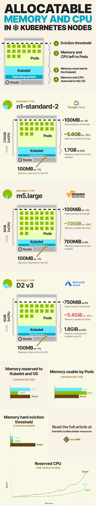
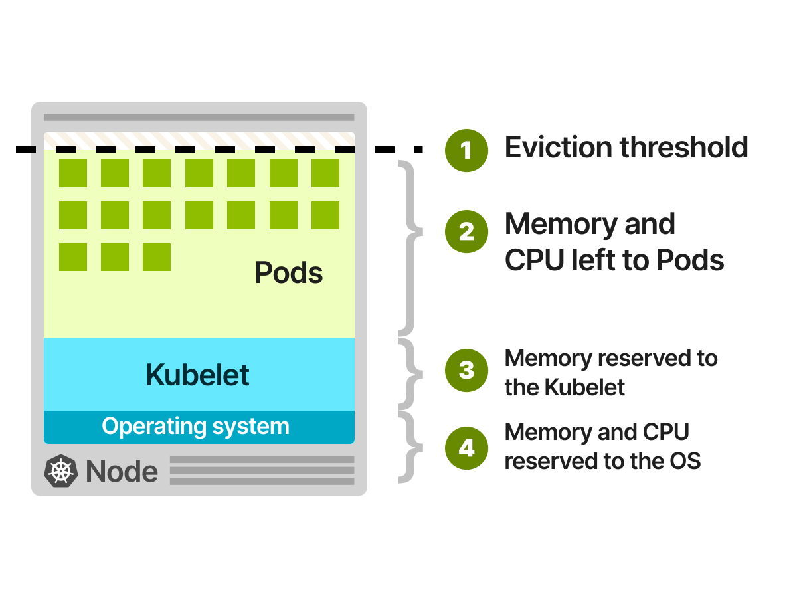
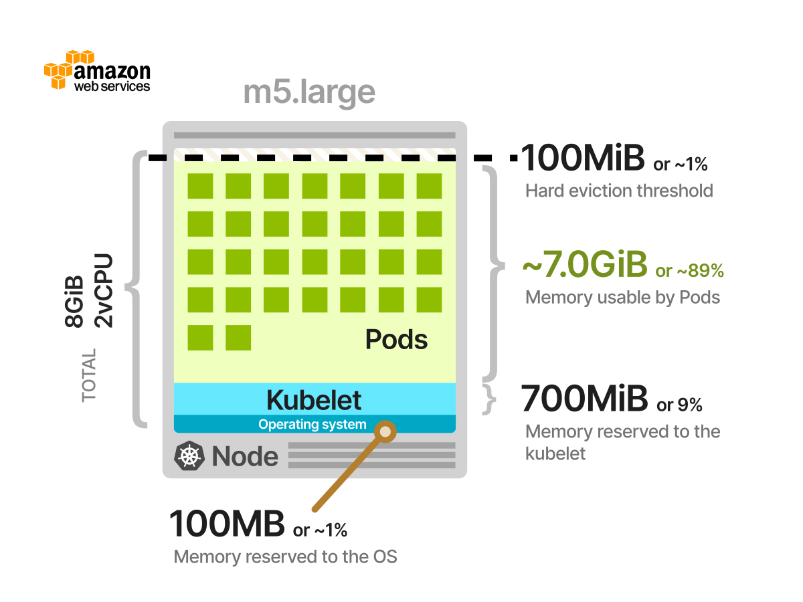

**TL;DR:** Not all CPU and memory in your Kubernetes nodes can be used to run Pods.

_The infographic below summarises how memory and CPU are allocated in Google Kubernetes Engine (GKE), Elastic Kubernetes Service (EKS) and Azure Kubernetes Service (AKS)._



## How resources are allocated in cluster nodes

Pods deployed in your Kubernetes cluster consume resources such as memory, CPU and storage.

**However, not all resources in a Node can be used to run Pods.**

The operating system and the kubelet require memory and CPU too, and you should cater for those extra resources.

If you look closely at a single Node, you can divide the available resources in:

1. Resources needed to run the operating system and system daemons such as SSH, systemd, etc.
1. Resources necessary to run Kubernetes agents such as the Kubelet, the container runtime, [node problem detector](https://github.com/kubernetes/node-problem-detector), etc.
1. Resources available to Pods
1. Resources reserved to the [eviction threshold](https://kubernetes.io/docs/tasks/administer-cluster/reserve-compute-resources/#eviction-thresholds)



As you can guess, [all of those quotas are customisable.](https://kubernetes.io/docs/tasks/administer-cluster/reserve-compute-resources/#eviction-thresholds)

But please notice that reserving 100MB of memory for the operating system doesn't mean that the OS is limited to use only that amount.

It could use more (or less) resources — you're just allocating and estimating memory and CPU usage at best of your abilities.

_But how do you decide how to assign resources?_

Unfortunately, there isn't a _fixed_ answer as it depends on your cluster.

However, there's consensus in the major managed Kubernetes services [Google Kubernetes Engine (GKE)](https://cloud.google.com/kubernetes-engine), [Azure Kubernetes Service (AKS)](https://docs.microsoft.com/en-us/azure/aks/intro-kubernetes), and [Elastic Kubernetes Service (EKS)](https://aws.amazon.com/eks/), and it's worth discussing how they partition the available resources.

## Google Kubernetes Engine (GKE)

Google Kubernetes Engine (GKE) has [a well-defined list of rules to assign memory and CPU to a Node](https://cloud.google.com/kubernetes-engine/docs/concepts/cluster-architecture#memory_cpu).

For memory resources, GKE reserves the following:

- 255 MiB of memory for machines with less than 1 GB of memory
- 25% of the first 4GB of memory
- 20% of the next 4GB of memory (up to 8GB)
- 10% of the next 8GB of memory (up to 16GB)
- 6% of the next 112GB of memory (up to 128GB)
- 2% of any memory above 128GB

For CPU resources, GKE reserves the following:

- 6% of the first core
- 1% of the next core (up to 2 cores)
- 0.5% of the next 2 cores (up to 4 cores)
- 0.25% of any cores above 4 cores

_Let's look at an example._

A virtual machine of type `n1-standard-2` has 2 vCPU and 7.5GB of memory.

According to the above rules the CPU reserved is:

```
Allocatable CPU = 0.06 * 1 (first core) + 0.01 * 1 (second core)
```

**That totals to 70 millicores or 3.5% — a modest amount.**

The allocatable memory is more interesting:

```
Allocatable memory = 0.25 * 4 (first 4GB) + 0.2 * 3.5 (remaining 3.5GB)
```

**The total is 1.7GB of memory reserved to the kubelet.**

At this point, you might think that the remaining memory `7.5GB - 1.7GB = 5.8GB` is something that you can use for your Pods.

_Not really._

**The kubelet reserves an extra 100M of CPU and 100MB of memory for the Operating System and 100MB for the eviction threshold.**

The total CPU reserved is 170 millicores (or about 8%).

However, you started with 7.5GB of memory, but you can only use 5.6GB for your Pods.

**That's close to ~75% of the overall capacity.**


You can be more efficient if you decide to use larger instances.

The instance type `n1-standard-96` has 96 vCPU and 360GB of memory.

If you do the maths that amounts to:

- 405 millicores are reserved for Kubelet and operating system
- 14.16GB of memory are reserved to Operating System, kubernetes agent and eviction threshold.

**In this extreme case, only 4% of memory is not allocatable.**

## Elastic Kubernetes Service (EKS)

Let's explore Elastic Kubernetes Service (EKS) allocations.

> Unfortunately, Elastic Kubernetes Service (EKS) doesn't offer documentation for allocatable resources. You can [rely on their code implementation](https://github.com/awslabs/amazon-eks-ami/blob/master/files/bootstrap.sh#L278) to extract the values.

EKS reserves the following memory for each Node:

```
Reserved memory = 255MiB + 11MiB * MAX_POD_PER_INSTANCE
```

_What's `MAX_POD_PER_INSTANCE`?_

**In Amazon Web Service, each instance type has a different upper limit on how many Pods it can run.**

For example, an `m5.large` instance can only run 29 Pods, but an `m5.4xlarge` can run up to 234.

[You can view the full list here.](https://github.com/awslabs/amazon-eks-ami/blob/master/files/eni-max-pods.txt)

If you were to select an `m5.large`, the memory reserved for the kubelet and agents is:

```
Reserved memory = 255Mi + 11MiB * 29 = 574MiB
```

For CPU resources, [EKS copies the GKE implementation](https://github.com/awslabs/amazon-eks-ami/blob/master/files/bootstrap.sh#L171) and reserves:

- 6% of the first core
- 1% of the next core (up to 2 cores)
- 0.5% of the next 2 cores (up to 4 cores)
- 0.25% of any cores above 4 cores

_Let's have a look at an example._

An `m5.large` instance has 2 vCPU and 8GiB of memory:

1. You know already from the calculation above that 574MiB of memory is reserved to the kubelet.
1. An extra 100M of CPU and 100MB of memory is reserved to the Operating System and 100MB for the eviction threshold.
1. The reserved allocation for the CPU is the same 70 millicores (same as the `n1-standard-2` since they both 2 vCPU and the quota is calculated similarly).



It's interesting to note that the memory allocatable to Pods is almost 90% in this case.

## Azure Kubernetes Service

Azure offers [a detailed explanation of their resource allocations](https://docs.microsoft.com/en-us/azure/aks/concepts-clusters-workloads#resource-reservations).

The memory reserved for the Kubelet is:

- 255 MiB of memory for machines with less than 1 GB of memory
- 25% of the first 4GB of memory
- 20% of the next 4GB of memory (up to 8GB)
- 10% of the next 8GB of memory (up to 16GB)
- 6% of the next 112GB of memory (up to 128GB)
- 2% of any memory above 128GB

Notice how the allocation is the same as Google Kubernetes Engine (GKE).

The CPU reserved for the Kubelet follows the following table:

| CPU CORES | CPU Reserved (in millicores) |
| :-------: | :--------------------------: |
|     1     |              60              |
|     2     |              100             |
|     4     |              140             |
|     8     |              180             |
|     16    |              260             |
|     32    |              420             |
|     64    |              740             |

The values are slightly higher than their counterparts but still modest.

Overall, CPU and memory reserved for AKS are remarkably similar to Google Kubernetes Engine (GKE).

_There's one departure, though._

**The hard eviction threshold in Google and Amazon's offering is 100MB, but a staggering 750MiB in AKS.**

Let's have a look at a D3 v2 instance that has 8GiB of memory and 2 vCPU.


**Only 55% of the available memory is allocatable to Pods, in this scenario.**

## Summary

You might be tempted to conclude that larger instances are the way to go as you maximise the allocable memory and CPU.

**Unfortunately, cost is only one factor when designing your cluster.**

If you're running large nodes you should also consider:

1. The **overhead on the Kubernetes agents that run on the node** — such as the container runtime (e.g. Docker), the kubelet, and cAdvisor.
1. **Your high-availability (HA) strategy.** Pods can be deployed to a selected number of Nodes
1. **Blast radius.** If you have only a few nodes, then the impact of a failing node is bigger than if you have many nodes.
1. **Autoscaling is less cost-effective** as the next increment is a (very) large Node.

_Smaller nodes aren't a silver bullet either._

So you should architect your cluster for the type of workloads that you run rather than following the most common option.

If you wish to explore the pros and cons of different instance types, you should check out this sister blog post [Architecting Kubernetes clusters — choosing a worker node size
](/kubernetes-node-size).
