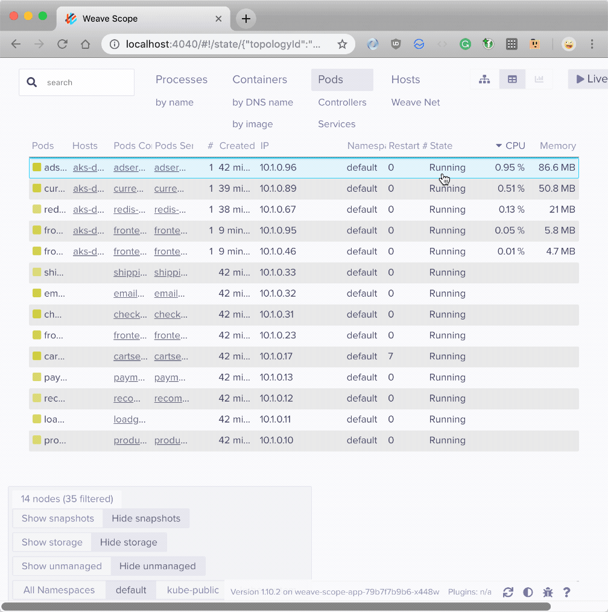
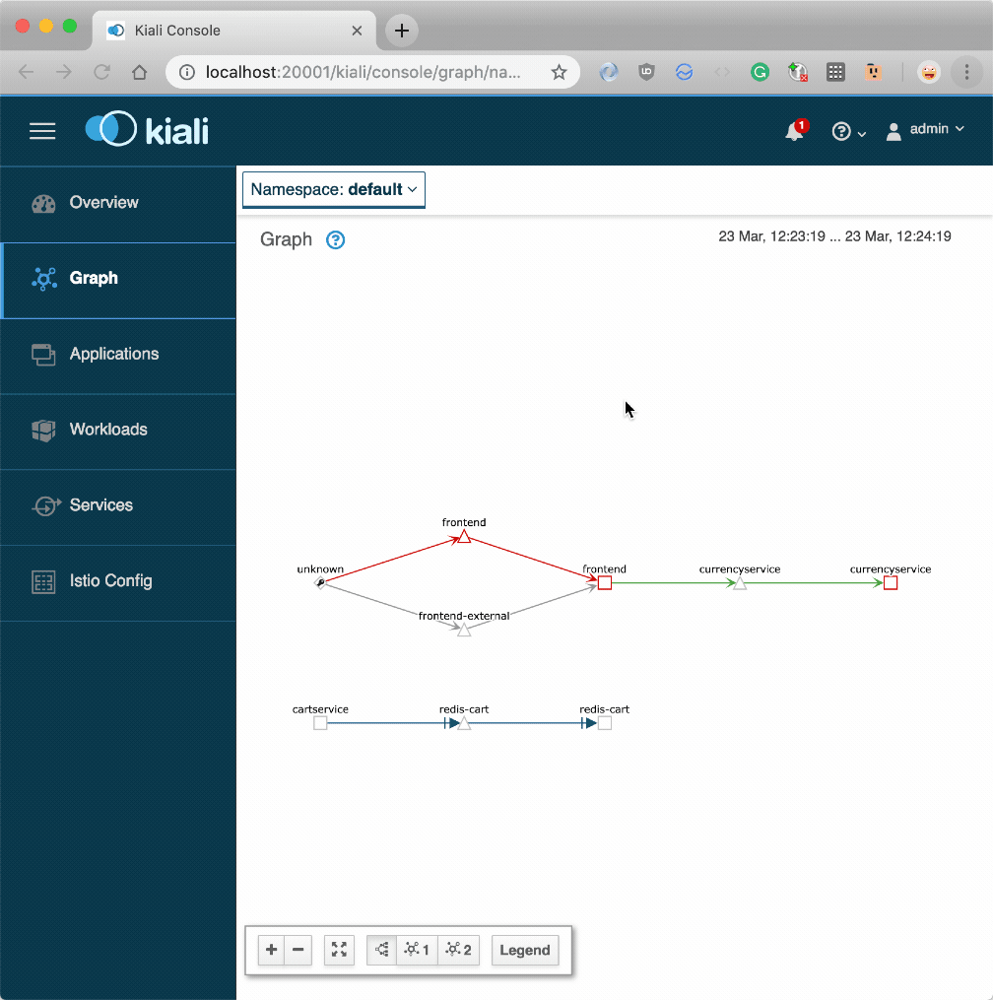

**Welcome to the weekly Ask the Kubernetes Expert** — a monthly column on the most interesting questions that we see online and during our workshops.

This month the answers are curated by Learnk8s' instructor [Daniele Polencic](https://twitter.com/danielepolencic).

Daniele has a background in software development and has deployed to Kubernetes since version 1.2.

**The top questions of this month are:**

1. [How do I connect clusters living in different data centres?](#1-how-do-i-connect-clusters-living-in-different-data-centres-)
1. [Can I have an API Gateway as an ingress?](2-can-i-have-an-api-gateway-as-an-ingress-)
1. [Is there any tool to visualise the dependency between YAML files?](3-is-there-any-tool-to-visualise-the-dependency-between-yaml-files-)
1. [Is Helm used just for templating?](4-is-helm-used-just-for-templating-)

If you wish to have your question featured on the next episode, [please get in touch](mailto:hello@learnk8s.io).

## 1. How do I connect clusters living in different data centres?

> **TL;DR:** [Kubefed v2 is coming soon](https://github.com/kubernetes-sigs/federation-v2), you probably want to check out [Shipper](https://github.com/bookingcom/shipper) and the [multi-cluster-scheduler project](https://github.com/admiraltyio/multicluster-scheduler).

It's relatively common to see the infrastructure being replicated and distributed in different geographical regions, particularly in regulated environments.

**If one of the regions becomes unavailable, you can always route your traffic to another location and continue serving traffic.**

When it comes to Kubernetes, you might want to use a similar strategy and distribute your workloads in different regions.

_But how should you design the infrastructure for such geographical split?_

_Should you create a single large cluster that spans multiple regions over a unified network?_

_Or should you have a lot of smaller clusters and find a way to manage and synchronise them?_

Creating a single cluster that uses a unified network isn't recommended due to challenges such as:

- **Distributing traffic using Kube-proxy.** Your requests could land in one region and being redirected to another
- **Etcd being very picky when it comes to network latency.** etcd is so sensitive to network latency that even not running SSD disk could cause delays in reconciliations and slowdowns in your cluster.

Most of the effort from the community and the SIG-cluster group is focussed on the latter question — finding a way to orchestrate clusters in the same way that Kubernetes orchestrates containers.

### Option #1 — Federated clusters with kubefed

The official response from SIG-cluster is [kubefed2 — a revised version of the original kube federation client and operator](https://github.com/kubernetes-sigs/federation-v2).

The first attempt at managing a collection of clusters as a single entity came from a tool called kube federation.

It was a good start, but kube federation ended up being not so popular because not all resources were supported.

The tool had support for federated Deployments and Services but didn't cover StatefulSets, for example.

Also, the federation configuration was passed as annotations and wasn't flexible.

_Can you imagine describing the replicas split for each cluster in a federation using only annotations?_

**That ended up to be messy.**

SIG-cluster has gone a long way since kubefed v1 and decided to tackle the challenge again but from a different angle.

**Instead of using annotations, they decided to release a controller that can be installed in your clusters and can be configured using Custom Resource Definitions (CRDs).**

You have a CRD for each resource that you wish to federate.

The federated CRD has three sections:

- the standard resource definition such as a Deployment
- a `placement` section where you can define how that resource should be distributed in the federation
- an `override` section where you can override weights and settings specified in the placement just for a particular cluster

Here's an example of a federated Deployment with placements and overrides.

```yaml|title=federated-deployment.yaml
apiVersion: types.federation.k8s.io/v1alpha1
kind: FederatedDeployment
metadata:
  name: test-deployment
  namespace: test-namespace
spec:
  template:
    metadata:
      labels:
        app: nginx
    spec:
      replicas: 3
      selector:
        matchLabels:
          app: nginx
      template:
        metadata:
          labels:
            app: nginx
        spec:
          containers:
            - image: nginx
              name: nginx
  placement:
    clusterNames:
      - cluster2
      - cluster1
  overrides:
    - clusterName: cluster2
      clusterOverrides:
        - path: spec.replicas
          value: 5
```

As you can imagine, the Deployment is distributed in two clusters: `cluster1` and `cluster2`.

The first cluster deploys three replicas whereas the second overrides the value to 5.

If you wish to have more control on the number of replicas, kubefed2 exposes a new object called ReplicaSchedulingPreference where you can distribute replicas in weighted proportions:

```yaml|title=preference.yaml
apiVersion: scheduling.federation.k8s.io/v1alpha1
kind: ReplicaSchedulingPreference
metadata:
  name: test-deployment
  namespace: test-ns
spec:
  targetKind: FederatedDeployment
  totalReplicas: 9
  clusters:
    A:
      weight: 1
    B:
      weight: 2
```

The final design for the CRD and the API is not finalised, and there's a lot of activity on the official project repository.

**You should keep a close eye on kubefed2, but you should also be aware of that this is not production ready yet.**

You can learn more about kubefed2 from [the official kubefed2 article](https://kubernetes.io/blog/2018/12/12/kubernetes-federation-evolution/) published on the Kubernetes Blog and [from the official repository of the kubefed project](https://github.com/kubernetes-sigs/federation-v2).

### Option #2 — Cluster federation the Booking.com way

Booking.com's engineering team wasn't involved with the design of kubefed v2, so they developed shipper — an operator for multi-cluster, multi-region, multi-cloud deployment.

[Shipper](https://github.com/bookingcom/shipper) has a few similarities with kubefed2.

Both tools let you customise the rollout strategy to multiple clusters, which is excellent if you are looking to craft a rollout strategy with the appropriate speed/risk balance for your particular situation.

_However, Shipper is more opinionated._

As an example, Shipper is designed to take Helm charts as inputs, and you can't use vanilla resources.

Shipper is also used for production infrastructure, so it's technically a more mature and reliable product than kubefed2.

Here's a high-level overview of how Shipper works.

Instead of creating a standard Deployment, you should create an Application resource that wraps an Helm chart like this:

```yaml|title=application.yaml
apiVersion: shipper.booking.com/v1alpha1
kind: Application
metadata:
  name: super-server
spec:
  revisionHistoryLimit: 3
  template:
    chart:
      name: nginx
      repoUrl: https://storage.googleapis.com/shipper-demo
      version: 0.0.1
    clusterRequirements:
      regions:
        - name: local
    strategy:
      steps:
        - capacity:
            contender: 1
            incumbent: 100
          name: staging
          traffic:
            contender: 0
            incumbent: 100
        - capacity:
            contender: 100
            incumbent: 0
          name: full on
          traffic:
            contender: 100
            incumbent: 0
    values:
      replicaCount: 3
```

When you submit the resource to the cluster, the Shipper controller takes care of rolling out the change in all federated clusters.

**Shipper is an interesting contender in the multi-cluster deployment space, but its tight integration with Helm is also a significant concern.**

You can learn more about Shipper and its philosophy by [reading the official press release](https://medium.com/booking-com-infrastructure/introducing-shipper-daf9244e3882).

If you prefer to dive into the code, you should [head over to the official project repository](https://github.com/bookingcom/shipper).

### Option #3 — Magic ✨ cluster federation

Kubefed v2 and Shipper solve cluster federation by exposing new resources to the cluster using Custom Resource Definitions.

_But what if you don't want to rewrite all of your Deployments, StatefulSets, Services etc. to be federated?_

_Can you still federate your existing cluster without changing the YAML?_

[multi-cluster-scheduler is a project from Admirality](https://github.com/admiraltyio/multicluster-scheduler) that aims at solving scheduling workloads across clusters.

But instead of creating a new way to interact with the cluster and wrapping resources in Custom Resource Definitions, the multi-cluster-scheduler inject itself in the standard Kubernetes lifecycle and intercept all the calls that create Pods.

When a Pod is created is immediately replaced by a proxy Pod.

The original Pod goes through another round of scheduling where the placement decision is taken after interrogating the entire federation.

Finally, the Pod is deployed in the target cluster.

In other news, you end up having one extra Pod that doesn't do much — it's just a placeholder.

But the benefit is that you didn't have to write any new resource to make your Deployments federated.

Every resource that creates Pod is automatically federation-ready.

It's a neat idea because you can suddenly have multi-region clusters without even noticing it, but it also feels quite risky as there's a lot of magic going on.

If you wish to dive more into the multi-cluster-scheduler, you should check out [the official repository page](multi-cluster-scheduler).

If you prefer to read about the multi-cluster-scheduler in action, Admiralty has an [interesting use case applied to Argo](https://admiralty.io/blog/running-argo-workflows-across-multiple-kubernetes-clusters/) — the open source Kubernetes native workflows, events, CI and CD.

### More tools and solutions

Connecting and managing multiple clusters together is a complex topic, and there's a solution fits all.

If you're interested in diving more into the topic, you should have a look at the following resources:

- [Submariner from Rancher](https://submariner.io), a tool built to connect overlay networks of different Kubernetes clusters
- The retailer Target is using [Spinnaker to orchestrate deployment across several clusters](https://tech.target.com/infrastructure/2018/06/20/enter-unimatrix.html)
- You could use IPV6 and have a [unified network across several regions](https://itnext.io/kubernetes-multi-cluster-networking-made-simple-c8f26827813)
- You could use a service mesh such as [Istio to connect multiple clusters](https://istio.io/docs/setup/kubernetes/install/multicluster/).

## 2. Can I have an API Gateway as an ingress?

> **TL;DR:** yes, you can. Have a look at the [Kong](https://konghq.com/blog/kong-kubernetes-ingress-controller/) and [Ambassador Ingress](https://www.getambassador.io/).

In Kubernetes, an Ingress is a component that routes the traffic from outside the cluster to your services and Pods inside the cluster.

In simple terms, **the Ingress works as a reverse proxy** or a load balancer: all external traffic is routed to the Ingress and then is routed to the other components.

While the most popular ingress is the [ingress-nginx project](https://github.com/kubernetes/ingress-nginx), there're several other options when it comes to selecting and using an Ingress.

You can choose from Ingresses that:

- handle HTTP traffic such as [Contour](https://github.com/heptio/contour) and [Treafik Ingress](https://docs.traefik.io/user-guide/kubernetes/)
- support UDP and TCP traffic such as [Citrix Ingress](https://github.com/citrix/citrix-k8s-ingress-controller)
- support Websockets such as [HAProxy Ingress](https://github.com/jcmoraisjr/haproxy-ingress)

There are also other hybrid ingresses can integrate with existing cloud providers such as [Zalando's Skipper Ingress](https://opensource.zalando.com/skipper/).

### Option #1 — The king of API Gateways: Kong

But if the product that you're building is primarily an API, you might be interested in what the [Kong Ingress](https://konghq.com/blog/kong-kubernetes-ingress-controller/) has to offer.

Kong is an API gateway built on top of Nginx.

It offers features such as authentication, rate limiting, retries, circuit breakers and more.

What's interesting about Kong is that comes packaged as a Kubernetes Ingress.

So you could use in your cluster as a gateway between your users and your backends.

You can expose your API to external traffic with the standard Ingress object:

```yaml|title=ingress.yaml
apiVersion: extensions/v1beta1
kind: Ingress
metadata:
  name: my-ingress
spec:
  rules:
    - host: example.com
      http:
        paths:
          - path: /
            backend:
              serviceName: api-service
              servicePort: 80
```

But there's more.

As part of the installation process Kong's controller registers Custom Resource Definitions (CRDs). One of these custom extensions is related to Kong's plugins.

If you wish to limit the requests to your Ingress by IP address, you can create a definition for the limit with:

```yaml|title=limit-by-ip.yaml
apiVersion: configuration.konghq.com/v1
kind: KongPlugin
metadata:
  name: rl-by-ip
config:
  hour: 100
  limit_by: ip
  second: 10
plugin: rate-limiting
```

And you can reference the limit with an annotation in your ingress with:

```yaml|highlight=5-6|title=ingress.yaml
apiVersion: extensions/v1beta1
kind: Ingress
metadata:
  name: my-ingress
  annotations:
    plugins.konghq.com: rl-by-ip
spec:
  rules:
    - host: example.com
      http:
        paths:
          - path: /
            backend:
              serviceName: api-service
              servicePort: 80
```

You can [explore the Custom Resource Definitions (CRDs) for Kong](https://github.com/Kong/kubernetes-ingress-controller/blob/master/docs/custom-resources.md) on the official documentation.

But Kong isn't the only option.

### Option #2 — Ambassador, the modern API gateway

[Ambassador is another Kubernetes Ingress](https://www.getambassador.io/) built on top of Envoy that offers a robust API Gateway.

The Ambassador Ingress is a modern take on Kubernetes Ingresses as demonstrated by its rapid development and the traction received by the community.

The main difference between Ambassador and Kong/Nginx is that Ambassador doesn't use the familiar Kubernetes Ingress.

Instead, services are exposed to the outside world using annotations within the Service:

```yaml|highlight=7-15|title=service.yaml
apiVersion: v1
kind: Service
metadata:
  labels:
    service: api-service
  name: api-service
  annotations:
    getambassador.io/config: |
      ---
      apiVersion: ambassador/v0
      kind: Mapping
      name: example_mapping
      prefix: /
      service: example.com:80
      host_rewrite: example.com
spec:
  type: LoadBalancer
  ports:
    - port: 80
      targetPort: 80
  selector:
    service: api-backend
```

The novel approach is interesting because in a single place you can define all the routing for your Deployments and Pods.

However, having YAML as free text within an annotation could lead to errors and confusion.

If you wish to apply rate limiting to your API, this is what it looks like in Ambassador:

```yaml|highlight=5-11|title=service.yaml
apiVersion: v1
kind: Service
metadata:
  name: api-service
  annotations:
    getambassador.io/config: |
      ---
      apiVersion: ambassador/v1
      kind: RateLimitService
      name: ratelimit
      service: "api-service:5000"
spec:
  type: ClusterIP
  selector:
    app: api-service
  ports:
    - port: 5000
      targetPort: http-api
```

Ambassador has an excellent tutorial about rate limiting, so if you are interested in using that features, you can head over to [Ambassador's official documentation](https://www.getambassador.io/user-guide/rate-limiting-tutorial/).

### More options

If neither Ambassador or Kong is suitable for what you do, you should check out the following alternatives:

- [Tyk](https://tyk.io/) is an open source API gateway that can be deployed as an Ingress.
- You could [build your API gateway Ingress using Ballerina](https://ballerina.io/learn/by-guide/api-gateway/) — a Cloud Native programming language

## 3. Is there any tool to visualise the dependency between YAML files?

> **TL;DR:** Not for YAML. But you can visualise your dependencies in the cluster with [Weave Scope]((https://github.com/weaveworks/scope) or [Istio](https://istio.io).

When you have a large number of resources in your cluster, you might lose track of all relationships between them.

Keeping track of dependencies is even more challenging when you're managing distributed teams or have several clusters.

_Wouldnot be nice if you could have a tool that reads a repository and show the dependencies between your Deployments, Services, Persistent Volume Claims etc.?_

Unfortunately, such a tool doesn't exist for YAML.

YAML is a human-readable configuration language, and it doesn't have a way to express relationships with other YAML files.

You could write a tool to analyse YAML files and link them together statically, but you will have to duplicate all the rules that power Kubernetes such as namespaces, selectors, etc. to make sure that you can draw a correct dependency graph.

However, if your goal is to visualise dependencies, you could focus on the cluster and ignore the YAML.

### Option #1 — Weave Scope, the Kubernetes dashboard

[Weave Scope](https://github.com/weaveworks/scope) is one of those tools that — once installed into your cluster — can help you visualise your Kubernetes resources in a dependency graph.

Weave scope connects to the Kubernetes API and queries your resources to draw a dependency graph.

As an example, have a look at the dependencies for the [microservices-demo project from Google Cloud Platform](https://github.com/GoogleCloudPlatform/microservices-demo) — a collection of ten microservices that are meant to be demoing an e-commerce website.



As you can see the tool automatically maps dependencies between Pods.

The tool isn't limited to dependencies, though.

As part of the installation process, you can have agents on every node that probe the nodes for metrics.

You can use Weave Scope to monitor for CPU and memory in your nodes [as well as other useful metrics](https://github.com/weaveworks-plugins/).

And even better, Weave Scope has a mechanism to create custom plugins.

Weavescope isn't the only tool that can identify and visualise dependencies in your cluster.

### Option #2 — Tracing the traffic

If you could trace all the traffic between your components, you should be able to visualise the dependency and observe the state of your system in real time.

**Even if you don't use Kubernetes.**

A tool such as [Istio](https://istio.io) or [Linkerd2](https://linkerd.io/2/overview/) are designed to do just that: augment your network so you can debug, observe, and secure your traffic without requiring any changes to your code.

In this example, you will have a look at Istio, but the same applies to any other similar technology.

After you install Istio in your cluster, every new Pod has a companion container that is in charge of routing all the inbound and outbound traffic to that Pod.

You can think about it as a proxy container.

The proxy does a lot more than just routing the traffic, though.

It can collect metrics and receive instructions from the control plane.

When every app in your cluster has a sidecar proxy, you can visualise the flow of the traffic.

Here's the same collection of microservices deployed in a cluster with Istio enabled:



As you can see the graph is identical to the one drawn by Weave Scope.

But Istio didn't have to interrogate the Kubernetes API to draw any of it.

Using a service mesh such as Istio, isn't a free lunch, though.

Adding it to an existing cluster is not trivial, because you have to recreate all the Pods with the proxy container.

Also adding an extra container to every Pod affects latency and resource consumption.

### More options

Two noteworthy tools can help visualise dependencies in your cluster:

- [Linkerd2](https://linkerd.io/2/overview/), another service mesh similar to Istio
- [Kubebricks](https://github.com/kubricksllc/Kubricks), an electron app that connects to your cluster using kubectl and helps you visualise your dependencies

## 4. Is Helm used just for templating?

> **TL;DR:** Helm is used for templating, sharing charts and managing releases.

When you start using Kubernetes in different environments, you might see yourself copy-pasting the same YAML resources over and over.

A better strategy is to create and use dynamic templates as you've done for HTML in web pages — for example.

All the variables that can change are replaced with placeholders.

Before submitting them to the cluster, you could use the template engine of choice to customise them with the correct value.

```yaml|highlight=11|title=pod.yaml
apiVersion: v1
kind: Pod
metadata:
  name: test-pod
spec:
  containers:
    - name: test-container
      image: k8s.gcr.io/busybox
      env:
        - name: ENV
          value: { { .Values.env_name } }
```

While there're a lot of tools to template Kubernetes YAML files, Helm caught a lot of attention very early on and established itself as the market leader.

Helm is a convenient templating engine: it uses the [Go templating engine](https://golang.org/pkg/text/template/) and the [helpers from the Sprig library](https://github.com/Masterminds/sprig).

But the reason for such a quick uptake isn't for the templating alone.

**A collection of templated resources in Helm is called a chart.**

Charts are similar to archives, and you can share them with your colleagues or uploaded them to a registry.

Charts became such a ubiquitous tool to share collections of YAML files that made Helm even more popular.

[Have a look at all the available charts on the public registry](github.com/helm/charts/).

> Please note that you can use `helm search <keyword>` to search for a specific chart on the official registry.

Companies started sharing packages internally for their teams, and that led to private registries.

You have a public registry with packages contributed by the community and private registry for internal use.

Tools such as [Artifactory](https://www.jfrog.com/confluence/display/RTF/Helm+Chart+Repositories) or [Azure Container Registry](https://azure.microsoft.com/en-us/updates/azure-container-registry-helm-repositories-public-preview/) are popular options when it comes to using a registry to store your private charts.

If you wish to host your private registry [Chartmuseum is a solid choice](https://github.com/helm/chartmuseum).

But templating and sharing charts are not the only task that Helm can handle.

Helm is deployed into parts: a client-side tool that is connected to a controller that lives inside your cluster.

Every time you install a chart or upgrade your definitions, the client side tool sends the YAML resources to the controller.

The controller templates the YAML and stores a copy of the resources in a history table.

```slideshow
{
  "description": "Description",
  "slides": [
    {
      "image": "28-templating.svg",
      "description": "When you create resources with Helm, the request is sent to your cluster."
    },
    {
      "image": "29-templating.svg",
      "description": "But before the resources are submitted to the API, they are collected and templated by an operator: the tiller."
    },
    {
      "image": "30-templating.svg",
      "description": "The tiller is in charge of storing previous resources used for deployments as well as templating the YAML."
    },
    {
      "image": "74-templating.svg",
      "description": "Helm records every resource that you submit in the Tiller."
    },
    {
      "image": "75-templating.svg",
      "description": "It also records all the updates and upgrade you did to your releases."
    }
  ]
}
```

Keeping track of all releases is handy.

You can roll back when you notice that the current deployment doesn't behave the way you expect.

```slideshow
{
  "description": "Helm history",
  "slides": [
    {
      "image": "78-templating.svg",
      "description": "If you realise that a release contained a bug, you can rollback."
    },
    {
      "image": "79-templating.svg",
      "description": "Helm creates a new entry in the history table and reverts the resource definition to the previous deployment."
    }
  ]
}
```

Helm helps you manage the lifecycle of your releases.

From creating to updating and deleting charts, Helm makes sure there's always an audit trail, and you can inspect the current and past states.

To summarise, Helm is:

- a **templating engine** for your YAML files
- a convenient way for **packaging collections of YAML files and distributing them** in public and private registry
- a **release manager** capable of rolling back deployments

## That's all folks

Thanks for reading until the end!

A special thank you goes to [XXXX](xxx) and [XXX](xxx) that reviewed the content of this article.

Don't forget that if you wish to have your question featured on the next episode, [you should get in touch](mailto:hello@learnk8s.io).
