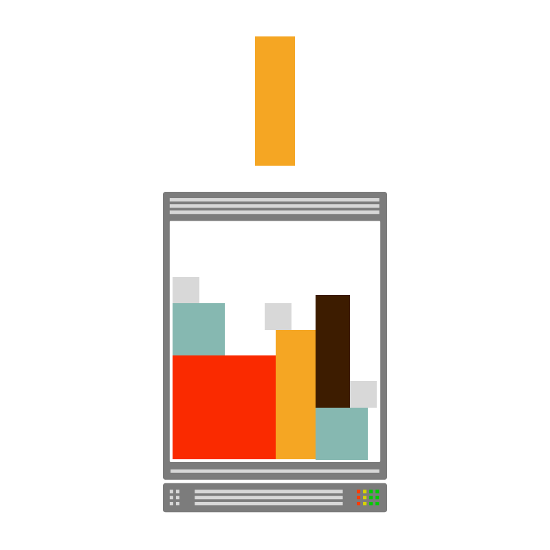

# Application development

Are you following the best practices?

## Pods have health checks

Kubernetes offers two mechanisms to track the lifecycle of your containers and Pods: liveness and readiness probes.

**The readiness probe determines when a container can receive traffic.**

The kubelet executes the checks and decides if the app can receive traffic or not.

**The liveness probe determines when a container should be restarted.**

The kubelet executes the check and decides if the container should be restarted.

> Please note that there's no default value for readiness and liveness.

If you don't set the readiness probe, the kubelet assumes that the app is ready to receive traffic as soon as the container starts.

If the container takes 2 minutes to start, all the requests to it will fail for those 2 minutes.

_Omitting the liveness probe won't cause as much troubles._

The probe is designed to restart your container when it's stuck due to edge-case scenarios such as a dead-lock.

_But if you can detect the deadlock and signal a failing liveness probe, why not exiting from the deadlock in the first place?_

It's a fair question, and that's perhaps the reason why liveness probes are generally not necessary.

It's a best practice to let the app crash rather than signalling a failing liveness probe.

It's worth noting that [using the `exec` command to probe the process inside the container could lead to zombie processes](https://www.youtube.com/watch?v=QKI-JRs2RIE).

You should avoid using it if you can.

### References

- [Configure Liveness, Readiness and Startup Probes](https://kubernetes.io/docs/tasks/configure-pod-container/configure-liveness-readiness-startup-probes/)
- [Liveness probes are dangerous](https://srcco.de/posts/kubernetes-liveness-probes-are-dangerous.html)"

### Checklist

- [ ] Containers have readiness probes
- [ ] Avoid using the liveness probe (if you can)
- [ ] Don't use `exec` for your probes

## Apps are independent

You might be tempted to signal the readiness of your app only if all of the dependencies such as databases or backend API are also ready.

If the app connects to a database, you might think that returning a failing readiness probe until the database is _ready_ is a good idea — it is not.

Consider the following scenario: you have one front-end app that depends on a backend API.

If the API is flaky (e.g. it's unavailable from time to time due to a bug), the readiness probe fails, and the dependent readiness in the front-end app fail as well.

And you have downtime.

More in general, **a failure in a dependecy downstream could propagate to all apps upstream** and eventually bring down your front-end facing layer as well.

_But it doesn't stop there._

When there are dependencies between the two apps, you can't deploy the front-end unless you deploy the backend first.

It makes sense, the readiness for the front-end is dependent on the backend.

While it might not sound like a lot of work with two components, imagine when you have a complex collection of apps interacting together.

You might need to figure out what's **the correct sequence of releases to have your service running**.

That's not only impractical, it's also not feasible most of the time — particularly when you have circular dependencies.

In general, you shouldn't create dependencies between your apps.

Instead, you should make sure that apps are self-sufficient and they try to reconnect to their dependencies (perhaps with an exponential backoff strategy).

### References

- [Configure Liveness, Readiness and Startup Probes](https://kubernetes.io/docs/tasks/configure-pod-container/configure-liveness-readiness-startup-probes/)
- [Liveness probes are dangerous](https://srcco.de/posts/kubernetes-liveness-probes-are-dangerous.html)

### Checklist

- [ ] The Readiness probes are independent
- [ ] The app retries connecting to dependent services

## Pods gracefully shut down

When a Pod is deleted you don't want to abruptly terminate all connections.

Instead, you should wait for the existing connection to drain and stop processing new ones.

You can be notifed when the Pod is about to be terminated by capturing the SIGTERM signal in your app.

Please notice that, when a Pod is terminated, the endpoints for that Pod are removed from the Service.

However, it might take some time before component such as kube-proxy or the Ingress controller are notified of the change.

Hence, traffic might still flow to the Pod despite it being marked as terminated.

In other words, you should:

- listen for the SIGTERM signal in your app
- process current connection
- wait "long enough" to process the few "late" incoming connections
- terminate the current process

> You might want to consider using the container lifecycle events such as [the preStop handler](https://kubernetes.io/docs/tasks/configure-pod-container/attach-handler-lifecycle-event/#define-poststart-and-prestop-handlers) to customise what happened after a Pod is deleted.

### References

- [Handling Client Requests Properly with Kubernetes](https://freecontent.manning.com/handling-client-requests-properly-with-kubernetes/)
- [Graceful shutdown of pods with Kubernetes](https://pracucci.com/graceful-shutdown-of-kubernetes-pods.html)"

### Checklist

- [ ] The app doesn't shut down on SIGTERM, but it waits
- [ ] The CMD in the `Dockerfile` forwards the SIGTERM to the process

## Fault tolerance

Your cluster nodes could disappear at any time for several reasons:

- a hardware failure of the physical machine
- cloud provider or hypervisor failure
- a kernel panic

Pods deployed in those nodes are lost.

Also, there are other scenarios where Pods could be deleted:

- directly deleting a pod (accident)
- draining a node
- removing a pod from a node to permit another Pod to fit on that node

Any of the above scenarios could affect the availability of your app and potentially cause downtime.

You should protect from a scenario where all of your Pods are made unavailble and you aren't able to serve live traffic.

### References

- [Disruptions](https://kubernetes.io/docs/concepts/workloads/pods/disruptions/)
- [Node Management in GKE](https://cloudmark.github.io/Node-Management-In-GKE)
- [Inter-pod affinity and anti-affinity](https://kubernetes.io/docs/concepts/configuration/assign-pod-node/#inter-pod-affinity-and-anti-affinity)

### Checklist

- [ ] Run at least three replicas for your Deployment
- [ ] Set up the Horizontal Pod Autoscaler
- [ ] Avoid Pods being places into a single node
- [ ] Set Pod disruption budgets

## Define resource limits

Resource limits are used to constraint how much CPU and memory your containers can utilise and are set using the resources property of a containerSpec.

The scheduler uses limits as one of metrics to decide which node is best suited for the current Pod.

You can think about the Kubernetes scheduler as a skilled Tetris player.

Docker containers are the blocks; servers are the boards, and the scheduler is the player.

A container without a memory limit has memory utilisation of zero — according to the scheduler.

_Have you ever tried to play tetris when the blocks don't have width (CPU) and height (memory)?_

An unlimited number of Pods if schedulable on any nodes leading to resource overcommitment and potential node (and kubelet) crashes.

The same applies to CPU limits, but it's more complicated.

CPU resources are measured as CPU timeunits per timeunit.

`cpu: 1` means 1 CPU second per second.

If you have 1 thread, you can't consume more than 1 CPU second per second.

If you have 2 threads, you can consume 1 CPU second in as little as 0.5 seconds.

8 threads can consume 1 CPU second in 0.125 seconds.

_What happens when you run out of CPU?_

The process is throttled.

If you can't get your head around CPU limits, [it's fine, don't use them](https://www.reddit.com/r/kubernetes/comments/cmp7jj/multithreading_in_a_container_with_limited/ew52fcj/).

Please note that if you are not sure what should be the _right_ CPU or memory limit, you can use the [Vertical Pod Autoscaler](https://github.com/kubernetes/autoscaler/tree/master/vertical-pod-autoscaler) in Kubernetes with the recommendation mode turned on.

The autoscaler profiles your app and recommends limits for it.

If you think you might forget to set limits in your containers, you should think about including a [LimitRange object](https://kubernetes.io/docs/concepts/policy/limit-range/) to give containers default limits.

### Reference

- [Managing Compute Resources for Containers](https://kubernetes.io/docs/concepts/configuration/manage-compute-resources-container/)
- [Understanding resource limits in kubernetes: memory](https://medium.com/@betz.mark/understanding-resource-limits-in-kubernetes-memory-6b41e9a955f9)
- [Understanding resource limits in kubernetes: cpu time](https://medium.com/@betz.mark/understanding-resource-limits-in-kubernetes-cpu-time-9eff74d3161b)"

### Checklist

- [ ] Set memory limits for all containers
- [ ] Set CPU limits for all containers, _only if you understand how to use them_
- [ ] The namespace has a LimitRange with default values for memory and CPU
