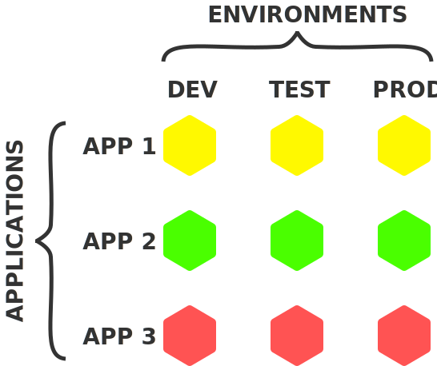
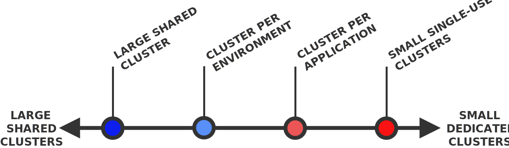
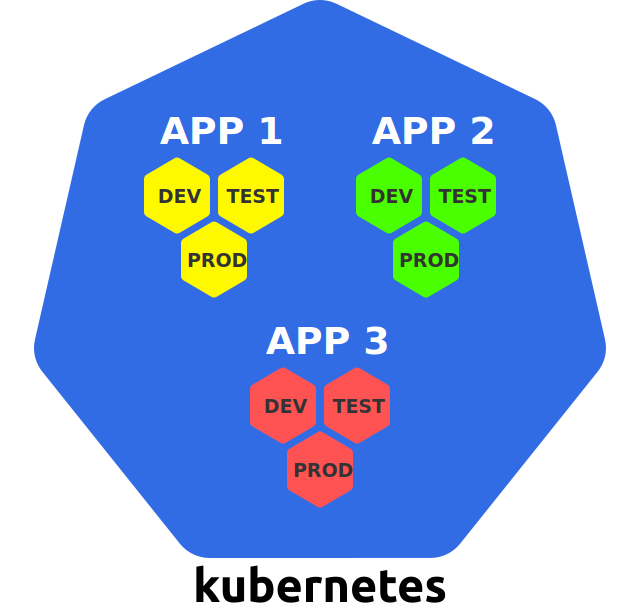
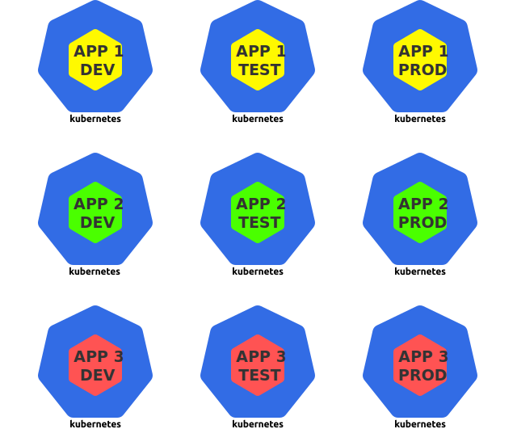
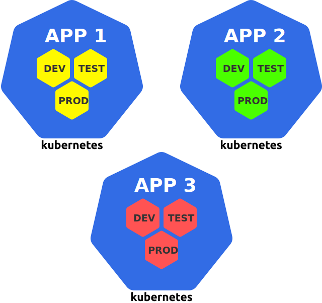
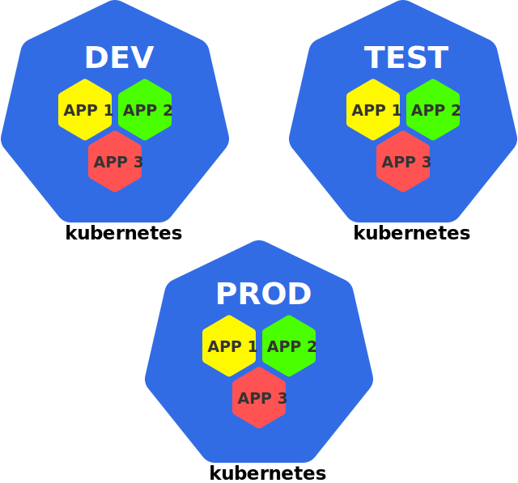
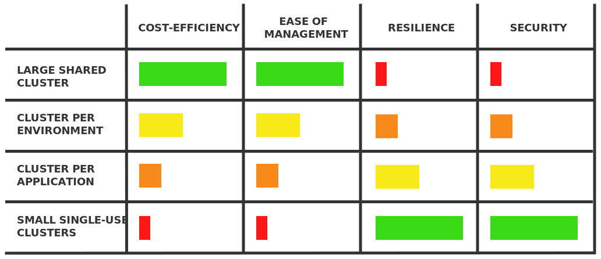

**If you use Kubernetes as the operational platform for your applications, you are confronted with the following type fundamental questions:**

- _How many clusters should you have?_
- _How big should they be?_
- _What should they contain?_

This article gets to the bottom of this question and analysing the pros and cons of some of the options you have.

## The problem

As a software creator, you typically develop and operate multiple applications.

Furthermore, you typically run multiple instances of each application in different environments — for example, you might have a _dev_, _test_, and _prod_ environment.

This results in a "matrix" of applications and environments:

In the above example, there are 3 applications and 3 environments, which results in 9 application instances.

Each application instance is a self-contained unit that can be deployed and run independently.

> Note that an **application instance** may consist of multiple **components**, such as the frontend, backend, database, etc. (in a microservices application, it consists of all the microservices that make up the application). For the sake of this article, an application instance is always deployed as a **unit**, that is, all the components of an application instance are _always_ deployed to the _same_ Kubernetes cluster.

As a Kubernetes user, this immediately raises some questions:

- _Should you run all application instances on a single cluster?_
- _Or should you have a separate cluster for each application instance?_
- _Or should you use a combination of the above?_

All of these are valid approaches — Kubernetes is a flexible system and it doesn't dictate you how to use it!

This article explores the pros and cons of different approaches along the dimension from _"few large shared"_ to _"many small dedicated"_ Kubernetes clusters — in particular, these are:

- [**Large shared cluster**](#1-large-shared-cluster)
- [**Small single-use clusters**](#2-small-single-use-clusters)
- [**Cluster per application**](#3-cluster-per-application)
- [**Cluster per environment**](#4-cluster-per-environment)

Note that the first two approaches mark the two extremes on the scale, and the other two approaches are in between — this is shown in the following:

> In general, a cluster can be defined "larger" than another if it contains a larger sum of nodes ands Pods — for example, a cluster with 10 nodes and 100 Pods is larger than a cluster with 1 node and 10 Pods.

_Let's get started!_

## 1. Large shared cluster

The first approach is to have a single shared cluster that you use for everything:

In this case, you deploy every workload to this same cluster — in particular, this also applies to all your application instances, as shown above.

With this approach, the Kubernetes cluster is used like general-purpose **infrastructure platform** — whatevery you need to run, you deploy it to your existing Kubernetes cluster.

> Kubernetes provides [namespaces](https://kubernetes.io/docs/concepts/overview/working-with-objects/namespaces/) to logically separate portions of a cluster from each other, and in the above case, you could use a separate namespace for each application instance.

_Now, let's look at the pros and cons of this approach._

### 👍 Efficient resource usage

If you have only one Kubernetes cluster, you need to have only one copy of all the resources that are needed to run and manage a Kubernetes cluster.

This includes, for example, the master nodes — a Kubernetes cluster typically has 3 master nodes, and if you have only a single cluster, you need only 3 master ndoes in total (compared to 30 master nodes if you have 10 Kubernetes clusters).

But this also includes any other cluster-wide services, such as load balancers, Ingress controllers, authentication, logging, and monitoring.

If you have only a single cluster, you can reuse these services for _all_ your workload, and you don't need to have multiple copies of them for each of your clusters.

### 👍 Cheap

As a consequence of the above point, a single shared cluster is usually cheaper than many dedicated cluster, because resources cost money.

This is particularly true for the resources needed for the Kubernetes control plane, such as the master nodes.

If you use use managed Kubernetes services that provide the Kubernetes control plane for free, such as [Google Kubernetes Engine (GKE)](https://cloud.google.com/kubernetes-engine) or [Azure Kubernetes Service (AKS)](https://docs.microsoft.com/en-us/azure/aks/), then this may be less of an issue.

However, there are also managed Kubernetes services that charge a fixed amount for running a Kubernetes cluster, such as [Amazon Elastic Kubernetes Service (EKS)](https://aws.amazon.com/eks/).

Clearly, in these cases, running only one cluster costs you less than running many cluster (even if the cluster is larger).

### 👍 Efficient administration

Administrating a single cluster is easier than administrating many clusters.

Administration may include tasks like:

- _Upgrading the Kubernetes version_
- _Setting up a CI/CD pipeline_
- _Installing a CNI plugin_
- _Setting up the user authentication system_
- _Installing an admission controller_

_And many more..._

If you have only a single cluster, you need to do all of these tasks only once.

If you have many clusters, then you need to apply these tasks multiple times in a consistent way — which probably requires you to develop automated processes and tools.

**These were the pros — let's see what the cons are.**

### 👎 Single point of failure

A single cluster is a single point of failure.

If you have only one cluster and if _that_ cluster breaks, then _all_ your workloads are down!

There are many ways that something can go wrong:

- _A Kubernetes upgrade produces unexpected side effects_
- _An cluster-wide component (such as a CNI plugin) doesn't work as expected_
- _An erroneous configuration is made to one of the cluster components_
- _An outage occurs in the underlying infrastructure_

A single incident like this can produce a major damage if you use only a single shared cluster.

### 👎 No hard security isolation

If you multiple apps run in a Kubernetes cluster, then this means that these apps share the same hardware, network, and operating system.

Concretely, two containers from two different apps running on the same node are technically two processes running on the same hardware and operating system kernel.

> Linux containers provide some form of isolation, but this isolation is not as strong as the one provided by, for example, virtual machines (VMs). Under the hood, a process in a container is still just a process running on the host's operating system.

This may be an issue from a security point of view — there are many ways that this allows two processes (intentionally or unintentionally) to interact with each other in undesired ways.

Furthermore, all the workloads in a Kubernetes cluster share certain cluster-wide services, such as [DNS](https://kubernetes.io/docs/concepts/services-networking/dns-pod-service/), which allows apps to discover the Services of other apps in the cluster.

All these may or may not be issues, depending on the security requirements of the applications that you operate.

Kubernetes provides various means to prevent security breaches, such as [PodSecurityPolicies](https://kubernetes.io/docs/concepts/policy/pod-security-policy/) and [NetworkPolicies](https://kubernetes.io/docs/concepts/services-networking/network-policies/).

However, it requires experience to tweak these tools in exactly the right way, and they can't prevent every security breach either.

An important point to keep in mind is that Kubernetes is designed for _sharing_, and not _isolation_.

### 👎 No hard multi-tenancy

Given the many shared resources in Kubernetes, there are many ways that the apps in a cluster can "step on each other's toes".

For example, an app may monopolise a certain shared resource, such as the CPU, and thus starve other apps that are running on the same node.

Kubernetes provides various ways to control this behaviour, such as [resource requests and limits](https://kubernetes.io/docs/concepts/configuration/manage-compute-resources-container/), [ResourceQuotas](https://kubernetes.io/docs/concepts/policy/resource-quotas/), and [LimitRanges](https://kubernetes.io/docs/concepts/policy/limit-range/).

However, it's not trivial to tweak these tools in exactly the right way, and they cannot prevent every unwanted side effect either.

### 👎 Many users

If you have only a single cluster, then many people in your organisation must have access to this cluster.

_The more people have access to a system, the higher the risk that they break something._

Within the cluster, you can control who can do what with [**role-based access control (RBAC)**](https://kubernetes.io/docs/reference/access-authn-authz/rbac/).

However, this still can't prevent that users break something within their area of authorisation — and if something breaks, the consequences can be serious, because the cluster is a single-pont of failure.

### 👎 Clusters can't grow infinitely large

If you use a single cluster for all your workload, this cluster will probably be rather large (in terms of nodes and Pods).

_However, Kubernetes clusters can't grow infinitely large._

There are some theoretical upper limits for how big a cluster can be, which are defined by Kubernetes at about [5000 nodes, 150,000 Pods, and 300,000 containers](https://kubernetes.io/docs/setup/best-practices/cluster-large/).

However, in practice, challenges may show up already with much smaller cluster sizes, such as [500 nodes](https://events19.lfasiallc.com/wp-content/uploads/2017/11/BoF_-Not-One-Size-Fits-All-How-to-Size-Kubernetes-Clusters_Guang-Ya-Liu-_-Sahdev-Zala.pdf).

The reason is that larger clusters put a higher strain on the Kubernetes control plane, which requires careful planning to keep the cluster functional and efficient.

> This issue is also discussed in a related article of this blog named [**Architecting Kubernetes clusters — choosing a worker node size**](https://learnk8s.io/kubernetes-node-size).

**Let's turn to the opposite of a single shared cluster — many small clusters.**

## 2. Small single-use clusters

With this approach, you use a separate Kubernetes cluster for every deployment unit:

For this article, a deployment unit is an application instance — which may consist of multiple components, such as frontend, backend, database, and so on.

The rationale behind this approach is: whenever you have to deploy something, you create a new Kubernetes cluster for it.

With this usage, Kubernetes is used like a specialised **application runtime** for individual application instances.

_Let's see what the pros and cons of this approach are._

### 👍 Reduced blast radius

If one of the many cluster breaks, the damage is very limited.

This is the exact flip side of the _"Single point of failure"_ disadvantage of the large shared cluster.

### 👍 Isolation

Different clusters do _not_ need to share any of their hardware, network, operating system, or other services — clusters can be completely physically separated from each other.

This also means that the workloads running in different clusters can be completely physically separated from each other — no shared resources.

This provides strong isolation which may be necessary for some security-sensitive apps.

This corresponds to the _"No hard security isolation"_ and _"No hard multi-tenancy"_ disadvantages of a large shared cluster.

### 👍 Few users

If every cluster runs only a single application instance, then relatively few people need to have access to this cluster — this reduces the risk that they break somethin in the cluster.

This is the flip side of the _"Many users"_ disadvantage of a single shared cluster.

**These were the pros — let's check out the cons.**

### 👎 Inefficient resource usage

As already mentioned, each Kubernetes cluster requires a set of resources, such as the master nodes, load balancers, logging, and monitoring services.

In general, you need a copy of these resources for all your clusters.

For example, if you have 10 clusters, you need 30 master nodes (even if each cluster has only 1 worker node) — compare this with the 3 master nodes that you need for a shared cluster with 10 worker nodes.

That's the opposite of the _"Efficient resource usage"_ advantage of a single shared cluster.

### 👎 Expensive

The less efficient usage of resources automatically leads to a higher cost of running many single-use clusters.

Having to run 30 master nodes instead of 3 for the same production compute power will have an effect on your monthly bill!

### 👎 Complex administration

Administrating many Kubernetes clusters is more work than administrating a single Kubernetes cluster.

Typical administration tasks may include upgrading the Kubernetes version, installing CNI plugins or admission controllers, setting up a CI/CD pipeline, configuring [RBAC](https://kubernetes.io/docs/reference/access-authn-authz/rbac/) authorisation rules, and much more.

You probably need to invest time and effort in developing automated tools and processes to do these tasks.

**So far, we covered the most extreme cases — one cluster for everything and a separate cluster for each deployment unit.**

_However, there are also some interesting intermediate cases._

## 3. Cluster per application

With this approach, you have a separate cluster for all the versions of a specific application:

From a practical point of view, you can see this as having a separate cluster per **team**, since an application is usually developed by a dedicated team.

The pros and cons of the above two approches also apply in moderated form to this approach, because this approach is between the two extremes.

_However, this approach also has some specific characteristics, which are explained below._

### 👍 Cluster can be customised for an app

If an app has a specific requirements, then this requirement can be installed in the corresponding cluster without affecting any other clusters and apps.

Such requirements may include GPU worker nodes, a certain CNI plugin, a service mesh, or any other service.

Every cluster can be equipped with exactly what the corresponding app needs — not more and not less.

**This was a pro, but there's also a con.**

### 👎 Different environments in the same cluster

Different instances of the same app run in the same cluster, which is especially relevant for the _prod_ instance.

Imagine that a new development version of the app has an error and bogs down the cluster — this brings the production version of the app in serious risk to be bogged down too!

**Let's turn to the last approach.**

## 4. Cluster per environment

With this approach, you have a separate cluster for each environment:

That means, if you generally use a _dev_, _test_, and _prod_ environment, you would have a _dev_, _test_, and _prod_ cluster.

_Let's see what the pros and cons of this approach are._

### 👍 Isolation of the _prod_ environment

In general, this approach isolates all the environments from each other, but, in practice, this especially matters for the _prod_ environment.

If all the production instances of the apps run in their own cluster, then they're not affected by any mishappenings in the other clusters (for example, a new development version of an app bogging down the _dev_ cluster).

This may be a huge advantage for the reliability and availability of your apps.

### 👍 Cluster can be customised for an environment

You can optimise each cluster for its specific task, for example:

- Install development and debugging tools and services in the _dev_ cluster.
- Install testing framework you could install various testing frameworks in the _test_ cluster.
- Use more powerful hardware for the _prod_ cluster so that apps are served faster

### 👍 Lock down access to _prod_ cluster

While some internal people need to access the _dev_ and _test_ versions of your apps (the developers and testers), nobody really needs to access the _prod_ versions.

Having all the _prod_ versions in the _prod_ cluster allows you to grant only very restrictive access to this cluster.

Ideally, no human at all has access to the _prod_ cluster — all the deployments to this cluster could be done by a CI/CD tool.

This decreases the risk that humans create any damage around your critical production apps to a minimum.

**Having seen the pros, let's turn to the cons.**

### 👎 Lack of isolation between apps

The main disadvantage of this approach is the missing isolation between apps, since instances of multiple apps share the same cluster.

This may be a security issue as already explained above.

### 👎 App requirements are not localised

If an app has a special requirements, then this requirement must be satisfied in all clusters.

For example, if an app requires a GPU, then every cluster must have a GPU worker node — even if it is used only by this single app.

**This concludes discussion of the four cluster approaches.**

_Let's wrap up._

## Conclusion

This article discussed multiple Kubernetes cluster approaches on a scale from _"few large shared"_ to _"many small dedicated"_ clusters:

- [**Large shared cluster**](#1-large-shared-cluster)
- [**Small single-use clusters**](#2-small-single-use-clusters)
- [**Cluster per application**](#3-cluster-per-application)
- [**Cluster per environment**](#4-cluster-per-environment)

For your convenience, here's a table that summarises the pros and cons of each approach with respect to some common requirements:

_So, which approach should you choose?_

As usual, the answer depends on your use case — you have to trade-off the pros and cons of the different approaches against each other to find the solution that works best for you.

And it doesn't have to be exactly any of the above example approaches — it can be any combination of them.

For example, you might find it useful to have two clusters for each team: a development cluster where the team develops and tests their app(s), and a production cluster where they run their apps in production.

This combines several aspects of the above approches, and the pros and cons combine accordingly.
