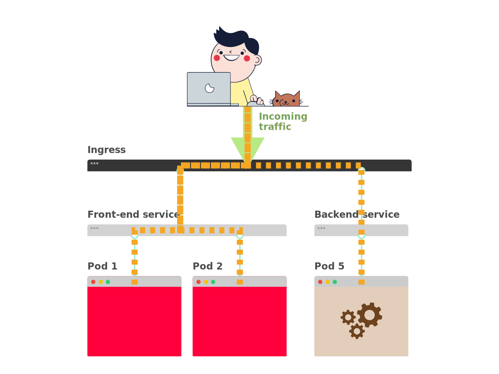

## Can you expose your microservices with an API gateway in Kubernetes?

> **TL;DR:** yes, you can. Have a look at the [Kong](https://konghq.com/blog/kong-kubernetes-ingress-controller/), [Ambassador](https://www.getambassador.io/) and [Gloo](https://gloo.solo.io/) Ingress controllers. You can also use service meshes such as [Istio](https://istio.io/) API gateways, but you should be _careful_.

Table of content:

- [The king of API Gateways: Kong](#option-1-the-king-of-api-gateways-kong)
- [Ambassador, the modern API gateway](#option-2-ambassador-the-modern-api-gateway)
- [Gloo things together](#option-3-gloo-things-together)
- [Istio as an API gateway](#i-ve-heard-i-could-use-istio-as-an-api-gateway)

In Kubernetes, an Ingress is a component that routes the traffic from outside the cluster to your services and Pods inside the cluster.

In simple terms, **the Ingress works as a reverse proxy** or a load balancer: all external traffic is routed to the Ingress and then is routed to the other components.



While the most popular ingress is the [ingress-nginx project](https://github.com/kubernetes/ingress-nginx), there're several other options when it comes to selecting and using an Ingress.

You can choose from Ingress controllers that:

- handle HTTP traffic such as [Contour](https://github.com/heptio/contour) and [Treafik Ingress](https://docs.traefik.io/user-guide/kubernetes/)
- support UDP and TCP traffic such as [Citrix Ingress](https://github.com/citrix/citrix-k8s-ingress-controller)
- support Websockets such as [HAProxy Ingress](https://github.com/jcmoraisjr/haproxy-ingress)

There are also other hybrid Ingress controllers can integrate with existing cloud providers such as [Zalando's Skipper Ingress](https://opensource.zalando.com/skipper/).

When it comes to API gateways in Kubernetes, you have a few popular choices to select from.

## Option #1 — The king of API Gateways: Kong

If you're building an API, you might be interested in what the [Kong Ingress](https://konghq.com/blog/kong-kubernetes-ingress-controller/) has to offer.

**Kong is an API gateway built on top of Nginx.**

Kong is focused on API management and offers features such as authentication, rate limiting, retries, circuit breakers and more.

What's interesting about Kong is that comes packaged as a Kubernetes Ingress.

So you could use in your cluster as a gateway between your users and your backends.

You can expose your API to external traffic with the standard Ingress object:

```yaml|title=ingress.yaml
apiVersion: networking.k8s.io/v1beta1
kind: Ingress
metadata:
  name: my-ingress
spec:
  rules:
    - host: example.com
      http:
        paths:
          - path: /
            backend:
              serviceName: api-service
              servicePort: 80
```

_But there's more._

As part of the installation process Kong's controller registers Custom Resource Definitions (CRDs).

One of these custom extensions is related to Kong's plugins.

If you wish to limit the requests to your Ingress by IP address, you can create a definition for the limit with:

```yaml|title=limit-by-ip.yaml
apiVersion: configuration.konghq.com/v1
kind: KongPlugin
metadata:
  name: rl-by-ip
config:
  hour: 100
  limit_by: ip
  second: 10
plugin: rate-limiting
```

And you can reference the limit with an annotation in your ingress with:

```yaml|highlight=5-6|title=ingress.yaml
apiVersion: networking.k8s.io/v1beta1
kind: Ingress
metadata:
  name: my-ingress
  annotations:
    plugins.konghq.com: rl-by-ip
spec:
  rules:
    - host: example.com
      http:
        paths:
          - path: /
            backend:
              serviceName: api-service
              servicePort: 80
```

You can [explore the Custom Resource Definitions (CRDs) for Kong](https://github.com/Kong/kubernetes-ingress-controller/blob/master/docs/custom-resources.md) on the official documentation.

_But Kong isn't the only choice._

## Option #2 — Ambassador, the modern API gateway

[Ambassador is another Kubernetes Ingress](https://www.getambassador.io/) built on top of Envoy that offers a robust API Gateway.

The Ambassador Ingress is a modern take on Kubernetes Ingress controllers, which offers robust protocol support as well as rate-limiting, an authentication API, and observability integrations.

The main difference between Ambassador and Kong is that Ambassador is built for Kubernetes and integrates nicely with it.

> Kong was open-sourced in 2015 when the Kubernetes ingress controllers weren't so advanced.

But even if Ambassador is designed with Kubernetes in mind, it doesn't leverage the familiar Kubernetes Ingress.

Instead, services are exposed to the outside world using annotations:

```yaml|highlight=7-15|title=service.yaml
apiVersion: v1
kind: Service
metadata:
  labels:
    service: api-service
  name: api-service
  annotations:
    getambassador.io/config: |
      ---
      apiVersion: ambassador/v0
      kind: Mapping
      name: example_mapping
      prefix: /
      service: example.com:80
      host_rewrite: example.com
spec:
  type: LoadBalancer
  ports:
    - port: 80
      targetPort: 80
  selector:
    service: api-backend
```

The novel approach is convenient because, in a single place, you can define all the routing for your Deployments and Pods.

**However, having YAML as free text within an annotation could lead to errors and confusion.**

It's hard to get the formatting right in standard YAML, let alone as a string inside more YAML.

If you wish to apply rate-limiting to your API, this is what it looks like in Ambassador.

You have a RateLimiting object that defines the requirements:

```yaml|highlight=2|title=rate-limit.yaml
apiVersion: getambassador.io/v1beta1
kind: RateLimit
metadata:
 name: basic-rate-limit
spec:
 domain: ambassador
 limits:
  - pattern: [{x_limited_user: "false"}, {generic_key: "qotm"}]
    rate: 5
    unit: minute
  - pattern: [{x_limited_user: "true"}, {generic_key: "qotm"}]
    rate: 5
    unit: minute
```

You can reference the rate limit in your Service with:

```yaml|highlight=5-11|title=service.yaml
apiVersion: v1
kind: Service
metadata:
  name: api-service
  annotations:
    getambassador.io/config: |
      ---
      apiVersion: ambassador/v1
      kind: RateLimitService
      name: basic-rate-limit
      service: "api-service:5000"
spec:
  type: ClusterIP
  selector:
    app: api-service
  ports:
    - port: 5000
      targetPort: http-api
```

Ambassador has an excellent tutorial about rate limiting, so if you are interested in using that feature, you can head over to [Ambassador's official documentation](https://www.getambassador.io/user-guide/rate-limiting-tutorial/).

You can extend Ambassador with [custom filters for routing](https://www.getambassador.io/docs/guides/filter-dev-guide), but it doesn't offer a vibrant plugin ecosystem as Kong.

## Option 3 — Gloo things together

Ambassador is not the only Envoy-powered ingress which can be used as API Gateway.

[Gloo is a Kubernetes Ingress](https://gloo.solo.io/) that is also an API gateway capable of providing rate limiting, circuit breaking, retries, caching, external authentication and authorisation, transformation, service-mesh integration, and security.

**The selling point for Glue is that it's capable of auto-discover API endpoints for your application and automatically understand arguments and parameters.**

I understand it's hard to believe (and their documentation doesn't help in that sense), so here's an example.

Imagine you have a REST API for an address book.

The app exposes the following endpoints:

- `GET /users/{id}`, get the profile for a user
- `GET /users`, get all users
- `POST /users/find`, find a particular user

If your API is developed using standard tools such as the OpenAPI, then Gloo automatically uses the OpenAPI definition to introspect your API and store the three endpoints.

If you list all the endpoint served by Gloo after the discovery phase, this is what you see:

```yaml|highlight=14-22,24-33,35-44|title=gloo
upstreamSpec:
  kube:
    selector:
      app: addressbook
    serviceName: addressbook
    serviceNamespace: default
    servicePort: 8080
    serviceSpec:
      rest:
        swaggerInfo:
          url: http://addressbook.default.svc.cluster.local:8080/swagger.json
        transformations:
          findUserById:
            body:
              text: '{"id": {{ default(id, "") }}}'
            headers:
              :method:
                text: POST
              :path:
                text: /users/find
              content-type:
                text: application/json
          getUser:
            body: {}
            headers:
              :method:
                text: GET
              :path:
                text: /user/{{ default(id, "") }}
              content-length:
                text: '0'
              content-type: {}
              transfer-encoding: {}
          getUsers:
            body: {}
            headers:
              :method:
                text: GET
              :path:
                text: /users
              content-length:
                text: '0'
              content-type: {}
              transfer-encoding: {}
```

Once Gloo has a list of endpoints, you can use that list to apply transformations to the incoming requests before they reach the backend.

As an example, you may want to collect all the headers from the incoming requests and add them to the JSON payload before the request reaches the app.

Or you could expose a JSON API and let Gloo apply a transformation to render the message as SOAP before it reaches a legacy component.

Being able to discover APIs and apply transformations makes Gloo particularly suitable for an environment with diverse technologies — or when you're in the middle of a migration from an old legacy system to a newer stack.

**Gloo can discover other kinds of endpoints such as AWS Lambdas.**

Which makes it the perfect companion when you wish to mix and match Kubernetes and serverless.

## I've heard I could use Istio as an API gateway

_ What's the difference between an API gateway?_

_Aren't both doing the same thing?_

Both offer:

- circuit breakers
- retries
- authentication such as OAuth, JWT, etc.
- rate-limiting
- traffic routing
- etc.

However, there's a distinction.

API gateways such as Kong and Ambassador are mostly focussed on handling external traffic and routing it inside the cluster.

External traffic is quite a broad label that includes things such as:

- slow and fast clients and
- well behaved and malicious users

In other words, API gateways are designed to protect your apps from the outside world.

Service meshes, instead, are mostly used to observe and secure applications within your infrastructure.

Typical uses of service meshes include:

- monitoring and observing requests between apps
- securing the connection between services using encryption (mutual TLS)
- improving resiliency with circuit breakers, retries, etc.

Since service meshes are deployed alongside your apps, they benefit from:

- low latency and high bandwidth
- unlikely to be targeted for misuses and by bad actors

In other words, a service mesh's primary purpose is to manage internal service-to-service communication, while an API Gateway is primarily meant for external client-to-service communication.

_But that doesn't stop from using Istio as an API gateway._

What it might stop you, though, is the fact that Istio priority isn't to handle external traffic.

Let's have a look at an example.

It's common practice to secure your API calls behind an API gateway with JWT or OAuth.

Istio offers JWT, but you have to [inject some custom code in Lua to make it work with OAuth](https://gist.github.com/oahayder/1d8fc8b19660fac1aebce59ea6d171ad#file-envoyfilter-yaml).

Also, their JWT implementation is rather opinionated.

On the other hand, [Kong offers a plugin for that](https://docs.konghq.com/hub/kong-inc/oauth2/) as this is a common request.

Enterprise API gateways such as [Google Apigee include billing capabilities](https://docs.apigee.com/api-platform/monetization/basics-monetization).

Those features will be unlikely replicated in a service mesh because the focus lays elsewhere.

| API gateway                                   | Service mesh                                       |
| --------------------------------------------- | -------------------------------------------------- |
| Exposes internal services to external clients | Manages and control the traffic inside the network |
| Maps external traffic to internal resources   | Focuses on brokering internal resources            |

_What if you don't care about billing, can you still use a service mesh as an API gateway?_

Yes, you can, and there's something else that you should know.

## A general note on API gateways and service meshes

Depending on what you're trying to achieve, service meshes and API gateways could overlap in functionality.

And they might overlap even more in the future since every major API gateway vendor also announced that they are expanding their offering and integrate a service mesh.

- Kong announced [Kuma](https://kuma.io/) a service mesh that can integrate with [Kong](https://konghq.com/blog/kong-kubernetes-ingress-controller/) or [Istio](https://istio.io/)
- Solo.io announced a service mesh that integrates with [Gloo](https://github.com/solo-io/gloo) called [SuperGloo](https://github.com/solo-io/supergloo)
- Containous announced [Maesh a service mesh](https://containo.us/blog/announcing-maesh-a-lightweight-and-simpler-service-mesh-made-by-the-traefik-team-cb866edc6f29/) that integrates with [Traefik](https://containo.us/traefik/)

And it would not be surprising to see more service meshes deciding to integrate an API gateway as Istio does.

## Recap

_If you had to pick an API gateway for Kubernetes, which one should you use?_

- **If you want a battle-tested API gateway, Kong is still your best option.** It might not be shiniest, but the documentation is, and there're plenty of resources online. It also has the most production mileage than any other gateway.
- **If you need a flexible API gateway** that can play nicely with new and old infrastructure, you should have a look at **Gloo**. The ability to auto-discover APIs and transform requests is compelling.
- **If you want the simplicity of setting all the networking in your Services, you should consider Ambassador**. It has excellent tutorials and documentation to get started. Be aware of the YAML indentation as a free string.

_If you had to pick an API gateway or a service mesh, which one should you use?_

**Starting with an API gateway is still the best choice** to secure your internal apps from external clients.

As your apps become more interconnected, you can explore how to leverage a service mesh and how that could integrate with your gateway.

## More options

If neither Ambassador, Kong or Gloo is suitable for what you have in mind, you should check out the following alternatives:

- [Tyk](https://tyk.io/) is an open-source API gateway which can be deployed as an Ingress.
- You could [build your API gateway Ingress using Ballerina](https://ballerina.io/learn/by-guide/api-gateway/) — a Cloud-Native programming language

## That's all folks

_Do you have any recommendation when it comes to API Gateways on Kubernetes?_

[Let us know in an email](mailto:hello@learnk8s) or [tweet us @learnk8s](https://twitter.com/learnk8s).

A special thank you goes to [Irakli Natsvlishvili](https://www.linkedin.com/in/irakli/) who offered some invaluable feedback and helped me put together the above table. Also, thanks to:

- Idit Levine and Scott Weiss from [the Solo.io team](https://www.solo.io/) for answering my questions about the Gloo Ingress controller
- [Daniel Bryant](https://twitter.com/danielbryantuk) from Datawire who kindly helped me understand Ambassador better
- [Marco Palladino](https://www.linkedin.com/in/marcopalladino) from Kong Inc. for offering some detailed feedback about the article
