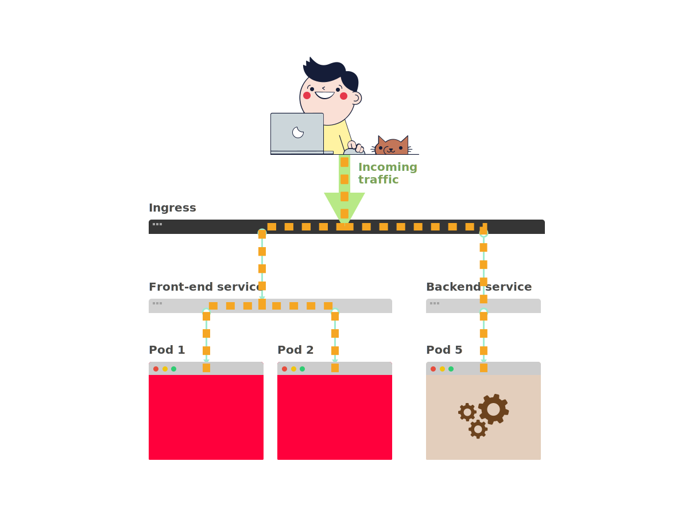

## Can you have an API Gateway as an ingress?

> **TL;DR:** yes, you can. Have a look at the [Kong](https://konghq.com/blog/kong-kubernetes-ingress-controller/), [Ambassador](https://www.getambassador.io/) and [Gloo](https://gloo.solo.io/) Ingress controllers.

In Kubernetes, an Ingress is a component that routes the traffic from outside the cluster to your services and Pods inside the cluster.

In simple terms, **the Ingress works as a reverse proxy** or a load balancer: all external traffic is routed to the Ingress and then is routed to the other components.



While the most popular ingress is the [ingress-nginx project](https://github.com/kubernetes/ingress-nginx), there're several other options when it comes to selecting and using an Ingress.

You can choose from Ingress controllers that:

- handle HTTP traffic such as [Contour](https://github.com/heptio/contour) and [Treafik Ingress](https://docs.traefik.io/user-guide/kubernetes/)
- support UDP and TCP traffic such as [Citrix Ingress](https://github.com/citrix/citrix-k8s-ingress-controller)
- support Websockets such as [HAProxy Ingress](https://github.com/jcmoraisjr/haproxy-ingress)

There are also other hybrid Ingress controllers can integrate with existing cloud providers such as [Zalando's Skipper Ingress](https://opensource.zalando.com/skipper/).

When it comes to API gateway in Ingress, you have three popular choices to select from.

## Option #1 — The king of API Gateways: Kong

But if the product that you're building is primarily an API, you might be interested in what the [Kong Ingress](https://konghq.com/blog/kong-kubernetes-ingress-controller/) has to offer.

**Kong is an API gateway built on top of Nginx.**

It offers features such as authentication, rate limiting, retries, circuit breakers and more.

What's interesting about Kong is that comes packaged as a Kubernetes Ingress.

So you could use in your cluster as a gateway between your users and your backends.

You can expose your API to external traffic with the standard Ingress object:

```yaml|title=ingress.yaml
apiVersion: extensions/v1beta1
kind: Ingress
metadata:
  name: my-ingress
spec:
  rules:
    - host: example.com
      http:
        paths:
          - path: /
            backend:
              serviceName: api-service
              servicePort: 80
```

_But there's more._

As part of the installation process Kong's controller registers Custom Resource Definitions (CRDs).

One of these custom extensions is related to Kong's plugins.

If you wish to limit the requests to your Ingress by IP address, you can create a definition for the limit with:

```yaml|title=limit-by-ip.yaml
apiVersion: configuration.konghq.com/v1
kind: KongPlugin
metadata:
  name: rl-by-ip
config:
  hour: 100
  limit_by: ip
  second: 10
plugin: rate-limiting
```

And you can reference the limit with an annotation in your ingress with:

```yaml|highlight=5-6|title=ingress.yaml
apiVersion: extensions/v1beta1
kind: Ingress
metadata:
  name: my-ingress
  annotations:
    plugins.konghq.com: rl-by-ip
spec:
  rules:
    - host: example.com
      http:
        paths:
          - path: /
            backend:
              serviceName: api-service
              servicePort: 80
```

You can [explore the Custom Resource Definitions (CRDs) for Kong](https://github.com/Kong/kubernetes-ingress-controller/blob/master/docs/custom-resources.md) on the official documentation.

_But Kong isn't the only choice._

## Option #2 — Ambassador, the modern API gateway

[Ambassador is another Kubernetes Ingress](https://www.getambassador.io/) built on top of Envoy that offers a robust API Gateway.

The Ambassador Ingress is a modern take on Kubernetes Ingress controllers as demonstrated by its rapid development and the traction received by the community.

The main difference between Ambassador and Kong/Nginx is that Ambassador doesn't use the familiar Kubernetes Ingress.

Instead, services are exposed to the outside world using annotations:

```yaml|highlight=7-15|title=service.yaml
apiVersion: v1
kind: Service
metadata:
  labels:
    service: api-service
  name: api-service
  annotations:
    getambassador.io/config: |
      ---
      apiVersion: ambassador/v0
      kind: Mapping
      name: example_mapping
      prefix: /
      service: example.com:80
      host_rewrite: example.com
spec:
  type: LoadBalancer
  ports:
    - port: 80
      targetPort: 80
  selector:
    service: api-backend
```

The novel approach is convenient because in a single place you can define all the routing for your Deployments and Pods.

**However, having YAML as free text within an annotation could lead to errors and confusion.**

It's hard to get the formatting right in normal YAML, let alone as a string inside more YAML.

If you wish to apply rate limiting to your API, this is what it looks like in Ambassador:

```yaml|highlight=5-11|title=service.yaml
apiVersion: v1
kind: Service
metadata:
  name: api-service
  annotations:
    getambassador.io/config: |
      ---
      apiVersion: ambassador/v1
      kind: RateLimitService
      name: ratelimit
      service: "api-service:5000"
spec:
  type: ClusterIP
  selector:
    app: api-service
  ports:
    - port: 5000
      targetPort: http-api
```

Ambassador has an excellent tutorial about rate limiting, so if you are interested in using that feature, you can head over to [Ambassador's official documentation](https://www.getambassador.io/user-guide/rate-limiting-tutorial/).

## Option 3 — Gloo things together

Ambassador is not the only Envoy-powered ingress that can be used as API Gateway.

[Gloo is a Kubernetes Ingress](https://gloo.solo.io/) that is also an API gateway capable of providing rate limiting, circuit breaking, retries, caching, external authentication and authorisation, transformation, service-mesh integration, and security.

**The selling point for Glue is that it's capable of auto discover API endpoints for your application and automatically understand arguments and parameters.**

I understand it's hard to believe (and their documentation doesn't help in that sense), so here's an example.

Imagine you have a REST API for an address book.

The app exposes the following endpoints:

- `GET /users/{id}`, get the profile for a user
- `GET /users`, get all users
- `POST /users/find`, find a particular user

If your API is developed using standard tools such as the OpenAPI, then Gloo automatically uses the OpenAPI definition to introspect your API and store the three endpoints.

If you list all the endpoint served by Gloo after the discovery phase, this is what you see:

```yaml|highlight=14-22,24-33,35-44|title=gloo upstream service-8080
upstreamSpec:
  kube:
    selector:
      app: addressbook
    serviceName: addressbook
    serviceNamespace: default
    servicePort: 8080
    serviceSpec:
      rest:
        swaggerInfo:
          url: http://addressbook.default.svc.cluster.local:8080/swagger.json
        transformations:
          findUserById:
            body:
              text: '{"id": {{ default(id, "") }}}'
            headers:
              :method:
                text: POST
              :path:
                text: /users/find
              content-type:
                text: application/json
          getUser:
            body: {}
            headers:
              :method:
                text: GET
              :path:
                text: /user/{{ default(id, "") }}
              content-length:
                text: '0'
              content-type: {}
              transfer-encoding: {}
          getUsers:
            body: {}
            headers:
              :method:
                text: GET
              :path:
                text: /users
              content-length:
                text: '0'
              content-type: {}
              transfer-encoding: {}
```

Once Gloo has a list of endpoints, you can use that list to apply transformations to the incoming requests before they reach the backend.

As an example, you may want to collect all the headers from the incoming requests and add them to the JSON payload before the request reaches the app.

Or you could expose a JSON API and let Gloo apply a transformation to render the message as SOAP before it reaches a legacy component.

Being able to discover APIs and apply transformations makes Gloo particularly suitable for an environment with diverse technologies — or when you're in the middle of a migration from an old legacy system to a newer stack.

**Gloo can discover other kinds of endpoints such as AWS Lambdas.**

Which makes it the perfect companion when you wish to mix and match Kubernetes and serverless.

## Recap

Here's a handy recap of the three Ingress controllers:

|                 |                                                     Kong                                                    |                   Ambassador                  |                     Gloo                    |
|-----------------|:-----------------------------------------------------------------------------------------------------------:|:---------------------------------------------:|:-------------------------------------------:|
| protocol        | http,https,grpc,tcp                                                                                         | http,https,grpc,tcp,udp,tcp+ssl               | http,https,grpc                             |
| based on        | Nginx                                                                                                       | Envoy                                         | Envoy                                       |
| resiliency      | active and passive health check, circuit break, rate limit, retries                                         | rate limit                                    | rate limit, circuit break, retries, caching |
| state           | configured in PostgreSQL or Cassandra, state stored in Kubernetes                                           | Kubernetes                                    | CRDs                                        |
| Routing defined | as Ingress manifest                                                                                         | in the Service                                | as Ingress manifest                         |
| auth            |  Basic Auth, HMAC, JWT, Key, LDAP, OAuth 2.0, PASETO, plus paid Kong Enterprise options like OpenID Connect | Basic Auth, OIDC                              | Basic Auth, OIDC                            |
| extensible      | plugins                                                                                                     | no, external integrations                     | plugins                                     |
| dashboard       | Kong Enterprise dashboard or open-source community projects                                                 | Metrics can be seen in Grafana and Prometheus | Dashboard for enterprise version            |

## More options

If neither Ambassador, Kong or Gloo is suitable for what you have in mind, you should check out the following alternatives:

- [Tyk](https://tyk.io/) is an open source API gateway that can be deployed as an Ingress.
- You could [build your API gateway Ingress using Ballerina](https://ballerina.io/learn/by-guide/api-gateway/) — a Cloud Native programming language

## That's all folks

_Do you have any recommendation when it comes to API Gateways on Kubernetes?_

[Let us know in an email](mailto:hello@learnk8s) or [tweet us @learnk8s](https://twitter.com/learnk8s).

A special thank you goes to [Irakli Natsvlishvili](https://www.linkedin.com/in/irakli/) who offered some invaluable feedback and helped me put together the above table. Also, thanks to Idit Levine and Scott Weiss from [the Solo.io team](https://www.solo.io/) for answering my questions about the Gloo Ingress controller.
