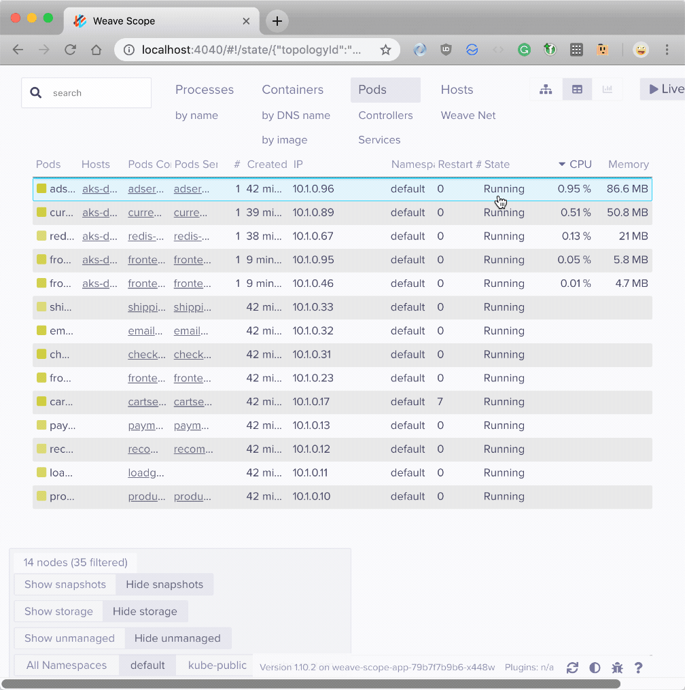
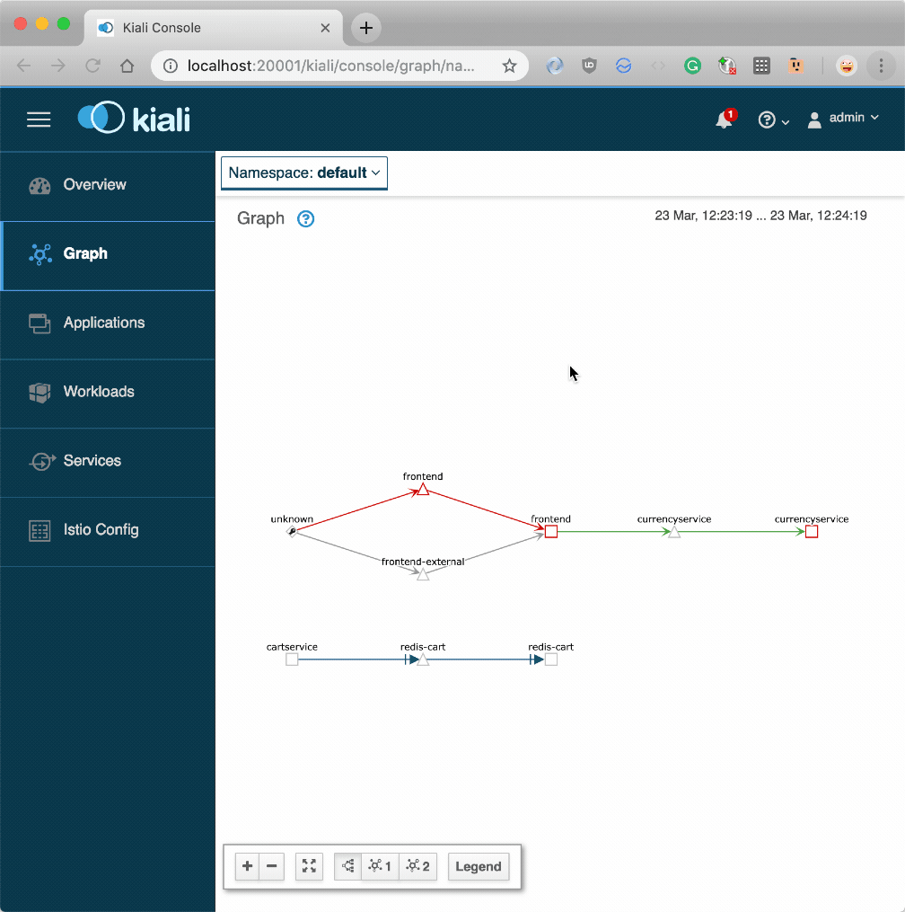
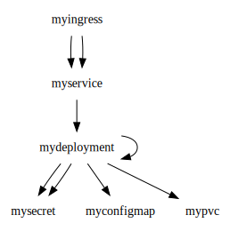

## Is there any tool to visualise the dependency between YAML files?

> **TL;DR:** Not for YAML. But you can visualise your dependencies in the cluster with [Weave Scope](https://github.com/weaveworks/scope) or [Istio](https://istio.io).

When you have a large number of resources in your cluster, you might lose track of all relationships between them.

Keeping track of dependencies is even more challenging when you're managing distributed teams or have several clusters.

_Wouldn't be nice if you could have a tool that reads a repository and show the dependencies between your Deployments, Services, Persistent Volume Claims, etc.?_

Unfortunately, such a tool doesn't exist for YAML.

YAML is a human-readable configuration language, and it doesn't have a way to express relationships with other YAML files.

You could write a tool to analyse YAML files and link them together statically, but you will have to code all the rules that power Kubernetes such as namespaces, selectors, etc. to make sure that you can draw a correct dependency graph.

Even with such a tool, you wouldn't be able to describe that a front-end component is consuming a backend API.

The relationship isn't expressed in the YAML but in the application.

However, if your goal is to visualise dependencies, you could focus on the cluster and ignore the YAML.

## Option #1 — Weave Scope, the Kubernetes dashboard

[Weave Scope](https://github.com/weaveworks/scope) is one of those tools that — once installed into your cluster — can help you visualise your Kubernetes resources in a dependency graph.

Weave scope connects to the Kubernetes API and queries your resources to draw a dependency graph.

As an example, have a look at the dependencies for the [microservices-demo project from Google Cloud Platform](https://github.com/GoogleCloudPlatform/microservices-demo) — a collection of ten microservices that are meant to be demoing an e-commerce website.

As you can see the tool automatically maps dependencies between Pods.

The tool isn't limited to dependencies, though.

As part of the installation process, you can have agents on every node that probe the nodes for metrics.

You can use Weave Scope to monitor for CPU and memory in your nodes [as well as other useful metrics](https://github.com/weaveworks-plugins/).

And even better, Weave Scope has a mechanism to create custom plugins.

Weavescope isn't the only tool that can identify and visualise dependencies in your cluster.

## Option #2 — Tracing the traffic

If you could trace all the traffic between your components, you should be able to visualise the dependency and observe the state of your system in real time.

**Even if you don't use Kubernetes.**

A tool such as [Istio](https://istio.io) or [Linkerd2](https://linkerd.io/2/overview/) are designed to do just that: augment your network so you can debug, observe, and secure your traffic without requiring any changes to your code.

In this example, you will have a look at Istio, but the same applies to any other similar technology.

After you install Istio in your cluster, every new Pod has a companion container that is in charge of routing all the inbound and outbound traffic to that Pod.

You can think about it as a proxy container.

The proxy does a lot more than just routing the traffic, though.

It can collect metrics and receive instructions from the control plane.

When every app in your cluster has a sidecar proxy, you can visualise the flow of the traffic.

Here's the same collection of microservices deployed in a cluster with Istio enabled:

As you can see the graph is identical to the one drawn by Weave Scope.

Note that Istio didn't have to interrogate the Kubernetes API to draw any of it.

Using a service mesh such as Istio, isn't a free lunch, though.

Adding it to an existing cluster is not trivial, because you have to recreate all the Pods with the proxy container.

And having an extra container attached to every Pod affects latency and resource consumption.

The idea of statically analysing your YAML resources sounds even more appealing now.

## The start of something new

_How hard is exactly to write a tool that inspects YAML files and visually connects resources?_

[Chris Nesbitt-Smith](https://www.linkedin.com/in/cnesbittsmith/) is an instructor at Learnk8s and had the same question but didn't take a _no_ as an answer.

Chris decided to code [chrisns/k8sdraw](https://github.com/chrisns/k8sdraw/) a simple tool that draws a diagram using the DOT language and Graphviz.

The tool is just a proof of concept and perhaps isn't ready to read your YAML files, **yet**.

But it's promising and could make mapping your components a lot easier — you don't have to install anything at all in your cluster.

There're a lot of unanswered questions, such as:

- _how do you know if a Pod is consuming the data from another service?_
- _how do you detect resources deployed in other namespaces?_
- _how do you represent nullable fields and resources?_

If you think k8sdraw should be a reality and you know the answer to those questions, [feel free to discuss it on the Github project](https://github.com/chrisns/k8sdraw/).

## More options

Two noteworthy tools can help visualise dependencies in your cluster:

- [Linkerd2](https://linkerd.io/2/overview/), another service mesh similar to Istio
- [Kubebricks](https://github.com/kubricksllc/Kubricks), an electron app that connects to your cluster using kubectl and helps you visualise your dependencies

## That's all folks

_Have you built a tool to visualise your cluster?_

_Or have a recommendation to visualise dependencies?_

[Let us know in an email](mailto:hello@learnk8s) or [tweet us @learnk8s](https://twitter.com/learnk8s).

A special thank you goes to [Cesar Tron-Lozai](https://twitter.com/cesartronlozai) that reviewed the content of this article.
