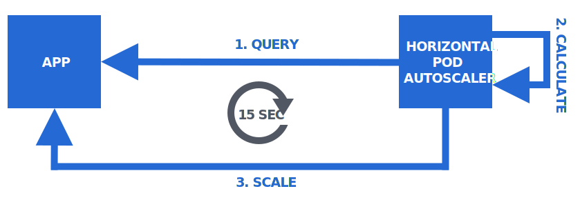
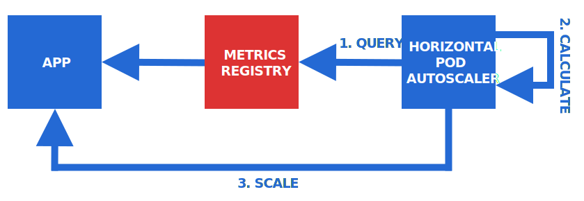
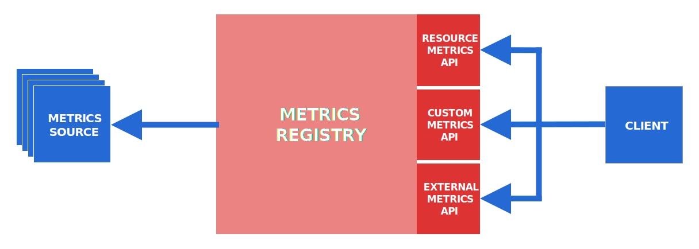
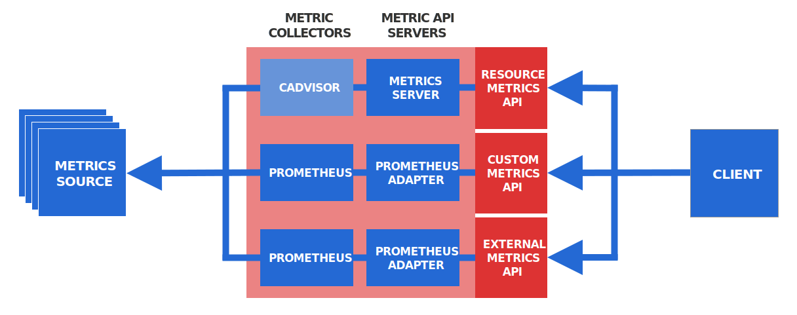

## How to autoscale your app on Kubernetes?

Deploying an app in a static configuration to production is not optimal.

Traffic patterns can change quickly, and the app should be able to adapt to them:

- When demand increases, the app should scale up (increasing the number of replicas) to stay responsive.
- When demand decreases, the app should scale down (decreasing the number of replicas) to not waste resources.

Kubernetes provides excellent support for autoscaling applications in the form of the Horizontal Pod Autoscaler.

_In the following, you will learn how to use it._

## Different types of autoscaling

First of all, to eliminate any misconceptions, let's clarify the term "autoscaling" in Kubernetes.

In Kubernetes, there are several things that are referred to as "autoscaling", including:

- [Horizontal Pod Autoscaler](https://kubernetes.io/docs/tasks/run-application/horizontal-pod-autoscale/): adjust the number of replicas of an application
- [Vertical Pod Autoscaler](https://github.com/kubernetes/autoscaler/tree/master/vertical-pod-autoscaler): adjusts the resource requests and limits of a container
- [Cluster Autoscaler](https://github.com/kubernetes/autoscaler/tree/master/cluster-autoscaler): adjusts the number of nodes of a cluster

While these components all "autoscale" something, they are completely unrelated to each other.

They all address very different use cases and use different concepts and mechanisms.

They are all developed in separate projects and can be used independently from each other.

_The autoscaling feature that's treated in **this** article is the Horizontal Pod Autoscaler._

## What is the Horizontal Pod Autoscaler?

The [Horizontal Pod Autoscaler](myapp_requests_per_second) is a built-in Kubernetes feature that allows to _horizontally_ scale applications based on one ore more monitored metrics.

> Horizontal scaling means increasing and decreasing the number of replicas. Vertical scaling means increasing and decreasing the compute resources of a single replica.

Technically, the Horizontal Pod Autoscaler is a controller in the Kubernetes controller manager, and it is configured by [HorizontalPodAutoscaler](https://kubernetes.io/docs/reference/generated/kubernetes-api/v1.15/#horizontalpodautoscaler-v2beta2-autoscaling) resource objects.

The Horizontal Pod Autoscaler can monitor a specific metric about an application and continously adjust the number of replicas to optimally meet the current demand on the app.

> An "application" that can be scaled by the Horizontal Pod Autoscaler is either a Deployment, StatefulSet, ReplicaSet, or ReplicationController resource.

To do so, the Horizontal Pod Autoscaler executes an eternal control loop on the target application.



The steps of this control loop are:

1. **Query** the scaling metric
1. **Calculate** the desired number of replicas
1. **Scale** the app to the desired number of replicas

> The default period for this control loop is [15 seconds](https://github.com/kubernetes/kubernetes/blob/master/pkg/controller/podautoscaler/config/v1alpha1/defaults.go#L42)

The calculation of the desired number of replicas is based on the scaling metric and a user-provided target value for this metric.

The goal is to calculate a replica count that brings the metric value as close as possible to the target value.

For example, imagine that the scaling metric is the per-second request rate per replica:

- If the target value is 10 req/sec and the current value is 20 req/sec, the Horizontal Pod Autoscaler will scale the app up (i.e. increasing the number of replicas) to make the metric _decrease_ and get closer to the target value.
- If the target value is 10 req/sec and the current value is 2 req/sec, the Horizontal Pod Autoscaler will scale the app down (i.e. decreasing the number of replicas) to make the metric _increase_ and get closer to the target value.

The algorithm for calculating the desired number of replicas is based on the following formula:

```
X = N * (c/t)
```

Where `X` is the desired number of replicas, `N` is the current number of replicas, `c` is the current value of the metric, and `t` is the target value.

> You can find the details about the algorithm in the [documentation](https://kubernetes.io/docs/tasks/run-application/horizontal-pod-autoscale/#algorithm-details).

_That's how the Horizontal Pod Autoscaler works, but how do you use it?_

## How to configure the Horizontal Pod Autoscaler?

Configuring the Horizontal Pod Autoscaler to autoscale your app is done by creating a [HorizontalPodAutoscaler](https://kubernetes.io/docs/reference/generated/kubernetes-api/v1.15/#horizontalpodautoscaler-v2beta2-autoscaling) resource.

This resource allows you to specify the following parameters:

1. The resource to scale (e.g. a Deployment)
1. The minimum and maximum number of replicas
1. The scaling metric
1. The target value for the scaling metric

As soon as you create this resource, the Horizontal Pod Autoscaler starts executing a control loop with the provided parameters against your app.

A concrete HorizontalPodAutoscaler resource looks like that:

```yaml|title=hpa.yaml
apiVersion: autoscaling/v2beta2
kind: HorizontalPodAutoscaler
metadata:
  name: myhpa
spec:
  scaleTargetRef:
    apiVersion: apps/v1
    kind: Deployment
    name: myapp
  minReplicas: 1
  maxReplicas: 10
  metrics:
    - type: Pods
      pods:
        metric:
          name: myapp_requests_per_second
        target:
          type: AverageValue
          averageValue: 2
```

> There exist different versions of the HorizontalPodAutoscaler resource that differ in their manifest structure. The above example uses version `v2beta2`, which is the most recent one at the time of this writing.

This resource specifies a Deployment named `myapp` to be autoscaled between 1 and 10 replicas based on a metric named `myapp_requests_per_second` with a target value of 2.

You can imagine that the `myapp_requests_per_second` metric represents the request rate of the individual Pods of this Deployment — so the intention of this specification is to autoscale the Deployment with the target of maintaining a request rate of 2 requests per second for each of the Pods.

So far, this all sounds good and nice — but there's a catch.

_Where do the metrics come from?_

## What is the metrics registry?

The entire autoscaling mechanism is based on metrics that represent the current load of an application.

When you define a HorizontalPodAutoscaler resource you have to specify such a metric.

_But how does the Horizontal Pod Autoscaler know how to obtain this metric?_

It turns out that there's another component in play — the metrics registry.

The Horizontal Pod Autoscaler is hardwired to query metrics from the metrics registry:



The metrics registry is a central place in the cluster where metrics (of any kind) are exposed to clients (of any kind).

_The Horizontal Pod Autoscaler is one of these clients._

The purpose of the metrics registry is to provide a standard interface for clients to query metrics from.

The interface of the metrics registry consists of three separate APIs:

- The [Resource Metrics API](https://github.com/kubernetes/community/blob/master/contributors/design-proposals/instrumentation/resource-metrics-api.md)
- The [Custom Metrics API](https://github.com/kubernetes/community/blob/master/contributors/design-proposals/instrumentation/custom-metrics-api.md)
- The [External Metrics API](https://github.com/kubernetes/community/blob/master/contributors/design-proposals/instrumentation/external-metrics-api.md)



These APIs are designed to serve different types of metrics:

- Resource Metrics API: predefined resource usage metrics (CPU and memory) of Pods and Nodes
- Custom Metrics API: custom metrics associated with a Kubernetes object
- External Metrics API: custom metrics _not_ associated with a Kubernetes object

All of these metric APIs are [extension APIs](https://kubernetes.io/docs/concepts/extend-kubernetes/api-extension/apiserver-aggregation/).

That means, they are extensions to the core Kubernetes API that are accessible through the Kubernetes API server.

_What does that mean for you if you want to autoscale an app?_

Any metric that you want to use as a scaling metric must be exposed through one of these three metric APIs.

Because only in that way they are accessible to the Horizontal Pod Autoscaler.

So, to autoscale an app, your task is now not only to configure the Horizontal Pod Autoscaler...

But also to expose your desired scaling metric through one of the metric APIs.

_So, how do you expose a metric through a metric API?_

By installing and configuring additional components in your cluster.

For each metric API you need a corresopnding **metric API server** and you ned to configure it to expose a specific metric through the metric API.

> By default, _no_ metric API servers are installed in Kubernetes, which meanas that the metric APIs are _not_ enabled by default.

Furthermore, you need a **metrics collector** that collects the desired metrics from the sources (e.g. from the Pods of the target app) and provides them to the metric API server.



There are different choices of metric API servers and metric collectors for the different metrics APIs.

Resource Metrics API:

- The metrics collector is [cAdvisor](https://github.com/google/cadvisor), which runs as part of the kubelet on every worker node (so it's already installed by default)
- The official metric API server for the Resource Metrics API is the [Metrics Server](https://github.com/kubernetes-incubator/metrics-server)

Custom Metrics API and External Metrics API:

- A popular choice for the metrics collector is [Prometheus](https://prometheus.io/) — however, other metrics systems like Datadog or Google Stackdriver may be used instead
- The [Prometheus Adapter](https://github.com/DirectXMan12/k8s-prometheus-adapter) is a metric API server that integrates with Prometheus as a metric collector — however, other metric collectors have their own metric API servers

So, to expose a metric through one of the metric APIs, you have to go through these steps:

1. Install a metrics collector (e.g. Prometheus) and configure it to collect the desired metric (e.g. from the Pods of your app)
1. Install a metric API seerver (e.g. the Prometheus Adapter) and configure it to expose from the metrics collector through the corresponding metrics API

> Note that this applies specifically to the Custom Metrics API and External Metrics API, which serve custom metrics. The Resource Metrics API only serves default metrics and can't be configured to serve custom metrics at all.

_This was a lot of information, so let's put the bits together._

## Putting everything together

Let's go through a full example of configuring app to be autoscaled by the Horizontal Pod Autoscaler.

Imagine, you want to autoscale a web app based on the per-second request rate of each of the replicas.

Also assume that you want to use a Prometheus-based setup for exposing the request rate metric through the Custom Metrics API.

> The request rate is a custom metric associated with a Kubernetes object (Pods), so it must be exposed through the Custom Metrics API.

Here's a possible sequence of steps to reach your goal:

1. [Instrument](https://prometheus.io/docs/practices/instrumentation/) your app to expose the total number of received requests as a Prometheus metric
1. Install Prometheus and configure it to collect this metric from all the Pods of your app
1. Install the Prometheus Adapter and configure it to turn the metric from Prometheus into a per-second request rate (using PromQL) and expose that metric as `myapp_requests_per_second` through the Custom Metrics API
1. Create HorizontalPodAutoscaler resource (as shown above) specifying `myapp_requests_per_second` as the scaling metric and an appropriate target value

As soon as the HorizontalPodAutoscaler resource is created, the Horizontal Pod Autoscaler kicks in starts autoscaling your app according to your configuration.

_And you can lean back and watch your app adapting to traffic._

This article sets the theoretical framework for autoscaling an application based on a custom metric.

In a future article, you will put this knowledge into practice and execute the above steps with your own app on your own cluster — from zero to a fully autoscaled application.

**Stay tuned!**
