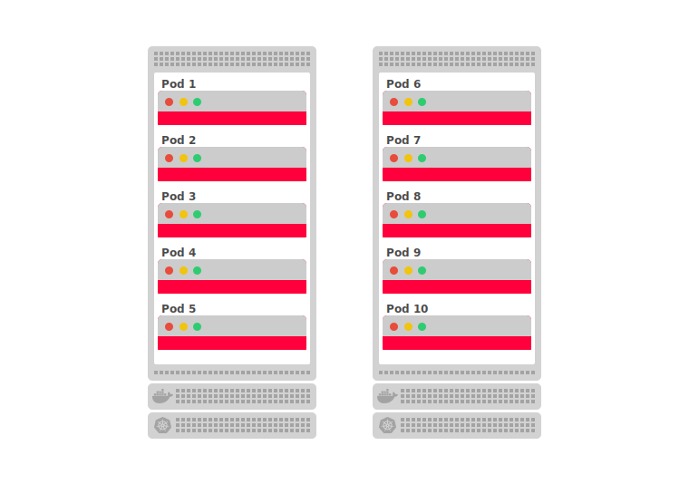

When you deploy an application in Kubernetes, your code ends up running on one or more worker nodes.

A node may be a physical machine or VM such as AWS EC2 or Google Compute Engine and having several of them means you can run and scale your application across instances efficiently.

If you have a cluster made of three nodes and decide to scale your application to have four replicas, Kubernetes will spread the replicas across the nodes evenly like so:

```include
<template>
<svg xmlns="http://www.w3.org/2000/svg" viewBox="0 0 760 697" id="deployment">
  <g fill="none" fill-rule="evenodd">
    <g transform="translate(39 155)">
      <g transform="translate(0 372)">
        <path fill="#D2D2D2" d="M186,5 L186,24 C186,26.7614237 183.761424,29 181,29 L5,29 C2.23857625,29 3.38176876e-16,26.7614237 0,24 L0,5 C-3.38176876e-16,2.23857625 2.23857625,5.07265313e-16 5,0 L181,0 C183.761424,-5.07265313e-16 186,2.23857625 186,5 Z"/>
        <rect width="4" height="4" x="31" y="6" fill="#A3A3A3"/>
        <rect width="4" height="4" x="31" y="12" fill="#A3A3A3"/>
        <rect width="4" height="4" x="31" y="18" fill="#A3A3A3"/>
        <rect width="4" height="4" x="37" y="6" fill="#A3A3A3"/>
        <rect width="4" height="4" x="37" y="12" fill="#A3A3A3"/>
        <rect width="4" height="4" x="37" y="18" fill="#A3A3A3"/>
        <rect width="4" height="4" x="43" y="6" fill="#A3A3A3"/>
        <rect width="4" height="4" x="43" y="12" fill="#A3A3A3"/>
        <rect width="4" height="4" x="43" y="18" fill="#A3A3A3"/>
        <rect width="4" height="4" x="49" y="6" fill="#A3A3A3"/>
        <rect width="4" height="4" x="49" y="12" fill="#A3A3A3"/>
        <rect width="4" height="4" x="49" y="18" fill="#A3A3A3"/>
        <rect width="4" height="4" x="55" y="6" fill="#A3A3A3"/>
        <rect width="4" height="4" x="55" y="12" fill="#A3A3A3"/>
        <rect width="4" height="4" x="55" y="18" fill="#A3A3A3"/>
        <rect width="4" height="4" x="61" y="6" fill="#A3A3A3"/>
        <rect width="4" height="4" x="61" y="12" fill="#A3A3A3"/>
        <rect width="4" height="4" x="61" y="18" fill="#A3A3A3"/>
        <rect width="4" height="4" x="67" y="6" fill="#A3A3A3"/>
        <rect width="4" height="4" x="67" y="12" fill="#A3A3A3"/>
        <rect width="4" height="4" x="67" y="18" fill="#A3A3A3"/>
        <rect width="4" height="4" x="73" y="6" fill="#A3A3A3"/>
        <rect width="4" height="4" x="73" y="12" fill="#A3A3A3"/>
        <rect width="4" height="4" x="73" y="18" fill="#A3A3A3"/>
        <rect width="4" height="4" x="79" y="6" fill="#A3A3A3"/>
        <rect width="4" height="4" x="79" y="12" fill="#A3A3A3"/>
        <rect width="4" height="4" x="79" y="18" fill="#A3A3A3"/>
        <rect width="4" height="4" x="85" y="6" fill="#A3A3A3"/>
        <rect width="4" height="4" x="85" y="12" fill="#A3A3A3"/>
        <rect width="4" height="4" x="85" y="18" fill="#A3A3A3"/>
        <rect width="4" height="4" x="91" y="6" fill="#A3A3A3"/>
        <rect width="4" height="4" x="91" y="12" fill="#A3A3A3"/>
        <rect width="4" height="4" x="91" y="18" fill="#A3A3A3"/>
        <rect width="4" height="4" x="97" y="6" fill="#A3A3A3"/>
        <rect width="4" height="4" x="97" y="12" fill="#A3A3A3"/>
        <rect width="4" height="4" x="97" y="18" fill="#A3A3A3"/>
        <rect width="4" height="4" x="103" y="6" fill="#A3A3A3"/>
        <rect width="4" height="4" x="103" y="12" fill="#A3A3A3"/>
        <rect width="4" height="4" x="103" y="18" fill="#A3A3A3"/>
        <rect width="4" height="4" x="109" y="6" fill="#A3A3A3"/>
        <rect width="4" height="4" x="109" y="12" fill="#A3A3A3"/>
        <rect width="4" height="4" x="109" y="18" fill="#A3A3A3"/>
        <rect width="4" height="4" x="115" y="6" fill="#A3A3A3"/>
        <rect width="4" height="4" x="115" y="12" fill="#A3A3A3"/>
        <rect width="4" height="4" x="115" y="18" fill="#A3A3A3"/>
        <rect width="4" height="4" x="121" y="6" fill="#A3A3A3"/>
        <rect width="4" height="4" x="121" y="12" fill="#A3A3A3"/>
        <rect width="4" height="4" x="121" y="18" fill="#A3A3A3"/>
        <rect width="4" height="4" x="127" y="6" fill="#A3A3A3"/>
        <rect width="4" height="4" x="127" y="12" fill="#A3A3A3"/>
        <rect width="4" height="4" x="127" y="18" fill="#A3A3A3"/>
        <rect width="4" height="4" x="133" y="6" fill="#A3A3A3"/>
        <rect width="4" height="4" x="133" y="12" fill="#A3A3A3"/>
        <rect width="4" height="4" x="133" y="18" fill="#A3A3A3"/>
        <rect width="4" height="4" x="139" y="6" fill="#A3A3A3"/>
        <rect width="4" height="4" x="139" y="12" fill="#A3A3A3"/>
        <rect width="4" height="4" x="139" y="18" fill="#A3A3A3"/>
        <rect width="4" height="4" x="145" y="6" fill="#A3A3A3"/>
        <rect width="4" height="4" x="145" y="12" fill="#A3A3A3"/>
        <rect width="4" height="4" x="145" y="18" fill="#A3A3A3"/>
        <rect width="4" height="4" x="151" y="6" fill="#A3A3A3"/>
        <rect width="4" height="4" x="151" y="12" fill="#A3A3A3"/>
        <rect width="4" height="4" x="151" y="18" fill="#A3A3A3"/>
        <rect width="4" height="4" x="157" y="6" fill="#A3A3A3"/>
        <rect width="4" height="4" x="157" y="12" fill="#A3A3A3"/>
        <rect width="4" height="4" x="157" y="18" fill="#A3A3A3"/>
        <rect width="4" height="4" x="163" y="6" fill="#A3A3A3"/>
        <rect width="4" height="4" x="163" y="12" fill="#A3A3A3"/>
        <rect width="4" height="4" x="163" y="18" fill="#A3A3A3"/>
        <rect width="4" height="4" x="169" y="6" fill="#A3A3A3"/>
        <rect width="4" height="4" x="169" y="12" fill="#A3A3A3"/>
        <rect width="4" height="4" x="169" y="18" fill="#A3A3A3"/>
        <rect width="4" height="4" x="175" y="6" fill="#A3A3A3"/>
        <rect width="4" height="4" x="175" y="12" fill="#A3A3A3"/>
        <rect width="4" height="4" x="175" y="18" fill="#A3A3A3"/>
      </g>
      <g transform="translate(0 404)">
        <path fill="#D2D2D2" d="M186,5 L186,24 C186,26.7614237 183.761424,29 181,29 L5,29 C2.23857625,29 3.38176876e-16,26.7614237 0,24 L0,5 C-3.38176876e-16,2.23857625 2.23857625,5.07265313e-16 5,0 L181,0 C183.761424,-5.07265313e-16 186,2.23857625 186,5 Z"/>
        <rect width="4" height="4" x="31" y="6" fill="#A3A3A3"/>
        <rect width="4" height="4" x="31" y="12" fill="#A3A3A3"/>
        <rect width="4" height="4" x="31" y="18" fill="#A3A3A3"/>
        <rect width="4" height="4" x="37" y="6" fill="#A3A3A3"/>
        <rect width="4" height="4" x="37" y="12" fill="#A3A3A3"/>
        <rect width="4" height="4" x="37" y="18" fill="#A3A3A3"/>
        <rect width="4" height="4" x="43" y="6" fill="#A3A3A3"/>
        <rect width="4" height="4" x="43" y="12" fill="#A3A3A3"/>
        <rect width="4" height="4" x="43" y="18" fill="#A3A3A3"/>
        <rect width="4" height="4" x="49" y="6" fill="#A3A3A3"/>
        <rect width="4" height="4" x="49" y="12" fill="#A3A3A3"/>
        <rect width="4" height="4" x="49" y="18" fill="#A3A3A3"/>
        <rect width="4" height="4" x="55" y="6" fill="#A3A3A3"/>
        <rect width="4" height="4" x="55" y="12" fill="#A3A3A3"/>
        <rect width="4" height="4" x="55" y="18" fill="#A3A3A3"/>
        <rect width="4" height="4" x="61" y="6" fill="#A3A3A3"/>
        <rect width="4" height="4" x="61" y="12" fill="#A3A3A3"/>
        <rect width="4" height="4" x="61" y="18" fill="#A3A3A3"/>
        <rect width="4" height="4" x="67" y="6" fill="#A3A3A3"/>
        <rect width="4" height="4" x="67" y="12" fill="#A3A3A3"/>
        <rect width="4" height="4" x="67" y="18" fill="#A3A3A3"/>
        <rect width="4" height="4" x="73" y="6" fill="#A3A3A3"/>
        <rect width="4" height="4" x="73" y="12" fill="#A3A3A3"/>
        <rect width="4" height="4" x="73" y="18" fill="#A3A3A3"/>
        <rect width="4" height="4" x="79" y="6" fill="#A3A3A3"/>
        <rect width="4" height="4" x="79" y="12" fill="#A3A3A3"/>
        <rect width="4" height="4" x="79" y="18" fill="#A3A3A3"/>
        <rect width="4" height="4" x="85" y="6" fill="#A3A3A3"/>
        <rect width="4" height="4" x="85" y="12" fill="#A3A3A3"/>
        <rect width="4" height="4" x="85" y="18" fill="#A3A3A3"/>
        <rect width="4" height="4" x="91" y="6" fill="#A3A3A3"/>
        <rect width="4" height="4" x="91" y="12" fill="#A3A3A3"/>
        <rect width="4" height="4" x="91" y="18" fill="#A3A3A3"/>
        <rect width="4" height="4" x="97" y="6" fill="#A3A3A3"/>
        <rect width="4" height="4" x="97" y="12" fill="#A3A3A3"/>
        <rect width="4" height="4" x="97" y="18" fill="#A3A3A3"/>
        <rect width="4" height="4" x="103" y="6" fill="#A3A3A3"/>
        <rect width="4" height="4" x="103" y="12" fill="#A3A3A3"/>
        <rect width="4" height="4" x="103" y="18" fill="#A3A3A3"/>
        <rect width="4" height="4" x="109" y="6" fill="#A3A3A3"/>
        <rect width="4" height="4" x="109" y="12" fill="#A3A3A3"/>
        <rect width="4" height="4" x="109" y="18" fill="#A3A3A3"/>
        <rect width="4" height="4" x="115" y="6" fill="#A3A3A3"/>
        <rect width="4" height="4" x="115" y="12" fill="#A3A3A3"/>
        <rect width="4" height="4" x="115" y="18" fill="#A3A3A3"/>
        <rect width="4" height="4" x="121" y="6" fill="#A3A3A3"/>
        <rect width="4" height="4" x="121" y="12" fill="#A3A3A3"/>
        <rect width="4" height="4" x="121" y="18" fill="#A3A3A3"/>
        <rect width="4" height="4" x="127" y="6" fill="#A3A3A3"/>
        <rect width="4" height="4" x="127" y="12" fill="#A3A3A3"/>
        <rect width="4" height="4" x="127" y="18" fill="#A3A3A3"/>
        <rect width="4" height="4" x="133" y="6" fill="#A3A3A3"/>
        <rect width="4" height="4" x="133" y="12" fill="#A3A3A3"/>
        <rect width="4" height="4" x="133" y="18" fill="#A3A3A3"/>
        <rect width="4" height="4" x="139" y="6" fill="#A3A3A3"/>
        <rect width="4" height="4" x="139" y="12" fill="#A3A3A3"/>
        <rect width="4" height="4" x="139" y="18" fill="#A3A3A3"/>
        <rect width="4" height="4" x="145" y="6" fill="#A3A3A3"/>
        <rect width="4" height="4" x="145" y="12" fill="#A3A3A3"/>
        <rect width="4" height="4" x="145" y="18" fill="#A3A3A3"/>
        <rect width="4" height="4" x="151" y="6" fill="#A3A3A3"/>
        <rect width="4" height="4" x="151" y="12" fill="#A3A3A3"/>
        <rect width="4" height="4" x="151" y="18" fill="#A3A3A3"/>
        <rect width="4" height="4" x="157" y="6" fill="#A3A3A3"/>
        <rect width="4" height="4" x="157" y="12" fill="#A3A3A3"/>
        <rect width="4" height="4" x="157" y="18" fill="#A3A3A3"/>
        <rect width="4" height="4" x="163" y="6" fill="#A3A3A3"/>
        <rect width="4" height="4" x="163" y="12" fill="#A3A3A3"/>
        <rect width="4" height="4" x="163" y="18" fill="#A3A3A3"/>
        <rect width="4" height="4" x="169" y="6" fill="#A3A3A3"/>
        <rect width="4" height="4" x="169" y="12" fill="#A3A3A3"/>
        <rect width="4" height="4" x="169" y="18" fill="#A3A3A3"/>
        <rect width="4" height="4" x="175" y="6" fill="#A3A3A3"/>
        <rect width="4" height="4" x="175" y="12" fill="#A3A3A3"/>
        <rect width="4" height="4" x="175" y="18" fill="#A3A3A3"/>
      </g>
      <g>
        <path fill="#D2D2D2" d="M186,5 L186,364 C186,366.761424 183.761424,369 181,369 L5,369 C2.23857625,369 3.38176876e-16,366.761424 0,364 L0,5 C-3.38176876e-16,2.23857625 2.23857625,5.07265313e-16 5,0 L181,0 C183.761424,-5.07265313e-16 186,2.23857625 186,5 Z"/>
        <rect width="4" height="4" x="7" y="6" fill="#A3A3A3"/>
        <rect width="4" height="4" x="7" y="12" fill="#A3A3A3"/>
        <rect width="4" height="4" x="7" y="18" fill="#A3A3A3"/>
        <rect width="4" height="4" x="13" y="6" fill="#A3A3A3"/>
        <rect width="4" height="4" x="13" y="12" fill="#A3A3A3"/>
        <rect width="4" height="4" x="13" y="18" fill="#A3A3A3"/>
        <rect width="4" height="4" x="19" y="6" fill="#A3A3A3"/>
        <rect width="4" height="4" x="19" y="12" fill="#A3A3A3"/>
        <rect width="4" height="4" x="19" y="18" fill="#A3A3A3"/>
        <rect width="4" height="4" x="25" y="6" fill="#A3A3A3"/>
        <rect width="4" height="4" x="25" y="12" fill="#A3A3A3"/>
        <rect width="4" height="4" x="25" y="18" fill="#A3A3A3"/>
        <rect width="4" height="4" x="31" y="6" fill="#A3A3A3"/>
        <rect width="4" height="4" x="31" y="12" fill="#A3A3A3"/>
        <rect width="4" height="4" x="31" y="18" fill="#A3A3A3"/>
        <rect width="4" height="4" x="37" y="6" fill="#A3A3A3"/>
        <rect width="4" height="4" x="37" y="12" fill="#A3A3A3"/>
        <rect width="4" height="4" x="37" y="18" fill="#A3A3A3"/>
        <rect width="4" height="4" x="43" y="6" fill="#A3A3A3"/>
        <rect width="4" height="4" x="43" y="12" fill="#A3A3A3"/>
        <rect width="4" height="4" x="43" y="18" fill="#A3A3A3"/>
        <rect width="4" height="4" x="49" y="6" fill="#A3A3A3"/>
        <rect width="4" height="4" x="49" y="12" fill="#A3A3A3"/>
        <rect width="4" height="4" x="49" y="18" fill="#A3A3A3"/>
        <rect width="4" height="4" x="55" y="6" fill="#A3A3A3"/>
        <rect width="4" height="4" x="55" y="12" fill="#A3A3A3"/>
        <rect width="4" height="4" x="55" y="18" fill="#A3A3A3"/>
        <rect width="4" height="4" x="61" y="6" fill="#A3A3A3"/>
        <rect width="4" height="4" x="61" y="12" fill="#A3A3A3"/>
        <rect width="4" height="4" x="61" y="18" fill="#A3A3A3"/>
        <rect width="4" height="4" x="67" y="6" fill="#A3A3A3"/>
        <rect width="4" height="4" x="67" y="12" fill="#A3A3A3"/>
        <rect width="4" height="4" x="67" y="18" fill="#A3A3A3"/>
        <rect width="4" height="4" x="73" y="6" fill="#A3A3A3"/>
        <rect width="4" height="4" x="73" y="12" fill="#A3A3A3"/>
        <rect width="4" height="4" x="73" y="18" fill="#A3A3A3"/>
        <rect width="4" height="4" x="79" y="6" fill="#A3A3A3"/>
        <rect width="4" height="4" x="79" y="12" fill="#A3A3A3"/>
        <rect width="4" height="4" x="79" y="18" fill="#A3A3A3"/>
        <rect width="4" height="4" x="85" y="6" fill="#A3A3A3"/>
        <rect width="4" height="4" x="85" y="12" fill="#A3A3A3"/>
        <rect width="4" height="4" x="85" y="18" fill="#A3A3A3"/>
        <rect width="4" height="4" x="91" y="6" fill="#A3A3A3"/>
        <rect width="4" height="4" x="91" y="12" fill="#A3A3A3"/>
        <rect width="4" height="4" x="91" y="18" fill="#A3A3A3"/>
        <rect width="4" height="4" x="97" y="6" fill="#A3A3A3"/>
        <rect width="4" height="4" x="97" y="12" fill="#A3A3A3"/>
        <rect width="4" height="4" x="97" y="18" fill="#A3A3A3"/>
        <rect width="4" height="4" x="103" y="6" fill="#A3A3A3"/>
        <rect width="4" height="4" x="103" y="12" fill="#A3A3A3"/>
        <rect width="4" height="4" x="103" y="18" fill="#A3A3A3"/>
        <rect width="4" height="4" x="109" y="6" fill="#A3A3A3"/>
        <rect width="4" height="4" x="109" y="12" fill="#A3A3A3"/>
        <rect width="4" height="4" x="109" y="18" fill="#A3A3A3"/>
        <rect width="4" height="4" x="115" y="6" fill="#A3A3A3"/>
        <rect width="4" height="4" x="115" y="12" fill="#A3A3A3"/>
        <rect width="4" height="4" x="115" y="18" fill="#A3A3A3"/>
        <rect width="4" height="4" x="121" y="6" fill="#A3A3A3"/>
        <rect width="4" height="4" x="121" y="12" fill="#A3A3A3"/>
        <rect width="4" height="4" x="121" y="18" fill="#A3A3A3"/>
        <rect width="4" height="4" x="127" y="6" fill="#A3A3A3"/>
        <rect width="4" height="4" x="127" y="12" fill="#A3A3A3"/>
        <rect width="4" height="4" x="127" y="18" fill="#A3A3A3"/>
        <rect width="4" height="4" x="133" y="6" fill="#A3A3A3"/>
        <rect width="4" height="4" x="133" y="12" fill="#A3A3A3"/>
        <rect width="4" height="4" x="133" y="18" fill="#A3A3A3"/>
        <rect width="4" height="4" x="139" y="6" fill="#A3A3A3"/>
        <rect width="4" height="4" x="139" y="12" fill="#A3A3A3"/>
        <rect width="4" height="4" x="139" y="18" fill="#A3A3A3"/>
        <rect width="4" height="4" x="145" y="6" fill="#A3A3A3"/>
        <rect width="4" height="4" x="145" y="12" fill="#A3A3A3"/>
        <rect width="4" height="4" x="145" y="18" fill="#A3A3A3"/>
        <rect width="4" height="4" x="151" y="6" fill="#A3A3A3"/>
        <rect width="4" height="4" x="151" y="12" fill="#A3A3A3"/>
        <rect width="4" height="4" x="151" y="18" fill="#A3A3A3"/>
        <rect width="4" height="4" x="157" y="6" fill="#A3A3A3"/>
        <rect width="4" height="4" x="157" y="12" fill="#A3A3A3"/>
        <rect width="4" height="4" x="157" y="18" fill="#A3A3A3"/>
        <rect width="4" height="4" x="163" y="6" fill="#A3A3A3"/>
        <rect width="4" height="4" x="163" y="12" fill="#A3A3A3"/>
        <rect width="4" height="4" x="163" y="18" fill="#A3A3A3"/>
        <rect width="4" height="4" x="169" y="6" fill="#A3A3A3"/>
        <rect width="4" height="4" x="169" y="12" fill="#A3A3A3"/>
        <rect width="4" height="4" x="169" y="18" fill="#A3A3A3"/>
        <rect width="4" height="4" x="175" y="6" fill="#A3A3A3"/>
        <rect width="4" height="4" x="175" y="12" fill="#A3A3A3"/>
        <rect width="4" height="4" x="175" y="18" fill="#A3A3A3"/>
        <rect width="4" height="4" x="7" y="358" fill="#A3A3A3"/>
        <rect width="4" height="4" x="13" y="358" fill="#A3A3A3"/>
        <rect width="4" height="4" x="19" y="358" fill="#A3A3A3"/>
        <rect width="4" height="4" x="25" y="358" fill="#A3A3A3"/>
        <rect width="4" height="4" x="31" y="358" fill="#A3A3A3"/>
        <rect width="4" height="4" x="37" y="358" fill="#A3A3A3"/>
        <rect width="4" height="4" x="43" y="358" fill="#A3A3A3"/>
        <rect width="4" height="4" x="49" y="358" fill="#A3A3A3"/>
        <rect width="4" height="4" x="55" y="358" fill="#A3A3A3"/>
        <rect width="4" height="4" x="61" y="358" fill="#A3A3A3"/>
        <rect width="4" height="4" x="67" y="358" fill="#A3A3A3"/>
        <rect width="4" height="4" x="73" y="358" fill="#A3A3A3"/>
        <rect width="4" height="4" x="79" y="358" fill="#A3A3A3"/>
        <rect width="4" height="4" x="85" y="358" fill="#A3A3A3"/>
        <rect width="4" height="4" x="91" y="358" fill="#A3A3A3"/>
        <rect width="4" height="4" x="97" y="358" fill="#A3A3A3"/>
        <rect width="4" height="4" x="103" y="358" fill="#A3A3A3"/>
        <rect width="4" height="4" x="109" y="358" fill="#A3A3A3"/>
        <rect width="4" height="4" x="115" y="358" fill="#A3A3A3"/>
        <rect width="4" height="4" x="121" y="358" fill="#A3A3A3"/>
        <rect width="4" height="4" x="127" y="358" fill="#A3A3A3"/>
        <rect width="4" height="4" x="133" y="358" fill="#A3A3A3"/>
        <rect width="4" height="4" x="139" y="358" fill="#A3A3A3"/>
        <rect width="4" height="4" x="145" y="358" fill="#A3A3A3"/>
        <rect width="4" height="4" x="151" y="358" fill="#A3A3A3"/>
        <rect width="4" height="4" x="157" y="358" fill="#A3A3A3"/>
        <rect width="4" height="4" x="163" y="358" fill="#A3A3A3"/>
        <rect width="4" height="4" x="169" y="358" fill="#A3A3A3"/>
        <rect width="4" height="4" x="175" y="358" fill="#A3A3A3"/>
        <rect width="172" height="322" x="7" y="29" fill="#FFF" rx="2"/>
      </g>
      <path fill="#A3A3A3" d="M18.0086793,385.351343 L20.383564,385.351343 L20.383564,383.189103 L18.0086793,383.189103 L18.0086793,385.351343 Z M15.2020523,385.351343 L17.5767861,385.351343 L17.5767861,383.189103 L15.2020523,383.189103 L15.2020523,385.351343 Z M12.3954253,385.351343 L14.7703099,385.351343 L14.7703099,383.189103 L12.3954253,383.189103 L12.3954253,385.351343 Z M9.58879824,385.351343 L11.9636829,385.351343 L11.9636829,383.189103 L9.58879824,383.189103 L9.58879824,385.351343 Z M6.78217122,385.351343 L9.15705589,385.351343 L9.15705589,383.189103 L6.78217122,383.189103 L6.78217122,385.351343 Z M9.58879824,382.756716 L11.9636829,382.756716 L11.9636829,380.594627 L9.58879824,380.594627 L9.58879824,382.756716 Z M12.3954253,382.756716 L14.7703099,382.756716 L14.7703099,380.594627 L12.3954253,380.594627 L12.3954253,382.756716 Z M15.2020523,382.756716 L17.5767861,382.756716 L17.5767861,380.594627 L15.2020523,380.594627 L15.2020523,382.756716 Z M15.2020523,380.16224 L17.5767861,380.16224 L17.5767861,378 L15.2020523,378 L15.2020523,380.16224 Z M27.5204371,384.090591 C27.0018032,383.743109 25.8102124,383.61575 24.8930239,383.789037 C24.7749057,382.923809 24.2935326,382.173854 23.4178288,381.495812 L22.9144311,381.159511 L22.5784806,381.664265 C22.1483976,382.313753 21.9335824,383.213578 22.0040309,384.07654 C22.0357101,384.380058 22.1352734,384.923035 22.4470873,385.400444 C22.1354242,385.568141 21.519339,385.799292 20.7072953,385.783731 L5.08869124,385.783731 L5.058068,385.963968 C4.91128767,386.83116 4.91445559,389.537283 6.66888033,391.617336 C8.00242416,393.198225 10.0018348,394 12.6112964,394 C18.268298,394 22.453574,391.392078 24.4136119,386.651527 C25.1843218,386.666786 26.8437089,386.65606 27.6961813,385.024862 C27.7183568,384.987394 27.769496,384.889495 27.9183883,384.580539 L28,384.411029 L27.5204371,384.090591 Z"/>
      <g fill="#A3A3A3" transform="translate(7 409)">
        <path d="M8.09243097,10.6056418 C8.05596323,10.4499403 7.91511806,10.3438209 7.75809226,10.3416418 C7.73566,10.3413433 7.7125229,10.3433433 7.68969226,10.3474328 L7.68635194,10.3433134 L5.64654871,10.6804776 C5.96136645,11.5288955 6.54984548,12.2203582 7.28866968,12.6821791 L8.07891645,10.8219403 L8.07300194,10.8145373 C8.10119548,10.7507463 8.10950032,10.6785075 8.09243097,10.6056418"/>
        <path d="M7.41448339,9.17387164 C7.48325113,9.15557313 7.54729952,9.11634925 7.59516726,9.05790149 C7.71198661,8.91521493 7.69130113,8.70939403 7.55125274,8.59079701 L7.55293823,8.58255821 L6.00115919,7.23055821 C5.54062371,7.96136418 5.32243016,8.83793134 5.42368177,9.73969254 L7.4127979,9.18043881 L7.41448339,9.17387164 Z"/>
        <path d="M8.320385,7.64833433 C8.37793661,7.68928955 8.44878823,7.71328955 8.52555435,7.71328955 C8.71291887,7.71328955 8.86553177,7.5690806 8.87337694,7.38845373 L8.881835,7.38433433 L8.99917532,5.3653791 C8.85912694,5.38191642 8.71852694,5.40499104 8.57789629,5.43609552 C7.80790597,5.60639403 7.13981081,5.97612537 6.61749468,6.47642388 L8.31701403,7.64997612 L8.320385,7.64833433 Z"/>
        <polygon points="8.922 9.768 9.494 10.036 10.065 9.768 10.206 9.168 9.811 8.687 9.176 8.687 8.78 9.167"/>
        <path d="M10.1085639,7.38187761 C10.1115977,7.45125075 10.1366961,7.51996716 10.1845332,7.57841493 C10.3013832,7.72110149 10.512559,7.74754925 10.6624139,7.64092239 L10.6683284,7.6434 L12.3568768,6.47725075 C11.7197945,5.8695791 10.8884526,5.47307164 9.98950742,5.36537015 L10.1068477,7.38107164 L10.1085639,7.38187761 Z"/>
        <g transform="translate(0 .007)">
          <path d="M16.4457074,10.8596836 C16.3975945,11.065206 16.1700542,11.1900716 15.9357413,11.1409373 C15.9340558,11.1405791 15.9316042,11.1404896 15.9298574,11.1401313 C15.9271913,11.1395343 15.9248623,11.1382806 15.9222574,11.1376836 C15.8895897,11.1306687 15.8486784,11.1237433 15.8200865,11.1162806 C15.6849106,11.0810269 15.58703,11.0284 15.4654913,10.9830567 C15.2040268,10.8917134 14.9875187,10.8154149 14.7765574,10.7856836 C14.6694219,10.7774448 14.6147816,10.8272657 14.5553606,10.8654448 C14.5264929,10.859803 14.4376526,10.8444896 14.3865058,10.8366687 C14.0078848,11.9956836 13.2017026,12.999206 12.108651,13.6278328 C12.1275284,13.6722507 12.1595526,13.7665791 12.1745074,13.7832657 C12.1495316,13.8482209 12.1120526,13.9103403 12.1441074,14.0102806 C12.2208123,14.2039821 12.3448945,14.3933552 12.4944735,14.6213254 C12.5669187,14.726609 12.6410494,14.8075343 12.7063848,14.9280418 C12.7220445,14.9569075 12.7427913,15.001206 12.7578994,15.0316836 C12.8595187,15.2432955 12.7849284,15.4870567 12.5899026,15.5785791 C12.3933139,15.6708179 12.1488574,15.5733851 12.0436526,15.3606388 C12.0286058,15.3304896 12.00743,15.2904299 11.9946816,15.2619522 C11.9386929,15.1370269 11.9192332,15.0299522 11.8798542,14.9091463 C11.7901558,14.6530866 11.7165155,14.4411164 11.6088284,14.2619224 C11.5486413,14.175206 11.4747558,14.1641313 11.4070606,14.1426687 C11.3945268,14.1216239 11.3477929,14.0381015 11.3226332,13.9946388 C11.1043477,14.074997 10.8785542,14.1419224 10.6446703,14.1936537 C9.61943645,14.4204 8.59309935,14.3284 7.67619613,13.985594 L7.58671226,14.1435045 C7.52008968,14.1608776 7.45585742,14.1784896 7.4164171,14.2242806 C7.27250742,14.3915045 7.21507839,14.6599224 7.1105171,14.9157134 C7.07116871,15.0365493 7.05253645,15.143594 6.99654774,15.2685194 C6.98389129,15.2968179 6.96262355,15.3363403 6.94760742,15.3664 C6.94748484,15.366609 6.94769935,15.3669672 6.94760742,15.367206 C6.94745419,15.3675343 6.94690258,15.3677433 6.94674935,15.3680119 C6.84129935,15.5801015 6.59763968,15.677206 6.40132677,15.5851463 C6.20627032,15.4936537 6.13177194,15.2498925 6.23333,15.0382507 C6.24843806,15.0077731 6.26835742,14.9634746 6.28398645,14.9346388 C6.34935258,14.8141313 6.42348323,14.7323701 6.49589774,14.6270567 C6.64547677,14.3990866 6.77685258,14.1946388 6.85355742,14.0009075 C6.87280258,13.9365791 6.84427194,13.8484299 6.81840742,13.7832657 L6.89017839,13.6155045 C5.83843645,13.0084597 5.00783,12.040997 4.61149613,10.8440716 L4.43923968,10.8728478 C4.39308806,10.8476836 4.30023323,10.7880119 4.21212839,10.7946985 C4.00119774,10.8244299 3.78465903,10.9007582 3.52319452,10.9921015 C3.40168645,11.0374448 3.30377516,11.0892358 3.16859935,11.1244896 C3.14003806,11.1319522 3.09912677,11.1397134 3.06645903,11.1466985 C3.06382355,11.1473254 3.06149452,11.1485791 3.05885903,11.1491761 C3.05708161,11.1495642 3.05463,11.1496239 3.05294452,11.1500119 C2.81866226,11.1991761 2.59118323,11.0742209 2.54300903,10.8687284 C2.49483484,10.6632955 2.64444452,10.4547881 2.87734774,10.3999821 C2.87906387,10.399594 2.88142355,10.3987582 2.88326226,10.3983403 C2.88439613,10.3980716 2.88546871,10.3977134 2.88660258,10.3975045 C2.91973,10.3899522 2.96189774,10.3792358 2.99214452,10.3736537 C3.12964935,10.3482806 3.24153484,10.3545493 3.37122516,10.3440716 C3.64746065,10.3158328 3.87628806,10.2929373 4.07958806,10.2305791 C4.14403484,10.2048179 4.20566226,10.1184896 4.24930097,10.0636239 L4.41475419,10.0167582 C4.22935097,8.76595224 4.54309613,7.5384 5.22105903,6.54460896 L5.09440258,6.4344 C5.0863429,6.3864 5.07573968,6.27535522 5.01506226,6.2123403 C4.85966065,6.07025075 4.66374613,5.95237015 4.42741065,5.8102209 C4.31524935,5.74592239 4.21243484,5.70448955 4.09984452,5.62353433 C4.07591065,5.60631045 4.04400903,5.57995224 4.01796065,5.55938507 C4.01599935,5.55792239 4.01397677,5.55675821 4.01204613,5.55526567 C3.82247516,5.40804179 3.77892839,5.15401194 3.91496226,4.98780299 C3.99148323,4.8943403 4.10839452,4.84807164 4.22987194,4.85213134 C4.32432032,4.85529552 4.42217032,4.88887761 4.50509613,4.95329552 C4.53203323,4.97404179 4.56880742,5.00135522 4.59289452,5.02153433 C4.69898806,5.11042985 4.76364935,5.19825075 4.85294935,5.2904597 C5.04779129,5.48323582 5.20886226,5.64326567 5.38568484,5.75923582 C5.47853968,5.81189254 5.54985097,5.79069851 5.62039613,5.78141493 C5.64310419,5.79777313 5.71944129,5.85111642 5.76308,5.88013134 C6.43558806,5.18508657 7.31890419,4.67031045 8.34487355,4.44341493 C8.5832929,4.39066866 8.82201871,4.35562388 9.05912032,4.33648955 L9.06840581,4.17365373 C9.12102355,4.12404179 9.18001548,4.05266866 9.19674774,3.97463881 C9.21393968,3.76768358 9.18608323,3.54502687 9.15283323,3.27642985 C9.13447677,3.15093731 9.10401548,3.04666866 9.09880581,2.9104597 C9.09773323,2.8825194 9.09932677,2.84386269 9.09966387,2.81177313 C9.09957194,2.80816119 9.09880581,2.80469851 9.09880581,2.80108657 C9.09877516,2.56490746 9.27572032,2.37347463 9.49391387,2.37344478 C9.71213806,2.37341493 9.88902194,2.56490746 9.88905258,2.80108657 C9.88917516,2.8345791 9.89107516,2.87950448 9.88988,2.9104597 C9.88467032,3.04666866 9.85420903,3.15093731 9.83588323,3.27642985 C9.80263323,3.54502687 9.77391871,3.76768358 9.79111065,3.97463881 C9.80670903,4.0782209 9.86885742,4.11914627 9.92028,4.16708657 C9.92147516,4.19496716 9.92607194,4.28768358 9.92956548,4.33896716 C11.1858945,4.44765373 12.3526477,5.00729552 13.2095784,5.8825791 L13.3598623,5.77816119 C13.4107945,5.78105672 13.5230171,5.79610149 13.59963,5.75263881 C13.7764526,5.63669851 13.9375235,5.47586269 14.1323961,5.28305672 C14.2216655,5.19084776 14.2871848,5.10302687 14.3932477,5.01413134 C14.4174574,4.99383284 14.454109,4.96669851 14.4810768,4.94589254 C14.6705865,4.79860896 14.9342881,4.8142806 15.0703526,4.98042985 C15.2064477,5.1465791 15.162809,5.40060896 14.9732687,5.54786269 C14.9465155,5.56881791 14.9117639,5.59783284 14.8862977,5.61613134 C14.7737381,5.69711642 14.6700655,5.7385194 14.5578735,5.80281791 C14.3215994,5.94496716 14.1256542,6.06284776 13.9702832,6.20496716 C13.8968881,6.28141493 13.9024042,6.35383284 13.8959994,6.42290746 C13.8740574,6.44248955 13.7967703,6.50917612 13.7558284,6.54544478 C14.0964187,7.03920597 14.3517542,7.59965373 14.4962768,8.2124 C14.639451,8.81953433 14.66173,9.42631045 14.5789881,10.0093552 L14.7385574,10.0545493 C14.7672719,10.0941313 14.8262026,10.190191 14.9090977,10.2215045 C15.1124284,10.2838925 15.3412252,10.3068179 15.6174606,10.334997 C15.747151,10.3455045 15.8590365,10.3392358 15.9965413,10.364609 C16.0294542,10.3706687 16.0774752,10.3834149 16.1113687,10.3909373 C16.3442413,10.4456836 16.4937897,10.6542209 16.4457074,10.8596836 M18.9570171,10.9436537 L17.3258977,4.04216119 C17.2403671,3.6803403 16.9889848,3.37583284 16.6428784,3.21481791 L10.0406235,0.14401194 C9.85013323,0.0553850746 9.63966226,0.0143701493 9.4285171,0.024758209 C9.2606429,0.0330268657 9.09617032,0.0735641791 8.94475258,0.14401194 L2.34335581,3.2164597 C1.99721871,3.37747463 1.74583645,3.68198209 1.66033645,4.04380299 L0.03173,10.9452955 C-0.04427,11.2665493 0.0175719355,11.6038328 0.203128387,11.8803403 C0.225376774,11.913803 0.249310645,11.946191 0.27486871,11.9773851 L4.8440929,17.5112358 C5.08367677,17.8013254 5.44694452,17.9702209 5.83105097,17.9701313 L13.1585235,17.9685194 C13.5425074,17.9687582 13.9057139,17.800191 14.1454816,17.5104299 L18.7130203,11.9757433 C18.9527574,11.6855343 19.0425477,11.3056239 18.9570171,10.9436537"/>
        </g>
        <path d="M12.9757098,7.23138507 L11.4323889,8.57681791 L11.4332163,8.58090746 C11.3794034,8.62648955 11.3396873,8.68813134 11.3226485,8.76102687 C11.2809405,8.93893731 11.3909566,9.1163403 11.5700163,9.16401194 L11.5717018,9.1722209 L13.5709308,9.73308657 C13.6132824,9.31296716 13.5875098,8.87825075 13.4848179,8.44275821 C13.3809002,8.00198209 13.206284,7.59541493 12.9757098,7.23138507"/>
        <path d="M9.80040532,11.3351194 C9.76675694,11.2738657 9.71334242,11.222791 9.64420694,11.1903433 C9.59146661,11.1656269 9.53596823,11.1547015 9.48126661,11.1566418 C9.36092306,11.1609403 9.24680048,11.2263134 9.18661339,11.3359254 L9.1849279,11.3359254 L8.18194242,13.1024328 C8.87605532,13.3328209 9.64264403,13.3843433 10.4116537,13.2142537 C10.5488827,13.1839254 10.6830473,13.1475075 10.8135344,13.1048806 L9.80800532,11.3351194 L9.80040532,11.3351194 Z"/>
        <path d="M11.2939371,10.339203 C11.2676435,10.3344866 11.2407371,10.3321284 11.2137387,10.3334418 L11.2137081,10.3334418 C11.1686903,10.3356507 11.1235194,10.3468746 11.0803097,10.3671731 C10.9115161,10.4463373 10.8380903,10.6410537 10.9114855,10.8071433 L10.9089419,10.8104269 L11.7076161,12.689591 C12.4774839,12.2118299 13.0537048,11.4979493 13.3547935,10.6739194 L11.2972774,10.3350836 L11.2939371,10.339203 Z"/>
      </g>
    </g>
    <g transform="translate(536 155)">
      <g transform="translate(0 372)">
        <path fill="#D2D2D2" d="M186,5 L186,24 C186,26.7614237 183.761424,29 181,29 L5,29 C2.23857625,29 3.38176876e-16,26.7614237 0,24 L0,5 C-3.38176876e-16,2.23857625 2.23857625,5.07265313e-16 5,0 L181,0 C183.761424,-5.07265313e-16 186,2.23857625 186,5 Z"/>
        <rect width="4" height="4" x="31" y="6" fill="#A3A3A3"/>
        <rect width="4" height="4" x="31" y="12" fill="#A3A3A3"/>
        <rect width="4" height="4" x="31" y="18" fill="#A3A3A3"/>
        <rect width="4" height="4" x="37" y="6" fill="#A3A3A3"/>
        <rect width="4" height="4" x="37" y="12" fill="#A3A3A3"/>
        <rect width="4" height="4" x="37" y="18" fill="#A3A3A3"/>
        <rect width="4" height="4" x="43" y="6" fill="#A3A3A3"/>
        <rect width="4" height="4" x="43" y="12" fill="#A3A3A3"/>
        <rect width="4" height="4" x="43" y="18" fill="#A3A3A3"/>
        <rect width="4" height="4" x="49" y="6" fill="#A3A3A3"/>
        <rect width="4" height="4" x="49" y="12" fill="#A3A3A3"/>
        <rect width="4" height="4" x="49" y="18" fill="#A3A3A3"/>
        <rect width="4" height="4" x="55" y="6" fill="#A3A3A3"/>
        <rect width="4" height="4" x="55" y="12" fill="#A3A3A3"/>
        <rect width="4" height="4" x="55" y="18" fill="#A3A3A3"/>
        <rect width="4" height="4" x="61" y="6" fill="#A3A3A3"/>
        <rect width="4" height="4" x="61" y="12" fill="#A3A3A3"/>
        <rect width="4" height="4" x="61" y="18" fill="#A3A3A3"/>
        <rect width="4" height="4" x="67" y="6" fill="#A3A3A3"/>
        <rect width="4" height="4" x="67" y="12" fill="#A3A3A3"/>
        <rect width="4" height="4" x="67" y="18" fill="#A3A3A3"/>
        <rect width="4" height="4" x="73" y="6" fill="#A3A3A3"/>
        <rect width="4" height="4" x="73" y="12" fill="#A3A3A3"/>
        <rect width="4" height="4" x="73" y="18" fill="#A3A3A3"/>
        <rect width="4" height="4" x="79" y="6" fill="#A3A3A3"/>
        <rect width="4" height="4" x="79" y="12" fill="#A3A3A3"/>
        <rect width="4" height="4" x="79" y="18" fill="#A3A3A3"/>
        <rect width="4" height="4" x="85" y="6" fill="#A3A3A3"/>
        <rect width="4" height="4" x="85" y="12" fill="#A3A3A3"/>
        <rect width="4" height="4" x="85" y="18" fill="#A3A3A3"/>
        <rect width="4" height="4" x="91" y="6" fill="#A3A3A3"/>
        <rect width="4" height="4" x="91" y="12" fill="#A3A3A3"/>
        <rect width="4" height="4" x="91" y="18" fill="#A3A3A3"/>
        <rect width="4" height="4" x="97" y="6" fill="#A3A3A3"/>
        <rect width="4" height="4" x="97" y="12" fill="#A3A3A3"/>
        <rect width="4" height="4" x="97" y="18" fill="#A3A3A3"/>
        <rect width="4" height="4" x="103" y="6" fill="#A3A3A3"/>
        <rect width="4" height="4" x="103" y="12" fill="#A3A3A3"/>
        <rect width="4" height="4" x="103" y="18" fill="#A3A3A3"/>
        <rect width="4" height="4" x="109" y="6" fill="#A3A3A3"/>
        <rect width="4" height="4" x="109" y="12" fill="#A3A3A3"/>
        <rect width="4" height="4" x="109" y="18" fill="#A3A3A3"/>
        <rect width="4" height="4" x="115" y="6" fill="#A3A3A3"/>
        <rect width="4" height="4" x="115" y="12" fill="#A3A3A3"/>
        <rect width="4" height="4" x="115" y="18" fill="#A3A3A3"/>
        <rect width="4" height="4" x="121" y="6" fill="#A3A3A3"/>
        <rect width="4" height="4" x="121" y="12" fill="#A3A3A3"/>
        <rect width="4" height="4" x="121" y="18" fill="#A3A3A3"/>
        <rect width="4" height="4" x="127" y="6" fill="#A3A3A3"/>
        <rect width="4" height="4" x="127" y="12" fill="#A3A3A3"/>
        <rect width="4" height="4" x="127" y="18" fill="#A3A3A3"/>
        <rect width="4" height="4" x="133" y="6" fill="#A3A3A3"/>
        <rect width="4" height="4" x="133" y="12" fill="#A3A3A3"/>
        <rect width="4" height="4" x="133" y="18" fill="#A3A3A3"/>
        <rect width="4" height="4" x="139" y="6" fill="#A3A3A3"/>
        <rect width="4" height="4" x="139" y="12" fill="#A3A3A3"/>
        <rect width="4" height="4" x="139" y="18" fill="#A3A3A3"/>
        <rect width="4" height="4" x="145" y="6" fill="#A3A3A3"/>
        <rect width="4" height="4" x="145" y="12" fill="#A3A3A3"/>
        <rect width="4" height="4" x="145" y="18" fill="#A3A3A3"/>
        <rect width="4" height="4" x="151" y="6" fill="#A3A3A3"/>
        <rect width="4" height="4" x="151" y="12" fill="#A3A3A3"/>
        <rect width="4" height="4" x="151" y="18" fill="#A3A3A3"/>
        <rect width="4" height="4" x="157" y="6" fill="#A3A3A3"/>
        <rect width="4" height="4" x="157" y="12" fill="#A3A3A3"/>
        <rect width="4" height="4" x="157" y="18" fill="#A3A3A3"/>
        <rect width="4" height="4" x="163" y="6" fill="#A3A3A3"/>
        <rect width="4" height="4" x="163" y="12" fill="#A3A3A3"/>
        <rect width="4" height="4" x="163" y="18" fill="#A3A3A3"/>
        <rect width="4" height="4" x="169" y="6" fill="#A3A3A3"/>
        <rect width="4" height="4" x="169" y="12" fill="#A3A3A3"/>
        <rect width="4" height="4" x="169" y="18" fill="#A3A3A3"/>
        <rect width="4" height="4" x="175" y="6" fill="#A3A3A3"/>
        <rect width="4" height="4" x="175" y="12" fill="#A3A3A3"/>
        <rect width="4" height="4" x="175" y="18" fill="#A3A3A3"/>
      </g>
      <g transform="translate(0 404)">
        <path fill="#D2D2D2" d="M186,5 L186,24 C186,26.7614237 183.761424,29 181,29 L5,29 C2.23857625,29 3.38176876e-16,26.7614237 0,24 L0,5 C-3.38176876e-16,2.23857625 2.23857625,5.07265313e-16 5,0 L181,0 C183.761424,-5.07265313e-16 186,2.23857625 186,5 Z"/>
        <rect width="4" height="4" x="31" y="6" fill="#A3A3A3"/>
        <rect width="4" height="4" x="31" y="12" fill="#A3A3A3"/>
        <rect width="4" height="4" x="31" y="18" fill="#A3A3A3"/>
        <rect width="4" height="4" x="37" y="6" fill="#A3A3A3"/>
        <rect width="4" height="4" x="37" y="12" fill="#A3A3A3"/>
        <rect width="4" height="4" x="37" y="18" fill="#A3A3A3"/>
        <rect width="4" height="4" x="43" y="6" fill="#A3A3A3"/>
        <rect width="4" height="4" x="43" y="12" fill="#A3A3A3"/>
        <rect width="4" height="4" x="43" y="18" fill="#A3A3A3"/>
        <rect width="4" height="4" x="49" y="6" fill="#A3A3A3"/>
        <rect width="4" height="4" x="49" y="12" fill="#A3A3A3"/>
        <rect width="4" height="4" x="49" y="18" fill="#A3A3A3"/>
        <rect width="4" height="4" x="55" y="6" fill="#A3A3A3"/>
        <rect width="4" height="4" x="55" y="12" fill="#A3A3A3"/>
        <rect width="4" height="4" x="55" y="18" fill="#A3A3A3"/>
        <rect width="4" height="4" x="61" y="6" fill="#A3A3A3"/>
        <rect width="4" height="4" x="61" y="12" fill="#A3A3A3"/>
        <rect width="4" height="4" x="61" y="18" fill="#A3A3A3"/>
        <rect width="4" height="4" x="67" y="6" fill="#A3A3A3"/>
        <rect width="4" height="4" x="67" y="12" fill="#A3A3A3"/>
        <rect width="4" height="4" x="67" y="18" fill="#A3A3A3"/>
        <rect width="4" height="4" x="73" y="6" fill="#A3A3A3"/>
        <rect width="4" height="4" x="73" y="12" fill="#A3A3A3"/>
        <rect width="4" height="4" x="73" y="18" fill="#A3A3A3"/>
        <rect width="4" height="4" x="79" y="6" fill="#A3A3A3"/>
        <rect width="4" height="4" x="79" y="12" fill="#A3A3A3"/>
        <rect width="4" height="4" x="79" y="18" fill="#A3A3A3"/>
        <rect width="4" height="4" x="85" y="6" fill="#A3A3A3"/>
        <rect width="4" height="4" x="85" y="12" fill="#A3A3A3"/>
        <rect width="4" height="4" x="85" y="18" fill="#A3A3A3"/>
        <rect width="4" height="4" x="91" y="6" fill="#A3A3A3"/>
        <rect width="4" height="4" x="91" y="12" fill="#A3A3A3"/>
        <rect width="4" height="4" x="91" y="18" fill="#A3A3A3"/>
        <rect width="4" height="4" x="97" y="6" fill="#A3A3A3"/>
        <rect width="4" height="4" x="97" y="12" fill="#A3A3A3"/>
        <rect width="4" height="4" x="97" y="18" fill="#A3A3A3"/>
        <rect width="4" height="4" x="103" y="6" fill="#A3A3A3"/>
        <rect width="4" height="4" x="103" y="12" fill="#A3A3A3"/>
        <rect width="4" height="4" x="103" y="18" fill="#A3A3A3"/>
        <rect width="4" height="4" x="109" y="6" fill="#A3A3A3"/>
        <rect width="4" height="4" x="109" y="12" fill="#A3A3A3"/>
        <rect width="4" height="4" x="109" y="18" fill="#A3A3A3"/>
        <rect width="4" height="4" x="115" y="6" fill="#A3A3A3"/>
        <rect width="4" height="4" x="115" y="12" fill="#A3A3A3"/>
        <rect width="4" height="4" x="115" y="18" fill="#A3A3A3"/>
        <rect width="4" height="4" x="121" y="6" fill="#A3A3A3"/>
        <rect width="4" height="4" x="121" y="12" fill="#A3A3A3"/>
        <rect width="4" height="4" x="121" y="18" fill="#A3A3A3"/>
        <rect width="4" height="4" x="127" y="6" fill="#A3A3A3"/>
        <rect width="4" height="4" x="127" y="12" fill="#A3A3A3"/>
        <rect width="4" height="4" x="127" y="18" fill="#A3A3A3"/>
        <rect width="4" height="4" x="133" y="6" fill="#A3A3A3"/>
        <rect width="4" height="4" x="133" y="12" fill="#A3A3A3"/>
        <rect width="4" height="4" x="133" y="18" fill="#A3A3A3"/>
        <rect width="4" height="4" x="139" y="6" fill="#A3A3A3"/>
        <rect width="4" height="4" x="139" y="12" fill="#A3A3A3"/>
        <rect width="4" height="4" x="139" y="18" fill="#A3A3A3"/>
        <rect width="4" height="4" x="145" y="6" fill="#A3A3A3"/>
        <rect width="4" height="4" x="145" y="12" fill="#A3A3A3"/>
        <rect width="4" height="4" x="145" y="18" fill="#A3A3A3"/>
        <rect width="4" height="4" x="151" y="6" fill="#A3A3A3"/>
        <rect width="4" height="4" x="151" y="12" fill="#A3A3A3"/>
        <rect width="4" height="4" x="151" y="18" fill="#A3A3A3"/>
        <rect width="4" height="4" x="157" y="6" fill="#A3A3A3"/>
        <rect width="4" height="4" x="157" y="12" fill="#A3A3A3"/>
        <rect width="4" height="4" x="157" y="18" fill="#A3A3A3"/>
        <rect width="4" height="4" x="163" y="6" fill="#A3A3A3"/>
        <rect width="4" height="4" x="163" y="12" fill="#A3A3A3"/>
        <rect width="4" height="4" x="163" y="18" fill="#A3A3A3"/>
        <rect width="4" height="4" x="169" y="6" fill="#A3A3A3"/>
        <rect width="4" height="4" x="169" y="12" fill="#A3A3A3"/>
        <rect width="4" height="4" x="169" y="18" fill="#A3A3A3"/>
        <rect width="4" height="4" x="175" y="6" fill="#A3A3A3"/>
        <rect width="4" height="4" x="175" y="12" fill="#A3A3A3"/>
        <rect width="4" height="4" x="175" y="18" fill="#A3A3A3"/>
      </g>
      <g>
        <path fill="#D2D2D2" d="M186,5 L186,364 C186,366.761424 183.761424,369 181,369 L5,369 C2.23857625,369 3.38176876e-16,366.761424 0,364 L0,5 C-3.38176876e-16,2.23857625 2.23857625,5.07265313e-16 5,0 L181,0 C183.761424,-5.07265313e-16 186,2.23857625 186,5 Z"/>
        <rect width="4" height="4" x="7" y="6" fill="#A3A3A3"/>
        <rect width="4" height="4" x="7" y="12" fill="#A3A3A3"/>
        <rect width="4" height="4" x="7" y="18" fill="#A3A3A3"/>
        <rect width="4" height="4" x="13" y="6" fill="#A3A3A3"/>
        <rect width="4" height="4" x="13" y="12" fill="#A3A3A3"/>
        <rect width="4" height="4" x="13" y="18" fill="#A3A3A3"/>
        <rect width="4" height="4" x="19" y="6" fill="#A3A3A3"/>
        <rect width="4" height="4" x="19" y="12" fill="#A3A3A3"/>
        <rect width="4" height="4" x="19" y="18" fill="#A3A3A3"/>
        <rect width="4" height="4" x="25" y="6" fill="#A3A3A3"/>
        <rect width="4" height="4" x="25" y="12" fill="#A3A3A3"/>
        <rect width="4" height="4" x="25" y="18" fill="#A3A3A3"/>
        <rect width="4" height="4" x="31" y="6" fill="#A3A3A3"/>
        <rect width="4" height="4" x="31" y="12" fill="#A3A3A3"/>
        <rect width="4" height="4" x="31" y="18" fill="#A3A3A3"/>
        <rect width="4" height="4" x="37" y="6" fill="#A3A3A3"/>
        <rect width="4" height="4" x="37" y="12" fill="#A3A3A3"/>
        <rect width="4" height="4" x="37" y="18" fill="#A3A3A3"/>
        <rect width="4" height="4" x="43" y="6" fill="#A3A3A3"/>
        <rect width="4" height="4" x="43" y="12" fill="#A3A3A3"/>
        <rect width="4" height="4" x="43" y="18" fill="#A3A3A3"/>
        <rect width="4" height="4" x="49" y="6" fill="#A3A3A3"/>
        <rect width="4" height="4" x="49" y="12" fill="#A3A3A3"/>
        <rect width="4" height="4" x="49" y="18" fill="#A3A3A3"/>
        <rect width="4" height="4" x="55" y="6" fill="#A3A3A3"/>
        <rect width="4" height="4" x="55" y="12" fill="#A3A3A3"/>
        <rect width="4" height="4" x="55" y="18" fill="#A3A3A3"/>
        <rect width="4" height="4" x="61" y="6" fill="#A3A3A3"/>
        <rect width="4" height="4" x="61" y="12" fill="#A3A3A3"/>
        <rect width="4" height="4" x="61" y="18" fill="#A3A3A3"/>
        <rect width="4" height="4" x="67" y="6" fill="#A3A3A3"/>
        <rect width="4" height="4" x="67" y="12" fill="#A3A3A3"/>
        <rect width="4" height="4" x="67" y="18" fill="#A3A3A3"/>
        <rect width="4" height="4" x="73" y="6" fill="#A3A3A3"/>
        <rect width="4" height="4" x="73" y="12" fill="#A3A3A3"/>
        <rect width="4" height="4" x="73" y="18" fill="#A3A3A3"/>
        <rect width="4" height="4" x="79" y="6" fill="#A3A3A3"/>
        <rect width="4" height="4" x="79" y="12" fill="#A3A3A3"/>
        <rect width="4" height="4" x="79" y="18" fill="#A3A3A3"/>
        <rect width="4" height="4" x="85" y="6" fill="#A3A3A3"/>
        <rect width="4" height="4" x="85" y="12" fill="#A3A3A3"/>
        <rect width="4" height="4" x="85" y="18" fill="#A3A3A3"/>
        <rect width="4" height="4" x="91" y="6" fill="#A3A3A3"/>
        <rect width="4" height="4" x="91" y="12" fill="#A3A3A3"/>
        <rect width="4" height="4" x="91" y="18" fill="#A3A3A3"/>
        <rect width="4" height="4" x="97" y="6" fill="#A3A3A3"/>
        <rect width="4" height="4" x="97" y="12" fill="#A3A3A3"/>
        <rect width="4" height="4" x="97" y="18" fill="#A3A3A3"/>
        <rect width="4" height="4" x="103" y="6" fill="#A3A3A3"/>
        <rect width="4" height="4" x="103" y="12" fill="#A3A3A3"/>
        <rect width="4" height="4" x="103" y="18" fill="#A3A3A3"/>
        <rect width="4" height="4" x="109" y="6" fill="#A3A3A3"/>
        <rect width="4" height="4" x="109" y="12" fill="#A3A3A3"/>
        <rect width="4" height="4" x="109" y="18" fill="#A3A3A3"/>
        <rect width="4" height="4" x="115" y="6" fill="#A3A3A3"/>
        <rect width="4" height="4" x="115" y="12" fill="#A3A3A3"/>
        <rect width="4" height="4" x="115" y="18" fill="#A3A3A3"/>
        <rect width="4" height="4" x="121" y="6" fill="#A3A3A3"/>
        <rect width="4" height="4" x="121" y="12" fill="#A3A3A3"/>
        <rect width="4" height="4" x="121" y="18" fill="#A3A3A3"/>
        <rect width="4" height="4" x="127" y="6" fill="#A3A3A3"/>
        <rect width="4" height="4" x="127" y="12" fill="#A3A3A3"/>
        <rect width="4" height="4" x="127" y="18" fill="#A3A3A3"/>
        <rect width="4" height="4" x="133" y="6" fill="#A3A3A3"/>
        <rect width="4" height="4" x="133" y="12" fill="#A3A3A3"/>
        <rect width="4" height="4" x="133" y="18" fill="#A3A3A3"/>
        <rect width="4" height="4" x="139" y="6" fill="#A3A3A3"/>
        <rect width="4" height="4" x="139" y="12" fill="#A3A3A3"/>
        <rect width="4" height="4" x="139" y="18" fill="#A3A3A3"/>
        <rect width="4" height="4" x="145" y="6" fill="#A3A3A3"/>
        <rect width="4" height="4" x="145" y="12" fill="#A3A3A3"/>
        <rect width="4" height="4" x="145" y="18" fill="#A3A3A3"/>
        <rect width="4" height="4" x="151" y="6" fill="#A3A3A3"/>
        <rect width="4" height="4" x="151" y="12" fill="#A3A3A3"/>
        <rect width="4" height="4" x="151" y="18" fill="#A3A3A3"/>
        <rect width="4" height="4" x="157" y="6" fill="#A3A3A3"/>
        <rect width="4" height="4" x="157" y="12" fill="#A3A3A3"/>
        <rect width="4" height="4" x="157" y="18" fill="#A3A3A3"/>
        <rect width="4" height="4" x="163" y="6" fill="#A3A3A3"/>
        <rect width="4" height="4" x="163" y="12" fill="#A3A3A3"/>
        <rect width="4" height="4" x="163" y="18" fill="#A3A3A3"/>
        <rect width="4" height="4" x="169" y="6" fill="#A3A3A3"/>
        <rect width="4" height="4" x="169" y="12" fill="#A3A3A3"/>
        <rect width="4" height="4" x="169" y="18" fill="#A3A3A3"/>
        <rect width="4" height="4" x="175" y="6" fill="#A3A3A3"/>
        <rect width="4" height="4" x="175" y="12" fill="#A3A3A3"/>
        <rect width="4" height="4" x="175" y="18" fill="#A3A3A3"/>
        <rect width="4" height="4" x="7" y="358" fill="#A3A3A3"/>
        <rect width="4" height="4" x="13" y="358" fill="#A3A3A3"/>
        <rect width="4" height="4" x="19" y="358" fill="#A3A3A3"/>
        <rect width="4" height="4" x="25" y="358" fill="#A3A3A3"/>
        <rect width="4" height="4" x="31" y="358" fill="#A3A3A3"/>
        <rect width="4" height="4" x="37" y="358" fill="#A3A3A3"/>
        <rect width="4" height="4" x="43" y="358" fill="#A3A3A3"/>
        <rect width="4" height="4" x="49" y="358" fill="#A3A3A3"/>
        <rect width="4" height="4" x="55" y="358" fill="#A3A3A3"/>
        <rect width="4" height="4" x="61" y="358" fill="#A3A3A3"/>
        <rect width="4" height="4" x="67" y="358" fill="#A3A3A3"/>
        <rect width="4" height="4" x="73" y="358" fill="#A3A3A3"/>
        <rect width="4" height="4" x="79" y="358" fill="#A3A3A3"/>
        <rect width="4" height="4" x="85" y="358" fill="#A3A3A3"/>
        <rect width="4" height="4" x="91" y="358" fill="#A3A3A3"/>
        <rect width="4" height="4" x="97" y="358" fill="#A3A3A3"/>
        <rect width="4" height="4" x="103" y="358" fill="#A3A3A3"/>
        <rect width="4" height="4" x="109" y="358" fill="#A3A3A3"/>
        <rect width="4" height="4" x="115" y="358" fill="#A3A3A3"/>
        <rect width="4" height="4" x="121" y="358" fill="#A3A3A3"/>
        <rect width="4" height="4" x="127" y="358" fill="#A3A3A3"/>
        <rect width="4" height="4" x="133" y="358" fill="#A3A3A3"/>
        <rect width="4" height="4" x="139" y="358" fill="#A3A3A3"/>
        <rect width="4" height="4" x="145" y="358" fill="#A3A3A3"/>
        <rect width="4" height="4" x="151" y="358" fill="#A3A3A3"/>
        <rect width="4" height="4" x="157" y="358" fill="#A3A3A3"/>
        <rect width="4" height="4" x="163" y="358" fill="#A3A3A3"/>
        <rect width="4" height="4" x="169" y="358" fill="#A3A3A3"/>
        <rect width="4" height="4" x="175" y="358" fill="#A3A3A3"/>
        <rect width="172" height="322" x="7" y="29" fill="#FFF" rx="2"/>
      </g>
      <path fill="#A3A3A3" d="M18.0086793,385.351343 L20.383564,385.351343 L20.383564,383.189103 L18.0086793,383.189103 L18.0086793,385.351343 Z M15.2020523,385.351343 L17.5767861,385.351343 L17.5767861,383.189103 L15.2020523,383.189103 L15.2020523,385.351343 Z M12.3954253,385.351343 L14.7703099,385.351343 L14.7703099,383.189103 L12.3954253,383.189103 L12.3954253,385.351343 Z M9.58879824,385.351343 L11.9636829,385.351343 L11.9636829,383.189103 L9.58879824,383.189103 L9.58879824,385.351343 Z M6.78217122,385.351343 L9.15705589,385.351343 L9.15705589,383.189103 L6.78217122,383.189103 L6.78217122,385.351343 Z M9.58879824,382.756716 L11.9636829,382.756716 L11.9636829,380.594627 L9.58879824,380.594627 L9.58879824,382.756716 Z M12.3954253,382.756716 L14.7703099,382.756716 L14.7703099,380.594627 L12.3954253,380.594627 L12.3954253,382.756716 Z M15.2020523,382.756716 L17.5767861,382.756716 L17.5767861,380.594627 L15.2020523,380.594627 L15.2020523,382.756716 Z M15.2020523,380.16224 L17.5767861,380.16224 L17.5767861,378 L15.2020523,378 L15.2020523,380.16224 Z M27.5204371,384.090591 C27.0018032,383.743109 25.8102124,383.61575 24.8930239,383.789037 C24.7749057,382.923809 24.2935326,382.173854 23.4178288,381.495812 L22.9144311,381.159511 L22.5784806,381.664265 C22.1483976,382.313753 21.9335824,383.213578 22.0040309,384.07654 C22.0357101,384.380058 22.1352734,384.923035 22.4470873,385.400444 C22.1354242,385.568141 21.519339,385.799292 20.7072953,385.783731 L5.08869124,385.783731 L5.058068,385.963968 C4.91128767,386.83116 4.91445559,389.537283 6.66888033,391.617336 C8.00242416,393.198225 10.0018348,394 12.6112964,394 C18.268298,394 22.453574,391.392078 24.4136119,386.651527 C25.1843218,386.666786 26.8437089,386.65606 27.6961813,385.024862 C27.7183568,384.987394 27.769496,384.889495 27.9183883,384.580539 L28,384.411029 L27.5204371,384.090591 Z"/>
      <g fill="#A3A3A3" transform="translate(7 409)">
        <path d="M8.09243097,10.6056418 C8.05596323,10.4499403 7.91511806,10.3438209 7.75809226,10.3416418 C7.73566,10.3413433 7.7125229,10.3433433 7.68969226,10.3474328 L7.68635194,10.3433134 L5.64654871,10.6804776 C5.96136645,11.5288955 6.54984548,12.2203582 7.28866968,12.6821791 L8.07891645,10.8219403 L8.07300194,10.8145373 C8.10119548,10.7507463 8.10950032,10.6785075 8.09243097,10.6056418"/>
        <path d="M7.41448339,9.17387164 C7.48325113,9.15557313 7.54729952,9.11634925 7.59516726,9.05790149 C7.71198661,8.91521493 7.69130113,8.70939403 7.55125274,8.59079701 L7.55293823,8.58255821 L6.00115919,7.23055821 C5.54062371,7.96136418 5.32243016,8.83793134 5.42368177,9.73969254 L7.4127979,9.18043881 L7.41448339,9.17387164 Z"/>
        <path d="M8.320385,7.64833433 C8.37793661,7.68928955 8.44878823,7.71328955 8.52555435,7.71328955 C8.71291887,7.71328955 8.86553177,7.5690806 8.87337694,7.38845373 L8.881835,7.38433433 L8.99917532,5.3653791 C8.85912694,5.38191642 8.71852694,5.40499104 8.57789629,5.43609552 C7.80790597,5.60639403 7.13981081,5.97612537 6.61749468,6.47642388 L8.31701403,7.64997612 L8.320385,7.64833433 Z"/>
        <polygon points="8.922 9.768 9.494 10.036 10.065 9.768 10.206 9.168 9.811 8.687 9.176 8.687 8.78 9.167"/>
        <path d="M10.1085639,7.38187761 C10.1115977,7.45125075 10.1366961,7.51996716 10.1845332,7.57841493 C10.3013832,7.72110149 10.512559,7.74754925 10.6624139,7.64092239 L10.6683284,7.6434 L12.3568768,6.47725075 C11.7197945,5.8695791 10.8884526,5.47307164 9.98950742,5.36537015 L10.1068477,7.38107164 L10.1085639,7.38187761 Z"/>
        <g transform="translate(0 .007)">
          <path d="M16.4457074,10.8596836 C16.3975945,11.065206 16.1700542,11.1900716 15.9357413,11.1409373 C15.9340558,11.1405791 15.9316042,11.1404896 15.9298574,11.1401313 C15.9271913,11.1395343 15.9248623,11.1382806 15.9222574,11.1376836 C15.8895897,11.1306687 15.8486784,11.1237433 15.8200865,11.1162806 C15.6849106,11.0810269 15.58703,11.0284 15.4654913,10.9830567 C15.2040268,10.8917134 14.9875187,10.8154149 14.7765574,10.7856836 C14.6694219,10.7774448 14.6147816,10.8272657 14.5553606,10.8654448 C14.5264929,10.859803 14.4376526,10.8444896 14.3865058,10.8366687 C14.0078848,11.9956836 13.2017026,12.999206 12.108651,13.6278328 C12.1275284,13.6722507 12.1595526,13.7665791 12.1745074,13.7832657 C12.1495316,13.8482209 12.1120526,13.9103403 12.1441074,14.0102806 C12.2208123,14.2039821 12.3448945,14.3933552 12.4944735,14.6213254 C12.5669187,14.726609 12.6410494,14.8075343 12.7063848,14.9280418 C12.7220445,14.9569075 12.7427913,15.001206 12.7578994,15.0316836 C12.8595187,15.2432955 12.7849284,15.4870567 12.5899026,15.5785791 C12.3933139,15.6708179 12.1488574,15.5733851 12.0436526,15.3606388 C12.0286058,15.3304896 12.00743,15.2904299 11.9946816,15.2619522 C11.9386929,15.1370269 11.9192332,15.0299522 11.8798542,14.9091463 C11.7901558,14.6530866 11.7165155,14.4411164 11.6088284,14.2619224 C11.5486413,14.175206 11.4747558,14.1641313 11.4070606,14.1426687 C11.3945268,14.1216239 11.3477929,14.0381015 11.3226332,13.9946388 C11.1043477,14.074997 10.8785542,14.1419224 10.6446703,14.1936537 C9.61943645,14.4204 8.59309935,14.3284 7.67619613,13.985594 L7.58671226,14.1435045 C7.52008968,14.1608776 7.45585742,14.1784896 7.4164171,14.2242806 C7.27250742,14.3915045 7.21507839,14.6599224 7.1105171,14.9157134 C7.07116871,15.0365493 7.05253645,15.143594 6.99654774,15.2685194 C6.98389129,15.2968179 6.96262355,15.3363403 6.94760742,15.3664 C6.94748484,15.366609 6.94769935,15.3669672 6.94760742,15.367206 C6.94745419,15.3675343 6.94690258,15.3677433 6.94674935,15.3680119 C6.84129935,15.5801015 6.59763968,15.677206 6.40132677,15.5851463 C6.20627032,15.4936537 6.13177194,15.2498925 6.23333,15.0382507 C6.24843806,15.0077731 6.26835742,14.9634746 6.28398645,14.9346388 C6.34935258,14.8141313 6.42348323,14.7323701 6.49589774,14.6270567 C6.64547677,14.3990866 6.77685258,14.1946388 6.85355742,14.0009075 C6.87280258,13.9365791 6.84427194,13.8484299 6.81840742,13.7832657 L6.89017839,13.6155045 C5.83843645,13.0084597 5.00783,12.040997 4.61149613,10.8440716 L4.43923968,10.8728478 C4.39308806,10.8476836 4.30023323,10.7880119 4.21212839,10.7946985 C4.00119774,10.8244299 3.78465903,10.9007582 3.52319452,10.9921015 C3.40168645,11.0374448 3.30377516,11.0892358 3.16859935,11.1244896 C3.14003806,11.1319522 3.09912677,11.1397134 3.06645903,11.1466985 C3.06382355,11.1473254 3.06149452,11.1485791 3.05885903,11.1491761 C3.05708161,11.1495642 3.05463,11.1496239 3.05294452,11.1500119 C2.81866226,11.1991761 2.59118323,11.0742209 2.54300903,10.8687284 C2.49483484,10.6632955 2.64444452,10.4547881 2.87734774,10.3999821 C2.87906387,10.399594 2.88142355,10.3987582 2.88326226,10.3983403 C2.88439613,10.3980716 2.88546871,10.3977134 2.88660258,10.3975045 C2.91973,10.3899522 2.96189774,10.3792358 2.99214452,10.3736537 C3.12964935,10.3482806 3.24153484,10.3545493 3.37122516,10.3440716 C3.64746065,10.3158328 3.87628806,10.2929373 4.07958806,10.2305791 C4.14403484,10.2048179 4.20566226,10.1184896 4.24930097,10.0636239 L4.41475419,10.0167582 C4.22935097,8.76595224 4.54309613,7.5384 5.22105903,6.54460896 L5.09440258,6.4344 C5.0863429,6.3864 5.07573968,6.27535522 5.01506226,6.2123403 C4.85966065,6.07025075 4.66374613,5.95237015 4.42741065,5.8102209 C4.31524935,5.74592239 4.21243484,5.70448955 4.09984452,5.62353433 C4.07591065,5.60631045 4.04400903,5.57995224 4.01796065,5.55938507 C4.01599935,5.55792239 4.01397677,5.55675821 4.01204613,5.55526567 C3.82247516,5.40804179 3.77892839,5.15401194 3.91496226,4.98780299 C3.99148323,4.8943403 4.10839452,4.84807164 4.22987194,4.85213134 C4.32432032,4.85529552 4.42217032,4.88887761 4.50509613,4.95329552 C4.53203323,4.97404179 4.56880742,5.00135522 4.59289452,5.02153433 C4.69898806,5.11042985 4.76364935,5.19825075 4.85294935,5.2904597 C5.04779129,5.48323582 5.20886226,5.64326567 5.38568484,5.75923582 C5.47853968,5.81189254 5.54985097,5.79069851 5.62039613,5.78141493 C5.64310419,5.79777313 5.71944129,5.85111642 5.76308,5.88013134 C6.43558806,5.18508657 7.31890419,4.67031045 8.34487355,4.44341493 C8.5832929,4.39066866 8.82201871,4.35562388 9.05912032,4.33648955 L9.06840581,4.17365373 C9.12102355,4.12404179 9.18001548,4.05266866 9.19674774,3.97463881 C9.21393968,3.76768358 9.18608323,3.54502687 9.15283323,3.27642985 C9.13447677,3.15093731 9.10401548,3.04666866 9.09880581,2.9104597 C9.09773323,2.8825194 9.09932677,2.84386269 9.09966387,2.81177313 C9.09957194,2.80816119 9.09880581,2.80469851 9.09880581,2.80108657 C9.09877516,2.56490746 9.27572032,2.37347463 9.49391387,2.37344478 C9.71213806,2.37341493 9.88902194,2.56490746 9.88905258,2.80108657 C9.88917516,2.8345791 9.89107516,2.87950448 9.88988,2.9104597 C9.88467032,3.04666866 9.85420903,3.15093731 9.83588323,3.27642985 C9.80263323,3.54502687 9.77391871,3.76768358 9.79111065,3.97463881 C9.80670903,4.0782209 9.86885742,4.11914627 9.92028,4.16708657 C9.92147516,4.19496716 9.92607194,4.28768358 9.92956548,4.33896716 C11.1858945,4.44765373 12.3526477,5.00729552 13.2095784,5.8825791 L13.3598623,5.77816119 C13.4107945,5.78105672 13.5230171,5.79610149 13.59963,5.75263881 C13.7764526,5.63669851 13.9375235,5.47586269 14.1323961,5.28305672 C14.2216655,5.19084776 14.2871848,5.10302687 14.3932477,5.01413134 C14.4174574,4.99383284 14.454109,4.96669851 14.4810768,4.94589254 C14.6705865,4.79860896 14.9342881,4.8142806 15.0703526,4.98042985 C15.2064477,5.1465791 15.162809,5.40060896 14.9732687,5.54786269 C14.9465155,5.56881791 14.9117639,5.59783284 14.8862977,5.61613134 C14.7737381,5.69711642 14.6700655,5.7385194 14.5578735,5.80281791 C14.3215994,5.94496716 14.1256542,6.06284776 13.9702832,6.20496716 C13.8968881,6.28141493 13.9024042,6.35383284 13.8959994,6.42290746 C13.8740574,6.44248955 13.7967703,6.50917612 13.7558284,6.54544478 C14.0964187,7.03920597 14.3517542,7.59965373 14.4962768,8.2124 C14.639451,8.81953433 14.66173,9.42631045 14.5789881,10.0093552 L14.7385574,10.0545493 C14.7672719,10.0941313 14.8262026,10.190191 14.9090977,10.2215045 C15.1124284,10.2838925 15.3412252,10.3068179 15.6174606,10.334997 C15.747151,10.3455045 15.8590365,10.3392358 15.9965413,10.364609 C16.0294542,10.3706687 16.0774752,10.3834149 16.1113687,10.3909373 C16.3442413,10.4456836 16.4937897,10.6542209 16.4457074,10.8596836 M18.9570171,10.9436537 L17.3258977,4.04216119 C17.2403671,3.6803403 16.9889848,3.37583284 16.6428784,3.21481791 L10.0406235,0.14401194 C9.85013323,0.0553850746 9.63966226,0.0143701493 9.4285171,0.024758209 C9.2606429,0.0330268657 9.09617032,0.0735641791 8.94475258,0.14401194 L2.34335581,3.2164597 C1.99721871,3.37747463 1.74583645,3.68198209 1.66033645,4.04380299 L0.03173,10.9452955 C-0.04427,11.2665493 0.0175719355,11.6038328 0.203128387,11.8803403 C0.225376774,11.913803 0.249310645,11.946191 0.27486871,11.9773851 L4.8440929,17.5112358 C5.08367677,17.8013254 5.44694452,17.9702209 5.83105097,17.9701313 L13.1585235,17.9685194 C13.5425074,17.9687582 13.9057139,17.800191 14.1454816,17.5104299 L18.7130203,11.9757433 C18.9527574,11.6855343 19.0425477,11.3056239 18.9570171,10.9436537"/>
        </g>
        <path d="M12.9757098,7.23138507 L11.4323889,8.57681791 L11.4332163,8.58090746 C11.3794034,8.62648955 11.3396873,8.68813134 11.3226485,8.76102687 C11.2809405,8.93893731 11.3909566,9.1163403 11.5700163,9.16401194 L11.5717018,9.1722209 L13.5709308,9.73308657 C13.6132824,9.31296716 13.5875098,8.87825075 13.4848179,8.44275821 C13.3809002,8.00198209 13.206284,7.59541493 12.9757098,7.23138507"/>
        <path d="M9.80040532,11.3351194 C9.76675694,11.2738657 9.71334242,11.222791 9.64420694,11.1903433 C9.59146661,11.1656269 9.53596823,11.1547015 9.48126661,11.1566418 C9.36092306,11.1609403 9.24680048,11.2263134 9.18661339,11.3359254 L9.1849279,11.3359254 L8.18194242,13.1024328 C8.87605532,13.3328209 9.64264403,13.3843433 10.4116537,13.2142537 C10.5488827,13.1839254 10.6830473,13.1475075 10.8135344,13.1048806 L9.80800532,11.3351194 L9.80040532,11.3351194 Z"/>
        <path d="M11.2939371,10.339203 C11.2676435,10.3344866 11.2407371,10.3321284 11.2137387,10.3334418 L11.2137081,10.3334418 C11.1686903,10.3356507 11.1235194,10.3468746 11.0803097,10.3671731 C10.9115161,10.4463373 10.8380903,10.6410537 10.9114855,10.8071433 L10.9089419,10.8104269 L11.7076161,12.689591 C12.4774839,12.2118299 13.0537048,11.4979493 13.3547935,10.6739194 L11.2972774,10.3350836 L11.2939371,10.339203 Z"/>
      </g>
    </g>
    <g id="deployment-animejs-node" transform="translate(288 133)">
      <g transform="translate(0 22)">
        <g transform="translate(0 372)">
          <path fill="#D2D2D2" d="M186,5 L186,24 C186,26.7614237 183.761424,29 181,29 L5,29 C2.23857625,29 3.38176876e-16,26.7614237 0,24 L0,5 C-3.38176876e-16,2.23857625 2.23857625,5.07265313e-16 5,0 L181,0 C183.761424,-5.07265313e-16 186,2.23857625 186,5 Z"/>
          <rect width="4" height="4" x="31" y="6" fill="#A3A3A3"/>
          <rect width="4" height="4" x="31" y="12" fill="#A3A3A3"/>
          <rect width="4" height="4" x="31" y="18" fill="#A3A3A3"/>
          <rect width="4" height="4" x="37" y="6" fill="#A3A3A3"/>
          <rect width="4" height="4" x="37" y="12" fill="#A3A3A3"/>
          <rect width="4" height="4" x="37" y="18" fill="#A3A3A3"/>
          <rect width="4" height="4" x="43" y="6" fill="#A3A3A3"/>
          <rect width="4" height="4" x="43" y="12" fill="#A3A3A3"/>
          <rect width="4" height="4" x="43" y="18" fill="#A3A3A3"/>
          <rect width="4" height="4" x="49" y="6" fill="#A3A3A3"/>
          <rect width="4" height="4" x="49" y="12" fill="#A3A3A3"/>
          <rect width="4" height="4" x="49" y="18" fill="#A3A3A3"/>
          <rect width="4" height="4" x="55" y="6" fill="#A3A3A3"/>
          <rect width="4" height="4" x="55" y="12" fill="#A3A3A3"/>
          <rect width="4" height="4" x="55" y="18" fill="#A3A3A3"/>
          <rect width="4" height="4" x="61" y="6" fill="#A3A3A3"/>
          <rect width="4" height="4" x="61" y="12" fill="#A3A3A3"/>
          <rect width="4" height="4" x="61" y="18" fill="#A3A3A3"/>
          <rect width="4" height="4" x="67" y="6" fill="#A3A3A3"/>
          <rect width="4" height="4" x="67" y="12" fill="#A3A3A3"/>
          <rect width="4" height="4" x="67" y="18" fill="#A3A3A3"/>
          <rect width="4" height="4" x="73" y="6" fill="#A3A3A3"/>
          <rect width="4" height="4" x="73" y="12" fill="#A3A3A3"/>
          <rect width="4" height="4" x="73" y="18" fill="#A3A3A3"/>
          <rect width="4" height="4" x="79" y="6" fill="#A3A3A3"/>
          <rect width="4" height="4" x="79" y="12" fill="#A3A3A3"/>
          <rect width="4" height="4" x="79" y="18" fill="#A3A3A3"/>
          <rect width="4" height="4" x="85" y="6" fill="#A3A3A3"/>
          <rect width="4" height="4" x="85" y="12" fill="#A3A3A3"/>
          <rect width="4" height="4" x="85" y="18" fill="#A3A3A3"/>
          <rect width="4" height="4" x="91" y="6" fill="#A3A3A3"/>
          <rect width="4" height="4" x="91" y="12" fill="#A3A3A3"/>
          <rect width="4" height="4" x="91" y="18" fill="#A3A3A3"/>
          <rect width="4" height="4" x="97" y="6" fill="#A3A3A3"/>
          <rect width="4" height="4" x="97" y="12" fill="#A3A3A3"/>
          <rect width="4" height="4" x="97" y="18" fill="#A3A3A3"/>
          <rect width="4" height="4" x="103" y="6" fill="#A3A3A3"/>
          <rect width="4" height="4" x="103" y="12" fill="#A3A3A3"/>
          <rect width="4" height="4" x="103" y="18" fill="#A3A3A3"/>
          <rect width="4" height="4" x="109" y="6" fill="#A3A3A3"/>
          <rect width="4" height="4" x="109" y="12" fill="#A3A3A3"/>
          <rect width="4" height="4" x="109" y="18" fill="#A3A3A3"/>
          <rect width="4" height="4" x="115" y="6" fill="#A3A3A3"/>
          <rect width="4" height="4" x="115" y="12" fill="#A3A3A3"/>
          <rect width="4" height="4" x="115" y="18" fill="#A3A3A3"/>
          <rect width="4" height="4" x="121" y="6" fill="#A3A3A3"/>
          <rect width="4" height="4" x="121" y="12" fill="#A3A3A3"/>
          <rect width="4" height="4" x="121" y="18" fill="#A3A3A3"/>
          <rect width="4" height="4" x="127" y="6" fill="#A3A3A3"/>
          <rect width="4" height="4" x="127" y="12" fill="#A3A3A3"/>
          <rect width="4" height="4" x="127" y="18" fill="#A3A3A3"/>
          <rect width="4" height="4" x="133" y="6" fill="#A3A3A3"/>
          <rect width="4" height="4" x="133" y="12" fill="#A3A3A3"/>
          <rect width="4" height="4" x="133" y="18" fill="#A3A3A3"/>
          <rect width="4" height="4" x="139" y="6" fill="#A3A3A3"/>
          <rect width="4" height="4" x="139" y="12" fill="#A3A3A3"/>
          <rect width="4" height="4" x="139" y="18" fill="#A3A3A3"/>
          <rect width="4" height="4" x="145" y="6" fill="#A3A3A3"/>
          <rect width="4" height="4" x="145" y="12" fill="#A3A3A3"/>
          <rect width="4" height="4" x="145" y="18" fill="#A3A3A3"/>
          <rect width="4" height="4" x="151" y="6" fill="#A3A3A3"/>
          <rect width="4" height="4" x="151" y="12" fill="#A3A3A3"/>
          <rect width="4" height="4" x="151" y="18" fill="#A3A3A3"/>
          <rect width="4" height="4" x="157" y="6" fill="#A3A3A3"/>
          <rect width="4" height="4" x="157" y="12" fill="#A3A3A3"/>
          <rect width="4" height="4" x="157" y="18" fill="#A3A3A3"/>
          <rect width="4" height="4" x="163" y="6" fill="#A3A3A3"/>
          <rect width="4" height="4" x="163" y="12" fill="#A3A3A3"/>
          <rect width="4" height="4" x="163" y="18" fill="#A3A3A3"/>
          <rect width="4" height="4" x="169" y="6" fill="#A3A3A3"/>
          <rect width="4" height="4" x="169" y="12" fill="#A3A3A3"/>
          <rect width="4" height="4" x="169" y="18" fill="#A3A3A3"/>
          <rect width="4" height="4" x="175" y="6" fill="#A3A3A3"/>
          <rect width="4" height="4" x="175" y="12" fill="#A3A3A3"/>
          <rect width="4" height="4" x="175" y="18" fill="#A3A3A3"/>
        </g>
        <g transform="translate(0 404)">
          <path fill="#D2D2D2" d="M186,5 L186,24 C186,26.7614237 183.761424,29 181,29 L5,29 C2.23857625,29 3.38176876e-16,26.7614237 0,24 L0,5 C-3.38176876e-16,2.23857625 2.23857625,5.07265313e-16 5,0 L181,0 C183.761424,-5.07265313e-16 186,2.23857625 186,5 Z"/>
          <rect width="4" height="4" x="31" y="6" fill="#A3A3A3"/>
          <rect width="4" height="4" x="31" y="12" fill="#A3A3A3"/>
          <rect width="4" height="4" x="31" y="18" fill="#A3A3A3"/>
          <rect width="4" height="4" x="37" y="6" fill="#A3A3A3"/>
          <rect width="4" height="4" x="37" y="12" fill="#A3A3A3"/>
          <rect width="4" height="4" x="37" y="18" fill="#A3A3A3"/>
          <rect width="4" height="4" x="43" y="6" fill="#A3A3A3"/>
          <rect width="4" height="4" x="43" y="12" fill="#A3A3A3"/>
          <rect width="4" height="4" x="43" y="18" fill="#A3A3A3"/>
          <rect width="4" height="4" x="49" y="6" fill="#A3A3A3"/>
          <rect width="4" height="4" x="49" y="12" fill="#A3A3A3"/>
          <rect width="4" height="4" x="49" y="18" fill="#A3A3A3"/>
          <rect width="4" height="4" x="55" y="6" fill="#A3A3A3"/>
          <rect width="4" height="4" x="55" y="12" fill="#A3A3A3"/>
          <rect width="4" height="4" x="55" y="18" fill="#A3A3A3"/>
          <rect width="4" height="4" x="61" y="6" fill="#A3A3A3"/>
          <rect width="4" height="4" x="61" y="12" fill="#A3A3A3"/>
          <rect width="4" height="4" x="61" y="18" fill="#A3A3A3"/>
          <rect width="4" height="4" x="67" y="6" fill="#A3A3A3"/>
          <rect width="4" height="4" x="67" y="12" fill="#A3A3A3"/>
          <rect width="4" height="4" x="67" y="18" fill="#A3A3A3"/>
          <rect width="4" height="4" x="73" y="6" fill="#A3A3A3"/>
          <rect width="4" height="4" x="73" y="12" fill="#A3A3A3"/>
          <rect width="4" height="4" x="73" y="18" fill="#A3A3A3"/>
          <rect width="4" height="4" x="79" y="6" fill="#A3A3A3"/>
          <rect width="4" height="4" x="79" y="12" fill="#A3A3A3"/>
          <rect width="4" height="4" x="79" y="18" fill="#A3A3A3"/>
          <rect width="4" height="4" x="85" y="6" fill="#A3A3A3"/>
          <rect width="4" height="4" x="85" y="12" fill="#A3A3A3"/>
          <rect width="4" height="4" x="85" y="18" fill="#A3A3A3"/>
          <rect width="4" height="4" x="91" y="6" fill="#A3A3A3"/>
          <rect width="4" height="4" x="91" y="12" fill="#A3A3A3"/>
          <rect width="4" height="4" x="91" y="18" fill="#A3A3A3"/>
          <rect width="4" height="4" x="97" y="6" fill="#A3A3A3"/>
          <rect width="4" height="4" x="97" y="12" fill="#A3A3A3"/>
          <rect width="4" height="4" x="97" y="18" fill="#A3A3A3"/>
          <rect width="4" height="4" x="103" y="6" fill="#A3A3A3"/>
          <rect width="4" height="4" x="103" y="12" fill="#A3A3A3"/>
          <rect width="4" height="4" x="103" y="18" fill="#A3A3A3"/>
          <rect width="4" height="4" x="109" y="6" fill="#A3A3A3"/>
          <rect width="4" height="4" x="109" y="12" fill="#A3A3A3"/>
          <rect width="4" height="4" x="109" y="18" fill="#A3A3A3"/>
          <rect width="4" height="4" x="115" y="6" fill="#A3A3A3"/>
          <rect width="4" height="4" x="115" y="12" fill="#A3A3A3"/>
          <rect width="4" height="4" x="115" y="18" fill="#A3A3A3"/>
          <rect width="4" height="4" x="121" y="6" fill="#A3A3A3"/>
          <rect width="4" height="4" x="121" y="12" fill="#A3A3A3"/>
          <rect width="4" height="4" x="121" y="18" fill="#A3A3A3"/>
          <rect width="4" height="4" x="127" y="6" fill="#A3A3A3"/>
          <rect width="4" height="4" x="127" y="12" fill="#A3A3A3"/>
          <rect width="4" height="4" x="127" y="18" fill="#A3A3A3"/>
          <rect width="4" height="4" x="133" y="6" fill="#A3A3A3"/>
          <rect width="4" height="4" x="133" y="12" fill="#A3A3A3"/>
          <rect width="4" height="4" x="133" y="18" fill="#A3A3A3"/>
          <rect width="4" height="4" x="139" y="6" fill="#A3A3A3"/>
          <rect width="4" height="4" x="139" y="12" fill="#A3A3A3"/>
          <rect width="4" height="4" x="139" y="18" fill="#A3A3A3"/>
          <rect width="4" height="4" x="145" y="6" fill="#A3A3A3"/>
          <rect width="4" height="4" x="145" y="12" fill="#A3A3A3"/>
          <rect width="4" height="4" x="145" y="18" fill="#A3A3A3"/>
          <rect width="4" height="4" x="151" y="6" fill="#A3A3A3"/>
          <rect width="4" height="4" x="151" y="12" fill="#A3A3A3"/>
          <rect width="4" height="4" x="151" y="18" fill="#A3A3A3"/>
          <rect width="4" height="4" x="157" y="6" fill="#A3A3A3"/>
          <rect width="4" height="4" x="157" y="12" fill="#A3A3A3"/>
          <rect width="4" height="4" x="157" y="18" fill="#A3A3A3"/>
          <rect width="4" height="4" x="163" y="6" fill="#A3A3A3"/>
          <rect width="4" height="4" x="163" y="12" fill="#A3A3A3"/>
          <rect width="4" height="4" x="163" y="18" fill="#A3A3A3"/>
          <rect width="4" height="4" x="169" y="6" fill="#A3A3A3"/>
          <rect width="4" height="4" x="169" y="12" fill="#A3A3A3"/>
          <rect width="4" height="4" x="169" y="18" fill="#A3A3A3"/>
          <rect width="4" height="4" x="175" y="6" fill="#A3A3A3"/>
          <rect width="4" height="4" x="175" y="12" fill="#A3A3A3"/>
          <rect width="4" height="4" x="175" y="18" fill="#A3A3A3"/>
        </g>
        <g>
          <path fill="#D2D2D2" d="M186,5 L186,364 C186,366.761424 183.761424,369 181,369 L5,369 C2.23857625,369 3.38176876e-16,366.761424 0,364 L0,5 C-3.38176876e-16,2.23857625 2.23857625,5.07265313e-16 5,0 L181,0 C183.761424,-5.07265313e-16 186,2.23857625 186,5 Z"/>
          <rect width="4" height="4" x="7" y="6" fill="#A3A3A3"/>
          <rect width="4" height="4" x="7" y="12" fill="#A3A3A3"/>
          <rect width="4" height="4" x="7" y="18" fill="#A3A3A3"/>
          <rect width="4" height="4" x="13" y="6" fill="#A3A3A3"/>
          <rect width="4" height="4" x="13" y="12" fill="#A3A3A3"/>
          <rect width="4" height="4" x="13" y="18" fill="#A3A3A3"/>
          <rect width="4" height="4" x="19" y="6" fill="#A3A3A3"/>
          <rect width="4" height="4" x="19" y="12" fill="#A3A3A3"/>
          <rect width="4" height="4" x="19" y="18" fill="#A3A3A3"/>
          <rect width="4" height="4" x="25" y="6" fill="#A3A3A3"/>
          <rect width="4" height="4" x="25" y="12" fill="#A3A3A3"/>
          <rect width="4" height="4" x="25" y="18" fill="#A3A3A3"/>
          <rect width="4" height="4" x="31" y="6" fill="#A3A3A3"/>
          <rect width="4" height="4" x="31" y="12" fill="#A3A3A3"/>
          <rect width="4" height="4" x="31" y="18" fill="#A3A3A3"/>
          <rect width="4" height="4" x="37" y="6" fill="#A3A3A3"/>
          <rect width="4" height="4" x="37" y="12" fill="#A3A3A3"/>
          <rect width="4" height="4" x="37" y="18" fill="#A3A3A3"/>
          <rect width="4" height="4" x="43" y="6" fill="#A3A3A3"/>
          <rect width="4" height="4" x="43" y="12" fill="#A3A3A3"/>
          <rect width="4" height="4" x="43" y="18" fill="#A3A3A3"/>
          <rect width="4" height="4" x="49" y="6" fill="#A3A3A3"/>
          <rect width="4" height="4" x="49" y="12" fill="#A3A3A3"/>
          <rect width="4" height="4" x="49" y="18" fill="#A3A3A3"/>
          <rect width="4" height="4" x="55" y="6" fill="#A3A3A3"/>
          <rect width="4" height="4" x="55" y="12" fill="#A3A3A3"/>
          <rect width="4" height="4" x="55" y="18" fill="#A3A3A3"/>
          <rect width="4" height="4" x="61" y="6" fill="#A3A3A3"/>
          <rect width="4" height="4" x="61" y="12" fill="#A3A3A3"/>
          <rect width="4" height="4" x="61" y="18" fill="#A3A3A3"/>
          <rect width="4" height="4" x="67" y="6" fill="#A3A3A3"/>
          <rect width="4" height="4" x="67" y="12" fill="#A3A3A3"/>
          <rect width="4" height="4" x="67" y="18" fill="#A3A3A3"/>
          <rect width="4" height="4" x="73" y="6" fill="#A3A3A3"/>
          <rect width="4" height="4" x="73" y="12" fill="#A3A3A3"/>
          <rect width="4" height="4" x="73" y="18" fill="#A3A3A3"/>
          <rect width="4" height="4" x="79" y="6" fill="#A3A3A3"/>
          <rect width="4" height="4" x="79" y="12" fill="#A3A3A3"/>
          <rect width="4" height="4" x="79" y="18" fill="#A3A3A3"/>
          <rect width="4" height="4" x="85" y="6" fill="#A3A3A3"/>
          <rect width="4" height="4" x="85" y="12" fill="#A3A3A3"/>
          <rect width="4" height="4" x="85" y="18" fill="#A3A3A3"/>
          <rect width="4" height="4" x="91" y="6" fill="#A3A3A3"/>
          <rect width="4" height="4" x="91" y="12" fill="#A3A3A3"/>
          <rect width="4" height="4" x="91" y="18" fill="#A3A3A3"/>
          <rect width="4" height="4" x="97" y="6" fill="#A3A3A3"/>
          <rect width="4" height="4" x="97" y="12" fill="#A3A3A3"/>
          <rect width="4" height="4" x="97" y="18" fill="#A3A3A3"/>
          <rect width="4" height="4" x="103" y="6" fill="#A3A3A3"/>
          <rect width="4" height="4" x="103" y="12" fill="#A3A3A3"/>
          <rect width="4" height="4" x="103" y="18" fill="#A3A3A3"/>
          <rect width="4" height="4" x="109" y="6" fill="#A3A3A3"/>
          <rect width="4" height="4" x="109" y="12" fill="#A3A3A3"/>
          <rect width="4" height="4" x="109" y="18" fill="#A3A3A3"/>
          <rect width="4" height="4" x="115" y="6" fill="#A3A3A3"/>
          <rect width="4" height="4" x="115" y="12" fill="#A3A3A3"/>
          <rect width="4" height="4" x="115" y="18" fill="#A3A3A3"/>
          <rect width="4" height="4" x="121" y="6" fill="#A3A3A3"/>
          <rect width="4" height="4" x="121" y="12" fill="#A3A3A3"/>
          <rect width="4" height="4" x="121" y="18" fill="#A3A3A3"/>
          <rect width="4" height="4" x="127" y="6" fill="#A3A3A3"/>
          <rect width="4" height="4" x="127" y="12" fill="#A3A3A3"/>
          <rect width="4" height="4" x="127" y="18" fill="#A3A3A3"/>
          <rect width="4" height="4" x="133" y="6" fill="#A3A3A3"/>
          <rect width="4" height="4" x="133" y="12" fill="#A3A3A3"/>
          <rect width="4" height="4" x="133" y="18" fill="#A3A3A3"/>
          <rect width="4" height="4" x="139" y="6" fill="#A3A3A3"/>
          <rect width="4" height="4" x="139" y="12" fill="#A3A3A3"/>
          <rect width="4" height="4" x="139" y="18" fill="#A3A3A3"/>
          <rect width="4" height="4" x="145" y="6" fill="#A3A3A3"/>
          <rect width="4" height="4" x="145" y="12" fill="#A3A3A3"/>
          <rect width="4" height="4" x="145" y="18" fill="#A3A3A3"/>
          <rect width="4" height="4" x="151" y="6" fill="#A3A3A3"/>
          <rect width="4" height="4" x="151" y="12" fill="#A3A3A3"/>
          <rect width="4" height="4" x="151" y="18" fill="#A3A3A3"/>
          <rect width="4" height="4" x="157" y="6" fill="#A3A3A3"/>
          <rect width="4" height="4" x="157" y="12" fill="#A3A3A3"/>
          <rect width="4" height="4" x="157" y="18" fill="#A3A3A3"/>
          <rect width="4" height="4" x="163" y="6" fill="#A3A3A3"/>
          <rect width="4" height="4" x="163" y="12" fill="#A3A3A3"/>
          <rect width="4" height="4" x="163" y="18" fill="#A3A3A3"/>
          <rect width="4" height="4" x="169" y="6" fill="#A3A3A3"/>
          <rect width="4" height="4" x="169" y="12" fill="#A3A3A3"/>
          <rect width="4" height="4" x="169" y="18" fill="#A3A3A3"/>
          <rect width="4" height="4" x="175" y="6" fill="#A3A3A3"/>
          <rect width="4" height="4" x="175" y="12" fill="#A3A3A3"/>
          <rect width="4" height="4" x="175" y="18" fill="#A3A3A3"/>
          <rect width="4" height="4" x="7" y="358" fill="#A3A3A3"/>
          <rect width="4" height="4" x="13" y="358" fill="#A3A3A3"/>
          <rect width="4" height="4" x="19" y="358" fill="#A3A3A3"/>
          <rect width="4" height="4" x="25" y="358" fill="#A3A3A3"/>
          <rect width="4" height="4" x="31" y="358" fill="#A3A3A3"/>
          <rect width="4" height="4" x="37" y="358" fill="#A3A3A3"/>
          <rect width="4" height="4" x="43" y="358" fill="#A3A3A3"/>
          <rect width="4" height="4" x="49" y="358" fill="#A3A3A3"/>
          <rect width="4" height="4" x="55" y="358" fill="#A3A3A3"/>
          <rect width="4" height="4" x="61" y="358" fill="#A3A3A3"/>
          <rect width="4" height="4" x="67" y="358" fill="#A3A3A3"/>
          <rect width="4" height="4" x="73" y="358" fill="#A3A3A3"/>
          <rect width="4" height="4" x="79" y="358" fill="#A3A3A3"/>
          <rect width="4" height="4" x="85" y="358" fill="#A3A3A3"/>
          <rect width="4" height="4" x="91" y="358" fill="#A3A3A3"/>
          <rect width="4" height="4" x="97" y="358" fill="#A3A3A3"/>
          <rect width="4" height="4" x="103" y="358" fill="#A3A3A3"/>
          <rect width="4" height="4" x="109" y="358" fill="#A3A3A3"/>
          <rect width="4" height="4" x="115" y="358" fill="#A3A3A3"/>
          <rect width="4" height="4" x="121" y="358" fill="#A3A3A3"/>
          <rect width="4" height="4" x="127" y="358" fill="#A3A3A3"/>
          <rect width="4" height="4" x="133" y="358" fill="#A3A3A3"/>
          <rect width="4" height="4" x="139" y="358" fill="#A3A3A3"/>
          <rect width="4" height="4" x="145" y="358" fill="#A3A3A3"/>
          <rect width="4" height="4" x="151" y="358" fill="#A3A3A3"/>
          <rect width="4" height="4" x="157" y="358" fill="#A3A3A3"/>
          <rect width="4" height="4" x="163" y="358" fill="#A3A3A3"/>
          <rect width="4" height="4" x="169" y="358" fill="#A3A3A3"/>
          <rect width="4" height="4" x="175" y="358" fill="#A3A3A3"/>
          <rect width="172" height="322" x="7" y="29" fill="#FFF" rx="2"/>
        </g>
        <path fill="#A3A3A3" d="M18.0086793,385.351343 L20.383564,385.351343 L20.383564,383.189103 L18.0086793,383.189103 L18.0086793,385.351343 Z M15.2020523,385.351343 L17.5767861,385.351343 L17.5767861,383.189103 L15.2020523,383.189103 L15.2020523,385.351343 Z M12.3954253,385.351343 L14.7703099,385.351343 L14.7703099,383.189103 L12.3954253,383.189103 L12.3954253,385.351343 Z M9.58879824,385.351343 L11.9636829,385.351343 L11.9636829,383.189103 L9.58879824,383.189103 L9.58879824,385.351343 Z M6.78217122,385.351343 L9.15705589,385.351343 L9.15705589,383.189103 L6.78217122,383.189103 L6.78217122,385.351343 Z M9.58879824,382.756716 L11.9636829,382.756716 L11.9636829,380.594627 L9.58879824,380.594627 L9.58879824,382.756716 Z M12.3954253,382.756716 L14.7703099,382.756716 L14.7703099,380.594627 L12.3954253,380.594627 L12.3954253,382.756716 Z M15.2020523,382.756716 L17.5767861,382.756716 L17.5767861,380.594627 L15.2020523,380.594627 L15.2020523,382.756716 Z M15.2020523,380.16224 L17.5767861,380.16224 L17.5767861,378 L15.2020523,378 L15.2020523,380.16224 Z M27.5204371,384.090591 C27.0018032,383.743109 25.8102124,383.61575 24.8930239,383.789037 C24.7749057,382.923809 24.2935326,382.173854 23.4178288,381.495812 L22.9144311,381.159511 L22.5784806,381.664265 C22.1483976,382.313753 21.9335824,383.213578 22.0040309,384.07654 C22.0357101,384.380058 22.1352734,384.923035 22.4470873,385.400444 C22.1354242,385.568141 21.519339,385.799292 20.7072953,385.783731 L5.08869124,385.783731 L5.058068,385.963968 C4.91128767,386.83116 4.91445559,389.537283 6.66888033,391.617336 C8.00242416,393.198225 10.0018348,394 12.6112964,394 C18.268298,394 22.453574,391.392078 24.4136119,386.651527 C25.1843218,386.666786 26.8437089,386.65606 27.6961813,385.024862 C27.7183568,384.987394 27.769496,384.889495 27.9183883,384.580539 L28,384.411029 L27.5204371,384.090591 Z"/>
        <g fill="#A3A3A3" transform="translate(7 409)">
          <path d="M8.09243097,10.6056418 C8.05596323,10.4499403 7.91511806,10.3438209 7.75809226,10.3416418 C7.73566,10.3413433 7.7125229,10.3433433 7.68969226,10.3474328 L7.68635194,10.3433134 L5.64654871,10.6804776 C5.96136645,11.5288955 6.54984548,12.2203582 7.28866968,12.6821791 L8.07891645,10.8219403 L8.07300194,10.8145373 C8.10119548,10.7507463 8.10950032,10.6785075 8.09243097,10.6056418"/>
          <path d="M7.41448339,9.17387164 C7.48325113,9.15557313 7.54729952,9.11634925 7.59516726,9.05790149 C7.71198661,8.91521493 7.69130113,8.70939403 7.55125274,8.59079701 L7.55293823,8.58255821 L6.00115919,7.23055821 C5.54062371,7.96136418 5.32243016,8.83793134 5.42368177,9.73969254 L7.4127979,9.18043881 L7.41448339,9.17387164 Z"/>
          <path d="M8.320385,7.64833433 C8.37793661,7.68928955 8.44878823,7.71328955 8.52555435,7.71328955 C8.71291887,7.71328955 8.86553177,7.5690806 8.87337694,7.38845373 L8.881835,7.38433433 L8.99917532,5.3653791 C8.85912694,5.38191642 8.71852694,5.40499104 8.57789629,5.43609552 C7.80790597,5.60639403 7.13981081,5.97612537 6.61749468,6.47642388 L8.31701403,7.64997612 L8.320385,7.64833433 Z"/>
          <polygon points="8.922 9.768 9.494 10.036 10.065 9.768 10.206 9.168 9.811 8.687 9.176 8.687 8.78 9.167"/>
          <path d="M10.1085639,7.38187761 C10.1115977,7.45125075 10.1366961,7.51996716 10.1845332,7.57841493 C10.3013832,7.72110149 10.512559,7.74754925 10.6624139,7.64092239 L10.6683284,7.6434 L12.3568768,6.47725075 C11.7197945,5.8695791 10.8884526,5.47307164 9.98950742,5.36537015 L10.1068477,7.38107164 L10.1085639,7.38187761 Z"/>
          <g transform="translate(0 .007)">
            <path d="M16.4457074,10.8596836 C16.3975945,11.065206 16.1700542,11.1900716 15.9357413,11.1409373 C15.9340558,11.1405791 15.9316042,11.1404896 15.9298574,11.1401313 C15.9271913,11.1395343 15.9248623,11.1382806 15.9222574,11.1376836 C15.8895897,11.1306687 15.8486784,11.1237433 15.8200865,11.1162806 C15.6849106,11.0810269 15.58703,11.0284 15.4654913,10.9830567 C15.2040268,10.8917134 14.9875187,10.8154149 14.7765574,10.7856836 C14.6694219,10.7774448 14.6147816,10.8272657 14.5553606,10.8654448 C14.5264929,10.859803 14.4376526,10.8444896 14.3865058,10.8366687 C14.0078848,11.9956836 13.2017026,12.999206 12.108651,13.6278328 C12.1275284,13.6722507 12.1595526,13.7665791 12.1745074,13.7832657 C12.1495316,13.8482209 12.1120526,13.9103403 12.1441074,14.0102806 C12.2208123,14.2039821 12.3448945,14.3933552 12.4944735,14.6213254 C12.5669187,14.726609 12.6410494,14.8075343 12.7063848,14.9280418 C12.7220445,14.9569075 12.7427913,15.001206 12.7578994,15.0316836 C12.8595187,15.2432955 12.7849284,15.4870567 12.5899026,15.5785791 C12.3933139,15.6708179 12.1488574,15.5733851 12.0436526,15.3606388 C12.0286058,15.3304896 12.00743,15.2904299 11.9946816,15.2619522 C11.9386929,15.1370269 11.9192332,15.0299522 11.8798542,14.9091463 C11.7901558,14.6530866 11.7165155,14.4411164 11.6088284,14.2619224 C11.5486413,14.175206 11.4747558,14.1641313 11.4070606,14.1426687 C11.3945268,14.1216239 11.3477929,14.0381015 11.3226332,13.9946388 C11.1043477,14.074997 10.8785542,14.1419224 10.6446703,14.1936537 C9.61943645,14.4204 8.59309935,14.3284 7.67619613,13.985594 L7.58671226,14.1435045 C7.52008968,14.1608776 7.45585742,14.1784896 7.4164171,14.2242806 C7.27250742,14.3915045 7.21507839,14.6599224 7.1105171,14.9157134 C7.07116871,15.0365493 7.05253645,15.143594 6.99654774,15.2685194 C6.98389129,15.2968179 6.96262355,15.3363403 6.94760742,15.3664 C6.94748484,15.366609 6.94769935,15.3669672 6.94760742,15.367206 C6.94745419,15.3675343 6.94690258,15.3677433 6.94674935,15.3680119 C6.84129935,15.5801015 6.59763968,15.677206 6.40132677,15.5851463 C6.20627032,15.4936537 6.13177194,15.2498925 6.23333,15.0382507 C6.24843806,15.0077731 6.26835742,14.9634746 6.28398645,14.9346388 C6.34935258,14.8141313 6.42348323,14.7323701 6.49589774,14.6270567 C6.64547677,14.3990866 6.77685258,14.1946388 6.85355742,14.0009075 C6.87280258,13.9365791 6.84427194,13.8484299 6.81840742,13.7832657 L6.89017839,13.6155045 C5.83843645,13.0084597 5.00783,12.040997 4.61149613,10.8440716 L4.43923968,10.8728478 C4.39308806,10.8476836 4.30023323,10.7880119 4.21212839,10.7946985 C4.00119774,10.8244299 3.78465903,10.9007582 3.52319452,10.9921015 C3.40168645,11.0374448 3.30377516,11.0892358 3.16859935,11.1244896 C3.14003806,11.1319522 3.09912677,11.1397134 3.06645903,11.1466985 C3.06382355,11.1473254 3.06149452,11.1485791 3.05885903,11.1491761 C3.05708161,11.1495642 3.05463,11.1496239 3.05294452,11.1500119 C2.81866226,11.1991761 2.59118323,11.0742209 2.54300903,10.8687284 C2.49483484,10.6632955 2.64444452,10.4547881 2.87734774,10.3999821 C2.87906387,10.399594 2.88142355,10.3987582 2.88326226,10.3983403 C2.88439613,10.3980716 2.88546871,10.3977134 2.88660258,10.3975045 C2.91973,10.3899522 2.96189774,10.3792358 2.99214452,10.3736537 C3.12964935,10.3482806 3.24153484,10.3545493 3.37122516,10.3440716 C3.64746065,10.3158328 3.87628806,10.2929373 4.07958806,10.2305791 C4.14403484,10.2048179 4.20566226,10.1184896 4.24930097,10.0636239 L4.41475419,10.0167582 C4.22935097,8.76595224 4.54309613,7.5384 5.22105903,6.54460896 L5.09440258,6.4344 C5.0863429,6.3864 5.07573968,6.27535522 5.01506226,6.2123403 C4.85966065,6.07025075 4.66374613,5.95237015 4.42741065,5.8102209 C4.31524935,5.74592239 4.21243484,5.70448955 4.09984452,5.62353433 C4.07591065,5.60631045 4.04400903,5.57995224 4.01796065,5.55938507 C4.01599935,5.55792239 4.01397677,5.55675821 4.01204613,5.55526567 C3.82247516,5.40804179 3.77892839,5.15401194 3.91496226,4.98780299 C3.99148323,4.8943403 4.10839452,4.84807164 4.22987194,4.85213134 C4.32432032,4.85529552 4.42217032,4.88887761 4.50509613,4.95329552 C4.53203323,4.97404179 4.56880742,5.00135522 4.59289452,5.02153433 C4.69898806,5.11042985 4.76364935,5.19825075 4.85294935,5.2904597 C5.04779129,5.48323582 5.20886226,5.64326567 5.38568484,5.75923582 C5.47853968,5.81189254 5.54985097,5.79069851 5.62039613,5.78141493 C5.64310419,5.79777313 5.71944129,5.85111642 5.76308,5.88013134 C6.43558806,5.18508657 7.31890419,4.67031045 8.34487355,4.44341493 C8.5832929,4.39066866 8.82201871,4.35562388 9.05912032,4.33648955 L9.06840581,4.17365373 C9.12102355,4.12404179 9.18001548,4.05266866 9.19674774,3.97463881 C9.21393968,3.76768358 9.18608323,3.54502687 9.15283323,3.27642985 C9.13447677,3.15093731 9.10401548,3.04666866 9.09880581,2.9104597 C9.09773323,2.8825194 9.09932677,2.84386269 9.09966387,2.81177313 C9.09957194,2.80816119 9.09880581,2.80469851 9.09880581,2.80108657 C9.09877516,2.56490746 9.27572032,2.37347463 9.49391387,2.37344478 C9.71213806,2.37341493 9.88902194,2.56490746 9.88905258,2.80108657 C9.88917516,2.8345791 9.89107516,2.87950448 9.88988,2.9104597 C9.88467032,3.04666866 9.85420903,3.15093731 9.83588323,3.27642985 C9.80263323,3.54502687 9.77391871,3.76768358 9.79111065,3.97463881 C9.80670903,4.0782209 9.86885742,4.11914627 9.92028,4.16708657 C9.92147516,4.19496716 9.92607194,4.28768358 9.92956548,4.33896716 C11.1858945,4.44765373 12.3526477,5.00729552 13.2095784,5.8825791 L13.3598623,5.77816119 C13.4107945,5.78105672 13.5230171,5.79610149 13.59963,5.75263881 C13.7764526,5.63669851 13.9375235,5.47586269 14.1323961,5.28305672 C14.2216655,5.19084776 14.2871848,5.10302687 14.3932477,5.01413134 C14.4174574,4.99383284 14.454109,4.96669851 14.4810768,4.94589254 C14.6705865,4.79860896 14.9342881,4.8142806 15.0703526,4.98042985 C15.2064477,5.1465791 15.162809,5.40060896 14.9732687,5.54786269 C14.9465155,5.56881791 14.9117639,5.59783284 14.8862977,5.61613134 C14.7737381,5.69711642 14.6700655,5.7385194 14.5578735,5.80281791 C14.3215994,5.94496716 14.1256542,6.06284776 13.9702832,6.20496716 C13.8968881,6.28141493 13.9024042,6.35383284 13.8959994,6.42290746 C13.8740574,6.44248955 13.7967703,6.50917612 13.7558284,6.54544478 C14.0964187,7.03920597 14.3517542,7.59965373 14.4962768,8.2124 C14.639451,8.81953433 14.66173,9.42631045 14.5789881,10.0093552 L14.7385574,10.0545493 C14.7672719,10.0941313 14.8262026,10.190191 14.9090977,10.2215045 C15.1124284,10.2838925 15.3412252,10.3068179 15.6174606,10.334997 C15.747151,10.3455045 15.8590365,10.3392358 15.9965413,10.364609 C16.0294542,10.3706687 16.0774752,10.3834149 16.1113687,10.3909373 C16.3442413,10.4456836 16.4937897,10.6542209 16.4457074,10.8596836 M18.9570171,10.9436537 L17.3258977,4.04216119 C17.2403671,3.6803403 16.9889848,3.37583284 16.6428784,3.21481791 L10.0406235,0.14401194 C9.85013323,0.0553850746 9.63966226,0.0143701493 9.4285171,0.024758209 C9.2606429,0.0330268657 9.09617032,0.0735641791 8.94475258,0.14401194 L2.34335581,3.2164597 C1.99721871,3.37747463 1.74583645,3.68198209 1.66033645,4.04380299 L0.03173,10.9452955 C-0.04427,11.2665493 0.0175719355,11.6038328 0.203128387,11.8803403 C0.225376774,11.913803 0.249310645,11.946191 0.27486871,11.9773851 L4.8440929,17.5112358 C5.08367677,17.8013254 5.44694452,17.9702209 5.83105097,17.9701313 L13.1585235,17.9685194 C13.5425074,17.9687582 13.9057139,17.800191 14.1454816,17.5104299 L18.7130203,11.9757433 C18.9527574,11.6855343 19.0425477,11.3056239 18.9570171,10.9436537"/>
          </g>
          <path d="M12.9757098,7.23138507 L11.4323889,8.57681791 L11.4332163,8.58090746 C11.3794034,8.62648955 11.3396873,8.68813134 11.3226485,8.76102687 C11.2809405,8.93893731 11.3909566,9.1163403 11.5700163,9.16401194 L11.5717018,9.1722209 L13.5709308,9.73308657 C13.6132824,9.31296716 13.5875098,8.87825075 13.4848179,8.44275821 C13.3809002,8.00198209 13.206284,7.59541493 12.9757098,7.23138507"/>
          <path d="M9.80040532,11.3351194 C9.76675694,11.2738657 9.71334242,11.222791 9.64420694,11.1903433 C9.59146661,11.1656269 9.53596823,11.1547015 9.48126661,11.1566418 C9.36092306,11.1609403 9.24680048,11.2263134 9.18661339,11.3359254 L9.1849279,11.3359254 L8.18194242,13.1024328 C8.87605532,13.3328209 9.64264403,13.3843433 10.4116537,13.2142537 C10.5488827,13.1839254 10.6830473,13.1475075 10.8135344,13.1048806 L9.80800532,11.3351194 L9.80040532,11.3351194 Z"/>
          <path d="M11.2939371,10.339203 C11.2676435,10.3344866 11.2407371,10.3321284 11.2137387,10.3334418 L11.2137081,10.3334418 C11.1686903,10.3356507 11.1235194,10.3468746 11.0803097,10.3671731 C10.9115161,10.4463373 10.8380903,10.6410537 10.9114855,10.8071433 L10.9089419,10.8104269 L11.7076161,12.689591 C12.4774839,12.2118299 13.0537048,11.4979493 13.3547935,10.6739194 L11.2972774,10.3350836 L11.2939371,10.339203 Z"/>
        </g>
      </g>
      <text fill="#4A4A4A" font-family="-apple-system, BlinkMacSystemFont, 'avenir next', avenir, 'helvetica neue', helvetica, ubuntu, roboto, noto, 'segoe ui', arial, sans-serif" font-size="16" font-weight="bold">
        <tspan x="0" y="14">Node 2</tspan>
      </text>
    </g>
    <g fill="#00C176" fill-rule="nonzero" transform="translate(184 104)">
      <path d="M20.4,0.00012 C31.68,0.00012 40.8,9.12012 40.8,20.40012 C40.8,31.68012 31.68,40.80012 20.4,40.80012 C9.12,40.80012 0,31.68012 0,20.40012 C0,9.12012 9.12,0.00012 20.4,0.00012 Z M21.3,27.12012 L33.06,15.36012 L29.1,11.40012 L17.34,23.16012 L11.76,17.58012 L7.8,21.54012 L13.38,27.12012 L17.34,31.08012 L21.3,27.12012 Z"/>
    </g>
    <g id="deployment-animejs-up" fill="#00C176" fill-rule="nonzero" transform="translate(433 104)">
      <g>
        <path d="M20.4,0.00012 C31.68,0.00012 40.8,9.12012 40.8,20.40012 C40.8,31.68012 31.68,40.80012 20.4,40.80012 C9.12,40.80012 0,31.68012 0,20.40012 C0,9.12012 9.12,0.00012 20.4,0.00012 Z M21.3,27.12012 L33.06,15.36012 L29.1,11.40012 L17.34,23.16012 L11.76,17.58012 L7.8,21.54012 L13.38,27.12012 L17.34,31.08012 L21.3,27.12012 Z"/>
      </g>
    </g>
    <g id="deployment-animejs-pod1" transform="translate(52 196)">
      <g transform="translate(0 20)">
        <path fill="#FF003C" d="M160,120.62165 C160,121.382957 159.499026,122 158.880799,122 L1.119201,122 C0.500973783,122 0,121.382957 0,120.62165 L0,5 C-3.38176876e-16,2.23857625 2.23857625,5.07265313e-16 5,0 L155,0 C157.761424,-5.07265313e-16 160,2.23857625 160,5 L160,120.62165 Z"/>
        <text fill="#FFF" font-family="-apple-system, BlinkMacSystemFont, 'avenir next', avenir, 'helvetica neue', helvetica, ubuntu, roboto, noto, 'segoe ui', arial, sans-serif" font-size="34" font-weight="bold">
          <tspan x="45.045" y="83.795">APP</tspan>
        </text>
        <path fill="#CCC" d="M5,0 L155,0 C157.761424,-5.07265313e-16 160,2.23857625 160,5 L160,23 L0,23 L0,5 C-3.38176876e-16,2.23857625 2.23857625,5.07265313e-16 5,0 Z"/>
        <path fill="#E74C3C" d="M17,12.5 C17,14.9855596 14.9855596,17 12.5,17 C10.0144404,17 8,14.9855596 8,12.5 C8,10.0144404 10.0144404,8 12.5,8 C14.9855596,8 17,10.0144404 17,12.5"/>
        <path fill="#F1C40F" d="M33,12.5 C33,14.9855596 30.9855596,17 28.5,17 C26.0144404,17 24,14.9855596 24,12.5 C24,10.0144404 26.0144404,8 28.5,8 C30.9855596,8 33,10.0144404 33,12.5"/>
        <path fill="#2ECC71" d="M48,12.5 C48,14.9855596 45.9855596,17 43.5,17 C41.0144404,17 39,14.9855596 39,12.5 C39,10.0144404 41.0144404,8 43.5,8 C45.9855596,8 48,10.0144404 48,12.5"/>
      </g>
      <text fill="#4A4A4A" font-family="-apple-system, BlinkMacSystemFont, 'avenir next', avenir, 'helvetica neue', helvetica, ubuntu, roboto, noto, 'segoe ui', arial, sans-serif" font-size="16" font-weight="bold">
        <tspan x="4" y="14">Pod 1</tspan>
      </text>
    </g>
    <g id="deployment-animejs-pod2" transform="translate(301 196)">
      <g transform="translate(0 20)">
        <path fill="#FF003C" d="M160,120.62165 C160,121.382957 159.499026,122 158.880799,122 L1.119201,122 C0.500973783,122 0,121.382957 0,120.62165 L0,5 C-3.38176876e-16,2.23857625 2.23857625,5.07265313e-16 5,0 L155,0 C157.761424,-5.07265313e-16 160,2.23857625 160,5 L160,120.62165 Z"/>
        <text fill="#FFF" font-family="-apple-system, BlinkMacSystemFont, 'avenir next', avenir, 'helvetica neue', helvetica, ubuntu, roboto, noto, 'segoe ui', arial, sans-serif" font-size="34" font-weight="bold">
          <tspan x="45.045" y="83.795">APP</tspan>
        </text>
        <path fill="#CCC" d="M5,0 L155,0 C157.761424,-5.07265313e-16 160,2.23857625 160,5 L160,23 L0,23 L0,5 C-3.38176876e-16,2.23857625 2.23857625,5.07265313e-16 5,0 Z"/>
        <path fill="#E74C3C" d="M17,12.5 C17,14.9855596 14.9855596,17 12.5,17 C10.0144404,17 8,14.9855596 8,12.5 C8,10.0144404 10.0144404,8 12.5,8 C14.9855596,8 17,10.0144404 17,12.5"/>
        <path fill="#F1C40F" d="M33,12.5 C33,14.9855596 30.9855596,17 28.5,17 C26.0144404,17 24,14.9855596 24,12.5 C24,10.0144404 26.0144404,8 28.5,8 C30.9855596,8 33,10.0144404 33,12.5"/>
        <path fill="#2ECC71" d="M48,12.5 C48,14.9855596 45.9855596,17 43.5,17 C41.0144404,17 39,14.9855596 39,12.5 C39,10.0144404 41.0144404,8 43.5,8 C45.9855596,8 48,10.0144404 48,12.5"/>
      </g>
      <text fill="#4A4A4A" font-family="-apple-system, BlinkMacSystemFont, 'avenir next', avenir, 'helvetica neue', helvetica, ubuntu, roboto, noto, 'segoe ui', arial, sans-serif" font-size="16" font-weight="bold">
        <tspan x="4" y="14">Pod 2</tspan>
      </text>
    </g>
    <g id="deployment-animejs-pod3" transform="translate(549 196)">
      <g transform="translate(0 20)">
        <path fill="#FF003C" d="M160,120.62165 C160,121.382957 159.499026,122 158.880799,122 L1.119201,122 C0.500973783,122 0,121.382957 0,120.62165 L0,5 C-3.38176876e-16,2.23857625 2.23857625,5.07265313e-16 5,0 L155,0 C157.761424,-5.07265313e-16 160,2.23857625 160,5 L160,120.62165 Z"/>
        <text fill="#FFF" font-family="-apple-system, BlinkMacSystemFont, 'avenir next', avenir, 'helvetica neue', helvetica, ubuntu, roboto, noto, 'segoe ui', arial, sans-serif" font-size="34" font-weight="bold">
          <tspan x="45.045" y="83.795">APP</tspan>
        </text>
        <path fill="#CCC" d="M5,0 L155,0 C157.761424,-5.07265313e-16 160,2.23857625 160,5 L160,23 L0,23 L0,5 C-3.38176876e-16,2.23857625 2.23857625,5.07265313e-16 5,0 Z"/>
        <path fill="#E74C3C" d="M17,12.5 C17,14.9855596 14.9855596,17 12.5,17 C10.0144404,17 8,14.9855596 8,12.5 C8,10.0144404 10.0144404,8 12.5,8 C14.9855596,8 17,10.0144404 17,12.5"/>
        <path fill="#F1C40F" d="M33,12.5 C33,14.9855596 30.9855596,17 28.5,17 C26.0144404,17 24,14.9855596 24,12.5 C24,10.0144404 26.0144404,8 28.5,8 C30.9855596,8 33,10.0144404 33,12.5"/>
        <path fill="#2ECC71" d="M48,12.5 C48,14.9855596 45.9855596,17 43.5,17 C41.0144404,17 39,14.9855596 39,12.5 C39,10.0144404 41.0144404,8 43.5,8 C45.9855596,8 48,10.0144404 48,12.5"/>
      </g>
      <text fill="#4A4A4A" font-family="-apple-system, BlinkMacSystemFont, 'avenir next', avenir, 'helvetica neue', helvetica, ubuntu, roboto, noto, 'segoe ui', arial, sans-serif" font-size="16" font-weight="bold">
        <tspan x="4" y="14">Pod 3</tspan>
      </text>
    </g>
    <g id="deployment-animejs-pod4" transform="translate(52 349)">
      <g transform="translate(0 20)">
        <path fill="#FF003C" d="M160,120.62165 C160,121.382957 159.499026,122 158.880799,122 L1.119201,122 C0.500973783,122 0,121.382957 0,120.62165 L0,5 C-3.38176876e-16,2.23857625 2.23857625,5.07265313e-16 5,0 L155,0 C157.761424,-5.07265313e-16 160,2.23857625 160,5 L160,120.62165 Z"/>
        <text fill="#FFF" font-family="-apple-system, BlinkMacSystemFont, 'avenir next', avenir, 'helvetica neue', helvetica, ubuntu, roboto, noto, 'segoe ui', arial, sans-serif" font-size="34" font-weight="bold">
          <tspan x="45.045" y="83.795">APP</tspan>
        </text>
        <path fill="#CCC" d="M5,0 L155,0 C157.761424,-5.07265313e-16 160,2.23857625 160,5 L160,23 L0,23 L0,5 C-3.38176876e-16,2.23857625 2.23857625,5.07265313e-16 5,0 Z"/>
        <path fill="#E74C3C" d="M17,12.5 C17,14.9855596 14.9855596,17 12.5,17 C10.0144404,17 8,14.9855596 8,12.5 C8,10.0144404 10.0144404,8 12.5,8 C14.9855596,8 17,10.0144404 17,12.5"/>
        <path fill="#F1C40F" d="M33,12.5 C33,14.9855596 30.9855596,17 28.5,17 C26.0144404,17 24,14.9855596 24,12.5 C24,10.0144404 26.0144404,8 28.5,8 C30.9855596,8 33,10.0144404 33,12.5"/>
        <path fill="#2ECC71" d="M48,12.5 C48,14.9855596 45.9855596,17 43.5,17 C41.0144404,17 39,14.9855596 39,12.5 C39,10.0144404 41.0144404,8 43.5,8 C45.9855596,8 48,10.0144404 48,12.5"/>
      </g>
      <text fill="#4A4A4A" font-family="-apple-system, BlinkMacSystemFont, 'avenir next', avenir, 'helvetica neue', helvetica, ubuntu, roboto, noto, 'segoe ui', arial, sans-serif" font-size="16" font-weight="bold">
        <tspan x="4" y="14">Pod 4</tspan>
      </text>
    </g>
    <text fill="#4A4A4A" font-family="-apple-system, BlinkMacSystemFont, 'avenir next', avenir, 'helvetica neue', helvetica, ubuntu, roboto, noto, 'segoe ui', arial, sans-serif" font-size="16" font-weight="bold">
      <tspan x="39" y="147">Node 1</tspan>
    </text>
    <text fill="#4A4A4A" font-family="-apple-system, BlinkMacSystemFont, 'avenir next', avenir, 'helvetica neue', helvetica, ubuntu, roboto, noto, 'segoe ui', arial, sans-serif" font-size="16" font-weight="bold">
      <tspan x="536" y="147">Node 3</tspan>
    </text>
    <g fill="#00C176" fill-rule="nonzero" transform="translate(681 104)">
      <path d="M20.4,0.00012 C31.68,0.00012 40.8,9.12012 40.8,20.40012 C40.8,31.68012 31.68,40.80012 20.4,40.80012 C9.12,40.80012 0,31.68012 0,20.40012 C0,9.12012 9.12,0.00012 20.4,0.00012 Z M21.3,27.12012 L33.06,15.36012 L29.1,11.40012 L17.34,23.16012 L11.76,17.58012 L7.8,21.54012 L13.38,27.12012 L17.34,31.08012 L21.3,27.12012 Z"/>
    </g>
  </g>
</svg>
</template>
<script>
(function() {
  const svg = document.querySelector('#deployment')
  const wrapper = document.createElement('div')
  wrapper.classList = 'relative'
  const restart = document.createElement('div')
  restart.classList = 'restart'
  restart.innerHTML = '<span>Restart</span>'
  wrap(svg, wrapper)
  wrapper.appendChild(restart)
  const basicTimeline = anime.timeline({
    autoplay: false,
  });
  basicTimeline
  .add({
    begin: function() {
      wrapper.onclick = function() {}
      restart.classList.add('inactive')
    }
  })
  .add({
    targets: '#deployment-animejs-pod1',
    opacity: [0, 1],
    easing: 'easeInQuad',
  })
  .add({
    targets: '#deployment-animejs-pod2',
    opacity: [0, 1],
    easing: 'easeInQuad',
  })
  .add({
    targets: '#deployment-animejs-pod3',
    opacity: [0, 1],
    easing: 'easeInQuad',
  })
  .add({
    targets: '#deployment-animejs-pod4',
    opacity: [0, 1],
    easing: 'easeInQuad',
  })
  .add({
    complete: function() {
      wrapper.onclick = basicTimeline.restart
      restart.classList.remove('inactive')
    }
  })
  wrapper.onclick = basicTimeline.restart
  onScrollIntoView(svg, function() {
    setTimeout(basicTimeline.play, 1000)
  });
  function wrap(el, wrapper) {
    el.parentNode.insertBefore(wrapper, el);
    wrapper.appendChild(el);
  }
})();
</script>
<style>
</style>
```

The architecture described above works particularly well in case of failures.

If the first node were to be unavailable, the other two could still serve the application. Meanwhile, Kubernetes has enough time to reschedule the fourth replica to another node.

```include
<template>
<svg xmlns="http://www.w3.org/2000/svg" viewBox="0 0 760 700" id="node-drained">
  <g fill="none" fill-rule="evenodd">
    <g transform="translate(39 156)">
      <g transform="translate(0 372)">
        <path fill="#D2D2D2" d="M186,5 L186,24 C186,26.7614237 183.761424,29 181,29 L5,29 C2.23857625,29 3.38176876e-16,26.7614237 0,24 L0,5 C-3.38176876e-16,2.23857625 2.23857625,5.07265313e-16 5,0 L181,0 C183.761424,-5.07265313e-16 186,2.23857625 186,5 Z"/>
        <rect width="4" height="4" x="31" y="6" fill="#A3A3A3"/>
        <rect width="4" height="4" x="31" y="12" fill="#A3A3A3"/>
        <rect width="4" height="4" x="31" y="18" fill="#A3A3A3"/>
        <rect width="4" height="4" x="37" y="6" fill="#A3A3A3"/>
        <rect width="4" height="4" x="37" y="12" fill="#A3A3A3"/>
        <rect width="4" height="4" x="37" y="18" fill="#A3A3A3"/>
        <rect width="4" height="4" x="43" y="6" fill="#A3A3A3"/>
        <rect width="4" height="4" x="43" y="12" fill="#A3A3A3"/>
        <rect width="4" height="4" x="43" y="18" fill="#A3A3A3"/>
        <rect width="4" height="4" x="49" y="6" fill="#A3A3A3"/>
        <rect width="4" height="4" x="49" y="12" fill="#A3A3A3"/>
        <rect width="4" height="4" x="49" y="18" fill="#A3A3A3"/>
        <rect width="4" height="4" x="55" y="6" fill="#A3A3A3"/>
        <rect width="4" height="4" x="55" y="12" fill="#A3A3A3"/>
        <rect width="4" height="4" x="55" y="18" fill="#A3A3A3"/>
        <rect width="4" height="4" x="61" y="6" fill="#A3A3A3"/>
        <rect width="4" height="4" x="61" y="12" fill="#A3A3A3"/>
        <rect width="4" height="4" x="61" y="18" fill="#A3A3A3"/>
        <rect width="4" height="4" x="67" y="6" fill="#A3A3A3"/>
        <rect width="4" height="4" x="67" y="12" fill="#A3A3A3"/>
        <rect width="4" height="4" x="67" y="18" fill="#A3A3A3"/>
        <rect width="4" height="4" x="73" y="6" fill="#A3A3A3"/>
        <rect width="4" height="4" x="73" y="12" fill="#A3A3A3"/>
        <rect width="4" height="4" x="73" y="18" fill="#A3A3A3"/>
        <rect width="4" height="4" x="79" y="6" fill="#A3A3A3"/>
        <rect width="4" height="4" x="79" y="12" fill="#A3A3A3"/>
        <rect width="4" height="4" x="79" y="18" fill="#A3A3A3"/>
        <rect width="4" height="4" x="85" y="6" fill="#A3A3A3"/>
        <rect width="4" height="4" x="85" y="12" fill="#A3A3A3"/>
        <rect width="4" height="4" x="85" y="18" fill="#A3A3A3"/>
        <rect width="4" height="4" x="91" y="6" fill="#A3A3A3"/>
        <rect width="4" height="4" x="91" y="12" fill="#A3A3A3"/>
        <rect width="4" height="4" x="91" y="18" fill="#A3A3A3"/>
        <rect width="4" height="4" x="97" y="6" fill="#A3A3A3"/>
        <rect width="4" height="4" x="97" y="12" fill="#A3A3A3"/>
        <rect width="4" height="4" x="97" y="18" fill="#A3A3A3"/>
        <rect width="4" height="4" x="103" y="6" fill="#A3A3A3"/>
        <rect width="4" height="4" x="103" y="12" fill="#A3A3A3"/>
        <rect width="4" height="4" x="103" y="18" fill="#A3A3A3"/>
        <rect width="4" height="4" x="109" y="6" fill="#A3A3A3"/>
        <rect width="4" height="4" x="109" y="12" fill="#A3A3A3"/>
        <rect width="4" height="4" x="109" y="18" fill="#A3A3A3"/>
        <rect width="4" height="4" x="115" y="6" fill="#A3A3A3"/>
        <rect width="4" height="4" x="115" y="12" fill="#A3A3A3"/>
        <rect width="4" height="4" x="115" y="18" fill="#A3A3A3"/>
        <rect width="4" height="4" x="121" y="6" fill="#A3A3A3"/>
        <rect width="4" height="4" x="121" y="12" fill="#A3A3A3"/>
        <rect width="4" height="4" x="121" y="18" fill="#A3A3A3"/>
        <rect width="4" height="4" x="127" y="6" fill="#A3A3A3"/>
        <rect width="4" height="4" x="127" y="12" fill="#A3A3A3"/>
        <rect width="4" height="4" x="127" y="18" fill="#A3A3A3"/>
        <rect width="4" height="4" x="133" y="6" fill="#A3A3A3"/>
        <rect width="4" height="4" x="133" y="12" fill="#A3A3A3"/>
        <rect width="4" height="4" x="133" y="18" fill="#A3A3A3"/>
        <rect width="4" height="4" x="139" y="6" fill="#A3A3A3"/>
        <rect width="4" height="4" x="139" y="12" fill="#A3A3A3"/>
        <rect width="4" height="4" x="139" y="18" fill="#A3A3A3"/>
        <rect width="4" height="4" x="145" y="6" fill="#A3A3A3"/>
        <rect width="4" height="4" x="145" y="12" fill="#A3A3A3"/>
        <rect width="4" height="4" x="145" y="18" fill="#A3A3A3"/>
        <rect width="4" height="4" x="151" y="6" fill="#A3A3A3"/>
        <rect width="4" height="4" x="151" y="12" fill="#A3A3A3"/>
        <rect width="4" height="4" x="151" y="18" fill="#A3A3A3"/>
        <rect width="4" height="4" x="157" y="6" fill="#A3A3A3"/>
        <rect width="4" height="4" x="157" y="12" fill="#A3A3A3"/>
        <rect width="4" height="4" x="157" y="18" fill="#A3A3A3"/>
        <rect width="4" height="4" x="163" y="6" fill="#A3A3A3"/>
        <rect width="4" height="4" x="163" y="12" fill="#A3A3A3"/>
        <rect width="4" height="4" x="163" y="18" fill="#A3A3A3"/>
        <rect width="4" height="4" x="169" y="6" fill="#A3A3A3"/>
        <rect width="4" height="4" x="169" y="12" fill="#A3A3A3"/>
        <rect width="4" height="4" x="169" y="18" fill="#A3A3A3"/>
        <rect width="4" height="4" x="175" y="6" fill="#A3A3A3"/>
        <rect width="4" height="4" x="175" y="12" fill="#A3A3A3"/>
        <rect width="4" height="4" x="175" y="18" fill="#A3A3A3"/>
      </g>
      <g transform="translate(0 404)">
        <path fill="#D2D2D2" d="M186,5 L186,24 C186,26.7614237 183.761424,29 181,29 L5,29 C2.23857625,29 3.38176876e-16,26.7614237 0,24 L0,5 C-3.38176876e-16,2.23857625 2.23857625,5.07265313e-16 5,0 L181,0 C183.761424,-5.07265313e-16 186,2.23857625 186,5 Z"/>
        <rect width="4" height="4" x="31" y="6" fill="#A3A3A3"/>
        <rect width="4" height="4" x="31" y="12" fill="#A3A3A3"/>
        <rect width="4" height="4" x="31" y="18" fill="#A3A3A3"/>
        <rect width="4" height="4" x="37" y="6" fill="#A3A3A3"/>
        <rect width="4" height="4" x="37" y="12" fill="#A3A3A3"/>
        <rect width="4" height="4" x="37" y="18" fill="#A3A3A3"/>
        <rect width="4" height="4" x="43" y="6" fill="#A3A3A3"/>
        <rect width="4" height="4" x="43" y="12" fill="#A3A3A3"/>
        <rect width="4" height="4" x="43" y="18" fill="#A3A3A3"/>
        <rect width="4" height="4" x="49" y="6" fill="#A3A3A3"/>
        <rect width="4" height="4" x="49" y="12" fill="#A3A3A3"/>
        <rect width="4" height="4" x="49" y="18" fill="#A3A3A3"/>
        <rect width="4" height="4" x="55" y="6" fill="#A3A3A3"/>
        <rect width="4" height="4" x="55" y="12" fill="#A3A3A3"/>
        <rect width="4" height="4" x="55" y="18" fill="#A3A3A3"/>
        <rect width="4" height="4" x="61" y="6" fill="#A3A3A3"/>
        <rect width="4" height="4" x="61" y="12" fill="#A3A3A3"/>
        <rect width="4" height="4" x="61" y="18" fill="#A3A3A3"/>
        <rect width="4" height="4" x="67" y="6" fill="#A3A3A3"/>
        <rect width="4" height="4" x="67" y="12" fill="#A3A3A3"/>
        <rect width="4" height="4" x="67" y="18" fill="#A3A3A3"/>
        <rect width="4" height="4" x="73" y="6" fill="#A3A3A3"/>
        <rect width="4" height="4" x="73" y="12" fill="#A3A3A3"/>
        <rect width="4" height="4" x="73" y="18" fill="#A3A3A3"/>
        <rect width="4" height="4" x="79" y="6" fill="#A3A3A3"/>
        <rect width="4" height="4" x="79" y="12" fill="#A3A3A3"/>
        <rect width="4" height="4" x="79" y="18" fill="#A3A3A3"/>
        <rect width="4" height="4" x="85" y="6" fill="#A3A3A3"/>
        <rect width="4" height="4" x="85" y="12" fill="#A3A3A3"/>
        <rect width="4" height="4" x="85" y="18" fill="#A3A3A3"/>
        <rect width="4" height="4" x="91" y="6" fill="#A3A3A3"/>
        <rect width="4" height="4" x="91" y="12" fill="#A3A3A3"/>
        <rect width="4" height="4" x="91" y="18" fill="#A3A3A3"/>
        <rect width="4" height="4" x="97" y="6" fill="#A3A3A3"/>
        <rect width="4" height="4" x="97" y="12" fill="#A3A3A3"/>
        <rect width="4" height="4" x="97" y="18" fill="#A3A3A3"/>
        <rect width="4" height="4" x="103" y="6" fill="#A3A3A3"/>
        <rect width="4" height="4" x="103" y="12" fill="#A3A3A3"/>
        <rect width="4" height="4" x="103" y="18" fill="#A3A3A3"/>
        <rect width="4" height="4" x="109" y="6" fill="#A3A3A3"/>
        <rect width="4" height="4" x="109" y="12" fill="#A3A3A3"/>
        <rect width="4" height="4" x="109" y="18" fill="#A3A3A3"/>
        <rect width="4" height="4" x="115" y="6" fill="#A3A3A3"/>
        <rect width="4" height="4" x="115" y="12" fill="#A3A3A3"/>
        <rect width="4" height="4" x="115" y="18" fill="#A3A3A3"/>
        <rect width="4" height="4" x="121" y="6" fill="#A3A3A3"/>
        <rect width="4" height="4" x="121" y="12" fill="#A3A3A3"/>
        <rect width="4" height="4" x="121" y="18" fill="#A3A3A3"/>
        <rect width="4" height="4" x="127" y="6" fill="#A3A3A3"/>
        <rect width="4" height="4" x="127" y="12" fill="#A3A3A3"/>
        <rect width="4" height="4" x="127" y="18" fill="#A3A3A3"/>
        <rect width="4" height="4" x="133" y="6" fill="#A3A3A3"/>
        <rect width="4" height="4" x="133" y="12" fill="#A3A3A3"/>
        <rect width="4" height="4" x="133" y="18" fill="#A3A3A3"/>
        <rect width="4" height="4" x="139" y="6" fill="#A3A3A3"/>
        <rect width="4" height="4" x="139" y="12" fill="#A3A3A3"/>
        <rect width="4" height="4" x="139" y="18" fill="#A3A3A3"/>
        <rect width="4" height="4" x="145" y="6" fill="#A3A3A3"/>
        <rect width="4" height="4" x="145" y="12" fill="#A3A3A3"/>
        <rect width="4" height="4" x="145" y="18" fill="#A3A3A3"/>
        <rect width="4" height="4" x="151" y="6" fill="#A3A3A3"/>
        <rect width="4" height="4" x="151" y="12" fill="#A3A3A3"/>
        <rect width="4" height="4" x="151" y="18" fill="#A3A3A3"/>
        <rect width="4" height="4" x="157" y="6" fill="#A3A3A3"/>
        <rect width="4" height="4" x="157" y="12" fill="#A3A3A3"/>
        <rect width="4" height="4" x="157" y="18" fill="#A3A3A3"/>
        <rect width="4" height="4" x="163" y="6" fill="#A3A3A3"/>
        <rect width="4" height="4" x="163" y="12" fill="#A3A3A3"/>
        <rect width="4" height="4" x="163" y="18" fill="#A3A3A3"/>
        <rect width="4" height="4" x="169" y="6" fill="#A3A3A3"/>
        <rect width="4" height="4" x="169" y="12" fill="#A3A3A3"/>
        <rect width="4" height="4" x="169" y="18" fill="#A3A3A3"/>
        <rect width="4" height="4" x="175" y="6" fill="#A3A3A3"/>
        <rect width="4" height="4" x="175" y="12" fill="#A3A3A3"/>
        <rect width="4" height="4" x="175" y="18" fill="#A3A3A3"/>
      </g>
      <g>
        <path fill="#D2D2D2" d="M186,5 L186,364 C186,366.761424 183.761424,369 181,369 L5,369 C2.23857625,369 3.38176876e-16,366.761424 0,364 L0,5 C-3.38176876e-16,2.23857625 2.23857625,5.07265313e-16 5,0 L181,0 C183.761424,-5.07265313e-16 186,2.23857625 186,5 Z"/>
        <rect width="4" height="4" x="7" y="6" fill="#A3A3A3"/>
        <rect width="4" height="4" x="7" y="12" fill="#A3A3A3"/>
        <rect width="4" height="4" x="7" y="18" fill="#A3A3A3"/>
        <rect width="4" height="4" x="13" y="6" fill="#A3A3A3"/>
        <rect width="4" height="4" x="13" y="12" fill="#A3A3A3"/>
        <rect width="4" height="4" x="13" y="18" fill="#A3A3A3"/>
        <rect width="4" height="4" x="19" y="6" fill="#A3A3A3"/>
        <rect width="4" height="4" x="19" y="12" fill="#A3A3A3"/>
        <rect width="4" height="4" x="19" y="18" fill="#A3A3A3"/>
        <rect width="4" height="4" x="25" y="6" fill="#A3A3A3"/>
        <rect width="4" height="4" x="25" y="12" fill="#A3A3A3"/>
        <rect width="4" height="4" x="25" y="18" fill="#A3A3A3"/>
        <rect width="4" height="4" x="31" y="6" fill="#A3A3A3"/>
        <rect width="4" height="4" x="31" y="12" fill="#A3A3A3"/>
        <rect width="4" height="4" x="31" y="18" fill="#A3A3A3"/>
        <rect width="4" height="4" x="37" y="6" fill="#A3A3A3"/>
        <rect width="4" height="4" x="37" y="12" fill="#A3A3A3"/>
        <rect width="4" height="4" x="37" y="18" fill="#A3A3A3"/>
        <rect width="4" height="4" x="43" y="6" fill="#A3A3A3"/>
        <rect width="4" height="4" x="43" y="12" fill="#A3A3A3"/>
        <rect width="4" height="4" x="43" y="18" fill="#A3A3A3"/>
        <rect width="4" height="4" x="49" y="6" fill="#A3A3A3"/>
        <rect width="4" height="4" x="49" y="12" fill="#A3A3A3"/>
        <rect width="4" height="4" x="49" y="18" fill="#A3A3A3"/>
        <rect width="4" height="4" x="55" y="6" fill="#A3A3A3"/>
        <rect width="4" height="4" x="55" y="12" fill="#A3A3A3"/>
        <rect width="4" height="4" x="55" y="18" fill="#A3A3A3"/>
        <rect width="4" height="4" x="61" y="6" fill="#A3A3A3"/>
        <rect width="4" height="4" x="61" y="12" fill="#A3A3A3"/>
        <rect width="4" height="4" x="61" y="18" fill="#A3A3A3"/>
        <rect width="4" height="4" x="67" y="6" fill="#A3A3A3"/>
        <rect width="4" height="4" x="67" y="12" fill="#A3A3A3"/>
        <rect width="4" height="4" x="67" y="18" fill="#A3A3A3"/>
        <rect width="4" height="4" x="73" y="6" fill="#A3A3A3"/>
        <rect width="4" height="4" x="73" y="12" fill="#A3A3A3"/>
        <rect width="4" height="4" x="73" y="18" fill="#A3A3A3"/>
        <rect width="4" height="4" x="79" y="6" fill="#A3A3A3"/>
        <rect width="4" height="4" x="79" y="12" fill="#A3A3A3"/>
        <rect width="4" height="4" x="79" y="18" fill="#A3A3A3"/>
        <rect width="4" height="4" x="85" y="6" fill="#A3A3A3"/>
        <rect width="4" height="4" x="85" y="12" fill="#A3A3A3"/>
        <rect width="4" height="4" x="85" y="18" fill="#A3A3A3"/>
        <rect width="4" height="4" x="91" y="6" fill="#A3A3A3"/>
        <rect width="4" height="4" x="91" y="12" fill="#A3A3A3"/>
        <rect width="4" height="4" x="91" y="18" fill="#A3A3A3"/>
        <rect width="4" height="4" x="97" y="6" fill="#A3A3A3"/>
        <rect width="4" height="4" x="97" y="12" fill="#A3A3A3"/>
        <rect width="4" height="4" x="97" y="18" fill="#A3A3A3"/>
        <rect width="4" height="4" x="103" y="6" fill="#A3A3A3"/>
        <rect width="4" height="4" x="103" y="12" fill="#A3A3A3"/>
        <rect width="4" height="4" x="103" y="18" fill="#A3A3A3"/>
        <rect width="4" height="4" x="109" y="6" fill="#A3A3A3"/>
        <rect width="4" height="4" x="109" y="12" fill="#A3A3A3"/>
        <rect width="4" height="4" x="109" y="18" fill="#A3A3A3"/>
        <rect width="4" height="4" x="115" y="6" fill="#A3A3A3"/>
        <rect width="4" height="4" x="115" y="12" fill="#A3A3A3"/>
        <rect width="4" height="4" x="115" y="18" fill="#A3A3A3"/>
        <rect width="4" height="4" x="121" y="6" fill="#A3A3A3"/>
        <rect width="4" height="4" x="121" y="12" fill="#A3A3A3"/>
        <rect width="4" height="4" x="121" y="18" fill="#A3A3A3"/>
        <rect width="4" height="4" x="127" y="6" fill="#A3A3A3"/>
        <rect width="4" height="4" x="127" y="12" fill="#A3A3A3"/>
        <rect width="4" height="4" x="127" y="18" fill="#A3A3A3"/>
        <rect width="4" height="4" x="133" y="6" fill="#A3A3A3"/>
        <rect width="4" height="4" x="133" y="12" fill="#A3A3A3"/>
        <rect width="4" height="4" x="133" y="18" fill="#A3A3A3"/>
        <rect width="4" height="4" x="139" y="6" fill="#A3A3A3"/>
        <rect width="4" height="4" x="139" y="12" fill="#A3A3A3"/>
        <rect width="4" height="4" x="139" y="18" fill="#A3A3A3"/>
        <rect width="4" height="4" x="145" y="6" fill="#A3A3A3"/>
        <rect width="4" height="4" x="145" y="12" fill="#A3A3A3"/>
        <rect width="4" height="4" x="145" y="18" fill="#A3A3A3"/>
        <rect width="4" height="4" x="151" y="6" fill="#A3A3A3"/>
        <rect width="4" height="4" x="151" y="12" fill="#A3A3A3"/>
        <rect width="4" height="4" x="151" y="18" fill="#A3A3A3"/>
        <rect width="4" height="4" x="157" y="6" fill="#A3A3A3"/>
        <rect width="4" height="4" x="157" y="12" fill="#A3A3A3"/>
        <rect width="4" height="4" x="157" y="18" fill="#A3A3A3"/>
        <rect width="4" height="4" x="163" y="6" fill="#A3A3A3"/>
        <rect width="4" height="4" x="163" y="12" fill="#A3A3A3"/>
        <rect width="4" height="4" x="163" y="18" fill="#A3A3A3"/>
        <rect width="4" height="4" x="169" y="6" fill="#A3A3A3"/>
        <rect width="4" height="4" x="169" y="12" fill="#A3A3A3"/>
        <rect width="4" height="4" x="169" y="18" fill="#A3A3A3"/>
        <rect width="4" height="4" x="175" y="6" fill="#A3A3A3"/>
        <rect width="4" height="4" x="175" y="12" fill="#A3A3A3"/>
        <rect width="4" height="4" x="175" y="18" fill="#A3A3A3"/>
        <rect width="4" height="4" x="7" y="358" fill="#A3A3A3"/>
        <rect width="4" height="4" x="13" y="358" fill="#A3A3A3"/>
        <rect width="4" height="4" x="19" y="358" fill="#A3A3A3"/>
        <rect width="4" height="4" x="25" y="358" fill="#A3A3A3"/>
        <rect width="4" height="4" x="31" y="358" fill="#A3A3A3"/>
        <rect width="4" height="4" x="37" y="358" fill="#A3A3A3"/>
        <rect width="4" height="4" x="43" y="358" fill="#A3A3A3"/>
        <rect width="4" height="4" x="49" y="358" fill="#A3A3A3"/>
        <rect width="4" height="4" x="55" y="358" fill="#A3A3A3"/>
        <rect width="4" height="4" x="61" y="358" fill="#A3A3A3"/>
        <rect width="4" height="4" x="67" y="358" fill="#A3A3A3"/>
        <rect width="4" height="4" x="73" y="358" fill="#A3A3A3"/>
        <rect width="4" height="4" x="79" y="358" fill="#A3A3A3"/>
        <rect width="4" height="4" x="85" y="358" fill="#A3A3A3"/>
        <rect width="4" height="4" x="91" y="358" fill="#A3A3A3"/>
        <rect width="4" height="4" x="97" y="358" fill="#A3A3A3"/>
        <rect width="4" height="4" x="103" y="358" fill="#A3A3A3"/>
        <rect width="4" height="4" x="109" y="358" fill="#A3A3A3"/>
        <rect width="4" height="4" x="115" y="358" fill="#A3A3A3"/>
        <rect width="4" height="4" x="121" y="358" fill="#A3A3A3"/>
        <rect width="4" height="4" x="127" y="358" fill="#A3A3A3"/>
        <rect width="4" height="4" x="133" y="358" fill="#A3A3A3"/>
        <rect width="4" height="4" x="139" y="358" fill="#A3A3A3"/>
        <rect width="4" height="4" x="145" y="358" fill="#A3A3A3"/>
        <rect width="4" height="4" x="151" y="358" fill="#A3A3A3"/>
        <rect width="4" height="4" x="157" y="358" fill="#A3A3A3"/>
        <rect width="4" height="4" x="163" y="358" fill="#A3A3A3"/>
        <rect width="4" height="4" x="169" y="358" fill="#A3A3A3"/>
        <rect width="4" height="4" x="175" y="358" fill="#A3A3A3"/>
        <rect width="172" height="322" x="7" y="29" fill="#FFF" rx="2"/>
      </g>
      <path fill="#A3A3A3" d="M18.0086793,385.351343 L20.383564,385.351343 L20.383564,383.189103 L18.0086793,383.189103 L18.0086793,385.351343 Z M15.2020523,385.351343 L17.5767861,385.351343 L17.5767861,383.189103 L15.2020523,383.189103 L15.2020523,385.351343 Z M12.3954253,385.351343 L14.7703099,385.351343 L14.7703099,383.189103 L12.3954253,383.189103 L12.3954253,385.351343 Z M9.58879824,385.351343 L11.9636829,385.351343 L11.9636829,383.189103 L9.58879824,383.189103 L9.58879824,385.351343 Z M6.78217122,385.351343 L9.15705589,385.351343 L9.15705589,383.189103 L6.78217122,383.189103 L6.78217122,385.351343 Z M9.58879824,382.756716 L11.9636829,382.756716 L11.9636829,380.594627 L9.58879824,380.594627 L9.58879824,382.756716 Z M12.3954253,382.756716 L14.7703099,382.756716 L14.7703099,380.594627 L12.3954253,380.594627 L12.3954253,382.756716 Z M15.2020523,382.756716 L17.5767861,382.756716 L17.5767861,380.594627 L15.2020523,380.594627 L15.2020523,382.756716 Z M15.2020523,380.16224 L17.5767861,380.16224 L17.5767861,378 L15.2020523,378 L15.2020523,380.16224 Z M27.5204371,384.090591 C27.0018032,383.743109 25.8102124,383.61575 24.8930239,383.789037 C24.7749057,382.923809 24.2935326,382.173854 23.4178288,381.495812 L22.9144311,381.159511 L22.5784806,381.664265 C22.1483976,382.313753 21.9335824,383.213578 22.0040309,384.07654 C22.0357101,384.380058 22.1352734,384.923035 22.4470873,385.400444 C22.1354242,385.568141 21.519339,385.799292 20.7072953,385.783731 L5.08869124,385.783731 L5.058068,385.963968 C4.91128767,386.83116 4.91445559,389.537283 6.66888033,391.617336 C8.00242416,393.198225 10.0018348,394 12.6112964,394 C18.268298,394 22.453574,391.392078 24.4136119,386.651527 C25.1843218,386.666786 26.8437089,386.65606 27.6961813,385.024862 C27.7183568,384.987394 27.769496,384.889495 27.9183883,384.580539 L28,384.411029 L27.5204371,384.090591 Z"/>
      <g fill="#A3A3A3" transform="translate(7 409)">
        <path d="M8.09243097,10.6056418 C8.05596323,10.4499403 7.91511806,10.3438209 7.75809226,10.3416418 C7.73566,10.3413433 7.7125229,10.3433433 7.68969226,10.3474328 L7.68635194,10.3433134 L5.64654871,10.6804776 C5.96136645,11.5288955 6.54984548,12.2203582 7.28866968,12.6821791 L8.07891645,10.8219403 L8.07300194,10.8145373 C8.10119548,10.7507463 8.10950032,10.6785075 8.09243097,10.6056418"/>
        <path d="M7.41448339,9.17387164 C7.48325113,9.15557313 7.54729952,9.11634925 7.59516726,9.05790149 C7.71198661,8.91521493 7.69130113,8.70939403 7.55125274,8.59079701 L7.55293823,8.58255821 L6.00115919,7.23055821 C5.54062371,7.96136418 5.32243016,8.83793134 5.42368177,9.73969254 L7.4127979,9.18043881 L7.41448339,9.17387164 Z"/>
        <path d="M8.320385,7.64833433 C8.37793661,7.68928955 8.44878823,7.71328955 8.52555435,7.71328955 C8.71291887,7.71328955 8.86553177,7.5690806 8.87337694,7.38845373 L8.881835,7.38433433 L8.99917532,5.3653791 C8.85912694,5.38191642 8.71852694,5.40499104 8.57789629,5.43609552 C7.80790597,5.60639403 7.13981081,5.97612537 6.61749468,6.47642388 L8.31701403,7.64997612 L8.320385,7.64833433 Z"/>
        <polygon points="8.922 9.768 9.494 10.036 10.065 9.768 10.206 9.168 9.811 8.687 9.176 8.687 8.78 9.167"/>
        <path d="M10.1085639,7.38187761 C10.1115977,7.45125075 10.1366961,7.51996716 10.1845332,7.57841493 C10.3013832,7.72110149 10.512559,7.74754925 10.6624139,7.64092239 L10.6683284,7.6434 L12.3568768,6.47725075 C11.7197945,5.8695791 10.8884526,5.47307164 9.98950742,5.36537015 L10.1068477,7.38107164 L10.1085639,7.38187761 Z"/>
        <g transform="translate(0 .007)">
          <path d="M16.4457074,10.8596836 C16.3975945,11.065206 16.1700542,11.1900716 15.9357413,11.1409373 C15.9340558,11.1405791 15.9316042,11.1404896 15.9298574,11.1401313 C15.9271913,11.1395343 15.9248623,11.1382806 15.9222574,11.1376836 C15.8895897,11.1306687 15.8486784,11.1237433 15.8200865,11.1162806 C15.6849106,11.0810269 15.58703,11.0284 15.4654913,10.9830567 C15.2040268,10.8917134 14.9875187,10.8154149 14.7765574,10.7856836 C14.6694219,10.7774448 14.6147816,10.8272657 14.5553606,10.8654448 C14.5264929,10.859803 14.4376526,10.8444896 14.3865058,10.8366687 C14.0078848,11.9956836 13.2017026,12.999206 12.108651,13.6278328 C12.1275284,13.6722507 12.1595526,13.7665791 12.1745074,13.7832657 C12.1495316,13.8482209 12.1120526,13.9103403 12.1441074,14.0102806 C12.2208123,14.2039821 12.3448945,14.3933552 12.4944735,14.6213254 C12.5669187,14.726609 12.6410494,14.8075343 12.7063848,14.9280418 C12.7220445,14.9569075 12.7427913,15.001206 12.7578994,15.0316836 C12.8595187,15.2432955 12.7849284,15.4870567 12.5899026,15.5785791 C12.3933139,15.6708179 12.1488574,15.5733851 12.0436526,15.3606388 C12.0286058,15.3304896 12.00743,15.2904299 11.9946816,15.2619522 C11.9386929,15.1370269 11.9192332,15.0299522 11.8798542,14.9091463 C11.7901558,14.6530866 11.7165155,14.4411164 11.6088284,14.2619224 C11.5486413,14.175206 11.4747558,14.1641313 11.4070606,14.1426687 C11.3945268,14.1216239 11.3477929,14.0381015 11.3226332,13.9946388 C11.1043477,14.074997 10.8785542,14.1419224 10.6446703,14.1936537 C9.61943645,14.4204 8.59309935,14.3284 7.67619613,13.985594 L7.58671226,14.1435045 C7.52008968,14.1608776 7.45585742,14.1784896 7.4164171,14.2242806 C7.27250742,14.3915045 7.21507839,14.6599224 7.1105171,14.9157134 C7.07116871,15.0365493 7.05253645,15.143594 6.99654774,15.2685194 C6.98389129,15.2968179 6.96262355,15.3363403 6.94760742,15.3664 C6.94748484,15.366609 6.94769935,15.3669672 6.94760742,15.367206 C6.94745419,15.3675343 6.94690258,15.3677433 6.94674935,15.3680119 C6.84129935,15.5801015 6.59763968,15.677206 6.40132677,15.5851463 C6.20627032,15.4936537 6.13177194,15.2498925 6.23333,15.0382507 C6.24843806,15.0077731 6.26835742,14.9634746 6.28398645,14.9346388 C6.34935258,14.8141313 6.42348323,14.7323701 6.49589774,14.6270567 C6.64547677,14.3990866 6.77685258,14.1946388 6.85355742,14.0009075 C6.87280258,13.9365791 6.84427194,13.8484299 6.81840742,13.7832657 L6.89017839,13.6155045 C5.83843645,13.0084597 5.00783,12.040997 4.61149613,10.8440716 L4.43923968,10.8728478 C4.39308806,10.8476836 4.30023323,10.7880119 4.21212839,10.7946985 C4.00119774,10.8244299 3.78465903,10.9007582 3.52319452,10.9921015 C3.40168645,11.0374448 3.30377516,11.0892358 3.16859935,11.1244896 C3.14003806,11.1319522 3.09912677,11.1397134 3.06645903,11.1466985 C3.06382355,11.1473254 3.06149452,11.1485791 3.05885903,11.1491761 C3.05708161,11.1495642 3.05463,11.1496239 3.05294452,11.1500119 C2.81866226,11.1991761 2.59118323,11.0742209 2.54300903,10.8687284 C2.49483484,10.6632955 2.64444452,10.4547881 2.87734774,10.3999821 C2.87906387,10.399594 2.88142355,10.3987582 2.88326226,10.3983403 C2.88439613,10.3980716 2.88546871,10.3977134 2.88660258,10.3975045 C2.91973,10.3899522 2.96189774,10.3792358 2.99214452,10.3736537 C3.12964935,10.3482806 3.24153484,10.3545493 3.37122516,10.3440716 C3.64746065,10.3158328 3.87628806,10.2929373 4.07958806,10.2305791 C4.14403484,10.2048179 4.20566226,10.1184896 4.24930097,10.0636239 L4.41475419,10.0167582 C4.22935097,8.76595224 4.54309613,7.5384 5.22105903,6.54460896 L5.09440258,6.4344 C5.0863429,6.3864 5.07573968,6.27535522 5.01506226,6.2123403 C4.85966065,6.07025075 4.66374613,5.95237015 4.42741065,5.8102209 C4.31524935,5.74592239 4.21243484,5.70448955 4.09984452,5.62353433 C4.07591065,5.60631045 4.04400903,5.57995224 4.01796065,5.55938507 C4.01599935,5.55792239 4.01397677,5.55675821 4.01204613,5.55526567 C3.82247516,5.40804179 3.77892839,5.15401194 3.91496226,4.98780299 C3.99148323,4.8943403 4.10839452,4.84807164 4.22987194,4.85213134 C4.32432032,4.85529552 4.42217032,4.88887761 4.50509613,4.95329552 C4.53203323,4.97404179 4.56880742,5.00135522 4.59289452,5.02153433 C4.69898806,5.11042985 4.76364935,5.19825075 4.85294935,5.2904597 C5.04779129,5.48323582 5.20886226,5.64326567 5.38568484,5.75923582 C5.47853968,5.81189254 5.54985097,5.79069851 5.62039613,5.78141493 C5.64310419,5.79777313 5.71944129,5.85111642 5.76308,5.88013134 C6.43558806,5.18508657 7.31890419,4.67031045 8.34487355,4.44341493 C8.5832929,4.39066866 8.82201871,4.35562388 9.05912032,4.33648955 L9.06840581,4.17365373 C9.12102355,4.12404179 9.18001548,4.05266866 9.19674774,3.97463881 C9.21393968,3.76768358 9.18608323,3.54502687 9.15283323,3.27642985 C9.13447677,3.15093731 9.10401548,3.04666866 9.09880581,2.9104597 C9.09773323,2.8825194 9.09932677,2.84386269 9.09966387,2.81177313 C9.09957194,2.80816119 9.09880581,2.80469851 9.09880581,2.80108657 C9.09877516,2.56490746 9.27572032,2.37347463 9.49391387,2.37344478 C9.71213806,2.37341493 9.88902194,2.56490746 9.88905258,2.80108657 C9.88917516,2.8345791 9.89107516,2.87950448 9.88988,2.9104597 C9.88467032,3.04666866 9.85420903,3.15093731 9.83588323,3.27642985 C9.80263323,3.54502687 9.77391871,3.76768358 9.79111065,3.97463881 C9.80670903,4.0782209 9.86885742,4.11914627 9.92028,4.16708657 C9.92147516,4.19496716 9.92607194,4.28768358 9.92956548,4.33896716 C11.1858945,4.44765373 12.3526477,5.00729552 13.2095784,5.8825791 L13.3598623,5.77816119 C13.4107945,5.78105672 13.5230171,5.79610149 13.59963,5.75263881 C13.7764526,5.63669851 13.9375235,5.47586269 14.1323961,5.28305672 C14.2216655,5.19084776 14.2871848,5.10302687 14.3932477,5.01413134 C14.4174574,4.99383284 14.454109,4.96669851 14.4810768,4.94589254 C14.6705865,4.79860896 14.9342881,4.8142806 15.0703526,4.98042985 C15.2064477,5.1465791 15.162809,5.40060896 14.9732687,5.54786269 C14.9465155,5.56881791 14.9117639,5.59783284 14.8862977,5.61613134 C14.7737381,5.69711642 14.6700655,5.7385194 14.5578735,5.80281791 C14.3215994,5.94496716 14.1256542,6.06284776 13.9702832,6.20496716 C13.8968881,6.28141493 13.9024042,6.35383284 13.8959994,6.42290746 C13.8740574,6.44248955 13.7967703,6.50917612 13.7558284,6.54544478 C14.0964187,7.03920597 14.3517542,7.59965373 14.4962768,8.2124 C14.639451,8.81953433 14.66173,9.42631045 14.5789881,10.0093552 L14.7385574,10.0545493 C14.7672719,10.0941313 14.8262026,10.190191 14.9090977,10.2215045 C15.1124284,10.2838925 15.3412252,10.3068179 15.6174606,10.334997 C15.747151,10.3455045 15.8590365,10.3392358 15.9965413,10.364609 C16.0294542,10.3706687 16.0774752,10.3834149 16.1113687,10.3909373 C16.3442413,10.4456836 16.4937897,10.6542209 16.4457074,10.8596836 M18.9570171,10.9436537 L17.3258977,4.04216119 C17.2403671,3.6803403 16.9889848,3.37583284 16.6428784,3.21481791 L10.0406235,0.14401194 C9.85013323,0.0553850746 9.63966226,0.0143701493 9.4285171,0.024758209 C9.2606429,0.0330268657 9.09617032,0.0735641791 8.94475258,0.14401194 L2.34335581,3.2164597 C1.99721871,3.37747463 1.74583645,3.68198209 1.66033645,4.04380299 L0.03173,10.9452955 C-0.04427,11.2665493 0.0175719355,11.6038328 0.203128387,11.8803403 C0.225376774,11.913803 0.249310645,11.946191 0.27486871,11.9773851 L4.8440929,17.5112358 C5.08367677,17.8013254 5.44694452,17.9702209 5.83105097,17.9701313 L13.1585235,17.9685194 C13.5425074,17.9687582 13.9057139,17.800191 14.1454816,17.5104299 L18.7130203,11.9757433 C18.9527574,11.6855343 19.0425477,11.3056239 18.9570171,10.9436537"/>
        </g>
        <path d="M12.9757098,7.23138507 L11.4323889,8.57681791 L11.4332163,8.58090746 C11.3794034,8.62648955 11.3396873,8.68813134 11.3226485,8.76102687 C11.2809405,8.93893731 11.3909566,9.1163403 11.5700163,9.16401194 L11.5717018,9.1722209 L13.5709308,9.73308657 C13.6132824,9.31296716 13.5875098,8.87825075 13.4848179,8.44275821 C13.3809002,8.00198209 13.206284,7.59541493 12.9757098,7.23138507"/>
        <path d="M9.80040532,11.3351194 C9.76675694,11.2738657 9.71334242,11.222791 9.64420694,11.1903433 C9.59146661,11.1656269 9.53596823,11.1547015 9.48126661,11.1566418 C9.36092306,11.1609403 9.24680048,11.2263134 9.18661339,11.3359254 L9.1849279,11.3359254 L8.18194242,13.1024328 C8.87605532,13.3328209 9.64264403,13.3843433 10.4116537,13.2142537 C10.5488827,13.1839254 10.6830473,13.1475075 10.8135344,13.1048806 L9.80800532,11.3351194 L9.80040532,11.3351194 Z"/>
        <path d="M11.2939371,10.339203 C11.2676435,10.3344866 11.2407371,10.3321284 11.2137387,10.3334418 L11.2137081,10.3334418 C11.1686903,10.3356507 11.1235194,10.3468746 11.0803097,10.3671731 C10.9115161,10.4463373 10.8380903,10.6410537 10.9114855,10.8071433 L10.9089419,10.8104269 L11.7076161,12.689591 C12.4774839,12.2118299 13.0537048,11.4979493 13.3547935,10.6739194 L11.2972774,10.3350836 L11.2939371,10.339203 Z"/>
      </g>
    </g>
    <g transform="translate(536 156)">
      <g transform="translate(0 372)">
        <path fill="#D2D2D2" d="M186,5 L186,24 C186,26.7614237 183.761424,29 181,29 L5,29 C2.23857625,29 3.38176876e-16,26.7614237 0,24 L0,5 C-3.38176876e-16,2.23857625 2.23857625,5.07265313e-16 5,0 L181,0 C183.761424,-5.07265313e-16 186,2.23857625 186,5 Z"/>
        <rect width="4" height="4" x="31" y="6" fill="#A3A3A3"/>
        <rect width="4" height="4" x="31" y="12" fill="#A3A3A3"/>
        <rect width="4" height="4" x="31" y="18" fill="#A3A3A3"/>
        <rect width="4" height="4" x="37" y="6" fill="#A3A3A3"/>
        <rect width="4" height="4" x="37" y="12" fill="#A3A3A3"/>
        <rect width="4" height="4" x="37" y="18" fill="#A3A3A3"/>
        <rect width="4" height="4" x="43" y="6" fill="#A3A3A3"/>
        <rect width="4" height="4" x="43" y="12" fill="#A3A3A3"/>
        <rect width="4" height="4" x="43" y="18" fill="#A3A3A3"/>
        <rect width="4" height="4" x="49" y="6" fill="#A3A3A3"/>
        <rect width="4" height="4" x="49" y="12" fill="#A3A3A3"/>
        <rect width="4" height="4" x="49" y="18" fill="#A3A3A3"/>
        <rect width="4" height="4" x="55" y="6" fill="#A3A3A3"/>
        <rect width="4" height="4" x="55" y="12" fill="#A3A3A3"/>
        <rect width="4" height="4" x="55" y="18" fill="#A3A3A3"/>
        <rect width="4" height="4" x="61" y="6" fill="#A3A3A3"/>
        <rect width="4" height="4" x="61" y="12" fill="#A3A3A3"/>
        <rect width="4" height="4" x="61" y="18" fill="#A3A3A3"/>
        <rect width="4" height="4" x="67" y="6" fill="#A3A3A3"/>
        <rect width="4" height="4" x="67" y="12" fill="#A3A3A3"/>
        <rect width="4" height="4" x="67" y="18" fill="#A3A3A3"/>
        <rect width="4" height="4" x="73" y="6" fill="#A3A3A3"/>
        <rect width="4" height="4" x="73" y="12" fill="#A3A3A3"/>
        <rect width="4" height="4" x="73" y="18" fill="#A3A3A3"/>
        <rect width="4" height="4" x="79" y="6" fill="#A3A3A3"/>
        <rect width="4" height="4" x="79" y="12" fill="#A3A3A3"/>
        <rect width="4" height="4" x="79" y="18" fill="#A3A3A3"/>
        <rect width="4" height="4" x="85" y="6" fill="#A3A3A3"/>
        <rect width="4" height="4" x="85" y="12" fill="#A3A3A3"/>
        <rect width="4" height="4" x="85" y="18" fill="#A3A3A3"/>
        <rect width="4" height="4" x="91" y="6" fill="#A3A3A3"/>
        <rect width="4" height="4" x="91" y="12" fill="#A3A3A3"/>
        <rect width="4" height="4" x="91" y="18" fill="#A3A3A3"/>
        <rect width="4" height="4" x="97" y="6" fill="#A3A3A3"/>
        <rect width="4" height="4" x="97" y="12" fill="#A3A3A3"/>
        <rect width="4" height="4" x="97" y="18" fill="#A3A3A3"/>
        <rect width="4" height="4" x="103" y="6" fill="#A3A3A3"/>
        <rect width="4" height="4" x="103" y="12" fill="#A3A3A3"/>
        <rect width="4" height="4" x="103" y="18" fill="#A3A3A3"/>
        <rect width="4" height="4" x="109" y="6" fill="#A3A3A3"/>
        <rect width="4" height="4" x="109" y="12" fill="#A3A3A3"/>
        <rect width="4" height="4" x="109" y="18" fill="#A3A3A3"/>
        <rect width="4" height="4" x="115" y="6" fill="#A3A3A3"/>
        <rect width="4" height="4" x="115" y="12" fill="#A3A3A3"/>
        <rect width="4" height="4" x="115" y="18" fill="#A3A3A3"/>
        <rect width="4" height="4" x="121" y="6" fill="#A3A3A3"/>
        <rect width="4" height="4" x="121" y="12" fill="#A3A3A3"/>
        <rect width="4" height="4" x="121" y="18" fill="#A3A3A3"/>
        <rect width="4" height="4" x="127" y="6" fill="#A3A3A3"/>
        <rect width="4" height="4" x="127" y="12" fill="#A3A3A3"/>
        <rect width="4" height="4" x="127" y="18" fill="#A3A3A3"/>
        <rect width="4" height="4" x="133" y="6" fill="#A3A3A3"/>
        <rect width="4" height="4" x="133" y="12" fill="#A3A3A3"/>
        <rect width="4" height="4" x="133" y="18" fill="#A3A3A3"/>
        <rect width="4" height="4" x="139" y="6" fill="#A3A3A3"/>
        <rect width="4" height="4" x="139" y="12" fill="#A3A3A3"/>
        <rect width="4" height="4" x="139" y="18" fill="#A3A3A3"/>
        <rect width="4" height="4" x="145" y="6" fill="#A3A3A3"/>
        <rect width="4" height="4" x="145" y="12" fill="#A3A3A3"/>
        <rect width="4" height="4" x="145" y="18" fill="#A3A3A3"/>
        <rect width="4" height="4" x="151" y="6" fill="#A3A3A3"/>
        <rect width="4" height="4" x="151" y="12" fill="#A3A3A3"/>
        <rect width="4" height="4" x="151" y="18" fill="#A3A3A3"/>
        <rect width="4" height="4" x="157" y="6" fill="#A3A3A3"/>
        <rect width="4" height="4" x="157" y="12" fill="#A3A3A3"/>
        <rect width="4" height="4" x="157" y="18" fill="#A3A3A3"/>
        <rect width="4" height="4" x="163" y="6" fill="#A3A3A3"/>
        <rect width="4" height="4" x="163" y="12" fill="#A3A3A3"/>
        <rect width="4" height="4" x="163" y="18" fill="#A3A3A3"/>
        <rect width="4" height="4" x="169" y="6" fill="#A3A3A3"/>
        <rect width="4" height="4" x="169" y="12" fill="#A3A3A3"/>
        <rect width="4" height="4" x="169" y="18" fill="#A3A3A3"/>
        <rect width="4" height="4" x="175" y="6" fill="#A3A3A3"/>
        <rect width="4" height="4" x="175" y="12" fill="#A3A3A3"/>
        <rect width="4" height="4" x="175" y="18" fill="#A3A3A3"/>
      </g>
      <g transform="translate(0 404)">
        <path fill="#D2D2D2" d="M186,5 L186,24 C186,26.7614237 183.761424,29 181,29 L5,29 C2.23857625,29 3.38176876e-16,26.7614237 0,24 L0,5 C-3.38176876e-16,2.23857625 2.23857625,5.07265313e-16 5,0 L181,0 C183.761424,-5.07265313e-16 186,2.23857625 186,5 Z"/>
        <rect width="4" height="4" x="31" y="6" fill="#A3A3A3"/>
        <rect width="4" height="4" x="31" y="12" fill="#A3A3A3"/>
        <rect width="4" height="4" x="31" y="18" fill="#A3A3A3"/>
        <rect width="4" height="4" x="37" y="6" fill="#A3A3A3"/>
        <rect width="4" height="4" x="37" y="12" fill="#A3A3A3"/>
        <rect width="4" height="4" x="37" y="18" fill="#A3A3A3"/>
        <rect width="4" height="4" x="43" y="6" fill="#A3A3A3"/>
        <rect width="4" height="4" x="43" y="12" fill="#A3A3A3"/>
        <rect width="4" height="4" x="43" y="18" fill="#A3A3A3"/>
        <rect width="4" height="4" x="49" y="6" fill="#A3A3A3"/>
        <rect width="4" height="4" x="49" y="12" fill="#A3A3A3"/>
        <rect width="4" height="4" x="49" y="18" fill="#A3A3A3"/>
        <rect width="4" height="4" x="55" y="6" fill="#A3A3A3"/>
        <rect width="4" height="4" x="55" y="12" fill="#A3A3A3"/>
        <rect width="4" height="4" x="55" y="18" fill="#A3A3A3"/>
        <rect width="4" height="4" x="61" y="6" fill="#A3A3A3"/>
        <rect width="4" height="4" x="61" y="12" fill="#A3A3A3"/>
        <rect width="4" height="4" x="61" y="18" fill="#A3A3A3"/>
        <rect width="4" height="4" x="67" y="6" fill="#A3A3A3"/>
        <rect width="4" height="4" x="67" y="12" fill="#A3A3A3"/>
        <rect width="4" height="4" x="67" y="18" fill="#A3A3A3"/>
        <rect width="4" height="4" x="73" y="6" fill="#A3A3A3"/>
        <rect width="4" height="4" x="73" y="12" fill="#A3A3A3"/>
        <rect width="4" height="4" x="73" y="18" fill="#A3A3A3"/>
        <rect width="4" height="4" x="79" y="6" fill="#A3A3A3"/>
        <rect width="4" height="4" x="79" y="12" fill="#A3A3A3"/>
        <rect width="4" height="4" x="79" y="18" fill="#A3A3A3"/>
        <rect width="4" height="4" x="85" y="6" fill="#A3A3A3"/>
        <rect width="4" height="4" x="85" y="12" fill="#A3A3A3"/>
        <rect width="4" height="4" x="85" y="18" fill="#A3A3A3"/>
        <rect width="4" height="4" x="91" y="6" fill="#A3A3A3"/>
        <rect width="4" height="4" x="91" y="12" fill="#A3A3A3"/>
        <rect width="4" height="4" x="91" y="18" fill="#A3A3A3"/>
        <rect width="4" height="4" x="97" y="6" fill="#A3A3A3"/>
        <rect width="4" height="4" x="97" y="12" fill="#A3A3A3"/>
        <rect width="4" height="4" x="97" y="18" fill="#A3A3A3"/>
        <rect width="4" height="4" x="103" y="6" fill="#A3A3A3"/>
        <rect width="4" height="4" x="103" y="12" fill="#A3A3A3"/>
        <rect width="4" height="4" x="103" y="18" fill="#A3A3A3"/>
        <rect width="4" height="4" x="109" y="6" fill="#A3A3A3"/>
        <rect width="4" height="4" x="109" y="12" fill="#A3A3A3"/>
        <rect width="4" height="4" x="109" y="18" fill="#A3A3A3"/>
        <rect width="4" height="4" x="115" y="6" fill="#A3A3A3"/>
        <rect width="4" height="4" x="115" y="12" fill="#A3A3A3"/>
        <rect width="4" height="4" x="115" y="18" fill="#A3A3A3"/>
        <rect width="4" height="4" x="121" y="6" fill="#A3A3A3"/>
        <rect width="4" height="4" x="121" y="12" fill="#A3A3A3"/>
        <rect width="4" height="4" x="121" y="18" fill="#A3A3A3"/>
        <rect width="4" height="4" x="127" y="6" fill="#A3A3A3"/>
        <rect width="4" height="4" x="127" y="12" fill="#A3A3A3"/>
        <rect width="4" height="4" x="127" y="18" fill="#A3A3A3"/>
        <rect width="4" height="4" x="133" y="6" fill="#A3A3A3"/>
        <rect width="4" height="4" x="133" y="12" fill="#A3A3A3"/>
        <rect width="4" height="4" x="133" y="18" fill="#A3A3A3"/>
        <rect width="4" height="4" x="139" y="6" fill="#A3A3A3"/>
        <rect width="4" height="4" x="139" y="12" fill="#A3A3A3"/>
        <rect width="4" height="4" x="139" y="18" fill="#A3A3A3"/>
        <rect width="4" height="4" x="145" y="6" fill="#A3A3A3"/>
        <rect width="4" height="4" x="145" y="12" fill="#A3A3A3"/>
        <rect width="4" height="4" x="145" y="18" fill="#A3A3A3"/>
        <rect width="4" height="4" x="151" y="6" fill="#A3A3A3"/>
        <rect width="4" height="4" x="151" y="12" fill="#A3A3A3"/>
        <rect width="4" height="4" x="151" y="18" fill="#A3A3A3"/>
        <rect width="4" height="4" x="157" y="6" fill="#A3A3A3"/>
        <rect width="4" height="4" x="157" y="12" fill="#A3A3A3"/>
        <rect width="4" height="4" x="157" y="18" fill="#A3A3A3"/>
        <rect width="4" height="4" x="163" y="6" fill="#A3A3A3"/>
        <rect width="4" height="4" x="163" y="12" fill="#A3A3A3"/>
        <rect width="4" height="4" x="163" y="18" fill="#A3A3A3"/>
        <rect width="4" height="4" x="169" y="6" fill="#A3A3A3"/>
        <rect width="4" height="4" x="169" y="12" fill="#A3A3A3"/>
        <rect width="4" height="4" x="169" y="18" fill="#A3A3A3"/>
        <rect width="4" height="4" x="175" y="6" fill="#A3A3A3"/>
        <rect width="4" height="4" x="175" y="12" fill="#A3A3A3"/>
        <rect width="4" height="4" x="175" y="18" fill="#A3A3A3"/>
      </g>
      <g>
        <path fill="#D2D2D2" d="M186,5 L186,364 C186,366.761424 183.761424,369 181,369 L5,369 C2.23857625,369 3.38176876e-16,366.761424 0,364 L0,5 C-3.38176876e-16,2.23857625 2.23857625,5.07265313e-16 5,0 L181,0 C183.761424,-5.07265313e-16 186,2.23857625 186,5 Z"/>
        <rect width="4" height="4" x="7" y="6" fill="#A3A3A3"/>
        <rect width="4" height="4" x="7" y="12" fill="#A3A3A3"/>
        <rect width="4" height="4" x="7" y="18" fill="#A3A3A3"/>
        <rect width="4" height="4" x="13" y="6" fill="#A3A3A3"/>
        <rect width="4" height="4" x="13" y="12" fill="#A3A3A3"/>
        <rect width="4" height="4" x="13" y="18" fill="#A3A3A3"/>
        <rect width="4" height="4" x="19" y="6" fill="#A3A3A3"/>
        <rect width="4" height="4" x="19" y="12" fill="#A3A3A3"/>
        <rect width="4" height="4" x="19" y="18" fill="#A3A3A3"/>
        <rect width="4" height="4" x="25" y="6" fill="#A3A3A3"/>
        <rect width="4" height="4" x="25" y="12" fill="#A3A3A3"/>
        <rect width="4" height="4" x="25" y="18" fill="#A3A3A3"/>
        <rect width="4" height="4" x="31" y="6" fill="#A3A3A3"/>
        <rect width="4" height="4" x="31" y="12" fill="#A3A3A3"/>
        <rect width="4" height="4" x="31" y="18" fill="#A3A3A3"/>
        <rect width="4" height="4" x="37" y="6" fill="#A3A3A3"/>
        <rect width="4" height="4" x="37" y="12" fill="#A3A3A3"/>
        <rect width="4" height="4" x="37" y="18" fill="#A3A3A3"/>
        <rect width="4" height="4" x="43" y="6" fill="#A3A3A3"/>
        <rect width="4" height="4" x="43" y="12" fill="#A3A3A3"/>
        <rect width="4" height="4" x="43" y="18" fill="#A3A3A3"/>
        <rect width="4" height="4" x="49" y="6" fill="#A3A3A3"/>
        <rect width="4" height="4" x="49" y="12" fill="#A3A3A3"/>
        <rect width="4" height="4" x="49" y="18" fill="#A3A3A3"/>
        <rect width="4" height="4" x="55" y="6" fill="#A3A3A3"/>
        <rect width="4" height="4" x="55" y="12" fill="#A3A3A3"/>
        <rect width="4" height="4" x="55" y="18" fill="#A3A3A3"/>
        <rect width="4" height="4" x="61" y="6" fill="#A3A3A3"/>
        <rect width="4" height="4" x="61" y="12" fill="#A3A3A3"/>
        <rect width="4" height="4" x="61" y="18" fill="#A3A3A3"/>
        <rect width="4" height="4" x="67" y="6" fill="#A3A3A3"/>
        <rect width="4" height="4" x="67" y="12" fill="#A3A3A3"/>
        <rect width="4" height="4" x="67" y="18" fill="#A3A3A3"/>
        <rect width="4" height="4" x="73" y="6" fill="#A3A3A3"/>
        <rect width="4" height="4" x="73" y="12" fill="#A3A3A3"/>
        <rect width="4" height="4" x="73" y="18" fill="#A3A3A3"/>
        <rect width="4" height="4" x="79" y="6" fill="#A3A3A3"/>
        <rect width="4" height="4" x="79" y="12" fill="#A3A3A3"/>
        <rect width="4" height="4" x="79" y="18" fill="#A3A3A3"/>
        <rect width="4" height="4" x="85" y="6" fill="#A3A3A3"/>
        <rect width="4" height="4" x="85" y="12" fill="#A3A3A3"/>
        <rect width="4" height="4" x="85" y="18" fill="#A3A3A3"/>
        <rect width="4" height="4" x="91" y="6" fill="#A3A3A3"/>
        <rect width="4" height="4" x="91" y="12" fill="#A3A3A3"/>
        <rect width="4" height="4" x="91" y="18" fill="#A3A3A3"/>
        <rect width="4" height="4" x="97" y="6" fill="#A3A3A3"/>
        <rect width="4" height="4" x="97" y="12" fill="#A3A3A3"/>
        <rect width="4" height="4" x="97" y="18" fill="#A3A3A3"/>
        <rect width="4" height="4" x="103" y="6" fill="#A3A3A3"/>
        <rect width="4" height="4" x="103" y="12" fill="#A3A3A3"/>
        <rect width="4" height="4" x="103" y="18" fill="#A3A3A3"/>
        <rect width="4" height="4" x="109" y="6" fill="#A3A3A3"/>
        <rect width="4" height="4" x="109" y="12" fill="#A3A3A3"/>
        <rect width="4" height="4" x="109" y="18" fill="#A3A3A3"/>
        <rect width="4" height="4" x="115" y="6" fill="#A3A3A3"/>
        <rect width="4" height="4" x="115" y="12" fill="#A3A3A3"/>
        <rect width="4" height="4" x="115" y="18" fill="#A3A3A3"/>
        <rect width="4" height="4" x="121" y="6" fill="#A3A3A3"/>
        <rect width="4" height="4" x="121" y="12" fill="#A3A3A3"/>
        <rect width="4" height="4" x="121" y="18" fill="#A3A3A3"/>
        <rect width="4" height="4" x="127" y="6" fill="#A3A3A3"/>
        <rect width="4" height="4" x="127" y="12" fill="#A3A3A3"/>
        <rect width="4" height="4" x="127" y="18" fill="#A3A3A3"/>
        <rect width="4" height="4" x="133" y="6" fill="#A3A3A3"/>
        <rect width="4" height="4" x="133" y="12" fill="#A3A3A3"/>
        <rect width="4" height="4" x="133" y="18" fill="#A3A3A3"/>
        <rect width="4" height="4" x="139" y="6" fill="#A3A3A3"/>
        <rect width="4" height="4" x="139" y="12" fill="#A3A3A3"/>
        <rect width="4" height="4" x="139" y="18" fill="#A3A3A3"/>
        <rect width="4" height="4" x="145" y="6" fill="#A3A3A3"/>
        <rect width="4" height="4" x="145" y="12" fill="#A3A3A3"/>
        <rect width="4" height="4" x="145" y="18" fill="#A3A3A3"/>
        <rect width="4" height="4" x="151" y="6" fill="#A3A3A3"/>
        <rect width="4" height="4" x="151" y="12" fill="#A3A3A3"/>
        <rect width="4" height="4" x="151" y="18" fill="#A3A3A3"/>
        <rect width="4" height="4" x="157" y="6" fill="#A3A3A3"/>
        <rect width="4" height="4" x="157" y="12" fill="#A3A3A3"/>
        <rect width="4" height="4" x="157" y="18" fill="#A3A3A3"/>
        <rect width="4" height="4" x="163" y="6" fill="#A3A3A3"/>
        <rect width="4" height="4" x="163" y="12" fill="#A3A3A3"/>
        <rect width="4" height="4" x="163" y="18" fill="#A3A3A3"/>
        <rect width="4" height="4" x="169" y="6" fill="#A3A3A3"/>
        <rect width="4" height="4" x="169" y="12" fill="#A3A3A3"/>
        <rect width="4" height="4" x="169" y="18" fill="#A3A3A3"/>
        <rect width="4" height="4" x="175" y="6" fill="#A3A3A3"/>
        <rect width="4" height="4" x="175" y="12" fill="#A3A3A3"/>
        <rect width="4" height="4" x="175" y="18" fill="#A3A3A3"/>
        <rect width="4" height="4" x="7" y="358" fill="#A3A3A3"/>
        <rect width="4" height="4" x="13" y="358" fill="#A3A3A3"/>
        <rect width="4" height="4" x="19" y="358" fill="#A3A3A3"/>
        <rect width="4" height="4" x="25" y="358" fill="#A3A3A3"/>
        <rect width="4" height="4" x="31" y="358" fill="#A3A3A3"/>
        <rect width="4" height="4" x="37" y="358" fill="#A3A3A3"/>
        <rect width="4" height="4" x="43" y="358" fill="#A3A3A3"/>
        <rect width="4" height="4" x="49" y="358" fill="#A3A3A3"/>
        <rect width="4" height="4" x="55" y="358" fill="#A3A3A3"/>
        <rect width="4" height="4" x="61" y="358" fill="#A3A3A3"/>
        <rect width="4" height="4" x="67" y="358" fill="#A3A3A3"/>
        <rect width="4" height="4" x="73" y="358" fill="#A3A3A3"/>
        <rect width="4" height="4" x="79" y="358" fill="#A3A3A3"/>
        <rect width="4" height="4" x="85" y="358" fill="#A3A3A3"/>
        <rect width="4" height="4" x="91" y="358" fill="#A3A3A3"/>
        <rect width="4" height="4" x="97" y="358" fill="#A3A3A3"/>
        <rect width="4" height="4" x="103" y="358" fill="#A3A3A3"/>
        <rect width="4" height="4" x="109" y="358" fill="#A3A3A3"/>
        <rect width="4" height="4" x="115" y="358" fill="#A3A3A3"/>
        <rect width="4" height="4" x="121" y="358" fill="#A3A3A3"/>
        <rect width="4" height="4" x="127" y="358" fill="#A3A3A3"/>
        <rect width="4" height="4" x="133" y="358" fill="#A3A3A3"/>
        <rect width="4" height="4" x="139" y="358" fill="#A3A3A3"/>
        <rect width="4" height="4" x="145" y="358" fill="#A3A3A3"/>
        <rect width="4" height="4" x="151" y="358" fill="#A3A3A3"/>
        <rect width="4" height="4" x="157" y="358" fill="#A3A3A3"/>
        <rect width="4" height="4" x="163" y="358" fill="#A3A3A3"/>
        <rect width="4" height="4" x="169" y="358" fill="#A3A3A3"/>
        <rect width="4" height="4" x="175" y="358" fill="#A3A3A3"/>
        <rect width="172" height="322" x="7" y="29" fill="#FFF" rx="2"/>
      </g>
      <path fill="#A3A3A3" d="M18.0086793,385.351343 L20.383564,385.351343 L20.383564,383.189103 L18.0086793,383.189103 L18.0086793,385.351343 Z M15.2020523,385.351343 L17.5767861,385.351343 L17.5767861,383.189103 L15.2020523,383.189103 L15.2020523,385.351343 Z M12.3954253,385.351343 L14.7703099,385.351343 L14.7703099,383.189103 L12.3954253,383.189103 L12.3954253,385.351343 Z M9.58879824,385.351343 L11.9636829,385.351343 L11.9636829,383.189103 L9.58879824,383.189103 L9.58879824,385.351343 Z M6.78217122,385.351343 L9.15705589,385.351343 L9.15705589,383.189103 L6.78217122,383.189103 L6.78217122,385.351343 Z M9.58879824,382.756716 L11.9636829,382.756716 L11.9636829,380.594627 L9.58879824,380.594627 L9.58879824,382.756716 Z M12.3954253,382.756716 L14.7703099,382.756716 L14.7703099,380.594627 L12.3954253,380.594627 L12.3954253,382.756716 Z M15.2020523,382.756716 L17.5767861,382.756716 L17.5767861,380.594627 L15.2020523,380.594627 L15.2020523,382.756716 Z M15.2020523,380.16224 L17.5767861,380.16224 L17.5767861,378 L15.2020523,378 L15.2020523,380.16224 Z M27.5204371,384.090591 C27.0018032,383.743109 25.8102124,383.61575 24.8930239,383.789037 C24.7749057,382.923809 24.2935326,382.173854 23.4178288,381.495812 L22.9144311,381.159511 L22.5784806,381.664265 C22.1483976,382.313753 21.9335824,383.213578 22.0040309,384.07654 C22.0357101,384.380058 22.1352734,384.923035 22.4470873,385.400444 C22.1354242,385.568141 21.519339,385.799292 20.7072953,385.783731 L5.08869124,385.783731 L5.058068,385.963968 C4.91128767,386.83116 4.91445559,389.537283 6.66888033,391.617336 C8.00242416,393.198225 10.0018348,394 12.6112964,394 C18.268298,394 22.453574,391.392078 24.4136119,386.651527 C25.1843218,386.666786 26.8437089,386.65606 27.6961813,385.024862 C27.7183568,384.987394 27.769496,384.889495 27.9183883,384.580539 L28,384.411029 L27.5204371,384.090591 Z"/>
      <g fill="#A3A3A3" transform="translate(7 409)">
        <path d="M8.09243097,10.6056418 C8.05596323,10.4499403 7.91511806,10.3438209 7.75809226,10.3416418 C7.73566,10.3413433 7.7125229,10.3433433 7.68969226,10.3474328 L7.68635194,10.3433134 L5.64654871,10.6804776 C5.96136645,11.5288955 6.54984548,12.2203582 7.28866968,12.6821791 L8.07891645,10.8219403 L8.07300194,10.8145373 C8.10119548,10.7507463 8.10950032,10.6785075 8.09243097,10.6056418"/>
        <path d="M7.41448339,9.17387164 C7.48325113,9.15557313 7.54729952,9.11634925 7.59516726,9.05790149 C7.71198661,8.91521493 7.69130113,8.70939403 7.55125274,8.59079701 L7.55293823,8.58255821 L6.00115919,7.23055821 C5.54062371,7.96136418 5.32243016,8.83793134 5.42368177,9.73969254 L7.4127979,9.18043881 L7.41448339,9.17387164 Z"/>
        <path d="M8.320385,7.64833433 C8.37793661,7.68928955 8.44878823,7.71328955 8.52555435,7.71328955 C8.71291887,7.71328955 8.86553177,7.5690806 8.87337694,7.38845373 L8.881835,7.38433433 L8.99917532,5.3653791 C8.85912694,5.38191642 8.71852694,5.40499104 8.57789629,5.43609552 C7.80790597,5.60639403 7.13981081,5.97612537 6.61749468,6.47642388 L8.31701403,7.64997612 L8.320385,7.64833433 Z"/>
        <polygon points="8.922 9.768 9.494 10.036 10.065 9.768 10.206 9.168 9.811 8.687 9.176 8.687 8.78 9.167"/>
        <path d="M10.1085639,7.38187761 C10.1115977,7.45125075 10.1366961,7.51996716 10.1845332,7.57841493 C10.3013832,7.72110149 10.512559,7.74754925 10.6624139,7.64092239 L10.6683284,7.6434 L12.3568768,6.47725075 C11.7197945,5.8695791 10.8884526,5.47307164 9.98950742,5.36537015 L10.1068477,7.38107164 L10.1085639,7.38187761 Z"/>
        <g transform="translate(0 .007)">
          <path d="M16.4457074,10.8596836 C16.3975945,11.065206 16.1700542,11.1900716 15.9357413,11.1409373 C15.9340558,11.1405791 15.9316042,11.1404896 15.9298574,11.1401313 C15.9271913,11.1395343 15.9248623,11.1382806 15.9222574,11.1376836 C15.8895897,11.1306687 15.8486784,11.1237433 15.8200865,11.1162806 C15.6849106,11.0810269 15.58703,11.0284 15.4654913,10.9830567 C15.2040268,10.8917134 14.9875187,10.8154149 14.7765574,10.7856836 C14.6694219,10.7774448 14.6147816,10.8272657 14.5553606,10.8654448 C14.5264929,10.859803 14.4376526,10.8444896 14.3865058,10.8366687 C14.0078848,11.9956836 13.2017026,12.999206 12.108651,13.6278328 C12.1275284,13.6722507 12.1595526,13.7665791 12.1745074,13.7832657 C12.1495316,13.8482209 12.1120526,13.9103403 12.1441074,14.0102806 C12.2208123,14.2039821 12.3448945,14.3933552 12.4944735,14.6213254 C12.5669187,14.726609 12.6410494,14.8075343 12.7063848,14.9280418 C12.7220445,14.9569075 12.7427913,15.001206 12.7578994,15.0316836 C12.8595187,15.2432955 12.7849284,15.4870567 12.5899026,15.5785791 C12.3933139,15.6708179 12.1488574,15.5733851 12.0436526,15.3606388 C12.0286058,15.3304896 12.00743,15.2904299 11.9946816,15.2619522 C11.9386929,15.1370269 11.9192332,15.0299522 11.8798542,14.9091463 C11.7901558,14.6530866 11.7165155,14.4411164 11.6088284,14.2619224 C11.5486413,14.175206 11.4747558,14.1641313 11.4070606,14.1426687 C11.3945268,14.1216239 11.3477929,14.0381015 11.3226332,13.9946388 C11.1043477,14.074997 10.8785542,14.1419224 10.6446703,14.1936537 C9.61943645,14.4204 8.59309935,14.3284 7.67619613,13.985594 L7.58671226,14.1435045 C7.52008968,14.1608776 7.45585742,14.1784896 7.4164171,14.2242806 C7.27250742,14.3915045 7.21507839,14.6599224 7.1105171,14.9157134 C7.07116871,15.0365493 7.05253645,15.143594 6.99654774,15.2685194 C6.98389129,15.2968179 6.96262355,15.3363403 6.94760742,15.3664 C6.94748484,15.366609 6.94769935,15.3669672 6.94760742,15.367206 C6.94745419,15.3675343 6.94690258,15.3677433 6.94674935,15.3680119 C6.84129935,15.5801015 6.59763968,15.677206 6.40132677,15.5851463 C6.20627032,15.4936537 6.13177194,15.2498925 6.23333,15.0382507 C6.24843806,15.0077731 6.26835742,14.9634746 6.28398645,14.9346388 C6.34935258,14.8141313 6.42348323,14.7323701 6.49589774,14.6270567 C6.64547677,14.3990866 6.77685258,14.1946388 6.85355742,14.0009075 C6.87280258,13.9365791 6.84427194,13.8484299 6.81840742,13.7832657 L6.89017839,13.6155045 C5.83843645,13.0084597 5.00783,12.040997 4.61149613,10.8440716 L4.43923968,10.8728478 C4.39308806,10.8476836 4.30023323,10.7880119 4.21212839,10.7946985 C4.00119774,10.8244299 3.78465903,10.9007582 3.52319452,10.9921015 C3.40168645,11.0374448 3.30377516,11.0892358 3.16859935,11.1244896 C3.14003806,11.1319522 3.09912677,11.1397134 3.06645903,11.1466985 C3.06382355,11.1473254 3.06149452,11.1485791 3.05885903,11.1491761 C3.05708161,11.1495642 3.05463,11.1496239 3.05294452,11.1500119 C2.81866226,11.1991761 2.59118323,11.0742209 2.54300903,10.8687284 C2.49483484,10.6632955 2.64444452,10.4547881 2.87734774,10.3999821 C2.87906387,10.399594 2.88142355,10.3987582 2.88326226,10.3983403 C2.88439613,10.3980716 2.88546871,10.3977134 2.88660258,10.3975045 C2.91973,10.3899522 2.96189774,10.3792358 2.99214452,10.3736537 C3.12964935,10.3482806 3.24153484,10.3545493 3.37122516,10.3440716 C3.64746065,10.3158328 3.87628806,10.2929373 4.07958806,10.2305791 C4.14403484,10.2048179 4.20566226,10.1184896 4.24930097,10.0636239 L4.41475419,10.0167582 C4.22935097,8.76595224 4.54309613,7.5384 5.22105903,6.54460896 L5.09440258,6.4344 C5.0863429,6.3864 5.07573968,6.27535522 5.01506226,6.2123403 C4.85966065,6.07025075 4.66374613,5.95237015 4.42741065,5.8102209 C4.31524935,5.74592239 4.21243484,5.70448955 4.09984452,5.62353433 C4.07591065,5.60631045 4.04400903,5.57995224 4.01796065,5.55938507 C4.01599935,5.55792239 4.01397677,5.55675821 4.01204613,5.55526567 C3.82247516,5.40804179 3.77892839,5.15401194 3.91496226,4.98780299 C3.99148323,4.8943403 4.10839452,4.84807164 4.22987194,4.85213134 C4.32432032,4.85529552 4.42217032,4.88887761 4.50509613,4.95329552 C4.53203323,4.97404179 4.56880742,5.00135522 4.59289452,5.02153433 C4.69898806,5.11042985 4.76364935,5.19825075 4.85294935,5.2904597 C5.04779129,5.48323582 5.20886226,5.64326567 5.38568484,5.75923582 C5.47853968,5.81189254 5.54985097,5.79069851 5.62039613,5.78141493 C5.64310419,5.79777313 5.71944129,5.85111642 5.76308,5.88013134 C6.43558806,5.18508657 7.31890419,4.67031045 8.34487355,4.44341493 C8.5832929,4.39066866 8.82201871,4.35562388 9.05912032,4.33648955 L9.06840581,4.17365373 C9.12102355,4.12404179 9.18001548,4.05266866 9.19674774,3.97463881 C9.21393968,3.76768358 9.18608323,3.54502687 9.15283323,3.27642985 C9.13447677,3.15093731 9.10401548,3.04666866 9.09880581,2.9104597 C9.09773323,2.8825194 9.09932677,2.84386269 9.09966387,2.81177313 C9.09957194,2.80816119 9.09880581,2.80469851 9.09880581,2.80108657 C9.09877516,2.56490746 9.27572032,2.37347463 9.49391387,2.37344478 C9.71213806,2.37341493 9.88902194,2.56490746 9.88905258,2.80108657 C9.88917516,2.8345791 9.89107516,2.87950448 9.88988,2.9104597 C9.88467032,3.04666866 9.85420903,3.15093731 9.83588323,3.27642985 C9.80263323,3.54502687 9.77391871,3.76768358 9.79111065,3.97463881 C9.80670903,4.0782209 9.86885742,4.11914627 9.92028,4.16708657 C9.92147516,4.19496716 9.92607194,4.28768358 9.92956548,4.33896716 C11.1858945,4.44765373 12.3526477,5.00729552 13.2095784,5.8825791 L13.3598623,5.77816119 C13.4107945,5.78105672 13.5230171,5.79610149 13.59963,5.75263881 C13.7764526,5.63669851 13.9375235,5.47586269 14.1323961,5.28305672 C14.2216655,5.19084776 14.2871848,5.10302687 14.3932477,5.01413134 C14.4174574,4.99383284 14.454109,4.96669851 14.4810768,4.94589254 C14.6705865,4.79860896 14.9342881,4.8142806 15.0703526,4.98042985 C15.2064477,5.1465791 15.162809,5.40060896 14.9732687,5.54786269 C14.9465155,5.56881791 14.9117639,5.59783284 14.8862977,5.61613134 C14.7737381,5.69711642 14.6700655,5.7385194 14.5578735,5.80281791 C14.3215994,5.94496716 14.1256542,6.06284776 13.9702832,6.20496716 C13.8968881,6.28141493 13.9024042,6.35383284 13.8959994,6.42290746 C13.8740574,6.44248955 13.7967703,6.50917612 13.7558284,6.54544478 C14.0964187,7.03920597 14.3517542,7.59965373 14.4962768,8.2124 C14.639451,8.81953433 14.66173,9.42631045 14.5789881,10.0093552 L14.7385574,10.0545493 C14.7672719,10.0941313 14.8262026,10.190191 14.9090977,10.2215045 C15.1124284,10.2838925 15.3412252,10.3068179 15.6174606,10.334997 C15.747151,10.3455045 15.8590365,10.3392358 15.9965413,10.364609 C16.0294542,10.3706687 16.0774752,10.3834149 16.1113687,10.3909373 C16.3442413,10.4456836 16.4937897,10.6542209 16.4457074,10.8596836 M18.9570171,10.9436537 L17.3258977,4.04216119 C17.2403671,3.6803403 16.9889848,3.37583284 16.6428784,3.21481791 L10.0406235,0.14401194 C9.85013323,0.0553850746 9.63966226,0.0143701493 9.4285171,0.024758209 C9.2606429,0.0330268657 9.09617032,0.0735641791 8.94475258,0.14401194 L2.34335581,3.2164597 C1.99721871,3.37747463 1.74583645,3.68198209 1.66033645,4.04380299 L0.03173,10.9452955 C-0.04427,11.2665493 0.0175719355,11.6038328 0.203128387,11.8803403 C0.225376774,11.913803 0.249310645,11.946191 0.27486871,11.9773851 L4.8440929,17.5112358 C5.08367677,17.8013254 5.44694452,17.9702209 5.83105097,17.9701313 L13.1585235,17.9685194 C13.5425074,17.9687582 13.9057139,17.800191 14.1454816,17.5104299 L18.7130203,11.9757433 C18.9527574,11.6855343 19.0425477,11.3056239 18.9570171,10.9436537"/>
        </g>
        <path d="M12.9757098,7.23138507 L11.4323889,8.57681791 L11.4332163,8.58090746 C11.3794034,8.62648955 11.3396873,8.68813134 11.3226485,8.76102687 C11.2809405,8.93893731 11.3909566,9.1163403 11.5700163,9.16401194 L11.5717018,9.1722209 L13.5709308,9.73308657 C13.6132824,9.31296716 13.5875098,8.87825075 13.4848179,8.44275821 C13.3809002,8.00198209 13.206284,7.59541493 12.9757098,7.23138507"/>
        <path d="M9.80040532,11.3351194 C9.76675694,11.2738657 9.71334242,11.222791 9.64420694,11.1903433 C9.59146661,11.1656269 9.53596823,11.1547015 9.48126661,11.1566418 C9.36092306,11.1609403 9.24680048,11.2263134 9.18661339,11.3359254 L9.1849279,11.3359254 L8.18194242,13.1024328 C8.87605532,13.3328209 9.64264403,13.3843433 10.4116537,13.2142537 C10.5488827,13.1839254 10.6830473,13.1475075 10.8135344,13.1048806 L9.80800532,11.3351194 L9.80040532,11.3351194 Z"/>
        <path d="M11.2939371,10.339203 C11.2676435,10.3344866 11.2407371,10.3321284 11.2137387,10.3334418 L11.2137081,10.3334418 C11.1686903,10.3356507 11.1235194,10.3468746 11.0803097,10.3671731 C10.9115161,10.4463373 10.8380903,10.6410537 10.9114855,10.8071433 L10.9089419,10.8104269 L11.7076161,12.689591 C12.4774839,12.2118299 13.0537048,11.4979493 13.3547935,10.6739194 L11.2972774,10.3350836 L11.2939371,10.339203 Z"/>
      </g>
    </g>
    <g id="node-drained-animejs-node" transform="translate(288 134)">
      <g transform="translate(0 22)">
        <g transform="translate(0 372)">
          <path fill="#D2D2D2" d="M186,5 L186,24 C186,26.7614237 183.761424,29 181,29 L5,29 C2.23857625,29 3.38176876e-16,26.7614237 0,24 L0,5 C-3.38176876e-16,2.23857625 2.23857625,5.07265313e-16 5,0 L181,0 C183.761424,-5.07265313e-16 186,2.23857625 186,5 Z"/>
          <rect width="4" height="4" x="31" y="6" fill="#A3A3A3"/>
          <rect width="4" height="4" x="31" y="12" fill="#A3A3A3"/>
          <rect width="4" height="4" x="31" y="18" fill="#A3A3A3"/>
          <rect width="4" height="4" x="37" y="6" fill="#A3A3A3"/>
          <rect width="4" height="4" x="37" y="12" fill="#A3A3A3"/>
          <rect width="4" height="4" x="37" y="18" fill="#A3A3A3"/>
          <rect width="4" height="4" x="43" y="6" fill="#A3A3A3"/>
          <rect width="4" height="4" x="43" y="12" fill="#A3A3A3"/>
          <rect width="4" height="4" x="43" y="18" fill="#A3A3A3"/>
          <rect width="4" height="4" x="49" y="6" fill="#A3A3A3"/>
          <rect width="4" height="4" x="49" y="12" fill="#A3A3A3"/>
          <rect width="4" height="4" x="49" y="18" fill="#A3A3A3"/>
          <rect width="4" height="4" x="55" y="6" fill="#A3A3A3"/>
          <rect width="4" height="4" x="55" y="12" fill="#A3A3A3"/>
          <rect width="4" height="4" x="55" y="18" fill="#A3A3A3"/>
          <rect width="4" height="4" x="61" y="6" fill="#A3A3A3"/>
          <rect width="4" height="4" x="61" y="12" fill="#A3A3A3"/>
          <rect width="4" height="4" x="61" y="18" fill="#A3A3A3"/>
          <rect width="4" height="4" x="67" y="6" fill="#A3A3A3"/>
          <rect width="4" height="4" x="67" y="12" fill="#A3A3A3"/>
          <rect width="4" height="4" x="67" y="18" fill="#A3A3A3"/>
          <rect width="4" height="4" x="73" y="6" fill="#A3A3A3"/>
          <rect width="4" height="4" x="73" y="12" fill="#A3A3A3"/>
          <rect width="4" height="4" x="73" y="18" fill="#A3A3A3"/>
          <rect width="4" height="4" x="79" y="6" fill="#A3A3A3"/>
          <rect width="4" height="4" x="79" y="12" fill="#A3A3A3"/>
          <rect width="4" height="4" x="79" y="18" fill="#A3A3A3"/>
          <rect width="4" height="4" x="85" y="6" fill="#A3A3A3"/>
          <rect width="4" height="4" x="85" y="12" fill="#A3A3A3"/>
          <rect width="4" height="4" x="85" y="18" fill="#A3A3A3"/>
          <rect width="4" height="4" x="91" y="6" fill="#A3A3A3"/>
          <rect width="4" height="4" x="91" y="12" fill="#A3A3A3"/>
          <rect width="4" height="4" x="91" y="18" fill="#A3A3A3"/>
          <rect width="4" height="4" x="97" y="6" fill="#A3A3A3"/>
          <rect width="4" height="4" x="97" y="12" fill="#A3A3A3"/>
          <rect width="4" height="4" x="97" y="18" fill="#A3A3A3"/>
          <rect width="4" height="4" x="103" y="6" fill="#A3A3A3"/>
          <rect width="4" height="4" x="103" y="12" fill="#A3A3A3"/>
          <rect width="4" height="4" x="103" y="18" fill="#A3A3A3"/>
          <rect width="4" height="4" x="109" y="6" fill="#A3A3A3"/>
          <rect width="4" height="4" x="109" y="12" fill="#A3A3A3"/>
          <rect width="4" height="4" x="109" y="18" fill="#A3A3A3"/>
          <rect width="4" height="4" x="115" y="6" fill="#A3A3A3"/>
          <rect width="4" height="4" x="115" y="12" fill="#A3A3A3"/>
          <rect width="4" height="4" x="115" y="18" fill="#A3A3A3"/>
          <rect width="4" height="4" x="121" y="6" fill="#A3A3A3"/>
          <rect width="4" height="4" x="121" y="12" fill="#A3A3A3"/>
          <rect width="4" height="4" x="121" y="18" fill="#A3A3A3"/>
          <rect width="4" height="4" x="127" y="6" fill="#A3A3A3"/>
          <rect width="4" height="4" x="127" y="12" fill="#A3A3A3"/>
          <rect width="4" height="4" x="127" y="18" fill="#A3A3A3"/>
          <rect width="4" height="4" x="133" y="6" fill="#A3A3A3"/>
          <rect width="4" height="4" x="133" y="12" fill="#A3A3A3"/>
          <rect width="4" height="4" x="133" y="18" fill="#A3A3A3"/>
          <rect width="4" height="4" x="139" y="6" fill="#A3A3A3"/>
          <rect width="4" height="4" x="139" y="12" fill="#A3A3A3"/>
          <rect width="4" height="4" x="139" y="18" fill="#A3A3A3"/>
          <rect width="4" height="4" x="145" y="6" fill="#A3A3A3"/>
          <rect width="4" height="4" x="145" y="12" fill="#A3A3A3"/>
          <rect width="4" height="4" x="145" y="18" fill="#A3A3A3"/>
          <rect width="4" height="4" x="151" y="6" fill="#A3A3A3"/>
          <rect width="4" height="4" x="151" y="12" fill="#A3A3A3"/>
          <rect width="4" height="4" x="151" y="18" fill="#A3A3A3"/>
          <rect width="4" height="4" x="157" y="6" fill="#A3A3A3"/>
          <rect width="4" height="4" x="157" y="12" fill="#A3A3A3"/>
          <rect width="4" height="4" x="157" y="18" fill="#A3A3A3"/>
          <rect width="4" height="4" x="163" y="6" fill="#A3A3A3"/>
          <rect width="4" height="4" x="163" y="12" fill="#A3A3A3"/>
          <rect width="4" height="4" x="163" y="18" fill="#A3A3A3"/>
          <rect width="4" height="4" x="169" y="6" fill="#A3A3A3"/>
          <rect width="4" height="4" x="169" y="12" fill="#A3A3A3"/>
          <rect width="4" height="4" x="169" y="18" fill="#A3A3A3"/>
          <rect width="4" height="4" x="175" y="6" fill="#A3A3A3"/>
          <rect width="4" height="4" x="175" y="12" fill="#A3A3A3"/>
          <rect width="4" height="4" x="175" y="18" fill="#A3A3A3"/>
        </g>
        <g transform="translate(0 404)">
          <path fill="#D2D2D2" d="M186,5 L186,24 C186,26.7614237 183.761424,29 181,29 L5,29 C2.23857625,29 3.38176876e-16,26.7614237 0,24 L0,5 C-3.38176876e-16,2.23857625 2.23857625,5.07265313e-16 5,0 L181,0 C183.761424,-5.07265313e-16 186,2.23857625 186,5 Z"/>
          <rect width="4" height="4" x="31" y="6" fill="#A3A3A3"/>
          <rect width="4" height="4" x="31" y="12" fill="#A3A3A3"/>
          <rect width="4" height="4" x="31" y="18" fill="#A3A3A3"/>
          <rect width="4" height="4" x="37" y="6" fill="#A3A3A3"/>
          <rect width="4" height="4" x="37" y="12" fill="#A3A3A3"/>
          <rect width="4" height="4" x="37" y="18" fill="#A3A3A3"/>
          <rect width="4" height="4" x="43" y="6" fill="#A3A3A3"/>
          <rect width="4" height="4" x="43" y="12" fill="#A3A3A3"/>
          <rect width="4" height="4" x="43" y="18" fill="#A3A3A3"/>
          <rect width="4" height="4" x="49" y="6" fill="#A3A3A3"/>
          <rect width="4" height="4" x="49" y="12" fill="#A3A3A3"/>
          <rect width="4" height="4" x="49" y="18" fill="#A3A3A3"/>
          <rect width="4" height="4" x="55" y="6" fill="#A3A3A3"/>
          <rect width="4" height="4" x="55" y="12" fill="#A3A3A3"/>
          <rect width="4" height="4" x="55" y="18" fill="#A3A3A3"/>
          <rect width="4" height="4" x="61" y="6" fill="#A3A3A3"/>
          <rect width="4" height="4" x="61" y="12" fill="#A3A3A3"/>
          <rect width="4" height="4" x="61" y="18" fill="#A3A3A3"/>
          <rect width="4" height="4" x="67" y="6" fill="#A3A3A3"/>
          <rect width="4" height="4" x="67" y="12" fill="#A3A3A3"/>
          <rect width="4" height="4" x="67" y="18" fill="#A3A3A3"/>
          <rect width="4" height="4" x="73" y="6" fill="#A3A3A3"/>
          <rect width="4" height="4" x="73" y="12" fill="#A3A3A3"/>
          <rect width="4" height="4" x="73" y="18" fill="#A3A3A3"/>
          <rect width="4" height="4" x="79" y="6" fill="#A3A3A3"/>
          <rect width="4" height="4" x="79" y="12" fill="#A3A3A3"/>
          <rect width="4" height="4" x="79" y="18" fill="#A3A3A3"/>
          <rect width="4" height="4" x="85" y="6" fill="#A3A3A3"/>
          <rect width="4" height="4" x="85" y="12" fill="#A3A3A3"/>
          <rect width="4" height="4" x="85" y="18" fill="#A3A3A3"/>
          <rect width="4" height="4" x="91" y="6" fill="#A3A3A3"/>
          <rect width="4" height="4" x="91" y="12" fill="#A3A3A3"/>
          <rect width="4" height="4" x="91" y="18" fill="#A3A3A3"/>
          <rect width="4" height="4" x="97" y="6" fill="#A3A3A3"/>
          <rect width="4" height="4" x="97" y="12" fill="#A3A3A3"/>
          <rect width="4" height="4" x="97" y="18" fill="#A3A3A3"/>
          <rect width="4" height="4" x="103" y="6" fill="#A3A3A3"/>
          <rect width="4" height="4" x="103" y="12" fill="#A3A3A3"/>
          <rect width="4" height="4" x="103" y="18" fill="#A3A3A3"/>
          <rect width="4" height="4" x="109" y="6" fill="#A3A3A3"/>
          <rect width="4" height="4" x="109" y="12" fill="#A3A3A3"/>
          <rect width="4" height="4" x="109" y="18" fill="#A3A3A3"/>
          <rect width="4" height="4" x="115" y="6" fill="#A3A3A3"/>
          <rect width="4" height="4" x="115" y="12" fill="#A3A3A3"/>
          <rect width="4" height="4" x="115" y="18" fill="#A3A3A3"/>
          <rect width="4" height="4" x="121" y="6" fill="#A3A3A3"/>
          <rect width="4" height="4" x="121" y="12" fill="#A3A3A3"/>
          <rect width="4" height="4" x="121" y="18" fill="#A3A3A3"/>
          <rect width="4" height="4" x="127" y="6" fill="#A3A3A3"/>
          <rect width="4" height="4" x="127" y="12" fill="#A3A3A3"/>
          <rect width="4" height="4" x="127" y="18" fill="#A3A3A3"/>
          <rect width="4" height="4" x="133" y="6" fill="#A3A3A3"/>
          <rect width="4" height="4" x="133" y="12" fill="#A3A3A3"/>
          <rect width="4" height="4" x="133" y="18" fill="#A3A3A3"/>
          <rect width="4" height="4" x="139" y="6" fill="#A3A3A3"/>
          <rect width="4" height="4" x="139" y="12" fill="#A3A3A3"/>
          <rect width="4" height="4" x="139" y="18" fill="#A3A3A3"/>
          <rect width="4" height="4" x="145" y="6" fill="#A3A3A3"/>
          <rect width="4" height="4" x="145" y="12" fill="#A3A3A3"/>
          <rect width="4" height="4" x="145" y="18" fill="#A3A3A3"/>
          <rect width="4" height="4" x="151" y="6" fill="#A3A3A3"/>
          <rect width="4" height="4" x="151" y="12" fill="#A3A3A3"/>
          <rect width="4" height="4" x="151" y="18" fill="#A3A3A3"/>
          <rect width="4" height="4" x="157" y="6" fill="#A3A3A3"/>
          <rect width="4" height="4" x="157" y="12" fill="#A3A3A3"/>
          <rect width="4" height="4" x="157" y="18" fill="#A3A3A3"/>
          <rect width="4" height="4" x="163" y="6" fill="#A3A3A3"/>
          <rect width="4" height="4" x="163" y="12" fill="#A3A3A3"/>
          <rect width="4" height="4" x="163" y="18" fill="#A3A3A3"/>
          <rect width="4" height="4" x="169" y="6" fill="#A3A3A3"/>
          <rect width="4" height="4" x="169" y="12" fill="#A3A3A3"/>
          <rect width="4" height="4" x="169" y="18" fill="#A3A3A3"/>
          <rect width="4" height="4" x="175" y="6" fill="#A3A3A3"/>
          <rect width="4" height="4" x="175" y="12" fill="#A3A3A3"/>
          <rect width="4" height="4" x="175" y="18" fill="#A3A3A3"/>
        </g>
        <g>
          <path fill="#D2D2D2" d="M186,5 L186,364 C186,366.761424 183.761424,369 181,369 L5,369 C2.23857625,369 3.38176876e-16,366.761424 0,364 L0,5 C-3.38176876e-16,2.23857625 2.23857625,5.07265313e-16 5,0 L181,0 C183.761424,-5.07265313e-16 186,2.23857625 186,5 Z"/>
          <rect width="4" height="4" x="7" y="6" fill="#A3A3A3"/>
          <rect width="4" height="4" x="7" y="12" fill="#A3A3A3"/>
          <rect width="4" height="4" x="7" y="18" fill="#A3A3A3"/>
          <rect width="4" height="4" x="13" y="6" fill="#A3A3A3"/>
          <rect width="4" height="4" x="13" y="12" fill="#A3A3A3"/>
          <rect width="4" height="4" x="13" y="18" fill="#A3A3A3"/>
          <rect width="4" height="4" x="19" y="6" fill="#A3A3A3"/>
          <rect width="4" height="4" x="19" y="12" fill="#A3A3A3"/>
          <rect width="4" height="4" x="19" y="18" fill="#A3A3A3"/>
          <rect width="4" height="4" x="25" y="6" fill="#A3A3A3"/>
          <rect width="4" height="4" x="25" y="12" fill="#A3A3A3"/>
          <rect width="4" height="4" x="25" y="18" fill="#A3A3A3"/>
          <rect width="4" height="4" x="31" y="6" fill="#A3A3A3"/>
          <rect width="4" height="4" x="31" y="12" fill="#A3A3A3"/>
          <rect width="4" height="4" x="31" y="18" fill="#A3A3A3"/>
          <rect width="4" height="4" x="37" y="6" fill="#A3A3A3"/>
          <rect width="4" height="4" x="37" y="12" fill="#A3A3A3"/>
          <rect width="4" height="4" x="37" y="18" fill="#A3A3A3"/>
          <rect width="4" height="4" x="43" y="6" fill="#A3A3A3"/>
          <rect width="4" height="4" x="43" y="12" fill="#A3A3A3"/>
          <rect width="4" height="4" x="43" y="18" fill="#A3A3A3"/>
          <rect width="4" height="4" x="49" y="6" fill="#A3A3A3"/>
          <rect width="4" height="4" x="49" y="12" fill="#A3A3A3"/>
          <rect width="4" height="4" x="49" y="18" fill="#A3A3A3"/>
          <rect width="4" height="4" x="55" y="6" fill="#A3A3A3"/>
          <rect width="4" height="4" x="55" y="12" fill="#A3A3A3"/>
          <rect width="4" height="4" x="55" y="18" fill="#A3A3A3"/>
          <rect width="4" height="4" x="61" y="6" fill="#A3A3A3"/>
          <rect width="4" height="4" x="61" y="12" fill="#A3A3A3"/>
          <rect width="4" height="4" x="61" y="18" fill="#A3A3A3"/>
          <rect width="4" height="4" x="67" y="6" fill="#A3A3A3"/>
          <rect width="4" height="4" x="67" y="12" fill="#A3A3A3"/>
          <rect width="4" height="4" x="67" y="18" fill="#A3A3A3"/>
          <rect width="4" height="4" x="73" y="6" fill="#A3A3A3"/>
          <rect width="4" height="4" x="73" y="12" fill="#A3A3A3"/>
          <rect width="4" height="4" x="73" y="18" fill="#A3A3A3"/>
          <rect width="4" height="4" x="79" y="6" fill="#A3A3A3"/>
          <rect width="4" height="4" x="79" y="12" fill="#A3A3A3"/>
          <rect width="4" height="4" x="79" y="18" fill="#A3A3A3"/>
          <rect width="4" height="4" x="85" y="6" fill="#A3A3A3"/>
          <rect width="4" height="4" x="85" y="12" fill="#A3A3A3"/>
          <rect width="4" height="4" x="85" y="18" fill="#A3A3A3"/>
          <rect width="4" height="4" x="91" y="6" fill="#A3A3A3"/>
          <rect width="4" height="4" x="91" y="12" fill="#A3A3A3"/>
          <rect width="4" height="4" x="91" y="18" fill="#A3A3A3"/>
          <rect width="4" height="4" x="97" y="6" fill="#A3A3A3"/>
          <rect width="4" height="4" x="97" y="12" fill="#A3A3A3"/>
          <rect width="4" height="4" x="97" y="18" fill="#A3A3A3"/>
          <rect width="4" height="4" x="103" y="6" fill="#A3A3A3"/>
          <rect width="4" height="4" x="103" y="12" fill="#A3A3A3"/>
          <rect width="4" height="4" x="103" y="18" fill="#A3A3A3"/>
          <rect width="4" height="4" x="109" y="6" fill="#A3A3A3"/>
          <rect width="4" height="4" x="109" y="12" fill="#A3A3A3"/>
          <rect width="4" height="4" x="109" y="18" fill="#A3A3A3"/>
          <rect width="4" height="4" x="115" y="6" fill="#A3A3A3"/>
          <rect width="4" height="4" x="115" y="12" fill="#A3A3A3"/>
          <rect width="4" height="4" x="115" y="18" fill="#A3A3A3"/>
          <rect width="4" height="4" x="121" y="6" fill="#A3A3A3"/>
          <rect width="4" height="4" x="121" y="12" fill="#A3A3A3"/>
          <rect width="4" height="4" x="121" y="18" fill="#A3A3A3"/>
          <rect width="4" height="4" x="127" y="6" fill="#A3A3A3"/>
          <rect width="4" height="4" x="127" y="12" fill="#A3A3A3"/>
          <rect width="4" height="4" x="127" y="18" fill="#A3A3A3"/>
          <rect width="4" height="4" x="133" y="6" fill="#A3A3A3"/>
          <rect width="4" height="4" x="133" y="12" fill="#A3A3A3"/>
          <rect width="4" height="4" x="133" y="18" fill="#A3A3A3"/>
          <rect width="4" height="4" x="139" y="6" fill="#A3A3A3"/>
          <rect width="4" height="4" x="139" y="12" fill="#A3A3A3"/>
          <rect width="4" height="4" x="139" y="18" fill="#A3A3A3"/>
          <rect width="4" height="4" x="145" y="6" fill="#A3A3A3"/>
          <rect width="4" height="4" x="145" y="12" fill="#A3A3A3"/>
          <rect width="4" height="4" x="145" y="18" fill="#A3A3A3"/>
          <rect width="4" height="4" x="151" y="6" fill="#A3A3A3"/>
          <rect width="4" height="4" x="151" y="12" fill="#A3A3A3"/>
          <rect width="4" height="4" x="151" y="18" fill="#A3A3A3"/>
          <rect width="4" height="4" x="157" y="6" fill="#A3A3A3"/>
          <rect width="4" height="4" x="157" y="12" fill="#A3A3A3"/>
          <rect width="4" height="4" x="157" y="18" fill="#A3A3A3"/>
          <rect width="4" height="4" x="163" y="6" fill="#A3A3A3"/>
          <rect width="4" height="4" x="163" y="12" fill="#A3A3A3"/>
          <rect width="4" height="4" x="163" y="18" fill="#A3A3A3"/>
          <rect width="4" height="4" x="169" y="6" fill="#A3A3A3"/>
          <rect width="4" height="4" x="169" y="12" fill="#A3A3A3"/>
          <rect width="4" height="4" x="169" y="18" fill="#A3A3A3"/>
          <rect width="4" height="4" x="175" y="6" fill="#A3A3A3"/>
          <rect width="4" height="4" x="175" y="12" fill="#A3A3A3"/>
          <rect width="4" height="4" x="175" y="18" fill="#A3A3A3"/>
          <rect width="4" height="4" x="7" y="358" fill="#A3A3A3"/>
          <rect width="4" height="4" x="13" y="358" fill="#A3A3A3"/>
          <rect width="4" height="4" x="19" y="358" fill="#A3A3A3"/>
          <rect width="4" height="4" x="25" y="358" fill="#A3A3A3"/>
          <rect width="4" height="4" x="31" y="358" fill="#A3A3A3"/>
          <rect width="4" height="4" x="37" y="358" fill="#A3A3A3"/>
          <rect width="4" height="4" x="43" y="358" fill="#A3A3A3"/>
          <rect width="4" height="4" x="49" y="358" fill="#A3A3A3"/>
          <rect width="4" height="4" x="55" y="358" fill="#A3A3A3"/>
          <rect width="4" height="4" x="61" y="358" fill="#A3A3A3"/>
          <rect width="4" height="4" x="67" y="358" fill="#A3A3A3"/>
          <rect width="4" height="4" x="73" y="358" fill="#A3A3A3"/>
          <rect width="4" height="4" x="79" y="358" fill="#A3A3A3"/>
          <rect width="4" height="4" x="85" y="358" fill="#A3A3A3"/>
          <rect width="4" height="4" x="91" y="358" fill="#A3A3A3"/>
          <rect width="4" height="4" x="97" y="358" fill="#A3A3A3"/>
          <rect width="4" height="4" x="103" y="358" fill="#A3A3A3"/>
          <rect width="4" height="4" x="109" y="358" fill="#A3A3A3"/>
          <rect width="4" height="4" x="115" y="358" fill="#A3A3A3"/>
          <rect width="4" height="4" x="121" y="358" fill="#A3A3A3"/>
          <rect width="4" height="4" x="127" y="358" fill="#A3A3A3"/>
          <rect width="4" height="4" x="133" y="358" fill="#A3A3A3"/>
          <rect width="4" height="4" x="139" y="358" fill="#A3A3A3"/>
          <rect width="4" height="4" x="145" y="358" fill="#A3A3A3"/>
          <rect width="4" height="4" x="151" y="358" fill="#A3A3A3"/>
          <rect width="4" height="4" x="157" y="358" fill="#A3A3A3"/>
          <rect width="4" height="4" x="163" y="358" fill="#A3A3A3"/>
          <rect width="4" height="4" x="169" y="358" fill="#A3A3A3"/>
          <rect width="4" height="4" x="175" y="358" fill="#A3A3A3"/>
          <rect width="172" height="322" x="7" y="29" fill="#FFF" rx="2"/>
        </g>
        <path fill="#A3A3A3" d="M18.0086793,385.351343 L20.383564,385.351343 L20.383564,383.189103 L18.0086793,383.189103 L18.0086793,385.351343 Z M15.2020523,385.351343 L17.5767861,385.351343 L17.5767861,383.189103 L15.2020523,383.189103 L15.2020523,385.351343 Z M12.3954253,385.351343 L14.7703099,385.351343 L14.7703099,383.189103 L12.3954253,383.189103 L12.3954253,385.351343 Z M9.58879824,385.351343 L11.9636829,385.351343 L11.9636829,383.189103 L9.58879824,383.189103 L9.58879824,385.351343 Z M6.78217122,385.351343 L9.15705589,385.351343 L9.15705589,383.189103 L6.78217122,383.189103 L6.78217122,385.351343 Z M9.58879824,382.756716 L11.9636829,382.756716 L11.9636829,380.594627 L9.58879824,380.594627 L9.58879824,382.756716 Z M12.3954253,382.756716 L14.7703099,382.756716 L14.7703099,380.594627 L12.3954253,380.594627 L12.3954253,382.756716 Z M15.2020523,382.756716 L17.5767861,382.756716 L17.5767861,380.594627 L15.2020523,380.594627 L15.2020523,382.756716 Z M15.2020523,380.16224 L17.5767861,380.16224 L17.5767861,378 L15.2020523,378 L15.2020523,380.16224 Z M27.5204371,384.090591 C27.0018032,383.743109 25.8102124,383.61575 24.8930239,383.789037 C24.7749057,382.923809 24.2935326,382.173854 23.4178288,381.495812 L22.9144311,381.159511 L22.5784806,381.664265 C22.1483976,382.313753 21.9335824,383.213578 22.0040309,384.07654 C22.0357101,384.380058 22.1352734,384.923035 22.4470873,385.400444 C22.1354242,385.568141 21.519339,385.799292 20.7072953,385.783731 L5.08869124,385.783731 L5.058068,385.963968 C4.91128767,386.83116 4.91445559,389.537283 6.66888033,391.617336 C8.00242416,393.198225 10.0018348,394 12.6112964,394 C18.268298,394 22.453574,391.392078 24.4136119,386.651527 C25.1843218,386.666786 26.8437089,386.65606 27.6961813,385.024862 C27.7183568,384.987394 27.769496,384.889495 27.9183883,384.580539 L28,384.411029 L27.5204371,384.090591 Z"/>
        <g fill="#A3A3A3" transform="translate(7 409)">
          <path d="M8.09243097,10.6056418 C8.05596323,10.4499403 7.91511806,10.3438209 7.75809226,10.3416418 C7.73566,10.3413433 7.7125229,10.3433433 7.68969226,10.3474328 L7.68635194,10.3433134 L5.64654871,10.6804776 C5.96136645,11.5288955 6.54984548,12.2203582 7.28866968,12.6821791 L8.07891645,10.8219403 L8.07300194,10.8145373 C8.10119548,10.7507463 8.10950032,10.6785075 8.09243097,10.6056418"/>
          <path d="M7.41448339,9.17387164 C7.48325113,9.15557313 7.54729952,9.11634925 7.59516726,9.05790149 C7.71198661,8.91521493 7.69130113,8.70939403 7.55125274,8.59079701 L7.55293823,8.58255821 L6.00115919,7.23055821 C5.54062371,7.96136418 5.32243016,8.83793134 5.42368177,9.73969254 L7.4127979,9.18043881 L7.41448339,9.17387164 Z"/>
          <path d="M8.320385,7.64833433 C8.37793661,7.68928955 8.44878823,7.71328955 8.52555435,7.71328955 C8.71291887,7.71328955 8.86553177,7.5690806 8.87337694,7.38845373 L8.881835,7.38433433 L8.99917532,5.3653791 C8.85912694,5.38191642 8.71852694,5.40499104 8.57789629,5.43609552 C7.80790597,5.60639403 7.13981081,5.97612537 6.61749468,6.47642388 L8.31701403,7.64997612 L8.320385,7.64833433 Z"/>
          <polygon points="8.922 9.768 9.494 10.036 10.065 9.768 10.206 9.168 9.811 8.687 9.176 8.687 8.78 9.167"/>
          <path d="M10.1085639,7.38187761 C10.1115977,7.45125075 10.1366961,7.51996716 10.1845332,7.57841493 C10.3013832,7.72110149 10.512559,7.74754925 10.6624139,7.64092239 L10.6683284,7.6434 L12.3568768,6.47725075 C11.7197945,5.8695791 10.8884526,5.47307164 9.98950742,5.36537015 L10.1068477,7.38107164 L10.1085639,7.38187761 Z"/>
          <g transform="translate(0 .007)">
            <path d="M16.4457074,10.8596836 C16.3975945,11.065206 16.1700542,11.1900716 15.9357413,11.1409373 C15.9340558,11.1405791 15.9316042,11.1404896 15.9298574,11.1401313 C15.9271913,11.1395343 15.9248623,11.1382806 15.9222574,11.1376836 C15.8895897,11.1306687 15.8486784,11.1237433 15.8200865,11.1162806 C15.6849106,11.0810269 15.58703,11.0284 15.4654913,10.9830567 C15.2040268,10.8917134 14.9875187,10.8154149 14.7765574,10.7856836 C14.6694219,10.7774448 14.6147816,10.8272657 14.5553606,10.8654448 C14.5264929,10.859803 14.4376526,10.8444896 14.3865058,10.8366687 C14.0078848,11.9956836 13.2017026,12.999206 12.108651,13.6278328 C12.1275284,13.6722507 12.1595526,13.7665791 12.1745074,13.7832657 C12.1495316,13.8482209 12.1120526,13.9103403 12.1441074,14.0102806 C12.2208123,14.2039821 12.3448945,14.3933552 12.4944735,14.6213254 C12.5669187,14.726609 12.6410494,14.8075343 12.7063848,14.9280418 C12.7220445,14.9569075 12.7427913,15.001206 12.7578994,15.0316836 C12.8595187,15.2432955 12.7849284,15.4870567 12.5899026,15.5785791 C12.3933139,15.6708179 12.1488574,15.5733851 12.0436526,15.3606388 C12.0286058,15.3304896 12.00743,15.2904299 11.9946816,15.2619522 C11.9386929,15.1370269 11.9192332,15.0299522 11.8798542,14.9091463 C11.7901558,14.6530866 11.7165155,14.4411164 11.6088284,14.2619224 C11.5486413,14.175206 11.4747558,14.1641313 11.4070606,14.1426687 C11.3945268,14.1216239 11.3477929,14.0381015 11.3226332,13.9946388 C11.1043477,14.074997 10.8785542,14.1419224 10.6446703,14.1936537 C9.61943645,14.4204 8.59309935,14.3284 7.67619613,13.985594 L7.58671226,14.1435045 C7.52008968,14.1608776 7.45585742,14.1784896 7.4164171,14.2242806 C7.27250742,14.3915045 7.21507839,14.6599224 7.1105171,14.9157134 C7.07116871,15.0365493 7.05253645,15.143594 6.99654774,15.2685194 C6.98389129,15.2968179 6.96262355,15.3363403 6.94760742,15.3664 C6.94748484,15.366609 6.94769935,15.3669672 6.94760742,15.367206 C6.94745419,15.3675343 6.94690258,15.3677433 6.94674935,15.3680119 C6.84129935,15.5801015 6.59763968,15.677206 6.40132677,15.5851463 C6.20627032,15.4936537 6.13177194,15.2498925 6.23333,15.0382507 C6.24843806,15.0077731 6.26835742,14.9634746 6.28398645,14.9346388 C6.34935258,14.8141313 6.42348323,14.7323701 6.49589774,14.6270567 C6.64547677,14.3990866 6.77685258,14.1946388 6.85355742,14.0009075 C6.87280258,13.9365791 6.84427194,13.8484299 6.81840742,13.7832657 L6.89017839,13.6155045 C5.83843645,13.0084597 5.00783,12.040997 4.61149613,10.8440716 L4.43923968,10.8728478 C4.39308806,10.8476836 4.30023323,10.7880119 4.21212839,10.7946985 C4.00119774,10.8244299 3.78465903,10.9007582 3.52319452,10.9921015 C3.40168645,11.0374448 3.30377516,11.0892358 3.16859935,11.1244896 C3.14003806,11.1319522 3.09912677,11.1397134 3.06645903,11.1466985 C3.06382355,11.1473254 3.06149452,11.1485791 3.05885903,11.1491761 C3.05708161,11.1495642 3.05463,11.1496239 3.05294452,11.1500119 C2.81866226,11.1991761 2.59118323,11.0742209 2.54300903,10.8687284 C2.49483484,10.6632955 2.64444452,10.4547881 2.87734774,10.3999821 C2.87906387,10.399594 2.88142355,10.3987582 2.88326226,10.3983403 C2.88439613,10.3980716 2.88546871,10.3977134 2.88660258,10.3975045 C2.91973,10.3899522 2.96189774,10.3792358 2.99214452,10.3736537 C3.12964935,10.3482806 3.24153484,10.3545493 3.37122516,10.3440716 C3.64746065,10.3158328 3.87628806,10.2929373 4.07958806,10.2305791 C4.14403484,10.2048179 4.20566226,10.1184896 4.24930097,10.0636239 L4.41475419,10.0167582 C4.22935097,8.76595224 4.54309613,7.5384 5.22105903,6.54460896 L5.09440258,6.4344 C5.0863429,6.3864 5.07573968,6.27535522 5.01506226,6.2123403 C4.85966065,6.07025075 4.66374613,5.95237015 4.42741065,5.8102209 C4.31524935,5.74592239 4.21243484,5.70448955 4.09984452,5.62353433 C4.07591065,5.60631045 4.04400903,5.57995224 4.01796065,5.55938507 C4.01599935,5.55792239 4.01397677,5.55675821 4.01204613,5.55526567 C3.82247516,5.40804179 3.77892839,5.15401194 3.91496226,4.98780299 C3.99148323,4.8943403 4.10839452,4.84807164 4.22987194,4.85213134 C4.32432032,4.85529552 4.42217032,4.88887761 4.50509613,4.95329552 C4.53203323,4.97404179 4.56880742,5.00135522 4.59289452,5.02153433 C4.69898806,5.11042985 4.76364935,5.19825075 4.85294935,5.2904597 C5.04779129,5.48323582 5.20886226,5.64326567 5.38568484,5.75923582 C5.47853968,5.81189254 5.54985097,5.79069851 5.62039613,5.78141493 C5.64310419,5.79777313 5.71944129,5.85111642 5.76308,5.88013134 C6.43558806,5.18508657 7.31890419,4.67031045 8.34487355,4.44341493 C8.5832929,4.39066866 8.82201871,4.35562388 9.05912032,4.33648955 L9.06840581,4.17365373 C9.12102355,4.12404179 9.18001548,4.05266866 9.19674774,3.97463881 C9.21393968,3.76768358 9.18608323,3.54502687 9.15283323,3.27642985 C9.13447677,3.15093731 9.10401548,3.04666866 9.09880581,2.9104597 C9.09773323,2.8825194 9.09932677,2.84386269 9.09966387,2.81177313 C9.09957194,2.80816119 9.09880581,2.80469851 9.09880581,2.80108657 C9.09877516,2.56490746 9.27572032,2.37347463 9.49391387,2.37344478 C9.71213806,2.37341493 9.88902194,2.56490746 9.88905258,2.80108657 C9.88917516,2.8345791 9.89107516,2.87950448 9.88988,2.9104597 C9.88467032,3.04666866 9.85420903,3.15093731 9.83588323,3.27642985 C9.80263323,3.54502687 9.77391871,3.76768358 9.79111065,3.97463881 C9.80670903,4.0782209 9.86885742,4.11914627 9.92028,4.16708657 C9.92147516,4.19496716 9.92607194,4.28768358 9.92956548,4.33896716 C11.1858945,4.44765373 12.3526477,5.00729552 13.2095784,5.8825791 L13.3598623,5.77816119 C13.4107945,5.78105672 13.5230171,5.79610149 13.59963,5.75263881 C13.7764526,5.63669851 13.9375235,5.47586269 14.1323961,5.28305672 C14.2216655,5.19084776 14.2871848,5.10302687 14.3932477,5.01413134 C14.4174574,4.99383284 14.454109,4.96669851 14.4810768,4.94589254 C14.6705865,4.79860896 14.9342881,4.8142806 15.0703526,4.98042985 C15.2064477,5.1465791 15.162809,5.40060896 14.9732687,5.54786269 C14.9465155,5.56881791 14.9117639,5.59783284 14.8862977,5.61613134 C14.7737381,5.69711642 14.6700655,5.7385194 14.5578735,5.80281791 C14.3215994,5.94496716 14.1256542,6.06284776 13.9702832,6.20496716 C13.8968881,6.28141493 13.9024042,6.35383284 13.8959994,6.42290746 C13.8740574,6.44248955 13.7967703,6.50917612 13.7558284,6.54544478 C14.0964187,7.03920597 14.3517542,7.59965373 14.4962768,8.2124 C14.639451,8.81953433 14.66173,9.42631045 14.5789881,10.0093552 L14.7385574,10.0545493 C14.7672719,10.0941313 14.8262026,10.190191 14.9090977,10.2215045 C15.1124284,10.2838925 15.3412252,10.3068179 15.6174606,10.334997 C15.747151,10.3455045 15.8590365,10.3392358 15.9965413,10.364609 C16.0294542,10.3706687 16.0774752,10.3834149 16.1113687,10.3909373 C16.3442413,10.4456836 16.4937897,10.6542209 16.4457074,10.8596836 M18.9570171,10.9436537 L17.3258977,4.04216119 C17.2403671,3.6803403 16.9889848,3.37583284 16.6428784,3.21481791 L10.0406235,0.14401194 C9.85013323,0.0553850746 9.63966226,0.0143701493 9.4285171,0.024758209 C9.2606429,0.0330268657 9.09617032,0.0735641791 8.94475258,0.14401194 L2.34335581,3.2164597 C1.99721871,3.37747463 1.74583645,3.68198209 1.66033645,4.04380299 L0.03173,10.9452955 C-0.04427,11.2665493 0.0175719355,11.6038328 0.203128387,11.8803403 C0.225376774,11.913803 0.249310645,11.946191 0.27486871,11.9773851 L4.8440929,17.5112358 C5.08367677,17.8013254 5.44694452,17.9702209 5.83105097,17.9701313 L13.1585235,17.9685194 C13.5425074,17.9687582 13.9057139,17.800191 14.1454816,17.5104299 L18.7130203,11.9757433 C18.9527574,11.6855343 19.0425477,11.3056239 18.9570171,10.9436537"/>
          </g>
          <path d="M12.9757098,7.23138507 L11.4323889,8.57681791 L11.4332163,8.58090746 C11.3794034,8.62648955 11.3396873,8.68813134 11.3226485,8.76102687 C11.2809405,8.93893731 11.3909566,9.1163403 11.5700163,9.16401194 L11.5717018,9.1722209 L13.5709308,9.73308657 C13.6132824,9.31296716 13.5875098,8.87825075 13.4848179,8.44275821 C13.3809002,8.00198209 13.206284,7.59541493 12.9757098,7.23138507"/>
          <path d="M9.80040532,11.3351194 C9.76675694,11.2738657 9.71334242,11.222791 9.64420694,11.1903433 C9.59146661,11.1656269 9.53596823,11.1547015 9.48126661,11.1566418 C9.36092306,11.1609403 9.24680048,11.2263134 9.18661339,11.3359254 L9.1849279,11.3359254 L8.18194242,13.1024328 C8.87605532,13.3328209 9.64264403,13.3843433 10.4116537,13.2142537 C10.5488827,13.1839254 10.6830473,13.1475075 10.8135344,13.1048806 L9.80800532,11.3351194 L9.80040532,11.3351194 Z"/>
          <path d="M11.2939371,10.339203 C11.2676435,10.3344866 11.2407371,10.3321284 11.2137387,10.3334418 L11.2137081,10.3334418 C11.1686903,10.3356507 11.1235194,10.3468746 11.0803097,10.3671731 C10.9115161,10.4463373 10.8380903,10.6410537 10.9114855,10.8071433 L10.9089419,10.8104269 L11.7076161,12.689591 C12.4774839,12.2118299 13.0537048,11.4979493 13.3547935,10.6739194 L11.2972774,10.3350836 L11.2939371,10.339203 Z"/>
        </g>
      </g>
      <text fill="#4A4A4A" font-family="-apple-system, BlinkMacSystemFont, 'avenir next', avenir, 'helvetica neue', helvetica, ubuntu, roboto, noto, 'segoe ui', arial, sans-serif" font-size="16" font-weight="bold">
        <tspan x="0" y="14">Node 2</tspan>
      </text>
    </g>
    <g fill="#00C176" fill-rule="nonzero" transform="translate(184 105)">
      <path d="M20.4,0.00012 C31.68,0.00012 40.8,9.12012 40.8,20.40012 C40.8,31.68012 31.68,40.80012 20.4,40.80012 C9.12,40.80012 0,31.68012 0,20.40012 C0,9.12012 9.12,0.00012 20.4,0.00012 Z M21.3,27.12012 L33.06,15.36012 L29.1,11.40012 L17.34,23.16012 L11.76,17.58012 L7.8,21.54012 L13.38,27.12012 L17.34,31.08012 L21.3,27.12012 Z"/>
    </g>
    <g id="node-drained-animejs-up" fill="#00C176" fill-rule="nonzero" transform="translate(433 105)">
      <g>
        <path d="M20.4,0.00012 C31.68,0.00012 40.8,9.12012 40.8,20.40012 C40.8,31.68012 31.68,40.80012 20.4,40.80012 C9.12,40.80012 0,31.68012 0,20.40012 C0,9.12012 9.12,0.00012 20.4,0.00012 Z M21.3,27.12012 L33.06,15.36012 L29.1,11.40012 L17.34,23.16012 L11.76,17.58012 L7.8,21.54012 L13.38,27.12012 L17.34,31.08012 L21.3,27.12012 Z"/>
      </g>
    </g>
    <g id="node-drained-animejs-down" fill="#FF003C" fill-rule="nonzero" transform="translate(433 105)">
      <g>
        <path d="M29.53128,25.84014 L25.84008,29.53134 L20.39988,24.09114 L14.95968,29.53134 L11.26848,25.84014 L16.70868,20.39994 L11.26848,14.95974 L14.95968,11.26854 L20.39988,16.70874 L25.84008,11.26854 L29.53128,14.95974 L24.09168,20.39994 L29.53128,25.84014 Z M34.84248,5.95794 C30.95628,2.13714 25.84008,-6e-05 20.39988,-6e-05 C14.95968,-6e-05 9.77928,2.13714 5.95788,5.95794 C2.13708,9.84354 -0.00012,14.95974 -0.00012,20.39994 C-0.00012,25.84014 2.13708,31.02054 5.95788,34.84194 C9.84348,38.66334 14.95968,40.79994 20.39988,40.79994 C25.84008,40.79994 30.95628,38.66334 34.84248,34.84194 C38.66328,30.95634 40.79988,25.84014 40.79988,20.39994 C40.79988,14.95974 38.66328,9.77874 34.84248,5.95794 Z"/>
      </g>
    </g>
    <g id="node-drained-animejs-pod1" transform="translate(52 197)">
      <g transform="translate(0 20)">
        <path fill="#FF003C" d="M160,120.62165 C160,121.382957 159.499026,122 158.880799,122 L1.119201,122 C0.500973783,122 0,121.382957 0,120.62165 L0,5 C-3.38176876e-16,2.23857625 2.23857625,5.07265313e-16 5,0 L155,0 C157.761424,-5.07265313e-16 160,2.23857625 160,5 L160,120.62165 Z"/>
        <text fill="#FFF" font-family="-apple-system, BlinkMacSystemFont, 'avenir next', avenir, 'helvetica neue', helvetica, ubuntu, roboto, noto, 'segoe ui', arial, sans-serif" font-size="34" font-weight="bold">
          <tspan x="45.045" y="83.795">APP</tspan>
        </text>
        <path fill="#CCC" d="M5,0 L155,0 C157.761424,-5.07265313e-16 160,2.23857625 160,5 L160,23 L0,23 L0,5 C-3.38176876e-16,2.23857625 2.23857625,5.07265313e-16 5,0 Z"/>
        <path fill="#E74C3C" d="M17,12.5 C17,14.9855596 14.9855596,17 12.5,17 C10.0144404,17 8,14.9855596 8,12.5 C8,10.0144404 10.0144404,8 12.5,8 C14.9855596,8 17,10.0144404 17,12.5"/>
        <path fill="#F1C40F" d="M33,12.5 C33,14.9855596 30.9855596,17 28.5,17 C26.0144404,17 24,14.9855596 24,12.5 C24,10.0144404 26.0144404,8 28.5,8 C30.9855596,8 33,10.0144404 33,12.5"/>
        <path fill="#2ECC71" d="M48,12.5 C48,14.9855596 45.9855596,17 43.5,17 C41.0144404,17 39,14.9855596 39,12.5 C39,10.0144404 41.0144404,8 43.5,8 C45.9855596,8 48,10.0144404 48,12.5"/>
      </g>
      <text fill="#4A4A4A" font-family="-apple-system, BlinkMacSystemFont, 'avenir next', avenir, 'helvetica neue', helvetica, ubuntu, roboto, noto, 'segoe ui', arial, sans-serif" font-size="16" font-weight="bold">
        <tspan x="4" y="14">Pod 1</tspan>
      </text>
    </g>
    <g id="node-drained-animejs-pod2" transform="translate(301 197)">
      <g transform="translate(0 20)">
        <path fill="#FF003C" d="M160,120.62165 C160,121.382957 159.499026,122 158.880799,122 L1.119201,122 C0.500973783,122 0,121.382957 0,120.62165 L0,5 C-3.38176876e-16,2.23857625 2.23857625,5.07265313e-16 5,0 L155,0 C157.761424,-5.07265313e-16 160,2.23857625 160,5 L160,120.62165 Z"/>
        <text fill="#FFF" font-family="-apple-system, BlinkMacSystemFont, 'avenir next', avenir, 'helvetica neue', helvetica, ubuntu, roboto, noto, 'segoe ui', arial, sans-serif" font-size="34" font-weight="bold">
          <tspan x="45.045" y="83.795">APP</tspan>
        </text>
        <path fill="#CCC" d="M5,0 L155,0 C157.761424,-5.07265313e-16 160,2.23857625 160,5 L160,23 L0,23 L0,5 C-3.38176876e-16,2.23857625 2.23857625,5.07265313e-16 5,0 Z"/>
        <path fill="#E74C3C" d="M17,12.5 C17,14.9855596 14.9855596,17 12.5,17 C10.0144404,17 8,14.9855596 8,12.5 C8,10.0144404 10.0144404,8 12.5,8 C14.9855596,8 17,10.0144404 17,12.5"/>
        <path fill="#F1C40F" d="M33,12.5 C33,14.9855596 30.9855596,17 28.5,17 C26.0144404,17 24,14.9855596 24,12.5 C24,10.0144404 26.0144404,8 28.5,8 C30.9855596,8 33,10.0144404 33,12.5"/>
        <path fill="#2ECC71" d="M48,12.5 C48,14.9855596 45.9855596,17 43.5,17 C41.0144404,17 39,14.9855596 39,12.5 C39,10.0144404 41.0144404,8 43.5,8 C45.9855596,8 48,10.0144404 48,12.5"/>
      </g>
      <text fill="#4A4A4A" font-family="-apple-system, BlinkMacSystemFont, 'avenir next', avenir, 'helvetica neue', helvetica, ubuntu, roboto, noto, 'segoe ui', arial, sans-serif" font-size="16" font-weight="bold">
        <tspan x="4" y="14">Pod 2</tspan>
      </text>
    </g>
    <g id="node-drained-animejs-pod3" transform="translate(549 197)">
      <g transform="translate(0 20)">
        <path fill="#FF003C" d="M160,120.62165 C160,121.382957 159.499026,122 158.880799,122 L1.119201,122 C0.500973783,122 0,121.382957 0,120.62165 L0,5 C-3.38176876e-16,2.23857625 2.23857625,5.07265313e-16 5,0 L155,0 C157.761424,-5.07265313e-16 160,2.23857625 160,5 L160,120.62165 Z"/>
        <text fill="#FFF" font-family="-apple-system, BlinkMacSystemFont, 'avenir next', avenir, 'helvetica neue', helvetica, ubuntu, roboto, noto, 'segoe ui', arial, sans-serif" font-size="34" font-weight="bold">
          <tspan x="45.045" y="83.795">APP</tspan>
        </text>
        <path fill="#CCC" d="M5,0 L155,0 C157.761424,-5.07265313e-16 160,2.23857625 160,5 L160,23 L0,23 L0,5 C-3.38176876e-16,2.23857625 2.23857625,5.07265313e-16 5,0 Z"/>
        <path fill="#E74C3C" d="M17,12.5 C17,14.9855596 14.9855596,17 12.5,17 C10.0144404,17 8,14.9855596 8,12.5 C8,10.0144404 10.0144404,8 12.5,8 C14.9855596,8 17,10.0144404 17,12.5"/>
        <path fill="#F1C40F" d="M33,12.5 C33,14.9855596 30.9855596,17 28.5,17 C26.0144404,17 24,14.9855596 24,12.5 C24,10.0144404 26.0144404,8 28.5,8 C30.9855596,8 33,10.0144404 33,12.5"/>
        <path fill="#2ECC71" d="M48,12.5 C48,14.9855596 45.9855596,17 43.5,17 C41.0144404,17 39,14.9855596 39,12.5 C39,10.0144404 41.0144404,8 43.5,8 C45.9855596,8 48,10.0144404 48,12.5"/>
      </g>
      <text fill="#4A4A4A" font-family="-apple-system, BlinkMacSystemFont, 'avenir next', avenir, 'helvetica neue', helvetica, ubuntu, roboto, noto, 'segoe ui', arial, sans-serif" font-size="16" font-weight="bold">
        <tspan x="4" y="14">Pod 3</tspan>
      </text>
    </g>
    <g id="node-drained-animejs-pod4" transform="translate(52 350)">
      <g transform="translate(0 20)">
        <path fill="#FF003C" d="M160,120.62165 C160,121.382957 159.499026,122 158.880799,122 L1.119201,122 C0.500973783,122 0,121.382957 0,120.62165 L0,5 C-3.38176876e-16,2.23857625 2.23857625,5.07265313e-16 5,0 L155,0 C157.761424,-5.07265313e-16 160,2.23857625 160,5 L160,120.62165 Z"/>
        <text fill="#FFF" font-family="-apple-system, BlinkMacSystemFont, 'avenir next', avenir, 'helvetica neue', helvetica, ubuntu, roboto, noto, 'segoe ui', arial, sans-serif" font-size="34" font-weight="bold">
          <tspan x="45.045" y="83.795">APP</tspan>
        </text>
        <path fill="#CCC" d="M5,0 L155,0 C157.761424,-5.07265313e-16 160,2.23857625 160,5 L160,23 L0,23 L0,5 C-3.38176876e-16,2.23857625 2.23857625,5.07265313e-16 5,0 Z"/>
        <path fill="#E74C3C" d="M17,12.5 C17,14.9855596 14.9855596,17 12.5,17 C10.0144404,17 8,14.9855596 8,12.5 C8,10.0144404 10.0144404,8 12.5,8 C14.9855596,8 17,10.0144404 17,12.5"/>
        <path fill="#F1C40F" d="M33,12.5 C33,14.9855596 30.9855596,17 28.5,17 C26.0144404,17 24,14.9855596 24,12.5 C24,10.0144404 26.0144404,8 28.5,8 C30.9855596,8 33,10.0144404 33,12.5"/>
        <path fill="#2ECC71" d="M48,12.5 C48,14.9855596 45.9855596,17 43.5,17 C41.0144404,17 39,14.9855596 39,12.5 C39,10.0144404 41.0144404,8 43.5,8 C45.9855596,8 48,10.0144404 48,12.5"/>
      </g>
      <text fill="#4A4A4A" font-family="-apple-system, BlinkMacSystemFont, 'avenir next', avenir, 'helvetica neue', helvetica, ubuntu, roboto, noto, 'segoe ui', arial, sans-serif" font-size="16" font-weight="bold">
        <tspan x="4" y="14">Pod 4</tspan>
      </text>
    </g>
    <g id="node-drained-animejs-pod5" transform="translate(549 350)">
      <g transform="translate(0 20)">
        <path fill="#FF003C" d="M160,120.62165 C160,121.382957 159.499026,122 158.880799,122 L1.119201,122 C0.500973783,122 0,121.382957 0,120.62165 L0,5 C-3.38176876e-16,2.23857625 2.23857625,5.07265313e-16 5,0 L155,0 C157.761424,-5.07265313e-16 160,2.23857625 160,5 L160,120.62165 Z"/>
        <text fill="#FFF" font-family="-apple-system, BlinkMacSystemFont, 'avenir next', avenir, 'helvetica neue', helvetica, ubuntu, roboto, noto, 'segoe ui', arial, sans-serif" font-size="34" font-weight="bold">
          <tspan x="45.045" y="83.795">APP</tspan>
        </text>
        <path fill="#CCC" d="M5,0 L155,0 C157.761424,-5.07265313e-16 160,2.23857625 160,5 L160,23 L0,23 L0,5 C-3.38176876e-16,2.23857625 2.23857625,5.07265313e-16 5,0 Z"/>
        <path fill="#E74C3C" d="M17,12.5 C17,14.9855596 14.9855596,17 12.5,17 C10.0144404,17 8,14.9855596 8,12.5 C8,10.0144404 10.0144404,8 12.5,8 C14.9855596,8 17,10.0144404 17,12.5"/>
        <path fill="#F1C40F" d="M33,12.5 C33,14.9855596 30.9855596,17 28.5,17 C26.0144404,17 24,14.9855596 24,12.5 C24,10.0144404 26.0144404,8 28.5,8 C30.9855596,8 33,10.0144404 33,12.5"/>
        <path fill="#2ECC71" d="M48,12.5 C48,14.9855596 45.9855596,17 43.5,17 C41.0144404,17 39,14.9855596 39,12.5 C39,10.0144404 41.0144404,8 43.5,8 C45.9855596,8 48,10.0144404 48,12.5"/>
      </g>
      <text fill="#4A4A4A" font-family="-apple-system, BlinkMacSystemFont, 'avenir next', avenir, 'helvetica neue', helvetica, ubuntu, roboto, noto, 'segoe ui', arial, sans-serif" font-size="16" font-weight="bold">
        <tspan x="4" y="14">Pod 5</tspan>
      </text>
    </g>
    <text fill="#4A4A4A" font-family="-apple-system, BlinkMacSystemFont, 'avenir next', avenir, 'helvetica neue', helvetica, ubuntu, roboto, noto, 'segoe ui', arial, sans-serif" font-size="16" font-weight="bold">
      <tspan x="39" y="148">Node 1</tspan>
    </text>
    <text fill="#4A4A4A" font-family="-apple-system, BlinkMacSystemFont, 'avenir next', avenir, 'helvetica neue', helvetica, ubuntu, roboto, noto, 'segoe ui', arial, sans-serif" font-size="16" font-weight="bold">
      <tspan x="536" y="148">Node 3</tspan>
    </text>
    <g fill="#00C176" fill-rule="nonzero" transform="translate(681 105)">
      <path d="M20.4,0.00012 C31.68,0.00012 40.8,9.12012 40.8,20.40012 C40.8,31.68012 31.68,40.80012 20.4,40.80012 C9.12,40.80012 0,31.68012 0,20.40012 C0,9.12012 9.12,0.00012 20.4,0.00012 Z M21.3,27.12012 L33.06,15.36012 L29.1,11.40012 L17.34,23.16012 L11.76,17.58012 L7.8,21.54012 L13.38,27.12012 L17.34,31.08012 L21.3,27.12012 Z"/>
    </g>
  </g>
</svg>
</template>
<script>
(function() {
  const svg = document.querySelector('#node-drained')
  const wrapper = document.createElement('div')
  wrapper.classList = 'relative'
  const restart = document.createElement('div')
  restart.classList = 'restart'
  restart.innerHTML = '<span>Restart</span>'
  wrap(svg, wrapper)
  wrapper.appendChild(restart)
  const basicTimeline = anime.timeline({
    autoplay: false,
  });
  basicTimeline
  .add({
    begin: function() {
      wrapper.onclick = function() {}
      restart.classList.add('inactive')
    }
  })
  .add({
    targets: '#node-drained-animejs-up',
    opacity: [1, 0],
    easing: 'easeOutExpo',
  })
  .add({
    targets: '#node-drained-animejs-down',
    opacity: [0, 1],
    easing: 'easeInQuad',
  })
  .add({
    targets: '#node-drained-animejs-node',
    opacity: [1, 0.2],
    easing: 'easeOutExpo',
  })
  .add({
    targets: '#node-drained-animejs-pod2',
    opacity: [1, 0],
    easing: 'easeOutExpo',
  })
  .add({
    targets: '#node-drained-animejs-pod5',
    opacity: [0, 1],
    easing: 'easeInQuad',
  })
  .add({
    complete: function() {
      wrapper.onclick = basicTimeline.restart
      restart.classList.remove('inactive')
    }
  })
  wrapper.onclick = basicTimeline.restart
  onScrollIntoView(svg, function() {
    setTimeout(basicTimeline.play, 1000)
  });
  function wrap(el, wrapper) {
    el.parentNode.insertBefore(wrapper, el);
    wrapper.appendChild(el);
  }
})();
</script>
<style>
</style>
```

Even better, if all of the nodes were to become isolated, they could still serve traffic. Let's scale down the application to two replicas:

```include
<template>
<svg xmlns="http://www.w3.org/2000/svg" viewBox="0 0 760 700" id="two-replicas">
  <g fill="none" fill-rule="evenodd">
    <g transform="translate(39 156)">
      <g transform="translate(0 372)">
        <path fill="#D2D2D2" d="M186,5 L186,24 C186,26.7614237 183.761424,29 181,29 L5,29 C2.23857625,29 3.38176876e-16,26.7614237 0,24 L0,5 C-3.38176876e-16,2.23857625 2.23857625,5.07265313e-16 5,0 L181,0 C183.761424,-5.07265313e-16 186,2.23857625 186,5 Z"/>
        <rect width="4" height="4" x="31" y="6" fill="#A3A3A3"/>
        <rect width="4" height="4" x="31" y="12" fill="#A3A3A3"/>
        <rect width="4" height="4" x="31" y="18" fill="#A3A3A3"/>
        <rect width="4" height="4" x="37" y="6" fill="#A3A3A3"/>
        <rect width="4" height="4" x="37" y="12" fill="#A3A3A3"/>
        <rect width="4" height="4" x="37" y="18" fill="#A3A3A3"/>
        <rect width="4" height="4" x="43" y="6" fill="#A3A3A3"/>
        <rect width="4" height="4" x="43" y="12" fill="#A3A3A3"/>
        <rect width="4" height="4" x="43" y="18" fill="#A3A3A3"/>
        <rect width="4" height="4" x="49" y="6" fill="#A3A3A3"/>
        <rect width="4" height="4" x="49" y="12" fill="#A3A3A3"/>
        <rect width="4" height="4" x="49" y="18" fill="#A3A3A3"/>
        <rect width="4" height="4" x="55" y="6" fill="#A3A3A3"/>
        <rect width="4" height="4" x="55" y="12" fill="#A3A3A3"/>
        <rect width="4" height="4" x="55" y="18" fill="#A3A3A3"/>
        <rect width="4" height="4" x="61" y="6" fill="#A3A3A3"/>
        <rect width="4" height="4" x="61" y="12" fill="#A3A3A3"/>
        <rect width="4" height="4" x="61" y="18" fill="#A3A3A3"/>
        <rect width="4" height="4" x="67" y="6" fill="#A3A3A3"/>
        <rect width="4" height="4" x="67" y="12" fill="#A3A3A3"/>
        <rect width="4" height="4" x="67" y="18" fill="#A3A3A3"/>
        <rect width="4" height="4" x="73" y="6" fill="#A3A3A3"/>
        <rect width="4" height="4" x="73" y="12" fill="#A3A3A3"/>
        <rect width="4" height="4" x="73" y="18" fill="#A3A3A3"/>
        <rect width="4" height="4" x="79" y="6" fill="#A3A3A3"/>
        <rect width="4" height="4" x="79" y="12" fill="#A3A3A3"/>
        <rect width="4" height="4" x="79" y="18" fill="#A3A3A3"/>
        <rect width="4" height="4" x="85" y="6" fill="#A3A3A3"/>
        <rect width="4" height="4" x="85" y="12" fill="#A3A3A3"/>
        <rect width="4" height="4" x="85" y="18" fill="#A3A3A3"/>
        <rect width="4" height="4" x="91" y="6" fill="#A3A3A3"/>
        <rect width="4" height="4" x="91" y="12" fill="#A3A3A3"/>
        <rect width="4" height="4" x="91" y="18" fill="#A3A3A3"/>
        <rect width="4" height="4" x="97" y="6" fill="#A3A3A3"/>
        <rect width="4" height="4" x="97" y="12" fill="#A3A3A3"/>
        <rect width="4" height="4" x="97" y="18" fill="#A3A3A3"/>
        <rect width="4" height="4" x="103" y="6" fill="#A3A3A3"/>
        <rect width="4" height="4" x="103" y="12" fill="#A3A3A3"/>
        <rect width="4" height="4" x="103" y="18" fill="#A3A3A3"/>
        <rect width="4" height="4" x="109" y="6" fill="#A3A3A3"/>
        <rect width="4" height="4" x="109" y="12" fill="#A3A3A3"/>
        <rect width="4" height="4" x="109" y="18" fill="#A3A3A3"/>
        <rect width="4" height="4" x="115" y="6" fill="#A3A3A3"/>
        <rect width="4" height="4" x="115" y="12" fill="#A3A3A3"/>
        <rect width="4" height="4" x="115" y="18" fill="#A3A3A3"/>
        <rect width="4" height="4" x="121" y="6" fill="#A3A3A3"/>
        <rect width="4" height="4" x="121" y="12" fill="#A3A3A3"/>
        <rect width="4" height="4" x="121" y="18" fill="#A3A3A3"/>
        <rect width="4" height="4" x="127" y="6" fill="#A3A3A3"/>
        <rect width="4" height="4" x="127" y="12" fill="#A3A3A3"/>
        <rect width="4" height="4" x="127" y="18" fill="#A3A3A3"/>
        <rect width="4" height="4" x="133" y="6" fill="#A3A3A3"/>
        <rect width="4" height="4" x="133" y="12" fill="#A3A3A3"/>
        <rect width="4" height="4" x="133" y="18" fill="#A3A3A3"/>
        <rect width="4" height="4" x="139" y="6" fill="#A3A3A3"/>
        <rect width="4" height="4" x="139" y="12" fill="#A3A3A3"/>
        <rect width="4" height="4" x="139" y="18" fill="#A3A3A3"/>
        <rect width="4" height="4" x="145" y="6" fill="#A3A3A3"/>
        <rect width="4" height="4" x="145" y="12" fill="#A3A3A3"/>
        <rect width="4" height="4" x="145" y="18" fill="#A3A3A3"/>
        <rect width="4" height="4" x="151" y="6" fill="#A3A3A3"/>
        <rect width="4" height="4" x="151" y="12" fill="#A3A3A3"/>
        <rect width="4" height="4" x="151" y="18" fill="#A3A3A3"/>
        <rect width="4" height="4" x="157" y="6" fill="#A3A3A3"/>
        <rect width="4" height="4" x="157" y="12" fill="#A3A3A3"/>
        <rect width="4" height="4" x="157" y="18" fill="#A3A3A3"/>
        <rect width="4" height="4" x="163" y="6" fill="#A3A3A3"/>
        <rect width="4" height="4" x="163" y="12" fill="#A3A3A3"/>
        <rect width="4" height="4" x="163" y="18" fill="#A3A3A3"/>
        <rect width="4" height="4" x="169" y="6" fill="#A3A3A3"/>
        <rect width="4" height="4" x="169" y="12" fill="#A3A3A3"/>
        <rect width="4" height="4" x="169" y="18" fill="#A3A3A3"/>
        <rect width="4" height="4" x="175" y="6" fill="#A3A3A3"/>
        <rect width="4" height="4" x="175" y="12" fill="#A3A3A3"/>
        <rect width="4" height="4" x="175" y="18" fill="#A3A3A3"/>
      </g>
      <g transform="translate(0 404)">
        <path fill="#D2D2D2" d="M186,5 L186,24 C186,26.7614237 183.761424,29 181,29 L5,29 C2.23857625,29 3.38176876e-16,26.7614237 0,24 L0,5 C-3.38176876e-16,2.23857625 2.23857625,5.07265313e-16 5,0 L181,0 C183.761424,-5.07265313e-16 186,2.23857625 186,5 Z"/>
        <rect width="4" height="4" x="31" y="6" fill="#A3A3A3"/>
        <rect width="4" height="4" x="31" y="12" fill="#A3A3A3"/>
        <rect width="4" height="4" x="31" y="18" fill="#A3A3A3"/>
        <rect width="4" height="4" x="37" y="6" fill="#A3A3A3"/>
        <rect width="4" height="4" x="37" y="12" fill="#A3A3A3"/>
        <rect width="4" height="4" x="37" y="18" fill="#A3A3A3"/>
        <rect width="4" height="4" x="43" y="6" fill="#A3A3A3"/>
        <rect width="4" height="4" x="43" y="12" fill="#A3A3A3"/>
        <rect width="4" height="4" x="43" y="18" fill="#A3A3A3"/>
        <rect width="4" height="4" x="49" y="6" fill="#A3A3A3"/>
        <rect width="4" height="4" x="49" y="12" fill="#A3A3A3"/>
        <rect width="4" height="4" x="49" y="18" fill="#A3A3A3"/>
        <rect width="4" height="4" x="55" y="6" fill="#A3A3A3"/>
        <rect width="4" height="4" x="55" y="12" fill="#A3A3A3"/>
        <rect width="4" height="4" x="55" y="18" fill="#A3A3A3"/>
        <rect width="4" height="4" x="61" y="6" fill="#A3A3A3"/>
        <rect width="4" height="4" x="61" y="12" fill="#A3A3A3"/>
        <rect width="4" height="4" x="61" y="18" fill="#A3A3A3"/>
        <rect width="4" height="4" x="67" y="6" fill="#A3A3A3"/>
        <rect width="4" height="4" x="67" y="12" fill="#A3A3A3"/>
        <rect width="4" height="4" x="67" y="18" fill="#A3A3A3"/>
        <rect width="4" height="4" x="73" y="6" fill="#A3A3A3"/>
        <rect width="4" height="4" x="73" y="12" fill="#A3A3A3"/>
        <rect width="4" height="4" x="73" y="18" fill="#A3A3A3"/>
        <rect width="4" height="4" x="79" y="6" fill="#A3A3A3"/>
        <rect width="4" height="4" x="79" y="12" fill="#A3A3A3"/>
        <rect width="4" height="4" x="79" y="18" fill="#A3A3A3"/>
        <rect width="4" height="4" x="85" y="6" fill="#A3A3A3"/>
        <rect width="4" height="4" x="85" y="12" fill="#A3A3A3"/>
        <rect width="4" height="4" x="85" y="18" fill="#A3A3A3"/>
        <rect width="4" height="4" x="91" y="6" fill="#A3A3A3"/>
        <rect width="4" height="4" x="91" y="12" fill="#A3A3A3"/>
        <rect width="4" height="4" x="91" y="18" fill="#A3A3A3"/>
        <rect width="4" height="4" x="97" y="6" fill="#A3A3A3"/>
        <rect width="4" height="4" x="97" y="12" fill="#A3A3A3"/>
        <rect width="4" height="4" x="97" y="18" fill="#A3A3A3"/>
        <rect width="4" height="4" x="103" y="6" fill="#A3A3A3"/>
        <rect width="4" height="4" x="103" y="12" fill="#A3A3A3"/>
        <rect width="4" height="4" x="103" y="18" fill="#A3A3A3"/>
        <rect width="4" height="4" x="109" y="6" fill="#A3A3A3"/>
        <rect width="4" height="4" x="109" y="12" fill="#A3A3A3"/>
        <rect width="4" height="4" x="109" y="18" fill="#A3A3A3"/>
        <rect width="4" height="4" x="115" y="6" fill="#A3A3A3"/>
        <rect width="4" height="4" x="115" y="12" fill="#A3A3A3"/>
        <rect width="4" height="4" x="115" y="18" fill="#A3A3A3"/>
        <rect width="4" height="4" x="121" y="6" fill="#A3A3A3"/>
        <rect width="4" height="4" x="121" y="12" fill="#A3A3A3"/>
        <rect width="4" height="4" x="121" y="18" fill="#A3A3A3"/>
        <rect width="4" height="4" x="127" y="6" fill="#A3A3A3"/>
        <rect width="4" height="4" x="127" y="12" fill="#A3A3A3"/>
        <rect width="4" height="4" x="127" y="18" fill="#A3A3A3"/>
        <rect width="4" height="4" x="133" y="6" fill="#A3A3A3"/>
        <rect width="4" height="4" x="133" y="12" fill="#A3A3A3"/>
        <rect width="4" height="4" x="133" y="18" fill="#A3A3A3"/>
        <rect width="4" height="4" x="139" y="6" fill="#A3A3A3"/>
        <rect width="4" height="4" x="139" y="12" fill="#A3A3A3"/>
        <rect width="4" height="4" x="139" y="18" fill="#A3A3A3"/>
        <rect width="4" height="4" x="145" y="6" fill="#A3A3A3"/>
        <rect width="4" height="4" x="145" y="12" fill="#A3A3A3"/>
        <rect width="4" height="4" x="145" y="18" fill="#A3A3A3"/>
        <rect width="4" height="4" x="151" y="6" fill="#A3A3A3"/>
        <rect width="4" height="4" x="151" y="12" fill="#A3A3A3"/>
        <rect width="4" height="4" x="151" y="18" fill="#A3A3A3"/>
        <rect width="4" height="4" x="157" y="6" fill="#A3A3A3"/>
        <rect width="4" height="4" x="157" y="12" fill="#A3A3A3"/>
        <rect width="4" height="4" x="157" y="18" fill="#A3A3A3"/>
        <rect width="4" height="4" x="163" y="6" fill="#A3A3A3"/>
        <rect width="4" height="4" x="163" y="12" fill="#A3A3A3"/>
        <rect width="4" height="4" x="163" y="18" fill="#A3A3A3"/>
        <rect width="4" height="4" x="169" y="6" fill="#A3A3A3"/>
        <rect width="4" height="4" x="169" y="12" fill="#A3A3A3"/>
        <rect width="4" height="4" x="169" y="18" fill="#A3A3A3"/>
        <rect width="4" height="4" x="175" y="6" fill="#A3A3A3"/>
        <rect width="4" height="4" x="175" y="12" fill="#A3A3A3"/>
        <rect width="4" height="4" x="175" y="18" fill="#A3A3A3"/>
      </g>
      <g>
        <path fill="#D2D2D2" d="M186,5 L186,364 C186,366.761424 183.761424,369 181,369 L5,369 C2.23857625,369 3.38176876e-16,366.761424 0,364 L0,5 C-3.38176876e-16,2.23857625 2.23857625,5.07265313e-16 5,0 L181,0 C183.761424,-5.07265313e-16 186,2.23857625 186,5 Z"/>
        <rect width="4" height="4" x="7" y="6" fill="#A3A3A3"/>
        <rect width="4" height="4" x="7" y="12" fill="#A3A3A3"/>
        <rect width="4" height="4" x="7" y="18" fill="#A3A3A3"/>
        <rect width="4" height="4" x="13" y="6" fill="#A3A3A3"/>
        <rect width="4" height="4" x="13" y="12" fill="#A3A3A3"/>
        <rect width="4" height="4" x="13" y="18" fill="#A3A3A3"/>
        <rect width="4" height="4" x="19" y="6" fill="#A3A3A3"/>
        <rect width="4" height="4" x="19" y="12" fill="#A3A3A3"/>
        <rect width="4" height="4" x="19" y="18" fill="#A3A3A3"/>
        <rect width="4" height="4" x="25" y="6" fill="#A3A3A3"/>
        <rect width="4" height="4" x="25" y="12" fill="#A3A3A3"/>
        <rect width="4" height="4" x="25" y="18" fill="#A3A3A3"/>
        <rect width="4" height="4" x="31" y="6" fill="#A3A3A3"/>
        <rect width="4" height="4" x="31" y="12" fill="#A3A3A3"/>
        <rect width="4" height="4" x="31" y="18" fill="#A3A3A3"/>
        <rect width="4" height="4" x="37" y="6" fill="#A3A3A3"/>
        <rect width="4" height="4" x="37" y="12" fill="#A3A3A3"/>
        <rect width="4" height="4" x="37" y="18" fill="#A3A3A3"/>
        <rect width="4" height="4" x="43" y="6" fill="#A3A3A3"/>
        <rect width="4" height="4" x="43" y="12" fill="#A3A3A3"/>
        <rect width="4" height="4" x="43" y="18" fill="#A3A3A3"/>
        <rect width="4" height="4" x="49" y="6" fill="#A3A3A3"/>
        <rect width="4" height="4" x="49" y="12" fill="#A3A3A3"/>
        <rect width="4" height="4" x="49" y="18" fill="#A3A3A3"/>
        <rect width="4" height="4" x="55" y="6" fill="#A3A3A3"/>
        <rect width="4" height="4" x="55" y="12" fill="#A3A3A3"/>
        <rect width="4" height="4" x="55" y="18" fill="#A3A3A3"/>
        <rect width="4" height="4" x="61" y="6" fill="#A3A3A3"/>
        <rect width="4" height="4" x="61" y="12" fill="#A3A3A3"/>
        <rect width="4" height="4" x="61" y="18" fill="#A3A3A3"/>
        <rect width="4" height="4" x="67" y="6" fill="#A3A3A3"/>
        <rect width="4" height="4" x="67" y="12" fill="#A3A3A3"/>
        <rect width="4" height="4" x="67" y="18" fill="#A3A3A3"/>
        <rect width="4" height="4" x="73" y="6" fill="#A3A3A3"/>
        <rect width="4" height="4" x="73" y="12" fill="#A3A3A3"/>
        <rect width="4" height="4" x="73" y="18" fill="#A3A3A3"/>
        <rect width="4" height="4" x="79" y="6" fill="#A3A3A3"/>
        <rect width="4" height="4" x="79" y="12" fill="#A3A3A3"/>
        <rect width="4" height="4" x="79" y="18" fill="#A3A3A3"/>
        <rect width="4" height="4" x="85" y="6" fill="#A3A3A3"/>
        <rect width="4" height="4" x="85" y="12" fill="#A3A3A3"/>
        <rect width="4" height="4" x="85" y="18" fill="#A3A3A3"/>
        <rect width="4" height="4" x="91" y="6" fill="#A3A3A3"/>
        <rect width="4" height="4" x="91" y="12" fill="#A3A3A3"/>
        <rect width="4" height="4" x="91" y="18" fill="#A3A3A3"/>
        <rect width="4" height="4" x="97" y="6" fill="#A3A3A3"/>
        <rect width="4" height="4" x="97" y="12" fill="#A3A3A3"/>
        <rect width="4" height="4" x="97" y="18" fill="#A3A3A3"/>
        <rect width="4" height="4" x="103" y="6" fill="#A3A3A3"/>
        <rect width="4" height="4" x="103" y="12" fill="#A3A3A3"/>
        <rect width="4" height="4" x="103" y="18" fill="#A3A3A3"/>
        <rect width="4" height="4" x="109" y="6" fill="#A3A3A3"/>
        <rect width="4" height="4" x="109" y="12" fill="#A3A3A3"/>
        <rect width="4" height="4" x="109" y="18" fill="#A3A3A3"/>
        <rect width="4" height="4" x="115" y="6" fill="#A3A3A3"/>
        <rect width="4" height="4" x="115" y="12" fill="#A3A3A3"/>
        <rect width="4" height="4" x="115" y="18" fill="#A3A3A3"/>
        <rect width="4" height="4" x="121" y="6" fill="#A3A3A3"/>
        <rect width="4" height="4" x="121" y="12" fill="#A3A3A3"/>
        <rect width="4" height="4" x="121" y="18" fill="#A3A3A3"/>
        <rect width="4" height="4" x="127" y="6" fill="#A3A3A3"/>
        <rect width="4" height="4" x="127" y="12" fill="#A3A3A3"/>
        <rect width="4" height="4" x="127" y="18" fill="#A3A3A3"/>
        <rect width="4" height="4" x="133" y="6" fill="#A3A3A3"/>
        <rect width="4" height="4" x="133" y="12" fill="#A3A3A3"/>
        <rect width="4" height="4" x="133" y="18" fill="#A3A3A3"/>
        <rect width="4" height="4" x="139" y="6" fill="#A3A3A3"/>
        <rect width="4" height="4" x="139" y="12" fill="#A3A3A3"/>
        <rect width="4" height="4" x="139" y="18" fill="#A3A3A3"/>
        <rect width="4" height="4" x="145" y="6" fill="#A3A3A3"/>
        <rect width="4" height="4" x="145" y="12" fill="#A3A3A3"/>
        <rect width="4" height="4" x="145" y="18" fill="#A3A3A3"/>
        <rect width="4" height="4" x="151" y="6" fill="#A3A3A3"/>
        <rect width="4" height="4" x="151" y="12" fill="#A3A3A3"/>
        <rect width="4" height="4" x="151" y="18" fill="#A3A3A3"/>
        <rect width="4" height="4" x="157" y="6" fill="#A3A3A3"/>
        <rect width="4" height="4" x="157" y="12" fill="#A3A3A3"/>
        <rect width="4" height="4" x="157" y="18" fill="#A3A3A3"/>
        <rect width="4" height="4" x="163" y="6" fill="#A3A3A3"/>
        <rect width="4" height="4" x="163" y="12" fill="#A3A3A3"/>
        <rect width="4" height="4" x="163" y="18" fill="#A3A3A3"/>
        <rect width="4" height="4" x="169" y="6" fill="#A3A3A3"/>
        <rect width="4" height="4" x="169" y="12" fill="#A3A3A3"/>
        <rect width="4" height="4" x="169" y="18" fill="#A3A3A3"/>
        <rect width="4" height="4" x="175" y="6" fill="#A3A3A3"/>
        <rect width="4" height="4" x="175" y="12" fill="#A3A3A3"/>
        <rect width="4" height="4" x="175" y="18" fill="#A3A3A3"/>
        <rect width="4" height="4" x="7" y="358" fill="#A3A3A3"/>
        <rect width="4" height="4" x="13" y="358" fill="#A3A3A3"/>
        <rect width="4" height="4" x="19" y="358" fill="#A3A3A3"/>
        <rect width="4" height="4" x="25" y="358" fill="#A3A3A3"/>
        <rect width="4" height="4" x="31" y="358" fill="#A3A3A3"/>
        <rect width="4" height="4" x="37" y="358" fill="#A3A3A3"/>
        <rect width="4" height="4" x="43" y="358" fill="#A3A3A3"/>
        <rect width="4" height="4" x="49" y="358" fill="#A3A3A3"/>
        <rect width="4" height="4" x="55" y="358" fill="#A3A3A3"/>
        <rect width="4" height="4" x="61" y="358" fill="#A3A3A3"/>
        <rect width="4" height="4" x="67" y="358" fill="#A3A3A3"/>
        <rect width="4" height="4" x="73" y="358" fill="#A3A3A3"/>
        <rect width="4" height="4" x="79" y="358" fill="#A3A3A3"/>
        <rect width="4" height="4" x="85" y="358" fill="#A3A3A3"/>
        <rect width="4" height="4" x="91" y="358" fill="#A3A3A3"/>
        <rect width="4" height="4" x="97" y="358" fill="#A3A3A3"/>
        <rect width="4" height="4" x="103" y="358" fill="#A3A3A3"/>
        <rect width="4" height="4" x="109" y="358" fill="#A3A3A3"/>
        <rect width="4" height="4" x="115" y="358" fill="#A3A3A3"/>
        <rect width="4" height="4" x="121" y="358" fill="#A3A3A3"/>
        <rect width="4" height="4" x="127" y="358" fill="#A3A3A3"/>
        <rect width="4" height="4" x="133" y="358" fill="#A3A3A3"/>
        <rect width="4" height="4" x="139" y="358" fill="#A3A3A3"/>
        <rect width="4" height="4" x="145" y="358" fill="#A3A3A3"/>
        <rect width="4" height="4" x="151" y="358" fill="#A3A3A3"/>
        <rect width="4" height="4" x="157" y="358" fill="#A3A3A3"/>
        <rect width="4" height="4" x="163" y="358" fill="#A3A3A3"/>
        <rect width="4" height="4" x="169" y="358" fill="#A3A3A3"/>
        <rect width="4" height="4" x="175" y="358" fill="#A3A3A3"/>
        <rect width="172" height="322" x="7" y="29" fill="#FFF" rx="2"/>
      </g>
      <path fill="#A3A3A3" d="M18.0086793,385.351343 L20.383564,385.351343 L20.383564,383.189103 L18.0086793,383.189103 L18.0086793,385.351343 Z M15.2020523,385.351343 L17.5767861,385.351343 L17.5767861,383.189103 L15.2020523,383.189103 L15.2020523,385.351343 Z M12.3954253,385.351343 L14.7703099,385.351343 L14.7703099,383.189103 L12.3954253,383.189103 L12.3954253,385.351343 Z M9.58879824,385.351343 L11.9636829,385.351343 L11.9636829,383.189103 L9.58879824,383.189103 L9.58879824,385.351343 Z M6.78217122,385.351343 L9.15705589,385.351343 L9.15705589,383.189103 L6.78217122,383.189103 L6.78217122,385.351343 Z M9.58879824,382.756716 L11.9636829,382.756716 L11.9636829,380.594627 L9.58879824,380.594627 L9.58879824,382.756716 Z M12.3954253,382.756716 L14.7703099,382.756716 L14.7703099,380.594627 L12.3954253,380.594627 L12.3954253,382.756716 Z M15.2020523,382.756716 L17.5767861,382.756716 L17.5767861,380.594627 L15.2020523,380.594627 L15.2020523,382.756716 Z M15.2020523,380.16224 L17.5767861,380.16224 L17.5767861,378 L15.2020523,378 L15.2020523,380.16224 Z M27.5204371,384.090591 C27.0018032,383.743109 25.8102124,383.61575 24.8930239,383.789037 C24.7749057,382.923809 24.2935326,382.173854 23.4178288,381.495812 L22.9144311,381.159511 L22.5784806,381.664265 C22.1483976,382.313753 21.9335824,383.213578 22.0040309,384.07654 C22.0357101,384.380058 22.1352734,384.923035 22.4470873,385.400444 C22.1354242,385.568141 21.519339,385.799292 20.7072953,385.783731 L5.08869124,385.783731 L5.058068,385.963968 C4.91128767,386.83116 4.91445559,389.537283 6.66888033,391.617336 C8.00242416,393.198225 10.0018348,394 12.6112964,394 C18.268298,394 22.453574,391.392078 24.4136119,386.651527 C25.1843218,386.666786 26.8437089,386.65606 27.6961813,385.024862 C27.7183568,384.987394 27.769496,384.889495 27.9183883,384.580539 L28,384.411029 L27.5204371,384.090591 Z"/>
      <g fill="#A3A3A3" transform="translate(7 409)">
        <path d="M8.09243097,10.6056418 C8.05596323,10.4499403 7.91511806,10.3438209 7.75809226,10.3416418 C7.73566,10.3413433 7.7125229,10.3433433 7.68969226,10.3474328 L7.68635194,10.3433134 L5.64654871,10.6804776 C5.96136645,11.5288955 6.54984548,12.2203582 7.28866968,12.6821791 L8.07891645,10.8219403 L8.07300194,10.8145373 C8.10119548,10.7507463 8.10950032,10.6785075 8.09243097,10.6056418"/>
        <path d="M7.41448339,9.17387164 C7.48325113,9.15557313 7.54729952,9.11634925 7.59516726,9.05790149 C7.71198661,8.91521493 7.69130113,8.70939403 7.55125274,8.59079701 L7.55293823,8.58255821 L6.00115919,7.23055821 C5.54062371,7.96136418 5.32243016,8.83793134 5.42368177,9.73969254 L7.4127979,9.18043881 L7.41448339,9.17387164 Z"/>
        <path d="M8.320385,7.64833433 C8.37793661,7.68928955 8.44878823,7.71328955 8.52555435,7.71328955 C8.71291887,7.71328955 8.86553177,7.5690806 8.87337694,7.38845373 L8.881835,7.38433433 L8.99917532,5.3653791 C8.85912694,5.38191642 8.71852694,5.40499104 8.57789629,5.43609552 C7.80790597,5.60639403 7.13981081,5.97612537 6.61749468,6.47642388 L8.31701403,7.64997612 L8.320385,7.64833433 Z"/>
        <polygon points="8.922 9.768 9.494 10.036 10.065 9.768 10.206 9.168 9.811 8.687 9.176 8.687 8.78 9.167"/>
        <path d="M10.1085639,7.38187761 C10.1115977,7.45125075 10.1366961,7.51996716 10.1845332,7.57841493 C10.3013832,7.72110149 10.512559,7.74754925 10.6624139,7.64092239 L10.6683284,7.6434 L12.3568768,6.47725075 C11.7197945,5.8695791 10.8884526,5.47307164 9.98950742,5.36537015 L10.1068477,7.38107164 L10.1085639,7.38187761 Z"/>
        <g transform="translate(0 .007)">
          <path d="M16.4457074,10.8596836 C16.3975945,11.065206 16.1700542,11.1900716 15.9357413,11.1409373 C15.9340558,11.1405791 15.9316042,11.1404896 15.9298574,11.1401313 C15.9271913,11.1395343 15.9248623,11.1382806 15.9222574,11.1376836 C15.8895897,11.1306687 15.8486784,11.1237433 15.8200865,11.1162806 C15.6849106,11.0810269 15.58703,11.0284 15.4654913,10.9830567 C15.2040268,10.8917134 14.9875187,10.8154149 14.7765574,10.7856836 C14.6694219,10.7774448 14.6147816,10.8272657 14.5553606,10.8654448 C14.5264929,10.859803 14.4376526,10.8444896 14.3865058,10.8366687 C14.0078848,11.9956836 13.2017026,12.999206 12.108651,13.6278328 C12.1275284,13.6722507 12.1595526,13.7665791 12.1745074,13.7832657 C12.1495316,13.8482209 12.1120526,13.9103403 12.1441074,14.0102806 C12.2208123,14.2039821 12.3448945,14.3933552 12.4944735,14.6213254 C12.5669187,14.726609 12.6410494,14.8075343 12.7063848,14.9280418 C12.7220445,14.9569075 12.7427913,15.001206 12.7578994,15.0316836 C12.8595187,15.2432955 12.7849284,15.4870567 12.5899026,15.5785791 C12.3933139,15.6708179 12.1488574,15.5733851 12.0436526,15.3606388 C12.0286058,15.3304896 12.00743,15.2904299 11.9946816,15.2619522 C11.9386929,15.1370269 11.9192332,15.0299522 11.8798542,14.9091463 C11.7901558,14.6530866 11.7165155,14.4411164 11.6088284,14.2619224 C11.5486413,14.175206 11.4747558,14.1641313 11.4070606,14.1426687 C11.3945268,14.1216239 11.3477929,14.0381015 11.3226332,13.9946388 C11.1043477,14.074997 10.8785542,14.1419224 10.6446703,14.1936537 C9.61943645,14.4204 8.59309935,14.3284 7.67619613,13.985594 L7.58671226,14.1435045 C7.52008968,14.1608776 7.45585742,14.1784896 7.4164171,14.2242806 C7.27250742,14.3915045 7.21507839,14.6599224 7.1105171,14.9157134 C7.07116871,15.0365493 7.05253645,15.143594 6.99654774,15.2685194 C6.98389129,15.2968179 6.96262355,15.3363403 6.94760742,15.3664 C6.94748484,15.366609 6.94769935,15.3669672 6.94760742,15.367206 C6.94745419,15.3675343 6.94690258,15.3677433 6.94674935,15.3680119 C6.84129935,15.5801015 6.59763968,15.677206 6.40132677,15.5851463 C6.20627032,15.4936537 6.13177194,15.2498925 6.23333,15.0382507 C6.24843806,15.0077731 6.26835742,14.9634746 6.28398645,14.9346388 C6.34935258,14.8141313 6.42348323,14.7323701 6.49589774,14.6270567 C6.64547677,14.3990866 6.77685258,14.1946388 6.85355742,14.0009075 C6.87280258,13.9365791 6.84427194,13.8484299 6.81840742,13.7832657 L6.89017839,13.6155045 C5.83843645,13.0084597 5.00783,12.040997 4.61149613,10.8440716 L4.43923968,10.8728478 C4.39308806,10.8476836 4.30023323,10.7880119 4.21212839,10.7946985 C4.00119774,10.8244299 3.78465903,10.9007582 3.52319452,10.9921015 C3.40168645,11.0374448 3.30377516,11.0892358 3.16859935,11.1244896 C3.14003806,11.1319522 3.09912677,11.1397134 3.06645903,11.1466985 C3.06382355,11.1473254 3.06149452,11.1485791 3.05885903,11.1491761 C3.05708161,11.1495642 3.05463,11.1496239 3.05294452,11.1500119 C2.81866226,11.1991761 2.59118323,11.0742209 2.54300903,10.8687284 C2.49483484,10.6632955 2.64444452,10.4547881 2.87734774,10.3999821 C2.87906387,10.399594 2.88142355,10.3987582 2.88326226,10.3983403 C2.88439613,10.3980716 2.88546871,10.3977134 2.88660258,10.3975045 C2.91973,10.3899522 2.96189774,10.3792358 2.99214452,10.3736537 C3.12964935,10.3482806 3.24153484,10.3545493 3.37122516,10.3440716 C3.64746065,10.3158328 3.87628806,10.2929373 4.07958806,10.2305791 C4.14403484,10.2048179 4.20566226,10.1184896 4.24930097,10.0636239 L4.41475419,10.0167582 C4.22935097,8.76595224 4.54309613,7.5384 5.22105903,6.54460896 L5.09440258,6.4344 C5.0863429,6.3864 5.07573968,6.27535522 5.01506226,6.2123403 C4.85966065,6.07025075 4.66374613,5.95237015 4.42741065,5.8102209 C4.31524935,5.74592239 4.21243484,5.70448955 4.09984452,5.62353433 C4.07591065,5.60631045 4.04400903,5.57995224 4.01796065,5.55938507 C4.01599935,5.55792239 4.01397677,5.55675821 4.01204613,5.55526567 C3.82247516,5.40804179 3.77892839,5.15401194 3.91496226,4.98780299 C3.99148323,4.8943403 4.10839452,4.84807164 4.22987194,4.85213134 C4.32432032,4.85529552 4.42217032,4.88887761 4.50509613,4.95329552 C4.53203323,4.97404179 4.56880742,5.00135522 4.59289452,5.02153433 C4.69898806,5.11042985 4.76364935,5.19825075 4.85294935,5.2904597 C5.04779129,5.48323582 5.20886226,5.64326567 5.38568484,5.75923582 C5.47853968,5.81189254 5.54985097,5.79069851 5.62039613,5.78141493 C5.64310419,5.79777313 5.71944129,5.85111642 5.76308,5.88013134 C6.43558806,5.18508657 7.31890419,4.67031045 8.34487355,4.44341493 C8.5832929,4.39066866 8.82201871,4.35562388 9.05912032,4.33648955 L9.06840581,4.17365373 C9.12102355,4.12404179 9.18001548,4.05266866 9.19674774,3.97463881 C9.21393968,3.76768358 9.18608323,3.54502687 9.15283323,3.27642985 C9.13447677,3.15093731 9.10401548,3.04666866 9.09880581,2.9104597 C9.09773323,2.8825194 9.09932677,2.84386269 9.09966387,2.81177313 C9.09957194,2.80816119 9.09880581,2.80469851 9.09880581,2.80108657 C9.09877516,2.56490746 9.27572032,2.37347463 9.49391387,2.37344478 C9.71213806,2.37341493 9.88902194,2.56490746 9.88905258,2.80108657 C9.88917516,2.8345791 9.89107516,2.87950448 9.88988,2.9104597 C9.88467032,3.04666866 9.85420903,3.15093731 9.83588323,3.27642985 C9.80263323,3.54502687 9.77391871,3.76768358 9.79111065,3.97463881 C9.80670903,4.0782209 9.86885742,4.11914627 9.92028,4.16708657 C9.92147516,4.19496716 9.92607194,4.28768358 9.92956548,4.33896716 C11.1858945,4.44765373 12.3526477,5.00729552 13.2095784,5.8825791 L13.3598623,5.77816119 C13.4107945,5.78105672 13.5230171,5.79610149 13.59963,5.75263881 C13.7764526,5.63669851 13.9375235,5.47586269 14.1323961,5.28305672 C14.2216655,5.19084776 14.2871848,5.10302687 14.3932477,5.01413134 C14.4174574,4.99383284 14.454109,4.96669851 14.4810768,4.94589254 C14.6705865,4.79860896 14.9342881,4.8142806 15.0703526,4.98042985 C15.2064477,5.1465791 15.162809,5.40060896 14.9732687,5.54786269 C14.9465155,5.56881791 14.9117639,5.59783284 14.8862977,5.61613134 C14.7737381,5.69711642 14.6700655,5.7385194 14.5578735,5.80281791 C14.3215994,5.94496716 14.1256542,6.06284776 13.9702832,6.20496716 C13.8968881,6.28141493 13.9024042,6.35383284 13.8959994,6.42290746 C13.8740574,6.44248955 13.7967703,6.50917612 13.7558284,6.54544478 C14.0964187,7.03920597 14.3517542,7.59965373 14.4962768,8.2124 C14.639451,8.81953433 14.66173,9.42631045 14.5789881,10.0093552 L14.7385574,10.0545493 C14.7672719,10.0941313 14.8262026,10.190191 14.9090977,10.2215045 C15.1124284,10.2838925 15.3412252,10.3068179 15.6174606,10.334997 C15.747151,10.3455045 15.8590365,10.3392358 15.9965413,10.364609 C16.0294542,10.3706687 16.0774752,10.3834149 16.1113687,10.3909373 C16.3442413,10.4456836 16.4937897,10.6542209 16.4457074,10.8596836 M18.9570171,10.9436537 L17.3258977,4.04216119 C17.2403671,3.6803403 16.9889848,3.37583284 16.6428784,3.21481791 L10.0406235,0.14401194 C9.85013323,0.0553850746 9.63966226,0.0143701493 9.4285171,0.024758209 C9.2606429,0.0330268657 9.09617032,0.0735641791 8.94475258,0.14401194 L2.34335581,3.2164597 C1.99721871,3.37747463 1.74583645,3.68198209 1.66033645,4.04380299 L0.03173,10.9452955 C-0.04427,11.2665493 0.0175719355,11.6038328 0.203128387,11.8803403 C0.225376774,11.913803 0.249310645,11.946191 0.27486871,11.9773851 L4.8440929,17.5112358 C5.08367677,17.8013254 5.44694452,17.9702209 5.83105097,17.9701313 L13.1585235,17.9685194 C13.5425074,17.9687582 13.9057139,17.800191 14.1454816,17.5104299 L18.7130203,11.9757433 C18.9527574,11.6855343 19.0425477,11.3056239 18.9570171,10.9436537"/>
        </g>
        <path d="M12.9757098,7.23138507 L11.4323889,8.57681791 L11.4332163,8.58090746 C11.3794034,8.62648955 11.3396873,8.68813134 11.3226485,8.76102687 C11.2809405,8.93893731 11.3909566,9.1163403 11.5700163,9.16401194 L11.5717018,9.1722209 L13.5709308,9.73308657 C13.6132824,9.31296716 13.5875098,8.87825075 13.4848179,8.44275821 C13.3809002,8.00198209 13.206284,7.59541493 12.9757098,7.23138507"/>
        <path d="M9.80040532,11.3351194 C9.76675694,11.2738657 9.71334242,11.222791 9.64420694,11.1903433 C9.59146661,11.1656269 9.53596823,11.1547015 9.48126661,11.1566418 C9.36092306,11.1609403 9.24680048,11.2263134 9.18661339,11.3359254 L9.1849279,11.3359254 L8.18194242,13.1024328 C8.87605532,13.3328209 9.64264403,13.3843433 10.4116537,13.2142537 C10.5488827,13.1839254 10.6830473,13.1475075 10.8135344,13.1048806 L9.80800532,11.3351194 L9.80040532,11.3351194 Z"/>
        <path d="M11.2939371,10.339203 C11.2676435,10.3344866 11.2407371,10.3321284 11.2137387,10.3334418 L11.2137081,10.3334418 C11.1686903,10.3356507 11.1235194,10.3468746 11.0803097,10.3671731 C10.9115161,10.4463373 10.8380903,10.6410537 10.9114855,10.8071433 L10.9089419,10.8104269 L11.7076161,12.689591 C12.4774839,12.2118299 13.0537048,11.4979493 13.3547935,10.6739194 L11.2972774,10.3350836 L11.2939371,10.339203 Z"/>
      </g>
    </g>
    <g transform="translate(536 156)">
      <g transform="translate(0 372)">
        <path fill="#D2D2D2" d="M186,5 L186,24 C186,26.7614237 183.761424,29 181,29 L5,29 C2.23857625,29 3.38176876e-16,26.7614237 0,24 L0,5 C-3.38176876e-16,2.23857625 2.23857625,5.07265313e-16 5,0 L181,0 C183.761424,-5.07265313e-16 186,2.23857625 186,5 Z"/>
        <rect width="4" height="4" x="31" y="6" fill="#A3A3A3"/>
        <rect width="4" height="4" x="31" y="12" fill="#A3A3A3"/>
        <rect width="4" height="4" x="31" y="18" fill="#A3A3A3"/>
        <rect width="4" height="4" x="37" y="6" fill="#A3A3A3"/>
        <rect width="4" height="4" x="37" y="12" fill="#A3A3A3"/>
        <rect width="4" height="4" x="37" y="18" fill="#A3A3A3"/>
        <rect width="4" height="4" x="43" y="6" fill="#A3A3A3"/>
        <rect width="4" height="4" x="43" y="12" fill="#A3A3A3"/>
        <rect width="4" height="4" x="43" y="18" fill="#A3A3A3"/>
        <rect width="4" height="4" x="49" y="6" fill="#A3A3A3"/>
        <rect width="4" height="4" x="49" y="12" fill="#A3A3A3"/>
        <rect width="4" height="4" x="49" y="18" fill="#A3A3A3"/>
        <rect width="4" height="4" x="55" y="6" fill="#A3A3A3"/>
        <rect width="4" height="4" x="55" y="12" fill="#A3A3A3"/>
        <rect width="4" height="4" x="55" y="18" fill="#A3A3A3"/>
        <rect width="4" height="4" x="61" y="6" fill="#A3A3A3"/>
        <rect width="4" height="4" x="61" y="12" fill="#A3A3A3"/>
        <rect width="4" height="4" x="61" y="18" fill="#A3A3A3"/>
        <rect width="4" height="4" x="67" y="6" fill="#A3A3A3"/>
        <rect width="4" height="4" x="67" y="12" fill="#A3A3A3"/>
        <rect width="4" height="4" x="67" y="18" fill="#A3A3A3"/>
        <rect width="4" height="4" x="73" y="6" fill="#A3A3A3"/>
        <rect width="4" height="4" x="73" y="12" fill="#A3A3A3"/>
        <rect width="4" height="4" x="73" y="18" fill="#A3A3A3"/>
        <rect width="4" height="4" x="79" y="6" fill="#A3A3A3"/>
        <rect width="4" height="4" x="79" y="12" fill="#A3A3A3"/>
        <rect width="4" height="4" x="79" y="18" fill="#A3A3A3"/>
        <rect width="4" height="4" x="85" y="6" fill="#A3A3A3"/>
        <rect width="4" height="4" x="85" y="12" fill="#A3A3A3"/>
        <rect width="4" height="4" x="85" y="18" fill="#A3A3A3"/>
        <rect width="4" height="4" x="91" y="6" fill="#A3A3A3"/>
        <rect width="4" height="4" x="91" y="12" fill="#A3A3A3"/>
        <rect width="4" height="4" x="91" y="18" fill="#A3A3A3"/>
        <rect width="4" height="4" x="97" y="6" fill="#A3A3A3"/>
        <rect width="4" height="4" x="97" y="12" fill="#A3A3A3"/>
        <rect width="4" height="4" x="97" y="18" fill="#A3A3A3"/>
        <rect width="4" height="4" x="103" y="6" fill="#A3A3A3"/>
        <rect width="4" height="4" x="103" y="12" fill="#A3A3A3"/>
        <rect width="4" height="4" x="103" y="18" fill="#A3A3A3"/>
        <rect width="4" height="4" x="109" y="6" fill="#A3A3A3"/>
        <rect width="4" height="4" x="109" y="12" fill="#A3A3A3"/>
        <rect width="4" height="4" x="109" y="18" fill="#A3A3A3"/>
        <rect width="4" height="4" x="115" y="6" fill="#A3A3A3"/>
        <rect width="4" height="4" x="115" y="12" fill="#A3A3A3"/>
        <rect width="4" height="4" x="115" y="18" fill="#A3A3A3"/>
        <rect width="4" height="4" x="121" y="6" fill="#A3A3A3"/>
        <rect width="4" height="4" x="121" y="12" fill="#A3A3A3"/>
        <rect width="4" height="4" x="121" y="18" fill="#A3A3A3"/>
        <rect width="4" height="4" x="127" y="6" fill="#A3A3A3"/>
        <rect width="4" height="4" x="127" y="12" fill="#A3A3A3"/>
        <rect width="4" height="4" x="127" y="18" fill="#A3A3A3"/>
        <rect width="4" height="4" x="133" y="6" fill="#A3A3A3"/>
        <rect width="4" height="4" x="133" y="12" fill="#A3A3A3"/>
        <rect width="4" height="4" x="133" y="18" fill="#A3A3A3"/>
        <rect width="4" height="4" x="139" y="6" fill="#A3A3A3"/>
        <rect width="4" height="4" x="139" y="12" fill="#A3A3A3"/>
        <rect width="4" height="4" x="139" y="18" fill="#A3A3A3"/>
        <rect width="4" height="4" x="145" y="6" fill="#A3A3A3"/>
        <rect width="4" height="4" x="145" y="12" fill="#A3A3A3"/>
        <rect width="4" height="4" x="145" y="18" fill="#A3A3A3"/>
        <rect width="4" height="4" x="151" y="6" fill="#A3A3A3"/>
        <rect width="4" height="4" x="151" y="12" fill="#A3A3A3"/>
        <rect width="4" height="4" x="151" y="18" fill="#A3A3A3"/>
        <rect width="4" height="4" x="157" y="6" fill="#A3A3A3"/>
        <rect width="4" height="4" x="157" y="12" fill="#A3A3A3"/>
        <rect width="4" height="4" x="157" y="18" fill="#A3A3A3"/>
        <rect width="4" height="4" x="163" y="6" fill="#A3A3A3"/>
        <rect width="4" height="4" x="163" y="12" fill="#A3A3A3"/>
        <rect width="4" height="4" x="163" y="18" fill="#A3A3A3"/>
        <rect width="4" height="4" x="169" y="6" fill="#A3A3A3"/>
        <rect width="4" height="4" x="169" y="12" fill="#A3A3A3"/>
        <rect width="4" height="4" x="169" y="18" fill="#A3A3A3"/>
        <rect width="4" height="4" x="175" y="6" fill="#A3A3A3"/>
        <rect width="4" height="4" x="175" y="12" fill="#A3A3A3"/>
        <rect width="4" height="4" x="175" y="18" fill="#A3A3A3"/>
      </g>
      <g transform="translate(0 404)">
        <path fill="#D2D2D2" d="M186,5 L186,24 C186,26.7614237 183.761424,29 181,29 L5,29 C2.23857625,29 3.38176876e-16,26.7614237 0,24 L0,5 C-3.38176876e-16,2.23857625 2.23857625,5.07265313e-16 5,0 L181,0 C183.761424,-5.07265313e-16 186,2.23857625 186,5 Z"/>
        <rect width="4" height="4" x="31" y="6" fill="#A3A3A3"/>
        <rect width="4" height="4" x="31" y="12" fill="#A3A3A3"/>
        <rect width="4" height="4" x="31" y="18" fill="#A3A3A3"/>
        <rect width="4" height="4" x="37" y="6" fill="#A3A3A3"/>
        <rect width="4" height="4" x="37" y="12" fill="#A3A3A3"/>
        <rect width="4" height="4" x="37" y="18" fill="#A3A3A3"/>
        <rect width="4" height="4" x="43" y="6" fill="#A3A3A3"/>
        <rect width="4" height="4" x="43" y="12" fill="#A3A3A3"/>
        <rect width="4" height="4" x="43" y="18" fill="#A3A3A3"/>
        <rect width="4" height="4" x="49" y="6" fill="#A3A3A3"/>
        <rect width="4" height="4" x="49" y="12" fill="#A3A3A3"/>
        <rect width="4" height="4" x="49" y="18" fill="#A3A3A3"/>
        <rect width="4" height="4" x="55" y="6" fill="#A3A3A3"/>
        <rect width="4" height="4" x="55" y="12" fill="#A3A3A3"/>
        <rect width="4" height="4" x="55" y="18" fill="#A3A3A3"/>
        <rect width="4" height="4" x="61" y="6" fill="#A3A3A3"/>
        <rect width="4" height="4" x="61" y="12" fill="#A3A3A3"/>
        <rect width="4" height="4" x="61" y="18" fill="#A3A3A3"/>
        <rect width="4" height="4" x="67" y="6" fill="#A3A3A3"/>
        <rect width="4" height="4" x="67" y="12" fill="#A3A3A3"/>
        <rect width="4" height="4" x="67" y="18" fill="#A3A3A3"/>
        <rect width="4" height="4" x="73" y="6" fill="#A3A3A3"/>
        <rect width="4" height="4" x="73" y="12" fill="#A3A3A3"/>
        <rect width="4" height="4" x="73" y="18" fill="#A3A3A3"/>
        <rect width="4" height="4" x="79" y="6" fill="#A3A3A3"/>
        <rect width="4" height="4" x="79" y="12" fill="#A3A3A3"/>
        <rect width="4" height="4" x="79" y="18" fill="#A3A3A3"/>
        <rect width="4" height="4" x="85" y="6" fill="#A3A3A3"/>
        <rect width="4" height="4" x="85" y="12" fill="#A3A3A3"/>
        <rect width="4" height="4" x="85" y="18" fill="#A3A3A3"/>
        <rect width="4" height="4" x="91" y="6" fill="#A3A3A3"/>
        <rect width="4" height="4" x="91" y="12" fill="#A3A3A3"/>
        <rect width="4" height="4" x="91" y="18" fill="#A3A3A3"/>
        <rect width="4" height="4" x="97" y="6" fill="#A3A3A3"/>
        <rect width="4" height="4" x="97" y="12" fill="#A3A3A3"/>
        <rect width="4" height="4" x="97" y="18" fill="#A3A3A3"/>
        <rect width="4" height="4" x="103" y="6" fill="#A3A3A3"/>
        <rect width="4" height="4" x="103" y="12" fill="#A3A3A3"/>
        <rect width="4" height="4" x="103" y="18" fill="#A3A3A3"/>
        <rect width="4" height="4" x="109" y="6" fill="#A3A3A3"/>
        <rect width="4" height="4" x="109" y="12" fill="#A3A3A3"/>
        <rect width="4" height="4" x="109" y="18" fill="#A3A3A3"/>
        <rect width="4" height="4" x="115" y="6" fill="#A3A3A3"/>
        <rect width="4" height="4" x="115" y="12" fill="#A3A3A3"/>
        <rect width="4" height="4" x="115" y="18" fill="#A3A3A3"/>
        <rect width="4" height="4" x="121" y="6" fill="#A3A3A3"/>
        <rect width="4" height="4" x="121" y="12" fill="#A3A3A3"/>
        <rect width="4" height="4" x="121" y="18" fill="#A3A3A3"/>
        <rect width="4" height="4" x="127" y="6" fill="#A3A3A3"/>
        <rect width="4" height="4" x="127" y="12" fill="#A3A3A3"/>
        <rect width="4" height="4" x="127" y="18" fill="#A3A3A3"/>
        <rect width="4" height="4" x="133" y="6" fill="#A3A3A3"/>
        <rect width="4" height="4" x="133" y="12" fill="#A3A3A3"/>
        <rect width="4" height="4" x="133" y="18" fill="#A3A3A3"/>
        <rect width="4" height="4" x="139" y="6" fill="#A3A3A3"/>
        <rect width="4" height="4" x="139" y="12" fill="#A3A3A3"/>
        <rect width="4" height="4" x="139" y="18" fill="#A3A3A3"/>
        <rect width="4" height="4" x="145" y="6" fill="#A3A3A3"/>
        <rect width="4" height="4" x="145" y="12" fill="#A3A3A3"/>
        <rect width="4" height="4" x="145" y="18" fill="#A3A3A3"/>
        <rect width="4" height="4" x="151" y="6" fill="#A3A3A3"/>
        <rect width="4" height="4" x="151" y="12" fill="#A3A3A3"/>
        <rect width="4" height="4" x="151" y="18" fill="#A3A3A3"/>
        <rect width="4" height="4" x="157" y="6" fill="#A3A3A3"/>
        <rect width="4" height="4" x="157" y="12" fill="#A3A3A3"/>
        <rect width="4" height="4" x="157" y="18" fill="#A3A3A3"/>
        <rect width="4" height="4" x="163" y="6" fill="#A3A3A3"/>
        <rect width="4" height="4" x="163" y="12" fill="#A3A3A3"/>
        <rect width="4" height="4" x="163" y="18" fill="#A3A3A3"/>
        <rect width="4" height="4" x="169" y="6" fill="#A3A3A3"/>
        <rect width="4" height="4" x="169" y="12" fill="#A3A3A3"/>
        <rect width="4" height="4" x="169" y="18" fill="#A3A3A3"/>
        <rect width="4" height="4" x="175" y="6" fill="#A3A3A3"/>
        <rect width="4" height="4" x="175" y="12" fill="#A3A3A3"/>
        <rect width="4" height="4" x="175" y="18" fill="#A3A3A3"/>
      </g>
      <g>
        <path fill="#D2D2D2" d="M186,5 L186,364 C186,366.761424 183.761424,369 181,369 L5,369 C2.23857625,369 3.38176876e-16,366.761424 0,364 L0,5 C-3.38176876e-16,2.23857625 2.23857625,5.07265313e-16 5,0 L181,0 C183.761424,-5.07265313e-16 186,2.23857625 186,5 Z"/>
        <rect width="4" height="4" x="7" y="6" fill="#A3A3A3"/>
        <rect width="4" height="4" x="7" y="12" fill="#A3A3A3"/>
        <rect width="4" height="4" x="7" y="18" fill="#A3A3A3"/>
        <rect width="4" height="4" x="13" y="6" fill="#A3A3A3"/>
        <rect width="4" height="4" x="13" y="12" fill="#A3A3A3"/>
        <rect width="4" height="4" x="13" y="18" fill="#A3A3A3"/>
        <rect width="4" height="4" x="19" y="6" fill="#A3A3A3"/>
        <rect width="4" height="4" x="19" y="12" fill="#A3A3A3"/>
        <rect width="4" height="4" x="19" y="18" fill="#A3A3A3"/>
        <rect width="4" height="4" x="25" y="6" fill="#A3A3A3"/>
        <rect width="4" height="4" x="25" y="12" fill="#A3A3A3"/>
        <rect width="4" height="4" x="25" y="18" fill="#A3A3A3"/>
        <rect width="4" height="4" x="31" y="6" fill="#A3A3A3"/>
        <rect width="4" height="4" x="31" y="12" fill="#A3A3A3"/>
        <rect width="4" height="4" x="31" y="18" fill="#A3A3A3"/>
        <rect width="4" height="4" x="37" y="6" fill="#A3A3A3"/>
        <rect width="4" height="4" x="37" y="12" fill="#A3A3A3"/>
        <rect width="4" height="4" x="37" y="18" fill="#A3A3A3"/>
        <rect width="4" height="4" x="43" y="6" fill="#A3A3A3"/>
        <rect width="4" height="4" x="43" y="12" fill="#A3A3A3"/>
        <rect width="4" height="4" x="43" y="18" fill="#A3A3A3"/>
        <rect width="4" height="4" x="49" y="6" fill="#A3A3A3"/>
        <rect width="4" height="4" x="49" y="12" fill="#A3A3A3"/>
        <rect width="4" height="4" x="49" y="18" fill="#A3A3A3"/>
        <rect width="4" height="4" x="55" y="6" fill="#A3A3A3"/>
        <rect width="4" height="4" x="55" y="12" fill="#A3A3A3"/>
        <rect width="4" height="4" x="55" y="18" fill="#A3A3A3"/>
        <rect width="4" height="4" x="61" y="6" fill="#A3A3A3"/>
        <rect width="4" height="4" x="61" y="12" fill="#A3A3A3"/>
        <rect width="4" height="4" x="61" y="18" fill="#A3A3A3"/>
        <rect width="4" height="4" x="67" y="6" fill="#A3A3A3"/>
        <rect width="4" height="4" x="67" y="12" fill="#A3A3A3"/>
        <rect width="4" height="4" x="67" y="18" fill="#A3A3A3"/>
        <rect width="4" height="4" x="73" y="6" fill="#A3A3A3"/>
        <rect width="4" height="4" x="73" y="12" fill="#A3A3A3"/>
        <rect width="4" height="4" x="73" y="18" fill="#A3A3A3"/>
        <rect width="4" height="4" x="79" y="6" fill="#A3A3A3"/>
        <rect width="4" height="4" x="79" y="12" fill="#A3A3A3"/>
        <rect width="4" height="4" x="79" y="18" fill="#A3A3A3"/>
        <rect width="4" height="4" x="85" y="6" fill="#A3A3A3"/>
        <rect width="4" height="4" x="85" y="12" fill="#A3A3A3"/>
        <rect width="4" height="4" x="85" y="18" fill="#A3A3A3"/>
        <rect width="4" height="4" x="91" y="6" fill="#A3A3A3"/>
        <rect width="4" height="4" x="91" y="12" fill="#A3A3A3"/>
        <rect width="4" height="4" x="91" y="18" fill="#A3A3A3"/>
        <rect width="4" height="4" x="97" y="6" fill="#A3A3A3"/>
        <rect width="4" height="4" x="97" y="12" fill="#A3A3A3"/>
        <rect width="4" height="4" x="97" y="18" fill="#A3A3A3"/>
        <rect width="4" height="4" x="103" y="6" fill="#A3A3A3"/>
        <rect width="4" height="4" x="103" y="12" fill="#A3A3A3"/>
        <rect width="4" height="4" x="103" y="18" fill="#A3A3A3"/>
        <rect width="4" height="4" x="109" y="6" fill="#A3A3A3"/>
        <rect width="4" height="4" x="109" y="12" fill="#A3A3A3"/>
        <rect width="4" height="4" x="109" y="18" fill="#A3A3A3"/>
        <rect width="4" height="4" x="115" y="6" fill="#A3A3A3"/>
        <rect width="4" height="4" x="115" y="12" fill="#A3A3A3"/>
        <rect width="4" height="4" x="115" y="18" fill="#A3A3A3"/>
        <rect width="4" height="4" x="121" y="6" fill="#A3A3A3"/>
        <rect width="4" height="4" x="121" y="12" fill="#A3A3A3"/>
        <rect width="4" height="4" x="121" y="18" fill="#A3A3A3"/>
        <rect width="4" height="4" x="127" y="6" fill="#A3A3A3"/>
        <rect width="4" height="4" x="127" y="12" fill="#A3A3A3"/>
        <rect width="4" height="4" x="127" y="18" fill="#A3A3A3"/>
        <rect width="4" height="4" x="133" y="6" fill="#A3A3A3"/>
        <rect width="4" height="4" x="133" y="12" fill="#A3A3A3"/>
        <rect width="4" height="4" x="133" y="18" fill="#A3A3A3"/>
        <rect width="4" height="4" x="139" y="6" fill="#A3A3A3"/>
        <rect width="4" height="4" x="139" y="12" fill="#A3A3A3"/>
        <rect width="4" height="4" x="139" y="18" fill="#A3A3A3"/>
        <rect width="4" height="4" x="145" y="6" fill="#A3A3A3"/>
        <rect width="4" height="4" x="145" y="12" fill="#A3A3A3"/>
        <rect width="4" height="4" x="145" y="18" fill="#A3A3A3"/>
        <rect width="4" height="4" x="151" y="6" fill="#A3A3A3"/>
        <rect width="4" height="4" x="151" y="12" fill="#A3A3A3"/>
        <rect width="4" height="4" x="151" y="18" fill="#A3A3A3"/>
        <rect width="4" height="4" x="157" y="6" fill="#A3A3A3"/>
        <rect width="4" height="4" x="157" y="12" fill="#A3A3A3"/>
        <rect width="4" height="4" x="157" y="18" fill="#A3A3A3"/>
        <rect width="4" height="4" x="163" y="6" fill="#A3A3A3"/>
        <rect width="4" height="4" x="163" y="12" fill="#A3A3A3"/>
        <rect width="4" height="4" x="163" y="18" fill="#A3A3A3"/>
        <rect width="4" height="4" x="169" y="6" fill="#A3A3A3"/>
        <rect width="4" height="4" x="169" y="12" fill="#A3A3A3"/>
        <rect width="4" height="4" x="169" y="18" fill="#A3A3A3"/>
        <rect width="4" height="4" x="175" y="6" fill="#A3A3A3"/>
        <rect width="4" height="4" x="175" y="12" fill="#A3A3A3"/>
        <rect width="4" height="4" x="175" y="18" fill="#A3A3A3"/>
        <rect width="4" height="4" x="7" y="358" fill="#A3A3A3"/>
        <rect width="4" height="4" x="13" y="358" fill="#A3A3A3"/>
        <rect width="4" height="4" x="19" y="358" fill="#A3A3A3"/>
        <rect width="4" height="4" x="25" y="358" fill="#A3A3A3"/>
        <rect width="4" height="4" x="31" y="358" fill="#A3A3A3"/>
        <rect width="4" height="4" x="37" y="358" fill="#A3A3A3"/>
        <rect width="4" height="4" x="43" y="358" fill="#A3A3A3"/>
        <rect width="4" height="4" x="49" y="358" fill="#A3A3A3"/>
        <rect width="4" height="4" x="55" y="358" fill="#A3A3A3"/>
        <rect width="4" height="4" x="61" y="358" fill="#A3A3A3"/>
        <rect width="4" height="4" x="67" y="358" fill="#A3A3A3"/>
        <rect width="4" height="4" x="73" y="358" fill="#A3A3A3"/>
        <rect width="4" height="4" x="79" y="358" fill="#A3A3A3"/>
        <rect width="4" height="4" x="85" y="358" fill="#A3A3A3"/>
        <rect width="4" height="4" x="91" y="358" fill="#A3A3A3"/>
        <rect width="4" height="4" x="97" y="358" fill="#A3A3A3"/>
        <rect width="4" height="4" x="103" y="358" fill="#A3A3A3"/>
        <rect width="4" height="4" x="109" y="358" fill="#A3A3A3"/>
        <rect width="4" height="4" x="115" y="358" fill="#A3A3A3"/>
        <rect width="4" height="4" x="121" y="358" fill="#A3A3A3"/>
        <rect width="4" height="4" x="127" y="358" fill="#A3A3A3"/>
        <rect width="4" height="4" x="133" y="358" fill="#A3A3A3"/>
        <rect width="4" height="4" x="139" y="358" fill="#A3A3A3"/>
        <rect width="4" height="4" x="145" y="358" fill="#A3A3A3"/>
        <rect width="4" height="4" x="151" y="358" fill="#A3A3A3"/>
        <rect width="4" height="4" x="157" y="358" fill="#A3A3A3"/>
        <rect width="4" height="4" x="163" y="358" fill="#A3A3A3"/>
        <rect width="4" height="4" x="169" y="358" fill="#A3A3A3"/>
        <rect width="4" height="4" x="175" y="358" fill="#A3A3A3"/>
        <rect width="172" height="322" x="7" y="29" fill="#FFF" rx="2"/>
      </g>
      <path fill="#A3A3A3" d="M18.0086793,385.351343 L20.383564,385.351343 L20.383564,383.189103 L18.0086793,383.189103 L18.0086793,385.351343 Z M15.2020523,385.351343 L17.5767861,385.351343 L17.5767861,383.189103 L15.2020523,383.189103 L15.2020523,385.351343 Z M12.3954253,385.351343 L14.7703099,385.351343 L14.7703099,383.189103 L12.3954253,383.189103 L12.3954253,385.351343 Z M9.58879824,385.351343 L11.9636829,385.351343 L11.9636829,383.189103 L9.58879824,383.189103 L9.58879824,385.351343 Z M6.78217122,385.351343 L9.15705589,385.351343 L9.15705589,383.189103 L6.78217122,383.189103 L6.78217122,385.351343 Z M9.58879824,382.756716 L11.9636829,382.756716 L11.9636829,380.594627 L9.58879824,380.594627 L9.58879824,382.756716 Z M12.3954253,382.756716 L14.7703099,382.756716 L14.7703099,380.594627 L12.3954253,380.594627 L12.3954253,382.756716 Z M15.2020523,382.756716 L17.5767861,382.756716 L17.5767861,380.594627 L15.2020523,380.594627 L15.2020523,382.756716 Z M15.2020523,380.16224 L17.5767861,380.16224 L17.5767861,378 L15.2020523,378 L15.2020523,380.16224 Z M27.5204371,384.090591 C27.0018032,383.743109 25.8102124,383.61575 24.8930239,383.789037 C24.7749057,382.923809 24.2935326,382.173854 23.4178288,381.495812 L22.9144311,381.159511 L22.5784806,381.664265 C22.1483976,382.313753 21.9335824,383.213578 22.0040309,384.07654 C22.0357101,384.380058 22.1352734,384.923035 22.4470873,385.400444 C22.1354242,385.568141 21.519339,385.799292 20.7072953,385.783731 L5.08869124,385.783731 L5.058068,385.963968 C4.91128767,386.83116 4.91445559,389.537283 6.66888033,391.617336 C8.00242416,393.198225 10.0018348,394 12.6112964,394 C18.268298,394 22.453574,391.392078 24.4136119,386.651527 C25.1843218,386.666786 26.8437089,386.65606 27.6961813,385.024862 C27.7183568,384.987394 27.769496,384.889495 27.9183883,384.580539 L28,384.411029 L27.5204371,384.090591 Z"/>
      <g fill="#A3A3A3" transform="translate(7 409)">
        <path d="M8.09243097,10.6056418 C8.05596323,10.4499403 7.91511806,10.3438209 7.75809226,10.3416418 C7.73566,10.3413433 7.7125229,10.3433433 7.68969226,10.3474328 L7.68635194,10.3433134 L5.64654871,10.6804776 C5.96136645,11.5288955 6.54984548,12.2203582 7.28866968,12.6821791 L8.07891645,10.8219403 L8.07300194,10.8145373 C8.10119548,10.7507463 8.10950032,10.6785075 8.09243097,10.6056418"/>
        <path d="M7.41448339,9.17387164 C7.48325113,9.15557313 7.54729952,9.11634925 7.59516726,9.05790149 C7.71198661,8.91521493 7.69130113,8.70939403 7.55125274,8.59079701 L7.55293823,8.58255821 L6.00115919,7.23055821 C5.54062371,7.96136418 5.32243016,8.83793134 5.42368177,9.73969254 L7.4127979,9.18043881 L7.41448339,9.17387164 Z"/>
        <path d="M8.320385,7.64833433 C8.37793661,7.68928955 8.44878823,7.71328955 8.52555435,7.71328955 C8.71291887,7.71328955 8.86553177,7.5690806 8.87337694,7.38845373 L8.881835,7.38433433 L8.99917532,5.3653791 C8.85912694,5.38191642 8.71852694,5.40499104 8.57789629,5.43609552 C7.80790597,5.60639403 7.13981081,5.97612537 6.61749468,6.47642388 L8.31701403,7.64997612 L8.320385,7.64833433 Z"/>
        <polygon points="8.922 9.768 9.494 10.036 10.065 9.768 10.206 9.168 9.811 8.687 9.176 8.687 8.78 9.167"/>
        <path d="M10.1085639,7.38187761 C10.1115977,7.45125075 10.1366961,7.51996716 10.1845332,7.57841493 C10.3013832,7.72110149 10.512559,7.74754925 10.6624139,7.64092239 L10.6683284,7.6434 L12.3568768,6.47725075 C11.7197945,5.8695791 10.8884526,5.47307164 9.98950742,5.36537015 L10.1068477,7.38107164 L10.1085639,7.38187761 Z"/>
        <g transform="translate(0 .007)">
          <path d="M16.4457074,10.8596836 C16.3975945,11.065206 16.1700542,11.1900716 15.9357413,11.1409373 C15.9340558,11.1405791 15.9316042,11.1404896 15.9298574,11.1401313 C15.9271913,11.1395343 15.9248623,11.1382806 15.9222574,11.1376836 C15.8895897,11.1306687 15.8486784,11.1237433 15.8200865,11.1162806 C15.6849106,11.0810269 15.58703,11.0284 15.4654913,10.9830567 C15.2040268,10.8917134 14.9875187,10.8154149 14.7765574,10.7856836 C14.6694219,10.7774448 14.6147816,10.8272657 14.5553606,10.8654448 C14.5264929,10.859803 14.4376526,10.8444896 14.3865058,10.8366687 C14.0078848,11.9956836 13.2017026,12.999206 12.108651,13.6278328 C12.1275284,13.6722507 12.1595526,13.7665791 12.1745074,13.7832657 C12.1495316,13.8482209 12.1120526,13.9103403 12.1441074,14.0102806 C12.2208123,14.2039821 12.3448945,14.3933552 12.4944735,14.6213254 C12.5669187,14.726609 12.6410494,14.8075343 12.7063848,14.9280418 C12.7220445,14.9569075 12.7427913,15.001206 12.7578994,15.0316836 C12.8595187,15.2432955 12.7849284,15.4870567 12.5899026,15.5785791 C12.3933139,15.6708179 12.1488574,15.5733851 12.0436526,15.3606388 C12.0286058,15.3304896 12.00743,15.2904299 11.9946816,15.2619522 C11.9386929,15.1370269 11.9192332,15.0299522 11.8798542,14.9091463 C11.7901558,14.6530866 11.7165155,14.4411164 11.6088284,14.2619224 C11.5486413,14.175206 11.4747558,14.1641313 11.4070606,14.1426687 C11.3945268,14.1216239 11.3477929,14.0381015 11.3226332,13.9946388 C11.1043477,14.074997 10.8785542,14.1419224 10.6446703,14.1936537 C9.61943645,14.4204 8.59309935,14.3284 7.67619613,13.985594 L7.58671226,14.1435045 C7.52008968,14.1608776 7.45585742,14.1784896 7.4164171,14.2242806 C7.27250742,14.3915045 7.21507839,14.6599224 7.1105171,14.9157134 C7.07116871,15.0365493 7.05253645,15.143594 6.99654774,15.2685194 C6.98389129,15.2968179 6.96262355,15.3363403 6.94760742,15.3664 C6.94748484,15.366609 6.94769935,15.3669672 6.94760742,15.367206 C6.94745419,15.3675343 6.94690258,15.3677433 6.94674935,15.3680119 C6.84129935,15.5801015 6.59763968,15.677206 6.40132677,15.5851463 C6.20627032,15.4936537 6.13177194,15.2498925 6.23333,15.0382507 C6.24843806,15.0077731 6.26835742,14.9634746 6.28398645,14.9346388 C6.34935258,14.8141313 6.42348323,14.7323701 6.49589774,14.6270567 C6.64547677,14.3990866 6.77685258,14.1946388 6.85355742,14.0009075 C6.87280258,13.9365791 6.84427194,13.8484299 6.81840742,13.7832657 L6.89017839,13.6155045 C5.83843645,13.0084597 5.00783,12.040997 4.61149613,10.8440716 L4.43923968,10.8728478 C4.39308806,10.8476836 4.30023323,10.7880119 4.21212839,10.7946985 C4.00119774,10.8244299 3.78465903,10.9007582 3.52319452,10.9921015 C3.40168645,11.0374448 3.30377516,11.0892358 3.16859935,11.1244896 C3.14003806,11.1319522 3.09912677,11.1397134 3.06645903,11.1466985 C3.06382355,11.1473254 3.06149452,11.1485791 3.05885903,11.1491761 C3.05708161,11.1495642 3.05463,11.1496239 3.05294452,11.1500119 C2.81866226,11.1991761 2.59118323,11.0742209 2.54300903,10.8687284 C2.49483484,10.6632955 2.64444452,10.4547881 2.87734774,10.3999821 C2.87906387,10.399594 2.88142355,10.3987582 2.88326226,10.3983403 C2.88439613,10.3980716 2.88546871,10.3977134 2.88660258,10.3975045 C2.91973,10.3899522 2.96189774,10.3792358 2.99214452,10.3736537 C3.12964935,10.3482806 3.24153484,10.3545493 3.37122516,10.3440716 C3.64746065,10.3158328 3.87628806,10.2929373 4.07958806,10.2305791 C4.14403484,10.2048179 4.20566226,10.1184896 4.24930097,10.0636239 L4.41475419,10.0167582 C4.22935097,8.76595224 4.54309613,7.5384 5.22105903,6.54460896 L5.09440258,6.4344 C5.0863429,6.3864 5.07573968,6.27535522 5.01506226,6.2123403 C4.85966065,6.07025075 4.66374613,5.95237015 4.42741065,5.8102209 C4.31524935,5.74592239 4.21243484,5.70448955 4.09984452,5.62353433 C4.07591065,5.60631045 4.04400903,5.57995224 4.01796065,5.55938507 C4.01599935,5.55792239 4.01397677,5.55675821 4.01204613,5.55526567 C3.82247516,5.40804179 3.77892839,5.15401194 3.91496226,4.98780299 C3.99148323,4.8943403 4.10839452,4.84807164 4.22987194,4.85213134 C4.32432032,4.85529552 4.42217032,4.88887761 4.50509613,4.95329552 C4.53203323,4.97404179 4.56880742,5.00135522 4.59289452,5.02153433 C4.69898806,5.11042985 4.76364935,5.19825075 4.85294935,5.2904597 C5.04779129,5.48323582 5.20886226,5.64326567 5.38568484,5.75923582 C5.47853968,5.81189254 5.54985097,5.79069851 5.62039613,5.78141493 C5.64310419,5.79777313 5.71944129,5.85111642 5.76308,5.88013134 C6.43558806,5.18508657 7.31890419,4.67031045 8.34487355,4.44341493 C8.5832929,4.39066866 8.82201871,4.35562388 9.05912032,4.33648955 L9.06840581,4.17365373 C9.12102355,4.12404179 9.18001548,4.05266866 9.19674774,3.97463881 C9.21393968,3.76768358 9.18608323,3.54502687 9.15283323,3.27642985 C9.13447677,3.15093731 9.10401548,3.04666866 9.09880581,2.9104597 C9.09773323,2.8825194 9.09932677,2.84386269 9.09966387,2.81177313 C9.09957194,2.80816119 9.09880581,2.80469851 9.09880581,2.80108657 C9.09877516,2.56490746 9.27572032,2.37347463 9.49391387,2.37344478 C9.71213806,2.37341493 9.88902194,2.56490746 9.88905258,2.80108657 C9.88917516,2.8345791 9.89107516,2.87950448 9.88988,2.9104597 C9.88467032,3.04666866 9.85420903,3.15093731 9.83588323,3.27642985 C9.80263323,3.54502687 9.77391871,3.76768358 9.79111065,3.97463881 C9.80670903,4.0782209 9.86885742,4.11914627 9.92028,4.16708657 C9.92147516,4.19496716 9.92607194,4.28768358 9.92956548,4.33896716 C11.1858945,4.44765373 12.3526477,5.00729552 13.2095784,5.8825791 L13.3598623,5.77816119 C13.4107945,5.78105672 13.5230171,5.79610149 13.59963,5.75263881 C13.7764526,5.63669851 13.9375235,5.47586269 14.1323961,5.28305672 C14.2216655,5.19084776 14.2871848,5.10302687 14.3932477,5.01413134 C14.4174574,4.99383284 14.454109,4.96669851 14.4810768,4.94589254 C14.6705865,4.79860896 14.9342881,4.8142806 15.0703526,4.98042985 C15.2064477,5.1465791 15.162809,5.40060896 14.9732687,5.54786269 C14.9465155,5.56881791 14.9117639,5.59783284 14.8862977,5.61613134 C14.7737381,5.69711642 14.6700655,5.7385194 14.5578735,5.80281791 C14.3215994,5.94496716 14.1256542,6.06284776 13.9702832,6.20496716 C13.8968881,6.28141493 13.9024042,6.35383284 13.8959994,6.42290746 C13.8740574,6.44248955 13.7967703,6.50917612 13.7558284,6.54544478 C14.0964187,7.03920597 14.3517542,7.59965373 14.4962768,8.2124 C14.639451,8.81953433 14.66173,9.42631045 14.5789881,10.0093552 L14.7385574,10.0545493 C14.7672719,10.0941313 14.8262026,10.190191 14.9090977,10.2215045 C15.1124284,10.2838925 15.3412252,10.3068179 15.6174606,10.334997 C15.747151,10.3455045 15.8590365,10.3392358 15.9965413,10.364609 C16.0294542,10.3706687 16.0774752,10.3834149 16.1113687,10.3909373 C16.3442413,10.4456836 16.4937897,10.6542209 16.4457074,10.8596836 M18.9570171,10.9436537 L17.3258977,4.04216119 C17.2403671,3.6803403 16.9889848,3.37583284 16.6428784,3.21481791 L10.0406235,0.14401194 C9.85013323,0.0553850746 9.63966226,0.0143701493 9.4285171,0.024758209 C9.2606429,0.0330268657 9.09617032,0.0735641791 8.94475258,0.14401194 L2.34335581,3.2164597 C1.99721871,3.37747463 1.74583645,3.68198209 1.66033645,4.04380299 L0.03173,10.9452955 C-0.04427,11.2665493 0.0175719355,11.6038328 0.203128387,11.8803403 C0.225376774,11.913803 0.249310645,11.946191 0.27486871,11.9773851 L4.8440929,17.5112358 C5.08367677,17.8013254 5.44694452,17.9702209 5.83105097,17.9701313 L13.1585235,17.9685194 C13.5425074,17.9687582 13.9057139,17.800191 14.1454816,17.5104299 L18.7130203,11.9757433 C18.9527574,11.6855343 19.0425477,11.3056239 18.9570171,10.9436537"/>
        </g>
        <path d="M12.9757098,7.23138507 L11.4323889,8.57681791 L11.4332163,8.58090746 C11.3794034,8.62648955 11.3396873,8.68813134 11.3226485,8.76102687 C11.2809405,8.93893731 11.3909566,9.1163403 11.5700163,9.16401194 L11.5717018,9.1722209 L13.5709308,9.73308657 C13.6132824,9.31296716 13.5875098,8.87825075 13.4848179,8.44275821 C13.3809002,8.00198209 13.206284,7.59541493 12.9757098,7.23138507"/>
        <path d="M9.80040532,11.3351194 C9.76675694,11.2738657 9.71334242,11.222791 9.64420694,11.1903433 C9.59146661,11.1656269 9.53596823,11.1547015 9.48126661,11.1566418 C9.36092306,11.1609403 9.24680048,11.2263134 9.18661339,11.3359254 L9.1849279,11.3359254 L8.18194242,13.1024328 C8.87605532,13.3328209 9.64264403,13.3843433 10.4116537,13.2142537 C10.5488827,13.1839254 10.6830473,13.1475075 10.8135344,13.1048806 L9.80800532,11.3351194 L9.80040532,11.3351194 Z"/>
        <path d="M11.2939371,10.339203 C11.2676435,10.3344866 11.2407371,10.3321284 11.2137387,10.3334418 L11.2137081,10.3334418 C11.1686903,10.3356507 11.1235194,10.3468746 11.0803097,10.3671731 C10.9115161,10.4463373 10.8380903,10.6410537 10.9114855,10.8071433 L10.9089419,10.8104269 L11.7076161,12.689591 C12.4774839,12.2118299 13.0537048,11.4979493 13.3547935,10.6739194 L11.2972774,10.3350836 L11.2939371,10.339203 Z"/>
      </g>
    </g>
    <g id="two-replicas-animejs-node" transform="translate(288 134)">
      <g transform="translate(0 22)">
        <g transform="translate(0 372)">
          <path fill="#D2D2D2" d="M186,5 L186,24 C186,26.7614237 183.761424,29 181,29 L5,29 C2.23857625,29 3.38176876e-16,26.7614237 0,24 L0,5 C-3.38176876e-16,2.23857625 2.23857625,5.07265313e-16 5,0 L181,0 C183.761424,-5.07265313e-16 186,2.23857625 186,5 Z"/>
          <rect width="4" height="4" x="31" y="6" fill="#A3A3A3"/>
          <rect width="4" height="4" x="31" y="12" fill="#A3A3A3"/>
          <rect width="4" height="4" x="31" y="18" fill="#A3A3A3"/>
          <rect width="4" height="4" x="37" y="6" fill="#A3A3A3"/>
          <rect width="4" height="4" x="37" y="12" fill="#A3A3A3"/>
          <rect width="4" height="4" x="37" y="18" fill="#A3A3A3"/>
          <rect width="4" height="4" x="43" y="6" fill="#A3A3A3"/>
          <rect width="4" height="4" x="43" y="12" fill="#A3A3A3"/>
          <rect width="4" height="4" x="43" y="18" fill="#A3A3A3"/>
          <rect width="4" height="4" x="49" y="6" fill="#A3A3A3"/>
          <rect width="4" height="4" x="49" y="12" fill="#A3A3A3"/>
          <rect width="4" height="4" x="49" y="18" fill="#A3A3A3"/>
          <rect width="4" height="4" x="55" y="6" fill="#A3A3A3"/>
          <rect width="4" height="4" x="55" y="12" fill="#A3A3A3"/>
          <rect width="4" height="4" x="55" y="18" fill="#A3A3A3"/>
          <rect width="4" height="4" x="61" y="6" fill="#A3A3A3"/>
          <rect width="4" height="4" x="61" y="12" fill="#A3A3A3"/>
          <rect width="4" height="4" x="61" y="18" fill="#A3A3A3"/>
          <rect width="4" height="4" x="67" y="6" fill="#A3A3A3"/>
          <rect width="4" height="4" x="67" y="12" fill="#A3A3A3"/>
          <rect width="4" height="4" x="67" y="18" fill="#A3A3A3"/>
          <rect width="4" height="4" x="73" y="6" fill="#A3A3A3"/>
          <rect width="4" height="4" x="73" y="12" fill="#A3A3A3"/>
          <rect width="4" height="4" x="73" y="18" fill="#A3A3A3"/>
          <rect width="4" height="4" x="79" y="6" fill="#A3A3A3"/>
          <rect width="4" height="4" x="79" y="12" fill="#A3A3A3"/>
          <rect width="4" height="4" x="79" y="18" fill="#A3A3A3"/>
          <rect width="4" height="4" x="85" y="6" fill="#A3A3A3"/>
          <rect width="4" height="4" x="85" y="12" fill="#A3A3A3"/>
          <rect width="4" height="4" x="85" y="18" fill="#A3A3A3"/>
          <rect width="4" height="4" x="91" y="6" fill="#A3A3A3"/>
          <rect width="4" height="4" x="91" y="12" fill="#A3A3A3"/>
          <rect width="4" height="4" x="91" y="18" fill="#A3A3A3"/>
          <rect width="4" height="4" x="97" y="6" fill="#A3A3A3"/>
          <rect width="4" height="4" x="97" y="12" fill="#A3A3A3"/>
          <rect width="4" height="4" x="97" y="18" fill="#A3A3A3"/>
          <rect width="4" height="4" x="103" y="6" fill="#A3A3A3"/>
          <rect width="4" height="4" x="103" y="12" fill="#A3A3A3"/>
          <rect width="4" height="4" x="103" y="18" fill="#A3A3A3"/>
          <rect width="4" height="4" x="109" y="6" fill="#A3A3A3"/>
          <rect width="4" height="4" x="109" y="12" fill="#A3A3A3"/>
          <rect width="4" height="4" x="109" y="18" fill="#A3A3A3"/>
          <rect width="4" height="4" x="115" y="6" fill="#A3A3A3"/>
          <rect width="4" height="4" x="115" y="12" fill="#A3A3A3"/>
          <rect width="4" height="4" x="115" y="18" fill="#A3A3A3"/>
          <rect width="4" height="4" x="121" y="6" fill="#A3A3A3"/>
          <rect width="4" height="4" x="121" y="12" fill="#A3A3A3"/>
          <rect width="4" height="4" x="121" y="18" fill="#A3A3A3"/>
          <rect width="4" height="4" x="127" y="6" fill="#A3A3A3"/>
          <rect width="4" height="4" x="127" y="12" fill="#A3A3A3"/>
          <rect width="4" height="4" x="127" y="18" fill="#A3A3A3"/>
          <rect width="4" height="4" x="133" y="6" fill="#A3A3A3"/>
          <rect width="4" height="4" x="133" y="12" fill="#A3A3A3"/>
          <rect width="4" height="4" x="133" y="18" fill="#A3A3A3"/>
          <rect width="4" height="4" x="139" y="6" fill="#A3A3A3"/>
          <rect width="4" height="4" x="139" y="12" fill="#A3A3A3"/>
          <rect width="4" height="4" x="139" y="18" fill="#A3A3A3"/>
          <rect width="4" height="4" x="145" y="6" fill="#A3A3A3"/>
          <rect width="4" height="4" x="145" y="12" fill="#A3A3A3"/>
          <rect width="4" height="4" x="145" y="18" fill="#A3A3A3"/>
          <rect width="4" height="4" x="151" y="6" fill="#A3A3A3"/>
          <rect width="4" height="4" x="151" y="12" fill="#A3A3A3"/>
          <rect width="4" height="4" x="151" y="18" fill="#A3A3A3"/>
          <rect width="4" height="4" x="157" y="6" fill="#A3A3A3"/>
          <rect width="4" height="4" x="157" y="12" fill="#A3A3A3"/>
          <rect width="4" height="4" x="157" y="18" fill="#A3A3A3"/>
          <rect width="4" height="4" x="163" y="6" fill="#A3A3A3"/>
          <rect width="4" height="4" x="163" y="12" fill="#A3A3A3"/>
          <rect width="4" height="4" x="163" y="18" fill="#A3A3A3"/>
          <rect width="4" height="4" x="169" y="6" fill="#A3A3A3"/>
          <rect width="4" height="4" x="169" y="12" fill="#A3A3A3"/>
          <rect width="4" height="4" x="169" y="18" fill="#A3A3A3"/>
          <rect width="4" height="4" x="175" y="6" fill="#A3A3A3"/>
          <rect width="4" height="4" x="175" y="12" fill="#A3A3A3"/>
          <rect width="4" height="4" x="175" y="18" fill="#A3A3A3"/>
        </g>
        <g transform="translate(0 404)">
          <path fill="#D2D2D2" d="M186,5 L186,24 C186,26.7614237 183.761424,29 181,29 L5,29 C2.23857625,29 3.38176876e-16,26.7614237 0,24 L0,5 C-3.38176876e-16,2.23857625 2.23857625,5.07265313e-16 5,0 L181,0 C183.761424,-5.07265313e-16 186,2.23857625 186,5 Z"/>
          <rect width="4" height="4" x="31" y="6" fill="#A3A3A3"/>
          <rect width="4" height="4" x="31" y="12" fill="#A3A3A3"/>
          <rect width="4" height="4" x="31" y="18" fill="#A3A3A3"/>
          <rect width="4" height="4" x="37" y="6" fill="#A3A3A3"/>
          <rect width="4" height="4" x="37" y="12" fill="#A3A3A3"/>
          <rect width="4" height="4" x="37" y="18" fill="#A3A3A3"/>
          <rect width="4" height="4" x="43" y="6" fill="#A3A3A3"/>
          <rect width="4" height="4" x="43" y="12" fill="#A3A3A3"/>
          <rect width="4" height="4" x="43" y="18" fill="#A3A3A3"/>
          <rect width="4" height="4" x="49" y="6" fill="#A3A3A3"/>
          <rect width="4" height="4" x="49" y="12" fill="#A3A3A3"/>
          <rect width="4" height="4" x="49" y="18" fill="#A3A3A3"/>
          <rect width="4" height="4" x="55" y="6" fill="#A3A3A3"/>
          <rect width="4" height="4" x="55" y="12" fill="#A3A3A3"/>
          <rect width="4" height="4" x="55" y="18" fill="#A3A3A3"/>
          <rect width="4" height="4" x="61" y="6" fill="#A3A3A3"/>
          <rect width="4" height="4" x="61" y="12" fill="#A3A3A3"/>
          <rect width="4" height="4" x="61" y="18" fill="#A3A3A3"/>
          <rect width="4" height="4" x="67" y="6" fill="#A3A3A3"/>
          <rect width="4" height="4" x="67" y="12" fill="#A3A3A3"/>
          <rect width="4" height="4" x="67" y="18" fill="#A3A3A3"/>
          <rect width="4" height="4" x="73" y="6" fill="#A3A3A3"/>
          <rect width="4" height="4" x="73" y="12" fill="#A3A3A3"/>
          <rect width="4" height="4" x="73" y="18" fill="#A3A3A3"/>
          <rect width="4" height="4" x="79" y="6" fill="#A3A3A3"/>
          <rect width="4" height="4" x="79" y="12" fill="#A3A3A3"/>
          <rect width="4" height="4" x="79" y="18" fill="#A3A3A3"/>
          <rect width="4" height="4" x="85" y="6" fill="#A3A3A3"/>
          <rect width="4" height="4" x="85" y="12" fill="#A3A3A3"/>
          <rect width="4" height="4" x="85" y="18" fill="#A3A3A3"/>
          <rect width="4" height="4" x="91" y="6" fill="#A3A3A3"/>
          <rect width="4" height="4" x="91" y="12" fill="#A3A3A3"/>
          <rect width="4" height="4" x="91" y="18" fill="#A3A3A3"/>
          <rect width="4" height="4" x="97" y="6" fill="#A3A3A3"/>
          <rect width="4" height="4" x="97" y="12" fill="#A3A3A3"/>
          <rect width="4" height="4" x="97" y="18" fill="#A3A3A3"/>
          <rect width="4" height="4" x="103" y="6" fill="#A3A3A3"/>
          <rect width="4" height="4" x="103" y="12" fill="#A3A3A3"/>
          <rect width="4" height="4" x="103" y="18" fill="#A3A3A3"/>
          <rect width="4" height="4" x="109" y="6" fill="#A3A3A3"/>
          <rect width="4" height="4" x="109" y="12" fill="#A3A3A3"/>
          <rect width="4" height="4" x="109" y="18" fill="#A3A3A3"/>
          <rect width="4" height="4" x="115" y="6" fill="#A3A3A3"/>
          <rect width="4" height="4" x="115" y="12" fill="#A3A3A3"/>
          <rect width="4" height="4" x="115" y="18" fill="#A3A3A3"/>
          <rect width="4" height="4" x="121" y="6" fill="#A3A3A3"/>
          <rect width="4" height="4" x="121" y="12" fill="#A3A3A3"/>
          <rect width="4" height="4" x="121" y="18" fill="#A3A3A3"/>
          <rect width="4" height="4" x="127" y="6" fill="#A3A3A3"/>
          <rect width="4" height="4" x="127" y="12" fill="#A3A3A3"/>
          <rect width="4" height="4" x="127" y="18" fill="#A3A3A3"/>
          <rect width="4" height="4" x="133" y="6" fill="#A3A3A3"/>
          <rect width="4" height="4" x="133" y="12" fill="#A3A3A3"/>
          <rect width="4" height="4" x="133" y="18" fill="#A3A3A3"/>
          <rect width="4" height="4" x="139" y="6" fill="#A3A3A3"/>
          <rect width="4" height="4" x="139" y="12" fill="#A3A3A3"/>
          <rect width="4" height="4" x="139" y="18" fill="#A3A3A3"/>
          <rect width="4" height="4" x="145" y="6" fill="#A3A3A3"/>
          <rect width="4" height="4" x="145" y="12" fill="#A3A3A3"/>
          <rect width="4" height="4" x="145" y="18" fill="#A3A3A3"/>
          <rect width="4" height="4" x="151" y="6" fill="#A3A3A3"/>
          <rect width="4" height="4" x="151" y="12" fill="#A3A3A3"/>
          <rect width="4" height="4" x="151" y="18" fill="#A3A3A3"/>
          <rect width="4" height="4" x="157" y="6" fill="#A3A3A3"/>
          <rect width="4" height="4" x="157" y="12" fill="#A3A3A3"/>
          <rect width="4" height="4" x="157" y="18" fill="#A3A3A3"/>
          <rect width="4" height="4" x="163" y="6" fill="#A3A3A3"/>
          <rect width="4" height="4" x="163" y="12" fill="#A3A3A3"/>
          <rect width="4" height="4" x="163" y="18" fill="#A3A3A3"/>
          <rect width="4" height="4" x="169" y="6" fill="#A3A3A3"/>
          <rect width="4" height="4" x="169" y="12" fill="#A3A3A3"/>
          <rect width="4" height="4" x="169" y="18" fill="#A3A3A3"/>
          <rect width="4" height="4" x="175" y="6" fill="#A3A3A3"/>
          <rect width="4" height="4" x="175" y="12" fill="#A3A3A3"/>
          <rect width="4" height="4" x="175" y="18" fill="#A3A3A3"/>
        </g>
        <g>
          <path fill="#D2D2D2" d="M186,5 L186,364 C186,366.761424 183.761424,369 181,369 L5,369 C2.23857625,369 3.38176876e-16,366.761424 0,364 L0,5 C-3.38176876e-16,2.23857625 2.23857625,5.07265313e-16 5,0 L181,0 C183.761424,-5.07265313e-16 186,2.23857625 186,5 Z"/>
          <rect width="4" height="4" x="7" y="6" fill="#A3A3A3"/>
          <rect width="4" height="4" x="7" y="12" fill="#A3A3A3"/>
          <rect width="4" height="4" x="7" y="18" fill="#A3A3A3"/>
          <rect width="4" height="4" x="13" y="6" fill="#A3A3A3"/>
          <rect width="4" height="4" x="13" y="12" fill="#A3A3A3"/>
          <rect width="4" height="4" x="13" y="18" fill="#A3A3A3"/>
          <rect width="4" height="4" x="19" y="6" fill="#A3A3A3"/>
          <rect width="4" height="4" x="19" y="12" fill="#A3A3A3"/>
          <rect width="4" height="4" x="19" y="18" fill="#A3A3A3"/>
          <rect width="4" height="4" x="25" y="6" fill="#A3A3A3"/>
          <rect width="4" height="4" x="25" y="12" fill="#A3A3A3"/>
          <rect width="4" height="4" x="25" y="18" fill="#A3A3A3"/>
          <rect width="4" height="4" x="31" y="6" fill="#A3A3A3"/>
          <rect width="4" height="4" x="31" y="12" fill="#A3A3A3"/>
          <rect width="4" height="4" x="31" y="18" fill="#A3A3A3"/>
          <rect width="4" height="4" x="37" y="6" fill="#A3A3A3"/>
          <rect width="4" height="4" x="37" y="12" fill="#A3A3A3"/>
          <rect width="4" height="4" x="37" y="18" fill="#A3A3A3"/>
          <rect width="4" height="4" x="43" y="6" fill="#A3A3A3"/>
          <rect width="4" height="4" x="43" y="12" fill="#A3A3A3"/>
          <rect width="4" height="4" x="43" y="18" fill="#A3A3A3"/>
          <rect width="4" height="4" x="49" y="6" fill="#A3A3A3"/>
          <rect width="4" height="4" x="49" y="12" fill="#A3A3A3"/>
          <rect width="4" height="4" x="49" y="18" fill="#A3A3A3"/>
          <rect width="4" height="4" x="55" y="6" fill="#A3A3A3"/>
          <rect width="4" height="4" x="55" y="12" fill="#A3A3A3"/>
          <rect width="4" height="4" x="55" y="18" fill="#A3A3A3"/>
          <rect width="4" height="4" x="61" y="6" fill="#A3A3A3"/>
          <rect width="4" height="4" x="61" y="12" fill="#A3A3A3"/>
          <rect width="4" height="4" x="61" y="18" fill="#A3A3A3"/>
          <rect width="4" height="4" x="67" y="6" fill="#A3A3A3"/>
          <rect width="4" height="4" x="67" y="12" fill="#A3A3A3"/>
          <rect width="4" height="4" x="67" y="18" fill="#A3A3A3"/>
          <rect width="4" height="4" x="73" y="6" fill="#A3A3A3"/>
          <rect width="4" height="4" x="73" y="12" fill="#A3A3A3"/>
          <rect width="4" height="4" x="73" y="18" fill="#A3A3A3"/>
          <rect width="4" height="4" x="79" y="6" fill="#A3A3A3"/>
          <rect width="4" height="4" x="79" y="12" fill="#A3A3A3"/>
          <rect width="4" height="4" x="79" y="18" fill="#A3A3A3"/>
          <rect width="4" height="4" x="85" y="6" fill="#A3A3A3"/>
          <rect width="4" height="4" x="85" y="12" fill="#A3A3A3"/>
          <rect width="4" height="4" x="85" y="18" fill="#A3A3A3"/>
          <rect width="4" height="4" x="91" y="6" fill="#A3A3A3"/>
          <rect width="4" height="4" x="91" y="12" fill="#A3A3A3"/>
          <rect width="4" height="4" x="91" y="18" fill="#A3A3A3"/>
          <rect width="4" height="4" x="97" y="6" fill="#A3A3A3"/>
          <rect width="4" height="4" x="97" y="12" fill="#A3A3A3"/>
          <rect width="4" height="4" x="97" y="18" fill="#A3A3A3"/>
          <rect width="4" height="4" x="103" y="6" fill="#A3A3A3"/>
          <rect width="4" height="4" x="103" y="12" fill="#A3A3A3"/>
          <rect width="4" height="4" x="103" y="18" fill="#A3A3A3"/>
          <rect width="4" height="4" x="109" y="6" fill="#A3A3A3"/>
          <rect width="4" height="4" x="109" y="12" fill="#A3A3A3"/>
          <rect width="4" height="4" x="109" y="18" fill="#A3A3A3"/>
          <rect width="4" height="4" x="115" y="6" fill="#A3A3A3"/>
          <rect width="4" height="4" x="115" y="12" fill="#A3A3A3"/>
          <rect width="4" height="4" x="115" y="18" fill="#A3A3A3"/>
          <rect width="4" height="4" x="121" y="6" fill="#A3A3A3"/>
          <rect width="4" height="4" x="121" y="12" fill="#A3A3A3"/>
          <rect width="4" height="4" x="121" y="18" fill="#A3A3A3"/>
          <rect width="4" height="4" x="127" y="6" fill="#A3A3A3"/>
          <rect width="4" height="4" x="127" y="12" fill="#A3A3A3"/>
          <rect width="4" height="4" x="127" y="18" fill="#A3A3A3"/>
          <rect width="4" height="4" x="133" y="6" fill="#A3A3A3"/>
          <rect width="4" height="4" x="133" y="12" fill="#A3A3A3"/>
          <rect width="4" height="4" x="133" y="18" fill="#A3A3A3"/>
          <rect width="4" height="4" x="139" y="6" fill="#A3A3A3"/>
          <rect width="4" height="4" x="139" y="12" fill="#A3A3A3"/>
          <rect width="4" height="4" x="139" y="18" fill="#A3A3A3"/>
          <rect width="4" height="4" x="145" y="6" fill="#A3A3A3"/>
          <rect width="4" height="4" x="145" y="12" fill="#A3A3A3"/>
          <rect width="4" height="4" x="145" y="18" fill="#A3A3A3"/>
          <rect width="4" height="4" x="151" y="6" fill="#A3A3A3"/>
          <rect width="4" height="4" x="151" y="12" fill="#A3A3A3"/>
          <rect width="4" height="4" x="151" y="18" fill="#A3A3A3"/>
          <rect width="4" height="4" x="157" y="6" fill="#A3A3A3"/>
          <rect width="4" height="4" x="157" y="12" fill="#A3A3A3"/>
          <rect width="4" height="4" x="157" y="18" fill="#A3A3A3"/>
          <rect width="4" height="4" x="163" y="6" fill="#A3A3A3"/>
          <rect width="4" height="4" x="163" y="12" fill="#A3A3A3"/>
          <rect width="4" height="4" x="163" y="18" fill="#A3A3A3"/>
          <rect width="4" height="4" x="169" y="6" fill="#A3A3A3"/>
          <rect width="4" height="4" x="169" y="12" fill="#A3A3A3"/>
          <rect width="4" height="4" x="169" y="18" fill="#A3A3A3"/>
          <rect width="4" height="4" x="175" y="6" fill="#A3A3A3"/>
          <rect width="4" height="4" x="175" y="12" fill="#A3A3A3"/>
          <rect width="4" height="4" x="175" y="18" fill="#A3A3A3"/>
          <rect width="4" height="4" x="7" y="358" fill="#A3A3A3"/>
          <rect width="4" height="4" x="13" y="358" fill="#A3A3A3"/>
          <rect width="4" height="4" x="19" y="358" fill="#A3A3A3"/>
          <rect width="4" height="4" x="25" y="358" fill="#A3A3A3"/>
          <rect width="4" height="4" x="31" y="358" fill="#A3A3A3"/>
          <rect width="4" height="4" x="37" y="358" fill="#A3A3A3"/>
          <rect width="4" height="4" x="43" y="358" fill="#A3A3A3"/>
          <rect width="4" height="4" x="49" y="358" fill="#A3A3A3"/>
          <rect width="4" height="4" x="55" y="358" fill="#A3A3A3"/>
          <rect width="4" height="4" x="61" y="358" fill="#A3A3A3"/>
          <rect width="4" height="4" x="67" y="358" fill="#A3A3A3"/>
          <rect width="4" height="4" x="73" y="358" fill="#A3A3A3"/>
          <rect width="4" height="4" x="79" y="358" fill="#A3A3A3"/>
          <rect width="4" height="4" x="85" y="358" fill="#A3A3A3"/>
          <rect width="4" height="4" x="91" y="358" fill="#A3A3A3"/>
          <rect width="4" height="4" x="97" y="358" fill="#A3A3A3"/>
          <rect width="4" height="4" x="103" y="358" fill="#A3A3A3"/>
          <rect width="4" height="4" x="109" y="358" fill="#A3A3A3"/>
          <rect width="4" height="4" x="115" y="358" fill="#A3A3A3"/>
          <rect width="4" height="4" x="121" y="358" fill="#A3A3A3"/>
          <rect width="4" height="4" x="127" y="358" fill="#A3A3A3"/>
          <rect width="4" height="4" x="133" y="358" fill="#A3A3A3"/>
          <rect width="4" height="4" x="139" y="358" fill="#A3A3A3"/>
          <rect width="4" height="4" x="145" y="358" fill="#A3A3A3"/>
          <rect width="4" height="4" x="151" y="358" fill="#A3A3A3"/>
          <rect width="4" height="4" x="157" y="358" fill="#A3A3A3"/>
          <rect width="4" height="4" x="163" y="358" fill="#A3A3A3"/>
          <rect width="4" height="4" x="169" y="358" fill="#A3A3A3"/>
          <rect width="4" height="4" x="175" y="358" fill="#A3A3A3"/>
          <rect width="172" height="322" x="7" y="29" fill="#FFF" rx="2"/>
        </g>
        <path fill="#A3A3A3" d="M18.0086793,385.351343 L20.383564,385.351343 L20.383564,383.189103 L18.0086793,383.189103 L18.0086793,385.351343 Z M15.2020523,385.351343 L17.5767861,385.351343 L17.5767861,383.189103 L15.2020523,383.189103 L15.2020523,385.351343 Z M12.3954253,385.351343 L14.7703099,385.351343 L14.7703099,383.189103 L12.3954253,383.189103 L12.3954253,385.351343 Z M9.58879824,385.351343 L11.9636829,385.351343 L11.9636829,383.189103 L9.58879824,383.189103 L9.58879824,385.351343 Z M6.78217122,385.351343 L9.15705589,385.351343 L9.15705589,383.189103 L6.78217122,383.189103 L6.78217122,385.351343 Z M9.58879824,382.756716 L11.9636829,382.756716 L11.9636829,380.594627 L9.58879824,380.594627 L9.58879824,382.756716 Z M12.3954253,382.756716 L14.7703099,382.756716 L14.7703099,380.594627 L12.3954253,380.594627 L12.3954253,382.756716 Z M15.2020523,382.756716 L17.5767861,382.756716 L17.5767861,380.594627 L15.2020523,380.594627 L15.2020523,382.756716 Z M15.2020523,380.16224 L17.5767861,380.16224 L17.5767861,378 L15.2020523,378 L15.2020523,380.16224 Z M27.5204371,384.090591 C27.0018032,383.743109 25.8102124,383.61575 24.8930239,383.789037 C24.7749057,382.923809 24.2935326,382.173854 23.4178288,381.495812 L22.9144311,381.159511 L22.5784806,381.664265 C22.1483976,382.313753 21.9335824,383.213578 22.0040309,384.07654 C22.0357101,384.380058 22.1352734,384.923035 22.4470873,385.400444 C22.1354242,385.568141 21.519339,385.799292 20.7072953,385.783731 L5.08869124,385.783731 L5.058068,385.963968 C4.91128767,386.83116 4.91445559,389.537283 6.66888033,391.617336 C8.00242416,393.198225 10.0018348,394 12.6112964,394 C18.268298,394 22.453574,391.392078 24.4136119,386.651527 C25.1843218,386.666786 26.8437089,386.65606 27.6961813,385.024862 C27.7183568,384.987394 27.769496,384.889495 27.9183883,384.580539 L28,384.411029 L27.5204371,384.090591 Z"/>
        <g fill="#A3A3A3" transform="translate(7 409)">
          <path d="M8.09243097,10.6056418 C8.05596323,10.4499403 7.91511806,10.3438209 7.75809226,10.3416418 C7.73566,10.3413433 7.7125229,10.3433433 7.68969226,10.3474328 L7.68635194,10.3433134 L5.64654871,10.6804776 C5.96136645,11.5288955 6.54984548,12.2203582 7.28866968,12.6821791 L8.07891645,10.8219403 L8.07300194,10.8145373 C8.10119548,10.7507463 8.10950032,10.6785075 8.09243097,10.6056418"/>
          <path d="M7.41448339,9.17387164 C7.48325113,9.15557313 7.54729952,9.11634925 7.59516726,9.05790149 C7.71198661,8.91521493 7.69130113,8.70939403 7.55125274,8.59079701 L7.55293823,8.58255821 L6.00115919,7.23055821 C5.54062371,7.96136418 5.32243016,8.83793134 5.42368177,9.73969254 L7.4127979,9.18043881 L7.41448339,9.17387164 Z"/>
          <path d="M8.320385,7.64833433 C8.37793661,7.68928955 8.44878823,7.71328955 8.52555435,7.71328955 C8.71291887,7.71328955 8.86553177,7.5690806 8.87337694,7.38845373 L8.881835,7.38433433 L8.99917532,5.3653791 C8.85912694,5.38191642 8.71852694,5.40499104 8.57789629,5.43609552 C7.80790597,5.60639403 7.13981081,5.97612537 6.61749468,6.47642388 L8.31701403,7.64997612 L8.320385,7.64833433 Z"/>
          <polygon points="8.922 9.768 9.494 10.036 10.065 9.768 10.206 9.168 9.811 8.687 9.176 8.687 8.78 9.167"/>
          <path d="M10.1085639,7.38187761 C10.1115977,7.45125075 10.1366961,7.51996716 10.1845332,7.57841493 C10.3013832,7.72110149 10.512559,7.74754925 10.6624139,7.64092239 L10.6683284,7.6434 L12.3568768,6.47725075 C11.7197945,5.8695791 10.8884526,5.47307164 9.98950742,5.36537015 L10.1068477,7.38107164 L10.1085639,7.38187761 Z"/>
          <g transform="translate(0 .007)">
            <path d="M16.4457074,10.8596836 C16.3975945,11.065206 16.1700542,11.1900716 15.9357413,11.1409373 C15.9340558,11.1405791 15.9316042,11.1404896 15.9298574,11.1401313 C15.9271913,11.1395343 15.9248623,11.1382806 15.9222574,11.1376836 C15.8895897,11.1306687 15.8486784,11.1237433 15.8200865,11.1162806 C15.6849106,11.0810269 15.58703,11.0284 15.4654913,10.9830567 C15.2040268,10.8917134 14.9875187,10.8154149 14.7765574,10.7856836 C14.6694219,10.7774448 14.6147816,10.8272657 14.5553606,10.8654448 C14.5264929,10.859803 14.4376526,10.8444896 14.3865058,10.8366687 C14.0078848,11.9956836 13.2017026,12.999206 12.108651,13.6278328 C12.1275284,13.6722507 12.1595526,13.7665791 12.1745074,13.7832657 C12.1495316,13.8482209 12.1120526,13.9103403 12.1441074,14.0102806 C12.2208123,14.2039821 12.3448945,14.3933552 12.4944735,14.6213254 C12.5669187,14.726609 12.6410494,14.8075343 12.7063848,14.9280418 C12.7220445,14.9569075 12.7427913,15.001206 12.7578994,15.0316836 C12.8595187,15.2432955 12.7849284,15.4870567 12.5899026,15.5785791 C12.3933139,15.6708179 12.1488574,15.5733851 12.0436526,15.3606388 C12.0286058,15.3304896 12.00743,15.2904299 11.9946816,15.2619522 C11.9386929,15.1370269 11.9192332,15.0299522 11.8798542,14.9091463 C11.7901558,14.6530866 11.7165155,14.4411164 11.6088284,14.2619224 C11.5486413,14.175206 11.4747558,14.1641313 11.4070606,14.1426687 C11.3945268,14.1216239 11.3477929,14.0381015 11.3226332,13.9946388 C11.1043477,14.074997 10.8785542,14.1419224 10.6446703,14.1936537 C9.61943645,14.4204 8.59309935,14.3284 7.67619613,13.985594 L7.58671226,14.1435045 C7.52008968,14.1608776 7.45585742,14.1784896 7.4164171,14.2242806 C7.27250742,14.3915045 7.21507839,14.6599224 7.1105171,14.9157134 C7.07116871,15.0365493 7.05253645,15.143594 6.99654774,15.2685194 C6.98389129,15.2968179 6.96262355,15.3363403 6.94760742,15.3664 C6.94748484,15.366609 6.94769935,15.3669672 6.94760742,15.367206 C6.94745419,15.3675343 6.94690258,15.3677433 6.94674935,15.3680119 C6.84129935,15.5801015 6.59763968,15.677206 6.40132677,15.5851463 C6.20627032,15.4936537 6.13177194,15.2498925 6.23333,15.0382507 C6.24843806,15.0077731 6.26835742,14.9634746 6.28398645,14.9346388 C6.34935258,14.8141313 6.42348323,14.7323701 6.49589774,14.6270567 C6.64547677,14.3990866 6.77685258,14.1946388 6.85355742,14.0009075 C6.87280258,13.9365791 6.84427194,13.8484299 6.81840742,13.7832657 L6.89017839,13.6155045 C5.83843645,13.0084597 5.00783,12.040997 4.61149613,10.8440716 L4.43923968,10.8728478 C4.39308806,10.8476836 4.30023323,10.7880119 4.21212839,10.7946985 C4.00119774,10.8244299 3.78465903,10.9007582 3.52319452,10.9921015 C3.40168645,11.0374448 3.30377516,11.0892358 3.16859935,11.1244896 C3.14003806,11.1319522 3.09912677,11.1397134 3.06645903,11.1466985 C3.06382355,11.1473254 3.06149452,11.1485791 3.05885903,11.1491761 C3.05708161,11.1495642 3.05463,11.1496239 3.05294452,11.1500119 C2.81866226,11.1991761 2.59118323,11.0742209 2.54300903,10.8687284 C2.49483484,10.6632955 2.64444452,10.4547881 2.87734774,10.3999821 C2.87906387,10.399594 2.88142355,10.3987582 2.88326226,10.3983403 C2.88439613,10.3980716 2.88546871,10.3977134 2.88660258,10.3975045 C2.91973,10.3899522 2.96189774,10.3792358 2.99214452,10.3736537 C3.12964935,10.3482806 3.24153484,10.3545493 3.37122516,10.3440716 C3.64746065,10.3158328 3.87628806,10.2929373 4.07958806,10.2305791 C4.14403484,10.2048179 4.20566226,10.1184896 4.24930097,10.0636239 L4.41475419,10.0167582 C4.22935097,8.76595224 4.54309613,7.5384 5.22105903,6.54460896 L5.09440258,6.4344 C5.0863429,6.3864 5.07573968,6.27535522 5.01506226,6.2123403 C4.85966065,6.07025075 4.66374613,5.95237015 4.42741065,5.8102209 C4.31524935,5.74592239 4.21243484,5.70448955 4.09984452,5.62353433 C4.07591065,5.60631045 4.04400903,5.57995224 4.01796065,5.55938507 C4.01599935,5.55792239 4.01397677,5.55675821 4.01204613,5.55526567 C3.82247516,5.40804179 3.77892839,5.15401194 3.91496226,4.98780299 C3.99148323,4.8943403 4.10839452,4.84807164 4.22987194,4.85213134 C4.32432032,4.85529552 4.42217032,4.88887761 4.50509613,4.95329552 C4.53203323,4.97404179 4.56880742,5.00135522 4.59289452,5.02153433 C4.69898806,5.11042985 4.76364935,5.19825075 4.85294935,5.2904597 C5.04779129,5.48323582 5.20886226,5.64326567 5.38568484,5.75923582 C5.47853968,5.81189254 5.54985097,5.79069851 5.62039613,5.78141493 C5.64310419,5.79777313 5.71944129,5.85111642 5.76308,5.88013134 C6.43558806,5.18508657 7.31890419,4.67031045 8.34487355,4.44341493 C8.5832929,4.39066866 8.82201871,4.35562388 9.05912032,4.33648955 L9.06840581,4.17365373 C9.12102355,4.12404179 9.18001548,4.05266866 9.19674774,3.97463881 C9.21393968,3.76768358 9.18608323,3.54502687 9.15283323,3.27642985 C9.13447677,3.15093731 9.10401548,3.04666866 9.09880581,2.9104597 C9.09773323,2.8825194 9.09932677,2.84386269 9.09966387,2.81177313 C9.09957194,2.80816119 9.09880581,2.80469851 9.09880581,2.80108657 C9.09877516,2.56490746 9.27572032,2.37347463 9.49391387,2.37344478 C9.71213806,2.37341493 9.88902194,2.56490746 9.88905258,2.80108657 C9.88917516,2.8345791 9.89107516,2.87950448 9.88988,2.9104597 C9.88467032,3.04666866 9.85420903,3.15093731 9.83588323,3.27642985 C9.80263323,3.54502687 9.77391871,3.76768358 9.79111065,3.97463881 C9.80670903,4.0782209 9.86885742,4.11914627 9.92028,4.16708657 C9.92147516,4.19496716 9.92607194,4.28768358 9.92956548,4.33896716 C11.1858945,4.44765373 12.3526477,5.00729552 13.2095784,5.8825791 L13.3598623,5.77816119 C13.4107945,5.78105672 13.5230171,5.79610149 13.59963,5.75263881 C13.7764526,5.63669851 13.9375235,5.47586269 14.1323961,5.28305672 C14.2216655,5.19084776 14.2871848,5.10302687 14.3932477,5.01413134 C14.4174574,4.99383284 14.454109,4.96669851 14.4810768,4.94589254 C14.6705865,4.79860896 14.9342881,4.8142806 15.0703526,4.98042985 C15.2064477,5.1465791 15.162809,5.40060896 14.9732687,5.54786269 C14.9465155,5.56881791 14.9117639,5.59783284 14.8862977,5.61613134 C14.7737381,5.69711642 14.6700655,5.7385194 14.5578735,5.80281791 C14.3215994,5.94496716 14.1256542,6.06284776 13.9702832,6.20496716 C13.8968881,6.28141493 13.9024042,6.35383284 13.8959994,6.42290746 C13.8740574,6.44248955 13.7967703,6.50917612 13.7558284,6.54544478 C14.0964187,7.03920597 14.3517542,7.59965373 14.4962768,8.2124 C14.639451,8.81953433 14.66173,9.42631045 14.5789881,10.0093552 L14.7385574,10.0545493 C14.7672719,10.0941313 14.8262026,10.190191 14.9090977,10.2215045 C15.1124284,10.2838925 15.3412252,10.3068179 15.6174606,10.334997 C15.747151,10.3455045 15.8590365,10.3392358 15.9965413,10.364609 C16.0294542,10.3706687 16.0774752,10.3834149 16.1113687,10.3909373 C16.3442413,10.4456836 16.4937897,10.6542209 16.4457074,10.8596836 M18.9570171,10.9436537 L17.3258977,4.04216119 C17.2403671,3.6803403 16.9889848,3.37583284 16.6428784,3.21481791 L10.0406235,0.14401194 C9.85013323,0.0553850746 9.63966226,0.0143701493 9.4285171,0.024758209 C9.2606429,0.0330268657 9.09617032,0.0735641791 8.94475258,0.14401194 L2.34335581,3.2164597 C1.99721871,3.37747463 1.74583645,3.68198209 1.66033645,4.04380299 L0.03173,10.9452955 C-0.04427,11.2665493 0.0175719355,11.6038328 0.203128387,11.8803403 C0.225376774,11.913803 0.249310645,11.946191 0.27486871,11.9773851 L4.8440929,17.5112358 C5.08367677,17.8013254 5.44694452,17.9702209 5.83105097,17.9701313 L13.1585235,17.9685194 C13.5425074,17.9687582 13.9057139,17.800191 14.1454816,17.5104299 L18.7130203,11.9757433 C18.9527574,11.6855343 19.0425477,11.3056239 18.9570171,10.9436537"/>
          </g>
          <path d="M12.9757098,7.23138507 L11.4323889,8.57681791 L11.4332163,8.58090746 C11.3794034,8.62648955 11.3396873,8.68813134 11.3226485,8.76102687 C11.2809405,8.93893731 11.3909566,9.1163403 11.5700163,9.16401194 L11.5717018,9.1722209 L13.5709308,9.73308657 C13.6132824,9.31296716 13.5875098,8.87825075 13.4848179,8.44275821 C13.3809002,8.00198209 13.206284,7.59541493 12.9757098,7.23138507"/>
          <path d="M9.80040532,11.3351194 C9.76675694,11.2738657 9.71334242,11.222791 9.64420694,11.1903433 C9.59146661,11.1656269 9.53596823,11.1547015 9.48126661,11.1566418 C9.36092306,11.1609403 9.24680048,11.2263134 9.18661339,11.3359254 L9.1849279,11.3359254 L8.18194242,13.1024328 C8.87605532,13.3328209 9.64264403,13.3843433 10.4116537,13.2142537 C10.5488827,13.1839254 10.6830473,13.1475075 10.8135344,13.1048806 L9.80800532,11.3351194 L9.80040532,11.3351194 Z"/>
          <path d="M11.2939371,10.339203 C11.2676435,10.3344866 11.2407371,10.3321284 11.2137387,10.3334418 L11.2137081,10.3334418 C11.1686903,10.3356507 11.1235194,10.3468746 11.0803097,10.3671731 C10.9115161,10.4463373 10.8380903,10.6410537 10.9114855,10.8071433 L10.9089419,10.8104269 L11.7076161,12.689591 C12.4774839,12.2118299 13.0537048,11.4979493 13.3547935,10.6739194 L11.2972774,10.3350836 L11.2939371,10.339203 Z"/>
        </g>
      </g>
      <text fill="#4A4A4A" font-family="-apple-system, BlinkMacSystemFont, 'avenir next', avenir, 'helvetica neue', helvetica, ubuntu, roboto, noto, 'segoe ui', arial, sans-serif" font-size="16" font-weight="bold">
        <tspan x="0" y="14">Node 2</tspan>
      </text>
    </g>
    <g fill="#00C176" fill-rule="nonzero" transform="translate(184 105)">
      <path d="M20.4,0.00012 C31.68,0.00012 40.8,9.12012 40.8,20.40012 C40.8,31.68012 31.68,40.80012 20.4,40.80012 C9.12,40.80012 0,31.68012 0,20.40012 C0,9.12012 9.12,0.00012 20.4,0.00012 Z M21.3,27.12012 L33.06,15.36012 L29.1,11.40012 L17.34,23.16012 L11.76,17.58012 L7.8,21.54012 L13.38,27.12012 L17.34,31.08012 L21.3,27.12012 Z"/>
    </g>
    <g id="two-replicas-animejs-up" fill="#00C176" fill-rule="nonzero" transform="translate(433 105)">
      <g>
        <path d="M20.4,0.00012 C31.68,0.00012 40.8,9.12012 40.8,20.40012 C40.8,31.68012 31.68,40.80012 20.4,40.80012 C9.12,40.80012 0,31.68012 0,20.40012 C0,9.12012 9.12,0.00012 20.4,0.00012 Z M21.3,27.12012 L33.06,15.36012 L29.1,11.40012 L17.34,23.16012 L11.76,17.58012 L7.8,21.54012 L13.38,27.12012 L17.34,31.08012 L21.3,27.12012 Z"/>
      </g>
    </g>
    <g id="two-replicas-animejs-pod1" transform="translate(52 197)">
      <g transform="translate(0 20)">
        <path fill="#FF003C" d="M160,120.62165 C160,121.382957 159.499026,122 158.880799,122 L1.119201,122 C0.500973783,122 0,121.382957 0,120.62165 L0,5 C-3.38176876e-16,2.23857625 2.23857625,5.07265313e-16 5,0 L155,0 C157.761424,-5.07265313e-16 160,2.23857625 160,5 L160,120.62165 Z"/>
        <text fill="#FFF" font-family="-apple-system, BlinkMacSystemFont, 'avenir next', avenir, 'helvetica neue', helvetica, ubuntu, roboto, noto, 'segoe ui', arial, sans-serif" font-size="34" font-weight="bold">
          <tspan x="45.045" y="83.795">APP</tspan>
        </text>
        <path fill="#CCC" d="M5,0 L155,0 C157.761424,-5.07265313e-16 160,2.23857625 160,5 L160,23 L0,23 L0,5 C-3.38176876e-16,2.23857625 2.23857625,5.07265313e-16 5,0 Z"/>
        <path fill="#E74C3C" d="M17,12.5 C17,14.9855596 14.9855596,17 12.5,17 C10.0144404,17 8,14.9855596 8,12.5 C8,10.0144404 10.0144404,8 12.5,8 C14.9855596,8 17,10.0144404 17,12.5"/>
        <path fill="#F1C40F" d="M33,12.5 C33,14.9855596 30.9855596,17 28.5,17 C26.0144404,17 24,14.9855596 24,12.5 C24,10.0144404 26.0144404,8 28.5,8 C30.9855596,8 33,10.0144404 33,12.5"/>
        <path fill="#2ECC71" d="M48,12.5 C48,14.9855596 45.9855596,17 43.5,17 C41.0144404,17 39,14.9855596 39,12.5 C39,10.0144404 41.0144404,8 43.5,8 C45.9855596,8 48,10.0144404 48,12.5"/>
      </g>
      <text fill="#4A4A4A" font-family="-apple-system, BlinkMacSystemFont, 'avenir next', avenir, 'helvetica neue', helvetica, ubuntu, roboto, noto, 'segoe ui', arial, sans-serif" font-size="16" font-weight="bold">
        <tspan x="4" y="14">Pod 1</tspan>
      </text>
    </g>
    <g id="two-replicas-animejs-pod2" transform="translate(301 197)">
      <g transform="translate(0 20)">
        <path fill="#FF003C" d="M160,120.62165 C160,121.382957 159.499026,122 158.880799,122 L1.119201,122 C0.500973783,122 0,121.382957 0,120.62165 L0,5 C-3.38176876e-16,2.23857625 2.23857625,5.07265313e-16 5,0 L155,0 C157.761424,-5.07265313e-16 160,2.23857625 160,5 L160,120.62165 Z"/>
        <text fill="#FFF" font-family="-apple-system, BlinkMacSystemFont, 'avenir next', avenir, 'helvetica neue', helvetica, ubuntu, roboto, noto, 'segoe ui', arial, sans-serif" font-size="34" font-weight="bold">
          <tspan x="45.045" y="83.795">APP</tspan>
        </text>
        <path fill="#CCC" d="M5,0 L155,0 C157.761424,-5.07265313e-16 160,2.23857625 160,5 L160,23 L0,23 L0,5 C-3.38176876e-16,2.23857625 2.23857625,5.07265313e-16 5,0 Z"/>
        <path fill="#E74C3C" d="M17,12.5 C17,14.9855596 14.9855596,17 12.5,17 C10.0144404,17 8,14.9855596 8,12.5 C8,10.0144404 10.0144404,8 12.5,8 C14.9855596,8 17,10.0144404 17,12.5"/>
        <path fill="#F1C40F" d="M33,12.5 C33,14.9855596 30.9855596,17 28.5,17 C26.0144404,17 24,14.9855596 24,12.5 C24,10.0144404 26.0144404,8 28.5,8 C30.9855596,8 33,10.0144404 33,12.5"/>
        <path fill="#2ECC71" d="M48,12.5 C48,14.9855596 45.9855596,17 43.5,17 C41.0144404,17 39,14.9855596 39,12.5 C39,10.0144404 41.0144404,8 43.5,8 C45.9855596,8 48,10.0144404 48,12.5"/>
      </g>
      <text fill="#4A4A4A" font-family="-apple-system, BlinkMacSystemFont, 'avenir next', avenir, 'helvetica neue', helvetica, ubuntu, roboto, noto, 'segoe ui', arial, sans-serif" font-size="16" font-weight="bold">
        <tspan x="4" y="14">Pod 2</tspan>
      </text>
    </g>
    <g id="two-replicas-animejs-pod3" transform="translate(549 197)">
      <g transform="translate(0 20)">
        <path fill="#FF003C" d="M160,120.62165 C160,121.382957 159.499026,122 158.880799,122 L1.119201,122 C0.500973783,122 0,121.382957 0,120.62165 L0,5 C-3.38176876e-16,2.23857625 2.23857625,5.07265313e-16 5,0 L155,0 C157.761424,-5.07265313e-16 160,2.23857625 160,5 L160,120.62165 Z"/>
        <text fill="#FFF" font-family="-apple-system, BlinkMacSystemFont, 'avenir next', avenir, 'helvetica neue', helvetica, ubuntu, roboto, noto, 'segoe ui', arial, sans-serif" font-size="34" font-weight="bold">
          <tspan x="45.045" y="83.795">APP</tspan>
        </text>
        <path fill="#CCC" d="M5,0 L155,0 C157.761424,-5.07265313e-16 160,2.23857625 160,5 L160,23 L0,23 L0,5 C-3.38176876e-16,2.23857625 2.23857625,5.07265313e-16 5,0 Z"/>
        <path fill="#E74C3C" d="M17,12.5 C17,14.9855596 14.9855596,17 12.5,17 C10.0144404,17 8,14.9855596 8,12.5 C8,10.0144404 10.0144404,8 12.5,8 C14.9855596,8 17,10.0144404 17,12.5"/>
        <path fill="#F1C40F" d="M33,12.5 C33,14.9855596 30.9855596,17 28.5,17 C26.0144404,17 24,14.9855596 24,12.5 C24,10.0144404 26.0144404,8 28.5,8 C30.9855596,8 33,10.0144404 33,12.5"/>
        <path fill="#2ECC71" d="M48,12.5 C48,14.9855596 45.9855596,17 43.5,17 C41.0144404,17 39,14.9855596 39,12.5 C39,10.0144404 41.0144404,8 43.5,8 C45.9855596,8 48,10.0144404 48,12.5"/>
      </g>
      <text fill="#4A4A4A" font-family="-apple-system, BlinkMacSystemFont, 'avenir next', avenir, 'helvetica neue', helvetica, ubuntu, roboto, noto, 'segoe ui', arial, sans-serif" font-size="16" font-weight="bold">
        <tspan x="4" y="14">Pod 3</tspan>
      </text>
    </g>
    <g id="two-replicas-animejs-pod4" transform="translate(52 350)">
      <g transform="translate(0 20)">
        <path fill="#FF003C" d="M160,120.62165 C160,121.382957 159.499026,122 158.880799,122 L1.119201,122 C0.500973783,122 0,121.382957 0,120.62165 L0,5 C-3.38176876e-16,2.23857625 2.23857625,5.07265313e-16 5,0 L155,0 C157.761424,-5.07265313e-16 160,2.23857625 160,5 L160,120.62165 Z"/>
        <text fill="#FFF" font-family="-apple-system, BlinkMacSystemFont, 'avenir next', avenir, 'helvetica neue', helvetica, ubuntu, roboto, noto, 'segoe ui', arial, sans-serif" font-size="34" font-weight="bold">
          <tspan x="45.045" y="83.795">APP</tspan>
        </text>
        <path fill="#CCC" d="M5,0 L155,0 C157.761424,-5.07265313e-16 160,2.23857625 160,5 L160,23 L0,23 L0,5 C-3.38176876e-16,2.23857625 2.23857625,5.07265313e-16 5,0 Z"/>
        <path fill="#E74C3C" d="M17,12.5 C17,14.9855596 14.9855596,17 12.5,17 C10.0144404,17 8,14.9855596 8,12.5 C8,10.0144404 10.0144404,8 12.5,8 C14.9855596,8 17,10.0144404 17,12.5"/>
        <path fill="#F1C40F" d="M33,12.5 C33,14.9855596 30.9855596,17 28.5,17 C26.0144404,17 24,14.9855596 24,12.5 C24,10.0144404 26.0144404,8 28.5,8 C30.9855596,8 33,10.0144404 33,12.5"/>
        <path fill="#2ECC71" d="M48,12.5 C48,14.9855596 45.9855596,17 43.5,17 C41.0144404,17 39,14.9855596 39,12.5 C39,10.0144404 41.0144404,8 43.5,8 C45.9855596,8 48,10.0144404 48,12.5"/>
      </g>
      <text fill="#4A4A4A" font-family="-apple-system, BlinkMacSystemFont, 'avenir next', avenir, 'helvetica neue', helvetica, ubuntu, roboto, noto, 'segoe ui', arial, sans-serif" font-size="16" font-weight="bold">
        <tspan x="4" y="14">Pod 4</tspan>
      </text>
    </g>
    <text fill="#4A4A4A" font-family="-apple-system, BlinkMacSystemFont, 'avenir next', avenir, 'helvetica neue', helvetica, ubuntu, roboto, noto, 'segoe ui', arial, sans-serif" font-size="16" font-weight="bold">
      <tspan x="39" y="148">Node 1</tspan>
    </text>
    <text fill="#4A4A4A" font-family="-apple-system, BlinkMacSystemFont, 'avenir next', avenir, 'helvetica neue', helvetica, ubuntu, roboto, noto, 'segoe ui', arial, sans-serif" font-size="16" font-weight="bold">
      <tspan x="536" y="148">Node 3</tspan>
    </text>
    <g fill="#00C176" fill-rule="nonzero" transform="translate(681 105)">
      <path d="M20.4,0.00012 C31.68,0.00012 40.8,9.12012 40.8,20.40012 C40.8,31.68012 31.68,40.80012 20.4,40.80012 C9.12,40.80012 0,31.68012 0,20.40012 C0,9.12012 9.12,0.00012 20.4,0.00012 Z M21.3,27.12012 L33.06,15.36012 L29.1,11.40012 L17.34,23.16012 L11.76,17.58012 L7.8,21.54012 L13.38,27.12012 L17.34,31.08012 L21.3,27.12012 Z"/>
    </g>
  </g>
</svg>
</template>
<script>
(function() {
  const svg = document.querySelector('#two-replicas')
  const wrapper = document.createElement('div')
  wrapper.classList = 'relative'
  const restart = document.createElement('div')
  restart.classList = 'restart'
  restart.innerHTML = '<span>Restart</span>'
  wrap(svg, wrapper)
  wrapper.appendChild(restart)
  const basicTimeline = anime.timeline({
    autoplay: false,
  });
  basicTimeline
  .add({
    begin: function() {
      wrapper.onclick = function() {}
      restart.classList.add('inactive')
    }
  })
  .add({
    targets: '#two-replicas-animejs-pod4',
    opacity: [1, 0],
    easing: 'easeOutExpo',
  })
  .add({
    targets: '#two-replicas-animejs-pod3',
    opacity: [1, 0],
    easing: 'easeOutExpo',
  })
  .add({
    complete: function() {
      wrapper.onclick = basicTimeline.restart
      restart.classList.remove('inactive')
    }
  })
  wrapper.onclick = basicTimeline.restart
  onScrollIntoView(svg, function() {
    setTimeout(basicTimeline.play, 1000)
  });
  function wrap(el, wrapper) {
    el.parentNode.insertBefore(wrapper, el);
    wrapper.appendChild(el);
  }
})();
</script>
<style>
</style>
```

Now imagine that the three pods belong to a service of `type: NodePort`.

A NodePort service exposes a port in the range between 30000-32767 in each node in the cluster.

That means that every node can respond to incoming requests, even if the node itself doesn't host the app.

So how does the third node know that it doesn't run the pod and has to route the traffic to one of the other nodes?

```include
<template>
<svg xmlns="http://www.w3.org/2000/svg" viewBox="0 0 760 980" id="kube-proxy">
  <g fill="none" fill-rule="evenodd">
    <g transform="translate(39 445)">
      <g transform="translate(0 372)">
        <path fill="#D2D2D2" d="M186,5 L186,24 C186,26.7614237 183.761424,29 181,29 L5,29 C2.23857625,29 3.38176876e-16,26.7614237 0,24 L0,5 C-3.38176876e-16,2.23857625 2.23857625,5.07265313e-16 5,0 L181,0 C183.761424,-5.07265313e-16 186,2.23857625 186,5 Z"/>
        <rect width="4" height="4" x="31" y="6" fill="#A3A3A3"/>
        <rect width="4" height="4" x="31" y="12" fill="#A3A3A3"/>
        <rect width="4" height="4" x="31" y="18" fill="#A3A3A3"/>
        <rect width="4" height="4" x="37" y="6" fill="#A3A3A3"/>
        <rect width="4" height="4" x="37" y="12" fill="#A3A3A3"/>
        <rect width="4" height="4" x="37" y="18" fill="#A3A3A3"/>
        <rect width="4" height="4" x="43" y="6" fill="#A3A3A3"/>
        <rect width="4" height="4" x="43" y="12" fill="#A3A3A3"/>
        <rect width="4" height="4" x="43" y="18" fill="#A3A3A3"/>
        <rect width="4" height="4" x="49" y="6" fill="#A3A3A3"/>
        <rect width="4" height="4" x="49" y="12" fill="#A3A3A3"/>
        <rect width="4" height="4" x="49" y="18" fill="#A3A3A3"/>
        <rect width="4" height="4" x="55" y="6" fill="#A3A3A3"/>
        <rect width="4" height="4" x="55" y="12" fill="#A3A3A3"/>
        <rect width="4" height="4" x="55" y="18" fill="#A3A3A3"/>
        <rect width="4" height="4" x="61" y="6" fill="#A3A3A3"/>
        <rect width="4" height="4" x="61" y="12" fill="#A3A3A3"/>
        <rect width="4" height="4" x="61" y="18" fill="#A3A3A3"/>
        <rect width="4" height="4" x="67" y="6" fill="#A3A3A3"/>
        <rect width="4" height="4" x="67" y="12" fill="#A3A3A3"/>
        <rect width="4" height="4" x="67" y="18" fill="#A3A3A3"/>
        <rect width="4" height="4" x="73" y="6" fill="#A3A3A3"/>
        <rect width="4" height="4" x="73" y="12" fill="#A3A3A3"/>
        <rect width="4" height="4" x="73" y="18" fill="#A3A3A3"/>
        <rect width="4" height="4" x="79" y="6" fill="#A3A3A3"/>
        <rect width="4" height="4" x="79" y="12" fill="#A3A3A3"/>
        <rect width="4" height="4" x="79" y="18" fill="#A3A3A3"/>
        <rect width="4" height="4" x="85" y="6" fill="#A3A3A3"/>
        <rect width="4" height="4" x="85" y="12" fill="#A3A3A3"/>
        <rect width="4" height="4" x="85" y="18" fill="#A3A3A3"/>
        <rect width="4" height="4" x="91" y="6" fill="#A3A3A3"/>
        <rect width="4" height="4" x="91" y="12" fill="#A3A3A3"/>
        <rect width="4" height="4" x="91" y="18" fill="#A3A3A3"/>
        <rect width="4" height="4" x="97" y="6" fill="#A3A3A3"/>
        <rect width="4" height="4" x="97" y="12" fill="#A3A3A3"/>
        <rect width="4" height="4" x="97" y="18" fill="#A3A3A3"/>
        <rect width="4" height="4" x="103" y="6" fill="#A3A3A3"/>
        <rect width="4" height="4" x="103" y="12" fill="#A3A3A3"/>
        <rect width="4" height="4" x="103" y="18" fill="#A3A3A3"/>
        <rect width="4" height="4" x="109" y="6" fill="#A3A3A3"/>
        <rect width="4" height="4" x="109" y="12" fill="#A3A3A3"/>
        <rect width="4" height="4" x="109" y="18" fill="#A3A3A3"/>
        <rect width="4" height="4" x="115" y="6" fill="#A3A3A3"/>
        <rect width="4" height="4" x="115" y="12" fill="#A3A3A3"/>
        <rect width="4" height="4" x="115" y="18" fill="#A3A3A3"/>
        <rect width="4" height="4" x="121" y="6" fill="#A3A3A3"/>
        <rect width="4" height="4" x="121" y="12" fill="#A3A3A3"/>
        <rect width="4" height="4" x="121" y="18" fill="#A3A3A3"/>
        <rect width="4" height="4" x="127" y="6" fill="#A3A3A3"/>
        <rect width="4" height="4" x="127" y="12" fill="#A3A3A3"/>
        <rect width="4" height="4" x="127" y="18" fill="#A3A3A3"/>
        <rect width="4" height="4" x="133" y="6" fill="#A3A3A3"/>
        <rect width="4" height="4" x="133" y="12" fill="#A3A3A3"/>
        <rect width="4" height="4" x="133" y="18" fill="#A3A3A3"/>
        <rect width="4" height="4" x="139" y="6" fill="#A3A3A3"/>
        <rect width="4" height="4" x="139" y="12" fill="#A3A3A3"/>
        <rect width="4" height="4" x="139" y="18" fill="#A3A3A3"/>
        <rect width="4" height="4" x="145" y="6" fill="#A3A3A3"/>
        <rect width="4" height="4" x="145" y="12" fill="#A3A3A3"/>
        <rect width="4" height="4" x="145" y="18" fill="#A3A3A3"/>
        <rect width="4" height="4" x="151" y="6" fill="#A3A3A3"/>
        <rect width="4" height="4" x="151" y="12" fill="#A3A3A3"/>
        <rect width="4" height="4" x="151" y="18" fill="#A3A3A3"/>
        <rect width="4" height="4" x="157" y="6" fill="#A3A3A3"/>
        <rect width="4" height="4" x="157" y="12" fill="#A3A3A3"/>
        <rect width="4" height="4" x="157" y="18" fill="#A3A3A3"/>
        <rect width="4" height="4" x="163" y="6" fill="#A3A3A3"/>
        <rect width="4" height="4" x="163" y="12" fill="#A3A3A3"/>
        <rect width="4" height="4" x="163" y="18" fill="#A3A3A3"/>
        <rect width="4" height="4" x="169" y="6" fill="#A3A3A3"/>
        <rect width="4" height="4" x="169" y="12" fill="#A3A3A3"/>
        <rect width="4" height="4" x="169" y="18" fill="#A3A3A3"/>
        <rect width="4" height="4" x="175" y="6" fill="#A3A3A3"/>
        <rect width="4" height="4" x="175" y="12" fill="#A3A3A3"/>
        <rect width="4" height="4" x="175" y="18" fill="#A3A3A3"/>
      </g>
      <g transform="translate(0 404)">
        <path fill="#D2D2D2" d="M186,5 L186,24 C186,26.7614237 183.761424,29 181,29 L5,29 C2.23857625,29 3.38176876e-16,26.7614237 0,24 L0,5 C-3.38176876e-16,2.23857625 2.23857625,5.07265313e-16 5,0 L181,0 C183.761424,-5.07265313e-16 186,2.23857625 186,5 Z"/>
        <rect width="4" height="4" x="31" y="6" fill="#A3A3A3"/>
        <rect width="4" height="4" x="31" y="12" fill="#A3A3A3"/>
        <rect width="4" height="4" x="31" y="18" fill="#A3A3A3"/>
        <rect width="4" height="4" x="37" y="6" fill="#A3A3A3"/>
        <rect width="4" height="4" x="37" y="12" fill="#A3A3A3"/>
        <rect width="4" height="4" x="37" y="18" fill="#A3A3A3"/>
        <rect width="4" height="4" x="43" y="6" fill="#A3A3A3"/>
        <rect width="4" height="4" x="43" y="12" fill="#A3A3A3"/>
        <rect width="4" height="4" x="43" y="18" fill="#A3A3A3"/>
        <rect width="4" height="4" x="49" y="6" fill="#A3A3A3"/>
        <rect width="4" height="4" x="49" y="12" fill="#A3A3A3"/>
        <rect width="4" height="4" x="49" y="18" fill="#A3A3A3"/>
        <rect width="4" height="4" x="55" y="6" fill="#A3A3A3"/>
        <rect width="4" height="4" x="55" y="12" fill="#A3A3A3"/>
        <rect width="4" height="4" x="55" y="18" fill="#A3A3A3"/>
        <rect width="4" height="4" x="61" y="6" fill="#A3A3A3"/>
        <rect width="4" height="4" x="61" y="12" fill="#A3A3A3"/>
        <rect width="4" height="4" x="61" y="18" fill="#A3A3A3"/>
        <rect width="4" height="4" x="67" y="6" fill="#A3A3A3"/>
        <rect width="4" height="4" x="67" y="12" fill="#A3A3A3"/>
        <rect width="4" height="4" x="67" y="18" fill="#A3A3A3"/>
        <rect width="4" height="4" x="73" y="6" fill="#A3A3A3"/>
        <rect width="4" height="4" x="73" y="12" fill="#A3A3A3"/>
        <rect width="4" height="4" x="73" y="18" fill="#A3A3A3"/>
        <rect width="4" height="4" x="79" y="6" fill="#A3A3A3"/>
        <rect width="4" height="4" x="79" y="12" fill="#A3A3A3"/>
        <rect width="4" height="4" x="79" y="18" fill="#A3A3A3"/>
        <rect width="4" height="4" x="85" y="6" fill="#A3A3A3"/>
        <rect width="4" height="4" x="85" y="12" fill="#A3A3A3"/>
        <rect width="4" height="4" x="85" y="18" fill="#A3A3A3"/>
        <rect width="4" height="4" x="91" y="6" fill="#A3A3A3"/>
        <rect width="4" height="4" x="91" y="12" fill="#A3A3A3"/>
        <rect width="4" height="4" x="91" y="18" fill="#A3A3A3"/>
        <rect width="4" height="4" x="97" y="6" fill="#A3A3A3"/>
        <rect width="4" height="4" x="97" y="12" fill="#A3A3A3"/>
        <rect width="4" height="4" x="97" y="18" fill="#A3A3A3"/>
        <rect width="4" height="4" x="103" y="6" fill="#A3A3A3"/>
        <rect width="4" height="4" x="103" y="12" fill="#A3A3A3"/>
        <rect width="4" height="4" x="103" y="18" fill="#A3A3A3"/>
        <rect width="4" height="4" x="109" y="6" fill="#A3A3A3"/>
        <rect width="4" height="4" x="109" y="12" fill="#A3A3A3"/>
        <rect width="4" height="4" x="109" y="18" fill="#A3A3A3"/>
        <rect width="4" height="4" x="115" y="6" fill="#A3A3A3"/>
        <rect width="4" height="4" x="115" y="12" fill="#A3A3A3"/>
        <rect width="4" height="4" x="115" y="18" fill="#A3A3A3"/>
        <rect width="4" height="4" x="121" y="6" fill="#A3A3A3"/>
        <rect width="4" height="4" x="121" y="12" fill="#A3A3A3"/>
        <rect width="4" height="4" x="121" y="18" fill="#A3A3A3"/>
        <rect width="4" height="4" x="127" y="6" fill="#A3A3A3"/>
        <rect width="4" height="4" x="127" y="12" fill="#A3A3A3"/>
        <rect width="4" height="4" x="127" y="18" fill="#A3A3A3"/>
        <rect width="4" height="4" x="133" y="6" fill="#A3A3A3"/>
        <rect width="4" height="4" x="133" y="12" fill="#A3A3A3"/>
        <rect width="4" height="4" x="133" y="18" fill="#A3A3A3"/>
        <rect width="4" height="4" x="139" y="6" fill="#A3A3A3"/>
        <rect width="4" height="4" x="139" y="12" fill="#A3A3A3"/>
        <rect width="4" height="4" x="139" y="18" fill="#A3A3A3"/>
        <rect width="4" height="4" x="145" y="6" fill="#A3A3A3"/>
        <rect width="4" height="4" x="145" y="12" fill="#A3A3A3"/>
        <rect width="4" height="4" x="145" y="18" fill="#A3A3A3"/>
        <rect width="4" height="4" x="151" y="6" fill="#A3A3A3"/>
        <rect width="4" height="4" x="151" y="12" fill="#A3A3A3"/>
        <rect width="4" height="4" x="151" y="18" fill="#A3A3A3"/>
        <rect width="4" height="4" x="157" y="6" fill="#A3A3A3"/>
        <rect width="4" height="4" x="157" y="12" fill="#A3A3A3"/>
        <rect width="4" height="4" x="157" y="18" fill="#A3A3A3"/>
        <rect width="4" height="4" x="163" y="6" fill="#A3A3A3"/>
        <rect width="4" height="4" x="163" y="12" fill="#A3A3A3"/>
        <rect width="4" height="4" x="163" y="18" fill="#A3A3A3"/>
        <rect width="4" height="4" x="169" y="6" fill="#A3A3A3"/>
        <rect width="4" height="4" x="169" y="12" fill="#A3A3A3"/>
        <rect width="4" height="4" x="169" y="18" fill="#A3A3A3"/>
        <rect width="4" height="4" x="175" y="6" fill="#A3A3A3"/>
        <rect width="4" height="4" x="175" y="12" fill="#A3A3A3"/>
        <rect width="4" height="4" x="175" y="18" fill="#A3A3A3"/>
      </g>
      <g>
        <path fill="#D2D2D2" d="M186,5 L186,364 C186,366.761424 183.761424,369 181,369 L5,369 C2.23857625,369 3.38176876e-16,366.761424 0,364 L0,5 C-3.38176876e-16,2.23857625 2.23857625,5.07265313e-16 5,0 L181,0 C183.761424,-5.07265313e-16 186,2.23857625 186,5 Z"/>
        <rect width="4" height="4" x="7" y="6" fill="#A3A3A3"/>
        <rect width="4" height="4" x="7" y="12" fill="#A3A3A3"/>
        <rect width="4" height="4" x="7" y="18" fill="#A3A3A3"/>
        <rect width="4" height="4" x="13" y="6" fill="#A3A3A3"/>
        <rect width="4" height="4" x="13" y="12" fill="#A3A3A3"/>
        <rect width="4" height="4" x="13" y="18" fill="#A3A3A3"/>
        <rect width="4" height="4" x="19" y="6" fill="#A3A3A3"/>
        <rect width="4" height="4" x="19" y="12" fill="#A3A3A3"/>
        <rect width="4" height="4" x="19" y="18" fill="#A3A3A3"/>
        <rect width="4" height="4" x="25" y="6" fill="#A3A3A3"/>
        <rect width="4" height="4" x="25" y="12" fill="#A3A3A3"/>
        <rect width="4" height="4" x="25" y="18" fill="#A3A3A3"/>
        <rect width="4" height="4" x="31" y="6" fill="#A3A3A3"/>
        <rect width="4" height="4" x="31" y="12" fill="#A3A3A3"/>
        <rect width="4" height="4" x="31" y="18" fill="#A3A3A3"/>
        <rect width="4" height="4" x="37" y="6" fill="#A3A3A3"/>
        <rect width="4" height="4" x="37" y="12" fill="#A3A3A3"/>
        <rect width="4" height="4" x="37" y="18" fill="#A3A3A3"/>
        <rect width="4" height="4" x="43" y="6" fill="#A3A3A3"/>
        <rect width="4" height="4" x="43" y="12" fill="#A3A3A3"/>
        <rect width="4" height="4" x="43" y="18" fill="#A3A3A3"/>
        <rect width="4" height="4" x="49" y="6" fill="#A3A3A3"/>
        <rect width="4" height="4" x="49" y="12" fill="#A3A3A3"/>
        <rect width="4" height="4" x="49" y="18" fill="#A3A3A3"/>
        <rect width="4" height="4" x="55" y="6" fill="#A3A3A3"/>
        <rect width="4" height="4" x="55" y="12" fill="#A3A3A3"/>
        <rect width="4" height="4" x="55" y="18" fill="#A3A3A3"/>
        <rect width="4" height="4" x="61" y="6" fill="#A3A3A3"/>
        <rect width="4" height="4" x="61" y="12" fill="#A3A3A3"/>
        <rect width="4" height="4" x="61" y="18" fill="#A3A3A3"/>
        <rect width="4" height="4" x="67" y="6" fill="#A3A3A3"/>
        <rect width="4" height="4" x="67" y="12" fill="#A3A3A3"/>
        <rect width="4" height="4" x="67" y="18" fill="#A3A3A3"/>
        <rect width="4" height="4" x="73" y="6" fill="#A3A3A3"/>
        <rect width="4" height="4" x="73" y="12" fill="#A3A3A3"/>
        <rect width="4" height="4" x="73" y="18" fill="#A3A3A3"/>
        <rect width="4" height="4" x="79" y="6" fill="#A3A3A3"/>
        <rect width="4" height="4" x="79" y="12" fill="#A3A3A3"/>
        <rect width="4" height="4" x="79" y="18" fill="#A3A3A3"/>
        <rect width="4" height="4" x="85" y="6" fill="#A3A3A3"/>
        <rect width="4" height="4" x="85" y="12" fill="#A3A3A3"/>
        <rect width="4" height="4" x="85" y="18" fill="#A3A3A3"/>
        <rect width="4" height="4" x="91" y="6" fill="#A3A3A3"/>
        <rect width="4" height="4" x="91" y="12" fill="#A3A3A3"/>
        <rect width="4" height="4" x="91" y="18" fill="#A3A3A3"/>
        <rect width="4" height="4" x="97" y="6" fill="#A3A3A3"/>
        <rect width="4" height="4" x="97" y="12" fill="#A3A3A3"/>
        <rect width="4" height="4" x="97" y="18" fill="#A3A3A3"/>
        <rect width="4" height="4" x="103" y="6" fill="#A3A3A3"/>
        <rect width="4" height="4" x="103" y="12" fill="#A3A3A3"/>
        <rect width="4" height="4" x="103" y="18" fill="#A3A3A3"/>
        <rect width="4" height="4" x="109" y="6" fill="#A3A3A3"/>
        <rect width="4" height="4" x="109" y="12" fill="#A3A3A3"/>
        <rect width="4" height="4" x="109" y="18" fill="#A3A3A3"/>
        <rect width="4" height="4" x="115" y="6" fill="#A3A3A3"/>
        <rect width="4" height="4" x="115" y="12" fill="#A3A3A3"/>
        <rect width="4" height="4" x="115" y="18" fill="#A3A3A3"/>
        <rect width="4" height="4" x="121" y="6" fill="#A3A3A3"/>
        <rect width="4" height="4" x="121" y="12" fill="#A3A3A3"/>
        <rect width="4" height="4" x="121" y="18" fill="#A3A3A3"/>
        <rect width="4" height="4" x="127" y="6" fill="#A3A3A3"/>
        <rect width="4" height="4" x="127" y="12" fill="#A3A3A3"/>
        <rect width="4" height="4" x="127" y="18" fill="#A3A3A3"/>
        <rect width="4" height="4" x="133" y="6" fill="#A3A3A3"/>
        <rect width="4" height="4" x="133" y="12" fill="#A3A3A3"/>
        <rect width="4" height="4" x="133" y="18" fill="#A3A3A3"/>
        <rect width="4" height="4" x="139" y="6" fill="#A3A3A3"/>
        <rect width="4" height="4" x="139" y="12" fill="#A3A3A3"/>
        <rect width="4" height="4" x="139" y="18" fill="#A3A3A3"/>
        <rect width="4" height="4" x="145" y="6" fill="#A3A3A3"/>
        <rect width="4" height="4" x="145" y="12" fill="#A3A3A3"/>
        <rect width="4" height="4" x="145" y="18" fill="#A3A3A3"/>
        <rect width="4" height="4" x="151" y="6" fill="#A3A3A3"/>
        <rect width="4" height="4" x="151" y="12" fill="#A3A3A3"/>
        <rect width="4" height="4" x="151" y="18" fill="#A3A3A3"/>
        <rect width="4" height="4" x="157" y="6" fill="#A3A3A3"/>
        <rect width="4" height="4" x="157" y="12" fill="#A3A3A3"/>
        <rect width="4" height="4" x="157" y="18" fill="#A3A3A3"/>
        <rect width="4" height="4" x="163" y="6" fill="#A3A3A3"/>
        <rect width="4" height="4" x="163" y="12" fill="#A3A3A3"/>
        <rect width="4" height="4" x="163" y="18" fill="#A3A3A3"/>
        <rect width="4" height="4" x="169" y="6" fill="#A3A3A3"/>
        <rect width="4" height="4" x="169" y="12" fill="#A3A3A3"/>
        <rect width="4" height="4" x="169" y="18" fill="#A3A3A3"/>
        <rect width="4" height="4" x="175" y="6" fill="#A3A3A3"/>
        <rect width="4" height="4" x="175" y="12" fill="#A3A3A3"/>
        <rect width="4" height="4" x="175" y="18" fill="#A3A3A3"/>
        <rect width="4" height="4" x="7" y="358" fill="#A3A3A3"/>
        <rect width="4" height="4" x="13" y="358" fill="#A3A3A3"/>
        <rect width="4" height="4" x="19" y="358" fill="#A3A3A3"/>
        <rect width="4" height="4" x="25" y="358" fill="#A3A3A3"/>
        <rect width="4" height="4" x="31" y="358" fill="#A3A3A3"/>
        <rect width="4" height="4" x="37" y="358" fill="#A3A3A3"/>
        <rect width="4" height="4" x="43" y="358" fill="#A3A3A3"/>
        <rect width="4" height="4" x="49" y="358" fill="#A3A3A3"/>
        <rect width="4" height="4" x="55" y="358" fill="#A3A3A3"/>
        <rect width="4" height="4" x="61" y="358" fill="#A3A3A3"/>
        <rect width="4" height="4" x="67" y="358" fill="#A3A3A3"/>
        <rect width="4" height="4" x="73" y="358" fill="#A3A3A3"/>
        <rect width="4" height="4" x="79" y="358" fill="#A3A3A3"/>
        <rect width="4" height="4" x="85" y="358" fill="#A3A3A3"/>
        <rect width="4" height="4" x="91" y="358" fill="#A3A3A3"/>
        <rect width="4" height="4" x="97" y="358" fill="#A3A3A3"/>
        <rect width="4" height="4" x="103" y="358" fill="#A3A3A3"/>
        <rect width="4" height="4" x="109" y="358" fill="#A3A3A3"/>
        <rect width="4" height="4" x="115" y="358" fill="#A3A3A3"/>
        <rect width="4" height="4" x="121" y="358" fill="#A3A3A3"/>
        <rect width="4" height="4" x="127" y="358" fill="#A3A3A3"/>
        <rect width="4" height="4" x="133" y="358" fill="#A3A3A3"/>
        <rect width="4" height="4" x="139" y="358" fill="#A3A3A3"/>
        <rect width="4" height="4" x="145" y="358" fill="#A3A3A3"/>
        <rect width="4" height="4" x="151" y="358" fill="#A3A3A3"/>
        <rect width="4" height="4" x="157" y="358" fill="#A3A3A3"/>
        <rect width="4" height="4" x="163" y="358" fill="#A3A3A3"/>
        <rect width="4" height="4" x="169" y="358" fill="#A3A3A3"/>
        <rect width="4" height="4" x="175" y="358" fill="#A3A3A3"/>
        <rect width="172" height="322" x="7" y="29" fill="#FFF" rx="2"/>
      </g>
      <path fill="#A3A3A3" d="M18.0086793,385.351343 L20.383564,385.351343 L20.383564,383.189103 L18.0086793,383.189103 L18.0086793,385.351343 Z M15.2020523,385.351343 L17.5767861,385.351343 L17.5767861,383.189103 L15.2020523,383.189103 L15.2020523,385.351343 Z M12.3954253,385.351343 L14.7703099,385.351343 L14.7703099,383.189103 L12.3954253,383.189103 L12.3954253,385.351343 Z M9.58879824,385.351343 L11.9636829,385.351343 L11.9636829,383.189103 L9.58879824,383.189103 L9.58879824,385.351343 Z M6.78217122,385.351343 L9.15705589,385.351343 L9.15705589,383.189103 L6.78217122,383.189103 L6.78217122,385.351343 Z M9.58879824,382.756716 L11.9636829,382.756716 L11.9636829,380.594627 L9.58879824,380.594627 L9.58879824,382.756716 Z M12.3954253,382.756716 L14.7703099,382.756716 L14.7703099,380.594627 L12.3954253,380.594627 L12.3954253,382.756716 Z M15.2020523,382.756716 L17.5767861,382.756716 L17.5767861,380.594627 L15.2020523,380.594627 L15.2020523,382.756716 Z M15.2020523,380.16224 L17.5767861,380.16224 L17.5767861,378 L15.2020523,378 L15.2020523,380.16224 Z M27.5204371,384.090591 C27.0018032,383.743109 25.8102124,383.61575 24.8930239,383.789037 C24.7749057,382.923809 24.2935326,382.173854 23.4178288,381.495812 L22.9144311,381.159511 L22.5784806,381.664265 C22.1483976,382.313753 21.9335824,383.213578 22.0040309,384.07654 C22.0357101,384.380058 22.1352734,384.923035 22.4470873,385.400444 C22.1354242,385.568141 21.519339,385.799292 20.7072953,385.783731 L5.08869124,385.783731 L5.058068,385.963968 C4.91128767,386.83116 4.91445559,389.537283 6.66888033,391.617336 C8.00242416,393.198225 10.0018348,394 12.6112964,394 C18.268298,394 22.453574,391.392078 24.4136119,386.651527 C25.1843218,386.666786 26.8437089,386.65606 27.6961813,385.024862 C27.7183568,384.987394 27.769496,384.889495 27.9183883,384.580539 L28,384.411029 L27.5204371,384.090591 Z"/>
      <g fill="#A3A3A3" transform="translate(7 409)">
        <path d="M8.09243097,10.6056418 C8.05596323,10.4499403 7.91511806,10.3438209 7.75809226,10.3416418 C7.73566,10.3413433 7.7125229,10.3433433 7.68969226,10.3474328 L7.68635194,10.3433134 L5.64654871,10.6804776 C5.96136645,11.5288955 6.54984548,12.2203582 7.28866968,12.6821791 L8.07891645,10.8219403 L8.07300194,10.8145373 C8.10119548,10.7507463 8.10950032,10.6785075 8.09243097,10.6056418"/>
        <path d="M7.41448339,9.17387164 C7.48325113,9.15557313 7.54729952,9.11634925 7.59516726,9.05790149 C7.71198661,8.91521493 7.69130113,8.70939403 7.55125274,8.59079701 L7.55293823,8.58255821 L6.00115919,7.23055821 C5.54062371,7.96136418 5.32243016,8.83793134 5.42368177,9.73969254 L7.4127979,9.18043881 L7.41448339,9.17387164 Z"/>
        <path d="M8.320385,7.64833433 C8.37793661,7.68928955 8.44878823,7.71328955 8.52555435,7.71328955 C8.71291887,7.71328955 8.86553177,7.5690806 8.87337694,7.38845373 L8.881835,7.38433433 L8.99917532,5.3653791 C8.85912694,5.38191642 8.71852694,5.40499104 8.57789629,5.43609552 C7.80790597,5.60639403 7.13981081,5.97612537 6.61749468,6.47642388 L8.31701403,7.64997612 L8.320385,7.64833433 Z"/>
        <polygon points="8.922 9.768 9.494 10.036 10.065 9.768 10.206 9.168 9.811 8.687 9.176 8.687 8.78 9.167"/>
        <path d="M10.1085639,7.38187761 C10.1115977,7.45125075 10.1366961,7.51996716 10.1845332,7.57841493 C10.3013832,7.72110149 10.512559,7.74754925 10.6624139,7.64092239 L10.6683284,7.6434 L12.3568768,6.47725075 C11.7197945,5.8695791 10.8884526,5.47307164 9.98950742,5.36537015 L10.1068477,7.38107164 L10.1085639,7.38187761 Z"/>
        <g transform="translate(0 .007)">
          <path d="M16.4457074,10.8596836 C16.3975945,11.065206 16.1700542,11.1900716 15.9357413,11.1409373 C15.9340558,11.1405791 15.9316042,11.1404896 15.9298574,11.1401313 C15.9271913,11.1395343 15.9248623,11.1382806 15.9222574,11.1376836 C15.8895897,11.1306687 15.8486784,11.1237433 15.8200865,11.1162806 C15.6849106,11.0810269 15.58703,11.0284 15.4654913,10.9830567 C15.2040268,10.8917134 14.9875187,10.8154149 14.7765574,10.7856836 C14.6694219,10.7774448 14.6147816,10.8272657 14.5553606,10.8654448 C14.5264929,10.859803 14.4376526,10.8444896 14.3865058,10.8366687 C14.0078848,11.9956836 13.2017026,12.999206 12.108651,13.6278328 C12.1275284,13.6722507 12.1595526,13.7665791 12.1745074,13.7832657 C12.1495316,13.8482209 12.1120526,13.9103403 12.1441074,14.0102806 C12.2208123,14.2039821 12.3448945,14.3933552 12.4944735,14.6213254 C12.5669187,14.726609 12.6410494,14.8075343 12.7063848,14.9280418 C12.7220445,14.9569075 12.7427913,15.001206 12.7578994,15.0316836 C12.8595187,15.2432955 12.7849284,15.4870567 12.5899026,15.5785791 C12.3933139,15.6708179 12.1488574,15.5733851 12.0436526,15.3606388 C12.0286058,15.3304896 12.00743,15.2904299 11.9946816,15.2619522 C11.9386929,15.1370269 11.9192332,15.0299522 11.8798542,14.9091463 C11.7901558,14.6530866 11.7165155,14.4411164 11.6088284,14.2619224 C11.5486413,14.175206 11.4747558,14.1641313 11.4070606,14.1426687 C11.3945268,14.1216239 11.3477929,14.0381015 11.3226332,13.9946388 C11.1043477,14.074997 10.8785542,14.1419224 10.6446703,14.1936537 C9.61943645,14.4204 8.59309935,14.3284 7.67619613,13.985594 L7.58671226,14.1435045 C7.52008968,14.1608776 7.45585742,14.1784896 7.4164171,14.2242806 C7.27250742,14.3915045 7.21507839,14.6599224 7.1105171,14.9157134 C7.07116871,15.0365493 7.05253645,15.143594 6.99654774,15.2685194 C6.98389129,15.2968179 6.96262355,15.3363403 6.94760742,15.3664 C6.94748484,15.366609 6.94769935,15.3669672 6.94760742,15.367206 C6.94745419,15.3675343 6.94690258,15.3677433 6.94674935,15.3680119 C6.84129935,15.5801015 6.59763968,15.677206 6.40132677,15.5851463 C6.20627032,15.4936537 6.13177194,15.2498925 6.23333,15.0382507 C6.24843806,15.0077731 6.26835742,14.9634746 6.28398645,14.9346388 C6.34935258,14.8141313 6.42348323,14.7323701 6.49589774,14.6270567 C6.64547677,14.3990866 6.77685258,14.1946388 6.85355742,14.0009075 C6.87280258,13.9365791 6.84427194,13.8484299 6.81840742,13.7832657 L6.89017839,13.6155045 C5.83843645,13.0084597 5.00783,12.040997 4.61149613,10.8440716 L4.43923968,10.8728478 C4.39308806,10.8476836 4.30023323,10.7880119 4.21212839,10.7946985 C4.00119774,10.8244299 3.78465903,10.9007582 3.52319452,10.9921015 C3.40168645,11.0374448 3.30377516,11.0892358 3.16859935,11.1244896 C3.14003806,11.1319522 3.09912677,11.1397134 3.06645903,11.1466985 C3.06382355,11.1473254 3.06149452,11.1485791 3.05885903,11.1491761 C3.05708161,11.1495642 3.05463,11.1496239 3.05294452,11.1500119 C2.81866226,11.1991761 2.59118323,11.0742209 2.54300903,10.8687284 C2.49483484,10.6632955 2.64444452,10.4547881 2.87734774,10.3999821 C2.87906387,10.399594 2.88142355,10.3987582 2.88326226,10.3983403 C2.88439613,10.3980716 2.88546871,10.3977134 2.88660258,10.3975045 C2.91973,10.3899522 2.96189774,10.3792358 2.99214452,10.3736537 C3.12964935,10.3482806 3.24153484,10.3545493 3.37122516,10.3440716 C3.64746065,10.3158328 3.87628806,10.2929373 4.07958806,10.2305791 C4.14403484,10.2048179 4.20566226,10.1184896 4.24930097,10.0636239 L4.41475419,10.0167582 C4.22935097,8.76595224 4.54309613,7.5384 5.22105903,6.54460896 L5.09440258,6.4344 C5.0863429,6.3864 5.07573968,6.27535522 5.01506226,6.2123403 C4.85966065,6.07025075 4.66374613,5.95237015 4.42741065,5.8102209 C4.31524935,5.74592239 4.21243484,5.70448955 4.09984452,5.62353433 C4.07591065,5.60631045 4.04400903,5.57995224 4.01796065,5.55938507 C4.01599935,5.55792239 4.01397677,5.55675821 4.01204613,5.55526567 C3.82247516,5.40804179 3.77892839,5.15401194 3.91496226,4.98780299 C3.99148323,4.8943403 4.10839452,4.84807164 4.22987194,4.85213134 C4.32432032,4.85529552 4.42217032,4.88887761 4.50509613,4.95329552 C4.53203323,4.97404179 4.56880742,5.00135522 4.59289452,5.02153433 C4.69898806,5.11042985 4.76364935,5.19825075 4.85294935,5.2904597 C5.04779129,5.48323582 5.20886226,5.64326567 5.38568484,5.75923582 C5.47853968,5.81189254 5.54985097,5.79069851 5.62039613,5.78141493 C5.64310419,5.79777313 5.71944129,5.85111642 5.76308,5.88013134 C6.43558806,5.18508657 7.31890419,4.67031045 8.34487355,4.44341493 C8.5832929,4.39066866 8.82201871,4.35562388 9.05912032,4.33648955 L9.06840581,4.17365373 C9.12102355,4.12404179 9.18001548,4.05266866 9.19674774,3.97463881 C9.21393968,3.76768358 9.18608323,3.54502687 9.15283323,3.27642985 C9.13447677,3.15093731 9.10401548,3.04666866 9.09880581,2.9104597 C9.09773323,2.8825194 9.09932677,2.84386269 9.09966387,2.81177313 C9.09957194,2.80816119 9.09880581,2.80469851 9.09880581,2.80108657 C9.09877516,2.56490746 9.27572032,2.37347463 9.49391387,2.37344478 C9.71213806,2.37341493 9.88902194,2.56490746 9.88905258,2.80108657 C9.88917516,2.8345791 9.89107516,2.87950448 9.88988,2.9104597 C9.88467032,3.04666866 9.85420903,3.15093731 9.83588323,3.27642985 C9.80263323,3.54502687 9.77391871,3.76768358 9.79111065,3.97463881 C9.80670903,4.0782209 9.86885742,4.11914627 9.92028,4.16708657 C9.92147516,4.19496716 9.92607194,4.28768358 9.92956548,4.33896716 C11.1858945,4.44765373 12.3526477,5.00729552 13.2095784,5.8825791 L13.3598623,5.77816119 C13.4107945,5.78105672 13.5230171,5.79610149 13.59963,5.75263881 C13.7764526,5.63669851 13.9375235,5.47586269 14.1323961,5.28305672 C14.2216655,5.19084776 14.2871848,5.10302687 14.3932477,5.01413134 C14.4174574,4.99383284 14.454109,4.96669851 14.4810768,4.94589254 C14.6705865,4.79860896 14.9342881,4.8142806 15.0703526,4.98042985 C15.2064477,5.1465791 15.162809,5.40060896 14.9732687,5.54786269 C14.9465155,5.56881791 14.9117639,5.59783284 14.8862977,5.61613134 C14.7737381,5.69711642 14.6700655,5.7385194 14.5578735,5.80281791 C14.3215994,5.94496716 14.1256542,6.06284776 13.9702832,6.20496716 C13.8968881,6.28141493 13.9024042,6.35383284 13.8959994,6.42290746 C13.8740574,6.44248955 13.7967703,6.50917612 13.7558284,6.54544478 C14.0964187,7.03920597 14.3517542,7.59965373 14.4962768,8.2124 C14.639451,8.81953433 14.66173,9.42631045 14.5789881,10.0093552 L14.7385574,10.0545493 C14.7672719,10.0941313 14.8262026,10.190191 14.9090977,10.2215045 C15.1124284,10.2838925 15.3412252,10.3068179 15.6174606,10.334997 C15.747151,10.3455045 15.8590365,10.3392358 15.9965413,10.364609 C16.0294542,10.3706687 16.0774752,10.3834149 16.1113687,10.3909373 C16.3442413,10.4456836 16.4937897,10.6542209 16.4457074,10.8596836 M18.9570171,10.9436537 L17.3258977,4.04216119 C17.2403671,3.6803403 16.9889848,3.37583284 16.6428784,3.21481791 L10.0406235,0.14401194 C9.85013323,0.0553850746 9.63966226,0.0143701493 9.4285171,0.024758209 C9.2606429,0.0330268657 9.09617032,0.0735641791 8.94475258,0.14401194 L2.34335581,3.2164597 C1.99721871,3.37747463 1.74583645,3.68198209 1.66033645,4.04380299 L0.03173,10.9452955 C-0.04427,11.2665493 0.0175719355,11.6038328 0.203128387,11.8803403 C0.225376774,11.913803 0.249310645,11.946191 0.27486871,11.9773851 L4.8440929,17.5112358 C5.08367677,17.8013254 5.44694452,17.9702209 5.83105097,17.9701313 L13.1585235,17.9685194 C13.5425074,17.9687582 13.9057139,17.800191 14.1454816,17.5104299 L18.7130203,11.9757433 C18.9527574,11.6855343 19.0425477,11.3056239 18.9570171,10.9436537"/>
        </g>
        <path d="M12.9757098,7.23138507 L11.4323889,8.57681791 L11.4332163,8.58090746 C11.3794034,8.62648955 11.3396873,8.68813134 11.3226485,8.76102687 C11.2809405,8.93893731 11.3909566,9.1163403 11.5700163,9.16401194 L11.5717018,9.1722209 L13.5709308,9.73308657 C13.6132824,9.31296716 13.5875098,8.87825075 13.4848179,8.44275821 C13.3809002,8.00198209 13.206284,7.59541493 12.9757098,7.23138507"/>
        <path d="M9.80040532,11.3351194 C9.76675694,11.2738657 9.71334242,11.222791 9.64420694,11.1903433 C9.59146661,11.1656269 9.53596823,11.1547015 9.48126661,11.1566418 C9.36092306,11.1609403 9.24680048,11.2263134 9.18661339,11.3359254 L9.1849279,11.3359254 L8.18194242,13.1024328 C8.87605532,13.3328209 9.64264403,13.3843433 10.4116537,13.2142537 C10.5488827,13.1839254 10.6830473,13.1475075 10.8135344,13.1048806 L9.80800532,11.3351194 L9.80040532,11.3351194 Z"/>
        <path d="M11.2939371,10.339203 C11.2676435,10.3344866 11.2407371,10.3321284 11.2137387,10.3334418 L11.2137081,10.3334418 C11.1686903,10.3356507 11.1235194,10.3468746 11.0803097,10.3671731 C10.9115161,10.4463373 10.8380903,10.6410537 10.9114855,10.8071433 L10.9089419,10.8104269 L11.7076161,12.689591 C12.4774839,12.2118299 13.0537048,11.4979493 13.3547935,10.6739194 L11.2972774,10.3350836 L11.2939371,10.339203 Z"/>
      </g>
    </g>
    <g transform="translate(288 445)">
      <g transform="translate(0 372)">
        <path fill="#D2D2D2" d="M186,5 L186,24 C186,26.7614237 183.761424,29 181,29 L5,29 C2.23857625,29 3.38176876e-16,26.7614237 0,24 L0,5 C-3.38176876e-16,2.23857625 2.23857625,5.07265313e-16 5,0 L181,0 C183.761424,-5.07265313e-16 186,2.23857625 186,5 Z"/>
        <rect width="4" height="4" x="31" y="6" fill="#A3A3A3"/>
        <rect width="4" height="4" x="31" y="12" fill="#A3A3A3"/>
        <rect width="4" height="4" x="31" y="18" fill="#A3A3A3"/>
        <rect width="4" height="4" x="37" y="6" fill="#A3A3A3"/>
        <rect width="4" height="4" x="37" y="12" fill="#A3A3A3"/>
        <rect width="4" height="4" x="37" y="18" fill="#A3A3A3"/>
        <rect width="4" height="4" x="43" y="6" fill="#A3A3A3"/>
        <rect width="4" height="4" x="43" y="12" fill="#A3A3A3"/>
        <rect width="4" height="4" x="43" y="18" fill="#A3A3A3"/>
        <rect width="4" height="4" x="49" y="6" fill="#A3A3A3"/>
        <rect width="4" height="4" x="49" y="12" fill="#A3A3A3"/>
        <rect width="4" height="4" x="49" y="18" fill="#A3A3A3"/>
        <rect width="4" height="4" x="55" y="6" fill="#A3A3A3"/>
        <rect width="4" height="4" x="55" y="12" fill="#A3A3A3"/>
        <rect width="4" height="4" x="55" y="18" fill="#A3A3A3"/>
        <rect width="4" height="4" x="61" y="6" fill="#A3A3A3"/>
        <rect width="4" height="4" x="61" y="12" fill="#A3A3A3"/>
        <rect width="4" height="4" x="61" y="18" fill="#A3A3A3"/>
        <rect width="4" height="4" x="67" y="6" fill="#A3A3A3"/>
        <rect width="4" height="4" x="67" y="12" fill="#A3A3A3"/>
        <rect width="4" height="4" x="67" y="18" fill="#A3A3A3"/>
        <rect width="4" height="4" x="73" y="6" fill="#A3A3A3"/>
        <rect width="4" height="4" x="73" y="12" fill="#A3A3A3"/>
        <rect width="4" height="4" x="73" y="18" fill="#A3A3A3"/>
        <rect width="4" height="4" x="79" y="6" fill="#A3A3A3"/>
        <rect width="4" height="4" x="79" y="12" fill="#A3A3A3"/>
        <rect width="4" height="4" x="79" y="18" fill="#A3A3A3"/>
        <rect width="4" height="4" x="85" y="6" fill="#A3A3A3"/>
        <rect width="4" height="4" x="85" y="12" fill="#A3A3A3"/>
        <rect width="4" height="4" x="85" y="18" fill="#A3A3A3"/>
        <rect width="4" height="4" x="91" y="6" fill="#A3A3A3"/>
        <rect width="4" height="4" x="91" y="12" fill="#A3A3A3"/>
        <rect width="4" height="4" x="91" y="18" fill="#A3A3A3"/>
        <rect width="4" height="4" x="97" y="6" fill="#A3A3A3"/>
        <rect width="4" height="4" x="97" y="12" fill="#A3A3A3"/>
        <rect width="4" height="4" x="97" y="18" fill="#A3A3A3"/>
        <rect width="4" height="4" x="103" y="6" fill="#A3A3A3"/>
        <rect width="4" height="4" x="103" y="12" fill="#A3A3A3"/>
        <rect width="4" height="4" x="103" y="18" fill="#A3A3A3"/>
        <rect width="4" height="4" x="109" y="6" fill="#A3A3A3"/>
        <rect width="4" height="4" x="109" y="12" fill="#A3A3A3"/>
        <rect width="4" height="4" x="109" y="18" fill="#A3A3A3"/>
        <rect width="4" height="4" x="115" y="6" fill="#A3A3A3"/>
        <rect width="4" height="4" x="115" y="12" fill="#A3A3A3"/>
        <rect width="4" height="4" x="115" y="18" fill="#A3A3A3"/>
        <rect width="4" height="4" x="121" y="6" fill="#A3A3A3"/>
        <rect width="4" height="4" x="121" y="12" fill="#A3A3A3"/>
        <rect width="4" height="4" x="121" y="18" fill="#A3A3A3"/>
        <rect width="4" height="4" x="127" y="6" fill="#A3A3A3"/>
        <rect width="4" height="4" x="127" y="12" fill="#A3A3A3"/>
        <rect width="4" height="4" x="127" y="18" fill="#A3A3A3"/>
        <rect width="4" height="4" x="133" y="6" fill="#A3A3A3"/>
        <rect width="4" height="4" x="133" y="12" fill="#A3A3A3"/>
        <rect width="4" height="4" x="133" y="18" fill="#A3A3A3"/>
        <rect width="4" height="4" x="139" y="6" fill="#A3A3A3"/>
        <rect width="4" height="4" x="139" y="12" fill="#A3A3A3"/>
        <rect width="4" height="4" x="139" y="18" fill="#A3A3A3"/>
        <rect width="4" height="4" x="145" y="6" fill="#A3A3A3"/>
        <rect width="4" height="4" x="145" y="12" fill="#A3A3A3"/>
        <rect width="4" height="4" x="145" y="18" fill="#A3A3A3"/>
        <rect width="4" height="4" x="151" y="6" fill="#A3A3A3"/>
        <rect width="4" height="4" x="151" y="12" fill="#A3A3A3"/>
        <rect width="4" height="4" x="151" y="18" fill="#A3A3A3"/>
        <rect width="4" height="4" x="157" y="6" fill="#A3A3A3"/>
        <rect width="4" height="4" x="157" y="12" fill="#A3A3A3"/>
        <rect width="4" height="4" x="157" y="18" fill="#A3A3A3"/>
        <rect width="4" height="4" x="163" y="6" fill="#A3A3A3"/>
        <rect width="4" height="4" x="163" y="12" fill="#A3A3A3"/>
        <rect width="4" height="4" x="163" y="18" fill="#A3A3A3"/>
        <rect width="4" height="4" x="169" y="6" fill="#A3A3A3"/>
        <rect width="4" height="4" x="169" y="12" fill="#A3A3A3"/>
        <rect width="4" height="4" x="169" y="18" fill="#A3A3A3"/>
        <rect width="4" height="4" x="175" y="6" fill="#A3A3A3"/>
        <rect width="4" height="4" x="175" y="12" fill="#A3A3A3"/>
        <rect width="4" height="4" x="175" y="18" fill="#A3A3A3"/>
      </g>
      <g transform="translate(0 404)">
        <path fill="#D2D2D2" d="M186,5 L186,24 C186,26.7614237 183.761424,29 181,29 L5,29 C2.23857625,29 3.38176876e-16,26.7614237 0,24 L0,5 C-3.38176876e-16,2.23857625 2.23857625,5.07265313e-16 5,0 L181,0 C183.761424,-5.07265313e-16 186,2.23857625 186,5 Z"/>
        <rect width="4" height="4" x="31" y="6" fill="#A3A3A3"/>
        <rect width="4" height="4" x="31" y="12" fill="#A3A3A3"/>
        <rect width="4" height="4" x="31" y="18" fill="#A3A3A3"/>
        <rect width="4" height="4" x="37" y="6" fill="#A3A3A3"/>
        <rect width="4" height="4" x="37" y="12" fill="#A3A3A3"/>
        <rect width="4" height="4" x="37" y="18" fill="#A3A3A3"/>
        <rect width="4" height="4" x="43" y="6" fill="#A3A3A3"/>
        <rect width="4" height="4" x="43" y="12" fill="#A3A3A3"/>
        <rect width="4" height="4" x="43" y="18" fill="#A3A3A3"/>
        <rect width="4" height="4" x="49" y="6" fill="#A3A3A3"/>
        <rect width="4" height="4" x="49" y="12" fill="#A3A3A3"/>
        <rect width="4" height="4" x="49" y="18" fill="#A3A3A3"/>
        <rect width="4" height="4" x="55" y="6" fill="#A3A3A3"/>
        <rect width="4" height="4" x="55" y="12" fill="#A3A3A3"/>
        <rect width="4" height="4" x="55" y="18" fill="#A3A3A3"/>
        <rect width="4" height="4" x="61" y="6" fill="#A3A3A3"/>
        <rect width="4" height="4" x="61" y="12" fill="#A3A3A3"/>
        <rect width="4" height="4" x="61" y="18" fill="#A3A3A3"/>
        <rect width="4" height="4" x="67" y="6" fill="#A3A3A3"/>
        <rect width="4" height="4" x="67" y="12" fill="#A3A3A3"/>
        <rect width="4" height="4" x="67" y="18" fill="#A3A3A3"/>
        <rect width="4" height="4" x="73" y="6" fill="#A3A3A3"/>
        <rect width="4" height="4" x="73" y="12" fill="#A3A3A3"/>
        <rect width="4" height="4" x="73" y="18" fill="#A3A3A3"/>
        <rect width="4" height="4" x="79" y="6" fill="#A3A3A3"/>
        <rect width="4" height="4" x="79" y="12" fill="#A3A3A3"/>
        <rect width="4" height="4" x="79" y="18" fill="#A3A3A3"/>
        <rect width="4" height="4" x="85" y="6" fill="#A3A3A3"/>
        <rect width="4" height="4" x="85" y="12" fill="#A3A3A3"/>
        <rect width="4" height="4" x="85" y="18" fill="#A3A3A3"/>
        <rect width="4" height="4" x="91" y="6" fill="#A3A3A3"/>
        <rect width="4" height="4" x="91" y="12" fill="#A3A3A3"/>
        <rect width="4" height="4" x="91" y="18" fill="#A3A3A3"/>
        <rect width="4" height="4" x="97" y="6" fill="#A3A3A3"/>
        <rect width="4" height="4" x="97" y="12" fill="#A3A3A3"/>
        <rect width="4" height="4" x="97" y="18" fill="#A3A3A3"/>
        <rect width="4" height="4" x="103" y="6" fill="#A3A3A3"/>
        <rect width="4" height="4" x="103" y="12" fill="#A3A3A3"/>
        <rect width="4" height="4" x="103" y="18" fill="#A3A3A3"/>
        <rect width="4" height="4" x="109" y="6" fill="#A3A3A3"/>
        <rect width="4" height="4" x="109" y="12" fill="#A3A3A3"/>
        <rect width="4" height="4" x="109" y="18" fill="#A3A3A3"/>
        <rect width="4" height="4" x="115" y="6" fill="#A3A3A3"/>
        <rect width="4" height="4" x="115" y="12" fill="#A3A3A3"/>
        <rect width="4" height="4" x="115" y="18" fill="#A3A3A3"/>
        <rect width="4" height="4" x="121" y="6" fill="#A3A3A3"/>
        <rect width="4" height="4" x="121" y="12" fill="#A3A3A3"/>
        <rect width="4" height="4" x="121" y="18" fill="#A3A3A3"/>
        <rect width="4" height="4" x="127" y="6" fill="#A3A3A3"/>
        <rect width="4" height="4" x="127" y="12" fill="#A3A3A3"/>
        <rect width="4" height="4" x="127" y="18" fill="#A3A3A3"/>
        <rect width="4" height="4" x="133" y="6" fill="#A3A3A3"/>
        <rect width="4" height="4" x="133" y="12" fill="#A3A3A3"/>
        <rect width="4" height="4" x="133" y="18" fill="#A3A3A3"/>
        <rect width="4" height="4" x="139" y="6" fill="#A3A3A3"/>
        <rect width="4" height="4" x="139" y="12" fill="#A3A3A3"/>
        <rect width="4" height="4" x="139" y="18" fill="#A3A3A3"/>
        <rect width="4" height="4" x="145" y="6" fill="#A3A3A3"/>
        <rect width="4" height="4" x="145" y="12" fill="#A3A3A3"/>
        <rect width="4" height="4" x="145" y="18" fill="#A3A3A3"/>
        <rect width="4" height="4" x="151" y="6" fill="#A3A3A3"/>
        <rect width="4" height="4" x="151" y="12" fill="#A3A3A3"/>
        <rect width="4" height="4" x="151" y="18" fill="#A3A3A3"/>
        <rect width="4" height="4" x="157" y="6" fill="#A3A3A3"/>
        <rect width="4" height="4" x="157" y="12" fill="#A3A3A3"/>
        <rect width="4" height="4" x="157" y="18" fill="#A3A3A3"/>
        <rect width="4" height="4" x="163" y="6" fill="#A3A3A3"/>
        <rect width="4" height="4" x="163" y="12" fill="#A3A3A3"/>
        <rect width="4" height="4" x="163" y="18" fill="#A3A3A3"/>
        <rect width="4" height="4" x="169" y="6" fill="#A3A3A3"/>
        <rect width="4" height="4" x="169" y="12" fill="#A3A3A3"/>
        <rect width="4" height="4" x="169" y="18" fill="#A3A3A3"/>
        <rect width="4" height="4" x="175" y="6" fill="#A3A3A3"/>
        <rect width="4" height="4" x="175" y="12" fill="#A3A3A3"/>
        <rect width="4" height="4" x="175" y="18" fill="#A3A3A3"/>
      </g>
      <g>
        <path fill="#D2D2D2" d="M186,5 L186,364 C186,366.761424 183.761424,369 181,369 L5,369 C2.23857625,369 3.38176876e-16,366.761424 0,364 L0,5 C-3.38176876e-16,2.23857625 2.23857625,5.07265313e-16 5,0 L181,0 C183.761424,-5.07265313e-16 186,2.23857625 186,5 Z"/>
        <rect width="4" height="4" x="7" y="6" fill="#A3A3A3"/>
        <rect width="4" height="4" x="7" y="12" fill="#A3A3A3"/>
        <rect width="4" height="4" x="7" y="18" fill="#A3A3A3"/>
        <rect width="4" height="4" x="13" y="6" fill="#A3A3A3"/>
        <rect width="4" height="4" x="13" y="12" fill="#A3A3A3"/>
        <rect width="4" height="4" x="13" y="18" fill="#A3A3A3"/>
        <rect width="4" height="4" x="19" y="6" fill="#A3A3A3"/>
        <rect width="4" height="4" x="19" y="12" fill="#A3A3A3"/>
        <rect width="4" height="4" x="19" y="18" fill="#A3A3A3"/>
        <rect width="4" height="4" x="25" y="6" fill="#A3A3A3"/>
        <rect width="4" height="4" x="25" y="12" fill="#A3A3A3"/>
        <rect width="4" height="4" x="25" y="18" fill="#A3A3A3"/>
        <rect width="4" height="4" x="31" y="6" fill="#A3A3A3"/>
        <rect width="4" height="4" x="31" y="12" fill="#A3A3A3"/>
        <rect width="4" height="4" x="31" y="18" fill="#A3A3A3"/>
        <rect width="4" height="4" x="37" y="6" fill="#A3A3A3"/>
        <rect width="4" height="4" x="37" y="12" fill="#A3A3A3"/>
        <rect width="4" height="4" x="37" y="18" fill="#A3A3A3"/>
        <rect width="4" height="4" x="43" y="6" fill="#A3A3A3"/>
        <rect width="4" height="4" x="43" y="12" fill="#A3A3A3"/>
        <rect width="4" height="4" x="43" y="18" fill="#A3A3A3"/>
        <rect width="4" height="4" x="49" y="6" fill="#A3A3A3"/>
        <rect width="4" height="4" x="49" y="12" fill="#A3A3A3"/>
        <rect width="4" height="4" x="49" y="18" fill="#A3A3A3"/>
        <rect width="4" height="4" x="55" y="6" fill="#A3A3A3"/>
        <rect width="4" height="4" x="55" y="12" fill="#A3A3A3"/>
        <rect width="4" height="4" x="55" y="18" fill="#A3A3A3"/>
        <rect width="4" height="4" x="61" y="6" fill="#A3A3A3"/>
        <rect width="4" height="4" x="61" y="12" fill="#A3A3A3"/>
        <rect width="4" height="4" x="61" y="18" fill="#A3A3A3"/>
        <rect width="4" height="4" x="67" y="6" fill="#A3A3A3"/>
        <rect width="4" height="4" x="67" y="12" fill="#A3A3A3"/>
        <rect width="4" height="4" x="67" y="18" fill="#A3A3A3"/>
        <rect width="4" height="4" x="73" y="6" fill="#A3A3A3"/>
        <rect width="4" height="4" x="73" y="12" fill="#A3A3A3"/>
        <rect width="4" height="4" x="73" y="18" fill="#A3A3A3"/>
        <rect width="4" height="4" x="79" y="6" fill="#A3A3A3"/>
        <rect width="4" height="4" x="79" y="12" fill="#A3A3A3"/>
        <rect width="4" height="4" x="79" y="18" fill="#A3A3A3"/>
        <rect width="4" height="4" x="85" y="6" fill="#A3A3A3"/>
        <rect width="4" height="4" x="85" y="12" fill="#A3A3A3"/>
        <rect width="4" height="4" x="85" y="18" fill="#A3A3A3"/>
        <rect width="4" height="4" x="91" y="6" fill="#A3A3A3"/>
        <rect width="4" height="4" x="91" y="12" fill="#A3A3A3"/>
        <rect width="4" height="4" x="91" y="18" fill="#A3A3A3"/>
        <rect width="4" height="4" x="97" y="6" fill="#A3A3A3"/>
        <rect width="4" height="4" x="97" y="12" fill="#A3A3A3"/>
        <rect width="4" height="4" x="97" y="18" fill="#A3A3A3"/>
        <rect width="4" height="4" x="103" y="6" fill="#A3A3A3"/>
        <rect width="4" height="4" x="103" y="12" fill="#A3A3A3"/>
        <rect width="4" height="4" x="103" y="18" fill="#A3A3A3"/>
        <rect width="4" height="4" x="109" y="6" fill="#A3A3A3"/>
        <rect width="4" height="4" x="109" y="12" fill="#A3A3A3"/>
        <rect width="4" height="4" x="109" y="18" fill="#A3A3A3"/>
        <rect width="4" height="4" x="115" y="6" fill="#A3A3A3"/>
        <rect width="4" height="4" x="115" y="12" fill="#A3A3A3"/>
        <rect width="4" height="4" x="115" y="18" fill="#A3A3A3"/>
        <rect width="4" height="4" x="121" y="6" fill="#A3A3A3"/>
        <rect width="4" height="4" x="121" y="12" fill="#A3A3A3"/>
        <rect width="4" height="4" x="121" y="18" fill="#A3A3A3"/>
        <rect width="4" height="4" x="127" y="6" fill="#A3A3A3"/>
        <rect width="4" height="4" x="127" y="12" fill="#A3A3A3"/>
        <rect width="4" height="4" x="127" y="18" fill="#A3A3A3"/>
        <rect width="4" height="4" x="133" y="6" fill="#A3A3A3"/>
        <rect width="4" height="4" x="133" y="12" fill="#A3A3A3"/>
        <rect width="4" height="4" x="133" y="18" fill="#A3A3A3"/>
        <rect width="4" height="4" x="139" y="6" fill="#A3A3A3"/>
        <rect width="4" height="4" x="139" y="12" fill="#A3A3A3"/>
        <rect width="4" height="4" x="139" y="18" fill="#A3A3A3"/>
        <rect width="4" height="4" x="145" y="6" fill="#A3A3A3"/>
        <rect width="4" height="4" x="145" y="12" fill="#A3A3A3"/>
        <rect width="4" height="4" x="145" y="18" fill="#A3A3A3"/>
        <rect width="4" height="4" x="151" y="6" fill="#A3A3A3"/>
        <rect width="4" height="4" x="151" y="12" fill="#A3A3A3"/>
        <rect width="4" height="4" x="151" y="18" fill="#A3A3A3"/>
        <rect width="4" height="4" x="157" y="6" fill="#A3A3A3"/>
        <rect width="4" height="4" x="157" y="12" fill="#A3A3A3"/>
        <rect width="4" height="4" x="157" y="18" fill="#A3A3A3"/>
        <rect width="4" height="4" x="163" y="6" fill="#A3A3A3"/>
        <rect width="4" height="4" x="163" y="12" fill="#A3A3A3"/>
        <rect width="4" height="4" x="163" y="18" fill="#A3A3A3"/>
        <rect width="4" height="4" x="169" y="6" fill="#A3A3A3"/>
        <rect width="4" height="4" x="169" y="12" fill="#A3A3A3"/>
        <rect width="4" height="4" x="169" y="18" fill="#A3A3A3"/>
        <rect width="4" height="4" x="175" y="6" fill="#A3A3A3"/>
        <rect width="4" height="4" x="175" y="12" fill="#A3A3A3"/>
        <rect width="4" height="4" x="175" y="18" fill="#A3A3A3"/>
        <rect width="4" height="4" x="7" y="358" fill="#A3A3A3"/>
        <rect width="4" height="4" x="13" y="358" fill="#A3A3A3"/>
        <rect width="4" height="4" x="19" y="358" fill="#A3A3A3"/>
        <rect width="4" height="4" x="25" y="358" fill="#A3A3A3"/>
        <rect width="4" height="4" x="31" y="358" fill="#A3A3A3"/>
        <rect width="4" height="4" x="37" y="358" fill="#A3A3A3"/>
        <rect width="4" height="4" x="43" y="358" fill="#A3A3A3"/>
        <rect width="4" height="4" x="49" y="358" fill="#A3A3A3"/>
        <rect width="4" height="4" x="55" y="358" fill="#A3A3A3"/>
        <rect width="4" height="4" x="61" y="358" fill="#A3A3A3"/>
        <rect width="4" height="4" x="67" y="358" fill="#A3A3A3"/>
        <rect width="4" height="4" x="73" y="358" fill="#A3A3A3"/>
        <rect width="4" height="4" x="79" y="358" fill="#A3A3A3"/>
        <rect width="4" height="4" x="85" y="358" fill="#A3A3A3"/>
        <rect width="4" height="4" x="91" y="358" fill="#A3A3A3"/>
        <rect width="4" height="4" x="97" y="358" fill="#A3A3A3"/>
        <rect width="4" height="4" x="103" y="358" fill="#A3A3A3"/>
        <rect width="4" height="4" x="109" y="358" fill="#A3A3A3"/>
        <rect width="4" height="4" x="115" y="358" fill="#A3A3A3"/>
        <rect width="4" height="4" x="121" y="358" fill="#A3A3A3"/>
        <rect width="4" height="4" x="127" y="358" fill="#A3A3A3"/>
        <rect width="4" height="4" x="133" y="358" fill="#A3A3A3"/>
        <rect width="4" height="4" x="139" y="358" fill="#A3A3A3"/>
        <rect width="4" height="4" x="145" y="358" fill="#A3A3A3"/>
        <rect width="4" height="4" x="151" y="358" fill="#A3A3A3"/>
        <rect width="4" height="4" x="157" y="358" fill="#A3A3A3"/>
        <rect width="4" height="4" x="163" y="358" fill="#A3A3A3"/>
        <rect width="4" height="4" x="169" y="358" fill="#A3A3A3"/>
        <rect width="4" height="4" x="175" y="358" fill="#A3A3A3"/>
        <rect width="172" height="322" x="7" y="29" fill="#FFF" rx="2"/>
      </g>
      <path fill="#A3A3A3" d="M18.0086793,385.351343 L20.383564,385.351343 L20.383564,383.189103 L18.0086793,383.189103 L18.0086793,385.351343 Z M15.2020523,385.351343 L17.5767861,385.351343 L17.5767861,383.189103 L15.2020523,383.189103 L15.2020523,385.351343 Z M12.3954253,385.351343 L14.7703099,385.351343 L14.7703099,383.189103 L12.3954253,383.189103 L12.3954253,385.351343 Z M9.58879824,385.351343 L11.9636829,385.351343 L11.9636829,383.189103 L9.58879824,383.189103 L9.58879824,385.351343 Z M6.78217122,385.351343 L9.15705589,385.351343 L9.15705589,383.189103 L6.78217122,383.189103 L6.78217122,385.351343 Z M9.58879824,382.756716 L11.9636829,382.756716 L11.9636829,380.594627 L9.58879824,380.594627 L9.58879824,382.756716 Z M12.3954253,382.756716 L14.7703099,382.756716 L14.7703099,380.594627 L12.3954253,380.594627 L12.3954253,382.756716 Z M15.2020523,382.756716 L17.5767861,382.756716 L17.5767861,380.594627 L15.2020523,380.594627 L15.2020523,382.756716 Z M15.2020523,380.16224 L17.5767861,380.16224 L17.5767861,378 L15.2020523,378 L15.2020523,380.16224 Z M27.5204371,384.090591 C27.0018032,383.743109 25.8102124,383.61575 24.8930239,383.789037 C24.7749057,382.923809 24.2935326,382.173854 23.4178288,381.495812 L22.9144311,381.159511 L22.5784806,381.664265 C22.1483976,382.313753 21.9335824,383.213578 22.0040309,384.07654 C22.0357101,384.380058 22.1352734,384.923035 22.4470873,385.400444 C22.1354242,385.568141 21.519339,385.799292 20.7072953,385.783731 L5.08869124,385.783731 L5.058068,385.963968 C4.91128767,386.83116 4.91445559,389.537283 6.66888033,391.617336 C8.00242416,393.198225 10.0018348,394 12.6112964,394 C18.268298,394 22.453574,391.392078 24.4136119,386.651527 C25.1843218,386.666786 26.8437089,386.65606 27.6961813,385.024862 C27.7183568,384.987394 27.769496,384.889495 27.9183883,384.580539 L28,384.411029 L27.5204371,384.090591 Z"/>
      <g fill="#A3A3A3" transform="translate(7 409)">
        <path d="M8.09243097,10.6056418 C8.05596323,10.4499403 7.91511806,10.3438209 7.75809226,10.3416418 C7.73566,10.3413433 7.7125229,10.3433433 7.68969226,10.3474328 L7.68635194,10.3433134 L5.64654871,10.6804776 C5.96136645,11.5288955 6.54984548,12.2203582 7.28866968,12.6821791 L8.07891645,10.8219403 L8.07300194,10.8145373 C8.10119548,10.7507463 8.10950032,10.6785075 8.09243097,10.6056418"/>
        <path d="M7.41448339,9.17387164 C7.48325113,9.15557313 7.54729952,9.11634925 7.59516726,9.05790149 C7.71198661,8.91521493 7.69130113,8.70939403 7.55125274,8.59079701 L7.55293823,8.58255821 L6.00115919,7.23055821 C5.54062371,7.96136418 5.32243016,8.83793134 5.42368177,9.73969254 L7.4127979,9.18043881 L7.41448339,9.17387164 Z"/>
        <path d="M8.320385,7.64833433 C8.37793661,7.68928955 8.44878823,7.71328955 8.52555435,7.71328955 C8.71291887,7.71328955 8.86553177,7.5690806 8.87337694,7.38845373 L8.881835,7.38433433 L8.99917532,5.3653791 C8.85912694,5.38191642 8.71852694,5.40499104 8.57789629,5.43609552 C7.80790597,5.60639403 7.13981081,5.97612537 6.61749468,6.47642388 L8.31701403,7.64997612 L8.320385,7.64833433 Z"/>
        <polygon points="8.922 9.768 9.494 10.036 10.065 9.768 10.206 9.168 9.811 8.687 9.176 8.687 8.78 9.167"/>
        <path d="M10.1085639,7.38187761 C10.1115977,7.45125075 10.1366961,7.51996716 10.1845332,7.57841493 C10.3013832,7.72110149 10.512559,7.74754925 10.6624139,7.64092239 L10.6683284,7.6434 L12.3568768,6.47725075 C11.7197945,5.8695791 10.8884526,5.47307164 9.98950742,5.36537015 L10.1068477,7.38107164 L10.1085639,7.38187761 Z"/>
        <g transform="translate(0 .007)">
          <path d="M16.4457074,10.8596836 C16.3975945,11.065206 16.1700542,11.1900716 15.9357413,11.1409373 C15.9340558,11.1405791 15.9316042,11.1404896 15.9298574,11.1401313 C15.9271913,11.1395343 15.9248623,11.1382806 15.9222574,11.1376836 C15.8895897,11.1306687 15.8486784,11.1237433 15.8200865,11.1162806 C15.6849106,11.0810269 15.58703,11.0284 15.4654913,10.9830567 C15.2040268,10.8917134 14.9875187,10.8154149 14.7765574,10.7856836 C14.6694219,10.7774448 14.6147816,10.8272657 14.5553606,10.8654448 C14.5264929,10.859803 14.4376526,10.8444896 14.3865058,10.8366687 C14.0078848,11.9956836 13.2017026,12.999206 12.108651,13.6278328 C12.1275284,13.6722507 12.1595526,13.7665791 12.1745074,13.7832657 C12.1495316,13.8482209 12.1120526,13.9103403 12.1441074,14.0102806 C12.2208123,14.2039821 12.3448945,14.3933552 12.4944735,14.6213254 C12.5669187,14.726609 12.6410494,14.8075343 12.7063848,14.9280418 C12.7220445,14.9569075 12.7427913,15.001206 12.7578994,15.0316836 C12.8595187,15.2432955 12.7849284,15.4870567 12.5899026,15.5785791 C12.3933139,15.6708179 12.1488574,15.5733851 12.0436526,15.3606388 C12.0286058,15.3304896 12.00743,15.2904299 11.9946816,15.2619522 C11.9386929,15.1370269 11.9192332,15.0299522 11.8798542,14.9091463 C11.7901558,14.6530866 11.7165155,14.4411164 11.6088284,14.2619224 C11.5486413,14.175206 11.4747558,14.1641313 11.4070606,14.1426687 C11.3945268,14.1216239 11.3477929,14.0381015 11.3226332,13.9946388 C11.1043477,14.074997 10.8785542,14.1419224 10.6446703,14.1936537 C9.61943645,14.4204 8.59309935,14.3284 7.67619613,13.985594 L7.58671226,14.1435045 C7.52008968,14.1608776 7.45585742,14.1784896 7.4164171,14.2242806 C7.27250742,14.3915045 7.21507839,14.6599224 7.1105171,14.9157134 C7.07116871,15.0365493 7.05253645,15.143594 6.99654774,15.2685194 C6.98389129,15.2968179 6.96262355,15.3363403 6.94760742,15.3664 C6.94748484,15.366609 6.94769935,15.3669672 6.94760742,15.367206 C6.94745419,15.3675343 6.94690258,15.3677433 6.94674935,15.3680119 C6.84129935,15.5801015 6.59763968,15.677206 6.40132677,15.5851463 C6.20627032,15.4936537 6.13177194,15.2498925 6.23333,15.0382507 C6.24843806,15.0077731 6.26835742,14.9634746 6.28398645,14.9346388 C6.34935258,14.8141313 6.42348323,14.7323701 6.49589774,14.6270567 C6.64547677,14.3990866 6.77685258,14.1946388 6.85355742,14.0009075 C6.87280258,13.9365791 6.84427194,13.8484299 6.81840742,13.7832657 L6.89017839,13.6155045 C5.83843645,13.0084597 5.00783,12.040997 4.61149613,10.8440716 L4.43923968,10.8728478 C4.39308806,10.8476836 4.30023323,10.7880119 4.21212839,10.7946985 C4.00119774,10.8244299 3.78465903,10.9007582 3.52319452,10.9921015 C3.40168645,11.0374448 3.30377516,11.0892358 3.16859935,11.1244896 C3.14003806,11.1319522 3.09912677,11.1397134 3.06645903,11.1466985 C3.06382355,11.1473254 3.06149452,11.1485791 3.05885903,11.1491761 C3.05708161,11.1495642 3.05463,11.1496239 3.05294452,11.1500119 C2.81866226,11.1991761 2.59118323,11.0742209 2.54300903,10.8687284 C2.49483484,10.6632955 2.64444452,10.4547881 2.87734774,10.3999821 C2.87906387,10.399594 2.88142355,10.3987582 2.88326226,10.3983403 C2.88439613,10.3980716 2.88546871,10.3977134 2.88660258,10.3975045 C2.91973,10.3899522 2.96189774,10.3792358 2.99214452,10.3736537 C3.12964935,10.3482806 3.24153484,10.3545493 3.37122516,10.3440716 C3.64746065,10.3158328 3.87628806,10.2929373 4.07958806,10.2305791 C4.14403484,10.2048179 4.20566226,10.1184896 4.24930097,10.0636239 L4.41475419,10.0167582 C4.22935097,8.76595224 4.54309613,7.5384 5.22105903,6.54460896 L5.09440258,6.4344 C5.0863429,6.3864 5.07573968,6.27535522 5.01506226,6.2123403 C4.85966065,6.07025075 4.66374613,5.95237015 4.42741065,5.8102209 C4.31524935,5.74592239 4.21243484,5.70448955 4.09984452,5.62353433 C4.07591065,5.60631045 4.04400903,5.57995224 4.01796065,5.55938507 C4.01599935,5.55792239 4.01397677,5.55675821 4.01204613,5.55526567 C3.82247516,5.40804179 3.77892839,5.15401194 3.91496226,4.98780299 C3.99148323,4.8943403 4.10839452,4.84807164 4.22987194,4.85213134 C4.32432032,4.85529552 4.42217032,4.88887761 4.50509613,4.95329552 C4.53203323,4.97404179 4.56880742,5.00135522 4.59289452,5.02153433 C4.69898806,5.11042985 4.76364935,5.19825075 4.85294935,5.2904597 C5.04779129,5.48323582 5.20886226,5.64326567 5.38568484,5.75923582 C5.47853968,5.81189254 5.54985097,5.79069851 5.62039613,5.78141493 C5.64310419,5.79777313 5.71944129,5.85111642 5.76308,5.88013134 C6.43558806,5.18508657 7.31890419,4.67031045 8.34487355,4.44341493 C8.5832929,4.39066866 8.82201871,4.35562388 9.05912032,4.33648955 L9.06840581,4.17365373 C9.12102355,4.12404179 9.18001548,4.05266866 9.19674774,3.97463881 C9.21393968,3.76768358 9.18608323,3.54502687 9.15283323,3.27642985 C9.13447677,3.15093731 9.10401548,3.04666866 9.09880581,2.9104597 C9.09773323,2.8825194 9.09932677,2.84386269 9.09966387,2.81177313 C9.09957194,2.80816119 9.09880581,2.80469851 9.09880581,2.80108657 C9.09877516,2.56490746 9.27572032,2.37347463 9.49391387,2.37344478 C9.71213806,2.37341493 9.88902194,2.56490746 9.88905258,2.80108657 C9.88917516,2.8345791 9.89107516,2.87950448 9.88988,2.9104597 C9.88467032,3.04666866 9.85420903,3.15093731 9.83588323,3.27642985 C9.80263323,3.54502687 9.77391871,3.76768358 9.79111065,3.97463881 C9.80670903,4.0782209 9.86885742,4.11914627 9.92028,4.16708657 C9.92147516,4.19496716 9.92607194,4.28768358 9.92956548,4.33896716 C11.1858945,4.44765373 12.3526477,5.00729552 13.2095784,5.8825791 L13.3598623,5.77816119 C13.4107945,5.78105672 13.5230171,5.79610149 13.59963,5.75263881 C13.7764526,5.63669851 13.9375235,5.47586269 14.1323961,5.28305672 C14.2216655,5.19084776 14.2871848,5.10302687 14.3932477,5.01413134 C14.4174574,4.99383284 14.454109,4.96669851 14.4810768,4.94589254 C14.6705865,4.79860896 14.9342881,4.8142806 15.0703526,4.98042985 C15.2064477,5.1465791 15.162809,5.40060896 14.9732687,5.54786269 C14.9465155,5.56881791 14.9117639,5.59783284 14.8862977,5.61613134 C14.7737381,5.69711642 14.6700655,5.7385194 14.5578735,5.80281791 C14.3215994,5.94496716 14.1256542,6.06284776 13.9702832,6.20496716 C13.8968881,6.28141493 13.9024042,6.35383284 13.8959994,6.42290746 C13.8740574,6.44248955 13.7967703,6.50917612 13.7558284,6.54544478 C14.0964187,7.03920597 14.3517542,7.59965373 14.4962768,8.2124 C14.639451,8.81953433 14.66173,9.42631045 14.5789881,10.0093552 L14.7385574,10.0545493 C14.7672719,10.0941313 14.8262026,10.190191 14.9090977,10.2215045 C15.1124284,10.2838925 15.3412252,10.3068179 15.6174606,10.334997 C15.747151,10.3455045 15.8590365,10.3392358 15.9965413,10.364609 C16.0294542,10.3706687 16.0774752,10.3834149 16.1113687,10.3909373 C16.3442413,10.4456836 16.4937897,10.6542209 16.4457074,10.8596836 M18.9570171,10.9436537 L17.3258977,4.04216119 C17.2403671,3.6803403 16.9889848,3.37583284 16.6428784,3.21481791 L10.0406235,0.14401194 C9.85013323,0.0553850746 9.63966226,0.0143701493 9.4285171,0.024758209 C9.2606429,0.0330268657 9.09617032,0.0735641791 8.94475258,0.14401194 L2.34335581,3.2164597 C1.99721871,3.37747463 1.74583645,3.68198209 1.66033645,4.04380299 L0.03173,10.9452955 C-0.04427,11.2665493 0.0175719355,11.6038328 0.203128387,11.8803403 C0.225376774,11.913803 0.249310645,11.946191 0.27486871,11.9773851 L4.8440929,17.5112358 C5.08367677,17.8013254 5.44694452,17.9702209 5.83105097,17.9701313 L13.1585235,17.9685194 C13.5425074,17.9687582 13.9057139,17.800191 14.1454816,17.5104299 L18.7130203,11.9757433 C18.9527574,11.6855343 19.0425477,11.3056239 18.9570171,10.9436537"/>
        </g>
        <path d="M12.9757098,7.23138507 L11.4323889,8.57681791 L11.4332163,8.58090746 C11.3794034,8.62648955 11.3396873,8.68813134 11.3226485,8.76102687 C11.2809405,8.93893731 11.3909566,9.1163403 11.5700163,9.16401194 L11.5717018,9.1722209 L13.5709308,9.73308657 C13.6132824,9.31296716 13.5875098,8.87825075 13.4848179,8.44275821 C13.3809002,8.00198209 13.206284,7.59541493 12.9757098,7.23138507"/>
        <path d="M9.80040532,11.3351194 C9.76675694,11.2738657 9.71334242,11.222791 9.64420694,11.1903433 C9.59146661,11.1656269 9.53596823,11.1547015 9.48126661,11.1566418 C9.36092306,11.1609403 9.24680048,11.2263134 9.18661339,11.3359254 L9.1849279,11.3359254 L8.18194242,13.1024328 C8.87605532,13.3328209 9.64264403,13.3843433 10.4116537,13.2142537 C10.5488827,13.1839254 10.6830473,13.1475075 10.8135344,13.1048806 L9.80800532,11.3351194 L9.80040532,11.3351194 Z"/>
        <path d="M11.2939371,10.339203 C11.2676435,10.3344866 11.2407371,10.3321284 11.2137387,10.3334418 L11.2137081,10.3334418 C11.1686903,10.3356507 11.1235194,10.3468746 11.0803097,10.3671731 C10.9115161,10.4463373 10.8380903,10.6410537 10.9114855,10.8071433 L10.9089419,10.8104269 L11.7076161,12.689591 C12.4774839,12.2118299 13.0537048,11.4979493 13.3547935,10.6739194 L11.2972774,10.3350836 L11.2939371,10.339203 Z"/>
      </g>
    </g>
    <g id="kube-proxy-animejs-arrow1" fill="#B8E986" transform="translate(116 239)">
      <g transform="rotate(45 81.657 198.412)">
        <polygon points="36 249 0 184 72 184"/>
        <polygon points="26 0 46 0 46 231 26 231"/>
      </g>
    </g>
    <g id="kube-proxy-animejs-arrow3" fill="#B8E986" transform="translate(433 238)">
      <g transform="rotate(-45 62.343 24.588)">
        <polygon points="36 249 0 184 72 184"/>
        <polygon points="26 0 46 0 46 231 26 231"/>
      </g>
    </g>
    <g id="kube-proxy-animejs-arrow2" fill="#B8E986" transform="translate(345 276)">
      <g>
        <polygon points="36 165 0 100 72 100"/>
        <polygon points="26 0 46 0 46 147 26 147"/>
      </g>
    </g>
    <g id="kube-proxy-animejs-stroke1" stroke="#F5A623" stroke-width="6" transform="translate(132 263)">
      <polyline points="174.541 .01 0 173.671 .053 243.541"/>
    </g>
    <g id="kube-proxy-animejs-stroke2" stroke="#F5A623" stroke-width="6" transform="translate(381 273)">
      <path d="M1,233 L1,0"/>
    </g>
    <g fill-rule="nonzero" transform="translate(251 105)">
      <path fill="#151D38" d="M0,171 L0.0378734526,100.618048 C0.0386732529,99.0726135 1.29146095,97.8202151 2.83657638,97.8202151 C20.9089062,97.8187658 38.9812361,97.8187658 57.0535659,97.8187658 C58.1730472,97.3788786 57.7732325,97.0989504 57.6133066,96.8190221 C54.1349182,91.0604988 51.8559741,84.8620882 50.9763816,78.143811 C49.0172893,62.747759 53.3752701,49.3511943 63.8504168,37.8741373 C64.4501389,37.2343014 65.0498611,36.6344552 65.6895647,36.034609 C66.2093239,35.5147423 66.2093239,35.5147423 65.7295462,35.0348654 C64.0903056,33.4752653 62.610991,31.7557062 61.3715653,29.8361985 C58.572862,25.3973367 57.0135844,20.5585775 56.89364,15.2799311 C56.8536585,13.9602695 57.1335289,13.8003105 58.3329731,14.4001567 C59.6123804,15.0399926 60.9317691,15.5998491 62.3311207,16.0397363 C62.4910466,13.720331 62.2111763,11.8008232 62.1711948,9.84132572 C62.1711948,9.1215103 62.1312133,8.44168463 62.1711948,7.72186921 C62.1711948,6.72212557 62.5310281,6.4821871 63.4106206,7.00205379 C64.8099722,7.8018487 66.2093239,8.52166412 67.6886385,9.1215103 C68.5682309,9.48141801 68.5682309,9.48141801 68.488268,8.52166412 C68.2483791,6.00231015 68.2083977,3.48295619 68.488268,0.963602222 C68.7281568,0.0038483305 69.1679531,-0.156110651 69.4878049,0.123817567 C69.7276937,0.323766294 69.8876196,0.603694513 70.087527,0.843632986 C73.1661006,4.68264855 76.6045076,8.12176666 80.7225996,10.8810591 C84.3209324,13.2804438 88.1991355,14.6001054 92.5171349,14.6400952 C95.7556345,14.6800849 98.8741896,14.0002592 101.8728,12.8405566 C104.671504,11.7608335 107.470207,10.6411206 110.388855,10.0012847 C113.347484,9.36144877 116.346094,9.08152055 119.304724,9.80133597 C124.34239,11.0410181 127.740815,14.2801875 129.859833,18.9189979 C130.659463,20.6785467 131.099259,22.518075 131.379129,24.4375828 C131.499074,25.1573982 131.499074,25.1573982 132.258722,25.1174085 C136.656684,24.7974905 140.894721,25.4773162 144.732942,27.7567317 C149.330812,30.5160241 151.889626,34.6749577 152.889163,39.8336348 C153.60883,43.6326606 153.408923,47.3916967 152.8092,51.1907225 C152.329423,54.1499637 151.529793,57.0692151 150.570238,59.9084871 C150.330349,60.6283025 150.170423,60.5883127 151.050015,60.9082307 C155.527941,62.427841 158.326644,65.5070514 159.126274,70.1458619 C160.245755,76.5042314 156.167644,82.1427855 150.250386,83.5424266 C149.170886,83.7823651 148.051405,83.9423241 146.931923,83.8223549 C146.452146,83.7423754 146.29222,83.9823138 146.172275,84.422201 C145.332664,87.4614217 144.173202,90.4206629 142.77385,93.2599348 C139.895184,98.9784684 136.056962,103.897207 131.259185,108.09613 C130.179685,108.855936 130.099722,109.295823 130.339611,109.895669 C130.899352,111.455269 131.379129,113.054859 131.898889,114.614459 C135.137388,124.691875 138.415869,134.729301 141.614387,144.806717 C141.854276,145.526532 142.174128,145.80646 142.893794,145.92643 C146.052331,146.606255 148.051405,148.565753 148.891016,151.684953 C149.050942,152.364779 149.170886,153.084594 149.290831,153.76442 C150.050479,153.324532 150.37033,152.884645 150.850108,152.484748 C152.209478,151.365035 153.728774,151.125096 155.368015,151.684953 C157.047237,152.284799 158.046774,153.524481 158.286663,155.28403 C158.366626,155.883876 158.526551,156.043835 159.126274,156.123815 C161.924977,156.563702 163.564217,159.322994 162.644643,162.042297 C162.404755,162.722123 162.484718,163.202 162.964495,163.761856 C164.203921,165.241477 164.923588,166.961036 165.163476,168.880543 C165.283421,169.720328 165.163476,169.720328 166.08305,169.720328 L182.5954,169.720328 C182.5954,168.040759 182.075641,166.721097 181.79577,165.281466 C179.916641,165.401436 178.637234,165.721354 177.397808,166.121251 C176.678141,166.36119 176.318308,166.201231 176.198364,165.801333 C176.078419,165.441425 176.35829,165.161497 177.037975,164.961548 C178.197437,164.601641 179.3569,164.281723 180.516363,163.921815 C181.675826,163.561907 181.475918,163.841836 181.475918,162.562164 C181.5159,161.962318 181.276011,161.882338 180.956159,161.882338 L175.198827,161.882338 C174.159308,161.842348 173.999383,161.6424 173.999383,161.322482 C174.759031,160.722635 174.958938,160.762625 175.198827,160.762625 L180.876196,160.762625 C181.395956,160.762625 181.595863,160.602666 181.675826,160.082799 C181.875733,158.723148 181.915715,158.723148 180.556345,158.323251 C179.436863,157.963343 178.2774,157.643425 177.157919,157.323507 C176.278327,156.963599 176.158382,156.723661 176.238345,156.443733 C177.117938,156.043835 177.357826,156.123815 177.637697,156.203794 C178.997067,156.603692 180.316456,157.003589 181.675826,157.443476 C183.514974,154.604204 185.074251,152.604717 187.19327,151.085107 C187.593084,150.805179 187.673047,150.485261 187.673047,150.045373 L187.673047,137.688542 C187.75301,137.128686 188.152825,136.928737 188.632603,137.208665 C192.590769,140.887722 196.069157,144.126891 199.507564,147.326071 C200.427138,148.205845 200.147268,148.205845 201.186786,147.44604 C208.663322,142.127404 218.698672,142.127404 226.175208,147.44604 C227.134764,148.125866 226.854893,148.285825 227.894412,147.326071 C231.412782,144.086901 234.89117,140.887722 238.40954,137.648552 C238.729392,137.368624 239.009262,136.888747 239.529021,137.088696 C240.088762,137.288645 239.888855,137.848501 239.888855,138.248398 L239.888855,156.203794 C239.888855,157.363497 239.888855,157.363497 240.968354,157.043579 C241.92791,156.763651 242.847484,156.483722 243.807039,156.203794 C245.166409,156.763651 245.086446,157.043579 244.726613,157.163548 L242.447669,157.883363 L240.408614,158.48321 C239.848873,159.402974 239.848873,160.00282 239.888855,160.562676 C242.767521,160.802615 244.526706,160.802615 246.285891,160.802615 C247.285428,160.922584 247.485335,161.122533 247.445354,161.402461 C246.725687,161.962318 246.445817,161.962318 246.205928,161.962318 L240.648503,161.962318 C239.848873,161.962318 239.808892,161.962318 239.808892,162.722123 C239.808892,163.961805 239.728929,163.681877 240.768447,164.001795 C241.847947,164.361702 242.967428,164.64163 244.08691,165.001538 C245.006483,165.401436 245.126428,165.641374 245.006483,165.961292 C242.647576,165.841323 241.568077,165.481415 240.448595,165.161497 C239.808892,166.801077 239.808892,167.960779 239.808892,169.160472 C239.808892,169.600359 239.928836,169.840297 240.408614,169.800308 L257.680611,169.800308 C258.120408,169.800308 258.560204,169.760318 259,170.000256 L259,170.760062 C258.000463,171 257.720593,171 257.400741,171 L0,171 Z"/>
      <path fill="#CCD6DA" d="M46.379417,164 C46.379417,163.960182 46.379417,163.960182 46.379417,163.920365 C61.1709364,163.920365 75.9624558,163.920365 90.7539753,163.920365 C90.834364,163.920365 90.8745583,163.920365 90.954947,163.920365 C92,163.920365 92,163.920365 92,162.885108 C92,162.805472 92,162.68602 92,162.606384 C92,142.259597 92,121.91281 92,101.526205 C92,101.287299 92,101.088211 92,100.849306 C91.9598057,99.7742309 91.3568905,99.1371495 90.2716431,99.0176967 C89.909894,98.9778791 89.5481449,99.0176967 89.2265901,99.0176967 C60.7287986,99.0176967 32.2310071,99.0176967 3.77340989,99.0176967 C3.53224382,99.0176967 3.33127208,99.0176967 3.09010601,99.0176967 C1.60291519,99.0575143 1,99.6945957 1,101.128029 C1,121.753539 1,142.418867 1,163.044378 C1,163.960182 1,163.960182 1.96466431,163.960182 C2.20583039,163.960182 2.40680212,163.960182 2.6479682,163.960182 C17.1983216,164 31.7888693,164 46.379417,164 Z"/>
      <path fill="#FAE0D6" d="M75.2255819,97.8104602 C78.2119869,97.8104602 81.198392,97.8104602 84.2246158,97.8104602 C86.0562775,97.8104602 87.927758,97.8104602 89.7594198,97.8104602 C91.2725317,97.8104602 92.427275,98.6929811 92.7060061,100.056877 C92.7856436,100.417908 92.7856436,100.738825 92.7856436,101.099856 C92.7856436,106.635669 92.7856436,112.131368 92.7856436,117.667181 C92.7856436,118.589816 92.865281,118.549701 93.5820182,118.629931 C99.4353721,119.351993 105.209089,119.031076 110.903168,117.546837 C123.884075,114.137097 133.719302,106.515325 140.448668,94.8820954 C142.359967,91.5926993 143.793442,88.0626157 144.828729,84.3720738 C145.027823,83.6500112 145.027823,83.6500112 144.350904,83.4494383 C143.992535,83.3290945 143.634167,83.2087508 143.275798,83.088407 C142.59888,82.8076049 142.399786,82.5669174 142.519242,82.1657715 C142.638698,81.7245111 142.997067,81.6843965 143.713804,81.925084 C145.625104,82.6471466 147.536403,82.8076049 149.527339,82.4465736 C155.420512,81.2832506 159.203292,75.2660627 157.650361,69.4494476 C156.057612,63.5124889 149.925527,60.1428636 144.191629,62.0683638 C143.912898,62.1485929 143.673986,62.3090513 143.395254,62.3491659 C143.116523,62.3892804 142.91743,62.2288221 142.797973,61.9881346 C142.678517,61.7073325 142.758155,61.466645 142.957248,61.3061866 C143.116523,61.1858428 143.275798,61.1056137 143.474892,61.0654991 C143.912898,60.9050407 144.311085,60.784697 144.749091,60.6643532 C144.828729,60.6242386 144.948185,60.5841241 144.988004,60.5038949 C145.067641,60.3033219 144.868548,60.3434365 144.749091,60.3033219 C144.589816,60.2230928 144.390723,60.1829782 144.191629,60.102749 C141.205224,59.0597698 138.338275,57.7359884 135.710239,55.9709466 C130.931991,52.8420089 127.228848,48.7503211 124.839724,43.4953102 C123.7248,41.0082059 122.968244,38.4007578 122.530238,35.6729659 C122.410782,34.8706742 122.370963,34.8706742 121.694044,35.2317054 C121.455132,35.3520492 121.256038,35.472393 121.017126,35.6328513 C117.473259,37.7188098 113.849754,39.4838516 110.027155,40.9279767 C101.784677,44.0167999 93.3431058,45.260352 84.6228031,43.6958832 C78.5703555,42.6127893 72.9160953,40.4466017 67.9785723,36.635716 C67.3414726,36.1543409 67.3414726,36.1543409 66.823829,36.6758306 C62.3641308,40.9680913 58.8202635,45.9021854 56.2718645,51.5182275 C52.3298099,60.3033219 51.1352478,69.4494476 52.608541,78.9566046 C53.6040094,85.415053 55.9134959,91.3921264 59.337907,96.9279393 C59.7360944,97.6098873 60.1741005,97.8906894 61.0102939,97.8906894 C65.7089045,97.7703457 70.4473338,97.8104602 75.2255819,97.8104602 Z"/>
      <path fill="#FFF3A2" d="M93.0459106,142.010982 C93.0459106,148.364811 93.0459106,154.678425 93.0459106,161.032254 C93.0459106,161.916965 93.0459106,162.841889 93.0459106,163.726599 C93.0459106,164.209169 93.1658799,164.410239 93.6857472,164.410239 C94.7654715,164.370025 95.8451957,164.410239 96.9649098,164.410239 C101.003878,164.410239 105.042847,164.370025 109.041826,164.370025 C109.881611,164.370025 109.961591,164.490667 109.961591,165.335164 C109.961591,166.662229 109.961591,167.989295 109.961591,169.276146 C109.961591,169.919572 109.881611,170 110.601427,170 C115.76011,170 120.918793,170 126.037486,170 C126.557353,170 126.677322,169.798929 126.717312,169.356574 C126.877271,167.908866 127.317159,166.501373 128.076965,165.254735 C128.356893,164.81238 128.396883,164.410239 128.196934,163.887456 C127.357149,161.394181 126.557353,158.860692 125.757557,156.367418 C123.798057,150.254874 121.798568,144.142329 119.839068,138.029785 C119.759089,137.828715 119.679109,137.58743 119.63912,137.386359 C119.55914,137.024433 119.719099,136.742934 120.079007,136.662506 C120.398926,136.582077 120.638864,136.742934 120.758834,137.024433 C120.798823,137.145075 120.838813,137.265717 120.878803,137.386359 C122.278446,141.729483 123.678088,146.072607 125.077731,150.41573 C126.397394,154.517569 127.717057,158.619408 129.076709,162.681033 C129.316648,163.364672 129.316648,163.404887 129.836515,162.922317 C131.276148,161.514823 132.955719,160.589899 134.915219,160.147544 C135.515065,159.986687 135.555055,159.986687 135.395096,159.383476 C135.075178,158.05641 134.71527,156.689131 134.435341,155.362065 C133.515576,151.340654 135.954953,147.198602 139.913942,146.153035 C140.153881,146.072607 140.433809,146.072607 140.673748,145.992178 C140.953676,145.951964 141.073646,145.791108 140.953676,145.509609 C140.913687,145.348753 140.873697,145.187896 140.793717,145.067254 C137.674514,135.33544 134.515321,125.563412 131.396117,115.831598 C130.83626,114.021963 130.236413,112.212329 129.636567,110.402694 C129.516597,110.000553 129.316648,109.839696 128.99673,110.201623 C128.876761,110.322266 128.756791,110.402694 128.596832,110.483122 C125.957506,112.453613 123.118231,114.18282 120.118997,115.5501 C114.280488,118.244445 108.122061,119.772581 101.683705,120.013865 C98.9643992,120.134508 96.2450936,120.094294 93.5657778,119.692153 C93.1258902,119.611724 92.965931,119.772581 93.0059208,120.174722 C93.0059208,120.416006 93.0059208,120.697505 93.0059208,120.93879 C93.0459106,127.976259 93.0459106,135.013727 93.0459106,142.010982 Z"/>
      <path fill="#C27659" d="M220.628748,169.919146 C226.453293,169.919146 232.317731,169.919146 238.142276,169.919146 C238.980053,169.919146 238.980053,169.919146 238.980053,169.070183 C238.980053,168.948903 238.980053,168.827622 238.980053,168.665915 C238.980053,159.125185 238.980053,149.584455 238.980053,140.043725 C238.980053,139.841591 238.980053,139.639456 238.980053,139.477749 C238.980053,139.316042 239.059841,139.113908 238.900265,139.033054 C238.6609,138.911774 238.581112,139.154335 238.421535,139.275615 C236.267251,141.296956 234.112968,143.27787 231.91879,145.299212 C230.602283,146.512016 229.285777,147.765248 227.96927,148.978052 C227.410752,149.503601 227.330964,149.463174 226.732552,149.058906 C226.533081,148.937626 226.373504,148.775918 226.213928,148.654638 C223.062291,146.269455 219.551606,144.854516 215.64198,144.571529 C210.415848,144.167261 205.668445,145.622626 201.47956,148.856772 C200.561995,149.584455 200.561995,149.584455 199.724218,148.816345 C199.684324,148.775918 199.64443,148.735491 199.564641,148.695065 C196.413004,145.70348 193.221473,142.711895 190.029942,139.72031 C189.790577,139.477749 189.551212,139.033054 189.232059,139.154335 C188.992694,139.275615 189.112376,139.72031 189.112376,140.043725 C189.112376,143.520431 189.112376,147.037565 189.112376,150.514272 C189.112376,150.999393 189.072482,151.403662 188.553858,151.727076 C182.809102,155.648478 181.452701,163.289147 184.803809,169.191464 C185.122962,169.757439 185.482009,170 186.16021,170 C190.388989,169.959573 194.657662,170 198.886441,169.959573 C199.1657,169.959573 199.564641,170.080854 199.684324,169.838293 C199.804006,169.595732 199.405065,169.393598 199.205594,169.191464 C197.131099,166.927562 196.492792,164.299818 197.370464,161.389087 C198.248135,158.478356 200.282736,156.740002 203.155114,156.052746 C203.753526,155.891039 204.351938,155.810185 204.95035,155.891039 C205.269504,155.931466 205.468974,156.1336 205.468974,156.497441 C205.468974,156.780429 205.309398,156.982563 204.990245,157.02299 C204.631197,157.063417 204.312044,157.103844 203.952997,157.14427 C201.200301,157.508112 198.846547,159.610307 198.288029,162.318904 C197.689617,165.108354 198.886441,167.938232 201.280089,169.434024 C201.878502,169.797866 202.516808,170 203.274796,170 C209.179129,169.87872 214.923886,169.919146 220.628748,169.919146 Z"/>
      <path fill="#CCD6DA" d="M46.4534092 165.042087C46.4534092 165.042087 46.4534092 165.042087 46.4534092 165.042087 38.2960108 165.077744 30.1386123 165.077744 21.9812139 165.077744 15.4311846 165.077744 8.88115536 165.077744 2.33112608 165.077744 2.0900207 165.077744 1.8087311 165.077744 1.56762573 165.077744 1.16578344 165.077744.9648623 165.220372 1.00504653 165.57694 1.00504653 166.290078 1.00504653 167.003215 1.00504653 167.716353 1.00504653 169 1.00504653 169 2.45167876 169 13.9041839 169 25.3968734 169 36.8493785 168.964343 54.7313603 168.964343 72.5731579 168.928686 90.4551397 168.928686 90.696245 168.928686 90.9775346 168.928686 91.21864 168.928686 91.7812192 168.893029 91.9821403 168.714745 91.9821403 168.215549 92.0223246 167.28847 91.9821403 166.397048 91.9821403 165.46997 91.9821403 165.077744 91.7812192 164.970773 91.3793769 165.00643 91.1382715 165.00643 90.9373504 165.00643 90.696245 165.00643 86.4367168 165.00643 82.2173728 165.042087 77.9578445 165.042087 67.4697608 165.042087 56.9816771 165.042087 46.4534092 165.042087zM145.961196 169.959358C151.576695 169.959358 157.231741 169.959358 162.847241 169.959358 163.084515 169.959358 163.282244 169.959358 163.519519 169.959358 163.875431 170 164.033614 169.878073 163.994068 169.471651 163.796339 167.764676 163.203153 166.220271 162.174963 164.838435 162.016779 164.594581 161.858596 164.635223 161.779505 164.919719 161.739959 165.041646 161.700413 165.163573 161.621322 165.285499 160.316311 168.089814 157.073558 168.862017 154.700812 166.911189 154.265808 166.545409 153.988988 166.464124 153.474893 166.707978 152.011699 167.317612 150.627597 167.1144 149.322586 166.220271 147.938484 165.244857 147.305752 163.863021 147.424389 162.115404 147.463935 161.50577 147.424389 161.465128 146.910294 161.627697 145.684375 161.952835 144.537548 161.830908 143.430266 161.180632 143.153446 161.018063 142.916171 161.018063 142.599805 161.018063 140.780699 161.018063 138.922048 160.977421 137.102943 161.018063 132.911091 161.099348 129.312425 164.066232 128.244689 168.252383 128.126052 168.699448 128.046961 169.146513 128.007415 169.593578 127.967869 169.878073 128.086506 170 128.363327 170 128.600601 170 128.877422 170 129.114696 170 134.769742 169.959358 140.385242 169.959358 145.961196 169.959358z"/>
      <path fill="#FAE0D6" d="M139.006875 159.287168C139.006875 159.287168 139.006875 159.287168 139.006875 159.287168 139.749951 159.287168 140.451745 159.287168 141.194821 159.287168 141.483795 159.287168 141.648923 159.209843 141.525077 158.900541 140.699437 156.774091 140.575591 154.492991 140.080207 152.289216 139.956361 151.786601 140.162771 151.477299 140.534309 151.399974 140.905847 151.322648 141.153539 151.554624 141.277385 152.05724 141.401231 152.559855 141.483795 153.101133 141.566359 153.603749 141.814051 154.918281 142.020461 156.232813 142.309435 157.508683 142.722255 159.248505 144.414816 160.253736 146.272506 159.944434 148.088914 159.59647 149.24481 158.049961 148.955836 156.310139 148.708144 154.802293 148.460452 153.33311 148.088914 151.863926 147.304556 148.577595 143.795587 146.489808 140.286617 147.108412 136.942776 147.688353 134.507138 150.974684 135.085086 154.183689 135.37406 155.730198 135.869444 157.238044 136.240982 158.784553 136.323546 159.132517 136.529956 159.287168 136.942776 159.287168 137.644569 159.287168 138.346363 159.287168 139.006875 159.287168zM149 162.647268C149.081721 163.77076 149.449465 164.653504 150.348396 165.2955 152.227977 166.659741 154.761327 165.97762 155.578536 163.810885 156.354885 161.684275 157.090374 159.517539 157.825862 157.350804 157.907583 157.110056 157.948444 156.869307 157.989304 156.588434 158.111885 155.02357 157.172095 153.619204 155.619397 153.137708 154.107559 152.696336 152.43228 153.338331 151.696791 154.742697 151.206466 155.70569 150.797861 156.748933 150.634419 157.832301 150.511838 158.634795 150.266675 159.35704 149.85807 160.079285 149.367744 160.921905 149.081721 161.804649 149 162.647268z"/>
      <path fill="#CCD6DA" d="M100.837563,169 C100.837563,169 100.837563,168.963964 100.837563,168.963964 C102.989848,168.963964 105.101523,168.963964 107.253807,168.963964 C107.619289,168.963964 107.984772,168.963964 108.309645,168.963964 C108.715736,168.927928 109,168.783784 109,168.387387 C109,167.378378 109,166.369369 109,165.36036 C109,165.108108 108.837563,165 108.553299,165 C108.309645,165 108.025381,165 107.781726,165 C104.736041,165 101.690355,165 98.6446701,165 C96.9796954,165 95.3147208,165.036036 93.6903553,165.036036 C93.2030457,165.036036 93,165.18018 93,165.612613 C93.0406091,166.513514 93,167.414414 93,168.279279 C93,168.963964 93,169 93.8121827,169 C96.1675127,169 98.4822335,169 100.837563,169 Z"/>
      <path fill="#FAE0D6" d="M162,161.397728 C162,159.607794 160.848869,158.323711 159.100854,158.051329 C158.333433,157.934595 158.248164,157.973506 157.992357,158.635004 C157.523378,159.880175 157.097033,161.125347 156.628053,162.331607 C156.201708,163.421132 155.988536,164.627392 155.135846,165.561271 C154.837404,165.872563 155.093211,166.067122 155.306384,166.26168 C157.097033,167.623586 159.825641,167.039912 160.7636,165.016508 C161.189945,164.082629 161.531021,163.109839 161.872097,162.137049 C162,161.825756 162,161.514463 162,161.397728 Z"/>
      <path fill="#151D38" d="M57.9823882,132.20455 C57.6653755,137.068226 54.6537549,140.69605 50.2155773,141.732571 C44.5093489,143.088022 38.8823737,139.141268 38.0898419,133.280938 C37.41619,128.337529 40.5863169,123.314388 45.7377731,122.118403 C46.8473175,121.879205 46.9265707,121.919072 47.085077,123.035325 C47.758729,126.822614 50.2948305,129.613248 53.980103,130.450438 C54.8518879,130.649769 55.7236728,130.689635 56.6350843,130.609902 C57.8238818,130.490304 57.9427616,130.609902 57.9823882,131.805888 C58.0220148,132.005219 57.9823882,132.20455 57.9823882,132.20455 Z"/>
      <path fill="#FFF" d="M48.1754988,140.999625 C48.7817482,140.958659 49.5900807,140.876728 50.3984133,140.6719 C53.9954931,139.688727 56.8246569,136.24762 56.9863234,132.560719 C57.0267401,131.741408 57.0267401,131.741408 56.2588242,131.741408 C51.4492456,131.823339 47.2459164,128.546094 46.1546674,123.794089 C45.9121677,122.728985 45.7909178,122.974778 45.1442518,123.179606 C40.9813392,124.572435 38.3946751,128.914784 39.1221743,133.380031 C39.809257,137.72238 43.6488366,141.04059 48.1754988,140.999625 Z"/>
      <path fill="#151D38" d="M91.8136528,61.3646549 C96.2045273,61.3646549 100.595402,61.3646549 104.986276,61.3646549 C107.003705,61.3646549 109.021134,61.4456893 111.038563,61.4862065 C111.987941,61.5267238 112.225286,61.8508614 111.790154,62.6612057 C108.823347,68.2930981 104.47203,72.2232676 98.2615136,73.5603356 C92.0114399,74.8974036 86.5129574,73.1551635 81.8056235,68.7387874 C79.9464244,66.9965473 78.5223569,64.8896523 77.3751915,62.5801713 C77.2565192,62.337068 77.137847,62.1344819 77.0587321,61.8913787 C76.9005024,61.4051721 77.0587321,61.1620688 77.5729787,61.0405172 C77.7707658,61 77.968553,61 78.1267827,61 C82.0034106,61.0405172 85.919596,61.0810344 89.7962239,61.1215516 C90.4687002,61.1215516 91.1016191,61.2025861 91.7740954,61.2025861 C91.8136528,61.2836205 91.8136528,61.3241377 91.8136528,61.3646549 Z"/>
      <path fill="#FFF" d="M95.0729188,62.154374 C95.0729188,62.154374 95.0729188,62.154374 95.0729188,62.154374 C93.8681818,62.154374 92.7036027,62.154374 91.4988657,62.154374 C90.0130233,62.154374 88.5673389,62.154374 87.0814966,62.077187 C84.5515489,62 82.0216011,62 79.4916534,62 C78.9294428,62 78.8892849,62.0385935 79.1703902,62.5017156 C80.1743377,64.3156103 81.4593905,65.9365376 83.0255486,67.3259038 C87.4429177,71.1852544 92.583129,72.7675881 98.4461825,71.6483765 C103.827341,70.6063518 107.762815,67.5960583 110.654184,63.1963987 C111.176237,62.3859351 111.176237,62.3473416 110.172289,62.3473416 C105.152552,62.2701545 100.092656,62.1929675 95.0729188,62.154374 Z"/>
      <path fill="#E5384A" d="M57 67.5001899C57 64.2308243 59.4520958 61.0393008 63.5389222 61.0003798 67.1197605 60.9614587 70 63.9194562 70 67.5001899 70 71.1198446 67.1197605 74 63.5 74 59.9191617 73.961079 57 71.0809236 57 67.5001899zM133.990433 68.5201931C134.146474 71.6429916 131.454763 74.960965 127.514722 75 123.925773 75 121.03901 72.1114114 121 68.5201931 121 64.8509049 123.847753 62.0013513 127.514722 62.0013513 131.376742 61.9232813 134.185484 65.2412547 133.990433 68.5201931z"/>
      <path fill="#151D38" d="M72.478105 53C74.4533252 53 76.0420892 54.5460123 75.9991497 56.5214724 75.9991497 58.4539877 74.4533252 60 72.5639842 60 70.588764 60 69 58.4539877 69 56.4785276 69 54.5889571 70.5458245 53.0429448 72.478105 53zM117.521895 54.0008502C119.497115 54.0008502 121 55.5464819 121 57.5643898 120.95706 59.4964293 119.411236 61.0420609 117.478955 60.9991267 115.589614 60.9991267 114.00085 59.4105609 114.00085 57.5214556 113.957911 55.5464819 115.546675 53.957916 117.521895 54.0008502zM153.999498 72.0598025C153.959417 76.1269284 149.790994 78.9932838 145.822976 77.6763097 145.702733 77.6375752 145.58249 77.5988406 145.462247 77.5213716 145.061437 77.3664334 144.901113 77.0952917 145.061437 76.7079464 145.18168 76.3593356 145.542409 76.3206011 145.863057 76.3980701 146.063462 76.4368047 146.303947 76.5530083 146.504352 76.5917428 149.269941 77.3276989 152.155772 75.6233795 152.716906 72.9506967 153.27804 70.2005449 151.354153 67.6053312 148.508402 67.2179859 148.267916 67.1792513 147.987349 67.1405168 147.746863 67.1017823 147.466296 67.0630477 147.305972 66.8306405 147.305972 66.5594988 147.305972 66.210888 147.506377 66.0559499 147.827025 66.0172153 148.02743 65.9784808 148.267916 66.0172153 148.508402 66.0172153 151.6748 66.3658261 154.039579 68.9610398 153.999498 72.0598025zM94.9978352 52.684996C94.9978352 52.9691425 94.7749456 53.1315119 94.5149077 53.253289 93.7347941 53.6998049 92.9175322 54.1463208 92.1374185 54.5522443 91.8030841 54.7146138 91.7287876 54.8769832 92.063122 55.1205373 92.7317908 55.6076456 93.3633114 56.1353462 94.0319802 56.6224545 94.2177216 56.7442315 94.3663146 56.8660086 94.5149077 57.028378 94.7006491 57.2313398 94.7006491 57.5154863 94.552056 57.7590404 94.4034629 58.0025945 94.1805733 58.0431869 93.9205354 57.9620022 93.7719423 57.9214098 93.6604975 57.8402251 93.5490527 57.718448 92.5460495 56.9471933 91.5058979 56.1759385 90.5028947 55.3640914 89.7970776 54.7957985 89.8342259 54.3898749 90.6143395 53.943359 91.7287876 53.2938813 92.8803839 52.684996 94.0319802 52.0761107 94.5892043 51.8731489 95.0349835 52.0761107 94.9978352 52.684996zM64 54.9236512C64.113789 52.0257891 66.0102726 49.6247033 68.7032793 49.0865289 69.0067167 49.0037329 69.3101541 48.9623348 69.6135915 49.0451309 69.8411695 49.0865289 69.9928882 49.2935191 69.9928882 49.5419073 70.0308179 49.8316935 69.9170288 50.0800816 69.6515211 50.1628777 69.3860134 50.2456738 69.1205057 50.2870718 68.854998 50.3284698 66.8067957 50.7838482 65.4413275 52.4397694 65.2137495 54.675263 65.1758198 54.9236512 65.1758198 55.1306414 65.1758198 55.3790295 65.1378902 55.7516118 64.9861715 56 64.6068748 56 64.227578 56 64.0758593 55.7102138 64.0379297 55.3376315 64 55.2134374 64 55.0892433 64 54.9236512zM125 54.9026142C125 55.0651899 125 55.3496973 124.960872 55.5935608 124.882615 55.8780682 124.686974 56 124.413077 56 124.139179 56 123.943538 55.8374243 123.90441 55.5529169 123.865282 55.3496973 123.90441 55.1464777 123.865282 54.983902 123.747897 52.5859108 122.221897 50.7569344 119.952461 50.3098513 119.835076 50.2692074 119.717692 50.2692074 119.600307 50.2285635 119.209025 50.1472757 118.935128 49.9440561 119.013384 49.496973 119.091641 49.0498898 119.443794 48.968602 119.795948 49.0092459 121.126307 49.1718216 122.261025 49.7001926 123.239231 50.6350027 124.33482 51.8136763 124.921744 53.1955696 125 54.9026142zM213.660296 166.991051C212.159761 166.948095 211.145887 166.518538 210.375342 165.487599 210.050902 165.100997 209.929237 165.100997 209.604797 165.487599 208.185372 167.162874 206.117067 167.463565 204.454312 166.303759 203.886542 165.917157 203.440438 165.358732 203.115998 164.714396 202.953778 164.370749 202.913223 163.941192 203.318773 163.726413 203.724322 163.511634 203.967652 163.726413 204.170427 164.113015 204.292092 164.370749 204.454312 164.628484 204.657087 164.886219 205.995402 166.38967 208.347592 165.917157 209.077582 164.027103 209.239802 163.597546 209.280357 163.339811 208.753142 163.210944 208.023152 162.996165 207.577047 162.394784 207.090387 161.836359 206.887612 161.62158 206.765947 161.32089 206.725392 161.020199 206.603727 160.418819 206.806502 160.032217 207.414827 160.032217 209.118137 159.989261 210.862002 159.989261 212.565311 160.032217 213.133081 160.032217 213.335856 160.418819 213.173636 161.020199 212.930306 162.008182 212.200316 162.523651 211.470326 163.039121 211.226996 163.210944 210.821447 163.167988 210.740337 163.468678 210.659227 163.85528 210.902557 164.241882 211.145887 164.585528 212.240871 166.174892 214.430841 166.174892 215.566381 164.585528 215.688046 164.413705 215.809711 164.155971 215.931376 163.984147 216.134151 163.683457 216.418036 163.640501 216.701921 163.769369 216.985806 163.941192 217.066916 164.241882 216.945251 164.542572 216.701921 165.143953 216.336926 165.659422 215.850266 166.08898 215.120276 166.690361 214.309176 167.034007 213.660296 166.991051zM227.00052 156.001041C228.714509 156.001041 230 157.329158 230 159.000016 230 160.713717 228.628809 162.041835 226.914821 161.998992 225.243682 161.95615 223.958191 160.628032 224.001041 158.914331 223.958191 157.243473 225.286532 155.958198 227.00052 156.001041zM191.978723 162C190.319149 162 189 160.723404 189 159.021277 189 157.319149 190.234043 156.042553 191.93617 156 193.680851 156 195 157.276596 195 158.978723 194.957447 160.680851 193.680851 162 191.978723 162z"/>
    </g>
    <text fill="#7DA159" font-family="-apple-system, BlinkMacSystemFont, 'avenir next', avenir, 'helvetica neue', helvetica, ubuntu, roboto, noto, 'segoe ui', arial, sans-serif" font-size="20" font-weight="bold">
      <tspan x="404" y="304">Incoming</tspan> <tspan x="404" y="326">traffic</tspan>
    </text>
    <g transform="translate(536 445)">
      <g transform="translate(0 372)">
        <path fill="#D2D2D2" d="M186,5 L186,24 C186,26.7614237 183.761424,29 181,29 L5,29 C2.23857625,29 3.38176876e-16,26.7614237 0,24 L0,5 C-3.38176876e-16,2.23857625 2.23857625,5.07265313e-16 5,0 L181,0 C183.761424,-5.07265313e-16 186,2.23857625 186,5 Z"/>
        <rect width="4" height="4" x="31" y="6" fill="#A3A3A3"/>
        <rect width="4" height="4" x="31" y="12" fill="#A3A3A3"/>
        <rect width="4" height="4" x="31" y="18" fill="#A3A3A3"/>
        <rect width="4" height="4" x="37" y="6" fill="#A3A3A3"/>
        <rect width="4" height="4" x="37" y="12" fill="#A3A3A3"/>
        <rect width="4" height="4" x="37" y="18" fill="#A3A3A3"/>
        <rect width="4" height="4" x="43" y="6" fill="#A3A3A3"/>
        <rect width="4" height="4" x="43" y="12" fill="#A3A3A3"/>
        <rect width="4" height="4" x="43" y="18" fill="#A3A3A3"/>
        <rect width="4" height="4" x="49" y="6" fill="#A3A3A3"/>
        <rect width="4" height="4" x="49" y="12" fill="#A3A3A3"/>
        <rect width="4" height="4" x="49" y="18" fill="#A3A3A3"/>
        <rect width="4" height="4" x="55" y="6" fill="#A3A3A3"/>
        <rect width="4" height="4" x="55" y="12" fill="#A3A3A3"/>
        <rect width="4" height="4" x="55" y="18" fill="#A3A3A3"/>
        <rect width="4" height="4" x="61" y="6" fill="#A3A3A3"/>
        <rect width="4" height="4" x="61" y="12" fill="#A3A3A3"/>
        <rect width="4" height="4" x="61" y="18" fill="#A3A3A3"/>
        <rect width="4" height="4" x="67" y="6" fill="#A3A3A3"/>
        <rect width="4" height="4" x="67" y="12" fill="#A3A3A3"/>
        <rect width="4" height="4" x="67" y="18" fill="#A3A3A3"/>
        <rect width="4" height="4" x="73" y="6" fill="#A3A3A3"/>
        <rect width="4" height="4" x="73" y="12" fill="#A3A3A3"/>
        <rect width="4" height="4" x="73" y="18" fill="#A3A3A3"/>
        <rect width="4" height="4" x="79" y="6" fill="#A3A3A3"/>
        <rect width="4" height="4" x="79" y="12" fill="#A3A3A3"/>
        <rect width="4" height="4" x="79" y="18" fill="#A3A3A3"/>
        <rect width="4" height="4" x="85" y="6" fill="#A3A3A3"/>
        <rect width="4" height="4" x="85" y="12" fill="#A3A3A3"/>
        <rect width="4" height="4" x="85" y="18" fill="#A3A3A3"/>
        <rect width="4" height="4" x="91" y="6" fill="#A3A3A3"/>
        <rect width="4" height="4" x="91" y="12" fill="#A3A3A3"/>
        <rect width="4" height="4" x="91" y="18" fill="#A3A3A3"/>
        <rect width="4" height="4" x="97" y="6" fill="#A3A3A3"/>
        <rect width="4" height="4" x="97" y="12" fill="#A3A3A3"/>
        <rect width="4" height="4" x="97" y="18" fill="#A3A3A3"/>
        <rect width="4" height="4" x="103" y="6" fill="#A3A3A3"/>
        <rect width="4" height="4" x="103" y="12" fill="#A3A3A3"/>
        <rect width="4" height="4" x="103" y="18" fill="#A3A3A3"/>
        <rect width="4" height="4" x="109" y="6" fill="#A3A3A3"/>
        <rect width="4" height="4" x="109" y="12" fill="#A3A3A3"/>
        <rect width="4" height="4" x="109" y="18" fill="#A3A3A3"/>
        <rect width="4" height="4" x="115" y="6" fill="#A3A3A3"/>
        <rect width="4" height="4" x="115" y="12" fill="#A3A3A3"/>
        <rect width="4" height="4" x="115" y="18" fill="#A3A3A3"/>
        <rect width="4" height="4" x="121" y="6" fill="#A3A3A3"/>
        <rect width="4" height="4" x="121" y="12" fill="#A3A3A3"/>
        <rect width="4" height="4" x="121" y="18" fill="#A3A3A3"/>
        <rect width="4" height="4" x="127" y="6" fill="#A3A3A3"/>
        <rect width="4" height="4" x="127" y="12" fill="#A3A3A3"/>
        <rect width="4" height="4" x="127" y="18" fill="#A3A3A3"/>
        <rect width="4" height="4" x="133" y="6" fill="#A3A3A3"/>
        <rect width="4" height="4" x="133" y="12" fill="#A3A3A3"/>
        <rect width="4" height="4" x="133" y="18" fill="#A3A3A3"/>
        <rect width="4" height="4" x="139" y="6" fill="#A3A3A3"/>
        <rect width="4" height="4" x="139" y="12" fill="#A3A3A3"/>
        <rect width="4" height="4" x="139" y="18" fill="#A3A3A3"/>
        <rect width="4" height="4" x="145" y="6" fill="#A3A3A3"/>
        <rect width="4" height="4" x="145" y="12" fill="#A3A3A3"/>
        <rect width="4" height="4" x="145" y="18" fill="#A3A3A3"/>
        <rect width="4" height="4" x="151" y="6" fill="#A3A3A3"/>
        <rect width="4" height="4" x="151" y="12" fill="#A3A3A3"/>
        <rect width="4" height="4" x="151" y="18" fill="#A3A3A3"/>
        <rect width="4" height="4" x="157" y="6" fill="#A3A3A3"/>
        <rect width="4" height="4" x="157" y="12" fill="#A3A3A3"/>
        <rect width="4" height="4" x="157" y="18" fill="#A3A3A3"/>
        <rect width="4" height="4" x="163" y="6" fill="#A3A3A3"/>
        <rect width="4" height="4" x="163" y="12" fill="#A3A3A3"/>
        <rect width="4" height="4" x="163" y="18" fill="#A3A3A3"/>
        <rect width="4" height="4" x="169" y="6" fill="#A3A3A3"/>
        <rect width="4" height="4" x="169" y="12" fill="#A3A3A3"/>
        <rect width="4" height="4" x="169" y="18" fill="#A3A3A3"/>
        <rect width="4" height="4" x="175" y="6" fill="#A3A3A3"/>
        <rect width="4" height="4" x="175" y="12" fill="#A3A3A3"/>
        <rect width="4" height="4" x="175" y="18" fill="#A3A3A3"/>
      </g>
      <g transform="translate(0 404)">
        <path fill="#D2D2D2" d="M186,5 L186,24 C186,26.7614237 183.761424,29 181,29 L5,29 C2.23857625,29 3.38176876e-16,26.7614237 0,24 L0,5 C-3.38176876e-16,2.23857625 2.23857625,5.07265313e-16 5,0 L181,0 C183.761424,-5.07265313e-16 186,2.23857625 186,5 Z"/>
        <rect width="4" height="4" x="31" y="6" fill="#A3A3A3"/>
        <rect width="4" height="4" x="31" y="12" fill="#A3A3A3"/>
        <rect width="4" height="4" x="31" y="18" fill="#A3A3A3"/>
        <rect width="4" height="4" x="37" y="6" fill="#A3A3A3"/>
        <rect width="4" height="4" x="37" y="12" fill="#A3A3A3"/>
        <rect width="4" height="4" x="37" y="18" fill="#A3A3A3"/>
        <rect width="4" height="4" x="43" y="6" fill="#A3A3A3"/>
        <rect width="4" height="4" x="43" y="12" fill="#A3A3A3"/>
        <rect width="4" height="4" x="43" y="18" fill="#A3A3A3"/>
        <rect width="4" height="4" x="49" y="6" fill="#A3A3A3"/>
        <rect width="4" height="4" x="49" y="12" fill="#A3A3A3"/>
        <rect width="4" height="4" x="49" y="18" fill="#A3A3A3"/>
        <rect width="4" height="4" x="55" y="6" fill="#A3A3A3"/>
        <rect width="4" height="4" x="55" y="12" fill="#A3A3A3"/>
        <rect width="4" height="4" x="55" y="18" fill="#A3A3A3"/>
        <rect width="4" height="4" x="61" y="6" fill="#A3A3A3"/>
        <rect width="4" height="4" x="61" y="12" fill="#A3A3A3"/>
        <rect width="4" height="4" x="61" y="18" fill="#A3A3A3"/>
        <rect width="4" height="4" x="67" y="6" fill="#A3A3A3"/>
        <rect width="4" height="4" x="67" y="12" fill="#A3A3A3"/>
        <rect width="4" height="4" x="67" y="18" fill="#A3A3A3"/>
        <rect width="4" height="4" x="73" y="6" fill="#A3A3A3"/>
        <rect width="4" height="4" x="73" y="12" fill="#A3A3A3"/>
        <rect width="4" height="4" x="73" y="18" fill="#A3A3A3"/>
        <rect width="4" height="4" x="79" y="6" fill="#A3A3A3"/>
        <rect width="4" height="4" x="79" y="12" fill="#A3A3A3"/>
        <rect width="4" height="4" x="79" y="18" fill="#A3A3A3"/>
        <rect width="4" height="4" x="85" y="6" fill="#A3A3A3"/>
        <rect width="4" height="4" x="85" y="12" fill="#A3A3A3"/>
        <rect width="4" height="4" x="85" y="18" fill="#A3A3A3"/>
        <rect width="4" height="4" x="91" y="6" fill="#A3A3A3"/>
        <rect width="4" height="4" x="91" y="12" fill="#A3A3A3"/>
        <rect width="4" height="4" x="91" y="18" fill="#A3A3A3"/>
        <rect width="4" height="4" x="97" y="6" fill="#A3A3A3"/>
        <rect width="4" height="4" x="97" y="12" fill="#A3A3A3"/>
        <rect width="4" height="4" x="97" y="18" fill="#A3A3A3"/>
        <rect width="4" height="4" x="103" y="6" fill="#A3A3A3"/>
        <rect width="4" height="4" x="103" y="12" fill="#A3A3A3"/>
        <rect width="4" height="4" x="103" y="18" fill="#A3A3A3"/>
        <rect width="4" height="4" x="109" y="6" fill="#A3A3A3"/>
        <rect width="4" height="4" x="109" y="12" fill="#A3A3A3"/>
        <rect width="4" height="4" x="109" y="18" fill="#A3A3A3"/>
        <rect width="4" height="4" x="115" y="6" fill="#A3A3A3"/>
        <rect width="4" height="4" x="115" y="12" fill="#A3A3A3"/>
        <rect width="4" height="4" x="115" y="18" fill="#A3A3A3"/>
        <rect width="4" height="4" x="121" y="6" fill="#A3A3A3"/>
        <rect width="4" height="4" x="121" y="12" fill="#A3A3A3"/>
        <rect width="4" height="4" x="121" y="18" fill="#A3A3A3"/>
        <rect width="4" height="4" x="127" y="6" fill="#A3A3A3"/>
        <rect width="4" height="4" x="127" y="12" fill="#A3A3A3"/>
        <rect width="4" height="4" x="127" y="18" fill="#A3A3A3"/>
        <rect width="4" height="4" x="133" y="6" fill="#A3A3A3"/>
        <rect width="4" height="4" x="133" y="12" fill="#A3A3A3"/>
        <rect width="4" height="4" x="133" y="18" fill="#A3A3A3"/>
        <rect width="4" height="4" x="139" y="6" fill="#A3A3A3"/>
        <rect width="4" height="4" x="139" y="12" fill="#A3A3A3"/>
        <rect width="4" height="4" x="139" y="18" fill="#A3A3A3"/>
        <rect width="4" height="4" x="145" y="6" fill="#A3A3A3"/>
        <rect width="4" height="4" x="145" y="12" fill="#A3A3A3"/>
        <rect width="4" height="4" x="145" y="18" fill="#A3A3A3"/>
        <rect width="4" height="4" x="151" y="6" fill="#A3A3A3"/>
        <rect width="4" height="4" x="151" y="12" fill="#A3A3A3"/>
        <rect width="4" height="4" x="151" y="18" fill="#A3A3A3"/>
        <rect width="4" height="4" x="157" y="6" fill="#A3A3A3"/>
        <rect width="4" height="4" x="157" y="12" fill="#A3A3A3"/>
        <rect width="4" height="4" x="157" y="18" fill="#A3A3A3"/>
        <rect width="4" height="4" x="163" y="6" fill="#A3A3A3"/>
        <rect width="4" height="4" x="163" y="12" fill="#A3A3A3"/>
        <rect width="4" height="4" x="163" y="18" fill="#A3A3A3"/>
        <rect width="4" height="4" x="169" y="6" fill="#A3A3A3"/>
        <rect width="4" height="4" x="169" y="12" fill="#A3A3A3"/>
        <rect width="4" height="4" x="169" y="18" fill="#A3A3A3"/>
        <rect width="4" height="4" x="175" y="6" fill="#A3A3A3"/>
        <rect width="4" height="4" x="175" y="12" fill="#A3A3A3"/>
        <rect width="4" height="4" x="175" y="18" fill="#A3A3A3"/>
      </g>
      <g>
        <path fill="#D2D2D2" d="M186,5 L186,364 C186,366.761424 183.761424,369 181,369 L5,369 C2.23857625,369 3.38176876e-16,366.761424 0,364 L0,5 C-3.38176876e-16,2.23857625 2.23857625,5.07265313e-16 5,0 L181,0 C183.761424,-5.07265313e-16 186,2.23857625 186,5 Z"/>
        <rect width="4" height="4" x="7" y="6" fill="#A3A3A3"/>
        <rect width="4" height="4" x="7" y="12" fill="#A3A3A3"/>
        <rect width="4" height="4" x="7" y="18" fill="#A3A3A3"/>
        <rect width="4" height="4" x="13" y="6" fill="#A3A3A3"/>
        <rect width="4" height="4" x="13" y="12" fill="#A3A3A3"/>
        <rect width="4" height="4" x="13" y="18" fill="#A3A3A3"/>
        <rect width="4" height="4" x="19" y="6" fill="#A3A3A3"/>
        <rect width="4" height="4" x="19" y="12" fill="#A3A3A3"/>
        <rect width="4" height="4" x="19" y="18" fill="#A3A3A3"/>
        <rect width="4" height="4" x="25" y="6" fill="#A3A3A3"/>
        <rect width="4" height="4" x="25" y="12" fill="#A3A3A3"/>
        <rect width="4" height="4" x="25" y="18" fill="#A3A3A3"/>
        <rect width="4" height="4" x="31" y="6" fill="#A3A3A3"/>
        <rect width="4" height="4" x="31" y="12" fill="#A3A3A3"/>
        <rect width="4" height="4" x="31" y="18" fill="#A3A3A3"/>
        <rect width="4" height="4" x="37" y="6" fill="#A3A3A3"/>
        <rect width="4" height="4" x="37" y="12" fill="#A3A3A3"/>
        <rect width="4" height="4" x="37" y="18" fill="#A3A3A3"/>
        <rect width="4" height="4" x="43" y="6" fill="#A3A3A3"/>
        <rect width="4" height="4" x="43" y="12" fill="#A3A3A3"/>
        <rect width="4" height="4" x="43" y="18" fill="#A3A3A3"/>
        <rect width="4" height="4" x="49" y="6" fill="#A3A3A3"/>
        <rect width="4" height="4" x="49" y="12" fill="#A3A3A3"/>
        <rect width="4" height="4" x="49" y="18" fill="#A3A3A3"/>
        <rect width="4" height="4" x="55" y="6" fill="#A3A3A3"/>
        <rect width="4" height="4" x="55" y="12" fill="#A3A3A3"/>
        <rect width="4" height="4" x="55" y="18" fill="#A3A3A3"/>
        <rect width="4" height="4" x="61" y="6" fill="#A3A3A3"/>
        <rect width="4" height="4" x="61" y="12" fill="#A3A3A3"/>
        <rect width="4" height="4" x="61" y="18" fill="#A3A3A3"/>
        <rect width="4" height="4" x="67" y="6" fill="#A3A3A3"/>
        <rect width="4" height="4" x="67" y="12" fill="#A3A3A3"/>
        <rect width="4" height="4" x="67" y="18" fill="#A3A3A3"/>
        <rect width="4" height="4" x="73" y="6" fill="#A3A3A3"/>
        <rect width="4" height="4" x="73" y="12" fill="#A3A3A3"/>
        <rect width="4" height="4" x="73" y="18" fill="#A3A3A3"/>
        <rect width="4" height="4" x="79" y="6" fill="#A3A3A3"/>
        <rect width="4" height="4" x="79" y="12" fill="#A3A3A3"/>
        <rect width="4" height="4" x="79" y="18" fill="#A3A3A3"/>
        <rect width="4" height="4" x="85" y="6" fill="#A3A3A3"/>
        <rect width="4" height="4" x="85" y="12" fill="#A3A3A3"/>
        <rect width="4" height="4" x="85" y="18" fill="#A3A3A3"/>
        <rect width="4" height="4" x="91" y="6" fill="#A3A3A3"/>
        <rect width="4" height="4" x="91" y="12" fill="#A3A3A3"/>
        <rect width="4" height="4" x="91" y="18" fill="#A3A3A3"/>
        <rect width="4" height="4" x="97" y="6" fill="#A3A3A3"/>
        <rect width="4" height="4" x="97" y="12" fill="#A3A3A3"/>
        <rect width="4" height="4" x="97" y="18" fill="#A3A3A3"/>
        <rect width="4" height="4" x="103" y="6" fill="#A3A3A3"/>
        <rect width="4" height="4" x="103" y="12" fill="#A3A3A3"/>
        <rect width="4" height="4" x="103" y="18" fill="#A3A3A3"/>
        <rect width="4" height="4" x="109" y="6" fill="#A3A3A3"/>
        <rect width="4" height="4" x="109" y="12" fill="#A3A3A3"/>
        <rect width="4" height="4" x="109" y="18" fill="#A3A3A3"/>
        <rect width="4" height="4" x="115" y="6" fill="#A3A3A3"/>
        <rect width="4" height="4" x="115" y="12" fill="#A3A3A3"/>
        <rect width="4" height="4" x="115" y="18" fill="#A3A3A3"/>
        <rect width="4" height="4" x="121" y="6" fill="#A3A3A3"/>
        <rect width="4" height="4" x="121" y="12" fill="#A3A3A3"/>
        <rect width="4" height="4" x="121" y="18" fill="#A3A3A3"/>
        <rect width="4" height="4" x="127" y="6" fill="#A3A3A3"/>
        <rect width="4" height="4" x="127" y="12" fill="#A3A3A3"/>
        <rect width="4" height="4" x="127" y="18" fill="#A3A3A3"/>
        <rect width="4" height="4" x="133" y="6" fill="#A3A3A3"/>
        <rect width="4" height="4" x="133" y="12" fill="#A3A3A3"/>
        <rect width="4" height="4" x="133" y="18" fill="#A3A3A3"/>
        <rect width="4" height="4" x="139" y="6" fill="#A3A3A3"/>
        <rect width="4" height="4" x="139" y="12" fill="#A3A3A3"/>
        <rect width="4" height="4" x="139" y="18" fill="#A3A3A3"/>
        <rect width="4" height="4" x="145" y="6" fill="#A3A3A3"/>
        <rect width="4" height="4" x="145" y="12" fill="#A3A3A3"/>
        <rect width="4" height="4" x="145" y="18" fill="#A3A3A3"/>
        <rect width="4" height="4" x="151" y="6" fill="#A3A3A3"/>
        <rect width="4" height="4" x="151" y="12" fill="#A3A3A3"/>
        <rect width="4" height="4" x="151" y="18" fill="#A3A3A3"/>
        <rect width="4" height="4" x="157" y="6" fill="#A3A3A3"/>
        <rect width="4" height="4" x="157" y="12" fill="#A3A3A3"/>
        <rect width="4" height="4" x="157" y="18" fill="#A3A3A3"/>
        <rect width="4" height="4" x="163" y="6" fill="#A3A3A3"/>
        <rect width="4" height="4" x="163" y="12" fill="#A3A3A3"/>
        <rect width="4" height="4" x="163" y="18" fill="#A3A3A3"/>
        <rect width="4" height="4" x="169" y="6" fill="#A3A3A3"/>
        <rect width="4" height="4" x="169" y="12" fill="#A3A3A3"/>
        <rect width="4" height="4" x="169" y="18" fill="#A3A3A3"/>
        <rect width="4" height="4" x="175" y="6" fill="#A3A3A3"/>
        <rect width="4" height="4" x="175" y="12" fill="#A3A3A3"/>
        <rect width="4" height="4" x="175" y="18" fill="#A3A3A3"/>
        <rect width="4" height="4" x="7" y="358" fill="#A3A3A3"/>
        <rect width="4" height="4" x="13" y="358" fill="#A3A3A3"/>
        <rect width="4" height="4" x="19" y="358" fill="#A3A3A3"/>
        <rect width="4" height="4" x="25" y="358" fill="#A3A3A3"/>
        <rect width="4" height="4" x="31" y="358" fill="#A3A3A3"/>
        <rect width="4" height="4" x="37" y="358" fill="#A3A3A3"/>
        <rect width="4" height="4" x="43" y="358" fill="#A3A3A3"/>
        <rect width="4" height="4" x="49" y="358" fill="#A3A3A3"/>
        <rect width="4" height="4" x="55" y="358" fill="#A3A3A3"/>
        <rect width="4" height="4" x="61" y="358" fill="#A3A3A3"/>
        <rect width="4" height="4" x="67" y="358" fill="#A3A3A3"/>
        <rect width="4" height="4" x="73" y="358" fill="#A3A3A3"/>
        <rect width="4" height="4" x="79" y="358" fill="#A3A3A3"/>
        <rect width="4" height="4" x="85" y="358" fill="#A3A3A3"/>
        <rect width="4" height="4" x="91" y="358" fill="#A3A3A3"/>
        <rect width="4" height="4" x="97" y="358" fill="#A3A3A3"/>
        <rect width="4" height="4" x="103" y="358" fill="#A3A3A3"/>
        <rect width="4" height="4" x="109" y="358" fill="#A3A3A3"/>
        <rect width="4" height="4" x="115" y="358" fill="#A3A3A3"/>
        <rect width="4" height="4" x="121" y="358" fill="#A3A3A3"/>
        <rect width="4" height="4" x="127" y="358" fill="#A3A3A3"/>
        <rect width="4" height="4" x="133" y="358" fill="#A3A3A3"/>
        <rect width="4" height="4" x="139" y="358" fill="#A3A3A3"/>
        <rect width="4" height="4" x="145" y="358" fill="#A3A3A3"/>
        <rect width="4" height="4" x="151" y="358" fill="#A3A3A3"/>
        <rect width="4" height="4" x="157" y="358" fill="#A3A3A3"/>
        <rect width="4" height="4" x="163" y="358" fill="#A3A3A3"/>
        <rect width="4" height="4" x="169" y="358" fill="#A3A3A3"/>
        <rect width="4" height="4" x="175" y="358" fill="#A3A3A3"/>
        <rect width="172" height="322" x="7" y="29" fill="#FFF" rx="2"/>
      </g>
      <path fill="#A3A3A3" d="M18.0086793,385.351343 L20.383564,385.351343 L20.383564,383.189103 L18.0086793,383.189103 L18.0086793,385.351343 Z M15.2020523,385.351343 L17.5767861,385.351343 L17.5767861,383.189103 L15.2020523,383.189103 L15.2020523,385.351343 Z M12.3954253,385.351343 L14.7703099,385.351343 L14.7703099,383.189103 L12.3954253,383.189103 L12.3954253,385.351343 Z M9.58879824,385.351343 L11.9636829,385.351343 L11.9636829,383.189103 L9.58879824,383.189103 L9.58879824,385.351343 Z M6.78217122,385.351343 L9.15705589,385.351343 L9.15705589,383.189103 L6.78217122,383.189103 L6.78217122,385.351343 Z M9.58879824,382.756716 L11.9636829,382.756716 L11.9636829,380.594627 L9.58879824,380.594627 L9.58879824,382.756716 Z M12.3954253,382.756716 L14.7703099,382.756716 L14.7703099,380.594627 L12.3954253,380.594627 L12.3954253,382.756716 Z M15.2020523,382.756716 L17.5767861,382.756716 L17.5767861,380.594627 L15.2020523,380.594627 L15.2020523,382.756716 Z M15.2020523,380.16224 L17.5767861,380.16224 L17.5767861,378 L15.2020523,378 L15.2020523,380.16224 Z M27.5204371,384.090591 C27.0018032,383.743109 25.8102124,383.61575 24.8930239,383.789037 C24.7749057,382.923809 24.2935326,382.173854 23.4178288,381.495812 L22.9144311,381.159511 L22.5784806,381.664265 C22.1483976,382.313753 21.9335824,383.213578 22.0040309,384.07654 C22.0357101,384.380058 22.1352734,384.923035 22.4470873,385.400444 C22.1354242,385.568141 21.519339,385.799292 20.7072953,385.783731 L5.08869124,385.783731 L5.058068,385.963968 C4.91128767,386.83116 4.91445559,389.537283 6.66888033,391.617336 C8.00242416,393.198225 10.0018348,394 12.6112964,394 C18.268298,394 22.453574,391.392078 24.4136119,386.651527 C25.1843218,386.666786 26.8437089,386.65606 27.6961813,385.024862 C27.7183568,384.987394 27.769496,384.889495 27.9183883,384.580539 L28,384.411029 L27.5204371,384.090591 Z"/>
      <g fill="#A3A3A3" transform="translate(7 409)">
        <path d="M8.09243097,10.6056418 C8.05596323,10.4499403 7.91511806,10.3438209 7.75809226,10.3416418 C7.73566,10.3413433 7.7125229,10.3433433 7.68969226,10.3474328 L7.68635194,10.3433134 L5.64654871,10.6804776 C5.96136645,11.5288955 6.54984548,12.2203582 7.28866968,12.6821791 L8.07891645,10.8219403 L8.07300194,10.8145373 C8.10119548,10.7507463 8.10950032,10.6785075 8.09243097,10.6056418"/>
        <path d="M7.41448339,9.17387164 C7.48325113,9.15557313 7.54729952,9.11634925 7.59516726,9.05790149 C7.71198661,8.91521493 7.69130113,8.70939403 7.55125274,8.59079701 L7.55293823,8.58255821 L6.00115919,7.23055821 C5.54062371,7.96136418 5.32243016,8.83793134 5.42368177,9.73969254 L7.4127979,9.18043881 L7.41448339,9.17387164 Z"/>
        <path d="M8.320385,7.64833433 C8.37793661,7.68928955 8.44878823,7.71328955 8.52555435,7.71328955 C8.71291887,7.71328955 8.86553177,7.5690806 8.87337694,7.38845373 L8.881835,7.38433433 L8.99917532,5.3653791 C8.85912694,5.38191642 8.71852694,5.40499104 8.57789629,5.43609552 C7.80790597,5.60639403 7.13981081,5.97612537 6.61749468,6.47642388 L8.31701403,7.64997612 L8.320385,7.64833433 Z"/>
        <polygon points="8.922 9.768 9.494 10.036 10.065 9.768 10.206 9.168 9.811 8.687 9.176 8.687 8.78 9.167"/>
        <path d="M10.1085639,7.38187761 C10.1115977,7.45125075 10.1366961,7.51996716 10.1845332,7.57841493 C10.3013832,7.72110149 10.512559,7.74754925 10.6624139,7.64092239 L10.6683284,7.6434 L12.3568768,6.47725075 C11.7197945,5.8695791 10.8884526,5.47307164 9.98950742,5.36537015 L10.1068477,7.38107164 L10.1085639,7.38187761 Z"/>
        <g transform="translate(0 .007)">
          <path d="M16.4457074,10.8596836 C16.3975945,11.065206 16.1700542,11.1900716 15.9357413,11.1409373 C15.9340558,11.1405791 15.9316042,11.1404896 15.9298574,11.1401313 C15.9271913,11.1395343 15.9248623,11.1382806 15.9222574,11.1376836 C15.8895897,11.1306687 15.8486784,11.1237433 15.8200865,11.1162806 C15.6849106,11.0810269 15.58703,11.0284 15.4654913,10.9830567 C15.2040268,10.8917134 14.9875187,10.8154149 14.7765574,10.7856836 C14.6694219,10.7774448 14.6147816,10.8272657 14.5553606,10.8654448 C14.5264929,10.859803 14.4376526,10.8444896 14.3865058,10.8366687 C14.0078848,11.9956836 13.2017026,12.999206 12.108651,13.6278328 C12.1275284,13.6722507 12.1595526,13.7665791 12.1745074,13.7832657 C12.1495316,13.8482209 12.1120526,13.9103403 12.1441074,14.0102806 C12.2208123,14.2039821 12.3448945,14.3933552 12.4944735,14.6213254 C12.5669187,14.726609 12.6410494,14.8075343 12.7063848,14.9280418 C12.7220445,14.9569075 12.7427913,15.001206 12.7578994,15.0316836 C12.8595187,15.2432955 12.7849284,15.4870567 12.5899026,15.5785791 C12.3933139,15.6708179 12.1488574,15.5733851 12.0436526,15.3606388 C12.0286058,15.3304896 12.00743,15.2904299 11.9946816,15.2619522 C11.9386929,15.1370269 11.9192332,15.0299522 11.8798542,14.9091463 C11.7901558,14.6530866 11.7165155,14.4411164 11.6088284,14.2619224 C11.5486413,14.175206 11.4747558,14.1641313 11.4070606,14.1426687 C11.3945268,14.1216239 11.3477929,14.0381015 11.3226332,13.9946388 C11.1043477,14.074997 10.8785542,14.1419224 10.6446703,14.1936537 C9.61943645,14.4204 8.59309935,14.3284 7.67619613,13.985594 L7.58671226,14.1435045 C7.52008968,14.1608776 7.45585742,14.1784896 7.4164171,14.2242806 C7.27250742,14.3915045 7.21507839,14.6599224 7.1105171,14.9157134 C7.07116871,15.0365493 7.05253645,15.143594 6.99654774,15.2685194 C6.98389129,15.2968179 6.96262355,15.3363403 6.94760742,15.3664 C6.94748484,15.366609 6.94769935,15.3669672 6.94760742,15.367206 C6.94745419,15.3675343 6.94690258,15.3677433 6.94674935,15.3680119 C6.84129935,15.5801015 6.59763968,15.677206 6.40132677,15.5851463 C6.20627032,15.4936537 6.13177194,15.2498925 6.23333,15.0382507 C6.24843806,15.0077731 6.26835742,14.9634746 6.28398645,14.9346388 C6.34935258,14.8141313 6.42348323,14.7323701 6.49589774,14.6270567 C6.64547677,14.3990866 6.77685258,14.1946388 6.85355742,14.0009075 C6.87280258,13.9365791 6.84427194,13.8484299 6.81840742,13.7832657 L6.89017839,13.6155045 C5.83843645,13.0084597 5.00783,12.040997 4.61149613,10.8440716 L4.43923968,10.8728478 C4.39308806,10.8476836 4.30023323,10.7880119 4.21212839,10.7946985 C4.00119774,10.8244299 3.78465903,10.9007582 3.52319452,10.9921015 C3.40168645,11.0374448 3.30377516,11.0892358 3.16859935,11.1244896 C3.14003806,11.1319522 3.09912677,11.1397134 3.06645903,11.1466985 C3.06382355,11.1473254 3.06149452,11.1485791 3.05885903,11.1491761 C3.05708161,11.1495642 3.05463,11.1496239 3.05294452,11.1500119 C2.81866226,11.1991761 2.59118323,11.0742209 2.54300903,10.8687284 C2.49483484,10.6632955 2.64444452,10.4547881 2.87734774,10.3999821 C2.87906387,10.399594 2.88142355,10.3987582 2.88326226,10.3983403 C2.88439613,10.3980716 2.88546871,10.3977134 2.88660258,10.3975045 C2.91973,10.3899522 2.96189774,10.3792358 2.99214452,10.3736537 C3.12964935,10.3482806 3.24153484,10.3545493 3.37122516,10.3440716 C3.64746065,10.3158328 3.87628806,10.2929373 4.07958806,10.2305791 C4.14403484,10.2048179 4.20566226,10.1184896 4.24930097,10.0636239 L4.41475419,10.0167582 C4.22935097,8.76595224 4.54309613,7.5384 5.22105903,6.54460896 L5.09440258,6.4344 C5.0863429,6.3864 5.07573968,6.27535522 5.01506226,6.2123403 C4.85966065,6.07025075 4.66374613,5.95237015 4.42741065,5.8102209 C4.31524935,5.74592239 4.21243484,5.70448955 4.09984452,5.62353433 C4.07591065,5.60631045 4.04400903,5.57995224 4.01796065,5.55938507 C4.01599935,5.55792239 4.01397677,5.55675821 4.01204613,5.55526567 C3.82247516,5.40804179 3.77892839,5.15401194 3.91496226,4.98780299 C3.99148323,4.8943403 4.10839452,4.84807164 4.22987194,4.85213134 C4.32432032,4.85529552 4.42217032,4.88887761 4.50509613,4.95329552 C4.53203323,4.97404179 4.56880742,5.00135522 4.59289452,5.02153433 C4.69898806,5.11042985 4.76364935,5.19825075 4.85294935,5.2904597 C5.04779129,5.48323582 5.20886226,5.64326567 5.38568484,5.75923582 C5.47853968,5.81189254 5.54985097,5.79069851 5.62039613,5.78141493 C5.64310419,5.79777313 5.71944129,5.85111642 5.76308,5.88013134 C6.43558806,5.18508657 7.31890419,4.67031045 8.34487355,4.44341493 C8.5832929,4.39066866 8.82201871,4.35562388 9.05912032,4.33648955 L9.06840581,4.17365373 C9.12102355,4.12404179 9.18001548,4.05266866 9.19674774,3.97463881 C9.21393968,3.76768358 9.18608323,3.54502687 9.15283323,3.27642985 C9.13447677,3.15093731 9.10401548,3.04666866 9.09880581,2.9104597 C9.09773323,2.8825194 9.09932677,2.84386269 9.09966387,2.81177313 C9.09957194,2.80816119 9.09880581,2.80469851 9.09880581,2.80108657 C9.09877516,2.56490746 9.27572032,2.37347463 9.49391387,2.37344478 C9.71213806,2.37341493 9.88902194,2.56490746 9.88905258,2.80108657 C9.88917516,2.8345791 9.89107516,2.87950448 9.88988,2.9104597 C9.88467032,3.04666866 9.85420903,3.15093731 9.83588323,3.27642985 C9.80263323,3.54502687 9.77391871,3.76768358 9.79111065,3.97463881 C9.80670903,4.0782209 9.86885742,4.11914627 9.92028,4.16708657 C9.92147516,4.19496716 9.92607194,4.28768358 9.92956548,4.33896716 C11.1858945,4.44765373 12.3526477,5.00729552 13.2095784,5.8825791 L13.3598623,5.77816119 C13.4107945,5.78105672 13.5230171,5.79610149 13.59963,5.75263881 C13.7764526,5.63669851 13.9375235,5.47586269 14.1323961,5.28305672 C14.2216655,5.19084776 14.2871848,5.10302687 14.3932477,5.01413134 C14.4174574,4.99383284 14.454109,4.96669851 14.4810768,4.94589254 C14.6705865,4.79860896 14.9342881,4.8142806 15.0703526,4.98042985 C15.2064477,5.1465791 15.162809,5.40060896 14.9732687,5.54786269 C14.9465155,5.56881791 14.9117639,5.59783284 14.8862977,5.61613134 C14.7737381,5.69711642 14.6700655,5.7385194 14.5578735,5.80281791 C14.3215994,5.94496716 14.1256542,6.06284776 13.9702832,6.20496716 C13.8968881,6.28141493 13.9024042,6.35383284 13.8959994,6.42290746 C13.8740574,6.44248955 13.7967703,6.50917612 13.7558284,6.54544478 C14.0964187,7.03920597 14.3517542,7.59965373 14.4962768,8.2124 C14.639451,8.81953433 14.66173,9.42631045 14.5789881,10.0093552 L14.7385574,10.0545493 C14.7672719,10.0941313 14.8262026,10.190191 14.9090977,10.2215045 C15.1124284,10.2838925 15.3412252,10.3068179 15.6174606,10.334997 C15.747151,10.3455045 15.8590365,10.3392358 15.9965413,10.364609 C16.0294542,10.3706687 16.0774752,10.3834149 16.1113687,10.3909373 C16.3442413,10.4456836 16.4937897,10.6542209 16.4457074,10.8596836 M18.9570171,10.9436537 L17.3258977,4.04216119 C17.2403671,3.6803403 16.9889848,3.37583284 16.6428784,3.21481791 L10.0406235,0.14401194 C9.85013323,0.0553850746 9.63966226,0.0143701493 9.4285171,0.024758209 C9.2606429,0.0330268657 9.09617032,0.0735641791 8.94475258,0.14401194 L2.34335581,3.2164597 C1.99721871,3.37747463 1.74583645,3.68198209 1.66033645,4.04380299 L0.03173,10.9452955 C-0.04427,11.2665493 0.0175719355,11.6038328 0.203128387,11.8803403 C0.225376774,11.913803 0.249310645,11.946191 0.27486871,11.9773851 L4.8440929,17.5112358 C5.08367677,17.8013254 5.44694452,17.9702209 5.83105097,17.9701313 L13.1585235,17.9685194 C13.5425074,17.9687582 13.9057139,17.800191 14.1454816,17.5104299 L18.7130203,11.9757433 C18.9527574,11.6855343 19.0425477,11.3056239 18.9570171,10.9436537"/>
        </g>
        <path d="M12.9757098,7.23138507 L11.4323889,8.57681791 L11.4332163,8.58090746 C11.3794034,8.62648955 11.3396873,8.68813134 11.3226485,8.76102687 C11.2809405,8.93893731 11.3909566,9.1163403 11.5700163,9.16401194 L11.5717018,9.1722209 L13.5709308,9.73308657 C13.6132824,9.31296716 13.5875098,8.87825075 13.4848179,8.44275821 C13.3809002,8.00198209 13.206284,7.59541493 12.9757098,7.23138507"/>
        <path d="M9.80040532,11.3351194 C9.76675694,11.2738657 9.71334242,11.222791 9.64420694,11.1903433 C9.59146661,11.1656269 9.53596823,11.1547015 9.48126661,11.1566418 C9.36092306,11.1609403 9.24680048,11.2263134 9.18661339,11.3359254 L9.1849279,11.3359254 L8.18194242,13.1024328 C8.87605532,13.3328209 9.64264403,13.3843433 10.4116537,13.2142537 C10.5488827,13.1839254 10.6830473,13.1475075 10.8135344,13.1048806 L9.80800532,11.3351194 L9.80040532,11.3351194 Z"/>
        <path d="M11.2939371,10.339203 C11.2676435,10.3344866 11.2407371,10.3321284 11.2137387,10.3334418 L11.2137081,10.3334418 C11.1686903,10.3356507 11.1235194,10.3468746 11.0803097,10.3671731 C10.9115161,10.4463373 10.8380903,10.6410537 10.9114855,10.8071433 L10.9089419,10.8104269 L11.7076161,12.689591 C12.4774839,12.2118299 13.0537048,11.4979493 13.3547935,10.6739194 L11.2972774,10.3350836 L11.2939371,10.339203 Z"/>
      </g>
    </g>
    <g fill="#00C176" fill-rule="nonzero" transform="translate(184 394)">
      <path d="M20.4,0.00012 C31.68,0.00012 40.8,9.12012 40.8,20.40012 C40.8,31.68012 31.68,40.80012 20.4,40.80012 C9.12,40.80012 0,31.68012 0,20.40012 C0,9.12012 9.12,0.00012 20.4,0.00012 Z M21.3,27.12012 L33.06,15.36012 L29.1,11.40012 L17.34,23.16012 L11.76,17.58012 L7.8,21.54012 L13.38,27.12012 L17.34,31.08012 L21.3,27.12012 Z"/>
    </g>
    <g fill="#00C176" fill-rule="nonzero" transform="translate(433 394)">
      <path d="M20.4,0.00012 C31.68,0.00012 40.8,9.12012 40.8,20.40012 C40.8,31.68012 31.68,40.80012 20.4,40.80012 C9.12,40.80012 0,31.68012 0,20.40012 C0,9.12012 9.12,0.00012 20.4,0.00012 Z M21.3,27.12012 L33.06,15.36012 L29.1,11.40012 L17.34,23.16012 L11.76,17.58012 L7.8,21.54012 L13.38,27.12012 L17.34,31.08012 L21.3,27.12012 Z"/>
    </g>
    <g transform="translate(52 486)">
      <g transform="translate(0 20)">
        <path fill="#FF003C" d="M160,120.62165 C160,121.382957 159.499026,122 158.880799,122 L1.119201,122 C0.500973783,122 0,121.382957 0,120.62165 L0,5 C-3.38176876e-16,2.23857625 2.23857625,5.07265313e-16 5,0 L155,0 C157.761424,-5.07265313e-16 160,2.23857625 160,5 L160,120.62165 Z"/>
        <text fill="#FFF" font-family="-apple-system, BlinkMacSystemFont, 'avenir next', avenir, 'helvetica neue', helvetica, ubuntu, roboto, noto, 'segoe ui', arial, sans-serif" font-size="34" font-weight="bold">
          <tspan x="45.045" y="83.795">APP</tspan>
        </text>
        <path fill="#CCC" d="M5,0 L155,0 C157.761424,-5.07265313e-16 160,2.23857625 160,5 L160,23 L0,23 L0,5 C-3.38176876e-16,2.23857625 2.23857625,5.07265313e-16 5,0 Z"/>
        <path fill="#E74C3C" d="M17,12.5 C17,14.9855596 14.9855596,17 12.5,17 C10.0144404,17 8,14.9855596 8,12.5 C8,10.0144404 10.0144404,8 12.5,8 C14.9855596,8 17,10.0144404 17,12.5"/>
        <path fill="#F1C40F" d="M33,12.5 C33,14.9855596 30.9855596,17 28.5,17 C26.0144404,17 24,14.9855596 24,12.5 C24,10.0144404 26.0144404,8 28.5,8 C30.9855596,8 33,10.0144404 33,12.5"/>
        <path fill="#2ECC71" d="M48,12.5 C48,14.9855596 45.9855596,17 43.5,17 C41.0144404,17 39,14.9855596 39,12.5 C39,10.0144404 41.0144404,8 43.5,8 C45.9855596,8 48,10.0144404 48,12.5"/>
      </g>
      <text fill="#4A4A4A" font-family="-apple-system, BlinkMacSystemFont, 'avenir next', avenir, 'helvetica neue', helvetica, ubuntu, roboto, noto, 'segoe ui', arial, sans-serif" font-size="16" font-weight="bold">
        <tspan x="4" y="14">Pod 1</tspan>
      </text>
    </g>
    <g transform="translate(301 486)">
      <g transform="translate(0 20)">
        <path fill="#FF003C" d="M160,120.62165 C160,121.382957 159.499026,122 158.880799,122 L1.119201,122 C0.500973783,122 0,121.382957 0,120.62165 L0,5 C-3.38176876e-16,2.23857625 2.23857625,5.07265313e-16 5,0 L155,0 C157.761424,-5.07265313e-16 160,2.23857625 160,5 L160,120.62165 Z"/>
        <text fill="#FFF" font-family="-apple-system, BlinkMacSystemFont, 'avenir next', avenir, 'helvetica neue', helvetica, ubuntu, roboto, noto, 'segoe ui', arial, sans-serif" font-size="34" font-weight="bold">
          <tspan x="45.045" y="83.795">APP</tspan>
        </text>
        <path fill="#CCC" d="M5,0 L155,0 C157.761424,-5.07265313e-16 160,2.23857625 160,5 L160,23 L0,23 L0,5 C-3.38176876e-16,2.23857625 2.23857625,5.07265313e-16 5,0 Z"/>
        <path fill="#E74C3C" d="M17,12.5 C17,14.9855596 14.9855596,17 12.5,17 C10.0144404,17 8,14.9855596 8,12.5 C8,10.0144404 10.0144404,8 12.5,8 C14.9855596,8 17,10.0144404 17,12.5"/>
        <path fill="#F1C40F" d="M33,12.5 C33,14.9855596 30.9855596,17 28.5,17 C26.0144404,17 24,14.9855596 24,12.5 C24,10.0144404 26.0144404,8 28.5,8 C30.9855596,8 33,10.0144404 33,12.5"/>
        <path fill="#2ECC71" d="M48,12.5 C48,14.9855596 45.9855596,17 43.5,17 C41.0144404,17 39,14.9855596 39,12.5 C39,10.0144404 41.0144404,8 43.5,8 C45.9855596,8 48,10.0144404 48,12.5"/>
      </g>
      <text fill="#4A4A4A" font-family="-apple-system, BlinkMacSystemFont, 'avenir next', avenir, 'helvetica neue', helvetica, ubuntu, roboto, noto, 'segoe ui', arial, sans-serif" font-size="16" font-weight="bold">
        <tspan x="4" y="14">Pod 2</tspan>
      </text>
    </g>
    <text fill="#4A4A4A" font-family="-apple-system, BlinkMacSystemFont, 'avenir next', avenir, 'helvetica neue', helvetica, ubuntu, roboto, noto, 'segoe ui', arial, sans-serif" font-size="16" font-weight="bold">
      <tspan x="39" y="437">Node 1</tspan>
    </text>
    <text fill="#4A4A4A" font-family="-apple-system, BlinkMacSystemFont, 'avenir next', avenir, 'helvetica neue', helvetica, ubuntu, roboto, noto, 'segoe ui', arial, sans-serif" font-size="16" font-weight="bold">
      <tspan x="288" y="437">Node 2</tspan>
    </text>
    <text fill="#4A4A4A" font-family="-apple-system, BlinkMacSystemFont, 'avenir next', avenir, 'helvetica neue', helvetica, ubuntu, roboto, noto, 'segoe ui', arial, sans-serif" font-size="16" font-weight="bold">
      <tspan x="536" y="437">Node 3</tspan>
    </text>
    <g fill="#00C176" fill-rule="nonzero" transform="translate(681 394)">
      <path d="M20.4,0.00012 C31.68,0.00012 40.8,9.12012 40.8,20.40012 C40.8,31.68012 31.68,40.80012 20.4,40.80012 C9.12,40.80012 0,31.68012 0,20.40012 C0,9.12012 9.12,0.00012 20.4,0.00012 Z M21.3,27.12012 L33.06,15.36012 L29.1,11.40012 L17.34,23.16012 L11.76,17.58012 L7.8,21.54012 L13.38,27.12012 L17.34,31.08012 L21.3,27.12012 Z"/>
    </g>
    <g id="kube-proxy-animejs-question-mark" fill="#4A4A4A" font-family="-apple-system, BlinkMacSystemFont, 'avenir next', avenir, 'helvetica neue', helvetica, ubuntu, roboto, noto, 'segoe ui', arial, sans-serif" font-size="126" font-weight="bold" transform="translate(543 507)">
      <text>
        <tspan x="48.017" y="114">?</tspan>
      </text>
    </g>
  </g>
</svg>
</template>
<script>
(function() {
  const svg = document.querySelector('#kube-proxy')
  const wrapper = document.createElement('div')
  wrapper.classList = 'relative'
  const restart = document.createElement('div')
  restart.classList = 'restart'
  restart.innerHTML = '<span>Restart</span>'
  wrap(svg, wrapper)
  wrapper.appendChild(restart)
  const basicTimeline = anime.timeline({
    autoplay: false,
  });
  basicTimeline
  .add({
    begin: function() {
      wrapper.onclick = function() {}
      restart.classList.add('inactive')
    }
  })
  .add({
    targets: ['#kube-proxy-animejs-arrow1'],
    opacity: [0, 1],
    easing: 'easeInExpo',
  })
  .add({
    targets: ['#kube-proxy-animejs-stroke1'],
    opacity: [0, 1],
    easing: 'easeInQuad',
  })
  .add({}) //delay
  .add({
    targets: ['#kube-proxy-animejs-arrow1', '#kube-proxy-animejs-stroke1'],
    opacity: [1, 0],
    easing: 'easeOutExpo',
  })
  .add({
    targets: ['#kube-proxy-animejs-arrow2'],
    opacity: [0, 1],
    easing: 'easeInExpo',
  })
  .add({
    targets: ['#kube-proxy-animejs-stroke2'],
    opacity: [0, 1],
    easing: 'easeInQuad',
  })
  .add({}) //delay
  .add({
    targets: ['#kube-proxy-animejs-arrow2', '#kube-proxy-animejs-stroke2'],
    opacity: [1, 0],
    easing: 'easeOutExpo',
  })
  .add({
    targets: '#kube-proxy-animejs-arrow3',
    opacity: [0, 1],
    easing: 'easeInQuad',
  })
  .add({
    targets: '#kube-proxy-animejs-question-mark',
    opacity: [0, 1],
    easing: 'easeInQuad',
  })
  .add({
    complete: function() {
      wrapper.onclick = basicTimeline.restart
      restart.classList.remove('inactive')
    }
  })
  wrapper.onclick = basicTimeline.restart
  onScrollIntoView(svg, function() {
    setTimeout(basicTimeline.play, 1000)
  });
  function wrap(el, wrapper) {
    el.parentNode.insertBefore(wrapper, el);
    wrapper.appendChild(el);
  }
})();
</script>
<style>
#kube-proxy-animejs-stroke1,
#kube-proxy-animejs-stroke2 {
  stroke-dasharray: 25;
  animation: dash 5s linear infinite;
}
@keyframes dash {
  to {
    stroke-dashoffset: 1000;
  }
}
</style>
```

Kubernetes has a binary called `kube-proxy` that runs on each node, and that is in charge of routing the traffic from a service to a specific pod.

You can think of `kube-proxy` like a receptionist.

The proxy intercepts all the traffic directed to the service and routes it to the right pod.

**But how does `kube-proxy` know where all the pods are?**

**And how does `kube-proxy` know about the services?**

It doesn't.

The master node knows _everything_ and is in charge of creating the list with all the routing rules.

`kube-proxy` is in charge of checking and enforcing the rules on the list.

In the simple scenario above, the list looks like this:

- A Service points to Application instance 1 and 2
- Application instance 1 is available on Node 1
- Application instance 2 is available on Node 2

It doesn't matter which node the traffic is coming from; `kube-proxy` knows where the traffic should be forwarded to by looking at the list.

```include
<template>
<svg xmlns="http://www.w3.org/2000/svg" viewBox="0 0 760 980" id="iptables">
  <g fill="none" fill-rule="evenodd">
    <g transform="translate(39 445)">
      <g transform="translate(0 372)">
        <path fill="#D2D2D2" d="M186,5 L186,24 C186,26.7614237 183.761424,29 181,29 L5,29 C2.23857625,29 3.38176876e-16,26.7614237 0,24 L0,5 C-3.38176876e-16,2.23857625 2.23857625,5.07265313e-16 5,0 L181,0 C183.761424,-5.07265313e-16 186,2.23857625 186,5 Z"/>
        <rect width="4" height="4" x="31" y="6" fill="#A3A3A3"/>
        <rect width="4" height="4" x="31" y="12" fill="#A3A3A3"/>
        <rect width="4" height="4" x="31" y="18" fill="#A3A3A3"/>
        <rect width="4" height="4" x="37" y="6" fill="#A3A3A3"/>
        <rect width="4" height="4" x="37" y="12" fill="#A3A3A3"/>
        <rect width="4" height="4" x="37" y="18" fill="#A3A3A3"/>
        <rect width="4" height="4" x="43" y="6" fill="#A3A3A3"/>
        <rect width="4" height="4" x="43" y="12" fill="#A3A3A3"/>
        <rect width="4" height="4" x="43" y="18" fill="#A3A3A3"/>
        <rect width="4" height="4" x="49" y="6" fill="#A3A3A3"/>
        <rect width="4" height="4" x="49" y="12" fill="#A3A3A3"/>
        <rect width="4" height="4" x="49" y="18" fill="#A3A3A3"/>
        <rect width="4" height="4" x="55" y="6" fill="#A3A3A3"/>
        <rect width="4" height="4" x="55" y="12" fill="#A3A3A3"/>
        <rect width="4" height="4" x="55" y="18" fill="#A3A3A3"/>
        <rect width="4" height="4" x="61" y="6" fill="#A3A3A3"/>
        <rect width="4" height="4" x="61" y="12" fill="#A3A3A3"/>
        <rect width="4" height="4" x="61" y="18" fill="#A3A3A3"/>
        <rect width="4" height="4" x="67" y="6" fill="#A3A3A3"/>
        <rect width="4" height="4" x="67" y="12" fill="#A3A3A3"/>
        <rect width="4" height="4" x="67" y="18" fill="#A3A3A3"/>
        <rect width="4" height="4" x="73" y="6" fill="#A3A3A3"/>
        <rect width="4" height="4" x="73" y="12" fill="#A3A3A3"/>
        <rect width="4" height="4" x="73" y="18" fill="#A3A3A3"/>
        <rect width="4" height="4" x="79" y="6" fill="#A3A3A3"/>
        <rect width="4" height="4" x="79" y="12" fill="#A3A3A3"/>
        <rect width="4" height="4" x="79" y="18" fill="#A3A3A3"/>
        <rect width="4" height="4" x="85" y="6" fill="#A3A3A3"/>
        <rect width="4" height="4" x="85" y="12" fill="#A3A3A3"/>
        <rect width="4" height="4" x="85" y="18" fill="#A3A3A3"/>
        <rect width="4" height="4" x="91" y="6" fill="#A3A3A3"/>
        <rect width="4" height="4" x="91" y="12" fill="#A3A3A3"/>
        <rect width="4" height="4" x="91" y="18" fill="#A3A3A3"/>
        <rect width="4" height="4" x="97" y="6" fill="#A3A3A3"/>
        <rect width="4" height="4" x="97" y="12" fill="#A3A3A3"/>
        <rect width="4" height="4" x="97" y="18" fill="#A3A3A3"/>
        <rect width="4" height="4" x="103" y="6" fill="#A3A3A3"/>
        <rect width="4" height="4" x="103" y="12" fill="#A3A3A3"/>
        <rect width="4" height="4" x="103" y="18" fill="#A3A3A3"/>
        <rect width="4" height="4" x="109" y="6" fill="#A3A3A3"/>
        <rect width="4" height="4" x="109" y="12" fill="#A3A3A3"/>
        <rect width="4" height="4" x="109" y="18" fill="#A3A3A3"/>
        <rect width="4" height="4" x="115" y="6" fill="#A3A3A3"/>
        <rect width="4" height="4" x="115" y="12" fill="#A3A3A3"/>
        <rect width="4" height="4" x="115" y="18" fill="#A3A3A3"/>
        <rect width="4" height="4" x="121" y="6" fill="#A3A3A3"/>
        <rect width="4" height="4" x="121" y="12" fill="#A3A3A3"/>
        <rect width="4" height="4" x="121" y="18" fill="#A3A3A3"/>
        <rect width="4" height="4" x="127" y="6" fill="#A3A3A3"/>
        <rect width="4" height="4" x="127" y="12" fill="#A3A3A3"/>
        <rect width="4" height="4" x="127" y="18" fill="#A3A3A3"/>
        <rect width="4" height="4" x="133" y="6" fill="#A3A3A3"/>
        <rect width="4" height="4" x="133" y="12" fill="#A3A3A3"/>
        <rect width="4" height="4" x="133" y="18" fill="#A3A3A3"/>
        <rect width="4" height="4" x="139" y="6" fill="#A3A3A3"/>
        <rect width="4" height="4" x="139" y="12" fill="#A3A3A3"/>
        <rect width="4" height="4" x="139" y="18" fill="#A3A3A3"/>
        <rect width="4" height="4" x="145" y="6" fill="#A3A3A3"/>
        <rect width="4" height="4" x="145" y="12" fill="#A3A3A3"/>
        <rect width="4" height="4" x="145" y="18" fill="#A3A3A3"/>
        <rect width="4" height="4" x="151" y="6" fill="#A3A3A3"/>
        <rect width="4" height="4" x="151" y="12" fill="#A3A3A3"/>
        <rect width="4" height="4" x="151" y="18" fill="#A3A3A3"/>
        <rect width="4" height="4" x="157" y="6" fill="#A3A3A3"/>
        <rect width="4" height="4" x="157" y="12" fill="#A3A3A3"/>
        <rect width="4" height="4" x="157" y="18" fill="#A3A3A3"/>
        <rect width="4" height="4" x="163" y="6" fill="#A3A3A3"/>
        <rect width="4" height="4" x="163" y="12" fill="#A3A3A3"/>
        <rect width="4" height="4" x="163" y="18" fill="#A3A3A3"/>
        <rect width="4" height="4" x="169" y="6" fill="#A3A3A3"/>
        <rect width="4" height="4" x="169" y="12" fill="#A3A3A3"/>
        <rect width="4" height="4" x="169" y="18" fill="#A3A3A3"/>
        <rect width="4" height="4" x="175" y="6" fill="#A3A3A3"/>
        <rect width="4" height="4" x="175" y="12" fill="#A3A3A3"/>
        <rect width="4" height="4" x="175" y="18" fill="#A3A3A3"/>
      </g>
      <g transform="translate(0 404)">
        <path fill="#D2D2D2" d="M186,5 L186,24 C186,26.7614237 183.761424,29 181,29 L5,29 C2.23857625,29 3.38176876e-16,26.7614237 0,24 L0,5 C-3.38176876e-16,2.23857625 2.23857625,5.07265313e-16 5,0 L181,0 C183.761424,-5.07265313e-16 186,2.23857625 186,5 Z"/>
        <rect width="4" height="4" x="31" y="6" fill="#A3A3A3"/>
        <rect width="4" height="4" x="31" y="12" fill="#A3A3A3"/>
        <rect width="4" height="4" x="31" y="18" fill="#A3A3A3"/>
        <rect width="4" height="4" x="37" y="6" fill="#A3A3A3"/>
        <rect width="4" height="4" x="37" y="12" fill="#A3A3A3"/>
        <rect width="4" height="4" x="37" y="18" fill="#A3A3A3"/>
        <rect width="4" height="4" x="43" y="6" fill="#A3A3A3"/>
        <rect width="4" height="4" x="43" y="12" fill="#A3A3A3"/>
        <rect width="4" height="4" x="43" y="18" fill="#A3A3A3"/>
        <rect width="4" height="4" x="49" y="6" fill="#A3A3A3"/>
        <rect width="4" height="4" x="49" y="12" fill="#A3A3A3"/>
        <rect width="4" height="4" x="49" y="18" fill="#A3A3A3"/>
        <rect width="4" height="4" x="55" y="6" fill="#A3A3A3"/>
        <rect width="4" height="4" x="55" y="12" fill="#A3A3A3"/>
        <rect width="4" height="4" x="55" y="18" fill="#A3A3A3"/>
        <rect width="4" height="4" x="61" y="6" fill="#A3A3A3"/>
        <rect width="4" height="4" x="61" y="12" fill="#A3A3A3"/>
        <rect width="4" height="4" x="61" y="18" fill="#A3A3A3"/>
        <rect width="4" height="4" x="67" y="6" fill="#A3A3A3"/>
        <rect width="4" height="4" x="67" y="12" fill="#A3A3A3"/>
        <rect width="4" height="4" x="67" y="18" fill="#A3A3A3"/>
        <rect width="4" height="4" x="73" y="6" fill="#A3A3A3"/>
        <rect width="4" height="4" x="73" y="12" fill="#A3A3A3"/>
        <rect width="4" height="4" x="73" y="18" fill="#A3A3A3"/>
        <rect width="4" height="4" x="79" y="6" fill="#A3A3A3"/>
        <rect width="4" height="4" x="79" y="12" fill="#A3A3A3"/>
        <rect width="4" height="4" x="79" y="18" fill="#A3A3A3"/>
        <rect width="4" height="4" x="85" y="6" fill="#A3A3A3"/>
        <rect width="4" height="4" x="85" y="12" fill="#A3A3A3"/>
        <rect width="4" height="4" x="85" y="18" fill="#A3A3A3"/>
        <rect width="4" height="4" x="91" y="6" fill="#A3A3A3"/>
        <rect width="4" height="4" x="91" y="12" fill="#A3A3A3"/>
        <rect width="4" height="4" x="91" y="18" fill="#A3A3A3"/>
        <rect width="4" height="4" x="97" y="6" fill="#A3A3A3"/>
        <rect width="4" height="4" x="97" y="12" fill="#A3A3A3"/>
        <rect width="4" height="4" x="97" y="18" fill="#A3A3A3"/>
        <rect width="4" height="4" x="103" y="6" fill="#A3A3A3"/>
        <rect width="4" height="4" x="103" y="12" fill="#A3A3A3"/>
        <rect width="4" height="4" x="103" y="18" fill="#A3A3A3"/>
        <rect width="4" height="4" x="109" y="6" fill="#A3A3A3"/>
        <rect width="4" height="4" x="109" y="12" fill="#A3A3A3"/>
        <rect width="4" height="4" x="109" y="18" fill="#A3A3A3"/>
        <rect width="4" height="4" x="115" y="6" fill="#A3A3A3"/>
        <rect width="4" height="4" x="115" y="12" fill="#A3A3A3"/>
        <rect width="4" height="4" x="115" y="18" fill="#A3A3A3"/>
        <rect width="4" height="4" x="121" y="6" fill="#A3A3A3"/>
        <rect width="4" height="4" x="121" y="12" fill="#A3A3A3"/>
        <rect width="4" height="4" x="121" y="18" fill="#A3A3A3"/>
        <rect width="4" height="4" x="127" y="6" fill="#A3A3A3"/>
        <rect width="4" height="4" x="127" y="12" fill="#A3A3A3"/>
        <rect width="4" height="4" x="127" y="18" fill="#A3A3A3"/>
        <rect width="4" height="4" x="133" y="6" fill="#A3A3A3"/>
        <rect width="4" height="4" x="133" y="12" fill="#A3A3A3"/>
        <rect width="4" height="4" x="133" y="18" fill="#A3A3A3"/>
        <rect width="4" height="4" x="139" y="6" fill="#A3A3A3"/>
        <rect width="4" height="4" x="139" y="12" fill="#A3A3A3"/>
        <rect width="4" height="4" x="139" y="18" fill="#A3A3A3"/>
        <rect width="4" height="4" x="145" y="6" fill="#A3A3A3"/>
        <rect width="4" height="4" x="145" y="12" fill="#A3A3A3"/>
        <rect width="4" height="4" x="145" y="18" fill="#A3A3A3"/>
        <rect width="4" height="4" x="151" y="6" fill="#A3A3A3"/>
        <rect width="4" height="4" x="151" y="12" fill="#A3A3A3"/>
        <rect width="4" height="4" x="151" y="18" fill="#A3A3A3"/>
        <rect width="4" height="4" x="157" y="6" fill="#A3A3A3"/>
        <rect width="4" height="4" x="157" y="12" fill="#A3A3A3"/>
        <rect width="4" height="4" x="157" y="18" fill="#A3A3A3"/>
        <rect width="4" height="4" x="163" y="6" fill="#A3A3A3"/>
        <rect width="4" height="4" x="163" y="12" fill="#A3A3A3"/>
        <rect width="4" height="4" x="163" y="18" fill="#A3A3A3"/>
        <rect width="4" height="4" x="169" y="6" fill="#A3A3A3"/>
        <rect width="4" height="4" x="169" y="12" fill="#A3A3A3"/>
        <rect width="4" height="4" x="169" y="18" fill="#A3A3A3"/>
        <rect width="4" height="4" x="175" y="6" fill="#A3A3A3"/>
        <rect width="4" height="4" x="175" y="12" fill="#A3A3A3"/>
        <rect width="4" height="4" x="175" y="18" fill="#A3A3A3"/>
      </g>
      <g>
        <path fill="#D2D2D2" d="M186,5 L186,364 C186,366.761424 183.761424,369 181,369 L5,369 C2.23857625,369 3.38176876e-16,366.761424 0,364 L0,5 C-3.38176876e-16,2.23857625 2.23857625,5.07265313e-16 5,0 L181,0 C183.761424,-5.07265313e-16 186,2.23857625 186,5 Z"/>
        <rect width="4" height="4" x="7" y="6" fill="#A3A3A3"/>
        <rect width="4" height="4" x="7" y="12" fill="#A3A3A3"/>
        <rect width="4" height="4" x="7" y="18" fill="#A3A3A3"/>
        <rect width="4" height="4" x="13" y="6" fill="#A3A3A3"/>
        <rect width="4" height="4" x="13" y="12" fill="#A3A3A3"/>
        <rect width="4" height="4" x="13" y="18" fill="#A3A3A3"/>
        <rect width="4" height="4" x="19" y="6" fill="#A3A3A3"/>
        <rect width="4" height="4" x="19" y="12" fill="#A3A3A3"/>
        <rect width="4" height="4" x="19" y="18" fill="#A3A3A3"/>
        <rect width="4" height="4" x="25" y="6" fill="#A3A3A3"/>
        <rect width="4" height="4" x="25" y="12" fill="#A3A3A3"/>
        <rect width="4" height="4" x="25" y="18" fill="#A3A3A3"/>
        <rect width="4" height="4" x="31" y="6" fill="#A3A3A3"/>
        <rect width="4" height="4" x="31" y="12" fill="#A3A3A3"/>
        <rect width="4" height="4" x="31" y="18" fill="#A3A3A3"/>
        <rect width="4" height="4" x="37" y="6" fill="#A3A3A3"/>
        <rect width="4" height="4" x="37" y="12" fill="#A3A3A3"/>
        <rect width="4" height="4" x="37" y="18" fill="#A3A3A3"/>
        <rect width="4" height="4" x="43" y="6" fill="#A3A3A3"/>
        <rect width="4" height="4" x="43" y="12" fill="#A3A3A3"/>
        <rect width="4" height="4" x="43" y="18" fill="#A3A3A3"/>
        <rect width="4" height="4" x="49" y="6" fill="#A3A3A3"/>
        <rect width="4" height="4" x="49" y="12" fill="#A3A3A3"/>
        <rect width="4" height="4" x="49" y="18" fill="#A3A3A3"/>
        <rect width="4" height="4" x="55" y="6" fill="#A3A3A3"/>
        <rect width="4" height="4" x="55" y="12" fill="#A3A3A3"/>
        <rect width="4" height="4" x="55" y="18" fill="#A3A3A3"/>
        <rect width="4" height="4" x="61" y="6" fill="#A3A3A3"/>
        <rect width="4" height="4" x="61" y="12" fill="#A3A3A3"/>
        <rect width="4" height="4" x="61" y="18" fill="#A3A3A3"/>
        <rect width="4" height="4" x="67" y="6" fill="#A3A3A3"/>
        <rect width="4" height="4" x="67" y="12" fill="#A3A3A3"/>
        <rect width="4" height="4" x="67" y="18" fill="#A3A3A3"/>
        <rect width="4" height="4" x="73" y="6" fill="#A3A3A3"/>
        <rect width="4" height="4" x="73" y="12" fill="#A3A3A3"/>
        <rect width="4" height="4" x="73" y="18" fill="#A3A3A3"/>
        <rect width="4" height="4" x="79" y="6" fill="#A3A3A3"/>
        <rect width="4" height="4" x="79" y="12" fill="#A3A3A3"/>
        <rect width="4" height="4" x="79" y="18" fill="#A3A3A3"/>
        <rect width="4" height="4" x="85" y="6" fill="#A3A3A3"/>
        <rect width="4" height="4" x="85" y="12" fill="#A3A3A3"/>
        <rect width="4" height="4" x="85" y="18" fill="#A3A3A3"/>
        <rect width="4" height="4" x="91" y="6" fill="#A3A3A3"/>
        <rect width="4" height="4" x="91" y="12" fill="#A3A3A3"/>
        <rect width="4" height="4" x="91" y="18" fill="#A3A3A3"/>
        <rect width="4" height="4" x="97" y="6" fill="#A3A3A3"/>
        <rect width="4" height="4" x="97" y="12" fill="#A3A3A3"/>
        <rect width="4" height="4" x="97" y="18" fill="#A3A3A3"/>
        <rect width="4" height="4" x="103" y="6" fill="#A3A3A3"/>
        <rect width="4" height="4" x="103" y="12" fill="#A3A3A3"/>
        <rect width="4" height="4" x="103" y="18" fill="#A3A3A3"/>
        <rect width="4" height="4" x="109" y="6" fill="#A3A3A3"/>
        <rect width="4" height="4" x="109" y="12" fill="#A3A3A3"/>
        <rect width="4" height="4" x="109" y="18" fill="#A3A3A3"/>
        <rect width="4" height="4" x="115" y="6" fill="#A3A3A3"/>
        <rect width="4" height="4" x="115" y="12" fill="#A3A3A3"/>
        <rect width="4" height="4" x="115" y="18" fill="#A3A3A3"/>
        <rect width="4" height="4" x="121" y="6" fill="#A3A3A3"/>
        <rect width="4" height="4" x="121" y="12" fill="#A3A3A3"/>
        <rect width="4" height="4" x="121" y="18" fill="#A3A3A3"/>
        <rect width="4" height="4" x="127" y="6" fill="#A3A3A3"/>
        <rect width="4" height="4" x="127" y="12" fill="#A3A3A3"/>
        <rect width="4" height="4" x="127" y="18" fill="#A3A3A3"/>
        <rect width="4" height="4" x="133" y="6" fill="#A3A3A3"/>
        <rect width="4" height="4" x="133" y="12" fill="#A3A3A3"/>
        <rect width="4" height="4" x="133" y="18" fill="#A3A3A3"/>
        <rect width="4" height="4" x="139" y="6" fill="#A3A3A3"/>
        <rect width="4" height="4" x="139" y="12" fill="#A3A3A3"/>
        <rect width="4" height="4" x="139" y="18" fill="#A3A3A3"/>
        <rect width="4" height="4" x="145" y="6" fill="#A3A3A3"/>
        <rect width="4" height="4" x="145" y="12" fill="#A3A3A3"/>
        <rect width="4" height="4" x="145" y="18" fill="#A3A3A3"/>
        <rect width="4" height="4" x="151" y="6" fill="#A3A3A3"/>
        <rect width="4" height="4" x="151" y="12" fill="#A3A3A3"/>
        <rect width="4" height="4" x="151" y="18" fill="#A3A3A3"/>
        <rect width="4" height="4" x="157" y="6" fill="#A3A3A3"/>
        <rect width="4" height="4" x="157" y="12" fill="#A3A3A3"/>
        <rect width="4" height="4" x="157" y="18" fill="#A3A3A3"/>
        <rect width="4" height="4" x="163" y="6" fill="#A3A3A3"/>
        <rect width="4" height="4" x="163" y="12" fill="#A3A3A3"/>
        <rect width="4" height="4" x="163" y="18" fill="#A3A3A3"/>
        <rect width="4" height="4" x="169" y="6" fill="#A3A3A3"/>
        <rect width="4" height="4" x="169" y="12" fill="#A3A3A3"/>
        <rect width="4" height="4" x="169" y="18" fill="#A3A3A3"/>
        <rect width="4" height="4" x="175" y="6" fill="#A3A3A3"/>
        <rect width="4" height="4" x="175" y="12" fill="#A3A3A3"/>
        <rect width="4" height="4" x="175" y="18" fill="#A3A3A3"/>
        <rect width="4" height="4" x="7" y="358" fill="#A3A3A3"/>
        <rect width="4" height="4" x="13" y="358" fill="#A3A3A3"/>
        <rect width="4" height="4" x="19" y="358" fill="#A3A3A3"/>
        <rect width="4" height="4" x="25" y="358" fill="#A3A3A3"/>
        <rect width="4" height="4" x="31" y="358" fill="#A3A3A3"/>
        <rect width="4" height="4" x="37" y="358" fill="#A3A3A3"/>
        <rect width="4" height="4" x="43" y="358" fill="#A3A3A3"/>
        <rect width="4" height="4" x="49" y="358" fill="#A3A3A3"/>
        <rect width="4" height="4" x="55" y="358" fill="#A3A3A3"/>
        <rect width="4" height="4" x="61" y="358" fill="#A3A3A3"/>
        <rect width="4" height="4" x="67" y="358" fill="#A3A3A3"/>
        <rect width="4" height="4" x="73" y="358" fill="#A3A3A3"/>
        <rect width="4" height="4" x="79" y="358" fill="#A3A3A3"/>
        <rect width="4" height="4" x="85" y="358" fill="#A3A3A3"/>
        <rect width="4" height="4" x="91" y="358" fill="#A3A3A3"/>
        <rect width="4" height="4" x="97" y="358" fill="#A3A3A3"/>
        <rect width="4" height="4" x="103" y="358" fill="#A3A3A3"/>
        <rect width="4" height="4" x="109" y="358" fill="#A3A3A3"/>
        <rect width="4" height="4" x="115" y="358" fill="#A3A3A3"/>
        <rect width="4" height="4" x="121" y="358" fill="#A3A3A3"/>
        <rect width="4" height="4" x="127" y="358" fill="#A3A3A3"/>
        <rect width="4" height="4" x="133" y="358" fill="#A3A3A3"/>
        <rect width="4" height="4" x="139" y="358" fill="#A3A3A3"/>
        <rect width="4" height="4" x="145" y="358" fill="#A3A3A3"/>
        <rect width="4" height="4" x="151" y="358" fill="#A3A3A3"/>
        <rect width="4" height="4" x="157" y="358" fill="#A3A3A3"/>
        <rect width="4" height="4" x="163" y="358" fill="#A3A3A3"/>
        <rect width="4" height="4" x="169" y="358" fill="#A3A3A3"/>
        <rect width="4" height="4" x="175" y="358" fill="#A3A3A3"/>
        <rect width="172" height="322" x="7" y="29" fill="#FFF" rx="2"/>
      </g>
      <path fill="#A3A3A3" d="M18.0086793,385.351343 L20.383564,385.351343 L20.383564,383.189103 L18.0086793,383.189103 L18.0086793,385.351343 Z M15.2020523,385.351343 L17.5767861,385.351343 L17.5767861,383.189103 L15.2020523,383.189103 L15.2020523,385.351343 Z M12.3954253,385.351343 L14.7703099,385.351343 L14.7703099,383.189103 L12.3954253,383.189103 L12.3954253,385.351343 Z M9.58879824,385.351343 L11.9636829,385.351343 L11.9636829,383.189103 L9.58879824,383.189103 L9.58879824,385.351343 Z M6.78217122,385.351343 L9.15705589,385.351343 L9.15705589,383.189103 L6.78217122,383.189103 L6.78217122,385.351343 Z M9.58879824,382.756716 L11.9636829,382.756716 L11.9636829,380.594627 L9.58879824,380.594627 L9.58879824,382.756716 Z M12.3954253,382.756716 L14.7703099,382.756716 L14.7703099,380.594627 L12.3954253,380.594627 L12.3954253,382.756716 Z M15.2020523,382.756716 L17.5767861,382.756716 L17.5767861,380.594627 L15.2020523,380.594627 L15.2020523,382.756716 Z M15.2020523,380.16224 L17.5767861,380.16224 L17.5767861,378 L15.2020523,378 L15.2020523,380.16224 Z M27.5204371,384.090591 C27.0018032,383.743109 25.8102124,383.61575 24.8930239,383.789037 C24.7749057,382.923809 24.2935326,382.173854 23.4178288,381.495812 L22.9144311,381.159511 L22.5784806,381.664265 C22.1483976,382.313753 21.9335824,383.213578 22.0040309,384.07654 C22.0357101,384.380058 22.1352734,384.923035 22.4470873,385.400444 C22.1354242,385.568141 21.519339,385.799292 20.7072953,385.783731 L5.08869124,385.783731 L5.058068,385.963968 C4.91128767,386.83116 4.91445559,389.537283 6.66888033,391.617336 C8.00242416,393.198225 10.0018348,394 12.6112964,394 C18.268298,394 22.453574,391.392078 24.4136119,386.651527 C25.1843218,386.666786 26.8437089,386.65606 27.6961813,385.024862 C27.7183568,384.987394 27.769496,384.889495 27.9183883,384.580539 L28,384.411029 L27.5204371,384.090591 Z"/>
      <g fill="#A3A3A3" transform="translate(7 409)">
        <path d="M8.09243097,10.6056418 C8.05596323,10.4499403 7.91511806,10.3438209 7.75809226,10.3416418 C7.73566,10.3413433 7.7125229,10.3433433 7.68969226,10.3474328 L7.68635194,10.3433134 L5.64654871,10.6804776 C5.96136645,11.5288955 6.54984548,12.2203582 7.28866968,12.6821791 L8.07891645,10.8219403 L8.07300194,10.8145373 C8.10119548,10.7507463 8.10950032,10.6785075 8.09243097,10.6056418"/>
        <path d="M7.41448339,9.17387164 C7.48325113,9.15557313 7.54729952,9.11634925 7.59516726,9.05790149 C7.71198661,8.91521493 7.69130113,8.70939403 7.55125274,8.59079701 L7.55293823,8.58255821 L6.00115919,7.23055821 C5.54062371,7.96136418 5.32243016,8.83793134 5.42368177,9.73969254 L7.4127979,9.18043881 L7.41448339,9.17387164 Z"/>
        <path d="M8.320385,7.64833433 C8.37793661,7.68928955 8.44878823,7.71328955 8.52555435,7.71328955 C8.71291887,7.71328955 8.86553177,7.5690806 8.87337694,7.38845373 L8.881835,7.38433433 L8.99917532,5.3653791 C8.85912694,5.38191642 8.71852694,5.40499104 8.57789629,5.43609552 C7.80790597,5.60639403 7.13981081,5.97612537 6.61749468,6.47642388 L8.31701403,7.64997612 L8.320385,7.64833433 Z"/>
        <polygon points="8.922 9.768 9.494 10.036 10.065 9.768 10.206 9.168 9.811 8.687 9.176 8.687 8.78 9.167"/>
        <path d="M10.1085639,7.38187761 C10.1115977,7.45125075 10.1366961,7.51996716 10.1845332,7.57841493 C10.3013832,7.72110149 10.512559,7.74754925 10.6624139,7.64092239 L10.6683284,7.6434 L12.3568768,6.47725075 C11.7197945,5.8695791 10.8884526,5.47307164 9.98950742,5.36537015 L10.1068477,7.38107164 L10.1085639,7.38187761 Z"/>
        <g transform="translate(0 .007)">
          <path d="M16.4457074,10.8596836 C16.3975945,11.065206 16.1700542,11.1900716 15.9357413,11.1409373 C15.9340558,11.1405791 15.9316042,11.1404896 15.9298574,11.1401313 C15.9271913,11.1395343 15.9248623,11.1382806 15.9222574,11.1376836 C15.8895897,11.1306687 15.8486784,11.1237433 15.8200865,11.1162806 C15.6849106,11.0810269 15.58703,11.0284 15.4654913,10.9830567 C15.2040268,10.8917134 14.9875187,10.8154149 14.7765574,10.7856836 C14.6694219,10.7774448 14.6147816,10.8272657 14.5553606,10.8654448 C14.5264929,10.859803 14.4376526,10.8444896 14.3865058,10.8366687 C14.0078848,11.9956836 13.2017026,12.999206 12.108651,13.6278328 C12.1275284,13.6722507 12.1595526,13.7665791 12.1745074,13.7832657 C12.1495316,13.8482209 12.1120526,13.9103403 12.1441074,14.0102806 C12.2208123,14.2039821 12.3448945,14.3933552 12.4944735,14.6213254 C12.5669187,14.726609 12.6410494,14.8075343 12.7063848,14.9280418 C12.7220445,14.9569075 12.7427913,15.001206 12.7578994,15.0316836 C12.8595187,15.2432955 12.7849284,15.4870567 12.5899026,15.5785791 C12.3933139,15.6708179 12.1488574,15.5733851 12.0436526,15.3606388 C12.0286058,15.3304896 12.00743,15.2904299 11.9946816,15.2619522 C11.9386929,15.1370269 11.9192332,15.0299522 11.8798542,14.9091463 C11.7901558,14.6530866 11.7165155,14.4411164 11.6088284,14.2619224 C11.5486413,14.175206 11.4747558,14.1641313 11.4070606,14.1426687 C11.3945268,14.1216239 11.3477929,14.0381015 11.3226332,13.9946388 C11.1043477,14.074997 10.8785542,14.1419224 10.6446703,14.1936537 C9.61943645,14.4204 8.59309935,14.3284 7.67619613,13.985594 L7.58671226,14.1435045 C7.52008968,14.1608776 7.45585742,14.1784896 7.4164171,14.2242806 C7.27250742,14.3915045 7.21507839,14.6599224 7.1105171,14.9157134 C7.07116871,15.0365493 7.05253645,15.143594 6.99654774,15.2685194 C6.98389129,15.2968179 6.96262355,15.3363403 6.94760742,15.3664 C6.94748484,15.366609 6.94769935,15.3669672 6.94760742,15.367206 C6.94745419,15.3675343 6.94690258,15.3677433 6.94674935,15.3680119 C6.84129935,15.5801015 6.59763968,15.677206 6.40132677,15.5851463 C6.20627032,15.4936537 6.13177194,15.2498925 6.23333,15.0382507 C6.24843806,15.0077731 6.26835742,14.9634746 6.28398645,14.9346388 C6.34935258,14.8141313 6.42348323,14.7323701 6.49589774,14.6270567 C6.64547677,14.3990866 6.77685258,14.1946388 6.85355742,14.0009075 C6.87280258,13.9365791 6.84427194,13.8484299 6.81840742,13.7832657 L6.89017839,13.6155045 C5.83843645,13.0084597 5.00783,12.040997 4.61149613,10.8440716 L4.43923968,10.8728478 C4.39308806,10.8476836 4.30023323,10.7880119 4.21212839,10.7946985 C4.00119774,10.8244299 3.78465903,10.9007582 3.52319452,10.9921015 C3.40168645,11.0374448 3.30377516,11.0892358 3.16859935,11.1244896 C3.14003806,11.1319522 3.09912677,11.1397134 3.06645903,11.1466985 C3.06382355,11.1473254 3.06149452,11.1485791 3.05885903,11.1491761 C3.05708161,11.1495642 3.05463,11.1496239 3.05294452,11.1500119 C2.81866226,11.1991761 2.59118323,11.0742209 2.54300903,10.8687284 C2.49483484,10.6632955 2.64444452,10.4547881 2.87734774,10.3999821 C2.87906387,10.399594 2.88142355,10.3987582 2.88326226,10.3983403 C2.88439613,10.3980716 2.88546871,10.3977134 2.88660258,10.3975045 C2.91973,10.3899522 2.96189774,10.3792358 2.99214452,10.3736537 C3.12964935,10.3482806 3.24153484,10.3545493 3.37122516,10.3440716 C3.64746065,10.3158328 3.87628806,10.2929373 4.07958806,10.2305791 C4.14403484,10.2048179 4.20566226,10.1184896 4.24930097,10.0636239 L4.41475419,10.0167582 C4.22935097,8.76595224 4.54309613,7.5384 5.22105903,6.54460896 L5.09440258,6.4344 C5.0863429,6.3864 5.07573968,6.27535522 5.01506226,6.2123403 C4.85966065,6.07025075 4.66374613,5.95237015 4.42741065,5.8102209 C4.31524935,5.74592239 4.21243484,5.70448955 4.09984452,5.62353433 C4.07591065,5.60631045 4.04400903,5.57995224 4.01796065,5.55938507 C4.01599935,5.55792239 4.01397677,5.55675821 4.01204613,5.55526567 C3.82247516,5.40804179 3.77892839,5.15401194 3.91496226,4.98780299 C3.99148323,4.8943403 4.10839452,4.84807164 4.22987194,4.85213134 C4.32432032,4.85529552 4.42217032,4.88887761 4.50509613,4.95329552 C4.53203323,4.97404179 4.56880742,5.00135522 4.59289452,5.02153433 C4.69898806,5.11042985 4.76364935,5.19825075 4.85294935,5.2904597 C5.04779129,5.48323582 5.20886226,5.64326567 5.38568484,5.75923582 C5.47853968,5.81189254 5.54985097,5.79069851 5.62039613,5.78141493 C5.64310419,5.79777313 5.71944129,5.85111642 5.76308,5.88013134 C6.43558806,5.18508657 7.31890419,4.67031045 8.34487355,4.44341493 C8.5832929,4.39066866 8.82201871,4.35562388 9.05912032,4.33648955 L9.06840581,4.17365373 C9.12102355,4.12404179 9.18001548,4.05266866 9.19674774,3.97463881 C9.21393968,3.76768358 9.18608323,3.54502687 9.15283323,3.27642985 C9.13447677,3.15093731 9.10401548,3.04666866 9.09880581,2.9104597 C9.09773323,2.8825194 9.09932677,2.84386269 9.09966387,2.81177313 C9.09957194,2.80816119 9.09880581,2.80469851 9.09880581,2.80108657 C9.09877516,2.56490746 9.27572032,2.37347463 9.49391387,2.37344478 C9.71213806,2.37341493 9.88902194,2.56490746 9.88905258,2.80108657 C9.88917516,2.8345791 9.89107516,2.87950448 9.88988,2.9104597 C9.88467032,3.04666866 9.85420903,3.15093731 9.83588323,3.27642985 C9.80263323,3.54502687 9.77391871,3.76768358 9.79111065,3.97463881 C9.80670903,4.0782209 9.86885742,4.11914627 9.92028,4.16708657 C9.92147516,4.19496716 9.92607194,4.28768358 9.92956548,4.33896716 C11.1858945,4.44765373 12.3526477,5.00729552 13.2095784,5.8825791 L13.3598623,5.77816119 C13.4107945,5.78105672 13.5230171,5.79610149 13.59963,5.75263881 C13.7764526,5.63669851 13.9375235,5.47586269 14.1323961,5.28305672 C14.2216655,5.19084776 14.2871848,5.10302687 14.3932477,5.01413134 C14.4174574,4.99383284 14.454109,4.96669851 14.4810768,4.94589254 C14.6705865,4.79860896 14.9342881,4.8142806 15.0703526,4.98042985 C15.2064477,5.1465791 15.162809,5.40060896 14.9732687,5.54786269 C14.9465155,5.56881791 14.9117639,5.59783284 14.8862977,5.61613134 C14.7737381,5.69711642 14.6700655,5.7385194 14.5578735,5.80281791 C14.3215994,5.94496716 14.1256542,6.06284776 13.9702832,6.20496716 C13.8968881,6.28141493 13.9024042,6.35383284 13.8959994,6.42290746 C13.8740574,6.44248955 13.7967703,6.50917612 13.7558284,6.54544478 C14.0964187,7.03920597 14.3517542,7.59965373 14.4962768,8.2124 C14.639451,8.81953433 14.66173,9.42631045 14.5789881,10.0093552 L14.7385574,10.0545493 C14.7672719,10.0941313 14.8262026,10.190191 14.9090977,10.2215045 C15.1124284,10.2838925 15.3412252,10.3068179 15.6174606,10.334997 C15.747151,10.3455045 15.8590365,10.3392358 15.9965413,10.364609 C16.0294542,10.3706687 16.0774752,10.3834149 16.1113687,10.3909373 C16.3442413,10.4456836 16.4937897,10.6542209 16.4457074,10.8596836 M18.9570171,10.9436537 L17.3258977,4.04216119 C17.2403671,3.6803403 16.9889848,3.37583284 16.6428784,3.21481791 L10.0406235,0.14401194 C9.85013323,0.0553850746 9.63966226,0.0143701493 9.4285171,0.024758209 C9.2606429,0.0330268657 9.09617032,0.0735641791 8.94475258,0.14401194 L2.34335581,3.2164597 C1.99721871,3.37747463 1.74583645,3.68198209 1.66033645,4.04380299 L0.03173,10.9452955 C-0.04427,11.2665493 0.0175719355,11.6038328 0.203128387,11.8803403 C0.225376774,11.913803 0.249310645,11.946191 0.27486871,11.9773851 L4.8440929,17.5112358 C5.08367677,17.8013254 5.44694452,17.9702209 5.83105097,17.9701313 L13.1585235,17.9685194 C13.5425074,17.9687582 13.9057139,17.800191 14.1454816,17.5104299 L18.7130203,11.9757433 C18.9527574,11.6855343 19.0425477,11.3056239 18.9570171,10.9436537"/>
        </g>
        <path d="M12.9757098,7.23138507 L11.4323889,8.57681791 L11.4332163,8.58090746 C11.3794034,8.62648955 11.3396873,8.68813134 11.3226485,8.76102687 C11.2809405,8.93893731 11.3909566,9.1163403 11.5700163,9.16401194 L11.5717018,9.1722209 L13.5709308,9.73308657 C13.6132824,9.31296716 13.5875098,8.87825075 13.4848179,8.44275821 C13.3809002,8.00198209 13.206284,7.59541493 12.9757098,7.23138507"/>
        <path d="M9.80040532,11.3351194 C9.76675694,11.2738657 9.71334242,11.222791 9.64420694,11.1903433 C9.59146661,11.1656269 9.53596823,11.1547015 9.48126661,11.1566418 C9.36092306,11.1609403 9.24680048,11.2263134 9.18661339,11.3359254 L9.1849279,11.3359254 L8.18194242,13.1024328 C8.87605532,13.3328209 9.64264403,13.3843433 10.4116537,13.2142537 C10.5488827,13.1839254 10.6830473,13.1475075 10.8135344,13.1048806 L9.80800532,11.3351194 L9.80040532,11.3351194 Z"/>
        <path d="M11.2939371,10.339203 C11.2676435,10.3344866 11.2407371,10.3321284 11.2137387,10.3334418 L11.2137081,10.3334418 C11.1686903,10.3356507 11.1235194,10.3468746 11.0803097,10.3671731 C10.9115161,10.4463373 10.8380903,10.6410537 10.9114855,10.8071433 L10.9089419,10.8104269 L11.7076161,12.689591 C12.4774839,12.2118299 13.0537048,11.4979493 13.3547935,10.6739194 L11.2972774,10.3350836 L11.2939371,10.339203 Z"/>
      </g>
    </g>
    <g transform="translate(288 445)">
      <g transform="translate(0 372)">
        <path fill="#D2D2D2" d="M186,5 L186,24 C186,26.7614237 183.761424,29 181,29 L5,29 C2.23857625,29 3.38176876e-16,26.7614237 0,24 L0,5 C-3.38176876e-16,2.23857625 2.23857625,5.07265313e-16 5,0 L181,0 C183.761424,-5.07265313e-16 186,2.23857625 186,5 Z"/>
        <rect width="4" height="4" x="31" y="6" fill="#A3A3A3"/>
        <rect width="4" height="4" x="31" y="12" fill="#A3A3A3"/>
        <rect width="4" height="4" x="31" y="18" fill="#A3A3A3"/>
        <rect width="4" height="4" x="37" y="6" fill="#A3A3A3"/>
        <rect width="4" height="4" x="37" y="12" fill="#A3A3A3"/>
        <rect width="4" height="4" x="37" y="18" fill="#A3A3A3"/>
        <rect width="4" height="4" x="43" y="6" fill="#A3A3A3"/>
        <rect width="4" height="4" x="43" y="12" fill="#A3A3A3"/>
        <rect width="4" height="4" x="43" y="18" fill="#A3A3A3"/>
        <rect width="4" height="4" x="49" y="6" fill="#A3A3A3"/>
        <rect width="4" height="4" x="49" y="12" fill="#A3A3A3"/>
        <rect width="4" height="4" x="49" y="18" fill="#A3A3A3"/>
        <rect width="4" height="4" x="55" y="6" fill="#A3A3A3"/>
        <rect width="4" height="4" x="55" y="12" fill="#A3A3A3"/>
        <rect width="4" height="4" x="55" y="18" fill="#A3A3A3"/>
        <rect width="4" height="4" x="61" y="6" fill="#A3A3A3"/>
        <rect width="4" height="4" x="61" y="12" fill="#A3A3A3"/>
        <rect width="4" height="4" x="61" y="18" fill="#A3A3A3"/>
        <rect width="4" height="4" x="67" y="6" fill="#A3A3A3"/>
        <rect width="4" height="4" x="67" y="12" fill="#A3A3A3"/>
        <rect width="4" height="4" x="67" y="18" fill="#A3A3A3"/>
        <rect width="4" height="4" x="73" y="6" fill="#A3A3A3"/>
        <rect width="4" height="4" x="73" y="12" fill="#A3A3A3"/>
        <rect width="4" height="4" x="73" y="18" fill="#A3A3A3"/>
        <rect width="4" height="4" x="79" y="6" fill="#A3A3A3"/>
        <rect width="4" height="4" x="79" y="12" fill="#A3A3A3"/>
        <rect width="4" height="4" x="79" y="18" fill="#A3A3A3"/>
        <rect width="4" height="4" x="85" y="6" fill="#A3A3A3"/>
        <rect width="4" height="4" x="85" y="12" fill="#A3A3A3"/>
        <rect width="4" height="4" x="85" y="18" fill="#A3A3A3"/>
        <rect width="4" height="4" x="91" y="6" fill="#A3A3A3"/>
        <rect width="4" height="4" x="91" y="12" fill="#A3A3A3"/>
        <rect width="4" height="4" x="91" y="18" fill="#A3A3A3"/>
        <rect width="4" height="4" x="97" y="6" fill="#A3A3A3"/>
        <rect width="4" height="4" x="97" y="12" fill="#A3A3A3"/>
        <rect width="4" height="4" x="97" y="18" fill="#A3A3A3"/>
        <rect width="4" height="4" x="103" y="6" fill="#A3A3A3"/>
        <rect width="4" height="4" x="103" y="12" fill="#A3A3A3"/>
        <rect width="4" height="4" x="103" y="18" fill="#A3A3A3"/>
        <rect width="4" height="4" x="109" y="6" fill="#A3A3A3"/>
        <rect width="4" height="4" x="109" y="12" fill="#A3A3A3"/>
        <rect width="4" height="4" x="109" y="18" fill="#A3A3A3"/>
        <rect width="4" height="4" x="115" y="6" fill="#A3A3A3"/>
        <rect width="4" height="4" x="115" y="12" fill="#A3A3A3"/>
        <rect width="4" height="4" x="115" y="18" fill="#A3A3A3"/>
        <rect width="4" height="4" x="121" y="6" fill="#A3A3A3"/>
        <rect width="4" height="4" x="121" y="12" fill="#A3A3A3"/>
        <rect width="4" height="4" x="121" y="18" fill="#A3A3A3"/>
        <rect width="4" height="4" x="127" y="6" fill="#A3A3A3"/>
        <rect width="4" height="4" x="127" y="12" fill="#A3A3A3"/>
        <rect width="4" height="4" x="127" y="18" fill="#A3A3A3"/>
        <rect width="4" height="4" x="133" y="6" fill="#A3A3A3"/>
        <rect width="4" height="4" x="133" y="12" fill="#A3A3A3"/>
        <rect width="4" height="4" x="133" y="18" fill="#A3A3A3"/>
        <rect width="4" height="4" x="139" y="6" fill="#A3A3A3"/>
        <rect width="4" height="4" x="139" y="12" fill="#A3A3A3"/>
        <rect width="4" height="4" x="139" y="18" fill="#A3A3A3"/>
        <rect width="4" height="4" x="145" y="6" fill="#A3A3A3"/>
        <rect width="4" height="4" x="145" y="12" fill="#A3A3A3"/>
        <rect width="4" height="4" x="145" y="18" fill="#A3A3A3"/>
        <rect width="4" height="4" x="151" y="6" fill="#A3A3A3"/>
        <rect width="4" height="4" x="151" y="12" fill="#A3A3A3"/>
        <rect width="4" height="4" x="151" y="18" fill="#A3A3A3"/>
        <rect width="4" height="4" x="157" y="6" fill="#A3A3A3"/>
        <rect width="4" height="4" x="157" y="12" fill="#A3A3A3"/>
        <rect width="4" height="4" x="157" y="18" fill="#A3A3A3"/>
        <rect width="4" height="4" x="163" y="6" fill="#A3A3A3"/>
        <rect width="4" height="4" x="163" y="12" fill="#A3A3A3"/>
        <rect width="4" height="4" x="163" y="18" fill="#A3A3A3"/>
        <rect width="4" height="4" x="169" y="6" fill="#A3A3A3"/>
        <rect width="4" height="4" x="169" y="12" fill="#A3A3A3"/>
        <rect width="4" height="4" x="169" y="18" fill="#A3A3A3"/>
        <rect width="4" height="4" x="175" y="6" fill="#A3A3A3"/>
        <rect width="4" height="4" x="175" y="12" fill="#A3A3A3"/>
        <rect width="4" height="4" x="175" y="18" fill="#A3A3A3"/>
      </g>
      <g transform="translate(0 404)">
        <path fill="#D2D2D2" d="M186,5 L186,24 C186,26.7614237 183.761424,29 181,29 L5,29 C2.23857625,29 3.38176876e-16,26.7614237 0,24 L0,5 C-3.38176876e-16,2.23857625 2.23857625,5.07265313e-16 5,0 L181,0 C183.761424,-5.07265313e-16 186,2.23857625 186,5 Z"/>
        <rect width="4" height="4" x="31" y="6" fill="#A3A3A3"/>
        <rect width="4" height="4" x="31" y="12" fill="#A3A3A3"/>
        <rect width="4" height="4" x="31" y="18" fill="#A3A3A3"/>
        <rect width="4" height="4" x="37" y="6" fill="#A3A3A3"/>
        <rect width="4" height="4" x="37" y="12" fill="#A3A3A3"/>
        <rect width="4" height="4" x="37" y="18" fill="#A3A3A3"/>
        <rect width="4" height="4" x="43" y="6" fill="#A3A3A3"/>
        <rect width="4" height="4" x="43" y="12" fill="#A3A3A3"/>
        <rect width="4" height="4" x="43" y="18" fill="#A3A3A3"/>
        <rect width="4" height="4" x="49" y="6" fill="#A3A3A3"/>
        <rect width="4" height="4" x="49" y="12" fill="#A3A3A3"/>
        <rect width="4" height="4" x="49" y="18" fill="#A3A3A3"/>
        <rect width="4" height="4" x="55" y="6" fill="#A3A3A3"/>
        <rect width="4" height="4" x="55" y="12" fill="#A3A3A3"/>
        <rect width="4" height="4" x="55" y="18" fill="#A3A3A3"/>
        <rect width="4" height="4" x="61" y="6" fill="#A3A3A3"/>
        <rect width="4" height="4" x="61" y="12" fill="#A3A3A3"/>
        <rect width="4" height="4" x="61" y="18" fill="#A3A3A3"/>
        <rect width="4" height="4" x="67" y="6" fill="#A3A3A3"/>
        <rect width="4" height="4" x="67" y="12" fill="#A3A3A3"/>
        <rect width="4" height="4" x="67" y="18" fill="#A3A3A3"/>
        <rect width="4" height="4" x="73" y="6" fill="#A3A3A3"/>
        <rect width="4" height="4" x="73" y="12" fill="#A3A3A3"/>
        <rect width="4" height="4" x="73" y="18" fill="#A3A3A3"/>
        <rect width="4" height="4" x="79" y="6" fill="#A3A3A3"/>
        <rect width="4" height="4" x="79" y="12" fill="#A3A3A3"/>
        <rect width="4" height="4" x="79" y="18" fill="#A3A3A3"/>
        <rect width="4" height="4" x="85" y="6" fill="#A3A3A3"/>
        <rect width="4" height="4" x="85" y="12" fill="#A3A3A3"/>
        <rect width="4" height="4" x="85" y="18" fill="#A3A3A3"/>
        <rect width="4" height="4" x="91" y="6" fill="#A3A3A3"/>
        <rect width="4" height="4" x="91" y="12" fill="#A3A3A3"/>
        <rect width="4" height="4" x="91" y="18" fill="#A3A3A3"/>
        <rect width="4" height="4" x="97" y="6" fill="#A3A3A3"/>
        <rect width="4" height="4" x="97" y="12" fill="#A3A3A3"/>
        <rect width="4" height="4" x="97" y="18" fill="#A3A3A3"/>
        <rect width="4" height="4" x="103" y="6" fill="#A3A3A3"/>
        <rect width="4" height="4" x="103" y="12" fill="#A3A3A3"/>
        <rect width="4" height="4" x="103" y="18" fill="#A3A3A3"/>
        <rect width="4" height="4" x="109" y="6" fill="#A3A3A3"/>
        <rect width="4" height="4" x="109" y="12" fill="#A3A3A3"/>
        <rect width="4" height="4" x="109" y="18" fill="#A3A3A3"/>
        <rect width="4" height="4" x="115" y="6" fill="#A3A3A3"/>
        <rect width="4" height="4" x="115" y="12" fill="#A3A3A3"/>
        <rect width="4" height="4" x="115" y="18" fill="#A3A3A3"/>
        <rect width="4" height="4" x="121" y="6" fill="#A3A3A3"/>
        <rect width="4" height="4" x="121" y="12" fill="#A3A3A3"/>
        <rect width="4" height="4" x="121" y="18" fill="#A3A3A3"/>
        <rect width="4" height="4" x="127" y="6" fill="#A3A3A3"/>
        <rect width="4" height="4" x="127" y="12" fill="#A3A3A3"/>
        <rect width="4" height="4" x="127" y="18" fill="#A3A3A3"/>
        <rect width="4" height="4" x="133" y="6" fill="#A3A3A3"/>
        <rect width="4" height="4" x="133" y="12" fill="#A3A3A3"/>
        <rect width="4" height="4" x="133" y="18" fill="#A3A3A3"/>
        <rect width="4" height="4" x="139" y="6" fill="#A3A3A3"/>
        <rect width="4" height="4" x="139" y="12" fill="#A3A3A3"/>
        <rect width="4" height="4" x="139" y="18" fill="#A3A3A3"/>
        <rect width="4" height="4" x="145" y="6" fill="#A3A3A3"/>
        <rect width="4" height="4" x="145" y="12" fill="#A3A3A3"/>
        <rect width="4" height="4" x="145" y="18" fill="#A3A3A3"/>
        <rect width="4" height="4" x="151" y="6" fill="#A3A3A3"/>
        <rect width="4" height="4" x="151" y="12" fill="#A3A3A3"/>
        <rect width="4" height="4" x="151" y="18" fill="#A3A3A3"/>
        <rect width="4" height="4" x="157" y="6" fill="#A3A3A3"/>
        <rect width="4" height="4" x="157" y="12" fill="#A3A3A3"/>
        <rect width="4" height="4" x="157" y="18" fill="#A3A3A3"/>
        <rect width="4" height="4" x="163" y="6" fill="#A3A3A3"/>
        <rect width="4" height="4" x="163" y="12" fill="#A3A3A3"/>
        <rect width="4" height="4" x="163" y="18" fill="#A3A3A3"/>
        <rect width="4" height="4" x="169" y="6" fill="#A3A3A3"/>
        <rect width="4" height="4" x="169" y="12" fill="#A3A3A3"/>
        <rect width="4" height="4" x="169" y="18" fill="#A3A3A3"/>
        <rect width="4" height="4" x="175" y="6" fill="#A3A3A3"/>
        <rect width="4" height="4" x="175" y="12" fill="#A3A3A3"/>
        <rect width="4" height="4" x="175" y="18" fill="#A3A3A3"/>
      </g>
      <g>
        <path fill="#D2D2D2" d="M186,5 L186,364 C186,366.761424 183.761424,369 181,369 L5,369 C2.23857625,369 3.38176876e-16,366.761424 0,364 L0,5 C-3.38176876e-16,2.23857625 2.23857625,5.07265313e-16 5,0 L181,0 C183.761424,-5.07265313e-16 186,2.23857625 186,5 Z"/>
        <rect width="4" height="4" x="7" y="6" fill="#A3A3A3"/>
        <rect width="4" height="4" x="7" y="12" fill="#A3A3A3"/>
        <rect width="4" height="4" x="7" y="18" fill="#A3A3A3"/>
        <rect width="4" height="4" x="13" y="6" fill="#A3A3A3"/>
        <rect width="4" height="4" x="13" y="12" fill="#A3A3A3"/>
        <rect width="4" height="4" x="13" y="18" fill="#A3A3A3"/>
        <rect width="4" height="4" x="19" y="6" fill="#A3A3A3"/>
        <rect width="4" height="4" x="19" y="12" fill="#A3A3A3"/>
        <rect width="4" height="4" x="19" y="18" fill="#A3A3A3"/>
        <rect width="4" height="4" x="25" y="6" fill="#A3A3A3"/>
        <rect width="4" height="4" x="25" y="12" fill="#A3A3A3"/>
        <rect width="4" height="4" x="25" y="18" fill="#A3A3A3"/>
        <rect width="4" height="4" x="31" y="6" fill="#A3A3A3"/>
        <rect width="4" height="4" x="31" y="12" fill="#A3A3A3"/>
        <rect width="4" height="4" x="31" y="18" fill="#A3A3A3"/>
        <rect width="4" height="4" x="37" y="6" fill="#A3A3A3"/>
        <rect width="4" height="4" x="37" y="12" fill="#A3A3A3"/>
        <rect width="4" height="4" x="37" y="18" fill="#A3A3A3"/>
        <rect width="4" height="4" x="43" y="6" fill="#A3A3A3"/>
        <rect width="4" height="4" x="43" y="12" fill="#A3A3A3"/>
        <rect width="4" height="4" x="43" y="18" fill="#A3A3A3"/>
        <rect width="4" height="4" x="49" y="6" fill="#A3A3A3"/>
        <rect width="4" height="4" x="49" y="12" fill="#A3A3A3"/>
        <rect width="4" height="4" x="49" y="18" fill="#A3A3A3"/>
        <rect width="4" height="4" x="55" y="6" fill="#A3A3A3"/>
        <rect width="4" height="4" x="55" y="12" fill="#A3A3A3"/>
        <rect width="4" height="4" x="55" y="18" fill="#A3A3A3"/>
        <rect width="4" height="4" x="61" y="6" fill="#A3A3A3"/>
        <rect width="4" height="4" x="61" y="12" fill="#A3A3A3"/>
        <rect width="4" height="4" x="61" y="18" fill="#A3A3A3"/>
        <rect width="4" height="4" x="67" y="6" fill="#A3A3A3"/>
        <rect width="4" height="4" x="67" y="12" fill="#A3A3A3"/>
        <rect width="4" height="4" x="67" y="18" fill="#A3A3A3"/>
        <rect width="4" height="4" x="73" y="6" fill="#A3A3A3"/>
        <rect width="4" height="4" x="73" y="12" fill="#A3A3A3"/>
        <rect width="4" height="4" x="73" y="18" fill="#A3A3A3"/>
        <rect width="4" height="4" x="79" y="6" fill="#A3A3A3"/>
        <rect width="4" height="4" x="79" y="12" fill="#A3A3A3"/>
        <rect width="4" height="4" x="79" y="18" fill="#A3A3A3"/>
        <rect width="4" height="4" x="85" y="6" fill="#A3A3A3"/>
        <rect width="4" height="4" x="85" y="12" fill="#A3A3A3"/>
        <rect width="4" height="4" x="85" y="18" fill="#A3A3A3"/>
        <rect width="4" height="4" x="91" y="6" fill="#A3A3A3"/>
        <rect width="4" height="4" x="91" y="12" fill="#A3A3A3"/>
        <rect width="4" height="4" x="91" y="18" fill="#A3A3A3"/>
        <rect width="4" height="4" x="97" y="6" fill="#A3A3A3"/>
        <rect width="4" height="4" x="97" y="12" fill="#A3A3A3"/>
        <rect width="4" height="4" x="97" y="18" fill="#A3A3A3"/>
        <rect width="4" height="4" x="103" y="6" fill="#A3A3A3"/>
        <rect width="4" height="4" x="103" y="12" fill="#A3A3A3"/>
        <rect width="4" height="4" x="103" y="18" fill="#A3A3A3"/>
        <rect width="4" height="4" x="109" y="6" fill="#A3A3A3"/>
        <rect width="4" height="4" x="109" y="12" fill="#A3A3A3"/>
        <rect width="4" height="4" x="109" y="18" fill="#A3A3A3"/>
        <rect width="4" height="4" x="115" y="6" fill="#A3A3A3"/>
        <rect width="4" height="4" x="115" y="12" fill="#A3A3A3"/>
        <rect width="4" height="4" x="115" y="18" fill="#A3A3A3"/>
        <rect width="4" height="4" x="121" y="6" fill="#A3A3A3"/>
        <rect width="4" height="4" x="121" y="12" fill="#A3A3A3"/>
        <rect width="4" height="4" x="121" y="18" fill="#A3A3A3"/>
        <rect width="4" height="4" x="127" y="6" fill="#A3A3A3"/>
        <rect width="4" height="4" x="127" y="12" fill="#A3A3A3"/>
        <rect width="4" height="4" x="127" y="18" fill="#A3A3A3"/>
        <rect width="4" height="4" x="133" y="6" fill="#A3A3A3"/>
        <rect width="4" height="4" x="133" y="12" fill="#A3A3A3"/>
        <rect width="4" height="4" x="133" y="18" fill="#A3A3A3"/>
        <rect width="4" height="4" x="139" y="6" fill="#A3A3A3"/>
        <rect width="4" height="4" x="139" y="12" fill="#A3A3A3"/>
        <rect width="4" height="4" x="139" y="18" fill="#A3A3A3"/>
        <rect width="4" height="4" x="145" y="6" fill="#A3A3A3"/>
        <rect width="4" height="4" x="145" y="12" fill="#A3A3A3"/>
        <rect width="4" height="4" x="145" y="18" fill="#A3A3A3"/>
        <rect width="4" height="4" x="151" y="6" fill="#A3A3A3"/>
        <rect width="4" height="4" x="151" y="12" fill="#A3A3A3"/>
        <rect width="4" height="4" x="151" y="18" fill="#A3A3A3"/>
        <rect width="4" height="4" x="157" y="6" fill="#A3A3A3"/>
        <rect width="4" height="4" x="157" y="12" fill="#A3A3A3"/>
        <rect width="4" height="4" x="157" y="18" fill="#A3A3A3"/>
        <rect width="4" height="4" x="163" y="6" fill="#A3A3A3"/>
        <rect width="4" height="4" x="163" y="12" fill="#A3A3A3"/>
        <rect width="4" height="4" x="163" y="18" fill="#A3A3A3"/>
        <rect width="4" height="4" x="169" y="6" fill="#A3A3A3"/>
        <rect width="4" height="4" x="169" y="12" fill="#A3A3A3"/>
        <rect width="4" height="4" x="169" y="18" fill="#A3A3A3"/>
        <rect width="4" height="4" x="175" y="6" fill="#A3A3A3"/>
        <rect width="4" height="4" x="175" y="12" fill="#A3A3A3"/>
        <rect width="4" height="4" x="175" y="18" fill="#A3A3A3"/>
        <rect width="4" height="4" x="7" y="358" fill="#A3A3A3"/>
        <rect width="4" height="4" x="13" y="358" fill="#A3A3A3"/>
        <rect width="4" height="4" x="19" y="358" fill="#A3A3A3"/>
        <rect width="4" height="4" x="25" y="358" fill="#A3A3A3"/>
        <rect width="4" height="4" x="31" y="358" fill="#A3A3A3"/>
        <rect width="4" height="4" x="37" y="358" fill="#A3A3A3"/>
        <rect width="4" height="4" x="43" y="358" fill="#A3A3A3"/>
        <rect width="4" height="4" x="49" y="358" fill="#A3A3A3"/>
        <rect width="4" height="4" x="55" y="358" fill="#A3A3A3"/>
        <rect width="4" height="4" x="61" y="358" fill="#A3A3A3"/>
        <rect width="4" height="4" x="67" y="358" fill="#A3A3A3"/>
        <rect width="4" height="4" x="73" y="358" fill="#A3A3A3"/>
        <rect width="4" height="4" x="79" y="358" fill="#A3A3A3"/>
        <rect width="4" height="4" x="85" y="358" fill="#A3A3A3"/>
        <rect width="4" height="4" x="91" y="358" fill="#A3A3A3"/>
        <rect width="4" height="4" x="97" y="358" fill="#A3A3A3"/>
        <rect width="4" height="4" x="103" y="358" fill="#A3A3A3"/>
        <rect width="4" height="4" x="109" y="358" fill="#A3A3A3"/>
        <rect width="4" height="4" x="115" y="358" fill="#A3A3A3"/>
        <rect width="4" height="4" x="121" y="358" fill="#A3A3A3"/>
        <rect width="4" height="4" x="127" y="358" fill="#A3A3A3"/>
        <rect width="4" height="4" x="133" y="358" fill="#A3A3A3"/>
        <rect width="4" height="4" x="139" y="358" fill="#A3A3A3"/>
        <rect width="4" height="4" x="145" y="358" fill="#A3A3A3"/>
        <rect width="4" height="4" x="151" y="358" fill="#A3A3A3"/>
        <rect width="4" height="4" x="157" y="358" fill="#A3A3A3"/>
        <rect width="4" height="4" x="163" y="358" fill="#A3A3A3"/>
        <rect width="4" height="4" x="169" y="358" fill="#A3A3A3"/>
        <rect width="4" height="4" x="175" y="358" fill="#A3A3A3"/>
        <rect width="172" height="322" x="7" y="29" fill="#FFF" rx="2"/>
      </g>
      <path fill="#A3A3A3" d="M18.0086793,385.351343 L20.383564,385.351343 L20.383564,383.189103 L18.0086793,383.189103 L18.0086793,385.351343 Z M15.2020523,385.351343 L17.5767861,385.351343 L17.5767861,383.189103 L15.2020523,383.189103 L15.2020523,385.351343 Z M12.3954253,385.351343 L14.7703099,385.351343 L14.7703099,383.189103 L12.3954253,383.189103 L12.3954253,385.351343 Z M9.58879824,385.351343 L11.9636829,385.351343 L11.9636829,383.189103 L9.58879824,383.189103 L9.58879824,385.351343 Z M6.78217122,385.351343 L9.15705589,385.351343 L9.15705589,383.189103 L6.78217122,383.189103 L6.78217122,385.351343 Z M9.58879824,382.756716 L11.9636829,382.756716 L11.9636829,380.594627 L9.58879824,380.594627 L9.58879824,382.756716 Z M12.3954253,382.756716 L14.7703099,382.756716 L14.7703099,380.594627 L12.3954253,380.594627 L12.3954253,382.756716 Z M15.2020523,382.756716 L17.5767861,382.756716 L17.5767861,380.594627 L15.2020523,380.594627 L15.2020523,382.756716 Z M15.2020523,380.16224 L17.5767861,380.16224 L17.5767861,378 L15.2020523,378 L15.2020523,380.16224 Z M27.5204371,384.090591 C27.0018032,383.743109 25.8102124,383.61575 24.8930239,383.789037 C24.7749057,382.923809 24.2935326,382.173854 23.4178288,381.495812 L22.9144311,381.159511 L22.5784806,381.664265 C22.1483976,382.313753 21.9335824,383.213578 22.0040309,384.07654 C22.0357101,384.380058 22.1352734,384.923035 22.4470873,385.400444 C22.1354242,385.568141 21.519339,385.799292 20.7072953,385.783731 L5.08869124,385.783731 L5.058068,385.963968 C4.91128767,386.83116 4.91445559,389.537283 6.66888033,391.617336 C8.00242416,393.198225 10.0018348,394 12.6112964,394 C18.268298,394 22.453574,391.392078 24.4136119,386.651527 C25.1843218,386.666786 26.8437089,386.65606 27.6961813,385.024862 C27.7183568,384.987394 27.769496,384.889495 27.9183883,384.580539 L28,384.411029 L27.5204371,384.090591 Z"/>
      <g fill="#A3A3A3" transform="translate(7 409)">
        <path d="M8.09243097,10.6056418 C8.05596323,10.4499403 7.91511806,10.3438209 7.75809226,10.3416418 C7.73566,10.3413433 7.7125229,10.3433433 7.68969226,10.3474328 L7.68635194,10.3433134 L5.64654871,10.6804776 C5.96136645,11.5288955 6.54984548,12.2203582 7.28866968,12.6821791 L8.07891645,10.8219403 L8.07300194,10.8145373 C8.10119548,10.7507463 8.10950032,10.6785075 8.09243097,10.6056418"/>
        <path d="M7.41448339,9.17387164 C7.48325113,9.15557313 7.54729952,9.11634925 7.59516726,9.05790149 C7.71198661,8.91521493 7.69130113,8.70939403 7.55125274,8.59079701 L7.55293823,8.58255821 L6.00115919,7.23055821 C5.54062371,7.96136418 5.32243016,8.83793134 5.42368177,9.73969254 L7.4127979,9.18043881 L7.41448339,9.17387164 Z"/>
        <path d="M8.320385,7.64833433 C8.37793661,7.68928955 8.44878823,7.71328955 8.52555435,7.71328955 C8.71291887,7.71328955 8.86553177,7.5690806 8.87337694,7.38845373 L8.881835,7.38433433 L8.99917532,5.3653791 C8.85912694,5.38191642 8.71852694,5.40499104 8.57789629,5.43609552 C7.80790597,5.60639403 7.13981081,5.97612537 6.61749468,6.47642388 L8.31701403,7.64997612 L8.320385,7.64833433 Z"/>
        <polygon points="8.922 9.768 9.494 10.036 10.065 9.768 10.206 9.168 9.811 8.687 9.176 8.687 8.78 9.167"/>
        <path d="M10.1085639,7.38187761 C10.1115977,7.45125075 10.1366961,7.51996716 10.1845332,7.57841493 C10.3013832,7.72110149 10.512559,7.74754925 10.6624139,7.64092239 L10.6683284,7.6434 L12.3568768,6.47725075 C11.7197945,5.8695791 10.8884526,5.47307164 9.98950742,5.36537015 L10.1068477,7.38107164 L10.1085639,7.38187761 Z"/>
        <g transform="translate(0 .007)">
          <path d="M16.4457074,10.8596836 C16.3975945,11.065206 16.1700542,11.1900716 15.9357413,11.1409373 C15.9340558,11.1405791 15.9316042,11.1404896 15.9298574,11.1401313 C15.9271913,11.1395343 15.9248623,11.1382806 15.9222574,11.1376836 C15.8895897,11.1306687 15.8486784,11.1237433 15.8200865,11.1162806 C15.6849106,11.0810269 15.58703,11.0284 15.4654913,10.9830567 C15.2040268,10.8917134 14.9875187,10.8154149 14.7765574,10.7856836 C14.6694219,10.7774448 14.6147816,10.8272657 14.5553606,10.8654448 C14.5264929,10.859803 14.4376526,10.8444896 14.3865058,10.8366687 C14.0078848,11.9956836 13.2017026,12.999206 12.108651,13.6278328 C12.1275284,13.6722507 12.1595526,13.7665791 12.1745074,13.7832657 C12.1495316,13.8482209 12.1120526,13.9103403 12.1441074,14.0102806 C12.2208123,14.2039821 12.3448945,14.3933552 12.4944735,14.6213254 C12.5669187,14.726609 12.6410494,14.8075343 12.7063848,14.9280418 C12.7220445,14.9569075 12.7427913,15.001206 12.7578994,15.0316836 C12.8595187,15.2432955 12.7849284,15.4870567 12.5899026,15.5785791 C12.3933139,15.6708179 12.1488574,15.5733851 12.0436526,15.3606388 C12.0286058,15.3304896 12.00743,15.2904299 11.9946816,15.2619522 C11.9386929,15.1370269 11.9192332,15.0299522 11.8798542,14.9091463 C11.7901558,14.6530866 11.7165155,14.4411164 11.6088284,14.2619224 C11.5486413,14.175206 11.4747558,14.1641313 11.4070606,14.1426687 C11.3945268,14.1216239 11.3477929,14.0381015 11.3226332,13.9946388 C11.1043477,14.074997 10.8785542,14.1419224 10.6446703,14.1936537 C9.61943645,14.4204 8.59309935,14.3284 7.67619613,13.985594 L7.58671226,14.1435045 C7.52008968,14.1608776 7.45585742,14.1784896 7.4164171,14.2242806 C7.27250742,14.3915045 7.21507839,14.6599224 7.1105171,14.9157134 C7.07116871,15.0365493 7.05253645,15.143594 6.99654774,15.2685194 C6.98389129,15.2968179 6.96262355,15.3363403 6.94760742,15.3664 C6.94748484,15.366609 6.94769935,15.3669672 6.94760742,15.367206 C6.94745419,15.3675343 6.94690258,15.3677433 6.94674935,15.3680119 C6.84129935,15.5801015 6.59763968,15.677206 6.40132677,15.5851463 C6.20627032,15.4936537 6.13177194,15.2498925 6.23333,15.0382507 C6.24843806,15.0077731 6.26835742,14.9634746 6.28398645,14.9346388 C6.34935258,14.8141313 6.42348323,14.7323701 6.49589774,14.6270567 C6.64547677,14.3990866 6.77685258,14.1946388 6.85355742,14.0009075 C6.87280258,13.9365791 6.84427194,13.8484299 6.81840742,13.7832657 L6.89017839,13.6155045 C5.83843645,13.0084597 5.00783,12.040997 4.61149613,10.8440716 L4.43923968,10.8728478 C4.39308806,10.8476836 4.30023323,10.7880119 4.21212839,10.7946985 C4.00119774,10.8244299 3.78465903,10.9007582 3.52319452,10.9921015 C3.40168645,11.0374448 3.30377516,11.0892358 3.16859935,11.1244896 C3.14003806,11.1319522 3.09912677,11.1397134 3.06645903,11.1466985 C3.06382355,11.1473254 3.06149452,11.1485791 3.05885903,11.1491761 C3.05708161,11.1495642 3.05463,11.1496239 3.05294452,11.1500119 C2.81866226,11.1991761 2.59118323,11.0742209 2.54300903,10.8687284 C2.49483484,10.6632955 2.64444452,10.4547881 2.87734774,10.3999821 C2.87906387,10.399594 2.88142355,10.3987582 2.88326226,10.3983403 C2.88439613,10.3980716 2.88546871,10.3977134 2.88660258,10.3975045 C2.91973,10.3899522 2.96189774,10.3792358 2.99214452,10.3736537 C3.12964935,10.3482806 3.24153484,10.3545493 3.37122516,10.3440716 C3.64746065,10.3158328 3.87628806,10.2929373 4.07958806,10.2305791 C4.14403484,10.2048179 4.20566226,10.1184896 4.24930097,10.0636239 L4.41475419,10.0167582 C4.22935097,8.76595224 4.54309613,7.5384 5.22105903,6.54460896 L5.09440258,6.4344 C5.0863429,6.3864 5.07573968,6.27535522 5.01506226,6.2123403 C4.85966065,6.07025075 4.66374613,5.95237015 4.42741065,5.8102209 C4.31524935,5.74592239 4.21243484,5.70448955 4.09984452,5.62353433 C4.07591065,5.60631045 4.04400903,5.57995224 4.01796065,5.55938507 C4.01599935,5.55792239 4.01397677,5.55675821 4.01204613,5.55526567 C3.82247516,5.40804179 3.77892839,5.15401194 3.91496226,4.98780299 C3.99148323,4.8943403 4.10839452,4.84807164 4.22987194,4.85213134 C4.32432032,4.85529552 4.42217032,4.88887761 4.50509613,4.95329552 C4.53203323,4.97404179 4.56880742,5.00135522 4.59289452,5.02153433 C4.69898806,5.11042985 4.76364935,5.19825075 4.85294935,5.2904597 C5.04779129,5.48323582 5.20886226,5.64326567 5.38568484,5.75923582 C5.47853968,5.81189254 5.54985097,5.79069851 5.62039613,5.78141493 C5.64310419,5.79777313 5.71944129,5.85111642 5.76308,5.88013134 C6.43558806,5.18508657 7.31890419,4.67031045 8.34487355,4.44341493 C8.5832929,4.39066866 8.82201871,4.35562388 9.05912032,4.33648955 L9.06840581,4.17365373 C9.12102355,4.12404179 9.18001548,4.05266866 9.19674774,3.97463881 C9.21393968,3.76768358 9.18608323,3.54502687 9.15283323,3.27642985 C9.13447677,3.15093731 9.10401548,3.04666866 9.09880581,2.9104597 C9.09773323,2.8825194 9.09932677,2.84386269 9.09966387,2.81177313 C9.09957194,2.80816119 9.09880581,2.80469851 9.09880581,2.80108657 C9.09877516,2.56490746 9.27572032,2.37347463 9.49391387,2.37344478 C9.71213806,2.37341493 9.88902194,2.56490746 9.88905258,2.80108657 C9.88917516,2.8345791 9.89107516,2.87950448 9.88988,2.9104597 C9.88467032,3.04666866 9.85420903,3.15093731 9.83588323,3.27642985 C9.80263323,3.54502687 9.77391871,3.76768358 9.79111065,3.97463881 C9.80670903,4.0782209 9.86885742,4.11914627 9.92028,4.16708657 C9.92147516,4.19496716 9.92607194,4.28768358 9.92956548,4.33896716 C11.1858945,4.44765373 12.3526477,5.00729552 13.2095784,5.8825791 L13.3598623,5.77816119 C13.4107945,5.78105672 13.5230171,5.79610149 13.59963,5.75263881 C13.7764526,5.63669851 13.9375235,5.47586269 14.1323961,5.28305672 C14.2216655,5.19084776 14.2871848,5.10302687 14.3932477,5.01413134 C14.4174574,4.99383284 14.454109,4.96669851 14.4810768,4.94589254 C14.6705865,4.79860896 14.9342881,4.8142806 15.0703526,4.98042985 C15.2064477,5.1465791 15.162809,5.40060896 14.9732687,5.54786269 C14.9465155,5.56881791 14.9117639,5.59783284 14.8862977,5.61613134 C14.7737381,5.69711642 14.6700655,5.7385194 14.5578735,5.80281791 C14.3215994,5.94496716 14.1256542,6.06284776 13.9702832,6.20496716 C13.8968881,6.28141493 13.9024042,6.35383284 13.8959994,6.42290746 C13.8740574,6.44248955 13.7967703,6.50917612 13.7558284,6.54544478 C14.0964187,7.03920597 14.3517542,7.59965373 14.4962768,8.2124 C14.639451,8.81953433 14.66173,9.42631045 14.5789881,10.0093552 L14.7385574,10.0545493 C14.7672719,10.0941313 14.8262026,10.190191 14.9090977,10.2215045 C15.1124284,10.2838925 15.3412252,10.3068179 15.6174606,10.334997 C15.747151,10.3455045 15.8590365,10.3392358 15.9965413,10.364609 C16.0294542,10.3706687 16.0774752,10.3834149 16.1113687,10.3909373 C16.3442413,10.4456836 16.4937897,10.6542209 16.4457074,10.8596836 M18.9570171,10.9436537 L17.3258977,4.04216119 C17.2403671,3.6803403 16.9889848,3.37583284 16.6428784,3.21481791 L10.0406235,0.14401194 C9.85013323,0.0553850746 9.63966226,0.0143701493 9.4285171,0.024758209 C9.2606429,0.0330268657 9.09617032,0.0735641791 8.94475258,0.14401194 L2.34335581,3.2164597 C1.99721871,3.37747463 1.74583645,3.68198209 1.66033645,4.04380299 L0.03173,10.9452955 C-0.04427,11.2665493 0.0175719355,11.6038328 0.203128387,11.8803403 C0.225376774,11.913803 0.249310645,11.946191 0.27486871,11.9773851 L4.8440929,17.5112358 C5.08367677,17.8013254 5.44694452,17.9702209 5.83105097,17.9701313 L13.1585235,17.9685194 C13.5425074,17.9687582 13.9057139,17.800191 14.1454816,17.5104299 L18.7130203,11.9757433 C18.9527574,11.6855343 19.0425477,11.3056239 18.9570171,10.9436537"/>
        </g>
        <path d="M12.9757098,7.23138507 L11.4323889,8.57681791 L11.4332163,8.58090746 C11.3794034,8.62648955 11.3396873,8.68813134 11.3226485,8.76102687 C11.2809405,8.93893731 11.3909566,9.1163403 11.5700163,9.16401194 L11.5717018,9.1722209 L13.5709308,9.73308657 C13.6132824,9.31296716 13.5875098,8.87825075 13.4848179,8.44275821 C13.3809002,8.00198209 13.206284,7.59541493 12.9757098,7.23138507"/>
        <path d="M9.80040532,11.3351194 C9.76675694,11.2738657 9.71334242,11.222791 9.64420694,11.1903433 C9.59146661,11.1656269 9.53596823,11.1547015 9.48126661,11.1566418 C9.36092306,11.1609403 9.24680048,11.2263134 9.18661339,11.3359254 L9.1849279,11.3359254 L8.18194242,13.1024328 C8.87605532,13.3328209 9.64264403,13.3843433 10.4116537,13.2142537 C10.5488827,13.1839254 10.6830473,13.1475075 10.8135344,13.1048806 L9.80800532,11.3351194 L9.80040532,11.3351194 Z"/>
        <path d="M11.2939371,10.339203 C11.2676435,10.3344866 11.2407371,10.3321284 11.2137387,10.3334418 L11.2137081,10.3334418 C11.1686903,10.3356507 11.1235194,10.3468746 11.0803097,10.3671731 C10.9115161,10.4463373 10.8380903,10.6410537 10.9114855,10.8071433 L10.9089419,10.8104269 L11.7076161,12.689591 C12.4774839,12.2118299 13.0537048,11.4979493 13.3547935,10.6739194 L11.2972774,10.3350836 L11.2939371,10.339203 Z"/>
      </g>
    </g>
    <g id="iptables-animejs-arrow1" fill="#B8E986" transform="translate(433 238)">
      <g transform="rotate(-45 62.343 24.588)">
        <polygon points="36 249 0 184 72 184"/>
        <polygon points="26 0 46 0 46 231 26 231"/>
      </g>
    </g>
    <g fill-rule="nonzero" transform="translate(251 105)">
      <path fill="#151D38" d="M0,171 L0.0378734526,100.618048 C0.0386732529,99.0726135 1.29146095,97.8202151 2.83657638,97.8202151 C20.9089062,97.8187658 38.9812361,97.8187658 57.0535659,97.8187658 C58.1730472,97.3788786 57.7732325,97.0989504 57.6133066,96.8190221 C54.1349182,91.0604988 51.8559741,84.8620882 50.9763816,78.143811 C49.0172893,62.747759 53.3752701,49.3511943 63.8504168,37.8741373 C64.4501389,37.2343014 65.0498611,36.6344552 65.6895647,36.034609 C66.2093239,35.5147423 66.2093239,35.5147423 65.7295462,35.0348654 C64.0903056,33.4752653 62.610991,31.7557062 61.3715653,29.8361985 C58.572862,25.3973367 57.0135844,20.5585775 56.89364,15.2799311 C56.8536585,13.9602695 57.1335289,13.8003105 58.3329731,14.4001567 C59.6123804,15.0399926 60.9317691,15.5998491 62.3311207,16.0397363 C62.4910466,13.720331 62.2111763,11.8008232 62.1711948,9.84132572 C62.1711948,9.1215103 62.1312133,8.44168463 62.1711948,7.72186921 C62.1711948,6.72212557 62.5310281,6.4821871 63.4106206,7.00205379 C64.8099722,7.8018487 66.2093239,8.52166412 67.6886385,9.1215103 C68.5682309,9.48141801 68.5682309,9.48141801 68.488268,8.52166412 C68.2483791,6.00231015 68.2083977,3.48295619 68.488268,0.963602222 C68.7281568,0.0038483305 69.1679531,-0.156110651 69.4878049,0.123817567 C69.7276937,0.323766294 69.8876196,0.603694513 70.087527,0.843632986 C73.1661006,4.68264855 76.6045076,8.12176666 80.7225996,10.8810591 C84.3209324,13.2804438 88.1991355,14.6001054 92.5171349,14.6400952 C95.7556345,14.6800849 98.8741896,14.0002592 101.8728,12.8405566 C104.671504,11.7608335 107.470207,10.6411206 110.388855,10.0012847 C113.347484,9.36144877 116.346094,9.08152055 119.304724,9.80133597 C124.34239,11.0410181 127.740815,14.2801875 129.859833,18.9189979 C130.659463,20.6785467 131.099259,22.518075 131.379129,24.4375828 C131.499074,25.1573982 131.499074,25.1573982 132.258722,25.1174085 C136.656684,24.7974905 140.894721,25.4773162 144.732942,27.7567317 C149.330812,30.5160241 151.889626,34.6749577 152.889163,39.8336348 C153.60883,43.6326606 153.408923,47.3916967 152.8092,51.1907225 C152.329423,54.1499637 151.529793,57.0692151 150.570238,59.9084871 C150.330349,60.6283025 150.170423,60.5883127 151.050015,60.9082307 C155.527941,62.427841 158.326644,65.5070514 159.126274,70.1458619 C160.245755,76.5042314 156.167644,82.1427855 150.250386,83.5424266 C149.170886,83.7823651 148.051405,83.9423241 146.931923,83.8223549 C146.452146,83.7423754 146.29222,83.9823138 146.172275,84.422201 C145.332664,87.4614217 144.173202,90.4206629 142.77385,93.2599348 C139.895184,98.9784684 136.056962,103.897207 131.259185,108.09613 C130.179685,108.855936 130.099722,109.295823 130.339611,109.895669 C130.899352,111.455269 131.379129,113.054859 131.898889,114.614459 C135.137388,124.691875 138.415869,134.729301 141.614387,144.806717 C141.854276,145.526532 142.174128,145.80646 142.893794,145.92643 C146.052331,146.606255 148.051405,148.565753 148.891016,151.684953 C149.050942,152.364779 149.170886,153.084594 149.290831,153.76442 C150.050479,153.324532 150.37033,152.884645 150.850108,152.484748 C152.209478,151.365035 153.728774,151.125096 155.368015,151.684953 C157.047237,152.284799 158.046774,153.524481 158.286663,155.28403 C158.366626,155.883876 158.526551,156.043835 159.126274,156.123815 C161.924977,156.563702 163.564217,159.322994 162.644643,162.042297 C162.404755,162.722123 162.484718,163.202 162.964495,163.761856 C164.203921,165.241477 164.923588,166.961036 165.163476,168.880543 C165.283421,169.720328 165.163476,169.720328 166.08305,169.720328 L182.5954,169.720328 C182.5954,168.040759 182.075641,166.721097 181.79577,165.281466 C179.916641,165.401436 178.637234,165.721354 177.397808,166.121251 C176.678141,166.36119 176.318308,166.201231 176.198364,165.801333 C176.078419,165.441425 176.35829,165.161497 177.037975,164.961548 C178.197437,164.601641 179.3569,164.281723 180.516363,163.921815 C181.675826,163.561907 181.475918,163.841836 181.475918,162.562164 C181.5159,161.962318 181.276011,161.882338 180.956159,161.882338 L175.198827,161.882338 C174.159308,161.842348 173.999383,161.6424 173.999383,161.322482 C174.759031,160.722635 174.958938,160.762625 175.198827,160.762625 L180.876196,160.762625 C181.395956,160.762625 181.595863,160.602666 181.675826,160.082799 C181.875733,158.723148 181.915715,158.723148 180.556345,158.323251 C179.436863,157.963343 178.2774,157.643425 177.157919,157.323507 C176.278327,156.963599 176.158382,156.723661 176.238345,156.443733 C177.117938,156.043835 177.357826,156.123815 177.637697,156.203794 C178.997067,156.603692 180.316456,157.003589 181.675826,157.443476 C183.514974,154.604204 185.074251,152.604717 187.19327,151.085107 C187.593084,150.805179 187.673047,150.485261 187.673047,150.045373 L187.673047,137.688542 C187.75301,137.128686 188.152825,136.928737 188.632603,137.208665 C192.590769,140.887722 196.069157,144.126891 199.507564,147.326071 C200.427138,148.205845 200.147268,148.205845 201.186786,147.44604 C208.663322,142.127404 218.698672,142.127404 226.175208,147.44604 C227.134764,148.125866 226.854893,148.285825 227.894412,147.326071 C231.412782,144.086901 234.89117,140.887722 238.40954,137.648552 C238.729392,137.368624 239.009262,136.888747 239.529021,137.088696 C240.088762,137.288645 239.888855,137.848501 239.888855,138.248398 L239.888855,156.203794 C239.888855,157.363497 239.888855,157.363497 240.968354,157.043579 C241.92791,156.763651 242.847484,156.483722 243.807039,156.203794 C245.166409,156.763651 245.086446,157.043579 244.726613,157.163548 L242.447669,157.883363 L240.408614,158.48321 C239.848873,159.402974 239.848873,160.00282 239.888855,160.562676 C242.767521,160.802615 244.526706,160.802615 246.285891,160.802615 C247.285428,160.922584 247.485335,161.122533 247.445354,161.402461 C246.725687,161.962318 246.445817,161.962318 246.205928,161.962318 L240.648503,161.962318 C239.848873,161.962318 239.808892,161.962318 239.808892,162.722123 C239.808892,163.961805 239.728929,163.681877 240.768447,164.001795 C241.847947,164.361702 242.967428,164.64163 244.08691,165.001538 C245.006483,165.401436 245.126428,165.641374 245.006483,165.961292 C242.647576,165.841323 241.568077,165.481415 240.448595,165.161497 C239.808892,166.801077 239.808892,167.960779 239.808892,169.160472 C239.808892,169.600359 239.928836,169.840297 240.408614,169.800308 L257.680611,169.800308 C258.120408,169.800308 258.560204,169.760318 259,170.000256 L259,170.760062 C258.000463,171 257.720593,171 257.400741,171 L0,171 Z"/>
      <path fill="#CCD6DA" d="M46.379417,164 C46.379417,163.960182 46.379417,163.960182 46.379417,163.920365 C61.1709364,163.920365 75.9624558,163.920365 90.7539753,163.920365 C90.834364,163.920365 90.8745583,163.920365 90.954947,163.920365 C92,163.920365 92,163.920365 92,162.885108 C92,162.805472 92,162.68602 92,162.606384 C92,142.259597 92,121.91281 92,101.526205 C92,101.287299 92,101.088211 92,100.849306 C91.9598057,99.7742309 91.3568905,99.1371495 90.2716431,99.0176967 C89.909894,98.9778791 89.5481449,99.0176967 89.2265901,99.0176967 C60.7287986,99.0176967 32.2310071,99.0176967 3.77340989,99.0176967 C3.53224382,99.0176967 3.33127208,99.0176967 3.09010601,99.0176967 C1.60291519,99.0575143 1,99.6945957 1,101.128029 C1,121.753539 1,142.418867 1,163.044378 C1,163.960182 1,163.960182 1.96466431,163.960182 C2.20583039,163.960182 2.40680212,163.960182 2.6479682,163.960182 C17.1983216,164 31.7888693,164 46.379417,164 Z"/>
      <path fill="#FAE0D6" d="M75.2255819,97.8104602 C78.2119869,97.8104602 81.198392,97.8104602 84.2246158,97.8104602 C86.0562775,97.8104602 87.927758,97.8104602 89.7594198,97.8104602 C91.2725317,97.8104602 92.427275,98.6929811 92.7060061,100.056877 C92.7856436,100.417908 92.7856436,100.738825 92.7856436,101.099856 C92.7856436,106.635669 92.7856436,112.131368 92.7856436,117.667181 C92.7856436,118.589816 92.865281,118.549701 93.5820182,118.629931 C99.4353721,119.351993 105.209089,119.031076 110.903168,117.546837 C123.884075,114.137097 133.719302,106.515325 140.448668,94.8820954 C142.359967,91.5926993 143.793442,88.0626157 144.828729,84.3720738 C145.027823,83.6500112 145.027823,83.6500112 144.350904,83.4494383 C143.992535,83.3290945 143.634167,83.2087508 143.275798,83.088407 C142.59888,82.8076049 142.399786,82.5669174 142.519242,82.1657715 C142.638698,81.7245111 142.997067,81.6843965 143.713804,81.925084 C145.625104,82.6471466 147.536403,82.8076049 149.527339,82.4465736 C155.420512,81.2832506 159.203292,75.2660627 157.650361,69.4494476 C156.057612,63.5124889 149.925527,60.1428636 144.191629,62.0683638 C143.912898,62.1485929 143.673986,62.3090513 143.395254,62.3491659 C143.116523,62.3892804 142.91743,62.2288221 142.797973,61.9881346 C142.678517,61.7073325 142.758155,61.466645 142.957248,61.3061866 C143.116523,61.1858428 143.275798,61.1056137 143.474892,61.0654991 C143.912898,60.9050407 144.311085,60.784697 144.749091,60.6643532 C144.828729,60.6242386 144.948185,60.5841241 144.988004,60.5038949 C145.067641,60.3033219 144.868548,60.3434365 144.749091,60.3033219 C144.589816,60.2230928 144.390723,60.1829782 144.191629,60.102749 C141.205224,59.0597698 138.338275,57.7359884 135.710239,55.9709466 C130.931991,52.8420089 127.228848,48.7503211 124.839724,43.4953102 C123.7248,41.0082059 122.968244,38.4007578 122.530238,35.6729659 C122.410782,34.8706742 122.370963,34.8706742 121.694044,35.2317054 C121.455132,35.3520492 121.256038,35.472393 121.017126,35.6328513 C117.473259,37.7188098 113.849754,39.4838516 110.027155,40.9279767 C101.784677,44.0167999 93.3431058,45.260352 84.6228031,43.6958832 C78.5703555,42.6127893 72.9160953,40.4466017 67.9785723,36.635716 C67.3414726,36.1543409 67.3414726,36.1543409 66.823829,36.6758306 C62.3641308,40.9680913 58.8202635,45.9021854 56.2718645,51.5182275 C52.3298099,60.3033219 51.1352478,69.4494476 52.608541,78.9566046 C53.6040094,85.415053 55.9134959,91.3921264 59.337907,96.9279393 C59.7360944,97.6098873 60.1741005,97.8906894 61.0102939,97.8906894 C65.7089045,97.7703457 70.4473338,97.8104602 75.2255819,97.8104602 Z"/>
      <path fill="#FFF3A2" d="M93.0459106,142.010982 C93.0459106,148.364811 93.0459106,154.678425 93.0459106,161.032254 C93.0459106,161.916965 93.0459106,162.841889 93.0459106,163.726599 C93.0459106,164.209169 93.1658799,164.410239 93.6857472,164.410239 C94.7654715,164.370025 95.8451957,164.410239 96.9649098,164.410239 C101.003878,164.410239 105.042847,164.370025 109.041826,164.370025 C109.881611,164.370025 109.961591,164.490667 109.961591,165.335164 C109.961591,166.662229 109.961591,167.989295 109.961591,169.276146 C109.961591,169.919572 109.881611,170 110.601427,170 C115.76011,170 120.918793,170 126.037486,170 C126.557353,170 126.677322,169.798929 126.717312,169.356574 C126.877271,167.908866 127.317159,166.501373 128.076965,165.254735 C128.356893,164.81238 128.396883,164.410239 128.196934,163.887456 C127.357149,161.394181 126.557353,158.860692 125.757557,156.367418 C123.798057,150.254874 121.798568,144.142329 119.839068,138.029785 C119.759089,137.828715 119.679109,137.58743 119.63912,137.386359 C119.55914,137.024433 119.719099,136.742934 120.079007,136.662506 C120.398926,136.582077 120.638864,136.742934 120.758834,137.024433 C120.798823,137.145075 120.838813,137.265717 120.878803,137.386359 C122.278446,141.729483 123.678088,146.072607 125.077731,150.41573 C126.397394,154.517569 127.717057,158.619408 129.076709,162.681033 C129.316648,163.364672 129.316648,163.404887 129.836515,162.922317 C131.276148,161.514823 132.955719,160.589899 134.915219,160.147544 C135.515065,159.986687 135.555055,159.986687 135.395096,159.383476 C135.075178,158.05641 134.71527,156.689131 134.435341,155.362065 C133.515576,151.340654 135.954953,147.198602 139.913942,146.153035 C140.153881,146.072607 140.433809,146.072607 140.673748,145.992178 C140.953676,145.951964 141.073646,145.791108 140.953676,145.509609 C140.913687,145.348753 140.873697,145.187896 140.793717,145.067254 C137.674514,135.33544 134.515321,125.563412 131.396117,115.831598 C130.83626,114.021963 130.236413,112.212329 129.636567,110.402694 C129.516597,110.000553 129.316648,109.839696 128.99673,110.201623 C128.876761,110.322266 128.756791,110.402694 128.596832,110.483122 C125.957506,112.453613 123.118231,114.18282 120.118997,115.5501 C114.280488,118.244445 108.122061,119.772581 101.683705,120.013865 C98.9643992,120.134508 96.2450936,120.094294 93.5657778,119.692153 C93.1258902,119.611724 92.965931,119.772581 93.0059208,120.174722 C93.0059208,120.416006 93.0059208,120.697505 93.0059208,120.93879 C93.0459106,127.976259 93.0459106,135.013727 93.0459106,142.010982 Z"/>
      <path fill="#C27659" d="M220.628748,169.919146 C226.453293,169.919146 232.317731,169.919146 238.142276,169.919146 C238.980053,169.919146 238.980053,169.919146 238.980053,169.070183 C238.980053,168.948903 238.980053,168.827622 238.980053,168.665915 C238.980053,159.125185 238.980053,149.584455 238.980053,140.043725 C238.980053,139.841591 238.980053,139.639456 238.980053,139.477749 C238.980053,139.316042 239.059841,139.113908 238.900265,139.033054 C238.6609,138.911774 238.581112,139.154335 238.421535,139.275615 C236.267251,141.296956 234.112968,143.27787 231.91879,145.299212 C230.602283,146.512016 229.285777,147.765248 227.96927,148.978052 C227.410752,149.503601 227.330964,149.463174 226.732552,149.058906 C226.533081,148.937626 226.373504,148.775918 226.213928,148.654638 C223.062291,146.269455 219.551606,144.854516 215.64198,144.571529 C210.415848,144.167261 205.668445,145.622626 201.47956,148.856772 C200.561995,149.584455 200.561995,149.584455 199.724218,148.816345 C199.684324,148.775918 199.64443,148.735491 199.564641,148.695065 C196.413004,145.70348 193.221473,142.711895 190.029942,139.72031 C189.790577,139.477749 189.551212,139.033054 189.232059,139.154335 C188.992694,139.275615 189.112376,139.72031 189.112376,140.043725 C189.112376,143.520431 189.112376,147.037565 189.112376,150.514272 C189.112376,150.999393 189.072482,151.403662 188.553858,151.727076 C182.809102,155.648478 181.452701,163.289147 184.803809,169.191464 C185.122962,169.757439 185.482009,170 186.16021,170 C190.388989,169.959573 194.657662,170 198.886441,169.959573 C199.1657,169.959573 199.564641,170.080854 199.684324,169.838293 C199.804006,169.595732 199.405065,169.393598 199.205594,169.191464 C197.131099,166.927562 196.492792,164.299818 197.370464,161.389087 C198.248135,158.478356 200.282736,156.740002 203.155114,156.052746 C203.753526,155.891039 204.351938,155.810185 204.95035,155.891039 C205.269504,155.931466 205.468974,156.1336 205.468974,156.497441 C205.468974,156.780429 205.309398,156.982563 204.990245,157.02299 C204.631197,157.063417 204.312044,157.103844 203.952997,157.14427 C201.200301,157.508112 198.846547,159.610307 198.288029,162.318904 C197.689617,165.108354 198.886441,167.938232 201.280089,169.434024 C201.878502,169.797866 202.516808,170 203.274796,170 C209.179129,169.87872 214.923886,169.919146 220.628748,169.919146 Z"/>
      <path fill="#CCD6DA" d="M46.4534092 165.042087C46.4534092 165.042087 46.4534092 165.042087 46.4534092 165.042087 38.2960108 165.077744 30.1386123 165.077744 21.9812139 165.077744 15.4311846 165.077744 8.88115536 165.077744 2.33112608 165.077744 2.0900207 165.077744 1.8087311 165.077744 1.56762573 165.077744 1.16578344 165.077744.9648623 165.220372 1.00504653 165.57694 1.00504653 166.290078 1.00504653 167.003215 1.00504653 167.716353 1.00504653 169 1.00504653 169 2.45167876 169 13.9041839 169 25.3968734 169 36.8493785 168.964343 54.7313603 168.964343 72.5731579 168.928686 90.4551397 168.928686 90.696245 168.928686 90.9775346 168.928686 91.21864 168.928686 91.7812192 168.893029 91.9821403 168.714745 91.9821403 168.215549 92.0223246 167.28847 91.9821403 166.397048 91.9821403 165.46997 91.9821403 165.077744 91.7812192 164.970773 91.3793769 165.00643 91.1382715 165.00643 90.9373504 165.00643 90.696245 165.00643 86.4367168 165.00643 82.2173728 165.042087 77.9578445 165.042087 67.4697608 165.042087 56.9816771 165.042087 46.4534092 165.042087zM145.961196 169.959358C151.576695 169.959358 157.231741 169.959358 162.847241 169.959358 163.084515 169.959358 163.282244 169.959358 163.519519 169.959358 163.875431 170 164.033614 169.878073 163.994068 169.471651 163.796339 167.764676 163.203153 166.220271 162.174963 164.838435 162.016779 164.594581 161.858596 164.635223 161.779505 164.919719 161.739959 165.041646 161.700413 165.163573 161.621322 165.285499 160.316311 168.089814 157.073558 168.862017 154.700812 166.911189 154.265808 166.545409 153.988988 166.464124 153.474893 166.707978 152.011699 167.317612 150.627597 167.1144 149.322586 166.220271 147.938484 165.244857 147.305752 163.863021 147.424389 162.115404 147.463935 161.50577 147.424389 161.465128 146.910294 161.627697 145.684375 161.952835 144.537548 161.830908 143.430266 161.180632 143.153446 161.018063 142.916171 161.018063 142.599805 161.018063 140.780699 161.018063 138.922048 160.977421 137.102943 161.018063 132.911091 161.099348 129.312425 164.066232 128.244689 168.252383 128.126052 168.699448 128.046961 169.146513 128.007415 169.593578 127.967869 169.878073 128.086506 170 128.363327 170 128.600601 170 128.877422 170 129.114696 170 134.769742 169.959358 140.385242 169.959358 145.961196 169.959358z"/>
      <path fill="#FAE0D6" d="M139.006875 159.287168C139.006875 159.287168 139.006875 159.287168 139.006875 159.287168 139.749951 159.287168 140.451745 159.287168 141.194821 159.287168 141.483795 159.287168 141.648923 159.209843 141.525077 158.900541 140.699437 156.774091 140.575591 154.492991 140.080207 152.289216 139.956361 151.786601 140.162771 151.477299 140.534309 151.399974 140.905847 151.322648 141.153539 151.554624 141.277385 152.05724 141.401231 152.559855 141.483795 153.101133 141.566359 153.603749 141.814051 154.918281 142.020461 156.232813 142.309435 157.508683 142.722255 159.248505 144.414816 160.253736 146.272506 159.944434 148.088914 159.59647 149.24481 158.049961 148.955836 156.310139 148.708144 154.802293 148.460452 153.33311 148.088914 151.863926 147.304556 148.577595 143.795587 146.489808 140.286617 147.108412 136.942776 147.688353 134.507138 150.974684 135.085086 154.183689 135.37406 155.730198 135.869444 157.238044 136.240982 158.784553 136.323546 159.132517 136.529956 159.287168 136.942776 159.287168 137.644569 159.287168 138.346363 159.287168 139.006875 159.287168zM149 162.647268C149.081721 163.77076 149.449465 164.653504 150.348396 165.2955 152.227977 166.659741 154.761327 165.97762 155.578536 163.810885 156.354885 161.684275 157.090374 159.517539 157.825862 157.350804 157.907583 157.110056 157.948444 156.869307 157.989304 156.588434 158.111885 155.02357 157.172095 153.619204 155.619397 153.137708 154.107559 152.696336 152.43228 153.338331 151.696791 154.742697 151.206466 155.70569 150.797861 156.748933 150.634419 157.832301 150.511838 158.634795 150.266675 159.35704 149.85807 160.079285 149.367744 160.921905 149.081721 161.804649 149 162.647268z"/>
      <path fill="#CCD6DA" d="M100.837563,169 C100.837563,169 100.837563,168.963964 100.837563,168.963964 C102.989848,168.963964 105.101523,168.963964 107.253807,168.963964 C107.619289,168.963964 107.984772,168.963964 108.309645,168.963964 C108.715736,168.927928 109,168.783784 109,168.387387 C109,167.378378 109,166.369369 109,165.36036 C109,165.108108 108.837563,165 108.553299,165 C108.309645,165 108.025381,165 107.781726,165 C104.736041,165 101.690355,165 98.6446701,165 C96.9796954,165 95.3147208,165.036036 93.6903553,165.036036 C93.2030457,165.036036 93,165.18018 93,165.612613 C93.0406091,166.513514 93,167.414414 93,168.279279 C93,168.963964 93,169 93.8121827,169 C96.1675127,169 98.4822335,169 100.837563,169 Z"/>
      <path fill="#FAE0D6" d="M162,161.397728 C162,159.607794 160.848869,158.323711 159.100854,158.051329 C158.333433,157.934595 158.248164,157.973506 157.992357,158.635004 C157.523378,159.880175 157.097033,161.125347 156.628053,162.331607 C156.201708,163.421132 155.988536,164.627392 155.135846,165.561271 C154.837404,165.872563 155.093211,166.067122 155.306384,166.26168 C157.097033,167.623586 159.825641,167.039912 160.7636,165.016508 C161.189945,164.082629 161.531021,163.109839 161.872097,162.137049 C162,161.825756 162,161.514463 162,161.397728 Z"/>
      <path fill="#151D38" d="M57.9823882,132.20455 C57.6653755,137.068226 54.6537549,140.69605 50.2155773,141.732571 C44.5093489,143.088022 38.8823737,139.141268 38.0898419,133.280938 C37.41619,128.337529 40.5863169,123.314388 45.7377731,122.118403 C46.8473175,121.879205 46.9265707,121.919072 47.085077,123.035325 C47.758729,126.822614 50.2948305,129.613248 53.980103,130.450438 C54.8518879,130.649769 55.7236728,130.689635 56.6350843,130.609902 C57.8238818,130.490304 57.9427616,130.609902 57.9823882,131.805888 C58.0220148,132.005219 57.9823882,132.20455 57.9823882,132.20455 Z"/>
      <path fill="#FFF" d="M48.1754988,140.999625 C48.7817482,140.958659 49.5900807,140.876728 50.3984133,140.6719 C53.9954931,139.688727 56.8246569,136.24762 56.9863234,132.560719 C57.0267401,131.741408 57.0267401,131.741408 56.2588242,131.741408 C51.4492456,131.823339 47.2459164,128.546094 46.1546674,123.794089 C45.9121677,122.728985 45.7909178,122.974778 45.1442518,123.179606 C40.9813392,124.572435 38.3946751,128.914784 39.1221743,133.380031 C39.809257,137.72238 43.6488366,141.04059 48.1754988,140.999625 Z"/>
      <path fill="#151D38" d="M91.8136528,61.3646549 C96.2045273,61.3646549 100.595402,61.3646549 104.986276,61.3646549 C107.003705,61.3646549 109.021134,61.4456893 111.038563,61.4862065 C111.987941,61.5267238 112.225286,61.8508614 111.790154,62.6612057 C108.823347,68.2930981 104.47203,72.2232676 98.2615136,73.5603356 C92.0114399,74.8974036 86.5129574,73.1551635 81.8056235,68.7387874 C79.9464244,66.9965473 78.5223569,64.8896523 77.3751915,62.5801713 C77.2565192,62.337068 77.137847,62.1344819 77.0587321,61.8913787 C76.9005024,61.4051721 77.0587321,61.1620688 77.5729787,61.0405172 C77.7707658,61 77.968553,61 78.1267827,61 C82.0034106,61.0405172 85.919596,61.0810344 89.7962239,61.1215516 C90.4687002,61.1215516 91.1016191,61.2025861 91.7740954,61.2025861 C91.8136528,61.2836205 91.8136528,61.3241377 91.8136528,61.3646549 Z"/>
      <path fill="#FFF" d="M95.0729188,62.154374 C95.0729188,62.154374 95.0729188,62.154374 95.0729188,62.154374 C93.8681818,62.154374 92.7036027,62.154374 91.4988657,62.154374 C90.0130233,62.154374 88.5673389,62.154374 87.0814966,62.077187 C84.5515489,62 82.0216011,62 79.4916534,62 C78.9294428,62 78.8892849,62.0385935 79.1703902,62.5017156 C80.1743377,64.3156103 81.4593905,65.9365376 83.0255486,67.3259038 C87.4429177,71.1852544 92.583129,72.7675881 98.4461825,71.6483765 C103.827341,70.6063518 107.762815,67.5960583 110.654184,63.1963987 C111.176237,62.3859351 111.176237,62.3473416 110.172289,62.3473416 C105.152552,62.2701545 100.092656,62.1929675 95.0729188,62.154374 Z"/>
      <path fill="#E5384A" d="M57 67.5001899C57 64.2308243 59.4520958 61.0393008 63.5389222 61.0003798 67.1197605 60.9614587 70 63.9194562 70 67.5001899 70 71.1198446 67.1197605 74 63.5 74 59.9191617 73.961079 57 71.0809236 57 67.5001899zM133.990433 68.5201931C134.146474 71.6429916 131.454763 74.960965 127.514722 75 123.925773 75 121.03901 72.1114114 121 68.5201931 121 64.8509049 123.847753 62.0013513 127.514722 62.0013513 131.376742 61.9232813 134.185484 65.2412547 133.990433 68.5201931z"/>
      <path fill="#151D38" d="M72.478105 53C74.4533252 53 76.0420892 54.5460123 75.9991497 56.5214724 75.9991497 58.4539877 74.4533252 60 72.5639842 60 70.588764 60 69 58.4539877 69 56.4785276 69 54.5889571 70.5458245 53.0429448 72.478105 53zM117.521895 54.0008502C119.497115 54.0008502 121 55.5464819 121 57.5643898 120.95706 59.4964293 119.411236 61.0420609 117.478955 60.9991267 115.589614 60.9991267 114.00085 59.4105609 114.00085 57.5214556 113.957911 55.5464819 115.546675 53.957916 117.521895 54.0008502zM153.999498 72.0598025C153.959417 76.1269284 149.790994 78.9932838 145.822976 77.6763097 145.702733 77.6375752 145.58249 77.5988406 145.462247 77.5213716 145.061437 77.3664334 144.901113 77.0952917 145.061437 76.7079464 145.18168 76.3593356 145.542409 76.3206011 145.863057 76.3980701 146.063462 76.4368047 146.303947 76.5530083 146.504352 76.5917428 149.269941 77.3276989 152.155772 75.6233795 152.716906 72.9506967 153.27804 70.2005449 151.354153 67.6053312 148.508402 67.2179859 148.267916 67.1792513 147.987349 67.1405168 147.746863 67.1017823 147.466296 67.0630477 147.305972 66.8306405 147.305972 66.5594988 147.305972 66.210888 147.506377 66.0559499 147.827025 66.0172153 148.02743 65.9784808 148.267916 66.0172153 148.508402 66.0172153 151.6748 66.3658261 154.039579 68.9610398 153.999498 72.0598025zM94.9978352 52.684996C94.9978352 52.9691425 94.7749456 53.1315119 94.5149077 53.253289 93.7347941 53.6998049 92.9175322 54.1463208 92.1374185 54.5522443 91.8030841 54.7146138 91.7287876 54.8769832 92.063122 55.1205373 92.7317908 55.6076456 93.3633114 56.1353462 94.0319802 56.6224545 94.2177216 56.7442315 94.3663146 56.8660086 94.5149077 57.028378 94.7006491 57.2313398 94.7006491 57.5154863 94.552056 57.7590404 94.4034629 58.0025945 94.1805733 58.0431869 93.9205354 57.9620022 93.7719423 57.9214098 93.6604975 57.8402251 93.5490527 57.718448 92.5460495 56.9471933 91.5058979 56.1759385 90.5028947 55.3640914 89.7970776 54.7957985 89.8342259 54.3898749 90.6143395 53.943359 91.7287876 53.2938813 92.8803839 52.684996 94.0319802 52.0761107 94.5892043 51.8731489 95.0349835 52.0761107 94.9978352 52.684996zM64 54.9236512C64.113789 52.0257891 66.0102726 49.6247033 68.7032793 49.0865289 69.0067167 49.0037329 69.3101541 48.9623348 69.6135915 49.0451309 69.8411695 49.0865289 69.9928882 49.2935191 69.9928882 49.5419073 70.0308179 49.8316935 69.9170288 50.0800816 69.6515211 50.1628777 69.3860134 50.2456738 69.1205057 50.2870718 68.854998 50.3284698 66.8067957 50.7838482 65.4413275 52.4397694 65.2137495 54.675263 65.1758198 54.9236512 65.1758198 55.1306414 65.1758198 55.3790295 65.1378902 55.7516118 64.9861715 56 64.6068748 56 64.227578 56 64.0758593 55.7102138 64.0379297 55.3376315 64 55.2134374 64 55.0892433 64 54.9236512zM125 54.9026142C125 55.0651899 125 55.3496973 124.960872 55.5935608 124.882615 55.8780682 124.686974 56 124.413077 56 124.139179 56 123.943538 55.8374243 123.90441 55.5529169 123.865282 55.3496973 123.90441 55.1464777 123.865282 54.983902 123.747897 52.5859108 122.221897 50.7569344 119.952461 50.3098513 119.835076 50.2692074 119.717692 50.2692074 119.600307 50.2285635 119.209025 50.1472757 118.935128 49.9440561 119.013384 49.496973 119.091641 49.0498898 119.443794 48.968602 119.795948 49.0092459 121.126307 49.1718216 122.261025 49.7001926 123.239231 50.6350027 124.33482 51.8136763 124.921744 53.1955696 125 54.9026142zM213.660296 166.991051C212.159761 166.948095 211.145887 166.518538 210.375342 165.487599 210.050902 165.100997 209.929237 165.100997 209.604797 165.487599 208.185372 167.162874 206.117067 167.463565 204.454312 166.303759 203.886542 165.917157 203.440438 165.358732 203.115998 164.714396 202.953778 164.370749 202.913223 163.941192 203.318773 163.726413 203.724322 163.511634 203.967652 163.726413 204.170427 164.113015 204.292092 164.370749 204.454312 164.628484 204.657087 164.886219 205.995402 166.38967 208.347592 165.917157 209.077582 164.027103 209.239802 163.597546 209.280357 163.339811 208.753142 163.210944 208.023152 162.996165 207.577047 162.394784 207.090387 161.836359 206.887612 161.62158 206.765947 161.32089 206.725392 161.020199 206.603727 160.418819 206.806502 160.032217 207.414827 160.032217 209.118137 159.989261 210.862002 159.989261 212.565311 160.032217 213.133081 160.032217 213.335856 160.418819 213.173636 161.020199 212.930306 162.008182 212.200316 162.523651 211.470326 163.039121 211.226996 163.210944 210.821447 163.167988 210.740337 163.468678 210.659227 163.85528 210.902557 164.241882 211.145887 164.585528 212.240871 166.174892 214.430841 166.174892 215.566381 164.585528 215.688046 164.413705 215.809711 164.155971 215.931376 163.984147 216.134151 163.683457 216.418036 163.640501 216.701921 163.769369 216.985806 163.941192 217.066916 164.241882 216.945251 164.542572 216.701921 165.143953 216.336926 165.659422 215.850266 166.08898 215.120276 166.690361 214.309176 167.034007 213.660296 166.991051zM227.00052 156.001041C228.714509 156.001041 230 157.329158 230 159.000016 230 160.713717 228.628809 162.041835 226.914821 161.998992 225.243682 161.95615 223.958191 160.628032 224.001041 158.914331 223.958191 157.243473 225.286532 155.958198 227.00052 156.001041zM191.978723 162C190.319149 162 189 160.723404 189 159.021277 189 157.319149 190.234043 156.042553 191.93617 156 193.680851 156 195 157.276596 195 158.978723 194.957447 160.680851 193.680851 162 191.978723 162z"/>
    </g>
    <text fill="#7DA159" font-family="-apple-system, BlinkMacSystemFont, 'avenir next', avenir, 'helvetica neue', helvetica, ubuntu, roboto, noto, 'segoe ui', arial, sans-serif" font-size="20" font-weight="bold">
      <tspan x="404" y="304">Incoming</tspan> <tspan x="404" y="326">traffic</tspan>
    </text>
    <g transform="translate(536 445)">
      <g transform="translate(0 372)">
        <path fill="#D2D2D2" d="M186,5 L186,24 C186,26.7614237 183.761424,29 181,29 L5,29 C2.23857625,29 3.38176876e-16,26.7614237 0,24 L0,5 C-3.38176876e-16,2.23857625 2.23857625,5.07265313e-16 5,0 L181,0 C183.761424,-5.07265313e-16 186,2.23857625 186,5 Z"/>
        <rect width="4" height="4" x="31" y="6" fill="#A3A3A3"/>
        <rect width="4" height="4" x="31" y="12" fill="#A3A3A3"/>
        <rect width="4" height="4" x="31" y="18" fill="#A3A3A3"/>
        <rect width="4" height="4" x="37" y="6" fill="#A3A3A3"/>
        <rect width="4" height="4" x="37" y="12" fill="#A3A3A3"/>
        <rect width="4" height="4" x="37" y="18" fill="#A3A3A3"/>
        <rect width="4" height="4" x="43" y="6" fill="#A3A3A3"/>
        <rect width="4" height="4" x="43" y="12" fill="#A3A3A3"/>
        <rect width="4" height="4" x="43" y="18" fill="#A3A3A3"/>
        <rect width="4" height="4" x="49" y="6" fill="#A3A3A3"/>
        <rect width="4" height="4" x="49" y="12" fill="#A3A3A3"/>
        <rect width="4" height="4" x="49" y="18" fill="#A3A3A3"/>
        <rect width="4" height="4" x="55" y="6" fill="#A3A3A3"/>
        <rect width="4" height="4" x="55" y="12" fill="#A3A3A3"/>
        <rect width="4" height="4" x="55" y="18" fill="#A3A3A3"/>
        <rect width="4" height="4" x="61" y="6" fill="#A3A3A3"/>
        <rect width="4" height="4" x="61" y="12" fill="#A3A3A3"/>
        <rect width="4" height="4" x="61" y="18" fill="#A3A3A3"/>
        <rect width="4" height="4" x="67" y="6" fill="#A3A3A3"/>
        <rect width="4" height="4" x="67" y="12" fill="#A3A3A3"/>
        <rect width="4" height="4" x="67" y="18" fill="#A3A3A3"/>
        <rect width="4" height="4" x="73" y="6" fill="#A3A3A3"/>
        <rect width="4" height="4" x="73" y="12" fill="#A3A3A3"/>
        <rect width="4" height="4" x="73" y="18" fill="#A3A3A3"/>
        <rect width="4" height="4" x="79" y="6" fill="#A3A3A3"/>
        <rect width="4" height="4" x="79" y="12" fill="#A3A3A3"/>
        <rect width="4" height="4" x="79" y="18" fill="#A3A3A3"/>
        <rect width="4" height="4" x="85" y="6" fill="#A3A3A3"/>
        <rect width="4" height="4" x="85" y="12" fill="#A3A3A3"/>
        <rect width="4" height="4" x="85" y="18" fill="#A3A3A3"/>
        <rect width="4" height="4" x="91" y="6" fill="#A3A3A3"/>
        <rect width="4" height="4" x="91" y="12" fill="#A3A3A3"/>
        <rect width="4" height="4" x="91" y="18" fill="#A3A3A3"/>
        <rect width="4" height="4" x="97" y="6" fill="#A3A3A3"/>
        <rect width="4" height="4" x="97" y="12" fill="#A3A3A3"/>
        <rect width="4" height="4" x="97" y="18" fill="#A3A3A3"/>
        <rect width="4" height="4" x="103" y="6" fill="#A3A3A3"/>
        <rect width="4" height="4" x="103" y="12" fill="#A3A3A3"/>
        <rect width="4" height="4" x="103" y="18" fill="#A3A3A3"/>
        <rect width="4" height="4" x="109" y="6" fill="#A3A3A3"/>
        <rect width="4" height="4" x="109" y="12" fill="#A3A3A3"/>
        <rect width="4" height="4" x="109" y="18" fill="#A3A3A3"/>
        <rect width="4" height="4" x="115" y="6" fill="#A3A3A3"/>
        <rect width="4" height="4" x="115" y="12" fill="#A3A3A3"/>
        <rect width="4" height="4" x="115" y="18" fill="#A3A3A3"/>
        <rect width="4" height="4" x="121" y="6" fill="#A3A3A3"/>
        <rect width="4" height="4" x="121" y="12" fill="#A3A3A3"/>
        <rect width="4" height="4" x="121" y="18" fill="#A3A3A3"/>
        <rect width="4" height="4" x="127" y="6" fill="#A3A3A3"/>
        <rect width="4" height="4" x="127" y="12" fill="#A3A3A3"/>
        <rect width="4" height="4" x="127" y="18" fill="#A3A3A3"/>
        <rect width="4" height="4" x="133" y="6" fill="#A3A3A3"/>
        <rect width="4" height="4" x="133" y="12" fill="#A3A3A3"/>
        <rect width="4" height="4" x="133" y="18" fill="#A3A3A3"/>
        <rect width="4" height="4" x="139" y="6" fill="#A3A3A3"/>
        <rect width="4" height="4" x="139" y="12" fill="#A3A3A3"/>
        <rect width="4" height="4" x="139" y="18" fill="#A3A3A3"/>
        <rect width="4" height="4" x="145" y="6" fill="#A3A3A3"/>
        <rect width="4" height="4" x="145" y="12" fill="#A3A3A3"/>
        <rect width="4" height="4" x="145" y="18" fill="#A3A3A3"/>
        <rect width="4" height="4" x="151" y="6" fill="#A3A3A3"/>
        <rect width="4" height="4" x="151" y="12" fill="#A3A3A3"/>
        <rect width="4" height="4" x="151" y="18" fill="#A3A3A3"/>
        <rect width="4" height="4" x="157" y="6" fill="#A3A3A3"/>
        <rect width="4" height="4" x="157" y="12" fill="#A3A3A3"/>
        <rect width="4" height="4" x="157" y="18" fill="#A3A3A3"/>
        <rect width="4" height="4" x="163" y="6" fill="#A3A3A3"/>
        <rect width="4" height="4" x="163" y="12" fill="#A3A3A3"/>
        <rect width="4" height="4" x="163" y="18" fill="#A3A3A3"/>
        <rect width="4" height="4" x="169" y="6" fill="#A3A3A3"/>
        <rect width="4" height="4" x="169" y="12" fill="#A3A3A3"/>
        <rect width="4" height="4" x="169" y="18" fill="#A3A3A3"/>
        <rect width="4" height="4" x="175" y="6" fill="#A3A3A3"/>
        <rect width="4" height="4" x="175" y="12" fill="#A3A3A3"/>
        <rect width="4" height="4" x="175" y="18" fill="#A3A3A3"/>
      </g>
      <g transform="translate(0 404)">
        <path fill="#D2D2D2" d="M186,5 L186,24 C186,26.7614237 183.761424,29 181,29 L5,29 C2.23857625,29 3.38176876e-16,26.7614237 0,24 L0,5 C-3.38176876e-16,2.23857625 2.23857625,5.07265313e-16 5,0 L181,0 C183.761424,-5.07265313e-16 186,2.23857625 186,5 Z"/>
        <rect width="4" height="4" x="31" y="6" fill="#A3A3A3"/>
        <rect width="4" height="4" x="31" y="12" fill="#A3A3A3"/>
        <rect width="4" height="4" x="31" y="18" fill="#A3A3A3"/>
        <rect width="4" height="4" x="37" y="6" fill="#A3A3A3"/>
        <rect width="4" height="4" x="37" y="12" fill="#A3A3A3"/>
        <rect width="4" height="4" x="37" y="18" fill="#A3A3A3"/>
        <rect width="4" height="4" x="43" y="6" fill="#A3A3A3"/>
        <rect width="4" height="4" x="43" y="12" fill="#A3A3A3"/>
        <rect width="4" height="4" x="43" y="18" fill="#A3A3A3"/>
        <rect width="4" height="4" x="49" y="6" fill="#A3A3A3"/>
        <rect width="4" height="4" x="49" y="12" fill="#A3A3A3"/>
        <rect width="4" height="4" x="49" y="18" fill="#A3A3A3"/>
        <rect width="4" height="4" x="55" y="6" fill="#A3A3A3"/>
        <rect width="4" height="4" x="55" y="12" fill="#A3A3A3"/>
        <rect width="4" height="4" x="55" y="18" fill="#A3A3A3"/>
        <rect width="4" height="4" x="61" y="6" fill="#A3A3A3"/>
        <rect width="4" height="4" x="61" y="12" fill="#A3A3A3"/>
        <rect width="4" height="4" x="61" y="18" fill="#A3A3A3"/>
        <rect width="4" height="4" x="67" y="6" fill="#A3A3A3"/>
        <rect width="4" height="4" x="67" y="12" fill="#A3A3A3"/>
        <rect width="4" height="4" x="67" y="18" fill="#A3A3A3"/>
        <rect width="4" height="4" x="73" y="6" fill="#A3A3A3"/>
        <rect width="4" height="4" x="73" y="12" fill="#A3A3A3"/>
        <rect width="4" height="4" x="73" y="18" fill="#A3A3A3"/>
        <rect width="4" height="4" x="79" y="6" fill="#A3A3A3"/>
        <rect width="4" height="4" x="79" y="12" fill="#A3A3A3"/>
        <rect width="4" height="4" x="79" y="18" fill="#A3A3A3"/>
        <rect width="4" height="4" x="85" y="6" fill="#A3A3A3"/>
        <rect width="4" height="4" x="85" y="12" fill="#A3A3A3"/>
        <rect width="4" height="4" x="85" y="18" fill="#A3A3A3"/>
        <rect width="4" height="4" x="91" y="6" fill="#A3A3A3"/>
        <rect width="4" height="4" x="91" y="12" fill="#A3A3A3"/>
        <rect width="4" height="4" x="91" y="18" fill="#A3A3A3"/>
        <rect width="4" height="4" x="97" y="6" fill="#A3A3A3"/>
        <rect width="4" height="4" x="97" y="12" fill="#A3A3A3"/>
        <rect width="4" height="4" x="97" y="18" fill="#A3A3A3"/>
        <rect width="4" height="4" x="103" y="6" fill="#A3A3A3"/>
        <rect width="4" height="4" x="103" y="12" fill="#A3A3A3"/>
        <rect width="4" height="4" x="103" y="18" fill="#A3A3A3"/>
        <rect width="4" height="4" x="109" y="6" fill="#A3A3A3"/>
        <rect width="4" height="4" x="109" y="12" fill="#A3A3A3"/>
        <rect width="4" height="4" x="109" y="18" fill="#A3A3A3"/>
        <rect width="4" height="4" x="115" y="6" fill="#A3A3A3"/>
        <rect width="4" height="4" x="115" y="12" fill="#A3A3A3"/>
        <rect width="4" height="4" x="115" y="18" fill="#A3A3A3"/>
        <rect width="4" height="4" x="121" y="6" fill="#A3A3A3"/>
        <rect width="4" height="4" x="121" y="12" fill="#A3A3A3"/>
        <rect width="4" height="4" x="121" y="18" fill="#A3A3A3"/>
        <rect width="4" height="4" x="127" y="6" fill="#A3A3A3"/>
        <rect width="4" height="4" x="127" y="12" fill="#A3A3A3"/>
        <rect width="4" height="4" x="127" y="18" fill="#A3A3A3"/>
        <rect width="4" height="4" x="133" y="6" fill="#A3A3A3"/>
        <rect width="4" height="4" x="133" y="12" fill="#A3A3A3"/>
        <rect width="4" height="4" x="133" y="18" fill="#A3A3A3"/>
        <rect width="4" height="4" x="139" y="6" fill="#A3A3A3"/>
        <rect width="4" height="4" x="139" y="12" fill="#A3A3A3"/>
        <rect width="4" height="4" x="139" y="18" fill="#A3A3A3"/>
        <rect width="4" height="4" x="145" y="6" fill="#A3A3A3"/>
        <rect width="4" height="4" x="145" y="12" fill="#A3A3A3"/>
        <rect width="4" height="4" x="145" y="18" fill="#A3A3A3"/>
        <rect width="4" height="4" x="151" y="6" fill="#A3A3A3"/>
        <rect width="4" height="4" x="151" y="12" fill="#A3A3A3"/>
        <rect width="4" height="4" x="151" y="18" fill="#A3A3A3"/>
        <rect width="4" height="4" x="157" y="6" fill="#A3A3A3"/>
        <rect width="4" height="4" x="157" y="12" fill="#A3A3A3"/>
        <rect width="4" height="4" x="157" y="18" fill="#A3A3A3"/>
        <rect width="4" height="4" x="163" y="6" fill="#A3A3A3"/>
        <rect width="4" height="4" x="163" y="12" fill="#A3A3A3"/>
        <rect width="4" height="4" x="163" y="18" fill="#A3A3A3"/>
        <rect width="4" height="4" x="169" y="6" fill="#A3A3A3"/>
        <rect width="4" height="4" x="169" y="12" fill="#A3A3A3"/>
        <rect width="4" height="4" x="169" y="18" fill="#A3A3A3"/>
        <rect width="4" height="4" x="175" y="6" fill="#A3A3A3"/>
        <rect width="4" height="4" x="175" y="12" fill="#A3A3A3"/>
        <rect width="4" height="4" x="175" y="18" fill="#A3A3A3"/>
      </g>
      <g>
        <path fill="#D2D2D2" d="M186,5 L186,364 C186,366.761424 183.761424,369 181,369 L5,369 C2.23857625,369 3.38176876e-16,366.761424 0,364 L0,5 C-3.38176876e-16,2.23857625 2.23857625,5.07265313e-16 5,0 L181,0 C183.761424,-5.07265313e-16 186,2.23857625 186,5 Z"/>
        <rect width="4" height="4" x="7" y="6" fill="#A3A3A3"/>
        <rect width="4" height="4" x="7" y="12" fill="#A3A3A3"/>
        <rect width="4" height="4" x="7" y="18" fill="#A3A3A3"/>
        <rect width="4" height="4" x="13" y="6" fill="#A3A3A3"/>
        <rect width="4" height="4" x="13" y="12" fill="#A3A3A3"/>
        <rect width="4" height="4" x="13" y="18" fill="#A3A3A3"/>
        <rect width="4" height="4" x="19" y="6" fill="#A3A3A3"/>
        <rect width="4" height="4" x="19" y="12" fill="#A3A3A3"/>
        <rect width="4" height="4" x="19" y="18" fill="#A3A3A3"/>
        <rect width="4" height="4" x="25" y="6" fill="#A3A3A3"/>
        <rect width="4" height="4" x="25" y="12" fill="#A3A3A3"/>
        <rect width="4" height="4" x="25" y="18" fill="#A3A3A3"/>
        <rect width="4" height="4" x="31" y="6" fill="#A3A3A3"/>
        <rect width="4" height="4" x="31" y="12" fill="#A3A3A3"/>
        <rect width="4" height="4" x="31" y="18" fill="#A3A3A3"/>
        <rect width="4" height="4" x="37" y="6" fill="#A3A3A3"/>
        <rect width="4" height="4" x="37" y="12" fill="#A3A3A3"/>
        <rect width="4" height="4" x="37" y="18" fill="#A3A3A3"/>
        <rect width="4" height="4" x="43" y="6" fill="#A3A3A3"/>
        <rect width="4" height="4" x="43" y="12" fill="#A3A3A3"/>
        <rect width="4" height="4" x="43" y="18" fill="#A3A3A3"/>
        <rect width="4" height="4" x="49" y="6" fill="#A3A3A3"/>
        <rect width="4" height="4" x="49" y="12" fill="#A3A3A3"/>
        <rect width="4" height="4" x="49" y="18" fill="#A3A3A3"/>
        <rect width="4" height="4" x="55" y="6" fill="#A3A3A3"/>
        <rect width="4" height="4" x="55" y="12" fill="#A3A3A3"/>
        <rect width="4" height="4" x="55" y="18" fill="#A3A3A3"/>
        <rect width="4" height="4" x="61" y="6" fill="#A3A3A3"/>
        <rect width="4" height="4" x="61" y="12" fill="#A3A3A3"/>
        <rect width="4" height="4" x="61" y="18" fill="#A3A3A3"/>
        <rect width="4" height="4" x="67" y="6" fill="#A3A3A3"/>
        <rect width="4" height="4" x="67" y="12" fill="#A3A3A3"/>
        <rect width="4" height="4" x="67" y="18" fill="#A3A3A3"/>
        <rect width="4" height="4" x="73" y="6" fill="#A3A3A3"/>
        <rect width="4" height="4" x="73" y="12" fill="#A3A3A3"/>
        <rect width="4" height="4" x="73" y="18" fill="#A3A3A3"/>
        <rect width="4" height="4" x="79" y="6" fill="#A3A3A3"/>
        <rect width="4" height="4" x="79" y="12" fill="#A3A3A3"/>
        <rect width="4" height="4" x="79" y="18" fill="#A3A3A3"/>
        <rect width="4" height="4" x="85" y="6" fill="#A3A3A3"/>
        <rect width="4" height="4" x="85" y="12" fill="#A3A3A3"/>
        <rect width="4" height="4" x="85" y="18" fill="#A3A3A3"/>
        <rect width="4" height="4" x="91" y="6" fill="#A3A3A3"/>
        <rect width="4" height="4" x="91" y="12" fill="#A3A3A3"/>
        <rect width="4" height="4" x="91" y="18" fill="#A3A3A3"/>
        <rect width="4" height="4" x="97" y="6" fill="#A3A3A3"/>
        <rect width="4" height="4" x="97" y="12" fill="#A3A3A3"/>
        <rect width="4" height="4" x="97" y="18" fill="#A3A3A3"/>
        <rect width="4" height="4" x="103" y="6" fill="#A3A3A3"/>
        <rect width="4" height="4" x="103" y="12" fill="#A3A3A3"/>
        <rect width="4" height="4" x="103" y="18" fill="#A3A3A3"/>
        <rect width="4" height="4" x="109" y="6" fill="#A3A3A3"/>
        <rect width="4" height="4" x="109" y="12" fill="#A3A3A3"/>
        <rect width="4" height="4" x="109" y="18" fill="#A3A3A3"/>
        <rect width="4" height="4" x="115" y="6" fill="#A3A3A3"/>
        <rect width="4" height="4" x="115" y="12" fill="#A3A3A3"/>
        <rect width="4" height="4" x="115" y="18" fill="#A3A3A3"/>
        <rect width="4" height="4" x="121" y="6" fill="#A3A3A3"/>
        <rect width="4" height="4" x="121" y="12" fill="#A3A3A3"/>
        <rect width="4" height="4" x="121" y="18" fill="#A3A3A3"/>
        <rect width="4" height="4" x="127" y="6" fill="#A3A3A3"/>
        <rect width="4" height="4" x="127" y="12" fill="#A3A3A3"/>
        <rect width="4" height="4" x="127" y="18" fill="#A3A3A3"/>
        <rect width="4" height="4" x="133" y="6" fill="#A3A3A3"/>
        <rect width="4" height="4" x="133" y="12" fill="#A3A3A3"/>
        <rect width="4" height="4" x="133" y="18" fill="#A3A3A3"/>
        <rect width="4" height="4" x="139" y="6" fill="#A3A3A3"/>
        <rect width="4" height="4" x="139" y="12" fill="#A3A3A3"/>
        <rect width="4" height="4" x="139" y="18" fill="#A3A3A3"/>
        <rect width="4" height="4" x="145" y="6" fill="#A3A3A3"/>
        <rect width="4" height="4" x="145" y="12" fill="#A3A3A3"/>
        <rect width="4" height="4" x="145" y="18" fill="#A3A3A3"/>
        <rect width="4" height="4" x="151" y="6" fill="#A3A3A3"/>
        <rect width="4" height="4" x="151" y="12" fill="#A3A3A3"/>
        <rect width="4" height="4" x="151" y="18" fill="#A3A3A3"/>
        <rect width="4" height="4" x="157" y="6" fill="#A3A3A3"/>
        <rect width="4" height="4" x="157" y="12" fill="#A3A3A3"/>
        <rect width="4" height="4" x="157" y="18" fill="#A3A3A3"/>
        <rect width="4" height="4" x="163" y="6" fill="#A3A3A3"/>
        <rect width="4" height="4" x="163" y="12" fill="#A3A3A3"/>
        <rect width="4" height="4" x="163" y="18" fill="#A3A3A3"/>
        <rect width="4" height="4" x="169" y="6" fill="#A3A3A3"/>
        <rect width="4" height="4" x="169" y="12" fill="#A3A3A3"/>
        <rect width="4" height="4" x="169" y="18" fill="#A3A3A3"/>
        <rect width="4" height="4" x="175" y="6" fill="#A3A3A3"/>
        <rect width="4" height="4" x="175" y="12" fill="#A3A3A3"/>
        <rect width="4" height="4" x="175" y="18" fill="#A3A3A3"/>
        <rect width="4" height="4" x="7" y="358" fill="#A3A3A3"/>
        <rect width="4" height="4" x="13" y="358" fill="#A3A3A3"/>
        <rect width="4" height="4" x="19" y="358" fill="#A3A3A3"/>
        <rect width="4" height="4" x="25" y="358" fill="#A3A3A3"/>
        <rect width="4" height="4" x="31" y="358" fill="#A3A3A3"/>
        <rect width="4" height="4" x="37" y="358" fill="#A3A3A3"/>
        <rect width="4" height="4" x="43" y="358" fill="#A3A3A3"/>
        <rect width="4" height="4" x="49" y="358" fill="#A3A3A3"/>
        <rect width="4" height="4" x="55" y="358" fill="#A3A3A3"/>
        <rect width="4" height="4" x="61" y="358" fill="#A3A3A3"/>
        <rect width="4" height="4" x="67" y="358" fill="#A3A3A3"/>
        <rect width="4" height="4" x="73" y="358" fill="#A3A3A3"/>
        <rect width="4" height="4" x="79" y="358" fill="#A3A3A3"/>
        <rect width="4" height="4" x="85" y="358" fill="#A3A3A3"/>
        <rect width="4" height="4" x="91" y="358" fill="#A3A3A3"/>
        <rect width="4" height="4" x="97" y="358" fill="#A3A3A3"/>
        <rect width="4" height="4" x="103" y="358" fill="#A3A3A3"/>
        <rect width="4" height="4" x="109" y="358" fill="#A3A3A3"/>
        <rect width="4" height="4" x="115" y="358" fill="#A3A3A3"/>
        <rect width="4" height="4" x="121" y="358" fill="#A3A3A3"/>
        <rect width="4" height="4" x="127" y="358" fill="#A3A3A3"/>
        <rect width="4" height="4" x="133" y="358" fill="#A3A3A3"/>
        <rect width="4" height="4" x="139" y="358" fill="#A3A3A3"/>
        <rect width="4" height="4" x="145" y="358" fill="#A3A3A3"/>
        <rect width="4" height="4" x="151" y="358" fill="#A3A3A3"/>
        <rect width="4" height="4" x="157" y="358" fill="#A3A3A3"/>
        <rect width="4" height="4" x="163" y="358" fill="#A3A3A3"/>
        <rect width="4" height="4" x="169" y="358" fill="#A3A3A3"/>
        <rect width="4" height="4" x="175" y="358" fill="#A3A3A3"/>
        <rect width="172" height="322" x="7" y="29" fill="#FFF" rx="2"/>
      </g>
      <path fill="#A3A3A3" d="M18.0086793,385.351343 L20.383564,385.351343 L20.383564,383.189103 L18.0086793,383.189103 L18.0086793,385.351343 Z M15.2020523,385.351343 L17.5767861,385.351343 L17.5767861,383.189103 L15.2020523,383.189103 L15.2020523,385.351343 Z M12.3954253,385.351343 L14.7703099,385.351343 L14.7703099,383.189103 L12.3954253,383.189103 L12.3954253,385.351343 Z M9.58879824,385.351343 L11.9636829,385.351343 L11.9636829,383.189103 L9.58879824,383.189103 L9.58879824,385.351343 Z M6.78217122,385.351343 L9.15705589,385.351343 L9.15705589,383.189103 L6.78217122,383.189103 L6.78217122,385.351343 Z M9.58879824,382.756716 L11.9636829,382.756716 L11.9636829,380.594627 L9.58879824,380.594627 L9.58879824,382.756716 Z M12.3954253,382.756716 L14.7703099,382.756716 L14.7703099,380.594627 L12.3954253,380.594627 L12.3954253,382.756716 Z M15.2020523,382.756716 L17.5767861,382.756716 L17.5767861,380.594627 L15.2020523,380.594627 L15.2020523,382.756716 Z M15.2020523,380.16224 L17.5767861,380.16224 L17.5767861,378 L15.2020523,378 L15.2020523,380.16224 Z M27.5204371,384.090591 C27.0018032,383.743109 25.8102124,383.61575 24.8930239,383.789037 C24.7749057,382.923809 24.2935326,382.173854 23.4178288,381.495812 L22.9144311,381.159511 L22.5784806,381.664265 C22.1483976,382.313753 21.9335824,383.213578 22.0040309,384.07654 C22.0357101,384.380058 22.1352734,384.923035 22.4470873,385.400444 C22.1354242,385.568141 21.519339,385.799292 20.7072953,385.783731 L5.08869124,385.783731 L5.058068,385.963968 C4.91128767,386.83116 4.91445559,389.537283 6.66888033,391.617336 C8.00242416,393.198225 10.0018348,394 12.6112964,394 C18.268298,394 22.453574,391.392078 24.4136119,386.651527 C25.1843218,386.666786 26.8437089,386.65606 27.6961813,385.024862 C27.7183568,384.987394 27.769496,384.889495 27.9183883,384.580539 L28,384.411029 L27.5204371,384.090591 Z"/>
      <g fill="#A3A3A3" transform="translate(7 409)">
        <path d="M8.09243097,10.6056418 C8.05596323,10.4499403 7.91511806,10.3438209 7.75809226,10.3416418 C7.73566,10.3413433 7.7125229,10.3433433 7.68969226,10.3474328 L7.68635194,10.3433134 L5.64654871,10.6804776 C5.96136645,11.5288955 6.54984548,12.2203582 7.28866968,12.6821791 L8.07891645,10.8219403 L8.07300194,10.8145373 C8.10119548,10.7507463 8.10950032,10.6785075 8.09243097,10.6056418"/>
        <path d="M7.41448339,9.17387164 C7.48325113,9.15557313 7.54729952,9.11634925 7.59516726,9.05790149 C7.71198661,8.91521493 7.69130113,8.70939403 7.55125274,8.59079701 L7.55293823,8.58255821 L6.00115919,7.23055821 C5.54062371,7.96136418 5.32243016,8.83793134 5.42368177,9.73969254 L7.4127979,9.18043881 L7.41448339,9.17387164 Z"/>
        <path d="M8.320385,7.64833433 C8.37793661,7.68928955 8.44878823,7.71328955 8.52555435,7.71328955 C8.71291887,7.71328955 8.86553177,7.5690806 8.87337694,7.38845373 L8.881835,7.38433433 L8.99917532,5.3653791 C8.85912694,5.38191642 8.71852694,5.40499104 8.57789629,5.43609552 C7.80790597,5.60639403 7.13981081,5.97612537 6.61749468,6.47642388 L8.31701403,7.64997612 L8.320385,7.64833433 Z"/>
        <polygon points="8.922 9.768 9.494 10.036 10.065 9.768 10.206 9.168 9.811 8.687 9.176 8.687 8.78 9.167"/>
        <path d="M10.1085639,7.38187761 C10.1115977,7.45125075 10.1366961,7.51996716 10.1845332,7.57841493 C10.3013832,7.72110149 10.512559,7.74754925 10.6624139,7.64092239 L10.6683284,7.6434 L12.3568768,6.47725075 C11.7197945,5.8695791 10.8884526,5.47307164 9.98950742,5.36537015 L10.1068477,7.38107164 L10.1085639,7.38187761 Z"/>
        <g transform="translate(0 .007)">
          <path d="M16.4457074,10.8596836 C16.3975945,11.065206 16.1700542,11.1900716 15.9357413,11.1409373 C15.9340558,11.1405791 15.9316042,11.1404896 15.9298574,11.1401313 C15.9271913,11.1395343 15.9248623,11.1382806 15.9222574,11.1376836 C15.8895897,11.1306687 15.8486784,11.1237433 15.8200865,11.1162806 C15.6849106,11.0810269 15.58703,11.0284 15.4654913,10.9830567 C15.2040268,10.8917134 14.9875187,10.8154149 14.7765574,10.7856836 C14.6694219,10.7774448 14.6147816,10.8272657 14.5553606,10.8654448 C14.5264929,10.859803 14.4376526,10.8444896 14.3865058,10.8366687 C14.0078848,11.9956836 13.2017026,12.999206 12.108651,13.6278328 C12.1275284,13.6722507 12.1595526,13.7665791 12.1745074,13.7832657 C12.1495316,13.8482209 12.1120526,13.9103403 12.1441074,14.0102806 C12.2208123,14.2039821 12.3448945,14.3933552 12.4944735,14.6213254 C12.5669187,14.726609 12.6410494,14.8075343 12.7063848,14.9280418 C12.7220445,14.9569075 12.7427913,15.001206 12.7578994,15.0316836 C12.8595187,15.2432955 12.7849284,15.4870567 12.5899026,15.5785791 C12.3933139,15.6708179 12.1488574,15.5733851 12.0436526,15.3606388 C12.0286058,15.3304896 12.00743,15.2904299 11.9946816,15.2619522 C11.9386929,15.1370269 11.9192332,15.0299522 11.8798542,14.9091463 C11.7901558,14.6530866 11.7165155,14.4411164 11.6088284,14.2619224 C11.5486413,14.175206 11.4747558,14.1641313 11.4070606,14.1426687 C11.3945268,14.1216239 11.3477929,14.0381015 11.3226332,13.9946388 C11.1043477,14.074997 10.8785542,14.1419224 10.6446703,14.1936537 C9.61943645,14.4204 8.59309935,14.3284 7.67619613,13.985594 L7.58671226,14.1435045 C7.52008968,14.1608776 7.45585742,14.1784896 7.4164171,14.2242806 C7.27250742,14.3915045 7.21507839,14.6599224 7.1105171,14.9157134 C7.07116871,15.0365493 7.05253645,15.143594 6.99654774,15.2685194 C6.98389129,15.2968179 6.96262355,15.3363403 6.94760742,15.3664 C6.94748484,15.366609 6.94769935,15.3669672 6.94760742,15.367206 C6.94745419,15.3675343 6.94690258,15.3677433 6.94674935,15.3680119 C6.84129935,15.5801015 6.59763968,15.677206 6.40132677,15.5851463 C6.20627032,15.4936537 6.13177194,15.2498925 6.23333,15.0382507 C6.24843806,15.0077731 6.26835742,14.9634746 6.28398645,14.9346388 C6.34935258,14.8141313 6.42348323,14.7323701 6.49589774,14.6270567 C6.64547677,14.3990866 6.77685258,14.1946388 6.85355742,14.0009075 C6.87280258,13.9365791 6.84427194,13.8484299 6.81840742,13.7832657 L6.89017839,13.6155045 C5.83843645,13.0084597 5.00783,12.040997 4.61149613,10.8440716 L4.43923968,10.8728478 C4.39308806,10.8476836 4.30023323,10.7880119 4.21212839,10.7946985 C4.00119774,10.8244299 3.78465903,10.9007582 3.52319452,10.9921015 C3.40168645,11.0374448 3.30377516,11.0892358 3.16859935,11.1244896 C3.14003806,11.1319522 3.09912677,11.1397134 3.06645903,11.1466985 C3.06382355,11.1473254 3.06149452,11.1485791 3.05885903,11.1491761 C3.05708161,11.1495642 3.05463,11.1496239 3.05294452,11.1500119 C2.81866226,11.1991761 2.59118323,11.0742209 2.54300903,10.8687284 C2.49483484,10.6632955 2.64444452,10.4547881 2.87734774,10.3999821 C2.87906387,10.399594 2.88142355,10.3987582 2.88326226,10.3983403 C2.88439613,10.3980716 2.88546871,10.3977134 2.88660258,10.3975045 C2.91973,10.3899522 2.96189774,10.3792358 2.99214452,10.3736537 C3.12964935,10.3482806 3.24153484,10.3545493 3.37122516,10.3440716 C3.64746065,10.3158328 3.87628806,10.2929373 4.07958806,10.2305791 C4.14403484,10.2048179 4.20566226,10.1184896 4.24930097,10.0636239 L4.41475419,10.0167582 C4.22935097,8.76595224 4.54309613,7.5384 5.22105903,6.54460896 L5.09440258,6.4344 C5.0863429,6.3864 5.07573968,6.27535522 5.01506226,6.2123403 C4.85966065,6.07025075 4.66374613,5.95237015 4.42741065,5.8102209 C4.31524935,5.74592239 4.21243484,5.70448955 4.09984452,5.62353433 C4.07591065,5.60631045 4.04400903,5.57995224 4.01796065,5.55938507 C4.01599935,5.55792239 4.01397677,5.55675821 4.01204613,5.55526567 C3.82247516,5.40804179 3.77892839,5.15401194 3.91496226,4.98780299 C3.99148323,4.8943403 4.10839452,4.84807164 4.22987194,4.85213134 C4.32432032,4.85529552 4.42217032,4.88887761 4.50509613,4.95329552 C4.53203323,4.97404179 4.56880742,5.00135522 4.59289452,5.02153433 C4.69898806,5.11042985 4.76364935,5.19825075 4.85294935,5.2904597 C5.04779129,5.48323582 5.20886226,5.64326567 5.38568484,5.75923582 C5.47853968,5.81189254 5.54985097,5.79069851 5.62039613,5.78141493 C5.64310419,5.79777313 5.71944129,5.85111642 5.76308,5.88013134 C6.43558806,5.18508657 7.31890419,4.67031045 8.34487355,4.44341493 C8.5832929,4.39066866 8.82201871,4.35562388 9.05912032,4.33648955 L9.06840581,4.17365373 C9.12102355,4.12404179 9.18001548,4.05266866 9.19674774,3.97463881 C9.21393968,3.76768358 9.18608323,3.54502687 9.15283323,3.27642985 C9.13447677,3.15093731 9.10401548,3.04666866 9.09880581,2.9104597 C9.09773323,2.8825194 9.09932677,2.84386269 9.09966387,2.81177313 C9.09957194,2.80816119 9.09880581,2.80469851 9.09880581,2.80108657 C9.09877516,2.56490746 9.27572032,2.37347463 9.49391387,2.37344478 C9.71213806,2.37341493 9.88902194,2.56490746 9.88905258,2.80108657 C9.88917516,2.8345791 9.89107516,2.87950448 9.88988,2.9104597 C9.88467032,3.04666866 9.85420903,3.15093731 9.83588323,3.27642985 C9.80263323,3.54502687 9.77391871,3.76768358 9.79111065,3.97463881 C9.80670903,4.0782209 9.86885742,4.11914627 9.92028,4.16708657 C9.92147516,4.19496716 9.92607194,4.28768358 9.92956548,4.33896716 C11.1858945,4.44765373 12.3526477,5.00729552 13.2095784,5.8825791 L13.3598623,5.77816119 C13.4107945,5.78105672 13.5230171,5.79610149 13.59963,5.75263881 C13.7764526,5.63669851 13.9375235,5.47586269 14.1323961,5.28305672 C14.2216655,5.19084776 14.2871848,5.10302687 14.3932477,5.01413134 C14.4174574,4.99383284 14.454109,4.96669851 14.4810768,4.94589254 C14.6705865,4.79860896 14.9342881,4.8142806 15.0703526,4.98042985 C15.2064477,5.1465791 15.162809,5.40060896 14.9732687,5.54786269 C14.9465155,5.56881791 14.9117639,5.59783284 14.8862977,5.61613134 C14.7737381,5.69711642 14.6700655,5.7385194 14.5578735,5.80281791 C14.3215994,5.94496716 14.1256542,6.06284776 13.9702832,6.20496716 C13.8968881,6.28141493 13.9024042,6.35383284 13.8959994,6.42290746 C13.8740574,6.44248955 13.7967703,6.50917612 13.7558284,6.54544478 C14.0964187,7.03920597 14.3517542,7.59965373 14.4962768,8.2124 C14.639451,8.81953433 14.66173,9.42631045 14.5789881,10.0093552 L14.7385574,10.0545493 C14.7672719,10.0941313 14.8262026,10.190191 14.9090977,10.2215045 C15.1124284,10.2838925 15.3412252,10.3068179 15.6174606,10.334997 C15.747151,10.3455045 15.8590365,10.3392358 15.9965413,10.364609 C16.0294542,10.3706687 16.0774752,10.3834149 16.1113687,10.3909373 C16.3442413,10.4456836 16.4937897,10.6542209 16.4457074,10.8596836 M18.9570171,10.9436537 L17.3258977,4.04216119 C17.2403671,3.6803403 16.9889848,3.37583284 16.6428784,3.21481791 L10.0406235,0.14401194 C9.85013323,0.0553850746 9.63966226,0.0143701493 9.4285171,0.024758209 C9.2606429,0.0330268657 9.09617032,0.0735641791 8.94475258,0.14401194 L2.34335581,3.2164597 C1.99721871,3.37747463 1.74583645,3.68198209 1.66033645,4.04380299 L0.03173,10.9452955 C-0.04427,11.2665493 0.0175719355,11.6038328 0.203128387,11.8803403 C0.225376774,11.913803 0.249310645,11.946191 0.27486871,11.9773851 L4.8440929,17.5112358 C5.08367677,17.8013254 5.44694452,17.9702209 5.83105097,17.9701313 L13.1585235,17.9685194 C13.5425074,17.9687582 13.9057139,17.800191 14.1454816,17.5104299 L18.7130203,11.9757433 C18.9527574,11.6855343 19.0425477,11.3056239 18.9570171,10.9436537"/>
        </g>
        <path d="M12.9757098,7.23138507 L11.4323889,8.57681791 L11.4332163,8.58090746 C11.3794034,8.62648955 11.3396873,8.68813134 11.3226485,8.76102687 C11.2809405,8.93893731 11.3909566,9.1163403 11.5700163,9.16401194 L11.5717018,9.1722209 L13.5709308,9.73308657 C13.6132824,9.31296716 13.5875098,8.87825075 13.4848179,8.44275821 C13.3809002,8.00198209 13.206284,7.59541493 12.9757098,7.23138507"/>
        <path d="M9.80040532,11.3351194 C9.76675694,11.2738657 9.71334242,11.222791 9.64420694,11.1903433 C9.59146661,11.1656269 9.53596823,11.1547015 9.48126661,11.1566418 C9.36092306,11.1609403 9.24680048,11.2263134 9.18661339,11.3359254 L9.1849279,11.3359254 L8.18194242,13.1024328 C8.87605532,13.3328209 9.64264403,13.3843433 10.4116537,13.2142537 C10.5488827,13.1839254 10.6830473,13.1475075 10.8135344,13.1048806 L9.80800532,11.3351194 L9.80040532,11.3351194 Z"/>
        <path d="M11.2939371,10.339203 C11.2676435,10.3344866 11.2407371,10.3321284 11.2137387,10.3334418 L11.2137081,10.3334418 C11.1686903,10.3356507 11.1235194,10.3468746 11.0803097,10.3671731 C10.9115161,10.4463373 10.8380903,10.6410537 10.9114855,10.8071433 L10.9089419,10.8104269 L11.7076161,12.689591 C12.4774839,12.2118299 13.0537048,11.4979493 13.3547935,10.6739194 L11.2972774,10.3350836 L11.2939371,10.339203 Z"/>
      </g>
    </g>
    <g fill="#00C176" fill-rule="nonzero" transform="translate(184 394)">
      <path d="M20.4,0.00012 C31.68,0.00012 40.8,9.12012 40.8,20.40012 C40.8,31.68012 31.68,40.80012 20.4,40.80012 C9.12,40.80012 0,31.68012 0,20.40012 C0,9.12012 9.12,0.00012 20.4,0.00012 Z M21.3,27.12012 L33.06,15.36012 L29.1,11.40012 L17.34,23.16012 L11.76,17.58012 L7.8,21.54012 L13.38,27.12012 L17.34,31.08012 L21.3,27.12012 Z"/>
    </g>
    <g fill="#00C176" fill-rule="nonzero" transform="translate(433 394)">
      <path d="M20.4,0.00012 C31.68,0.00012 40.8,9.12012 40.8,20.40012 C40.8,31.68012 31.68,40.80012 20.4,40.80012 C9.12,40.80012 0,31.68012 0,20.40012 C0,9.12012 9.12,0.00012 20.4,0.00012 Z M21.3,27.12012 L33.06,15.36012 L29.1,11.40012 L17.34,23.16012 L11.76,17.58012 L7.8,21.54012 L13.38,27.12012 L17.34,31.08012 L21.3,27.12012 Z"/>
    </g>
    <g transform="translate(52 486)">
      <g transform="translate(0 20)">
        <path fill="#FF003C" d="M160,120.62165 C160,121.382957 159.499026,122 158.880799,122 L1.119201,122 C0.500973783,122 0,121.382957 0,120.62165 L0,5 C-3.38176876e-16,2.23857625 2.23857625,5.07265313e-16 5,0 L155,0 C157.761424,-5.07265313e-16 160,2.23857625 160,5 L160,120.62165 Z"/>
        <text fill="#FFF" font-family="-apple-system, BlinkMacSystemFont, 'avenir next', avenir, 'helvetica neue', helvetica, ubuntu, roboto, noto, 'segoe ui', arial, sans-serif" font-size="34" font-weight="bold">
          <tspan x="45.045" y="83.795">APP</tspan>
        </text>
        <path fill="#CCC" d="M5,0 L155,0 C157.761424,-5.07265313e-16 160,2.23857625 160,5 L160,23 L0,23 L0,5 C-3.38176876e-16,2.23857625 2.23857625,5.07265313e-16 5,0 Z"/>
        <path fill="#E74C3C" d="M17,12.5 C17,14.9855596 14.9855596,17 12.5,17 C10.0144404,17 8,14.9855596 8,12.5 C8,10.0144404 10.0144404,8 12.5,8 C14.9855596,8 17,10.0144404 17,12.5"/>
        <path fill="#F1C40F" d="M33,12.5 C33,14.9855596 30.9855596,17 28.5,17 C26.0144404,17 24,14.9855596 24,12.5 C24,10.0144404 26.0144404,8 28.5,8 C30.9855596,8 33,10.0144404 33,12.5"/>
        <path fill="#2ECC71" d="M48,12.5 C48,14.9855596 45.9855596,17 43.5,17 C41.0144404,17 39,14.9855596 39,12.5 C39,10.0144404 41.0144404,8 43.5,8 C45.9855596,8 48,10.0144404 48,12.5"/>
      </g>
      <text fill="#4A4A4A" font-family="-apple-system, BlinkMacSystemFont, 'avenir next', avenir, 'helvetica neue', helvetica, ubuntu, roboto, noto, 'segoe ui', arial, sans-serif" font-size="16" font-weight="bold">
        <tspan x="4" y="14">Pod 1</tspan>
      </text>
    </g>
    <g transform="translate(301 486)">
      <g transform="translate(0 20)">
        <path fill="#FF003C" d="M160,120.62165 C160,121.382957 159.499026,122 158.880799,122 L1.119201,122 C0.500973783,122 0,121.382957 0,120.62165 L0,5 C-3.38176876e-16,2.23857625 2.23857625,5.07265313e-16 5,0 L155,0 C157.761424,-5.07265313e-16 160,2.23857625 160,5 L160,120.62165 Z"/>
        <text fill="#FFF" font-family="-apple-system, BlinkMacSystemFont, 'avenir next', avenir, 'helvetica neue', helvetica, ubuntu, roboto, noto, 'segoe ui', arial, sans-serif" font-size="34" font-weight="bold">
          <tspan x="45.045" y="83.795">APP</tspan>
        </text>
        <path fill="#CCC" d="M5,0 L155,0 C157.761424,-5.07265313e-16 160,2.23857625 160,5 L160,23 L0,23 L0,5 C-3.38176876e-16,2.23857625 2.23857625,5.07265313e-16 5,0 Z"/>
        <path fill="#E74C3C" d="M17,12.5 C17,14.9855596 14.9855596,17 12.5,17 C10.0144404,17 8,14.9855596 8,12.5 C8,10.0144404 10.0144404,8 12.5,8 C14.9855596,8 17,10.0144404 17,12.5"/>
        <path fill="#F1C40F" d="M33,12.5 C33,14.9855596 30.9855596,17 28.5,17 C26.0144404,17 24,14.9855596 24,12.5 C24,10.0144404 26.0144404,8 28.5,8 C30.9855596,8 33,10.0144404 33,12.5"/>
        <path fill="#2ECC71" d="M48,12.5 C48,14.9855596 45.9855596,17 43.5,17 C41.0144404,17 39,14.9855596 39,12.5 C39,10.0144404 41.0144404,8 43.5,8 C45.9855596,8 48,10.0144404 48,12.5"/>
      </g>
      <text fill="#4A4A4A" font-family="-apple-system, BlinkMacSystemFont, 'avenir next', avenir, 'helvetica neue', helvetica, ubuntu, roboto, noto, 'segoe ui', arial, sans-serif" font-size="16" font-weight="bold">
        <tspan x="4" y="14">Pod 2</tspan>
      </text>
    </g>
    <text fill="#4A4A4A" font-family="-apple-system, BlinkMacSystemFont, 'avenir next', avenir, 'helvetica neue', helvetica, ubuntu, roboto, noto, 'segoe ui', arial, sans-serif" font-size="16" font-weight="bold">
      <tspan x="39" y="437">Node 1</tspan>
    </text>
    <text fill="#4A4A4A" font-family="-apple-system, BlinkMacSystemFont, 'avenir next', avenir, 'helvetica neue', helvetica, ubuntu, roboto, noto, 'segoe ui', arial, sans-serif" font-size="16" font-weight="bold">
      <tspan x="288" y="437">Node 2</tspan>
    </text>
    <text fill="#4A4A4A" font-family="-apple-system, BlinkMacSystemFont, 'avenir next', avenir, 'helvetica neue', helvetica, ubuntu, roboto, noto, 'segoe ui', arial, sans-serif" font-size="16" font-weight="bold">
      <tspan x="536" y="437">Node 3</tspan>
    </text>
    <g fill="#00C176" fill-rule="nonzero" transform="translate(681 394)">
      <path d="M20.4,0.00012 C31.68,0.00012 40.8,9.12012 40.8,20.40012 C40.8,31.68012 31.68,40.80012 20.4,40.80012 C9.12,40.80012 0,31.68012 0,20.40012 C0,9.12012 9.12,0.00012 20.4,0.00012 Z M21.3,27.12012 L33.06,15.36012 L29.1,11.40012 L17.34,23.16012 L11.76,17.58012 L7.8,21.54012 L13.38,27.12012 L17.34,31.08012 L21.3,27.12012 Z"/>
    </g>
    <g id="iptables-animejs-stroke1" stroke="#F5A623" stroke-width="6" transform="translate(382 413)">
      <polyline points="249 50.922 249 114 125.06 114 125.06 0 0 0 0 93.507"/>
    </g>
    <g id="iptables-animejs-stroke2" stroke="#F5A623" stroke-width="6" transform="translate(132 413)">
      <polyline points="499 50.922 499 114 374.98 114 374.98 0 0 0 0 93.507"/>
    </g>
    <g id="iptables-animejs-forward" fill="#F5A623" font-family="-apple-system, BlinkMacSystemFont, 'avenir next', avenir, 'helvetica neue', helvetica, ubuntu, roboto, noto, 'segoe ui', arial, sans-serif" font-size="20" font-weight="bold" transform="translate(543 538)">
      <text>
        <tspan x="19.896" y="18">FORWARDED</tspan> <tspan x="43.231" y="40">TRAFFIC</tspan>
      </text>
    </g>
  </g>
</svg>
</template>
<script>
(function() {
  const svg = document.querySelector('#iptables')
  const wrapper = document.createElement('div')
  wrapper.classList = 'relative'
  const restart = document.createElement('div')
  restart.classList = 'restart'
  restart.innerHTML = '<span>Restart</span>'
  wrap(svg, wrapper)
  wrapper.appendChild(restart)
  const basicTimeline = anime.timeline({
    autoplay: false,
  });
  basicTimeline
  .add({
    begin: function() {
      wrapper.onclick = function() {}
      restart.classList.add('inactive')
    }
  })
  .add({
    targets: '#iptables-animejs-arrow1',
    opacity: [0, 1],
    easing: 'easeInExpo',
  })
  .add({
    targets: ['#iptables-animejs-stroke1', '#iptables-animejs-forward'],
    opacity: [0, 1],
    easing: 'easeInQuad',
  })
  .add({}) //delay
  .add({
    targets: '#iptables-animejs-stroke1',
    opacity: [1, 0],
    easing: 'easeOutExpo',
  })
  .add({
    targets: '#iptables-animejs-stroke2',
    opacity: [0, 1],
    easing: 'easeInExpo',
  })
  .add({
    complete: function() {
      wrapper.onclick = basicTimeline.restart
      restart.classList.remove('inactive')
    }
  })
  wrapper.onclick = basicTimeline.restart
  onScrollIntoView(svg, function() {
    setTimeout(basicTimeline.play, 1000)
  });
  function wrap(el, wrapper) {
    el.parentNode.insertBefore(wrapper, el);
    wrapper.appendChild(el);
  }
})();
</script>
<style>
#iptables-animejs-stroke1,
#iptables-animejs-stroke2 {
  stroke-dasharray: 25;
  animation: dash 5s linear infinite;
}
@keyframes dash {
  to {
    stroke-dashoffset: 1000;
  }
}
</style>
```

## But what happens when `kube-proxy` crashes?

**And what if the list of rules is lost?**

**What happens when there's no rule to forward the traffic to?**

[Manabu Sakai had the same questions](https://blog.manabusakai.com/2018/02/fault-tolerance-of-kubernetes/). So he decided to find out.

Let's assume you have a 2 node cluster on GCP:

```bash
$ kubectl get nodes
NAME        STATUS  ROLES   AGE VERSION
node1       Ready   <none>  17h v1.8.8-gke.0
node2       Ready   <none>  18h v1.8.8-gke.0
```

And you deployed Manabu's application with:

```bash
$ kubectl create -f https://raw.githubusercontent.com/manabusakai/k8s-hello-world/master/kubernetes/deployment.yml
$ kubectl create -f https://raw.githubusercontent.com/manabusakai/k8s-hello-world/master/kubernetes/service.yml
```

The application is simple. It displays the hostname of the current pod in a web page:


You should scale the deployments to ten replicas with:

```bash
$ kubectl scale --replicas 10 deployment/k8s-hello-world
```

The ten replicas are distributed evenly across the two nodes:

```bash
$ kubectl get pods
NAME                              READY STATUS  NODE
k8s-hello-world-55f48f8c94-7shq5  1/1   Running node1
k8s-hello-world-55f48f8c94-9w5tj  1/1   Running node1
k8s-hello-world-55f48f8c94-cdc64  1/1   Running node2
k8s-hello-world-55f48f8c94-lkdvj  1/1   Running node2
k8s-hello-world-55f48f8c94-npkn6  1/1   Running node1
k8s-hello-world-55f48f8c94-ppsqk  1/1   Running node2
k8s-hello-world-55f48f8c94-sc9pf  1/1   Running node1
k8s-hello-world-55f48f8c94-tjg4n  1/1   Running node2
k8s-hello-world-55f48f8c94-vrkr9  1/1   Running node1
k8s-hello-world-55f48f8c94-xzvlc  1/1   Running node2
```



A Service was created to load balance the requests across the ten replicas:

```bash
$ kubectl get services
NAME              TYPE      CLUSTER-IP      EXTERNAL-IP PORT(S)         AGE
k8s-hello-world   NodePort  100.69.211.31   <none>      8080:30000/TCP  3h
kubernetes        ClusterIP 100.64.0.1      <none>      443/TCP         18h
```

The service is exposed to the outside world using `NodePort` on port 30000. In other words, each node has port 30000 opened to the public internet and can accept incoming traffic.


**But how is the traffic routed from port 30000 to my pod?**

`kube-proxy` is in charge of setting up the rules to route the incoming traffic from port 30000 to one of the ten pods.

You should try to request the node on port 30000:

```bash
$ curl <node ip>:30000
```

> Please note that you can retrieve the node's IP with `kubectl get nodes -o wide`

The application replies with _Hello World!_ and the hostname of the container is running on.

In the previous command, you should be greeted by `Hello world! via <hostname>`.

If you keep requesting the same URL, you may notice how sometimes you get the same response and sometimes it changes.

`kube-proxy` is acting as a load balancer and is looking at the routing list and distributing the traffic across the ten pods.

What's more interesting is that it doesn't matter which node you request.

The response could come from any pod, even one that is not hosted on the same node you requested.

To complete your setup, you should have an external load balancer routing the traffic to your nodes on port 30000.


The load balancer will route the incoming traffic from the internet to one of the two nodes.

If you're confused by how many load balancer-like things we have, let's quickly recap:

1. Traffic coming from the internet is routed to the primary load balancer
1. The load balancer forwards the traffic to one of the two nodes on port 30000
1. The rules set up by `kube-proxy` route the traffic from the node to a pod
1. the traffic reaches the pod

Phew! That was long!

## It's time to break things

Now that you know how things are plugged in together let's get back to the original question.

_What if you tamper with the routing rules?_

_Will the cluster still work?_

_Do the pods still serve requests?_

Let's go ahead and delete the routing rules.

In a separate shell, you should monitor the application for time and dropped requests.

You could write a loop that every second prints the time and request the application:

```bash
$ while sleep 1; do date +%X; curl -sS http://<your load balancer ip>/ | grep ^Hello; done
```

In this case, you have the time in the first column and the response from the pod in the other:

```bash
10:14:41 Hello world! via k8s-hello-world-55f48f8c94-vrkr9
10:14:43 Hello world! via k8s-hello-world-55f48f8c94-tjg4n
```

> The first call was made to the _k8s-hello-world-55f48f8c94-vrkr9_ pod at 10:14 and 41 seconds.

> The second call was made to the _k8s-hello-world-55f48f8c94-tjg4n_ pod at 10:14 and 43 seconds.

Let's delete the routing rules from the node.

`kube-proxy` can operate in three modes: **userspace**, **iptables** and **ipvs**. The default since Kubernetes 1.2 is **iptables**.

> Please note that if you're using a cluster with 1.11 or more recent, you might be using **ipvs**.

In **iptables** mode, `kube-proxy` writes the list of routing rules to the node using iptables rules.

So you could log in into one of the node servers and delete the iptables rules with `iptables -F`.

> Please note that `iptables -F` may interfere with your SSH connection.

If everything went according to plan you should experience something similar to this:

```bash
10:14:41 Hello world! via k8s-hello-world-55f48f8c94-xzvlc
10:14:43 Hello world! via k8s-hello-world-55f48f8c94-tjg4n
# this is when `iptables -F` was issued
10:15:10 Hello world! via k8s-hello-world-55f48f8c94-vrkr9
10:15:11 Hello world! via k8s-hello-world-55f48f8c94-vrkr9
```

As you noticed, it took about 27 seconds from when you dropped the iptables rules and the next response, from 10:14:43 to 10:15:10.

_What happened in this 27 seconds?_

_Why is everything back to normal after 27 seconds?_

Perhaps it's just a coincidence. Let's flush the rules again:

```bash
11:29:55 Hello world! via k8s-hello-world-55f48f8c94-xzvlc
11:29:56 Hello world! via k8s-hello-world-55f48f8c94-tjg4n
# this is when `iptables -F` was issued
11:30:25 Hello world! via k8s-hello-world-55f48f8c94-npkn6
11:30:27 Hello world! via k8s-hello-world-55f48f8c94-vrkr9
```

There was a gap of 29 seconds, from 11:29:56 to 11:30:25, but the cluster is back to normal.

_Why does it take about 30 seconds to reply?_

_Is the node receiving traffic despite no routing table?_

Maybe you could investigate what happens to the node in this 30 seconds.

In another terminal, you should write a loop to make requests to the application every second. But this time, you should request the node and not the load balancer:

```bash
$ while sleep 1; printf %"s\n" $(curl -sS http://<ip of the node>:30000); done
```

And let's drop the iptables rules. The log from the previous command is:

```bash
Hello world! via k8s-hello-world-55f48f8c94-xzvlc
Hello world! via k8s-hello-world-55f48f8c94-tjg4n
# this is when `iptables -F` was issued
curl: (28) Connection timed out after 10003 milliseconds
curl: (28) Connection timed out after 10004 milliseconds
Hello world! via k8s-hello-world-55f48f8c94-npkn6
Hello world! via k8s-hello-world-55f48f8c94-vrkr9
```

It shouldn't come as a surprise that connections to the node are timing out after you drop the iptables rules. What's more interesting is that `curl` waits for ten seconds before giving up.

_What if in the previous example the load balancer is waiting for the connection to be made?_

That would explain the 30 seconds delay. But it doesn't tell why the node is ready to accept a connection when you wait long enough.

_So why is the traffic recovering after 30 seconds?_

_Who is putting the iptables rules back?_

Before you drop the iptables rules, you can inspect them with:

```bash
$ iptables -L
```

Soon after you drop the rules, you should keep executing `iptables -F` and notice that the rules are back in a few seconds!

_Is this you, `kube-proxy`?_

Yes, it is.

Digging in the [official documentation for `kube-proxy`](https://kubernetes.io/docs/reference/generated/kube-proxy/) reveals two interesting flags:

- `--iptables-sync-period` - The maximum interval of how often iptables rules are refreshed (e.g. '5s', '1m', '2h22m'). Must be greater than 0. (default 30s)
- `--iptables-min-sync-period` - The minimum interval of how often the iptables rules can be refreshed as endpoints and services change (e.g. '5s', '1m', '2h22m'). (default 10s)

`kube-proxy` refreshes the iptables rules every 10 to 30 seconds.

If we drop the iptables rules, it will take up to 30 seconds for `kube-proxy` to realise and restore them back.

That explains why it took 30 seconds to get your node back!

It also explains how routing tables are propagated from the master node to the worker node.

`kube-proxy` is in charge of syncing them on a regular basis.

In other words, every time a pod is added or deleted, the master node recomputes the routing list.

On a regular interval, `kube-proxy` syncs the rules into the current node.

Let's recap how Kubernetes and `kube-proxy` can recover from someone tampering with the iptables rules on the node:

1. The iptables rules are deleted from the node
1. A request is forwarded to the load balancer and routed to the node
1. The node doesn't accept incoming requests, so the load balancer waits
1. After 30 seconds `kube-proxy` restores the iptables
1. The node can serve traffic again. The iptables rules forward the request from the load balancer to the pod
1. The pod replies to the load balancer with a 30 seconds delay

Waiting for 30 seconds may be unacceptable for your application. You may be interested in tweaking the default refresh interval for `kube-proxy`.

_So where are the settings and how can you change them?_

It turns out that there's an agent on the node  _the kubelet_  that is in charge of starting `kube-proxy` as a static pod on each node.

The documentation for static pods suggests that the kubelet scans a specific folder and creates all the resources contained in that folder.

If you inspect the kubelet process in the node, you should be able to see the kubelet running with `--pod-manifest-path=/etc/kubernetes/manifests`.

Running a simple `ls` reveals the truth:

```bash
$ ls -l /etc/kubernetes/manifests
total 4 -rw-r--r-- 1 root root 1398 Feb 24 08:08 kube-proxy.manifest
```

And a quick `cat` of `kube-proxy.manifest` reveals the content:

```yaml
apiVersion: v1
kind: Pod
metadata:
  name: kube-proxy
spec:
  hostNetwork: true
  containers:
  - name: kube-proxy
    image: gcr.io/google_containers/kube-proxy:v1.8.7-gke.1
    command:
    - /bin/sh
    - -c
    ->
    echo -998 > /proc/$$$/oom_score_adj &&
    exec kube-proxy
    --master=https://35.190.207.197
    --kubeconfig=/var/lib/kube-proxy/kubeconfig
    --cluster-cidr=10.4.0.0/14
    --resource-container=""
    --v=2
    --feature-gates=ExperimentalCriticalPodAnnotation=true
    --iptables-sync-period=30s
    1>>/var/log/kube-proxy.log 2>&1
```

> Please note that the content was truncated and is not shown in full.

**Mystery unravelled!**

You can see how `--iptables-sync-period=30s` is used to refresh the iptables rules every 30 seconds.

You could go ahead and modify that command to customise the min and max time to update the iptables rules for that node.

## Lessons learned

Dropping iptables rules is similar to make a node unavailable. The traffic is still routed to the node, but the node is not able to forward it further.

Kubernetes can recover from a similar failure by monitoring the state of the routing rules and updating them when necessary.

Many thanks to [Manabu Sakai](https://twitter.com/manabusakai)'s blog post that was a huge inspiration and to [Valentin Ouvrard](https://twitter.com/Valentin_NC) for investigating the issue with the iptables propagation.
