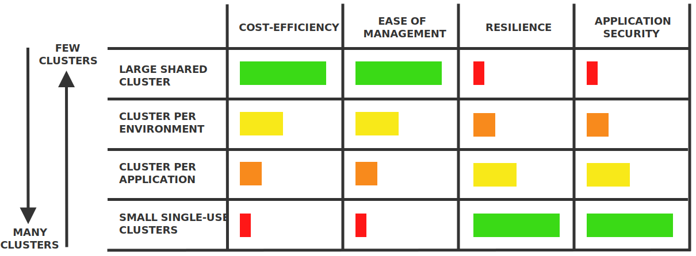
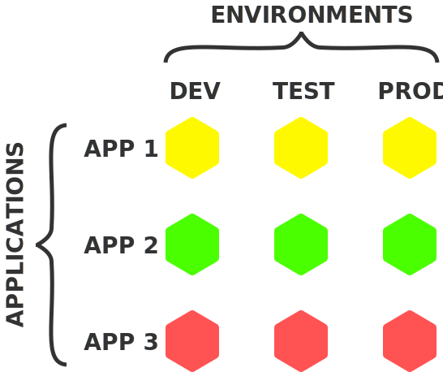
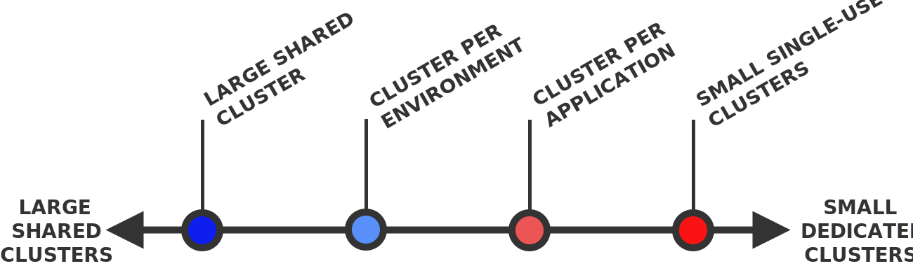
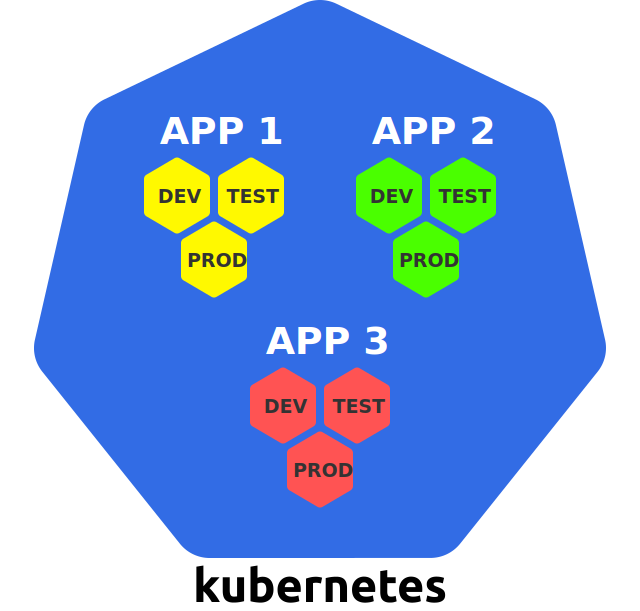
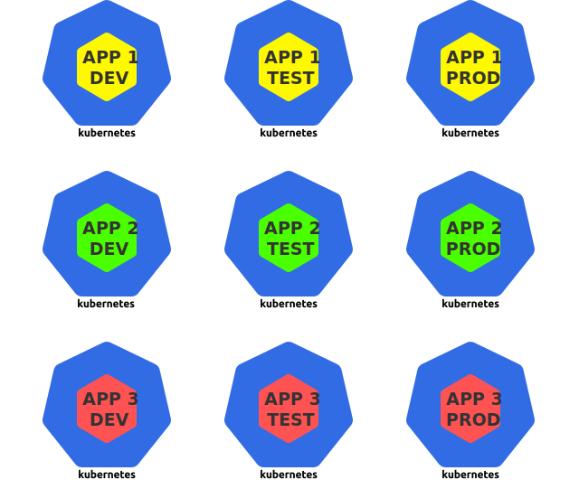
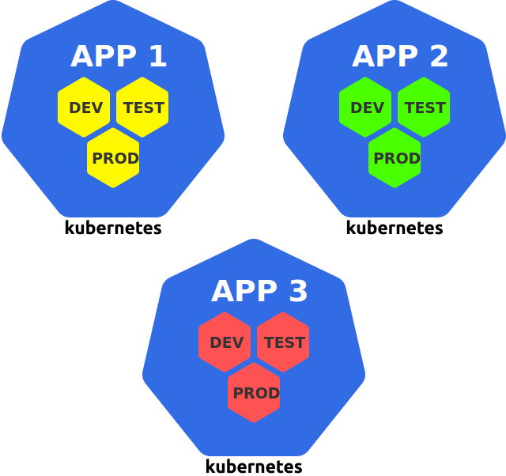
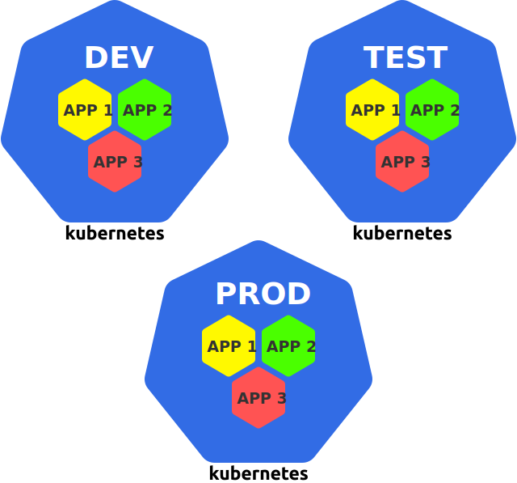

**TL;DR:** you can run a given set of workloads either on few large clusters (with many workloads in each cluster) or on many clusters (with few workloads in each cluster).

Here's a table that summarises the pros and cons of various approaches:

**If you use Kubernetes as the operational platform for your applications, you are confronted with some fundamental questions about the way you use clusters:**

- _How many clusters should you have?_
- _How big should they be?_
- _What should they contain?_

This article gets to the bottom of this question and analyses the pros and cons of some of the options you have.

## The problem

As a software creator, you typically develop and operate multiple applications.

Furthermore, you typically run multiple instances of these applications in different environments — for example, you might have a _dev_, _test_, and _prod_ environment.

This results in a "matrix" of applications and environments:

In the above example, there are 3 applications and 3 environments, which results in 9 application instances.

Each application instance is a self-contained deployment unit that can be operated and independently from the others.

> Note that an **application instance** may consist of multiple **components**, such as the frontend, backend, database, etc. In a microservices application, an application instance would consist of all the microservices.

As a Kubernetes user, this raises some questions:

- _Should you run all application instances on a single cluster?_
- _Or should you have a separate cluster for each application instance?_
- _Or should you use a combination of the above?_

All of these are valid approaches — Kubernetes is a flexible system and it doesn't dictate you how to use it!

Here are some of the options you have:

- [**One large shared cluster**](#1-one-large-shared-cluster)
- [**Many small single-use clusters**](#2-many-small-single-use-clusters)
- [**Cluster per application**](#3-cluster-per-application)
- [**Cluster per environment**](#4-cluster-per-environment)

The first two approaches are the extremes on the scale from _few large_ to _many small_ clusters, as shown below:

> In general, a cluster can be defined "larger" than another if it contains a larger sum of nodes and Pods — for example, a cluster with 10 nodes and 100 Pods is larger than a cluster with 1 node and 10 Pods.

_Let's get started!_

## 1. One large shared cluster

The first option is to run all your workloads in the same cluster:

With this approach, the cluster is used like general-purpose **infrastructure platform** — whatever you need to run, you deploy it to your existing Kubernetes cluster.

> Kubernetes provides [namespaces](https://kubernetes.io/docs/concepts/overview/working-with-objects/namespaces/) to logically separate portions of a cluster from each other, and in the above case, you could use a separate namespace for each application instance.

_Let's look at the pros and cons of this approach._

### 👍 Efficient resource usage

If you have only one Kubernetes cluster, you need to have only one copy of all the resources that are needed to run and manage a Kubernetes cluster.

This includes, for example, the master nodes — a Kubernetes cluster typically has 3 master nodes, and if you have only a single cluster, you need only 3 master nodes in total (compared to 30 master nodes if you have 10 Kubernetes clusters).

But this also includes other cluster-wide services, such as load balancers, Ingress controllers, authentication, logging, and monitoring.

If you have only a single cluster, you can reuse these services for _all_ your workloads, and you don't need to have multiple copies of them for multiple clusters.

### 👍 Cheap

As a consequence of the above point, fewer clusters are usually cheaper, because the resource overhead with larger numbers of clusters costs money.

This is particularly true for the master nodes, which may cost you substantial amounts — be it on-premises or in the cloud.

Some managed Kubernetes services provide the Kubernetes control plane for free, such as [Google Kubernetes Engine (GKE)](https://cloud.google.com/kubernetes-engine) or [Azure Kubernetes Service (AKS)](https://docs.microsoft.com/en-us/azure/aks/) — in this cases, cost-efficiency is less of an issue.

However, there are also managed Kubernetes services that charge a fixed amount for running a Kubernetes cluster, such as [Amazon Elastic Kubernetes Service (EKS)](https://aws.amazon.com/eks/).

### 👍 Efficient administration

Administrating a single cluster is easier than administrating many clusters.

This may include tasks like:

- _Upgrading the Kubernetes version_
- _Setting up a CI/CD pipeline_
- _Installing a CNI plugin_
- _Setting up the user authentication system_
- _Installing an admission controller_

_And many more..._

If you have only a single cluster, you need to do all of this only once.

If you have many clusters, then you need to apply everything multiple times, which probably requires you to develop some automated processes and tools for being able to do this consistently.

> **Now, to the cons.**

### 👎 Single point of failure

If you have only one cluster and if _that_ cluster breaks, then _all_ your workloads are down!

There are many ways that something can go wrong:

- _A Kubernetes upgrade produces unexpected side effects_
- _An cluster-wide component (such as a CNI plugin) doesn't work as expected_
- _An erroneous configuration is made to one of the cluster components_
- _An outage occurs in the underlying infrastructure_

A single incident like this can produce major damage across all your workloads if you have only a single shared cluster.

### 👎 No hard security isolation

If multiple apps run in the same Kubernetes cluster, this means that these apps share the hardware, network, and operating system on the nodes of the cluster.

Concretely, two containers of two different apps running on the same node are technically two processes running on the same hardware and operating system kernel.

> Linux containers provide some form of isolation, but this isolation is not as strong as the one provided by, for example, virtual machines (VMs). Under the hood, a process in a container is still just a process running on the host's operating system.

This may be an issue from a security point of view — it theoretically allows unrelated apps to interact with each other in undesired ways (intentionally and unintentionally).

Furthermore, all the workloads in a Kubernetes cluster share certain cluster-wide services, such as [DNS](https://kubernetes.io/docs/concepts/services-networking/dns-pod-service/) — this allows apps to discover the Services of other apps in the cluster.

_All these may or may not be issues for you, depending on the security requirements for your applications._

Kubernetes provides various means to prevent security breaches, such as [PodSecurityPolicies](https://kubernetes.io/docs/concepts/policy/pod-security-policy/) and [NetworkPolicies](https://kubernetes.io/docs/concepts/services-networking/network-policies/) — however, it requires experience to tweak these tools in exactly the right way, and they can't prevent every security breach either.

It's important to keep in mind that Kubernetes is designed for _sharing_, and not for _isolation_ and _security_.

### 👎 No hard multi-tenancy

Given the many shared resources in a Kubernetes cluster, there are many ways that different apps can "step on each other's toes".

For example, an app may monopolise a certain shared resource, such as the CPU or memory, and thus starve other apps running on the same node.

Kubernetes provides various ways to control this behaviour, such as [resource requests and limits](https://kubernetes.io/docs/concepts/configuration/manage-compute-resources-container/), [ResourceQuotas](https://kubernetes.io/docs/concepts/policy/resource-quotas/), and [LimitRanges](https://kubernetes.io/docs/concepts/policy/limit-range/) — however, again, it's not trivial to tweak these tools in exactly the right way, and they cannot prevent every unwanted side effect either.

### 👎 Many users

If you have only a single cluster, then many people in your organisation must have access to this cluster.

_The more people have access to a system, the higher the risk that they break something._

Within the cluster, you can control who can do what with [**role-based access control (RBAC)**](https://kubernetes.io/docs/reference/access-authn-authz/rbac/) — however, this still can't prevent that users break something within their area of authorisation.

### 👎 Clusters can't grow infinitely large

If you use a single cluster for all your workload, this cluster will probably be rather large (in terms of nodes and Pods).

_However, Kubernetes clusters can't grow infinitely large._

There are some theoretical upper limits for how big a cluster can be, which are defined by Kubernetes at about [5000 nodes, 150,000 Pods, and 300,000 containers](https://kubernetes.io/docs/setup/best-practices/cluster-large/).

However, in practice, challenges may show up already with much smaller cluster sizes, such as [500 nodes](https://events19.lfasiallc.com/wp-content/uploads/2017/11/BoF_-Not-One-Size-Fits-All-How-to-Size-Kubernetes-Clusters_Guang-Ya-Liu-_-Sahdev-Zala.pdf).

The reason is that larger clusters put a higher strain on the Kubernetes control plane, which requires careful planning to keep the cluster functional and efficient.

> This issue is also discussed in a related article of this blog named [**Architecting Kubernetes clusters — choosing a worker node size**](https://learnk8s.io/kubernetes-node-size).

_Let's look at the opposite approach — many small clusters._

## 2. Many small single-use clusters

With this approach, you use a separate Kubernetes cluster for every deployment unit:

For this article, a deployment unit is an application instance — such as the _dev_ version of a single app.

With this strategy, Kubernetes is used like a specialised **application runtime** for individual application instances.

_Let's see what the pros and cons of this approach are._

### 👍 Reduced blast radius

If a cluster breaks, the damage is limited to only the workloads that run on this cluster — all the other workloads are unaffected.

### 👍 Isolation

The workloads running in the individual clusters don't share any resources, such as CPU, memory, the operating system, network, or other services.

This provides strong isolation between unrelated applications, which may be a big plus for the security of these applications.

### 👍 Few users

If every cluster runs only a small set of workload, then fewer people need to have access to this cluster.

_The fewer people have access to a cluster, the lower the risk that something breaks._

> **Let's look at the cons.**

### 👎 Inefficient resource usage

As already mentioned, each Kubernetes cluster requires a set of management resources, such as the master nodes, control plane components, monitoring and logging solutions.

If you have many small clusters, you have to sacrifice a higher percentage of the total resources for these management functions.

### 👎 Expensive

Inefficient resource usage automatically results in higher costs.

For example, if you have to run 30 master nodes instead of 3 for the same compute power, you will see this in your monthly bill.

### 👎 Complex administration

Administrating many Kubernetes clusters is more complex than administrating a single Kubernetes cluster.

For example, you need to set up authentication and authorisation for each cluster — if you want to upgrade the Kubernetes version, you need to do this many times too.

You probably need to develop some automated processes for being able to do this efficiently.

_Let's look at some further cluster scenarios._

## 3. Cluster per application

With this approach, you have a separate cluster for all the instances of a specific application:

You can see this as a generalisation of a **cluster per team** since usually a team develops one or more apps.

_Let's look at the particular pros and cons of this approach._

### 👍 Cluster can be customised for an app

If an app has specific requirements, then these requirements can be installed in its cluster without affecting any of the other clusters.

Such requirements may include GPU worker nodes, a certain CNI plugin, a service mesh, or any other service.

Every cluster can be equipped with exactly the configuration that the corresponding app needs — not more and not less.

### 👎 Different environments in the same cluster

A disadvantage of this approach is that application instances from different environments run in the same cluster.

For example, the _prod_ version of an app runs in the same cluster as the _dev_ version — which also means that the developers work in the same cluster that the production version of the app runs.

So, if a developer or a buggy _dev_ version creates some damage in the cluster, the _prod_ version is potentially affected too — which is a big disadvantage.

_Let's look at the last example approach._

## 4. Cluster per environment

With this approach, you have a separate cluster for each environment:

For example, you can have a _dev_, _test_, and _prod_ cluster where you run all the application instances of a specific environment.

_Here are the pros and cons of this approach._

### 👍 Isolation of the _prod_ environment

In general, this approach isolates all the environments from each other — but, in practice, this especially matters for the _prod_ environment.

The production versions of your app are now not affected by whatever happens in any of the other clusters and application environments.

So, if some misconfiguration creates havoc in your _dev_ cluster, the _prod_ versions of your apps keep running as if nothing had happened!

### 👍 Cluster can be customised for an environment

You can optimise each cluster for its environment — for example, you can:

- Install development and debugging tools in the _dev_ cluster
- Install testing frameworks and tools in the _test_ cluster
- Use more powerful hardware and network connections for the _prod_ cluster

This may improve the efficiency of both the development and operation of your apps.

### 👍 Lock down access to _prod_ cluster

Nobody really needs to do work on the _prod_ cluster, so you can make access to it very restrictive.

You can go as far as not granting access to the _prod_ cluster to any humans at all — the deployments to this cluster can be made through an automated CI/CD tool.

This should greatly decrease the risk of human error in the _prod_ cluster, which is where it matters most!

> **Now, to the cons.**

### 👎 Lack of isolation between apps

The main disadvantage of this approach is the missing hardware and resource isolation between apps.

Unrelated apps share cluster resources, such as the operating system kernel, CPU, memory, and several other services.

As already mentioned, this may be a security issue.

### 👎 App requirements are not localised

If an app has special requirements, then these requirements must be satisfied in all clusters.

For example, if an app requires a GPU, then every cluster must have at least one GPU worker node — even if it is used only by a single app.

This may lead to higher costs and inefficient resource usage.

## Conclusion

In general, if you have a given set of applications, you can run them either on few large clusters or many small clusters.

This article discussed the pros and cons of various approaches on a scale from _few large_ to _many small_ clusters:

- [**One large shared cluster**](#1-one-large-shared-cluster)
- [**Many small single-use clusters**](#2-many-small-single-use-clusters)
- [**Cluster per application**](#3-cluster-per-application)
- [**Cluster per environment**](#4-cluster-per-environment)

_So, which approach should you choose?_

As usual, the answer depends on your use case — you have to trade-off the pros and cons of the different approaches against each other to find the solution that works best for you.

However, the choice is not limited to the above examples — it can be any combination of them!

For example, you might think about having two clusters for each team: a development cluster (used for the _dev_ and _test_ environments) and a production cluster (used for the _prod_ environment).

By knowing the above example scenarios, you can combine the pros and cons for your specific scenario accordingly.
