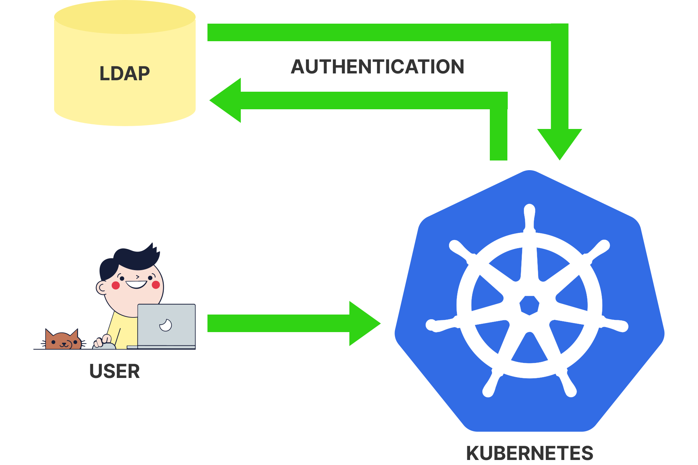
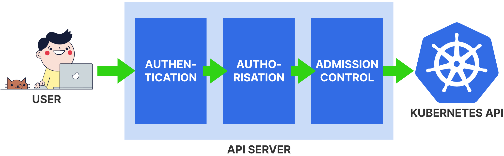
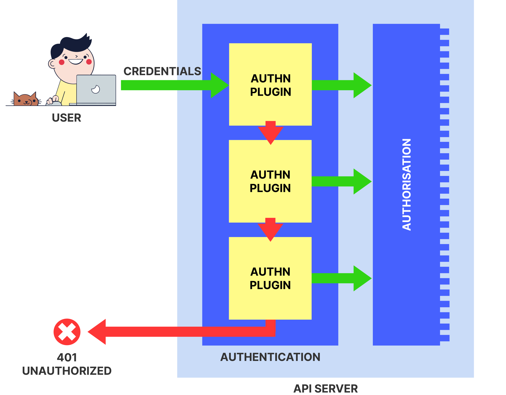
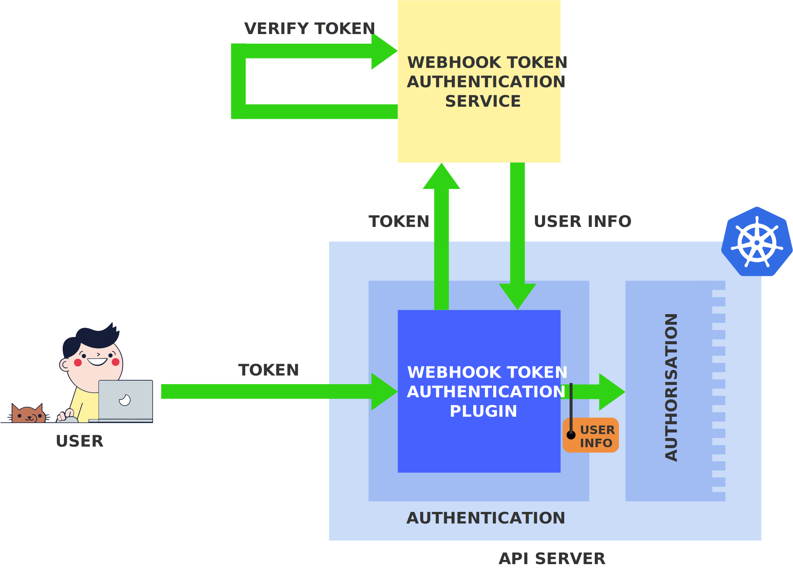
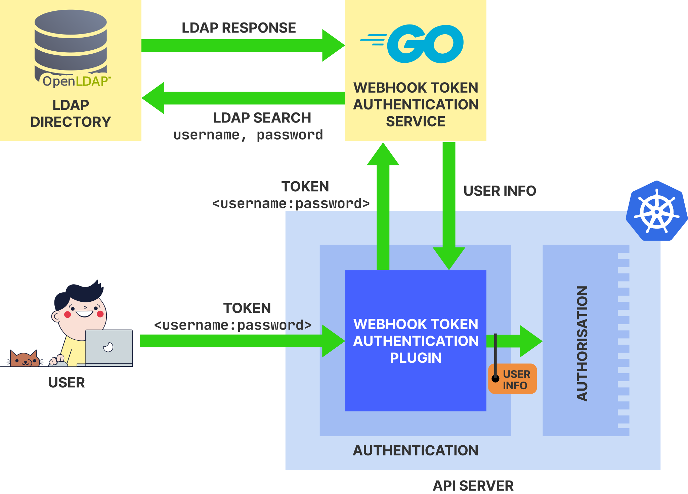
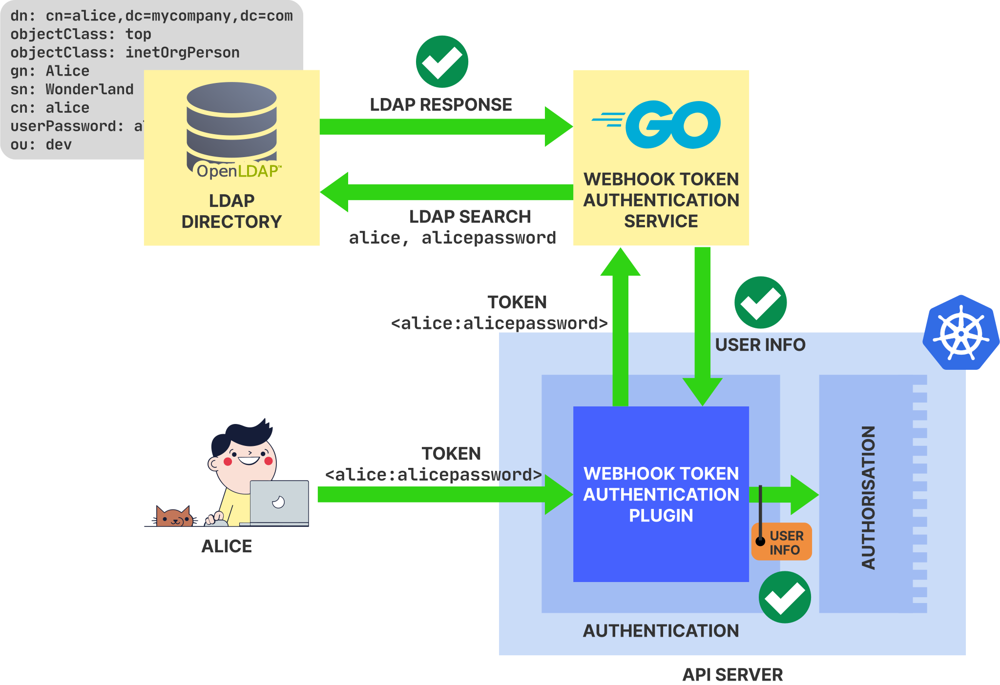
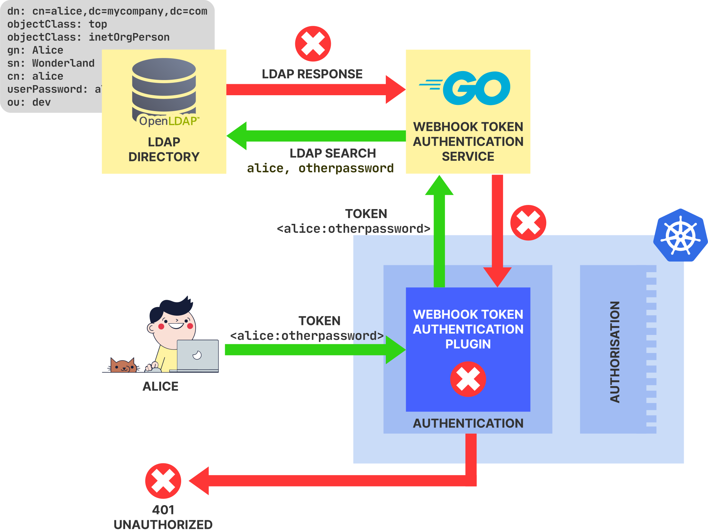

Kubernetes supports several authentication methods out-of-the-box, such as X.509 client certificates, static HTTP bearer tokens, and [OpenID Connect](https://openid.net/).

_However, Kubernetes also provides points of extensibility that allow you to integrate any desired authentication method and user management system._

This article explains how you can implement a custom authentication method for Kubernetes with the example of [LDAP authentication](https://connect2id.com/products/ldapauth/auth-explained).

In particular, this means that users will be able to authenticate to Kubernetes with their existing credentials from a [Lightweight Directory Access Protocol (LDAP)](https://en.wikipedia.org/wiki/Lightweight_Directory_Access_Protocol) directory.



LDAP authentication is used mainly as an example here — the goal of this article is to show the _general principles_ of how to implement a custom authentication method.

Using this knowledge, you can bind any authentication technology to Kubernetes.

_Think of [Kerberos](https://en.wikipedia.org/wiki/Kerberos%5f%28protocol%29), [Keycloak](https://www.keycloak.org/), [OAuth](https://en.wikipedia.org/wiki/OAuth), [SAML](https://en.wikipedia.org/wiki/SAML%5f2.0), custom certificates, custom tokens, and any kind of existing single-sign on infrastructure._

All of this is possible with Kubernetes!

_Before starting with the implementation, let's briefly review the fundamentals of the Kubernetes API access._

## How access to the Kubernetes API is controlled

Every request to the Kubernetes API passes through three stages in the API server: **authentication**, **authorisation**, and **admission control**:



Each stage has a well-defined purpose:

- [**Authentication**](https://kubernetes.io/docs/reference/access-authn-authz/authentication/) checks whether the user is a legitimate user of the API and, if yes, establishes its user identity
- [**Authorisation**](https://kubernetes.io/docs/reference/access-authn-authz/authorization/) checks whether the identified user has permission to execute the requested operation
- [**Admission control**](https://kubernetes.io/docs/reference/access-authn-authz/admission-controllers/) performs a variety of additional configurable checks on the request to enforce cluster policies

At each stage, a request may be rejected — and only requests that successfully make it through all three stages are handled by the Kubernetes API.

_Let's have a closer look at the authentication stage._

The task of the authentication stage is to check whether a request comes from a legitimate user and to reject all requests that don't.

This is done by verifying some form of credentials in the request and establishing the identity of the user that these credentials belong to.

Internally, the authentication stage is organised as a sequence of authentication plugins:



Each authentication plugin implements a specific authentication method.

An incoming request is presented to each authentication plugin in sequence.

If any of the authentication plugins can successfully verify the credentials in the request, then authentication is complete and the request proceeds to the authorisation stage (the execution of further authentication plugins is short-circuited).

If none of the authentication plugins can authenticate the request, the request is rejected with a [401 Unauthorized](https://developer.mozilla.org/en-US/docs/Web/HTTP/Status/401) HTTP status code.

> Note that the [401 Unauthorized](https://developer.mozilla.org/en-US/docs/Web/HTTP/Status/401) status code is a [long-standing misnomer](https://stackoverflow.com/a/6937030/4747193) as it indicates _authentication_ errors and **not** _authorisation_ errors. The HTTP status code for authorisation errors is [403 Forbidden](https://developer.mozilla.org/en-US/docs/Web/HTTP/Status/403).

_So what authentication plugins do there exist?_

First of all, Kubernetes does not provide an open plugin mechanism that allows you to develop your own plugins and simply plug them in.

Rather, Kubernetes provides a fixed set of in-tree authentication plugins that are compiled in the API server binary.

These plugins can be selectively enabled and configured with [command-line flags](https://kubernetes.io/docs/reference/command-line-tools-reference/kube-apiserver/9) on the API server binary at startup time.

You can find the list of available authentication plugins in the [Kubernetes documentation](https://kubernetes.io/docs/reference/access-authn-authz/authentication/#authentication-strategies).

There are three "closed" authentication plugins that implement specific authentication methods:

- [**X.509 Client Certs**](https://kubernetes.io/docs/reference/access-authn-authz/authentication/#x509-client-certs)
- [**Static Token File**](https://kubernetes.io/docs/reference/access-authn-authz/authentication/#static-token-file)
- [**OpenID Connect Tokens**](https://kubernetes.io/docs/reference/access-authn-authz/authentication/#openid-connect-tokens)

> Up to and including Kubernetes v1.15, there was additionally the [Static Password File](https://kubernetes.io/docs/reference/access-authn-authz/authentication/#static-password-file) authentication plugin which implemented [HTTP basic authentication](https://tools.ietf.org/html/rfc7617), however, it was [deprecated in Kubernetes v1.16](https://v1-16.docs.kubernetes.io/docs/setup/release/notes/#deprecations-and-removals).

Furthermore, there are two "open-ended" authentication plugins that don't implement a specific authentication method but provide a point of extensibility for incorporating custom authentication logic:

- [**Webhook Token**](https://kubernetes.io/docs/reference/access-authn-authz/authentication/#webhook-token-authentication)
- [**Authenticating Proxy**](https://kubernetes.io/docs/reference/access-authn-authz/authentication/#authenticating-proxy)

The flexibility of the Kubernetes authentication mechanisms stems from these two open-ended authentication plugins.

_They allow integrating any desired authentication method with Kubernetes._

In this tutorial, you will use the [**Webhook Token**](https://kubernetes.io/docs/reference/access-authn-authz/authentication/#webhook-token-authentication) authentication plugin to implement [LDAP authentication](https://connect2id.com/products/ldapauth/auth-explained) for your Kubernetes cluster.

To this end, you will create all components from scratch — an LDAP directory, an authentication service, and a Kubernetes cluster — and you will wire them up to work smoothly together.

> As mentioned, LDAP authentication is used as an example. You can use the Webhook Token authentication plugin to integrate any other authentication technology.

_Let's get started!_

## Prerequisites

This tutorial assumes that you have a [Google Cloud Platform (GCP)](https://connect2id.com/products/ldapauth/auth-explained) account and a working installation of the [`gcloud`](https://cloud.google.com/sdk/gcloud) command-line tool on your system.

If you haven't a GCP account yet, you can [create a new one](https://cloud.google.com/), in which case you get USD 300 credits that you can use for this tutorial.

You can install `gcloud` by installing the [Google Cloud SDK](https://cloud.google.com/sdk/docs/) according to the [GCP documentation](https://cloud.google.com/sdk/docs/downloads-interactive).

The accumulated costs for the GCP resources created in this tutorial are no more than 10 US cents per hour.

> All charges will be subtracted from the USD 300 free credits that you get when you create a new account.

## Setting up an LDAP directory

The first thing you will do is creating an LDAP directory that will serve as the central user management system of your setup.

[Lightweight Directory Access Protocol (LDAP)](https://en.wikipedia.org/wiki/Lightweight_Directory_Access_Protocol) is a [directory service](https://en.wikipedia.org/wiki/Directory_service) and thus is in the same category of applications as the [Domain Name System (DNS)](https://en.wikipedia.org/wiki/Domain_Name_System).

_You can think of an LDAP directory as a database that maps names to values._

In practice, LDAP is often used to centrally store user information, such as personal data (name, address, email address, etc.), usernames, passwords, group affiliations and so on, of all members of an organisation.

This information is then accessed by various applications and services for authentication purposes, such as validating the username and password supplied by the user.

Concretely, users may submit their username and password to an application, and the application queries the LDAP directory to verify whether these credentials are correct.

_This is called [LDAP authentication](https://connect2id.com/products/ldapauth/auth-explained)._

For this tutorial, you will install [OpenLDAP](https://www.openldap.org/), which is one of the most popular LDAP directory implementations.

_Let's start by creating the necessary GCP infrastructure for installing your LDAP directory._

First of all, create a new GCP [VPC network and subnet](https://cloud.google.com/vpc/docs/vpc):

```terminal|command=1,2|title=bash
gcloud compute networks create my-net --subnet-mode custom
gcloud compute networks subnets create my-subnet --network my-net --range 10.0.0.0/16
```

Next, create a GCP [instance](https://cloud.google.com/compute/docs/instances) for hosting the LDAP directory:

```terminal|command=1-5|title=bash
gcloud compute instances create authn \
  --subnet my-subnet \
  --machine-type n1-standard-1  \
  --image-family ubuntu-1804-lts \
  --image-project ubuntu-os-cloud
```

By default, GCP instances can't accept any traffic unless you define [firewall rules](https://cloud.google.com/vpc/docs/firewalls) that explicitly allow certain types of traffic.

In your case, traffic should be accepted from other instances in the same VPC network as well as from your local machine.

To realise this, create the following firewall rule:

```terminal|command=1-4|title=bash
gcloud compute firewall-rules create allow-internal-and-admin \
  --network my-net \
  --allow icmp,tcp,udp \
  --source-ranges 10.0.0.0/16,$(curl checkip.amazonaws.com)
```

> If the public IP address of your local machine ever changes, you can update the firewall rule with [`gcloud compute firewall-rules update`](https://cloud.google.com/sdk/gcloud/reference/compute/firewall-rules/update).

Now, log in to instance with SSH:

```terminal|command=1|title=bash
gcloud compute ssh root@authn
```

_The next step is to install OpenLDAP on the instance._

OpenLDAP is distributed as the [`slapd`](https://packages.ubuntu.com/bionic/slapd) Debian package.

Before you install this package, you should preset some of its settings, which will make the configuration easier:

```terminal|command=1-6|title=bash
cat <<EOF | debconf-set-selections
slapd slapd/password1 password adminpassword
slapd slapd/password2 password adminpassword
slapd slapd/domain string mycompany.com
slapd shared/organization string mycompany.com
EOF
```

The above command sets the password of the default LDAP admin user to `adminpassword` and the base of the LDAP database to `mycompany.com`.

Now, you can install the `slapd` package:

```terminal|command=1,2|title=bash
apt-get update
apt-get install -y slapd
```

_That's it — OpenLDAP should now be installed and running!_

You can now log out from the instance:

```terminal|command=1|title=bash
exit
```

_Let's test if you can access the LDAP directory from your local machine._

To interact with LDAP directories, you can use the `ldapsearch` tool which allows making [LDAP Search](https://en.wikipedia.org/wiki/Lightweight_Directory_Access_Protocol#Search_and_Compare) requests.

If you're on macOS, then `ldapsearch` should be already installed — if you're on Linux, you can install it with:

```terminal|command=1|title=bash
sudo apt-get install ldap-utils
```

With `ldapsearch` installed, run the following command:

```terminal|command=1-3|title=bash
ldapsearch -LLL -H ldap://<AUTHN-EXTERNAL-IP> \
  -x -D cn=admin,dc=mycompany,dc=com -w adminpassword \
  -b dc=mycompany,dc=com
```

> Please replace `<AUTHN-EXTERNAL-IP>` with the _external IP address_ of the `authn` instance that you just created. You can find it out this IP address `gcloud compute instances list`.

The above command might look cryptic, but it's the canonical way to interact with an LDAP directory, so here are some explanations:

- The `-LLL` option simplifies the output format be removing comments and other metadata
- The `-H` option specifies the URL of the LDAP directory
- The `-x`, `-D`, and `-w` options provide the authentication information for connecting to the LDAP directory: `-D` is the user to connect as and `-w` is the corresponding password (note that is the LDAP admin user whose password you defined in the initial `slapd` package configuration).
- The `-b` option specifies the search base, that is, the node in the LDAP directory under which the search is performed.

In general, an LDAP directory is a tree-like hierarchical database (like DNS): a node like `dc=mycompany,dc=com` (`dc` stands for _domain component_) can be read as `mycompany.com`; so a node like `cn=admin,dc=mycompany,dc=com` (`admin.mycompany.com`) is one level under `dc=mycompany,dc=com`.

In any case, the output of the command should look like that:

```
dn: dc=mycompany,dc=com
objectClass: top
objectClass: dcObject
objectClass: organization
o: mycompany.com
dc: mycompany

dn: cn=admin,dc=mycompany,dc=com
objectClass: simpleSecurityObject
objectClass: organizationalRole
cn: admin
description: LDAP administrator
userPassword:: e1NTSEF9bHF4NGljTGlyL1BDSkhiYVVFMXcrQ2ZpM045S2laMzc=
```

These are the two LDAP entries that currently exist in your LDAP directory.

_An LDAP entry is like at a DNS record, or a row in a relational database — the basic entity that contains the data._

In general, an LDAP entry consists of a unique identifier called `dn` (_distinguished name_) and a set of attributes, such as `objectClass`, `cn` (_common name_), `o` (_organisation_), or `userPassword`.

_All in all, the above result tells you that your LDAP directory is working!_

## Creating an LDAP user entry

Currently, there's not much useful data in your LDAP directory — but let's change that.

Your next task is to create an LDAP entry for the user Alice — the following info should be saved about her:

- First name: Alice
- Last name: Wonderland
- Username: `alice`
- Password: `alicepassword`
- Group: `dev`

To store this information as an LDAP entry, you have to express it in the [LDAP Data Interchange Format (LDIF)](https://en.wikipedia.org/wiki/LDAP_Data_Interchange_Format) format.

Here's how this looks like (save the following in a file named `alice.ldif`):

```title=alice.ldif
dn: cn=alice,dc=mycompany,dc=com
objectClass: top
objectClass: inetOrgPerson
gn: Alice
sn: Wonderland
cn: alice
userPassword: alicepassword
ou: dev
```

The above specification defines an entry with a _distinguished name_ (`dn`) of `cn=alice,dc=mycompany,dc=com` — this is the unique identifier of this entry in your LDAP directory.

Furthermore, the entry has the following attributes:

- `objectClass` defines the type of the entry and dictates which other attributes are allowed or mandatory; [`inetOrgPerson`](https://tools.ietf.org/html/rfc2798) is a standard object class for storing user information.
- `gn` stands for _given name_
- `sn` stands for _surname_
- `cn` stands for _common name_ and is often used for storing usernames
- `userPassword` is the user's password
- `ou` stands for _organisational unit_ and is often used for storing affiliations

To create this entry, you can use the `ldapadd` tool which allows making [LDAP Add](https://en.wikipedia.org/wiki/Lightweight_Directory_Access_Protocol#Add) requests to an LDAP directory.

> If you installed `ldapsearch`, you should also have `ldapadd` because they are bundled together.

Run the following command:

```terminal|command=1-2|title=bash
ldapadd -H ldap://<AUTHN-EXTERNAL-IP> \
  -x -D cn=admin,dc=mycompany,dc=com -w adminpassword -f alice.ldif
```

> Please replace `<AUTHN-EXTERNAL-IP>` with the _external IP address_ of the `authn` instance.

The output should say:

```
adding new entry "cn=alice,dc=mycompany,dc=com"
```

_Sounds good!_

To be sure that the entry has been added, try to query it with the following command:

```terminal|command=1-3|title=bash
ldapsearch -LLL -H ldap://<AUTHN-EXTERNAL-IP> \
  -x -D cn=admin,dc=mycompany,dc=com -w adminpassword \
  -b dc=mycompany,dc=com cn=alice
```

This command is similar to the `ldapsearch` command from before, but it has an additional argument at the end (`cn=alice`) — this is the _search filter_ and it causes only those entries to be returned that match the filter.

The output of the command should look like that:

```
dn: cn=alice,dc=mycompany,dc=com
objectClass: top
objectClass: inetOrgPerson
givenName: Alice
sn: Wonderland
cn: alice
userPassword:: YWxpY2VwYXNzd29yZA==
ou: dev
```

_That's the entry for Alice that you just created!_

> Note that the password in the output is [Base64-encoded](https://en.wikipedia.org/wiki/Base64), which is done automatically by LDAP. You can decode it with `echo YWxpY2VwYXNzd29yZA== | base64 -D` which results in `alicepassword`.

So you have now an LDAP directory with a first user, Alice, in it.

The final goal of this tutorial will be that Alice can authenticate to the (future) Kubernetes cluster with her username `alice` and password `alicepassword` from the LDAP directory.

To this end, you have to start creating the link between the LDAP directory and Kubernetes.

_You will do that next!_

## Using the Webhook Token authentication plugin

You will use the [Webhook Token](https://kubernetes.io/docs/reference/access-authn-authz/authentication/#webhook-token-authentication) authentication plugin to bind Kubernetes to the LDAP directory.

Here is how the Webhook Token authentication plugin works:



The Webhook Token authentication plugin requires requests to include an [HTTP bearer token](https://swagger.io/docs/specification/authentication/bearer-authentication/) as an authentication credential.

> An HTTP bearer token is included in the `Authorization` header of a request as `Authorization: Bearer <TOKEN>`.

When the Webhook Token authentication plugin receives a request, it extracts the HTTP bearer token and submits it to an external _webhook token authentication service_ for verification.

The Webhook Token authentication plugin invokes the webhook token authentication service with an HTTP POST request carrying a [TokenReview](https://kubernetes.io/docs/reference/generated/kubernetes-api/v1.17/#tokenreview-v1-authentication-k8s-io) object in JSON format that includes the token to verify.

Here's how this TokenReview object looks like:

```json|title=tokenreview.json
{
  "apiVersion": "authentication.k8s.io/v1beta1",
  "kind": "TokenReview",
  "spec": {
    "token": "<TOKEN>"
  }
}
```

The webhook token authentication service is completely independent of Kubernetes and it is implemented and operated by the cluster administrator (that is, by you).

The task of the webhook token authentication service is to verify the token, and, if it's valid, return the identity of the user it belongs to.

The user identity has the form of a [UserInfo](https://kubernetes.io/docs/reference/generated/kubernetes-api/v1.17/#userinfo-v1beta1-authentication-k8s-io) data structure, which contains the following fields:

- **Username** (primary identifier of the user)
- **UID** (temporally unique identifier of the user)
- **Groups** (array of groups that the user belongs to)
- **Extras** (array of custom data)

The response from the webhook token authentication service to the API server is a [TokenReview](https://kubernetes.io/docs/reference/generated/kubernetes-api/v1.17/#tokenreview-v1-authentication-k8s-io) object indicates whether the token is valid or not, and in the first case, includes the UserInfo of the identified user.

Based on this information, the Webhook Token authentication plugin then either accepts or rejects the request.

**So, how do you implement LDAP authentication with the Webhook Token authentication plugin?**

Here's a solution:



Users include an HTTP bearer token of the following form in their Kubernetes requests:

```
username:password
```

In this token, `username` and `password` are the username and password of the user from the LDAP directory.

> In a real-world scenario, the token should be [Base64-encoded](https://en.wikipedia.org/wiki/Base64) to correctly handle special characters. This tutorial omits this step for simplicity.

The Webhook Token authentication plugin then submits this token to the webhook token authentication service for verification.

The webhook token authentication service extracts the `username` and `password` parts from the token and verifies whether they are correct by talking to the LDAP directory.

In particular, the authentication service makes an [LDAP Search](https://en.wikipedia.org/wiki/Lightweight_Directory_Access_Protocol#Search_and_Compare) request to the LDAP directory, asking whether there exists a user entry with the given username and password.

If this is the case, the LDAP directory returns the entry of this user, and from this entry, the authentication service constructs the user identity (UserInfo) that it must return to the API server.

_As you can see, the main task of implementing your LDAP authentication solution will consist in creating a webhook token authentication service that implements the described logic._

You will implement this service in [Go](https://golang.org/) and deploy it on your GCP infrastructure next to the LDAP directory.

> You will see later that there's a good reason to implement this service in Go.

_Let's get started!_

## Implementing the webhook token authentication service

Since you will implement the service with Go, you first have to install Go on your system, if you haven't yet done so.

If you use macOS, you can install Go with:

```terminal|command=1|title=bash
brew install go
```

If you use Linux, you can install the latest version of Go as described in the [Go documentation](https://golang.org/doc/install#tarball):

```terminal|command=1,2,3|title=bash
wget https://dl.google.com/go/go1.14.linux-amd64.tar.gz
sudo tar -C /usr/local -xzf go1.14.linux-amd64.tar.gz
echo "PATH=$PATH:/usr/local/go/bin" >>~/.bash_profile && . ~/.bash_profile
```

You can verify the installation of Go with:

```terminal|command=1|title=bash
go version
```

**You can find the complete source code of the service [on GitHub](https://github.com/learnk8s/authentication) in a file named `authn.go`.**

You may just download this file to your local machine:

```terminal|command=1|title=bash
wget https://raw.githubusercontent.com/learnk8s/authentication/master/authn.go
```

_Let's go through the most important parts of the implementation._

```go|title=authn.go
package main

import (
    "encoding/json"
    "fmt"
    "github.com/go-ldap/ldap"
    "io/ioutil"
    "k8s.io/api/authentication/v1"
    "log"
    "net/http"
    "os"
    "strings"
)
# ...
```

As usual, a Go source file starts with the package declaration and the list of imported packages.

It's worth noting that one of the imported packages, `k8s.io/api/authentication/v1`, comes directly from the Kubernetes source code (which is also written in Go) — you will later use some type definitions of this package.

> The ability to import packages from the Kubernetes source code is a big advantage of using Go for Kubernetes-related applications.

The next chunk of the implementation looks as follows:

```go|title=authn.go
# ...
var ldapURL string

func main() {
    ldapURL = "ldap://" + os.Args[1]
    log.Printf("Using LDAP directory %s\n", ldapURL)
    log.Println("Listening on port 443 for requests...")
    http.HandleFunc("/", handler)
    log.Fatal(http.ListenAndServeTLS(":443", os.Args[3], os.Args[2], nil))
}
# ...
```

This is the `main` function of the implementation — it reads the IP address of the LDAP directory from a command-line argument and sets up an HTTPS web server.

> As you know, a webhook token authentication service is a web service, as the API server invokes it through HTTPS POST requests.

The biggest part of the rest of the code will be the implementation of the HTTPS handler function `handler` that handles the requests from the Kubernetes API server.

Here's how it starts:

```go|title=authn.go
# ...
func handler(w http.ResponseWriter, r *http.Request) {

    // Read body of POST request
    b, err := ioutil.ReadAll(r.Body)
    if err != nil {
        writeError(w, err)
        return
    }
    log.Printf("Receiving: %s\n", string(b))
# ...
```

The above code reads the body data of the received HTTPS POST request — which is expected to be a [TokenReview](https://kubernetes.io/docs/reference/generated/kubernetes-api/v1.17/#tokenreview-v1beta1-authentication-k8s-io) object in JSON format.

The following code deserialises the body data into a Go `TokenReview` object:

```go|title=authn.go
# ...
    // Unmarshal JSON from POST request to TokenReview object
    var tr v1.TokenReview
    err = json.Unmarshal(b, &tr)
    if err != nil {
        writeError(w, err)
        return
    }
#...
```

Note that the `TokenReview` type comes from the [`k8s.io/api/authentication/v1`](https://github.com/kubernetes/api/blob/master/authentication/v1/types.go) from the Kubernetes source code — this makes it possible for you to do this deserialisation with essentially a single statement!

The following code extracts the username and password parts from the token in the `TokenReview` object:

```go|title=authn.go
# ...
    // Extract username and password from the token in the TokenReview object
    s := strings.SplitN(tr.Spec.Token, ":", 2)
    if len(s) != 2 {
        writeError(w, fmt.Errorf("badly formatted token: %s", tr.Spec.Token))
        return
    }
    username, password := s[0], s[1]
# ...
```

The following code makes the [LDAP Search](https://en.wikipedia.org/wiki/Lightweight_Directory_Access_Protocol#Search_and_Compare) request with the extracted username and password to the LDAP directory:

```go|title=authn.go
# ...
    // Make LDAP Search request with extracted username and password
    userInfo, err := ldapSearch(username, password)
    if err != nil {
        writeError(w, fmt.Errorf("failed LDAP Search request: %v", err))
        return
    }
# ...
```

This request queries the LDAP directory for a user entry with the given username and password.

> The implementation of the `ldapSearch` function is further down in the source file.

The following code uses the response of the LDAP Search request to construct the response to the API server:

```go|title=authn.go
# ...
    // Set status of TokenReview object
    if userInfo == nil {
        tr.Status.Authenticated = false
    } else {
        tr.Status.Authenticated = true
        tr.Status.User = *userInfo
    }
# ...
```

The response to the API server is also a [TokenReview](https://kubernetes.io/docs/reference/generated/kubernetes-api/v1.17/#tokenreview-v1beta1-authentication-k8s-io) object, and it has a Status.Authenticated field indicating whether the authentication succeeded, and in the case that it did, a Status.User field containing the identity ([UserInfo](https://kubernetes.io/docs/reference/generated/kubernetes-api/v1.17/#userinfo-v1beta1-authentication-k8s-io)) of the authenticated user.

Finally, the following code sends the response back to the API server:

```go|title=authn.go
# ...
    // Marshal the TokenReview to JSON and send it back
    b, err = json.Marshal(tr)
    if err != nil {
        writeError(w, err)
        return
    }
    w.Write(b)
    log.Printf("Returning: %s\n", string(b))
}
```

That's it for the `handler` function.

Next, there's a helper function for handling errors:

```go|title=authn.go
# ...
func writeError(w http.ResponseWriter, err error) {
    err = fmt.Errorf("Error: %v", err)
    w.WriteHeader(http.StatusInternalServerError) // 500
    fmt.Fprintln(w, err)
    log.Println(err)
}
# ...
```

Finally, there's the `ldapSearch` function that's invoked above by the `handler` function.

The `ldapSearch` function takes a username and password as an argument and makes an [LDAP Search](https://en.wikipedia.org/wiki/Lightweight_Directory_Access_Protocol#Search_and_Compare) request for a user entry with the given username and password — if such an entry exists, the function returns a [UserInfo](https://kubernetes.io/docs/reference/generated/kubernetes-api/v1.17/#userinfo-v1beta1-authentication-k8s-io) object containing the user identity, else it returns `nil`.

Here's how the function starts:

```go|title=authn.go
# ...
func ldapSearch(username, password string) (*v1.UserInfo, error) {

    // Connect to LDAP directory
    l, err := ldap.DialURL(ldapURL)
    if err != nil {
        return nil, err
    }
    defer l.Close()
# ...
```

The above code establishes the initial connection to the LDAP directory.

The following code authenticates to the LDAP directory as the LDAP admin user (in LDAP, authenticating is done with an [LDAP Bind](https://en.wikipedia.org/wiki/Lightweight_Directory_Access_Protocol#Bind%5f%28authenticate%29) request):

```go|title=authn.go
# ...
    // Authenticate as LDAP admin user
    err = l.Bind("cn=admin,dc=mycompany,dc=com", "adminpassword")
    if err != nil {
        return nil, err
    }
# ...
```

> The above corresponds to the `-x`, `-D`, and `-w` options you used in the manual LDAP requests with `ldapsearch` and `ldapadd`.

The following code makes the actual [LDAP Search](https://en.wikipedia.org/wiki/Lightweight_Directory_Access_Protocol#Search_and_Compare) request:

```go|title=authn.go
# ...
    // Execute LDAP Search request
    searchRequest := ldap.NewSearchRequest(
        "dc=mycompany,dc=com",  // Search base
        ldap.ScopeWholeSubtree, // Search scope
        ldap.NeverDerefAliases, // Dereference aliases
        0,                      // Size limit (0 = no limit)
        0,                      // Time limit (0 = no limit)
        false,                  // Types only
        fmt.Sprintf("(&(objectClass=inetOrgPerson)(cn=%s)(userPassword=%s))", username, password), // Filter
        nil, // Attributes (nil = all user attributes)
        nil, // Additional 'Controls'
    )
    result, err := l.Search(searchRequest)
    if err != nil {
        return nil, err
    }
# ...
```

_The first statement above sets the request parameters._

The crucial part here is the _filter_ argument — it defines what the request should "search for".

The above filter searches for an entry with an `objectClass` of `inetOrgPerson`, a `cn` (_common name_) equalling the provided username, and a `userPassword` equalling the provided password.

_The second statement executes the request._

If the request returns an entry, then the provided username and password are obviously valid and belong to the user whose entry is returned — if the request returns no entry, it means that the username and password are invalid.

The following code inspects the return value of the LDAP Search request and constructs the return value of the `ldapSearch` function:

```go|title=authn.go
# ...
    // If LDAP Search produced a result, return UserInfo, otherwise, return nil
    if len(result.Entries) == 0 {
        return nil, nil
    } else {
        return &v1.UserInfo{
            Username: username,
            UID:      username,
            Groups:   result.Entries[0].GetAttributeValues("ou"),
        }, nil
    }
}
```

If the LDAP Search response is empty, then the username and password are invalid and the `ldapSearch` function returns `nil`.

If the LDAP Search response includes an entry, then the username and password are valid and the `ldapSearch` function returns a [UserInfo](https://kubernetes.io/docs/reference/generated/kubernetes-api/v1.17/#userinfo-v1beta1-authentication-k8s-io) object initialised with the identity of the user.

> Note that the `UserInfo` type is also provided by the [`k8s.io/api/authentication/v1`](https://github.com/kubernetes/api/blob/master/authentication/v1/types.go) package from the Kubernetes source code.

_That's it — the complete code of your webhook token authentication service!_

Having completed the implementation, the next step is to deploy it.

## Deploying the webhook token authentication service

To deploy the service, you first have to compile its source code:

```terminal|command=1|title=bash
GOOS=linux GOARCH=amd64 go build authn.go
```

This should produce a binary named `authn`.

You could deploy your service to any machine that's accessible over the internet — for this tutorial, you will deploy it to the same GCP instance that already hosts your LDAP directory.

You can upload the binary to this instance as follows:

```terminal|command=1|title=bash
gcloud compute scp authn root@authn:
```

Then, log in to the instance with SSH:

```terminal|command=1|title=bash
gcloud compute ssh root@authn
```

Since the service serves HTTPS, it depends on a private key and certificate that must be provided as command-line arguments.

You can create an appropriate private key and certificate with the following command:

```terminal|command=1-2|title=bash
openssl req -x509 -newkey rsa:2048 -nodes -subj "/CN=localhost" \
  -keyout key.pem -out cert.pem
```

> The above command creates a self-signed certificate. This is fine for a tutorial, but in a production scenario, you should use a certificate that's signed by a proper certificate authority (CA).

Now, you can launch the service as follows:

```terminal|command=1|title=bash
./authn localhost key.pem cert.pem &>/var/log/authn.log &
```

Note the following about the command:

- The first command-line argument is the IP address of the LDAP directory. Since the service and the LDAP directory run on the same host, you can use `localhost`.
- The second and third command-line arguments are the private key and certificate that you just created.
- The output of the command is directed to a log file `/var/log/authn.log`

**Your webhook token authentication service is now up and running!**

> You can find out the process ID of your running service with `pgrep authn`. If you ever need to kill it, you can do so with `pkill authn`.

You can now log out from the instance:

```terminal|command=1|title=bash
exit
```

_Back on your local machine, let's test if the service works as expected._

Create a file with the following content:

```json|title=tokenreview.json
{
  "apiVersion": "authentication.k8s.io/v1beta1",
  "kind": "TokenReview",
  "spec": {
    "token": "alice:alicepassword"
  }
}
```

The above is a [TokenReview](https://kubernetes.io/docs/reference/generated/kubernetes-api/v1.17/#tokenreview-v1beta1-authentication-k8s-io) object, which is what your authentication service is supposed to receive from the API server.

For testing your service, you will simulate such a request from the API server by making it manually from your local machine.

> Note that the above TokenReview object contains the token `alice:alicepassword` which consists of the valid username and password of Alice that your previously saved in the LDAP directory — that means, the verification of the token should succeed.

To see how your authentication service will react to the request, stream its logs in a separate terminal window:

```terminal|command=1|title=bash-1
gcloud compute ssh root@authn --command "tail -f /var/log/authn.log"
```

Now, make the request with the following command:

```terminal|command=1|title=bash
curl -k -X POST -d @tokenreview.json https://<AUHTN-EXTERNAL-IP>
```

> Please replace `<AUHTN-EXTERNAL-IP>` with the _external IP address_ of the `authn` instance.

The above command makes an HTTP POST request to the authentication service with the TokenReview object included in the body.

The logs of the authentication service should print two lines indicating that an object was received and a response was sent back.

And the response of the `curl` command should look as follows:

```json
{
  "kind": "TokenReview",
  "apiVersion": "authentication.k8s.io/v1beta1",
  "metadata": {
    "creationTimestamp": null
  },
  "spec": {
    "token": "alice:alicepassword"
  },
  "status": {
    "authenticated": true,
    "user": {
      "username": "alice",
      "uid": "alice",
      "groups": [
        "dev"
      ]
    }
  }
}
```

Note that in your case, the response is compressed on a single line — but you can pipe the output to [`jq`](https://stedolan.github.io/jq/) to format it as shown above:

```terminal|command=1|title=bash
curl -k -X POST -d @tokenreview.json https://<AUTHN-EXTERNAL-IP> | jq
```

As you can see, the response object is a [TokenReview](https://kubernetes.io/docs/reference/generated/kubernetes-api/v1.17/#tokenreview-v1beta1-authentication-k8s-io) object and it has the `status.authenticated` field set to `true`.

_That means that the authentication succeeded!_

This is what you expected because the submitted token includes the correct username and password of Alice.

The above is exactly how your authentication service will work in practice, with the only difference that the requests will be made by the Kubernetes API server.

_So, your authentication service work as expected and is ready to be used by Kubernetes!_

You will create the Kubernetes cluster next.

## Creating the Kubernetes cluster

In this section, you will create a Kubernetes cluster and configure it to use the [Webhook Token](https://kubernetes.io/docs/reference/access-authn-authz/authentication/#webhook-token-authentication) authentication plugin with your webhook token authentication service.

For this tutorial, you will create only a very small Kubernetes cluster consisting of a single node, and you will create it with [kubeadm](https://kubernetes.io/docs/setup/production-environment/tools/kubeadm/create-cluster-kubeadm/).

> In a single-node cluster, the master node acts as the same time as a worker node.

Start by creating a new GCP instance for the node of your cluster:

```terminal|command=1-5|title=bash
gcloud compute instances create k8s \
  --subnet my-subnet \
  --machine-type e2-medium \
  --image-family ubuntu-1804-lts \
  --image-project ubuntu-os-cloud
```

Then, log in to the instance:

```terminal|command=1|title=bash
gcloud compute ssh root@k8s
```

Since you will install Kubernetes with kubeadm, the first step is to install kubeadm on the instance.

To do so, you first have to register the Kubernetes package repository that hosts the kubeadm package:

```terminal|command=1,2,3,4|title=bash
apt-get update
apt-get install -y apt-transport-https curl
curl https://packages.cloud.google.com/apt/doc/apt-key.gpg | apt-key add -
echo "deb https://apt.kubernetes.io/ kubernetes-xenial main" >/etc/apt/sources.list.d/kubernetes.list
```

Now, you can install the kubeadm package — and since Kubernetes depends on Docker, you have to install the Docker package too:

```terminal|command=1,2|title=bash
apt-get update
apt-get install -y docker.io kubeadm
```

You can verify the installation of kubeadm and Docker with:

```terminal|command=1,2|title=bash
kubeadm version
docker version
```

_The next step is to install Kubernetes with kubeadm._

The crucial point here is the enabling and configuration of the [Webhook Token](https://kubernetes.io/docs/reference/access-authn-authz/authentication/#webhook-token-authentication) authentication plugin.

As you can see in the [Kubernetes documentation](https://kubernetes.io/docs/reference/access-authn-authz/authentication/#webhook-token-authentication), the Webhook Token authentication plugin is enabled by setting the [`--authentication-token-webhook-config-file`](https://kubernetes.io/docs/reference/command-line-tools-reference/kube-apiserver/) command-line flag of the [API server binary](https://kubernetes.io/docs/reference/command-line-tools-reference/kube-apiserver/).

The value of this flag must be a configuration file that describes how to access the webhook token authentication service — the format of this file is described in the [Kubernetes documentation](https://kubernetes.io/docs/reference/access-authn-authz/authentication/#webhook-token-authentication).

Here's how the file looks like for your webhook token authentication service:

```yaml|title=/root/authn-config.yaml
apiVersion: v1
kind: Config
clusters:
  - name: authn
    cluster:
      server: https://<AUTHN-INTERNAL-IP>
      insecure-skip-tls-verify: true
users:
  - name: kube-apiserver
contexts:
- context:
    cluster: authn
    user: kube-apiserver
  name: authn
current-context: authn
```

> Please replace `<AUTHN-INTERNAL-IP>` with the **internal** IP address of the `authn` compute instance (must be of the form `10.0.x.x`).

Save the above content in a file named `authn-config.yaml` in the current working directory of the `authn` instance that you're currently logged into.

Note that the Webhook Token configuration file — somewhat oddly — uses the [kubeconfig](https://kubernetes.io/docs/concepts/configuration/organize-cluster-access-kubeconfig/) file format:

- The `clusters` section (which usually describes the Kubernetes API server) describes the webhook token authentication service
- The `users` section (which usually describes a Kubernetes user) describes the Kubernetes API server

That means, in this scenario, the API server is a "user" of a remote service, which is your webhook token authentication service.

The crucial part in the Webhook Token configuration file is the `cluster` section:

```yaml|highlight=5-7|title=/root/authn-config.yaml
apiVersion: v1
kind: Config
clusters:
  - name: authn
    cluster:
      server: https://<AUTHN-INTERNAL-IP>
      insecure-skip-tls-verify: true
users:
  - name: kube-apiserver
contexts:
- context:
    cluster: authn
    user: kube-apiserver
  name: authn
current-context: authn
```

The `server` field defines the URL of the webhook token authentication service.

The `insecure-skip-tls-verify` field causes the API server to skip the validation of the authentication service's certificate — this is necessary because your authentication service uses a self-signed certificate that can't be validated by the API server.

> In a production scenario with a properly signed certificate, the configuration file would contain a certificate authority (CA) certificate instead that allows validating the authentication service's certificate.

The rest of the values in the configuration file, such as `authn` and `kube-apiserver` are arbitrary identifiers without an intrinsic meaning and can be freely made up.

_At this point, your configuration for the Webhook Token authentication plugin is ready._

**The next step is to tell kubeadm to wire things up correctly.**

To to so, you need to create yet another configuration file: a [kubeadm configuration file](https://pkg.go.dev/k8s.io/kubernetes/cmd/kubeadm/app/apis/kubeadm/v1beta2?tab=doc) of type [ClusterConfiguration](https://pkg.go.dev/k8s.io/kubernetes/cmd/kubeadm/app/apis/kubeadm/v1beta2?tab=doc#ClusterConfiguration).

Here's how it looks like:

```yaml|title=/root/kubeadm-config.yaml
apiVersion: kubeadm.k8s.io/v1beta2
kind: ClusterConfiguration
apiServer:
  extraArgs:
    authentication-token-webhook-config-file: /etc/authn-config.yaml
  extraVolumes:
    - name: authentication-token-webhook-config-file
      mountPath: /etc/authn-config.yaml
      hostPath: /root/authn-config.yaml
  certSANs:
    - <K8S-EXTERNAL-IP>
```

> Please replace `<K8S-EXTERNAL-IP>` with the _external IP address_ of the `k8s` instance.

Save the above in a file named `kubeadm-config.yaml` in the current working directory of the instance you're currently logged into.

The above kubeadm configuration file contains three sections:

- **`extraArgs`** causes kubeadm to set the `--authentication-token-webhook-config-file` command-line option of the API server binary with a value pointing to the Webhook Token configuration file that you just created.
- **`extraVolumes`** mounts this file as a volume in the API server Pod. This is necessary because kubeadm launches the API server (as well as all other Kubernetes components) as a Pod. Without the volume, the API server couldn't access the file on the host file system.
- **`certSANs`** adds the master node's external IP address as an additional subject alternative name (SAN) to the API server certificate. This will allow you to access the cluster from your local machine through the external IP address of the master node.

_Now everything is ready to start the installation of Kubernetes._

You can launch the installation with the following command:

```terminal|command=1|title=bash
kubeadm init --config kubeadm-config.yaml
```

_After this command completes, you're done — you don't need to run any further kubeadm commands since you're creating only a single-node cluster._

However, you have to do some final adjustments to your cluster.

To do so, you will use the default kubeconfig file `/etc/kubernetes/admin.conf` that kubeadm automatically created.

First, since your master node acts at the same time as a worker node, you have to remove the `NoSchedule` [taint](https://kubernetes.io/docs/concepts/configuration/taint-and-toleration/) to allow workload Pods to be scheduled to it:

```terminal|command=1-2|title=bash
kubectl --kubeconfig /etc/kubernetes/admin.conf \
  taint node k8s node-role.kubernetes.io/master:NoSchedule- 
```

Second, you have to install a [Container Network Interface (CNI) plugin](https://kubernetes.io/docs/concepts/extend-kubernetes/compute-storage-net/network-plugins/) which is not done automatically by kubeadm.

There are [various CNI plugins](https://kubernetes.io/docs/concepts/cluster-administration/networking/#how-to-implement-the-kubernetes-networking-model) that you can choose from — for the current scenario, let's use the [Cilium CNI plugin](https://cilium.io/):

```terminal|command=1-2|title=bash
kubectl --kubeconfig /etc/kubernetes/admin.conf \
  apply -f https://raw.githubusercontent.com/cilium/cilium/1.7.2/install/kubernetes/quick-install.yaml
```

You can now watch all the system Pods of your cluster coming alive:

```terminal|command=1-2|title=bash
kubectl --kubeconfig /etc/kubernetes/admin.conf \
  get pods --all-namespaces --watch
```

**Your Kubernetes cluster is now complete!**

You can now log out from the instance:

```terminal|command=1|title=bash
exit
```

_As a final step, let's make the cluster accessible from your local machine._

To do so, download the kubeconfig file that you previously used on the instance:

```terminal|command=1|title=bash
gcloud compute scp root@k8s:/etc/kubernetes/admin.conf .
```

To make this kubeconfig file work on your local machine, you have to replace the internal IP address of the `k8s` instance in the API server URL with the corresponding external IP address:

```terminal|command=1-2|title=bash
kubectl --kubeconfig admin.conf \
  config set-cluster kubernetes --server https://<K8S-EXTERNAL-IP>:6443
```

> Please replace `<K8S-EXTERNAL-IP>` with the external IP address of the `k8s` instance.

Now, try to make a request to the cluster from your local machine:

```terminal|command=1|title=bash
kubectl --kubeconfig admin.conf get pods --all-namespaces
```

_Congratulations — you made your cluster accessible from your local machine._

> Instead of specifying the kubeconfig file with the `--kubeconfig` flag for every command, you may also set the [`KUBECONFIG`](https://kubernetes.io/docs/concepts/configuration/organize-cluster-access-kubeconfig/#the-kubeconfig-environment-variable) environment variable.

You almost reached the end: you created a Kubernetes cluster and configured it to use the Webhook Token authentication plugin with your custom webhook token authentication service.

_It's time to test if your custom authentication method works as expected!_

## Testing the LDAP authentication method

At this point, you have the following:

- An LDAP directory with a single user, Alice, with a username of `alice` and a password of `alicepassword`
- A webhook token authentication service for Kubernetes that implements LDAP authentication
- A Kubernetes cluster that uses the Webhook token authentication plugin with the custom webhook token authentication service

If your authentication method works, then Alice should now be able to authenticate to the cluster with an HTTP bearer token of `alice:alicepassword`:



_Let's see if that works!_

To easily make requests with this token, you can add it in a `user` entry for Alice in the existing kubeconfig file:

```terminal|command=1-2|title=bash
kubectl --kubeconfig admin.conf \
  config set-credentials alice --token alice:alicepassword
```

Now, whenever you make a request with the user `alice` (which you can specify with the `--user` flag) kubectl will include Alice's token `alice:alicepassword` as an HTTP bearer token in the request.

To see how your webhook token authentication service will react to the request, stream its logs in a separate terminal window:

```terminal|command=1|title=bash-1
gcloud compute ssh root@authn --command "tail -f /var/log/authn.log"
```

Now make a request to your cluster with the user `alice`:

```terminal|command=1-2|title=bash
kubectl --kubeconfig admin.conf --user alice \
  get pods --all-namespaces
```

Check the logs of the authentication service — you should see two added lines indicating that a request has been received and a response sent back.

And if you look closely at the response, you should see that the TokenReview object has the `status.authenticated` field set to `true`. 

_The authentication succeeded!_

However, the response of the kubectl command looks as follows:

```
Error from server (Forbidden): pods is forbidden: User "alice" cannot list resource "pods" in API group "" \
  at the cluster scope
```

Guess what — this error has nothing to do with authentication, but with authorisation:

- The request has been successfully authenticated and identified as coming from the user `alice`
- The request could not be authorised because the user `alice` does not have permission for the [`list Pods`](https://kubernetes.io/docs/reference/generated/kubernetes-api/v1.17/#read-pod-v1-core) operation

Here's what happened:


> You can observe that the request returns a [403 Forbidden](https://developer.mozilla.org/en-US/docs/Web/HTTP/Status/403) HTTP status code by increase the log level of the kubectl command with `-v 5`.

_That's good news for you — your authentication method did its job corectly!_

However, let's still iron out the authorisation glitch by assigning some permissions to the user `alice`:

```terminal|command=1-2|title=bash
kubectl --kubeconfig admin.conf --user kubernetes-admin \
  create clusterrolebinding alice --clusterrole cluster-admin --user alice
```

The above command assigns the [`cluster-admin`](https://kubernetes.io/docs/reference/access-authn-authz/rbac/#user-facing-roles) default role to the user `alice` which grants full access to all API operations on all resources in the cluster.

> Note that the above command is made with the `kubernetes-admin` user which itself has admin permissions for the cluster.

Now, try to repeat the previous request with ther user `alice`:

```terminal|command=1-2|title=bash
kubectl --kubeconfig admin.conf --user alice \
  get pods --all-namespaces
NAMESPACE     NAME                               READY   STATUS    RESTARTS   AGE
kube-system   cilium-dhspr                       1/1     Running   0          54m
kube-system   cilium-operator-6568744949-w7b8r   1/1     Running   0          54m
kube-system   coredns-66bff467f8-dmspz           1/1     Running   0          55m
kube-system   coredns-66bff467f8-r6hjb           1/1     Running   0          55m
kube-system   etcd-k8s                           1/1     Running   0          55m
kube-system   kube-apiserver-k8s                 1/1     Running   0          55m
kube-system   kube-controller-manager-k8s        1/1     Running   0          55m
kube-system   kube-proxy-jxcq8                   1/1     Running   0          55m
kube-system   kube-scheduler-k8s                 1/1     Running   0          55m
```

_Wohoo!_

This time the request succeeds — it passed both the authentication _and_ the authorisation stage.

_Your expectations came true — Alice is able to access the cluster by using her username and password from the LDAP directory!_

> If you make several quickly consecutive requests with the same authentication token, only the first one will be handled by the authentication service. This is because the API server caches the response from the authentication service and reuses it for future similar requests. By default, the cache duration is 2 minutes.

**Let's make another test.**

_In the previous test, you used a valid token, but what happens if you use an invalid token?_

Change the token in the kubeconfig file to some invalid value as follows:

```terminal|command=1-2|title=bash
kubectl --kubeconfig admin.conf \
  config set-credentials alice --token alice:otherpassword
```

Then, try to make another request as the user `alice`:

```terminal|command=1-2|title=bash
kubectl --kubeconfig admin.conf --user alice \
  get pods --all-namespaces
```

The logs of the authentication service should print two new lines, but this time the response object has the `status.authenticated` field set to `false`.

And the output of the kubectl command looks as follows:

```
error: You must be logged in to the server (Unauthorized)
```

_The authentication failed!_

This makes complete sense because the token is invalid.

Here's what happened:



> You can observe that the request returns a [401 Unauthorized](https://developer.mozilla.org/en-US/docs/Web/HTTP/Status/401) HTTP status code by increasing the log level of the kubectl command with `-v 5`.

**Let's do one last test.**

_What will happen if Alice's password in the LDAP directory is changed to `otherpassword` and then the above request is repeated?_

To modify an LDAP entry, you have to create a modification specification in LDIF format.

Here's how this looks like for changing Alice's password to `otherPassword`:

```title=modify-password.ldif
dn: cn=alice,dc=mycompany,dc=com
changetype: modify
replace: userPassword
userPassword: otherpassword
```

You then have to apply the modification by making an [LDAP Modify](https://en.wikipedia.org/wiki/Lightweight_Directory_Access_Protocol#Modify) request, which you can do with the `ldapmodify` tool:

```terminal|command=1-2|title=bash
ldapmodify -H ldap://<AUTHN-EXTERNAL-IP> -x -D cn=admin,dc=mycompany,dc=com -w adminpassword \
  -f modify-password.ldif
```

> Please replace `<AUTHN-EXTERNAL-IP>` with the external IP address of the `authn` instance.

The output of the command looks like that:

```
modifying entry "cn=alice,dc=mycompany,dc=com"
```

That means, the password of Alice has now been centrally changed to `otherpassword`.

Now try to repeat the request that previously failed:

```terminal|command=1-2|title=bash
kubectl --kubeconfig admin.conf --user alice \
  get pods --all-namespaces
NAMESPACE     NAME                               READY   STATUS    RESTARTS   AGE
kube-system   cilium-dhspr                       1/1     Running   0          80m
kube-system   cilium-operator-6568744949-w7b8r   1/1     Running   0          80m
kube-system   coredns-66bff467f8-dmspz           1/1     Running   0          80m
kube-system   coredns-66bff467f8-r6hjb           1/1     Running   0          80m
kube-system   etcd-k8s                           1/1     Running   0          80m
kube-system   kube-apiserver-k8s                 1/1     Running   0          80m
kube-system   kube-controller-manager-k8s        1/1     Running   0          80m
kube-system   kube-proxy-jxcq8                   1/1     Running   0          80m
kube-system   kube-scheduler-k8s                 1/1     Running   0          80m
```

_Bingo!_

Since Alice's password in the central LDAP directory has been changed to `otherpassword`, the token `alice:otherpassword` is now valid and the authentication succeeds.

_With all these results, you can conclude that your custom authentication method works as expected._

**Congratulations!**

_You successfully implemented LDAP authentication for Kubernetes!_

By now, you should also have noticed the advantages of using an external centralised user management system, such as an LDAP directory:

- Users can use the same credentials for multiple applications and services
- All applications and services have access to the same set of user information
- Updating a password or another piece of information makes it immediately applicable to all applications and services
- All user information is managed only once at a central place and there's no need to keep multiple data sets in sync

_This is the end of this tutorial._

## Cleaning up

You can delete all the GCP resources that you created for this tutorial with the following commands:

```terminal|command=1,2,3,4|title=bash
gcloud compute instances delete authn k8s
gcloud compute firewall-rules allow-internal-and-admin
gcloud compute networks subnets delete my-subnet
gcloud compute networks delete my-net
```

## Conclusion

This article showed how to implement [LDAP authentication](https://connect2id.com/products/ldapauth/auth-explained) for a Kubernetes cluster with the [Webhook Token](https://kubernetes.io/docs/reference/access-authn-authz/authentication/#webhook-token-authentication) authentication plugin.

There are various directions into which you can go from here:

- LDAP authentication is just one of many authentication methods that you can integrate with Kubernetes. You can use the [Webhook Token](https://kubernetes.io/docs/reference/access-authn-authz/authentication/#webhook-token-authentication) authentication plugin to integrate literally every authentication technology.
- In that case, you need to implement a different customised _webhook token authentication service_ that verifies the tokens in some other way — for example, by connecting to a different type of user management system.
- Alternatively to the Webhook Token authentication plugin, you can use the [Authenticating Proxy](https://kubernetes.io/docs/reference/access-authn-authz/authentication/#authenticating-proxy) authentication plugin which also allows integrating any desired authentication technology.
- With the Authenticating Proxy authentication plugin, you use a proxy server in front of the Kubernetes cluster which autonomously carries out the authentication of the user requests, and, if the authentication succeeds, forwards the request along with the identity of the authenticated user to the Kubernetes API server.
- Finally, if your desired authentication method is already implemented by any of the other existing authentication plugins ([X.509 Client Certs](https://kubernetes.io/docs/reference/access-authn-authz/authentication/#x509-client-certs), [Static Token File](https://kubernetes.io/docs/reference/access-authn-authz/authentication/#static-token-file), and [OpenID Connect Tokens](https://kubernetes.io/docs/reference/access-authn-authz/authentication/#openid-connect-tokens)), you can directly use these authentication plugins without having to implement the authentication logic yourself.

Going even further, the logical next step after [_authentication_](https://kubernetes.io/docs/reference/access-authn-authz/authentication/) is [_authorisation_](https://kubernetes.io/docs/reference/access-authn-authz/authorization/).

_Stay tuned for a future article about Kubernetes authorisation!_
