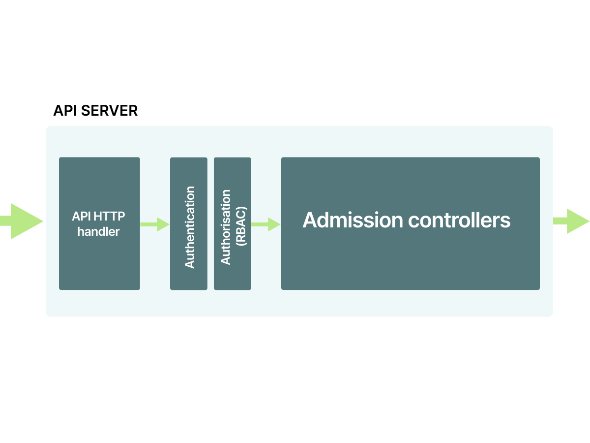
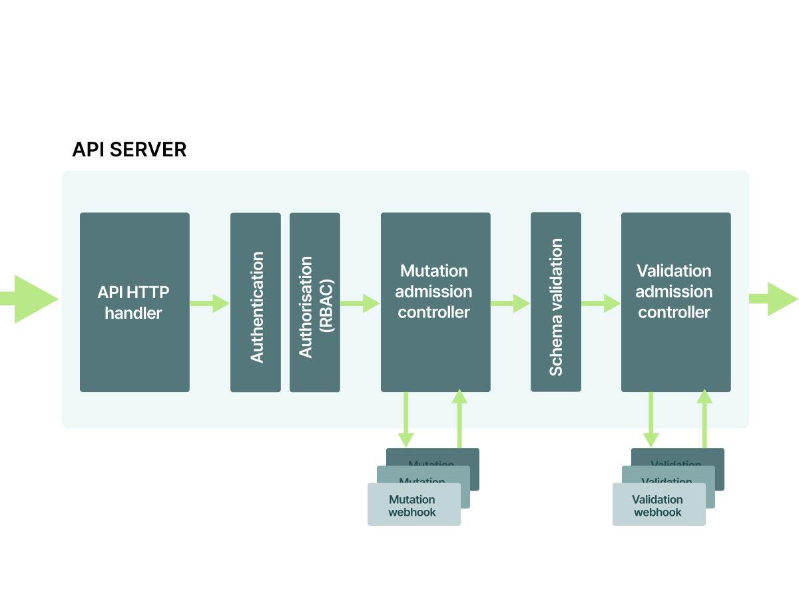
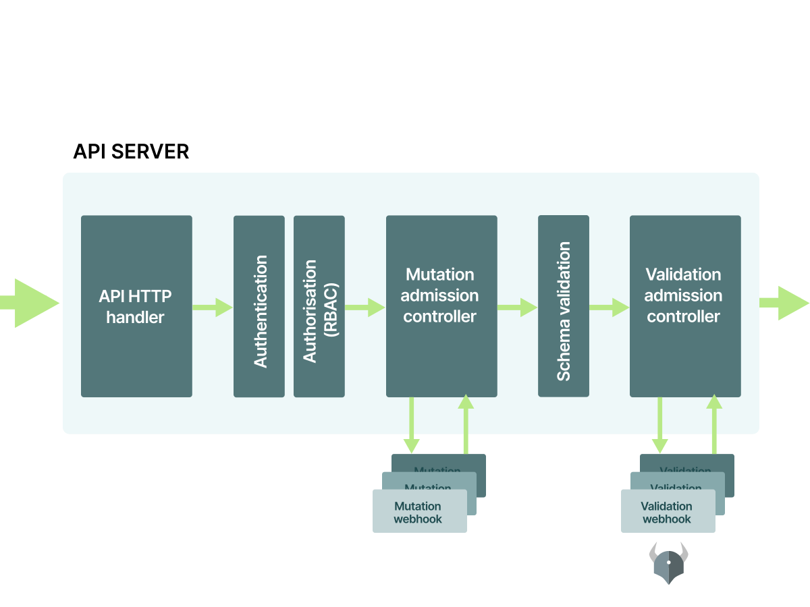

**TL;DR:** _In this article, you will learn about enforcing policies for your Kubernetes workloads using static tools such as [conftest](https://github.com/open-policy-agent/conftest) and in-cluster operators such as [Gatekeeper](https://github.com/open-policy-agent/gatekeeper)._

Policies in Kubernetes allow you to prevent specific workloads from being deployed in the cluster.

While compliance is usually the reason for enforcing strict policies in the cluster, there are several **recommended best practices that cluster admins should implement.**

Examples of such guidelines are:

1. Not running privileged pods.
1. Not running pods as the root user.
1. Not specifying resource limits.
1. Not using the latest tag for the container images.
1. Now allowing additional Linux capabilities by default.

Besides, you may want to enforce bespoke policies that all workloads may wish to abide by, such as:

- All workloads must have a "project" and "app" label.
- All workloads must use container images from a specific container registry (e.g. my-company.com).

Finally, there is a third category of checks that you would want to implement as policies to avoid disruption in your services.

_An example of such a check is ensuring that no two services can use the same ingress hostname._

In this article, you will learn about enforcing policies for your Kubernetes workloads using both out-of-cluster and in-cluster solutions.

These policies aim to reject workloads if they do not successfully satisfy the conditions defined.

**The out-of-cluster approaches** are accomplished by running static checks on the YAML manifests before they are submitted to the cluster.

[There are multiple tools available for achieving this.](https://learnk8s.io/validating-kubernetes-yaml)

**The in-cluster approaches** make use of validating admission controllers which are invoked as part of the API request and before the manifest is stored in the database.

> You may find this [git repository](http://github.com/amitsaha/kubernetes-policy-enforcement-demo) handy as you work through the article.

## A non-compliant Deployment

Let's consider the following YAML manifest:

```yaml|title=deployment.yaml
apiVersion: apps/v1
kind: Deployment
metadata:
  name: http-echo
  labels:
    app: http-echo
spec:
  replicas: 2
  selector:
    matchLabels:
      app: http-echo
  template:
    metadata:
      labels:
        app: http-echo
    spec:
      containers:
      - name: http-echo
        image: hashicorp/http-echo
        args: ["-text", "hello-world"]
        ports:
        - containerPort: 5678

      - name: http-echo-1
        image: hashicorp/http-echo:latest
        args: ["-text", "hello-world"]
        ports:
        - containerPort: 5678
```

The above Deployment will create a pod consisting of two containers from the same container image.

The first container doesn't specify any tag and the second container specifies the `latest` tag.

Effectively, both the containers will use the latest version of the image, `hashicorp/http-echo`.

**This is considered a bad practice and you want to prevent such a deployment from being created in your cluster.**

The best practice is to pin the container image to a tag such as `hashicorp/http-echo:0.2.3`.

**Let's see how you can detect the policy violation using a static check.**

Since you want to prevent the resource from reaching the cluster, the right place for running this check is:

- As a GIT pre-commit, before the resource is committed to GIT.
- As part of your CI/CD pipeline before the branch is merged into the main branch.
- As part of the CI/CD pipeline before the resource is submitted to the cluster.

## Enforcing policies using conftest

[Conftest](https://conftest.dev) is a binary and a testing framework for configuration data that can be used to check and verify Kubernetes manifests.

Tests are written using the purpose-built query language, [Rego](https://www.openpolicyagent.org/docs/latest/policy-language/).

You can install conftest following the [instructions](https://www.conftest.dev/install/) on the project website.

> At the time of writing, the latest release is 0.19.0.

Let's define two policies:

```prolog|title=check_image_tag.rego
package main

deny[msg] {
  input.kind == "Deployment"
  image := input.spec.template.spec.containers[_].image
  not count(split(image, ":")) == 2
  msg := sprintf("image '%v' doesn't specify a valid tag", [image])
}

deny[msg] {
  input.kind == "Deployment"
  image := input.spec.template.spec.containers[_].image
  endswith(image, "latest")
  msg := sprintf("image '%v' uses latest tag", [image])
}
```

_Can you guess what the two policies are checking?_

Both checks are applied only to Deployments and are designed to extract the image name from the `spec.container` section.

The former rule checks that there's a tag defined on the image.

```prolog|highlight=6|title=check_image_tag.rego
package main

deny[msg] {
  input.kind == "Deployment"
  image := input.spec.template.spec.containers[_].image
  not count(split(image, ":")) == 2
  msg := sprintf("image '%v' doesn't specify a valid tag", [image])
}

deny[msg] {
  input.kind == "Deployment"
  image := input.spec.template.spec.containers[_].image
  endswith(image, "latest")
  msg := sprintf("image '%v' uses latest tag", [image])
}
```

The latter checks that, if a tag is defined, it is not the latest tag.

```prolog|highlight=13|title=check_image_tag.rego
package main

deny[msg] {
  input.kind == "Deployment"
  image := input.spec.template.spec.containers[_].image
  not count(split(image, ":")) == 2
  msg := sprintf("image '%v' doesn't specify a valid tag", [image])
}

deny[msg] {
  input.kind == "Deployment"
  image := input.spec.template.spec.containers[_].image
  endswith(image, "latest")
  msg := sprintf("image '%v' uses latest tag", [image])
}
```

The two `deny` blocks evaluate to a violation when true.

Notice that, when you have more than one `deny` block, conftest checks them independently, and the overall result is a violation of any of the blocks results in a breach.

Now, save the file as `check_image_tag.rego` and run conftest against the `deployment.yaml` manifest:

```terminal|command=1|title=bash
conftest test -p conftest-checks test-data/deployment.yaml
FAIL - test-data/deployment.yaml - image 'hashicorp/http-echo' doesn't specify a valid tag
FAIL - test-data/deployment.yaml - image 'hashicorp/http-echo:latest' uses latest tag

2 tests, 0 passed, 0 warnings, 2 failures
```

**Great, it detected both violations.**

Since `conftest` is a static binary, you could have it running your checks before you submit the YAML to the cluster.

If you already use a CI/CD pipeline to apply changes to your cluster, you could have an extra step that validates all resources against your conftest policies.

_But does it really prevent someone from submitting a Deployment with the `latest` tag?_

**Of course, anyone with sufficient rights can still create the workload in your cluster and skip the CI/CD pipeline.**

If you can run `kubectl apply -f deployment.yaml` successfully, you can ignore `conftest`, and your cluster will run images with the `latest` tag.

_How can you prevent someone from working around your policies?_

You could supplement the static check with dynamic policies deployed inside your cluster.

_What if you could reject a resource after it is submitted to the cluster?_

## The Kubernetes API

Let's recap what happens when you create a Pod like this in the cluster:

```yaml|title=pod.yaml
apiVersion: v1
kind: Pod
metadata:
  name: my-pod
spec:
  containers:
  - name: sise
    image: learnk8s/app:1.0.0
    ports:
    - containerPort: 8080
```

You could deploy the Pod to the cluster with:

```terminal|command=1|title=bash
kubectl apply -f pod.yaml
```

The YAML definition is sent to the API server and:

1. The YAML definition is stored in etcd.
1. The scheduler assigns the Pod to a node.
1. The kubelet retrieves the Pod spec and creates it.

At least that's the high-level plan.

```slideshow
{
  "description": "Here's what happens when you type `kubectl apply -f`",
  "slides": [
    {
      "image": "assets/control-plane-1.svg",
      "description": "You use `kubectl apply -f deployment.yaml` to send a request to the control plane to deploy three replicas."
    },
    {
      "image": "assets/control-plane-2.svg",
      "description": "The API receives the request and the JSON payload — `kubectl` converted the YAML resource into JSON."
    },
    {
      "image": "assets/control-plane-3.svg",
      "description": "The API server persists the object definition into the database."
    },
    {
      "image": "assets/control-plane-4.svg",
      "description": "The YAML definition is stored in etcd."
    }
  ]
}
```

_But what's going on under the hood — is it that simple?_

_What happens when there's a typo in the YAML?_

_Who stops you from submitting broken resources to the etcd?_

When you type `kubectl apply` a few things happen.

The kubectl binary:

1. Validates the resource client-side _(is there any obvious error?)_.
1. Converts the YAML payload into JSON.
1. Reads the configs from your `KUBECONFIG`.
1. Sends a request with the payload to the `kube-apiserver`.

When the `kube-apiserver` receives the request, it doesn't store it in etcd immediately.

First, it has to verify that the requester is legitimate.

In other words, [it has to authenticate the request.](https://kubernetes.io/docs/reference/access-authn-authz/authentication/)

_Once you are authenticated, do you have the permission to create resources?_

**Identity and permission are not the same thing.**

Just because you have access to the cluster doesn't mean you can create or read all the resources.

The authorisation is commonly done with [Role-Based Access Control (RBAC)](https://kubernetes.io/docs/reference/access-authn-authz/rbac/).

With Role-Based Access Control (RBAC), you can assign granular permissions and restrict what a user or app can do.

At this point, you are authenticated and authorised by the kube-apiserver.

```slideshow
{
  "description": "The Kubernetes API server - authn and authz",
  "slides": [
    {
      "image": "assets/api-server-1.svg",
      "description": "Until now, the API server has pictured as a single block in the control plane. However, there's more to it."
    },
    {
      "image": "assets/api-server-2.svg",
      "description": "The API is made of several smaller components. The first is the HTTP handler which receives and processes the HTTP requests."
    },
    {
      "image": "assets/api-server-3.svg",
      "description": "Next the API verifies the caller. _Are you a user of the cluster?_"
    },
    {
      "image": "assets/api-server-4.svg",
      "description": "Even if you authorised, it doesn't guarantee that you have access to all resources. Perhaps you can create Pods, but not Secrets. In this phase, your user account is checked against the RBAC rules."
    }
  ]
}
```

_Can you finally store the Pod definition in the etcd?_

**Not so fast.**

The `kube-apiserver` is designed as a pipeline.

The request goes through a series of components before it's stored in the database.

While authorisation and authentication are the first two components, they are not the only ones.

Before the object reaches the database, it is intercepted by [the Admission controllers.](https://kubernetes.io/docs/reference/access-authn-authz/admission-controllers/)



At this stage, there's the opportunity to execute further checks on the current resource.

And Kubernetes has plenty of Admission controllers enabled by default.

> You can check all the Admission controllers that are enabled in minikube with `kubectl -n kube-system describe pod kube-apiserver-minikube`. The output should contain the flag `--enable-admission-plugins` and a list of admission controllers.

As an example, let's have a look at the `NamespaceLifecycle` admission controller.

## Validating admission controllers

The `NamespaceLifecycle` admission controller prevents you from creating Pods in namespaces that don't exist yet.

You can define a Pod with a namespace as follows:

```yaml|highlight=5|title=pod-namespaced.yaml
apiVersion: v1
kind: Pod
metadata:
  name: my-pod
  namespace: does-not-exist
spec:
  containers:
  - name: sise
    image: learnk8s/app:1.0.0
    ports:
    - containerPort: 8080
```

The YAML definition is valid, so kubectl validation checks pass and the request is submitted to the cluster:

```terminal|command=1|title=bash
kubectl apply -f pod-namespaced.yaml
```

Assuming that you are authenticated and authorised, the request reaches the `NamespaceLifecycle` admission controller
and is inspected.

The namespace `does-not-exist` doesn't exist and is finally rejected.

Also, the `NamespaceLifecycle` admission controller stops requests that could delete the `default`, `kube-system` and `kube-public` namespaces.

Controllers that check actions and resources are grouped under the **Validating** category.

There's another category of controllers, and that's called **Mutating**.

## Mutating admission controllers

As you can guess from the name, mutating controllers can inspect the request and change it.

The `DefaultStorageClass` admission controller is an example of a mutating controller.

Let's assume that you want to create a Persistent Volume Claim (PVC) like this:

```yaml|title=pvc.yaml
apiVersion: v1
kind: PersistentVolumeClaim
metadata:
  name: my-pvc
spec:
  accessModes:
    - ReadWriteOnce
  resources:
    requests:
      storage: 3Gi
```

You can create the Persistent Volume Claim (PVC) with:

```terminal|command=1|title=bash
kubectl apply -f pvc.yaml
```

If you inspect the list of Persistent Volume Claims with `kubectl get pvc`, you might notice that the volume is _Bound_ and has a "standard" storage class.

```terminal|title=bash
NAME     STATUS   VOLUME         CAPACITY   ACCESS MODES   STORAGECLASS   AGE
my-pvc   Bound    pvc-059f2da2   3Gi        RWO            standard       3s
```

However, you didn't specify any "standard" StorageClass in the YAML.

_Did you?_

You can inspect the YAML definition for the Persistent Volume Claim with:

```terminal|command=1|title=bash
kubectl get pvc my-pvc -0 yaml
```

If you pay attention to the definition, you might notice that there are some extra fields injected:

```yaml|highlight=11|title=pvc-retrieved.yaml
apiVersion: v1
kind: PersistentVolumeClaim
metadata:
  name: my-pvc
spec:
  accessModes:
  - ReadWriteOnce
  resources:
    requests:
      storage: 3Gi
  storageClassName: standard
  volumeMode: Filesystem
  volumeName: pvc-059f2da2-a216-42b7-875e-e7da327605dd
```

The name "standard" isn't hardcoded in the API.

Instead, the default StorageClass's name is injected in `spec.storageClassName`.

You can retrieve the _default_ StorageClass's name from the cluster with:

```terminal|command=1|title=bash
kubectl get storageclass
NAME                 PROVISIONER                RECLAIMPOLICY   VOLUMEBINDINGMODE   AGE
standard (default)   k8s.io/minikube-hostpath   Delete          Immediate           8m
```

If the name of the _default_ StorageClass were "aws-ebs", the `DefaultStorageClass` admission controller would have injected it instead of "standard".

Kubernetes has several mutating and validating admission controllers.

You can [find the full list on the official documentation](https://kubernetes.io/docs/reference/access-authn-authz/admission-controllers/).

Once the request passes through the admission controllers, it is finally stored in etcd.

```slideshow
{
  "description": "Mutating and validating admission controllers in the Kubernetes API",
  "slides": [
    {
      "image": "assets/api-server-5.svg",
      "description": "Mutating and Validating Admission controllers are another component in the Kubernetes API."
    },
    {
      "image": "assets/api-server-6.svg",
      "description": "If you pay close attention, you will learn that the Mutating Admission Controllers are the first controllers to be invoked."
    },
    {
      "image": "assets/api-server-7.svg",
      "description": "When the resource is mutated, is then passed to the schema validation phase. Here the API checks that resource is still valid _(does the Pod look like a Pod? any field missing?)_"
    },
    {
      "image": "assets/api-server-8.svg",
      "description": "In the last step you can find the Validating Admission Controllers. Those are the last component before the resource is stored in etcd."
    }
  ]
}
```

_But what if you want to have a custom check or mutate the resources according to your rules?_

**Admission controllers are designed to promote extensibility.**

You can use the default Admission controllers that come with Kubernetes, or you can plug in your own.

_How do you do that?_

Two Admission controllers are programmable:

- the `MutationAdmissionWebhook`, and
- the `ValidationAdmissionWebhook`

Those admission controllers don't do anything themselves.

You can register a component to the Mutation or Validation webhook, and those controllers will call it when the request passes through the Admission phase.



So you could write a component that checks if the current Pod uses a container image that comes from a private registry.

You could register it as part of the `ValidationAdmissionWebhook` and pass or reject requests based on the container image.

And that's precisely what Gatekeeper does — it registers as a component in the cluster and validates requests.

## Enforcing policies using Gatekeeper

[Gatekeeper](https://github.com/open-policy-agent/gatekeeper) allows a Kubernetes administrator to implement policies for ensuring compliance and best practices in their cluster.

Gatekeeper registers itself as a controller with the validation webhook in the Kubernetes API.



**Any resource submitted to the cluster is intercepted and inspected against the list of active policies.**

Also, Gatekeeper embraces Kubernetes native concepts such as Custom Resource Definitions (CRDs) and hence the policies are managed as Kubernetes resources.

> The [Google Cloud docs](https://cloud.google.com/anthos-config-management/docs/concepts/policy-controller) on this topic are an excellent place to learn more.

Internally, Gatekeeper makes use of the Open Policy Agent (OPA) to implement the core policy engine, and the policies are written in the Rego language — the same language used by `conftest`.

_In the next part, you will try out Gatekeeper._

You will need access to a Kubernetes cluster with admin-level privileges such as the one you can set up using `minikube`.

> If you're on Windows, you can [follow our handy guide on how to install minikube and Docker](https://learnk8s.io/blog/installing-docker-and-kubernetes-on-windows/).

Once you have `kubectl` configured to communicate to the cluster, run the following to set up gatekeeper:

```terminal|command=1|title=bash
kubectl apply -f https://raw.githubusercontent.com/open-policy-agent/gatekeeper/master/deploy/gatekeeper.yaml
```

To verify whether gatekeeper is set up correctly, run:

```terminal|command=1|title=bash
kubectl -n gatekeeper-system describe svc gatekeeper-webhook-service
Name:              gatekeeper-webhook-service
Namespace:         gatekeeper-system
Labels:            gatekeeper.sh/system=yes
Annotations:       ...
Type:              ClusterIP
IP:                10.102.199.165
Port:              <unset>  443/TCP
TargetPort:        8443/TCP
Endpoints:         172.18.0.4:8443
# more output ...
```

This is the service that is invoked by the Kubernetes API as part of the request processing in the "Validating Admission" stage.

All your Pods, Deployments, Services, etc. are now intercepted and scrutinised by Gatekeeper.

## Defining reusable policies using a ConstraintTemplate

In Gatekeeper, you need first to create a policy using a `ConstraintTemplate` custom resource.

_Let's have a look at an example._

The following `ConstraintTemplate` definition rejects any deployment that uses the latest tag:

```yaml|title=check_image_tag.yaml
apiVersion: templates.gatekeeper.sh/v1beta1
kind: ConstraintTemplate
metadata:
  name: k8simagetagvalid
spec:
  crd:
    spec:
      names:
        kind: K8sImageTagValid
  targets:
    - target: admission.k8s.gatekeeper.sh
      rego: |
        package k8simagetagvalid

        violation[{"msg": msg, "details":{}}] {
          image := input.review.object.spec.template.spec.containers[_].image
          not count(split(image, ":")) == 2
          msg := sprintf("image '%v' doesn't specify a valid tag", [image])
        }

        violation[{"msg": msg, "details":{}}] {
          image := input.review.object.spec.template.spec.containers[_].image
          endswith(image, "latest")
          msg := sprintf("image '%v' uses latest tag", [image])
        }
```

The policy is similar to the previous one that you used with `conftest`.

_Have a look:_

```prolog|highlight=13|title=check_image_tag.rego
package main

deny[msg] {
  input.kind == "Deployment"
  image := input.spec.template.spec.containers[_].image
  not count(split(image, ":")) == 2
  msg := sprintf("image '%v' doesn't specify a valid tag", [image])
}

deny[msg] {
  input.kind == "Deployment"
  image := input.spec.template.spec.containers[_].image
  endswith(image, "latest")
  msg := sprintf("image '%v' uses latest tag", [image])
}
```

**But there are some subtle and important differences.**

The input object is available as `input.review.object` instead of `input`, and there is no need to assert the input object kind here.

```yaml|highlight=16,22|title=check_image_tag.yaml
apiVersion: templates.gatekeeper.sh/v1beta1
kind: ConstraintTemplate
metadata:
  name: k8simagetagvalid
spec:
  crd:
    spec:
      names:
        kind: K8sImageTagValid
  targets:
    - target: admission.k8s.gatekeeper.sh
      rego: |
        package k8simagetagvalid

        violation[{"msg": msg, "details":{}}] {
          image := input.review.object.spec.template.spec.containers[_].image
          not count(split(image, ":")) == 2
          msg := sprintf("image '%v' doesn't specify a valid tag", [image])
        }

        violation[{"msg": msg, "details":{}}] {
          image := input.review.object.spec.template.spec.containers[_].image
          endswith(image, "latest")
          msg := sprintf("image '%v' uses latest tag", [image])
        }
```

**The deny rule is renamed to violation.**

In `conftest`, the rule signature was `Deny[msg] {...}` whereas in Gatekeeper it is `violation[{"msg": msg}] {...}`.

```yaml|highlight=15,21|title=check_image_tag.yaml
apiVersion: templates.gatekeeper.sh/v1beta1
kind: ConstraintTemplate
metadata:
  name: k8simagetagvalid
spec:
  crd:
    spec:
      names:
        kind: K8sImageTagValid
  targets:
    - target: admission.k8s.gatekeeper.sh
      rego: |
        package k8simagetagvalid

        violation[{"msg": msg, "details":{}}] {
          image := input.review.object.spec.template.spec.containers[_].image
          not count(split(image, ":")) == 2
          msg := sprintf("image '%v' doesn't specify a valid tag", [image])
        }

        violation[{"msg": msg, "details":{}}] {
          image := input.review.object.spec.template.spec.containers[_].image
          endswith(image, "latest")
          msg := sprintf("image '%v' uses latest tag", [image])
        }
```

The violation rule block has a specific signature — an object with two properties.

The first is the `msg` property which a string.

The latter is the object `details` which holds arbitrary properties, and you can decorate with any value.

In this case, it is an empty object.

Both are used as return values:

```yaml|highlight=15,21|title=check_image_tag.yaml
apiVersion: templates.gatekeeper.sh/v1beta1
kind: ConstraintTemplate
metadata:
  name: k8simagetagvalid
spec:
  crd:
    spec:
      names:
        kind: K8sImageTagValid
  targets:
    - target: admission.k8s.gatekeeper.sh
      rego: |
        package k8simagetagvalid

        violation[{"msg": msg, "details":{}}] {
          image := input.review.object.spec.template.spec.containers[_].image
          not count(split(image, ":")) == 2
          msg := sprintf("image '%v' doesn't specify a valid tag", [image])
        }

        violation[{"msg": msg, "details":{}}] {
          image := input.review.object.spec.template.spec.containers[_].image
          endswith(image, "latest")
          msg := sprintf("image '%v' uses latest tag", [image])
        }
```

Now, create the `ConstraintTemplate`:

```terminal|command=1|title=bash
kubectl apply -f templates/check_image_tag.yaml
constrainttemplate.templates.gatekeeper.sh/k8simagetagvalid created
```

You can run `kubectl describe` to query the template from the cluster:

```terminal|command=1|title=bash
kubectl describe constrainttemplate.templates.gatekeeper.sh/k8simagetagvalid
Name:         k8simagetagvalid
Namespace:
Labels:       <none>
Annotations:  kubectl.kubernetes.io/last-applied-configuration:
                {"apiVersion":"templates.gatekeeper.sh/v1beta1","kind":"ConstraintTemplate","metadata":
                {"annotations":{},"name":"k8simagetagvalid"},"spec"...
API Version:  templates.gatekeeper.sh/v1beta1
Kind:         ConstraintTemplate
# more output ...
```

A `ConstraintTemplate` isn't something you can use to validate deployments, though.

It's just a definition of a policy that can only be enforced by creating a `Constraint`.

## Creating a constraint

A `Constraint` is a way to say _"I want to apply this policy to the cluster"_.

You can think about `ConstraintTemplates` as a book of recipes.

You have hundreds of recipes for baking cakes and cookies, but you can't eat them.

You need to choose the recipe and mix the ingredients to bake your cake.

**Constraints are a particular instance of a recipe** — the `ConstraintTemplate`.

Let's have a look at an example.

The following `Constraint` uses the previously defined ConstraintTemplate (recipe) `K8sImageTagValid`:

```yaml|highlight=2|title=check_image_tag_constraint.yaml
apiVersion: constraints.gatekeeper.sh/v1beta1
kind: K8sImageTagValid
metadata:
  name: valid-image-tag
spec:
  match:
    kinds:
      - apiGroups: ["apps"]
        kinds: ["Deployment"]
```

Notice how the `Constraint` references the `ConstraintTemplate` as well as what kind of resources it should be applied to.

The `spec.match` object defines the workloads against which the constraint will be enforced.

Here, you specify that it will be enforced against the `apps` API group and of kind `Deployment`.

Since these fields are arrays, you can specify multiple values and extend the checks to StatefulSets, DaemonSets, etc.

Save the above content into a new file and name it `check_image_tag_constraint.yaml`.

Run `kubectl apply` to create the constraint:

```terminal|command=1|title=bash
kubectl apply -f check_image_tag_constraint.yaml
k8simagetagvalid.constraints.gatekeeper.sh/valid-image-tag created
```

Use `kubectl describe` to ensure that the constraint was created:

```terminal|command=1|title=bash
kubectl describe k8simagetagvalid.constraints.gatekeeper.sh/valid-image-tag
Name:         valid-image-tag
Namespace:
Labels:       <none>
Annotations:  kubectl.kubernetes.io/last-applied-configuration:
                {"apiVersion":"constraints.gatekeeper.sh/v1beta1","kind":"K8sImageTagValid","metadata":
                 {"annotations":{},"name":"valid-image-tag"},"spec":...
API Version:  constraints.gatekeeper.sh/v1beta1
Kind:         K8sImageTagValid
Metadata:
  Creation Timestamp:  2020-07-01T07:57:23Z
# more output...
```

## Testing the policy

Now, let's test the Deployment with the two containers images:

```terminal|command=1|title=bash
kubectl apply -f deployment.yaml
Error from server ([denied by valid-image-tag] image 'hashicorp/http-echo' doesn't specify a valid tag
[denied by valid-image-tag] image 'hashicorp/http-echo:latest' uses latest tag): error when creating
"test-data/deployment.yaml": admission webhook "validation.gatekeeper.sh" denied the request:
[denied by valid-image-tag] image 'hashicorp/http-echo' doesn't specify a valid tag
[denied by valid-image-tag] image 'hashicorp/http-echo:latest' uses latest tag
```

**The deployment is rejected by the Gatekeeper policy.**

Notice how the check is built-in in the Kubernetes API.

**You can't skip the check or work around it.**

Implementing Gatekeeper policies in a cluster with existing workloads can be challenging since you don't want to
disrupt critical workloads from being deployed due to non-compliance.

Hence, Gatekeeper allows setting up constraints in a dry-run mode by specifying `enforcementAction: dryrun` in the spec:

```yaml|highlight=6|title=check_image_tag_constraint.yaml
apiVersion: constraints.gatekeeper.sh/v1beta1
kind: K8sImageTagValid
metadata:
  name: valid-image-tag
spec:
  enforcementAction: dryrun
  match:
    kinds:
      - apiGroups: ["apps"]
        kinds: ["Deployment"]
```

In this mode, the policy doesn't prevent any workloads from being deployed but it logs any violations.

The violations will be logged in the `Violations` field of the `kubectl describe` command:

```terminal|command=1|title=bash
kubectl describe k8simagetagvalid.constraints.gatekeeper.sh/valid-image-tag
Name:         valid-image-tag
Namespace:
Labels:       <none>
Annotations:  kubectl.kubernetes.io/last-applied-configuration:
....

  Total Violations:  2
  Violations:
    Enforcement Action:  dryrun
    Kind:                Deployment
    Message:             image 'hashicorp/http-echo' doesn't specify a valid tag
    Name:                http-echo
    Namespace:           default
    Enforcement Action:  dryrun
    Kind:                Deployment
    Message:             image 'hashicorp/http-echo:latest' uses latest tag
    Name:                http-echo
    Namespace:           default
Events:                  <none>
```

Once you know that all your manifests are compliant, you can remove the dry-run mode and actively prevent violations.

Let's have a look at another example.

_Can you write a policy that forces the Deployment to have two labels: `project` for the current project name and `app` for the application name?_

## A Policy to enforce consistent labels

First, you should enforce the policy as a check for `conftest`:

```prolog|title=check_labels.rego
package main

deny[msg] {
  input.kind == "Deployment"

  required := {"app", "project"}
  provided := {label | input.metadata.labels[label]}
  missing := required - provided

  count(missing) > 0
  msg = sprintf("you must provide labels: %v", [missing])
}
```

Let's have a look at the policy in detail:

`required` is a set with two members - `app` and `project`.

Those labels should be presented on all Deployments.

```prolog|highlight=6|title=check_labels.rego
package main

deny[msg] {
  input.kind == "Deployment"

  required := {"app", "project"}
  provided := {label | input.metadata.labels[label]}
  missing := required - provided

  count(missing) > 0
  msg = sprintf("you must provide labels: %v", [missing])
}
```

`provided` retrieves the set of labels specified in the input.

```prolog|highlight=7|title=check_labels.rego
package main

deny[msg] {
  input.kind == "Deployment"

  required := {"app", "project"}
  provided := {label | input.metadata.labels[label]}
  missing := required - provided

  count(missing) > 0
  msg = sprintf("you must provide labels: %v", [missing])
}
```

Then, a set difference operation is performed and a new set that contains the labels which are present in `required`, but not found in `provided` is created.

```prolog|highlight=8|title=check_labels.rego
package main

deny[msg] {
  input.kind == "Deployment"

  required := {"app", "project"}
  provided := {label | input.metadata.labels[label]}
  missing := required - provided

  count(missing) > 0
  msg = sprintf("you must provide labels: %v", [missing])
}
```

If the number of elements in this set is greater than 0, the rule is violated.

This is achieved using the `count()` function to check the number of elements in the `missing` set.

Run conftest specifying this policy and you will see a failure:

```terminal|command=1|title=bash
conftest test -p conftest-checks/check_labels.rego test-data/deployment.yaml
FAIL - test-data/deployment.yaml - you must provide labels: {"project"}
1 test, 0 passed, 0 warnings, 1 failure
```

You can fix the issue by adding the project and app label, like this:

```yaml|highlight=6-7|title=deployment.yaml
apiVersion: apps/v1
kind: Deployment
metadata:
  name: http-echo
  labels:
    app: http-echo
    project: test
spec:
  replicas: 2
  selector:
    matchLabels:
      app: http-echo
  template:
    metadata:
      labels:
        app: http-echo
    spec:
      containers:
      - name: http-echo
        image: hashicorp/http-echo
        args: ["-text", "hello-world"]
        ports:
        - containerPort: 5678

      - name: http-echo-1
        image: hashicorp/http-echo:latest
        args: ["-text", "hello-world"]
        ports:
        - containerPort: 5678
```

_What happens when someone deploys the resource directly to the cluster?_

They could work around the policy.

So let's add the same policy in Gatekeeper.

First, you will have to create a `ConstraintTemplate`:

```yaml|title=check_labels.yaml
apiVersion: templates.gatekeeper.sh/v1beta1
kind: ConstraintTemplate
metadata:
  name: k8srequiredlabels
spec:
  crd:
    spec:
      names:
        kind: K8sRequiredLabels
      validation:
        # Schema for the `parameters` field
        openAPIV3Schema:
          properties:
            labels:
              type: array
              items: string
  targets:
    - target: admission.k8s.gatekeeper.sh
      rego: |
        package k8srequiredlabels

        violation[{"msg": msg, "details": {"missing_labels": missing}}] {
          provided := {label | input.review.object.metadata.labels[label]}
          required := {label | label := input.parameters.labels[_]}
          missing := required - provided
          count(missing) > 0
          msg := sprintf("you must provide labels: %v", [missing])
        }
```

The above manifest illustrates how you can specify input parameters to the constraint template to configure its behaviour at runtime.

Going back to our `ConstraintTemplate` as a recipe analogy, input parameters are a way that the recipe allows you to customize certain ingredients.

_However, these ingredients must obey specific rules._

For example, you want only to allow an array of strings as input to the `ConstraintTemplate`.

You can describe the input using an OpenAPIV3 schema in the `validation` object in the `ConstraintTemplate`:

```yaml|highlight=10-16|title=check_labels.yaml
apiVersion: templates.gatekeeper.sh/v1beta1
kind: ConstraintTemplate
metadata:
  name: k8srequiredlabels
spec:
  crd:
    spec:
      names:
        kind: K8sRequiredLabels
      validation:
        # Schema for the `parameters` field
        openAPIV3Schema:
          properties:
            labels:
              type: array
              items: string
  targets:
    - target: admission.k8s.gatekeeper.sh
      rego: |
        package k8srequiredlabels

        violation[{"msg": msg, "details": {"missing_labels": missing}}] {
          provided := {label | input.review.object.metadata.labels[label]}
          required := {label | label := input.parameters.labels[_]}
          missing := required - provided
          count(missing) > 0
          msg := sprintf("you must provide labels: %v", [missing])
        }
```

This schema defines that the constraint template expects only to have one parameter, `labels` which is an array of strings.

All input provided is made available to the constraint via the `input.parameters` attribute.

Save the above manifest into a file `check_labels.yaml` and then run `kubectl apply` to create the constraint template:

```terminal|command=1|title=bash
kubectl apply -f check_labels.yaml
constrainttemplate.templates.gatekeeper.sh/k8srequiredlabels created
```

To use the policy from the `ConstraintTemplate`, you need a Constraint.

Create a new file, `check_labels_constraints.yaml` with the following content:

```yaml|title=check_labels_constraints.yaml
apiVersion: constraints.gatekeeper.sh/v1beta1
kind: K8sRequiredLabels
metadata:
  name: deployment-must-have-labels
spec:
  match:
    kinds:
      - apiGroups: ["apps"]
        kinds: ["Deployment"]
  parameters:
    labels: ["app", "project"]
```

Run `kubectl apply` to create the constraint:

```terminal|command=1|title=bash
kubectl apply -f check_labels_constraints.yaml
k8srequiredlabels.constraints.gatekeeper.sh/deployment-must-have-labels created
```

At this stage, you have two constraints created in your cluster:

1. The first constraint checks that your deployment is using an image with a valid tag.
1. The second constraint checks that your deployment defines two labels, `app`, and `project`.

Now, try creating the deployment described at the beginning of the article:

```terminal|command=1|title=bash
kubectl apply -f deployment.yaml
Error from server ([denied by deployment-must-have-labels] you must provide labels: {"project"}
[denied by valid-image-tag] image 'hashicorp/http-echo' doesn't specify a valid tag
[denied by valid-image-tag] image 'hashicorp/http-echo:latest' uses latest tag): error when creating
"deployment.yaml": admission webhook "validation.gatekeeper.sh" denied the request:
[denied by deployment-must-have-labels] you must provide labels: {"project"}
[denied by valid-image-tag] image 'hashicorp/http-echo' doesn't specify a valid tag
[denied by valid-image-tag] image 'hashicorp/http-echo:latest' uses latest tag
```

The deployment is not created successfully since it doesn't have the required project label as well as not using a valid image tag.

**Job done!**

A valid deployment manifest that will be successfully deployed will have two labels (app and project) as well as use tagged images:

```yaml|highlight=6-7,20,26|title=deployment.yaml
apiVersion: apps/v1
kind: Deployment
metadata:
  name: http-echo
  labels:
    app: http-echo
    project: test
spec:
  replicas: 2
  selector:
    matchLabels:
      app: http-echo
  template:
    metadata:
      labels:
        app: http-echo
    spec:
      containers:
      - name: http-echo
        image: hashicorp/http-echo:0.2.3
        args: ["-text", "hello-world"]
        ports:
        - containerPort: 5678

      - name: http-echo-1
        image: hashicorp/http-echo:0.2.1
        args: ["-text", "hello-world"]
        ports:
        - containerPort: 5678
```

You validated your Deployment with a static and dynamic check.

**You can fail fast with the early static check and you can be sure that no one works around the policy by submitting resources directly to the cluster.**

## Summary

Both conftest and Gatekeeper uses the Rego language to define policies which makes these two tools an attractive solution to implement out-of-cluster and in-cluster checks, respectively.

However, as you saw above, **there were a few changes needed to make to the conftest Rego policy work with Gatekeeper.**

The [konstraint](https://github.com/plexsystems/konstraint) project aims to help in this regard.

The premise of konstraint is that your source of truth is a policy that you would write in Rego for `conftest` and then generate the `ConstraintTemplate` and `Constraint` resources for Gatekeeper.

**Konstraint automates the manual steps involved in converting a policy written for conftest to one that works in Gatekeeper.**

Besides, testing Gatekeeper constraint templates and constraints are also made more straightforward using konstraint.

_Neither conftest nor gatekeeper are the only solutions when it comes to enforcing out-of-cluster and in-cluster policies respectively._

What makes the two solutions compelling is that you can use Rego to implement policies for both tools.

You could even go as far as implementing a subset of relevant policies both inside and outside the cluster.

A comparative solution which achieves the same level of policy enforcement is [polaris](https://github.com/FairwindsOps/polaris) which has both an out-of-cluster and an in-cluster policy enforcement functionality.

However, it uses a custom JSON schema-based policy specification language and hence may not be as expressive as Rego.
