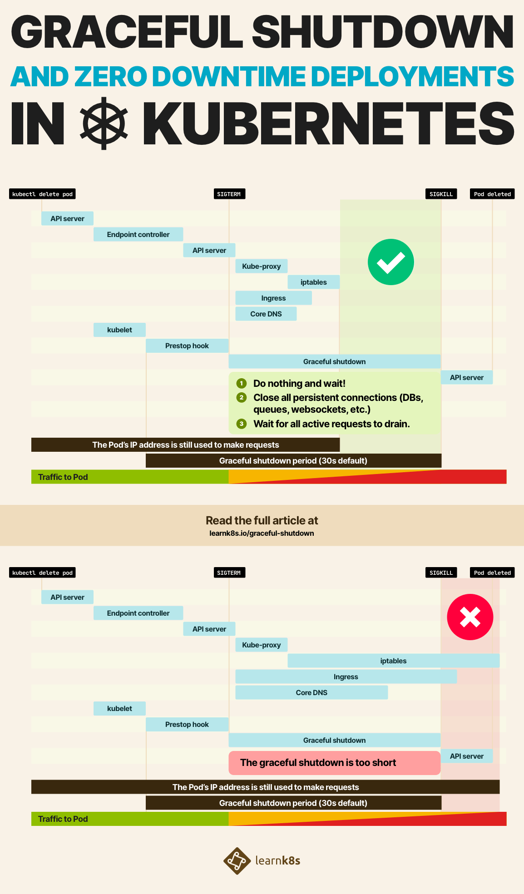
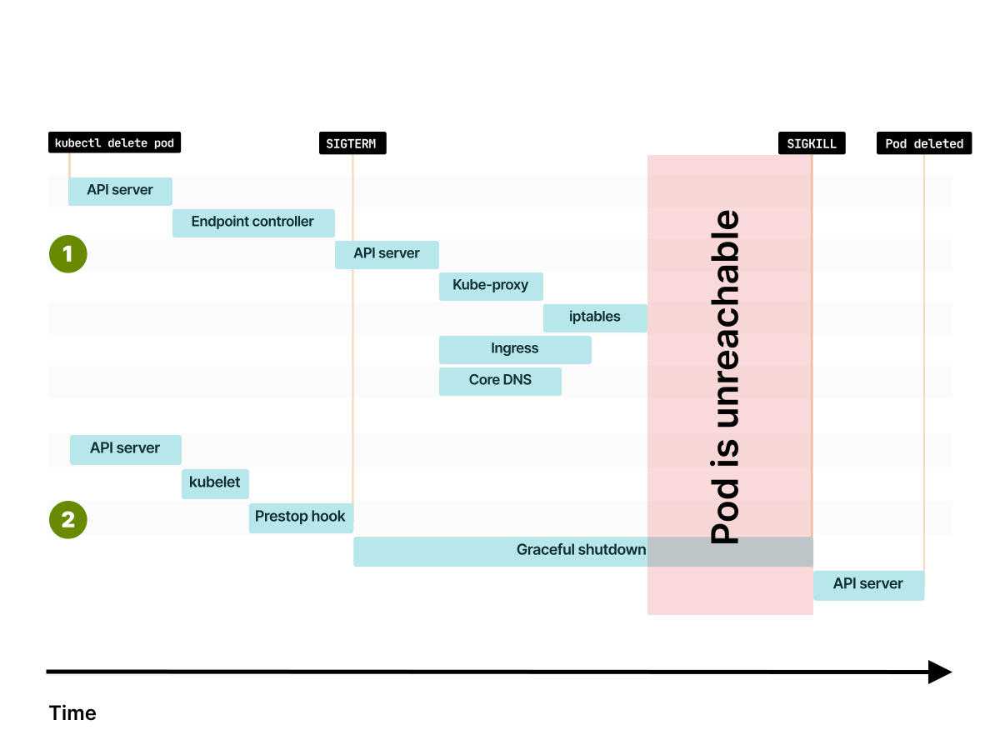

**TL;DR:** _In this article, you will learn how to prevent broken connections when a Pod starts up or shuts down. You will also learn how to shut down long-running tasks gracefully._



> You can [download this handy diagram as a PDF here](graceful-shutdown.pdf).

In Kubernetes, creating and deleting Pods is one of the most common operations.

Pods are created when you execute a rolling update, scale deployments, for every new release, for every job and cron job, etc.

But Pods are also deleted and recreated after evictions or after a failed Liveness probe.

_If the nature of those Pods is so ephemeral, what happens when a Pod is in the middle of responding to a request but it's told to shut down?_

_Is the request completed before shutdown?_

_What about subsequent requests, are those redirected somewhere else?_

Before discussing what happens when a Pod is deleted, it's necessary to talk to about what happens when a Pod is created.

Let's assume you want to create the following Pod in your cluster:

```yaml|title=pod.yaml
apiVersion: v1
kind: Pod
metadata:
  name: my-pod
spec:
  containers:
    - name: web
      image: nginx
      ports:
        - name: web
          containerPort: 80
```

You can submit the YAML definition to the cluster with:

```terminal|command=1|title=bash
kubectl apply -f pod.yaml
```

As soon as you enter the command, kubectl submits the Pod definition to the Kubernetes API.

This is where the journey begins.

## Creating the Pod state

The Pod definition is received and inspected by the API and subsequently stored in the database — etcd.

The Pod is also added to [the Scheduler's queue.](https://kubernetes.io/docs/concepts/scheduling-eviction/scheduling-framework/#scheduling-cycle-binding-cycle)

The Scheduler:

1. inspects the definition
1. collects details about the workload such as CPU and memory requests and then
1. decides which Node is best suited to run it [(through a process called Filters and Predicates).](https://kubernetes.io/docs/concepts/scheduling-eviction/scheduling-framework/#extension-points)

At the end of the process:

- The Pod is marked as _Scheduled_ in etcd.
- The Pod has a Node assigned to it.
- The state of the Pod is stored in etcd.

**But the Pod still does not exist.**

```slideshow
{
  "description": "Creating Pods",
  "slides": [
    {
      "image": "assets/creating-a-pod-1.svg",
      "description": "When you submit a Pod with `kubectl apply -f` the YAML is sent to the Kubernetes API."
    },
    {
      "image": "assets/creating-a-pod-2.svg",
      "description": "The API saves the Pod in the database — etcd."
    },
    {
      "image": "assets/creating-a-pod-3.svg",
      "description": "The scheduler assigns the best node for that Pod and the Pod's status changes to _Pending_. The Pod exists only in etcd."
    }
  ]
}
```

The previous tasks happened in the control plane, and the state is stored in the database.

_So who is creating the Pod in your Nodes?_

## The kubelet — the Kubernetes agent

**It's the kubelet's job to poll the master node for updates.**

You can imagine the kubelet relentlessly asking to the master node: _"I look after the worker Node 1, is there any new Pod for me?"._

When there is a Pod, the kubelet creates it.

_Sort of._

The kubelet doesn't create the Pod by itself. Instead, it delegates the work to three other components:

1. **The Container Runtime Interface (CRI)** — the component that creates the containers for the Pod.
1. **The Container Network Interface (CNI)** — the component that connects the containers to the cluster network and assigns IP addresses.
1. **The Container Storage Interface (CSI)** — the component that mounts volumes in your containers.

In most cases, the Container Runtime Interface (CRI) is doing a similar job to:

```terminal|command=1|title=bash
docker run -d <my-container-image>
```

The Container Networking Interface (CNI) is a bit more interesting because it is in charge of:

1. Generating a valid IP address for the Pod
1. Connecting the container to the rest of the network

As you can imagine, there are several ways to connect the container to the network and generate a valid IP address (you could choose between IPv4 or IPv6 or maybe assign more than a single IP address).

As an example, [Docker creates virtual ethernet pairs and attaches it to a bridge](https://archive.shivam.dev/docker-networking-explained/), whereas [the AWS-CNI connects the Pods directly to the rest of the Virtual Private Cloud (VPC).](https://itnext.io/kubernetes-is-hard-why-eks-makes-it-easier-for-network-and-security-architects-ea6d8b2ca965)

Regardless of the Container Network Interface, the Pod is connected to the rest of the network and has a valid IP address assigned.

_There's only one issue._

**The kubelet knows about the IP address (because it invoked the Container Network Interface), but the control plane does not.**

No one told the master node that the Pod has an IP address assigned and it's ready to receive traffic.

As far the control plane is concerned, the Pod is still being created.

It's the job of **the kubelet to collect all the details of the Pod such as the IP address and report them back to the control plane.**

You can imagine that inspecting etcd would reveal not just where the Pod is running, but also its IP address.

```slideshow
{
  "description": "Creating Pods",
  "slides": [
    {
      "image": "assets/creating-a-pod-4.svg",
      "description": "The Kubelet polls the control plane for updates."
    },
    {
      "image": "assets/creating-a-pod-5.svg",
      "description": "When a new Pod is assigned to its Node, the kubelet retrieves the details."
    },
    {
      "image": "assets/creating-a-pod-6.svg",
      "description": "The kubelet doesn't create the Pod itself. It relies on three components: the Container Runtime Interface, Container Network Interface and Container Storage Interface."
    },
    {
      "image": "assets/creating-a-pod-7.svg",
      "description": "Once all three components have successfully completed, the Pod is _Running_ in your Node and has an IP address assigned."
    },
    {
      "image": "assets/creating-a-pod-8.svg",
      "description": "The kubelet reports the IP address back to the control plane."
    }
  ]
}
```

If the Pod isn't part of any Service, this is the end of the journey.

The Pod is created and ready to use.

_When the Pod is part of the Service, there are a few more steps needed._

## Pods and Services

When you create a Service, there are usually two pieces of information that you should pay attention to:

1. The selector, which is used to specify the Pods that will receive the traffic.
1. The `targetPort` — the port used by the Pods to receive traffic.

A typical YAML definition for the Service looks like this:

```yaml|highlight=8,10|title=service.yaml
apiVersion: v1
kind: Service
metadata:
  name: my-service
spec:
  ports:
  - port: 80
    targetPort: 3000
  selector:
    name: app
```

When you submit the Service to the cluster with `kubectl apply`, Kubernetes finds all the Pods that have the same label as the selector (`name: app`) and collects their IP addresses — but only if they passed the [Readiness probe](https://kubernetes.io/docs/tasks/configure-pod-container/configure-liveness-readiness-startup-probes/#define-a-tcp-liveness-probe).

Then, for each IP address, it concatenates the IP address and the port.

If the IP address is `10.0.0.3` and the `targetPort` is `3000`, Kubernetes concatenates the two values and calls them an endpoint.

```
IP address + port = endpoint
10.0.0.3   + 3000 = 10.0.0.3:3000
```

The endpoints are stored in etcd in another object called Endpoint.

_Confused?_

Kubernetes refers to:

- endpoint (in this article and the Learnk8s material this is referred to as a lowercase `e` endpoint) is the IP address + port pair (`10.0.0.3:3000`).
- Endpoint (in this article and the Learnk8s material this is referred to as an uppercase `E` Endpoint) is a collection of endpoints.

The Endpoint object is a real object in Kubernetes and for every Service Kubernetes automatically creates an Endpoint object.

You can verify that with:

```terminal|command=1|title=bash
kubectl get services,endpoints
NAME                   TYPE        CLUSTER-IP     EXTERNAL-IP   PORT(S)
service/my-service-1   ClusterIP   10.105.17.65   <none>        80/TCP
service/my-service-2   ClusterIP   10.96.0.1      <none>        443/TCP

NAME                     ENDPOINTS
endpoints/my-service-1   172.17.0.6:80,172.17.0.7:80
endpoints/my-service-2   192.168.99.100:8443
```

The Endpoint collects all the IP addresses and ports from the Pods.

_But not just one time._

The Endpoint object is refreshed with a new list of endpoints when:

1. A Pod is created.
1. A Pod is deleted.
1. A label is modified on the Pod.

So you can imagine that every time you create a Pod and after the kubelet posts its IP address to the master Node, Kubernetes updates all the endpoints to reflect the change:

```terminal|command=1|title=bash
kubectl get services,endpoints
NAME                   TYPE        CLUSTER-IP     EXTERNAL-IP   PORT(S)
service/my-service-1   ClusterIP   10.105.17.65   <none>        80/TCP
service/my-service-2   ClusterIP   10.96.0.1      <none>        443/TCP

NAME                     ENDPOINTS
endpoints/my-service-1   172.17.0.6:80,172.17.0.7:80,172.17.0.8:80
endpoints/my-service-2   192.168.99.100:8443
```

Great, the endpoint is stored in the control plane, and the Endpoint object was updated.

```slideshow
{
  "description": "Updating endpoints",
  "slides": [
    {
      "image": "assets/updating-endpoints-1.svg",
      "description": "In this picture, there's a single Pod deployed in your cluster. The Pod belongs to a Service. If you were to inspect etcd, you would find the Pod's details as well as Service."
    },
    {
      "image": "assets/updating-endpoints-2.svg",
      "description": "_What happens when a new Pod is deployed?_"
    },
    {
      "image": "assets/updating-endpoints-3.svg",
      "description": "Kubernetes has to keep track of the Pod and its IP address. The Service should route traffic to the new endpoint, so the IP address and port should be propagated."
    },
    {
      "image": "assets/updating-endpoints-4.svg",
      "description": "What happens when _another_ Pod is deployed?"
    },
    {
      "image": "assets/updating-endpoints-5.svg",
      "description": "The exact same process. A new \"row\" for the Pod is created in the database, and the endpoint is propagated."
    },
    {
      "image": "assets/updating-endpoints-6.svg",
      "description": "_What happens when a Pod is deleted, though?_"
    },
    {
      "image": "assets/updating-endpoints-7.svg",
      "description": "The Service immediately removes the endpoint, and, eventually, the Pod is removed from the database too."
    },
    {
      "image": "assets/updating-endpoints-8.svg",
      "description": "Kubernetes reacts to every small change in your cluster."
    }
  ]
}
```

_Are you ready to start using your Pod?_

**There's more.**

A lot more!

## Consuming endpoints in Kubernetes

**Endpoints are used by several components in Kubernetes.**

Kube-proxy uses the endpoints to set up iptables rules on the Nodes.

So every time there is a change to an Endpoint (the object), kube-proxy retrieves the new list of IP addresses and ports and write the new iptables rules.

```slideshow
{
  "description": "Kube-proxy and endpoints propagation",
  "slides": [
    {
      "image": "assets/kube-proxy-1.svg",
      "description": "Let's consider this three-node cluster with two Pods and no Services. The state of the Pods is stored in etcd."
    },
    {
      "image": "assets/kube-proxy-2.svg",
      "description": "_What happens when you create a Service?_"
    },
    {
      "image": "assets/kube-proxy-3.svg",
      "description": "Kubernetes created an Endpoint object and collects all the endpoints (IP address and port pairs) from the Pods."
    },
    {
      "image": "assets/kube-proxy-4.svg",
      "description": "Kube-proxy daemon is subscribed to changes to Endpoints."
    },
    {
      "image": "assets/kube-proxy-5.svg",
      "description": "When an Endpoint is added, removed or updated, kube-proxy retrieves the new list of endpoints."
    },
    {
      "image": "assets/kube-proxy-6.svg",
      "description": "Kube-proxy uses the endpoints to creating iptables rules on each Node of your cluster."
    }
  ]
}
```

The Ingress controller uses the same list of endpoints.

The Ingress controller is that component in the cluster that routes external traffic into the cluster.

When you set up an Ingress manifest you usually specify the Service as the destination:

```yaml|highlight=10-11|title=ingress.yaml
apiVersion: networking.k8s.io/v1beta1
kind: Ingress
metadata:
  name: my-ingress
spec:
  rules:
  - http:
      paths:
      - backend:
          serviceName: my-service
          servicePort: 80
        path: /
```

_In reality, the traffic is not routed to the Service._

Instead, the Ingress controller sets up a subscription to be notified every time the endpoints for that Service change.

**The Ingress routes the traffic directly to the Pods skipping the Service.**

As you can imagine, every time there is a change to an Endpoint (the object), the Ingress retrieves the new list of IP addresses and ports and reconfigures the controller to include the new Pods.

```slideshow
{
  "description": "The Ingress controller and endpoints propagation",
  "slides": [
    {
      "image": "assets/ingress-1.svg",
      "description": "In this picture, there's an Ingress controller with a Deployment with two replicas and a Service."
    },
    {
      "image": "assets/ingress-2.svg",
      "description": "If you want to route external traffic to the Pods through the Ingress, you should create an Ingress manifest (a YAML file)."
    },
    {
      "image": "assets/ingress-3.svg",
      "description": "As soon as you `kubectl apply -f ingress.yaml`, the Ingress controller retrieves the file from the control plane."
    },
    {
      "image": "assets/ingress-4.svg",
      "description": "The Ingress YAML has a `serviceName` property that describes which Service it should use."
    },
    {
      "image": "assets/ingress-5.svg",
      "description": "The Ingress controller retrieves the list of endpoints from the Service and skips it. The traffic flows directly to the endpoints (Pods)."
    },
    {
      "image": "assets/ingress-6.svg",
      "description": "_What happens when a new Pod is created?_"
    },
    {
      "image": "assets/ingress-7.svg",
      "description": "You know already how Kubernetes created the Pod and propagated the endpoint."
    },
    {
      "image": "assets/ingress-8.svg",
      "description": "The Ingress controller is subscribing to changes to the endpoints. Since there's an incoming change, it retrieves the new list of endpoints."
    },
    {
      "image": "assets/ingress-9.svg",
      "description": "The Ingress controller routes the traffic to the new Pod."
    }
  ]
}
```

There are more examples of Kubernetes components that subscribe to changes to endpoints.

CoreDNS, the DNS component in the cluster, is another example.

If you use [Services of type Headless](https://kubernetes.io/docs/concepts/services-networking/service/#headless-services), CoreDNS will have to subscribe to changes to the endpoints and reconfigure itself every time an endpoint is added or removed.

The same endpoints are consumed by service meshes such as Istio or Linkerd, [by cloud providers to create Services of `type:LoadBalancer`](https://thebsdbox.co.uk/2020/03/18/Creating-a-Kubernetes-cloud-doesn-t-required-boiling-the-ocean/) and countless operators.

You must remember that several components subscribe to change to endpoints and they might receive notifications about endpoint updates at different times.

_Is it enough, or is there something happening after you create a Pod?_

**This time you're done!**

A quick recap on what happens when you create a Pod:

1. The Pod is stored in etcd.
1. The scheduler assigns a Node. It writes the node in etcd.
1. The kubelet is notified of a new and scheduled Pod.
1. The kubelet delegates creating the container to the Container Runtime Interface (CRI).
1. The kubelet delegates attaching the container to the Container Network Interface (CNI).
1. The kubelet delegates mounting volumes in the container to the Container Storage Interface (CSI).
1. The Container Network Interface assigns an IP address.
1. The kubelet reports the IP address to the control plane after a successful Readiness probe.
1. The IP address is stored in etcd.

And if your Pod belongs to a Service:

1. All relevant Endpoints (objects) are notified of the change.
1. The Endpoints add a new endpoint (IP address + port pair) to their list.
1. Kube-proxy is notified of the Endpoint change. Kube-proxy updates the iptables rules on every node.
1. The Ingress controller is notified of the Endpoint change. The controller routes traffic to the new IP addresses.
1. CoreDNS is notified of the Endpoint change. If the Service is of type Headless, the DNS entry is updated.
1. The cloud provider is notified of the Endpoint change. If the Service is of `type: LoadBalancer`, the new endpoint are configured as part of the load balancer pool.
1. Any service mesh installed in the cluster is notified of the Endpoint change.
1. Any other operator subscribed to Endpoint changes is notified too.

_Such a long list for what is surprisingly a common task — creating a Pod._

The Pod is _Running_. It is time to discuss what happens when you delete it.

## Deleting a Pod

You might have guessed it already when the Pod is deleted, you have to follow the same steps but in reverse.

First, the endpoint should be removed from the Endpoint (object).

This time the Readiness probe is ignored, and the endpoint is removed immediately from the control plane.

That, in turn, fires off all the events to kube-proxy, Ingress controller, DNS, service mesh, etc.

Those components will update their internal state and stop routing traffic to the IP address.

Since the components might be busy doing something else, **there is no guarantee on how long it will take for those components to remove the IP address from their internal state.**

For some, it could take less than a second; for others, it could take more.

```slideshow
{
  "description": "Removing endpoints",
  "slides": [
    {
      "image": "assets/removing-endpoint-1.svg",
      "description": "If you're deleting a Pod with `kubectl delete pod`, the command reaches the Kubernetes API first."
    },
    {
      "image": "assets/removing-endpoint-2.svg",
      "description": "The message is intercepted by a specific controller in the control plane: the Endpoint controller."
    },
    {
      "image": "assets/removing-endpoint-3.svg",
      "description": "The Endpoint controller issue a command to the API to remove the IP address and port from the Endpoint object."
    },
    {
      "image": "assets/removing-endpoint-4.svg",
      "description": "_Who listens for Endpoint changes?_ Kube-proxy, the Ingress controller, CoreDNS, etc. are notified of the change."
    },
    {
      "image": "assets/removing-endpoint-5.svg",
      "description": "A few components such as kube-proxy might need some extra time to propagate the changes further."
    }
  ]
}
```

At the same time, the status of the Pod in etcd is changed to _Terminating_.

The kubelet is notified of the change and delegates:

1. Unmounting any volumes from the container to the Container Storage Interface (CSI).
1. Detaching the container from the network and releasing the IP address to the Container Network Interface (CNI).
1. Destroying the container to the Container Runtime Interface (CRI).

In other words, Kubernetes follows precisely the same steps to create a Pod but in reverse.

```slideshow
{
  "description": "Deleting a Pod",
  "slides": [
    {
      "image": "assets/deleting-pod-1.svg",
      "description": "If you're deleting a Pod with `kubectl delete pod`, the command reaches the Kubernetes API first."
    },
    {
      "image": "assets/deleting-pod-2.svg",
      "description": "When the kubelet polls the control plane for updates, it notices that the Pod was deleted."
    },
    {
      "image": "assets/deleting-pod-3.svg",
      "description": "The kubelet delegates destroying the Pod to the Container Runtime Interface, Container Network Interface and Container Storage Interface."
    }
  ]
}
```

However, there is a subtle but essential difference.

**When you terminate a Pod, the endpoint and the signal to the kubelet to terminate the Pod are issued at the same time.**

When you create a Pod for the first time, Kubernetes waits for the kubelet to report the IP address and then kicks off the endpoint propagation.

**However, when you delete a Pod, the events start in parallel.**

And this could cause quite a few race conditions.

_What if the Pod is deleted before the endpoint is propagated?_

```slideshow
{
  "description": "Race conditions",
  "slides": [
    {
      "image": "assets/race-1.svg",
      "description": "Deleting the endpoint and deleting the Pod happen at the same time."
    },
    {
      "image": "assets/race-2.svg",
      "description": "So you could end up deleting the endpoint before kube-proxy updates the iptables rules."
    },
    {
      "image": "assets/race-3.svg",
      "description": "Or you might luckier, and the Pod is deleted only after the endpoints are fully propagated."
    }
  ]
}
```

## Graceful shutdown

When a Pod is terminated before the endpoint is removed from kube-proxy or the Ingress controller, you might experience downtime.

And, if you think about it, it makes sense.

Kubernetes is still routing traffic to the IP address, but the Pod is no longer there.

The Ingress controller, kube-proxy, CoreDNS, etc. didn't have enough time to remove the IP address from their internal state.

Ideally, Kubernetes should wait for all components in the cluster to have an updated list of endpoints before the Pod is deleted.

_But Kubernetes doesn't work like that._

Kubernetes offers robust primitives to distribute the endpoints (i.e. the Endpoint object and more advanced abstractions such as [Endpoint Slices](https://kubernetes.io/docs/concepts/services-networking/endpoint-slices/)).

However, Kubernetes does not verify that the components that subscribe to endpoints changes are up-to-date with the state of the cluster.

_So what can you do avoid this race conditions and make sure that the Pod is deleted after the endpoint is propagated?_

**You should wait.**

_How how?_

When the Pod is about to be deleted, it receives a SIGTERM signal.

Your application can capture that signal and start shutting down.

Since you already know that it's unlikely that the endpoint deletion propagated to all components in Kubernetes, you could:

1. Still process incoming traffic, despite the SIGTERM.
1. Close existing long-lived connections (perhaps a database connection or WebSockets).
1. Wait a bit longer before exiting.

_How long?_

By default, Kubernetes will send the SIGTERM signal and wait 30 seconds before force killing the process.

So you could use the first 15 seconds to continue operating as nothing happened.

Hopefully, this period should be enough to propagate the endpoint deletion to kube-proxy, Ingress controller, CoreDNS, etc.

And, as a consequence, less and less traffic will reach your Pod until it stops.

After the 15 seconds, it's safe to close your connection with the database (or any persistent connections) and terminate the process.

If you think you need more time, you can start the process at 20 or 25 seconds.

However, you should remember that Kubernetes will forcefully kill the process after 30 seconds [(unless you change the `terminationGracePeriodSeconds` in your Pod definition).](https://kubernetes.io/docs/concepts/containers/container-lifecycle-hooks/#hook-handler-execution)

_What if your app exits immediately and you can change the code to wait longer?_

You could invoke a script to wait for a fixed amount of time and then let the app exit.

Before the SIGTERM is invoked, Kubernetes exposes a `preStop` hook in the Pod.

You could set the `preStop` to hook to wait for 15 seconds.

Let's have a look at an example:

```yaml|highlight=12-15|title=pod.yaml
apiVersion: v1
kind: Pod
metadata:
  name: my-pod
spec:
  containers:
    - name: web
      image: nginx
      ports:
        - name: web
          containerPort: 80
      lifecycle:
        preStop:
          exec:
            command: ["sleep", "15"]
```

The `preStop` hook is one of the [Pod LifeCycle hooks](https://kubernetes.io/docs/concepts/workloads/pods/pod-lifecycle/).

_Is 15 seconds the right delay to use?_

There's at least a noticeable downside on having a long delay before shutting down the Pod.

Here's a recap of what options you have:

```slideshow
{
  "description": "Grace period",
  "slides": [
    {
      "image": "assets/graceful-1.svg",
      "description": "You already know that, when a Pod is deleted, the kubelet is notified of the change."
    },
    {
      "image": "assets/graceful-2.svg",
      "description": "If the Pod has a `preStop` hook, it is invoked first."
    },
    {
      "image": "assets/graceful-3.svg",
      "description": "When the `preStop` completes, the kubelet sends the SIGTERM signal to the container. From that point, the container should close all long-lived connections and prepare to terminate."
    },
    {
      "image": "assets/graceful-4.svg",
      "description": "By default, the process has 30 seconds to exit, and that includes the `preStop` hook. If the process isn't exited by then, the kubelet sends the SIGKILL signal and force killing the process."
    },
    {
      "image": "assets/graceful-5.svg",
      "description": "The kubelet notifies the control plane that the Pod was deleted successfully."
    }
  ]
}
```

## Grace periods and rolling updates

Graceful shutdown applies to Pods being deleted.

_But what if you don't delete the Pods?_

Even if you don't, Kubernetes deletes Pods all the times.

In particular, Kubernetes creates and deletes Pods every time you deploy a newer version of your application.

When you change the image in your Deployment, Kubernetes rolls out the change incrementally.

```yaml|highlight=17-18|title=pod.yaml
apiVersion: apps/v1
kind: Deployment
metadata:
  name: app
spec:
  replicas: 3
  selector:
    matchLabels:
      name: app
  template:
    metadata:
      labels:
        name: app
    spec:
      containers:
      - name: app
        # image: nginx:1.18 OLD
        image: nginx:1.19
        ports:
          - containerPort: 3000
```

If you have three replicas and as soon as you submit the new YAML resources Kubernetes:

- Creates a Pod with the new container image.
- Destroys an existing Pod.
- Waits for the Pod to be ready.

And it repeats the steps above until all the Pods are migrated to the newer version.

Kubernetes repeats each cycle only after the new Pod is ready to receive traffic (in other words, it passes the Readiness check).

_Does Kubernetes wait for the Pod to be deleted before moving to the next one?_

**No.**

If you have 10 Pods and the Pod takes 2 seconds to be ready and 20 to shut down this is what happens:

1. The first Pod is created, and a previous Pod is terminated.
1. The new Pod takes 2 seconds to be ready after that Kubernetes creates a new one.
1. In the meantime, the Pod being terminated stays terminating for 20 seconds

After 20 seconds, all new Pods are live (10 Pods, _Ready_ after 2 seconds) and all 10 the previous Pods are terminating (the first _Terminated_ Pod is about to exit).

In total, you have double the amount of Pods for a short amount of time (10 _Running_, 10 _Terminating_).

The longer the graceful period compared to the Readiness probe, the more Pods you will have _Running_ (and _Terminating_) at the same time.

_Is it bad?_

Not necessarily since you're careful not dropping connections.

## Terminating long-running tasks

_And what about long-running jobs?_

_If you are transcoding a large video, is there any way to delay stopping the Pod?_

Imagine you have a Deployment with three replicas.

Each replica is assigned a video to transcode, and the task could take several hours to complete.

When you trigger a rolling update, the Pod has 30 seconds to complete the task before it's killed.

_How can you avoid delaying shutting down the Pod?_

You could increase the `terminationGracePeriodSeconds` to a couple of hours.

However, the endpoint of the Pod is unreachable at that point.



If you expose metrics to monitor your Pod, your instrumentation won't be able to reach your Pod.

_Why?_

**Tools such as Prometheus rely on Endpoints to scrape Pods in your cluster.**

However, as soon as you delete the Pod, the endpoint deletion is propagated in the cluster — even to Prometheus!

Instead of increasing the grace period, you should consider creating a new Deployment for every new release.

When you create a brand new Deployment, the existing Deployment is left untouched.

The long-running jobs can continue processing the video as usual.

Once they are done, you can delete them manually.

If you wish to delete them automatically, you might want to set up an autoscaler that can scale your deployment to zero replicas when they run out of work.

An example of such Pod autoscaler is [Osiris — a general-purpose, scale-to-zero component for Kubernetes.](https://github.com/deislabs/osiris)

The technique is sometimes referred to as Rainbow Deployments and is useful every time you have to keep the previous pod _Running_ for longer than the grace period.

_Another excellent example is WebSockets._

If you are streaming real-time updates to your users, you might not want to terminate the WebSockets every time there is a release.

If you are frequently releasing during the day, that could lead to several interruptions to real-time feeds.

**Creating a new Deployment for every release is a less obvious but better choice.**

Existing users can continue streaming updates while the most recent Deployment serves the new users.

As a user disconnects from old Pods, you can gradually decrease the replicas and retire past Deployments.

## Summary

You should pay attention to Pods being deleted from your cluster since their IP address might be still used to route traffic.

Instead of immediately shutting down your Pods, you should consider waiting a little bit longer in your application or set up a `preStop` hook.

The Pod should be removed only after all the endpoints in the cluster are propagated and removed from kube-proxy, Ingress controllers, CoreDNS, etc.

If your Pods run long-lived tasks such as transcoding videos or serving real-time updates with WebSockets, you should consider using rainbow deployments.

In rainbow deployments, you create a new Deployment for every release and delete the previous one when the connection (or the tasks) drained.

You can manually remove the older deployments as soon as the long-running task is completed.

Or you could automatically scale your deployment to zero replicas to automate the process.
