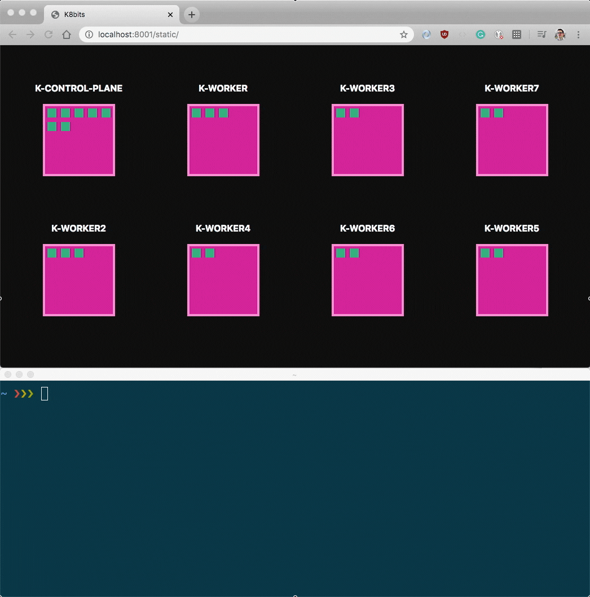

**TL;DR:** _Kubernetes libraries expose the Shared Informer — an efficient pattern to watch for API changes. This article teaches you how to build your own and [a real-time dashboard for Kubernetes with only client-side Javascript.](https://github.com/learnk8s/k8bit)_

In Kubernetes, you can monitor changes to Pods in real-time with the `--watch` flag:

```terminal|command=1|title=bash
kubectl get pods --watch
```

The `--watch` flag is part of the Kubernetes API, and it is designed to dispatch update events incrementally.

If you tried the command in the past, you might have noticed who the output is often confusing:


_How many more Pods were created?_

Two, but you had to parse the output a couple of times to be sure.

_Why is the command not updating the output in place?_

Let's dive into what happens when you execute that command.

## kubectl watch

Depending on what you do, `kubectl` goes through the following steps:

1. Validates client-side that the current resource is valid.
1. Uses [generators](https://kubernetes.io/docs/user-guide/kubectl-conventions/#generators) to serialise the resources (if any).
1. [Scans the cluster APIs for the right endpoint to call](https://github.com/kubernetes/kubernetes/blob/v1.14.0/pkg/kubectl/cmd/run/run.go#L674-L686) and [assembles a client that talk to that particular version](https://github.com/kubernetes/kubernetes/blob/v1.14.0/pkg/kubectl/cmd/run/run.go#L705-L708).
1. Authenticates with the API using your kubeconfig credentials.

The first two points are skipped here, but the remaining still apply.

And once they are completed, `kubectl` issues a request to :

```
GET https://api-server:8443/api/v1/namespaces/my-namespace/pods?watch=1
```

The response is temporarily empty and hangs.

The reason is straightforward: this is long-lived request, and the API is ready to respond with events as soon as there's one.

Since nothing happened, the connection is kept open.

Let's test this with a real cluster.

You can connect to your Kubernetes API with:

```terminal|command=1|title=bash
kubectl proxy
Starting to serve on 127.0.0.1:8001
```

Kubectl proxy creates a tunnel from your local machine to the remote API server.

You can verify that you're connected by issuing a request in another terminal:

```terminal|command=1|title=bash
curl localhost:8001
{
  "paths": [
    "/api",
    "/api/v1",
    "/apis",
    "/apis/",
    "/apis/admissionregistration.k8s.io",
    "/apis/admissionregistration.k8s.io/v1",
    // more APIs ...
  ]
}
```

It's time to subscribe for updates with:

```terminal|command=1|title=bash
curl localhost:8001/api/v1/pods?watch=1
```

Notice how the request does not complete and hangs.

In another terminal, create a Pod in the _default_ namespace with:

```terminal|command=1|title=bash
kubectl run random-pod --image=nginx --restart=Never
```

Observe the previous command.

There's output this time! — and a lot of it.

```json|title=output.json
{"type":"ADDED","object":{"kind":"Pod","apiVersion":"v1",/* more json */}}
```

_What happens when you change the image for that Pod?_

Let's try:

```terminal|command=1|title=bash
kubectl set image pod/my-pod my-pod=busybox
```

There's another entry in the watch output:

```json|highlight=2|title=output.json
{"type":"ADDED","object":{"kind":"Pod","apiVersion":"v1",/* more json */}}
{"type":"MODIFIED","object":{"kind":"Pod","apiVersion":"v1",/* more json */}}
```

You can already guess what happens when you delete the Pod with:

```terminal|command=1|title=bash
kubectl delete pod my-pod
```

The output from the watch command has another entry:

```json|highlight=3|title=output.json
{"type":"ADDED","object":{"kind":"Pod","apiVersion":"v1",/* more json */}}
{"type":"MODIFIED","object":{"kind":"Pod","apiVersion":"v1",/* more json */}}
{"type":"DELETED","object":{"kind":"Pod","apiVersion":"v1",/* more json */}}
```

In other words, every time you use the `watch=1` query string, you can expect:

1. The request to hang.
1. An update every time a Pod is added, deleted or modified.

If you recall, that's precisely the output from `kubectl get pods --watch`.

There are three events created:

1. The **ADDED** event is fired when a new resource is created.
1. The **MODIFIED** event is fired when an existing resource is changed.
1. The **DELETED** event is fire when the resource is removed from etcd.

And every update is a JSON response delimited by a new line — nothing complicated.

_Can you use those events above to track changes to your Pods in real-time?_

## Building a real-time dashboard for Pods

Imagine you want to build a real-time dashboard that tracks the location of your Pods in your Nodes.

Something like this:



When a new Pod is added, a green block is created in a Node.

When an existing Pod is deleted, a green block is removed from a Pod.

_Where do you start?_

In this article, you will focus on working with the Kubernetes API rather than a specific language.

And since the dashboard is web-based, you will use Javascript to interact with the APIs.

Let's start.

> If you want to jump to the code, [you can check out this repository.](https://github.com/learnk8s/k8bit)

Before you can use the API, you need to:

1. Host a static web page where you can serve the HTML, CSS and Javascript.
1. Access the Kubernetes API

Thankfully, `kubectl` has a command that combines both.

Create a local directory with an `index.html` file:

```terminal|command=2|title=bash
mkdir k8bit
cd k8bit
echo "<!DOCTYPE html><title>⎈</title><h1>Hello world!" > index.html
```

In the same directory, start a kubectl proxy that also serves static content with:

```terminal|command=1|title=bash
kubectl proxy --www=.
Starting to serve on 127.0.0.1:8001
```

You can open your browser at <http://localhost:8001/static> to see the _Hello World!_ page.

Let's see if you can connect to the Kubernetes API too.

create a Javascript file named `app.js` with the following content:

```javascript|title=app.js
fetch(`/api/v1/pods`)
  .then((response) => response.json())
  .then((podList) => {
    const pods = podList.items
    const podNames = pods.map(it => it.metadata.name)
    console.log('PODS:', podNames)
  })
```

You can include the script in the HTML with:

```terminal|command=1|title=bash
echo '<script src="app.js"></script>' >> index.html
```

If you reload the page in your browser and inspect [Chrome Dev Tools](https://developers.google.com/web/tools/chrome-devtools/open), [Firefox Web Console](https://developer.mozilla.org/en-US/docs/Tools/Web_Console/Opening_the_Web_Console) or [Safari Developer Tools](https://support.apple.com/en-sg/guide/safari/sfri20948/mac), you should see a list of Pods from your cluster.

Next step, real-time updates!

As you probably guessed, you could use the `watch` query string and receive timely updates about Pods added or deleted.

The code in Javascript could look like this:

```javascript|title=dashboard.js
fetch(`/api/v1/pods?watch=1`).then((response) => {
  /* read line and parse it to json */
})
```

While the initial call to the API is similar, handling the response is more complicated.

Since the response never ends, you have to parse the incoming stream as more bytes are received.

You also have to remember to parse the JSON responses every time there's a new line.

Here's an example of a stream of bytes:

```json|title=stream
{"type":"ADDED","object":{"kind":"Pod","apiVersion":"v1",/* more json */}}\n
{"type":"ADDED","object":{"kind":"Pod","apiVersion":"v1",/* more json */}}\n
```

Please notice that you're not guaranteed to receive one line at the time.

You could have a stream that is interrupted in between JSON responses like this:

```json|highlight=2,6|title=stream
{"type":"ADDED","object":{"kind":"Pod","apiVer
                              ---------------^
                              interrupted here

sion":"v1",/* more json */}}\n
^-----------
resumed here
```

That means that:

1. You should buffer all incoming bytes.
1. As the buffer grows, check if there are new lines.
1. Every time there's a new line, parse it as a JSON blob.
1. Call a function that prints the event in the console.

The following code handles the reading, buffering and splitting lines:

```javascript|title=app.js
fetch(`/api/v1/pods?watch=1`)
  .then((response) => {
    const stream = response.body.getReader()
    const utf8Decoder = new TextDecoder('utf-8')
    let buffer = ''

    // wait for an update and prepare to read it
    return stream.read().then(function onIncomingStream({ done, value }) {
      if (done) {
        console.log('Watch request terminated')
        return
      }
      buffer += utf8Decoder.decode(value)
      const remainingBuffer = findLine(buffer, (line) => {
        try {
          const event = JSON.parse(line)
          const pod = event.object
          console.log('PROCESSING EVENT: ', event.type, pod.metadata.name)
        } catch (error) {
          console.log('Error while parsing', chunk, '\n', error)
        }
      })

      buffer = remainingBuffer

      // continue waiting & reading the stream of updates from the server
      return stream.read().then(onIncomingStream)
    })
  })

function findLine(buffer, fn) {
  const newLineIndex = buffer.indexOf('\n')
  // if the buffer doesn't contain a new line, do nothing
  if (newLineIndex === -1) {
    return buffer
  }
  const chunk = buffer.slice(0, buffer.indexOf('\n'))
  const newBuffer = buffer.slice(buffer.indexOf('\n') + 1)

  // found a new line! execute the callback
  fn(chunk)

  // there could be more lines, checking again
  return findLine(newBuffer, fn)
}
```

If you wish to dive more into the details of the above code, you should check out [the browser Streaming API](https://developer.mozilla.org/en-US/docs/Web/API/Streams_API/Using_readable_streams).

If you include the above snippet in your `app.js`, you can see real-time updates from your cluster!

_There's something odd, though._

The API call includes a few of the Pods that were already listed by the first call.

If you inspect the console, you should find:

```highlight=2,7|title=output
PODS: ['nginx-deployment-66df5b97b8-fxl7t', 'nginx-deployment-66df5b97b8-fxxqd']
^--------------------
First call to the API

PROCESSING EVENT: ADDED nginx-deployment-66df5b97b8-fxl7t
PROCESSING EVENT: ADDED nginx-deployment-66df5b97b8-fxxqd
^----------------------------
Those two pods are duplicates
as you've already seen them
```

_Isn't the watch API supposed to stream only updates?_

_Why is it streaming events that happened in the past?_

## Tracking changes reliably

The watch API tracks only updates and [it has a memory of 5 minutes](https://kubernetes.io/docs/reference/using-api/api-concepts/#efficient-detection-of-changes).

So you could receive updates for Pods that were created or deleted up to 5 minutes ago.

_How do you track only **new** changes reliably?_

Ideally, you want to track all changes that happen **after** the first call to the API.

Every Kubernetes object has a [`resourceVersion` field that represents the version of the resource in the cluster](https://kubernetes.io/docs/reference/using-api/api-concepts/#resource-versions).

You can inspect the field in your existing cluster with:

```terminal|command=1|title=bash
kubectl get pod <my-pod> -o=jsonpath='{.metadata.resourceVersion}'
464927
```

The resource version is incremental, and it is included in the events from the watch API.

When you list all your Pods, the same `resourceVersion` is included in the response too:

```terminal|command=1|title=bash
curl localhost:8001/api/v1/pods | jq ".metadata.resourceVersion"
12031
```

You can think about the `resourceVersion` number as the x-axis on a timeline.

As objects are created in the cluster, the number is increased.

The same number can be used to retrieve the state of the cluster in a given point in time.

You could list all the Pods when the `resourceVersion` number `12031` with:

```terminal|command=1|title=bash
curl localhost:8001/api/v1/pods?resourceVersion=12031
# ... PodList response
```

The `resourceVersion` could help you make your code more robust.

Here's what you can change:

1. The first request retrieves all the Pods. The response is a `PodList` with a `resourceVersion`. You should save that.
1. You start the Watch API from that `resourceVersion`.

The code should change to something like this:

```javascript|highlight=7,10|title=dashboard.js
fetch('/api/v1/pods')
  .then((response) => response.json())
  .then((response) => {
    const pods = podList.items
    const podNames = pods.map(it => it.metadata.name)
    console.log('PODS:', podNames)
    return response.metadata.resourceVersion
  })
  .then((resourceVersion) => {
    fetch(`/api/v1/pods?watch=1&resourceVersion=${resourceVersion}`).then((response) => {
      /* read line and parse it to json */
      const event = JSON.parse(line)
      const pod = event.object
      console.log('PROCESSING EVENT: ', event.type, pod.metadata.name)
    })
  })
```

The code now works as expected and there are no duplicate Pods.

Congrats!

If you add or delete a Pod in the cluster, you should be able to see an update in your web console.

The code is reliable, and you only receive updates for events that you don't know!

_Can you track the Node where each Pod is deployed?_

## Keeping a local cache

Since every Pod exposes a `.spec.nodeName` field with the name of the Pod, you could use that to construct a pair pod - node.

Well almost every Pod exposes `.spec.nodeName`.

When a Pod is created:

1. It is stored in etcd.
1. An "ADDED" event is dispatched.
1. The Pod is added to the scheduler queue.
1. The scheduler binds the Pod to a Node.
1. The Pod is updated in etcd.
1. The "MODIFIED" event is dispatched.

So you can keep a list of all Pods, but filter the list only for Pods that a `.spec.nodeName`.

You can keep track of all Pods in your cluster with a [Map](https://developer.mozilla.org/en-US/docs/Web/JavaScript/Reference/Global_Objects/Map).

```javascript|highlight=17-18|title=app.js
const pods = new Map()

fetch('/api/v1/pods')
  .then((response) => response.json())
  .then((response) => {
    const pods = podList.items
    const podNames = pods.map(it => it.metadata.name)
    console.log('PODS:', podNames)
    return response.metadata.resourceVersion
  })
  .then((resourceVersion) => {
    fetch(`/api/v1/pods?watch=1&resourceVersion=${resourceVersion}`).then((response) => {
      /* read line and parse it to json */
      const event = JSON.parse(line)
      const pod = event.object
      console.log('PROCESSING EVENT: ', event.type, pod.metadata.name)
      const podId = `${pod.metadata.namespace}-${pod.metadata.name}`
      pods.set(podId, pod)
    })
  })
```

You can display all Pods assigned to a Node with:

```javascript|title=app.js
const pods = new Map()

// ...

function display() {
  Array.from(pods)
  .filter(pod => pod.spec.nodeName)
  .forEach(pod => {
    console.log('POD name: ', pod.metadata.name, ' NODE: ', pod.spec.nodeName)
  })
}
```

At this point, you should have a solid foundation to build the rest of the dashboard.

## Handling exceptions

Please note that the current code is missing:

1. A friendly user interface.
1. Retires when a request is terminated prematurely.

Rendering the HTML and writing the CSS are omitted in this tutorial.

[You can find the full project (including a friendly user interface) in this repository](https://github.com/learnk8s/k8bit), though.

Instead, the retry mechanism is worth discussing.

When you make a request using the watch flag, you keep the request open.

_But does it always stay connected?_

Nothing in life lasts forever.

The request could be terminated for a variety of reasons.

Perhaps the API was restarted, or the load balancer between you and the API decided to terminate the connection.

You should handle this case when it happens.

If you decide to reconnect, you should reconnect from the last update.

_But how do you know what was the last update?_

Again, the `resourceVersion` field is here to the rescue.

Since each update has a `resourceVersion` field, you should always store the last one you saw.

If the request is interrupted, you can initiate a new request to the API starting from the last `resourceVersion` field that you saw.

You can change the code to keep track of the last `resourceVersion` field seen like this:

```javascript|highlight=1,9,12,17|title=dashboard.js
let lastResourceVersion

fetch('/api/v1/pods')
  .then((response) => response.json())
  .then((response) => {
    const pods = podList.items
    const podNames = pods.map(it => it.metadata.name)
    console.log('PODS:', podNames)
    lastResourceVersion = response.metadata.resourceVersion
  })
  .then((resourceVersion) => {
    fetch(`/api/v1/pods?watch=1&resourceVersion=${lastResourceVersion}`).then((response) => {
      /* read line and parse it to json */
      const event = JSON.parse(line)
      const pod = event.object
      lastResourceVersion = pod.metadata.resourceVersion
      console.log('PROCESSING EVENT: ', event.type, pod.metadata.name)
    })
  })
```

The last change is including a fallback mechanism to restart the connection.

In this part, you should refactor the code like this:

```javascript|highlight=6,14-21|title=dashboard.js
function initialList() {
  return fetch('/api/v1/pods')
    .then((response) => response.json())
    .then((response) => {
      /* store resource version and list of pods */
      return streamUpdates()
    })
}

function streamUpdates(){
  fetch(`/api/v1/pods?watch=1&resourceVersion=${lastResourceVersion}`).then((response) => {
    /* read line and parse it to json */
  })
  .then(() => {
    // request gracefully terminated
    return streamUpdates()
  })
  .catch((error) => {
    // error, reconnect
    return stremUpdates()
  })
}
```

Now you can be sure that the dashboard will keep streaming updates even after the connection with the API was lost.

## Kubernetes Shared Informer

A quick recap of the code changes that you did:

1. You listed all Pods and stored the `resourceVersion`.
1. You started a long-lived connection with the API and asked for updates. Only the updates after the last `resourceVersion` are streamed.
1. You keep a local dictionary with all the Pods that you've seen so far.
1. You handled reconnections when the connection is (abruptly) terminated.

If you were to extend the same logic to Service and Deployments or any other Kubernetes resource, you probably want to have a very similar code.

It's a good idea to encapsulate the above logic in a library, so you don't have to keep reinventing the wheel every time you wish to track objects.

That's what the Kubernetes community thought too.

In Kubernetes, there's a code pattern called the [Shared Informer](https://gianarb.it/blog/kubernetes-shared-informer).

A shared informer encapsulates:

1. The initial request to retrieve a list of resources.
1. A Watch API request that starts from the previous `resourceVersion`.
1. An efficient cache mechanism to store the resources locally in a dictionary.
1. Reconnections when the connection is lost

You can find an example of the shared informer in several programming languages:

- [Go](https://gianarb.it/blog/kubernetes-shared-informer)
- [Javascript/Typescript](https://github.com/kubernetes-client/javascript/blob/ced85fc4783d95fd0e944f88d98a576e1f55746a/examples/typescript/informer/informer.ts)
- [Java](https://developers.redhat.com/blog/2019/10/07/write-a-simple-kubernetes-operator-in-java-using-the-fabric8-kubernetes-client/)
- [Python (in progress)](https://github.com/kubernetes-client/python/issues/868)
- [C# (in progress)](https://github.com/kubernetes-client/csharp/pull/394)

Using the official Javascript client library for Kubernetes you can refactor your code in less than 20 lines of code:

```javascript|title=informer.js
const listFn = () => listPodForAllNamespaces();
const informer = makeInformer(kc, '/api/v1/pods', listFn);

informer.on('add', (pod) => { console.log(`Added: ${pod.metadata!.name}`); });
informer.on('update', (pod) => { console.log(`Updated: ${pod.metadata!.name}`); });
informer.on('delete', (pod) => { console.log(`Deleted: ${pod.metadata!.name}`); });
informer.on('error', (err) => {
  console.error(err)
  // Restart informer after 5sec
  setTimeout(() => informer.start(), 5000)
})

informer.start()
```

> Please note that the above code works only on Node.js and can't be run in the browser at the moment. This is a limitation of the client library.

## Summary

All code written so far ran against `kubectl proxy`.

However, the same code could be repackaged and deployed inside your cluster.

Imagine being able to track Pods, Deployments, Services, DaemonSets, etc. from within a cluster.

That's precisely what happens when you deploy an operator or a controller in Kubernetes.

In a way, this article helped you to write (almost) your first Kubernetes operator.
