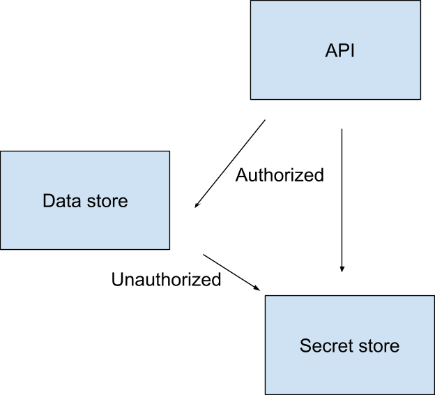
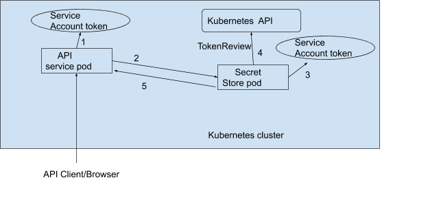

If your infrastructure consists of several applications interacting with each other, you might have faced the issue of securing the communication between services to prevent unauthenticated requests.

Imagine having three apps:

1. An API
1. A data store
1. A secret store

You might want the secret store only to reply to requests to the API and reject any request from the data store.

_How would the secret store decide to authenticate or deny the request?_

A popular approach is to request and pass identity tokens to every call within services.

So instead of issuing a request to the secret store directly, you might need to go through an Authorisation service first, retrieve a token and authenticate your request.

That way, when the data store or the presents the token to the secret store, it is rejected.

However, if the API service presents the same token, it is accepted.



You have several options when it comes to authorisation server:

- You could use static tokens that don't expire. In this case, there is no need for running a dedicated authorization server.
- You could use oAuth by setting up an internal oAuth server.
- You could roll out your own authorisation mechanism such as mutual TLS certificates.

All authorisation servers have to do is to:

1. **Authenticate the caller** - The caller should have a valid and verifiable identity.
1. **Generate a token with a limited scope, validity and the desired audience.**
1. **Validate a token** - Service to service communication is allowed only if the token is legit.

Examples of Authorisation servers are tools such as [Keycloak](https://www.keycloak.org/) or [Dex](https://github.com/dexidp/dex).

You might have not noticed, but even Kubernetes offers the same primitives as the authorisation service with Service Account, Roles and RoleBindings.

In Kubernetes, you assign identities using Service Accounts.

Service accounts are linked to roles to that grant access to resources.

Tokens are generated as soon as you create the Service Account and stored in a Secret.

Users and Pods can use the secret as a mechanism to authenticate to the API and make requests.

You only receive successful replies for the resources you are entitled to consume.

If your Role grant you access to create and delete Pods, you won't be able to amend Secrets, or create ConfigMaps — for example.

_Could you use Service Accounts as a mechanism to authenticate requests between apps in the cluster?_

Kubernetes offers the same primitives to authentication requests just like Keycloak and Dex.

_What if the Kubernetes API could be used as an Authorisation server?_

_Could you use Service Accounts as a mechanism to authenticate requests between apps in the cluster?_

Let's try that.

You will now deploy two services:

1. You will refer to these services as the API service (API) and the Secret store.
1. They are written in the Go programming language and they communicate via HTTP.
1. Each service runs in its own namespaces and use dedicated service accounts.
1. The secret store requires that any client identifies itself before making a request.

## Creating the cluster

You will need access to a Kubernetes cluster with the [ServiceAccountVolume projection](https://kubernetes.io/docs/tasks/configure-pod-container/configure-service-account/#service-account-token-volume-projection) feature enabled.

Don't worry if you don't know what a ServiceAccountVolume is — you will learn more about it later on in the article.

The ServiceAccountVolume projection requires the Kubernetes API server to be started with certain specific API flags.

The support for different managed Kubernetes providers may vary.

However, you can enable it in [minikube](https://github.com/kubernetes/minikube) with:

```terminal|command=1-6|title=bash
minikube start \
  --extra-config=apiserver.service-account-signing-key-file=\
    /var/lib/minikube/certs/sa.key \
  --extra-config=apiserver.service-account-issuer=\
    kubernetes/serviceaccount \
  --extra-config=apiserver.service-account-api-audiences=api
```

You should also clone the repository <https://github.com/amitsaha/kubernetes-sa-volume-demo> as it contains the demo source code that will be referred to in the article.

## Deploying the API component

The API service is a headless web application listening on port 8080.

When a client makes any request to it, the API component:

1. Reads the service account token.
1. Makes a HTTP GET request to the secret store service with the token linked to the Service Account.
1. Forwards the response.

You can deploy the app in the cluster with:

```terminal|command=1|title=bash
kubectl apply -f service_accounts/api/deployment.yaml
namespace/api created
serviceaccount/api created
deployment.apps/app created
```

You can temporarily expose the API with:

```terminal|command=1|title=bash
kubectl --namespace api expose deployment/app --type=NodePort
service/app exposed
```

Retrieve the URL of the app with:

```terminal|command=1|title=bash
minikube --namespace api service deployment --url
http://192.168.99.101:31541
```

_Will it work?_

You can issue a request with:

```terminal|command=1|title=bash
curl http://192.168.99.101:31541
Get "<http://app.secret-store.svc.cluster.local">: dial tcp: lookup app.secret-store.svc.cluster.local: no such host
```

This is expected since you haven't yet deployed the secret store service.

_Keep the terminal open._

Open a new terminal to carry out the next set of steps.

## Deploying the Secret store

The secret store service is another headless web application listening on port 8081.

When a client makes any request to it, the Secret store:

1. Looks for a token in the request. If there isn't one, it replies with a HTTP 401 error response.
1. Checks the token with the Kubernetes API for its validity. If it's invalid, it replies with a HTTP 403 response.
1. Replies to the original request.

You can create the secret store with:

```terminal|command=1|title=bash
kubectl apply -f service_accounts/secret-store/deployment.yaml
namespace/secret-store created
serviceaccount/secret-store created
clusterrolebinding.rbac.authorization.k8s.io/role-tokenreview-binding created
deployment.apps/app created
service/app created
```

Now, go back to the previous terminal window with the API service and issue the same request again:

```terminal|command=1|title=bash
curl http://192.168.99.101:31541
Hello from secret store. You have been authenticated
```

The secret store service successfully verified the token and replied to your request.

_But how does all of that work? Let's find out._

Keep the two terminal sessions running and switch to a new (third) terminal session.

## Under the hood

**Service accounts are a way to associate your Kubernetes workload with an identity.**

You can then combine a service account with a Role/ClusterRole and a RoleBinding/ClusterRoleBinding
to define what or who can access what resources in a cluster.

For example, when you want to restrict reading Secrets only to admin users in the cluster, you can do so using a service account.

Service Accounts aren't just for users, though.

You can authenticate humans as well as applications in the cluster.

If you want your applications to list all the available Pods in the cluster, you will need to create a Service Account that is associated with read-only access to the Pod API.

You deployed two apps that have Service Accounts — let's have a look.

```terminal|command=1,5|title=bash
kubectl get serviceaccount --namespace api
NAME      SECRETS   AGE
api       1         4m5s
default   1         4m5s
kubectl get serviceaccount --namespace secret-store
NAME           SECRETS   AGE
default        1         6m4s
secret-store   1         6m4s
```

Those Service Account are the identities associated with the apps, but they don't define what permissions are granted.

For that, you might need to list the Role and the RoleBinding:

```terminal|command=1,3|title=bash
kubectl get role,rolebinding --namespace api
No resources found in api namespace.
kubectl get role,rolebinding --namespace secretstore
No resources found in secretstore namespace.
```

There are none!

_How come you can have a Service Account without a Role and RoleBinding?_

You created an empty Service Account that doesn't have any sort of permission.

However, you can use it to authenticate your request to the API (but you can't create, update, delete, etc. resources).

Service accounts are useful and straightforward, but you should know that:

### 1. When you create a Service Account, Kubernetes creates a companion Secret object with a token

You use the token to authenticate with the Kubernetes API.

In this example, you can inspect the Service Account and find the token with:

```terminal|command=1|title=bash
kubectl --namespace api describe serviceaccount api
Name:                api
Namespace:           api
Mountable secrets:   api-token-ttr8q
Tokens:              api-token-ttr8q
```

Which matches the Secret store in the namespace:

```terminal|command=1|title=bash
kubectl get secrets --namespace api
NAME                  TYPE
api-token-ttr8q       kubernetes.io/service-account-token
default-token-vppc9   kubernetes.io/service-account-token
```

However, any workload that can read a secret in a namespace can also read the service account tokens in the same namespace.

In other words, you could have any other Pod using the same Service Account to authenticate against the Kubernetes API — effectively impersonating someone else.

Unfortunately, there's no mechanism to restrict access to a subset of Secrets in a namespace.

**The application has access to all of them, or none of them.**

### 2. The tokens associated with a Service Account are long-lived and do not expire

In other words, once you have access to one of them, you can use it forever (or until the administrator deletes the secret associated with the token).

### 3. No audience binding of the tokens

As a cluster administrator, you cannot associate a token with a specific audience.

Anyone with access to the service account token can authenticate itself and are authorized to communicate with any other service running inside the cluster.

The destination service doesn't have any way to verify whether the token it was presented with was meant for itself at all.

Tokens associated with Service Accounts are verified by the Kubernetes API.

In particular, there's a specific component in charge of validating and rejecting them: the **Token Review API**.

Let's manually create a token and validate it against the Token Review API.

### Creating a Service Account

Consider the following YAML manifest to create a namespace, `test` and a service account, `sa-test-1` in it:

```yaml|title=sa.yaml
apiVersion: v1
kind: Namespace
metadata:
  name: test
---
apiVersion: v1
kind: ServiceAccount
metadata:
  name: sa-test-1
  namespace: test
```

Save the above into a file `sa.yaml` and run kubectl apply:

```terminal|command=1|title=bash
kubectl apply -f sa.yaml

namespace/test created
serviceaccount/sa-test-1 created
```

To view the token associated with the service account:

```terminal|command=1|title=bash
kubectl --namespace test describe sa sa-test-1
Name:            	sa-test-1
Namespace:       	test
Labels:          	<none>
Annotations:     	kubectl.kubernetes.io/last-applied-configuration:
            {"apiVersion":"v1","kind":"ServiceAccount","metadata":
           {"annotations":{},"name":"sa-test-1","namespace":"test"}}
Image pull secrets:  <none>
Mountable secrets:   sa-test-1-token-99l5r
Tokens:          	sa-test-1-token-99l5r
Events:          	<none>
```

Then to view the secret object:

```
kubectl --namespace test describe secret sa-test-1-token-99l5r
Name:     	sa-test-1-token-99l5r
Namespace:	test
Labels:   	<none>
Annotations:  kubernetes.io/service-account.name: sa-test-1
          	kubernetes.io/service-account.uid: d2d210d8-8bd6-4115-b796-5ff4bd373d74

Type:  kubernetes.io/service-account-token

Data
====
ca.crt: 	1066 bytes
namespace:  4 bytes
token:  	eyJhbGciOiJSUzI1NiIsImtpZCI6InY3MDRITGNmdGt1WTdwNFk4Q2Y1Q0tTUm
5TMzdOVDBGdXFEQkU1bWVibE0ifQ.eyJpc3MiOiJrdWJlcm5ldGVzL3NlcnZpY2VhY2NvdW
50Iiwia3ViZXJuZXRlcy5pby9zZXJ2aWNlYWNjb3VudC9uYW1lc3BhY2UiOiJ0ZXN0Iiwi
a3ViZXJuZXRlcy5pby9zZXJ2aWNlYWNjb3VudC9zZWNyZXQubmFtZSI6InNhLXRlc3QtMS
10b2tlbi05OWw1ciIsImt1YmVybmV0ZXMuaW8vc2VydmljZWFjY291bnQvc2VydmljZS1
hY2NvdW50Lm5hbWUiOiJzYS10ZXN0LTEiLCJrdWJlcm5ldGVzLmlvL3NlcnZpY2VhY2Nvd
W50L3NlcnZpY2UtYWNjb3VudC51aWQiOiJkMmQyMTBkOC04YmQ2LTQxMTUtYjc5Ni01Zm
Y0YmQzNzNkNzQiLCJzdWIiOiJzeXN0ZW06c2VydmljZWFjY291bnQ6dGVzdDpzYS10ZXN0
LTEifQ.hJVpGWU4gd1VoDPaeHPT-fIS_1Uc_r_hhuLPw0AjdCownGmeZj-yv_GgItRvDK
dyj7jSpTnPfLiH0z8e_xGXssGHaWhHm5AOZt1Mf9TZYqdFrfNPdjwW2-_dpkytYC1zSVG
NMQsEAI758s3RRGezk24Js3zWjpStK1AlcnDOmFslNP1aI2RmlubGd9CKb9Nm_1ln4gVc
8n02RvpvlHU5LE6uVOe-e9TZrFpHrhPBDhrrFxC-x0-PgrdAlekc8wE2OcKfZtSsHofj
H_0MPcN94ethCmgwniBJMfGvxrMp8-6KkSSAhLMrdsHth_KiXtNkC6EZjFCAcAJKe6juu1OIrg
```

The `token` object in the Data is a base64 encoded object representing a JSON web token payload.

Once you have an appropriate RoleBinding or ClusterRoleBinding setup, you can then provide this token to perform operations in the cluster from within a pod.

For example, given a service account token, you want to verify whether the token is valid or not by invoking the Kubernetes TokenReview API.

### Verifying a token using TokenReview API

A Service Account is just an identity with no permissions associated with it.

If you want to grant access to the Service account you need two more objects: a binding and a role.

In the role you define access to the resources such as read-only access to Secrets or only GET, DESCRIBE and LIST operations on Pods.

Kubernetes comes with a list of roles prepackaged that you can list with:

```terminal|command=1|title=bash
kubectl get roles
```

In the following example, you will use the `system:auth-delegator` role which has all the permission you need to call the Token Review API. You can inspect it with:

```terminal|command=1|title=bash
kubectl get role system:auth-delegator
```

The only part missing is the binding.

You can create a ClusterRoleBinding to link the Service Account to a role and grant the permission cluster wide:

```yaml|title=sa_rbac.yaml
kind: ClusterRoleBinding
metadata:
  name: role-tokenreview-binding
  namespace: test
roleRef:
  apiGroup: rbac.authorization.k8s.io
  kind: ClusterRole
  name: system:auth-delegator
subjects:
- kind: ServiceAccount
  name: sa-test-1
  namespace: test
```

Save the above into a new file, sa_rbac.yaml and run kubectl apply:

```
kubectl apply -f sa_rbac.yaml
clusterrolebinding.rbac.authorization.k8s.io/role-tokenreview-binding created
```

You have now created a service account and associated it with a ClusterRole to allow it to invoke the TokenReview API.

How should you use it? Here's one way:

1. You could assign the Service Account to a Pod.
1. Invoke a HTTP client in that Pod to query the TokenReview API (You should be able to query the API because you assigned the `system:auth-delegator` role). When  making the request, you will pass on the service account token associated with the pod as a header value to the TokenReview API.
1. You will verify the same token that you are using to authenticate. It's an artificial scenario but it solves our purpose here.

The image you will use to create the pod needs to have the bash, curl and the sleep programs available.

You can use the image `amitsaha/curl` - which I created for this article and is available on Docker Hub.

```terminal|command=1|title=bash
kubectl run --namespace=test --serviceaccount=sa-test-1 --generator=run-pod/v1 \
  curl --image=amitsaha/curl  --image-pull-policy=Never --restart='Never' --command -- sleep 3600
pod/curl created
```

Now, run kubectl describe to show details about the pod that was just created:

```terminal|command=1|title=bash
kubectl --namespace test describe pod curl
Name:     	curl
Namespace:	test
..
Containers:
  curl:
	Container ID:  docker://9dc09c2f6f78b54e600eaec10db0885bad3da455126ab9230ac1914a301f445e
	Image:     	amitsaha/curl
	Image ID:  	docker://sha256:db3743f4dce44c902e0b89382d96d78ccf6adee92116cbfdb0c713591d0b08a8
	Port:      	<none>
	Host Port: 	<none>
	Command:
  	sleep
  	3600
	State:      	Running
  	Started:  	Fri, 18 Sep 2020 17:06:22 +1000
	Ready:      	True
	Restart Count:  0
	Environment:	<none>
	Mounts:
  	/var/run/secrets/kubernetes.io/serviceaccount from sa-test-1-token-smgh4 (ro)
..
```

The key information in the above output is that the service account token is available to the pod in the directory, `/var/run/secrets/kubernetes.io/serviceaccount`.

When a Pod is created, the Service Account data is automatically mounted as a volume and the Service Account token is available as a file inside that directory.

Let's retrieve the token.

Use kubectl exec to start a shell session inside the running pod:

```terminal|command=1|title=bash
kubectl --namepsace test exec -ti curl bash
root@curl:/#
```

Inside the shell session, first export a few variables.

First up, let's export the APISERVER variable pointing to the Kubernetes API:

```terminal|command=1|title=bash
# APISERVER=https://kubernetes.default.svc
```

The SERVICEACCOUNT variable points to the filesystem directory at which the service account related files can be found:

```terminal|command=1|title=bash
# SERVICEACCOUNT=/var/run/secrets/kubernetes.io/serviceaccount
```

The NAMESPACE variable contains the namespace obtained via reading the contents of the namespace file in the above directory:

```terminal|command=1|title=bash
# NAMESPACE=$(cat ${SERVICEACCOUNT}/namespace)
```

The TOKEN variable contains the service account token obtained via reading the contents of the token file in the same directory:

```terminal|command=1|title=bash
# TOKEN=$(cat ${SERVICEACCOUNT}/token)
```

The CACERT variable points to the Certificate Authority bundle that curl will use to verify the Kubernetes API certificate:

```terminal|command=1|title=bash
# CACERT=${SERVICEACCOUNT}/ca.crt
```

Let's issue a request to theAPI and see if you can authenticate

```terminal|command=1|title=bash
curl --cacert ${CACERT} --header "Authorization: Bearer ${TOKEN}" -X GET ${APISERVER}/api
{
  "kind": "APIVersions",
  "versions": [
  "v1"
  ],
  "serverAddressByClientCIDRs": [
  {
    "clientCIDR": "0.0.0.0/0",
    "serverAddress": "172.17.0.3:8443"
  }
  ]
}
```

Excellent, you can reach the Kubernetes API.

Note how you passed the Authorization header containing the service account token.

If you don't supply it or pass in an invalid token, you will get a HTTP 403 error response as follows:

```terminal|command=1|title=bash
curl --cacert ${CACERT} -X GET ${APISERVER}/api
{
  "kind": "Status",
  "apiVersion": "v1",
  "metadata": {},
  "status": "Failure",
  "message": "forbidden: User \"system:anonymous\" cannot get path \"/api\"",
  "reason": "Forbidden",
  "details": {},
  "code": 403
}
```

Next, you will see how you can invoke the `TokenReview API` to verify a service account token.

### Sending a token verification request

To issue a request to the TokenReviewAPI, you need two parts:

1. The API endpoint that you should call which is `/apis/authentication.k8s.io/v1/tokenreviews`.
1. A payload with the information about the token that you wish to validate.

The API endpoint expects a POST request with a JSON formatted payload of the following form:

```json
{
  "kind": "TokenReview",
  "apiVersion": "authentication.k8s.io/v1",
  "spec": {
  "token": "<your token>"
  }
}
```

In this case, the token you will use to authenticate to the API server as well as verify the status
of is the same. Thus, the curl command to run in the pod shell session is:

```terminal|command=1-6|title=bash
curl --cacert ${CACERT} -X "POST" \
  $APISERVER/apis/authentication.k8s.io/v1/tokenreviews \
  -H "Authorization: Bearer ${TOKEN}" \
  -H "Content-Type: application/json; charset=utf-8" \
  -d '{"kind": "TokenReview","apiVersion": \
   "authentication.k8s.io/v1", "spec": {"token": "'$TOKEN'"}}'
```

The response will look as follows:

```json
{
  "kind": "TokenReview",
  "apiVersion": "authentication.k8s.io/v1",
  "metadata": {
  "creationTimestamp": null,
  "managedFields": [
    {
      "manager": "curl",
      "operation": "Update",
      "apiVersion": "authentication.k8s.io/v1",
      "time": "2020-09-18T09:24:37Z",
      "fieldsType": "FieldsV1",
      "fieldsV1": {
        "f:spec": {
          "f:token": {}
        }
      }
    }
  ]
  },
  "spec": {
  "token": "eyJhbGciOiJSUzI1NiIsImtpZCI6IjUwbGdTc1FvUzFvTDlud0lnQjhBbDhMaFd
KT0VNeHM3STNaWERnaHB0MUEifQ.eyJpc3MiOiJrdWJlcm5ldGVzL3NlcnZpY2VhY2NvdW50Ii
wia3ViZXJuZXRlcy5pby9zZXJ2aWNlYWNjb3VudC9uYW1lc3BhY2UiOiJ0ZXN0Iiwia3ViZXJ
uZXRlcy5pby9zZXJ2aWNlYWNjb3VudC9zZWNyZXQubmFtZSI6InNhLXRlc3QtMS10b2tlbi1z
bWdoNCIsImt1YmVybmV0ZXMuaW8vc2VydmljZWFjY291bnQvc2VydmljZS1hY2NvdW50Lm5hb
WUiOiJzYS10ZXN0LTEiLCJrdWJlcm5ldGVzLmlvL3NlcnZpY2VhY2NvdW50L3NlcnZpY2UtYWN
jb3VudC51aWQiOiI0MmQ0M2U0Ni03NmZlLTQ0MWYtODI4MS1hNTY2OTY0ZTUyZmUiLCJzdWIiO
iJzeXN0ZW06c2VydmljZWFjY291bnQ6dGVzdDpzYS10ZXN0LTEifQ.eutlDryfPEWKoCDL7JV7
9AYslJw7aYWgYqVzhFUatipBp081yXyBz0ahEILqYkl4TvtIOkIY3zcy4Zuumjoomp7RFUvxe4
OClaLEUHvRdpbjEK_pV_Rvz8xoBEeHBZntiyNYgtQieRC1zBq6xLvMt6HPLpCa_NkDTbON_9_T_
ib6D4qnG7V_OtYL-S3aqgfWRnhc3H1s5j2M0BudRmybDoR76K3plehjKGqjggjIynb3r9tF4ow
NxsLrgU1SUZVG8yIc6_mriJntrTtHEo-OWD4fx01dkIg40fupJnDeKlHsPgQC4lfIvSjlv1a
YQOS9VLssYs9Tg8Y10zCPoOjDdw"
  },
  "status": {
  "authenticated": true,
  "user": {
    "username": "system:serviceaccount:test:sa-test-1",
    "uid": "42d43e46-76fe-441f-8281-a566964e52fe",
    "groups": [
      "system:serviceaccounts",
      "system:serviceaccounts:test",
      "system:authenticated"
    ]
  },
  "audiences": [
    "api"
  ]
  }
}
```

The key information in the response is in the status object with the following fields:

- **authenticated**: This is set to true which means the token was successfully validated by the API server
- The **user** field is another object with the following fields:
  - _username_: The value of this key represents the username corresponding to the service account used by the pod - `system:serviceaccount:test:sa-test-1`.
  - _uid_: The value of this key represents the system user ID for the user.
- **Groups**: The value of this key is a list containing the groups the user belongs to.
- **audiences**: The value of this field is a list of audiences the token is intended for. This field allows the token receiver to verify whether it is in the list of allowed audiences and hence can decide to accept it or reject it. In this case, the default audience is returned which was configured when you started the minikube cluster using `--extra-config=apiserver.service-account-api-audiences=api`.

Excellent, you just verified the token!

You know that:

- The token is valid.
- The identity of the caller (the Service Account).
- The groups that the caller belongs to.

You could leverage the information in your Secret Store component to validate the request!

Let's have a look at how you could include the above logic in your apps by looking at how the API and the secret store services are implemented.

## Implementation of the services

Here's how the two services interact with each other and the Kubernetes API:

1. At startup, an API service pod reads the service account token from the filesystem inside the pod and keeps it in memory.
1. The API pod then calls the secret store service passing the token as a HTTP header, `X-Client-Id`.
1. At startup, the secret service pod uses the Kubernetes Go client reads its own service account token from the filesystem and keeps it in memory.
1. When a secret store pod receives a request from an API pod, it reads the value of the `X-Client-Id` header and makes a validation request to to the TokenReview API using the token read in step 3 to authenticate and authorize itself to the Kubernetes API.
1. If the API response comes back as authenticated, the secret store service responds with a successful message, else reports back a 401.

The following diagram represents the above call flow:



First let's look at the implementation of the API service.

You can find the application code in the file `service_accounts/api/main.go`.

To read the service account token, the following function is used:

```go
func readToken() {
	b, err := ioutil.ReadFile("/var/run/secrets/kubernetes.io/serviceaccount/token")
	if err != nil {
		panic(err)
	}
	serviceToken = string(b)
}
```

Then, the service token is passed on to the call to the Secret store service in a HTTP header, X-Client-Id:

```go
func handleIndex(w http.ResponseWriter, r *http.Request) {

	...
	client := &http.Client{}
	req, err := http.NewRequest("GET", serviceConnstring, nil)
	if err != nil {
		panic(err)
	}
	req.Header.Add("X-Client-Id", serviceToken)
	resp, err := client.Do(req)
	..
```

The following YAML manifest is used to deploy the API service:

```yaml|highlight=27-27|title=deployment.yaml
apiVersion: v1
kind: Namespace
metadata:
  name: api
---
apiVersion: v1
kind: ServiceAccount
metadata:
  name: api
  namespace: api
---
apiVersion: apps/v1
kind: Deployment
metadata:
  name: app
  namespace: api
spec:
  replicas: 1
  selector:
    matchLabels:
      app: api
  template:
    metadata:
      labels:
        app: api
    spec:
      serviceAccount: api
      containers:
      - name: app
        image: amitsaha/k8s-sa-volume-demo-api:sa-1
        env:
        - name: LISTEN_ADDR
          value: ":8080"
        - name: SECRET_STORE_CONNSTRING
          value: "http://app.secret-store.svc.cluster.local"
        ports:
        - containerPort: 8080
```

You will notice that there is nothing special about the deployment manifest above other than specifying a service account to the deployment.

Let's move onto the secret store service. You can find the complete application in `service_accounts/secret-store/main.go`.

The secret store service does two key things:

1. It retrieves the value of the X-Client-Id header from the incoming request.
1. It then invokes the Kubernetes TokenReview API with the value retrieved to check if it is a valid token or not.

Step (1) is performed by the following code:

```go
clientId := r.Header.Get("X-Client-Id")
	if len(clientId) == 0 {
		http.Error(w, "X-Client-Id not supplied", http.StatusUnauthorized)
		return
	}
```

Then, step (2) is performed using the Kubernetes Go client.

First, we create a `ClientSet` object:

```go
config, err := rest.InClusterConfig()
clientset, err := kubernetes.NewForConfig(config)
```

The `InClusterConfig()` function automatically reads the service account token for the pod and hence you do not have to manually specify the filesystem path.

Then, you construct a `TokenReview` object specifying the token you want to validate in the `Token` field:

```go
tr := authv1.TokenReview{
	Spec: authv1.TokenReviewSpec{
	    Token: clientId,
	},
}
```

Then, create a `TokenReview` request:

```go
result, err := clientset.AuthenticationV1().TokenReviews().Create(ctx, &tr, metav1.CreateOptions{})
```

The following YAML manifest will create the various resources needed for the secret store service:

```yaml|highlight=12-23|title=deployment.yaml
apiVersion: v1
kind: Namespace
metadata:
  name: secret-store
---
apiVersion: v1
kind: ServiceAccount
metadata:
  name: secret-store
  namespace: secret-store
---
apiVersion: rbac.authorization.k8s.io/v1beta1
kind: ClusterRoleBinding
metadata:
  name: role-tokenreview-binding
roleRef:
  apiGroup: rbac.authorization.k8s.io
  kind: ClusterRole
  name: system:auth-delegator
subjects:
- kind: ServiceAccount
  name: secret-store
  namespace: secret-store
---
apiVersion: apps/v1
kind: Deployment
metadata:
  name: app
  namespace: secret-store
spec:
  replicas: 1
  selector:
    matchLabels:
      app: secret-store
  template:
    metadata:
      labels:
        app: secret-store
    spec:
      serviceAccount: secret-store
      containers:
      - name: app
        image: amitsaha/k8s-sa-volume-demo-ss:sa-1
        env:
        - name: LISTEN_ADDR
          value: ":8081"
        ports:
        - containerPort: 8081
---
apiVersion: v1
kind: Service
metadata:
  name: app
  namespace: secret-store
spec:
  selector:
    app: secret-store
  ports:
    - protocol: TCP
      port: 80
      targetPort: 8081
```

Compared to the API service, the secret store service requires a ClusterRoleBinding resource to be created which associates the secret-store service account to the `system:auth-delegator` ClusterRole.

Go back to the terminal session where you deployed the secret store service from and run `kubectl --namepsace secret-store logs <pod id>` and you will see the following log lines where you can see the response from the TokenReview API call:

```
2020/08/21 09:09:10 v1.TokenReviewStatus{Authenticated:true,
User:v1.UserInfo{Username:"system:serviceaccount:secret-store:secret-store",
UID:"24ae6734-9ca1-44d8-af93-98b6e6f8da17", Groups:[]string{"system:serviceaccounts",
"system:serviceaccounts:api", "system:authenticated"}, Extra:map[string]v1.ExtraValue(nil)},
Audiences:[]string{"api"}, Error:""}
```

This is a Go structure version of the JSON response you saw earlier.

Thus, you see how API service reads the service account token and passes it onto its request to the secret store service as a way to authenticate itself.

The secret store service retrieves the token and then checks with the Kubernetes API whether it is valid or not.

If valid, the secret store service allows the request from the API service to be processed.

This suffers from two drawbacks:

1. Anyone - human or otherwise with the permission to read the secret token in the api namespace can send a request to the secret store successfully. There is no embedded information in the token that the secret store can use to validate its intended audience.
1. The secret token doesn't expire at all. If it is stolen, the only way to revoke it is to delete the service account and recreate it.

You can solve the above problems by implementing solutions such as mutual TLS or using a JWT based solution with a central authority server.

However, in Kubernetes, you can use the service account token volume projection feature to create time-bound and audience-specific service account tokens which do not persist in the cluster store.

The Kubernetes API server performs the role of the central authority server and you don't have to worry about any of the internal details of expiring the tokens and more.

This feature was introduced in Kubernetes 1.12 and gained further improvements in 1.13 and provides a more secure alternative to workload-specific service accounts.

In fact, this will be promoted to a GA feature in the upcoming Kubernetes 1.20 release.

Before we move on, cleanup the two namespaces for the services which will also delete the other resources we created:

```terminal|command=1,2|title=bash
kubectl delete ns api
kubectl delete ns secret-store
```

## Inter-Service authentication using service account token volume projection

Now, you will learn to use Service Account Token Volume Projection (`ProjectedServiceAccountToken`) for workload identity in Kubernetes.

The service account tokens made available to workloads via this mechanism are time-limited, audience bound and are not associated with secret objects.

If a pod is deleted or the service account is removed, these tokens become invalid, thus preventing any abuse if stolen.

A `serviceAccountToken` volume projection is one of the `projected` volume types.

When this volume type is added to a pod, the service account token is injected at a configured filesystem path inside.

This is similar to how the service account tokens are mounted inside the pod.

There's a difference though.

The kubelet automatically rotates the token when it's about to expire.

In addition, you can configure the path at which you want this token to be available.

### API

You will now modify the code for the API service to read the service account token mounted via volume projection and use that to authenticate to the secret store service:

```go
b, err := ioutil.ReadFile("/var/run/secrets/tokens/api-token")
serviceToken = string(b)
```

Note the path to the service account token is different from the previous case.

You will see how this is configured in the deployment manifest.

Since the service account token volume projection feature relies on the token being refreshed periodically by the
kubelet, it is recommended to re-read the token every 5 minutes in the application code.

You can accomplish this via a _ticker_ in Go as follows:

```go
ticker := time.NewTicker(300 * time.Second)
done := make(chan bool)

go func() {
    for {
        select {
   	case <-done:
   	    return
   	case <-ticker.C:
   	    readToken()
   	}
   }
 }()
```

The `readToken()` function reads the file, `/var/run/secrets/tokens/api-token` and sets the global variable, `serviceToken` to the token value.

_If you are not familiar with Go's ticker, think of a ticker as a background thread which runs a function at periodic intervals_.

You can find the entire application code in `service_accounts_volume_projection/api/main.go`.

Now, let's deploy this service.

A built image (amitsaha/k8s-sa-volume-demo-api:sa-2 ) has been pushed to docker hub, so you will not need to build it locally.

You will use that image in the deployment manifest (`service_accounts_volume_projection/api/deployment.yaml`):

```yaml|highlight=28-36|title=deployment.yaml
apiVersion: v1
kind: Namespace
metadata:
  name: api
---
apiVersion: v1
kind: ServiceAccount
metadata:
  name: api
  namespace: api
---
apiVersion: apps/v1
kind: Deployment
metadata:
  name: app
  namespace: api
spec:
  replicas: 1
  selector:
    matchLabels:
      app: api
  template:
    metadata:
      labels:
        app: api
    spec:
      serviceAccount: api
      volumes:
        - name: api-token
          projected:
            sources:
            - serviceAccountToken:
                path: api-token
                expirationSeconds: 600
                audience: secret-store
      containers:
      - name: app
        image: amitsaha/k8s-sa-volume-demo-api:sa-2
        env:
        - name: LISTEN_ADDR
          value: ":8080"
        - name: SECRET_STORE_CONNSTRING
          value: "http://app.secret-store.svc.cluster.local"
        ports:
        - containerPort: 8080
        volumeMounts:
          - mountPath: /var/run/secrets/tokens
            name: api-token
```

The projected volume specification above is defined as:

```yaml
volumes:
  - name: api-token
    projected:
      sources:
        - serviceAccountToken:
          path: api-token
          expirationSeconds: 600
          audience: secret-store
```

A volume named `api-token` of `projected` type will be created with the source being `serviceAccountToken`.

The `path` indicates the file where the token will be available inside the configured volume, audience field specifies what the intended audience for the token is (if not specified, it defaults to `api`) and the expirationSeconds indicate how long a token is valid for - the minimum is 600 seconds or 10 minutes.

The audience field in the manifest says that this service account token is allowed to communicate with another service which identifies itself with the `secret-store` audience.

Going back to the example scenario introduced at the beginning, by deploying the data store service without adding secret-store to the list of valid audiences, it will not be able to communicate with the secret store.

**Note that if you are deploying a pod to use this feature in a cluster with pod security policies enforced, you will need to ensure that the `projected` volume type is allowed.**

Go into _service_accounts_volume_projection/api/_ directory and run kubectl apply:

```terminal|command=1|title=bash
kubectl apply -f deployment.yaml
```

To be able to access this service from the host system, you will first need to expose the service as earlier:

```terminal|command=1|title=bash
kubectl -n api expose deployment app --type=LoadBalancer --port=8080
service/app exposed
```

Then, run:

```terminal|command=1|title=bash
minikube service app -n api
# truncated output
🎉  Opening service api/app in default browser...
❗  Because you are using a Docker driver on darwin, the terminal needs to be open to run it.
```

As earlier, a browser tab will open and you should see the following:

```
Get "<http://app.secret-store.svc.cluster.local">: dial tcp: lookup app.secret-store.svc.cluster.local: no such host
```

This is expected as the secret store is not yet deployed.

Keep the tab and the terminal window open.

Next, let's modify and deploy the secret store service.

### Secret Store

The token review payload for the secret store will now be as follows:

```go
tr := authv1.TokenReview{
   	 Spec: authv1.TokenReviewSpec{
   		 Token: 	clientId,
   		 Audiences: []string{"secret-store"},
   	 },
    }
```

Now, in the TokenReview object, secret store explicitly passes “secret-store” as the audience for the token it is asking the API to review.

If the token doesn't include “secret-store” as an audience, the Token Review API will not authenticate the request.

In other words, the secret store service can assert the identity of the caller and validate that the incoming request token was meant for the secret store service.

You can find the entire application code in `service_accounts_volume_projection/secret-store/main.go`.

Next, let's deploy this service.

A built image (_amitsaha/k8s-sa-volume-demo-ss:sa-2_) has been pushed to docker hub, so you will not need to build it locally.

You will use that image in the deployment manifest (`service_accounts_volume_projection/secret-store/deployment.yaml`).

The deployment manifest for the secret store will be the same as earlier.

Go into the `service_accounts_volume_projection/secret-store` directory and run kubectl apply:

```terminal|command=1|title=bash
kubectl apply -f deployment.yaml

namespace/secret-store created
serviceaccount/secret-store created
clusterrolebinding.rbac.authorization.k8s.io/role-tokenreview-binding configured
deployment.apps/app created
service/app created
```

Let's check if the service is up and running correctly:

```terminal|command=1|title=bash
kubectl -n secret-store describe svc app
Name:          	app
Namespace:     	secret-store
Labels:        	<none>
Annotations:   	kubectl.kubernetes.io/last-applied-configuration:
               {"apiVersion":"v1","kind":"Service","metadata":
               {"annotations":{},"name":"app","namespace":"secret-store"},
               "spec":{"ports":[{"port":80,"pro...
Selector:      	app=secret-store
Type:          	ClusterIP
IP:            	10.106.239.243
Port:          	<unset>  80/TCP
TargetPort:    	8081/TCP
Endpoints:     	172.18.0.5:8081
Session Affinity:  None
Events:        	<none>
```

The value of `Endpoints` in the output above tells us that service is now up and running.

Go back to the browser tab with the API service terminal open and reload the page. You will now see:

Hello from secret-store. You have been authenticated

If you now view the logs of secret store via `kubectl -n secret-store logs <pod id>`, you will see the following:

```
(v1.TokenReviewStatus) &TokenReviewStatus{Authenticated:true,
User:UserInfo{Username:system:serviceaccount:api:api,
UID:ec7c304f-9722-4d1b-9f67-d3ce32cd8d4c,
Groups:[system:serviceaccounts system:serviceaccounts:api system:authenticated],
Extra:map[string]ExtraValue{authentication.kubernetes.io/pod-name:
[app-65d954658c-dbbr5],
authentication.kubernetes.io/pod-uid: [1b37a3f4-54f1-419c-b435-affce3f4a0f3],},},
Error:,Audiences:[secret-store],}
```

In the logs of the API service, you can see log lines as follows which shows the service account token being re-read from the filesystem:

```
2020/08/26 05:03:43 Refreshing service account token
2020/08/26 05:13:42 Refreshing service account token
2020/08/26 05:18:42 Refreshing service account token
```

## Summary

Service Account Token Volume projection allows you to associate non-global, time-bound and audience bound service tokens to your Kubernetes workloads.

In this article you saw an example of using it for authentication between your services and how it is a better alternative to using the default service account tokens.

Kubernetes native software such as [linkerd](https://github.com/linkerd/linkerd2/issues/3260) and [Istio](https://istio.io/latest/blog/2019/trustworthy-jwt-sds/) are embracing it for their internal communication
and managed Kubernetes service providers such as [GKE](https://cloud.google.com/community/tutorials/gke-workload-id-clientserver) and [AWS EKS](https://docs.aws.amazon.com/eks/latest/userguide/iam-roles-for-service-accounts-technical-overview.html) are using this projection volume type to enable more robust pod identity systems.

## Learn more

- [Kubernetes Authentication](https://kubernetes.io/docs/reference/access-authn-authz/authentication/)
- [Kubernetes Service Account Token Volume Projection](https://kubernetes.io/docs/tasks/configure-pod-container/configure-service-account/#service-account-token-volume-projection)
