> **TL;DR:** Kubernetes doesn't load balance long-lived connections, and some Pods might receive more requests than others. If you're using HTTP/2, gRPC, RSockets, AMQP or any other long-lived connection such as a database connection, you might want to consider client-side load balancing.

Kubernetes offers two convenient abstractions to deploy apps: Services and Deployments.

Deployments describe a recipe for what kind and how many copies of your app should run at any given time.

Each app is deployed as a Pod, and an IP address is assigned to it.

Services, on the other hand, are similar to load balancers, and they are designed to distribute the traffic to a set of Pods.

```slideshow
{
  "description": "Deployment and Service in Kubernetes",
  "slides": [
    {
      "image": "assets/basics-1.svg",
      "description": "In this diagram you have three instances of a single app and a load balancer."
    },
    {
      "image": "assets/basics-2.svg",
      "description": "The load balancer is called Service and has an IP address. Any incoming request is distributed to one of the Pods."
    },
    {
      "image": "assets/basics-3.svg",
      "description": "The Deployment defines a recipe to create more instances of the same Pod. You almost never deploy Pod individually."
    },
    {
      "image": "assets/basics-4.svg",
      "description": "Pods have IP address assigned to them."
    }
  ]
}
```

It's often useful to think about Services as a collection of IP address.

Every time you make a request to a Service, one of the IP addresses from that list is selected and used as the destination.

```slideshow
{
  "description": "Service and Endpoints",
  "slides": [
    {
      "image": "assets/service-1.svg",
      "description": "Imagine issuing a request such as `curl 10.96.45.152` to the Service."
    },
    {
      "image": "assets/service-2.svg",
      "description": "The Service picks one of the three Pods as the destination."
    },
    {
      "image": "assets/service-3.svg",
      "description": "The traffic is forwarded to that instance."
    }
  ]
}
```

If you have two apps such as a front-end and a backend, you can use a Deployment and a Service for each and deploy them in the cluster.

Notice how, when the front-end app makes a request, it doesn't need to know how many Pods are connected to the backend Service.

It could be one, tens or hundreds.

The front-end app isn't aware of the individual IP addresses of the backend app either.

When it wants to make a request, that request is sent to the backend Service which has an IP address that doesn't change.

```slideshow
{
  "description": "Client-server communication in the cluster",
  "slides": [
    {
      "image": "assets/frontend-backend-1.svg",
      "description": "The red Pod issues a request to an internal (light brown) component. Instead of choosing one of the Pod as the destination, the red Pod issues the request to the Service."
    },
    {
      "image": "assets/frontend-backend-2.svg",
      "description": "The Service selects one of the ready Pods as the destination."
    },
    {
      "image": "assets/frontend-backend-3.svg",
      "description": "The traffic flows from the red Pod to the light brown Pod."
    },
    {
      "image": "assets/frontend-backend-4.svg",
      "description": "Notice how the red Pod doesn't know how many Pods are hidden behind the Service."
    }
  ]
}
```

_But what's the load balancing strategy for the Service?_

_Is it round-robin, right?_

Sort of.

## Load balancing in Kubernetes Services

Kubernetes Services don't exist.

There's no process listening on the IP address and port of the Service.

> You can check that this is the case by accessing any node in your Kubernetes cluster and executing `netstat -ntlp`.

Even the IP address can't be found anywhere.

The IP address for a Service is allocated by the control plane in the controller manager and stored in the database — etcd.

That same IP address is then used by another component: kube-proxy.

Kube-proxy reads the list of IP addresses for all Services and writes a collection of iptables rules in every node.

The rules are meant to say: "if you see this Service IP address, instead rewrite the request and pick one of the Pod as the destination".

The Service IP address is used only as a placeholder — that's why there is no process listening on the IP address or port.

```slideshow
{
  "description": "ClusterIP Service",
  "slides": [
    {
      "image": "assets/iptables-1.svg",
      "description": "Consider a cluster with three Nodes. Each Node has a Pod deployed."
    },
    {
      "image": "assets/iptables-2.svg",
      "description": "The light brown Pods are part of a Service. Services don't exist, so the diagram has the component grayed out."
    },
    {
      "image": "assets/iptables-3.svg",
      "description": "The red Pod wants to issue a request to the Service and eventually reach one of the light brown Pods."
    },
    {
      "image": "assets/iptables-4.svg",
      "description": "But Service don't exist. There's no process listening on the Service IP address. _How does it work?_"
    },
    {
      "image": "assets/iptables-5.svg",
      "description": "Before the request is dispatched from the Node, it is intercepted by iptables rules."
    },
    {
      "image": "assets/iptables-6.svg",
      "description": "The iptables rules know that the Service doesn't exist and proceed to replace the IP address of the Service with one of the IP addresses of the Pods beloning to that Service."
    },
    {
      "image": "assets/iptables-7.svg",
      "description": "The request has a real IP address as the destination and it can proceed normally."
    },
    {
      "image": "assets/iptables-8.svg",
      "description": "Depening on your particular network implementation, the request finally reaches the Pod."
    }
  ]
}
```

_Does iptables use round-robin?_

No, iptables is primarily used for firewalls, and it is not designed to do load balancing.

However, you could [craft a smart set of rules that could make iptables behave like a load balancer](https://scalingo.com/blog/iptables#load-balancing).

And this is precisely what happens in Kubernetes.

If you have three Pods, iptables writes these rules:

1. select Pod 1 as the destination with a probability of 0.33
1. select Pod 2 as the destination with a probability of 0.33
1. select Pod 3 as the destination with a probability of 0.33

Since this is a probability, there's no guarantee that Pod 2 is selected after Pod 1 as the destination.

> Iptables use the [statistic module](http://ipset.netfilter.org/iptables-extensions.man.html#lbCD) with `random` mode. So the load balancing algorithm is random.

Now that you're familiar with how Services work let's have a look at more exciting scenarios.

## Long-lived don't scale out of the box in Kubernetes

With every HTTP request started from the front-end to the backend, a new TCP connection is opened and closed.

If you front-end makes 100 HTTP requests per second to the backend, 100 different TCP connections are opened and closed in that second.

You can improve the latency and save resources if you open a TCP connection and reuse it for any subsequent HTTP requests.

The HTTP protocol has a featured called HTTP keep-alive, or HTTP connection reuse that uses a single TCP connection to send and receive multiple HTTP requests and responses.



It doesn't work out of the box; your server and client should be configured to use it.

But the change is straightforward, and it's available in most languages and frameworks.

Here a few examples on how to implement keep-alive in different languages:

- [Keep-alive in Node.js](https://medium.com/@onufrienkos/keep-alive-connection-on-inter-service-http-requests-3f2de73ffa1)
- [Keep-alive in Spring boot](https://www.baeldung.com/httpclient-connection-management)
- [Keep-alive in Python](https://blog.insightdatascience.com/learning-about-the-http-connection-keep-alive-header-7ebe0efa209d)
- [Keep-alive in .NET](https://docs.microsoft.com/en-us/dotnet/api/system.net.httpwebrequest.keepalive?view=netframework-4.8)

_What happens when you use keep-alive with a Kubernetes Service?_

Let's imagine that front-end and backend support keep-alive.

You have a single instance of the front-end and three replicas for the backend.

The front-end makes the first request to the backend and opens the TCP connection.

The request reaches the Service, and one of the Pod is selected as the destination.

The backend Pod replies and the front-end receives the response.

But instead of closing the TCP connection, it is kept open for subsequent HTTP requests.

_What happens when the front-end issues more requests?_

They are sent to the same Pod.

_Isn't iptables supposed to distribute the traffic?_

It is.

There is a single TCP connection open, and iptables rule were invocated the first time.

One of the three Pods was selected as the destination.

Since all subsequent requests are channelled through the same TCP connection, [iptables isn't invoked anymore.](https://scalingo.com/blog/iptables#load-balancing)

```slideshow
{
  "description": "Persistent connections with Kubernetes Services",
  "slides": [
    {
      "image": "assets/persistent-iptables-1.svg",
      "description": "The red Pod issues a request to the Service."
    },
    {
      "image": "assets/persistent-iptables-2.svg",
      "description": "You already know what happens next. Services don't exist, but iptables rules intercept the requests."
    },
    {
      "image": "assets/persistent-iptables-3.svg",
      "description": "One of the Pods that belong the Service is selected as the destination."
    },
    {
      "image": "assets/persistent-iptables-4.svg",
      "description": "Finally the request reaches the Pod. At this point, a persistent connection between the two Pods is established."
    },
    {
      "image": "assets/persistent-iptables-5.svg",
      "description": "Any subsequet request from the red Pod reuses the existing open connection."
    }
  ]
}
```

So you achieved better latency and throughput, but you lost the ability to scale your backend.

Even if you have two backend Pods that can receive requests from the frontend Pod, only one is actively used.

_Is it fixable?_

Since Kubernetes doesn't know how to load balance persistent connections, you could step in and fix it yourself.

Services are a collection of IP addresses and ports — usually called endpoints.

Your app could retrieve the list of endpoints from the Service and decide how to distribute the requests.

As a first try, you could open a persistent connection to every Pod and round-robin requests to them.

Or you could [implement more sophisticated load balancing algorithms](https://blog.twitter.com/engineering/en_us/topics/infrastructure/2019/daperture-load-balancer.html).

The client-side code that executes the load balancing should follow the following logic:

1. retrieve a list of endpoints from the Service
1. for each of them, open a connection and keep it open
1. when you need to make a request, pick one of the open connections
1. on a regular interval refresh the list of endpoints and remove or add new connections

```slideshow
{
  "description": "Client side load balancing",
  "slides": [
    {
      "image": "assets/client-lb-1.svg",
      "description": "Instead of having the red Pod issuing a request to your Service, you could load balance the request client-side."
    },
    {
      "image": "assets/client-lb-2.svg",
      "description": "Your could write some code that asks what Pods are part of the Service."
    },
    {
      "image": "assets/client-lb-3.svg",
      "description": "Once you have that list, you could store it locally and use it to connect to the Pods."
    },
    {
      "image": "assets/client-lb-4.svg",
      "description": "You are in charge of the load balancing algorithm."
    }
  ]
}
```

_Does this problem apply only to HTTP keep-alive?_

## Client-side load balancing

HTTP isn't the only protocol that can benefit from long-lived TCP connections.

If your app uses a database, the connection isn't opened and closed every time you wish to retrieve a record or a document.

Instead, the TCP connection is established once and kept open.

If your database is deployed in Kubernetes using a Service, you might experience the same issues as the previous example.

There's one replica in your database that is utilised more than the others.

Kube-proxy and Kubernetes don't help to balance persistent connections.

Instead, you should take care of load balancing the requests to your database.

Depending on the library that you use to connect to the database, you might have different options.

The following example is from a clustered MySQL database called from Node.js:

```js|title=index.js
var mysql = require('mysql');
var poolCluster = mysql.createPoolCluster();

var endpoints = /* retrieve endpoints from the Service */

for (var [index, endpoint] of endpoints) {
  poolCluster.add(`mysql-replica-${index}`, endpoint);
}

// Make queries to the clustered MySQL database
```

As you can imagine, several other protocols work over long-lived TCP connections.

Here you can read a few examples:

- Websockets and secured WebSockets
- HTTP/2
- gRPC
- RSockets
- AMQP

You might recognise most of the protocol above.

_So if those protocols are so popular, why isn't there a standard answer to do load balancing rather than moving the logic into the client?_

_Is there a native solution in Kubernetes?_

Kube-proxy and iptables are designed to cover the most popular use cases of deployments in a Kubernetes cluster.

But they are mostly there for convenience.

If you're using a web service that exposes a REST API, then you're in luck — this use case usually doesn't reuse TCP connections, and you can use any Kubernetes Service.

But as soon as you start using persistent TCP connections, you should look into how you can evenly distribute the load to your backends.

Kubernetes doesn't cover that specific use case out of the box.

However, there's something that could help.

## Load balancing long-lived connections in Kubernetes

Kubernetes has four different kinds of Services:

1. ClusterIP
1. NodePort
1. LoadBalancer
1. Headless

The first three Services have a virtual IP address that is used by kube-proxy to create iptables rules.

But the fundament of all the Services is the Headless Service.

The headless Service doesn't have an IP address assigned and is only a mechanism to collect a list of Pod IP addresses and ports (also called endpoints).

Every other Service is built on top of the Headless Service.

The ClusterIP Service is a Headless Service with some extra features:

- the control plane assigns it an IP address
- kube-proxy iterates through all the IP addresses and creates iptables rules

So you could ignore kube-proxy all together and always use the list of endpoints collected by the Headless Service to load balance requests client-side.

_But can you imagine adding that logic to all apps deployed in the cluster?_

If you have an existing fleet of applications, this might sound like an impossible task.

But there's an alternative.

## Service meshes to the rescue

You probably already noticed that the client-side load balancing strategy is quite standard.

When the app starts, it should

- retrieve a list of IP addresses from the Service
- open and maintain a pool of connections
- periodically refresh the pool by adding and removing endpoints

As soon as it wishes to make a request, it should:

- pick one of the available connections using a predefined logic such as round-robin
- issue the request

The steps above are valid for WebSockets connections as well as gRPC and AMQP.

You could extract that logic in a separate library and share it with all apps.

Instead of writing a library from scratch, you could use a Service mesh such as Istio or Linkerd.

Service meshes augment your app with a new process that:

- automatically discovers IP addresses Services
- inspects connections such as WebSockets and gRPC
- load-balances requests using the right protocol

Service meshes can help you to manage the traffic inside your cluster, but they aren't exactly lightweight.

Other options include using a library such as Netflix Ribbon, a programmable proxy such as Envoy or just ignore it.

_What happens if you ignore it?_

You can ignore the load balancing and still don't notice any change.

There are a couple of scenarios that you should consider.

If you have more client than servers, there should be limited issues.

Imagine you have five clients opening persistent connections to two servers.

Even if there's no load balancing, both servers likely utilised.



The connections might not be distributed evenly (perhaps four ended up connecting to the same server), but overall there's a good chance that both servers are utilised.

What's more problematic is the opposite scenario.

If you have a few clients and more servers, you might have some underutilised resources and a potential bottleneck.

Imagine having two clients and five servers.

At best, two persistent connections to two servers are opened.

The remaining servers are not used at all.



If the two servers can't handle the traffic generated by the clients, horizontal scaling won't help.

## Summary

Kubernetes Services are designed to cover most common uses for web applications.

However, as soon as you start working with application protocols that use persistent TCP connections, such as databases, gRPC, or WebSockets, they fall apart.

Kubernetes doesn't offer any built-in mechanism to load balance long-lived TCP connections.

Instead, you should code your application so that it can retrieve and load balance upstreams client-side.

Many thanks to [Daniel Weibel](https://medium.com/@weibeld), [Gergely Risko](https://github.com/errge) and [Salman Iqbal](https://twitter.com/soulmaniqbal) for offering some invaluable suggestions.
