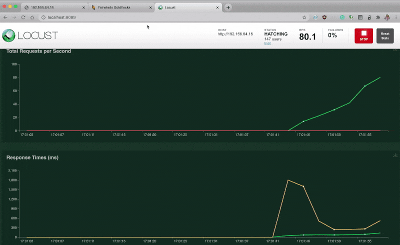
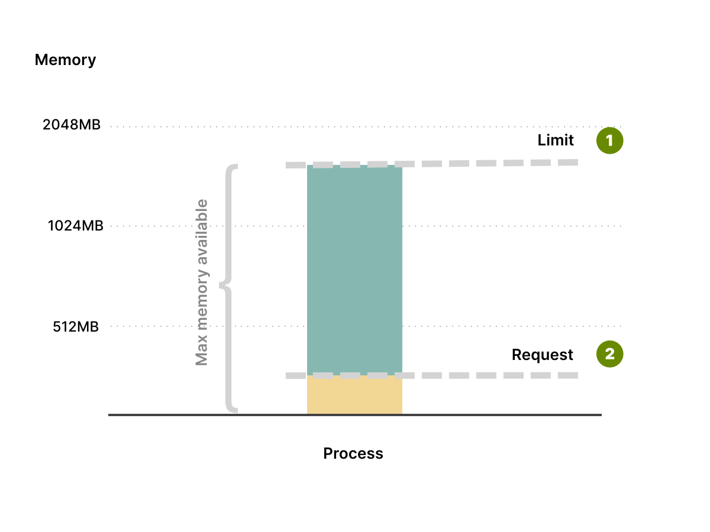
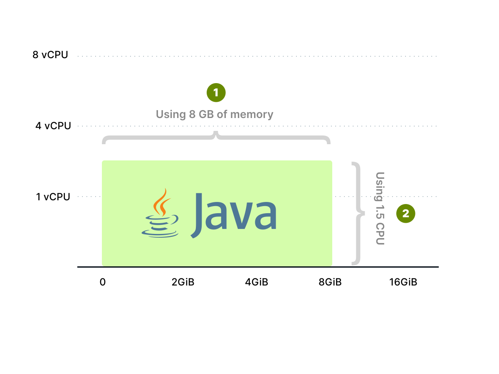
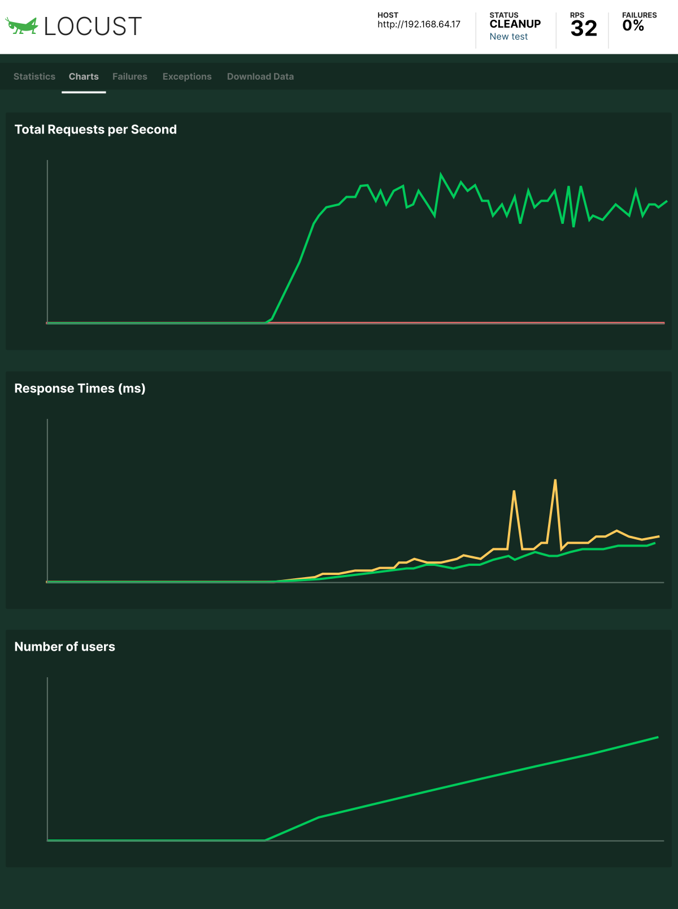
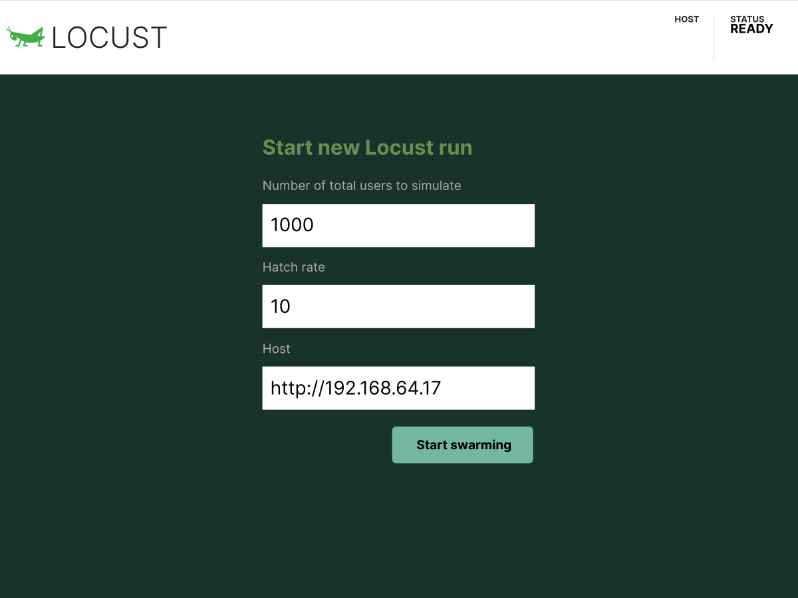
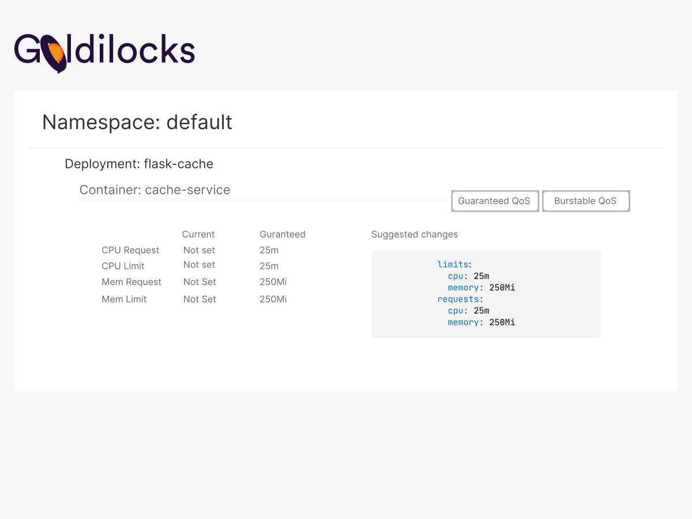

**TL;DR:** _In Kubernetes resource constraints are used to schedule the Pod in the right node, and it also affects which Pod is killed or starved at times of high load. In this blog, you will explore setting resource limits for a Flask web service automatically using the [Vertical Pod Autoscaler](https://github.com/kubernetes/autoscaler/tree/master/vertical-pod-autoscaler) and the [metrics server](https://github.com/kubernetes-sigs/metrics-server)._



There are two different types of resource configurations that can be set on each container of a pod.

They are **requests** and **limits**.

**Requests define the minimum amount of resources that containers need.**

If you think that your app requires at least 256MB of memory to operate, this is the request value.

The application can use more than 256MB, but kubernetes guarantees a minimum of 256MB to the container.

On the other hand, **limits define the max amount of resources that the container can consume.**

Your application might require at least 256MB of memory, but you might want to be sure that it doesn't consume more than 1GB of memory.

_That's your limit._

Notice how your application has 256MB of memory guaranteed, but it can grow up until 1GB of memory.

After that, it is stopped or throttled by Kubernetes.



Setting limits is useful to stop over-committing resources and protect other deployments from resource starvation.

You might want to prevent a single rogue app from using all resources available and leaving only breadcrumbs to the rest of the cluster.

_If limits are used to stop your greedy containers, what are requests for?_

**Requests affect how the pods are scheduled in Kubernetes.**

When a Pod is created, the scheduler finds the nodes which can accommodate the Pod.

_But how does it know how many resources it needs?_

The app hasn't started yet, and the scheduler can't inspect memory and CPU usage at this point.

_This is where requests come in._

The scheduler reads the requests for each container in your Pods, aggregates them and finds the best node that can fit that Pod.

Some applications might use more memory than CPU.

Others the opposite.

It doesn't matter, Kubernetes checks the requests and finds the best Node for that Pod.



You could visualise Kubernetes scheduler as a skilled Tetris player.

For each block, Kubernetes finds the best Node to optimise your resource utilisation.

CPU and memory requests define the minimum length and width of each block, and based on the size kubernetes finds the best Tetris board to fit the block.

```animation
{
  "description": "Kubernetes is the best tetris player",
  "animation": "assets/tetris.svg",
  "fallback": "assets/tetris.svg"
}
```

_Without length and width the block becomes a dot, and how does one play Tetris with dots (sizeless blocks)?_

_Where is the fun when you can fit an infinite number of blocks in your Tetris board?_

And if your Tetris board is a real server, you might end up over-committing resources.

_Let's play Tetris with Kubernetes with an example._

You can create an interactive busybox pod with CPU and memory requests using the following command:

```terminal|command=1-4|title=bash
kubectl run -i --tty --rm busybox \
  --image=busybox \
  --restart=Never \
  --requests='cpu=50m,memory=50Mi' -- sh
```

_What do these numbers actually mean?_

## Understanding CPU and Memory units

Imagine you have a computer with a single CPU and wish to run three containers in it.

You might want to assign a third of CPU each — or 33.33%.

**In Kubernetes, the CPU is not assigned in percentages, but in thousands (also called millicores or millicpu).**

[One CPU is equal to 1000 millicores.](https://kubernetes.io/docs/concepts/configuration/manage-resources-containers/#meaning-of-cpu)

If you wish to assign a third of a CPU, you should assign 333Mi (millicores) to your container.

** memory is a bit more straightforward, and it is measured in bytes.**

Kubernetes accepts both SI notation (K,M,G,T,P,E) and Binary notation (Ki,Mi,Gi,Ti,Pi,Ei) for memory definition.

To limit memory at 256MB, you can assign 268.4M (SI notation) or 256Mi (Binary notation).

> If you are confused on which notation to use, stick to the Binary notation as it is the one used widely to measure hardware.

Now that you have created the Pod with resource requests, let's explore the memory and CPU used by the processes.

## Exploring memory and CPU requests

Defining memory and requests for CPU and memory doesn't mean that the container has to use the allocated resource.

In the previous example, you launched an idle busybox container.

It's currently using close to zero memory and CPU.

_But how do you know for sure?_

_Is there a component in Kubernetes that measures the actual CPU and memory?_

Kubernetes has several components designed to collect metrics, but two are essential in this case:

1. The [kubelet collects metrics such as CPU and memory](https://rancher.com/blog/2019/native-kubernetes-monitoring-tools-part-1#cadvisor) from your Pods.
1. The [metric server](https://github.com/kubernetes-sigs/metrics-server) collects and aggregates metrics from all kubelets.

Inspecting the kubelet for metrics isn't convenient — particularly if you run clusters with thousands of nodes.

When you want to know the memory and CPU usage for your pod, you should retrieve the data from the metric server.

> Not all clusters come with metrics server enabled by default. For example, EKS (the managed Kubernetes offering from Amazon Web Services) does not come with a metrics server installed by default.

_How can you check the actual CPU and memory usage with the metrics server?_

Since the busybox container isn't idle, let's artificially generate a few metrics.

Let's increase fill the memory with:

```terminal|command=1|title=bash
dd if=/dev/zero of=/dev/shm/fill bs=1k count=1024k
```

And let's increase the CPU usage with a loop:

```terminal|command=1|title=bash
while true; do true; done
```

In another terminal run the following command to inspect the resources used by the pod:

```terminal|command=1|title=bash
kubectl top pods
NAME      CPU(cores)   MEMORY(bytes)
busybox   462m         64Mi
```

From the output you can see that the memory utilised is 64Mi and the total CPU used is 462m which is greater than 50Mi of memory and 50 millicores requested.

The `kubectl top` command consumes the metrics exposed by the metric server.

Also, notice how the current values for CPU and memory are greater than the requests that you defined earlier.

And that's fine because the Pod can use more memory and CPU than what is defined in the requests.

_However, why is the container consuming only 400 millicores?_

Since the Pod is running an infinite loop, you might expect it to consume 100% of the available CPU (or 1000 millicores).

_Why is it not running at 100% CPU?_

When you define a CPU request in Kubernetes, that doesn't only describe the minimum amount of CPU but also establishes a share of CPU for that container.

All containers share the same CPU, but they are nice to each other, and they split the times based on their quotas.

Let's have a look at an example.

Imagine having three containers that have a CPU request set to 60 millicores, 20 millicores and 20 millicores.

_The total request is only 100 millicores, but what happens when all three processes start using as much CPU as possible (i.e. 100%)?_

If you have a single CPU, the processes will grow to 600 millicores, 200 millicores and 200 millicores (i.e. 60%, 20%, 20%).

All of them increased by a factor of 10x until they used all the available CPU.

If you have 2 CPUs (or 2000 millicores), they will use 1200 millicores, 400 millicores and 400 millicores (i.e. 60%, 20%, 20%).

**As they compete for resources, they are careful to share the CPU based on the quota assigned.**

In the previous example, the Pod is consuming 400 millicores because it has to compete for CPU time with the rest of the processes in the cluster such as the Kubelet, the API server, the controller manager, etc.

Let's have a look at another example to understand CPU shares better.

## CPU shares

Please notice that the following example is executed in a system with 2 vCPU.

To see the number of cores in your system, you can use:

```terminal|command=1|title=bash
docker info | grep CPUs
```

Now, let's run a container that consumes all available CPU and assign it a CPU share of 1024.

```terminal|command=3|title=bash
docker run -d --rm --name stresser-1024 \
  --cpu-shares 1024 \
  containerstack/cpustress --cpu 2
```

The container [containerstack/cpustress container](https://github.com/containerstack/docker-cpustress) is engineered to consume all available CPU, but it has to how many CPU are currently available (in this case is only 2 `--cpu 2`).

The command uses a few flags:

- `--rm` to delete the container once it's stopped.
- `--name` to assign a friendly name to the container.
- `-d` to run the container in the background as a daemon.
- `--cpu-shares` defines the weight of the container which is used by Docker to give the container CPU time.

You can run `docker stats` to see the resource utilised by the container:

```terminal|command=1|title=bash
docker stats
CONTAINER ID        NAME                CPU %               MEM USAGE / LIMIT     MEM %
446bde82ad8a        stresser-1024       198.01%             4.562MiB / 3.848GiB   0.12%
```

The container is using 198% of the available CPU — all of it considering that you have only 2 cores available.

_But how can the CPU usage be more than 100%?_

Here the CPU percentage is the sum of the percentage per core.

If you are running the same example in a 6 vCPU machine, it might be around 590%.

Let's create another container with CPU share of 2048.

```terminal|command=1|title=bash
docker run -d --rm --name stresser-2048 \
  --cpu-shares 2048 \
  containerstack/cpustress --cpu 2
```

_Is there enough CPU to run a second container?_

You should inspect the container and check.

```terminal|command=1|title=bash
docker stats
CONTAINER ID        NAME                CPU %               MEM USAGE / LIMIT     MEM %
270ac57e5cbf        stresser-2048       133.27%             4.605MiB / 3.848GiB   0.12%
446bde82ad8a        stresser-1024        66.66%             4.562MiB / 3.848GiB   0.12%
```

The `docker stats` command shows that the stresser-2048 container uses 133% of CPU, and the stresser-1024 container uses 66%.

When two containers are running in a 2 vCPU node with CPU shares of 2048 and 1024, the stresser-2048 container gets twice the share of the available CPU.

The two containers are assigned 133.27% and 66.66% share of the available CPU resource, respectively.

In other words, **processes are assigned CPU shares, and when they compete for CPU time**, they compare their shares and increase their usage accordingly.

_Can you guess what happens when you launch a third container that is as CPU hungry as the first two combined?_

```terminal|command=1|title=bash
docker run -d --name stresser-3072 \
  --cpu-shares 3072 \
  containerstack/cpustress --cpu 2
```

Let's have a look at the metrics:

```terminal|command=1|title=bash
docker stats
CONTAINER ID        NAME                CPU %               MEM USAGE / LIMIT     MEM %
270ac57e5cbf        stresser-3072       101.17%             4.605MiB / 3.848GiB   0.12%
446bde82ad8a        stresser-2048        66.31%             4.562MiB / 3.848GiB   0.12%
e5cbfs82270a        stresser-1024        32.98%             4.602MiB / 3.848GiB   0.12%
```

The third container is using close to a 100% CPU, whereas the other two use ~66% and ~33%.

Since all containers want to use all available CPU, they will divide the 2 CPU cores available according to their shares (3072, 2048, and 1024).

So the total shares are 6, and each is equal to 33.33% CPU per share.

So the CPU time is shared as follows:

- 1024 share (or 33.33% CPU) to the first container.
- 2048 shares (or 33.33% times two CPU) to the second container.
- 3072 shares (or 33.33% times three CPU) to the third container.

Now that you're familiar with CPU and memory requests let's have a look at limits.

## Understanding limits

Limits define the hard limit for the container and make sure the pod doesn't consume all resources in the Node.

_Let's imagine you have an application with a limit of 250Mi of memory._

When the application uses more than the limit, [Kubernetes kills the process with an OOMKilling (Out of Memory Killing) message.](https://kubernetes.io/docs/tasks/configure-pod-container/assign-memory-resource/#if-you-do-not-specify-a-memory-limit)

In other words, **the process doesn't have an upper memory limit, and it could cross the threshold of 250Mi.**

However, as soon as that happens, the process is killed.

Now that you know what happens to memory limits let's have a look at CPU limits.

_Is the Pod killed when it's using more CPU than the limit?_

No, it's not.

In reality, **CPU is measured as a function of time.**

When you say 1 CPU limit, what you really mean is that the app runs up to 1 CPU second, every second.

If your application has a single thread, you will consume at most 1 CPU second every second.

**However, if your application uses two threads, it is twice as fast, and you can complete the work in half of the time.**

Also, the CPU quota is used in half of the time.

If you have two threads, you can consume 1 CPU second in 0.5 seconds.

Eight threads can consume 1 CPU second in 0.125 seconds.

_What happens for the remaining 0.875 seconds?_

Your process has to wait for the next CPU slot available, and the CPU is throttled.

```slideshow
{
  "description": "CPU limits",
  "slides": [
    {
      "image": "assets/cpu-limits-1.svg",
      "description": "In the following scenario there are three processes with 1, 2 and 8 threads."
    },
    {
      "image": "assets/cpu-limits-2.svg",
      "description": "The single thread process consumes 1 CPU second every second."
    },
    {
      "image": "assets/cpu-limits-3.svg",
      "description": "The process with two threads consumes the same quota of 1 CPU second in half of the time."
    },
    {
      "image": "assets/cpu-limits-4.svg",
      "description": "The process with eight threads consumes the available quota in 1/8 of the time."
    },
    {
      "image": "assets/cpu-limits-5.svg",
      "description": "In the next second, the quota is allocated, and the processes can consume the new allocation."
    },
    {
      "image": "assets/cpu-limits-6.svg",
      "description": "Notice how the last process is frequently throttled as it consumes its allocation too quickly."
    }
  ]
}
```

Let's revisit the example discussed earlier to understand how CPU limits differ from requests.

Now, let's run the same cpustress image with half a CPU.

You can set a CPU limit with the `--cpus` flag.

```terminal|command=1|title=bash
docker run --rm -d --name stresser-.5 \
  --cpus .5 \
  containerstack/cpustress --cpu 2
```

Run `docker stats` to inspect the CPU usage with:

```terminal|command=1|title=bash
docker stats
CONTAINER ID        NAME                CPU %               MEM USAGE / LIMIT     MEM %
c445bbdb46aa        stresser-.5         49.33%              4.672MiB / 3.848GiB   0.12%
```

The container only uses half a CPU core.

_Of course, that's the limit._

Let's repeat the experiment with a full CPU:

```terminal|command=1|title=bash
docker run --rm -d --name stresser-1 \
  --cpus 1 \
  containerstack/cpustress --cpu 2
```

Run docker stats to inspect the cpu usage with:

```terminal|command=1|title=bash
docker stats
CONTAINER ID        NAME                CPU %               MEM USAGE / LIMIT     MEM %
9c64c2d99be6        stresser-1          105.34%             4.648MiB / 3.848GiB   0.12%
c445bbdb46aa        stresser-.5         51.25%              4.609MiB / 3.848GiB   0.12%
```

Unlike CPU requests, the limits of one container do not affect the CPU usage of other containers.

_That's precisely what happens in Kubernetes as well._

Setting the CPU limit set a max on how CPU a process can use.

**Please notice that setting limits doesn't make the container see only the defined amount of memory or CPU.**

The container can see the complete resource of the node to which it is scheduled.

If the application is designed in a way to use the resources available to determine the amount of memory to use or number of threads to run, it can lead to a fatal issue.

One such example is when you set the memory limits for a container running a JAVA application, and the JVM uses the amount of memory in the node to set the Heap size.

Now that you understand how requests and limits work, it's time to put them in practice.

_How do find the right value for CPU and memory requests and limits?_

Let's explore the CPU and memory used by a real app.

## Real-world limits and requests

You will use a simple cache service which has two endpoints, one to cache the data and another for retrieving it.

The service is written in Python using the Flask framework.

> You can find [the complete code for this application here.](https://github.com/yolossn/flask-cache)

Before you start, make sure that your cluster has the metrics server installed.

If you're using minikube, you can enable the metrics server with:

```terminal|command=1|title=bash
minikube addons enable metrics-server
```

You might also need an Ingress controller to route the traffic to the app.

In minikube, you can enable the [ingress-nginx controller](https://github.com/kubernetes/ingress-nginx) with:

```terminal|command=1|title=bash
minikube addons enable ingress
```

You can verify that the ingress and metrics servers are installed correctly with:

```terminal|command=1|title=bash
kubectl get pods --all-namespaces
NAMESPACE     NAME                                        READY   STATUS
kube-system   coredns-66bff467f8-nclrr                    1/1     Running
kube-system   etcd-minikube                               1/1     Running
kube-system   ingress-nginx-controller-69ccf5d9d8-n6lqp   1/1     Running
kube-system   kube-apiserver-minikube                     1/1     Running
kube-system   kube-controller-manager-minikube            1/1     Running
kube-system   kube-proxy-cvkcg                            1/1     Running
kube-system   kube-scheduler-minikube                     1/1     Running
kube-system   metrics-server-7bc6d75975-54twv             1/1     Running
```

It's time to deploy the application.

You can use the following YAML file:

```yaml|title=deployment.yaml
apiVersion: apps/v1
kind: Deployment
metadata:
  name: flask-cache
spec:
  replicas: 1
  selector:
    matchLabels:
      name: flask-cache
  template:
    metadata:
      labels:
        name: flask-cache
    spec:
      containers:
        - name: cache-service
          image: xasag94215/flask-cache
          ports:
            - containerPort: 5000
              name: rest
---
apiVersion: v1
kind: Service
metadata:
  name: flask-cache
spec:
  selector:
    name: flask-cache
  ports:
    - port: 80
      targetPort: 5000
---
apiVersion: networking.k8s.io/v1beta1
kind: Ingress
metadata:
  name: flask-cache
spec:
  rules:
  - http:
      paths:
      - backend:
          serviceName: flask-cache
          servicePort: 80
        path: /
```

You might recognise the three components:

1. The Deployment definition with a Pod template.
1. A Service to route traffic to the Pods.
1. An Ingress manifests to route external traffic to the Pods.

You can submit the resources with:

```terminal|command=1|title=bash
kubectl apply -f deployment.yaml
```

If the metrics server is installed correctly, you should be able to inspect the memory and CPU consumption for the Pod with:

```terminal|command=1|title=bash
kubectl top pods
NAME                           CPU(cores)   MEMORY(bytes)
flask-cache-85b94f6865-tvbg8   6m           150Mi
```

Please notice that the container in the Pod does not define requests or limits for CPU or memory at the moment.

You can finally access the app by visiting the cluster IP address:

```terminal|command=1|title=bash
minikube ip
```

Open your browser on `http://<minikube ip>` and you should be greeted by the running application.

Now that you have the application running, it's time to find the right value for requests and limits.

But before you dive into the tooling needed, let's lay down the plan.

## Finding the right requests and limits

**Requests and limits depend on how much memory and CPU the application uses.**

Those values are also affected by how the application s used.

An application that serves static pages might have a memory and CPU mostly static.

However, an application that stores documents in the database might behave differently as more traffic is ingested.

**The best way to decide requests and limits for an application is to observe its behaviour at runtime.**

So you will need:

- A mechanism to programmatically generate traffic for your application.
- A mechanism to collect metrics and decide how to derive requests and limits for CPU and memory.

Let's start with generating the traffic.

## Generating traffic with Locust

There are many tools available to load testing apps such as [ab](https://httpd.apache.org/docs/2.4/programs/ab.html), [k6](https://github.com/loadimpact/k6), [BlazeMeter](https://www.blazemeter.com/) etc.

In this tutorial, you will use [Locust — an open-source load testing tool.](https://github.com/locustio/locust)



Locust includes a convenient dashboard where you can inspect the load traffic generated as well as see the performance of your app in real-time.

In Locust, you can generate traffic by writing Python scripts.

Writing code is ideal in this case because you can simulate calls to the cache service and create and retrieve the cached value from the app.

The following script does just that:

```py|title=load_test.py
from locust import HttpUser, task, constant
import json
import uuid
import random

class cacheService(HttpUser):

    wait_time = constant(1)
    ids = []

    @task
    def create(self):
        id = uuid.uuid4()
        payload = {"username":str(id)}
        headers = {'content-type': 'application/json'}
        resp = self.client.post("/cache/new", data=json.dumps(payload),headers=headers)
        if resp.status_code == 200:
            out = resp.json()
            cache_id = out["_id"]
            self.ids.append(cache_id)

    @task
    def get(self):
        if len(self.ids) == 0:
            self.create()
        else:
            rid = random.choice(self.ids)
            self.client.get(f"/cache/{rid}")
```

Even if you're not proficient in Python, you might recognise the two blocks that start with `@task`.

The first block creates an entry in the cache.

The second block retrieves the id from the cache.

The load testing script executed by Locust will write and retrieve items from the Flask service using this code.

If you save the file locally, you can start Locust as container with:

```terminal|command=1|title=bash
docker run -p 8089:8089 -v $PWD:/mnt/locust locustio/locust -f /mnt/locust/load_test.py
```

When it starts, the container binds on port 8089 on your computer.

You can open your browser on <http://localhost:8089> to access the web interface.



_It's time to start the first test!_

You should simulate 1000 users with a hatch rate of 10.

As the URL of the app, you should use the same URL that was exposed by the cluster.

If you forgot, you could retrieve the IP address of the cluster with:

```terminal|command=1|title=bash
minikube ip
```

The host field should be `http://<minikube ip>`.

Click on start and switch over to the graph section.

**The real-time graph shows the requests per second received by the app, as well as requests per second, failure rate, response codes, etc.**

Excellent, now that you have a mechanism to generate load, it's time to take a look at the application.

_Has the CPU and memory increased?_

Let's have a look:

```terminal|command=1|title=bash
kubectl top pods
NAME                                     CPU(cores)   MEMORY(bytes)
flask-cache-79bb7c7d79-lpqm5             461m         182Mi
```

The application is under load, and it's using CPU and memory to respond to the traffic.

The app doesn't have requests and limits yet.

_Is there a way to collect those metrics and use them to compute a value for requests and limits?_

## Analysing requests and limits for live apps

It's usually common to have a metrics server and a database to store your metrics.

If you can collect all of the metrics in a database, you could take the average, max and min of the CPU and memory and extrapolate requests and limits.

You could then use those values in your Pod definitions.

_But there's a quicker way._

The SIG-autoscaling (the group in charge of looking after the autoscaling part of Kubernetes) developed a tool that can do that automatically: the [Vertical Pod Autoscaler (VPA)](https://github.com/kubernetes/autoscaler/tree/master/vertical-pod-autoscaler).

The Vertical Pod Autoscaler is a component that you install in the cluster and that estimates the correct requests and limits of a Pod based on the load.

In other words, you don't have to come up with an algorithm to extrapolate limits and requests.

[The Vertical Pod Autoscaler applies a statistical model](https://github.com/kubernetes/community/blob/master/contributors/design-proposals/autoscaling/vertical-pod-autoscaler.md#recommendation-model) to the data collected by the metrics server.

So as long as you have:

1. Traffic hitting the application
1. A metrics server installed and
1. The Vertical Pod Autoscaler (VPA) installed in your cluster

You don't need to come up with requests and limits for CPU and memory.

**The Vertical Pod Autoscaler (VPA) does that for you!**

Let's have a look at how it works.

First, you should install the Vertical Pod Autoscaler.

You can download the code from the official repository.

```terminal|command=1,2|title=bash
git clone https://github.com/kubernetes/autoscaler.git
cd autoscaler/vertical-pod-autoscaler
```

You can install the autoscaler in your cluster with the following command:

```terminal|command=1|title=bash
./hack/vpa-up.sh
```

The script creates several resources in Kubernetes, but, more importantly, creates a Custom Resource Definition (CRD).

The new Custom Resource Definition (CRD) is called `VerticalPodAutoscaler`, and you can use it to track your Deployments.

So if you want to the Vertical Pod Autoscaler (VPA) to estimate limits and requests for your Flask app, you should create the following YAML file:

```yaml|highlight=8-9|title=vpa.yaml
apiVersion: "autoscaling.k8s.io/v1beta2"
kind: VerticalPodAutoscaler
metadata:
  name: flask-cache
spec:
  targetRef:
    apiVersion: "apps/v1"
    kind: Deployment
    name: flask-cache
  resourcePolicy:
    containerPolicies:
      - containerName: '*'
        minAllowed:
          cpu: 10m
          memory: 50Mi
        maxAllowed:
          cpu: 1
          memory: 500Mi
        controlledResources: ["cpu", "memory"]
```

You can submit the resource to the cluster with:

```terminal|command=1|title=bash
kubectl apply -f vpa.yaml
```

It might take a few minutes before the Vertical Pod Autoscaler (VPA) can predict values for your Deployment.

Once it's ready you can query the `vpa` object with:

```terminal|command=1|title=bash
kubectl describe vpa flask-cache
# more output
Status:
  Conditions:
    Last Transition Time:  2020-09-01T06:52:21Z
    Status:                True
    Type:                  RecommendationProvided
  Recommendation:
    Container Recommendations:
      Container Name:  cache-service
      Lower Bound:
        Cpu:     25m
        Memory:  60194k
      Target:
        Cpu:     410m
        Memory:  262144k
      Uncapped Target:
        Cpu:     410m
        Memory:  262144k
      Upper Bound:
        Cpu:     1
        Memory:  500Mi
```

In the lower part of the output, the autoscaler has three sections:

1. **Lower bound** — the minimum resource recommended for the container.
1. **Uncapped Target** — the previous recommendation from the autoscaler.
1. **Upper Bound** — the maximum resource recommended for the container.

In this case, the recommended numbers are a bit skewed to the lower end because you haven't load test the app for a sustained period.

You can repeat the experiment with Locust and keep inspecting the Vertical Pod Autoscaler (VPA) recommendation.

Once the recommendations are stable, you can apply them back to your deployment.

```yaml|highlight=22-27|title=deployment.yaml
apiVersion: apps/v1
kind: Deployment
metadata:
  name: flask-cache
spec:
  replicas: 1
  selector:
    matchLabels:
      name: flask-cache
  template:
    metadata:
      labels:
        name: flask-cache
    spec:
      containers:
        - name: cache-service
          image: xasag94215/flask-cache
          ports:
            - containerPort: 5000
              name: rest
            resources:
              requests:
                cpu: 25m
                memory: 64Mi
              limits:
                cpu: 410m
                memory: 512Mi
```

You can use the _Lower bound_ as your requests and the _Upper bound_ as your limits.

**Great!**

You just set requests and limits for a brand new application even if you were not familiar with it.

You could extend the same techniques to your apps and set the right requests and limits even if you haven't used them before.

## Bonus: visualising limits and requests recommendations

_Inspecting the VPA object is a bit annoying._

If you prefer a visual tool to inspect the limit and request recommendations, you can install the [Goldilocks dashboard.](https://github.com/FairwindsOps/goldilocks)



The Goldilocks dashboard creates VPA objects and makes the recommendations available through a web interface.

_Let's install it and see how it works._

Since Goldilocks manages the Vertical Pod Autoscaler (VPA) object on your behalf, let's delete the existing Vertical Pod Autoscaler with:

```terminal|command=1|title=bash
kubectl delete vpa flask-cache
```

Excellent, let's install the dashboard next.

Goldilocks is packaged as a Helm chart.

So you should head over to the [official website and download Helm.](https://helm.sh/docs/intro/install/)

You can verify that Helm is installed correctly by printing the version:

```terminal|command=1|title=bash
helm version
version.BuildInfo{Version:"v3.3.0"}
```

At this point you can install the dashboard with:

```terminal|command=1|title=bash
helm install goldilocks fairwinds-stable/goldilocks --set dashboard.service.type=NodePort
```

You can visit the dashboard by typing the following command:

```terminal|command=1|title=bash
minikube service goldilocks-dashboard
```

You should notice an empty page in your browser.

If you want Goldilocks to display Vertical Pod Autoscaler (VPA) recommendations, you should tag the namespace with a particular label:

```terminal|command=1|title=bash
kubectl label namespace default goldilocks.fairwinds.com/enabled=true
```

At this point, goldilocks creates the Vertical Pod Autoscaler (VPA) object for each Deployment in the namespace and displays a convenient recap in the dashboard.

_Time to load test the app with Locust._

If you repeat the experiment and flood the application with requests, you should be able to see the Goldilocks dashboard recommending limits and requests for your Pods.


## Summary

Defining requests and limits in your containers is hard.

Getting them right can be a daunting task unless you rely on a proven scientific model to extrapolate the data.

The Vertical Pod Autoscaler (VPA) paired with metrics server is an excellent combo to remove any sort of guesstimation from choosing requests and limits.

_But why stopping at the recommendations?_

If you don't want to update requests and limits after the Vertical Pod Autoscaler (VPA) recommendations, you can also configure the VPA to propagate the values to the Deployment automatically.

Using this setup, you can be sure that your Pods always have the right requests and limits as they are updated and adjusted in real-time.

If you wish to know more about the updater mechanism in the Vertical Pod Autoscaler (VPA), [you can read the official documentation.](https://github.com/kubernetes/autoscaler/tree/master/vertical-pod-autoscaler#components-of-vpa)
