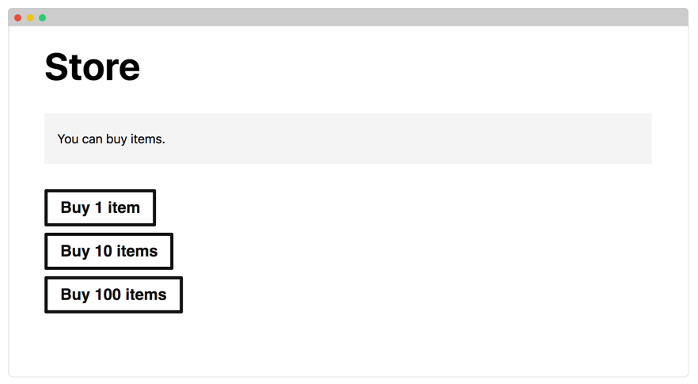
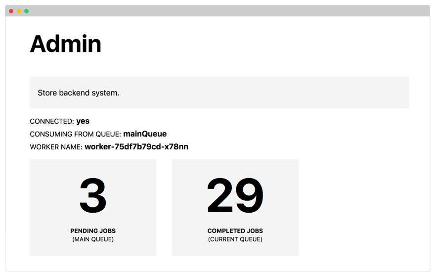
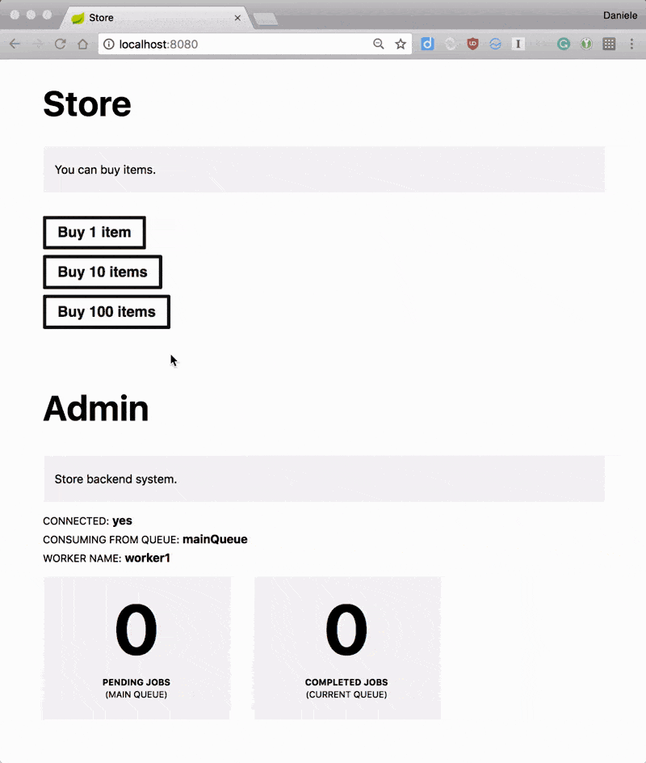

When you design and build applications at scale, you deal with two significant challenges: **scalability and robustness**.

You should design your service so that even if it is subject to intermittent heavy loads, it continues to operate reliably.

_Take the Apple Store as an example._

Every year millions of Apple customers preregister to buy a new iPhone.

That's millions of people all buying an item at the same time.

If you were to picture the Apple store's traffic as requests per second over time, this is what the graph could look like:

```include
<svg xmlns="http://www.w3.org/2000/svg" viewBox="0 0 842 580" id="spike">
  <defs>
    <linearGradient id="linearGradient-1" x1="50%" x2="50%" y1="100%" y2="33.643%">
      <stop offset="0%" stop-color="#4AC5B6"/>
      <stop offset="100%" stop-color="#9BEE50"/>
    </linearGradient>
  </defs>
  <g fill="none" fill-rule="evenodd">
    <g stroke-linejoin="round" transform="translate(99 81)">
      <path stroke="#778F9B" stroke-dasharray="1 6" d="M0 1L690 1M0 113L690 113M0 226L690 226"/>
      <path stroke="#000A12" stroke-linecap="round" stroke-width="2" d="M0,339 L690,339"/>
    </g>
    <path id="spike-animejs-line" fill="url(#linearGradient-1)" d="M99,413.200076 C99,413.200076 146.653617,413.200076 220.438137,413.200076 C294.222656,413.200076 381.706801,413.200076 451.124885,413.200076 C520.542969,413.200076 500.027344,413.200076 558.671392,413.200076 C617.315439,413.200076 678.21875,413.200076 789,413.200076 L789,419 L99,418.600698 L99,413.200076 Z"/>
    <text fill="#778F9B" font-size="16" letter-spacing=".08" class="sans-serif">
      <tspan x="705.606" y="450">10:00 pm</tspan>
    </text>
    <text fill="#778F9B" font-size="16" letter-spacing=".08" class="sans-serif">
      <tspan x="587.606" y="450">08:00 pm</tspan>
    </text>
    <text fill="#778F9B" font-size="16" letter-spacing=".08" class="sans-serif">
      <tspan x="469.606" y="450">06:00 pm</tspan>
    </text>
    <text fill="#778F9B" font-size="16" letter-spacing=".08" class="sans-serif">
      <tspan x="351.606" y="450">05:00 pm</tspan>
    </text>
    <text fill="#778F9B" font-size="16" letter-spacing=".08" class="sans-serif">
      <tspan x="233.606" y="450">03:00 pm</tspan>
    </text>
    <text fill="#778F9B" font-size="16" letter-spacing=".08" class="sans-serif">
      <tspan x="115.606" y="450">01:00 pm</tspan>
    </text>
    <text fill="#778F9B" font-size="16" letter-spacing=".08" class="sans-serif">
      <tspan x="20.089" y="85">10k req/s</tspan>
    </text>
    <text fill="#778F9B" font-size="16" letter-spacing=".08" class="sans-serif">
      <tspan x="29.137" y="199">7k req/s</tspan>
    </text>
    <text fill="#778F9B" font-size="16" letter-spacing=".08" class="sans-serif">
      <tspan x="29.137" y="313">3k req/s</tspan>
    </text>
  </g>
</svg>
<script src="anime.min.js"></script>
<script src="isScrolledIntoView.js"></script>
<script>
(function() {
  const svg = document.querySelector('#spike')
  const wrapper = document.createElement('div')
  wrapper.classList = 'relative'
  const restart = document.createElement('div')
  restart.classList = 'restart'
  restart.innerHTML = '<span>Restart</span>'
  wrap(svg, wrapper)
  wrapper.appendChild(restart)
  const basicTimeline = anime.timeline({
    autoplay: false,
  });
  basicTimeline
  .add({
    begin: function() {
      wrapper.onclick = function() {}
      restart.classList.add('inactive')
    }
  })
  .add({
    targets: '#spike-animejs-line',
    d: 'M99,412.59749 C99,412.59749 146.283879,412.510656 220.438137,410.089443 C294.592394,407.668229 400.898543,422.509307 451.124885,356.985465 C501.351227,291.461624 505.548577,80.4053541 558.671392,109.788314 C611.794206,139.171273 677.162757,427.71686 789,413.200076 L789,419 L99,418.600698 L99,412.59749 Z',
    easing: 'easeOutExpo',
  })
  .add({
    complete: function() {
      wrapper.onclick = basicTimeline.restart
      restart.classList.remove('inactive')
    }
  })
  wrapper.onclick = basicTimeline.restart
  onScrollIntoView(svg, function() {
    setTimeout(basicTimeline.play, 1000)
  });
  function wrap(el, wrapper) {
    el.parentNode.insertBefore(wrapper, el);
    wrapper.appendChild(el);
  }
})();
</script>
```

Now imagine you're tasked with the challenge of building such application.

**You're building a store where users can buy their favourite items.**

You build a microservice to render the web pages and serving the static assets.

You also build a backend REST API to process the incoming requests.

You want the two components to be separated because with the same REST API you could serve the website and mobile apps.

```include
<svg xmlns="http://www.w3.org/2000/svg" viewBox="0 0 800 553" id="api">
  <g fill="none" fill-rule="evenodd">
    <g transform="translate(75 48)">
      <path fill="#EEE" d="M190,165.953639 C190,167.00106 189.405094,167.85 188.670949,167.85 L1.32905119,167.85 C0.594906367,167.85 0,167.00106 0,165.953639 L0,6.75 C-4.56538782e-16,3.02207794 3.02207794,1.57298659e-15 6.75,8.8817842e-16 L183.25,8.8817842e-16 C186.977922,2.03370247e-16 190,3.02207794 190,6.75 L190,165.953639 Z"/>
      <path fill="#CCC" d="M6.75,0 L183.25,0 C186.977922,-6.84808173e-16 190,3.02207794 190,6.75 L190,31.05 L0,31.05 L0,6.75 C-4.56538782e-16,3.02207794 3.02207794,6.84808173e-16 6.75,0 Z"/>
      <path fill="#E74C3C" d="M22.95,16.875 C22.95,20.2305054 20.2305054,22.95 16.875,22.95 C13.5194946,22.95 10.8,20.2305054 10.8,16.875 C10.8,13.5194946 13.5194946,10.8 16.875,10.8 C20.2305054,10.8 22.95,13.5194946 22.95,16.875"/>
      <path fill="#F1C40F" d="M44.55,16.875 C44.55,20.2305054 41.8305054,22.95 38.475,22.95 C35.1194946,22.95 32.4,20.2305054 32.4,16.875 C32.4,13.5194946 35.1194946,10.8 38.475,10.8 C41.8305054,10.8 44.55,13.5194946 44.55,16.875"/>
      <path fill="#2ECC71" d="M64.8,16.875 C64.8,20.2305054 62.0805054,22.95 58.725,22.95 C55.3694946,22.95 52.65,20.2305054 52.65,16.875 C52.65,13.5194946 55.3694946,10.8 58.725,10.8 C62.0805054,10.8 64.8,13.5194946 64.8,16.875"/>
    </g>
    <g fill="#CCC" transform="translate(400 96)">
      <path d="M4.19739292 102.827411L47.9702048 102.827411 47.9702048 24.9593909 4.19739292 24.9593909 4.19739292 102.827411zM26.2924693 115.505523C23.6433147 115.505523 21.4954488 113.360558 21.4954488 110.713645 21.4954488 108.06733 23.6433147 105.921766 26.2924693 105.921766 28.9416238 105.921766 31.0894898 108.06733 31.0894898 110.713645 31.0894898 113.360558 28.9416238 115.505523 26.2924693 115.505523zM31.1806331 19.0072792C31.1806331 19.6475939 30.6607561 20.1675127 30.0191546 20.1675127L22.1490428 20.1675127C21.5068417 20.1675127 20.9869646 19.6475939 20.9869646 19.0072792L20.9869646 18.9324061C20.9869646 18.2914924 21.5068417 17.7715736 22.1490428 17.7715736L30.0191546 17.7715736C30.6607561 17.7715736 31.1806331 18.2914924 31.1806331 18.9324061L31.1806331 19.0072792zM51.5679702 16.7233503C51.5679702 12.6706193 48.2796127 9.3857868 44.2225326 9.3857868L7.34543762 9.3857868C3.28835754 9.3857868 0 12.6706193 0 16.7233503L0 111.063452C0 115.116183 3.28835754 118.401015 7.34543762 118.401015L44.2225326 118.401015C48.2796127 118.401015 51.5679702 115.116183 51.5679702 111.063452L51.5679702 16.7233503zM126.019282 105.413152L120.137536 105.413152 84.7595097 105.413152 73.0925562 105.413152 72.9840236 13.1694969 84.7595097 13.1694969 120.137536 13.1694969 126.128415 13.1694969 126.019282 105.413152zM93.8702508 112.001984L94.0795209 112.001984 94.1274911 112.001984 94.8524408 112.001984 104.259398 112.001984 104.984348 112.001984 105.032318 112.001984 105.242188 112.001984C105.242188 112.001984 105.239189 112.131365 105.246985 112.130167 105.455655 112.158319 105.706899 112.416482 105.706899 112.891477L105.706899 114.435659C105.706899 114.435659 105.506024 116.000208 103.758709 116.195477 103.745517 116.207456 103.916411 116.194878 103.916411 116.194878L103.782694 116.194878 103.571625 116.194878 95.5402136 116.194878 95.3291447 116.194878 95.1960274 116.194878C95.1960274 116.194878 95.2200125 116.207456 95.2080199 116.195477 93.459506 116.000208 93.1147201 114.435659 93.1147201 114.435659L93.1147201 112.891477C93.1147201 112.400908 93.5074762 112.149933 93.7803067 112.127771 93.8228803 112.130167 93.8702508 112.001984 93.8702508 112.001984zM93.5200683 6.58066444C93.5200683 6.15478626 93.8654538 5.98167966 94.2929883 5.98167966L104.81945 5.98167966C105.246385 5.98167966 105.59237 6.15478626 105.59237 6.58066444 105.59237 7.00714159 105.246385 7.17964921 104.81945 7.17964921L94.2929883 7.17964921C93.8654538 7.17964921 93.5200683 7.00714159 93.5200683 6.58066444zM121.606024 2.49498931C121.114929 2.46024819 120.697588 2.42730403 120.09796 2.39435987L120.09796 2.38717205C113.502057 1.7714157 106.488214 1.56237002 99.5643141 1.60549692 94.5999976 1.57195378 89.5169547 1.6653954 84.7199343 1.94631926L84.7199343 2.04874565C82.321424 2.17872535 79.7688095 2.32966951 77.4134724 2.49498931 69.6267089 3.04066444 68.8879678 8.760969 68.961722 15.3354259L69.0150888 103.429314C68.8160125 110.003172 69.1973756 116.873527 77.5094128 117.577334 79.862951 117.776796 82.321424 117.954695 84.7199343 118.107436L84.7199343 118.241609C89.5169547 118.55368 94.5388356 118.664492 99.408411 118.630949 106.26875 118.682461 113.502057 118.442867 120.09796 117.763619L120.09796 117.689345C120.697588 117.651609 121.086746 117.616867 121.561052 117.577334 129.873089 116.873527 130.280236 110.003172 130.08116 103.429314L130.124333 15.3354259C130.198087 8.760969 129.392787 3.04066444 121.606024 2.49498931z"/>
      <path d="M181.687151,130.979695 L288.420857,130.979695 L288.420857,-10.3807107 L181.687151,-10.3807107 L181.687151,130.979695 Z M235.128957,143.657807 C232.479803,143.657807 230.331937,141.512843 230.331937,138.865929 C230.331937,136.219614 232.479803,134.074051 235.128957,134.074051 C237.778112,134.074051 239.925978,136.219614 239.925978,138.865929 C239.925978,141.512843 237.778112,143.657807 235.128957,143.657807 Z M293.817505,-18.6167513 C293.817505,-23.3307614 289.991881,-27.1522843 285.272812,-27.1522843 L184.835196,-27.1522843 C180.116127,-27.1522843 176.290503,-23.3307614 176.290503,-18.6167513 L176.290503,138.017766 C176.290503,142.731777 180.116127,146.553299 184.835196,146.553299 L285.272812,146.553299 C289.991881,146.553299 293.817505,142.731777 293.817505,138.017766 L293.817505,-18.6167513 Z" transform="rotate(90 235.054 59.7)"/>
    </g>
    <rect width="640" height="102" x="80.5" y="404.5" fill="#34302E" stroke="#7CB050" stroke-width="7"/>
    <g id="api-animejs-connection1" stroke="#EBA844" stroke-width="6" transform="translate(170 221)">
      <path d="M-1.36424205e-12,2.27373675e-13 L-1.36424205e-12,175.148437 L-1.36424205e-12,2.27373675e-13 Z"/>
    </g>
    <g id="api-animejs-connection2" stroke="#EBA844" stroke-width="6" transform="translate(427 222)">
      <path d="M-1.36424205e-12,2.27373675e-13 L-1.36424205e-12,175.148437 L-1.36424205e-12,2.27373675e-13 Z"/>
    </g>
    <g id="api-animejs-connection3" stroke="#EBA844" stroke-width="6" transform="translate(500 222)">
      <path d="M-1.36424205e-12,2.27373675e-13 L-1.36424205e-12,175.148437 L-1.36424205e-12,2.27373675e-13 Z"/>
    </g>
    <g id="api-animejs-connection4" stroke="#EBA844" stroke-width="6" transform="translate(639 222)">
      <path d="M-1.36424205e-12,2.27373675e-13 L-1.36424205e-12,175.148437 L-1.36424205e-12,2.27373675e-13 Z"/>
    </g>
    <text fill="#FFF" font-size="46" font-weight="bold" letter-spacing=".23" class="sans-serif">
      <tspan x="188.52" y="471">BACKEND REST API</tspan>
    </text>
  </g>
</svg>
<script src="anime.min.js"></script>
<script src="isScrolledIntoView.js"></script>
<script>
(function() {
  const svg = document.querySelector('#api')
  const basicTimeline = anime.timeline({
    autoplay: true,
    loop: true
  });
  basicTimeline
  .add({
    targets: '#api-animejs-connection2',
    opacity: [1, 0],
    easing: 'easeOutExpo',
  })
  .add({
    targets: '#api-animejs-connection3',
    opacity: [0, 1],
    easing: 'easeInExpo',
  })
  .add({
    targets: '#api-animejs-connection1',
    opacity: [1, 0],
    easing: 'easeOutExpo',
  })
  .add({
    targets: '#api-animejs-connection1',
    opacity: [0, 1],
    easing: 'easeInExpo',
  })
  .add({
    targets: '#api-animejs-connection2',
    opacity: [0, 1],
    easing: 'easeInExpo',
  })
  .add({
    targets: '#api-animejs-connection4',
    opacity: [1, 0],
    easing: 'easeOutExpo',
  })
  .add({
    targets: '#api-animejs-connection3',
    opacity: [1, 0],
    easing: 'easeOutExpo',
  })
  .add({
    targets: '#api-animejs-connection4',
    opacity: [0, 1],
    easing: 'easeInExpo',
  })
})();
</script>
<style>
#api-animejs-connection1 path,
#api-animejs-connection2 path,
#api-animejs-connection3 path,
#api-animejs-connection4 path {
  stroke-dasharray: 15;
  animation: dash 11s linear infinite;
}
@keyframes dash {
  to {
    stroke-dashoffset: 1000;
  }
}
</style>
```

Today turned out to be the big day, and your store goes live.

You decide to scale the application to four instances for the front-end and four instances for the backend because you predict the website to be busier than usual.

```include
<svg xmlns="http://www.w3.org/2000/svg" viewBox="0 0 800 751" id="normal-traffic">
  <g fill="none" fill-rule="evenodd">
    <g transform="translate(91 292)">
      <path fill="#EEE" d="M142.59998,129.582239 C142.59998,130.400102 142.153487,131.062983 141.602492,131.062983 L0.997487748,131.062983 C0.44649282,131.062983 0,130.400102 0,129.582239 L0,5.26499949 C-3.56100216e-16,2.35722057 2.35722057,9.41593452e-15 5.26499949,8.8817842e-15 L137.33498,0 C140.242759,1.49616086e-14 142.59998,2.35722057 142.59998,5.26499949 L142.59998,129.582239 Z"/>
      <path fill="#CCC" d="M5.26499949,0 L137.33498,0 C140.242759,-5.34150323e-16 142.59998,2.35722057 142.59998,5.26499949 L142.59998,24.2189977 L0,24.2189977 L0,5.26499949 C-3.56100216e-16,2.35722057 2.35722057,-3.54028096e-16 5.26499949,-8.8817842e-16 Z"/>
      <path fill="#E74C3C" d="M17.9009983,13.1624987 C17.9009983,15.7797927 15.7797927,17.9009983 13.1624987,17.9009983 C10.5452048,17.9009983 8.42399919,15.7797927 8.42399919,13.1624987 C8.42399919,10.5452048 10.5452048,8.42399919 13.1624987,8.42399919 C15.7797927,8.42399919 17.9009983,10.5452048 17.9009983,13.1624987"/>
      <path fill="#F1C40F" d="M34.7489967,13.1624987 C34.7489967,15.7797927 32.6277911,17.9009983 30.0104971,17.9009983 C27.3932031,17.9009983 25.2719976,15.7797927 25.2719976,13.1624987 C25.2719976,10.5452048 27.3932031,8.42399919 30.0104971,8.42399919 C32.6277911,8.42399919 34.7489967,10.5452048 34.7489967,13.1624987"/>
      <path fill="#2ECC71" d="M50.5439951,13.1624987 C50.5439951,15.7797927 48.4227896,17.9009983 45.8054956,17.9009983 C43.1882016,17.9009983 41.066996,15.7797927 41.066996,13.1624987 C41.066996,10.5452048 43.1882016,8.42399919 45.8054956,8.42399919 C48.4227896,8.42399919 50.5439951,10.5452048 50.5439951,13.1624987"/>
    </g>
    <g transform="translate(249 292)">
      <path fill="#EEE" d="M142.59998,129.582239 C142.59998,130.400102 142.153487,131.062983 141.602492,131.062983 L0.997487748,131.062983 C0.44649282,131.062983 0,130.400102 0,129.582239 L0,5.26499949 C-3.56100216e-16,2.35722057 2.35722057,9.41593452e-15 5.26499949,8.8817842e-15 L137.33498,0 C140.242759,1.49616086e-14 142.59998,2.35722057 142.59998,5.26499949 L142.59998,129.582239 Z"/>
      <path fill="#CCC" d="M5.26499949,0 L137.33498,0 C140.242759,-5.34150323e-16 142.59998,2.35722057 142.59998,5.26499949 L142.59998,24.2189977 L0,24.2189977 L0,5.26499949 C-3.56100216e-16,2.35722057 2.35722057,-3.54028096e-16 5.26499949,-8.8817842e-16 Z"/>
      <path fill="#E74C3C" d="M17.9009983,13.1624987 C17.9009983,15.7797927 15.7797927,17.9009983 13.1624987,17.9009983 C10.5452048,17.9009983 8.42399919,15.7797927 8.42399919,13.1624987 C8.42399919,10.5452048 10.5452048,8.42399919 13.1624987,8.42399919 C15.7797927,8.42399919 17.9009983,10.5452048 17.9009983,13.1624987"/>
      <path fill="#F1C40F" d="M34.7489967,13.1624987 C34.7489967,15.7797927 32.6277911,17.9009983 30.0104971,17.9009983 C27.3932031,17.9009983 25.2719976,15.7797927 25.2719976,13.1624987 C25.2719976,10.5452048 27.3932031,8.42399919 30.0104971,8.42399919 C32.6277911,8.42399919 34.7489967,10.5452048 34.7489967,13.1624987"/>
      <path fill="#2ECC71" d="M50.5439951,13.1624987 C50.5439951,15.7797927 48.4227896,17.9009983 45.8054956,17.9009983 C43.1882016,17.9009983 41.066996,15.7797927 41.066996,13.1624987 C41.066996,10.5452048 43.1882016,8.42399919 45.8054956,8.42399919 C48.4227896,8.42399919 50.5439951,10.5452048 50.5439951,13.1624987"/>
    </g>
    <g transform="translate(408 292)">
      <path fill="#EEE" d="M142.59998,129.582239 C142.59998,130.400102 142.153487,131.062983 141.602492,131.062983 L0.997487748,131.062983 C0.44649282,131.062983 0,130.400102 0,129.582239 L0,5.26499949 C-3.56100216e-16,2.35722057 2.35722057,9.41593452e-15 5.26499949,8.8817842e-15 L137.33498,0 C140.242759,1.49616086e-14 142.59998,2.35722057 142.59998,5.26499949 L142.59998,129.582239 Z"/>
      <path fill="#CCC" d="M5.26499949,0 L137.33498,0 C140.242759,-5.34150323e-16 142.59998,2.35722057 142.59998,5.26499949 L142.59998,24.2189977 L0,24.2189977 L0,5.26499949 C-3.56100216e-16,2.35722057 2.35722057,-3.54028096e-16 5.26499949,-8.8817842e-16 Z"/>
      <path fill="#E74C3C" d="M17.9009983,13.1624987 C17.9009983,15.7797927 15.7797927,17.9009983 13.1624987,17.9009983 C10.5452048,17.9009983 8.42399919,15.7797927 8.42399919,13.1624987 C8.42399919,10.5452048 10.5452048,8.42399919 13.1624987,8.42399919 C15.7797927,8.42399919 17.9009983,10.5452048 17.9009983,13.1624987"/>
      <path fill="#F1C40F" d="M34.7489967,13.1624987 C34.7489967,15.7797927 32.6277911,17.9009983 30.0104971,17.9009983 C27.3932031,17.9009983 25.2719976,15.7797927 25.2719976,13.1624987 C25.2719976,10.5452048 27.3932031,8.42399919 30.0104971,8.42399919 C32.6277911,8.42399919 34.7489967,10.5452048 34.7489967,13.1624987"/>
      <path fill="#2ECC71" d="M50.5439951,13.1624987 C50.5439951,15.7797927 48.4227896,17.9009983 45.8054956,17.9009983 C43.1882016,17.9009983 41.066996,15.7797927 41.066996,13.1624987 C41.066996,10.5452048 43.1882016,8.42399919 45.8054956,8.42399919 C48.4227896,8.42399919 50.5439951,10.5452048 50.5439951,13.1624987"/>
    </g>
    <g transform="translate(566 292)">
      <path fill="#EEE" d="M142.59998,129.582239 C142.59998,130.400102 142.153487,131.062983 141.602492,131.062983 L0.997487748,131.062983 C0.44649282,131.062983 0,130.400102 0,129.582239 L0,5.26499949 C-3.56100216e-16,2.35722057 2.35722057,9.41593452e-15 5.26499949,8.8817842e-15 L137.33498,0 C140.242759,1.49616086e-14 142.59998,2.35722057 142.59998,5.26499949 L142.59998,129.582239 Z"/>
      <path fill="#CCC" d="M5.26499949,0 L137.33498,0 C140.242759,-5.34150323e-16 142.59998,2.35722057 142.59998,5.26499949 L142.59998,24.2189977 L0,24.2189977 L0,5.26499949 C-3.56100216e-16,2.35722057 2.35722057,-3.54028096e-16 5.26499949,-8.8817842e-16 Z"/>
      <path fill="#E74C3C" d="M17.9009983,13.1624987 C17.9009983,15.7797927 15.7797927,17.9009983 13.1624987,17.9009983 C10.5452048,17.9009983 8.42399919,15.7797927 8.42399919,13.1624987 C8.42399919,10.5452048 10.5452048,8.42399919 13.1624987,8.42399919 C15.7797927,8.42399919 17.9009983,10.5452048 17.9009983,13.1624987"/>
      <path fill="#F1C40F" d="M34.7489967,13.1624987 C34.7489967,15.7797927 32.6277911,17.9009983 30.0104971,17.9009983 C27.3932031,17.9009983 25.2719976,15.7797927 25.2719976,13.1624987 C25.2719976,10.5452048 27.3932031,8.42399919 30.0104971,8.42399919 C32.6277911,8.42399919 34.7489967,10.5452048 34.7489967,13.1624987"/>
      <path fill="#2ECC71" d="M50.5439951,13.1624987 C50.5439951,15.7797927 48.4227896,17.9009983 45.8054956,17.9009983 C43.1882016,17.9009983 41.066996,15.7797927 41.066996,13.1624987 C41.066996,10.5452048 43.1882016,8.42399919 45.8054956,8.42399919 C48.4227896,8.42399919 50.5439951,10.5452048 50.5439951,13.1624987"/>
    </g>
    <g id="normal-traffic-animejs-connection4" stroke="#EBA844" stroke-width="7.8" transform="translate(638 426)">
      <path d="M-1.36424205e-12,2.27373675e-13 L-1.36424205e-12,103.892969 L-1.36424205e-12,2.27373675e-13 Z"/>
    </g>
    <g id="normal-traffic-animejs-connection3" stroke="#EBA844" stroke-width="7.8" transform="translate(479 426)">
      <path d="M-1.36424205e-12,2.27373675e-13 L-1.36424205e-12,103.892969 L-1.36424205e-12,2.27373675e-13 Z"/>
    </g>
    <g id="normal-traffic-animejs-connection2" stroke="#EBA844" stroke-width="7.8" transform="translate(321 426)">
      <path d="M-1.36424205e-12,2.27373675e-13 L-1.36424205e-12,103.892969 L-1.36424205e-12,2.27373675e-13 Z"/>
    </g>
    <g id="normal-traffic-animejs-connection1" stroke="#EBA844" stroke-width="7.8" transform="translate(162 426)">
      <path d="M-1.36424205e-12,2.27373675e-13 L-1.36424205e-12,103.892969 L-1.36424205e-12,2.27373675e-13 Z"/>
    </g>
    <g fill="#FFF" font-size="48.1" font-weight="bold" letter-spacing=".241" transform="translate(362 609)" class="sans-serif">
      <text>
        <tspan x="0" y="50">API</tspan>
      </text>
    </g>
    <g transform="translate(91 246)">
      <g fill-rule="nonzero" transform="translate(0 19.5)">
        <path fill="#D2D2D2" d="M619.449998,3.75781236 L619.449998,16.7578119 L0,16.7578119 L0,3.75781236 C-2.19814961e-16,1.96288699 1.45507451,0.507812481 3.24999988,0.507812481 L616.199998,0.507812481 C617.994923,0.507812481 619.449998,1.96288699 619.449998,3.75781236 Z"/>
        <rect width="2.6" height="2.6" x="4.55" y="3.9" fill="#A3A3A3"/>
        <rect width="2.6" height="2.6" x="8.45" y="3.9" fill="#A3A3A3"/>
        <rect width="2.6" height="2.6" x="12.35" y="3.9" fill="#A3A3A3"/>
      </g>
      <text fill="#4A4A4A" font-size="10.4" class="sans-serif">
        <tspan x="0" y="9">LOAD BALANCER</tspan>
      </text>
    </g>
    <g transform="translate(91 515)">
      <g fill-rule="nonzero" transform="translate(0 19.5)">
        <path fill="#D2D2D2" d="M619.449998,3.75781236 L619.449998,16.7578119 L0,16.7578119 L0,3.75781236 C-2.19814961e-16,1.96288699 1.45507451,0.507812481 3.24999988,0.507812481 L616.199998,0.507812481 C617.994923,0.507812481 619.449998,1.96288699 619.449998,3.75781236 Z"/>
        <rect width="2.6" height="2.6" x="4.55" y="3.9" fill="#A3A3A3"/>
        <rect width="2.6" height="2.6" x="8.45" y="3.9" fill="#A3A3A3"/>
        <rect width="2.6" height="2.6" x="12.35" y="3.9" fill="#A3A3A3"/>
      </g>
      <text fill="#4A4A4A" font-size="10.4" class="sans-serif">
        <tspan x="0" y="9">LOAD BALANCER</tspan>
      </text>
    </g>
    <g transform="translate(317 36)">
      <g fill="#B8E986" transform="translate(54.6 133.9)">
        <polygon points="28.08 102.4 0 51.7 56.16 51.7"/>
        <polygon points="20.28 0 35.88 0 35.88 88.36 20.28 88.36"/>
      </g>
      <g>
        <path fill="#151D38" fill-rule="nonzero" d="M0,134.382844 L0.0293950462,79.0721609 C0.030015802,77.8576584 1.00235261,76.8734429 2.20157625,76.8734429 C16.2282079,76.8723039 30.2548396,76.8723039 44.2814713,76.8723039 C45.1503439,76.5266121 44.8400323,76.3066264 44.7159076,76.0866407 C42.0161963,71.5612212 40.24742,66.6901098 39.5647343,61.4104537 C38.0442073,49.3112416 41.4266042,38.7833558 49.5567692,29.7639432 C50.0222367,29.2611188 50.4877041,28.789721 50.9842028,28.3183231 C51.3876079,27.9097783 51.3876079,27.9097783 51.0152339,27.53266 C49.7429562,26.3070255 48.5948031,24.9556849 47.632837,23.4472117 C45.4606555,19.9588675 44.2504401,16.156258 44.1573466,12.0079567 C44.1263155,10.9708814 44.3435336,10.8451753 45.2744686,11.3165732 C46.2674658,11.8193976 47.2914942,12.2593689 48.377585,12.6050607 C48.5017096,10.7823223 48.2844915,9.27384908 48.2534603,7.73394936 C48.2534603,7.16827192 48.2224292,6.63402099 48.2534603,6.06834355 C48.2534603,5.28268043 48.5327408,5.09412128 49.2154264,5.5026661 C50.3015172,6.1311966 51.3876079,6.69687404 52.535761,7.16827192 C53.2184466,7.45111064 53.2184466,7.45111064 53.1563843,6.69687404 C52.9701973,4.71700298 52.9391661,2.73713192 53.1563843,0.757260861 C53.3425712,0.00302426666 53.6839141,-0.122681832 53.9321634,0.097303841 C54.1183504,0.254436465 54.242475,0.474422138 54.3976308,0.662981287 C56.7870305,3.67992767 59.4557106,6.3826088 62.6519205,8.55103901 C65.4447253,10.4366305 68.4547482,11.4737058 71.8061139,11.5051323 C74.3196382,11.5365589 76.740069,11.0023079 79.0674064,10.0909387 C81.2395879,9.24242255 83.4117693,8.36247986 85.6770443,7.85965546 C87.9733505,7.35683106 90.3006878,7.13684539 92.5969939,7.70252284 C96.5069206,8.6767451 99.1445696,11.2222936 100.789221,14.8677705 C101.409845,16.2505376 101.751187,17.6961577 101.968406,19.2046309 C102.061499,19.7703084 102.061499,19.7703084 102.651091,19.7388818 C106.064519,19.4874696 109.353823,20.0217205 112.332814,21.8130325 C115.901398,23.9814627 117.887393,27.2498212 118.663172,31.3038429 C119.221733,34.2893628 119.066577,37.2434561 118.60111,40.228976 C118.228736,42.5545388 117.608112,44.8486751 116.863364,47.0799584 C116.677177,47.6456358 116.553053,47.6142093 117.235738,47.8656215 C120.711229,49.0598294 122.88341,51.4796718 123.504033,55.1251487 C124.372906,60.1219662 121.207727,64.5531062 116.615115,65.6530345 C115.777274,65.8415937 114.908401,65.9672998 114.039528,65.8730202 C113.667154,65.8101671 113.54303,65.9987263 113.449936,66.3444181 C112.798282,68.7328339 111.898378,71.0583968 110.812287,73.28968 C108.578044,77.7836731 105.599052,81.6491356 101.875312,84.9489207 C101.037471,85.5460247 100.975408,85.8917165 101.161595,86.3631143 C101.596032,87.5887488 101.968406,88.8458098 102.371811,90.0714443 C104.885335,97.9909285 107.42989,105.878986 109.912384,113.79847 C110.098571,114.364148 110.34682,114.584134 110.905381,114.678413 C113.356843,115.212664 114.908401,116.752564 115.560055,119.203833 C115.68418,119.738084 115.777274,120.303761 115.870367,120.838012 C116.459959,120.49232 116.708209,120.146628 117.080582,119.832363 C118.135642,118.952421 119.314826,118.763861 120.587104,119.203833 C121.890413,119.675231 122.666192,120.649453 122.852379,122.03222 C122.914441,122.503618 123.038566,122.629324 123.504033,122.692177 C125.676215,123.037869 126.948493,125.206299 126.234776,127.343303 C126.048589,127.877554 126.110651,128.254672 126.483025,128.694643 C127.444991,129.857425 128.003552,131.208765 128.189739,132.717238 C128.282833,133.377195 128.189739,133.377195 128.903456,133.377195 L141.719327,133.377195 C141.719327,132.057281 141.315922,131.020206 141.098704,129.888851 C139.640239,129.983131 138.647242,130.234543 137.685276,130.548808 C137.126715,130.737367 136.847434,130.611661 136.754341,130.297396 C136.661247,130.014557 136.878465,129.794572 137.405995,129.637439 C138.305899,129.3546 139.205803,129.103188 140.105706,128.820349 C141.00561,128.537511 140.850454,128.757496 140.850454,127.751847 C140.881485,127.28045 140.695298,127.217597 140.447049,127.217597 L135.978561,127.217597 C135.171751,127.18617 135.047627,127.029037 135.047627,126.777625 C135.637219,126.306227 135.792375,126.337654 135.978561,126.337654 L140.384987,126.337654 C140.788392,126.337654 140.943548,126.211948 141.00561,125.803403 C141.160766,124.734901 141.191797,124.734901 140.136737,124.420636 C139.267865,124.137797 138.367961,123.886385 137.499089,123.634973 C136.816403,123.352134 136.723309,123.163575 136.785372,122.943589 C137.468057,122.629324 137.654244,122.692177 137.871463,122.75503 C138.926522,123.069295 139.950551,123.383561 141.00561,123.729252 C142.433044,121.497969 143.643259,119.926643 145.287911,118.732435 C145.598222,118.512449 145.660285,118.261037 145.660285,117.915345 L145.660285,108.204549 C145.722347,107.764578 146.032659,107.607445 146.405033,107.827431 C149.477118,110.718671 152.176829,113.26422 154.845509,115.778342 C155.559226,116.469725 155.342008,116.469725 156.148818,115.872621 C161.951646,111.692893 169.740468,111.692893 175.543296,115.872621 C176.288044,116.406872 176.070826,116.532578 176.877636,115.778342 C179.608378,113.232793 182.30809,110.718671 185.038832,108.173123 C185.287081,107.953137 185.5043,107.576019 185.907705,107.733151 C186.342141,107.890284 186.186985,108.330255 186.186985,108.64452 L186.186985,122.75503 C186.186985,123.666399 186.186985,123.666399 187.024827,123.414987 C187.769575,123.195001 188.483291,122.975016 189.228039,122.75503 C190.283099,123.195001 190.221036,123.414987 189.941756,123.509267 L188.17298,124.074944 L186.59039,124.546342 C186.155954,125.269152 186.155954,125.74055 186.186985,126.180521 C188.421229,126.36908 189.7866,126.36908 191.151971,126.36908 C191.927751,126.46336 192.082906,126.620493 192.051875,126.840478 C191.493314,127.28045 191.276096,127.28045 191.089909,127.28045 L186.776577,127.28045 C186.155954,127.28045 186.124923,127.28045 186.124923,127.877554 C186.124923,128.851776 186.06286,128.63179 186.869671,128.883202 C187.707512,129.166041 188.576385,129.386027 189.445257,129.668865 C190.158974,129.983131 190.252068,130.17169 190.158974,130.423102 C188.328135,130.328823 187.490294,130.045984 186.621421,129.794572 C186.124923,131.083059 186.124923,131.994428 186.124923,132.937224 C186.124923,133.282916 186.218016,133.471475 186.59039,133.440048 L199.995853,133.440048 C200.337196,133.440048 200.678539,133.408622 201.019882,133.597181 L201.019882,134.194285 C200.244103,134.382844 200.026884,134.382844 199.778635,134.382844 L0,134.382844 Z"/>
        <path fill="#CCD6DA" fill-rule="nonzero" d="M35.9968529,128.881792 C35.9968529,128.850501 35.9968529,128.850501 35.9968529,128.81921 C47.4771212,128.81921 58.9573895,128.81921 70.4376578,128.81921 C70.5000505,128.81921 70.5312469,128.81921 70.5936397,128.81921 C71.4047456,128.81921 71.4047456,128.81921 71.4047456,128.005638 C71.4047456,127.943055 71.4047456,127.849181 71.4047456,127.786599 C71.4047456,111.796779 71.4047456,95.8069597 71.4047456,79.7858489 C71.4047456,79.5981015 71.4047456,79.4416453 71.4047456,79.2538979 C71.3735492,78.4090346 70.9056035,77.9083749 70.0633012,77.8145012 C69.7825338,77.78321 69.5017663,77.8145012 69.2521953,77.8145012 C47.133961,77.8145012 25.0157267,77.8145012 2.92868884,77.8145012 C2.74151056,77.8145012 2.58552865,77.8145012 2.39835036,77.8145012 C1.24408426,77.8457925 0.776138539,78.3464522 0.776138539,79.4729365 C0.776138539,95.6817948 0.776138539,111.921944 0.776138539,128.130803 C0.776138539,128.850501 0.776138539,128.850501 1.52485169,128.850501 C1.71202998,128.850501 1.86801188,128.850501 2.05519017,128.850501 C13.3482802,128.881792 24.6725665,128.881792 35.9968529,128.881792 Z"/>
        <path fill="#FAE0D6" fill-rule="nonzero" d="M58.3854732,76.8657768 C60.7033373,76.8657768 63.0212013,76.8657768 65.3699702,76.8657768 C66.7915935,76.8657768 68.2441217,76.8657768 69.6657449,76.8657768 C70.8401294,76.8657768 71.7363702,77.5593188 71.9527041,78.6311563 C72.0145139,78.914878 72.0145139,79.167075 72.0145139,79.4507967 C72.0145139,83.8011961 72.0145139,88.1200708 72.0145139,92.4704701 C72.0145139,93.1955367 72.0763236,93.164012 72.6326109,93.2270613 C77.1756245,93.7945047 81.6568283,93.5423076 86.0762224,92.3758962 C96.1512048,89.6963024 103.784704,83.7066222 109.007624,74.5644786 C110.491057,71.9794588 111.603632,69.2052911 112.407158,66.3050248 C112.561682,65.7375814 112.561682,65.7375814 112.0363,65.5799583 C111.758156,65.4853844 111.480012,65.3908105 111.201869,65.2962366 C110.676486,65.0755642 110.521962,64.8864164 110.614677,64.57117 C110.707391,64.2243991 110.985535,64.1928744 111.541822,64.3820222 C113.025255,64.9494656 114.508688,65.0755642 116.053931,64.7918425 C120.627849,63.8776281 123.56381,59.1489332 122.358521,54.5778614 C121.122327,49.9122158 116.362979,47.2641466 111.91268,48.777329 C111.696346,48.8403782 111.510917,48.9664768 111.294583,48.9980014 C111.078249,49.029526 110.923725,48.9034275 110.83101,48.7142797 C110.738296,48.4936073 110.800106,48.3044595 110.95463,48.178361 C111.078249,48.0837871 111.201869,48.0207378 111.356393,47.9892132 C111.696346,47.8631146 112.005395,47.7685407 112.345348,47.6739668 C112.407158,47.6424422 112.499873,47.6109176 112.530777,47.5478683 C112.592587,47.3902451 112.438063,47.4217698 112.345348,47.3902451 C112.221729,47.3271959 112.067205,47.2956712 111.91268,47.232622 C109.594816,46.4129815 107.369667,45.3726686 105.329946,43.9855848 C101.621364,41.5266634 98.7472126,38.3111509 96.8929213,34.181424 C96.0275854,32.2268967 95.4403932,30.1777956 95.1004398,28.0341206 C95.0077252,27.4036279 94.9768204,27.4036279 94.4514379,27.6873496 C94.2660087,27.7819235 94.1114845,27.8764974 93.9260553,28.0025959 C91.1755233,29.6418768 88.3631816,31.0289607 85.3963156,32.1638475 C78.9990109,34.5912442 72.4471818,35.5685078 65.6790188,34.3390471 C60.981481,33.4878821 56.5929917,31.7855519 52.7607898,28.7907118 C52.2663121,28.4124162 52.2663121,28.4124162 51.864549,28.8222364 C48.4032054,32.1953721 45.6526734,36.0729019 43.6747627,40.4863505 C40.6151822,47.3902451 39.6880366,54.5778614 40.8315162,62.0491994 C41.6041375,67.1246653 43.396619,71.8218356 46.0544365,76.1722349 C46.363485,76.7081537 46.7034384,76.9288261 47.3524404,76.9288261 C50.9992131,76.8342522 54.6768908,76.8657768 58.3854732,76.8657768 Z"/>
        <path fill="#FFF3A2" fill-rule="nonzero" d="M72.2165171,111.601401 C72.2165171,116.59465 72.2165171,121.556297 72.2165171,126.549546 C72.2165171,127.244808 72.2165171,127.971674 72.2165171,128.666936 C72.2165171,129.04617 72.30963,129.204185 72.713119,129.204185 C73.5511346,129.172582 74.3891502,129.204185 75.2582034,129.204185 C78.3930026,129.204185 81.5278018,129.172582 84.6315633,129.172582 C85.2833533,129.172582 85.3454285,129.26739 85.3454285,129.93105 C85.3454285,130.973944 85.3454285,132.016838 85.3454285,133.028128 C85.3454285,133.533774 85.2833533,133.59698 85.8420303,133.59698 C89.8458828,133.59698 93.8497352,133.59698 97.8225499,133.59698 C98.226039,133.59698 98.3191518,133.438965 98.3501894,133.091334 C98.4743399,131.953632 98.8157536,130.847532 99.4054683,129.867844 C99.6227317,129.520213 99.6537693,129.204185 99.4985812,128.793348 C98.8467913,126.833971 98.226039,124.842992 97.6052866,122.883616 C96.0844435,118.079984 94.5325627,113.276352 93.0117195,108.47272 C92.9496443,108.314706 92.8875691,108.125089 92.8565315,107.967075 C92.7944562,107.682649 92.9186067,107.461429 93.1979452,107.398223 C93.4462462,107.335018 93.6324718,107.461429 93.7255847,107.682649 C93.7566223,107.777457 93.7876599,107.872266 93.8186975,107.967075 C94.9050141,111.380181 95.9913306,114.793288 97.0776472,118.206395 C98.1018885,121.429885 99.1261298,124.653375 100.181409,127.845262 C100.367634,128.382511 100.367634,128.414113 100.771123,128.034879 C101.888478,126.92878 103.192057,126.201915 104.712901,125.854283 C105.178465,125.727872 105.209502,125.727872 105.085352,125.253829 C104.837051,124.210935 104.557713,123.136439 104.340449,122.093545 C103.626584,118.933261 105.519879,115.678168 108.592603,114.856494 C108.778828,114.793288 108.996092,114.793288 109.182317,114.730083 C109.399581,114.69848 109.492693,114.572069 109.399581,114.350849 C109.368543,114.224437 109.337505,114.098026 109.27543,114.003217 C106.854496,106.35533 104.402524,98.6758389 101.98159,91.027951 C101.547064,89.6058231 101.0815,88.1836952 100.615935,86.7615673 C100.522823,86.4455389 100.367634,86.3191275 100.119333,86.6035531 C100.026221,86.6983616 99.9331078,86.7615673 99.8089573,86.824773 C97.7604747,88.3733123 95.556804,89.7322345 93.2289828,90.8067311 C88.697491,92.9241216 83.9176982,94.1250296 78.9206421,94.3146466 C76.8100842,94.4094552 74.6995264,94.3778523 72.6200061,94.0618239 C72.2785923,93.9986182 72.1544419,94.1250296 72.1854795,94.441058 C72.1854795,94.6306751 72.1854795,94.8518949 72.1854795,95.041512 C72.2165171,100.572009 72.2165171,106.102507 72.2165171,111.601401 Z"/>
        <path fill="#C27659" fill-rule="nonzero" d="M171.238474,133.53344 C175.759128,133.53344 180.310745,133.53344 184.831398,133.53344 C185.481629,133.53344 185.481629,133.53344 185.481629,132.866269 C185.481629,132.770959 185.481629,132.675649 185.481629,132.548569 C185.481629,125.050847 185.481629,117.553126 185.481629,110.055404 C185.481629,109.896554 185.481629,109.737704 185.481629,109.610624 C185.481629,109.483544 185.543556,109.324693 185.419702,109.261153 C185.233922,109.165843 185.171995,109.356464 185.048142,109.451774 C183.376119,111.040274 181.704097,112.597004 180.001111,114.185505 C178.979319,115.138605 177.957528,116.123475 176.935736,117.076575 C176.502249,117.489586 176.440322,117.457816 175.975871,117.140115 C175.821054,117.044805 175.697201,116.917725 175.573347,116.822415 C173.12724,114.947985 170.402463,113.836035 167.368052,113.613645 C163.311849,113.295945 159.627206,114.439665 156.376051,116.981265 C155.663894,117.553126 155.663894,117.553126 155.013663,116.949495 C154.982699,116.917725 154.951736,116.885955 154.889809,116.854185 C152.443702,114.503205 149.966632,112.152224 147.489561,109.801244 C147.303781,109.610624 147.118001,109.261153 146.870294,109.356464 C146.684513,109.451774 146.777403,109.801244 146.777403,110.055404 C146.777403,112.787624 146.777403,115.551615 146.777403,118.283836 C146.777403,118.665076 146.74644,118.982776 146.343916,119.236936 C141.885189,122.318627 140.832434,128.323158 143.433358,132.961579 C143.681065,133.40636 143.959736,133.59698 144.486113,133.59698 C147.768232,133.56521 151.081313,133.59698 154.363432,133.56521 C154.580175,133.56521 154.889809,133.66052 154.982699,133.4699 C155.075589,133.27928 154.765956,133.120429 154.611139,132.961579 C153.001043,131.182459 152.505629,129.117408 153.186823,126.829968 C153.868018,124.542527 155.44715,123.176417 157.676513,122.636327 C158.140964,122.509247 158.605415,122.445707 159.069866,122.509247 C159.317573,122.541017 159.47239,122.699867 159.47239,122.985797 C159.47239,123.208187 159.348536,123.367037 159.100829,123.398807 C158.822159,123.430577 158.574451,123.462347 158.295781,123.494117 C156.159308,123.780047 154.332468,125.432088 153.898981,127.560678 C153.43453,129.752809 154.363432,131.976709 156.221235,133.1522 C156.685685,133.43813 157.181099,133.59698 157.769404,133.59698 C162.351984,133.50167 166.810711,133.53344 171.238474,133.53344 Z"/>
        <path fill="#CCD6DA" fill-rule="nonzero" d="M36.0542812 129.700732C36.0542812 129.700732 36.0542812 129.700732 36.0542812 129.700732 29.7230099 129.728753 23.3917386 129.728753 17.0604673 129.728753 11.9767371 129.728753 6.89300694 129.728753 1.80927679 129.728753 1.62214562 129.728753 1.40382592 129.728753 1.21669474 129.728753.904809459 129.728753.748866816 129.840839.780055345 130.121054.780055345 130.681483.780055345 131.241913.780055345 131.802342.780055345 132.811115.780055345 132.811115 1.90284237 132.811115 10.791573 132.811115 19.7114922 132.811115 28.6002228 132.783094 42.479118 132.783094 56.3268247 132.755072 70.2057199 132.755072 70.3928511 132.755072 70.6111708 132.755072 70.798302 132.755072 71.2349414 132.727051 71.390884 132.586943 71.390884 132.194643 71.4220726 131.466084 71.390884 130.765548 71.390884 130.036989 71.390884 129.728753 71.2349414 129.644689 70.9230561 129.67271 70.7359249 129.67271 70.5799823 129.67271 70.3928511 129.67271 67.0868671 129.67271 63.8120716 129.700732 60.5060876 129.700732 52.3658816 129.700732 44.2256756 129.700732 36.0542812 129.700732zM113.286109 133.56504C117.644515 133.56504 122.033614 133.56504 126.39202 133.56504 126.576178 133.56504 126.729642 133.56504 126.9138 133.56504 127.190037 133.59698 127.312809 133.501162 127.282116 133.181769 127.128651 131.840318 126.668257 130.626624 125.870239 129.540688 125.747467 129.349052 125.624695 129.380992 125.563309 129.604567 125.532616 129.700385 125.501923 129.796203 125.440537 129.89202 124.427668 132.095832 121.910842 132.702679 120.069262 131.169593 119.731639 130.882139 119.516788 130.81826 119.117779 131.009896 117.982138 131.488986 116.907883 131.329289 115.895014 130.626624 114.820759 129.860081 114.329671 128.774145 114.42175 127.400755 114.452443 126.921665 114.42175 126.889726 114.022741 127.017483 113.071258 127.272998 112.181161 127.17718 111.321757 126.666151 111.106906 126.538394 110.922748 126.538394 110.677204 126.538394 109.265326 126.538394 107.822755 126.506454 106.410878 126.538394 103.15742 126.602272 100.364357 128.933841 99.5356459 132.22359 99.4435669 132.574922 99.3821809 132.926254 99.3514879 133.277587 99.3207949 133.501162 99.4128739 133.59698 99.6277249 133.59698 99.8118829 133.59698 100.026734 133.59698 100.210892 133.59698 104.599991 133.56504 108.958396 133.56504 113.286109 133.56504z"/>
        <path fill="#FAE0D6" fill-rule="nonzero" d="M107.888593 125.178144C107.888593 125.178144 107.888593 125.178144 107.888593 125.178144 108.465323 125.178144 109.010012 125.178144 109.586742 125.178144 109.811026 125.178144 109.939188 125.117377 109.843066 124.874308 109.202256 123.203206 109.106134 121.41057 108.721647 119.678702 108.625526 119.283714 108.785728 119.040645 109.074093 118.979878 109.362458 118.91911 109.554702 119.101412 109.650823 119.4964 109.746945 119.891387 109.811026 120.316759 109.875107 120.711746 110.06735 121.744791 110.227553 122.777835 110.451837 123.780496 110.772242 125.147761 112.085905 125.937736 113.527729 125.694667 114.937513 125.421214 115.834649 124.205867 115.610365 122.838602 115.418121 121.65364 115.225878 120.499061 114.937513 119.344482 114.328743 116.76187 111.605296 115.121153 108.88185 115.607291 106.286566 116.063046 104.396174 118.645657 104.844741 121.167501 105.069025 122.382848 105.453512 123.56781 105.741877 124.783157 105.805958 125.05661 105.96616 125.178144 106.286566 125.178144 106.831255 125.178144 107.375944 125.178144 107.888593 125.178144zM115.644642 127.818728C115.708069 128.701641 115.99349 129.395358 116.691184 129.89988 118.15 130.971988 120.11623 130.435934 120.750498 128.733173 121.353052 127.061945 121.923893 125.359185 122.494734 123.656424 122.558161 123.467229 122.589874 123.278033 122.621588 123.057305 122.716728 121.827534 121.98732 120.723893 120.782211 120.345501 119.608816 119.998643 118.308567 120.503164 117.737726 121.606805 117.357165 122.363588 117.040031 123.183435 116.913178 124.034816 116.818038 124.665468 116.627757 125.233055 116.310623 125.800641 115.930063 126.462826 115.708069 127.156543 115.644642 127.818728z"/>
        <path fill="#CCD6DA" fill-rule="nonzero" d="M78.2639192,132.811115 C78.2639192,132.811115 78.2639192,132.782796 78.2639192,132.782796 C79.93439,132.782796 81.5733424,132.782796 83.2438132,132.782796 C83.527478,132.782796 83.8111429,132.782796 84.0632894,132.782796 C84.3784726,132.754476 84.5991008,132.641198 84.5991008,132.329684 C84.5991008,131.53674 84.5991008,130.743796 84.5991008,129.950851 C84.5991008,129.752615 84.4730275,129.667657 84.2523993,129.667657 C84.0632894,129.667657 83.8426612,129.667657 83.6535513,129.667657 C81.2896776,129.667657 78.9258038,129.667657 76.5619301,129.667657 C75.2696791,129.667657 73.9774282,129.695976 72.7166955,129.695976 C72.3384757,129.695976 72.1808841,129.809254 72.1808841,130.149087 C72.2124025,130.857073 72.1808841,131.565059 72.1808841,132.244726 C72.1808841,132.782796 72.1808841,132.811115 72.8112505,132.811115 C74.6393128,132.811115 76.4358568,132.811115 78.2639192,132.811115 Z"/>
        <path fill="#FAE0D6" fill-rule="nonzero" d="M125.734443,126.836759 C125.734443,125.430113 124.841006,124.420997 123.484305,124.206943 C122.88868,124.115205 122.822499,124.145784 122.623957,124.665631 C122.259964,125.644168 121.929062,126.622704 121.565069,127.570661 C121.234166,128.42688 121.068714,129.374837 120.406909,130.108739 C120.175277,130.353373 120.373819,130.50627 120.53927,130.659166 C121.929062,131.72944 124.046839,131.270751 124.774825,129.68063 C125.105728,128.946728 125.37045,128.182246 125.635173,127.417765 C125.734443,127.173131 125.734443,126.928497 125.734443,126.836759 Z"/>
        <path fill="#151D38" fill-rule="nonzero" d="M45.0023661,103.894874 C44.7563203,107.717065 42.4188855,110.568043 38.9742448,111.382608 C34.545421,112.447809 30.1781087,109.346195 29.5629943,104.740769 C29.040147,100.855919 31.5006047,96.9084109 35.4988484,95.9685279 C36.3600086,95.7805513 36.42152,95.8118807 36.5445429,96.6891048 C37.0673901,99.6654009 39.0357562,101.858461 41.8960383,102.516379 C42.5726641,102.673026 43.24929,102.704356 43.9566716,102.641697 C44.8793432,102.547709 44.9716103,102.641697 45.0023661,103.58158 C45.0331218,103.738227 45.0023661,103.894874 45.0023661,103.894874 Z"/>
        <path fill="#FFF" fill-rule="nonzero" d="M37.3908612,110.806612 C37.8613948,110.774418 38.4887728,110.710032 39.1161508,110.549065 C41.9079831,109.776423 44.1038062,107.072179 44.2292818,104.174775 C44.2606507,103.530907 44.2606507,103.530907 43.6646416,103.530907 C39.9317423,103.595294 36.6693765,101.019823 35.8224162,97.2853908 C35.6342027,96.4483628 35.540096,96.6415231 35.0381936,96.8024901 C31.8071967,97.8970651 29.799587,101.309564 30.3642272,104.818642 C30.8974986,108.231141 33.8775442,110.838805 37.3908612,110.806612 Z"/>
        <g transform="translate(59.763 47.938)">
          <path fill="#151D38" fill-rule="nonzero" d="M21.7212276,0.286569375 C23.2870319,0.286569375 24.8528362,0.350251459 26.4186404,0.382092501 C27.1554895,0.413933542 27.3397018,0.668661876 27.0019793,1.30548271 C24.6993259,5.73138751 21.322101,8.81996856 16.5018801,9.87072293 C11.650957,10.9214773 7.38337287,9.55231252 3.72982958,6.08163897 C2.2868335,4.71247417 1.1815599,3.05674 0.291200607,1.24180063 C0.199094474,1.05075438 0.10698834,0.891549168 0.0455842516,0.700502918 C-0.0772239262,0.318410417 0.0455842516,0.127364167 0.444710829,0.0318410417 C0.598221052,0 0.751731274,0 0.874539451,0 C3.88333981,0.0318410417 6.92284221,0.0636820834 9.93164256,0.0955231252 C10.4535773,0.0955231252 18.3133007,0.286569375 21.7212276,0.286569375 Z"/>
          <path fill="#FFF" fill-rule="nonzero" d="M14.0270888,0.907181664 C13.092046,0.907181664 12.1881712,0.907181664 11.2531284,0.907181664 C10.0999089,0.907181664 8.97785753,0.907181664 7.82463804,0.846523125 C5.8610481,0.785864586 3.89745815,0.785864586 1.93386821,0.785864586 C1.49751489,0.785864586 1.4663468,0.816193855 1.68452346,1.18014509 C2.46372582,2.60562075 3.46110483,3.87945007 4.67666051,4.97130377 C8.10515089,8.00423072 12.094667,9.24773076 16.6452087,8.36818195 C20.8217334,7.54929168 23.8762066,5.18360866 26.1203094,1.72607194 C26.5254946,1.08915728 26.5254946,1.05882801 25.7462923,1.05882801 C21.8502805,0.998169472 17.9231006,0.937510933 14.0270888,0.907181664 Z"/>
        </g>
        <path fill="#E5384A" fill-rule="nonzero" d="M44.2398967 53.0460088C44.2398967 50.4767302 46.1430628 47.9686248 49.3150062 47.9380382 52.0942328 47.9074515 54.3296977 50.2320369 54.3296977 53.0460088 54.3296977 55.8905672 52.0942328 58.1539794 49.2847972 58.1539794 46.5055706 58.1233927 44.2398967 55.8599806 44.2398967 53.0460088zM103.995139 53.8475932C104.116248 56.30169 102.027108 58.9091677 98.9690897 58.9398439 96.1835686 58.9398439 93.9430406 56.6698045 93.9127632 53.8475932 93.9127632 50.9640295 96.1230137 48.7246663 98.9690897 48.7246663 101.966553 48.6633138 104.146526 51.2707916 103.995139 53.8475932z"/>
        <path fill="#151D38" fill-rule="nonzero" d="M56.2530506 41.6508231C57.786095 41.6508231 59.019196 42.8657793 58.985869 44.4182235 58.985869 45.9369189 57.786095 47.1518752 56.3197047 47.1518752 54.7866602 47.1518752 53.5535592 45.9369189 53.5535592 44.3844747 53.5535592 42.8995281 54.7533331 41.6845718 56.2530506 41.6508231zM91.2132719 42.4373558C92.7463163 42.4373558 93.9127632 43.652013 93.9127632 45.2378154 93.8794362 46.7561368 92.6796622 47.9707939 91.1799448 47.9370535 89.7135544 47.9370535 88.4804535 46.6886558 88.4804535 45.2040749 88.4471264 43.652013 89.6802274 42.4036153 91.2132719 42.4373558zM119.524945 56.6292468C119.493837 59.8254571 116.258563 62.0780243 113.178831 61.043061 113.085506 61.0126209 112.992181 60.9821808 112.898856 60.9213006 112.587772 60.7995402 112.463338 60.5864595 112.587772 60.2820585 112.681097 60.0080977 112.961072 59.9776576 113.20994 60.0385377 113.365482 60.0689778 113.552132 60.1602981 113.707674 60.1907382 115.854154 60.7691001 118.093959 59.4297358 118.529477 57.3293691 118.964994 55.1681221 117.471791 53.1286356 115.263094 52.8242346 115.076444 52.7937945 114.858685 52.7633544 114.672035 52.7329143 114.454276 52.7024742 114.329842 52.5198337 114.329842 52.306753 114.329842 52.0327921 114.485384 51.9110317 114.734251 51.8805916 114.889793 51.8501515 115.076444 51.8805916 115.263094 51.8805916 117.720658 52.1545525 119.556054 54.194039 119.524945 56.6292468zM73.731481 41.4032726C73.731481 41.6265732 73.5584878 41.7541736 73.3566624 41.8498739 72.7511861 42.2007749 72.1168777 42.551676 71.5114014 42.8706769 71.2519116 42.9982773 71.1942472 43.1258777 71.453737 43.3172782 71.9727167 43.7000794 72.4628641 44.1147806 72.9818438 44.4975817 73.1260048 44.593282 73.2413336 44.6889823 73.3566624 44.8165827 73.5008234 44.9760831 73.5008234 45.1993838 73.3854946 45.3907844 73.2701658 45.5821849 73.0971726 45.614085 72.8953472 45.5502848 72.7800183 45.5183847 72.6935217 45.4545846 72.6070251 45.3588843 71.8285556 44.7527825 71.021254 44.1466807 70.2427845 43.5086788 69.6949726 43.0620775 69.7238048 42.7430765 70.3292811 42.3921755 71.1942472 41.881774 72.0880455 41.4032726 72.9818438 40.9247711 73.4143268 40.7652707 73.7603132 40.9247711 73.731481 41.4032726zM49.6728665 43.1625524C49.7611825 40.8852252 51.2331166 38.9982969 53.3232629 38.5753647 53.5587723 38.5102982 53.7942817 38.477765 54.0297912 38.5428315 54.2064233 38.5753647 54.324178 38.738031 54.324178 38.9332304 54.3536167 39.1609632 54.2653006 39.3561626 54.0592299 39.4212291 53.8531591 39.4862956 53.6470883 39.5188289 53.4410176 39.5513621 51.8513288 39.9092278 50.7915364 41.2105577 50.6149043 42.9673529 50.5854656 43.1625524 50.5854656 43.3252186 50.5854656 43.5204181 50.5560269 43.8132173 50.4382722 44.0084168 50.1438854 44.0084168 49.8494986 44.0084168 49.7317439 43.7806841 49.7023052 43.4878849 49.6728665 43.3902851 49.6728665 43.2926854 49.6728665 43.1625524zM97.0173174 43.1460202C97.0173174 43.2737826 97.0173174 43.4973669 96.9869485 43.6890106 96.9262107 43.912595 96.7743661 44.0084168 96.5617837 44.0084168 96.3492014 44.0084168 96.1973568 43.8806543 96.1669879 43.65707 96.136619 43.4973669 96.1669879 43.3376639 96.136619 43.2099014 96.0455123 41.325405 94.8611247 39.8880773 93.0997279 39.5367305 93.0086212 39.5047899 92.9175145 39.5047899 92.8264077 39.4728493 92.5227186 39.408968 92.3101363 39.2492649 92.3708741 38.8979182 92.4316119 38.5465714 92.7049321 38.4826901 92.9782523 38.5146308 94.0107953 38.6423932 94.8914937 39.0576212 95.6507164 39.7922554 96.5010459 40.7185333 96.9565796 41.8045143 97.0173174 43.1460202zM165.82999 131.232353C164.665367 131.198596 163.87846 130.861022 163.28041 130.050844 163.0286 129.747027 162.934171 129.747027 162.682361 130.050844 161.58069 131.367383 159.975399 131.603685 158.684871 130.692235 158.244203 130.388418 157.897964 129.949571 157.646154 129.44321 157.520248 129.173151 157.488772 128.835577 157.803535 128.66679 158.118298 128.498003 158.307156 128.66679 158.464537 128.970606 158.558966 129.173151 158.684871 129.375695 158.842253 129.57824 159.880971 130.75975 161.706596 130.388418 162.273169 128.903092 162.399074 128.565517 162.43055 128.362973 162.021359 128.261701 161.454785 128.092914 161.108546 127.62031 160.73083 127.181463 160.573449 127.012676 160.47902 126.776374 160.447544 126.540072 160.353115 126.067469 160.510496 125.763652 160.982641 125.763652 162.304645 125.729894 163.658126 125.729894 164.98013 125.763652 165.420798 125.763652 165.57818 126.067469 165.452275 126.540072 165.263417 127.316493 164.696844 127.721582 164.13027 128.126671 163.941412 128.261701 163.62665 128.227943 163.563697 128.464245 163.500744 128.768062 163.689602 129.071879 163.87846 129.341938 164.72832 130.590962 166.42804 130.590962 167.309376 129.341938 167.403805 129.206908 167.498234 129.004364 167.592663 128.869334 167.750044 128.633032 167.970378 128.599275 168.190712 128.700547 168.411046 128.835577 168.473999 129.071879 168.37957 129.308181 168.190712 129.780784 167.907426 130.185873 167.52971 130.523448 166.963137 130.996051 166.333611 131.266111 165.82999 131.232353zM176.183852 122.595693C177.514145 122.595693 178.511864 123.639414 178.511864 124.952482 178.511864 126.299218 177.44763 127.342939 176.117338 127.309271 174.820302 127.275602 173.822583 126.231882 173.85584 124.885145 173.822583 123.572077 174.85356 122.562025 176.183852 122.595693zM149.002086 127.310063C147.714026 127.310063 146.690184 126.306832 146.690184 124.96919 146.690184 123.631548 147.647972 122.628316 148.969059 122.594875 150.323173 122.594875 151.347015 123.598107 151.347015 124.935749 151.313988 126.27339 150.323173 127.310063 149.002086 127.310063z"/>
      </g>
      <text fill="#7DA159" font-size="26" font-weight="bold" class="sans-serif">
        <tspan x="143" y="165.7">User</tspan>
      </text>
    </g>
    <g transform="translate(91 562)">
      <g fill="#34302E" stroke="#7CB050" stroke-width="9.1">
        <rect width="133.9" height="133.9" x="4.55" y="4.55"/>
      </g>
      <text fill="#FFF" font-size="21" font-weight="bold" class="sans-serif">
        <tspan x="19.5" y="79">BACKEND</tspan>
      </text>
    </g>
    <g transform="translate(249 562)">
      <g fill="#34302E" stroke="#7CB050" stroke-width="9.1">
        <rect width="133.9" height="133.9" x="4.55" y="4.55"/>
      </g>
      <text fill="#FFF" font-size="21" font-weight="bold" class="sans-serif">
        <tspan x="19" y="79">BACKEND</tspan>
      </text>
    </g>
    <g transform="translate(408 562)">
      <g fill="#34302E" stroke="#7CB050" stroke-width="9.1">
        <rect width="133.9" height="133.9" x="4.55" y="4.55"/>
      </g>
      <text fill="#FFF" font-size="21" font-weight="bold" class="sans-serif">
        <tspan x="19" y="79">BACKEND</tspan>
      </text>
    </g>
    <g transform="translate(566 562)">
      <g fill="#34302E" stroke="#7CB050" stroke-width="9.1">
        <rect width="133.9" height="133.9" x="4.55" y="4.55"/>
      </g>
      <text fill="#FFF" font-size="21" font-weight="bold" class="sans-serif">
        <tspan x="19" y="77">BACKEND</tspan>
      </text>
    </g>
  </g>
</svg>
<script src="anime.min.js"></script>
<script src="isScrolledIntoView.js"></script>
<script>
(function() {
  const svg = document.querySelector('#normal-traffic')
  const basicTimeline = anime.timeline({
    autoplay: true,
    loop: true
  });
  basicTimeline
  .add({
    targets: '#normal-traffic-animejs-connection2',
    opacity: [1, 0],
    easing: 'easeOutExpo',
  })
  .add({
    targets: '#normal-traffic-animejs-connection3',
    opacity: [0, 1],
    easing: 'easeInExpo',
  })
  .add({
    targets: '#normal-traffic-animejs-connection1',
    opacity: [1, 0],
    easing: 'easeOutExpo',
  })
  .add({
    targets: '#normal-traffic-animejs-connection1',
    opacity: [0, 1],
    easing: 'easeInExpo',
  })
  .add({
    targets: '#normal-traffic-animejs-connection2',
    opacity: [0, 1],
    easing: 'easeInExpo',
  })
  .add({
    targets: '#normal-traffic-animejs-connection4',
    opacity: [1, 0],
    easing: 'easeOutExpo',
  })
  .add({
    targets: '#normal-traffic-animejs-connection3',
    opacity: [1, 0],
    easing: 'easeOutExpo',
  })
  .add({
    targets: '#normal-traffic-animejs-connection4',
    opacity: [0, 1],
    easing: 'easeInExpo',
  })
})();
</script>
<style>
#normal-traffic-animejs-connection1 path,
#normal-traffic-animejs-connection2 path,
#normal-traffic-animejs-connection3 path,
#normal-traffic-animejs-connection4 path {
  stroke-dasharray: 15;
  animation: dash 11s linear infinite;
}
@keyframes dash {
  to {
    stroke-dashoffset: 1000;
  }
}
</style>
```

You start receiving more and more traffic.

The front-end services are handling the traffic fine.

You notice that the backend that is connected to the database is struggling to keep up with the number of transactions.

No worries, you can scale the number of replicas to 8 for the backend.

```include
<svg xmlns="http://www.w3.org/2000/svg" viewBox="0 0 800 820" id="scaling-in-response">
  <g fill="none" fill-rule="evenodd">
    <g transform="translate(91 292)">
      <path fill="#EEE" d="M142.59998,129.582239 C142.59998,130.400102 142.153487,131.062983 141.602492,131.062983 L0.997487748,131.062983 C0.44649282,131.062983 0,130.400102 0,129.582239 L0,5.26499949 C-3.56100216e-16,2.35722057 2.35722057,9.41593452e-15 5.26499949,8.8817842e-15 L137.33498,0 C140.242759,1.49616086e-14 142.59998,2.35722057 142.59998,5.26499949 L142.59998,129.582239 Z"/>
      <path fill="#CCC" d="M5.26499949,0 L137.33498,0 C140.242759,-5.34150323e-16 142.59998,2.35722057 142.59998,5.26499949 L142.59998,24.2189977 L0,24.2189977 L0,5.26499949 C-3.56100216e-16,2.35722057 2.35722057,-3.54028096e-16 5.26499949,-8.8817842e-16 Z"/>
      <path fill="#E74C3C" d="M17.9009983,13.1624987 C17.9009983,15.7797927 15.7797927,17.9009983 13.1624987,17.9009983 C10.5452048,17.9009983 8.42399919,15.7797927 8.42399919,13.1624987 C8.42399919,10.5452048 10.5452048,8.42399919 13.1624987,8.42399919 C15.7797927,8.42399919 17.9009983,10.5452048 17.9009983,13.1624987"/>
      <path fill="#F1C40F" d="M34.7489967,13.1624987 C34.7489967,15.7797927 32.6277911,17.9009983 30.0104971,17.9009983 C27.3932031,17.9009983 25.2719976,15.7797927 25.2719976,13.1624987 C25.2719976,10.5452048 27.3932031,8.42399919 30.0104971,8.42399919 C32.6277911,8.42399919 34.7489967,10.5452048 34.7489967,13.1624987"/>
      <path fill="#2ECC71" d="M50.5439951,13.1624987 C50.5439951,15.7797927 48.4227896,17.9009983 45.8054956,17.9009983 C43.1882016,17.9009983 41.066996,15.7797927 41.066996,13.1624987 C41.066996,10.5452048 43.1882016,8.42399919 45.8054956,8.42399919 C48.4227896,8.42399919 50.5439951,10.5452048 50.5439951,13.1624987"/>
    </g>
    <g transform="translate(249 292)">
      <path fill="#EEE" d="M142.59998,129.582239 C142.59998,130.400102 142.153487,131.062983 141.602492,131.062983 L0.997487748,131.062983 C0.44649282,131.062983 0,130.400102 0,129.582239 L0,5.26499949 C-3.56100216e-16,2.35722057 2.35722057,9.41593452e-15 5.26499949,8.8817842e-15 L137.33498,0 C140.242759,1.49616086e-14 142.59998,2.35722057 142.59998,5.26499949 L142.59998,129.582239 Z"/>
      <path fill="#CCC" d="M5.26499949,0 L137.33498,0 C140.242759,-5.34150323e-16 142.59998,2.35722057 142.59998,5.26499949 L142.59998,24.2189977 L0,24.2189977 L0,5.26499949 C-3.56100216e-16,2.35722057 2.35722057,-3.54028096e-16 5.26499949,-8.8817842e-16 Z"/>
      <path fill="#E74C3C" d="M17.9009983,13.1624987 C17.9009983,15.7797927 15.7797927,17.9009983 13.1624987,17.9009983 C10.5452048,17.9009983 8.42399919,15.7797927 8.42399919,13.1624987 C8.42399919,10.5452048 10.5452048,8.42399919 13.1624987,8.42399919 C15.7797927,8.42399919 17.9009983,10.5452048 17.9009983,13.1624987"/>
      <path fill="#F1C40F" d="M34.7489967,13.1624987 C34.7489967,15.7797927 32.6277911,17.9009983 30.0104971,17.9009983 C27.3932031,17.9009983 25.2719976,15.7797927 25.2719976,13.1624987 C25.2719976,10.5452048 27.3932031,8.42399919 30.0104971,8.42399919 C32.6277911,8.42399919 34.7489967,10.5452048 34.7489967,13.1624987"/>
      <path fill="#2ECC71" d="M50.5439951,13.1624987 C50.5439951,15.7797927 48.4227896,17.9009983 45.8054956,17.9009983 C43.1882016,17.9009983 41.066996,15.7797927 41.066996,13.1624987 C41.066996,10.5452048 43.1882016,8.42399919 45.8054956,8.42399919 C48.4227896,8.42399919 50.5439951,10.5452048 50.5439951,13.1624987"/>
    </g>
    <g transform="translate(408 292)">
      <path fill="#EEE" d="M142.59998,129.582239 C142.59998,130.400102 142.153487,131.062983 141.602492,131.062983 L0.997487748,131.062983 C0.44649282,131.062983 0,130.400102 0,129.582239 L0,5.26499949 C-3.56100216e-16,2.35722057 2.35722057,9.41593452e-15 5.26499949,8.8817842e-15 L137.33498,0 C140.242759,1.49616086e-14 142.59998,2.35722057 142.59998,5.26499949 L142.59998,129.582239 Z"/>
      <path fill="#CCC" d="M5.26499949,0 L137.33498,0 C140.242759,-5.34150323e-16 142.59998,2.35722057 142.59998,5.26499949 L142.59998,24.2189977 L0,24.2189977 L0,5.26499949 C-3.56100216e-16,2.35722057 2.35722057,-3.54028096e-16 5.26499949,-8.8817842e-16 Z"/>
      <path fill="#E74C3C" d="M17.9009983,13.1624987 C17.9009983,15.7797927 15.7797927,17.9009983 13.1624987,17.9009983 C10.5452048,17.9009983 8.42399919,15.7797927 8.42399919,13.1624987 C8.42399919,10.5452048 10.5452048,8.42399919 13.1624987,8.42399919 C15.7797927,8.42399919 17.9009983,10.5452048 17.9009983,13.1624987"/>
      <path fill="#F1C40F" d="M34.7489967,13.1624987 C34.7489967,15.7797927 32.6277911,17.9009983 30.0104971,17.9009983 C27.3932031,17.9009983 25.2719976,15.7797927 25.2719976,13.1624987 C25.2719976,10.5452048 27.3932031,8.42399919 30.0104971,8.42399919 C32.6277911,8.42399919 34.7489967,10.5452048 34.7489967,13.1624987"/>
      <path fill="#2ECC71" d="M50.5439951,13.1624987 C50.5439951,15.7797927 48.4227896,17.9009983 45.8054956,17.9009983 C43.1882016,17.9009983 41.066996,15.7797927 41.066996,13.1624987 C41.066996,10.5452048 43.1882016,8.42399919 45.8054956,8.42399919 C48.4227896,8.42399919 50.5439951,10.5452048 50.5439951,13.1624987"/>
    </g>
    <g transform="translate(566 292)">
      <path fill="#EEE" d="M142.59998,129.582239 C142.59998,130.400102 142.153487,131.062983 141.602492,131.062983 L0.997487748,131.062983 C0.44649282,131.062983 0,130.400102 0,129.582239 L0,5.26499949 C-3.56100216e-16,2.35722057 2.35722057,9.41593452e-15 5.26499949,8.8817842e-15 L137.33498,0 C140.242759,1.49616086e-14 142.59998,2.35722057 142.59998,5.26499949 L142.59998,129.582239 Z"/>
      <path fill="#CCC" d="M5.26499949,0 L137.33498,0 C140.242759,-5.34150323e-16 142.59998,2.35722057 142.59998,5.26499949 L142.59998,24.2189977 L0,24.2189977 L0,5.26499949 C-3.56100216e-16,2.35722057 2.35722057,-3.54028096e-16 5.26499949,-8.8817842e-16 Z"/>
      <path fill="#E74C3C" d="M17.9009983,13.1624987 C17.9009983,15.7797927 15.7797927,17.9009983 13.1624987,17.9009983 C10.5452048,17.9009983 8.42399919,15.7797927 8.42399919,13.1624987 C8.42399919,10.5452048 10.5452048,8.42399919 13.1624987,8.42399919 C15.7797927,8.42399919 17.9009983,10.5452048 17.9009983,13.1624987"/>
      <path fill="#F1C40F" d="M34.7489967,13.1624987 C34.7489967,15.7797927 32.6277911,17.9009983 30.0104971,17.9009983 C27.3932031,17.9009983 25.2719976,15.7797927 25.2719976,13.1624987 C25.2719976,10.5452048 27.3932031,8.42399919 30.0104971,8.42399919 C32.6277911,8.42399919 34.7489967,10.5452048 34.7489967,13.1624987"/>
      <path fill="#2ECC71" d="M50.5439951,13.1624987 C50.5439951,15.7797927 48.4227896,17.9009983 45.8054956,17.9009983 C43.1882016,17.9009983 41.066996,15.7797927 41.066996,13.1624987 C41.066996,10.5452048 43.1882016,8.42399919 45.8054956,8.42399919 C48.4227896,8.42399919 50.5439951,10.5452048 50.5439951,13.1624987"/>
    </g>
    <g id="scaling-in-response-animejs-connection4" stroke="#EBA844" stroke-width="7.8" transform="translate(638 426)">
      <path d="M-1.36424205e-12,2.27373675e-13 L-1.36424205e-12,103.892969 L-1.36424205e-12,2.27373675e-13 Z"/>
    </g>
    <g id="scaling-in-response-animejs-connection3" stroke="#EBA844" stroke-width="7.8" transform="translate(479 426)">
      <path d="M-1.36424205e-12,2.27373675e-13 L-1.36424205e-12,103.892969 L-1.36424205e-12,2.27373675e-13 Z"/>
    </g>
    <g id="scaling-in-response-animejs-connection2" stroke="#EBA844" stroke-width="7.8" transform="translate(321 426)">
      <path d="M-1.36424205e-12,2.27373675e-13 L-1.36424205e-12,103.892969 L-1.36424205e-12,2.27373675e-13 Z"/>
    </g>
    <g id="scaling-in-response-animejs-connection1" stroke="#EBA844" stroke-width="7.8" transform="translate(162 426)">
      <path d="M-1.36424205e-12,2.27373675e-13 L-1.36424205e-12,103.892969 L-1.36424205e-12,2.27373675e-13 Z"/>
    </g>
    <g transform="translate(91 246)">
      <g fill-rule="nonzero" transform="translate(0 19.5)">
        <path fill="#D2D2D2" d="M619.449998,3.75781236 L619.449998,16.7578119 L0,16.7578119 L0,3.75781236 C-2.19814961e-16,1.96288699 1.45507451,0.507812481 3.24999988,0.507812481 L616.199998,0.507812481 C617.994923,0.507812481 619.449998,1.96288699 619.449998,3.75781236 Z"/>
        <rect width="2.6" height="2.6" x="4.55" y="3.9" fill="#A3A3A3"/>
        <rect width="2.6" height="2.6" x="8.45" y="3.9" fill="#A3A3A3"/>
        <rect width="2.6" height="2.6" x="12.35" y="3.9" fill="#A3A3A3"/>
      </g>
      <text fill="#4A4A4A" font-size="10.4" class="sans-serif">
        <tspan x="0" y="9">LOAD BALANCER</tspan>
      </text>
    </g>
    <g transform="translate(91 515)">
      <g fill-rule="nonzero" transform="translate(0 19.5)">
        <path fill="#D2D2D2" d="M619.449998,3.75781236 L619.449998,16.7578119 L0,16.7578119 L0,3.75781236 C-2.19814961e-16,1.96288699 1.45507451,0.507812481 3.24999988,0.507812481 L616.199998,0.507812481 C617.994923,0.507812481 619.449998,1.96288699 619.449998,3.75781236 Z"/>
        <rect width="2.6" height="2.6" x="4.55" y="3.9" fill="#A3A3A3"/>
        <rect width="2.6" height="2.6" x="8.45" y="3.9" fill="#A3A3A3"/>
        <rect width="2.6" height="2.6" x="12.35" y="3.9" fill="#A3A3A3"/>
      </g>
      <text fill="#4A4A4A" font-size="10.4" class="sans-serif">
        <tspan x="0" y="9">LOAD BALANCER</tspan>
      </text>
    </g>
    <g transform="translate(317 36)">
      <g fill="#B8E986" transform="translate(54.6 133.9)">
        <polygon points="28.08 102.4 0 51.7 56.16 51.7"/>
        <polygon points="20.28 0 35.88 0 35.88 88.36 20.28 88.36"/>
      </g>
      <g>
        <path fill="#151D38" fill-rule="nonzero" d="M0,134.382844 L0.0293950462,79.0721609 C0.030015802,77.8576584 1.00235261,76.8734429 2.20157625,76.8734429 C16.2282079,76.8723039 30.2548396,76.8723039 44.2814713,76.8723039 C45.1503439,76.5266121 44.8400323,76.3066264 44.7159076,76.0866407 C42.0161963,71.5612212 40.24742,66.6901098 39.5647343,61.4104537 C38.0442073,49.3112416 41.4266042,38.7833558 49.5567692,29.7639432 C50.0222367,29.2611188 50.4877041,28.789721 50.9842028,28.3183231 C51.3876079,27.9097783 51.3876079,27.9097783 51.0152339,27.53266 C49.7429562,26.3070255 48.5948031,24.9556849 47.632837,23.4472117 C45.4606555,19.9588675 44.2504401,16.156258 44.1573466,12.0079567 C44.1263155,10.9708814 44.3435336,10.8451753 45.2744686,11.3165732 C46.2674658,11.8193976 47.2914942,12.2593689 48.377585,12.6050607 C48.5017096,10.7823223 48.2844915,9.27384908 48.2534603,7.73394936 C48.2534603,7.16827192 48.2224292,6.63402099 48.2534603,6.06834355 C48.2534603,5.28268043 48.5327408,5.09412128 49.2154264,5.5026661 C50.3015172,6.1311966 51.3876079,6.69687404 52.535761,7.16827192 C53.2184466,7.45111064 53.2184466,7.45111064 53.1563843,6.69687404 C52.9701973,4.71700298 52.9391661,2.73713192 53.1563843,0.757260861 C53.3425712,0.00302426666 53.6839141,-0.122681832 53.9321634,0.097303841 C54.1183504,0.254436465 54.242475,0.474422138 54.3976308,0.662981287 C56.7870305,3.67992767 59.4557106,6.3826088 62.6519205,8.55103901 C65.4447253,10.4366305 68.4547482,11.4737058 71.8061139,11.5051323 C74.3196382,11.5365589 76.740069,11.0023079 79.0674064,10.0909387 C81.2395879,9.24242255 83.4117693,8.36247986 85.6770443,7.85965546 C87.9733505,7.35683106 90.3006878,7.13684539 92.5969939,7.70252284 C96.5069206,8.6767451 99.1445696,11.2222936 100.789221,14.8677705 C101.409845,16.2505376 101.751187,17.6961577 101.968406,19.2046309 C102.061499,19.7703084 102.061499,19.7703084 102.651091,19.7388818 C106.064519,19.4874696 109.353823,20.0217205 112.332814,21.8130325 C115.901398,23.9814627 117.887393,27.2498212 118.663172,31.3038429 C119.221733,34.2893628 119.066577,37.2434561 118.60111,40.228976 C118.228736,42.5545388 117.608112,44.8486751 116.863364,47.0799584 C116.677177,47.6456358 116.553053,47.6142093 117.235738,47.8656215 C120.711229,49.0598294 122.88341,51.4796718 123.504033,55.1251487 C124.372906,60.1219662 121.207727,64.5531062 116.615115,65.6530345 C115.777274,65.8415937 114.908401,65.9672998 114.039528,65.8730202 C113.667154,65.8101671 113.54303,65.9987263 113.449936,66.3444181 C112.798282,68.7328339 111.898378,71.0583968 110.812287,73.28968 C108.578044,77.7836731 105.599052,81.6491356 101.875312,84.9489207 C101.037471,85.5460247 100.975408,85.8917165 101.161595,86.3631143 C101.596032,87.5887488 101.968406,88.8458098 102.371811,90.0714443 C104.885335,97.9909285 107.42989,105.878986 109.912384,113.79847 C110.098571,114.364148 110.34682,114.584134 110.905381,114.678413 C113.356843,115.212664 114.908401,116.752564 115.560055,119.203833 C115.68418,119.738084 115.777274,120.303761 115.870367,120.838012 C116.459959,120.49232 116.708209,120.146628 117.080582,119.832363 C118.135642,118.952421 119.314826,118.763861 120.587104,119.203833 C121.890413,119.675231 122.666192,120.649453 122.852379,122.03222 C122.914441,122.503618 123.038566,122.629324 123.504033,122.692177 C125.676215,123.037869 126.948493,125.206299 126.234776,127.343303 C126.048589,127.877554 126.110651,128.254672 126.483025,128.694643 C127.444991,129.857425 128.003552,131.208765 128.189739,132.717238 C128.282833,133.377195 128.189739,133.377195 128.903456,133.377195 L141.719327,133.377195 C141.719327,132.057281 141.315922,131.020206 141.098704,129.888851 C139.640239,129.983131 138.647242,130.234543 137.685276,130.548808 C137.126715,130.737367 136.847434,130.611661 136.754341,130.297396 C136.661247,130.014557 136.878465,129.794572 137.405995,129.637439 C138.305899,129.3546 139.205803,129.103188 140.105706,128.820349 C141.00561,128.537511 140.850454,128.757496 140.850454,127.751847 C140.881485,127.28045 140.695298,127.217597 140.447049,127.217597 L135.978561,127.217597 C135.171751,127.18617 135.047627,127.029037 135.047627,126.777625 C135.637219,126.306227 135.792375,126.337654 135.978561,126.337654 L140.384987,126.337654 C140.788392,126.337654 140.943548,126.211948 141.00561,125.803403 C141.160766,124.734901 141.191797,124.734901 140.136737,124.420636 C139.267865,124.137797 138.367961,123.886385 137.499089,123.634973 C136.816403,123.352134 136.723309,123.163575 136.785372,122.943589 C137.468057,122.629324 137.654244,122.692177 137.871463,122.75503 C138.926522,123.069295 139.950551,123.383561 141.00561,123.729252 C142.433044,121.497969 143.643259,119.926643 145.287911,118.732435 C145.598222,118.512449 145.660285,118.261037 145.660285,117.915345 L145.660285,108.204549 C145.722347,107.764578 146.032659,107.607445 146.405033,107.827431 C149.477118,110.718671 152.176829,113.26422 154.845509,115.778342 C155.559226,116.469725 155.342008,116.469725 156.148818,115.872621 C161.951646,111.692893 169.740468,111.692893 175.543296,115.872621 C176.288044,116.406872 176.070826,116.532578 176.877636,115.778342 C179.608378,113.232793 182.30809,110.718671 185.038832,108.173123 C185.287081,107.953137 185.5043,107.576019 185.907705,107.733151 C186.342141,107.890284 186.186985,108.330255 186.186985,108.64452 L186.186985,122.75503 C186.186985,123.666399 186.186985,123.666399 187.024827,123.414987 C187.769575,123.195001 188.483291,122.975016 189.228039,122.75503 C190.283099,123.195001 190.221036,123.414987 189.941756,123.509267 L188.17298,124.074944 L186.59039,124.546342 C186.155954,125.269152 186.155954,125.74055 186.186985,126.180521 C188.421229,126.36908 189.7866,126.36908 191.151971,126.36908 C191.927751,126.46336 192.082906,126.620493 192.051875,126.840478 C191.493314,127.28045 191.276096,127.28045 191.089909,127.28045 L186.776577,127.28045 C186.155954,127.28045 186.124923,127.28045 186.124923,127.877554 C186.124923,128.851776 186.06286,128.63179 186.869671,128.883202 C187.707512,129.166041 188.576385,129.386027 189.445257,129.668865 C190.158974,129.983131 190.252068,130.17169 190.158974,130.423102 C188.328135,130.328823 187.490294,130.045984 186.621421,129.794572 C186.124923,131.083059 186.124923,131.994428 186.124923,132.937224 C186.124923,133.282916 186.218016,133.471475 186.59039,133.440048 L199.995853,133.440048 C200.337196,133.440048 200.678539,133.408622 201.019882,133.597181 L201.019882,134.194285 C200.244103,134.382844 200.026884,134.382844 199.778635,134.382844 L0,134.382844 Z"/>
        <path fill="#CCD6DA" fill-rule="nonzero" d="M35.9968529,128.881792 C35.9968529,128.850501 35.9968529,128.850501 35.9968529,128.81921 C47.4771212,128.81921 58.9573895,128.81921 70.4376578,128.81921 C70.5000505,128.81921 70.5312469,128.81921 70.5936397,128.81921 C71.4047456,128.81921 71.4047456,128.81921 71.4047456,128.005638 C71.4047456,127.943055 71.4047456,127.849181 71.4047456,127.786599 C71.4047456,111.796779 71.4047456,95.8069597 71.4047456,79.7858489 C71.4047456,79.5981015 71.4047456,79.4416453 71.4047456,79.2538979 C71.3735492,78.4090346 70.9056035,77.9083749 70.0633012,77.8145012 C69.7825338,77.78321 69.5017663,77.8145012 69.2521953,77.8145012 C47.133961,77.8145012 25.0157267,77.8145012 2.92868884,77.8145012 C2.74151056,77.8145012 2.58552865,77.8145012 2.39835036,77.8145012 C1.24408426,77.8457925 0.776138539,78.3464522 0.776138539,79.4729365 C0.776138539,95.6817948 0.776138539,111.921944 0.776138539,128.130803 C0.776138539,128.850501 0.776138539,128.850501 1.52485169,128.850501 C1.71202998,128.850501 1.86801188,128.850501 2.05519017,128.850501 C13.3482802,128.881792 24.6725665,128.881792 35.9968529,128.881792 Z"/>
        <path fill="#FAE0D6" fill-rule="nonzero" d="M58.3854732,76.8657768 C60.7033373,76.8657768 63.0212013,76.8657768 65.3699702,76.8657768 C66.7915935,76.8657768 68.2441217,76.8657768 69.6657449,76.8657768 C70.8401294,76.8657768 71.7363702,77.5593188 71.9527041,78.6311563 C72.0145139,78.914878 72.0145139,79.167075 72.0145139,79.4507967 C72.0145139,83.8011961 72.0145139,88.1200708 72.0145139,92.4704701 C72.0145139,93.1955367 72.0763236,93.164012 72.6326109,93.2270613 C77.1756245,93.7945047 81.6568283,93.5423076 86.0762224,92.3758962 C96.1512048,89.6963024 103.784704,83.7066222 109.007624,74.5644786 C110.491057,71.9794588 111.603632,69.2052911 112.407158,66.3050248 C112.561682,65.7375814 112.561682,65.7375814 112.0363,65.5799583 C111.758156,65.4853844 111.480012,65.3908105 111.201869,65.2962366 C110.676486,65.0755642 110.521962,64.8864164 110.614677,64.57117 C110.707391,64.2243991 110.985535,64.1928744 111.541822,64.3820222 C113.025255,64.9494656 114.508688,65.0755642 116.053931,64.7918425 C120.627849,63.8776281 123.56381,59.1489332 122.358521,54.5778614 C121.122327,49.9122158 116.362979,47.2641466 111.91268,48.777329 C111.696346,48.8403782 111.510917,48.9664768 111.294583,48.9980014 C111.078249,49.029526 110.923725,48.9034275 110.83101,48.7142797 C110.738296,48.4936073 110.800106,48.3044595 110.95463,48.178361 C111.078249,48.0837871 111.201869,48.0207378 111.356393,47.9892132 C111.696346,47.8631146 112.005395,47.7685407 112.345348,47.6739668 C112.407158,47.6424422 112.499873,47.6109176 112.530777,47.5478683 C112.592587,47.3902451 112.438063,47.4217698 112.345348,47.3902451 C112.221729,47.3271959 112.067205,47.2956712 111.91268,47.232622 C109.594816,46.4129815 107.369667,45.3726686 105.329946,43.9855848 C101.621364,41.5266634 98.7472126,38.3111509 96.8929213,34.181424 C96.0275854,32.2268967 95.4403932,30.1777956 95.1004398,28.0341206 C95.0077252,27.4036279 94.9768204,27.4036279 94.4514379,27.6873496 C94.2660087,27.7819235 94.1114845,27.8764974 93.9260553,28.0025959 C91.1755233,29.6418768 88.3631816,31.0289607 85.3963156,32.1638475 C78.9990109,34.5912442 72.4471818,35.5685078 65.6790188,34.3390471 C60.981481,33.4878821 56.5929917,31.7855519 52.7607898,28.7907118 C52.2663121,28.4124162 52.2663121,28.4124162 51.864549,28.8222364 C48.4032054,32.1953721 45.6526734,36.0729019 43.6747627,40.4863505 C40.6151822,47.3902451 39.6880366,54.5778614 40.8315162,62.0491994 C41.6041375,67.1246653 43.396619,71.8218356 46.0544365,76.1722349 C46.363485,76.7081537 46.7034384,76.9288261 47.3524404,76.9288261 C50.9992131,76.8342522 54.6768908,76.8657768 58.3854732,76.8657768 Z"/>
        <path fill="#FFF3A2" fill-rule="nonzero" d="M72.2165171,111.601401 C72.2165171,116.59465 72.2165171,121.556297 72.2165171,126.549546 C72.2165171,127.244808 72.2165171,127.971674 72.2165171,128.666936 C72.2165171,129.04617 72.30963,129.204185 72.713119,129.204185 C73.5511346,129.172582 74.3891502,129.204185 75.2582034,129.204185 C78.3930026,129.204185 81.5278018,129.172582 84.6315633,129.172582 C85.2833533,129.172582 85.3454285,129.26739 85.3454285,129.93105 C85.3454285,130.973944 85.3454285,132.016838 85.3454285,133.028128 C85.3454285,133.533774 85.2833533,133.59698 85.8420303,133.59698 C89.8458828,133.59698 93.8497352,133.59698 97.8225499,133.59698 C98.226039,133.59698 98.3191518,133.438965 98.3501894,133.091334 C98.4743399,131.953632 98.8157536,130.847532 99.4054683,129.867844 C99.6227317,129.520213 99.6537693,129.204185 99.4985812,128.793348 C98.8467913,126.833971 98.226039,124.842992 97.6052866,122.883616 C96.0844435,118.079984 94.5325627,113.276352 93.0117195,108.47272 C92.9496443,108.314706 92.8875691,108.125089 92.8565315,107.967075 C92.7944562,107.682649 92.9186067,107.461429 93.1979452,107.398223 C93.4462462,107.335018 93.6324718,107.461429 93.7255847,107.682649 C93.7566223,107.777457 93.7876599,107.872266 93.8186975,107.967075 C94.9050141,111.380181 95.9913306,114.793288 97.0776472,118.206395 C98.1018885,121.429885 99.1261298,124.653375 100.181409,127.845262 C100.367634,128.382511 100.367634,128.414113 100.771123,128.034879 C101.888478,126.92878 103.192057,126.201915 104.712901,125.854283 C105.178465,125.727872 105.209502,125.727872 105.085352,125.253829 C104.837051,124.210935 104.557713,123.136439 104.340449,122.093545 C103.626584,118.933261 105.519879,115.678168 108.592603,114.856494 C108.778828,114.793288 108.996092,114.793288 109.182317,114.730083 C109.399581,114.69848 109.492693,114.572069 109.399581,114.350849 C109.368543,114.224437 109.337505,114.098026 109.27543,114.003217 C106.854496,106.35533 104.402524,98.6758389 101.98159,91.027951 C101.547064,89.6058231 101.0815,88.1836952 100.615935,86.7615673 C100.522823,86.4455389 100.367634,86.3191275 100.119333,86.6035531 C100.026221,86.6983616 99.9331078,86.7615673 99.8089573,86.824773 C97.7604747,88.3733123 95.556804,89.7322345 93.2289828,90.8067311 C88.697491,92.9241216 83.9176982,94.1250296 78.9206421,94.3146466 C76.8100842,94.4094552 74.6995264,94.3778523 72.6200061,94.0618239 C72.2785923,93.9986182 72.1544419,94.1250296 72.1854795,94.441058 C72.1854795,94.6306751 72.1854795,94.8518949 72.1854795,95.041512 C72.2165171,100.572009 72.2165171,106.102507 72.2165171,111.601401 Z"/>
        <path fill="#C27659" fill-rule="nonzero" d="M171.238474,133.53344 C175.759128,133.53344 180.310745,133.53344 184.831398,133.53344 C185.481629,133.53344 185.481629,133.53344 185.481629,132.866269 C185.481629,132.770959 185.481629,132.675649 185.481629,132.548569 C185.481629,125.050847 185.481629,117.553126 185.481629,110.055404 C185.481629,109.896554 185.481629,109.737704 185.481629,109.610624 C185.481629,109.483544 185.543556,109.324693 185.419702,109.261153 C185.233922,109.165843 185.171995,109.356464 185.048142,109.451774 C183.376119,111.040274 181.704097,112.597004 180.001111,114.185505 C178.979319,115.138605 177.957528,116.123475 176.935736,117.076575 C176.502249,117.489586 176.440322,117.457816 175.975871,117.140115 C175.821054,117.044805 175.697201,116.917725 175.573347,116.822415 C173.12724,114.947985 170.402463,113.836035 167.368052,113.613645 C163.311849,113.295945 159.627206,114.439665 156.376051,116.981265 C155.663894,117.553126 155.663894,117.553126 155.013663,116.949495 C154.982699,116.917725 154.951736,116.885955 154.889809,116.854185 C152.443702,114.503205 149.966632,112.152224 147.489561,109.801244 C147.303781,109.610624 147.118001,109.261153 146.870294,109.356464 C146.684513,109.451774 146.777403,109.801244 146.777403,110.055404 C146.777403,112.787624 146.777403,115.551615 146.777403,118.283836 C146.777403,118.665076 146.74644,118.982776 146.343916,119.236936 C141.885189,122.318627 140.832434,128.323158 143.433358,132.961579 C143.681065,133.40636 143.959736,133.59698 144.486113,133.59698 C147.768232,133.56521 151.081313,133.59698 154.363432,133.56521 C154.580175,133.56521 154.889809,133.66052 154.982699,133.4699 C155.075589,133.27928 154.765956,133.120429 154.611139,132.961579 C153.001043,131.182459 152.505629,129.117408 153.186823,126.829968 C153.868018,124.542527 155.44715,123.176417 157.676513,122.636327 C158.140964,122.509247 158.605415,122.445707 159.069866,122.509247 C159.317573,122.541017 159.47239,122.699867 159.47239,122.985797 C159.47239,123.208187 159.348536,123.367037 159.100829,123.398807 C158.822159,123.430577 158.574451,123.462347 158.295781,123.494117 C156.159308,123.780047 154.332468,125.432088 153.898981,127.560678 C153.43453,129.752809 154.363432,131.976709 156.221235,133.1522 C156.685685,133.43813 157.181099,133.59698 157.769404,133.59698 C162.351984,133.50167 166.810711,133.53344 171.238474,133.53344 Z"/>
        <path fill="#CCD6DA" fill-rule="nonzero" d="M36.0542812 129.700732C36.0542812 129.700732 36.0542812 129.700732 36.0542812 129.700732 29.7230099 129.728753 23.3917386 129.728753 17.0604673 129.728753 11.9767371 129.728753 6.89300694 129.728753 1.80927679 129.728753 1.62214562 129.728753 1.40382592 129.728753 1.21669474 129.728753.904809459 129.728753.748866816 129.840839.780055345 130.121054.780055345 130.681483.780055345 131.241913.780055345 131.802342.780055345 132.811115.780055345 132.811115 1.90284237 132.811115 10.791573 132.811115 19.7114922 132.811115 28.6002228 132.783094 42.479118 132.783094 56.3268247 132.755072 70.2057199 132.755072 70.3928511 132.755072 70.6111708 132.755072 70.798302 132.755072 71.2349414 132.727051 71.390884 132.586943 71.390884 132.194643 71.4220726 131.466084 71.390884 130.765548 71.390884 130.036989 71.390884 129.728753 71.2349414 129.644689 70.9230561 129.67271 70.7359249 129.67271 70.5799823 129.67271 70.3928511 129.67271 67.0868671 129.67271 63.8120716 129.700732 60.5060876 129.700732 52.3658816 129.700732 44.2256756 129.700732 36.0542812 129.700732zM113.286109 133.56504C117.644515 133.56504 122.033614 133.56504 126.39202 133.56504 126.576178 133.56504 126.729642 133.56504 126.9138 133.56504 127.190037 133.59698 127.312809 133.501162 127.282116 133.181769 127.128651 131.840318 126.668257 130.626624 125.870239 129.540688 125.747467 129.349052 125.624695 129.380992 125.563309 129.604567 125.532616 129.700385 125.501923 129.796203 125.440537 129.89202 124.427668 132.095832 121.910842 132.702679 120.069262 131.169593 119.731639 130.882139 119.516788 130.81826 119.117779 131.009896 117.982138 131.488986 116.907883 131.329289 115.895014 130.626624 114.820759 129.860081 114.329671 128.774145 114.42175 127.400755 114.452443 126.921665 114.42175 126.889726 114.022741 127.017483 113.071258 127.272998 112.181161 127.17718 111.321757 126.666151 111.106906 126.538394 110.922748 126.538394 110.677204 126.538394 109.265326 126.538394 107.822755 126.506454 106.410878 126.538394 103.15742 126.602272 100.364357 128.933841 99.5356459 132.22359 99.4435669 132.574922 99.3821809 132.926254 99.3514879 133.277587 99.3207949 133.501162 99.4128739 133.59698 99.6277249 133.59698 99.8118829 133.59698 100.026734 133.59698 100.210892 133.59698 104.599991 133.56504 108.958396 133.56504 113.286109 133.56504z"/>
        <path fill="#FAE0D6" fill-rule="nonzero" d="M107.888593 125.178144C107.888593 125.178144 107.888593 125.178144 107.888593 125.178144 108.465323 125.178144 109.010012 125.178144 109.586742 125.178144 109.811026 125.178144 109.939188 125.117377 109.843066 124.874308 109.202256 123.203206 109.106134 121.41057 108.721647 119.678702 108.625526 119.283714 108.785728 119.040645 109.074093 118.979878 109.362458 118.91911 109.554702 119.101412 109.650823 119.4964 109.746945 119.891387 109.811026 120.316759 109.875107 120.711746 110.06735 121.744791 110.227553 122.777835 110.451837 123.780496 110.772242 125.147761 112.085905 125.937736 113.527729 125.694667 114.937513 125.421214 115.834649 124.205867 115.610365 122.838602 115.418121 121.65364 115.225878 120.499061 114.937513 119.344482 114.328743 116.76187 111.605296 115.121153 108.88185 115.607291 106.286566 116.063046 104.396174 118.645657 104.844741 121.167501 105.069025 122.382848 105.453512 123.56781 105.741877 124.783157 105.805958 125.05661 105.96616 125.178144 106.286566 125.178144 106.831255 125.178144 107.375944 125.178144 107.888593 125.178144zM115.644642 127.818728C115.708069 128.701641 115.99349 129.395358 116.691184 129.89988 118.15 130.971988 120.11623 130.435934 120.750498 128.733173 121.353052 127.061945 121.923893 125.359185 122.494734 123.656424 122.558161 123.467229 122.589874 123.278033 122.621588 123.057305 122.716728 121.827534 121.98732 120.723893 120.782211 120.345501 119.608816 119.998643 118.308567 120.503164 117.737726 121.606805 117.357165 122.363588 117.040031 123.183435 116.913178 124.034816 116.818038 124.665468 116.627757 125.233055 116.310623 125.800641 115.930063 126.462826 115.708069 127.156543 115.644642 127.818728z"/>
        <path fill="#CCD6DA" fill-rule="nonzero" d="M78.2639192,132.811115 C78.2639192,132.811115 78.2639192,132.782796 78.2639192,132.782796 C79.93439,132.782796 81.5733424,132.782796 83.2438132,132.782796 C83.527478,132.782796 83.8111429,132.782796 84.0632894,132.782796 C84.3784726,132.754476 84.5991008,132.641198 84.5991008,132.329684 C84.5991008,131.53674 84.5991008,130.743796 84.5991008,129.950851 C84.5991008,129.752615 84.4730275,129.667657 84.2523993,129.667657 C84.0632894,129.667657 83.8426612,129.667657 83.6535513,129.667657 C81.2896776,129.667657 78.9258038,129.667657 76.5619301,129.667657 C75.2696791,129.667657 73.9774282,129.695976 72.7166955,129.695976 C72.3384757,129.695976 72.1808841,129.809254 72.1808841,130.149087 C72.2124025,130.857073 72.1808841,131.565059 72.1808841,132.244726 C72.1808841,132.782796 72.1808841,132.811115 72.8112505,132.811115 C74.6393128,132.811115 76.4358568,132.811115 78.2639192,132.811115 Z"/>
        <path fill="#FAE0D6" fill-rule="nonzero" d="M125.734443,126.836759 C125.734443,125.430113 124.841006,124.420997 123.484305,124.206943 C122.88868,124.115205 122.822499,124.145784 122.623957,124.665631 C122.259964,125.644168 121.929062,126.622704 121.565069,127.570661 C121.234166,128.42688 121.068714,129.374837 120.406909,130.108739 C120.175277,130.353373 120.373819,130.50627 120.53927,130.659166 C121.929062,131.72944 124.046839,131.270751 124.774825,129.68063 C125.105728,128.946728 125.37045,128.182246 125.635173,127.417765 C125.734443,127.173131 125.734443,126.928497 125.734443,126.836759 Z"/>
        <path fill="#151D38" fill-rule="nonzero" d="M45.0023661,103.894874 C44.7563203,107.717065 42.4188855,110.568043 38.9742448,111.382608 C34.545421,112.447809 30.1781087,109.346195 29.5629943,104.740769 C29.040147,100.855919 31.5006047,96.9084109 35.4988484,95.9685279 C36.3600086,95.7805513 36.42152,95.8118807 36.5445429,96.6891048 C37.0673901,99.6654009 39.0357562,101.858461 41.8960383,102.516379 C42.5726641,102.673026 43.24929,102.704356 43.9566716,102.641697 C44.8793432,102.547709 44.9716103,102.641697 45.0023661,103.58158 C45.0331218,103.738227 45.0023661,103.894874 45.0023661,103.894874 Z"/>
        <path fill="#FFF" fill-rule="nonzero" d="M37.3908612,110.806612 C37.8613948,110.774418 38.4887728,110.710032 39.1161508,110.549065 C41.9079831,109.776423 44.1038062,107.072179 44.2292818,104.174775 C44.2606507,103.530907 44.2606507,103.530907 43.6646416,103.530907 C39.9317423,103.595294 36.6693765,101.019823 35.8224162,97.2853908 C35.6342027,96.4483628 35.540096,96.6415231 35.0381936,96.8024901 C31.8071967,97.8970651 29.799587,101.309564 30.3642272,104.818642 C30.8974986,108.231141 33.8775442,110.838805 37.3908612,110.806612 Z"/>
        <g transform="translate(59.763 47.938)">
          <path fill="#151D38" fill-rule="nonzero" d="M21.7212276,0.286569375 C23.2870319,0.286569375 24.8528362,0.350251459 26.4186404,0.382092501 C27.1554895,0.413933542 27.3397018,0.668661876 27.0019793,1.30548271 C24.6993259,5.73138751 21.322101,8.81996856 16.5018801,9.87072293 C11.650957,10.9214773 7.38337287,9.55231252 3.72982958,6.08163897 C2.2868335,4.71247417 1.1815599,3.05674 0.291200607,1.24180063 C0.199094474,1.05075438 0.10698834,0.891549168 0.0455842516,0.700502918 C-0.0772239262,0.318410417 0.0455842516,0.127364167 0.444710829,0.0318410417 C0.598221052,0 0.751731274,0 0.874539451,0 C3.88333981,0.0318410417 6.92284221,0.0636820834 9.93164256,0.0955231252 C10.4535773,0.0955231252 18.3133007,0.286569375 21.7212276,0.286569375 Z"/>
          <path fill="#FFF" fill-rule="nonzero" d="M14.0270888,0.907181664 C13.092046,0.907181664 12.1881712,0.907181664 11.2531284,0.907181664 C10.0999089,0.907181664 8.97785753,0.907181664 7.82463804,0.846523125 C5.8610481,0.785864586 3.89745815,0.785864586 1.93386821,0.785864586 C1.49751489,0.785864586 1.4663468,0.816193855 1.68452346,1.18014509 C2.46372582,2.60562075 3.46110483,3.87945007 4.67666051,4.97130377 C8.10515089,8.00423072 12.094667,9.24773076 16.6452087,8.36818195 C20.8217334,7.54929168 23.8762066,5.18360866 26.1203094,1.72607194 C26.5254946,1.08915728 26.5254946,1.05882801 25.7462923,1.05882801 C21.8502805,0.998169472 17.9231006,0.937510933 14.0270888,0.907181664 Z"/>
        </g>
        <path fill="#E5384A" fill-rule="nonzero" d="M44.2398967 53.0460088C44.2398967 50.4767302 46.1430628 47.9686248 49.3150062 47.9380382 52.0942328 47.9074515 54.3296977 50.2320369 54.3296977 53.0460088 54.3296977 55.8905672 52.0942328 58.1539794 49.2847972 58.1539794 46.5055706 58.1233927 44.2398967 55.8599806 44.2398967 53.0460088zM103.995139 53.8475932C104.116248 56.30169 102.027108 58.9091677 98.9690897 58.9398439 96.1835686 58.9398439 93.9430406 56.6698045 93.9127632 53.8475932 93.9127632 50.9640295 96.1230137 48.7246663 98.9690897 48.7246663 101.966553 48.6633138 104.146526 51.2707916 103.995139 53.8475932z"/>
        <path fill="#151D38" fill-rule="nonzero" d="M56.2530506 41.6508231C57.786095 41.6508231 59.019196 42.8657793 58.985869 44.4182235 58.985869 45.9369189 57.786095 47.1518752 56.3197047 47.1518752 54.7866602 47.1518752 53.5535592 45.9369189 53.5535592 44.3844747 53.5535592 42.8995281 54.7533331 41.6845718 56.2530506 41.6508231zM91.2132719 42.4373558C92.7463163 42.4373558 93.9127632 43.652013 93.9127632 45.2378154 93.8794362 46.7561368 92.6796622 47.9707939 91.1799448 47.9370535 89.7135544 47.9370535 88.4804535 46.6886558 88.4804535 45.2040749 88.4471264 43.652013 89.6802274 42.4036153 91.2132719 42.4373558zM119.524945 56.6292468C119.493837 59.8254571 116.258563 62.0780243 113.178831 61.043061 113.085506 61.0126209 112.992181 60.9821808 112.898856 60.9213006 112.587772 60.7995402 112.463338 60.5864595 112.587772 60.2820585 112.681097 60.0080977 112.961072 59.9776576 113.20994 60.0385377 113.365482 60.0689778 113.552132 60.1602981 113.707674 60.1907382 115.854154 60.7691001 118.093959 59.4297358 118.529477 57.3293691 118.964994 55.1681221 117.471791 53.1286356 115.263094 52.8242346 115.076444 52.7937945 114.858685 52.7633544 114.672035 52.7329143 114.454276 52.7024742 114.329842 52.5198337 114.329842 52.306753 114.329842 52.0327921 114.485384 51.9110317 114.734251 51.8805916 114.889793 51.8501515 115.076444 51.8805916 115.263094 51.8805916 117.720658 52.1545525 119.556054 54.194039 119.524945 56.6292468zM73.731481 41.4032726C73.731481 41.6265732 73.5584878 41.7541736 73.3566624 41.8498739 72.7511861 42.2007749 72.1168777 42.551676 71.5114014 42.8706769 71.2519116 42.9982773 71.1942472 43.1258777 71.453737 43.3172782 71.9727167 43.7000794 72.4628641 44.1147806 72.9818438 44.4975817 73.1260048 44.593282 73.2413336 44.6889823 73.3566624 44.8165827 73.5008234 44.9760831 73.5008234 45.1993838 73.3854946 45.3907844 73.2701658 45.5821849 73.0971726 45.614085 72.8953472 45.5502848 72.7800183 45.5183847 72.6935217 45.4545846 72.6070251 45.3588843 71.8285556 44.7527825 71.021254 44.1466807 70.2427845 43.5086788 69.6949726 43.0620775 69.7238048 42.7430765 70.3292811 42.3921755 71.1942472 41.881774 72.0880455 41.4032726 72.9818438 40.9247711 73.4143268 40.7652707 73.7603132 40.9247711 73.731481 41.4032726zM49.6728665 43.1625524C49.7611825 40.8852252 51.2331166 38.9982969 53.3232629 38.5753647 53.5587723 38.5102982 53.7942817 38.477765 54.0297912 38.5428315 54.2064233 38.5753647 54.324178 38.738031 54.324178 38.9332304 54.3536167 39.1609632 54.2653006 39.3561626 54.0592299 39.4212291 53.8531591 39.4862956 53.6470883 39.5188289 53.4410176 39.5513621 51.8513288 39.9092278 50.7915364 41.2105577 50.6149043 42.9673529 50.5854656 43.1625524 50.5854656 43.3252186 50.5854656 43.5204181 50.5560269 43.8132173 50.4382722 44.0084168 50.1438854 44.0084168 49.8494986 44.0084168 49.7317439 43.7806841 49.7023052 43.4878849 49.6728665 43.3902851 49.6728665 43.2926854 49.6728665 43.1625524zM97.0173174 43.1460202C97.0173174 43.2737826 97.0173174 43.4973669 96.9869485 43.6890106 96.9262107 43.912595 96.7743661 44.0084168 96.5617837 44.0084168 96.3492014 44.0084168 96.1973568 43.8806543 96.1669879 43.65707 96.136619 43.4973669 96.1669879 43.3376639 96.136619 43.2099014 96.0455123 41.325405 94.8611247 39.8880773 93.0997279 39.5367305 93.0086212 39.5047899 92.9175145 39.5047899 92.8264077 39.4728493 92.5227186 39.408968 92.3101363 39.2492649 92.3708741 38.8979182 92.4316119 38.5465714 92.7049321 38.4826901 92.9782523 38.5146308 94.0107953 38.6423932 94.8914937 39.0576212 95.6507164 39.7922554 96.5010459 40.7185333 96.9565796 41.8045143 97.0173174 43.1460202zM165.82999 131.232353C164.665367 131.198596 163.87846 130.861022 163.28041 130.050844 163.0286 129.747027 162.934171 129.747027 162.682361 130.050844 161.58069 131.367383 159.975399 131.603685 158.684871 130.692235 158.244203 130.388418 157.897964 129.949571 157.646154 129.44321 157.520248 129.173151 157.488772 128.835577 157.803535 128.66679 158.118298 128.498003 158.307156 128.66679 158.464537 128.970606 158.558966 129.173151 158.684871 129.375695 158.842253 129.57824 159.880971 130.75975 161.706596 130.388418 162.273169 128.903092 162.399074 128.565517 162.43055 128.362973 162.021359 128.261701 161.454785 128.092914 161.108546 127.62031 160.73083 127.181463 160.573449 127.012676 160.47902 126.776374 160.447544 126.540072 160.353115 126.067469 160.510496 125.763652 160.982641 125.763652 162.304645 125.729894 163.658126 125.729894 164.98013 125.763652 165.420798 125.763652 165.57818 126.067469 165.452275 126.540072 165.263417 127.316493 164.696844 127.721582 164.13027 128.126671 163.941412 128.261701 163.62665 128.227943 163.563697 128.464245 163.500744 128.768062 163.689602 129.071879 163.87846 129.341938 164.72832 130.590962 166.42804 130.590962 167.309376 129.341938 167.403805 129.206908 167.498234 129.004364 167.592663 128.869334 167.750044 128.633032 167.970378 128.599275 168.190712 128.700547 168.411046 128.835577 168.473999 129.071879 168.37957 129.308181 168.190712 129.780784 167.907426 130.185873 167.52971 130.523448 166.963137 130.996051 166.333611 131.266111 165.82999 131.232353zM176.183852 122.595693C177.514145 122.595693 178.511864 123.639414 178.511864 124.952482 178.511864 126.299218 177.44763 127.342939 176.117338 127.309271 174.820302 127.275602 173.822583 126.231882 173.85584 124.885145 173.822583 123.572077 174.85356 122.562025 176.183852 122.595693zM149.002086 127.310063C147.714026 127.310063 146.690184 126.306832 146.690184 124.96919 146.690184 123.631548 147.647972 122.628316 148.969059 122.594875 150.323173 122.594875 151.347015 123.598107 151.347015 124.935749 151.313988 126.27339 150.323173 127.310063 149.002086 127.310063z"/>
      </g>
      <text fill="#7DA159" font-size="26" font-weight="bold" class="sans-serif">
        <tspan x="143" y="165.7">User</tspan>
      </text>
    </g>
    <g transform="translate(91 562)">
      <g fill="#34302E" stroke="#7CB050" stroke-width="9.1">
        <rect width="133.9" height="62.9" x="4.55" y="4.55"/>
      </g>
      <text fill="#FFF" font-size="21" font-weight="bold" class="sans-serif">
        <tspan x="20" y="43">BACKEND</tspan>
      </text>
    </g>
    <g id="scaling-in-response-animejs-up1" transform="translate(221 548)">
      <g>
        <path fill="#00C176" fill-rule="nonzero" d="M13.6000002,8.00000012e-05 C6.08000009,8.00000012e-05 0,6.08008009 0,13.6000802 C0,21.1200803 6.08000009,27.2000804 13.6000002,27.2000804 C21.1200003,27.2000804 27.2000004,21.1200803 27.2000004,13.6000802 C27.2000004,6.08008009 21.1200003,8.00000012e-05 13.6000002,8.00000012e-05 Z"/>
        <polygon fill="#FFF" points="14.2 18.08 11.56 20.72 8.92 18.08 5.2 14.36 7.84 11.72 11.56 15.44 19.4 7.6 22.04 10.24"/>
      </g>
    </g>
    <g id="scaling-in-response-animejs-instance5" transform="translate(91 648)">
      <g fill="#34302E" stroke="#7CB050" stroke-width="9.1">
        <rect width="133.9" height="62.9" x="4.55" y="4.55"/>
      </g>
      <text fill="#FFF" font-size="21" font-weight="bold" class="sans-serif">
        <tspan x="19" y="43">BACKEND</tspan>
      </text>
    </g>
    <g id="scaling-in-response-animejs-up5" transform="translate(221 634)">
      <g>
        <path fill="#00C176" fill-rule="nonzero" d="M13.6000002,8.00000012e-05 C6.08000009,8.00000012e-05 0,6.08008009 0,13.6000802 C0,21.1200803 6.08000009,27.2000804 13.6000002,27.2000804 C21.1200003,27.2000804 27.2000004,21.1200803 27.2000004,13.6000802 C27.2000004,6.08008009 21.1200003,8.00000012e-05 13.6000002,8.00000012e-05 Z"/>
        <polygon fill="#FFF" points="14.2 18.08 11.56 20.72 8.92 18.08 5.2 14.36 7.84 11.72 11.56 15.44 19.4 7.6 22.04 10.24"/>
      </g>
    </g>
    <g transform="translate(250 562)">
      <g fill="#34302E" stroke="#7CB050" stroke-width="9.1">
        <rect width="133.9" height="62.9" x="4.55" y="4.55"/>
      </g>
      <text fill="#FFF" font-size="21" font-weight="bold" class="sans-serif">
        <tspan x="19" y="43">BACKEND</tspan>
      </text>
    </g>
    <g id="scaling-in-response-animejs-up2" transform="translate(380 548)">
      <g>
        <path fill="#00C176" fill-rule="nonzero" d="M13.6000002,8.00000012e-05 C6.08000009,8.00000012e-05 0,6.08008009 0,13.6000802 C0,21.1200803 6.08000009,27.2000804 13.6000002,27.2000804 C21.1200003,27.2000804 27.2000004,21.1200803 27.2000004,13.6000802 C27.2000004,6.08008009 21.1200003,8.00000012e-05 13.6000002,8.00000012e-05 Z"/>
        <polygon fill="#FFF" points="14.2 18.08 11.56 20.72 8.92 18.08 5.2 14.36 7.84 11.72 11.56 15.44 19.4 7.6 22.04 10.24"/>
      </g>
    </g>
    <g id="scaling-in-response-animejs-instance6" transform="translate(250 648)">
      <g fill="#34302E" stroke="#7CB050" stroke-width="9.1">
        <rect width="133.9" height="62.9" x="4.55" y="4.55"/>
      </g>
      <text fill="#FFF" font-size="21" font-weight="bold" class="sans-serif">
        <tspan x="19" y="43">BACKEND</tspan>
      </text>
    </g>
    <g id="scaling-in-response-animejs-up6" transform="translate(380 634)">
      <g>
        <path fill="#00C176" fill-rule="nonzero" d="M13.6000002,8.00000012e-05 C6.08000009,8.00000012e-05 0,6.08008009 0,13.6000802 C0,21.1200803 6.08000009,27.2000804 13.6000002,27.2000804 C21.1200003,27.2000804 27.2000004,21.1200803 27.2000004,13.6000802 C27.2000004,6.08008009 21.1200003,8.00000012e-05 13.6000002,8.00000012e-05 Z"/>
        <polygon fill="#FFF" points="14.2 18.08 11.56 20.72 8.92 18.08 5.2 14.36 7.84 11.72 11.56 15.44 19.4 7.6 22.04 10.24"/>
      </g>
    </g>
    <g transform="translate(409 562)">
      <g fill="#34302E" stroke="#7CB050" stroke-width="9.1">
        <rect width="133.9" height="62.9" x="4.55" y="4.55"/>
      </g>
      <text fill="#FFF" font-size="21" font-weight="bold" class="sans-serif">
        <tspan x="19" y="43">BACKEND</tspan>
      </text>
    </g>
    <g id="scaling-in-response-animejs-up3" transform="translate(539 548)">
      <g>
        <path fill="#00C176" fill-rule="nonzero" d="M13.6000002,8.00000012e-05 C6.08000009,8.00000012e-05 0,6.08008009 0,13.6000802 C0,21.1200803 6.08000009,27.2000804 13.6000002,27.2000804 C21.1200003,27.2000804 27.2000004,21.1200803 27.2000004,13.6000802 C27.2000004,6.08008009 21.1200003,8.00000012e-05 13.6000002,8.00000012e-05 Z"/>
        <polygon fill="#FFF" points="14.2 18.08 11.56 20.72 8.92 18.08 5.2 14.36 7.84 11.72 11.56 15.44 19.4 7.6 22.04 10.24"/>
      </g>
    </g>
    <g id="scaling-in-response-animejs-instance7" transform="translate(409 648)">
      <g fill="#34302E" stroke="#7CB050" stroke-width="9.1">
        <rect width="133.9" height="62.9" x="4.55" y="4.55"/>
      </g>
      <text fill="#FFF" font-size="21" font-weight="bold" class="sans-serif">
        <tspan x="19" y="43">BACKEND</tspan>
      </text>
    </g>
    <g id="scaling-in-response-animejs-up7" transform="translate(539 634)">
      <g>
        <path fill="#00C176" fill-rule="nonzero" d="M13.6000002,8.00000012e-05 C6.08000009,8.00000012e-05 0,6.08008009 0,13.6000802 C0,21.1200803 6.08000009,27.2000804 13.6000002,27.2000804 C21.1200003,27.2000804 27.2000004,21.1200803 27.2000004,13.6000802 C27.2000004,6.08008009 21.1200003,8.00000012e-05 13.6000002,8.00000012e-05 Z"/>
        <polygon fill="#FFF" points="14.2 18.08 11.56 20.72 8.92 18.08 5.2 14.36 7.84 11.72 11.56 15.44 19.4 7.6 22.04 10.24"/>
      </g>
    </g>
    <g transform="translate(567 562)">
      <g fill="#34302E" stroke="#7CB050" stroke-width="9.1">
        <rect width="133.9" height="62.9" x="4.55" y="4.55"/>
      </g>
      <text fill="#FFF" font-size="21" font-weight="bold" class="sans-serif">
        <tspan x="19" y="43">BACKEND</tspan>
      </text>
    </g>
    <g id="scaling-in-response-animejs-up4" transform="translate(697 548)">
      <g>
        <path fill="#00C176" fill-rule="nonzero" d="M13.6000002,8.00000012e-05 C6.08000009,8.00000012e-05 0,6.08008009 0,13.6000802 C0,21.1200803 6.08000009,27.2000804 13.6000002,27.2000804 C21.1200003,27.2000804 27.2000004,21.1200803 27.2000004,13.6000802 C27.2000004,6.08008009 21.1200003,8.00000012e-05 13.6000002,8.00000012e-05 Z"/>
        <polygon fill="#FFF" points="14.2 18.08 11.56 20.72 8.92 18.08 5.2 14.36 7.84 11.72 11.56 15.44 19.4 7.6 22.04 10.24"/>
      </g>
    </g>
    <g id="scaling-in-response-animejs-instance8" transform="translate(567 648)">
      <g fill="#34302E" stroke="#7CB050" stroke-width="9.1">
        <rect width="133.9" height="62.9" x="4.55" y="4.55"/>
      </g>
      <text fill="#FFF" font-size="21" font-weight="bold" class="sans-serif">
        <tspan x="19" y="43">BACKEND</tspan>
      </text>
    </g>
    <g id="scaling-in-response-animejs-up8" transform="translate(697 634)">
      <g>
        <path fill="#00C176" fill-rule="nonzero" d="M13.6000002,8.00000012e-05 C6.08000009,8.00000012e-05 0,6.08008009 0,13.6000802 C0,21.1200803 6.08000009,27.2000804 13.6000002,27.2000804 C21.1200003,27.2000804 27.2000004,21.1200803 27.2000004,13.6000802 C27.2000004,6.08008009 21.1200003,8.00000012e-05 13.6000002,8.00000012e-05 Z"/>
        <polygon fill="#FFF" points="14.2 18.08 11.56 20.72 8.92 18.08 5.2 14.36 7.84 11.72 11.56 15.44 19.4 7.6 22.04 10.24"/>
      </g>
    </g>
    <g id="scaling-in-response-animejs-alert1" transform="translate(221 548)">
      <g>
        <path fill="#F5A623" fill-rule="nonzero" d="M13.5999202,-4.00000006e-05 C9.97312015,-4.00000006e-05 6.5195201,1.42476002 3.97192006,3.97196006 C1.42472002,6.5623601 -8.00000012e-05,9.97316015 -8.00000012e-05,13.5999602 C-8.00000012e-05,17.2267603 1.42472002,20.6803603 3.97192006,23.2279603 C6.5623201,25.7755604 9.97312015,27.1999604 13.5999202,27.1999604 C17.2267203,27.1999604 20.6375203,25.7755604 23.2283203,23.2279603 C25.7755204,20.6375603 27.1999204,17.2267603 27.1999204,13.5999602 C27.1999204,9.97316015 25.7755204,6.5191601 23.2283203,3.97196006 C20.6375203,1.42476002 17.2267203,-4.00000006e-05 13.5999202,-4.00000006e-05 Z"/>
        <path fill="#FFF" d="M13.6000002 22.8000003L13.5684347 22.8000003C12.2106069 22.8000003 11.2000002 21.8223504 11.2000002 20.3847168 11.2000002 19.0092032 12.2106069 18.0000003 13.6000002 18.0000003 14.9893935 18.0000003 16.0000002 19.0092032 16.0000002 20.3847168 16.0000002 21.8223504 14.9893935 22.8000003 13.6000002 22.8000003zM16.0591866 8.06816673C15.4105976 11.4518134 14.8980031 12.4670733 14.3859592 16.1031168 14.2835505 16.4824768 12.8834132 16.5151099 12.8145901 16.1031168 12.3030968 12.4670733 11.7569166 11.4518134 11.1072265 8.06816673 10.9024089 6.86685999 10.8000002 6.29680017 10.8000002 5.75988337 10.8000002 5.00065343 11.3808672 4.40000007 13.6002747 4.40000007L13.6338603 4.40000007C15.7514096 4.40000007 16.3999986 5.00065343 16.3999986 5.75988337 16.4005492 6.29680017 16.2640041 6.86685999 16.0591866 8.06816673z"/>
      </g>
    </g>
    <g id="scaling-in-response-animejs-alert2" transform="translate(380 548)">
      <g>
        <path fill="#F5A623" fill-rule="nonzero" d="M13.5999202,-4.00000006e-05 C9.97312015,-4.00000006e-05 6.5195201,1.42476002 3.97192006,3.97196006 C1.42472002,6.5623601 -8.00000012e-05,9.97316015 -8.00000012e-05,13.5999602 C-8.00000012e-05,17.2267603 1.42472002,20.6803603 3.97192006,23.2279603 C6.5623201,25.7755604 9.97312015,27.1999604 13.5999202,27.1999604 C17.2267203,27.1999604 20.6375203,25.7755604 23.2283203,23.2279603 C25.7755204,20.6375603 27.1999204,17.2267603 27.1999204,13.5999602 C27.1999204,9.97316015 25.7755204,6.5191601 23.2283203,3.97196006 C20.6375203,1.42476002 17.2267203,-4.00000006e-05 13.5999202,-4.00000006e-05 Z"/>
        <path fill="#FFF" d="M13.6000002 22.8000003L13.5684347 22.8000003C12.2106069 22.8000003 11.2000002 21.8223504 11.2000002 20.3847168 11.2000002 19.0092032 12.2106069 18.0000003 13.6000002 18.0000003 14.9893935 18.0000003 16.0000002 19.0092032 16.0000002 20.3847168 16.0000002 21.8223504 14.9893935 22.8000003 13.6000002 22.8000003zM16.0591866 8.06816673C15.4105976 11.4518134 14.8980031 12.4670733 14.3859592 16.1031168 14.2835505 16.4824768 12.8834132 16.5151099 12.8145901 16.1031168 12.3030968 12.4670733 11.7569166 11.4518134 11.1072265 8.06816673 10.9024089 6.86685999 10.8000002 6.29680017 10.8000002 5.75988337 10.8000002 5.00065343 11.3808672 4.40000007 13.6002747 4.40000007L13.6338603 4.40000007C15.7514096 4.40000007 16.3999986 5.00065343 16.3999986 5.75988337 16.4005492 6.29680017 16.2640041 6.86685999 16.0591866 8.06816673z"/>
      </g>
    </g>
    <g id="scaling-in-response-animejs-alert3" transform="translate(539 548)">
      <g>
        <path fill="#F5A623" fill-rule="nonzero" d="M13.5999202,-4.00000006e-05 C9.97312015,-4.00000006e-05 6.5195201,1.42476002 3.97192006,3.97196006 C1.42472002,6.5623601 -8.00000012e-05,9.97316015 -8.00000012e-05,13.5999602 C-8.00000012e-05,17.2267603 1.42472002,20.6803603 3.97192006,23.2279603 C6.5623201,25.7755604 9.97312015,27.1999604 13.5999202,27.1999604 C17.2267203,27.1999604 20.6375203,25.7755604 23.2283203,23.2279603 C25.7755204,20.6375603 27.1999204,17.2267603 27.1999204,13.5999602 C27.1999204,9.97316015 25.7755204,6.5191601 23.2283203,3.97196006 C20.6375203,1.42476002 17.2267203,-4.00000006e-05 13.5999202,-4.00000006e-05 Z"/>
        <path fill="#FFF" d="M13.6000002 22.8000003L13.5684347 22.8000003C12.2106069 22.8000003 11.2000002 21.8223504 11.2000002 20.3847168 11.2000002 19.0092032 12.2106069 18.0000003 13.6000002 18.0000003 14.9893935 18.0000003 16.0000002 19.0092032 16.0000002 20.3847168 16.0000002 21.8223504 14.9893935 22.8000003 13.6000002 22.8000003zM16.0591866 8.06816673C15.4105976 11.4518134 14.8980031 12.4670733 14.3859592 16.1031168 14.2835505 16.4824768 12.8834132 16.5151099 12.8145901 16.1031168 12.3030968 12.4670733 11.7569166 11.4518134 11.1072265 8.06816673 10.9024089 6.86685999 10.8000002 6.29680017 10.8000002 5.75988337 10.8000002 5.00065343 11.3808672 4.40000007 13.6002747 4.40000007L13.6338603 4.40000007C15.7514096 4.40000007 16.3999986 5.00065343 16.3999986 5.75988337 16.4005492 6.29680017 16.2640041 6.86685999 16.0591866 8.06816673z"/>
      </g>
    </g>
    <g id="scaling-in-response-animejs-alert4" transform="translate(697 548)">
      <g>
        <path fill="#F5A623" fill-rule="nonzero" d="M13.5999202,-4.00000006e-05 C9.97312015,-4.00000006e-05 6.5195201,1.42476002 3.97192006,3.97196006 C1.42472002,6.5623601 -8.00000012e-05,9.97316015 -8.00000012e-05,13.5999602 C-8.00000012e-05,17.2267603 1.42472002,20.6803603 3.97192006,23.2279603 C6.5623201,25.7755604 9.97312015,27.1999604 13.5999202,27.1999604 C17.2267203,27.1999604 20.6375203,25.7755604 23.2283203,23.2279603 C25.7755204,20.6375603 27.1999204,17.2267603 27.1999204,13.5999602 C27.1999204,9.97316015 25.7755204,6.5191601 23.2283203,3.97196006 C20.6375203,1.42476002 17.2267203,-4.00000006e-05 13.5999202,-4.00000006e-05 Z"/>
        <path fill="#FFF" d="M13.6000002 22.8000003L13.5684347 22.8000003C12.2106069 22.8000003 11.2000002 21.8223504 11.2000002 20.3847168 11.2000002 19.0092032 12.2106069 18.0000003 13.6000002 18.0000003 14.9893935 18.0000003 16.0000002 19.0092032 16.0000002 20.3847168 16.0000002 21.8223504 14.9893935 22.8000003 13.6000002 22.8000003zM16.0591866 8.06816673C15.4105976 11.4518134 14.8980031 12.4670733 14.3859592 16.1031168 14.2835505 16.4824768 12.8834132 16.5151099 12.8145901 16.1031168 12.3030968 12.4670733 11.7569166 11.4518134 11.1072265 8.06816673 10.9024089 6.86685999 10.8000002 6.29680017 10.8000002 5.75988337 10.8000002 5.00065343 11.3808672 4.40000007 13.6002747 4.40000007L13.6338603 4.40000007C15.7514096 4.40000007 16.3999986 5.00065343 16.3999986 5.75988337 16.4005492 6.29680017 16.2640041 6.86685999 16.0591866 8.06816673z"/>
      </g>
    </g>
  </g>
</svg>
<script src="anime.min.js"></script>
<script src="isScrolledIntoView.js"></script>
<script>
(function() {
  const svg = document.querySelector('#scaling-in-response')
  const wrapper = document.createElement('div')
  wrapper.classList = 'relative'
  const restart = document.createElement('div')
  restart.classList = 'restart'
  restart.innerHTML = '<span>Restart</span>'
  wrap(svg, wrapper)
  wrapper.appendChild(restart)
  const basicTimeline = anime.timeline({
    autoplay: false,
  });
  basicTimeline
  .add({
    begin: function() {
      wrapper.onclick = function() {}
      restart.classList.add('inactive')
    }
  })
  .add({
    targets: '#scaling-in-response-animejs-up2',
    opacity: [1, 0],
    easing: 'easeOutExpo',
  })
  .add({
    targets: '#scaling-in-response-animejs-alert2',
    opacity: [0, 1],
    easing: 'easeInExpo',
  })
  .add({
    targets: ['#scaling-in-response-animejs-up1', '#scaling-in-response-animejs-up3', '#scaling-in-response-animejs-up4'],
    opacity: [1, 0],
    easing: 'easeOutExpo',
  })
  .add({
    targets: ['#scaling-in-response-animejs-alert1', '#scaling-in-response-animejs-alert3', '#scaling-in-response-animejs-alert4'],
    opacity: [0, 1],
    easing: 'easeInExpo',
  })
  .add({
    targets: '#scaling-in-response-animejs-instance5',
    opacity: [0, 1],
    easing: 'easeInExpo',
  })
  .add({
    targets: '#scaling-in-response-animejs-instance6',
    opacity: [0, 1],
    easing: 'easeInExpo',
  })
  .add({
    targets: '#scaling-in-response-animejs-instance7',
    opacity: [0, 1],
    easing: 'easeInExpo',
  })
  .add({
    targets: '#scaling-in-response-animejs-instance8',
    opacity: [0, 1],
    easing: 'easeInExpo',
  })
  .add({
    targets: ['#scaling-in-response-animejs-alert1', '#scaling-in-response-animejs-alert2', '#scaling-in-response-animejs-alert3', '#scaling-in-response-animejs-alert4'],
    opacity: [1, 0],
    easing: 'easeInExpo',
  })
  .add({
    targets: [
      '#scaling-in-response-animejs-up1',
      '#scaling-in-response-animejs-up2',
      '#scaling-in-response-animejs-up3',
      '#scaling-in-response-animejs-up4',
      '#scaling-in-response-animejs-up5',
      '#scaling-in-response-animejs-up6',
      '#scaling-in-response-animejs-up7',
      '#scaling-in-response-animejs-up8'
    ],
    opacity: [0, 1],
    easing: 'easeInExpo',
  })
  .add({
    complete: function() {
      wrapper.onclick = basicTimeline.restart
      restart.classList.remove('inactive')
    }
  })
  wrapper.onclick = basicTimeline.restart
  onScrollIntoView(svg, function() {
    setTimeout(basicTimeline.play, 1000)
  });
  function wrap(el, wrapper) {
    el.parentNode.insertBefore(wrapper, el);
    wrapper.appendChild(el);
  }

  anime.timeline({
    autoplay: true,
    loop: true
  })
  .add({
    targets: '#scaling-in-response-animejs-connection2',
    opacity: [1, 0],
    easing: 'easeOutExpo',
  })
  .add({
    targets: '#scaling-in-response-animejs-connection3',
    opacity: [0, 1],
    easing: 'easeInExpo',
  })
  .add({
    targets: '#scaling-in-response-animejs-connection1',
    opacity: [1, 0],
    easing: 'easeOutExpo',
  })
  .add({
    targets: '#scaling-in-response-animejs-connection1',
    opacity: [0, 1],
    easing: 'easeInExpo',
  })
  .add({
    targets: '#scaling-in-response-animejs-connection2',
    opacity: [0, 1],
    easing: 'easeInExpo',
  })
  .add({
    targets: '#scaling-in-response-animejs-connection4',
    opacity: [1, 0],
    easing: 'easeOutExpo',
  })
  .add({
    targets: '#scaling-in-response-animejs-connection3',
    opacity: [1, 0],
    easing: 'easeOutExpo',
  })
  .add({
    targets: '#scaling-in-response-animejs-connection4',
    opacity: [0, 1],
    easing: 'easeInExpo',
  })
})();
</script>
<style>
#scaling-in-response-animejs-connection1 path,
#scaling-in-response-animejs-connection2 path,
#scaling-in-response-animejs-connection3 path,
#scaling-in-response-animejs-connection4 path {
  stroke-dasharray: 10;
  animation: dash 15s linear infinite;
}
@keyframes dash {
  to {
    stroke-dashoffset: 1000;
  }
}
</style>
```

You're receiving even more traffic, and the backend can't cope with it.

Some of the services start dropping connections.

Angry customers get in touch with your customer service.

And now you're drowning in traffic.

Your backend can't cope with it, and it drops plenty of connections.

```include
<svg xmlns="http://www.w3.org/2000/svg" viewBox="0 0 800 820" id="dropping-connections">
  <g fill="none" fill-rule="evenodd">
    <g transform="translate(91 292)">
      <path fill="#EEE" d="M142.59998,129.582239 C142.59998,130.400102 142.153487,131.062983 141.602492,131.062983 L0.997487748,131.062983 C0.44649282,131.062983 0,130.400102 0,129.582239 L0,5.26499949 C-3.56100216e-16,2.35722057 2.35722057,9.41593452e-15 5.26499949,8.8817842e-15 L137.33498,0 C140.242759,1.49616086e-14 142.59998,2.35722057 142.59998,5.26499949 L142.59998,129.582239 Z"/>
      <path fill="#CCC" d="M5.26499949,0 L137.33498,0 C140.242759,-5.34150323e-16 142.59998,2.35722057 142.59998,5.26499949 L142.59998,24.2189977 L0,24.2189977 L0,5.26499949 C-3.56100216e-16,2.35722057 2.35722057,-3.54028096e-16 5.26499949,-8.8817842e-16 Z"/>
      <path fill="#E74C3C" d="M17.9009983,13.1624987 C17.9009983,15.7797927 15.7797927,17.9009983 13.1624987,17.9009983 C10.5452048,17.9009983 8.42399919,15.7797927 8.42399919,13.1624987 C8.42399919,10.5452048 10.5452048,8.42399919 13.1624987,8.42399919 C15.7797927,8.42399919 17.9009983,10.5452048 17.9009983,13.1624987"/>
      <path fill="#F1C40F" d="M34.7489967,13.1624987 C34.7489967,15.7797927 32.6277911,17.9009983 30.0104971,17.9009983 C27.3932031,17.9009983 25.2719976,15.7797927 25.2719976,13.1624987 C25.2719976,10.5452048 27.3932031,8.42399919 30.0104971,8.42399919 C32.6277911,8.42399919 34.7489967,10.5452048 34.7489967,13.1624987"/>
      <path fill="#2ECC71" d="M50.5439951,13.1624987 C50.5439951,15.7797927 48.4227896,17.9009983 45.8054956,17.9009983 C43.1882016,17.9009983 41.066996,15.7797927 41.066996,13.1624987 C41.066996,10.5452048 43.1882016,8.42399919 45.8054956,8.42399919 C48.4227896,8.42399919 50.5439951,10.5452048 50.5439951,13.1624987"/>
    </g>
    <g transform="translate(249 292)">
      <path fill="#EEE" d="M142.59998,129.582239 C142.59998,130.400102 142.153487,131.062983 141.602492,131.062983 L0.997487748,131.062983 C0.44649282,131.062983 0,130.400102 0,129.582239 L0,5.26499949 C-3.56100216e-16,2.35722057 2.35722057,9.41593452e-15 5.26499949,8.8817842e-15 L137.33498,0 C140.242759,1.49616086e-14 142.59998,2.35722057 142.59998,5.26499949 L142.59998,129.582239 Z"/>
      <path fill="#CCC" d="M5.26499949,0 L137.33498,0 C140.242759,-5.34150323e-16 142.59998,2.35722057 142.59998,5.26499949 L142.59998,24.2189977 L0,24.2189977 L0,5.26499949 C-3.56100216e-16,2.35722057 2.35722057,-3.54028096e-16 5.26499949,-8.8817842e-16 Z"/>
      <path fill="#E74C3C" d="M17.9009983,13.1624987 C17.9009983,15.7797927 15.7797927,17.9009983 13.1624987,17.9009983 C10.5452048,17.9009983 8.42399919,15.7797927 8.42399919,13.1624987 C8.42399919,10.5452048 10.5452048,8.42399919 13.1624987,8.42399919 C15.7797927,8.42399919 17.9009983,10.5452048 17.9009983,13.1624987"/>
      <path fill="#F1C40F" d="M34.7489967,13.1624987 C34.7489967,15.7797927 32.6277911,17.9009983 30.0104971,17.9009983 C27.3932031,17.9009983 25.2719976,15.7797927 25.2719976,13.1624987 C25.2719976,10.5452048 27.3932031,8.42399919 30.0104971,8.42399919 C32.6277911,8.42399919 34.7489967,10.5452048 34.7489967,13.1624987"/>
      <path fill="#2ECC71" d="M50.5439951,13.1624987 C50.5439951,15.7797927 48.4227896,17.9009983 45.8054956,17.9009983 C43.1882016,17.9009983 41.066996,15.7797927 41.066996,13.1624987 C41.066996,10.5452048 43.1882016,8.42399919 45.8054956,8.42399919 C48.4227896,8.42399919 50.5439951,10.5452048 50.5439951,13.1624987"/>
    </g>
    <g transform="translate(408 292)">
      <path fill="#EEE" d="M142.59998,129.582239 C142.59998,130.400102 142.153487,131.062983 141.602492,131.062983 L0.997487748,131.062983 C0.44649282,131.062983 0,130.400102 0,129.582239 L0,5.26499949 C-3.56100216e-16,2.35722057 2.35722057,9.41593452e-15 5.26499949,8.8817842e-15 L137.33498,0 C140.242759,1.49616086e-14 142.59998,2.35722057 142.59998,5.26499949 L142.59998,129.582239 Z"/>
      <path fill="#CCC" d="M5.26499949,0 L137.33498,0 C140.242759,-5.34150323e-16 142.59998,2.35722057 142.59998,5.26499949 L142.59998,24.2189977 L0,24.2189977 L0,5.26499949 C-3.56100216e-16,2.35722057 2.35722057,-3.54028096e-16 5.26499949,-8.8817842e-16 Z"/>
      <path fill="#E74C3C" d="M17.9009983,13.1624987 C17.9009983,15.7797927 15.7797927,17.9009983 13.1624987,17.9009983 C10.5452048,17.9009983 8.42399919,15.7797927 8.42399919,13.1624987 C8.42399919,10.5452048 10.5452048,8.42399919 13.1624987,8.42399919 C15.7797927,8.42399919 17.9009983,10.5452048 17.9009983,13.1624987"/>
      <path fill="#F1C40F" d="M34.7489967,13.1624987 C34.7489967,15.7797927 32.6277911,17.9009983 30.0104971,17.9009983 C27.3932031,17.9009983 25.2719976,15.7797927 25.2719976,13.1624987 C25.2719976,10.5452048 27.3932031,8.42399919 30.0104971,8.42399919 C32.6277911,8.42399919 34.7489967,10.5452048 34.7489967,13.1624987"/>
      <path fill="#2ECC71" d="M50.5439951,13.1624987 C50.5439951,15.7797927 48.4227896,17.9009983 45.8054956,17.9009983 C43.1882016,17.9009983 41.066996,15.7797927 41.066996,13.1624987 C41.066996,10.5452048 43.1882016,8.42399919 45.8054956,8.42399919 C48.4227896,8.42399919 50.5439951,10.5452048 50.5439951,13.1624987"/>
    </g>
    <g transform="translate(566 292)">
      <path fill="#EEE" d="M142.59998,129.582239 C142.59998,130.400102 142.153487,131.062983 141.602492,131.062983 L0.997487748,131.062983 C0.44649282,131.062983 0,130.400102 0,129.582239 L0,5.26499949 C-3.56100216e-16,2.35722057 2.35722057,9.41593452e-15 5.26499949,8.8817842e-15 L137.33498,0 C140.242759,1.49616086e-14 142.59998,2.35722057 142.59998,5.26499949 L142.59998,129.582239 Z"/>
      <path fill="#CCC" d="M5.26499949,0 L137.33498,0 C140.242759,-5.34150323e-16 142.59998,2.35722057 142.59998,5.26499949 L142.59998,24.2189977 L0,24.2189977 L0,5.26499949 C-3.56100216e-16,2.35722057 2.35722057,-3.54028096e-16 5.26499949,-8.8817842e-16 Z"/>
      <path fill="#E74C3C" d="M17.9009983,13.1624987 C17.9009983,15.7797927 15.7797927,17.9009983 13.1624987,17.9009983 C10.5452048,17.9009983 8.42399919,15.7797927 8.42399919,13.1624987 C8.42399919,10.5452048 10.5452048,8.42399919 13.1624987,8.42399919 C15.7797927,8.42399919 17.9009983,10.5452048 17.9009983,13.1624987"/>
      <path fill="#F1C40F" d="M34.7489967,13.1624987 C34.7489967,15.7797927 32.6277911,17.9009983 30.0104971,17.9009983 C27.3932031,17.9009983 25.2719976,15.7797927 25.2719976,13.1624987 C25.2719976,10.5452048 27.3932031,8.42399919 30.0104971,8.42399919 C32.6277911,8.42399919 34.7489967,10.5452048 34.7489967,13.1624987"/>
      <path fill="#2ECC71" d="M50.5439951,13.1624987 C50.5439951,15.7797927 48.4227896,17.9009983 45.8054956,17.9009983 C43.1882016,17.9009983 41.066996,15.7797927 41.066996,13.1624987 C41.066996,10.5452048 43.1882016,8.42399919 45.8054956,8.42399919 C48.4227896,8.42399919 50.5439951,10.5452048 50.5439951,13.1624987"/>
    </g>
    <g id="dropping-connections-animejs-connection4" stroke="#EBA844" stroke-width="7.8" transform="translate(638 426)">
      <path d="M-1.36424205e-12,2.27373675e-13 L-1.36424205e-12,103.892969 L-1.36424205e-12,2.27373675e-13 Z"/>
    </g>
    <g id="dropping-connections-animejs-connection3" stroke="#EBA844" stroke-width="7.8" transform="translate(479 426)">
      <path d="M-1.36424205e-12,2.27373675e-13 L-1.36424205e-12,103.892969 L-1.36424205e-12,2.27373675e-13 Z"/>
    </g>
    <g id="dropping-connections-animejs-connection2" stroke="#EBA844" stroke-width="7.8" transform="translate(321 426)">
      <path d="M-1.36424205e-12,2.27373675e-13 L-1.36424205e-12,103.892969 L-1.36424205e-12,2.27373675e-13 Z"/>
    </g>
    <g id="dropping-connections-animejs-connection1" stroke="#EBA844" stroke-width="7.8" transform="translate(162 426)">
      <path d="M-1.36424205e-12,2.27373675e-13 L-1.36424205e-12,103.892969 L-1.36424205e-12,2.27373675e-13 Z"/>
    </g>
    <g transform="translate(91 246)">
      <g fill-rule="nonzero" transform="translate(0 19.5)">
        <path fill="#D2D2D2" d="M619.449998,3.75781236 L619.449998,16.7578119 L0,16.7578119 L0,3.75781236 C-2.19814961e-16,1.96288699 1.45507451,0.507812481 3.24999988,0.507812481 L616.199998,0.507812481 C617.994923,0.507812481 619.449998,1.96288699 619.449998,3.75781236 Z"/>
        <rect width="2.6" height="2.6" x="4.55" y="3.9" fill="#A3A3A3"/>
        <rect width="2.6" height="2.6" x="8.45" y="3.9" fill="#A3A3A3"/>
        <rect width="2.6" height="2.6" x="12.35" y="3.9" fill="#A3A3A3"/>
      </g>
      <text fill="#4A4A4A" font-size="10.4" class="sans-serif">
        <tspan x="0" y="9">LOAD BALANCER</tspan>
      </text>
    </g>
    <g transform="translate(91 515)">
      <g fill-rule="nonzero" transform="translate(0 19.5)">
        <path fill="#D2D2D2" d="M619.449998,3.75781236 L619.449998,16.7578119 L0,16.7578119 L0,3.75781236 C-2.19814961e-16,1.96288699 1.45507451,0.507812481 3.24999988,0.507812481 L616.199998,0.507812481 C617.994923,0.507812481 619.449998,1.96288699 619.449998,3.75781236 Z"/>
        <rect width="2.6" height="2.6" x="4.55" y="3.9" fill="#A3A3A3"/>
        <rect width="2.6" height="2.6" x="8.45" y="3.9" fill="#A3A3A3"/>
        <rect width="2.6" height="2.6" x="12.35" y="3.9" fill="#A3A3A3"/>
      </g>
      <text fill="#4A4A4A" font-size="10.4" class="sans-serif">
        <tspan x="0" y="9">LOAD BALANCER</tspan>
      </text>
    </g>
    <g transform="translate(317 36)">
      <g fill="#B8E986" transform="translate(54.6 133.9)">
        <polygon points="28.08 102.4 0 51.7 56.16 51.7"/>
        <polygon points="20.28 0 35.88 0 35.88 88.36 20.28 88.36"/>
      </g>
      <g>
        <path fill="#151D38" fill-rule="nonzero" d="M0,134.382844 L0.0293950462,79.0721609 C0.030015802,77.8576584 1.00235261,76.8734429 2.20157625,76.8734429 C16.2282079,76.8723039 30.2548396,76.8723039 44.2814713,76.8723039 C45.1503439,76.5266121 44.8400323,76.3066264 44.7159076,76.0866407 C42.0161963,71.5612212 40.24742,66.6901098 39.5647343,61.4104537 C38.0442073,49.3112416 41.4266042,38.7833558 49.5567692,29.7639432 C50.0222367,29.2611188 50.4877041,28.789721 50.9842028,28.3183231 C51.3876079,27.9097783 51.3876079,27.9097783 51.0152339,27.53266 C49.7429562,26.3070255 48.5948031,24.9556849 47.632837,23.4472117 C45.4606555,19.9588675 44.2504401,16.156258 44.1573466,12.0079567 C44.1263155,10.9708814 44.3435336,10.8451753 45.2744686,11.3165732 C46.2674658,11.8193976 47.2914942,12.2593689 48.377585,12.6050607 C48.5017096,10.7823223 48.2844915,9.27384908 48.2534603,7.73394936 C48.2534603,7.16827192 48.2224292,6.63402099 48.2534603,6.06834355 C48.2534603,5.28268043 48.5327408,5.09412128 49.2154264,5.5026661 C50.3015172,6.1311966 51.3876079,6.69687404 52.535761,7.16827192 C53.2184466,7.45111064 53.2184466,7.45111064 53.1563843,6.69687404 C52.9701973,4.71700298 52.9391661,2.73713192 53.1563843,0.757260861 C53.3425712,0.00302426666 53.6839141,-0.122681832 53.9321634,0.097303841 C54.1183504,0.254436465 54.242475,0.474422138 54.3976308,0.662981287 C56.7870305,3.67992767 59.4557106,6.3826088 62.6519205,8.55103901 C65.4447253,10.4366305 68.4547482,11.4737058 71.8061139,11.5051323 C74.3196382,11.5365589 76.740069,11.0023079 79.0674064,10.0909387 C81.2395879,9.24242255 83.4117693,8.36247986 85.6770443,7.85965546 C87.9733505,7.35683106 90.3006878,7.13684539 92.5969939,7.70252284 C96.5069206,8.6767451 99.1445696,11.2222936 100.789221,14.8677705 C101.409845,16.2505376 101.751187,17.6961577 101.968406,19.2046309 C102.061499,19.7703084 102.061499,19.7703084 102.651091,19.7388818 C106.064519,19.4874696 109.353823,20.0217205 112.332814,21.8130325 C115.901398,23.9814627 117.887393,27.2498212 118.663172,31.3038429 C119.221733,34.2893628 119.066577,37.2434561 118.60111,40.228976 C118.228736,42.5545388 117.608112,44.8486751 116.863364,47.0799584 C116.677177,47.6456358 116.553053,47.6142093 117.235738,47.8656215 C120.711229,49.0598294 122.88341,51.4796718 123.504033,55.1251487 C124.372906,60.1219662 121.207727,64.5531062 116.615115,65.6530345 C115.777274,65.8415937 114.908401,65.9672998 114.039528,65.8730202 C113.667154,65.8101671 113.54303,65.9987263 113.449936,66.3444181 C112.798282,68.7328339 111.898378,71.0583968 110.812287,73.28968 C108.578044,77.7836731 105.599052,81.6491356 101.875312,84.9489207 C101.037471,85.5460247 100.975408,85.8917165 101.161595,86.3631143 C101.596032,87.5887488 101.968406,88.8458098 102.371811,90.0714443 C104.885335,97.9909285 107.42989,105.878986 109.912384,113.79847 C110.098571,114.364148 110.34682,114.584134 110.905381,114.678413 C113.356843,115.212664 114.908401,116.752564 115.560055,119.203833 C115.68418,119.738084 115.777274,120.303761 115.870367,120.838012 C116.459959,120.49232 116.708209,120.146628 117.080582,119.832363 C118.135642,118.952421 119.314826,118.763861 120.587104,119.203833 C121.890413,119.675231 122.666192,120.649453 122.852379,122.03222 C122.914441,122.503618 123.038566,122.629324 123.504033,122.692177 C125.676215,123.037869 126.948493,125.206299 126.234776,127.343303 C126.048589,127.877554 126.110651,128.254672 126.483025,128.694643 C127.444991,129.857425 128.003552,131.208765 128.189739,132.717238 C128.282833,133.377195 128.189739,133.377195 128.903456,133.377195 L141.719327,133.377195 C141.719327,132.057281 141.315922,131.020206 141.098704,129.888851 C139.640239,129.983131 138.647242,130.234543 137.685276,130.548808 C137.126715,130.737367 136.847434,130.611661 136.754341,130.297396 C136.661247,130.014557 136.878465,129.794572 137.405995,129.637439 C138.305899,129.3546 139.205803,129.103188 140.105706,128.820349 C141.00561,128.537511 140.850454,128.757496 140.850454,127.751847 C140.881485,127.28045 140.695298,127.217597 140.447049,127.217597 L135.978561,127.217597 C135.171751,127.18617 135.047627,127.029037 135.047627,126.777625 C135.637219,126.306227 135.792375,126.337654 135.978561,126.337654 L140.384987,126.337654 C140.788392,126.337654 140.943548,126.211948 141.00561,125.803403 C141.160766,124.734901 141.191797,124.734901 140.136737,124.420636 C139.267865,124.137797 138.367961,123.886385 137.499089,123.634973 C136.816403,123.352134 136.723309,123.163575 136.785372,122.943589 C137.468057,122.629324 137.654244,122.692177 137.871463,122.75503 C138.926522,123.069295 139.950551,123.383561 141.00561,123.729252 C142.433044,121.497969 143.643259,119.926643 145.287911,118.732435 C145.598222,118.512449 145.660285,118.261037 145.660285,117.915345 L145.660285,108.204549 C145.722347,107.764578 146.032659,107.607445 146.405033,107.827431 C149.477118,110.718671 152.176829,113.26422 154.845509,115.778342 C155.559226,116.469725 155.342008,116.469725 156.148818,115.872621 C161.951646,111.692893 169.740468,111.692893 175.543296,115.872621 C176.288044,116.406872 176.070826,116.532578 176.877636,115.778342 C179.608378,113.232793 182.30809,110.718671 185.038832,108.173123 C185.287081,107.953137 185.5043,107.576019 185.907705,107.733151 C186.342141,107.890284 186.186985,108.330255 186.186985,108.64452 L186.186985,122.75503 C186.186985,123.666399 186.186985,123.666399 187.024827,123.414987 C187.769575,123.195001 188.483291,122.975016 189.228039,122.75503 C190.283099,123.195001 190.221036,123.414987 189.941756,123.509267 L188.17298,124.074944 L186.59039,124.546342 C186.155954,125.269152 186.155954,125.74055 186.186985,126.180521 C188.421229,126.36908 189.7866,126.36908 191.151971,126.36908 C191.927751,126.46336 192.082906,126.620493 192.051875,126.840478 C191.493314,127.28045 191.276096,127.28045 191.089909,127.28045 L186.776577,127.28045 C186.155954,127.28045 186.124923,127.28045 186.124923,127.877554 C186.124923,128.851776 186.06286,128.63179 186.869671,128.883202 C187.707512,129.166041 188.576385,129.386027 189.445257,129.668865 C190.158974,129.983131 190.252068,130.17169 190.158974,130.423102 C188.328135,130.328823 187.490294,130.045984 186.621421,129.794572 C186.124923,131.083059 186.124923,131.994428 186.124923,132.937224 C186.124923,133.282916 186.218016,133.471475 186.59039,133.440048 L199.995853,133.440048 C200.337196,133.440048 200.678539,133.408622 201.019882,133.597181 L201.019882,134.194285 C200.244103,134.382844 200.026884,134.382844 199.778635,134.382844 L0,134.382844 Z"/>
        <path fill="#CCD6DA" fill-rule="nonzero" d="M35.9968529,128.881792 C35.9968529,128.850501 35.9968529,128.850501 35.9968529,128.81921 C47.4771212,128.81921 58.9573895,128.81921 70.4376578,128.81921 C70.5000505,128.81921 70.5312469,128.81921 70.5936397,128.81921 C71.4047456,128.81921 71.4047456,128.81921 71.4047456,128.005638 C71.4047456,127.943055 71.4047456,127.849181 71.4047456,127.786599 C71.4047456,111.796779 71.4047456,95.8069597 71.4047456,79.7858489 C71.4047456,79.5981015 71.4047456,79.4416453 71.4047456,79.2538979 C71.3735492,78.4090346 70.9056035,77.9083749 70.0633012,77.8145012 C69.7825338,77.78321 69.5017663,77.8145012 69.2521953,77.8145012 C47.133961,77.8145012 25.0157267,77.8145012 2.92868884,77.8145012 C2.74151056,77.8145012 2.58552865,77.8145012 2.39835036,77.8145012 C1.24408426,77.8457925 0.776138539,78.3464522 0.776138539,79.4729365 C0.776138539,95.6817948 0.776138539,111.921944 0.776138539,128.130803 C0.776138539,128.850501 0.776138539,128.850501 1.52485169,128.850501 C1.71202998,128.850501 1.86801188,128.850501 2.05519017,128.850501 C13.3482802,128.881792 24.6725665,128.881792 35.9968529,128.881792 Z"/>
        <path fill="#FAE0D6" fill-rule="nonzero" d="M58.3854732,76.8657768 C60.7033373,76.8657768 63.0212013,76.8657768 65.3699702,76.8657768 C66.7915935,76.8657768 68.2441217,76.8657768 69.6657449,76.8657768 C70.8401294,76.8657768 71.7363702,77.5593188 71.9527041,78.6311563 C72.0145139,78.914878 72.0145139,79.167075 72.0145139,79.4507967 C72.0145139,83.8011961 72.0145139,88.1200708 72.0145139,92.4704701 C72.0145139,93.1955367 72.0763236,93.164012 72.6326109,93.2270613 C77.1756245,93.7945047 81.6568283,93.5423076 86.0762224,92.3758962 C96.1512048,89.6963024 103.784704,83.7066222 109.007624,74.5644786 C110.491057,71.9794588 111.603632,69.2052911 112.407158,66.3050248 C112.561682,65.7375814 112.561682,65.7375814 112.0363,65.5799583 C111.758156,65.4853844 111.480012,65.3908105 111.201869,65.2962366 C110.676486,65.0755642 110.521962,64.8864164 110.614677,64.57117 C110.707391,64.2243991 110.985535,64.1928744 111.541822,64.3820222 C113.025255,64.9494656 114.508688,65.0755642 116.053931,64.7918425 C120.627849,63.8776281 123.56381,59.1489332 122.358521,54.5778614 C121.122327,49.9122158 116.362979,47.2641466 111.91268,48.777329 C111.696346,48.8403782 111.510917,48.9664768 111.294583,48.9980014 C111.078249,49.029526 110.923725,48.9034275 110.83101,48.7142797 C110.738296,48.4936073 110.800106,48.3044595 110.95463,48.178361 C111.078249,48.0837871 111.201869,48.0207378 111.356393,47.9892132 C111.696346,47.8631146 112.005395,47.7685407 112.345348,47.6739668 C112.407158,47.6424422 112.499873,47.6109176 112.530777,47.5478683 C112.592587,47.3902451 112.438063,47.4217698 112.345348,47.3902451 C112.221729,47.3271959 112.067205,47.2956712 111.91268,47.232622 C109.594816,46.4129815 107.369667,45.3726686 105.329946,43.9855848 C101.621364,41.5266634 98.7472126,38.3111509 96.8929213,34.181424 C96.0275854,32.2268967 95.4403932,30.1777956 95.1004398,28.0341206 C95.0077252,27.4036279 94.9768204,27.4036279 94.4514379,27.6873496 C94.2660087,27.7819235 94.1114845,27.8764974 93.9260553,28.0025959 C91.1755233,29.6418768 88.3631816,31.0289607 85.3963156,32.1638475 C78.9990109,34.5912442 72.4471818,35.5685078 65.6790188,34.3390471 C60.981481,33.4878821 56.5929917,31.7855519 52.7607898,28.7907118 C52.2663121,28.4124162 52.2663121,28.4124162 51.864549,28.8222364 C48.4032054,32.1953721 45.6526734,36.0729019 43.6747627,40.4863505 C40.6151822,47.3902451 39.6880366,54.5778614 40.8315162,62.0491994 C41.6041375,67.1246653 43.396619,71.8218356 46.0544365,76.1722349 C46.363485,76.7081537 46.7034384,76.9288261 47.3524404,76.9288261 C50.9992131,76.8342522 54.6768908,76.8657768 58.3854732,76.8657768 Z"/>
        <path fill="#FFF3A2" fill-rule="nonzero" d="M72.2165171,111.601401 C72.2165171,116.59465 72.2165171,121.556297 72.2165171,126.549546 C72.2165171,127.244808 72.2165171,127.971674 72.2165171,128.666936 C72.2165171,129.04617 72.30963,129.204185 72.713119,129.204185 C73.5511346,129.172582 74.3891502,129.204185 75.2582034,129.204185 C78.3930026,129.204185 81.5278018,129.172582 84.6315633,129.172582 C85.2833533,129.172582 85.3454285,129.26739 85.3454285,129.93105 C85.3454285,130.973944 85.3454285,132.016838 85.3454285,133.028128 C85.3454285,133.533774 85.2833533,133.59698 85.8420303,133.59698 C89.8458828,133.59698 93.8497352,133.59698 97.8225499,133.59698 C98.226039,133.59698 98.3191518,133.438965 98.3501894,133.091334 C98.4743399,131.953632 98.8157536,130.847532 99.4054683,129.867844 C99.6227317,129.520213 99.6537693,129.204185 99.4985812,128.793348 C98.8467913,126.833971 98.226039,124.842992 97.6052866,122.883616 C96.0844435,118.079984 94.5325627,113.276352 93.0117195,108.47272 C92.9496443,108.314706 92.8875691,108.125089 92.8565315,107.967075 C92.7944562,107.682649 92.9186067,107.461429 93.1979452,107.398223 C93.4462462,107.335018 93.6324718,107.461429 93.7255847,107.682649 C93.7566223,107.777457 93.7876599,107.872266 93.8186975,107.967075 C94.9050141,111.380181 95.9913306,114.793288 97.0776472,118.206395 C98.1018885,121.429885 99.1261298,124.653375 100.181409,127.845262 C100.367634,128.382511 100.367634,128.414113 100.771123,128.034879 C101.888478,126.92878 103.192057,126.201915 104.712901,125.854283 C105.178465,125.727872 105.209502,125.727872 105.085352,125.253829 C104.837051,124.210935 104.557713,123.136439 104.340449,122.093545 C103.626584,118.933261 105.519879,115.678168 108.592603,114.856494 C108.778828,114.793288 108.996092,114.793288 109.182317,114.730083 C109.399581,114.69848 109.492693,114.572069 109.399581,114.350849 C109.368543,114.224437 109.337505,114.098026 109.27543,114.003217 C106.854496,106.35533 104.402524,98.6758389 101.98159,91.027951 C101.547064,89.6058231 101.0815,88.1836952 100.615935,86.7615673 C100.522823,86.4455389 100.367634,86.3191275 100.119333,86.6035531 C100.026221,86.6983616 99.9331078,86.7615673 99.8089573,86.824773 C97.7604747,88.3733123 95.556804,89.7322345 93.2289828,90.8067311 C88.697491,92.9241216 83.9176982,94.1250296 78.9206421,94.3146466 C76.8100842,94.4094552 74.6995264,94.3778523 72.6200061,94.0618239 C72.2785923,93.9986182 72.1544419,94.1250296 72.1854795,94.441058 C72.1854795,94.6306751 72.1854795,94.8518949 72.1854795,95.041512 C72.2165171,100.572009 72.2165171,106.102507 72.2165171,111.601401 Z"/>
        <path fill="#C27659" fill-rule="nonzero" d="M171.238474,133.53344 C175.759128,133.53344 180.310745,133.53344 184.831398,133.53344 C185.481629,133.53344 185.481629,133.53344 185.481629,132.866269 C185.481629,132.770959 185.481629,132.675649 185.481629,132.548569 C185.481629,125.050847 185.481629,117.553126 185.481629,110.055404 C185.481629,109.896554 185.481629,109.737704 185.481629,109.610624 C185.481629,109.483544 185.543556,109.324693 185.419702,109.261153 C185.233922,109.165843 185.171995,109.356464 185.048142,109.451774 C183.376119,111.040274 181.704097,112.597004 180.001111,114.185505 C178.979319,115.138605 177.957528,116.123475 176.935736,117.076575 C176.502249,117.489586 176.440322,117.457816 175.975871,117.140115 C175.821054,117.044805 175.697201,116.917725 175.573347,116.822415 C173.12724,114.947985 170.402463,113.836035 167.368052,113.613645 C163.311849,113.295945 159.627206,114.439665 156.376051,116.981265 C155.663894,117.553126 155.663894,117.553126 155.013663,116.949495 C154.982699,116.917725 154.951736,116.885955 154.889809,116.854185 C152.443702,114.503205 149.966632,112.152224 147.489561,109.801244 C147.303781,109.610624 147.118001,109.261153 146.870294,109.356464 C146.684513,109.451774 146.777403,109.801244 146.777403,110.055404 C146.777403,112.787624 146.777403,115.551615 146.777403,118.283836 C146.777403,118.665076 146.74644,118.982776 146.343916,119.236936 C141.885189,122.318627 140.832434,128.323158 143.433358,132.961579 C143.681065,133.40636 143.959736,133.59698 144.486113,133.59698 C147.768232,133.56521 151.081313,133.59698 154.363432,133.56521 C154.580175,133.56521 154.889809,133.66052 154.982699,133.4699 C155.075589,133.27928 154.765956,133.120429 154.611139,132.961579 C153.001043,131.182459 152.505629,129.117408 153.186823,126.829968 C153.868018,124.542527 155.44715,123.176417 157.676513,122.636327 C158.140964,122.509247 158.605415,122.445707 159.069866,122.509247 C159.317573,122.541017 159.47239,122.699867 159.47239,122.985797 C159.47239,123.208187 159.348536,123.367037 159.100829,123.398807 C158.822159,123.430577 158.574451,123.462347 158.295781,123.494117 C156.159308,123.780047 154.332468,125.432088 153.898981,127.560678 C153.43453,129.752809 154.363432,131.976709 156.221235,133.1522 C156.685685,133.43813 157.181099,133.59698 157.769404,133.59698 C162.351984,133.50167 166.810711,133.53344 171.238474,133.53344 Z"/>
        <path fill="#CCD6DA" fill-rule="nonzero" d="M36.0542812 129.700732C36.0542812 129.700732 36.0542812 129.700732 36.0542812 129.700732 29.7230099 129.728753 23.3917386 129.728753 17.0604673 129.728753 11.9767371 129.728753 6.89300694 129.728753 1.80927679 129.728753 1.62214562 129.728753 1.40382592 129.728753 1.21669474 129.728753.904809459 129.728753.748866816 129.840839.780055345 130.121054.780055345 130.681483.780055345 131.241913.780055345 131.802342.780055345 132.811115.780055345 132.811115 1.90284237 132.811115 10.791573 132.811115 19.7114922 132.811115 28.6002228 132.783094 42.479118 132.783094 56.3268247 132.755072 70.2057199 132.755072 70.3928511 132.755072 70.6111708 132.755072 70.798302 132.755072 71.2349414 132.727051 71.390884 132.586943 71.390884 132.194643 71.4220726 131.466084 71.390884 130.765548 71.390884 130.036989 71.390884 129.728753 71.2349414 129.644689 70.9230561 129.67271 70.7359249 129.67271 70.5799823 129.67271 70.3928511 129.67271 67.0868671 129.67271 63.8120716 129.700732 60.5060876 129.700732 52.3658816 129.700732 44.2256756 129.700732 36.0542812 129.700732zM113.286109 133.56504C117.644515 133.56504 122.033614 133.56504 126.39202 133.56504 126.576178 133.56504 126.729642 133.56504 126.9138 133.56504 127.190037 133.59698 127.312809 133.501162 127.282116 133.181769 127.128651 131.840318 126.668257 130.626624 125.870239 129.540688 125.747467 129.349052 125.624695 129.380992 125.563309 129.604567 125.532616 129.700385 125.501923 129.796203 125.440537 129.89202 124.427668 132.095832 121.910842 132.702679 120.069262 131.169593 119.731639 130.882139 119.516788 130.81826 119.117779 131.009896 117.982138 131.488986 116.907883 131.329289 115.895014 130.626624 114.820759 129.860081 114.329671 128.774145 114.42175 127.400755 114.452443 126.921665 114.42175 126.889726 114.022741 127.017483 113.071258 127.272998 112.181161 127.17718 111.321757 126.666151 111.106906 126.538394 110.922748 126.538394 110.677204 126.538394 109.265326 126.538394 107.822755 126.506454 106.410878 126.538394 103.15742 126.602272 100.364357 128.933841 99.5356459 132.22359 99.4435669 132.574922 99.3821809 132.926254 99.3514879 133.277587 99.3207949 133.501162 99.4128739 133.59698 99.6277249 133.59698 99.8118829 133.59698 100.026734 133.59698 100.210892 133.59698 104.599991 133.56504 108.958396 133.56504 113.286109 133.56504z"/>
        <path fill="#FAE0D6" fill-rule="nonzero" d="M107.888593 125.178144C107.888593 125.178144 107.888593 125.178144 107.888593 125.178144 108.465323 125.178144 109.010012 125.178144 109.586742 125.178144 109.811026 125.178144 109.939188 125.117377 109.843066 124.874308 109.202256 123.203206 109.106134 121.41057 108.721647 119.678702 108.625526 119.283714 108.785728 119.040645 109.074093 118.979878 109.362458 118.91911 109.554702 119.101412 109.650823 119.4964 109.746945 119.891387 109.811026 120.316759 109.875107 120.711746 110.06735 121.744791 110.227553 122.777835 110.451837 123.780496 110.772242 125.147761 112.085905 125.937736 113.527729 125.694667 114.937513 125.421214 115.834649 124.205867 115.610365 122.838602 115.418121 121.65364 115.225878 120.499061 114.937513 119.344482 114.328743 116.76187 111.605296 115.121153 108.88185 115.607291 106.286566 116.063046 104.396174 118.645657 104.844741 121.167501 105.069025 122.382848 105.453512 123.56781 105.741877 124.783157 105.805958 125.05661 105.96616 125.178144 106.286566 125.178144 106.831255 125.178144 107.375944 125.178144 107.888593 125.178144zM115.644642 127.818728C115.708069 128.701641 115.99349 129.395358 116.691184 129.89988 118.15 130.971988 120.11623 130.435934 120.750498 128.733173 121.353052 127.061945 121.923893 125.359185 122.494734 123.656424 122.558161 123.467229 122.589874 123.278033 122.621588 123.057305 122.716728 121.827534 121.98732 120.723893 120.782211 120.345501 119.608816 119.998643 118.308567 120.503164 117.737726 121.606805 117.357165 122.363588 117.040031 123.183435 116.913178 124.034816 116.818038 124.665468 116.627757 125.233055 116.310623 125.800641 115.930063 126.462826 115.708069 127.156543 115.644642 127.818728z"/>
        <path fill="#CCD6DA" fill-rule="nonzero" d="M78.2639192,132.811115 C78.2639192,132.811115 78.2639192,132.782796 78.2639192,132.782796 C79.93439,132.782796 81.5733424,132.782796 83.2438132,132.782796 C83.527478,132.782796 83.8111429,132.782796 84.0632894,132.782796 C84.3784726,132.754476 84.5991008,132.641198 84.5991008,132.329684 C84.5991008,131.53674 84.5991008,130.743796 84.5991008,129.950851 C84.5991008,129.752615 84.4730275,129.667657 84.2523993,129.667657 C84.0632894,129.667657 83.8426612,129.667657 83.6535513,129.667657 C81.2896776,129.667657 78.9258038,129.667657 76.5619301,129.667657 C75.2696791,129.667657 73.9774282,129.695976 72.7166955,129.695976 C72.3384757,129.695976 72.1808841,129.809254 72.1808841,130.149087 C72.2124025,130.857073 72.1808841,131.565059 72.1808841,132.244726 C72.1808841,132.782796 72.1808841,132.811115 72.8112505,132.811115 C74.6393128,132.811115 76.4358568,132.811115 78.2639192,132.811115 Z"/>
        <path fill="#FAE0D6" fill-rule="nonzero" d="M125.734443,126.836759 C125.734443,125.430113 124.841006,124.420997 123.484305,124.206943 C122.88868,124.115205 122.822499,124.145784 122.623957,124.665631 C122.259964,125.644168 121.929062,126.622704 121.565069,127.570661 C121.234166,128.42688 121.068714,129.374837 120.406909,130.108739 C120.175277,130.353373 120.373819,130.50627 120.53927,130.659166 C121.929062,131.72944 124.046839,131.270751 124.774825,129.68063 C125.105728,128.946728 125.37045,128.182246 125.635173,127.417765 C125.734443,127.173131 125.734443,126.928497 125.734443,126.836759 Z"/>
        <path fill="#151D38" fill-rule="nonzero" d="M45.0023661,103.894874 C44.7563203,107.717065 42.4188855,110.568043 38.9742448,111.382608 C34.545421,112.447809 30.1781087,109.346195 29.5629943,104.740769 C29.040147,100.855919 31.5006047,96.9084109 35.4988484,95.9685279 C36.3600086,95.7805513 36.42152,95.8118807 36.5445429,96.6891048 C37.0673901,99.6654009 39.0357562,101.858461 41.8960383,102.516379 C42.5726641,102.673026 43.24929,102.704356 43.9566716,102.641697 C44.8793432,102.547709 44.9716103,102.641697 45.0023661,103.58158 C45.0331218,103.738227 45.0023661,103.894874 45.0023661,103.894874 Z"/>
        <path fill="#FFF" fill-rule="nonzero" d="M37.3908612,110.806612 C37.8613948,110.774418 38.4887728,110.710032 39.1161508,110.549065 C41.9079831,109.776423 44.1038062,107.072179 44.2292818,104.174775 C44.2606507,103.530907 44.2606507,103.530907 43.6646416,103.530907 C39.9317423,103.595294 36.6693765,101.019823 35.8224162,97.2853908 C35.6342027,96.4483628 35.540096,96.6415231 35.0381936,96.8024901 C31.8071967,97.8970651 29.799587,101.309564 30.3642272,104.818642 C30.8974986,108.231141 33.8775442,110.838805 37.3908612,110.806612 Z"/>
        <g transform="translate(59.763 47.938)">
          <path fill="#151D38" fill-rule="nonzero" d="M21.7212276,0.286569375 C23.2870319,0.286569375 24.8528362,0.350251459 26.4186404,0.382092501 C27.1554895,0.413933542 27.3397018,0.668661876 27.0019793,1.30548271 C24.6993259,5.73138751 21.322101,8.81996856 16.5018801,9.87072293 C11.650957,10.9214773 7.38337287,9.55231252 3.72982958,6.08163897 C2.2868335,4.71247417 1.1815599,3.05674 0.291200607,1.24180063 C0.199094474,1.05075438 0.10698834,0.891549168 0.0455842516,0.700502918 C-0.0772239262,0.318410417 0.0455842516,0.127364167 0.444710829,0.0318410417 C0.598221052,0 0.751731274,0 0.874539451,0 C3.88333981,0.0318410417 6.92284221,0.0636820834 9.93164256,0.0955231252 C10.4535773,0.0955231252 18.3133007,0.286569375 21.7212276,0.286569375 Z"/>
          <path fill="#FFF" fill-rule="nonzero" d="M14.0270888,0.907181664 C13.092046,0.907181664 12.1881712,0.907181664 11.2531284,0.907181664 C10.0999089,0.907181664 8.97785753,0.907181664 7.82463804,0.846523125 C5.8610481,0.785864586 3.89745815,0.785864586 1.93386821,0.785864586 C1.49751489,0.785864586 1.4663468,0.816193855 1.68452346,1.18014509 C2.46372582,2.60562075 3.46110483,3.87945007 4.67666051,4.97130377 C8.10515089,8.00423072 12.094667,9.24773076 16.6452087,8.36818195 C20.8217334,7.54929168 23.8762066,5.18360866 26.1203094,1.72607194 C26.5254946,1.08915728 26.5254946,1.05882801 25.7462923,1.05882801 C21.8502805,0.998169472 17.9231006,0.937510933 14.0270888,0.907181664 Z"/>
        </g>
        <path fill="#E5384A" fill-rule="nonzero" d="M44.2398967 53.0460088C44.2398967 50.4767302 46.1430628 47.9686248 49.3150062 47.9380382 52.0942328 47.9074515 54.3296977 50.2320369 54.3296977 53.0460088 54.3296977 55.8905672 52.0942328 58.1539794 49.2847972 58.1539794 46.5055706 58.1233927 44.2398967 55.8599806 44.2398967 53.0460088zM103.995139 53.8475932C104.116248 56.30169 102.027108 58.9091677 98.9690897 58.9398439 96.1835686 58.9398439 93.9430406 56.6698045 93.9127632 53.8475932 93.9127632 50.9640295 96.1230137 48.7246663 98.9690897 48.7246663 101.966553 48.6633138 104.146526 51.2707916 103.995139 53.8475932z"/>
        <path fill="#151D38" fill-rule="nonzero" d="M56.2530506 41.6508231C57.786095 41.6508231 59.019196 42.8657793 58.985869 44.4182235 58.985869 45.9369189 57.786095 47.1518752 56.3197047 47.1518752 54.7866602 47.1518752 53.5535592 45.9369189 53.5535592 44.3844747 53.5535592 42.8995281 54.7533331 41.6845718 56.2530506 41.6508231zM91.2132719 42.4373558C92.7463163 42.4373558 93.9127632 43.652013 93.9127632 45.2378154 93.8794362 46.7561368 92.6796622 47.9707939 91.1799448 47.9370535 89.7135544 47.9370535 88.4804535 46.6886558 88.4804535 45.2040749 88.4471264 43.652013 89.6802274 42.4036153 91.2132719 42.4373558zM119.524945 56.6292468C119.493837 59.8254571 116.258563 62.0780243 113.178831 61.043061 113.085506 61.0126209 112.992181 60.9821808 112.898856 60.9213006 112.587772 60.7995402 112.463338 60.5864595 112.587772 60.2820585 112.681097 60.0080977 112.961072 59.9776576 113.20994 60.0385377 113.365482 60.0689778 113.552132 60.1602981 113.707674 60.1907382 115.854154 60.7691001 118.093959 59.4297358 118.529477 57.3293691 118.964994 55.1681221 117.471791 53.1286356 115.263094 52.8242346 115.076444 52.7937945 114.858685 52.7633544 114.672035 52.7329143 114.454276 52.7024742 114.329842 52.5198337 114.329842 52.306753 114.329842 52.0327921 114.485384 51.9110317 114.734251 51.8805916 114.889793 51.8501515 115.076444 51.8805916 115.263094 51.8805916 117.720658 52.1545525 119.556054 54.194039 119.524945 56.6292468zM73.731481 41.4032726C73.731481 41.6265732 73.5584878 41.7541736 73.3566624 41.8498739 72.7511861 42.2007749 72.1168777 42.551676 71.5114014 42.8706769 71.2519116 42.9982773 71.1942472 43.1258777 71.453737 43.3172782 71.9727167 43.7000794 72.4628641 44.1147806 72.9818438 44.4975817 73.1260048 44.593282 73.2413336 44.6889823 73.3566624 44.8165827 73.5008234 44.9760831 73.5008234 45.1993838 73.3854946 45.3907844 73.2701658 45.5821849 73.0971726 45.614085 72.8953472 45.5502848 72.7800183 45.5183847 72.6935217 45.4545846 72.6070251 45.3588843 71.8285556 44.7527825 71.021254 44.1466807 70.2427845 43.5086788 69.6949726 43.0620775 69.7238048 42.7430765 70.3292811 42.3921755 71.1942472 41.881774 72.0880455 41.4032726 72.9818438 40.9247711 73.4143268 40.7652707 73.7603132 40.9247711 73.731481 41.4032726zM49.6728665 43.1625524C49.7611825 40.8852252 51.2331166 38.9982969 53.3232629 38.5753647 53.5587723 38.5102982 53.7942817 38.477765 54.0297912 38.5428315 54.2064233 38.5753647 54.324178 38.738031 54.324178 38.9332304 54.3536167 39.1609632 54.2653006 39.3561626 54.0592299 39.4212291 53.8531591 39.4862956 53.6470883 39.5188289 53.4410176 39.5513621 51.8513288 39.9092278 50.7915364 41.2105577 50.6149043 42.9673529 50.5854656 43.1625524 50.5854656 43.3252186 50.5854656 43.5204181 50.5560269 43.8132173 50.4382722 44.0084168 50.1438854 44.0084168 49.8494986 44.0084168 49.7317439 43.7806841 49.7023052 43.4878849 49.6728665 43.3902851 49.6728665 43.2926854 49.6728665 43.1625524zM97.0173174 43.1460202C97.0173174 43.2737826 97.0173174 43.4973669 96.9869485 43.6890106 96.9262107 43.912595 96.7743661 44.0084168 96.5617837 44.0084168 96.3492014 44.0084168 96.1973568 43.8806543 96.1669879 43.65707 96.136619 43.4973669 96.1669879 43.3376639 96.136619 43.2099014 96.0455123 41.325405 94.8611247 39.8880773 93.0997279 39.5367305 93.0086212 39.5047899 92.9175145 39.5047899 92.8264077 39.4728493 92.5227186 39.408968 92.3101363 39.2492649 92.3708741 38.8979182 92.4316119 38.5465714 92.7049321 38.4826901 92.9782523 38.5146308 94.0107953 38.6423932 94.8914937 39.0576212 95.6507164 39.7922554 96.5010459 40.7185333 96.9565796 41.8045143 97.0173174 43.1460202zM165.82999 131.232353C164.665367 131.198596 163.87846 130.861022 163.28041 130.050844 163.0286 129.747027 162.934171 129.747027 162.682361 130.050844 161.58069 131.367383 159.975399 131.603685 158.684871 130.692235 158.244203 130.388418 157.897964 129.949571 157.646154 129.44321 157.520248 129.173151 157.488772 128.835577 157.803535 128.66679 158.118298 128.498003 158.307156 128.66679 158.464537 128.970606 158.558966 129.173151 158.684871 129.375695 158.842253 129.57824 159.880971 130.75975 161.706596 130.388418 162.273169 128.903092 162.399074 128.565517 162.43055 128.362973 162.021359 128.261701 161.454785 128.092914 161.108546 127.62031 160.73083 127.181463 160.573449 127.012676 160.47902 126.776374 160.447544 126.540072 160.353115 126.067469 160.510496 125.763652 160.982641 125.763652 162.304645 125.729894 163.658126 125.729894 164.98013 125.763652 165.420798 125.763652 165.57818 126.067469 165.452275 126.540072 165.263417 127.316493 164.696844 127.721582 164.13027 128.126671 163.941412 128.261701 163.62665 128.227943 163.563697 128.464245 163.500744 128.768062 163.689602 129.071879 163.87846 129.341938 164.72832 130.590962 166.42804 130.590962 167.309376 129.341938 167.403805 129.206908 167.498234 129.004364 167.592663 128.869334 167.750044 128.633032 167.970378 128.599275 168.190712 128.700547 168.411046 128.835577 168.473999 129.071879 168.37957 129.308181 168.190712 129.780784 167.907426 130.185873 167.52971 130.523448 166.963137 130.996051 166.333611 131.266111 165.82999 131.232353zM176.183852 122.595693C177.514145 122.595693 178.511864 123.639414 178.511864 124.952482 178.511864 126.299218 177.44763 127.342939 176.117338 127.309271 174.820302 127.275602 173.822583 126.231882 173.85584 124.885145 173.822583 123.572077 174.85356 122.562025 176.183852 122.595693zM149.002086 127.310063C147.714026 127.310063 146.690184 126.306832 146.690184 124.96919 146.690184 123.631548 147.647972 122.628316 148.969059 122.594875 150.323173 122.594875 151.347015 123.598107 151.347015 124.935749 151.313988 126.27339 150.323173 127.310063 149.002086 127.310063z"/>
      </g>
      <text fill="#7DA159" font-size="26" font-weight="bold" class="sans-serif">
        <tspan x="143" y="165.7">User</tspan>
      </text>
    </g>
    <g id="dropping-connections-animejs-cat1" transform="translate(131 80)">
      <g fill="#B8E986" transform="translate(32.76 80.34)">
        <polygon points="16.848 114.64 0 84.22 33.696 84.22"/>
        <polygon points="12.168 0 21.528 0 21.528 106.216 12.168 106.216"/>
      </g>
      <g>
        <path fill="#151D38" fill-rule="nonzero" d="M0,80.0279875 L0.017724773,47.0892393 C0.0180990795,46.3659759 0.60440363,45.7798536 1.32751754,45.7798536 C9.78536659,45.7791752 18.2432156,45.7791752 26.7010647,45.7791752 C27.2249819,45.5733081 27.0378686,45.4423017 26.9630233,45.3112953 C25.3351378,42.6163068 24.2685921,39.7154511 23.8569429,36.5712978 C22.9400878,29.3659466 24.9796225,23.0963553 29.8819904,17.7250935 C30.1626603,17.4256503 30.4433302,17.1449224 30.7427115,16.8641944 C30.9859587,16.6208968 30.9859587,16.6208968 30.7614228,16.3963144 C29.9942584,15.6664217 29.3019392,14.8616682 28.7218881,13.9633387 C27.4120951,11.8859517 26.6823534,9.62141277 26.6262194,7.15100664 C26.607508,6.53340511 26.7384873,6.45854432 27.2998272,6.73927229 C27.8985897,7.03871545 28.5160635,7.30072823 29.1709599,7.5065954 C29.2458053,6.42111392 29.114826,5.52278442 29.0961146,4.60573972 C29.0961146,4.26886615 29.0774033,3.95070779 29.0961146,3.61383423 C29.0961146,3.14595428 29.2645166,3.03366309 29.6761658,3.27696066 C30.3310623,3.65126462 30.9859587,3.98813819 31.6782779,4.26886615 C32.0899271,4.43730294 32.0899271,4.43730294 32.0525044,3.98813819 C31.9402365,2.80908071 31.9215251,1.63002324 32.0525044,0.45096577 C32.1647724,0.00180101839 32.370597,-0.0730597735 32.5202876,0.0579466123 C32.6325556,0.151522602 32.7074009,0.282528988 32.8009575,0.394820176 C34.2417298,2.19147918 35.850904,3.80098621 37.7781707,5.09233487 C39.4621902,6.21524674 41.277189,6.83284828 43.2980124,6.85156347 C44.8136299,6.87027867 46.2731135,6.55212031 47.6764631,6.00937957 C48.986256,5.50406922 50.296049,4.98004368 51.6619759,4.68060051 C53.0466141,4.38115734 54.4499637,4.25015096 55.834602,4.58702452 C58.1922293,5.16719566 59.7826921,6.68312669 60.7743925,8.85408966 C61.1486191,9.67755837 61.3544437,10.5384575 61.485423,11.436787 C61.5415569,11.7736605 61.5415569,11.7736605 61.8970722,11.7549453 C63.9553182,11.6052238 65.938719,11.9233821 67.7350064,12.9901484 C69.8868091,14.2814971 71.0843341,16.2278777 71.5521173,18.6421382 C71.8889212,20.420082 71.7953645,22.1793106 71.5146946,23.9572544 C71.2901587,25.3421791 70.9159321,26.7083885 70.4668603,28.0371676 C70.3545923,28.3740411 70.279747,28.3553259 70.6913962,28.5050475 C72.7870649,29.216225 74.0968579,30.6572953 74.4710844,32.8282583 C74.9950016,35.8039747 73.0864462,38.4428176 70.3171696,39.0978496 C69.8119638,39.2101408 69.2880466,39.2850016 68.7641294,39.228856 C68.5395935,39.1914256 68.4647482,39.3037167 68.4086142,39.5095839 C68.0156763,40.931939 67.4730478,42.3168636 66.8181514,43.6456427 C65.4709358,46.321916 63.6746483,48.6238853 61.429289,50.5889811 C60.9240831,50.9445699 60.8866605,51.1504371 60.9989284,51.431165 C61.260887,52.1610578 61.485423,52.9096657 61.7286702,53.6395584 C63.2442878,58.3557883 64.7786166,63.053303 66.2755229,67.7695329 C66.3877908,68.1064064 66.5374814,68.2374128 66.8742853,68.2935584 C68.3524802,68.6117168 69.2880466,69.5287615 69.6809845,70.9885469 C69.7558298,71.3067053 69.8119638,71.6435788 69.8680978,71.9617372 C70.223613,71.75587 70.3733036,71.5500028 70.5978396,71.3628509 C71.2340247,70.8388253 71.9450552,70.7265341 72.7122196,70.9885469 C73.4980954,71.2692749 73.9658786,71.849446 74.0781465,72.6729147 C74.1155692,72.9536427 74.1904145,73.0285035 74.4710844,73.0659339 C75.7808773,73.2718011 76.5480418,74.5631497 76.1176812,75.8357832 C76.0054133,76.1539415 76.0428359,76.3785239 76.2673719,76.6405367 C76.847423,77.332999 77.1842269,78.1377525 77.2964949,79.036082 C77.3526289,79.4291012 77.2964949,79.4291012 77.7268554,79.4291012 L85.4546338,79.4291012 C85.4546338,78.6430629 85.2113865,78.0254613 85.0804072,77.3517142 C84.2009748,77.4078598 83.6022123,77.5575814 83.0221612,77.7447334 C82.6853573,77.8570246 82.5169553,77.7821638 82.4608214,77.5950118 C82.4046874,77.426575 82.5356667,77.2955686 82.8537592,77.2019926 C83.3963877,77.0335558 83.9390162,76.8838343 84.4816447,76.7153975 C85.0242733,76.5469607 84.9307166,76.6779671 84.9307166,76.0790808 C84.9494279,75.7983528 84.83716,75.7609224 84.6874694,75.7609224 L81.9930382,75.7609224 C81.5065436,75.7422072 81.4316983,75.6486312 81.4316983,75.4989096 C81.7872136,75.2181816 81.8807702,75.2368968 81.9930382,75.2368968 L84.6500467,75.2368968 C84.893294,75.2368968 84.9868506,75.1620361 85.0242733,74.9187385 C85.1178299,74.2824217 85.1365412,74.2824217 84.5003561,74.0952698 C83.9764389,73.926833 83.4338104,73.7771114 82.9098932,73.6273898 C82.498244,73.458953 82.44211,73.3466619 82.4795327,73.2156555 C82.8911819,73.0285035 83.0034499,73.0659339 83.1344292,73.1033643 C83.7706143,73.2905163 84.3880881,73.4776682 85.0242733,73.6835354 C85.8849943,72.3547564 86.6147361,71.4189965 87.6064365,70.7078189 C87.7935498,70.5768126 87.8309724,70.427091 87.8309724,70.2212238 L87.8309724,64.4382276 C87.8683951,64.1762148 88.0555083,64.0826389 88.2800443,64.2136452 C90.1324657,65.9354435 91.7603512,67.4513745 93.3695254,68.9485903 C93.799886,69.3603247 93.6689067,69.3603247 94.1554012,69.0047359 C97.6544195,66.5156146 102.350963,66.5156146 105.849981,69.0047359 C106.299053,69.3228943 106.168074,69.3977551 106.654568,68.9485903 C108.301165,67.4326593 109.92905,65.9354435 111.575647,64.4195124 C111.725338,64.288506 111.856317,64.0639237 112.099564,64.1574996 C112.361523,64.2510756 112.267966,64.5130884 112.267966,64.7002404 L112.267966,73.1033643 C112.267966,73.646105 112.267966,73.646105 112.773172,73.4963834 C113.222244,73.365377 113.652605,73.2343707 114.101677,73.1033643 C114.737862,73.365377 114.700439,73.4963834 114.532037,73.552529 L113.465491,73.8894026 L112.511214,74.1701306 C112.249255,74.6005801 112.249255,74.8813081 112.267966,75.1433209 C113.615182,75.255612 114.43848,75.255612 115.261779,75.255612 C115.729562,75.3117576 115.823119,75.4053336 115.804407,75.53634 C115.467603,75.7983528 115.336624,75.7983528 115.224356,75.7983528 L112.623482,75.7983528 C112.249255,75.7983528 112.230544,75.7983528 112.230544,76.1539415 C112.230544,76.7341127 112.193121,76.6031063 112.679616,76.7528279 C113.184822,76.9212647 113.708739,77.052271 114.232656,77.2207078 C114.663016,77.4078598 114.71915,77.520151 114.663016,77.6698726 C113.559048,77.613727 113.053842,77.4452902 112.529925,77.2955686 C112.230544,78.0628917 112.230544,78.6056325 112.230544,79.1670884 C112.230544,79.3729556 112.286678,79.4852468 112.511214,79.4665316 L120.594507,79.4665316 C120.800332,79.4665316 121.006156,79.4478164 121.211981,79.5601076 L121.211981,79.9156963 C120.744198,80.0279875 120.613219,80.0279875 120.463528,80.0279875 L0,80.0279875 Z"/>
        <path fill="#CCD6DA" fill-rule="nonzero" d="M21.7055638,76.751988 C21.7055638,76.7333534 21.7055638,76.7333534 21.7055638,76.7147188 C28.6279938,76.7147188 35.5504238,76.7147188 42.4728538,76.7147188 C42.5104757,76.7147188 42.5292867,76.7147188 42.5669086,76.7147188 C43.0559933,76.7147188 43.0559933,76.7147188 43.0559933,76.2302184 C43.0559933,76.1929492 43.0559933,76.1370453 43.0559933,76.099776 C43.0559933,66.577481 43.0559933,57.055186 43.0559933,47.5142564 C43.0559933,47.4024486 43.0559933,47.3092755 43.0559933,47.1974677 C43.0371823,46.6943328 42.7550181,46.3961787 42.2471224,46.3402748 C42.0778238,46.3216402 41.9085253,46.3402748 41.7580377,46.3402748 C28.4210733,46.3402748 15.084109,46.3402748 1.76595556,46.3402748 C1.65308985,46.3402748 1.55903509,46.3402748 1.44616939,46.3402748 C0.750164194,46.3589095 0.467999927,46.6570635 0.467999927,47.3279101 C0.467999927,56.9806475 0.467999927,66.6520196 0.467999927,76.304757 C0.467999927,76.7333534 0.467999927,76.7333534 0.919462754,76.7333534 C1.03232846,76.7333534 1.12638322,76.7333534 1.23924892,76.7333534 C8.04881323,76.751988 14.8771885,76.751988 21.7055638,76.751988 Z"/>
        <path fill="#FAE0D6" fill-rule="nonzero" d="M35.2055668,45.7752883 C36.6032042,45.7752883 38.0008415,45.7752883 39.417114,45.7752883 C40.2743316,45.7752883 41.1501843,45.7752883 42.0074019,45.7752883 C42.7155382,45.7752883 43.2559579,46.188308 43.3864041,46.8266112 C43.4236744,46.9955738 43.4236744,47.1457628 43.4236744,47.3147254 C43.4236744,49.9054854 43.4236744,52.4774719 43.4236744,55.0682319 C43.4236744,55.5000252 43.4609448,55.4812516 43.7963777,55.5187989 C46.5357469,55.8567241 49.2378458,55.7065351 51.9026743,55.011911 C57.977738,53.416153 62.5806236,49.8491646 65.7299664,44.4048137 C66.6244543,42.8653766 67.2953203,41.2132977 67.7798345,39.4861244 C67.8730104,39.1481992 67.8730104,39.1481992 67.5562126,39.054331 C67.3884961,38.9980102 67.2207796,38.9416893 67.0530631,38.8853684 C66.7362653,38.7539531 66.6430895,38.6413113 66.698995,38.4535751 C66.7549005,38.2470652 66.922617,38.2282916 67.2580499,38.3409333 C68.1525378,38.6788586 69.0470257,38.7539531 69.978784,38.5849905 C72.7367883,38.0405554 74.507129,35.2245118 73.7803575,32.5023364 C73.034951,29.7238402 70.1651356,28.1468558 67.4816719,29.0479897 C67.3512258,29.085537 67.2394148,29.1606314 67.1089686,29.1794051 C66.9785225,29.1981787 66.8853466,29.1230842 66.8294411,29.0104425 C66.7735357,28.8790271 66.810806,28.7663854 66.9039818,28.6912909 C66.9785225,28.63497 67.0530631,28.5974227 67.1462389,28.5786491 C67.3512258,28.5035546 67.5375774,28.4472338 67.7425642,28.3909129 C67.7798345,28.3721393 67.83574,28.3533656 67.8543752,28.3158184 C67.8916455,28.2219503 67.7984697,28.2407239 67.7425642,28.2219503 C67.6680236,28.184403 67.5748477,28.1656294 67.4816719,28.1280822 C66.0840346,27.6399679 64.7423027,27.0204384 63.5123818,26.1943989 C61.2761621,24.7300563 59.5430918,22.8151467 58.4249819,20.355802 C57.9031973,19.1918374 57.5491292,17.9715518 57.3441424,16.6949454 C57.2882369,16.319473 57.2696017,16.319473 56.9528039,16.4884356 C56.8409929,16.5447564 56.7478171,16.6010773 56.6360061,16.6761718 C54.9774765,17.6524002 53.2816765,18.4784397 51.4927007,19.1542901 C47.6352216,20.5998591 43.6845667,21.1818415 39.6034657,20.4496701 C36.7709207,19.9427823 34.1247273,18.9290066 31.8139669,17.1455124 C31.5158042,16.9202289 31.5158042,16.9202289 31.2735471,17.164286 C29.1864087,19.1730637 27.527879,21.4822194 26.3352285,24.1105267 C24.4903472,28.2219503 23.9312923,32.5023364 24.6207934,36.9516852 C25.0866725,39.9742386 26.167512,42.7715085 27.7701362,45.3622685 C27.9564878,45.6814201 28.1614746,45.8128355 28.5528131,45.8128355 C30.7517625,45.7565146 32.9693471,45.7752883 35.2055668,45.7752883 Z"/>
        <path fill="#FFF3A2" fill-rule="nonzero" d="M43.5454794,66.4611291 C43.5454794,69.4347205 43.5454794,72.3894918 43.5454794,75.3630832 C43.5454794,75.7771276 43.5454794,76.2099922 43.5454794,76.6240366 C43.5454794,76.8498789 43.601625,76.9439799 43.8449229,76.9439799 C44.3502337,76.9251597 44.8555446,76.9439799 45.3795707,76.9439799 C47.2698077,76.9439799 49.1600447,76.9251597 51.0315665,76.9251597 C51.4245861,76.9251597 51.4620165,76.9816203 51.4620165,77.3768445 C51.4620165,77.9979111 51.4620165,78.6189776 51.4620165,79.221224 C51.4620165,79.5223472 51.4245861,79.5599876 51.76146,79.5599876 C54.1757231,79.5599876 56.5899862,79.5599876 58.9855341,79.5599876 C59.2288319,79.5599876 59.2849776,79.4658866 59.3036928,79.2588644 C59.3785536,78.5813372 59.584421,77.9226303 59.9400102,77.3392041 C60.0710167,77.1321819 60.0897319,76.9439799 59.9961558,76.6993173 C59.6031363,75.532465 59.2288319,74.3467925 58.8545275,73.1799401 C57.9374819,70.3192699 57.001721,67.4585996 56.0846753,64.5979294 C56.0472449,64.5038284 56.0098144,64.3909072 55.9910992,64.2968062 C55.9536688,64.1274244 56.0285296,63.995683 56.1969666,63.9580426 C56.3466884,63.9204022 56.4589797,63.995683 56.5151253,64.1274244 C56.5338405,64.183885 56.5525557,64.2403456 56.571271,64.2968062 C57.2263036,66.3293877 57.8813362,68.3619692 58.5363688,70.3945507 C59.153971,72.314211 59.7715732,74.2338713 60.4078906,76.1347114 C60.5201819,76.4546548 60.5201819,76.473475 60.7634798,76.2476326 C61.4372276,75.5889256 62.2232667,75.156061 63.1403124,74.9490388 C63.4210407,74.873758 63.4397559,74.873758 63.364895,74.5914551 C63.2151733,73.9703885 63.0467363,73.3305017 62.9157298,72.7094352 C62.4852798,70.8274153 63.6269081,68.8889348 65.4797146,68.3996096 C65.592006,68.3619692 65.7230125,68.3619692 65.8353038,68.3243288 C65.9663103,68.3055086 66.022456,68.2302278 65.9663103,68.0984864 C65.9475951,68.0232056 65.9288799,67.9479248 65.8914494,67.8914642 C64.4316625,63.3369761 62.9531602,58.7636677 61.4933733,54.2091795 C61.2313602,53.3622706 60.9506319,52.5153616 60.6699037,51.6684527 C60.613758,51.4802507 60.5201819,51.4049699 60.3704602,51.5743517 C60.3143145,51.6308123 60.2581689,51.6684527 60.183308,51.7060931 C58.9481036,52.6282828 57.6193232,53.4375514 56.2156818,54.0774382 C53.48326,55.3383915 50.6011165,56.053559 47.5879664,56.1664802 C46.3153316,56.2229408 45.0426968,56.2041206 43.7887772,56.0159186 C43.5829098,55.9782783 43.5080489,56.053559 43.5267641,56.241761 C43.5267641,56.3546822 43.5267641,56.4864236 43.5267641,56.5993448 C43.5454794,59.8928796 43.5454794,63.1864145 43.5454794,66.4611291 Z"/>
        <path fill="#C27659" fill-rule="nonzero" d="M103.254238,79.5221481 C105.980124,79.5221481 108.724681,79.5221481 111.450568,79.5221481 C111.842647,79.5221481 111.842647,79.5221481 111.842647,79.1248333 C111.842647,79.0680741 111.842647,79.0113149 111.842647,78.9356359 C111.842647,74.4705749 111.842647,70.0055139 111.842647,65.5404529 C111.842647,65.4458542 111.842647,65.3512554 111.842647,65.2755764 C111.842647,65.1998974 111.879988,65.1052987 111.805306,65.0674592 C111.693284,65.0106999 111.655943,65.1242184 111.581261,65.1809777 C110.573056,66.1269652 109.564852,67.0540329 108.537977,68.0000204 C107.921852,68.5676129 107.305727,69.1541251 106.689602,69.7217176 C106.428215,69.9676744 106.390874,69.9487546 106.110818,69.7595571 C106.017465,69.7027979 105.942783,69.6271189 105.868102,69.5703596 C104.393136,68.4540944 102.750136,67.7919032 100.920431,67.6594649 C98.4746014,67.4702674 96.2528172,68.1513784 94.2924194,69.6649584 C93.862999,70.0055139 93.862999,70.0055139 93.4709194,69.6460386 C93.452249,69.6271189 93.4335785,69.6081991 93.3962376,69.5892794 C91.9212716,68.1892179 90.4276352,66.7891564 88.9339988,65.3890949 C88.8219761,65.2755764 88.7099533,65.0674592 88.5605897,65.1242184 C88.448567,65.1809777 88.5045783,65.3890949 88.5045783,65.5404529 C88.5045783,67.1675514 88.5045783,68.8135696 88.5045783,70.4406681 C88.5045783,70.6677051 88.4859079,70.8569026 88.243192,71.0082606 C85.5546464,72.8434764 84.9198509,76.4193091 86.4881692,79.1815926 C86.6375328,79.4464691 86.8055669,79.5599876 87.1229646,79.5599876 C89.1020329,79.5410678 91.0997716,79.5599876 93.0788398,79.5410678 C93.209533,79.5410678 93.3962376,79.5978271 93.452249,79.4843086 C93.5082603,79.3707901 93.3215558,79.2761913 93.2282035,79.1815926 C92.2573398,78.1220866 91.9586125,76.8923029 92.3693626,75.5300809 C92.7801126,74.1678589 93.7323058,73.3543096 95.0765786,73.0326739 C95.3566354,72.9569949 95.6366922,72.9191554 95.916749,72.9569949 C96.0661127,72.9759146 96.159465,73.0705134 96.159465,73.2407911 C96.159465,73.3732294 96.0847831,73.4678281 95.9354195,73.4867479 C95.7673854,73.5056676 95.6180218,73.5245874 95.4499877,73.5435071 C94.1617263,73.7137849 93.0601694,74.6976119 92.798783,75.9652351 C92.5187262,77.2706979 93.0788398,78.5950804 94.1990672,79.2951111 C94.479124,79.4653888 94.7778513,79.5599876 95.1325899,79.5599876 C97.8958173,79.5032283 100.584363,79.5221481 103.254238,79.5221481 Z"/>
        <path fill="#CCD6DA" fill-rule="nonzero" d="M21.7401921 77.2396848C21.7401921 77.2396848 21.7401921 77.2396848 21.7401921 77.2396848 17.9225303 77.2563722 14.1048684 77.2563722 10.2872065 77.2563722 7.22179328 77.2563722 4.15638006 77.2563722 1.09096683 77.2563722.978129537 77.2563722.846486024 77.2563722.733648728 77.2563722.545586567 77.2563722.451555486 77.3231218.470361702 77.489996.470361702 77.8237443.470361702 78.1574925.470361702 78.4912408.470361702 79.0919877.470361702 79.0919877 1.14738548 79.0919877 6.50715707 79.0919877 11.8857349 79.0919877 17.2455065 79.0753003 25.6142726 79.0753003 33.9642326 79.0586128 42.3329988 79.0586128 42.4458361 79.0586128 42.5774796 79.0586128 42.6903169 79.0586128 42.9536039 79.0419254 43.047635 78.9584884 43.047635 78.7248646 43.0664412 78.2909918 43.047635 77.8738065 43.047635 77.4399337 43.047635 77.2563722 42.9536039 77.20631 42.7655417 77.2229974 42.6527044 77.2229974 42.5586734 77.2229974 42.4458361 77.2229974 40.4523771 77.2229974 38.4777245 77.2396848 36.4842655 77.2396848 31.5758431 77.2396848 26.6674207 77.2396848 21.7401921 77.2396848zM68.3098289 79.540967C70.9378824 79.540967 73.5844433 79.540967 76.2124968 79.540967 76.3235413 79.540967 76.4160784 79.540967 76.5271229 79.540967 76.6936897 79.5599876 76.7677193 79.5029259 76.7492119 79.3127202 76.6566748 78.5138563 76.3790635 77.7910747 75.8978707 77.1443753 75.823841 77.0302519 75.7498113 77.0492725 75.7127965 77.1824165 75.6942891 77.2394782 75.6757816 77.2965399 75.6387668 77.3536016 75.028022 78.6660209 73.5104136 79.0274117 72.3999685 78.1144244 72.1963869 77.9432392 72.066835 77.9051981 71.8262385 78.0193215 71.141464 78.30463 70.4937044 78.2095272 69.8829595 77.7910747 69.2351999 77.334581 68.9390812 76.6878817 68.9946034 75.8699972 69.0131109 75.5846887 68.9946034 75.5656681 68.754007 75.6417504 68.180277 75.7939149 67.6435619 75.7368532 67.1253541 75.4325241 66.9958022 75.3564418 66.8847577 75.3564418 66.7366983 75.3564418 65.8853571 75.3564418 65.0155084 75.3374213 64.1641671 75.3564418 62.2023807 75.394483 60.5182056 76.7829845 60.0185053 78.7421031 59.9629831 78.9513294 59.9259682 79.1605556 59.9074608 79.3697819 59.8889534 79.5029259 59.9444756 79.5599876 60.0740276 79.5599876 60.1850721 79.5599876 60.314624 79.5599876 60.4256685 79.5599876 63.0722294 79.540967 65.7002829 79.540967 68.3098289 79.540967z"/>
        <path fill="#FAE0D6" fill-rule="nonzero" d="M65.0552075 74.546383C65.0552075 74.546383 65.0552075 74.546383 65.0552075 74.546383 65.402967 74.546383 65.7314064 74.546383 66.0791659 74.546383 66.2144057 74.546383 66.2916856 74.5101947 66.2337257 74.3654415 65.8473263 73.3702633 65.7893664 72.3027085 65.5575267 71.271342 65.4995668 71.0361181 65.5961667 70.8913649 65.7700464 70.8551766 65.9439261 70.8189883 66.0598459 70.9275532 66.1178058 71.1627771 66.1757658 71.3980011 66.2144057 71.6513192 66.2530456 71.8865431 66.3689655 72.5017442 66.4655653 73.1169452 66.6008051 73.7140522 66.7940048 74.5282889 67.5861236 74.9987367 68.4555222 74.8539835 69.3056009 74.6911362 69.8465601 73.9673702 69.7113203 73.1531335 69.5954004 72.4474617 69.4794806 71.7598841 69.3056009 71.0723064 68.9385215 69.5343037 67.296324 68.5572197 65.6541266 68.8467261 64.089209 69.1181383 62.9493308 70.656141 63.2198103 72.1579553 63.3550501 72.8817213 63.5868898 73.5873931 63.7607695 74.3111591 63.7994094 74.4740064 63.8960093 74.546383 64.089209 74.546383 64.4176485 74.546383 64.746088 74.546383 65.0552075 74.546383zM69.7319891 76.1189095C69.7702345 76.6447039 69.9423388 77.057828 70.3630382 77.3582819 71.2426823 77.9967465 72.4282896 77.6775142 72.8107436 76.6634823 73.1740748 75.6682287 73.5182834 74.6541968 73.862492 73.6401648 73.9007374 73.5274946 73.9198601 73.4148244 73.9389828 73.2833758 73.9963509 72.5510194 73.5565288 71.8937765 72.8298663 71.6684361 72.1223264 71.461874 71.3382958 71.7623279 70.9940872 72.4195708 70.7646148 72.8702517 70.5733879 73.3584893 70.4968971 73.8655053 70.439529 74.2410726 70.3247928 74.5790833 70.1335658 74.9170939 69.9040934 75.3114397 69.7702345 75.7245638 69.7319891 76.1189095z"/>
        <path fill="#CCD6DA" fill-rule="nonzero" d="M47.1919723,79.0919877 C47.1919723,79.0919877 47.1919723,79.0751228 47.1919723,79.0751228 C48.1992412,79.0751228 49.187505,79.0751228 50.1947739,79.0751228 C50.3658196,79.0751228 50.5368652,79.0751228 50.6889058,79.0751228 C50.8789565,79.0582579 51.011992,78.9907985 51.011992,78.805285 C51.011992,78.3330689 51.011992,77.8608527 51.011992,77.3886366 C51.011992,77.2705825 50.9359718,77.219988 50.8029362,77.219988 C50.6889058,77.219988 50.5558703,77.219988 50.4418399,77.219988 C49.0164594,77.219988 47.5910789,77.219988 46.1656984,77.219988 C45.3864904,77.219988 44.6072824,77.2368528 43.8470795,77.2368528 C43.6190186,77.2368528 43.5239932,77.3043123 43.5239932,77.5066906 C43.5429983,77.9283122 43.5239932,78.3499337 43.5239932,78.7546904 C43.5239932,79.0751228 43.5239932,79.0919877 43.9040947,79.0919877 C45.0063889,79.0919877 46.0896781,79.0919877 47.1919723,79.0919877 Z"/>
        <path fill="#FAE0D6" fill-rule="nonzero" d="M75.8159882,75.534125 C75.8159882,74.6964359 75.2772588,74.0954851 74.4591882,73.9680107 C74.1000352,73.9133788 74.0601293,73.9315894 73.9404117,74.2411701 C73.7209293,74.8239103 73.5213999,75.4066506 73.3019175,75.9711801 C73.1023881,76.4810778 73.0026234,77.0456074 72.6035646,77.4826626 C72.463894,77.6283476 72.5836117,77.7194008 72.6833764,77.8104539 C73.5213999,78.447826 74.7983882,78.1746666 75.2373529,77.2277137 C75.4368823,76.7906586 75.5965058,76.3353928 75.7561294,75.880127 C75.8159882,75.7344419 75.8159882,75.5887569 75.8159882,75.534125 Z"/>
        <path fill="#151D38" fill-rule="nonzero" d="M27.1357534,61.8717199 C26.9873915,64.1479199 25.5779533,65.8457412 23.5008865,66.330833 C20.830372,66.9651838 18.196948,65.1181035 17.8260433,62.3754691 C17.5107742,60.0619543 18.9943933,57.7111248 21.4052745,57.1514035 C21.9245412,57.0394592 21.9616316,57.0581166 22.0358126,57.5805232 C22.3510817,59.352974 23.537977,60.6589904 25.2626843,61.0507953 C25.6706795,61.1440822 26.0786748,61.1627396 26.5052153,61.1254248 C27.0615725,61.0694527 27.1172082,61.1254248 27.1357534,61.6851461 C27.1542987,61.778433 27.1357534,61.8717199 27.1357534,61.8717199 Z"/>
        <path fill="#FFF" fill-rule="nonzero" d="M22.5461299,65.9878141 C22.8298546,65.9686422 23.2081542,65.9302985 23.5864537,65.8344391 C25.2698868,65.374314 26.5939353,63.7638761 26.6695952,62.038407 C26.6885102,61.6549694 26.6885102,61.6549694 26.3291256,61.6549694 C24.0782432,61.6933131 22.1110854,60.1595628 21.600381,57.9356248 C21.4868911,57.4371559 21.4301462,57.5521872 21.1275065,57.6480466 C19.1792637,58.2998905 17.9687051,60.3321097 18.3091747,62.4218446 C18.6307294,64.4540638 20.4276523,66.006986 22.5461299,65.9878141 Z"/>
        <g transform="translate(36.036 28.548)">
          <path fill="#151D38" fill-rule="nonzero" d="M13.0975753,0.170658469 C14.0417318,0.170658469 14.9858884,0.208582573 15.9300449,0.227544625 C16.3743539,0.246506677 16.4854311,0.398203093 16.2817895,0.777444135 C14.893324,3.41316937 12.8569079,5.25248842 9.95038679,5.87823614 C7.02535279,6.50398386 4.45206338,5.68861562 2.24903144,3.62175195 C1.37892638,2.80638371 0.71246294,1.820357 0.175589609,0.739520031 C0.120050989,0.625747718 0.0645123686,0.530937458 0.0274866217,0.417165146 C-0.0465648721,0.189620521 0.0274866217,0.0758482083 0.268153977,0.0189620521 C0.360718344,0 0.453282711,0 0.527334205,0 C2.3415958,0.0189620521 4.17437028,0.0379241041 5.98863187,0.0568861562 C6.30335072,0.0568861562 11.0426463,0.170658469 13.0975753,0.170658469 Z"/>
          <path fill="#FFF" fill-rule="nonzero" d="M8.45812468,0.540246959 C7.89430785,0.540246959 7.34928491,0.540246959 6.78546807,0.540246959 C6.09009397,0.540246959 5.41351377,0.540246959 4.71813967,0.504123443 C3.53412431,0.467999927 2.35010896,0.467999927 1.1660936,0.467999927 C0.902979076,0.467999927 0.884185181,0.486061685 1.01574244,0.70280278 C1.48558981,1.5517054 2.08699443,2.31029923 2.81995632,2.96052252 C4.88728472,4.76669831 7.29290322,5.50723038 10.0368118,4.9834394 C12.5551937,4.49577194 14.3969954,3.08695482 15.7501558,1.02791442 C15.9944764,0.648617506 15.9944764,0.630555748 15.524629,0.630555748 C13.1753922,0.594432232 10.8073615,0.558308717 8.45812468,0.540246959 Z"/>
        </g>
        <path fill="#E5384A" fill-rule="nonzero" d="M26.6759958 31.5900839C26.6759958 30.0600211 27.8235765 28.5663883 29.7362109 28.5481733 31.412043 28.5299582 32.7599949 29.9143008 32.7599949 31.5900839 32.7599949 33.2840821 31.412043 34.6319946 29.7179954 34.6319946 28.0421633 34.6137796 26.6759958 33.2658671 26.6759958 31.5900839zM62.7075128 32.0674454C62.7805401 33.5289149 61.5208194 35.0817262 59.6768804 35.0999945 57.9972528 35.0999945 56.646248 33.7481353 56.6279912 32.0674454 56.6279912 30.3502188 57.9607392 29.0166279 59.6768804 29.0166279 61.4843058 28.9800911 62.7987969 30.5329025 62.7075128 32.0674454z"/>
        <path fill="#151D38" fill-rule="nonzero" d="M33.9197479 24.8039961C34.8441508 24.8039961 35.5876922 25.5275298 35.5675965 26.452045 35.5675965 27.356462 34.8441508 28.0799956 33.9599393 28.0799956 33.0355364 28.0799956 32.291995 27.356462 32.291995 26.4319468 32.291995 25.5476279 33.0154407 24.8240943 33.9197479 24.8039961zM55.0002383 25.272394C55.9246412 25.272394 56.6279912 25.9957495 56.6279912 26.9401302 56.6078955 27.8443246 55.8844497 28.5676801 54.9801426 28.5475869 54.0959311 28.5475869 53.3523896 27.8041382 53.3523896 26.920037 53.3322939 25.9957495 54.0758354 25.2523008 55.0002383 25.272394zM72.0717539 33.7239823C72.052996 35.6273969 70.1021742 36.9688511 68.2451419 36.3525073 68.1888682 36.3343795 68.1325945 36.3162518 68.0763208 36.2799962 67.8887418 36.2074852 67.8137102 36.0805909 67.8887418 35.8993133 67.9450155 35.7361635 68.1138366 35.7180357 68.2638998 35.7542912 68.3576893 35.772419 68.4702367 35.8268023 68.5640262 35.84493 69.8583215 36.1893574 71.2088904 35.3917361 71.471501 34.1409207 71.7341116 32.8538499 70.8337323 31.6392901 69.5019213 31.4580125 69.3893739 31.4398847 69.2580686 31.421757 69.1455212 31.4036292 69.0142159 31.3855014 68.9391843 31.2767349 68.9391843 31.1498406 68.9391843 30.9866908 69.0329738 30.9141797 69.183037 30.896052 69.2768265 30.8779242 69.3893739 30.896052 69.5019213 30.896052 70.9837956 31.0592018 72.0905118 32.2737616 72.0717539 33.7239823zM44.4589799 24.6565743C44.4589799 24.7895548 44.3546676 24.8655437 44.2329699 24.9225354 43.8678768 25.1315048 43.4853983 25.3404742 43.1203051 25.5304464 42.9638367 25.6064352 42.9290659 25.6824241 43.0855344 25.7964074 43.3984713 26.0243741 43.6940229 26.2713379 44.0069599 26.4993046 44.0938868 26.5562962 44.1634284 26.6132879 44.2329699 26.6892767 44.3198969 26.7842628 44.3198969 26.9172434 44.2503553 27.0312267 44.1808138 27.14521 44.0765014 27.1642072 43.9548037 27.1262128 43.8852622 27.1072156 43.833106 27.0692211 43.7809499 27.0122295 43.3115444 26.6512823 42.8247536 26.2903351 42.3553481 25.9103908 42.0250258 25.6444297 42.0424111 25.4544575 42.4075043 25.2454881 42.9290659 24.9415326 43.4680129 24.6565743 44.0069599 24.371616 44.2677407 24.2766299 44.4763653 24.371616 44.4589799 24.6565743zM29.9519953 25.7042648C30.0052486 24.3480655 30.8928028 23.2243575 32.1531297 22.972492 32.2951384 22.9337434 32.4371471 22.9143691 32.5791557 22.9531177 32.6856622 22.972492 32.7566666 23.0693633 32.7566666 23.185609 32.7744176 23.3212289 32.7211644 23.4374746 32.5969068 23.4762231 32.4726492 23.5149717 32.3483916 23.5343459 32.2241341 23.5537202 31.2655755 23.7668372 30.6265365 24.5418082 30.52003 25.5880191 30.5022789 25.7042648 30.5022789 25.8011361 30.5022789 25.9173818 30.4845278 26.0917503 30.4135235 26.2079959 30.2360127 26.2079959 30.0585018 26.2079959 29.9874975 26.072376 29.9697464 25.8980075 29.9519953 25.8398847 29.9519953 25.7817619 29.9519953 25.7042648zM58.4999909 25.6944194C58.4999909 25.7705048 58.4999909 25.9036543 58.4816789 26.0177824 58.4450549 26.1509319 58.3534949 26.2079959 58.2253109 26.2079959 58.0971269 26.2079959 58.0055669 26.1319105 57.9872549 25.9987611 57.9689429 25.9036543 57.9872549 25.8085475 57.9689429 25.7324621 57.9140069 24.6102024 57.199839 23.7542416 56.1377431 23.5450068 56.0828071 23.5259854 56.0278711 23.5259854 55.9729351 23.5069641 55.7898151 23.4689214 55.6616311 23.3738146 55.6982551 23.1645797 55.7348791 22.9553449 55.8996871 22.9173022 56.0644951 22.9363235 56.687103 23.0124089 57.218151 23.2596865 57.6759509 23.6971776 58.1886869 24.2487967 58.4633669 24.8955227 58.4999909 25.6944194zM99.993003 78.1517998C99.2907528 78.1316965 98.8162595 77.9306635 98.4556445 77.4481844 98.3038066 77.2672548 98.2468674 77.2672548 98.0950296 77.4481844 97.4307389 78.232213 96.4627724 78.372936 95.6846033 77.8301471 95.418887 77.6492174 95.2101099 77.3878745 95.058272 77.0863251 94.9823531 76.9254987 94.9633734 76.7244658 95.1531707 76.6239493 95.3429681 76.5234328 95.4568465 76.6239493 95.5517451 76.8048789 95.6086843 76.9254987 95.6846033 77.0461185 95.7795019 77.1667383 96.4058332 77.8703536 97.5066578 77.6492174 97.848293 76.7646723 97.924212 76.5636394 97.9431917 76.4430196 97.6964551 76.3827097 97.3548199 76.2821932 97.1460428 76.0007471 96.918286 75.7394042 96.8233873 75.6388878 96.7664481 75.4981647 96.7474684 75.3574416 96.6905292 75.0759955 96.7854279 74.8950658 97.0701239 74.8950658 97.8672728 74.8749625 98.6834013 74.8749625 99.4805502 74.8950658 99.7462665 74.8950658 99.8411651 75.0759955 99.7652462 75.3574416 99.6513678 75.8198174 99.3097326 76.061057 98.9680974 76.3022965 98.8542189 76.3827097 98.6644216 76.3626064 98.6264621 76.5033295 98.5885027 76.6842592 98.7023811 76.8651888 98.8162595 77.0260152 99.3287123 77.7698372 100.353618 77.7698372 100.885051 77.0260152 100.94199 76.945602 100.998929 76.8249822 101.055868 76.7445691 101.150767 76.603846 101.283625 76.5837427 101.416483 76.6440526 101.549341 76.7244658 101.587301 76.8651888 101.530362 77.0059119 101.416483 77.2873581 101.245666 77.5285976 101.017909 77.7296306 100.676273 78.0110767 100.296679 78.1719031 99.993003 78.1517998zM106.236227 73.0084756C107.038373 73.0084756 107.639983 73.6300346 107.639983 74.411996 107.639983 75.2140077 106.998266 75.8355668 106.19612 75.8155165 105.414027 75.7954662 104.812417 75.1739071 104.832471 74.3718954 104.812417 73.589934 105.434081 72.9884253 106.236227 73.0084756zM89.8460285 75.8159882C89.0693478 75.8159882 88.4519862 75.2185415 88.4519862 74.4219458 88.4519862 73.6253502 89.029518 73.0279035 89.8261137 73.0079886 90.6426242 73.0079886 91.2599858 73.6054353 91.2599858 74.402031 91.2400709 75.1986266 90.6426242 75.8159882 89.8460285 75.8159882z"/>
      </g>
      <text fill="#7DA159" font-size="15.6" font-weight="bold" class="sans-serif">
        <tspan x="85.8" y="99.02">User</tspan>
      </text>
    </g>
    <g id="dropping-connections-animejs-cat2" transform="translate(566 80)">
      <g fill="#B8E986" transform="translate(32.76 80.34)">
        <polygon points="16.848 114.64 0 84.22 33.696 84.22"/>
        <polygon points="12.168 0 21.528 0 21.528 106.216 12.168 106.216"/>
      </g>
      <g>
        <path fill="#151D38" fill-rule="nonzero" d="M0,80.0279875 L0.017724773,47.0892393 C0.0180990795,46.3659759 0.60440363,45.7798536 1.32751754,45.7798536 C9.78536659,45.7791752 18.2432156,45.7791752 26.7010647,45.7791752 C27.2249819,45.5733081 27.0378686,45.4423017 26.9630233,45.3112953 C25.3351378,42.6163068 24.2685921,39.7154511 23.8569429,36.5712978 C22.9400878,29.3659466 24.9796225,23.0963553 29.8819904,17.7250935 C30.1626603,17.4256503 30.4433302,17.1449224 30.7427115,16.8641944 C30.9859587,16.6208968 30.9859587,16.6208968 30.7614228,16.3963144 C29.9942584,15.6664217 29.3019392,14.8616682 28.7218881,13.9633387 C27.4120951,11.8859517 26.6823534,9.62141277 26.6262194,7.15100664 C26.607508,6.53340511 26.7384873,6.45854432 27.2998272,6.73927229 C27.8985897,7.03871545 28.5160635,7.30072823 29.1709599,7.5065954 C29.2458053,6.42111392 29.114826,5.52278442 29.0961146,4.60573972 C29.0961146,4.26886615 29.0774033,3.95070779 29.0961146,3.61383423 C29.0961146,3.14595428 29.2645166,3.03366309 29.6761658,3.27696066 C30.3310623,3.65126462 30.9859587,3.98813819 31.6782779,4.26886615 C32.0899271,4.43730294 32.0899271,4.43730294 32.0525044,3.98813819 C31.9402365,2.80908071 31.9215251,1.63002324 32.0525044,0.45096577 C32.1647724,0.00180101839 32.370597,-0.0730597735 32.5202876,0.0579466123 C32.6325556,0.151522602 32.7074009,0.282528988 32.8009575,0.394820176 C34.2417298,2.19147918 35.850904,3.80098621 37.7781707,5.09233487 C39.4621902,6.21524674 41.277189,6.83284828 43.2980124,6.85156347 C44.8136299,6.87027867 46.2731135,6.55212031 47.6764631,6.00937957 C48.986256,5.50406922 50.296049,4.98004368 51.6619759,4.68060051 C53.0466141,4.38115734 54.4499637,4.25015096 55.834602,4.58702452 C58.1922293,5.16719566 59.7826921,6.68312669 60.7743925,8.85408966 C61.1486191,9.67755837 61.3544437,10.5384575 61.485423,11.436787 C61.5415569,11.7736605 61.5415569,11.7736605 61.8970722,11.7549453 C63.9553182,11.6052238 65.938719,11.9233821 67.7350064,12.9901484 C69.8868091,14.2814971 71.0843341,16.2278777 71.5521173,18.6421382 C71.8889212,20.420082 71.7953645,22.1793106 71.5146946,23.9572544 C71.2901587,25.3421791 70.9159321,26.7083885 70.4668603,28.0371676 C70.3545923,28.3740411 70.279747,28.3553259 70.6913962,28.5050475 C72.7870649,29.216225 74.0968579,30.6572953 74.4710844,32.8282583 C74.9950016,35.8039747 73.0864462,38.4428176 70.3171696,39.0978496 C69.8119638,39.2101408 69.2880466,39.2850016 68.7641294,39.228856 C68.5395935,39.1914256 68.4647482,39.3037167 68.4086142,39.5095839 C68.0156763,40.931939 67.4730478,42.3168636 66.8181514,43.6456427 C65.4709358,46.321916 63.6746483,48.6238853 61.429289,50.5889811 C60.9240831,50.9445699 60.8866605,51.1504371 60.9989284,51.431165 C61.260887,52.1610578 61.485423,52.9096657 61.7286702,53.6395584 C63.2442878,58.3557883 64.7786166,63.053303 66.2755229,67.7695329 C66.3877908,68.1064064 66.5374814,68.2374128 66.8742853,68.2935584 C68.3524802,68.6117168 69.2880466,69.5287615 69.6809845,70.9885469 C69.7558298,71.3067053 69.8119638,71.6435788 69.8680978,71.9617372 C70.223613,71.75587 70.3733036,71.5500028 70.5978396,71.3628509 C71.2340247,70.8388253 71.9450552,70.7265341 72.7122196,70.9885469 C73.4980954,71.2692749 73.9658786,71.849446 74.0781465,72.6729147 C74.1155692,72.9536427 74.1904145,73.0285035 74.4710844,73.0659339 C75.7808773,73.2718011 76.5480418,74.5631497 76.1176812,75.8357832 C76.0054133,76.1539415 76.0428359,76.3785239 76.2673719,76.6405367 C76.847423,77.332999 77.1842269,78.1377525 77.2964949,79.036082 C77.3526289,79.4291012 77.2964949,79.4291012 77.7268554,79.4291012 L85.4546338,79.4291012 C85.4546338,78.6430629 85.2113865,78.0254613 85.0804072,77.3517142 C84.2009748,77.4078598 83.6022123,77.5575814 83.0221612,77.7447334 C82.6853573,77.8570246 82.5169553,77.7821638 82.4608214,77.5950118 C82.4046874,77.426575 82.5356667,77.2955686 82.8537592,77.2019926 C83.3963877,77.0335558 83.9390162,76.8838343 84.4816447,76.7153975 C85.0242733,76.5469607 84.9307166,76.6779671 84.9307166,76.0790808 C84.9494279,75.7983528 84.83716,75.7609224 84.6874694,75.7609224 L81.9930382,75.7609224 C81.5065436,75.7422072 81.4316983,75.6486312 81.4316983,75.4989096 C81.7872136,75.2181816 81.8807702,75.2368968 81.9930382,75.2368968 L84.6500467,75.2368968 C84.893294,75.2368968 84.9868506,75.1620361 85.0242733,74.9187385 C85.1178299,74.2824217 85.1365412,74.2824217 84.5003561,74.0952698 C83.9764389,73.926833 83.4338104,73.7771114 82.9098932,73.6273898 C82.498244,73.458953 82.44211,73.3466619 82.4795327,73.2156555 C82.8911819,73.0285035 83.0034499,73.0659339 83.1344292,73.1033643 C83.7706143,73.2905163 84.3880881,73.4776682 85.0242733,73.6835354 C85.8849943,72.3547564 86.6147361,71.4189965 87.6064365,70.7078189 C87.7935498,70.5768126 87.8309724,70.427091 87.8309724,70.2212238 L87.8309724,64.4382276 C87.8683951,64.1762148 88.0555083,64.0826389 88.2800443,64.2136452 C90.1324657,65.9354435 91.7603512,67.4513745 93.3695254,68.9485903 C93.799886,69.3603247 93.6689067,69.3603247 94.1554012,69.0047359 C97.6544195,66.5156146 102.350963,66.5156146 105.849981,69.0047359 C106.299053,69.3228943 106.168074,69.3977551 106.654568,68.9485903 C108.301165,67.4326593 109.92905,65.9354435 111.575647,64.4195124 C111.725338,64.288506 111.856317,64.0639237 112.099564,64.1574996 C112.361523,64.2510756 112.267966,64.5130884 112.267966,64.7002404 L112.267966,73.1033643 C112.267966,73.646105 112.267966,73.646105 112.773172,73.4963834 C113.222244,73.365377 113.652605,73.2343707 114.101677,73.1033643 C114.737862,73.365377 114.700439,73.4963834 114.532037,73.552529 L113.465491,73.8894026 L112.511214,74.1701306 C112.249255,74.6005801 112.249255,74.8813081 112.267966,75.1433209 C113.615182,75.255612 114.43848,75.255612 115.261779,75.255612 C115.729562,75.3117576 115.823119,75.4053336 115.804407,75.53634 C115.467603,75.7983528 115.336624,75.7983528 115.224356,75.7983528 L112.623482,75.7983528 C112.249255,75.7983528 112.230544,75.7983528 112.230544,76.1539415 C112.230544,76.7341127 112.193121,76.6031063 112.679616,76.7528279 C113.184822,76.9212647 113.708739,77.052271 114.232656,77.2207078 C114.663016,77.4078598 114.71915,77.520151 114.663016,77.6698726 C113.559048,77.613727 113.053842,77.4452902 112.529925,77.2955686 C112.230544,78.0628917 112.230544,78.6056325 112.230544,79.1670884 C112.230544,79.3729556 112.286678,79.4852468 112.511214,79.4665316 L120.594507,79.4665316 C120.800332,79.4665316 121.006156,79.4478164 121.211981,79.5601076 L121.211981,79.9156963 C120.744198,80.0279875 120.613219,80.0279875 120.463528,80.0279875 L0,80.0279875 Z"/>
        <path fill="#CCD6DA" fill-rule="nonzero" d="M21.7055638,76.751988 C21.7055638,76.7333534 21.7055638,76.7333534 21.7055638,76.7147188 C28.6279938,76.7147188 35.5504238,76.7147188 42.4728538,76.7147188 C42.5104757,76.7147188 42.5292867,76.7147188 42.5669086,76.7147188 C43.0559933,76.7147188 43.0559933,76.7147188 43.0559933,76.2302184 C43.0559933,76.1929492 43.0559933,76.1370453 43.0559933,76.099776 C43.0559933,66.577481 43.0559933,57.055186 43.0559933,47.5142564 C43.0559933,47.4024486 43.0559933,47.3092755 43.0559933,47.1974677 C43.0371823,46.6943328 42.7550181,46.3961787 42.2471224,46.3402748 C42.0778238,46.3216402 41.9085253,46.3402748 41.7580377,46.3402748 C28.4210733,46.3402748 15.084109,46.3402748 1.76595556,46.3402748 C1.65308985,46.3402748 1.55903509,46.3402748 1.44616939,46.3402748 C0.750164194,46.3589095 0.467999927,46.6570635 0.467999927,47.3279101 C0.467999927,56.9806475 0.467999927,66.6520196 0.467999927,76.304757 C0.467999927,76.7333534 0.467999927,76.7333534 0.919462754,76.7333534 C1.03232846,76.7333534 1.12638322,76.7333534 1.23924892,76.7333534 C8.04881323,76.751988 14.8771885,76.751988 21.7055638,76.751988 Z"/>
        <path fill="#FAE0D6" fill-rule="nonzero" d="M35.2055668,45.7752883 C36.6032042,45.7752883 38.0008415,45.7752883 39.417114,45.7752883 C40.2743316,45.7752883 41.1501843,45.7752883 42.0074019,45.7752883 C42.7155382,45.7752883 43.2559579,46.188308 43.3864041,46.8266112 C43.4236744,46.9955738 43.4236744,47.1457628 43.4236744,47.3147254 C43.4236744,49.9054854 43.4236744,52.4774719 43.4236744,55.0682319 C43.4236744,55.5000252 43.4609448,55.4812516 43.7963777,55.5187989 C46.5357469,55.8567241 49.2378458,55.7065351 51.9026743,55.011911 C57.977738,53.416153 62.5806236,49.8491646 65.7299664,44.4048137 C66.6244543,42.8653766 67.2953203,41.2132977 67.7798345,39.4861244 C67.8730104,39.1481992 67.8730104,39.1481992 67.5562126,39.054331 C67.3884961,38.9980102 67.2207796,38.9416893 67.0530631,38.8853684 C66.7362653,38.7539531 66.6430895,38.6413113 66.698995,38.4535751 C66.7549005,38.2470652 66.922617,38.2282916 67.2580499,38.3409333 C68.1525378,38.6788586 69.0470257,38.7539531 69.978784,38.5849905 C72.7367883,38.0405554 74.507129,35.2245118 73.7803575,32.5023364 C73.034951,29.7238402 70.1651356,28.1468558 67.4816719,29.0479897 C67.3512258,29.085537 67.2394148,29.1606314 67.1089686,29.1794051 C66.9785225,29.1981787 66.8853466,29.1230842 66.8294411,29.0104425 C66.7735357,28.8790271 66.810806,28.7663854 66.9039818,28.6912909 C66.9785225,28.63497 67.0530631,28.5974227 67.1462389,28.5786491 C67.3512258,28.5035546 67.5375774,28.4472338 67.7425642,28.3909129 C67.7798345,28.3721393 67.83574,28.3533656 67.8543752,28.3158184 C67.8916455,28.2219503 67.7984697,28.2407239 67.7425642,28.2219503 C67.6680236,28.184403 67.5748477,28.1656294 67.4816719,28.1280822 C66.0840346,27.6399679 64.7423027,27.0204384 63.5123818,26.1943989 C61.2761621,24.7300563 59.5430918,22.8151467 58.4249819,20.355802 C57.9031973,19.1918374 57.5491292,17.9715518 57.3441424,16.6949454 C57.2882369,16.319473 57.2696017,16.319473 56.9528039,16.4884356 C56.8409929,16.5447564 56.7478171,16.6010773 56.6360061,16.6761718 C54.9774765,17.6524002 53.2816765,18.4784397 51.4927007,19.1542901 C47.6352216,20.5998591 43.6845667,21.1818415 39.6034657,20.4496701 C36.7709207,19.9427823 34.1247273,18.9290066 31.8139669,17.1455124 C31.5158042,16.9202289 31.5158042,16.9202289 31.2735471,17.164286 C29.1864087,19.1730637 27.527879,21.4822194 26.3352285,24.1105267 C24.4903472,28.2219503 23.9312923,32.5023364 24.6207934,36.9516852 C25.0866725,39.9742386 26.167512,42.7715085 27.7701362,45.3622685 C27.9564878,45.6814201 28.1614746,45.8128355 28.5528131,45.8128355 C30.7517625,45.7565146 32.9693471,45.7752883 35.2055668,45.7752883 Z"/>
        <path fill="#FFF3A2" fill-rule="nonzero" d="M43.5454794,66.4611291 C43.5454794,69.4347205 43.5454794,72.3894918 43.5454794,75.3630832 C43.5454794,75.7771276 43.5454794,76.2099922 43.5454794,76.6240366 C43.5454794,76.8498789 43.601625,76.9439799 43.8449229,76.9439799 C44.3502337,76.9251597 44.8555446,76.9439799 45.3795707,76.9439799 C47.2698077,76.9439799 49.1600447,76.9251597 51.0315665,76.9251597 C51.4245861,76.9251597 51.4620165,76.9816203 51.4620165,77.3768445 C51.4620165,77.9979111 51.4620165,78.6189776 51.4620165,79.221224 C51.4620165,79.5223472 51.4245861,79.5599876 51.76146,79.5599876 C54.1757231,79.5599876 56.5899862,79.5599876 58.9855341,79.5599876 C59.2288319,79.5599876 59.2849776,79.4658866 59.3036928,79.2588644 C59.3785536,78.5813372 59.584421,77.9226303 59.9400102,77.3392041 C60.0710167,77.1321819 60.0897319,76.9439799 59.9961558,76.6993173 C59.6031363,75.532465 59.2288319,74.3467925 58.8545275,73.1799401 C57.9374819,70.3192699 57.001721,67.4585996 56.0846753,64.5979294 C56.0472449,64.5038284 56.0098144,64.3909072 55.9910992,64.2968062 C55.9536688,64.1274244 56.0285296,63.995683 56.1969666,63.9580426 C56.3466884,63.9204022 56.4589797,63.995683 56.5151253,64.1274244 C56.5338405,64.183885 56.5525557,64.2403456 56.571271,64.2968062 C57.2263036,66.3293877 57.8813362,68.3619692 58.5363688,70.3945507 C59.153971,72.314211 59.7715732,74.2338713 60.4078906,76.1347114 C60.5201819,76.4546548 60.5201819,76.473475 60.7634798,76.2476326 C61.4372276,75.5889256 62.2232667,75.156061 63.1403124,74.9490388 C63.4210407,74.873758 63.4397559,74.873758 63.364895,74.5914551 C63.2151733,73.9703885 63.0467363,73.3305017 62.9157298,72.7094352 C62.4852798,70.8274153 63.6269081,68.8889348 65.4797146,68.3996096 C65.592006,68.3619692 65.7230125,68.3619692 65.8353038,68.3243288 C65.9663103,68.3055086 66.022456,68.2302278 65.9663103,68.0984864 C65.9475951,68.0232056 65.9288799,67.9479248 65.8914494,67.8914642 C64.4316625,63.3369761 62.9531602,58.7636677 61.4933733,54.2091795 C61.2313602,53.3622706 60.9506319,52.5153616 60.6699037,51.6684527 C60.613758,51.4802507 60.5201819,51.4049699 60.3704602,51.5743517 C60.3143145,51.6308123 60.2581689,51.6684527 60.183308,51.7060931 C58.9481036,52.6282828 57.6193232,53.4375514 56.2156818,54.0774382 C53.48326,55.3383915 50.6011165,56.053559 47.5879664,56.1664802 C46.3153316,56.2229408 45.0426968,56.2041206 43.7887772,56.0159186 C43.5829098,55.9782783 43.5080489,56.053559 43.5267641,56.241761 C43.5267641,56.3546822 43.5267641,56.4864236 43.5267641,56.5993448 C43.5454794,59.8928796 43.5454794,63.1864145 43.5454794,66.4611291 Z"/>
        <path fill="#C27659" fill-rule="nonzero" d="M103.254238,79.5221481 C105.980124,79.5221481 108.724681,79.5221481 111.450568,79.5221481 C111.842647,79.5221481 111.842647,79.5221481 111.842647,79.1248333 C111.842647,79.0680741 111.842647,79.0113149 111.842647,78.9356359 C111.842647,74.4705749 111.842647,70.0055139 111.842647,65.5404529 C111.842647,65.4458542 111.842647,65.3512554 111.842647,65.2755764 C111.842647,65.1998974 111.879988,65.1052987 111.805306,65.0674592 C111.693284,65.0106999 111.655943,65.1242184 111.581261,65.1809777 C110.573056,66.1269652 109.564852,67.0540329 108.537977,68.0000204 C107.921852,68.5676129 107.305727,69.1541251 106.689602,69.7217176 C106.428215,69.9676744 106.390874,69.9487546 106.110818,69.7595571 C106.017465,69.7027979 105.942783,69.6271189 105.868102,69.5703596 C104.393136,68.4540944 102.750136,67.7919032 100.920431,67.6594649 C98.4746014,67.4702674 96.2528172,68.1513784 94.2924194,69.6649584 C93.862999,70.0055139 93.862999,70.0055139 93.4709194,69.6460386 C93.452249,69.6271189 93.4335785,69.6081991 93.3962376,69.5892794 C91.9212716,68.1892179 90.4276352,66.7891564 88.9339988,65.3890949 C88.8219761,65.2755764 88.7099533,65.0674592 88.5605897,65.1242184 C88.448567,65.1809777 88.5045783,65.3890949 88.5045783,65.5404529 C88.5045783,67.1675514 88.5045783,68.8135696 88.5045783,70.4406681 C88.5045783,70.6677051 88.4859079,70.8569026 88.243192,71.0082606 C85.5546464,72.8434764 84.9198509,76.4193091 86.4881692,79.1815926 C86.6375328,79.4464691 86.8055669,79.5599876 87.1229646,79.5599876 C89.1020329,79.5410678 91.0997716,79.5599876 93.0788398,79.5410678 C93.209533,79.5410678 93.3962376,79.5978271 93.452249,79.4843086 C93.5082603,79.3707901 93.3215558,79.2761913 93.2282035,79.1815926 C92.2573398,78.1220866 91.9586125,76.8923029 92.3693626,75.5300809 C92.7801126,74.1678589 93.7323058,73.3543096 95.0765786,73.0326739 C95.3566354,72.9569949 95.6366922,72.9191554 95.916749,72.9569949 C96.0661127,72.9759146 96.159465,73.0705134 96.159465,73.2407911 C96.159465,73.3732294 96.0847831,73.4678281 95.9354195,73.4867479 C95.7673854,73.5056676 95.6180218,73.5245874 95.4499877,73.5435071 C94.1617263,73.7137849 93.0601694,74.6976119 92.798783,75.9652351 C92.5187262,77.2706979 93.0788398,78.5950804 94.1990672,79.2951111 C94.479124,79.4653888 94.7778513,79.5599876 95.1325899,79.5599876 C97.8958173,79.5032283 100.584363,79.5221481 103.254238,79.5221481 Z"/>
        <path fill="#CCD6DA" fill-rule="nonzero" d="M21.7401921 77.2396848C21.7401921 77.2396848 21.7401921 77.2396848 21.7401921 77.2396848 17.9225303 77.2563722 14.1048684 77.2563722 10.2872065 77.2563722 7.22179328 77.2563722 4.15638006 77.2563722 1.09096683 77.2563722.978129537 77.2563722.846486024 77.2563722.733648728 77.2563722.545586567 77.2563722.451555486 77.3231218.470361702 77.489996.470361702 77.8237443.470361702 78.1574925.470361702 78.4912408.470361702 79.0919877.470361702 79.0919877 1.14738548 79.0919877 6.50715707 79.0919877 11.8857349 79.0919877 17.2455065 79.0753003 25.6142726 79.0753003 33.9642326 79.0586128 42.3329988 79.0586128 42.4458361 79.0586128 42.5774796 79.0586128 42.6903169 79.0586128 42.9536039 79.0419254 43.047635 78.9584884 43.047635 78.7248646 43.0664412 78.2909918 43.047635 77.8738065 43.047635 77.4399337 43.047635 77.2563722 42.9536039 77.20631 42.7655417 77.2229974 42.6527044 77.2229974 42.5586734 77.2229974 42.4458361 77.2229974 40.4523771 77.2229974 38.4777245 77.2396848 36.4842655 77.2396848 31.5758431 77.2396848 26.6674207 77.2396848 21.7401921 77.2396848zM68.3098289 79.540967C70.9378824 79.540967 73.5844433 79.540967 76.2124968 79.540967 76.3235413 79.540967 76.4160784 79.540967 76.5271229 79.540967 76.6936897 79.5599876 76.7677193 79.5029259 76.7492119 79.3127202 76.6566748 78.5138563 76.3790635 77.7910747 75.8978707 77.1443753 75.823841 77.0302519 75.7498113 77.0492725 75.7127965 77.1824165 75.6942891 77.2394782 75.6757816 77.2965399 75.6387668 77.3536016 75.028022 78.6660209 73.5104136 79.0274117 72.3999685 78.1144244 72.1963869 77.9432392 72.066835 77.9051981 71.8262385 78.0193215 71.141464 78.30463 70.4937044 78.2095272 69.8829595 77.7910747 69.2351999 77.334581 68.9390812 76.6878817 68.9946034 75.8699972 69.0131109 75.5846887 68.9946034 75.5656681 68.754007 75.6417504 68.180277 75.7939149 67.6435619 75.7368532 67.1253541 75.4325241 66.9958022 75.3564418 66.8847577 75.3564418 66.7366983 75.3564418 65.8853571 75.3564418 65.0155084 75.3374213 64.1641671 75.3564418 62.2023807 75.394483 60.5182056 76.7829845 60.0185053 78.7421031 59.9629831 78.9513294 59.9259682 79.1605556 59.9074608 79.3697819 59.8889534 79.5029259 59.9444756 79.5599876 60.0740276 79.5599876 60.1850721 79.5599876 60.314624 79.5599876 60.4256685 79.5599876 63.0722294 79.540967 65.7002829 79.540967 68.3098289 79.540967z"/>
        <path fill="#FAE0D6" fill-rule="nonzero" d="M65.0552075 74.546383C65.0552075 74.546383 65.0552075 74.546383 65.0552075 74.546383 65.402967 74.546383 65.7314064 74.546383 66.0791659 74.546383 66.2144057 74.546383 66.2916856 74.5101947 66.2337257 74.3654415 65.8473263 73.3702633 65.7893664 72.3027085 65.5575267 71.271342 65.4995668 71.0361181 65.5961667 70.8913649 65.7700464 70.8551766 65.9439261 70.8189883 66.0598459 70.9275532 66.1178058 71.1627771 66.1757658 71.3980011 66.2144057 71.6513192 66.2530456 71.8865431 66.3689655 72.5017442 66.4655653 73.1169452 66.6008051 73.7140522 66.7940048 74.5282889 67.5861236 74.9987367 68.4555222 74.8539835 69.3056009 74.6911362 69.8465601 73.9673702 69.7113203 73.1531335 69.5954004 72.4474617 69.4794806 71.7598841 69.3056009 71.0723064 68.9385215 69.5343037 67.296324 68.5572197 65.6541266 68.8467261 64.089209 69.1181383 62.9493308 70.656141 63.2198103 72.1579553 63.3550501 72.8817213 63.5868898 73.5873931 63.7607695 74.3111591 63.7994094 74.4740064 63.8960093 74.546383 64.089209 74.546383 64.4176485 74.546383 64.746088 74.546383 65.0552075 74.546383zM69.7319891 76.1189095C69.7702345 76.6447039 69.9423388 77.057828 70.3630382 77.3582819 71.2426823 77.9967465 72.4282896 77.6775142 72.8107436 76.6634823 73.1740748 75.6682287 73.5182834 74.6541968 73.862492 73.6401648 73.9007374 73.5274946 73.9198601 73.4148244 73.9389828 73.2833758 73.9963509 72.5510194 73.5565288 71.8937765 72.8298663 71.6684361 72.1223264 71.461874 71.3382958 71.7623279 70.9940872 72.4195708 70.7646148 72.8702517 70.5733879 73.3584893 70.4968971 73.8655053 70.439529 74.2410726 70.3247928 74.5790833 70.1335658 74.9170939 69.9040934 75.3114397 69.7702345 75.7245638 69.7319891 76.1189095z"/>
        <path fill="#CCD6DA" fill-rule="nonzero" d="M47.1919723,79.0919877 C47.1919723,79.0919877 47.1919723,79.0751228 47.1919723,79.0751228 C48.1992412,79.0751228 49.187505,79.0751228 50.1947739,79.0751228 C50.3658196,79.0751228 50.5368652,79.0751228 50.6889058,79.0751228 C50.8789565,79.0582579 51.011992,78.9907985 51.011992,78.805285 C51.011992,78.3330689 51.011992,77.8608527 51.011992,77.3886366 C51.011992,77.2705825 50.9359718,77.219988 50.8029362,77.219988 C50.6889058,77.219988 50.5558703,77.219988 50.4418399,77.219988 C49.0164594,77.219988 47.5910789,77.219988 46.1656984,77.219988 C45.3864904,77.219988 44.6072824,77.2368528 43.8470795,77.2368528 C43.6190186,77.2368528 43.5239932,77.3043123 43.5239932,77.5066906 C43.5429983,77.9283122 43.5239932,78.3499337 43.5239932,78.7546904 C43.5239932,79.0751228 43.5239932,79.0919877 43.9040947,79.0919877 C45.0063889,79.0919877 46.0896781,79.0919877 47.1919723,79.0919877 Z"/>
        <path fill="#FAE0D6" fill-rule="nonzero" d="M75.8159882,75.534125 C75.8159882,74.6964359 75.2772588,74.0954851 74.4591882,73.9680107 C74.1000352,73.9133788 74.0601293,73.9315894 73.9404117,74.2411701 C73.7209293,74.8239103 73.5213999,75.4066506 73.3019175,75.9711801 C73.1023881,76.4810778 73.0026234,77.0456074 72.6035646,77.4826626 C72.463894,77.6283476 72.5836117,77.7194008 72.6833764,77.8104539 C73.5213999,78.447826 74.7983882,78.1746666 75.2373529,77.2277137 C75.4368823,76.7906586 75.5965058,76.3353928 75.7561294,75.880127 C75.8159882,75.7344419 75.8159882,75.5887569 75.8159882,75.534125 Z"/>
        <path fill="#151D38" fill-rule="nonzero" d="M27.1357534,61.8717199 C26.9873915,64.1479199 25.5779533,65.8457412 23.5008865,66.330833 C20.830372,66.9651838 18.196948,65.1181035 17.8260433,62.3754691 C17.5107742,60.0619543 18.9943933,57.7111248 21.4052745,57.1514035 C21.9245412,57.0394592 21.9616316,57.0581166 22.0358126,57.5805232 C22.3510817,59.352974 23.537977,60.6589904 25.2626843,61.0507953 C25.6706795,61.1440822 26.0786748,61.1627396 26.5052153,61.1254248 C27.0615725,61.0694527 27.1172082,61.1254248 27.1357534,61.6851461 C27.1542987,61.778433 27.1357534,61.8717199 27.1357534,61.8717199 Z"/>
        <path fill="#FFF" fill-rule="nonzero" d="M22.5461299,65.9878141 C22.8298546,65.9686422 23.2081542,65.9302985 23.5864537,65.8344391 C25.2698868,65.374314 26.5939353,63.7638761 26.6695952,62.038407 C26.6885102,61.6549694 26.6885102,61.6549694 26.3291256,61.6549694 C24.0782432,61.6933131 22.1110854,60.1595628 21.600381,57.9356248 C21.4868911,57.4371559 21.4301462,57.5521872 21.1275065,57.6480466 C19.1792637,58.2998905 17.9687051,60.3321097 18.3091747,62.4218446 C18.6307294,64.4540638 20.4276523,66.006986 22.5461299,65.9878141 Z"/>
        <g transform="translate(36.036 28.548)">
          <path fill="#151D38" fill-rule="nonzero" d="M13.0975753,0.170658469 C14.0417318,0.170658469 14.9858884,0.208582573 15.9300449,0.227544625 C16.3743539,0.246506677 16.4854311,0.398203093 16.2817895,0.777444135 C14.893324,3.41316937 12.8569079,5.25248842 9.95038679,5.87823614 C7.02535279,6.50398386 4.45206338,5.68861562 2.24903144,3.62175195 C1.37892638,2.80638371 0.71246294,1.820357 0.175589609,0.739520031 C0.120050989,0.625747718 0.0645123686,0.530937458 0.0274866217,0.417165146 C-0.0465648721,0.189620521 0.0274866217,0.0758482083 0.268153977,0.0189620521 C0.360718344,0 0.453282711,0 0.527334205,0 C2.3415958,0.0189620521 4.17437028,0.0379241041 5.98863187,0.0568861562 C6.30335072,0.0568861562 11.0426463,0.170658469 13.0975753,0.170658469 Z"/>
          <path fill="#FFF" fill-rule="nonzero" d="M8.45812468,0.540246959 C7.89430785,0.540246959 7.34928491,0.540246959 6.78546807,0.540246959 C6.09009397,0.540246959 5.41351377,0.540246959 4.71813967,0.504123443 C3.53412431,0.467999927 2.35010896,0.467999927 1.1660936,0.467999927 C0.902979076,0.467999927 0.884185181,0.486061685 1.01574244,0.70280278 C1.48558981,1.5517054 2.08699443,2.31029923 2.81995632,2.96052252 C4.88728472,4.76669831 7.29290322,5.50723038 10.0368118,4.9834394 C12.5551937,4.49577194 14.3969954,3.08695482 15.7501558,1.02791442 C15.9944764,0.648617506 15.9944764,0.630555748 15.524629,0.630555748 C13.1753922,0.594432232 10.8073615,0.558308717 8.45812468,0.540246959 Z"/>
        </g>
        <path fill="#E5384A" fill-rule="nonzero" d="M26.6759958 31.5900839C26.6759958 30.0600211 27.8235765 28.5663883 29.7362109 28.5481733 31.412043 28.5299582 32.7599949 29.9143008 32.7599949 31.5900839 32.7599949 33.2840821 31.412043 34.6319946 29.7179954 34.6319946 28.0421633 34.6137796 26.6759958 33.2658671 26.6759958 31.5900839zM62.7075128 32.0674454C62.7805401 33.5289149 61.5208194 35.0817262 59.6768804 35.0999945 57.9972528 35.0999945 56.646248 33.7481353 56.6279912 32.0674454 56.6279912 30.3502188 57.9607392 29.0166279 59.6768804 29.0166279 61.4843058 28.9800911 62.7987969 30.5329025 62.7075128 32.0674454z"/>
        <path fill="#151D38" fill-rule="nonzero" d="M33.9197479 24.8039961C34.8441508 24.8039961 35.5876922 25.5275298 35.5675965 26.452045 35.5675965 27.356462 34.8441508 28.0799956 33.9599393 28.0799956 33.0355364 28.0799956 32.291995 27.356462 32.291995 26.4319468 32.291995 25.5476279 33.0154407 24.8240943 33.9197479 24.8039961zM55.0002383 25.272394C55.9246412 25.272394 56.6279912 25.9957495 56.6279912 26.9401302 56.6078955 27.8443246 55.8844497 28.5676801 54.9801426 28.5475869 54.0959311 28.5475869 53.3523896 27.8041382 53.3523896 26.920037 53.3322939 25.9957495 54.0758354 25.2523008 55.0002383 25.272394zM72.0717539 33.7239823C72.052996 35.6273969 70.1021742 36.9688511 68.2451419 36.3525073 68.1888682 36.3343795 68.1325945 36.3162518 68.0763208 36.2799962 67.8887418 36.2074852 67.8137102 36.0805909 67.8887418 35.8993133 67.9450155 35.7361635 68.1138366 35.7180357 68.2638998 35.7542912 68.3576893 35.772419 68.4702367 35.8268023 68.5640262 35.84493 69.8583215 36.1893574 71.2088904 35.3917361 71.471501 34.1409207 71.7341116 32.8538499 70.8337323 31.6392901 69.5019213 31.4580125 69.3893739 31.4398847 69.2580686 31.421757 69.1455212 31.4036292 69.0142159 31.3855014 68.9391843 31.2767349 68.9391843 31.1498406 68.9391843 30.9866908 69.0329738 30.9141797 69.183037 30.896052 69.2768265 30.8779242 69.3893739 30.896052 69.5019213 30.896052 70.9837956 31.0592018 72.0905118 32.2737616 72.0717539 33.7239823zM44.4589799 24.6565743C44.4589799 24.7895548 44.3546676 24.8655437 44.2329699 24.9225354 43.8678768 25.1315048 43.4853983 25.3404742 43.1203051 25.5304464 42.9638367 25.6064352 42.9290659 25.6824241 43.0855344 25.7964074 43.3984713 26.0243741 43.6940229 26.2713379 44.0069599 26.4993046 44.0938868 26.5562962 44.1634284 26.6132879 44.2329699 26.6892767 44.3198969 26.7842628 44.3198969 26.9172434 44.2503553 27.0312267 44.1808138 27.14521 44.0765014 27.1642072 43.9548037 27.1262128 43.8852622 27.1072156 43.833106 27.0692211 43.7809499 27.0122295 43.3115444 26.6512823 42.8247536 26.2903351 42.3553481 25.9103908 42.0250258 25.6444297 42.0424111 25.4544575 42.4075043 25.2454881 42.9290659 24.9415326 43.4680129 24.6565743 44.0069599 24.371616 44.2677407 24.2766299 44.4763653 24.371616 44.4589799 24.6565743zM29.9519953 25.7042648C30.0052486 24.3480655 30.8928028 23.2243575 32.1531297 22.972492 32.2951384 22.9337434 32.4371471 22.9143691 32.5791557 22.9531177 32.6856622 22.972492 32.7566666 23.0693633 32.7566666 23.185609 32.7744176 23.3212289 32.7211644 23.4374746 32.5969068 23.4762231 32.4726492 23.5149717 32.3483916 23.5343459 32.2241341 23.5537202 31.2655755 23.7668372 30.6265365 24.5418082 30.52003 25.5880191 30.5022789 25.7042648 30.5022789 25.8011361 30.5022789 25.9173818 30.4845278 26.0917503 30.4135235 26.2079959 30.2360127 26.2079959 30.0585018 26.2079959 29.9874975 26.072376 29.9697464 25.8980075 29.9519953 25.8398847 29.9519953 25.7817619 29.9519953 25.7042648zM58.4999909 25.6944194C58.4999909 25.7705048 58.4999909 25.9036543 58.4816789 26.0177824 58.4450549 26.1509319 58.3534949 26.2079959 58.2253109 26.2079959 58.0971269 26.2079959 58.0055669 26.1319105 57.9872549 25.9987611 57.9689429 25.9036543 57.9872549 25.8085475 57.9689429 25.7324621 57.9140069 24.6102024 57.199839 23.7542416 56.1377431 23.5450068 56.0828071 23.5259854 56.0278711 23.5259854 55.9729351 23.5069641 55.7898151 23.4689214 55.6616311 23.3738146 55.6982551 23.1645797 55.7348791 22.9553449 55.8996871 22.9173022 56.0644951 22.9363235 56.687103 23.0124089 57.218151 23.2596865 57.6759509 23.6971776 58.1886869 24.2487967 58.4633669 24.8955227 58.4999909 25.6944194zM99.993003 78.1517998C99.2907528 78.1316965 98.8162595 77.9306635 98.4556445 77.4481844 98.3038066 77.2672548 98.2468674 77.2672548 98.0950296 77.4481844 97.4307389 78.232213 96.4627724 78.372936 95.6846033 77.8301471 95.418887 77.6492174 95.2101099 77.3878745 95.058272 77.0863251 94.9823531 76.9254987 94.9633734 76.7244658 95.1531707 76.6239493 95.3429681 76.5234328 95.4568465 76.6239493 95.5517451 76.8048789 95.6086843 76.9254987 95.6846033 77.0461185 95.7795019 77.1667383 96.4058332 77.8703536 97.5066578 77.6492174 97.848293 76.7646723 97.924212 76.5636394 97.9431917 76.4430196 97.6964551 76.3827097 97.3548199 76.2821932 97.1460428 76.0007471 96.918286 75.7394042 96.8233873 75.6388878 96.7664481 75.4981647 96.7474684 75.3574416 96.6905292 75.0759955 96.7854279 74.8950658 97.0701239 74.8950658 97.8672728 74.8749625 98.6834013 74.8749625 99.4805502 74.8950658 99.7462665 74.8950658 99.8411651 75.0759955 99.7652462 75.3574416 99.6513678 75.8198174 99.3097326 76.061057 98.9680974 76.3022965 98.8542189 76.3827097 98.6644216 76.3626064 98.6264621 76.5033295 98.5885027 76.6842592 98.7023811 76.8651888 98.8162595 77.0260152 99.3287123 77.7698372 100.353618 77.7698372 100.885051 77.0260152 100.94199 76.945602 100.998929 76.8249822 101.055868 76.7445691 101.150767 76.603846 101.283625 76.5837427 101.416483 76.6440526 101.549341 76.7244658 101.587301 76.8651888 101.530362 77.0059119 101.416483 77.2873581 101.245666 77.5285976 101.017909 77.7296306 100.676273 78.0110767 100.296679 78.1719031 99.993003 78.1517998zM106.236227 73.0084756C107.038373 73.0084756 107.639983 73.6300346 107.639983 74.411996 107.639983 75.2140077 106.998266 75.8355668 106.19612 75.8155165 105.414027 75.7954662 104.812417 75.1739071 104.832471 74.3718954 104.812417 73.589934 105.434081 72.9884253 106.236227 73.0084756zM89.8460285 75.8159882C89.0693478 75.8159882 88.4519862 75.2185415 88.4519862 74.4219458 88.4519862 73.6253502 89.029518 73.0279035 89.8261137 73.0079886 90.6426242 73.0079886 91.2599858 73.6054353 91.2599858 74.402031 91.2400709 75.1986266 90.6426242 75.8159882 89.8460285 75.8159882z"/>
      </g>
      <text fill="#7DA159" font-size="15.6" font-weight="bold" class="sans-serif">
        <tspan x="85.8" y="99.02">User</tspan>
      </text>
    </g>
    <g id="dropping-connections-animejs-instance1" transform="translate(91 562)">
      <g fill="#34302E" stroke="#7CB050" stroke-width="9.1">
        <rect width="133.9" height="62.9" x="4.55" y="4.55"/>
      </g>
      <text fill="#FFF" font-size="21" font-weight="bold" class="sans-serif">
        <tspan x="19" y="44">BACKEND</tspan>
      </text>
    </g>
    <g id="dropping-connections-animejs-up1" transform="translate(221 548)">
      <g>
        <path fill="#00C176" fill-rule="nonzero" d="M13.6000002,8.00000012e-05 C6.08000009,8.00000012e-05 0,6.08008009 0,13.6000802 C0,21.1200803 6.08000009,27.2000804 13.6000002,27.2000804 C21.1200003,27.2000804 27.2000004,21.1200803 27.2000004,13.6000802 C27.2000004,6.08008009 21.1200003,8.00000012e-05 13.6000002,8.00000012e-05 Z"/>
        <polygon fill="#FFF" points="14.2 18.08 11.56 20.72 8.92 18.08 5.2 14.36 7.84 11.72 11.56 15.44 19.4 7.6 22.04 10.24"/>
      </g>
    </g>
    <g id="dropping-connections-animejs-instance5" transform="translate(91 648)">
      <g fill="#34302E" stroke="#7CB050" stroke-width="9.1">
        <rect width="133.9" height="62.9" x="4.55" y="4.55"/>
      </g>
      <text fill="#FFF" font-size="21" font-weight="bold" class="sans-serif">
        <tspan x="19" y="44">BACKEND</tspan>
      </text>
    </g>
    <g id="dropping-connections-animejs-up5" transform="translate(221 634)">
      <g>
        <path fill="#00C176" fill-rule="nonzero" d="M13.6000002,8.00000012e-05 C6.08000009,8.00000012e-05 0,6.08008009 0,13.6000802 C0,21.1200803 6.08000009,27.2000804 13.6000002,27.2000804 C21.1200003,27.2000804 27.2000004,21.1200803 27.2000004,13.6000802 C27.2000004,6.08008009 21.1200003,8.00000012e-05 13.6000002,8.00000012e-05 Z"/>
        <polygon fill="#FFF" points="14.2 18.08 11.56 20.72 8.92 18.08 5.2 14.36 7.84 11.72 11.56 15.44 19.4 7.6 22.04 10.24"/>
      </g>
    </g>
    <g id="dropping-connections-animejs-instance2" transform="translate(250 562)">
      <g fill="#34302E" stroke="#7CB050" stroke-width="9.1">
        <rect width="133.9" height="62.9" x="4.55" y="4.55"/>
      </g>
      <text fill="#FFF" font-size="21" font-weight="bold" class="sans-serif">
        <tspan x="19" y="44">BACKEND</tspan>
      </text>
    </g>
    <g id="dropping-connections-animejs-up2" transform="translate(380 548)">
      <g>
        <path fill="#00C176" fill-rule="nonzero" d="M13.6000002,8.00000012e-05 C6.08000009,8.00000012e-05 0,6.08008009 0,13.6000802 C0,21.1200803 6.08000009,27.2000804 13.6000002,27.2000804 C21.1200003,27.2000804 27.2000004,21.1200803 27.2000004,13.6000802 C27.2000004,6.08008009 21.1200003,8.00000012e-05 13.6000002,8.00000012e-05 Z"/>
        <polygon fill="#FFF" points="14.2 18.08 11.56 20.72 8.92 18.08 5.2 14.36 7.84 11.72 11.56 15.44 19.4 7.6 22.04 10.24"/>
      </g>
    </g>
    <g id="dropping-connections-animejs-instance6" transform="translate(250 648)">
      <g fill="#34302E" stroke="#7CB050" stroke-width="9.1">
        <rect width="133.9" height="62.9" x="4.55" y="4.55"/>
      </g>
      <text fill="#FFF" font-size="21" font-weight="bold" class="sans-serif">
        <tspan x="19" y="41">BACKEND</tspan>
      </text>
    </g>
    <g id="dropping-connections-animejs-up6" transform="translate(380 634)">
      <g>
        <path fill="#00C176" fill-rule="nonzero" d="M13.6000002,8.00000012e-05 C6.08000009,8.00000012e-05 0,6.08008009 0,13.6000802 C0,21.1200803 6.08000009,27.2000804 13.6000002,27.2000804 C21.1200003,27.2000804 27.2000004,21.1200803 27.2000004,13.6000802 C27.2000004,6.08008009 21.1200003,8.00000012e-05 13.6000002,8.00000012e-05 Z"/>
        <polygon fill="#FFF" points="14.2 18.08 11.56 20.72 8.92 18.08 5.2 14.36 7.84 11.72 11.56 15.44 19.4 7.6 22.04 10.24"/>
      </g>
    </g>
    <g id="dropping-connections-animejs-instance3" transform="translate(409 562)">
      <g fill="#34302E" stroke="#7CB050" stroke-width="9.1">
        <rect width="133.9" height="62.9" x="4.55" y="4.55"/>
      </g>
      <text fill="#FFF" font-size="21" font-weight="bold" class="sans-serif">
        <tspan x="19" y="44">BACKEND</tspan>
      </text>
    </g>
    <g id="dropping-connections-animejs-up3" transform="translate(539 548)">
      <g>
        <path fill="#00C176" fill-rule="nonzero" d="M13.6000002,8.00000012e-05 C6.08000009,8.00000012e-05 0,6.08008009 0,13.6000802 C0,21.1200803 6.08000009,27.2000804 13.6000002,27.2000804 C21.1200003,27.2000804 27.2000004,21.1200803 27.2000004,13.6000802 C27.2000004,6.08008009 21.1200003,8.00000012e-05 13.6000002,8.00000012e-05 Z"/>
        <polygon fill="#FFF" points="14.2 18.08 11.56 20.72 8.92 18.08 5.2 14.36 7.84 11.72 11.56 15.44 19.4 7.6 22.04 10.24"/>
      </g>
    </g>
    <g id="dropping-connections-animejs-instance7" transform="translate(409 648)">
      <g fill="#34302E" stroke="#7CB050" stroke-width="9.1">
        <rect width="133.9" height="62.9" x="4.55" y="4.55"/>
      </g>
      <text fill="#FFF" font-size="21" font-weight="bold" class="sans-serif">
        <tspan x="19" y="41">BACKEND</tspan>
      </text>
    </g>
    <g id="dropping-connections-animejs-up7" transform="translate(539 634)">
      <g>
        <path fill="#00C176" fill-rule="nonzero" d="M13.6000002,8.00000012e-05 C6.08000009,8.00000012e-05 0,6.08008009 0,13.6000802 C0,21.1200803 6.08000009,27.2000804 13.6000002,27.2000804 C21.1200003,27.2000804 27.2000004,21.1200803 27.2000004,13.6000802 C27.2000004,6.08008009 21.1200003,8.00000012e-05 13.6000002,8.00000012e-05 Z"/>
        <polygon fill="#FFF" points="14.2 18.08 11.56 20.72 8.92 18.08 5.2 14.36 7.84 11.72 11.56 15.44 19.4 7.6 22.04 10.24"/>
      </g>
    </g>
    <g id="dropping-connections-animejs-instance4" transform="translate(567 562)">
      <g fill="#34302E" stroke="#7CB050" stroke-width="9.1">
        <rect width="133.9" height="62.9" x="4.55" y="4.55"/>
      </g>
      <text fill="#FFF" font-size="21" font-weight="bold" class="sans-serif">
        <tspan x="19" y="44">BACKEND</tspan>
      </text>
    </g>
    <g id="dropping-connections-animejs-up4" transform="translate(697 548)">
      <g>
        <path fill="#00C176" fill-rule="nonzero" d="M13.6000002,8.00000012e-05 C6.08000009,8.00000012e-05 0,6.08008009 0,13.6000802 C0,21.1200803 6.08000009,27.2000804 13.6000002,27.2000804 C21.1200003,27.2000804 27.2000004,21.1200803 27.2000004,13.6000802 C27.2000004,6.08008009 21.1200003,8.00000012e-05 13.6000002,8.00000012e-05 Z"/>
        <polygon fill="#FFF" points="14.2 18.08 11.56 20.72 8.92 18.08 5.2 14.36 7.84 11.72 11.56 15.44 19.4 7.6 22.04 10.24"/>
      </g>
    </g>
    <g id="dropping-connections-animejs-instance8" transform="translate(567 648)">
      <g fill="#34302E" stroke="#7CB050" stroke-width="9.1">
        <rect width="133.9" height="62.9" x="4.55" y="4.55"/>
      </g>
      <text fill="#FFF" font-size="21" font-weight="bold" class="sans-serif">
        <tspan x="19" y="41">BACKEND</tspan>
      </text>
    </g>
    <g id="dropping-connections-animejs-up8" transform="translate(697 634)">
      <g>
        <path fill="#00C176" fill-rule="nonzero" d="M13.6000002,8.00000012e-05 C6.08000009,8.00000012e-05 0,6.08008009 0,13.6000802 C0,21.1200803 6.08000009,27.2000804 13.6000002,27.2000804 C21.1200003,27.2000804 27.2000004,21.1200803 27.2000004,13.6000802 C27.2000004,6.08008009 21.1200003,8.00000012e-05 13.6000002,8.00000012e-05 Z"/>
        <polygon fill="#FFF" points="14.2 18.08 11.56 20.72 8.92 18.08 5.2 14.36 7.84 11.72 11.56 15.44 19.4 7.6 22.04 10.24"/>
      </g>
    </g>
    <g id="dropping-connections-animejs-down1" transform="translate(221 548)">
      <g>
        <path fill="#FF003C" fill-rule="nonzero" d="M23.2283203,3.97196006 C20.6375203,1.42476002 17.2267203,-4.00000006e-05 13.5999202,-4.00000006e-05 C9.97312015,-4.00000006e-05 6.5195201,1.42476002 3.97192006,3.97196006 C1.42472002,6.5623601 -8.00000012e-05,9.97316015 -8.00000012e-05,13.5999602 C-8.00000012e-05,17.2267603 1.42472002,20.6803603 3.97192006,23.2279603 C6.5623201,25.7755604 9.97312015,27.1999604 13.5999202,27.1999604 C17.2267203,27.1999604 20.6375203,25.7755604 23.2283203,23.2279603 C25.7755204,20.6375603 27.1999204,17.2267603 27.1999204,13.5999602 C27.1999204,9.97316015 25.7755204,6.5191601 23.2283203,3.97196006 Z"/>
        <polygon fill="#FFF" points="19.688 17.227 17.227 19.688 13.6 16.061 9.973 19.688 7.512 17.227 11.139 13.6 7.512 9.973 9.973 7.512 13.6 11.139 17.227 7.512 19.688 9.973 16.061 13.6"/>
      </g>
    </g>
    <g id="dropping-connections-animejs-down2" transform="translate(380 548)">
      <g>
        <path fill="#FF003C" fill-rule="nonzero" d="M23.2283203,3.97196006 C20.6375203,1.42476002 17.2267203,-4.00000006e-05 13.5999202,-4.00000006e-05 C9.97312015,-4.00000006e-05 6.5195201,1.42476002 3.97192006,3.97196006 C1.42472002,6.5623601 -8.00000012e-05,9.97316015 -8.00000012e-05,13.5999602 C-8.00000012e-05,17.2267603 1.42472002,20.6803603 3.97192006,23.2279603 C6.5623201,25.7755604 9.97312015,27.1999604 13.5999202,27.1999604 C17.2267203,27.1999604 20.6375203,25.7755604 23.2283203,23.2279603 C25.7755204,20.6375603 27.1999204,17.2267603 27.1999204,13.5999602 C27.1999204,9.97316015 25.7755204,6.5191601 23.2283203,3.97196006 Z"/>
        <polygon fill="#FFF" points="19.688 17.227 17.227 19.688 13.6 16.061 9.973 19.688 7.512 17.227 11.139 13.6 7.512 9.973 9.973 7.512 13.6 11.139 17.227 7.512 19.688 9.973 16.061 13.6"/>
      </g>
    </g>
    <g id="dropping-connections-animejs-down3" transform="translate(539 548)">
      <g>
        <path fill="#FF003C" fill-rule="nonzero" d="M23.2283203,3.97196006 C20.6375203,1.42476002 17.2267203,-4.00000006e-05 13.5999202,-4.00000006e-05 C9.97312015,-4.00000006e-05 6.5195201,1.42476002 3.97192006,3.97196006 C1.42472002,6.5623601 -8.00000012e-05,9.97316015 -8.00000012e-05,13.5999602 C-8.00000012e-05,17.2267603 1.42472002,20.6803603 3.97192006,23.2279603 C6.5623201,25.7755604 9.97312015,27.1999604 13.5999202,27.1999604 C17.2267203,27.1999604 20.6375203,25.7755604 23.2283203,23.2279603 C25.7755204,20.6375603 27.1999204,17.2267603 27.1999204,13.5999602 C27.1999204,9.97316015 25.7755204,6.5191601 23.2283203,3.97196006 Z"/>
        <polygon fill="#FFF" points="19.688 17.227 17.227 19.688 13.6 16.061 9.973 19.688 7.512 17.227 11.139 13.6 7.512 9.973 9.973 7.512 13.6 11.139 17.227 7.512 19.688 9.973 16.061 13.6"/>
      </g>
    </g>
    <g id="dropping-connections-animejs-down4" transform="translate(697 548)">
      <g>
        <path fill="#FF003C" fill-rule="nonzero" d="M23.2283203,3.97196006 C20.6375203,1.42476002 17.2267203,-4.00000006e-05 13.5999202,-4.00000006e-05 C9.97312015,-4.00000006e-05 6.5195201,1.42476002 3.97192006,3.97196006 C1.42472002,6.5623601 -8.00000012e-05,9.97316015 -8.00000012e-05,13.5999602 C-8.00000012e-05,17.2267603 1.42472002,20.6803603 3.97192006,23.2279603 C6.5623201,25.7755604 9.97312015,27.1999604 13.5999202,27.1999604 C17.2267203,27.1999604 20.6375203,25.7755604 23.2283203,23.2279603 C25.7755204,20.6375603 27.1999204,17.2267603 27.1999204,13.5999602 C27.1999204,9.97316015 25.7755204,6.5191601 23.2283203,3.97196006 Z"/>
        <polygon fill="#FFF" points="19.688 17.227 17.227 19.688 13.6 16.061 9.973 19.688 7.512 17.227 11.139 13.6 7.512 9.973 9.973 7.512 13.6 11.139 17.227 7.512 19.688 9.973 16.061 13.6"/>
      </g>
    </g>
    <g id="dropping-connections-animejs-down5" transform="translate(221 634)">
      <g>
        <path fill="#FF003C" fill-rule="nonzero" d="M23.2283203,3.97196006 C20.6375203,1.42476002 17.2267203,-4.00000006e-05 13.5999202,-4.00000006e-05 C9.97312015,-4.00000006e-05 6.5195201,1.42476002 3.97192006,3.97196006 C1.42472002,6.5623601 -8.00000012e-05,9.97316015 -8.00000012e-05,13.5999602 C-8.00000012e-05,17.2267603 1.42472002,20.6803603 3.97192006,23.2279603 C6.5623201,25.7755604 9.97312015,27.1999604 13.5999202,27.1999604 C17.2267203,27.1999604 20.6375203,25.7755604 23.2283203,23.2279603 C25.7755204,20.6375603 27.1999204,17.2267603 27.1999204,13.5999602 C27.1999204,9.97316015 25.7755204,6.5191601 23.2283203,3.97196006 Z"/>
        <polygon fill="#FFF" points="19.688 17.227 17.227 19.688 13.6 16.061 9.973 19.688 7.512 17.227 11.139 13.6 7.512 9.973 9.973 7.512 13.6 11.139 17.227 7.512 19.688 9.973 16.061 13.6"/>
      </g>
    </g>
    <g id="dropping-connections-animejs-down6" transform="translate(380 634)">
      <g>
        <path fill="#FF003C" fill-rule="nonzero" d="M23.2283203,3.97196006 C20.6375203,1.42476002 17.2267203,-4.00000006e-05 13.5999202,-4.00000006e-05 C9.97312015,-4.00000006e-05 6.5195201,1.42476002 3.97192006,3.97196006 C1.42472002,6.5623601 -8.00000012e-05,9.97316015 -8.00000012e-05,13.5999602 C-8.00000012e-05,17.2267603 1.42472002,20.6803603 3.97192006,23.2279603 C6.5623201,25.7755604 9.97312015,27.1999604 13.5999202,27.1999604 C17.2267203,27.1999604 20.6375203,25.7755604 23.2283203,23.2279603 C25.7755204,20.6375603 27.1999204,17.2267603 27.1999204,13.5999602 C27.1999204,9.97316015 25.7755204,6.5191601 23.2283203,3.97196006 Z"/>
        <polygon fill="#FFF" points="19.688 17.227 17.227 19.688 13.6 16.061 9.973 19.688 7.512 17.227 11.139 13.6 7.512 9.973 9.973 7.512 13.6 11.139 17.227 7.512 19.688 9.973 16.061 13.6"/>
      </g>
    </g>
    <g id="dropping-connections-animejs-down7" transform="translate(539 634)">
      <g>
        <path fill="#FF003C" fill-rule="nonzero" d="M23.2283203,3.97196006 C20.6375203,1.42476002 17.2267203,-4.00000006e-05 13.5999202,-4.00000006e-05 C9.97312015,-4.00000006e-05 6.5195201,1.42476002 3.97192006,3.97196006 C1.42472002,6.5623601 -8.00000012e-05,9.97316015 -8.00000012e-05,13.5999602 C-8.00000012e-05,17.2267603 1.42472002,20.6803603 3.97192006,23.2279603 C6.5623201,25.7755604 9.97312015,27.1999604 13.5999202,27.1999604 C17.2267203,27.1999604 20.6375203,25.7755604 23.2283203,23.2279603 C25.7755204,20.6375603 27.1999204,17.2267603 27.1999204,13.5999602 C27.1999204,9.97316015 25.7755204,6.5191601 23.2283203,3.97196006 Z"/>
        <polygon fill="#FFF" points="19.688 17.227 17.227 19.688 13.6 16.061 9.973 19.688 7.512 17.227 11.139 13.6 7.512 9.973 9.973 7.512 13.6 11.139 17.227 7.512 19.688 9.973 16.061 13.6"/>
      </g>
    </g>
    <g id="dropping-connections-animejs-down8" transform="translate(697 634)">
      <g>
        <path fill="#FF003C" fill-rule="nonzero" d="M23.2283203,3.97196006 C20.6375203,1.42476002 17.2267203,-4.00000006e-05 13.5999202,-4.00000006e-05 C9.97312015,-4.00000006e-05 6.5195201,1.42476002 3.97192006,3.97196006 C1.42472002,6.5623601 -8.00000012e-05,9.97316015 -8.00000012e-05,13.5999602 C-8.00000012e-05,17.2267603 1.42472002,20.6803603 3.97192006,23.2279603 C6.5623201,25.7755604 9.97312015,27.1999604 13.5999202,27.1999604 C17.2267203,27.1999604 20.6375203,25.7755604 23.2283203,23.2279603 C25.7755204,20.6375603 27.1999204,17.2267603 27.1999204,13.5999602 C27.1999204,9.97316015 25.7755204,6.5191601 23.2283203,3.97196006 Z"/>
        <polygon fill="#FFF" points="19.688 17.227 17.227 19.688 13.6 16.061 9.973 19.688 7.512 17.227 11.139 13.6 7.512 9.973 9.973 7.512 13.6 11.139 17.227 7.512 19.688 9.973 16.061 13.6"/>
      </g>
    </g>
  </g>
</svg>
<script src="anime.min.js"></script>
<script src="isScrolledIntoView.js"></script>
<script>
(function() {
  const svg = document.querySelector('#dropping-connections')
  const wrapper = document.createElement('div')
  wrapper.classList = 'relative'
  const restart = document.createElement('div')
  restart.classList = 'restart'
  restart.innerHTML = '<span>Restart</span>'
  wrap(svg, wrapper)
  wrapper.appendChild(restart)
  const basicTimeline = anime.timeline({
    autoplay: false,
  });
  basicTimeline
  .add({
    begin: function() {
      wrapper.onclick = function() {}
      restart.classList.add('inactive')
    }
  })
  .add({
    targets: ['#dropping-connections-animejs-up5', '#dropping-connections-animejs-up6'],
    opacity: [1, 0],
    easing: 'easeOutExpo',
  })
  .add({
    targets: ['#dropping-connections-animejs-down5', '#dropping-connections-animejs-down6'],
    opacity: [0, 1],
    easing: 'easeInExpo',
  })
  .add({
    targets: ['#dropping-connections-animejs-instance5', '#dropping-connections-animejs-instance6'],
    opacity: [1, 0.5],
    easing: 'easeOutExpo',
  })
  .add({
    targets: '#dropping-connections-animejs-connection1',
    opacity: [1, 0],
    easing: 'easeOutExpo',
  })
  .add({
    targets: '#dropping-connections-animejs-cat1',
    opacity: [0, 1],
    easing: 'easeInExpo',
  })
  .add({
    targets: ['#dropping-connections-animejs-up2', '#dropping-connections-animejs-up7', '#dropping-connections-animejs-up8'],
    opacity: [1, 0],
    easing: 'easeOutExpo',
  })
  .add({
    targets: ['#dropping-connections-animejs-down2', '#dropping-connections-animejs-down7', '#dropping-connections-animejs-down8'],
    opacity: [0, 1],
    easing: 'easeInExpo',
  })
  .add({
    targets: ['#dropping-connections-animejs-instance2', '#dropping-connections-animejs-instance7', '#dropping-connections-animejs-instance8'],
    opacity: [1, 0.5],
    easing: 'easeOutExpo',
  })
  .add({
    targets: ['#dropping-connections-animejs-connection3', '#dropping-connections-animejs-connection4'],
    opacity: [1, 0],
    easing: 'easeOutExpo',
  })
  .add({
    targets: '#dropping-connections-animejs-cat2',
    opacity: [0, 1],
    easing: 'easeInExpo',
  })
  .add({
    targets: ['#dropping-connections-animejs-up1', '#dropping-connections-animejs-up3', '#dropping-connections-animejs-up4'],
    opacity: [1, 0],
    easing: 'easeOutExpo',
  })
  .add({
    targets: ['#dropping-connections-animejs-down1', '#dropping-connections-animejs-down3', '#dropping-connections-animejs-down4'],
    opacity: [0, 1],
    easing: 'easeInExpo',
  })
  .add({
    targets: ['#dropping-connections-animejs-instance1', '#dropping-connections-animejs-instance3', '#dropping-connections-animejs-instance4'],
    opacity: [1, 0.5],
    easing: 'easeOutExpo',
  })
  .add({
    targets: ['#dropping-connections-animejs-connection2'],
    opacity: [1, 0],
    easing: 'easeOutExpo',
  })
  .add({
    complete: function() {
      wrapper.onclick = basicTimeline.restart
      restart.classList.remove('inactive')
    }
  })
  wrapper.onclick = basicTimeline.restart
  onScrollIntoView(svg, function() {
    setTimeout(basicTimeline.play, 1000)
  });
  function wrap(el, wrapper) {
    el.parentNode.insertBefore(wrapper, el);
    wrapper.appendChild(el);
  }
})();
</script>
<style>
#dropping-connections-animejs-connection1 path,
#dropping-connections-animejs-connection2 path,
#dropping-connections-animejs-connection3 path,
#dropping-connections-animejs-connection4 path {
  stroke-dasharray: 15;
  animation: dash 11s linear infinite;
}
@keyframes dash {
  to {
    stroke-dashoffset: 1000;
  }
}
</style>
```

You just lost a ton of money, and your customers are unhappy.

Your application is not designed to be robust and highly available:

- the front-end and the backend are tightly coupled — _in fact it can't process applications without the backend_
- the front-end and backend have to scale in concert — _if there aren't enough backends, you could drown in traffic_
- if the backend is unavailable, you can't process incoming transactions.

And lost transactions are lost revenues.

You could redesign your architecture to decouple the front-end and the backend with a queue.

```include
<svg xmlns="http://www.w3.org/2000/svg" viewBox="0 0 800 485" id="queue">
  <g fill="none" fill-rule="evenodd">
    <g transform="translate(99 256)">
      <path fill="#EEE" d="M142.59998,129.582239 C142.59998,130.400102 142.153487,131.062983 141.602492,131.062983 L0.997487748,131.062983 C0.44649282,131.062983 0,130.400102 0,129.582239 L0,5.26499949 C-3.56100216e-16,2.35722057 2.35722057,9.41593452e-15 5.26499949,8.8817842e-15 L137.33498,0 C140.242759,1.49616086e-14 142.59998,2.35722057 142.59998,5.26499949 L142.59998,129.582239 Z"/>
      <path fill="#CCC" d="M5.26499949,0 L137.33498,0 C140.242759,-5.34150323e-16 142.59998,2.35722057 142.59998,5.26499949 L142.59998,24.2189977 L0,24.2189977 L0,5.26499949 C-3.56100216e-16,2.35722057 2.35722057,-3.54028096e-16 5.26499949,-8.8817842e-16 Z"/>
      <path fill="#E74C3C" d="M17.9009983,13.1624987 C17.9009983,15.7797927 15.7797927,17.9009983 13.1624987,17.9009983 C10.5452048,17.9009983 8.42399919,15.7797927 8.42399919,13.1624987 C8.42399919,10.5452048 10.5452048,8.42399919 13.1624987,8.42399919 C15.7797927,8.42399919 17.9009983,10.5452048 17.9009983,13.1624987"/>
      <path fill="#F1C40F" d="M34.7489967,13.1624987 C34.7489967,15.7797927 32.6277911,17.9009983 30.0104971,17.9009983 C27.3932031,17.9009983 25.2719976,15.7797927 25.2719976,13.1624987 C25.2719976,10.5452048 27.3932031,8.42399919 30.0104971,8.42399919 C32.6277911,8.42399919 34.7489967,10.5452048 34.7489967,13.1624987"/>
      <path fill="#2ECC71" d="M50.5439951,13.1624987 C50.5439951,15.7797927 48.4227896,17.9009983 45.8054956,17.9009983 C43.1882016,17.9009983 41.066996,15.7797927 41.066996,13.1624987 C41.066996,10.5452048 43.1882016,8.42399919 45.8054956,8.42399919 C48.4227896,8.42399919 50.5439951,10.5452048 50.5439951,13.1624987"/>
    </g>
    <g transform="translate(72 34)">
      <g fill="#B8E986" transform="translate(73 134)">
        <polygon points="28.08 102.4 0 51.7 56.16 51.7"/>
        <polygon points="20.28 0 35.88 0 35.88 88.36 20.28 88.36"/>
      </g>
      <g>
        <path fill="#151D38" fill-rule="nonzero" d="M0,134.382844 L0.0293950462,79.0721609 C0.030015802,77.8576584 1.00235261,76.8734429 2.20157625,76.8734429 C16.2282079,76.8723039 30.2548396,76.8723039 44.2814713,76.8723039 C45.1503439,76.5266121 44.8400323,76.3066264 44.7159076,76.0866407 C42.0161963,71.5612212 40.24742,66.6901098 39.5647343,61.4104537 C38.0442073,49.3112416 41.4266042,38.7833558 49.5567692,29.7639432 C50.0222367,29.2611188 50.4877041,28.789721 50.9842028,28.3183231 C51.3876079,27.9097783 51.3876079,27.9097783 51.0152339,27.53266 C49.7429562,26.3070255 48.5948031,24.9556849 47.632837,23.4472117 C45.4606555,19.9588675 44.2504401,16.156258 44.1573466,12.0079567 C44.1263155,10.9708814 44.3435336,10.8451753 45.2744686,11.3165732 C46.2674658,11.8193976 47.2914942,12.2593689 48.377585,12.6050607 C48.5017096,10.7823223 48.2844915,9.27384908 48.2534603,7.73394936 C48.2534603,7.16827192 48.2224292,6.63402099 48.2534603,6.06834355 C48.2534603,5.28268043 48.5327408,5.09412128 49.2154264,5.5026661 C50.3015172,6.1311966 51.3876079,6.69687404 52.535761,7.16827192 C53.2184466,7.45111064 53.2184466,7.45111064 53.1563843,6.69687404 C52.9701973,4.71700298 52.9391661,2.73713192 53.1563843,0.757260861 C53.3425712,0.00302426666 53.6839141,-0.122681832 53.9321634,0.097303841 C54.1183504,0.254436465 54.242475,0.474422138 54.3976308,0.662981287 C56.7870305,3.67992767 59.4557106,6.3826088 62.6519205,8.55103901 C65.4447253,10.4366305 68.4547482,11.4737058 71.8061139,11.5051323 C74.3196382,11.5365589 76.740069,11.0023079 79.0674064,10.0909387 C81.2395879,9.24242255 83.4117693,8.36247986 85.6770443,7.85965546 C87.9733505,7.35683106 90.3006878,7.13684539 92.5969939,7.70252284 C96.5069206,8.6767451 99.1445696,11.2222936 100.789221,14.8677705 C101.409845,16.2505376 101.751187,17.6961577 101.968406,19.2046309 C102.061499,19.7703084 102.061499,19.7703084 102.651091,19.7388818 C106.064519,19.4874696 109.353823,20.0217205 112.332814,21.8130325 C115.901398,23.9814627 117.887393,27.2498212 118.663172,31.3038429 C119.221733,34.2893628 119.066577,37.2434561 118.60111,40.228976 C118.228736,42.5545388 117.608112,44.8486751 116.863364,47.0799584 C116.677177,47.6456358 116.553053,47.6142093 117.235738,47.8656215 C120.711229,49.0598294 122.88341,51.4796718 123.504033,55.1251487 C124.372906,60.1219662 121.207727,64.5531062 116.615115,65.6530345 C115.777274,65.8415937 114.908401,65.9672998 114.039528,65.8730202 C113.667154,65.8101671 113.54303,65.9987263 113.449936,66.3444181 C112.798282,68.7328339 111.898378,71.0583968 110.812287,73.28968 C108.578044,77.7836731 105.599052,81.6491356 101.875312,84.9489207 C101.037471,85.5460247 100.975408,85.8917165 101.161595,86.3631143 C101.596032,87.5887488 101.968406,88.8458098 102.371811,90.0714443 C104.885335,97.9909285 107.42989,105.878986 109.912384,113.79847 C110.098571,114.364148 110.34682,114.584134 110.905381,114.678413 C113.356843,115.212664 114.908401,116.752564 115.560055,119.203833 C115.68418,119.738084 115.777274,120.303761 115.870367,120.838012 C116.459959,120.49232 116.708209,120.146628 117.080582,119.832363 C118.135642,118.952421 119.314826,118.763861 120.587104,119.203833 C121.890413,119.675231 122.666192,120.649453 122.852379,122.03222 C122.914441,122.503618 123.038566,122.629324 123.504033,122.692177 C125.676215,123.037869 126.948493,125.206299 126.234776,127.343303 C126.048589,127.877554 126.110651,128.254672 126.483025,128.694643 C127.444991,129.857425 128.003552,131.208765 128.189739,132.717238 C128.282833,133.377195 128.189739,133.377195 128.903456,133.377195 L141.719327,133.377195 C141.719327,132.057281 141.315922,131.020206 141.098704,129.888851 C139.640239,129.983131 138.647242,130.234543 137.685276,130.548808 C137.126715,130.737367 136.847434,130.611661 136.754341,130.297396 C136.661247,130.014557 136.878465,129.794572 137.405995,129.637439 C138.305899,129.3546 139.205803,129.103188 140.105706,128.820349 C141.00561,128.537511 140.850454,128.757496 140.850454,127.751847 C140.881485,127.28045 140.695298,127.217597 140.447049,127.217597 L135.978561,127.217597 C135.171751,127.18617 135.047627,127.029037 135.047627,126.777625 C135.637219,126.306227 135.792375,126.337654 135.978561,126.337654 L140.384987,126.337654 C140.788392,126.337654 140.943548,126.211948 141.00561,125.803403 C141.160766,124.734901 141.191797,124.734901 140.136737,124.420636 C139.267865,124.137797 138.367961,123.886385 137.499089,123.634973 C136.816403,123.352134 136.723309,123.163575 136.785372,122.943589 C137.468057,122.629324 137.654244,122.692177 137.871463,122.75503 C138.926522,123.069295 139.950551,123.383561 141.00561,123.729252 C142.433044,121.497969 143.643259,119.926643 145.287911,118.732435 C145.598222,118.512449 145.660285,118.261037 145.660285,117.915345 L145.660285,108.204549 C145.722347,107.764578 146.032659,107.607445 146.405033,107.827431 C149.477118,110.718671 152.176829,113.26422 154.845509,115.778342 C155.559226,116.469725 155.342008,116.469725 156.148818,115.872621 C161.951646,111.692893 169.740468,111.692893 175.543296,115.872621 C176.288044,116.406872 176.070826,116.532578 176.877636,115.778342 C179.608378,113.232793 182.30809,110.718671 185.038832,108.173123 C185.287081,107.953137 185.5043,107.576019 185.907705,107.733151 C186.342141,107.890284 186.186985,108.330255 186.186985,108.64452 L186.186985,122.75503 C186.186985,123.666399 186.186985,123.666399 187.024827,123.414987 C187.769575,123.195001 188.483291,122.975016 189.228039,122.75503 C190.283099,123.195001 190.221036,123.414987 189.941756,123.509267 L188.17298,124.074944 L186.59039,124.546342 C186.155954,125.269152 186.155954,125.74055 186.186985,126.180521 C188.421229,126.36908 189.7866,126.36908 191.151971,126.36908 C191.927751,126.46336 192.082906,126.620493 192.051875,126.840478 C191.493314,127.28045 191.276096,127.28045 191.089909,127.28045 L186.776577,127.28045 C186.155954,127.28045 186.124923,127.28045 186.124923,127.877554 C186.124923,128.851776 186.06286,128.63179 186.869671,128.883202 C187.707512,129.166041 188.576385,129.386027 189.445257,129.668865 C190.158974,129.983131 190.252068,130.17169 190.158974,130.423102 C188.328135,130.328823 187.490294,130.045984 186.621421,129.794572 C186.124923,131.083059 186.124923,131.994428 186.124923,132.937224 C186.124923,133.282916 186.218016,133.471475 186.59039,133.440048 L199.995853,133.440048 C200.337196,133.440048 200.678539,133.408622 201.019882,133.597181 L201.019882,134.194285 C200.244103,134.382844 200.026884,134.382844 199.778635,134.382844 L0,134.382844 Z"/>
        <path fill="#CCD6DA" fill-rule="nonzero" d="M35.9968529,128.881792 C35.9968529,128.850501 35.9968529,128.850501 35.9968529,128.81921 C47.4771212,128.81921 58.9573895,128.81921 70.4376578,128.81921 C70.5000505,128.81921 70.5312469,128.81921 70.5936397,128.81921 C71.4047456,128.81921 71.4047456,128.81921 71.4047456,128.005638 C71.4047456,127.943055 71.4047456,127.849181 71.4047456,127.786599 C71.4047456,111.796779 71.4047456,95.8069597 71.4047456,79.7858489 C71.4047456,79.5981015 71.4047456,79.4416453 71.4047456,79.2538979 C71.3735492,78.4090346 70.9056035,77.9083749 70.0633012,77.8145012 C69.7825338,77.78321 69.5017663,77.8145012 69.2521953,77.8145012 C47.133961,77.8145012 25.0157267,77.8145012 2.92868884,77.8145012 C2.74151056,77.8145012 2.58552865,77.8145012 2.39835036,77.8145012 C1.24408426,77.8457925 0.776138539,78.3464522 0.776138539,79.4729365 C0.776138539,95.6817948 0.776138539,111.921944 0.776138539,128.130803 C0.776138539,128.850501 0.776138539,128.850501 1.52485169,128.850501 C1.71202998,128.850501 1.86801188,128.850501 2.05519017,128.850501 C13.3482802,128.881792 24.6725665,128.881792 35.9968529,128.881792 Z"/>
        <path fill="#FAE0D6" fill-rule="nonzero" d="M58.3854732,76.8657768 C60.7033373,76.8657768 63.0212013,76.8657768 65.3699702,76.8657768 C66.7915935,76.8657768 68.2441217,76.8657768 69.6657449,76.8657768 C70.8401294,76.8657768 71.7363702,77.5593188 71.9527041,78.6311563 C72.0145139,78.914878 72.0145139,79.167075 72.0145139,79.4507967 C72.0145139,83.8011961 72.0145139,88.1200708 72.0145139,92.4704701 C72.0145139,93.1955367 72.0763236,93.164012 72.6326109,93.2270613 C77.1756245,93.7945047 81.6568283,93.5423076 86.0762224,92.3758962 C96.1512048,89.6963024 103.784704,83.7066222 109.007624,74.5644786 C110.491057,71.9794588 111.603632,69.2052911 112.407158,66.3050248 C112.561682,65.7375814 112.561682,65.7375814 112.0363,65.5799583 C111.758156,65.4853844 111.480012,65.3908105 111.201869,65.2962366 C110.676486,65.0755642 110.521962,64.8864164 110.614677,64.57117 C110.707391,64.2243991 110.985535,64.1928744 111.541822,64.3820222 C113.025255,64.9494656 114.508688,65.0755642 116.053931,64.7918425 C120.627849,63.8776281 123.56381,59.1489332 122.358521,54.5778614 C121.122327,49.9122158 116.362979,47.2641466 111.91268,48.777329 C111.696346,48.8403782 111.510917,48.9664768 111.294583,48.9980014 C111.078249,49.029526 110.923725,48.9034275 110.83101,48.7142797 C110.738296,48.4936073 110.800106,48.3044595 110.95463,48.178361 C111.078249,48.0837871 111.201869,48.0207378 111.356393,47.9892132 C111.696346,47.8631146 112.005395,47.7685407 112.345348,47.6739668 C112.407158,47.6424422 112.499873,47.6109176 112.530777,47.5478683 C112.592587,47.3902451 112.438063,47.4217698 112.345348,47.3902451 C112.221729,47.3271959 112.067205,47.2956712 111.91268,47.232622 C109.594816,46.4129815 107.369667,45.3726686 105.329946,43.9855848 C101.621364,41.5266634 98.7472126,38.3111509 96.8929213,34.181424 C96.0275854,32.2268967 95.4403932,30.1777956 95.1004398,28.0341206 C95.0077252,27.4036279 94.9768204,27.4036279 94.4514379,27.6873496 C94.2660087,27.7819235 94.1114845,27.8764974 93.9260553,28.0025959 C91.1755233,29.6418768 88.3631816,31.0289607 85.3963156,32.1638475 C78.9990109,34.5912442 72.4471818,35.5685078 65.6790188,34.3390471 C60.981481,33.4878821 56.5929917,31.7855519 52.7607898,28.7907118 C52.2663121,28.4124162 52.2663121,28.4124162 51.864549,28.8222364 C48.4032054,32.1953721 45.6526734,36.0729019 43.6747627,40.4863505 C40.6151822,47.3902451 39.6880366,54.5778614 40.8315162,62.0491994 C41.6041375,67.1246653 43.396619,71.8218356 46.0544365,76.1722349 C46.363485,76.7081537 46.7034384,76.9288261 47.3524404,76.9288261 C50.9992131,76.8342522 54.6768908,76.8657768 58.3854732,76.8657768 Z"/>
        <path fill="#FFF3A2" fill-rule="nonzero" d="M72.2165171,111.601401 C72.2165171,116.59465 72.2165171,121.556297 72.2165171,126.549546 C72.2165171,127.244808 72.2165171,127.971674 72.2165171,128.666936 C72.2165171,129.04617 72.30963,129.204185 72.713119,129.204185 C73.5511346,129.172582 74.3891502,129.204185 75.2582034,129.204185 C78.3930026,129.204185 81.5278018,129.172582 84.6315633,129.172582 C85.2833533,129.172582 85.3454285,129.26739 85.3454285,129.93105 C85.3454285,130.973944 85.3454285,132.016838 85.3454285,133.028128 C85.3454285,133.533774 85.2833533,133.59698 85.8420303,133.59698 C89.8458828,133.59698 93.8497352,133.59698 97.8225499,133.59698 C98.226039,133.59698 98.3191518,133.438965 98.3501894,133.091334 C98.4743399,131.953632 98.8157536,130.847532 99.4054683,129.867844 C99.6227317,129.520213 99.6537693,129.204185 99.4985812,128.793348 C98.8467913,126.833971 98.226039,124.842992 97.6052866,122.883616 C96.0844435,118.079984 94.5325627,113.276352 93.0117195,108.47272 C92.9496443,108.314706 92.8875691,108.125089 92.8565315,107.967075 C92.7944562,107.682649 92.9186067,107.461429 93.1979452,107.398223 C93.4462462,107.335018 93.6324718,107.461429 93.7255847,107.682649 C93.7566223,107.777457 93.7876599,107.872266 93.8186975,107.967075 C94.9050141,111.380181 95.9913306,114.793288 97.0776472,118.206395 C98.1018885,121.429885 99.1261298,124.653375 100.181409,127.845262 C100.367634,128.382511 100.367634,128.414113 100.771123,128.034879 C101.888478,126.92878 103.192057,126.201915 104.712901,125.854283 C105.178465,125.727872 105.209502,125.727872 105.085352,125.253829 C104.837051,124.210935 104.557713,123.136439 104.340449,122.093545 C103.626584,118.933261 105.519879,115.678168 108.592603,114.856494 C108.778828,114.793288 108.996092,114.793288 109.182317,114.730083 C109.399581,114.69848 109.492693,114.572069 109.399581,114.350849 C109.368543,114.224437 109.337505,114.098026 109.27543,114.003217 C106.854496,106.35533 104.402524,98.6758389 101.98159,91.027951 C101.547064,89.6058231 101.0815,88.1836952 100.615935,86.7615673 C100.522823,86.4455389 100.367634,86.3191275 100.119333,86.6035531 C100.026221,86.6983616 99.9331078,86.7615673 99.8089573,86.824773 C97.7604747,88.3733123 95.556804,89.7322345 93.2289828,90.8067311 C88.697491,92.9241216 83.9176982,94.1250296 78.9206421,94.3146466 C76.8100842,94.4094552 74.6995264,94.3778523 72.6200061,94.0618239 C72.2785923,93.9986182 72.1544419,94.1250296 72.1854795,94.441058 C72.1854795,94.6306751 72.1854795,94.8518949 72.1854795,95.041512 C72.2165171,100.572009 72.2165171,106.102507 72.2165171,111.601401 Z"/>
        <path fill="#C27659" fill-rule="nonzero" d="M171.238474,133.53344 C175.759128,133.53344 180.310745,133.53344 184.831398,133.53344 C185.481629,133.53344 185.481629,133.53344 185.481629,132.866269 C185.481629,132.770959 185.481629,132.675649 185.481629,132.548569 C185.481629,125.050847 185.481629,117.553126 185.481629,110.055404 C185.481629,109.896554 185.481629,109.737704 185.481629,109.610624 C185.481629,109.483544 185.543556,109.324693 185.419702,109.261153 C185.233922,109.165843 185.171995,109.356464 185.048142,109.451774 C183.376119,111.040274 181.704097,112.597004 180.001111,114.185505 C178.979319,115.138605 177.957528,116.123475 176.935736,117.076575 C176.502249,117.489586 176.440322,117.457816 175.975871,117.140115 C175.821054,117.044805 175.697201,116.917725 175.573347,116.822415 C173.12724,114.947985 170.402463,113.836035 167.368052,113.613645 C163.311849,113.295945 159.627206,114.439665 156.376051,116.981265 C155.663894,117.553126 155.663894,117.553126 155.013663,116.949495 C154.982699,116.917725 154.951736,116.885955 154.889809,116.854185 C152.443702,114.503205 149.966632,112.152224 147.489561,109.801244 C147.303781,109.610624 147.118001,109.261153 146.870294,109.356464 C146.684513,109.451774 146.777403,109.801244 146.777403,110.055404 C146.777403,112.787624 146.777403,115.551615 146.777403,118.283836 C146.777403,118.665076 146.74644,118.982776 146.343916,119.236936 C141.885189,122.318627 140.832434,128.323158 143.433358,132.961579 C143.681065,133.40636 143.959736,133.59698 144.486113,133.59698 C147.768232,133.56521 151.081313,133.59698 154.363432,133.56521 C154.580175,133.56521 154.889809,133.66052 154.982699,133.4699 C155.075589,133.27928 154.765956,133.120429 154.611139,132.961579 C153.001043,131.182459 152.505629,129.117408 153.186823,126.829968 C153.868018,124.542527 155.44715,123.176417 157.676513,122.636327 C158.140964,122.509247 158.605415,122.445707 159.069866,122.509247 C159.317573,122.541017 159.47239,122.699867 159.47239,122.985797 C159.47239,123.208187 159.348536,123.367037 159.100829,123.398807 C158.822159,123.430577 158.574451,123.462347 158.295781,123.494117 C156.159308,123.780047 154.332468,125.432088 153.898981,127.560678 C153.43453,129.752809 154.363432,131.976709 156.221235,133.1522 C156.685685,133.43813 157.181099,133.59698 157.769404,133.59698 C162.351984,133.50167 166.810711,133.53344 171.238474,133.53344 Z"/>
        <path fill="#CCD6DA" fill-rule="nonzero" d="M36.0542812 129.700732C36.0542812 129.700732 36.0542812 129.700732 36.0542812 129.700732 29.7230099 129.728753 23.3917386 129.728753 17.0604673 129.728753 11.9767371 129.728753 6.89300694 129.728753 1.80927679 129.728753 1.62214562 129.728753 1.40382592 129.728753 1.21669474 129.728753.904809459 129.728753.748866816 129.840839.780055345 130.121054.780055345 130.681483.780055345 131.241913.780055345 131.802342.780055345 132.811115.780055345 132.811115 1.90284237 132.811115 10.791573 132.811115 19.7114922 132.811115 28.6002228 132.783094 42.479118 132.783094 56.3268247 132.755072 70.2057199 132.755072 70.3928511 132.755072 70.6111708 132.755072 70.798302 132.755072 71.2349414 132.727051 71.390884 132.586943 71.390884 132.194643 71.4220726 131.466084 71.390884 130.765548 71.390884 130.036989 71.390884 129.728753 71.2349414 129.644689 70.9230561 129.67271 70.7359249 129.67271 70.5799823 129.67271 70.3928511 129.67271 67.0868671 129.67271 63.8120716 129.700732 60.5060876 129.700732 52.3658816 129.700732 44.2256756 129.700732 36.0542812 129.700732zM113.286109 133.56504C117.644515 133.56504 122.033614 133.56504 126.39202 133.56504 126.576178 133.56504 126.729642 133.56504 126.9138 133.56504 127.190037 133.59698 127.312809 133.501162 127.282116 133.181769 127.128651 131.840318 126.668257 130.626624 125.870239 129.540688 125.747467 129.349052 125.624695 129.380992 125.563309 129.604567 125.532616 129.700385 125.501923 129.796203 125.440537 129.89202 124.427668 132.095832 121.910842 132.702679 120.069262 131.169593 119.731639 130.882139 119.516788 130.81826 119.117779 131.009896 117.982138 131.488986 116.907883 131.329289 115.895014 130.626624 114.820759 129.860081 114.329671 128.774145 114.42175 127.400755 114.452443 126.921665 114.42175 126.889726 114.022741 127.017483 113.071258 127.272998 112.181161 127.17718 111.321757 126.666151 111.106906 126.538394 110.922748 126.538394 110.677204 126.538394 109.265326 126.538394 107.822755 126.506454 106.410878 126.538394 103.15742 126.602272 100.364357 128.933841 99.5356459 132.22359 99.4435669 132.574922 99.3821809 132.926254 99.3514879 133.277587 99.3207949 133.501162 99.4128739 133.59698 99.6277249 133.59698 99.8118829 133.59698 100.026734 133.59698 100.210892 133.59698 104.599991 133.56504 108.958396 133.56504 113.286109 133.56504z"/>
        <path fill="#FAE0D6" fill-rule="nonzero" d="M107.888593 125.178144C107.888593 125.178144 107.888593 125.178144 107.888593 125.178144 108.465323 125.178144 109.010012 125.178144 109.586742 125.178144 109.811026 125.178144 109.939188 125.117377 109.843066 124.874308 109.202256 123.203206 109.106134 121.41057 108.721647 119.678702 108.625526 119.283714 108.785728 119.040645 109.074093 118.979878 109.362458 118.91911 109.554702 119.101412 109.650823 119.4964 109.746945 119.891387 109.811026 120.316759 109.875107 120.711746 110.06735 121.744791 110.227553 122.777835 110.451837 123.780496 110.772242 125.147761 112.085905 125.937736 113.527729 125.694667 114.937513 125.421214 115.834649 124.205867 115.610365 122.838602 115.418121 121.65364 115.225878 120.499061 114.937513 119.344482 114.328743 116.76187 111.605296 115.121153 108.88185 115.607291 106.286566 116.063046 104.396174 118.645657 104.844741 121.167501 105.069025 122.382848 105.453512 123.56781 105.741877 124.783157 105.805958 125.05661 105.96616 125.178144 106.286566 125.178144 106.831255 125.178144 107.375944 125.178144 107.888593 125.178144zM115.644642 127.818728C115.708069 128.701641 115.99349 129.395358 116.691184 129.89988 118.15 130.971988 120.11623 130.435934 120.750498 128.733173 121.353052 127.061945 121.923893 125.359185 122.494734 123.656424 122.558161 123.467229 122.589874 123.278033 122.621588 123.057305 122.716728 121.827534 121.98732 120.723893 120.782211 120.345501 119.608816 119.998643 118.308567 120.503164 117.737726 121.606805 117.357165 122.363588 117.040031 123.183435 116.913178 124.034816 116.818038 124.665468 116.627757 125.233055 116.310623 125.800641 115.930063 126.462826 115.708069 127.156543 115.644642 127.818728z"/>
        <path fill="#CCD6DA" fill-rule="nonzero" d="M78.2639192,132.811115 C78.2639192,132.811115 78.2639192,132.782796 78.2639192,132.782796 C79.93439,132.782796 81.5733424,132.782796 83.2438132,132.782796 C83.527478,132.782796 83.8111429,132.782796 84.0632894,132.782796 C84.3784726,132.754476 84.5991008,132.641198 84.5991008,132.329684 C84.5991008,131.53674 84.5991008,130.743796 84.5991008,129.950851 C84.5991008,129.752615 84.4730275,129.667657 84.2523993,129.667657 C84.0632894,129.667657 83.8426612,129.667657 83.6535513,129.667657 C81.2896776,129.667657 78.9258038,129.667657 76.5619301,129.667657 C75.2696791,129.667657 73.9774282,129.695976 72.7166955,129.695976 C72.3384757,129.695976 72.1808841,129.809254 72.1808841,130.149087 C72.2124025,130.857073 72.1808841,131.565059 72.1808841,132.244726 C72.1808841,132.782796 72.1808841,132.811115 72.8112505,132.811115 C74.6393128,132.811115 76.4358568,132.811115 78.2639192,132.811115 Z"/>
        <path fill="#FAE0D6" fill-rule="nonzero" d="M125.734443,126.836759 C125.734443,125.430113 124.841006,124.420997 123.484305,124.206943 C122.88868,124.115205 122.822499,124.145784 122.623957,124.665631 C122.259964,125.644168 121.929062,126.622704 121.565069,127.570661 C121.234166,128.42688 121.068714,129.374837 120.406909,130.108739 C120.175277,130.353373 120.373819,130.50627 120.53927,130.659166 C121.929062,131.72944 124.046839,131.270751 124.774825,129.68063 C125.105728,128.946728 125.37045,128.182246 125.635173,127.417765 C125.734443,127.173131 125.734443,126.928497 125.734443,126.836759 Z"/>
        <path fill="#151D38" fill-rule="nonzero" d="M45.0023661,103.894874 C44.7563203,107.717065 42.4188855,110.568043 38.9742448,111.382608 C34.545421,112.447809 30.1781087,109.346195 29.5629943,104.740769 C29.040147,100.855919 31.5006047,96.9084109 35.4988484,95.9685279 C36.3600086,95.7805513 36.42152,95.8118807 36.5445429,96.6891048 C37.0673901,99.6654009 39.0357562,101.858461 41.8960383,102.516379 C42.5726641,102.673026 43.24929,102.704356 43.9566716,102.641697 C44.8793432,102.547709 44.9716103,102.641697 45.0023661,103.58158 C45.0331218,103.738227 45.0023661,103.894874 45.0023661,103.894874 Z"/>
        <path fill="#FFF" fill-rule="nonzero" d="M37.3908612,110.806612 C37.8613948,110.774418 38.4887728,110.710032 39.1161508,110.549065 C41.9079831,109.776423 44.1038062,107.072179 44.2292818,104.174775 C44.2606507,103.530907 44.2606507,103.530907 43.6646416,103.530907 C39.9317423,103.595294 36.6693765,101.019823 35.8224162,97.2853908 C35.6342027,96.4483628 35.540096,96.6415231 35.0381936,96.8024901 C31.8071967,97.8970651 29.799587,101.309564 30.3642272,104.818642 C30.8974986,108.231141 33.8775442,110.838805 37.3908612,110.806612 Z"/>
        <g transform="translate(59.763 47.938)">
          <path fill="#151D38" fill-rule="nonzero" d="M21.7212276,0.286569375 C23.2870319,0.286569375 24.8528362,0.350251459 26.4186404,0.382092501 C27.1554895,0.413933542 27.3397018,0.668661876 27.0019793,1.30548271 C24.6993259,5.73138751 21.322101,8.81996856 16.5018801,9.87072293 C11.650957,10.9214773 7.38337287,9.55231252 3.72982958,6.08163897 C2.2868335,4.71247417 1.1815599,3.05674 0.291200607,1.24180063 C0.199094474,1.05075438 0.10698834,0.891549168 0.0455842516,0.700502918 C-0.0772239262,0.318410417 0.0455842516,0.127364167 0.444710829,0.0318410417 C0.598221052,0 0.751731274,0 0.874539451,0 C3.88333981,0.0318410417 6.92284221,0.0636820834 9.93164256,0.0955231252 C10.4535773,0.0955231252 18.3133007,0.286569375 21.7212276,0.286569375 Z"/>
          <path fill="#FFF" fill-rule="nonzero" d="M14.0270888,0.907181664 C13.092046,0.907181664 12.1881712,0.907181664 11.2531284,0.907181664 C10.0999089,0.907181664 8.97785753,0.907181664 7.82463804,0.846523125 C5.8610481,0.785864586 3.89745815,0.785864586 1.93386821,0.785864586 C1.49751489,0.785864586 1.4663468,0.816193855 1.68452346,1.18014509 C2.46372582,2.60562075 3.46110483,3.87945007 4.67666051,4.97130377 C8.10515089,8.00423072 12.094667,9.24773076 16.6452087,8.36818195 C20.8217334,7.54929168 23.8762066,5.18360866 26.1203094,1.72607194 C26.5254946,1.08915728 26.5254946,1.05882801 25.7462923,1.05882801 C21.8502805,0.998169472 17.9231006,0.937510933 14.0270888,0.907181664 Z"/>
        </g>
        <path fill="#E5384A" fill-rule="nonzero" d="M44.2398967 53.0460088C44.2398967 50.4767302 46.1430628 47.9686248 49.3150062 47.9380382 52.0942328 47.9074515 54.3296977 50.2320369 54.3296977 53.0460088 54.3296977 55.8905672 52.0942328 58.1539794 49.2847972 58.1539794 46.5055706 58.1233927 44.2398967 55.8599806 44.2398967 53.0460088zM103.995139 53.8475932C104.116248 56.30169 102.027108 58.9091677 98.9690897 58.9398439 96.1835686 58.9398439 93.9430406 56.6698045 93.9127632 53.8475932 93.9127632 50.9640295 96.1230137 48.7246663 98.9690897 48.7246663 101.966553 48.6633138 104.146526 51.2707916 103.995139 53.8475932z"/>
        <path fill="#151D38" fill-rule="nonzero" d="M56.2530506 41.6508231C57.786095 41.6508231 59.019196 42.8657793 58.985869 44.4182235 58.985869 45.9369189 57.786095 47.1518752 56.3197047 47.1518752 54.7866602 47.1518752 53.5535592 45.9369189 53.5535592 44.3844747 53.5535592 42.8995281 54.7533331 41.6845718 56.2530506 41.6508231zM91.2132719 42.4373558C92.7463163 42.4373558 93.9127632 43.652013 93.9127632 45.2378154 93.8794362 46.7561368 92.6796622 47.9707939 91.1799448 47.9370535 89.7135544 47.9370535 88.4804535 46.6886558 88.4804535 45.2040749 88.4471264 43.652013 89.6802274 42.4036153 91.2132719 42.4373558zM119.524945 56.6292468C119.493837 59.8254571 116.258563 62.0780243 113.178831 61.043061 113.085506 61.0126209 112.992181 60.9821808 112.898856 60.9213006 112.587772 60.7995402 112.463338 60.5864595 112.587772 60.2820585 112.681097 60.0080977 112.961072 59.9776576 113.20994 60.0385377 113.365482 60.0689778 113.552132 60.1602981 113.707674 60.1907382 115.854154 60.7691001 118.093959 59.4297358 118.529477 57.3293691 118.964994 55.1681221 117.471791 53.1286356 115.263094 52.8242346 115.076444 52.7937945 114.858685 52.7633544 114.672035 52.7329143 114.454276 52.7024742 114.329842 52.5198337 114.329842 52.306753 114.329842 52.0327921 114.485384 51.9110317 114.734251 51.8805916 114.889793 51.8501515 115.076444 51.8805916 115.263094 51.8805916 117.720658 52.1545525 119.556054 54.194039 119.524945 56.6292468zM73.731481 41.4032726C73.731481 41.6265732 73.5584878 41.7541736 73.3566624 41.8498739 72.7511861 42.2007749 72.1168777 42.551676 71.5114014 42.8706769 71.2519116 42.9982773 71.1942472 43.1258777 71.453737 43.3172782 71.9727167 43.7000794 72.4628641 44.1147806 72.9818438 44.4975817 73.1260048 44.593282 73.2413336 44.6889823 73.3566624 44.8165827 73.5008234 44.9760831 73.5008234 45.1993838 73.3854946 45.3907844 73.2701658 45.5821849 73.0971726 45.614085 72.8953472 45.5502848 72.7800183 45.5183847 72.6935217 45.4545846 72.6070251 45.3588843 71.8285556 44.7527825 71.021254 44.1466807 70.2427845 43.5086788 69.6949726 43.0620775 69.7238048 42.7430765 70.3292811 42.3921755 71.1942472 41.881774 72.0880455 41.4032726 72.9818438 40.9247711 73.4143268 40.7652707 73.7603132 40.9247711 73.731481 41.4032726zM49.6728665 43.1625524C49.7611825 40.8852252 51.2331166 38.9982969 53.3232629 38.5753647 53.5587723 38.5102982 53.7942817 38.477765 54.0297912 38.5428315 54.2064233 38.5753647 54.324178 38.738031 54.324178 38.9332304 54.3536167 39.1609632 54.2653006 39.3561626 54.0592299 39.4212291 53.8531591 39.4862956 53.6470883 39.5188289 53.4410176 39.5513621 51.8513288 39.9092278 50.7915364 41.2105577 50.6149043 42.9673529 50.5854656 43.1625524 50.5854656 43.3252186 50.5854656 43.5204181 50.5560269 43.8132173 50.4382722 44.0084168 50.1438854 44.0084168 49.8494986 44.0084168 49.7317439 43.7806841 49.7023052 43.4878849 49.6728665 43.3902851 49.6728665 43.2926854 49.6728665 43.1625524zM97.0173174 43.1460202C97.0173174 43.2737826 97.0173174 43.4973669 96.9869485 43.6890106 96.9262107 43.912595 96.7743661 44.0084168 96.5617837 44.0084168 96.3492014 44.0084168 96.1973568 43.8806543 96.1669879 43.65707 96.136619 43.4973669 96.1669879 43.3376639 96.136619 43.2099014 96.0455123 41.325405 94.8611247 39.8880773 93.0997279 39.5367305 93.0086212 39.5047899 92.9175145 39.5047899 92.8264077 39.4728493 92.5227186 39.408968 92.3101363 39.2492649 92.3708741 38.8979182 92.4316119 38.5465714 92.7049321 38.4826901 92.9782523 38.5146308 94.0107953 38.6423932 94.8914937 39.0576212 95.6507164 39.7922554 96.5010459 40.7185333 96.9565796 41.8045143 97.0173174 43.1460202zM165.82999 131.232353C164.665367 131.198596 163.87846 130.861022 163.28041 130.050844 163.0286 129.747027 162.934171 129.747027 162.682361 130.050844 161.58069 131.367383 159.975399 131.603685 158.684871 130.692235 158.244203 130.388418 157.897964 129.949571 157.646154 129.44321 157.520248 129.173151 157.488772 128.835577 157.803535 128.66679 158.118298 128.498003 158.307156 128.66679 158.464537 128.970606 158.558966 129.173151 158.684871 129.375695 158.842253 129.57824 159.880971 130.75975 161.706596 130.388418 162.273169 128.903092 162.399074 128.565517 162.43055 128.362973 162.021359 128.261701 161.454785 128.092914 161.108546 127.62031 160.73083 127.181463 160.573449 127.012676 160.47902 126.776374 160.447544 126.540072 160.353115 126.067469 160.510496 125.763652 160.982641 125.763652 162.304645 125.729894 163.658126 125.729894 164.98013 125.763652 165.420798 125.763652 165.57818 126.067469 165.452275 126.540072 165.263417 127.316493 164.696844 127.721582 164.13027 128.126671 163.941412 128.261701 163.62665 128.227943 163.563697 128.464245 163.500744 128.768062 163.689602 129.071879 163.87846 129.341938 164.72832 130.590962 166.42804 130.590962 167.309376 129.341938 167.403805 129.206908 167.498234 129.004364 167.592663 128.869334 167.750044 128.633032 167.970378 128.599275 168.190712 128.700547 168.411046 128.835577 168.473999 129.071879 168.37957 129.308181 168.190712 129.780784 167.907426 130.185873 167.52971 130.523448 166.963137 130.996051 166.333611 131.266111 165.82999 131.232353zM176.183852 122.595693C177.514145 122.595693 178.511864 123.639414 178.511864 124.952482 178.511864 126.299218 177.44763 127.342939 176.117338 127.309271 174.820302 127.275602 173.822583 126.231882 173.85584 124.885145 173.822583 123.572077 174.85356 122.562025 176.183852 122.595693zM149.002086 127.310063C147.714026 127.310063 146.690184 126.306832 146.690184 124.96919 146.690184 123.631548 147.647972 122.628316 148.969059 122.594875 150.323173 122.594875 151.347015 123.598107 151.347015 124.935749 151.313988 126.27339 150.323173 127.310063 149.002086 127.310063z"/>
      </g>
      <text fill="#7DA159" font-size="26" font-weight="bold" class="sans-serif">
        <tspan x="143" y="165">User</tspan>
      </text>
    </g>
    <g transform="translate(566 244)">
      <g fill="#34302E" stroke="#7CB050" stroke-width="9.1">
        <rect width="133.9" height="133.9" x="4.55" y="4.55"/>
      </g>
      <text fill="#FFF" font-size="21" font-weight="bold" class="sans-serif">
        <tspan x="19.5" y="72">BACKEND</tspan>
      </text>
    </g>
    <g fill="#3C3C3C" transform="translate(367 288)">
      <path id="queue-animejs-layer3" fill-rule="nonzero" d="M65.0238151,36.455166 L33.6031886,47.3768618 L2.18256899,36.455166 C1.44794763,36.1918237 0.67179104,36.5799432 0.408446496,37.3006096 C0.158976711,38.0213539 0.547098567,38.8113853 1.26776044,39.0747321 L33.1457866,50.1627381 C33.2983135,50.2042756 33.4507487,50.2320205 33.6031887,50.2320205 C33.7556286,50.2320205 33.9081553,50.2042754 34.0605953,50.1627381 L65.9386192,39.0747321 C66.6592856,38.8113853 67.0474051,38.0213539 66.7840628,37.3006096 C66.5345908,36.5799432 65.744564,36.1918237 65.0238151,36.455166 Z"/>
      <g id="queue-animejs-top">
        <path fill-rule="nonzero" d="M1.26776044,14.1267097 L33.1457866,25.2147202 C33.2983135,25.2562531 33.4507487,25.2840027 33.6031887,25.2840027 C33.7556286,25.2840027 33.9081553,25.2562531 34.0605953,25.2147202 L65.9386192,14.1267097 C66.4929709,13.9326499 66.8672202,13.4059608 66.8672202,12.8099938 C66.8672202,12.227897 66.4929709,11.7012079 65.9386192,11.5071482 L34.0605952,0.419137535 C33.7556285,0.308235102 33.4368785,0.308235102 33.1457866,0.419137535 L1.26776044,11.507148 C0.713410997,11.7012078 0.33916402,12.2278969 0.33916402,12.8099937 C0.3391639,13.4059608 0.713410877,13.9326499 1.26776044,14.1267097 Z"/>
      </g>
      <path id="queue-animejs-layer5" fill-rule="nonzero" d="M65.0238151,19.8231525 L33.6031886,30.7448482 L2.18256899,19.8231525 C1.44794763,19.5598102 0.67179104,19.9479297 0.408446496,20.6685961 C0.158976711,21.3893404 0.547098567,22.1793718 1.26776044,22.4427186 L33.1457866,33.5307245 C33.2983135,33.572262 33.4507487,33.600007 33.6031887,33.600007 C33.7556286,33.600007 33.9081553,33.5722619 34.0605953,33.5307245 L65.9386192,22.4427186 C66.6592856,22.1793718 67.0474051,21.3893404 66.7840628,20.6685961 C66.5345908,19.9479298 65.744564,19.5598102 65.0238151,19.8231525 Z"/>
      <g id="queue-animejs-layer1" transform="translate(0 52.8)">
        <path fill-rule="nonzero" d="M65.0238151,0.287182543 L33.6031886,11.2088829 L2.18256899,0.287182543 C1.44794763,0.0238402786 0.67179104,0.411959735 0.408446496,1.13262617 C0.158976711,1.85337505 0.547098567,2.64340184 1.26776044,2.90674411 L33.1457866,13.9947592 C33.2983135,14.0362874 33.4507487,14.0640371 33.6031887,14.0640371 C33.7556286,14.0640371 33.9081553,14.0362874 34.0605953,13.9947592 L65.9386192,2.90674411 C66.6592856,2.64340184 67.0474051,1.85337505 66.7840628,1.13262617 C66.5345908,0.411959855 65.744564,0.0238402786 65.0238151,0.287182543 Z"/>
      </g>
      <path id="queue-animejs-layer2" fill-rule="nonzero" d="M65.0238151,44.771175 L33.6031886,55.6928708 L2.18256899,44.771175 C1.44794763,44.5217029 0.67179104,44.8959522 0.408446496,45.616614 C0.158976711,46.3373629 0.547098567,47.1273943 1.26776044,47.3907365 L33.1457866,58.478747 C33.2983135,58.5202846 33.4507487,58.548025 33.6031887,58.548025 C33.7556286,58.548025 33.9081553,58.5202844 34.0605953,58.478747 L65.9386192,47.3907365 C66.6592856,47.1273943 67.0474051,46.3373629 66.7840628,45.616614 C66.5345908,44.8959522 65.744564,44.5078327 65.0238151,44.771175 Z"/>
      <path id="queue-animejs-layer4" fill-rule="nonzero" d="M65.0238151,28.1391616 L33.6031886,39.0608574 L2.18256899,28.1391616 C1.44794763,27.8896895 0.67179104,28.2639388 0.408446496,28.9846006 C0.158976711,29.7053495 0.547098567,30.4953809 1.26776044,30.7587231 L33.1457866,41.8467336 C33.2983135,41.8882665 33.4507487,41.9160161 33.6031887,41.9160161 C33.7556286,41.9160161 33.9081553,41.8882665 34.0605953,41.8467336 L65.9386192,30.7587231 C66.6592856,30.4953809 67.0474051,29.7053495 66.7840628,28.9846006 C66.5345908,28.2639388 65.744564,27.8758193 65.0238151,28.1391616 Z"/>
    </g>
    <g id="queue-animejs-arrow1" fill="#EBA844" transform="translate(262 301)">
      <path d="M32.2202276,25.835395 C32.2208103,25.8354624 58.1270133,28.5142415 58.1270133,28.5142415 C58.4992155,28.552731 58.7695963,28.8843237 58.7309356,29.2548646 C58.7300819,29.2630266 57.0364787,41.2313389 57.0364787,41.2313389 C56.9842807,41.6002474 57.2423438,41.9414321 57.6128792,41.9933991 C57.812172,42.0213522 58.0136466,41.9596449 58.1626928,41.8250057 L81.7777528,20.4919754 C82.0548684,20.2416383 82.075669,19.8150428 81.8242188,19.539154 C81.8003286,19.5129277 57.5815089,0.1485966 57.5815089,0.1485966 C57.2897312,-0.0846474784 56.8632713,-0.0382522916 56.62899,0.252233653 C56.5071947,0.403237237 56.4564737,0.599057573 56.489714,0.789872788 L58.6005219,12.9031178 C58.6644821,13.270178 58.4174494,13.6193494 58.0487569,13.6830399 C58.0379704,13.6849016 32.0681189,16.8888947 32.0681189,16.8888947 C32.0655036,16.889205 0.586499004,21.1431539 0.586499004,21.1431539 C0.215692579,21.1932726 -0.0440914422,21.5331487 0.00623654563,21.9023 C0.0481900864,22.2100003 0.295710557,22.4494367 0.605849668,22.4823275 L32.2202276,25.835395 Z"/>
    </g>
    <g id="queue-animejs-arrow2" fill="#EBA844" transform="translate(457 301)">
      <path d="M32.2202276,25.835395 C32.2208103,25.8354624 58.1270133,28.5142415 58.1270133,28.5142415 C58.4992155,28.552731 58.7695963,28.8843237 58.7309356,29.2548646 C58.7300819,29.2630266 57.0364787,41.2313389 57.0364787,41.2313389 C56.9842807,41.6002474 57.2423438,41.9414321 57.6128792,41.9933991 C57.812172,42.0213522 58.0136466,41.9596449 58.1626928,41.8250057 L81.7777528,20.4919754 C82.0548684,20.2416383 82.075669,19.8150428 81.8242188,19.539154 C81.8003286,19.5129277 57.5815089,0.1485966 57.5815089,0.1485966 C57.2897312,-0.0846474784 56.8632713,-0.0382522916 56.62899,0.252233653 C56.5071947,0.403237237 56.4564737,0.599057573 56.489714,0.789872788 L58.6005219,12.9031178 C58.6644821,13.270178 58.4174494,13.6193494 58.0487569,13.6830399 C58.0379704,13.6849016 32.0681189,16.8888947 32.0681189,16.8888947 C32.0655036,16.889205 0.586499004,21.1431539 0.586499004,21.1431539 C0.215692579,21.1932726 -0.0440914422,21.5331487 0.00623654563,21.9023 C0.0481900864,22.2100003 0.295710557,22.4494367 0.605849668,22.4823275 L32.2202276,25.835395 Z"/>
    </g>
    <path id="queue-animejs-message5" fill="#FFF" d="M592.379911,351.688158 C593.488846,350.773635 594.548412,350.770578 595.559185,351.679263 L604.654989,358.367501 L600.759996,360.810302 L600.759996,356.457288 L587.239989,356.457288 L587.239989,360.864785 L583.315273,358.403368 L592.379911,351.688159 L592.379911,351.688158 Z M589.256931,357.709824 L598.743079,357.709824 L598.743079,358.485361 L589.256931,358.485361 L589.256931,357.709824 Z M589.256931,359.380148 L598.743079,359.380148 L598.743079,360.155407 L589.256931,360.155407 L589.256931,359.380148 Z M589.256931,361.050472 L598.743079,361.050472 L598.743079,361.825731 L589.256931,361.825731 L589.256931,361.050472 Z M604.673468,358.389458 C604.902127,358.667705 604.993647,359.089665 605,359.632818 L605,368.23461 C605,368.935928 604.833125,369.47269 604.456648,369.76178 L597.079521,364.244343 L604.673466,358.389443 L604.673468,358.389458 Z M604.38447,369.81237 C604.19421,369.934121 603.95689,370 603.667026,370 L584.332983,370 C584.022619,370 583.772885,369.92467 583.576275,369.785963 L591.984374,365.131894 C593.766869,366.528416 594.145945,366.528416 595.928718,365.131894 L604.384458,369.812369 L604.38447,369.81237 Z M583.501489,369.727867 C583.154459,369.432107 583,368.909523 583,368.234611 L583,359.632819 C583.006352,359.116071 583.089212,358.709124 583.293906,358.431152 L590.833561,364.244348 L583.501484,369.727872 L583.501489,369.727867 Z"/>
    <path id="queue-animejs-message6" fill="#FFF" d="M621.379911,351.688158 C622.488846,350.773635 623.548412,350.770578 624.559185,351.679263 L633.654989,358.367501 L629.759996,360.810302 L629.759996,356.457288 L616.239989,356.457288 L616.239989,360.864785 L612.315273,358.403368 L621.379911,351.688159 L621.379911,351.688158 Z M618.256931,357.709824 L627.743079,357.709824 L627.743079,358.485361 L618.256931,358.485361 L618.256931,357.709824 Z M618.256931,359.380148 L627.743079,359.380148 L627.743079,360.155407 L618.256931,360.155407 L618.256931,359.380148 Z M618.256931,361.050472 L627.743079,361.050472 L627.743079,361.825731 L618.256931,361.825731 L618.256931,361.050472 Z M633.673468,358.389458 C633.902127,358.667705 633.993647,359.089665 634,359.632818 L634,368.23461 C634,368.935928 633.833125,369.47269 633.456648,369.76178 L626.079521,364.244343 L633.673466,358.389443 L633.673468,358.389458 Z M633.38447,369.81237 C633.19421,369.934121 632.95689,370 632.667026,370 L613.332983,370 C613.022619,370 612.772885,369.92467 612.576275,369.785963 L620.984374,365.131894 C622.766869,366.528416 623.145945,366.528416 624.928718,365.131894 L633.384458,369.812369 L633.38447,369.81237 Z M612.501489,369.727867 C612.154459,369.432107 612,368.909523 612,368.234611 L612,359.632819 C612.006352,359.116071 612.089212,358.709124 612.293906,358.431152 L619.833561,364.244348 L612.501484,369.727872 L612.501489,369.727867 Z"/>
    <path id="queue-animejs-message7" fill="#FFF" d="M650.379911,351.688158 C651.488846,350.773635 652.548412,350.770578 653.559185,351.679263 L662.654989,358.367501 L658.759996,360.810302 L658.759996,356.457288 L645.239989,356.457288 L645.239989,360.864785 L641.315273,358.403368 L650.379911,351.688159 L650.379911,351.688158 Z M647.256931,357.709824 L656.743079,357.709824 L656.743079,358.485361 L647.256931,358.485361 L647.256931,357.709824 Z M647.256931,359.380148 L656.743079,359.380148 L656.743079,360.155407 L647.256931,360.155407 L647.256931,359.380148 Z M647.256931,361.050472 L656.743079,361.050472 L656.743079,361.825731 L647.256931,361.825731 L647.256931,361.050472 Z M662.673468,358.389458 C662.902127,358.667705 662.993647,359.089665 663,359.632818 L663,368.23461 C663,368.935928 662.833125,369.47269 662.456648,369.76178 L655.079521,364.244343 L662.673466,358.389443 L662.673468,358.389458 Z M662.38447,369.81237 C662.19421,369.934121 661.95689,370 661.667026,370 L642.332983,370 C642.022619,370 641.772885,369.92467 641.576275,369.785963 L649.984374,365.131894 C651.766869,366.528416 652.145945,366.528416 653.928718,365.131894 L662.384458,369.812369 L662.38447,369.81237 Z M641.501489,369.727867 C641.154459,369.432107 641,368.909523 641,368.234611 L641,359.632819 C641.006352,359.116071 641.089212,358.709124 641.293906,358.431152 L648.833561,364.244348 L641.501484,369.727872 L641.501489,369.727867 Z"/>
    <path id="queue-animejs-message8" fill="#FFF" d="M679.379911,351.688158 C680.488846,350.773635 681.548412,350.770578 682.559185,351.679263 L691.654989,358.367501 L687.759996,360.810302 L687.759996,356.457288 L674.239989,356.457288 L674.239989,360.864785 L670.315273,358.403368 L679.379911,351.688159 L679.379911,351.688158 Z M676.256931,357.709824 L685.743079,357.709824 L685.743079,358.485361 L676.256931,358.485361 L676.256931,357.709824 Z M676.256931,359.380148 L685.743079,359.380148 L685.743079,360.155407 L676.256931,360.155407 L676.256931,359.380148 Z M676.256931,361.050472 L685.743079,361.050472 L685.743079,361.825731 L676.256931,361.825731 L676.256931,361.050472 Z M691.673468,358.389458 C691.902127,358.667705 691.993647,359.089665 692,359.632818 L692,368.23461 C692,368.935928 691.833125,369.47269 691.456648,369.76178 L684.079521,364.244343 L691.673466,358.389443 L691.673468,358.389458 Z M691.38447,369.81237 C691.19421,369.934121 690.95689,370 690.667026,370 L671.332983,370 C671.022619,370 670.772885,369.92467 670.576275,369.785963 L678.984374,365.131894 C680.766869,366.528416 681.145945,366.528416 682.928718,365.131894 L691.384458,369.812369 L691.38447,369.81237 Z M670.501489,369.727867 C670.154459,369.432107 670,368.909523 670,368.234611 L670,359.632819 C670.006352,359.116071 670.089212,358.709124 670.293906,358.431152 L677.833561,364.244348 L670.501484,369.727872 L670.501489,369.727867 Z"/>
    <path id="queue-animejs-message1" fill="#3C3C3C" d="M125.379911,351.688158 C126.488846,350.773635 127.548412,350.770578 128.559185,351.679263 L137.654989,358.367501 L133.759996,360.810302 L133.759996,356.457288 L120.239989,356.457288 L120.239989,360.864785 L116.315273,358.403368 L125.379911,351.688159 L125.379911,351.688158 Z M122.256931,357.709824 L131.743079,357.709824 L131.743079,358.485361 L122.256931,358.485361 L122.256931,357.709824 Z M122.256931,359.380148 L131.743079,359.380148 L131.743079,360.155407 L122.256931,360.155407 L122.256931,359.380148 Z M122.256931,361.050472 L131.743079,361.050472 L131.743079,361.825731 L122.256931,361.825731 L122.256931,361.050472 Z M137.673468,358.389458 C137.902127,358.667705 137.993647,359.089665 138,359.632818 L138,368.23461 C138,368.935928 137.833125,369.47269 137.456648,369.76178 L130.079521,364.244343 L137.673466,358.389443 L137.673468,358.389458 Z M137.38447,369.81237 C137.19421,369.934121 136.95689,370 136.667026,370 L117.332983,370 C117.022619,370 116.772885,369.92467 116.576275,369.785963 L124.984374,365.131894 C126.766869,366.528416 127.145945,366.528416 128.928718,365.131894 L137.384458,369.812369 L137.38447,369.81237 Z M116.501489,369.727867 C116.154459,369.432107 116,368.909523 116,368.234611 L116,359.632819 C116.006352,359.116071 116.089212,358.709124 116.293906,358.431152 L123.833561,364.244348 L116.501484,369.727872 L116.501489,369.727867 Z"/>
    <path id="queue-animejs-message2" fill="#3C3C3C" d="M154.379911,351.688158 C155.488846,350.773635 156.548412,350.770578 157.559185,351.679263 L166.654989,358.367501 L162.759996,360.810302 L162.759996,356.457288 L149.239989,356.457288 L149.239989,360.864785 L145.315273,358.403368 L154.379911,351.688159 L154.379911,351.688158 Z M151.256931,357.709824 L160.743079,357.709824 L160.743079,358.485361 L151.256931,358.485361 L151.256931,357.709824 Z M151.256931,359.380148 L160.743079,359.380148 L160.743079,360.155407 L151.256931,360.155407 L151.256931,359.380148 Z M151.256931,361.050472 L160.743079,361.050472 L160.743079,361.825731 L151.256931,361.825731 L151.256931,361.050472 Z M166.673468,358.389458 C166.902127,358.667705 166.993647,359.089665 167,359.632818 L167,368.23461 C167,368.935928 166.833125,369.47269 166.456648,369.76178 L159.079521,364.244343 L166.673466,358.389443 L166.673468,358.389458 Z M166.38447,369.81237 C166.19421,369.934121 165.95689,370 165.667026,370 L146.332983,370 C146.022619,370 145.772885,369.92467 145.576275,369.785963 L153.984374,365.131894 C155.766869,366.528416 156.145945,366.528416 157.928718,365.131894 L166.384458,369.812369 L166.38447,369.81237 Z M145.501489,369.727867 C145.154459,369.432107 145,368.909523 145,368.234611 L145,359.632819 C145.006352,359.116071 145.089212,358.709124 145.293906,358.431152 L152.833561,364.244348 L145.501484,369.727872 L145.501489,369.727867 Z"/>
    <path id="queue-animejs-message3" fill="#3C3C3C" d="M183.379911,351.688158 C184.488846,350.773635 185.548412,350.770578 186.559185,351.679263 L195.654989,358.367501 L191.759996,360.810302 L191.759996,356.457288 L178.239989,356.457288 L178.239989,360.864785 L174.315273,358.403368 L183.379911,351.688159 L183.379911,351.688158 Z M180.256931,357.709824 L189.743079,357.709824 L189.743079,358.485361 L180.256931,358.485361 L180.256931,357.709824 Z M180.256931,359.380148 L189.743079,359.380148 L189.743079,360.155407 L180.256931,360.155407 L180.256931,359.380148 Z M180.256931,361.050472 L189.743079,361.050472 L189.743079,361.825731 L180.256931,361.825731 L180.256931,361.050472 Z M195.673468,358.389458 C195.902127,358.667705 195.993647,359.089665 196,359.632818 L196,368.23461 C196,368.935928 195.833125,369.47269 195.456648,369.76178 L188.079521,364.244343 L195.673466,358.389443 L195.673468,358.389458 Z M195.38447,369.81237 C195.19421,369.934121 194.95689,370 194.667026,370 L175.332983,370 C175.022619,370 174.772885,369.92467 174.576275,369.785963 L182.984374,365.131894 C184.766869,366.528416 185.145945,366.528416 186.928718,365.131894 L195.384458,369.812369 L195.38447,369.81237 Z M174.501489,369.727867 C174.154459,369.432107 174,368.909523 174,368.234611 L174,359.632819 C174.006352,359.116071 174.089212,358.709124 174.293906,358.431152 L181.833561,364.244348 L174.501484,369.727872 L174.501489,369.727867 Z"/>
    <path id="queue-animejs-message4" fill="#3C3C3C" d="M212.379911,351.688158 C213.488846,350.773635 214.548412,350.770578 215.559185,351.679263 L224.654989,358.367501 L220.759996,360.810302 L220.759996,356.457288 L207.239989,356.457288 L207.239989,360.864785 L203.315273,358.403368 L212.379911,351.688159 L212.379911,351.688158 Z M209.256931,357.709824 L218.743079,357.709824 L218.743079,358.485361 L209.256931,358.485361 L209.256931,357.709824 Z M209.256931,359.380148 L218.743079,359.380148 L218.743079,360.155407 L209.256931,360.155407 L209.256931,359.380148 Z M209.256931,361.050472 L218.743079,361.050472 L218.743079,361.825731 L209.256931,361.825731 L209.256931,361.050472 Z M224.673468,358.389458 C224.902127,358.667705 224.993647,359.089665 225,359.632818 L225,368.23461 C225,368.935928 224.833125,369.47269 224.456648,369.76178 L217.079521,364.244343 L224.673466,358.389443 L224.673468,358.389458 Z M224.38447,369.81237 C224.19421,369.934121 223.95689,370 223.667026,370 L204.332983,370 C204.022619,370 203.772885,369.92467 203.576275,369.785963 L211.984374,365.131894 C213.766869,366.528416 214.145945,366.528416 215.928718,365.131894 L224.384458,369.812369 L224.38447,369.81237 Z M203.501489,369.727867 C203.154459,369.432107 203,368.909523 203,368.234611 L203,359.632819 C203.006352,359.116071 203.089212,358.709124 203.293906,358.431152 L210.833561,364.244348 L203.501484,369.727872 L203.501489,369.727867 Z"/>
  </g>
</svg>
<script src="anime.min.js"></script>
<script src="isScrolledIntoView.js"></script>
<script>
(function() {
  const svg = document.querySelector('#queue')
  const wrapper = document.createElement('div')
  wrapper.classList = 'relative'
  const restart = document.createElement('div')
  restart.classList = 'restart'
  restart.innerHTML = '<span>Restart</span>'
  wrap(svg, wrapper)
  wrapper.appendChild(restart)
  const basicTimeline = anime.timeline({
    autoplay: false,
  });
  setup()
  basicTimeline
  .add({
    begin: function() {
      wrapper.onclick = function() {}
      restart.classList.add('inactive');
      setup()
    }
  })
  .add({
    targets: '#queue-animejs-message1',
    opacity: [0, 1],
    easing: 'easeInExpo',
  })
  .add({
    targets: '#queue-animejs-message2',
    opacity: [0, 1],
    easing: 'easeInExpo',
  })
  .add({
    targets: '#queue-animejs-message3',
    opacity: [0, 1],
    easing: 'easeInExpo',
  })
  .add({
    targets: '#queue-animejs-message4',
    opacity: [0, 1],
    easing: 'easeInExpo',
  })
  .add({
    targets: '#queue-animejs-arrow1',
    opacity: [0, 1],
    easing: 'easeInExpo',
  })
  .add({
    targets: '#queue-animejs-top',
    translateY: [32, 25],
    easing: 'easeInExpo',
    complete: function() {
      var layer = document.querySelector('#queue-animejs-layer3');
      if (!!layer) layer.style.opacity = 1;
    }
  })
  .add({
    targets: '#queue-animejs-message1',
    opacity: [1, 0],
    easing: 'easeOutExpo',
  })
  .add({
    targets: '#queue-animejs-top',
    translateY: [25, 17],
    easing: 'easeInExpo',
    complete: function() {
      var layer = document.querySelector('#queue-animejs-layer4');
      if (!!layer) layer.style.opacity = 1;
    }
  })
  .add({
    targets: '#queue-animejs-message2',
    opacity: [1, 0],
    easing: 'easeOutExpo',
  })
  .add({
    targets: '#queue-animejs-top',
    translateY: [17, 8],
    easing: 'easeInExpo',
    complete: function() {
      var layer = document.querySelector('#queue-animejs-layer5');
      if (!!layer) layer.style.opacity = 1;
    }
  })
  .add({
    targets: '#queue-animejs-message3',
    opacity: [1, 0],
    easing: 'easeOutExpo',
  })
  .add({
    targets: '#queue-animejs-top',
    translateY: [8, 0],
    easing: 'easeInExpo',
  })
  .add({
    targets: '#queue-animejs-message4',
    opacity: [1, 0],
    easing: 'easeOutExpo',
  })
  .add({
    targets: '#queue-animejs-arrow1',
    opacity: [1, 0],
    easing: 'easeOutExpo',
  })
  .add({
    targets: '#queue-animejs-arrow2',
    opacity: [0, 1],
    easing: 'easeInExpo',
  })
  .add({
    targets: '#queue-animejs-top',
    translateY: [0, 8],
    easing: 'easeInExpo',
    complete: function() {
      var layer = document.querySelector('#queue-animejs-layer5');
      if (!!layer) layer.style.opacity = 0;
    }
  })
  .add({
    targets: '#queue-animejs-message5',
    opacity: [0, 1],
    easing: 'easeInExpo',
  })
  .add({
    targets: '#queue-animejs-top',
    translateY: [8, 17],
    easing: 'easeInExpo',
    complete: function() {
      var layer = document.querySelector('#queue-animejs-layer4');
      if (!!layer) layer.style.opacity = 0;
    }
  })
  .add({
    targets: '#queue-animejs-message6',
    opacity: [0, 1],
    easing: 'easeInExpo',
  })
  .add({
    targets: '#queue-animejs-top',
    translateY: [17, 25],
    easing: 'easeInExpo',
    complete: function() {
      var layer = document.querySelector('#queue-animejs-layer3');
      if (!!layer) layer.style.opacity = 0;
    }
  })
  .add({
    targets: '#queue-animejs-message7',
    opacity: [0, 1],
    easing: 'easeInExpo',
  })
  .add({
    targets: '#queue-animejs-top',
    translateY: [25, 32],
    easing: 'easeInExpo',
    complete: function() {
      var layer = document.querySelector('#queue-animejs-layer2');
      if (!!layer) layer.style.opacity = 0;
    }
  })
  .add({
    targets: '#queue-animejs-message8',
    opacity: [0, 1],
    easing: 'easeInExpo',
  })
  .add({
    targets: '#queue-animejs-arrow2',
    opacity: [1, 0],
    easing: 'easeOutExpo',
  })
  .add({
    complete: function() {
      wrapper.onclick = basicTimeline.restart
      restart.classList.remove('inactive')
    }
  })
  wrapper.onclick = basicTimeline.restart
  onScrollIntoView(svg, function() {
    setTimeout(basicTimeline.play, 1000)
  });
  function wrap(el, wrapper) {
    el.parentNode.insertBefore(wrapper, el);
    wrapper.appendChild(el);
  }
  function setup() {
    [
      '#queue-animejs-layer3',
      '#queue-animejs-layer4',
      '#queue-animejs-layer5'
    ].forEach(function(selector) {
      var layer = document.querySelector(selector);
      if (!!layer) layer.style.opacity = 0;
    })
    var layer2 = document.querySelector('#queue-animejs-layer2');
    if (!!layer2) layer2.style.opacity = 1;
  }
})();
</script>
```

The front-end posts messages to the queue, while the backend processes the pending messages one at the time.

The new architecture has some obvious benefits:

- if the backend is unavailable, the queue acts as a buffer
- if the front-end is producing more messages than what the backend can handle, those messages are buffered in the queue
- you can scale the backend independently of the front-end — i.e. you could have hundreds of front-end services and a single instance of the backend

_Great, but how do you build such application?_

_How do you design a service that can handle hundreds of thousands of requests?_

_And how do you deploy an application that scales dynamically?_

Before diving into the details of deployment and scaling, let's focus on the application.

## Coding a Spring application

The service has three components: the front-end, the backend and a message broker.

The front-end is a simple Spring Boot web app with the Thymeleaf templating engine.

The backend is a worker consuming messages from a queue.

And since [Spring Boot has excellent integration with JMS](https://spring.io/guides/gs/messaging-jms/), you could use that to send and receive asynchronous messages.

You can find a sample project with a front-end and backend application connected to JMS at [learnk8s/spring-boot-k8s-hpa](https://github.com/learnk8s/spring-boot-k8s-hpa).

> Please note that the application is written in Java 10 to leverage the [improved Docker container integration](https://blog.docker.com/2018/04/improved-docker-container-integration-with-java-10/).

There's a single code base, and you can configure the project to run either as the front-end or backend.

You should know that the app has:

- a homepage where you can buy items
- an admin panel where you can inspect the number of messages in the queue
- a `/health` endpoint to signal when the application is ready to receive traffic
- a `/submit` endpoint that receives submissions from the form and creates messages in the queue
- a `/metrics` endpoint to expose the number of pending messages in the queue (more on this later)

The application can function in two modes:

**As frontend**, the application renders the web page where people can buy items.



**As a worker**, the application waits for messages in the queue and processes them.



> Please note that in the sample project the processing is simulated by waiting for five seconds with a `Thread.sleep(5000)`.

You can configure the application in either mode, by changing the values in your `application.yaml`.

## Dry-run the application

By default, the application starts as a frontend and worker.

You can run the application and, as long as you have an ActiveMQ instance running locally, you should be able to buy items and having those processed by the system.



If you inspect the logs, you should see the worker processing items.

It worked!

Writing Spring Boot applications is easy.

A more interesting subject is learning how to connect Spring Boot to a message broker.

## Sending and receiving messages with JMS

Spring JMS (Java Message Service) is a powerful mechanism to send and receive messages using standard protocols.

If you used the JDBC API in the past, you should find the JMS API familiar since it works similarly.

The most popular message broker that you can consume with JMS is [ActiveMQ](http://activemq.apache.org/) — an open source messaging server.

With those two components, you can publish messages to a queue (ActiveMQ) using a familiar interface (JMS) and use the same interface to receive messages.

And even better, Spring Boot has excellent integration with JMS so you can get up to speed in no time.

In fact, the following short class encapsulate the logic used to interact with the queue:

```java|title=QueueService.java
@Component
public class QueueService implements MessageListener {
  private static final Logger LOGGER = LoggerFactory.getLogger(QueueService.class);

  @Autowired
  private JmsTemplate jmsTemplate;

  public void send(String destination, String message) {
    LOGGER.info("sending message='{}' to destination='{}'", message, destination);
    jmsTemplate.convertAndSend(destination, message);
  }

  @Override
  public void onMessage(Message message) {
    if (message instanceof ActiveMQTextMessage) {
      ActiveMQTextMessage textMessage = (ActiveMQTextMessage) message;
      try {
        LOGGER.info("Processing task " + textMessage.getText());
        Thread.sleep(5000);
        LOGGER.info("Completed task " + textMessage.getText());
      } catch (InterruptedException e) {
        e.printStackTrace();
      } catch (JMSException e) {
        e.printStackTrace();
      }
    } else {
      LOGGER.error("Message is not a text message " + message.toString());
    }
  }
}
```

You can use the `send` method to publish messages to a named queue.

Also, Spring Boot will execute the `onMessage` method for every incoming message.

The last piece of the puzzle is instructing Spring Boot to use the class.

You can process messages in the background by [registering the listener in the Spring Boot application](https://docs.spring.io/spring/docs/current/spring-framework-reference/integration.html#jms-annotated-programmatic-registration) like so:

```java|title=SpringBootApplication.java
@SpringBootApplication
@EnableJms
public class SpringBootApplication implements JmsListenerConfigurer {
  @Autowired
  private QueueService queueService;

  public static void main(String[] args) {
    SpringApplication.run(SpringBootApplication.class, args);
  }

  @Override
  public void configureJmsListeners(JmsListenerEndpointRegistrar registrar) {
    SimpleJmsListenerEndpoint endpoint = new SimpleJmsListenerEndpoint();
    endpoint.setId("myId");
    endpoint.setDestination("queueName");
    endpoint.setMessageListener(queueService);
    registrar.registerEndpoint(endpoint);
  }
}
```

Where the _id_ is a unique identifier for the consumer and _destination_ is the name of the queue.

You can [read the source code in full for the Spring queue service](https://github.com/learnk8s/spring-boot-k8s-hpa/blob/master/src/main/java/com/learnk8s/app/queue/QueueService.java) from the project on Github.

Notice how you were able to code a reliable queue in less than 40 lines of code.

_You got to love Spring Boot._

## All the time you save in deploying you can focus on coding

You verified the application works, and it's finally time to deploy it.

At this point, you could start your VPS, install Tomcat, spend some time crafting custom scripts to test, build, package and deploy the application.

Or you could write a description of what you wish to have: one message broker and two application deployed with a load balancer.

Orchestrators such as Kubernetes can read your wishlist and provision the right infrastructure.

Since less time spent in the infrastructure means more time coding, you'll deploy the application to Kubernetes this time.

But before you start, you need a Kubernetes cluster.

You could signup for a Google Cloud Platform or Azure and use the cloud provider Kubernetes offering.

Or you could try Kubernetes locally before you move your application to the cloud.

`minikube` is a local Kubernetes cluster packaged as a virtual machine.

It's great if you're on Windows, Linux and Mac as it takes five minutes to create a cluster.

You should also install `kubectl`, the client to connect to your cluster.

You can find the instructions on how to install `minikube` and `kubectl` from the [official documentation](https://kubernetes.io/docs/tasks/tools/).

> If you're running on Windows, you should check out our [detailed guide on how to install Kubernetes and Docker](https://learnk8s.io/blog/installing-docker-and-kubernetes-on-windows).

You should start a cluster with 8GB of RAM and some extra configuration:

```terminal|command=1-5|title=bash
minikube start \
  --memory 8096 \
  --extra-config=controller-manager.horizontal-pod-autoscaler-upscale-delay=1m \
  --extra-config=controller-manager.horizontal-pod-autoscaler-downscale-delay=2m \
  --extra-config=controller-manager.horizontal-pod-autoscaler-sync-period=10s
```

> Please note that if you're using a pre-existing `minikube` instance, you can resize the VM by destroying it an recreating it. Just adding the `--memory 8096` won't have any effect.

You should verify that the installation was successful with:

```terminal|command=1|title=bash
kubectl get all
```

You should see a few resources listed as a table.

The cluster is ready, _perhaps you should start deploying now?_

Not yet.

You have to pack your stuff first.

## What's better than an uber-jar? Containers

Applications deployed to Kubernetes have to be packaged as containers.

After all, Kubernetes is a container orchestrator, so it isn't capable of running your jar natively.

Containers are similar to fat jars: they contain all the dependencies necessary to run your application.

_Even the JVM is part of the container._

So they're technically an even fatter fat-jar.

A popular technology to package applications as containers is Docker.

> While being the most popular, Docker is not the only technology capable of running containers. Other popular options include `rkt` and `lxd`.

If you don't have Docker installed, you can follow the [instructions on the official Docker website](https://docs.docker.com/install/).

Usually, you build your containers and push them to a registry.

It's similar to publishing jars to Artifactory or Nexus.

But in this particular case, you will work locally and skip the registry part.

In fact, you will create the container image directly in `minikube`.

First, connect your Docker client to `minikube` by following the instruction printed by this command:

```terminal|command=1|title=bash
minikube docker-env
```

> Please note that if you switch terminal, you need to reconnect to the Docker daemon inside `minikube`. You should follow the same instructions every time you use a different terminal.

and from the root of the project build the container image with:

```terminal|command=1|title=bash
docker build -t spring-k8s-hpa .
```

You can verify that the image was built and is ready to run with:

```terminal|command=1|title=bash
docker images | grep spring
```

Great!

The cluster is ready, you packaged your application, _perhaps you're ready to deploy now?_

Yes, you can finally ask Kubernetes to deploy the applications.

## Deploying your application to Kubernetes

Your application has three components:

- the Spring Boot application that renders the frontend
- ActiveMQ as a message broker
- the Spring Boot backend that processes transactions

You should deploy the three component separately.

For each of them you should create:

- A _Deployment_ object that describes what container is deployed and its configuration
- A _Service_ object that acts as a load balancer for all the instances of the application created by the _Deployment_

Each instance of your application in a deployment is called a _Pod_.

```include
<svg xmlns="http://www.w3.org/2000/svg" viewBox="0 0 800 580" id="k8s">
  <g fill="none" fill-rule="evenodd">
    <g transform="translate(280 41)">
      <g fill="#B8E986" transform="rotate(30 -104.207 133.582)">
        <polygon points="16.848 114.64 0 84.22 33.696 84.22"/>
        <polygon points="12.168 0 21.528 0 21.528 106.216 12.168 106.216"/>
      </g>
      <g fill="#B8E986" transform="matrix(-.86603 .5 .5 .86603 114.046 70)">
        <polygon points="16.848 114.64 0 84.22 33.696 84.22"/>
        <polygon points="12.168 0 21.528 0 21.528 106.216 12.168 106.216"/>
      </g>
      <g fill="#B8E986" transform="scale(-1 1) rotate(30 -222.145 -306.57)">
        <polygon points="16.848 114.64 0 84.22 33.696 84.22"/>
        <polygon points="12.168 0 21.528 0 21.528 106.216 12.168 106.216"/>
      </g>
      <g transform="translate(61)">
        <path fill="#151D38" fill-rule="nonzero" d="M0,80.0279875 L0.017724773,47.0892393 C0.0180990795,46.3659759 0.60440363,45.7798536 1.32751754,45.7798536 C9.78536659,45.7791752 18.2432156,45.7791752 26.7010647,45.7791752 C27.2249819,45.5733081 27.0378686,45.4423017 26.9630233,45.3112953 C25.3351378,42.6163068 24.2685921,39.7154511 23.8569429,36.5712978 C22.9400878,29.3659466 24.9796225,23.0963553 29.8819904,17.7250935 C30.1626603,17.4256503 30.4433302,17.1449224 30.7427115,16.8641944 C30.9859587,16.6208968 30.9859587,16.6208968 30.7614228,16.3963144 C29.9942584,15.6664217 29.3019392,14.8616682 28.7218881,13.9633387 C27.4120951,11.8859517 26.6823534,9.62141277 26.6262194,7.15100664 C26.607508,6.53340511 26.7384873,6.45854432 27.2998272,6.73927229 C27.8985897,7.03871545 28.5160635,7.30072823 29.1709599,7.5065954 C29.2458053,6.42111392 29.114826,5.52278442 29.0961146,4.60573972 C29.0961146,4.26886615 29.0774033,3.95070779 29.0961146,3.61383423 C29.0961146,3.14595428 29.2645166,3.03366309 29.6761658,3.27696066 C30.3310623,3.65126462 30.9859587,3.98813819 31.6782779,4.26886615 C32.0899271,4.43730294 32.0899271,4.43730294 32.0525044,3.98813819 C31.9402365,2.80908071 31.9215251,1.63002324 32.0525044,0.45096577 C32.1647724,0.00180101839 32.370597,-0.0730597735 32.5202876,0.0579466123 C32.6325556,0.151522602 32.7074009,0.282528988 32.8009575,0.394820176 C34.2417298,2.19147918 35.850904,3.80098621 37.7781707,5.09233487 C39.4621902,6.21524674 41.277189,6.83284828 43.2980124,6.85156347 C44.8136299,6.87027867 46.2731135,6.55212031 47.6764631,6.00937957 C48.986256,5.50406922 50.296049,4.98004368 51.6619759,4.68060051 C53.0466141,4.38115734 54.4499637,4.25015096 55.834602,4.58702452 C58.1922293,5.16719566 59.7826921,6.68312669 60.7743925,8.85408966 C61.1486191,9.67755837 61.3544437,10.5384575 61.485423,11.436787 C61.5415569,11.7736605 61.5415569,11.7736605 61.8970722,11.7549453 C63.9553182,11.6052238 65.938719,11.9233821 67.7350064,12.9901484 C69.8868091,14.2814971 71.0843341,16.2278777 71.5521173,18.6421382 C71.8889212,20.420082 71.7953645,22.1793106 71.5146946,23.9572544 C71.2901587,25.3421791 70.9159321,26.7083885 70.4668603,28.0371676 C70.3545923,28.3740411 70.279747,28.3553259 70.6913962,28.5050475 C72.7870649,29.216225 74.0968579,30.6572953 74.4710844,32.8282583 C74.9950016,35.8039747 73.0864462,38.4428176 70.3171696,39.0978496 C69.8119638,39.2101408 69.2880466,39.2850016 68.7641294,39.228856 C68.5395935,39.1914256 68.4647482,39.3037167 68.4086142,39.5095839 C68.0156763,40.931939 67.4730478,42.3168636 66.8181514,43.6456427 C65.4709358,46.321916 63.6746483,48.6238853 61.429289,50.5889811 C60.9240831,50.9445699 60.8866605,51.1504371 60.9989284,51.431165 C61.260887,52.1610578 61.485423,52.9096657 61.7286702,53.6395584 C63.2442878,58.3557883 64.7786166,63.053303 66.2755229,67.7695329 C66.3877908,68.1064064 66.5374814,68.2374128 66.8742853,68.2935584 C68.3524802,68.6117168 69.2880466,69.5287615 69.6809845,70.9885469 C69.7558298,71.3067053 69.8119638,71.6435788 69.8680978,71.9617372 C70.223613,71.75587 70.3733036,71.5500028 70.5978396,71.3628509 C71.2340247,70.8388253 71.9450552,70.7265341 72.7122196,70.9885469 C73.4980954,71.2692749 73.9658786,71.849446 74.0781465,72.6729147 C74.1155692,72.9536427 74.1904145,73.0285035 74.4710844,73.0659339 C75.7808773,73.2718011 76.5480418,74.5631497 76.1176812,75.8357832 C76.0054133,76.1539415 76.0428359,76.3785239 76.2673719,76.6405367 C76.847423,77.332999 77.1842269,78.1377525 77.2964949,79.036082 C77.3526289,79.4291012 77.2964949,79.4291012 77.7268554,79.4291012 L85.4546338,79.4291012 C85.4546338,78.6430629 85.2113865,78.0254613 85.0804072,77.3517142 C84.2009748,77.4078598 83.6022123,77.5575814 83.0221612,77.7447334 C82.6853573,77.8570246 82.5169553,77.7821638 82.4608214,77.5950118 C82.4046874,77.426575 82.5356667,77.2955686 82.8537592,77.2019926 C83.3963877,77.0335558 83.9390162,76.8838343 84.4816447,76.7153975 C85.0242733,76.5469607 84.9307166,76.6779671 84.9307166,76.0790808 C84.9494279,75.7983528 84.83716,75.7609224 84.6874694,75.7609224 L81.9930382,75.7609224 C81.5065436,75.7422072 81.4316983,75.6486312 81.4316983,75.4989096 C81.7872136,75.2181816 81.8807702,75.2368968 81.9930382,75.2368968 L84.6500467,75.2368968 C84.893294,75.2368968 84.9868506,75.1620361 85.0242733,74.9187385 C85.1178299,74.2824217 85.1365412,74.2824217 84.5003561,74.0952698 C83.9764389,73.926833 83.4338104,73.7771114 82.9098932,73.6273898 C82.498244,73.458953 82.44211,73.3466619 82.4795327,73.2156555 C82.8911819,73.0285035 83.0034499,73.0659339 83.1344292,73.1033643 C83.7706143,73.2905163 84.3880881,73.4776682 85.0242733,73.6835354 C85.8849943,72.3547564 86.6147361,71.4189965 87.6064365,70.7078189 C87.7935498,70.5768126 87.8309724,70.427091 87.8309724,70.2212238 L87.8309724,64.4382276 C87.8683951,64.1762148 88.0555083,64.0826389 88.2800443,64.2136452 C90.1324657,65.9354435 91.7603512,67.4513745 93.3695254,68.9485903 C93.799886,69.3603247 93.6689067,69.3603247 94.1554012,69.0047359 C97.6544195,66.5156146 102.350963,66.5156146 105.849981,69.0047359 C106.299053,69.3228943 106.168074,69.3977551 106.654568,68.9485903 C108.301165,67.4326593 109.92905,65.9354435 111.575647,64.4195124 C111.725338,64.288506 111.856317,64.0639237 112.099564,64.1574996 C112.361523,64.2510756 112.267966,64.5130884 112.267966,64.7002404 L112.267966,73.1033643 C112.267966,73.646105 112.267966,73.646105 112.773172,73.4963834 C113.222244,73.365377 113.652605,73.2343707 114.101677,73.1033643 C114.737862,73.365377 114.700439,73.4963834 114.532037,73.552529 L113.465491,73.8894026 L112.511214,74.1701306 C112.249255,74.6005801 112.249255,74.8813081 112.267966,75.1433209 C113.615182,75.255612 114.43848,75.255612 115.261779,75.255612 C115.729562,75.3117576 115.823119,75.4053336 115.804407,75.53634 C115.467603,75.7983528 115.336624,75.7983528 115.224356,75.7983528 L112.623482,75.7983528 C112.249255,75.7983528 112.230544,75.7983528 112.230544,76.1539415 C112.230544,76.7341127 112.193121,76.6031063 112.679616,76.7528279 C113.184822,76.9212647 113.708739,77.052271 114.232656,77.2207078 C114.663016,77.4078598 114.71915,77.520151 114.663016,77.6698726 C113.559048,77.613727 113.053842,77.4452902 112.529925,77.2955686 C112.230544,78.0628917 112.230544,78.6056325 112.230544,79.1670884 C112.230544,79.3729556 112.286678,79.4852468 112.511214,79.4665316 L120.594507,79.4665316 C120.800332,79.4665316 121.006156,79.4478164 121.211981,79.5601076 L121.211981,79.9156963 C120.744198,80.0279875 120.613219,80.0279875 120.463528,80.0279875 L0,80.0279875 Z"/>
        <path fill="#CCD6DA" fill-rule="nonzero" d="M21.7055638,76.751988 C21.7055638,76.7333534 21.7055638,76.7333534 21.7055638,76.7147188 C28.6279938,76.7147188 35.5504238,76.7147188 42.4728538,76.7147188 C42.5104757,76.7147188 42.5292867,76.7147188 42.5669086,76.7147188 C43.0559933,76.7147188 43.0559933,76.7147188 43.0559933,76.2302184 C43.0559933,76.1929492 43.0559933,76.1370453 43.0559933,76.099776 C43.0559933,66.577481 43.0559933,57.055186 43.0559933,47.5142564 C43.0559933,47.4024486 43.0559933,47.3092755 43.0559933,47.1974677 C43.0371823,46.6943328 42.7550181,46.3961787 42.2471224,46.3402748 C42.0778238,46.3216402 41.9085253,46.3402748 41.7580377,46.3402748 C28.4210733,46.3402748 15.084109,46.3402748 1.76595556,46.3402748 C1.65308985,46.3402748 1.55903509,46.3402748 1.44616939,46.3402748 C0.750164194,46.3589095 0.467999927,46.6570635 0.467999927,47.3279101 C0.467999927,56.9806475 0.467999927,66.6520196 0.467999927,76.304757 C0.467999927,76.7333534 0.467999927,76.7333534 0.919462754,76.7333534 C1.03232846,76.7333534 1.12638322,76.7333534 1.23924892,76.7333534 C8.04881323,76.751988 14.8771885,76.751988 21.7055638,76.751988 Z"/>
        <path fill="#FAE0D6" fill-rule="nonzero" d="M35.2055668,45.7752883 C36.6032042,45.7752883 38.0008415,45.7752883 39.417114,45.7752883 C40.2743316,45.7752883 41.1501843,45.7752883 42.0074019,45.7752883 C42.7155382,45.7752883 43.2559579,46.188308 43.3864041,46.8266112 C43.4236744,46.9955738 43.4236744,47.1457628 43.4236744,47.3147254 C43.4236744,49.9054854 43.4236744,52.4774719 43.4236744,55.0682319 C43.4236744,55.5000252 43.4609448,55.4812516 43.7963777,55.5187989 C46.5357469,55.8567241 49.2378458,55.7065351 51.9026743,55.011911 C57.977738,53.416153 62.5806236,49.8491646 65.7299664,44.4048137 C66.6244543,42.8653766 67.2953203,41.2132977 67.7798345,39.4861244 C67.8730104,39.1481992 67.8730104,39.1481992 67.5562126,39.054331 C67.3884961,38.9980102 67.2207796,38.9416893 67.0530631,38.8853684 C66.7362653,38.7539531 66.6430895,38.6413113 66.698995,38.4535751 C66.7549005,38.2470652 66.922617,38.2282916 67.2580499,38.3409333 C68.1525378,38.6788586 69.0470257,38.7539531 69.978784,38.5849905 C72.7367883,38.0405554 74.507129,35.2245118 73.7803575,32.5023364 C73.034951,29.7238402 70.1651356,28.1468558 67.4816719,29.0479897 C67.3512258,29.085537 67.2394148,29.1606314 67.1089686,29.1794051 C66.9785225,29.1981787 66.8853466,29.1230842 66.8294411,29.0104425 C66.7735357,28.8790271 66.810806,28.7663854 66.9039818,28.6912909 C66.9785225,28.63497 67.0530631,28.5974227 67.1462389,28.5786491 C67.3512258,28.5035546 67.5375774,28.4472338 67.7425642,28.3909129 C67.7798345,28.3721393 67.83574,28.3533656 67.8543752,28.3158184 C67.8916455,28.2219503 67.7984697,28.2407239 67.7425642,28.2219503 C67.6680236,28.184403 67.5748477,28.1656294 67.4816719,28.1280822 C66.0840346,27.6399679 64.7423027,27.0204384 63.5123818,26.1943989 C61.2761621,24.7300563 59.5430918,22.8151467 58.4249819,20.355802 C57.9031973,19.1918374 57.5491292,17.9715518 57.3441424,16.6949454 C57.2882369,16.319473 57.2696017,16.319473 56.9528039,16.4884356 C56.8409929,16.5447564 56.7478171,16.6010773 56.6360061,16.6761718 C54.9774765,17.6524002 53.2816765,18.4784397 51.4927007,19.1542901 C47.6352216,20.5998591 43.6845667,21.1818415 39.6034657,20.4496701 C36.7709207,19.9427823 34.1247273,18.9290066 31.8139669,17.1455124 C31.5158042,16.9202289 31.5158042,16.9202289 31.2735471,17.164286 C29.1864087,19.1730637 27.527879,21.4822194 26.3352285,24.1105267 C24.4903472,28.2219503 23.9312923,32.5023364 24.6207934,36.9516852 C25.0866725,39.9742386 26.167512,42.7715085 27.7701362,45.3622685 C27.9564878,45.6814201 28.1614746,45.8128355 28.5528131,45.8128355 C30.7517625,45.7565146 32.9693471,45.7752883 35.2055668,45.7752883 Z"/>
        <path fill="#FFF3A2" fill-rule="nonzero" d="M43.5454794,66.4611291 C43.5454794,69.4347205 43.5454794,72.3894918 43.5454794,75.3630832 C43.5454794,75.7771276 43.5454794,76.2099922 43.5454794,76.6240366 C43.5454794,76.8498789 43.601625,76.9439799 43.8449229,76.9439799 C44.3502337,76.9251597 44.8555446,76.9439799 45.3795707,76.9439799 C47.2698077,76.9439799 49.1600447,76.9251597 51.0315665,76.9251597 C51.4245861,76.9251597 51.4620165,76.9816203 51.4620165,77.3768445 C51.4620165,77.9979111 51.4620165,78.6189776 51.4620165,79.221224 C51.4620165,79.5223472 51.4245861,79.5599876 51.76146,79.5599876 C54.1757231,79.5599876 56.5899862,79.5599876 58.9855341,79.5599876 C59.2288319,79.5599876 59.2849776,79.4658866 59.3036928,79.2588644 C59.3785536,78.5813372 59.584421,77.9226303 59.9400102,77.3392041 C60.0710167,77.1321819 60.0897319,76.9439799 59.9961558,76.6993173 C59.6031363,75.532465 59.2288319,74.3467925 58.8545275,73.1799401 C57.9374819,70.3192699 57.001721,67.4585996 56.0846753,64.5979294 C56.0472449,64.5038284 56.0098144,64.3909072 55.9910992,64.2968062 C55.9536688,64.1274244 56.0285296,63.995683 56.1969666,63.9580426 C56.3466884,63.9204022 56.4589797,63.995683 56.5151253,64.1274244 C56.5338405,64.183885 56.5525557,64.2403456 56.571271,64.2968062 C57.2263036,66.3293877 57.8813362,68.3619692 58.5363688,70.3945507 C59.153971,72.314211 59.7715732,74.2338713 60.4078906,76.1347114 C60.5201819,76.4546548 60.5201819,76.473475 60.7634798,76.2476326 C61.4372276,75.5889256 62.2232667,75.156061 63.1403124,74.9490388 C63.4210407,74.873758 63.4397559,74.873758 63.364895,74.5914551 C63.2151733,73.9703885 63.0467363,73.3305017 62.9157298,72.7094352 C62.4852798,70.8274153 63.6269081,68.8889348 65.4797146,68.3996096 C65.592006,68.3619692 65.7230125,68.3619692 65.8353038,68.3243288 C65.9663103,68.3055086 66.022456,68.2302278 65.9663103,68.0984864 C65.9475951,68.0232056 65.9288799,67.9479248 65.8914494,67.8914642 C64.4316625,63.3369761 62.9531602,58.7636677 61.4933733,54.2091795 C61.2313602,53.3622706 60.9506319,52.5153616 60.6699037,51.6684527 C60.613758,51.4802507 60.5201819,51.4049699 60.3704602,51.5743517 C60.3143145,51.6308123 60.2581689,51.6684527 60.183308,51.7060931 C58.9481036,52.6282828 57.6193232,53.4375514 56.2156818,54.0774382 C53.48326,55.3383915 50.6011165,56.053559 47.5879664,56.1664802 C46.3153316,56.2229408 45.0426968,56.2041206 43.7887772,56.0159186 C43.5829098,55.9782783 43.5080489,56.053559 43.5267641,56.241761 C43.5267641,56.3546822 43.5267641,56.4864236 43.5267641,56.5993448 C43.5454794,59.8928796 43.5454794,63.1864145 43.5454794,66.4611291 Z"/>
        <path fill="#C27659" fill-rule="nonzero" d="M103.254238,79.5221481 C105.980124,79.5221481 108.724681,79.5221481 111.450568,79.5221481 C111.842647,79.5221481 111.842647,79.5221481 111.842647,79.1248333 C111.842647,79.0680741 111.842647,79.0113149 111.842647,78.9356359 C111.842647,74.4705749 111.842647,70.0055139 111.842647,65.5404529 C111.842647,65.4458542 111.842647,65.3512554 111.842647,65.2755764 C111.842647,65.1998974 111.879988,65.1052987 111.805306,65.0674592 C111.693284,65.0106999 111.655943,65.1242184 111.581261,65.1809777 C110.573056,66.1269652 109.564852,67.0540329 108.537977,68.0000204 C107.921852,68.5676129 107.305727,69.1541251 106.689602,69.7217176 C106.428215,69.9676744 106.390874,69.9487546 106.110818,69.7595571 C106.017465,69.7027979 105.942783,69.6271189 105.868102,69.5703596 C104.393136,68.4540944 102.750136,67.7919032 100.920431,67.6594649 C98.4746014,67.4702674 96.2528172,68.1513784 94.2924194,69.6649584 C93.862999,70.0055139 93.862999,70.0055139 93.4709194,69.6460386 C93.452249,69.6271189 93.4335785,69.6081991 93.3962376,69.5892794 C91.9212716,68.1892179 90.4276352,66.7891564 88.9339988,65.3890949 C88.8219761,65.2755764 88.7099533,65.0674592 88.5605897,65.1242184 C88.448567,65.1809777 88.5045783,65.3890949 88.5045783,65.5404529 C88.5045783,67.1675514 88.5045783,68.8135696 88.5045783,70.4406681 C88.5045783,70.6677051 88.4859079,70.8569026 88.243192,71.0082606 C85.5546464,72.8434764 84.9198509,76.4193091 86.4881692,79.1815926 C86.6375328,79.4464691 86.8055669,79.5599876 87.1229646,79.5599876 C89.1020329,79.5410678 91.0997716,79.5599876 93.0788398,79.5410678 C93.209533,79.5410678 93.3962376,79.5978271 93.452249,79.4843086 C93.5082603,79.3707901 93.3215558,79.2761913 93.2282035,79.1815926 C92.2573398,78.1220866 91.9586125,76.8923029 92.3693626,75.5300809 C92.7801126,74.1678589 93.7323058,73.3543096 95.0765786,73.0326739 C95.3566354,72.9569949 95.6366922,72.9191554 95.916749,72.9569949 C96.0661127,72.9759146 96.159465,73.0705134 96.159465,73.2407911 C96.159465,73.3732294 96.0847831,73.4678281 95.9354195,73.4867479 C95.7673854,73.5056676 95.6180218,73.5245874 95.4499877,73.5435071 C94.1617263,73.7137849 93.0601694,74.6976119 92.798783,75.9652351 C92.5187262,77.2706979 93.0788398,78.5950804 94.1990672,79.2951111 C94.479124,79.4653888 94.7778513,79.5599876 95.1325899,79.5599876 C97.8958173,79.5032283 100.584363,79.5221481 103.254238,79.5221481 Z"/>
        <path fill="#CCD6DA" fill-rule="nonzero" d="M21.7401921 77.2396848C21.7401921 77.2396848 21.7401921 77.2396848 21.7401921 77.2396848 17.9225303 77.2563722 14.1048684 77.2563722 10.2872065 77.2563722 7.22179328 77.2563722 4.15638006 77.2563722 1.09096683 77.2563722.978129537 77.2563722.846486024 77.2563722.733648728 77.2563722.545586567 77.2563722.451555486 77.3231218.470361702 77.489996.470361702 77.8237443.470361702 78.1574925.470361702 78.4912408.470361702 79.0919877.470361702 79.0919877 1.14738548 79.0919877 6.50715707 79.0919877 11.8857349 79.0919877 17.2455065 79.0753003 25.6142726 79.0753003 33.9642326 79.0586128 42.3329988 79.0586128 42.4458361 79.0586128 42.5774796 79.0586128 42.6903169 79.0586128 42.9536039 79.0419254 43.047635 78.9584884 43.047635 78.7248646 43.0664412 78.2909918 43.047635 77.8738065 43.047635 77.4399337 43.047635 77.2563722 42.9536039 77.20631 42.7655417 77.2229974 42.6527044 77.2229974 42.5586734 77.2229974 42.4458361 77.2229974 40.4523771 77.2229974 38.4777245 77.2396848 36.4842655 77.2396848 31.5758431 77.2396848 26.6674207 77.2396848 21.7401921 77.2396848zM68.3098289 79.540967C70.9378824 79.540967 73.5844433 79.540967 76.2124968 79.540967 76.3235413 79.540967 76.4160784 79.540967 76.5271229 79.540967 76.6936897 79.5599876 76.7677193 79.5029259 76.7492119 79.3127202 76.6566748 78.5138563 76.3790635 77.7910747 75.8978707 77.1443753 75.823841 77.0302519 75.7498113 77.0492725 75.7127965 77.1824165 75.6942891 77.2394782 75.6757816 77.2965399 75.6387668 77.3536016 75.028022 78.6660209 73.5104136 79.0274117 72.3999685 78.1144244 72.1963869 77.9432392 72.066835 77.9051981 71.8262385 78.0193215 71.141464 78.30463 70.4937044 78.2095272 69.8829595 77.7910747 69.2351999 77.334581 68.9390812 76.6878817 68.9946034 75.8699972 69.0131109 75.5846887 68.9946034 75.5656681 68.754007 75.6417504 68.180277 75.7939149 67.6435619 75.7368532 67.1253541 75.4325241 66.9958022 75.3564418 66.8847577 75.3564418 66.7366983 75.3564418 65.8853571 75.3564418 65.0155084 75.3374213 64.1641671 75.3564418 62.2023807 75.394483 60.5182056 76.7829845 60.0185053 78.7421031 59.9629831 78.9513294 59.9259682 79.1605556 59.9074608 79.3697819 59.8889534 79.5029259 59.9444756 79.5599876 60.0740276 79.5599876 60.1850721 79.5599876 60.314624 79.5599876 60.4256685 79.5599876 63.0722294 79.540967 65.7002829 79.540967 68.3098289 79.540967z"/>
        <path fill="#FAE0D6" fill-rule="nonzero" d="M65.0552075 74.546383C65.0552075 74.546383 65.0552075 74.546383 65.0552075 74.546383 65.402967 74.546383 65.7314064 74.546383 66.0791659 74.546383 66.2144057 74.546383 66.2916856 74.5101947 66.2337257 74.3654415 65.8473263 73.3702633 65.7893664 72.3027085 65.5575267 71.271342 65.4995668 71.0361181 65.5961667 70.8913649 65.7700464 70.8551766 65.9439261 70.8189883 66.0598459 70.9275532 66.1178058 71.1627771 66.1757658 71.3980011 66.2144057 71.6513192 66.2530456 71.8865431 66.3689655 72.5017442 66.4655653 73.1169452 66.6008051 73.7140522 66.7940048 74.5282889 67.5861236 74.9987367 68.4555222 74.8539835 69.3056009 74.6911362 69.8465601 73.9673702 69.7113203 73.1531335 69.5954004 72.4474617 69.4794806 71.7598841 69.3056009 71.0723064 68.9385215 69.5343037 67.296324 68.5572197 65.6541266 68.8467261 64.089209 69.1181383 62.9493308 70.656141 63.2198103 72.1579553 63.3550501 72.8817213 63.5868898 73.5873931 63.7607695 74.3111591 63.7994094 74.4740064 63.8960093 74.546383 64.089209 74.546383 64.4176485 74.546383 64.746088 74.546383 65.0552075 74.546383zM69.7319891 76.1189095C69.7702345 76.6447039 69.9423388 77.057828 70.3630382 77.3582819 71.2426823 77.9967465 72.4282896 77.6775142 72.8107436 76.6634823 73.1740748 75.6682287 73.5182834 74.6541968 73.862492 73.6401648 73.9007374 73.5274946 73.9198601 73.4148244 73.9389828 73.2833758 73.9963509 72.5510194 73.5565288 71.8937765 72.8298663 71.6684361 72.1223264 71.461874 71.3382958 71.7623279 70.9940872 72.4195708 70.7646148 72.8702517 70.5733879 73.3584893 70.4968971 73.8655053 70.439529 74.2410726 70.3247928 74.5790833 70.1335658 74.9170939 69.9040934 75.3114397 69.7702345 75.7245638 69.7319891 76.1189095z"/>
        <path fill="#CCD6DA" fill-rule="nonzero" d="M47.1919723,79.0919877 C47.1919723,79.0919877 47.1919723,79.0751228 47.1919723,79.0751228 C48.1992412,79.0751228 49.187505,79.0751228 50.1947739,79.0751228 C50.3658196,79.0751228 50.5368652,79.0751228 50.6889058,79.0751228 C50.8789565,79.0582579 51.011992,78.9907985 51.011992,78.805285 C51.011992,78.3330689 51.011992,77.8608527 51.011992,77.3886366 C51.011992,77.2705825 50.9359718,77.219988 50.8029362,77.219988 C50.6889058,77.219988 50.5558703,77.219988 50.4418399,77.219988 C49.0164594,77.219988 47.5910789,77.219988 46.1656984,77.219988 C45.3864904,77.219988 44.6072824,77.2368528 43.8470795,77.2368528 C43.6190186,77.2368528 43.5239932,77.3043123 43.5239932,77.5066906 C43.5429983,77.9283122 43.5239932,78.3499337 43.5239932,78.7546904 C43.5239932,79.0751228 43.5239932,79.0919877 43.9040947,79.0919877 C45.0063889,79.0919877 46.0896781,79.0919877 47.1919723,79.0919877 Z"/>
        <path fill="#FAE0D6" fill-rule="nonzero" d="M75.8159882,75.534125 C75.8159882,74.6964359 75.2772588,74.0954851 74.4591882,73.9680107 C74.1000352,73.9133788 74.0601293,73.9315894 73.9404117,74.2411701 C73.7209293,74.8239103 73.5213999,75.4066506 73.3019175,75.9711801 C73.1023881,76.4810778 73.0026234,77.0456074 72.6035646,77.4826626 C72.463894,77.6283476 72.5836117,77.7194008 72.6833764,77.8104539 C73.5213999,78.447826 74.7983882,78.1746666 75.2373529,77.2277137 C75.4368823,76.7906586 75.5965058,76.3353928 75.7561294,75.880127 C75.8159882,75.7344419 75.8159882,75.5887569 75.8159882,75.534125 Z"/>
        <path fill="#151D38" fill-rule="nonzero" d="M27.1357534,61.8717199 C26.9873915,64.1479199 25.5779533,65.8457412 23.5008865,66.330833 C20.830372,66.9651838 18.196948,65.1181035 17.8260433,62.3754691 C17.5107742,60.0619543 18.9943933,57.7111248 21.4052745,57.1514035 C21.9245412,57.0394592 21.9616316,57.0581166 22.0358126,57.5805232 C22.3510817,59.352974 23.537977,60.6589904 25.2626843,61.0507953 C25.6706795,61.1440822 26.0786748,61.1627396 26.5052153,61.1254248 C27.0615725,61.0694527 27.1172082,61.1254248 27.1357534,61.6851461 C27.1542987,61.778433 27.1357534,61.8717199 27.1357534,61.8717199 Z"/>
        <path fill="#FFF" fill-rule="nonzero" d="M22.5461299,65.9878141 C22.8298546,65.9686422 23.2081542,65.9302985 23.5864537,65.8344391 C25.2698868,65.374314 26.5939353,63.7638761 26.6695952,62.038407 C26.6885102,61.6549694 26.6885102,61.6549694 26.3291256,61.6549694 C24.0782432,61.6933131 22.1110854,60.1595628 21.600381,57.9356248 C21.4868911,57.4371559 21.4301462,57.5521872 21.1275065,57.6480466 C19.1792637,58.2998905 17.9687051,60.3321097 18.3091747,62.4218446 C18.6307294,64.4540638 20.4276523,66.006986 22.5461299,65.9878141 Z"/>
        <g transform="translate(36.036 28.548)">
          <path fill="#151D38" fill-rule="nonzero" d="M13.0975753,0.170658469 C14.0417318,0.170658469 14.9858884,0.208582573 15.9300449,0.227544625 C16.3743539,0.246506677 16.4854311,0.398203093 16.2817895,0.777444135 C14.893324,3.41316937 12.8569079,5.25248842 9.95038679,5.87823614 C7.02535279,6.50398386 4.45206338,5.68861562 2.24903144,3.62175195 C1.37892638,2.80638371 0.71246294,1.820357 0.175589609,0.739520031 C0.120050989,0.625747718 0.0645123686,0.530937458 0.0274866217,0.417165146 C-0.0465648721,0.189620521 0.0274866217,0.0758482083 0.268153977,0.0189620521 C0.360718344,0 0.453282711,0 0.527334205,0 C2.3415958,0.0189620521 4.17437028,0.0379241041 5.98863187,0.0568861562 C6.30335072,0.0568861562 11.0426463,0.170658469 13.0975753,0.170658469 Z"/>
          <path fill="#FFF" fill-rule="nonzero" d="M8.45812468,0.540246959 C7.89430785,0.540246959 7.34928491,0.540246959 6.78546807,0.540246959 C6.09009397,0.540246959 5.41351377,0.540246959 4.71813967,0.504123443 C3.53412431,0.467999927 2.35010896,0.467999927 1.1660936,0.467999927 C0.902979076,0.467999927 0.884185181,0.486061685 1.01574244,0.70280278 C1.48558981,1.5517054 2.08699443,2.31029923 2.81995632,2.96052252 C4.88728472,4.76669831 7.29290322,5.50723038 10.0368118,4.9834394 C12.5551937,4.49577194 14.3969954,3.08695482 15.7501558,1.02791442 C15.9944764,0.648617506 15.9944764,0.630555748 15.524629,0.630555748 C13.1753922,0.594432232 10.8073615,0.558308717 8.45812468,0.540246959 Z"/>
        </g>
        <path fill="#E5384A" fill-rule="nonzero" d="M26.6759958 31.5900839C26.6759958 30.0600211 27.8235765 28.5663883 29.7362109 28.5481733 31.412043 28.5299582 32.7599949 29.9143008 32.7599949 31.5900839 32.7599949 33.2840821 31.412043 34.6319946 29.7179954 34.6319946 28.0421633 34.6137796 26.6759958 33.2658671 26.6759958 31.5900839zM62.7075128 32.0674454C62.7805401 33.5289149 61.5208194 35.0817262 59.6768804 35.0999945 57.9972528 35.0999945 56.646248 33.7481353 56.6279912 32.0674454 56.6279912 30.3502188 57.9607392 29.0166279 59.6768804 29.0166279 61.4843058 28.9800911 62.7987969 30.5329025 62.7075128 32.0674454z"/>
        <path fill="#151D38" fill-rule="nonzero" d="M33.9197479 24.8039961C34.8441508 24.8039961 35.5876922 25.5275298 35.5675965 26.452045 35.5675965 27.356462 34.8441508 28.0799956 33.9599393 28.0799956 33.0355364 28.0799956 32.291995 27.356462 32.291995 26.4319468 32.291995 25.5476279 33.0154407 24.8240943 33.9197479 24.8039961zM55.0002383 25.272394C55.9246412 25.272394 56.6279912 25.9957495 56.6279912 26.9401302 56.6078955 27.8443246 55.8844497 28.5676801 54.9801426 28.5475869 54.0959311 28.5475869 53.3523896 27.8041382 53.3523896 26.920037 53.3322939 25.9957495 54.0758354 25.2523008 55.0002383 25.272394zM72.0717539 33.7239823C72.052996 35.6273969 70.1021742 36.9688511 68.2451419 36.3525073 68.1888682 36.3343795 68.1325945 36.3162518 68.0763208 36.2799962 67.8887418 36.2074852 67.8137102 36.0805909 67.8887418 35.8993133 67.9450155 35.7361635 68.1138366 35.7180357 68.2638998 35.7542912 68.3576893 35.772419 68.4702367 35.8268023 68.5640262 35.84493 69.8583215 36.1893574 71.2088904 35.3917361 71.471501 34.1409207 71.7341116 32.8538499 70.8337323 31.6392901 69.5019213 31.4580125 69.3893739 31.4398847 69.2580686 31.421757 69.1455212 31.4036292 69.0142159 31.3855014 68.9391843 31.2767349 68.9391843 31.1498406 68.9391843 30.9866908 69.0329738 30.9141797 69.183037 30.896052 69.2768265 30.8779242 69.3893739 30.896052 69.5019213 30.896052 70.9837956 31.0592018 72.0905118 32.2737616 72.0717539 33.7239823zM44.4589799 24.6565743C44.4589799 24.7895548 44.3546676 24.8655437 44.2329699 24.9225354 43.8678768 25.1315048 43.4853983 25.3404742 43.1203051 25.5304464 42.9638367 25.6064352 42.9290659 25.6824241 43.0855344 25.7964074 43.3984713 26.0243741 43.6940229 26.2713379 44.0069599 26.4993046 44.0938868 26.5562962 44.1634284 26.6132879 44.2329699 26.6892767 44.3198969 26.7842628 44.3198969 26.9172434 44.2503553 27.0312267 44.1808138 27.14521 44.0765014 27.1642072 43.9548037 27.1262128 43.8852622 27.1072156 43.833106 27.0692211 43.7809499 27.0122295 43.3115444 26.6512823 42.8247536 26.2903351 42.3553481 25.9103908 42.0250258 25.6444297 42.0424111 25.4544575 42.4075043 25.2454881 42.9290659 24.9415326 43.4680129 24.6565743 44.0069599 24.371616 44.2677407 24.2766299 44.4763653 24.371616 44.4589799 24.6565743zM29.9519953 25.7042648C30.0052486 24.3480655 30.8928028 23.2243575 32.1531297 22.972492 32.2951384 22.9337434 32.4371471 22.9143691 32.5791557 22.9531177 32.6856622 22.972492 32.7566666 23.0693633 32.7566666 23.185609 32.7744176 23.3212289 32.7211644 23.4374746 32.5969068 23.4762231 32.4726492 23.5149717 32.3483916 23.5343459 32.2241341 23.5537202 31.2655755 23.7668372 30.6265365 24.5418082 30.52003 25.5880191 30.5022789 25.7042648 30.5022789 25.8011361 30.5022789 25.9173818 30.4845278 26.0917503 30.4135235 26.2079959 30.2360127 26.2079959 30.0585018 26.2079959 29.9874975 26.072376 29.9697464 25.8980075 29.9519953 25.8398847 29.9519953 25.7817619 29.9519953 25.7042648zM58.4999909 25.6944194C58.4999909 25.7705048 58.4999909 25.9036543 58.4816789 26.0177824 58.4450549 26.1509319 58.3534949 26.2079959 58.2253109 26.2079959 58.0971269 26.2079959 58.0055669 26.1319105 57.9872549 25.9987611 57.9689429 25.9036543 57.9872549 25.8085475 57.9689429 25.7324621 57.9140069 24.6102024 57.199839 23.7542416 56.1377431 23.5450068 56.0828071 23.5259854 56.0278711 23.5259854 55.9729351 23.5069641 55.7898151 23.4689214 55.6616311 23.3738146 55.6982551 23.1645797 55.7348791 22.9553449 55.8996871 22.9173022 56.0644951 22.9363235 56.687103 23.0124089 57.218151 23.2596865 57.6759509 23.6971776 58.1886869 24.2487967 58.4633669 24.8955227 58.4999909 25.6944194zM99.993003 78.1517998C99.2907528 78.1316965 98.8162595 77.9306635 98.4556445 77.4481844 98.3038066 77.2672548 98.2468674 77.2672548 98.0950296 77.4481844 97.4307389 78.232213 96.4627724 78.372936 95.6846033 77.8301471 95.418887 77.6492174 95.2101099 77.3878745 95.058272 77.0863251 94.9823531 76.9254987 94.9633734 76.7244658 95.1531707 76.6239493 95.3429681 76.5234328 95.4568465 76.6239493 95.5517451 76.8048789 95.6086843 76.9254987 95.6846033 77.0461185 95.7795019 77.1667383 96.4058332 77.8703536 97.5066578 77.6492174 97.848293 76.7646723 97.924212 76.5636394 97.9431917 76.4430196 97.6964551 76.3827097 97.3548199 76.2821932 97.1460428 76.0007471 96.918286 75.7394042 96.8233873 75.6388878 96.7664481 75.4981647 96.7474684 75.3574416 96.6905292 75.0759955 96.7854279 74.8950658 97.0701239 74.8950658 97.8672728 74.8749625 98.6834013 74.8749625 99.4805502 74.8950658 99.7462665 74.8950658 99.8411651 75.0759955 99.7652462 75.3574416 99.6513678 75.8198174 99.3097326 76.061057 98.9680974 76.3022965 98.8542189 76.3827097 98.6644216 76.3626064 98.6264621 76.5033295 98.5885027 76.6842592 98.7023811 76.8651888 98.8162595 77.0260152 99.3287123 77.7698372 100.353618 77.7698372 100.885051 77.0260152 100.94199 76.945602 100.998929 76.8249822 101.055868 76.7445691 101.150767 76.603846 101.283625 76.5837427 101.416483 76.6440526 101.549341 76.7244658 101.587301 76.8651888 101.530362 77.0059119 101.416483 77.2873581 101.245666 77.5285976 101.017909 77.7296306 100.676273 78.0110767 100.296679 78.1719031 99.993003 78.1517998zM106.236227 73.0084756C107.038373 73.0084756 107.639983 73.6300346 107.639983 74.411996 107.639983 75.2140077 106.998266 75.8355668 106.19612 75.8155165 105.414027 75.7954662 104.812417 75.1739071 104.832471 74.3718954 104.812417 73.589934 105.434081 72.9884253 106.236227 73.0084756zM89.8460285 75.8159882C89.0693478 75.8159882 88.4519862 75.2185415 88.4519862 74.4219458 88.4519862 73.6253502 89.029518 73.0279035 89.8261137 73.0079886 90.6426242 73.0079886 91.2599858 73.6054353 91.2599858 74.402031 91.2400709 75.1986266 90.6426242 75.8159882 89.8460285 75.8159882z"/>
      </g>
      <text fill="#7DA159" font-size="15.6" font-weight="bold" class="sans-serif">
        <tspan x="146.8" y="99.02">User</tspan>
      </text>
    </g>
    <g transform="translate(84 233)">
      <g fill-rule="nonzero" transform="translate(0 21)">
        <path fill="#D2D2D2" d="M297.099999,3.49999994 L297.099999,17.4999997 L0,17.4999997 L0,3.49999994 C-2.36723809e-16,1.56700335 1.56700335,3.55085713e-16 3.49999994,0 L293.599999,0 C295.532996,-3.55085713e-16 297.099999,1.56700335 297.099999,3.49999994 Z"/>
        <rect width="2.8" height="2.8" x="4.9" y="4.2" fill="#A3A3A3"/>
        <rect width="2.8" height="2.8" x="9.1" y="4.2" fill="#A3A3A3"/>
        <rect width="2.8" height="2.8" x="13.3" y="4.2" fill="#A3A3A3"/>
      </g>
      <g transform="translate(0 38.5)">
        <g fill-rule="nonzero" transform="translate(66.5)">
          <polygon fill="#9EEBCF" points="4.9 -.7 4.9 58.8 2.8 58.8 2.8 -.7"/>
          <circle cx="3.85" cy="-1.05" r="4.55" fill="#FFF" stroke="#9EEBCF" stroke-width="2.1"/>
          <polygon fill="#9EEBCF" points="3.85 61.6 0 56 7.7 56"/>
        </g>
        <g transform="translate(0 59.5)">
          <path fill="#FABE28" d="M139.999998,118.347633 C139.999998,119.094588 139.561646,119.699998 139.020697,119.699998 L0.979300857,119.699998 C0.438352052,119.699998 0,119.094588 0,118.347633 L-4.4408921e-16,3.49999994 C-6.80813019e-16,1.56700335 1.56700335,-8.90034966e-17 3.49999994,-4.4408921e-16 L136.499998,-4.4408921e-16 C138.432994,-7.99174923e-16 139.999998,1.56700335 139.999998,3.49999994 L139.999998,118.347633 Z"/>
          <text fill="#000" font-size="23.8" font-weight="bold" class="sans-serif">
            <tspan x="3.893" y="76.6">FRONTEND</tspan>
          </text>
          <path fill="#CCC" d="M3.49999994,0 L136.499998,4.4408921e-16 C138.432994,-1.53626092e-14 139.999998,1.56700335 139.999998,3.49999994 L139.999998,16.0999997 L0,16.0999997 L0,3.49999994 C-2.36723809e-16,1.56700335 1.56700335,7.99174923e-16 3.49999994,4.4408921e-16 Z"/>
          <path fill="#E74C3C" d="M11.8999998,8.74999985 C11.8999998,10.4898915 10.4898915,11.8999998 8.74999985,11.8999998 C7.01010818,11.8999998 5.5999999,10.4898915 5.5999999,8.74999985 C5.5999999,7.01010818 7.01010818,5.5999999 8.74999985,5.5999999 C10.4898915,5.5999999 11.8999998,7.01010818 11.8999998,8.74999985"/>
          <path fill="#F1C40F" d="M23.0999996,8.74999985 C23.0999996,10.4898915 21.6898913,11.8999998 19.9499997,11.8999998 C18.210108,11.8999998 16.7999997,10.4898915 16.7999997,8.74999985 C16.7999997,7.01010818 18.210108,5.5999999 19.9499997,5.5999999 C21.6898913,5.5999999 23.0999996,7.01010818 23.0999996,8.74999985"/>
          <path fill="#2ECC71" d="M33.5999994,8.74999985 C33.5999994,10.4898915 32.1898911,11.8999998 30.4499995,11.8999998 C28.7101078,11.8999998 27.2999995,10.4898915 27.2999995,8.74999985 C27.2999995,7.01010818 28.7101078,5.5999999 30.4499995,5.5999999 C32.1898911,5.5999999 33.5999994,7.01010818 33.5999994,8.74999985"/>
        </g>
      </g>
      <g transform="translate(156.8 38.5)">
        <g fill-rule="nonzero" transform="translate(66.5)">
          <polygon fill="#9EEBCF" points="4.9 -.7 4.9 58.8 2.8 58.8 2.8 -.7"/>
          <circle cx="3.85" cy="-1.05" r="4.55" fill="#FFF" stroke="#9EEBCF" stroke-width="2.1"/>
          <polygon fill="#9EEBCF" points="3.85 61.6 0 56 7.7 56"/>
        </g>
        <g transform="translate(0 59.5)">
          <path fill="#FABE28" d="M139.999998,118.347633 C139.999998,119.094588 139.561646,119.699998 139.020697,119.699998 L0.979300857,119.699998 C0.438352052,119.699998 0,119.094588 0,118.347633 L-4.4408921e-16,3.49999994 C-6.80813019e-16,1.56700335 1.56700335,-8.90034966e-17 3.49999994,-4.4408921e-16 L136.499998,-4.4408921e-16 C138.432994,-7.99174923e-16 139.999998,1.56700335 139.999998,3.49999994 L139.999998,118.347633 Z"/>
          <text fill="#000" font-size="23.8" font-weight="bold" class="sans-serif">
            <tspan x="3.893" y="76.6">FRONTEND</tspan>
          </text>
          <path fill="#CCC" d="M3.49999994,0 L136.499998,4.4408921e-16 C138.432994,-1.53626092e-14 139.999998,1.56700335 139.999998,3.49999994 L139.999998,16.0999997 L0,16.0999997 L0,3.49999994 C-2.36723809e-16,1.56700335 1.56700335,7.99174923e-16 3.49999994,4.4408921e-16 Z"/>
          <path fill="#E74C3C" d="M11.8999998,8.74999985 C11.8999998,10.4898915 10.4898915,11.8999998 8.74999985,11.8999998 C7.01010818,11.8999998 5.5999999,10.4898915 5.5999999,8.74999985 C5.5999999,7.01010818 7.01010818,5.5999999 8.74999985,5.5999999 C10.4898915,5.5999999 11.8999998,7.01010818 11.8999998,8.74999985"/>
          <path fill="#F1C40F" d="M23.0999996,8.74999985 C23.0999996,10.4898915 21.6898913,11.8999998 19.9499997,11.8999998 C18.210108,11.8999998 16.7999997,10.4898915 16.7999997,8.74999985 C16.7999997,7.01010818 18.210108,5.5999999 19.9499997,5.5999999 C21.6898913,5.5999999 23.0999996,7.01010818 23.0999996,8.74999985"/>
          <path fill="#2ECC71" d="M33.5999994,8.74999985 C33.5999994,10.4898915 32.1898911,11.8999998 30.4499995,11.8999998 C28.7101078,11.8999998 27.2999995,10.4898915 27.2999995,8.74999985 C27.2999995,7.01010818 28.7101078,5.5999999 30.4499995,5.5999999 C32.1898911,5.5999999 33.5999994,7.01010818 33.5999994,8.74999985"/>
        </g>
      </g>
      <text fill="#4A4A4A" font-size="14" class="sans-serif">
        <tspan x="0" y="13">Store service</tspan>
      </text>
    </g>
    <g transform="translate(407 233)">
      <g fill-rule="nonzero" transform="translate(0 21)">
        <path fill="#D2D2D2" d="M140.099999,3.49999994 L140.099999,17.4999997 L0,17.4999997 L0,3.49999994 C-2.36723809e-16,1.56700335 1.56700335,-8.90034966e-17 3.49999994,-4.4408921e-16 L136.599999,-4.4408921e-16 C138.532996,-7.99174923e-16 140.099999,1.56700335 140.099999,3.49999994 Z"/>
        <rect width="2.8" height="2.8" x="4.9" y="4.2" fill="#A3A3A3"/>
        <rect width="2.8" height="2.8" x="9.1" y="4.2" fill="#A3A3A3"/>
        <rect width="2.8" height="2.8" x="13.3" y="4.2" fill="#A3A3A3"/>
      </g>
      <g transform="translate(0 38.5)">
        <g fill-rule="nonzero" transform="translate(66.5)">
          <polygon fill="#9EEBCF" points="4.9 -.7 4.9 58.8 2.8 58.8 2.8 -.7"/>
          <circle cx="3.85" cy="-1.05" r="4.55" fill="#FFF" stroke="#9EEBCF" stroke-width="2.1"/>
          <polygon fill="#9EEBCF" points="3.85 61.6 0 56 7.7 56"/>
        </g>
        <g transform="translate(0 59.5)">
          <path fill="#00C176" d="M139.999998,118.347633 C139.999998,119.094588 139.561646,119.699998 139.020697,119.699998 L0.979300857,119.699998 C0.438352052,119.699998 0,119.094588 0,118.347633 L-4.4408921e-16,3.49999994 C-6.80813019e-16,1.56700335 1.56700335,-8.90034966e-17 3.49999994,-4.4408921e-16 L136.499998,-4.4408921e-16 C138.432994,-7.99174923e-16 139.999998,1.56700335 139.999998,3.49999994 L139.999998,118.347633 Z"/>
          <text fill="#FFF" font-size="23.8" font-weight="bold" class="sans-serif">
            <tspan x="10.5" y="76.6">BACKEND</tspan>
          </text>
          <path fill="#CCC" d="M3.49999994,0 L136.499998,4.4408921e-16 C138.432994,-1.53626092e-14 139.999998,1.56700335 139.999998,3.49999994 L139.999998,16.0999997 L0,16.0999997 L0,3.49999994 C-2.36723809e-16,1.56700335 1.56700335,7.99174923e-16 3.49999994,4.4408921e-16 Z"/>
          <path fill="#E74C3C" d="M11.8999998,8.74999985 C11.8999998,10.4898915 10.4898915,11.8999998 8.74999985,11.8999998 C7.01010818,11.8999998 5.5999999,10.4898915 5.5999999,8.74999985 C5.5999999,7.01010818 7.01010818,5.5999999 8.74999985,5.5999999 C10.4898915,5.5999999 11.8999998,7.01010818 11.8999998,8.74999985"/>
          <path fill="#F1C40F" d="M23.0999996,8.74999985 C23.0999996,10.4898915 21.6898913,11.8999998 19.9499997,11.8999998 C18.210108,11.8999998 16.7999997,10.4898915 16.7999997,8.74999985 C16.7999997,7.01010818 18.210108,5.5999999 19.9499997,5.5999999 C21.6898913,5.5999999 23.0999996,7.01010818 23.0999996,8.74999985"/>
          <path fill="#2ECC71" d="M33.5999994,8.74999985 C33.5999994,10.4898915 32.1898911,11.8999998 30.4499995,11.8999998 C28.7101078,11.8999998 27.2999995,10.4898915 27.2999995,8.74999985 C27.2999995,7.01010818 28.7101078,5.5999999 30.4499995,5.5999999 C32.1898911,5.5999999 33.5999994,7.01010818 33.5999994,8.74999985"/>
        </g>
      </g>
      <text fill="#4A4A4A" font-size="14" class="sans-serif">
        <tspan x="0" y="13">Worker service</tspan>
      </text>
    </g>
    <g transform="translate(576 233)">
      <g fill-rule="nonzero" transform="translate(0 21)">
        <path fill="#D2D2D2" d="M140.099999,3.49999994 L140.099999,17.4999997 L0,17.4999997 L0,3.49999994 C-2.36723809e-16,1.56700335 1.56700335,-8.90034966e-17 3.49999994,-4.4408921e-16 L136.599999,-4.4408921e-16 C138.532996,-7.99174923e-16 140.099999,1.56700335 140.099999,3.49999994 Z"/>
        <rect width="2.8" height="2.8" x="4.9" y="4.2" fill="#A3A3A3"/>
        <rect width="2.8" height="2.8" x="9.1" y="4.2" fill="#A3A3A3"/>
        <rect width="2.8" height="2.8" x="13.3" y="4.2" fill="#A3A3A3"/>
      </g>
      <g fill-rule="nonzero" transform="translate(66 38.5)">
        <g transform="translate(.5)">
          <polygon fill="#9EEBCF" points="4.9 -.7 4.9 58.8 2.8 58.8 2.8 -.7"/>
          <circle cx="3.85" cy="-1.05" r="4.55" fill="#FFF" stroke="#9EEBCF" stroke-width="2.1"/>
          <polygon fill="#9EEBCF" points="3.85 61.6 0 56 7.7 56"/>
        </g>
      </g>
      <text fill="#4A4A4A" font-size="14" class="sans-serif">
        <tspan x="0" y="13">Redis service</tspan>
      </text>
    </g>
    <g transform="translate(576 331)">
      <path fill="#FF003C" d="M139.999998,118.347633 C139.999998,119.094588 139.561646,119.699998 139.020697,119.699998 L0.979300857,119.699998 C0.438352052,119.699998 0,119.094588 0,118.347633 L-4.4408921e-16,3.49999994 C-6.80813019e-16,1.56700335 1.56700335,-8.90034966e-17 3.49999994,-4.4408921e-16 L136.499998,-4.4408921e-16 C138.432994,-7.99174923e-16 139.999998,1.56700335 139.999998,3.49999994 L139.999998,118.347633 Z"/>
      <text fill="#FFF" font-size="23.8" font-weight="bold" class="sans-serif">
        <tspan x="7.194" y="76.6">ACTIVEMQ</tspan>
      </text>
      <path fill="#CCC" d="M3.49999994,0 L136.499998,4.4408921e-16 C138.432994,-1.53626092e-14 139.999998,1.56700335 139.999998,3.49999994 L139.999998,16.0999997 L0,16.0999997 L0,3.49999994 C-2.36723809e-16,1.56700335 1.56700335,7.99174923e-16 3.49999994,4.4408921e-16 Z"/>
      <path fill="#E74C3C" d="M11.8999998,8.74999985 C11.8999998,10.4898915 10.4898915,11.8999998 8.74999985,11.8999998 C7.01010818,11.8999998 5.5999999,10.4898915 5.5999999,8.74999985 C5.5999999,7.01010818 7.01010818,5.5999999 8.74999985,5.5999999 C10.4898915,5.5999999 11.8999998,7.01010818 11.8999998,8.74999985"/>
      <path fill="#F1C40F" d="M23.0999996,8.74999985 C23.0999996,10.4898915 21.6898913,11.8999998 19.9499997,11.8999998 C18.210108,11.8999998 16.7999997,10.4898915 16.7999997,8.74999985 C16.7999997,7.01010818 18.210108,5.5999999 19.9499997,5.5999999 C21.6898913,5.5999999 23.0999996,7.01010818 23.0999996,8.74999985"/>
      <path fill="#2ECC71" d="M33.5999994,8.74999985 C33.5999994,10.4898915 32.1898911,11.8999998 30.4499995,11.8999998 C28.7101078,11.8999998 27.2999995,10.4898915 27.2999995,8.74999985 C27.2999995,7.01010818 28.7101078,5.5999999 30.4499995,5.5999999 C32.1898911,5.5999999 33.5999994,7.01010818 33.5999994,8.74999985"/>
    </g>
    <g id="k8s-animejs-deployment" transform="translate(49 30)">
      <g stroke="#EEE" stroke-dasharray="45 10 15 10" stroke-width="4" transform="translate(19 279)">
        <path d="M20,0 L309,0 C320.045695,-2.02906125e-15 329,8.954305 329,20 L329,141 C329,152.045695 320.045695,161 309,161 L20,161 C8.954305,161 1.3527075e-15,152.045695 0,141 L0,20 C-1.3527075e-15,8.954305 8.954305,2.02906125e-15 20,0 Z"/>
      </g>
      <path fill="#FFF" d="M0,0 L704,0 L704,451 L0,451 L0,0 Z M12,270 L12,451 L352,451 L352,270 L12,270 Z" opacity=".5"/>
      <text fill="#4A4A4A" font-size="24" font-weight="bold" class="sans-serif">
        <tspan x="100.162" y="472">DEPLOYMENT</tspan>
      </text>
    </g>
    <g id="k8s-animejs-pod" transform="translate(49 27)">
      <g stroke="#EEE" stroke-dasharray="45 10 15 10" stroke-width="4" transform="translate(345 284)">
        <path d="M20,0 L147,0 C158.045695,-2.02906125e-15 167,8.954305 167,20 L167,141 C167,152.045695 158.045695,161 147,161 L20,161 C8.954305,161 1.3527075e-15,152.045695 0,141 L0,20 C-1.3527075e-15,8.954305 8.954305,2.02906125e-15 20,0 Z"/>
      </g>
      <path fill="#FFF" d="M0,0 L704,0 L704,466 L0,466 L0,0 Z M338,276 L338,452 L520,452 L520,276 L338,276 Z" opacity=".5"/>
      <text fill="#4A4A4A" font-size="24" font-weight="bold" class="sans-serif">
        <tspan x="402.496" y="475">POD</tspan>
      </text>
    </g>
    <g id="k8s-animejs-services" transform="translate(49 26)">
      <g stroke="#EEE" stroke-dasharray="45 10 15 10" stroke-width="4" transform="translate(23 201)">
        <path d="M20,0 L300,0 C311.045695,-2.02906125e-15 320,8.954305 320,20 L320,47 C320,58.045695 311.045695,67 300,67 L20,67 C8.954305,67 1.3527075e-15,58.045695 0,47 L0,20 C-1.3527075e-15,8.954305 8.954305,2.02906125e-15 20,0 Z"/>
      </g>
      <g stroke="#EEE" stroke-dasharray="45 10 15 10" stroke-width="4" transform="matrix(-1 0 0 1 511 201)">
        <path d="M20,0 L148,0 C159.045695,-2.02906125e-15 168,8.954305 168,20 L168,47 C168,58.045695 159.045695,67 148,67 L20,67 C8.954305,67 1.3527075e-15,58.045695 0,47 L0,20 C-1.3527075e-15,8.954305 8.954305,2.02906125e-15 20,0 Z"/>
      </g>
      <g stroke="#EEE" stroke-dasharray="45 10 15 10" stroke-width="4" transform="translate(511 201)">
        <path d="M20,0 L148,0 C159.045695,-2.02906125e-15 168,8.954305 168,20 L168,47 C168,58.045695 159.045695,67 148,67 L20,67 C8.954305,67 1.3527075e-15,58.045695 0,47 L0,20 C-1.3527075e-15,8.954305 8.954305,2.02906125e-15 20,0 Z"/>
      </g>
      <path fill="#FFF" d="M0,0 L704,0 L704,448 L0,448 L0,0 Z M17,198 L17,273 L692,273 L692,198 L17,198 Z" opacity=".5"/>
      <text fill="#4A4A4A" font-size="24" font-weight="bold" class="sans-serif">
        <tspan x="282.814" y="174">SERVICES</tspan>
      </text>
    </g>
  </g>
</svg>
<script src="anime.min.js"></script>
<script src="isScrolledIntoView.js"></script>
<script>
(function() {
  const svg = document.querySelector('#k8s')
  const wrapper = document.createElement('div')
  wrapper.classList = 'relative'
  const restart = document.createElement('div')
  restart.classList = 'restart'
  restart.innerHTML = '<span>Restart</span>'
  wrap(svg, wrapper)
  wrapper.appendChild(restart)
  const basicTimeline = anime.timeline({
    autoplay: false,
  });
  basicTimeline
  .add({
    begin: function() {
      wrapper.onclick = function() {}
      restart.classList.add('inactive')
    }
  })
  .add({
    targets: '#k8s-animejs-deployment',
    opacity: [0, 1],
    easing: 'easeInExpo',
  })
  .add({}) // pause
  .add({}) // pause
  .add({
    targets: '#k8s-animejs-deployment',
    opacity: [1, 0],
    easing: 'easeOutExpo',
  })
  .add({
    targets: '#k8s-animejs-pod',
    opacity: [0, 1],
    easing: 'easeInExpo',
  })
  .add({}) // pause
  .add({}) // pause
  .add({
    targets: '#k8s-animejs-pod',
    opacity: [1, 0],
    easing: 'easeOutExpo',
  })
  .add({
    targets: '#k8s-animejs-services',
    opacity: [0, 1],
    easing: 'easeInExpo',
  })
  .add({}) // pause
  .add({}) // pause
  .add({
    targets: '#k8s-animejs-services',
    opacity: [1, 0],
    easing: 'easeOutExpo',
  })
  .add({
    complete: function() {
      wrapper.onclick = basicTimeline.restart
      restart.classList.remove('inactive')
    }
  })
  wrapper.onclick = basicTimeline.restart
  onScrollIntoView(svg, function() {
    setTimeout(basicTimeline.play, 1000)
  });
  function wrap(el, wrapper) {
    el.parentNode.insertBefore(wrapper, el);
    wrapper.appendChild(el);
  }
})();
</script>
```

### Deploy ActiveMQ

Let's start with ActiveMQ.

You should create a `activemq-deployment.yaml` file with the following content:

```yaml|title=activemq-deployment.yaml
apiVersion: apps/v1
kind: Deployment
metadata:
  name: queue
spec:
  replicas: 1
  selector:
    matchLabels:
      app: queue
  template:
    metadata:
      labels:
        app: queue
    spec:
      containers:
      - name: web
        image: webcenter/activemq:5.14.3
        imagePullPolicy: IfNotPresent
        ports:
          - containerPort: 61616
        resources:
          limits:
            memory: 512Mi
```

The template is verbose but straightforward to read:

- you asked for an activemq container from the official registry named [webcenter/activemq](https://hub.docker.com/r/webcenter/activemq/)
- the container exposes the message broker on port 61616
- there're 512MB of memory allocated for the container
- you asked for a single replica — a single instance of your application

Create a `activemq-service.yaml` file with the following content:

```yaml|title=activemq-service.yaml
apiVersion: v1
kind: Service
metadata:
  name: queue
spec:
  ports:
    - port: 61616
      targetPort: 61616
  selector:
    app: queue
```

Luckily this template is even shorter!

The yaml reads:

- you created a load balancer that exposes port 61616
- the incoming traffic is distributed to all Pods (see deployment above) that has a label of type `app: queue`
- the `targetPort` is the port exposed by the Pods

You can create the resources with:

```terminal|command=1,2|title=bash
kubectl create -f activemq-deployment.yaml
kubectl create -f activemq-service.yaml
```

You can verify that one instance of the database is running with:

```terminal|command=1|title=bash
kubectl get pods -l=app=queue
```

### Deploy the front-end

Create a `fe-deployment.yaml` file with the following content:

```yaml|title=fe-deployment.yaml
apiVersion: apps/v1
kind: Deployment
metadata:
  name: frontend
spec:
  replicas: 1
  selector:
    matchLabels:
      app: frontend
  template:
    metadata:
      labels:
        app: frontend
    spec:
      containers:
      - name: frontend
        image: spring-boot-hpa
        imagePullPolicy: IfNotPresent
        env:
        - name: ACTIVEMQ_BROKER_URL
          value: "tcp://queue:61616"
        - name: STORE_ENABLED
          value: "true"
        - name: WORKER_ENABLED
          value: "false"
        ports:
          - containerPort: 8080
        readinessProbe:
          initialDelaySeconds: 5
          periodSeconds: 5
          httpGet:
            path: /health
            port: 8080
        resources:
          limits:
            memory: 512Mi
```

The _Deployment_ looks a lot like the previous one.

There're some new fields, though:

- there's a section where you can inject environment variables
- there's the liveness probe that tells you when the application is ready to accept traffic

Create a `fe-service.yaml` file with the following content:

```yaml|title=fe-service.yaml
apiVersion: v1
kind: Service
metadata:
  name: frontend
spec:
  ports:
    - nodePort: 32000
      port: 80
      targetPort: 8080
  selector:
    app: frontend
  type: NodePort
```

You can create the resources with:

```terminal|command=1,2|title=bash
kubectl create -f fe-deployment.yaml
kubectl create -f fe-service.yaml
```

You can verify that one instance of the front-end application is running with:

```terminal|command=1|title=bash
kubectl get pods -l=app=fe
```

### Deploy the backend

Create a `backend-deployment.yaml` file with the following content:

```yaml|title=backend-deployment.yaml
apiVersion: apps/v1
kind: Deployment
metadata:
  name: backend
spec:
  replicas: 1
  selector:
    matchLabels:
      app: backend
  template:
    metadata:
      labels:
        app: backend
      annotations:
        prometheus.io/scrape: 'true'
    spec:
      containers:
      - name: backend
        image: spring-boot-hpa
        imagePullPolicy: IfNotPresent
        env:
        - name: ACTIVEMQ_BROKER_URL
          value: "tcp://queue:61616"
        - name: STORE_ENABLED
          value: "false"
        - name: WORKER_ENABLED
          value: "true"
        ports:
          - containerPort: 8080
        readinessProbe:
          initialDelaySeconds: 5
          periodSeconds: 5
          httpGet:
            path: /health
            port: 8080
        resources:
          limits:
            memory: 256Mi
```

Create a `backend-service.yaml` file with the following content:

```yaml|title=backend-service.yaml
apiVersion: v1
kind: Service
metadata:
  name: backend
spec:
  ports:
    - nodePort: 31000
      port: 80
      targetPort: 8080
  selector:
    app: backend
  type: NodePort
```

You can create the resources with:

```terminal|command=1,2|title=bash
kubectl create -f backend-deployment.yaml
kubectl create -f backend-service.yaml
```

You can verify that one instance of the backend is running with:

```terminal|command=1|title=bash
kubectl get pods -l=app=backend
```

Deployment completed.

_Does it really work, though?_

You can visit the application in your browser with the following command:

```terminal|command=1|title=bash
minikube service backend
```

and

```terminal|command=1|title=bash
minikube service frontend
```

If it works, you should try to buy some items!

_Is the worker processing transactions?_

Yes, given enough time, the worker will process all of the pending messages.

Congratulations!

You just deployed the application to Kubernetes!

## Scaling manually to meet increasing demand

A single worker may not be able to handle a large number of messages.

In fact, it can only handle one message at the time.

If you decide to buy thousands of items, it will take hours before the queue is cleared.

At this point you have two options:

- you can manually scale up and down
- you can create autoscaling rules to scale up or down automatically

Let's start with the basics first.

You can scale the backend to three instances with:

```terminal|command=1|title=bash
kubectl scale --replicas=5 deployment/backend
```

You can verify that Kubernetes created five more instances with:

```terminal|command=1|title=bash
kubectl get pods
```

And the application can process five times more messages.

Once the workers drained the queue, you can scale down with:

```terminal|command=1|title=bash
kubectl scale --replicas=1 deployment/backend
```

Manually scaling up and down is great — if you know when the most traffic hits your service.

If you don't, setting up an autoscaler allows the application to scale automatically without manual intervention.

You only need to define a few rules.

## Exposing application metrics

_How does Kubernetes know when to scale your application?_

Simple, you have to tell it.

The autoscaler works by monitoring metrics.

Only then it can increase or decrease the instances of your application.

So you could expose the length of the queue as a metric and ask the autoscaler to watch that value.

With the autoscaler enabled, the more pending messages in the queue, the more instances of your application Kubernetes will create.

_So how do you expose those metrics?_

The application has a `/metrics` endpoint to expose the number of messages in the queue.

If you try to visit that page you'll notice the following content:

```title=/metrics
# HELP messages Number of messages in the queue
# TYPE messages gauge
messages 0
```

The application doesn't expose the metrics as a JSON format.

The format is plain text and is the standard for exposing [Prometheus metrics](https://prometheus.io/docs/concepts/metric_types/).

Don't worry about memorising the format.

Most of the time you will use one of the [Prometheus client libraries](https://prometheus.io/docs/instrumenting/clientlibs/).

## Consuming application metrics in Kubernetes

You're almost ready to autoscale; you should install the metrics server first.

In fact, Kubernetes will not ingest metrics from your application by default.

You should enable the [Custom Metrics API](https://github.com/kubernetes-incubator/custom-metrics-apiserver) if you wish to do so.

To install the Custom Metrics API, you also need [Prometheus](https://prometheus.io/) — a time series database.

All the files needed to install the Custom Metrics API are conveniently packaged in [learnk8s/spring-boot-k8s-hpa](https://github.com/learnk8s/spring-boot-k8s-hpa).

You should download the content of that repository and change the current directory to be in the `monitoring` folder of that project.

```terminal|command=1|title=bash
cd spring-boot-k8s-hpa/monitoring
```

From there you can create the Custom Metrics API with:

```terminal|command=1,2,3,4|title=bash
kubectl create -f ./metrics-server
kubectl create -f ./namespaces.yaml
kubectl create -f ./prometheus
kubectl create -f ./custom-metrics-api
```

You should wait until the following command returns a list of custom metrics:

```terminal|command=1|title=bash
kubectl get --raw "/apis/custom.metrics.k8s.io/v1beta1" | jq .
```

Mission accomplished!

_You're ready to consume metrics._

In fact, you should already find a custom metric for the number of messages in the queue:

```terminal|command=1|title=bash
kubectl get --raw "/apis/custom.metrics.k8s.io/v1beta1/namespaces/default/pods/*/messages" | jq .
```

Congratulations, you have an application exposing metrics and a metric server consuming them.

You can finally enable the autoscaler!

## Autoscaling deployments in Kubernetes

Kubernetes has an object called [Horizontal Pod Autoscaler](https://kubernetes.io/docs/tasks/run-application/horizontal-pod-autoscale/) that is used to monitor deployments and scale the number of Pods up and down.

You will need one of those to scale your instances automatically.

You should create a `hpa.yaml` file with the following content:

```yaml|title=hpa.yaml
apiVersion: autoscaling/v2beta1
kind: HorizontalPodAutoscaler
metadata:
  name: spring-boot-hpa
spec:
  scaleTargetRef:
    apiVersion: apps/v1
    kind: Deployment
    name: backend
  minReplicas: 1
  maxReplicas: 10
  metrics:
  - type: Pods
    pods:
      metricName: messages
      targetAverageValue: 10
```

The file is cryptic, let me translate it for you:

- Kubernetes watches the deployment specified in `scaleTargetRef`. In this case, it's the worker.
- You're using the `messages` metric to scale your _Pods_. Kubernetes will trigger the autoscaling when there're more than ten messages in the queue.
- As a minimum, the deployment should have two _Pods_. Ten _Pods_ is the upper limit.

You can create the resource with:

```terminal|command=1|title=bash
kubectl create -f hpa.yaml
```

After you submitted the autoscaler, you should notice that the number of replicas for the backend is two:

```terminal|command=1|title=bash
kubectl get pods
```

It makes sense since you asked the autoscaler always to have at least two replicas running.

You can inspect the conditions that triggered the autoscaler and the events generated as a consequence with:

```terminal|command=1|title=bash
kubectl describe hpa
```

The autoscaler suggests it was able to scale the Pods to 2 and it's ready to monitor the deployment.

_Exciting stuff, but does it work?_

## Load testing

There's only one way to know if it works: creating loads of messages in the queue.

Head over to the front-end application and start adding a lot of messages.

As you add messages, monitor the status of the Horizontal Pod Autoscaler with:

```terminal|command=1|title=bash
kubectl describe hpa
```

The number of Pods goes up from 2 to 4, then 8 and finally 10.

_The application scales with the number of messages!_

_Hurrah!_

You just deployed a fully scalable application that scales based on the number of pending messages on a queue.

On a side note, the algorithm for scaling is the following:

```
MAX(CURRENT_REPLICAS_LENGTH * 2, 4)
```

> The documentation doesn't help a lot when it comes to explaining the algorithm. You can [find the details in the code](https://github.com/kubernetes/kubernetes/blob/bac31d698c1eed2b54374bdabfd120f7319dd5c8/pkg/controller/podautoscaler/horizontal.go#L588).

Also, every scale-up is re-evaluated every minute, whereas any scale down every two minutes.

All of the above are settings that can be tuned.

You're not done yet, though.

## What's better than autoscaling instances? Autoscaling clusters

Scaling Pods across nodes works fabulously.

_But what if you don't have enough capacity in the cluster to scale your Pods?_

If you reach peak capacity in the cluster, Kubernetes will leave the Pods in a pending state and wait for more resources to be available.

_It would be great if you could use an autoscaler similar to the Horizontal Pod Autoscaler, but for Nodes._

Good news!

You can have a cluster autoscaler that adds more nodes to your Kubernetes cluster as you need more resources.

```include
<svg xmlns="http://www.w3.org/2000/svg" viewBox="0 0 800 798" id="autoscaling-cluster">
  <g fill="none" fill-rule="evenodd">
    <g transform="translate(248 79)">
      <g transform="translate(0 228.9)">
        <path fill="#D2D2D2" d="M130.200009,3.50000024 L130.200009,16.8000011 C130.200009,18.7329979 128.633005,20.3000014 126.700009,20.3000014 L3.50000024,20.3000014 C1.56700348,20.3000014 2.36723829e-16,18.7329979 0,16.8000011 L0,3.50000024 C-2.36723829e-16,1.56700348 1.56700348,3.55085744e-16 3.50000024,0 L126.700009,8.8817842e-16 C128.633005,7.40047669e-15 130.200009,1.56700348 130.200009,3.50000024 Z"/>
        <rect width="2.8" height="2.8" x="21.7" y="4.2" fill="#A3A3A3"/>
        <rect width="2.8" height="2.8" x="21.7" y="8.4" fill="#A3A3A3"/>
        <rect width="2.8" height="2.8" x="21.7" y="12.6" fill="#A3A3A3"/>
        <rect width="2.8" height="2.8" x="25.9" y="4.2" fill="#A3A3A3"/>
        <rect width="2.8" height="2.8" x="25.9" y="8.4" fill="#A3A3A3"/>
        <rect width="2.8" height="2.8" x="25.9" y="12.6" fill="#A3A3A3"/>
        <rect width="2.8" height="2.8" x="30.1" y="4.2" fill="#A3A3A3"/>
        <rect width="2.8" height="2.8" x="30.1" y="8.4" fill="#A3A3A3"/>
        <rect width="2.8" height="2.8" x="30.1" y="12.6" fill="#A3A3A3"/>
        <rect width="2.8" height="2.8" x="34.3" y="4.2" fill="#A3A3A3"/>
        <rect width="2.8" height="2.8" x="34.3" y="8.4" fill="#A3A3A3"/>
        <rect width="2.8" height="2.8" x="34.3" y="12.6" fill="#A3A3A3"/>
        <rect width="2.8" height="2.8" x="38.5" y="4.2" fill="#A3A3A3"/>
        <rect width="2.8" height="2.8" x="38.5" y="8.4" fill="#A3A3A3"/>
        <rect width="2.8" height="2.8" x="38.5" y="12.6" fill="#A3A3A3"/>
        <rect width="2.8" height="2.8" x="42.7" y="4.2" fill="#A3A3A3"/>
        <rect width="2.8" height="2.8" x="42.7" y="8.4" fill="#A3A3A3"/>
        <rect width="2.8" height="2.8" x="42.7" y="12.6" fill="#A3A3A3"/>
        <rect width="2.8" height="2.8" x="46.9" y="4.2" fill="#A3A3A3"/>
        <rect width="2.8" height="2.8" x="46.9" y="8.4" fill="#A3A3A3"/>
        <rect width="2.8" height="2.8" x="46.9" y="12.6" fill="#A3A3A3"/>
        <rect width="2.8" height="2.8" x="51.1" y="4.2" fill="#A3A3A3"/>
        <rect width="2.8" height="2.8" x="51.1" y="8.4" fill="#A3A3A3"/>
        <rect width="2.8" height="2.8" x="51.1" y="12.6" fill="#A3A3A3"/>
        <rect width="2.8" height="2.8" x="55.3" y="4.2" fill="#A3A3A3"/>
        <rect width="2.8" height="2.8" x="55.3" y="8.4" fill="#A3A3A3"/>
        <rect width="2.8" height="2.8" x="55.3" y="12.6" fill="#A3A3A3"/>
        <rect width="2.8" height="2.8" x="59.5" y="4.2" fill="#A3A3A3"/>
        <rect width="2.8" height="2.8" x="59.5" y="8.4" fill="#A3A3A3"/>
        <rect width="2.8" height="2.8" x="59.5" y="12.6" fill="#A3A3A3"/>
        <rect width="2.8" height="2.8" x="63.7" y="4.2" fill="#A3A3A3"/>
        <rect width="2.8" height="2.8" x="63.7" y="8.4" fill="#A3A3A3"/>
        <rect width="2.8" height="2.8" x="63.7" y="12.6" fill="#A3A3A3"/>
        <rect width="2.8" height="2.8" x="67.9" y="4.2" fill="#A3A3A3"/>
        <rect width="2.8" height="2.8" x="67.9" y="8.4" fill="#A3A3A3"/>
        <rect width="2.8" height="2.8" x="67.9" y="12.6" fill="#A3A3A3"/>
        <rect width="2.8" height="2.8" x="72.1" y="4.2" fill="#A3A3A3"/>
        <rect width="2.8" height="2.8" x="72.1" y="8.4" fill="#A3A3A3"/>
        <rect width="2.8" height="2.8" x="72.1" y="12.6" fill="#A3A3A3"/>
        <rect width="2.8" height="2.8" x="76.3" y="4.2" fill="#A3A3A3"/>
        <rect width="2.8" height="2.8" x="76.3" y="8.4" fill="#A3A3A3"/>
        <rect width="2.8" height="2.8" x="76.3" y="12.6" fill="#A3A3A3"/>
        <rect width="2.8" height="2.8" x="80.5" y="4.2" fill="#A3A3A3"/>
        <rect width="2.8" height="2.8" x="80.5" y="8.4" fill="#A3A3A3"/>
        <rect width="2.8" height="2.8" x="80.5" y="12.6" fill="#A3A3A3"/>
        <rect width="2.8" height="2.8" x="84.7" y="4.2" fill="#A3A3A3"/>
        <rect width="2.8" height="2.8" x="84.7" y="8.4" fill="#A3A3A3"/>
        <rect width="2.8" height="2.8" x="84.7" y="12.6" fill="#A3A3A3"/>
        <rect width="2.8" height="2.8" x="88.9" y="4.2" fill="#A3A3A3"/>
        <rect width="2.8" height="2.8" x="88.9" y="8.4" fill="#A3A3A3"/>
        <rect width="2.8" height="2.8" x="88.9" y="12.6" fill="#A3A3A3"/>
        <rect width="2.8" height="2.8" x="93.1" y="4.2" fill="#A3A3A3"/>
        <rect width="2.8" height="2.8" x="93.1" y="8.4" fill="#A3A3A3"/>
        <rect width="2.8" height="2.8" x="93.1" y="12.6" fill="#A3A3A3"/>
        <rect width="2.8" height="2.8" x="97.3" y="4.2" fill="#A3A3A3"/>
        <rect width="2.8" height="2.8" x="97.3" y="8.4" fill="#A3A3A3"/>
        <rect width="2.8" height="2.8" x="97.3" y="12.6" fill="#A3A3A3"/>
        <rect width="2.8" height="2.8" x="101.5" y="4.2" fill="#A3A3A3"/>
        <rect width="2.8" height="2.8" x="101.5" y="8.4" fill="#A3A3A3"/>
        <rect width="2.8" height="2.8" x="101.5" y="12.6" fill="#A3A3A3"/>
        <rect width="2.8" height="2.8" x="105.7" y="4.2" fill="#A3A3A3"/>
        <rect width="2.8" height="2.8" x="105.7" y="8.4" fill="#A3A3A3"/>
        <rect width="2.8" height="2.8" x="105.7" y="12.6" fill="#A3A3A3"/>
        <rect width="2.8" height="2.8" x="109.9" y="4.2" fill="#A3A3A3"/>
        <rect width="2.8" height="2.8" x="109.9" y="8.4" fill="#A3A3A3"/>
        <rect width="2.8" height="2.8" x="109.9" y="12.6" fill="#A3A3A3"/>
        <rect width="2.8" height="2.8" x="114.1" y="4.2" fill="#A3A3A3"/>
        <rect width="2.8" height="2.8" x="114.1" y="8.4" fill="#A3A3A3"/>
        <rect width="2.8" height="2.8" x="114.1" y="12.6" fill="#A3A3A3"/>
        <rect width="2.8" height="2.8" x="118.3" y="4.2" fill="#A3A3A3"/>
        <rect width="2.8" height="2.8" x="118.3" y="8.4" fill="#A3A3A3"/>
        <rect width="2.8" height="2.8" x="118.3" y="12.6" fill="#A3A3A3"/>
        <rect width="2.8" height="2.8" x="122.5" y="4.2" fill="#A3A3A3"/>
        <rect width="2.8" height="2.8" x="122.5" y="8.4" fill="#A3A3A3"/>
        <rect width="2.8" height="2.8" x="122.5" y="12.6" fill="#A3A3A3"/>
      </g>
      <g transform="translate(0 251.3)">
        <path fill="#D2D2D2" d="M130.200009,3.50000024 L130.200009,16.8000011 C130.200009,18.7329979 128.633005,20.3000014 126.700009,20.3000014 L3.50000024,20.3000014 C1.56700348,20.3000014 2.36723829e-16,18.7329979 0,16.8000011 L0,3.50000024 C-2.36723829e-16,1.56700348 1.56700348,3.55085744e-16 3.50000024,0 L126.700009,8.8817842e-16 C128.633005,7.40047669e-15 130.200009,1.56700348 130.200009,3.50000024 Z"/>
        <rect width="2.8" height="2.8" x="21.7" y="4.2" fill="#A3A3A3"/>
        <rect width="2.8" height="2.8" x="21.7" y="8.4" fill="#A3A3A3"/>
        <rect width="2.8" height="2.8" x="21.7" y="12.6" fill="#A3A3A3"/>
        <rect width="2.8" height="2.8" x="25.9" y="4.2" fill="#A3A3A3"/>
        <rect width="2.8" height="2.8" x="25.9" y="8.4" fill="#A3A3A3"/>
        <rect width="2.8" height="2.8" x="25.9" y="12.6" fill="#A3A3A3"/>
        <rect width="2.8" height="2.8" x="30.1" y="4.2" fill="#A3A3A3"/>
        <rect width="2.8" height="2.8" x="30.1" y="8.4" fill="#A3A3A3"/>
        <rect width="2.8" height="2.8" x="30.1" y="12.6" fill="#A3A3A3"/>
        <rect width="2.8" height="2.8" x="34.3" y="4.2" fill="#A3A3A3"/>
        <rect width="2.8" height="2.8" x="34.3" y="8.4" fill="#A3A3A3"/>
        <rect width="2.8" height="2.8" x="34.3" y="12.6" fill="#A3A3A3"/>
        <rect width="2.8" height="2.8" x="38.5" y="4.2" fill="#A3A3A3"/>
        <rect width="2.8" height="2.8" x="38.5" y="8.4" fill="#A3A3A3"/>
        <rect width="2.8" height="2.8" x="38.5" y="12.6" fill="#A3A3A3"/>
        <rect width="2.8" height="2.8" x="42.7" y="4.2" fill="#A3A3A3"/>
        <rect width="2.8" height="2.8" x="42.7" y="8.4" fill="#A3A3A3"/>
        <rect width="2.8" height="2.8" x="42.7" y="12.6" fill="#A3A3A3"/>
        <rect width="2.8" height="2.8" x="46.9" y="4.2" fill="#A3A3A3"/>
        <rect width="2.8" height="2.8" x="46.9" y="8.4" fill="#A3A3A3"/>
        <rect width="2.8" height="2.8" x="46.9" y="12.6" fill="#A3A3A3"/>
        <rect width="2.8" height="2.8" x="51.1" y="4.2" fill="#A3A3A3"/>
        <rect width="2.8" height="2.8" x="51.1" y="8.4" fill="#A3A3A3"/>
        <rect width="2.8" height="2.8" x="51.1" y="12.6" fill="#A3A3A3"/>
        <rect width="2.8" height="2.8" x="55.3" y="4.2" fill="#A3A3A3"/>
        <rect width="2.8" height="2.8" x="55.3" y="8.4" fill="#A3A3A3"/>
        <rect width="2.8" height="2.8" x="55.3" y="12.6" fill="#A3A3A3"/>
        <rect width="2.8" height="2.8" x="59.5" y="4.2" fill="#A3A3A3"/>
        <rect width="2.8" height="2.8" x="59.5" y="8.4" fill="#A3A3A3"/>
        <rect width="2.8" height="2.8" x="59.5" y="12.6" fill="#A3A3A3"/>
        <rect width="2.8" height="2.8" x="63.7" y="4.2" fill="#A3A3A3"/>
        <rect width="2.8" height="2.8" x="63.7" y="8.4" fill="#A3A3A3"/>
        <rect width="2.8" height="2.8" x="63.7" y="12.6" fill="#A3A3A3"/>
        <rect width="2.8" height="2.8" x="67.9" y="4.2" fill="#A3A3A3"/>
        <rect width="2.8" height="2.8" x="67.9" y="8.4" fill="#A3A3A3"/>
        <rect width="2.8" height="2.8" x="67.9" y="12.6" fill="#A3A3A3"/>
        <rect width="2.8" height="2.8" x="72.1" y="4.2" fill="#A3A3A3"/>
        <rect width="2.8" height="2.8" x="72.1" y="8.4" fill="#A3A3A3"/>
        <rect width="2.8" height="2.8" x="72.1" y="12.6" fill="#A3A3A3"/>
        <rect width="2.8" height="2.8" x="76.3" y="4.2" fill="#A3A3A3"/>
        <rect width="2.8" height="2.8" x="76.3" y="8.4" fill="#A3A3A3"/>
        <rect width="2.8" height="2.8" x="76.3" y="12.6" fill="#A3A3A3"/>
        <rect width="2.8" height="2.8" x="80.5" y="4.2" fill="#A3A3A3"/>
        <rect width="2.8" height="2.8" x="80.5" y="8.4" fill="#A3A3A3"/>
        <rect width="2.8" height="2.8" x="80.5" y="12.6" fill="#A3A3A3"/>
        <rect width="2.8" height="2.8" x="84.7" y="4.2" fill="#A3A3A3"/>
        <rect width="2.8" height="2.8" x="84.7" y="8.4" fill="#A3A3A3"/>
        <rect width="2.8" height="2.8" x="84.7" y="12.6" fill="#A3A3A3"/>
        <rect width="2.8" height="2.8" x="88.9" y="4.2" fill="#A3A3A3"/>
        <rect width="2.8" height="2.8" x="88.9" y="8.4" fill="#A3A3A3"/>
        <rect width="2.8" height="2.8" x="88.9" y="12.6" fill="#A3A3A3"/>
        <rect width="2.8" height="2.8" x="93.1" y="4.2" fill="#A3A3A3"/>
        <rect width="2.8" height="2.8" x="93.1" y="8.4" fill="#A3A3A3"/>
        <rect width="2.8" height="2.8" x="93.1" y="12.6" fill="#A3A3A3"/>
        <rect width="2.8" height="2.8" x="97.3" y="4.2" fill="#A3A3A3"/>
        <rect width="2.8" height="2.8" x="97.3" y="8.4" fill="#A3A3A3"/>
        <rect width="2.8" height="2.8" x="97.3" y="12.6" fill="#A3A3A3"/>
        <rect width="2.8" height="2.8" x="101.5" y="4.2" fill="#A3A3A3"/>
        <rect width="2.8" height="2.8" x="101.5" y="8.4" fill="#A3A3A3"/>
        <rect width="2.8" height="2.8" x="101.5" y="12.6" fill="#A3A3A3"/>
        <rect width="2.8" height="2.8" x="105.7" y="4.2" fill="#A3A3A3"/>
        <rect width="2.8" height="2.8" x="105.7" y="8.4" fill="#A3A3A3"/>
        <rect width="2.8" height="2.8" x="105.7" y="12.6" fill="#A3A3A3"/>
        <rect width="2.8" height="2.8" x="109.9" y="4.2" fill="#A3A3A3"/>
        <rect width="2.8" height="2.8" x="109.9" y="8.4" fill="#A3A3A3"/>
        <rect width="2.8" height="2.8" x="109.9" y="12.6" fill="#A3A3A3"/>
        <rect width="2.8" height="2.8" x="114.1" y="4.2" fill="#A3A3A3"/>
        <rect width="2.8" height="2.8" x="114.1" y="8.4" fill="#A3A3A3"/>
        <rect width="2.8" height="2.8" x="114.1" y="12.6" fill="#A3A3A3"/>
        <rect width="2.8" height="2.8" x="118.3" y="4.2" fill="#A3A3A3"/>
        <rect width="2.8" height="2.8" x="118.3" y="8.4" fill="#A3A3A3"/>
        <rect width="2.8" height="2.8" x="118.3" y="12.6" fill="#A3A3A3"/>
        <rect width="2.8" height="2.8" x="122.5" y="4.2" fill="#A3A3A3"/>
        <rect width="2.8" height="2.8" x="122.5" y="8.4" fill="#A3A3A3"/>
        <rect width="2.8" height="2.8" x="122.5" y="12.6" fill="#A3A3A3"/>
      </g>
      <g>
        <path fill="#D2D2D2" d="M130.200009,3.50000024 L130.200009,223.300015 C130.200009,225.233012 128.633005,226.800015 126.700009,226.800015 L3.50000024,226.800015 C1.56700348,226.800015 2.36723829e-16,225.233012 0,223.300015 L0,3.50000024 C-2.36723829e-16,1.56700348 1.56700348,3.55085744e-16 3.50000024,0 L126.700009,0 C128.633005,6.51229827e-15 130.200009,1.56700348 130.200009,3.50000024 Z"/>
        <rect width="2.8" height="2.8" x="4.9" y="4.2" fill="#A3A3A3"/>
        <rect width="2.8" height="2.8" x="4.9" y="8.4" fill="#A3A3A3"/>
        <rect width="2.8" height="2.8" x="4.9" y="12.6" fill="#A3A3A3"/>
        <rect width="2.8" height="2.8" x="9.1" y="4.2" fill="#A3A3A3"/>
        <rect width="2.8" height="2.8" x="9.1" y="8.4" fill="#A3A3A3"/>
        <rect width="2.8" height="2.8" x="9.1" y="12.6" fill="#A3A3A3"/>
        <rect width="2.8" height="2.8" x="13.3" y="4.2" fill="#A3A3A3"/>
        <rect width="2.8" height="2.8" x="13.3" y="8.4" fill="#A3A3A3"/>
        <rect width="2.8" height="2.8" x="13.3" y="12.6" fill="#A3A3A3"/>
        <rect width="2.8" height="2.8" x="17.5" y="4.2" fill="#A3A3A3"/>
        <rect width="2.8" height="2.8" x="17.5" y="8.4" fill="#A3A3A3"/>
        <rect width="2.8" height="2.8" x="17.5" y="12.6" fill="#A3A3A3"/>
        <rect width="2.8" height="2.8" x="21.7" y="4.2" fill="#A3A3A3"/>
        <rect width="2.8" height="2.8" x="21.7" y="8.4" fill="#A3A3A3"/>
        <rect width="2.8" height="2.8" x="21.7" y="12.6" fill="#A3A3A3"/>
        <rect width="2.8" height="2.8" x="25.9" y="4.2" fill="#A3A3A3"/>
        <rect width="2.8" height="2.8" x="25.9" y="8.4" fill="#A3A3A3"/>
        <rect width="2.8" height="2.8" x="25.9" y="12.6" fill="#A3A3A3"/>
        <rect width="2.8" height="2.8" x="30.1" y="4.2" fill="#A3A3A3"/>
        <rect width="2.8" height="2.8" x="30.1" y="8.4" fill="#A3A3A3"/>
        <rect width="2.8" height="2.8" x="30.1" y="12.6" fill="#A3A3A3"/>
        <rect width="2.8" height="2.8" x="34.3" y="4.2" fill="#A3A3A3"/>
        <rect width="2.8" height="2.8" x="34.3" y="8.4" fill="#A3A3A3"/>
        <rect width="2.8" height="2.8" x="34.3" y="12.6" fill="#A3A3A3"/>
        <rect width="2.8" height="2.8" x="38.5" y="4.2" fill="#A3A3A3"/>
        <rect width="2.8" height="2.8" x="38.5" y="8.4" fill="#A3A3A3"/>
        <rect width="2.8" height="2.8" x="38.5" y="12.6" fill="#A3A3A3"/>
        <rect width="2.8" height="2.8" x="42.7" y="4.2" fill="#A3A3A3"/>
        <rect width="2.8" height="2.8" x="42.7" y="8.4" fill="#A3A3A3"/>
        <rect width="2.8" height="2.8" x="42.7" y="12.6" fill="#A3A3A3"/>
        <rect width="2.8" height="2.8" x="46.9" y="4.2" fill="#A3A3A3"/>
        <rect width="2.8" height="2.8" x="46.9" y="8.4" fill="#A3A3A3"/>
        <rect width="2.8" height="2.8" x="46.9" y="12.6" fill="#A3A3A3"/>
        <rect width="2.8" height="2.8" x="51.1" y="4.2" fill="#A3A3A3"/>
        <rect width="2.8" height="2.8" x="51.1" y="8.4" fill="#A3A3A3"/>
        <rect width="2.8" height="2.8" x="51.1" y="12.6" fill="#A3A3A3"/>
        <rect width="2.8" height="2.8" x="55.3" y="4.2" fill="#A3A3A3"/>
        <rect width="2.8" height="2.8" x="55.3" y="8.4" fill="#A3A3A3"/>
        <rect width="2.8" height="2.8" x="55.3" y="12.6" fill="#A3A3A3"/>
        <rect width="2.8" height="2.8" x="59.5" y="4.2" fill="#A3A3A3"/>
        <rect width="2.8" height="2.8" x="59.5" y="8.4" fill="#A3A3A3"/>
        <rect width="2.8" height="2.8" x="59.5" y="12.6" fill="#A3A3A3"/>
        <rect width="2.8" height="2.8" x="63.7" y="4.2" fill="#A3A3A3"/>
        <rect width="2.8" height="2.8" x="63.7" y="8.4" fill="#A3A3A3"/>
        <rect width="2.8" height="2.8" x="63.7" y="12.6" fill="#A3A3A3"/>
        <rect width="2.8" height="2.8" x="67.9" y="4.2" fill="#A3A3A3"/>
        <rect width="2.8" height="2.8" x="67.9" y="8.4" fill="#A3A3A3"/>
        <rect width="2.8" height="2.8" x="67.9" y="12.6" fill="#A3A3A3"/>
        <rect width="2.8" height="2.8" x="72.1" y="4.2" fill="#A3A3A3"/>
        <rect width="2.8" height="2.8" x="72.1" y="8.4" fill="#A3A3A3"/>
        <rect width="2.8" height="2.8" x="72.1" y="12.6" fill="#A3A3A3"/>
        <rect width="2.8" height="2.8" x="76.3" y="4.2" fill="#A3A3A3"/>
        <rect width="2.8" height="2.8" x="76.3" y="8.4" fill="#A3A3A3"/>
        <rect width="2.8" height="2.8" x="76.3" y="12.6" fill="#A3A3A3"/>
        <rect width="2.8" height="2.8" x="80.5" y="4.2" fill="#A3A3A3"/>
        <rect width="2.8" height="2.8" x="80.5" y="8.4" fill="#A3A3A3"/>
        <rect width="2.8" height="2.8" x="80.5" y="12.6" fill="#A3A3A3"/>
        <rect width="2.8" height="2.8" x="84.7" y="4.2" fill="#A3A3A3"/>
        <rect width="2.8" height="2.8" x="84.7" y="8.4" fill="#A3A3A3"/>
        <rect width="2.8" height="2.8" x="84.7" y="12.6" fill="#A3A3A3"/>
        <rect width="2.8" height="2.8" x="88.9" y="4.2" fill="#A3A3A3"/>
        <rect width="2.8" height="2.8" x="88.9" y="8.4" fill="#A3A3A3"/>
        <rect width="2.8" height="2.8" x="88.9" y="12.6" fill="#A3A3A3"/>
        <rect width="2.8" height="2.8" x="93.1" y="4.2" fill="#A3A3A3"/>
        <rect width="2.8" height="2.8" x="93.1" y="8.4" fill="#A3A3A3"/>
        <rect width="2.8" height="2.8" x="93.1" y="12.6" fill="#A3A3A3"/>
        <rect width="2.8" height="2.8" x="97.3" y="4.2" fill="#A3A3A3"/>
        <rect width="2.8" height="2.8" x="97.3" y="8.4" fill="#A3A3A3"/>
        <rect width="2.8" height="2.8" x="97.3" y="12.6" fill="#A3A3A3"/>
        <rect width="2.8" height="2.8" x="101.5" y="4.2" fill="#A3A3A3"/>
        <rect width="2.8" height="2.8" x="101.5" y="8.4" fill="#A3A3A3"/>
        <rect width="2.8" height="2.8" x="101.5" y="12.6" fill="#A3A3A3"/>
        <rect width="2.8" height="2.8" x="105.7" y="4.2" fill="#A3A3A3"/>
        <rect width="2.8" height="2.8" x="105.7" y="8.4" fill="#A3A3A3"/>
        <rect width="2.8" height="2.8" x="105.7" y="12.6" fill="#A3A3A3"/>
        <rect width="2.8" height="2.8" x="109.9" y="4.2" fill="#A3A3A3"/>
        <rect width="2.8" height="2.8" x="109.9" y="8.4" fill="#A3A3A3"/>
        <rect width="2.8" height="2.8" x="109.9" y="12.6" fill="#A3A3A3"/>
        <rect width="2.8" height="2.8" x="114.1" y="4.2" fill="#A3A3A3"/>
        <rect width="2.8" height="2.8" x="114.1" y="8.4" fill="#A3A3A3"/>
        <rect width="2.8" height="2.8" x="114.1" y="12.6" fill="#A3A3A3"/>
        <rect width="2.8" height="2.8" x="118.3" y="4.2" fill="#A3A3A3"/>
        <rect width="2.8" height="2.8" x="118.3" y="8.4" fill="#A3A3A3"/>
        <rect width="2.8" height="2.8" x="118.3" y="12.6" fill="#A3A3A3"/>
        <rect width="2.8" height="2.8" x="122.5" y="4.2" fill="#A3A3A3"/>
        <rect width="2.8" height="2.8" x="122.5" y="8.4" fill="#A3A3A3"/>
        <rect width="2.8" height="2.8" x="122.5" y="12.6" fill="#A3A3A3"/>
        <rect width="2.8" height="2.8" x="4.9" y="219.1" fill="#A3A3A3"/>
        <rect width="2.8" height="2.8" x="9.1" y="219.1" fill="#A3A3A3"/>
        <rect width="2.8" height="2.8" x="13.3" y="219.1" fill="#A3A3A3"/>
        <rect width="2.8" height="2.8" x="17.5" y="219.1" fill="#A3A3A3"/>
        <rect width="2.8" height="2.8" x="21.7" y="219.1" fill="#A3A3A3"/>
        <rect width="2.8" height="2.8" x="25.9" y="219.1" fill="#A3A3A3"/>
        <rect width="2.8" height="2.8" x="30.1" y="219.1" fill="#A3A3A3"/>
        <rect width="2.8" height="2.8" x="34.3" y="219.1" fill="#A3A3A3"/>
        <rect width="2.8" height="2.8" x="38.5" y="219.1" fill="#A3A3A3"/>
        <rect width="2.8" height="2.8" x="42.7" y="219.1" fill="#A3A3A3"/>
        <rect width="2.8" height="2.8" x="46.9" y="219.1" fill="#A3A3A3"/>
        <rect width="2.8" height="2.8" x="51.1" y="219.1" fill="#A3A3A3"/>
        <rect width="2.8" height="2.8" x="55.3" y="219.1" fill="#A3A3A3"/>
        <rect width="2.8" height="2.8" x="59.5" y="219.1" fill="#A3A3A3"/>
        <rect width="2.8" height="2.8" x="63.7" y="219.1" fill="#A3A3A3"/>
        <rect width="2.8" height="2.8" x="67.9" y="219.1" fill="#A3A3A3"/>
        <rect width="2.8" height="2.8" x="72.1" y="219.1" fill="#A3A3A3"/>
        <rect width="2.8" height="2.8" x="76.3" y="219.1" fill="#A3A3A3"/>
        <rect width="2.8" height="2.8" x="80.5" y="219.1" fill="#A3A3A3"/>
        <rect width="2.8" height="2.8" x="84.7" y="219.1" fill="#A3A3A3"/>
        <rect width="2.8" height="2.8" x="88.9" y="219.1" fill="#A3A3A3"/>
        <rect width="2.8" height="2.8" x="93.1" y="219.1" fill="#A3A3A3"/>
        <rect width="2.8" height="2.8" x="97.3" y="219.1" fill="#A3A3A3"/>
        <rect width="2.8" height="2.8" x="101.5" y="219.1" fill="#A3A3A3"/>
        <rect width="2.8" height="2.8" x="105.7" y="219.1" fill="#A3A3A3"/>
        <rect width="2.8" height="2.8" x="109.9" y="219.1" fill="#A3A3A3"/>
        <rect width="2.8" height="2.8" x="114.1" y="219.1" fill="#A3A3A3"/>
        <rect width="2.8" height="2.8" x="118.3" y="219.1" fill="#A3A3A3"/>
        <rect width="2.8" height="2.8" x="122.5" y="219.1" fill="#A3A3A3"/>
        <rect width="120.4" height="194.6" x="4.9" y="20.3" fill="#FFF" rx="1.4"/>
      </g>
      <path fill="#A3A3A3" d="M12.6060764,238.238278 L14.2684958,238.238278 L14.2684958,236.726969 L12.6060764,236.726969 L12.6060764,238.238278 Z M10.6414373,238.238278 L12.3037511,238.238278 L12.3037511,236.726969 L10.6414373,236.726969 L10.6414373,238.238278 Z M8.67679828,238.238278 L10.3392177,238.238278 L10.3392177,236.726969 L8.67679828,236.726969 L8.67679828,238.238278 Z M6.71215923,238.238278 L8.37457861,238.238278 L8.37457861,236.726969 L6.71215923,236.726969 L6.71215923,238.238278 Z M4.74752018,238.238278 L6.40993956,238.238278 L6.40993956,236.726969 L4.74752018,236.726969 L4.74752018,238.238278 Z M6.71215923,236.424749 L8.37457861,236.424749 L8.37457861,234.913545 L6.71215923,234.913545 L6.71215923,236.424749 Z M8.67679828,236.424749 L10.3392177,236.424749 L10.3392177,234.913545 L8.67679828,234.913545 L8.67679828,236.424749 Z M10.6414373,236.424749 L12.3037511,236.424749 L12.3037511,234.913545 L10.6414373,234.913545 L10.6414373,236.424749 Z M10.6414373,234.611325 L12.3037511,234.611325 L12.3037511,233.100016 L10.6414373,233.100016 L10.6414373,234.611325 Z M19.2643073,237.357068 C18.9012635,237.114194 18.0671499,237.025176 17.4251179,237.146296 C17.3424352,236.54154 17.005474,236.017354 16.3924812,235.543433 L16.0401028,235.308374 L15.8049375,235.661174 C15.5038794,236.115138 15.3535087,236.744075 15.4028227,237.347248 C15.4249982,237.559393 15.4946924,237.93891 15.7129622,238.272597 C15.494798,238.38981 15.0635384,238.551374 14.4951077,238.540498 L3.56208411,238.540498 L3.54064784,238.666476 C3.4379016,239.272604 3.44011915,241.164065 4.66821655,242.617929 C5.60169729,243.7229 7.00128482,244.283305 8.82790811,244.283305 C12.7878095,244.283305 15.7175029,242.460483 17.0895295,239.147049 C17.6290264,239.157715 18.7905975,239.150217 19.3873282,238.010082 C19.402851,237.983894 19.4386486,237.915467 19.5428732,237.69952 L19.6000013,237.58104 L19.2643073,237.357068 Z"/>
      <g fill="#A3A3A3" transform="translate(4.9 254.8)">
        <path d="M5.5178559,7.42394976 C5.49299022,7.31495871 5.3969544,7.24067512 5.28988573,7.23914975 C5.27459021,7.23894079 5.25881409,7.24034079 5.24324692,7.24320348 L5.24096931,7.2403199 L3.85012146,7.47633484 C4.06478117,8.07022742 4.46603792,8.55425133 4.9698081,8.87752598 L5.50864097,7.57535872 L5.50460814,7.57017664 C5.52383202,7.5255229 5.52949471,7.47495573 5.5178559,7.42394976"/>
        <path d="M5.05559467,6.42171059 C5.10248423,6.40890163 5.14615587,6.38144491 5.17879468,6.34053148 C5.25844842,6.24065087 5.24434394,6.09657624 5.1488514,6.01355832 L5.15000065,6.00779116 L4.09191401,5.06139109 C3.77789608,5.57295531 3.62911995,6.18655236 3.69815876,6.81778524 L5.05444542,6.4263076 L5.05559467,6.42171059 Z"/>
        <path d="M5.67328725,5.35383439 C5.71252905,5.38250305 5.7608395,5.39930305 5.81318278,5.39930305 C5.94093802,5.39930305 6.04499773,5.29835678 6.05034698,5.17191796 L6.05611414,5.16903438 L6.1361231,3.75576563 C6.04063056,3.76734175 5.9447619,3.78349399 5.84887234,3.80526712 C5.32385141,3.92447609 4.86830809,4.18328805 4.51216478,4.53349703 L5.67098874,5.35498365 L5.67328725,5.35383439 Z"/>
        <polygon points="6.083 6.837 6.473 7.025 6.863 6.838 6.959 6.418 6.69 6.081 6.256 6.081 5.986 6.417"/>
        <path d="M6.89256405,5.16731468 C6.89463271,5.21587588 6.91174614,5.26397737 6.94436406,5.30489081 C7.02403869,5.40477141 7.16802974,5.42328485 7.27020885,5.34864604 L7.27424169,5.35038036 L8.42558505,4.53407583 C7.99118801,4.10870565 7.42433424,3.83115041 6.81138494,3.75575936 L6.8913939,5.1667505 L6.89256405,5.16731468 Z"/>
        <g transform="translate(0 .005)">
          <path d="M11.2135703,7.60177903 C11.1807643,7.74564471 11.0256151,7.83305068 10.8658479,7.79865665 C10.8646987,7.7984059 10.863027,7.79834322 10.861836,7.79809247 C10.8600181,7.79767456 10.85843,7.79679695 10.8566539,7.79637904 C10.8343792,7.79146859 10.8064837,7.78662083 10.7869882,7.78139695 C10.694818,7.75671933 10.6280777,7.71988053 10.5452061,7.68814023 C10.3669255,7.62419992 10.2192986,7.57079096 10.0754538,7.54997902 C10.0024031,7.54421186 9.96514635,7.57908649 9.92462993,7.60581186 C9.90494635,7.60186261 9.84437022,7.5911432 9.80949559,7.58566858 C9.5513314,8.39697908 9.00163285,9.0994448 8.25633131,9.53948363 C8.26920295,9.57057617 8.29103877,9.63660603 8.30123579,9.64828663 C8.28420594,9.69375529 8.25865071,9.73723887 8.28050743,9.80719709 C8.33280893,9.94278814 8.4174149,10.0753493 8.51940595,10.2349285 C8.56880297,10.308627 8.61934924,10.3652747 8.6638985,10.44963 C8.67457611,10.4698359 8.68872238,10.5008449 8.69902388,10.5221792 C8.76831343,10.6703076 8.71745373,10.8409404 8.58447461,10.9050061 C8.45042983,10.9695733 8.28374624,10.9013703 8.2120119,10.7524479 C8.2017522,10.7313434 8.18731339,10.7033016 8.17862086,10.6833673 C8.14044473,10.5959195 8.12717608,10.5209673 8.10032533,10.4364031 C8.03916413,10.2571613 7.98895219,10.1087822 7.91552532,9.98334635 C7.87448651,9.92264486 7.8241074,9.91489262 7.77794919,9.89986873 C7.76940292,9.88513739 7.73753724,9.82667171 7.72038202,9.79624783 C7.5715432,9.85249858 7.41758498,9.89934635 7.25811035,9.93555829 C6.5590506,10.0942807 5.85923861,10.0298807 5.23404454,9.78991649 L5.17302961,9.90045381 C5.12760274,9.912615 5.08380572,9.92494336 5.05691318,9.9569971 C4.9587878,10.0740538 4.91962959,10.2619464 4.84833406,10.4410001 C4.82150421,10.5255852 4.80879973,10.6005165 4.77062361,10.6879643 C4.76199376,10.7077733 4.74749226,10.7354389 4.73725346,10.7564807 C4.73716987,10.756627 4.73731614,10.7568777 4.73725346,10.7570449 C4.73714898,10.7572748 4.73677286,10.757421 4.73666838,10.7576091 C4.66476688,10.9060718 4.49862658,10.9740449 4.36476985,10.9096031 C4.23176984,10.8455584 4.18097282,10.6749255 4.25022059,10.5267762 C4.26052208,10.5054419 4.27410417,10.474433 4.28476089,10.4542479 C4.32933104,10.3698926 4.37987731,10.3126598 4.42925344,10.2389404 C4.53124449,10.0793613 4.6208236,9.93624784 4.67312509,9.80063589 C4.68624748,9.75560604 4.66679375,9.69390156 4.64915793,9.64828663 L4.69809525,9.53085378 C3.98096087,9.10592241 3.41460859,8.42869848 3.14436678,7.59085067 L3.02691304,7.61099395 C2.99544438,7.59337902 2.93213095,7.55160887 2.87205632,7.55628947 C2.72823242,7.57710141 2.58058465,7.63053127 2.40230404,7.69447157 C2.31945329,7.72621187 2.25269209,7.7624656 2.16052194,7.78714322 C2.14104731,7.7923671 2.11315179,7.79779993 2.09087716,7.80268949 C2.08908014,7.80312829 2.08749208,7.8040059 2.08569507,7.80442382 C2.08448313,7.80469546 2.08281149,7.80473725 2.08166223,7.80500889 C1.92191595,7.83942382 1.76680848,7.75195515 1.73396072,7.60811037 C1.70111295,7.46430737 1.8031249,7.31835214 1.96193088,7.27998796 C1.96310103,7.27971632 1.96470998,7.27913124 1.96596372,7.2788387 C1.96673685,7.27865065 1.96746819,7.2783999 1.96824133,7.27825363 C1.99082939,7.27296706 2.01958163,7.26546557 2.04020551,7.26155811 C2.13396373,7.24379691 2.21025328,7.24818497 2.29868314,7.24085064 C2.48703539,7.22108348 2.64306227,7.20505661 2.78168317,7.16140586 C2.82562646,7.14337302 2.86764736,7.08294317 2.89740259,7.0445372 L3.01021752,7.01173122 C2.8837996,6.13616699 3.09772797,5.27688036 3.55999965,4.58122658 L3.47363845,4.50408031 C3.46814292,4.4704803 3.46091307,4.39274896 3.41953993,4.34863851 C3.31357873,4.24917581 3.17999365,4.16665939 3.01884737,4.0671549 C2.94236975,4.02214595 2.87226527,3.99314296 2.79549512,3.9364743 C2.77917571,3.92441758 2.75742347,3.90596683 2.73966228,3.89156982 C2.73832496,3.89054594 2.73694586,3.88973101 2.73562944,3.88868624 C2.60636973,3.78562951 2.57667719,3.6078086 2.66943242,3.49146233 C2.72160854,3.42603844 2.80132497,3.39365038 2.88415482,3.39649217 C2.94855483,3.3987071 3.01527424,3.42221456 3.07181752,3.4673071 C3.09018469,3.48182949 3.11525932,3.5009489 3.1316832,3.51507427 C3.2040235,3.57730114 3.24811306,3.63877577 3.30900261,3.70332204 C3.44185635,3.83826534 3.55168323,3.95028624 3.6722504,4.03146535 C3.73556384,4.06832505 3.78418772,4.05348923 3.83228922,4.04699072 C3.8477728,4.05844147 3.89982355,4.09578177 3.92957878,4.11609222 C4.38813105,3.62956084 4.99042362,3.26921754 5.68998487,3.11039066 C5.85255204,3.07346827 6.01532817,3.04893692 6.17699684,3.03554289 L6.18332818,2.92155781 C6.2192058,2.88682945 6.25942968,2.83686825 6.27083864,2.78224735 C6.28256102,2.63737869 6.26356699,2.48151898 6.24089535,2.29350105 C6.22837893,2.20565627 6.20760878,2.1326682 6.20405654,2.03732193 C6.2033252,2.01776372 6.20441177,1.99070402 6.20464162,1.96824133 C6.20457893,1.96571297 6.20405654,1.96328909 6.20405654,1.96076073 C6.20403565,1.79543535 6.3246864,1.66143235 6.47346253,1.66141146 C6.62225956,1.66139056 6.74286852,1.79543535 6.74288941,1.96076073 C6.742973,1.98420551 6.74426852,2.01565327 6.74345359,2.03732193 C6.73990135,2.1326682 6.7191312,2.20565627 6.70663568,2.29350105 C6.68396404,2.48151898 6.66438493,2.63737869 6.67610732,2.78224735 C6.68674314,2.85475482 6.72911926,2.88340258 6.76418195,2.9169608 C6.76499688,2.93647721 6.76813121,3.00137871 6.7705133,3.03727722 C7.62714619,3.11335782 8.42270147,3.5051071 9.007003,4.11780565 L9.10947465,4.04471311 C9.14420301,4.04673998 9.22072242,4.05727132 9.27296123,4.02684744 C9.3935284,3.94568922 9.50335527,3.83310414 9.63622991,3.69813995 C9.69709857,3.63359368 9.7417732,3.57211905 9.81409261,3.50989218 C9.83060007,3.49568322 9.85559112,3.47668919 9.87397918,3.46212501 C10.0031971,3.3590265 10.1830031,3.36999665 10.2757792,3.48630113 C10.3685762,3.60260562 10.338821,3.78042653 10.2095822,3.88350415 C10.1913404,3.8981728 10.1676449,3.91848325 10.1502807,3.93129221 C10.0735314,3.98798176 10.0028419,4.01696386 9.92634336,4.06197281 C9.76523887,4.1614773 9.63163289,4.24399372 9.52569259,4.34347731 C9.47564781,4.39699075 9.479409,4.44768329 9.47504184,4.49603553 C9.46008064,4.50974299 9.40738213,4.55642359 9.37946571,4.58181166 C9.61169857,4.92744451 9.78580007,5.31975797 9.88434336,5.74868039 C9.98196725,6.17367445 9.99715829,6.59841776 9.94074038,7.00654913 L10.0495434,7.03818496 C10.0691225,7.06589242 10.1093046,7.13313422 10.165827,7.15505362 C10.3044688,7.19872527 10.4604747,7.21477303 10.648827,7.2344984 C10.7372569,7.24185363 10.8135464,7.23746557 10.9073046,7.25522676 C10.9297464,7.25946855 10.9624897,7.26839094 10.9856002,7.27365661 C11.1443852,7.31197901 11.2463554,7.45795513 11.2135703,7.60177903 M12.9259167,7.66055813 L11.8137316,2.82951303 C11.7554121,2.57623838 11.5840062,2.36308315 11.3480121,2.25037269 L6.84623868,0.100808365 C6.7163521,0.0387695549 6.57284164,0.0100591052 6.42887148,0.0173307474 C6.3144058,0.0231188075 6.20225953,0.0514949289 6.09901474,0.100808365 L1.59782638,2.25152194 C1.36181144,2.3642324 1.19040545,2.57738764 1.13210694,2.83066228 L0.0216352254,7.66170739 C-0.0301856737,7.88658501 0.0119814934,8.12268354 0.13850389,8.31623878 C0.15367404,8.33966266 0.169993444,8.3623343 0.187420311,8.38417012 L3.30296381,12.2578659 C3.46632501,12.4609286 3.71402055,12.5791555 3.97592505,12.5790928 L8.97219106,12.5779644 C9.23401197,12.5781316 9.48166572,12.4601346 9.6451523,12.2573017 L12.7595465,8.38302087 C12.9230122,8.17987459 12.9842361,7.91393726 12.9259167,7.66055813"/>
        </g>
        <path d="M8.84753881,5.0619699 L7.79521934,6.00377295 L7.79578352,6.00663563 C7.75909098,6.0385431 7.73201038,6.08169235 7.72039247,6.13271922 C7.69195366,6.25725655 7.76696859,6.38143864 7.88906113,6.4148088 L7.89021039,6.42055506 L9.25339257,6.81316106 C9.28227018,6.51907746 9.26469705,6.21477595 9.19467615,5.90993115 C9.12381943,5.60138784 9.00475673,5.31679081 8.84753881,5.0619699"/>
        <path d="M6.68244493,7.93458412 C6.65950165,7.89170651 6.62308075,7.85595427 6.57594045,7.83324083 C6.53997925,7.81593934 6.50213746,7.80829158 6.46483895,7.80964979 C6.38278223,7.81265874 6.3049673,7.85841994 6.26392849,7.9351483 L6.26277923,7.9351483 L5.57888963,9.17170361 C6.05217325,9.33297526 6.57487478,9.36904094 7.09922705,9.24997824 C7.19279721,9.22874839 7.28427781,9.20325585 7.37325095,9.17341704 L6.68762702,7.93458412 L6.68244493,7.93458412 Z"/>
        <path d="M7.70081545,7.23744258 C7.68288709,7.23414109 7.66454082,7.23249034 7.64613186,7.23340975 L7.64611097,7.23340975 C7.61541544,7.23495602 7.58461544,7.24281273 7.55515275,7.25702169 C7.44006021,7.31243662 7.38999453,7.44873812 7.44003931,7.56500081 L7.43830498,7.56729932 L7.98288413,8.88271434 C8.50782148,8.54828148 8.90072001,8.04856503 9.10601853,7.47174409 L7.70309306,7.234559 L7.70081545,7.23744258 Z"/>
      </g>
    </g>
    <g transform="translate(75 79)">
      <g transform="translate(0 228.9)">
        <path fill="#D2D2D2" d="M130.200009,3.50000024 L130.200009,16.8000011 C130.200009,18.7329979 128.633005,20.3000014 126.700009,20.3000014 L3.50000024,20.3000014 C1.56700348,20.3000014 2.36723829e-16,18.7329979 0,16.8000011 L0,3.50000024 C-2.36723829e-16,1.56700348 1.56700348,3.55085744e-16 3.50000024,0 L126.700009,8.8817842e-16 C128.633005,7.40047669e-15 130.200009,1.56700348 130.200009,3.50000024 Z"/>
        <rect width="2.8" height="2.8" x="21.7" y="4.2" fill="#A3A3A3"/>
        <rect width="2.8" height="2.8" x="21.7" y="8.4" fill="#A3A3A3"/>
        <rect width="2.8" height="2.8" x="21.7" y="12.6" fill="#A3A3A3"/>
        <rect width="2.8" height="2.8" x="25.9" y="4.2" fill="#A3A3A3"/>
        <rect width="2.8" height="2.8" x="25.9" y="8.4" fill="#A3A3A3"/>
        <rect width="2.8" height="2.8" x="25.9" y="12.6" fill="#A3A3A3"/>
        <rect width="2.8" height="2.8" x="30.1" y="4.2" fill="#A3A3A3"/>
        <rect width="2.8" height="2.8" x="30.1" y="8.4" fill="#A3A3A3"/>
        <rect width="2.8" height="2.8" x="30.1" y="12.6" fill="#A3A3A3"/>
        <rect width="2.8" height="2.8" x="34.3" y="4.2" fill="#A3A3A3"/>
        <rect width="2.8" height="2.8" x="34.3" y="8.4" fill="#A3A3A3"/>
        <rect width="2.8" height="2.8" x="34.3" y="12.6" fill="#A3A3A3"/>
        <rect width="2.8" height="2.8" x="38.5" y="4.2" fill="#A3A3A3"/>
        <rect width="2.8" height="2.8" x="38.5" y="8.4" fill="#A3A3A3"/>
        <rect width="2.8" height="2.8" x="38.5" y="12.6" fill="#A3A3A3"/>
        <rect width="2.8" height="2.8" x="42.7" y="4.2" fill="#A3A3A3"/>
        <rect width="2.8" height="2.8" x="42.7" y="8.4" fill="#A3A3A3"/>
        <rect width="2.8" height="2.8" x="42.7" y="12.6" fill="#A3A3A3"/>
        <rect width="2.8" height="2.8" x="46.9" y="4.2" fill="#A3A3A3"/>
        <rect width="2.8" height="2.8" x="46.9" y="8.4" fill="#A3A3A3"/>
        <rect width="2.8" height="2.8" x="46.9" y="12.6" fill="#A3A3A3"/>
        <rect width="2.8" height="2.8" x="51.1" y="4.2" fill="#A3A3A3"/>
        <rect width="2.8" height="2.8" x="51.1" y="8.4" fill="#A3A3A3"/>
        <rect width="2.8" height="2.8" x="51.1" y="12.6" fill="#A3A3A3"/>
        <rect width="2.8" height="2.8" x="55.3" y="4.2" fill="#A3A3A3"/>
        <rect width="2.8" height="2.8" x="55.3" y="8.4" fill="#A3A3A3"/>
        <rect width="2.8" height="2.8" x="55.3" y="12.6" fill="#A3A3A3"/>
        <rect width="2.8" height="2.8" x="59.5" y="4.2" fill="#A3A3A3"/>
        <rect width="2.8" height="2.8" x="59.5" y="8.4" fill="#A3A3A3"/>
        <rect width="2.8" height="2.8" x="59.5" y="12.6" fill="#A3A3A3"/>
        <rect width="2.8" height="2.8" x="63.7" y="4.2" fill="#A3A3A3"/>
        <rect width="2.8" height="2.8" x="63.7" y="8.4" fill="#A3A3A3"/>
        <rect width="2.8" height="2.8" x="63.7" y="12.6" fill="#A3A3A3"/>
        <rect width="2.8" height="2.8" x="67.9" y="4.2" fill="#A3A3A3"/>
        <rect width="2.8" height="2.8" x="67.9" y="8.4" fill="#A3A3A3"/>
        <rect width="2.8" height="2.8" x="67.9" y="12.6" fill="#A3A3A3"/>
        <rect width="2.8" height="2.8" x="72.1" y="4.2" fill="#A3A3A3"/>
        <rect width="2.8" height="2.8" x="72.1" y="8.4" fill="#A3A3A3"/>
        <rect width="2.8" height="2.8" x="72.1" y="12.6" fill="#A3A3A3"/>
        <rect width="2.8" height="2.8" x="76.3" y="4.2" fill="#A3A3A3"/>
        <rect width="2.8" height="2.8" x="76.3" y="8.4" fill="#A3A3A3"/>
        <rect width="2.8" height="2.8" x="76.3" y="12.6" fill="#A3A3A3"/>
        <rect width="2.8" height="2.8" x="80.5" y="4.2" fill="#A3A3A3"/>
        <rect width="2.8" height="2.8" x="80.5" y="8.4" fill="#A3A3A3"/>
        <rect width="2.8" height="2.8" x="80.5" y="12.6" fill="#A3A3A3"/>
        <rect width="2.8" height="2.8" x="84.7" y="4.2" fill="#A3A3A3"/>
        <rect width="2.8" height="2.8" x="84.7" y="8.4" fill="#A3A3A3"/>
        <rect width="2.8" height="2.8" x="84.7" y="12.6" fill="#A3A3A3"/>
        <rect width="2.8" height="2.8" x="88.9" y="4.2" fill="#A3A3A3"/>
        <rect width="2.8" height="2.8" x="88.9" y="8.4" fill="#A3A3A3"/>
        <rect width="2.8" height="2.8" x="88.9" y="12.6" fill="#A3A3A3"/>
        <rect width="2.8" height="2.8" x="93.1" y="4.2" fill="#A3A3A3"/>
        <rect width="2.8" height="2.8" x="93.1" y="8.4" fill="#A3A3A3"/>
        <rect width="2.8" height="2.8" x="93.1" y="12.6" fill="#A3A3A3"/>
        <rect width="2.8" height="2.8" x="97.3" y="4.2" fill="#A3A3A3"/>
        <rect width="2.8" height="2.8" x="97.3" y="8.4" fill="#A3A3A3"/>
        <rect width="2.8" height="2.8" x="97.3" y="12.6" fill="#A3A3A3"/>
        <rect width="2.8" height="2.8" x="101.5" y="4.2" fill="#A3A3A3"/>
        <rect width="2.8" height="2.8" x="101.5" y="8.4" fill="#A3A3A3"/>
        <rect width="2.8" height="2.8" x="101.5" y="12.6" fill="#A3A3A3"/>
        <rect width="2.8" height="2.8" x="105.7" y="4.2" fill="#A3A3A3"/>
        <rect width="2.8" height="2.8" x="105.7" y="8.4" fill="#A3A3A3"/>
        <rect width="2.8" height="2.8" x="105.7" y="12.6" fill="#A3A3A3"/>
        <rect width="2.8" height="2.8" x="109.9" y="4.2" fill="#A3A3A3"/>
        <rect width="2.8" height="2.8" x="109.9" y="8.4" fill="#A3A3A3"/>
        <rect width="2.8" height="2.8" x="109.9" y="12.6" fill="#A3A3A3"/>
        <rect width="2.8" height="2.8" x="114.1" y="4.2" fill="#A3A3A3"/>
        <rect width="2.8" height="2.8" x="114.1" y="8.4" fill="#A3A3A3"/>
        <rect width="2.8" height="2.8" x="114.1" y="12.6" fill="#A3A3A3"/>
        <rect width="2.8" height="2.8" x="118.3" y="4.2" fill="#A3A3A3"/>
        <rect width="2.8" height="2.8" x="118.3" y="8.4" fill="#A3A3A3"/>
        <rect width="2.8" height="2.8" x="118.3" y="12.6" fill="#A3A3A3"/>
        <rect width="2.8" height="2.8" x="122.5" y="4.2" fill="#A3A3A3"/>
        <rect width="2.8" height="2.8" x="122.5" y="8.4" fill="#A3A3A3"/>
        <rect width="2.8" height="2.8" x="122.5" y="12.6" fill="#A3A3A3"/>
      </g>
      <g transform="translate(0 251.3)">
        <path fill="#D2D2D2" d="M130.200009,3.50000024 L130.200009,16.8000011 C130.200009,18.7329979 128.633005,20.3000014 126.700009,20.3000014 L3.50000024,20.3000014 C1.56700348,20.3000014 2.36723829e-16,18.7329979 0,16.8000011 L0,3.50000024 C-2.36723829e-16,1.56700348 1.56700348,3.55085744e-16 3.50000024,0 L126.700009,8.8817842e-16 C128.633005,7.40047669e-15 130.200009,1.56700348 130.200009,3.50000024 Z"/>
        <rect width="2.8" height="2.8" x="21.7" y="4.2" fill="#A3A3A3"/>
        <rect width="2.8" height="2.8" x="21.7" y="8.4" fill="#A3A3A3"/>
        <rect width="2.8" height="2.8" x="21.7" y="12.6" fill="#A3A3A3"/>
        <rect width="2.8" height="2.8" x="25.9" y="4.2" fill="#A3A3A3"/>
        <rect width="2.8" height="2.8" x="25.9" y="8.4" fill="#A3A3A3"/>
        <rect width="2.8" height="2.8" x="25.9" y="12.6" fill="#A3A3A3"/>
        <rect width="2.8" height="2.8" x="30.1" y="4.2" fill="#A3A3A3"/>
        <rect width="2.8" height="2.8" x="30.1" y="8.4" fill="#A3A3A3"/>
        <rect width="2.8" height="2.8" x="30.1" y="12.6" fill="#A3A3A3"/>
        <rect width="2.8" height="2.8" x="34.3" y="4.2" fill="#A3A3A3"/>
        <rect width="2.8" height="2.8" x="34.3" y="8.4" fill="#A3A3A3"/>
        <rect width="2.8" height="2.8" x="34.3" y="12.6" fill="#A3A3A3"/>
        <rect width="2.8" height="2.8" x="38.5" y="4.2" fill="#A3A3A3"/>
        <rect width="2.8" height="2.8" x="38.5" y="8.4" fill="#A3A3A3"/>
        <rect width="2.8" height="2.8" x="38.5" y="12.6" fill="#A3A3A3"/>
        <rect width="2.8" height="2.8" x="42.7" y="4.2" fill="#A3A3A3"/>
        <rect width="2.8" height="2.8" x="42.7" y="8.4" fill="#A3A3A3"/>
        <rect width="2.8" height="2.8" x="42.7" y="12.6" fill="#A3A3A3"/>
        <rect width="2.8" height="2.8" x="46.9" y="4.2" fill="#A3A3A3"/>
        <rect width="2.8" height="2.8" x="46.9" y="8.4" fill="#A3A3A3"/>
        <rect width="2.8" height="2.8" x="46.9" y="12.6" fill="#A3A3A3"/>
        <rect width="2.8" height="2.8" x="51.1" y="4.2" fill="#A3A3A3"/>
        <rect width="2.8" height="2.8" x="51.1" y="8.4" fill="#A3A3A3"/>
        <rect width="2.8" height="2.8" x="51.1" y="12.6" fill="#A3A3A3"/>
        <rect width="2.8" height="2.8" x="55.3" y="4.2" fill="#A3A3A3"/>
        <rect width="2.8" height="2.8" x="55.3" y="8.4" fill="#A3A3A3"/>
        <rect width="2.8" height="2.8" x="55.3" y="12.6" fill="#A3A3A3"/>
        <rect width="2.8" height="2.8" x="59.5" y="4.2" fill="#A3A3A3"/>
        <rect width="2.8" height="2.8" x="59.5" y="8.4" fill="#A3A3A3"/>
        <rect width="2.8" height="2.8" x="59.5" y="12.6" fill="#A3A3A3"/>
        <rect width="2.8" height="2.8" x="63.7" y="4.2" fill="#A3A3A3"/>
        <rect width="2.8" height="2.8" x="63.7" y="8.4" fill="#A3A3A3"/>
        <rect width="2.8" height="2.8" x="63.7" y="12.6" fill="#A3A3A3"/>
        <rect width="2.8" height="2.8" x="67.9" y="4.2" fill="#A3A3A3"/>
        <rect width="2.8" height="2.8" x="67.9" y="8.4" fill="#A3A3A3"/>
        <rect width="2.8" height="2.8" x="67.9" y="12.6" fill="#A3A3A3"/>
        <rect width="2.8" height="2.8" x="72.1" y="4.2" fill="#A3A3A3"/>
        <rect width="2.8" height="2.8" x="72.1" y="8.4" fill="#A3A3A3"/>
        <rect width="2.8" height="2.8" x="72.1" y="12.6" fill="#A3A3A3"/>
        <rect width="2.8" height="2.8" x="76.3" y="4.2" fill="#A3A3A3"/>
        <rect width="2.8" height="2.8" x="76.3" y="8.4" fill="#A3A3A3"/>
        <rect width="2.8" height="2.8" x="76.3" y="12.6" fill="#A3A3A3"/>
        <rect width="2.8" height="2.8" x="80.5" y="4.2" fill="#A3A3A3"/>
        <rect width="2.8" height="2.8" x="80.5" y="8.4" fill="#A3A3A3"/>
        <rect width="2.8" height="2.8" x="80.5" y="12.6" fill="#A3A3A3"/>
        <rect width="2.8" height="2.8" x="84.7" y="4.2" fill="#A3A3A3"/>
        <rect width="2.8" height="2.8" x="84.7" y="8.4" fill="#A3A3A3"/>
        <rect width="2.8" height="2.8" x="84.7" y="12.6" fill="#A3A3A3"/>
        <rect width="2.8" height="2.8" x="88.9" y="4.2" fill="#A3A3A3"/>
        <rect width="2.8" height="2.8" x="88.9" y="8.4" fill="#A3A3A3"/>
        <rect width="2.8" height="2.8" x="88.9" y="12.6" fill="#A3A3A3"/>
        <rect width="2.8" height="2.8" x="93.1" y="4.2" fill="#A3A3A3"/>
        <rect width="2.8" height="2.8" x="93.1" y="8.4" fill="#A3A3A3"/>
        <rect width="2.8" height="2.8" x="93.1" y="12.6" fill="#A3A3A3"/>
        <rect width="2.8" height="2.8" x="97.3" y="4.2" fill="#A3A3A3"/>
        <rect width="2.8" height="2.8" x="97.3" y="8.4" fill="#A3A3A3"/>
        <rect width="2.8" height="2.8" x="97.3" y="12.6" fill="#A3A3A3"/>
        <rect width="2.8" height="2.8" x="101.5" y="4.2" fill="#A3A3A3"/>
        <rect width="2.8" height="2.8" x="101.5" y="8.4" fill="#A3A3A3"/>
        <rect width="2.8" height="2.8" x="101.5" y="12.6" fill="#A3A3A3"/>
        <rect width="2.8" height="2.8" x="105.7" y="4.2" fill="#A3A3A3"/>
        <rect width="2.8" height="2.8" x="105.7" y="8.4" fill="#A3A3A3"/>
        <rect width="2.8" height="2.8" x="105.7" y="12.6" fill="#A3A3A3"/>
        <rect width="2.8" height="2.8" x="109.9" y="4.2" fill="#A3A3A3"/>
        <rect width="2.8" height="2.8" x="109.9" y="8.4" fill="#A3A3A3"/>
        <rect width="2.8" height="2.8" x="109.9" y="12.6" fill="#A3A3A3"/>
        <rect width="2.8" height="2.8" x="114.1" y="4.2" fill="#A3A3A3"/>
        <rect width="2.8" height="2.8" x="114.1" y="8.4" fill="#A3A3A3"/>
        <rect width="2.8" height="2.8" x="114.1" y="12.6" fill="#A3A3A3"/>
        <rect width="2.8" height="2.8" x="118.3" y="4.2" fill="#A3A3A3"/>
        <rect width="2.8" height="2.8" x="118.3" y="8.4" fill="#A3A3A3"/>
        <rect width="2.8" height="2.8" x="118.3" y="12.6" fill="#A3A3A3"/>
        <rect width="2.8" height="2.8" x="122.5" y="4.2" fill="#A3A3A3"/>
        <rect width="2.8" height="2.8" x="122.5" y="8.4" fill="#A3A3A3"/>
        <rect width="2.8" height="2.8" x="122.5" y="12.6" fill="#A3A3A3"/>
      </g>
      <g>
        <path fill="#D2D2D2" d="M130.200009,3.50000024 L130.200009,223.300015 C130.200009,225.233012 128.633005,226.800015 126.700009,226.800015 L3.50000024,226.800015 C1.56700348,226.800015 2.36723829e-16,225.233012 0,223.300015 L0,3.50000024 C-2.36723829e-16,1.56700348 1.56700348,3.55085744e-16 3.50000024,0 L126.700009,0 C128.633005,6.51229827e-15 130.200009,1.56700348 130.200009,3.50000024 Z"/>
        <rect width="2.8" height="2.8" x="4.9" y="4.2" fill="#A3A3A3"/>
        <rect width="2.8" height="2.8" x="4.9" y="8.4" fill="#A3A3A3"/>
        <rect width="2.8" height="2.8" x="4.9" y="12.6" fill="#A3A3A3"/>
        <rect width="2.8" height="2.8" x="9.1" y="4.2" fill="#A3A3A3"/>
        <rect width="2.8" height="2.8" x="9.1" y="8.4" fill="#A3A3A3"/>
        <rect width="2.8" height="2.8" x="9.1" y="12.6" fill="#A3A3A3"/>
        <rect width="2.8" height="2.8" x="13.3" y="4.2" fill="#A3A3A3"/>
        <rect width="2.8" height="2.8" x="13.3" y="8.4" fill="#A3A3A3"/>
        <rect width="2.8" height="2.8" x="13.3" y="12.6" fill="#A3A3A3"/>
        <rect width="2.8" height="2.8" x="17.5" y="4.2" fill="#A3A3A3"/>
        <rect width="2.8" height="2.8" x="17.5" y="8.4" fill="#A3A3A3"/>
        <rect width="2.8" height="2.8" x="17.5" y="12.6" fill="#A3A3A3"/>
        <rect width="2.8" height="2.8" x="21.7" y="4.2" fill="#A3A3A3"/>
        <rect width="2.8" height="2.8" x="21.7" y="8.4" fill="#A3A3A3"/>
        <rect width="2.8" height="2.8" x="21.7" y="12.6" fill="#A3A3A3"/>
        <rect width="2.8" height="2.8" x="25.9" y="4.2" fill="#A3A3A3"/>
        <rect width="2.8" height="2.8" x="25.9" y="8.4" fill="#A3A3A3"/>
        <rect width="2.8" height="2.8" x="25.9" y="12.6" fill="#A3A3A3"/>
        <rect width="2.8" height="2.8" x="30.1" y="4.2" fill="#A3A3A3"/>
        <rect width="2.8" height="2.8" x="30.1" y="8.4" fill="#A3A3A3"/>
        <rect width="2.8" height="2.8" x="30.1" y="12.6" fill="#A3A3A3"/>
        <rect width="2.8" height="2.8" x="34.3" y="4.2" fill="#A3A3A3"/>
        <rect width="2.8" height="2.8" x="34.3" y="8.4" fill="#A3A3A3"/>
        <rect width="2.8" height="2.8" x="34.3" y="12.6" fill="#A3A3A3"/>
        <rect width="2.8" height="2.8" x="38.5" y="4.2" fill="#A3A3A3"/>
        <rect width="2.8" height="2.8" x="38.5" y="8.4" fill="#A3A3A3"/>
        <rect width="2.8" height="2.8" x="38.5" y="12.6" fill="#A3A3A3"/>
        <rect width="2.8" height="2.8" x="42.7" y="4.2" fill="#A3A3A3"/>
        <rect width="2.8" height="2.8" x="42.7" y="8.4" fill="#A3A3A3"/>
        <rect width="2.8" height="2.8" x="42.7" y="12.6" fill="#A3A3A3"/>
        <rect width="2.8" height="2.8" x="46.9" y="4.2" fill="#A3A3A3"/>
        <rect width="2.8" height="2.8" x="46.9" y="8.4" fill="#A3A3A3"/>
        <rect width="2.8" height="2.8" x="46.9" y="12.6" fill="#A3A3A3"/>
        <rect width="2.8" height="2.8" x="51.1" y="4.2" fill="#A3A3A3"/>
        <rect width="2.8" height="2.8" x="51.1" y="8.4" fill="#A3A3A3"/>
        <rect width="2.8" height="2.8" x="51.1" y="12.6" fill="#A3A3A3"/>
        <rect width="2.8" height="2.8" x="55.3" y="4.2" fill="#A3A3A3"/>
        <rect width="2.8" height="2.8" x="55.3" y="8.4" fill="#A3A3A3"/>
        <rect width="2.8" height="2.8" x="55.3" y="12.6" fill="#A3A3A3"/>
        <rect width="2.8" height="2.8" x="59.5" y="4.2" fill="#A3A3A3"/>
        <rect width="2.8" height="2.8" x="59.5" y="8.4" fill="#A3A3A3"/>
        <rect width="2.8" height="2.8" x="59.5" y="12.6" fill="#A3A3A3"/>
        <rect width="2.8" height="2.8" x="63.7" y="4.2" fill="#A3A3A3"/>
        <rect width="2.8" height="2.8" x="63.7" y="8.4" fill="#A3A3A3"/>
        <rect width="2.8" height="2.8" x="63.7" y="12.6" fill="#A3A3A3"/>
        <rect width="2.8" height="2.8" x="67.9" y="4.2" fill="#A3A3A3"/>
        <rect width="2.8" height="2.8" x="67.9" y="8.4" fill="#A3A3A3"/>
        <rect width="2.8" height="2.8" x="67.9" y="12.6" fill="#A3A3A3"/>
        <rect width="2.8" height="2.8" x="72.1" y="4.2" fill="#A3A3A3"/>
        <rect width="2.8" height="2.8" x="72.1" y="8.4" fill="#A3A3A3"/>
        <rect width="2.8" height="2.8" x="72.1" y="12.6" fill="#A3A3A3"/>
        <rect width="2.8" height="2.8" x="76.3" y="4.2" fill="#A3A3A3"/>
        <rect width="2.8" height="2.8" x="76.3" y="8.4" fill="#A3A3A3"/>
        <rect width="2.8" height="2.8" x="76.3" y="12.6" fill="#A3A3A3"/>
        <rect width="2.8" height="2.8" x="80.5" y="4.2" fill="#A3A3A3"/>
        <rect width="2.8" height="2.8" x="80.5" y="8.4" fill="#A3A3A3"/>
        <rect width="2.8" height="2.8" x="80.5" y="12.6" fill="#A3A3A3"/>
        <rect width="2.8" height="2.8" x="84.7" y="4.2" fill="#A3A3A3"/>
        <rect width="2.8" height="2.8" x="84.7" y="8.4" fill="#A3A3A3"/>
        <rect width="2.8" height="2.8" x="84.7" y="12.6" fill="#A3A3A3"/>
        <rect width="2.8" height="2.8" x="88.9" y="4.2" fill="#A3A3A3"/>
        <rect width="2.8" height="2.8" x="88.9" y="8.4" fill="#A3A3A3"/>
        <rect width="2.8" height="2.8" x="88.9" y="12.6" fill="#A3A3A3"/>
        <rect width="2.8" height="2.8" x="93.1" y="4.2" fill="#A3A3A3"/>
        <rect width="2.8" height="2.8" x="93.1" y="8.4" fill="#A3A3A3"/>
        <rect width="2.8" height="2.8" x="93.1" y="12.6" fill="#A3A3A3"/>
        <rect width="2.8" height="2.8" x="97.3" y="4.2" fill="#A3A3A3"/>
        <rect width="2.8" height="2.8" x="97.3" y="8.4" fill="#A3A3A3"/>
        <rect width="2.8" height="2.8" x="97.3" y="12.6" fill="#A3A3A3"/>
        <rect width="2.8" height="2.8" x="101.5" y="4.2" fill="#A3A3A3"/>
        <rect width="2.8" height="2.8" x="101.5" y="8.4" fill="#A3A3A3"/>
        <rect width="2.8" height="2.8" x="101.5" y="12.6" fill="#A3A3A3"/>
        <rect width="2.8" height="2.8" x="105.7" y="4.2" fill="#A3A3A3"/>
        <rect width="2.8" height="2.8" x="105.7" y="8.4" fill="#A3A3A3"/>
        <rect width="2.8" height="2.8" x="105.7" y="12.6" fill="#A3A3A3"/>
        <rect width="2.8" height="2.8" x="109.9" y="4.2" fill="#A3A3A3"/>
        <rect width="2.8" height="2.8" x="109.9" y="8.4" fill="#A3A3A3"/>
        <rect width="2.8" height="2.8" x="109.9" y="12.6" fill="#A3A3A3"/>
        <rect width="2.8" height="2.8" x="114.1" y="4.2" fill="#A3A3A3"/>
        <rect width="2.8" height="2.8" x="114.1" y="8.4" fill="#A3A3A3"/>
        <rect width="2.8" height="2.8" x="114.1" y="12.6" fill="#A3A3A3"/>
        <rect width="2.8" height="2.8" x="118.3" y="4.2" fill="#A3A3A3"/>
        <rect width="2.8" height="2.8" x="118.3" y="8.4" fill="#A3A3A3"/>
        <rect width="2.8" height="2.8" x="118.3" y="12.6" fill="#A3A3A3"/>
        <rect width="2.8" height="2.8" x="122.5" y="4.2" fill="#A3A3A3"/>
        <rect width="2.8" height="2.8" x="122.5" y="8.4" fill="#A3A3A3"/>
        <rect width="2.8" height="2.8" x="122.5" y="12.6" fill="#A3A3A3"/>
        <rect width="2.8" height="2.8" x="4.9" y="219.1" fill="#A3A3A3"/>
        <rect width="2.8" height="2.8" x="9.1" y="219.1" fill="#A3A3A3"/>
        <rect width="2.8" height="2.8" x="13.3" y="219.1" fill="#A3A3A3"/>
        <rect width="2.8" height="2.8" x="17.5" y="219.1" fill="#A3A3A3"/>
        <rect width="2.8" height="2.8" x="21.7" y="219.1" fill="#A3A3A3"/>
        <rect width="2.8" height="2.8" x="25.9" y="219.1" fill="#A3A3A3"/>
        <rect width="2.8" height="2.8" x="30.1" y="219.1" fill="#A3A3A3"/>
        <rect width="2.8" height="2.8" x="34.3" y="219.1" fill="#A3A3A3"/>
        <rect width="2.8" height="2.8" x="38.5" y="219.1" fill="#A3A3A3"/>
        <rect width="2.8" height="2.8" x="42.7" y="219.1" fill="#A3A3A3"/>
        <rect width="2.8" height="2.8" x="46.9" y="219.1" fill="#A3A3A3"/>
        <rect width="2.8" height="2.8" x="51.1" y="219.1" fill="#A3A3A3"/>
        <rect width="2.8" height="2.8" x="55.3" y="219.1" fill="#A3A3A3"/>
        <rect width="2.8" height="2.8" x="59.5" y="219.1" fill="#A3A3A3"/>
        <rect width="2.8" height="2.8" x="63.7" y="219.1" fill="#A3A3A3"/>
        <rect width="2.8" height="2.8" x="67.9" y="219.1" fill="#A3A3A3"/>
        <rect width="2.8" height="2.8" x="72.1" y="219.1" fill="#A3A3A3"/>
        <rect width="2.8" height="2.8" x="76.3" y="219.1" fill="#A3A3A3"/>
        <rect width="2.8" height="2.8" x="80.5" y="219.1" fill="#A3A3A3"/>
        <rect width="2.8" height="2.8" x="84.7" y="219.1" fill="#A3A3A3"/>
        <rect width="2.8" height="2.8" x="88.9" y="219.1" fill="#A3A3A3"/>
        <rect width="2.8" height="2.8" x="93.1" y="219.1" fill="#A3A3A3"/>
        <rect width="2.8" height="2.8" x="97.3" y="219.1" fill="#A3A3A3"/>
        <rect width="2.8" height="2.8" x="101.5" y="219.1" fill="#A3A3A3"/>
        <rect width="2.8" height="2.8" x="105.7" y="219.1" fill="#A3A3A3"/>
        <rect width="2.8" height="2.8" x="109.9" y="219.1" fill="#A3A3A3"/>
        <rect width="2.8" height="2.8" x="114.1" y="219.1" fill="#A3A3A3"/>
        <rect width="2.8" height="2.8" x="118.3" y="219.1" fill="#A3A3A3"/>
        <rect width="2.8" height="2.8" x="122.5" y="219.1" fill="#A3A3A3"/>
        <rect width="120.4" height="194.6" x="4.9" y="20.3" fill="#FFF" rx="1.4"/>
      </g>
      <path fill="#A3A3A3" d="M12.6060764,238.238278 L14.2684958,238.238278 L14.2684958,236.726969 L12.6060764,236.726969 L12.6060764,238.238278 Z M10.6414373,238.238278 L12.3037511,238.238278 L12.3037511,236.726969 L10.6414373,236.726969 L10.6414373,238.238278 Z M8.67679828,238.238278 L10.3392177,238.238278 L10.3392177,236.726969 L8.67679828,236.726969 L8.67679828,238.238278 Z M6.71215923,238.238278 L8.37457861,238.238278 L8.37457861,236.726969 L6.71215923,236.726969 L6.71215923,238.238278 Z M4.74752018,238.238278 L6.40993956,238.238278 L6.40993956,236.726969 L4.74752018,236.726969 L4.74752018,238.238278 Z M6.71215923,236.424749 L8.37457861,236.424749 L8.37457861,234.913545 L6.71215923,234.913545 L6.71215923,236.424749 Z M8.67679828,236.424749 L10.3392177,236.424749 L10.3392177,234.913545 L8.67679828,234.913545 L8.67679828,236.424749 Z M10.6414373,236.424749 L12.3037511,236.424749 L12.3037511,234.913545 L10.6414373,234.913545 L10.6414373,236.424749 Z M10.6414373,234.611325 L12.3037511,234.611325 L12.3037511,233.100016 L10.6414373,233.100016 L10.6414373,234.611325 Z M19.2643073,237.357068 C18.9012635,237.114194 18.0671499,237.025176 17.4251179,237.146296 C17.3424352,236.54154 17.005474,236.017354 16.3924812,235.543433 L16.0401028,235.308374 L15.8049375,235.661174 C15.5038794,236.115138 15.3535087,236.744075 15.4028227,237.347248 C15.4249982,237.559393 15.4946924,237.93891 15.7129622,238.272597 C15.494798,238.38981 15.0635384,238.551374 14.4951077,238.540498 L3.56208411,238.540498 L3.54064784,238.666476 C3.4379016,239.272604 3.44011915,241.164065 4.66821655,242.617929 C5.60169729,243.7229 7.00128482,244.283305 8.82790811,244.283305 C12.7878095,244.283305 15.7175029,242.460483 17.0895295,239.147049 C17.6290264,239.157715 18.7905975,239.150217 19.3873282,238.010082 C19.402851,237.983894 19.4386486,237.915467 19.5428732,237.69952 L19.6000013,237.58104 L19.2643073,237.357068 Z"/>
      <g fill="#A3A3A3" transform="translate(4.9 254.8)">
        <path d="M5.5178559,7.42394976 C5.49299022,7.31495871 5.3969544,7.24067512 5.28988573,7.23914975 C5.27459021,7.23894079 5.25881409,7.24034079 5.24324692,7.24320348 L5.24096931,7.2403199 L3.85012146,7.47633484 C4.06478117,8.07022742 4.46603792,8.55425133 4.9698081,8.87752598 L5.50864097,7.57535872 L5.50460814,7.57017664 C5.52383202,7.5255229 5.52949471,7.47495573 5.5178559,7.42394976"/>
        <path d="M5.05559467,6.42171059 C5.10248423,6.40890163 5.14615587,6.38144491 5.17879468,6.34053148 C5.25844842,6.24065087 5.24434394,6.09657624 5.1488514,6.01355832 L5.15000065,6.00779116 L4.09191401,5.06139109 C3.77789608,5.57295531 3.62911995,6.18655236 3.69815876,6.81778524 L5.05444542,6.4263076 L5.05559467,6.42171059 Z"/>
        <path d="M5.67328725,5.35383439 C5.71252905,5.38250305 5.7608395,5.39930305 5.81318278,5.39930305 C5.94093802,5.39930305 6.04499773,5.29835678 6.05034698,5.17191796 L6.05611414,5.16903438 L6.1361231,3.75576563 C6.04063056,3.76734175 5.9447619,3.78349399 5.84887234,3.80526712 C5.32385141,3.92447609 4.86830809,4.18328805 4.51216478,4.53349703 L5.67098874,5.35498365 L5.67328725,5.35383439 Z"/>
        <polygon points="6.083 6.837 6.473 7.025 6.863 6.838 6.959 6.418 6.69 6.081 6.256 6.081 5.986 6.417"/>
        <path d="M6.89256405,5.16731468 C6.89463271,5.21587588 6.91174614,5.26397737 6.94436406,5.30489081 C7.02403869,5.40477141 7.16802974,5.42328485 7.27020885,5.34864604 L7.27424169,5.35038036 L8.42558505,4.53407583 C7.99118801,4.10870565 7.42433424,3.83115041 6.81138494,3.75575936 L6.8913939,5.1667505 L6.89256405,5.16731468 Z"/>
        <g transform="translate(0 .005)">
          <path d="M11.2135703,7.60177903 C11.1807643,7.74564471 11.0256151,7.83305068 10.8658479,7.79865665 C10.8646987,7.7984059 10.863027,7.79834322 10.861836,7.79809247 C10.8600181,7.79767456 10.85843,7.79679695 10.8566539,7.79637904 C10.8343792,7.79146859 10.8064837,7.78662083 10.7869882,7.78139695 C10.694818,7.75671933 10.6280777,7.71988053 10.5452061,7.68814023 C10.3669255,7.62419992 10.2192986,7.57079096 10.0754538,7.54997902 C10.0024031,7.54421186 9.96514635,7.57908649 9.92462993,7.60581186 C9.90494635,7.60186261 9.84437022,7.5911432 9.80949559,7.58566858 C9.5513314,8.39697908 9.00163285,9.0994448 8.25633131,9.53948363 C8.26920295,9.57057617 8.29103877,9.63660603 8.30123579,9.64828663 C8.28420594,9.69375529 8.25865071,9.73723887 8.28050743,9.80719709 C8.33280893,9.94278814 8.4174149,10.0753493 8.51940595,10.2349285 C8.56880297,10.308627 8.61934924,10.3652747 8.6638985,10.44963 C8.67457611,10.4698359 8.68872238,10.5008449 8.69902388,10.5221792 C8.76831343,10.6703076 8.71745373,10.8409404 8.58447461,10.9050061 C8.45042983,10.9695733 8.28374624,10.9013703 8.2120119,10.7524479 C8.2017522,10.7313434 8.18731339,10.7033016 8.17862086,10.6833673 C8.14044473,10.5959195 8.12717608,10.5209673 8.10032533,10.4364031 C8.03916413,10.2571613 7.98895219,10.1087822 7.91552532,9.98334635 C7.87448651,9.92264486 7.8241074,9.91489262 7.77794919,9.89986873 C7.76940292,9.88513739 7.73753724,9.82667171 7.72038202,9.79624783 C7.5715432,9.85249858 7.41758498,9.89934635 7.25811035,9.93555829 C6.5590506,10.0942807 5.85923861,10.0298807 5.23404454,9.78991649 L5.17302961,9.90045381 C5.12760274,9.912615 5.08380572,9.92494336 5.05691318,9.9569971 C4.9587878,10.0740538 4.91962959,10.2619464 4.84833406,10.4410001 C4.82150421,10.5255852 4.80879973,10.6005165 4.77062361,10.6879643 C4.76199376,10.7077733 4.74749226,10.7354389 4.73725346,10.7564807 C4.73716987,10.756627 4.73731614,10.7568777 4.73725346,10.7570449 C4.73714898,10.7572748 4.73677286,10.757421 4.73666838,10.7576091 C4.66476688,10.9060718 4.49862658,10.9740449 4.36476985,10.9096031 C4.23176984,10.8455584 4.18097282,10.6749255 4.25022059,10.5267762 C4.26052208,10.5054419 4.27410417,10.474433 4.28476089,10.4542479 C4.32933104,10.3698926 4.37987731,10.3126598 4.42925344,10.2389404 C4.53124449,10.0793613 4.6208236,9.93624784 4.67312509,9.80063589 C4.68624748,9.75560604 4.66679375,9.69390156 4.64915793,9.64828663 L4.69809525,9.53085378 C3.98096087,9.10592241 3.41460859,8.42869848 3.14436678,7.59085067 L3.02691304,7.61099395 C2.99544438,7.59337902 2.93213095,7.55160887 2.87205632,7.55628947 C2.72823242,7.57710141 2.58058465,7.63053127 2.40230404,7.69447157 C2.31945329,7.72621187 2.25269209,7.7624656 2.16052194,7.78714322 C2.14104731,7.7923671 2.11315179,7.79779993 2.09087716,7.80268949 C2.08908014,7.80312829 2.08749208,7.8040059 2.08569507,7.80442382 C2.08448313,7.80469546 2.08281149,7.80473725 2.08166223,7.80500889 C1.92191595,7.83942382 1.76680848,7.75195515 1.73396072,7.60811037 C1.70111295,7.46430737 1.8031249,7.31835214 1.96193088,7.27998796 C1.96310103,7.27971632 1.96470998,7.27913124 1.96596372,7.2788387 C1.96673685,7.27865065 1.96746819,7.2783999 1.96824133,7.27825363 C1.99082939,7.27296706 2.01958163,7.26546557 2.04020551,7.26155811 C2.13396373,7.24379691 2.21025328,7.24818497 2.29868314,7.24085064 C2.48703539,7.22108348 2.64306227,7.20505661 2.78168317,7.16140586 C2.82562646,7.14337302 2.86764736,7.08294317 2.89740259,7.0445372 L3.01021752,7.01173122 C2.8837996,6.13616699 3.09772797,5.27688036 3.55999965,4.58122658 L3.47363845,4.50408031 C3.46814292,4.4704803 3.46091307,4.39274896 3.41953993,4.34863851 C3.31357873,4.24917581 3.17999365,4.16665939 3.01884737,4.0671549 C2.94236975,4.02214595 2.87226527,3.99314296 2.79549512,3.9364743 C2.77917571,3.92441758 2.75742347,3.90596683 2.73966228,3.89156982 C2.73832496,3.89054594 2.73694586,3.88973101 2.73562944,3.88868624 C2.60636973,3.78562951 2.57667719,3.6078086 2.66943242,3.49146233 C2.72160854,3.42603844 2.80132497,3.39365038 2.88415482,3.39649217 C2.94855483,3.3987071 3.01527424,3.42221456 3.07181752,3.4673071 C3.09018469,3.48182949 3.11525932,3.5009489 3.1316832,3.51507427 C3.2040235,3.57730114 3.24811306,3.63877577 3.30900261,3.70332204 C3.44185635,3.83826534 3.55168323,3.95028624 3.6722504,4.03146535 C3.73556384,4.06832505 3.78418772,4.05348923 3.83228922,4.04699072 C3.8477728,4.05844147 3.89982355,4.09578177 3.92957878,4.11609222 C4.38813105,3.62956084 4.99042362,3.26921754 5.68998487,3.11039066 C5.85255204,3.07346827 6.01532817,3.04893692 6.17699684,3.03554289 L6.18332818,2.92155781 C6.2192058,2.88682945 6.25942968,2.83686825 6.27083864,2.78224735 C6.28256102,2.63737869 6.26356699,2.48151898 6.24089535,2.29350105 C6.22837893,2.20565627 6.20760878,2.1326682 6.20405654,2.03732193 C6.2033252,2.01776372 6.20441177,1.99070402 6.20464162,1.96824133 C6.20457893,1.96571297 6.20405654,1.96328909 6.20405654,1.96076073 C6.20403565,1.79543535 6.3246864,1.66143235 6.47346253,1.66141146 C6.62225956,1.66139056 6.74286852,1.79543535 6.74288941,1.96076073 C6.742973,1.98420551 6.74426852,2.01565327 6.74345359,2.03732193 C6.73990135,2.1326682 6.7191312,2.20565627 6.70663568,2.29350105 C6.68396404,2.48151898 6.66438493,2.63737869 6.67610732,2.78224735 C6.68674314,2.85475482 6.72911926,2.88340258 6.76418195,2.9169608 C6.76499688,2.93647721 6.76813121,3.00137871 6.7705133,3.03727722 C7.62714619,3.11335782 8.42270147,3.5051071 9.007003,4.11780565 L9.10947465,4.04471311 C9.14420301,4.04673998 9.22072242,4.05727132 9.27296123,4.02684744 C9.3935284,3.94568922 9.50335527,3.83310414 9.63622991,3.69813995 C9.69709857,3.63359368 9.7417732,3.57211905 9.81409261,3.50989218 C9.83060007,3.49568322 9.85559112,3.47668919 9.87397918,3.46212501 C10.0031971,3.3590265 10.1830031,3.36999665 10.2757792,3.48630113 C10.3685762,3.60260562 10.338821,3.78042653 10.2095822,3.88350415 C10.1913404,3.8981728 10.1676449,3.91848325 10.1502807,3.93129221 C10.0735314,3.98798176 10.0028419,4.01696386 9.92634336,4.06197281 C9.76523887,4.1614773 9.63163289,4.24399372 9.52569259,4.34347731 C9.47564781,4.39699075 9.479409,4.44768329 9.47504184,4.49603553 C9.46008064,4.50974299 9.40738213,4.55642359 9.37946571,4.58181166 C9.61169857,4.92744451 9.78580007,5.31975797 9.88434336,5.74868039 C9.98196725,6.17367445 9.99715829,6.59841776 9.94074038,7.00654913 L10.0495434,7.03818496 C10.0691225,7.06589242 10.1093046,7.13313422 10.165827,7.15505362 C10.3044688,7.19872527 10.4604747,7.21477303 10.648827,7.2344984 C10.7372569,7.24185363 10.8135464,7.23746557 10.9073046,7.25522676 C10.9297464,7.25946855 10.9624897,7.26839094 10.9856002,7.27365661 C11.1443852,7.31197901 11.2463554,7.45795513 11.2135703,7.60177903 M12.9259167,7.66055813 L11.8137316,2.82951303 C11.7554121,2.57623838 11.5840062,2.36308315 11.3480121,2.25037269 L6.84623868,0.100808365 C6.7163521,0.0387695549 6.57284164,0.0100591052 6.42887148,0.0173307474 C6.3144058,0.0231188075 6.20225953,0.0514949289 6.09901474,0.100808365 L1.59782638,2.25152194 C1.36181144,2.3642324 1.19040545,2.57738764 1.13210694,2.83066228 L0.0216352254,7.66170739 C-0.0301856737,7.88658501 0.0119814934,8.12268354 0.13850389,8.31623878 C0.15367404,8.33966266 0.169993444,8.3623343 0.187420311,8.38417012 L3.30296381,12.2578659 C3.46632501,12.4609286 3.71402055,12.5791555 3.97592505,12.5790928 L8.97219106,12.5779644 C9.23401197,12.5781316 9.48166572,12.4601346 9.6451523,12.2573017 L12.7595465,8.38302087 C12.9230122,8.17987459 12.9842361,7.91393726 12.9259167,7.66055813"/>
        </g>
        <path d="M8.84753881,5.0619699 L7.79521934,6.00377295 L7.79578352,6.00663563 C7.75909098,6.0385431 7.73201038,6.08169235 7.72039247,6.13271922 C7.69195366,6.25725655 7.76696859,6.38143864 7.88906113,6.4148088 L7.89021039,6.42055506 L9.25339257,6.81316106 C9.28227018,6.51907746 9.26469705,6.21477595 9.19467615,5.90993115 C9.12381943,5.60138784 9.00475673,5.31679081 8.84753881,5.0619699"/>
        <path d="M6.68244493,7.93458412 C6.65950165,7.89170651 6.62308075,7.85595427 6.57594045,7.83324083 C6.53997925,7.81593934 6.50213746,7.80829158 6.46483895,7.80964979 C6.38278223,7.81265874 6.3049673,7.85841994 6.26392849,7.9351483 L6.26277923,7.9351483 L5.57888963,9.17170361 C6.05217325,9.33297526 6.57487478,9.36904094 7.09922705,9.24997824 C7.19279721,9.22874839 7.28427781,9.20325585 7.37325095,9.17341704 L6.68762702,7.93458412 L6.68244493,7.93458412 Z"/>
        <path d="M7.70081545,7.23744258 C7.68288709,7.23414109 7.66454082,7.23249034 7.64613186,7.23340975 L7.64611097,7.23340975 C7.61541544,7.23495602 7.58461544,7.24281273 7.55515275,7.25702169 C7.44006021,7.31243662 7.38999453,7.44873812 7.44003931,7.56500081 L7.43830498,7.56729932 L7.98288413,8.88271434 C8.50782148,8.54828148 8.90072001,8.04856503 9.10601853,7.47174409 L7.70309306,7.234559 L7.70081545,7.23744258 Z"/>
      </g>
    </g>
    <g transform="translate(423 79)">
      <g transform="translate(0 228.9)">
        <path fill="#D2D2D2" d="M130.200009,3.50000024 L130.200009,16.8000011 C130.200009,18.7329979 128.633005,20.3000014 126.700009,20.3000014 L3.50000024,20.3000014 C1.56700348,20.3000014 2.36723829e-16,18.7329979 0,16.8000011 L0,3.50000024 C-2.36723829e-16,1.56700348 1.56700348,3.55085744e-16 3.50000024,0 L126.700009,8.8817842e-16 C128.633005,7.40047669e-15 130.200009,1.56700348 130.200009,3.50000024 Z"/>
        <rect width="2.8" height="2.8" x="21.7" y="4.2" fill="#A3A3A3"/>
        <rect width="2.8" height="2.8" x="21.7" y="8.4" fill="#A3A3A3"/>
        <rect width="2.8" height="2.8" x="21.7" y="12.6" fill="#A3A3A3"/>
        <rect width="2.8" height="2.8" x="25.9" y="4.2" fill="#A3A3A3"/>
        <rect width="2.8" height="2.8" x="25.9" y="8.4" fill="#A3A3A3"/>
        <rect width="2.8" height="2.8" x="25.9" y="12.6" fill="#A3A3A3"/>
        <rect width="2.8" height="2.8" x="30.1" y="4.2" fill="#A3A3A3"/>
        <rect width="2.8" height="2.8" x="30.1" y="8.4" fill="#A3A3A3"/>
        <rect width="2.8" height="2.8" x="30.1" y="12.6" fill="#A3A3A3"/>
        <rect width="2.8" height="2.8" x="34.3" y="4.2" fill="#A3A3A3"/>
        <rect width="2.8" height="2.8" x="34.3" y="8.4" fill="#A3A3A3"/>
        <rect width="2.8" height="2.8" x="34.3" y="12.6" fill="#A3A3A3"/>
        <rect width="2.8" height="2.8" x="38.5" y="4.2" fill="#A3A3A3"/>
        <rect width="2.8" height="2.8" x="38.5" y="8.4" fill="#A3A3A3"/>
        <rect width="2.8" height="2.8" x="38.5" y="12.6" fill="#A3A3A3"/>
        <rect width="2.8" height="2.8" x="42.7" y="4.2" fill="#A3A3A3"/>
        <rect width="2.8" height="2.8" x="42.7" y="8.4" fill="#A3A3A3"/>
        <rect width="2.8" height="2.8" x="42.7" y="12.6" fill="#A3A3A3"/>
        <rect width="2.8" height="2.8" x="46.9" y="4.2" fill="#A3A3A3"/>
        <rect width="2.8" height="2.8" x="46.9" y="8.4" fill="#A3A3A3"/>
        <rect width="2.8" height="2.8" x="46.9" y="12.6" fill="#A3A3A3"/>
        <rect width="2.8" height="2.8" x="51.1" y="4.2" fill="#A3A3A3"/>
        <rect width="2.8" height="2.8" x="51.1" y="8.4" fill="#A3A3A3"/>
        <rect width="2.8" height="2.8" x="51.1" y="12.6" fill="#A3A3A3"/>
        <rect width="2.8" height="2.8" x="55.3" y="4.2" fill="#A3A3A3"/>
        <rect width="2.8" height="2.8" x="55.3" y="8.4" fill="#A3A3A3"/>
        <rect width="2.8" height="2.8" x="55.3" y="12.6" fill="#A3A3A3"/>
        <rect width="2.8" height="2.8" x="59.5" y="4.2" fill="#A3A3A3"/>
        <rect width="2.8" height="2.8" x="59.5" y="8.4" fill="#A3A3A3"/>
        <rect width="2.8" height="2.8" x="59.5" y="12.6" fill="#A3A3A3"/>
        <rect width="2.8" height="2.8" x="63.7" y="4.2" fill="#A3A3A3"/>
        <rect width="2.8" height="2.8" x="63.7" y="8.4" fill="#A3A3A3"/>
        <rect width="2.8" height="2.8" x="63.7" y="12.6" fill="#A3A3A3"/>
        <rect width="2.8" height="2.8" x="67.9" y="4.2" fill="#A3A3A3"/>
        <rect width="2.8" height="2.8" x="67.9" y="8.4" fill="#A3A3A3"/>
        <rect width="2.8" height="2.8" x="67.9" y="12.6" fill="#A3A3A3"/>
        <rect width="2.8" height="2.8" x="72.1" y="4.2" fill="#A3A3A3"/>
        <rect width="2.8" height="2.8" x="72.1" y="8.4" fill="#A3A3A3"/>
        <rect width="2.8" height="2.8" x="72.1" y="12.6" fill="#A3A3A3"/>
        <rect width="2.8" height="2.8" x="76.3" y="4.2" fill="#A3A3A3"/>
        <rect width="2.8" height="2.8" x="76.3" y="8.4" fill="#A3A3A3"/>
        <rect width="2.8" height="2.8" x="76.3" y="12.6" fill="#A3A3A3"/>
        <rect width="2.8" height="2.8" x="80.5" y="4.2" fill="#A3A3A3"/>
        <rect width="2.8" height="2.8" x="80.5" y="8.4" fill="#A3A3A3"/>
        <rect width="2.8" height="2.8" x="80.5" y="12.6" fill="#A3A3A3"/>
        <rect width="2.8" height="2.8" x="84.7" y="4.2" fill="#A3A3A3"/>
        <rect width="2.8" height="2.8" x="84.7" y="8.4" fill="#A3A3A3"/>
        <rect width="2.8" height="2.8" x="84.7" y="12.6" fill="#A3A3A3"/>
        <rect width="2.8" height="2.8" x="88.9" y="4.2" fill="#A3A3A3"/>
        <rect width="2.8" height="2.8" x="88.9" y="8.4" fill="#A3A3A3"/>
        <rect width="2.8" height="2.8" x="88.9" y="12.6" fill="#A3A3A3"/>
        <rect width="2.8" height="2.8" x="93.1" y="4.2" fill="#A3A3A3"/>
        <rect width="2.8" height="2.8" x="93.1" y="8.4" fill="#A3A3A3"/>
        <rect width="2.8" height="2.8" x="93.1" y="12.6" fill="#A3A3A3"/>
        <rect width="2.8" height="2.8" x="97.3" y="4.2" fill="#A3A3A3"/>
        <rect width="2.8" height="2.8" x="97.3" y="8.4" fill="#A3A3A3"/>
        <rect width="2.8" height="2.8" x="97.3" y="12.6" fill="#A3A3A3"/>
        <rect width="2.8" height="2.8" x="101.5" y="4.2" fill="#A3A3A3"/>
        <rect width="2.8" height="2.8" x="101.5" y="8.4" fill="#A3A3A3"/>
        <rect width="2.8" height="2.8" x="101.5" y="12.6" fill="#A3A3A3"/>
        <rect width="2.8" height="2.8" x="105.7" y="4.2" fill="#A3A3A3"/>
        <rect width="2.8" height="2.8" x="105.7" y="8.4" fill="#A3A3A3"/>
        <rect width="2.8" height="2.8" x="105.7" y="12.6" fill="#A3A3A3"/>
        <rect width="2.8" height="2.8" x="109.9" y="4.2" fill="#A3A3A3"/>
        <rect width="2.8" height="2.8" x="109.9" y="8.4" fill="#A3A3A3"/>
        <rect width="2.8" height="2.8" x="109.9" y="12.6" fill="#A3A3A3"/>
        <rect width="2.8" height="2.8" x="114.1" y="4.2" fill="#A3A3A3"/>
        <rect width="2.8" height="2.8" x="114.1" y="8.4" fill="#A3A3A3"/>
        <rect width="2.8" height="2.8" x="114.1" y="12.6" fill="#A3A3A3"/>
        <rect width="2.8" height="2.8" x="118.3" y="4.2" fill="#A3A3A3"/>
        <rect width="2.8" height="2.8" x="118.3" y="8.4" fill="#A3A3A3"/>
        <rect width="2.8" height="2.8" x="118.3" y="12.6" fill="#A3A3A3"/>
        <rect width="2.8" height="2.8" x="122.5" y="4.2" fill="#A3A3A3"/>
        <rect width="2.8" height="2.8" x="122.5" y="8.4" fill="#A3A3A3"/>
        <rect width="2.8" height="2.8" x="122.5" y="12.6" fill="#A3A3A3"/>
      </g>
      <g transform="translate(0 251.3)">
        <path fill="#D2D2D2" d="M130.200009,3.50000024 L130.200009,16.8000011 C130.200009,18.7329979 128.633005,20.3000014 126.700009,20.3000014 L3.50000024,20.3000014 C1.56700348,20.3000014 2.36723829e-16,18.7329979 0,16.8000011 L0,3.50000024 C-2.36723829e-16,1.56700348 1.56700348,3.55085744e-16 3.50000024,0 L126.700009,8.8817842e-16 C128.633005,7.40047669e-15 130.200009,1.56700348 130.200009,3.50000024 Z"/>
        <rect width="2.8" height="2.8" x="21.7" y="4.2" fill="#A3A3A3"/>
        <rect width="2.8" height="2.8" x="21.7" y="8.4" fill="#A3A3A3"/>
        <rect width="2.8" height="2.8" x="21.7" y="12.6" fill="#A3A3A3"/>
        <rect width="2.8" height="2.8" x="25.9" y="4.2" fill="#A3A3A3"/>
        <rect width="2.8" height="2.8" x="25.9" y="8.4" fill="#A3A3A3"/>
        <rect width="2.8" height="2.8" x="25.9" y="12.6" fill="#A3A3A3"/>
        <rect width="2.8" height="2.8" x="30.1" y="4.2" fill="#A3A3A3"/>
        <rect width="2.8" height="2.8" x="30.1" y="8.4" fill="#A3A3A3"/>
        <rect width="2.8" height="2.8" x="30.1" y="12.6" fill="#A3A3A3"/>
        <rect width="2.8" height="2.8" x="34.3" y="4.2" fill="#A3A3A3"/>
        <rect width="2.8" height="2.8" x="34.3" y="8.4" fill="#A3A3A3"/>
        <rect width="2.8" height="2.8" x="34.3" y="12.6" fill="#A3A3A3"/>
        <rect width="2.8" height="2.8" x="38.5" y="4.2" fill="#A3A3A3"/>
        <rect width="2.8" height="2.8" x="38.5" y="8.4" fill="#A3A3A3"/>
        <rect width="2.8" height="2.8" x="38.5" y="12.6" fill="#A3A3A3"/>
        <rect width="2.8" height="2.8" x="42.7" y="4.2" fill="#A3A3A3"/>
        <rect width="2.8" height="2.8" x="42.7" y="8.4" fill="#A3A3A3"/>
        <rect width="2.8" height="2.8" x="42.7" y="12.6" fill="#A3A3A3"/>
        <rect width="2.8" height="2.8" x="46.9" y="4.2" fill="#A3A3A3"/>
        <rect width="2.8" height="2.8" x="46.9" y="8.4" fill="#A3A3A3"/>
        <rect width="2.8" height="2.8" x="46.9" y="12.6" fill="#A3A3A3"/>
        <rect width="2.8" height="2.8" x="51.1" y="4.2" fill="#A3A3A3"/>
        <rect width="2.8" height="2.8" x="51.1" y="8.4" fill="#A3A3A3"/>
        <rect width="2.8" height="2.8" x="51.1" y="12.6" fill="#A3A3A3"/>
        <rect width="2.8" height="2.8" x="55.3" y="4.2" fill="#A3A3A3"/>
        <rect width="2.8" height="2.8" x="55.3" y="8.4" fill="#A3A3A3"/>
        <rect width="2.8" height="2.8" x="55.3" y="12.6" fill="#A3A3A3"/>
        <rect width="2.8" height="2.8" x="59.5" y="4.2" fill="#A3A3A3"/>
        <rect width="2.8" height="2.8" x="59.5" y="8.4" fill="#A3A3A3"/>
        <rect width="2.8" height="2.8" x="59.5" y="12.6" fill="#A3A3A3"/>
        <rect width="2.8" height="2.8" x="63.7" y="4.2" fill="#A3A3A3"/>
        <rect width="2.8" height="2.8" x="63.7" y="8.4" fill="#A3A3A3"/>
        <rect width="2.8" height="2.8" x="63.7" y="12.6" fill="#A3A3A3"/>
        <rect width="2.8" height="2.8" x="67.9" y="4.2" fill="#A3A3A3"/>
        <rect width="2.8" height="2.8" x="67.9" y="8.4" fill="#A3A3A3"/>
        <rect width="2.8" height="2.8" x="67.9" y="12.6" fill="#A3A3A3"/>
        <rect width="2.8" height="2.8" x="72.1" y="4.2" fill="#A3A3A3"/>
        <rect width="2.8" height="2.8" x="72.1" y="8.4" fill="#A3A3A3"/>
        <rect width="2.8" height="2.8" x="72.1" y="12.6" fill="#A3A3A3"/>
        <rect width="2.8" height="2.8" x="76.3" y="4.2" fill="#A3A3A3"/>
        <rect width="2.8" height="2.8" x="76.3" y="8.4" fill="#A3A3A3"/>
        <rect width="2.8" height="2.8" x="76.3" y="12.6" fill="#A3A3A3"/>
        <rect width="2.8" height="2.8" x="80.5" y="4.2" fill="#A3A3A3"/>
        <rect width="2.8" height="2.8" x="80.5" y="8.4" fill="#A3A3A3"/>
        <rect width="2.8" height="2.8" x="80.5" y="12.6" fill="#A3A3A3"/>
        <rect width="2.8" height="2.8" x="84.7" y="4.2" fill="#A3A3A3"/>
        <rect width="2.8" height="2.8" x="84.7" y="8.4" fill="#A3A3A3"/>
        <rect width="2.8" height="2.8" x="84.7" y="12.6" fill="#A3A3A3"/>
        <rect width="2.8" height="2.8" x="88.9" y="4.2" fill="#A3A3A3"/>
        <rect width="2.8" height="2.8" x="88.9" y="8.4" fill="#A3A3A3"/>
        <rect width="2.8" height="2.8" x="88.9" y="12.6" fill="#A3A3A3"/>
        <rect width="2.8" height="2.8" x="93.1" y="4.2" fill="#A3A3A3"/>
        <rect width="2.8" height="2.8" x="93.1" y="8.4" fill="#A3A3A3"/>
        <rect width="2.8" height="2.8" x="93.1" y="12.6" fill="#A3A3A3"/>
        <rect width="2.8" height="2.8" x="97.3" y="4.2" fill="#A3A3A3"/>
        <rect width="2.8" height="2.8" x="97.3" y="8.4" fill="#A3A3A3"/>
        <rect width="2.8" height="2.8" x="97.3" y="12.6" fill="#A3A3A3"/>
        <rect width="2.8" height="2.8" x="101.5" y="4.2" fill="#A3A3A3"/>
        <rect width="2.8" height="2.8" x="101.5" y="8.4" fill="#A3A3A3"/>
        <rect width="2.8" height="2.8" x="101.5" y="12.6" fill="#A3A3A3"/>
        <rect width="2.8" height="2.8" x="105.7" y="4.2" fill="#A3A3A3"/>
        <rect width="2.8" height="2.8" x="105.7" y="8.4" fill="#A3A3A3"/>
        <rect width="2.8" height="2.8" x="105.7" y="12.6" fill="#A3A3A3"/>
        <rect width="2.8" height="2.8" x="109.9" y="4.2" fill="#A3A3A3"/>
        <rect width="2.8" height="2.8" x="109.9" y="8.4" fill="#A3A3A3"/>
        <rect width="2.8" height="2.8" x="109.9" y="12.6" fill="#A3A3A3"/>
        <rect width="2.8" height="2.8" x="114.1" y="4.2" fill="#A3A3A3"/>
        <rect width="2.8" height="2.8" x="114.1" y="8.4" fill="#A3A3A3"/>
        <rect width="2.8" height="2.8" x="114.1" y="12.6" fill="#A3A3A3"/>
        <rect width="2.8" height="2.8" x="118.3" y="4.2" fill="#A3A3A3"/>
        <rect width="2.8" height="2.8" x="118.3" y="8.4" fill="#A3A3A3"/>
        <rect width="2.8" height="2.8" x="118.3" y="12.6" fill="#A3A3A3"/>
        <rect width="2.8" height="2.8" x="122.5" y="4.2" fill="#A3A3A3"/>
        <rect width="2.8" height="2.8" x="122.5" y="8.4" fill="#A3A3A3"/>
        <rect width="2.8" height="2.8" x="122.5" y="12.6" fill="#A3A3A3"/>
      </g>
      <g>
        <path fill="#D2D2D2" d="M130.200009,3.50000024 L130.200009,223.300015 C130.200009,225.233012 128.633005,226.800015 126.700009,226.800015 L3.50000024,226.800015 C1.56700348,226.800015 2.36723829e-16,225.233012 0,223.300015 L0,3.50000024 C-2.36723829e-16,1.56700348 1.56700348,3.55085744e-16 3.50000024,0 L126.700009,0 C128.633005,6.51229827e-15 130.200009,1.56700348 130.200009,3.50000024 Z"/>
        <rect width="2.8" height="2.8" x="4.9" y="4.2" fill="#A3A3A3"/>
        <rect width="2.8" height="2.8" x="4.9" y="8.4" fill="#A3A3A3"/>
        <rect width="2.8" height="2.8" x="4.9" y="12.6" fill="#A3A3A3"/>
        <rect width="2.8" height="2.8" x="9.1" y="4.2" fill="#A3A3A3"/>
        <rect width="2.8" height="2.8" x="9.1" y="8.4" fill="#A3A3A3"/>
        <rect width="2.8" height="2.8" x="9.1" y="12.6" fill="#A3A3A3"/>
        <rect width="2.8" height="2.8" x="13.3" y="4.2" fill="#A3A3A3"/>
        <rect width="2.8" height="2.8" x="13.3" y="8.4" fill="#A3A3A3"/>
        <rect width="2.8" height="2.8" x="13.3" y="12.6" fill="#A3A3A3"/>
        <rect width="2.8" height="2.8" x="17.5" y="4.2" fill="#A3A3A3"/>
        <rect width="2.8" height="2.8" x="17.5" y="8.4" fill="#A3A3A3"/>
        <rect width="2.8" height="2.8" x="17.5" y="12.6" fill="#A3A3A3"/>
        <rect width="2.8" height="2.8" x="21.7" y="4.2" fill="#A3A3A3"/>
        <rect width="2.8" height="2.8" x="21.7" y="8.4" fill="#A3A3A3"/>
        <rect width="2.8" height="2.8" x="21.7" y="12.6" fill="#A3A3A3"/>
        <rect width="2.8" height="2.8" x="25.9" y="4.2" fill="#A3A3A3"/>
        <rect width="2.8" height="2.8" x="25.9" y="8.4" fill="#A3A3A3"/>
        <rect width="2.8" height="2.8" x="25.9" y="12.6" fill="#A3A3A3"/>
        <rect width="2.8" height="2.8" x="30.1" y="4.2" fill="#A3A3A3"/>
        <rect width="2.8" height="2.8" x="30.1" y="8.4" fill="#A3A3A3"/>
        <rect width="2.8" height="2.8" x="30.1" y="12.6" fill="#A3A3A3"/>
        <rect width="2.8" height="2.8" x="34.3" y="4.2" fill="#A3A3A3"/>
        <rect width="2.8" height="2.8" x="34.3" y="8.4" fill="#A3A3A3"/>
        <rect width="2.8" height="2.8" x="34.3" y="12.6" fill="#A3A3A3"/>
        <rect width="2.8" height="2.8" x="38.5" y="4.2" fill="#A3A3A3"/>
        <rect width="2.8" height="2.8" x="38.5" y="8.4" fill="#A3A3A3"/>
        <rect width="2.8" height="2.8" x="38.5" y="12.6" fill="#A3A3A3"/>
        <rect width="2.8" height="2.8" x="42.7" y="4.2" fill="#A3A3A3"/>
        <rect width="2.8" height="2.8" x="42.7" y="8.4" fill="#A3A3A3"/>
        <rect width="2.8" height="2.8" x="42.7" y="12.6" fill="#A3A3A3"/>
        <rect width="2.8" height="2.8" x="46.9" y="4.2" fill="#A3A3A3"/>
        <rect width="2.8" height="2.8" x="46.9" y="8.4" fill="#A3A3A3"/>
        <rect width="2.8" height="2.8" x="46.9" y="12.6" fill="#A3A3A3"/>
        <rect width="2.8" height="2.8" x="51.1" y="4.2" fill="#A3A3A3"/>
        <rect width="2.8" height="2.8" x="51.1" y="8.4" fill="#A3A3A3"/>
        <rect width="2.8" height="2.8" x="51.1" y="12.6" fill="#A3A3A3"/>
        <rect width="2.8" height="2.8" x="55.3" y="4.2" fill="#A3A3A3"/>
        <rect width="2.8" height="2.8" x="55.3" y="8.4" fill="#A3A3A3"/>
        <rect width="2.8" height="2.8" x="55.3" y="12.6" fill="#A3A3A3"/>
        <rect width="2.8" height="2.8" x="59.5" y="4.2" fill="#A3A3A3"/>
        <rect width="2.8" height="2.8" x="59.5" y="8.4" fill="#A3A3A3"/>
        <rect width="2.8" height="2.8" x="59.5" y="12.6" fill="#A3A3A3"/>
        <rect width="2.8" height="2.8" x="63.7" y="4.2" fill="#A3A3A3"/>
        <rect width="2.8" height="2.8" x="63.7" y="8.4" fill="#A3A3A3"/>
        <rect width="2.8" height="2.8" x="63.7" y="12.6" fill="#A3A3A3"/>
        <rect width="2.8" height="2.8" x="67.9" y="4.2" fill="#A3A3A3"/>
        <rect width="2.8" height="2.8" x="67.9" y="8.4" fill="#A3A3A3"/>
        <rect width="2.8" height="2.8" x="67.9" y="12.6" fill="#A3A3A3"/>
        <rect width="2.8" height="2.8" x="72.1" y="4.2" fill="#A3A3A3"/>
        <rect width="2.8" height="2.8" x="72.1" y="8.4" fill="#A3A3A3"/>
        <rect width="2.8" height="2.8" x="72.1" y="12.6" fill="#A3A3A3"/>
        <rect width="2.8" height="2.8" x="76.3" y="4.2" fill="#A3A3A3"/>
        <rect width="2.8" height="2.8" x="76.3" y="8.4" fill="#A3A3A3"/>
        <rect width="2.8" height="2.8" x="76.3" y="12.6" fill="#A3A3A3"/>
        <rect width="2.8" height="2.8" x="80.5" y="4.2" fill="#A3A3A3"/>
        <rect width="2.8" height="2.8" x="80.5" y="8.4" fill="#A3A3A3"/>
        <rect width="2.8" height="2.8" x="80.5" y="12.6" fill="#A3A3A3"/>
        <rect width="2.8" height="2.8" x="84.7" y="4.2" fill="#A3A3A3"/>
        <rect width="2.8" height="2.8" x="84.7" y="8.4" fill="#A3A3A3"/>
        <rect width="2.8" height="2.8" x="84.7" y="12.6" fill="#A3A3A3"/>
        <rect width="2.8" height="2.8" x="88.9" y="4.2" fill="#A3A3A3"/>
        <rect width="2.8" height="2.8" x="88.9" y="8.4" fill="#A3A3A3"/>
        <rect width="2.8" height="2.8" x="88.9" y="12.6" fill="#A3A3A3"/>
        <rect width="2.8" height="2.8" x="93.1" y="4.2" fill="#A3A3A3"/>
        <rect width="2.8" height="2.8" x="93.1" y="8.4" fill="#A3A3A3"/>
        <rect width="2.8" height="2.8" x="93.1" y="12.6" fill="#A3A3A3"/>
        <rect width="2.8" height="2.8" x="97.3" y="4.2" fill="#A3A3A3"/>
        <rect width="2.8" height="2.8" x="97.3" y="8.4" fill="#A3A3A3"/>
        <rect width="2.8" height="2.8" x="97.3" y="12.6" fill="#A3A3A3"/>
        <rect width="2.8" height="2.8" x="101.5" y="4.2" fill="#A3A3A3"/>
        <rect width="2.8" height="2.8" x="101.5" y="8.4" fill="#A3A3A3"/>
        <rect width="2.8" height="2.8" x="101.5" y="12.6" fill="#A3A3A3"/>
        <rect width="2.8" height="2.8" x="105.7" y="4.2" fill="#A3A3A3"/>
        <rect width="2.8" height="2.8" x="105.7" y="8.4" fill="#A3A3A3"/>
        <rect width="2.8" height="2.8" x="105.7" y="12.6" fill="#A3A3A3"/>
        <rect width="2.8" height="2.8" x="109.9" y="4.2" fill="#A3A3A3"/>
        <rect width="2.8" height="2.8" x="109.9" y="8.4" fill="#A3A3A3"/>
        <rect width="2.8" height="2.8" x="109.9" y="12.6" fill="#A3A3A3"/>
        <rect width="2.8" height="2.8" x="114.1" y="4.2" fill="#A3A3A3"/>
        <rect width="2.8" height="2.8" x="114.1" y="8.4" fill="#A3A3A3"/>
        <rect width="2.8" height="2.8" x="114.1" y="12.6" fill="#A3A3A3"/>
        <rect width="2.8" height="2.8" x="118.3" y="4.2" fill="#A3A3A3"/>
        <rect width="2.8" height="2.8" x="118.3" y="8.4" fill="#A3A3A3"/>
        <rect width="2.8" height="2.8" x="118.3" y="12.6" fill="#A3A3A3"/>
        <rect width="2.8" height="2.8" x="122.5" y="4.2" fill="#A3A3A3"/>
        <rect width="2.8" height="2.8" x="122.5" y="8.4" fill="#A3A3A3"/>
        <rect width="2.8" height="2.8" x="122.5" y="12.6" fill="#A3A3A3"/>
        <rect width="2.8" height="2.8" x="4.9" y="219.1" fill="#A3A3A3"/>
        <rect width="2.8" height="2.8" x="9.1" y="219.1" fill="#A3A3A3"/>
        <rect width="2.8" height="2.8" x="13.3" y="219.1" fill="#A3A3A3"/>
        <rect width="2.8" height="2.8" x="17.5" y="219.1" fill="#A3A3A3"/>
        <rect width="2.8" height="2.8" x="21.7" y="219.1" fill="#A3A3A3"/>
        <rect width="2.8" height="2.8" x="25.9" y="219.1" fill="#A3A3A3"/>
        <rect width="2.8" height="2.8" x="30.1" y="219.1" fill="#A3A3A3"/>
        <rect width="2.8" height="2.8" x="34.3" y="219.1" fill="#A3A3A3"/>
        <rect width="2.8" height="2.8" x="38.5" y="219.1" fill="#A3A3A3"/>
        <rect width="2.8" height="2.8" x="42.7" y="219.1" fill="#A3A3A3"/>
        <rect width="2.8" height="2.8" x="46.9" y="219.1" fill="#A3A3A3"/>
        <rect width="2.8" height="2.8" x="51.1" y="219.1" fill="#A3A3A3"/>
        <rect width="2.8" height="2.8" x="55.3" y="219.1" fill="#A3A3A3"/>
        <rect width="2.8" height="2.8" x="59.5" y="219.1" fill="#A3A3A3"/>
        <rect width="2.8" height="2.8" x="63.7" y="219.1" fill="#A3A3A3"/>
        <rect width="2.8" height="2.8" x="67.9" y="219.1" fill="#A3A3A3"/>
        <rect width="2.8" height="2.8" x="72.1" y="219.1" fill="#A3A3A3"/>
        <rect width="2.8" height="2.8" x="76.3" y="219.1" fill="#A3A3A3"/>
        <rect width="2.8" height="2.8" x="80.5" y="219.1" fill="#A3A3A3"/>
        <rect width="2.8" height="2.8" x="84.7" y="219.1" fill="#A3A3A3"/>
        <rect width="2.8" height="2.8" x="88.9" y="219.1" fill="#A3A3A3"/>
        <rect width="2.8" height="2.8" x="93.1" y="219.1" fill="#A3A3A3"/>
        <rect width="2.8" height="2.8" x="97.3" y="219.1" fill="#A3A3A3"/>
        <rect width="2.8" height="2.8" x="101.5" y="219.1" fill="#A3A3A3"/>
        <rect width="2.8" height="2.8" x="105.7" y="219.1" fill="#A3A3A3"/>
        <rect width="2.8" height="2.8" x="109.9" y="219.1" fill="#A3A3A3"/>
        <rect width="2.8" height="2.8" x="114.1" y="219.1" fill="#A3A3A3"/>
        <rect width="2.8" height="2.8" x="118.3" y="219.1" fill="#A3A3A3"/>
        <rect width="2.8" height="2.8" x="122.5" y="219.1" fill="#A3A3A3"/>
        <rect width="120.4" height="194.6" x="4.9" y="20.3" fill="#FFF" rx="1.4"/>
      </g>
      <path fill="#A3A3A3" d="M12.6060764,238.238278 L14.2684958,238.238278 L14.2684958,236.726969 L12.6060764,236.726969 L12.6060764,238.238278 Z M10.6414373,238.238278 L12.3037511,238.238278 L12.3037511,236.726969 L10.6414373,236.726969 L10.6414373,238.238278 Z M8.67679828,238.238278 L10.3392177,238.238278 L10.3392177,236.726969 L8.67679828,236.726969 L8.67679828,238.238278 Z M6.71215923,238.238278 L8.37457861,238.238278 L8.37457861,236.726969 L6.71215923,236.726969 L6.71215923,238.238278 Z M4.74752018,238.238278 L6.40993956,238.238278 L6.40993956,236.726969 L4.74752018,236.726969 L4.74752018,238.238278 Z M6.71215923,236.424749 L8.37457861,236.424749 L8.37457861,234.913545 L6.71215923,234.913545 L6.71215923,236.424749 Z M8.67679828,236.424749 L10.3392177,236.424749 L10.3392177,234.913545 L8.67679828,234.913545 L8.67679828,236.424749 Z M10.6414373,236.424749 L12.3037511,236.424749 L12.3037511,234.913545 L10.6414373,234.913545 L10.6414373,236.424749 Z M10.6414373,234.611325 L12.3037511,234.611325 L12.3037511,233.100016 L10.6414373,233.100016 L10.6414373,234.611325 Z M19.2643073,237.357068 C18.9012635,237.114194 18.0671499,237.025176 17.4251179,237.146296 C17.3424352,236.54154 17.005474,236.017354 16.3924812,235.543433 L16.0401028,235.308374 L15.8049375,235.661174 C15.5038794,236.115138 15.3535087,236.744075 15.4028227,237.347248 C15.4249982,237.559393 15.4946924,237.93891 15.7129622,238.272597 C15.494798,238.38981 15.0635384,238.551374 14.4951077,238.540498 L3.56208411,238.540498 L3.54064784,238.666476 C3.4379016,239.272604 3.44011915,241.164065 4.66821655,242.617929 C5.60169729,243.7229 7.00128482,244.283305 8.82790811,244.283305 C12.7878095,244.283305 15.7175029,242.460483 17.0895295,239.147049 C17.6290264,239.157715 18.7905975,239.150217 19.3873282,238.010082 C19.402851,237.983894 19.4386486,237.915467 19.5428732,237.69952 L19.6000013,237.58104 L19.2643073,237.357068 Z"/>
      <g fill="#A3A3A3" transform="translate(4.9 254.8)">
        <path d="M5.5178559,7.42394976 C5.49299022,7.31495871 5.3969544,7.24067512 5.28988573,7.23914975 C5.27459021,7.23894079 5.25881409,7.24034079 5.24324692,7.24320348 L5.24096931,7.2403199 L3.85012146,7.47633484 C4.06478117,8.07022742 4.46603792,8.55425133 4.9698081,8.87752598 L5.50864097,7.57535872 L5.50460814,7.57017664 C5.52383202,7.5255229 5.52949471,7.47495573 5.5178559,7.42394976"/>
        <path d="M5.05559467,6.42171059 C5.10248423,6.40890163 5.14615587,6.38144491 5.17879468,6.34053148 C5.25844842,6.24065087 5.24434394,6.09657624 5.1488514,6.01355832 L5.15000065,6.00779116 L4.09191401,5.06139109 C3.77789608,5.57295531 3.62911995,6.18655236 3.69815876,6.81778524 L5.05444542,6.4263076 L5.05559467,6.42171059 Z"/>
        <path d="M5.67328725,5.35383439 C5.71252905,5.38250305 5.7608395,5.39930305 5.81318278,5.39930305 C5.94093802,5.39930305 6.04499773,5.29835678 6.05034698,5.17191796 L6.05611414,5.16903438 L6.1361231,3.75576563 C6.04063056,3.76734175 5.9447619,3.78349399 5.84887234,3.80526712 C5.32385141,3.92447609 4.86830809,4.18328805 4.51216478,4.53349703 L5.67098874,5.35498365 L5.67328725,5.35383439 Z"/>
        <polygon points="6.083 6.837 6.473 7.025 6.863 6.838 6.959 6.418 6.69 6.081 6.256 6.081 5.986 6.417"/>
        <path d="M6.89256405,5.16731468 C6.89463271,5.21587588 6.91174614,5.26397737 6.94436406,5.30489081 C7.02403869,5.40477141 7.16802974,5.42328485 7.27020885,5.34864604 L7.27424169,5.35038036 L8.42558505,4.53407583 C7.99118801,4.10870565 7.42433424,3.83115041 6.81138494,3.75575936 L6.8913939,5.1667505 L6.89256405,5.16731468 Z"/>
        <g transform="translate(0 .005)">
          <path d="M11.2135703,7.60177903 C11.1807643,7.74564471 11.0256151,7.83305068 10.8658479,7.79865665 C10.8646987,7.7984059 10.863027,7.79834322 10.861836,7.79809247 C10.8600181,7.79767456 10.85843,7.79679695 10.8566539,7.79637904 C10.8343792,7.79146859 10.8064837,7.78662083 10.7869882,7.78139695 C10.694818,7.75671933 10.6280777,7.71988053 10.5452061,7.68814023 C10.3669255,7.62419992 10.2192986,7.57079096 10.0754538,7.54997902 C10.0024031,7.54421186 9.96514635,7.57908649 9.92462993,7.60581186 C9.90494635,7.60186261 9.84437022,7.5911432 9.80949559,7.58566858 C9.5513314,8.39697908 9.00163285,9.0994448 8.25633131,9.53948363 C8.26920295,9.57057617 8.29103877,9.63660603 8.30123579,9.64828663 C8.28420594,9.69375529 8.25865071,9.73723887 8.28050743,9.80719709 C8.33280893,9.94278814 8.4174149,10.0753493 8.51940595,10.2349285 C8.56880297,10.308627 8.61934924,10.3652747 8.6638985,10.44963 C8.67457611,10.4698359 8.68872238,10.5008449 8.69902388,10.5221792 C8.76831343,10.6703076 8.71745373,10.8409404 8.58447461,10.9050061 C8.45042983,10.9695733 8.28374624,10.9013703 8.2120119,10.7524479 C8.2017522,10.7313434 8.18731339,10.7033016 8.17862086,10.6833673 C8.14044473,10.5959195 8.12717608,10.5209673 8.10032533,10.4364031 C8.03916413,10.2571613 7.98895219,10.1087822 7.91552532,9.98334635 C7.87448651,9.92264486 7.8241074,9.91489262 7.77794919,9.89986873 C7.76940292,9.88513739 7.73753724,9.82667171 7.72038202,9.79624783 C7.5715432,9.85249858 7.41758498,9.89934635 7.25811035,9.93555829 C6.5590506,10.0942807 5.85923861,10.0298807 5.23404454,9.78991649 L5.17302961,9.90045381 C5.12760274,9.912615 5.08380572,9.92494336 5.05691318,9.9569971 C4.9587878,10.0740538 4.91962959,10.2619464 4.84833406,10.4410001 C4.82150421,10.5255852 4.80879973,10.6005165 4.77062361,10.6879643 C4.76199376,10.7077733 4.74749226,10.7354389 4.73725346,10.7564807 C4.73716987,10.756627 4.73731614,10.7568777 4.73725346,10.7570449 C4.73714898,10.7572748 4.73677286,10.757421 4.73666838,10.7576091 C4.66476688,10.9060718 4.49862658,10.9740449 4.36476985,10.9096031 C4.23176984,10.8455584 4.18097282,10.6749255 4.25022059,10.5267762 C4.26052208,10.5054419 4.27410417,10.474433 4.28476089,10.4542479 C4.32933104,10.3698926 4.37987731,10.3126598 4.42925344,10.2389404 C4.53124449,10.0793613 4.6208236,9.93624784 4.67312509,9.80063589 C4.68624748,9.75560604 4.66679375,9.69390156 4.64915793,9.64828663 L4.69809525,9.53085378 C3.98096087,9.10592241 3.41460859,8.42869848 3.14436678,7.59085067 L3.02691304,7.61099395 C2.99544438,7.59337902 2.93213095,7.55160887 2.87205632,7.55628947 C2.72823242,7.57710141 2.58058465,7.63053127 2.40230404,7.69447157 C2.31945329,7.72621187 2.25269209,7.7624656 2.16052194,7.78714322 C2.14104731,7.7923671 2.11315179,7.79779993 2.09087716,7.80268949 C2.08908014,7.80312829 2.08749208,7.8040059 2.08569507,7.80442382 C2.08448313,7.80469546 2.08281149,7.80473725 2.08166223,7.80500889 C1.92191595,7.83942382 1.76680848,7.75195515 1.73396072,7.60811037 C1.70111295,7.46430737 1.8031249,7.31835214 1.96193088,7.27998796 C1.96310103,7.27971632 1.96470998,7.27913124 1.96596372,7.2788387 C1.96673685,7.27865065 1.96746819,7.2783999 1.96824133,7.27825363 C1.99082939,7.27296706 2.01958163,7.26546557 2.04020551,7.26155811 C2.13396373,7.24379691 2.21025328,7.24818497 2.29868314,7.24085064 C2.48703539,7.22108348 2.64306227,7.20505661 2.78168317,7.16140586 C2.82562646,7.14337302 2.86764736,7.08294317 2.89740259,7.0445372 L3.01021752,7.01173122 C2.8837996,6.13616699 3.09772797,5.27688036 3.55999965,4.58122658 L3.47363845,4.50408031 C3.46814292,4.4704803 3.46091307,4.39274896 3.41953993,4.34863851 C3.31357873,4.24917581 3.17999365,4.16665939 3.01884737,4.0671549 C2.94236975,4.02214595 2.87226527,3.99314296 2.79549512,3.9364743 C2.77917571,3.92441758 2.75742347,3.90596683 2.73966228,3.89156982 C2.73832496,3.89054594 2.73694586,3.88973101 2.73562944,3.88868624 C2.60636973,3.78562951 2.57667719,3.6078086 2.66943242,3.49146233 C2.72160854,3.42603844 2.80132497,3.39365038 2.88415482,3.39649217 C2.94855483,3.3987071 3.01527424,3.42221456 3.07181752,3.4673071 C3.09018469,3.48182949 3.11525932,3.5009489 3.1316832,3.51507427 C3.2040235,3.57730114 3.24811306,3.63877577 3.30900261,3.70332204 C3.44185635,3.83826534 3.55168323,3.95028624 3.6722504,4.03146535 C3.73556384,4.06832505 3.78418772,4.05348923 3.83228922,4.04699072 C3.8477728,4.05844147 3.89982355,4.09578177 3.92957878,4.11609222 C4.38813105,3.62956084 4.99042362,3.26921754 5.68998487,3.11039066 C5.85255204,3.07346827 6.01532817,3.04893692 6.17699684,3.03554289 L6.18332818,2.92155781 C6.2192058,2.88682945 6.25942968,2.83686825 6.27083864,2.78224735 C6.28256102,2.63737869 6.26356699,2.48151898 6.24089535,2.29350105 C6.22837893,2.20565627 6.20760878,2.1326682 6.20405654,2.03732193 C6.2033252,2.01776372 6.20441177,1.99070402 6.20464162,1.96824133 C6.20457893,1.96571297 6.20405654,1.96328909 6.20405654,1.96076073 C6.20403565,1.79543535 6.3246864,1.66143235 6.47346253,1.66141146 C6.62225956,1.66139056 6.74286852,1.79543535 6.74288941,1.96076073 C6.742973,1.98420551 6.74426852,2.01565327 6.74345359,2.03732193 C6.73990135,2.1326682 6.7191312,2.20565627 6.70663568,2.29350105 C6.68396404,2.48151898 6.66438493,2.63737869 6.67610732,2.78224735 C6.68674314,2.85475482 6.72911926,2.88340258 6.76418195,2.9169608 C6.76499688,2.93647721 6.76813121,3.00137871 6.7705133,3.03727722 C7.62714619,3.11335782 8.42270147,3.5051071 9.007003,4.11780565 L9.10947465,4.04471311 C9.14420301,4.04673998 9.22072242,4.05727132 9.27296123,4.02684744 C9.3935284,3.94568922 9.50335527,3.83310414 9.63622991,3.69813995 C9.69709857,3.63359368 9.7417732,3.57211905 9.81409261,3.50989218 C9.83060007,3.49568322 9.85559112,3.47668919 9.87397918,3.46212501 C10.0031971,3.3590265 10.1830031,3.36999665 10.2757792,3.48630113 C10.3685762,3.60260562 10.338821,3.78042653 10.2095822,3.88350415 C10.1913404,3.8981728 10.1676449,3.91848325 10.1502807,3.93129221 C10.0735314,3.98798176 10.0028419,4.01696386 9.92634336,4.06197281 C9.76523887,4.1614773 9.63163289,4.24399372 9.52569259,4.34347731 C9.47564781,4.39699075 9.479409,4.44768329 9.47504184,4.49603553 C9.46008064,4.50974299 9.40738213,4.55642359 9.37946571,4.58181166 C9.61169857,4.92744451 9.78580007,5.31975797 9.88434336,5.74868039 C9.98196725,6.17367445 9.99715829,6.59841776 9.94074038,7.00654913 L10.0495434,7.03818496 C10.0691225,7.06589242 10.1093046,7.13313422 10.165827,7.15505362 C10.3044688,7.19872527 10.4604747,7.21477303 10.648827,7.2344984 C10.7372569,7.24185363 10.8135464,7.23746557 10.9073046,7.25522676 C10.9297464,7.25946855 10.9624897,7.26839094 10.9856002,7.27365661 C11.1443852,7.31197901 11.2463554,7.45795513 11.2135703,7.60177903 M12.9259167,7.66055813 L11.8137316,2.82951303 C11.7554121,2.57623838 11.5840062,2.36308315 11.3480121,2.25037269 L6.84623868,0.100808365 C6.7163521,0.0387695549 6.57284164,0.0100591052 6.42887148,0.0173307474 C6.3144058,0.0231188075 6.20225953,0.0514949289 6.09901474,0.100808365 L1.59782638,2.25152194 C1.36181144,2.3642324 1.19040545,2.57738764 1.13210694,2.83066228 L0.0216352254,7.66170739 C-0.0301856737,7.88658501 0.0119814934,8.12268354 0.13850389,8.31623878 C0.15367404,8.33966266 0.169993444,8.3623343 0.187420311,8.38417012 L3.30296381,12.2578659 C3.46632501,12.4609286 3.71402055,12.5791555 3.97592505,12.5790928 L8.97219106,12.5779644 C9.23401197,12.5781316 9.48166572,12.4601346 9.6451523,12.2573017 L12.7595465,8.38302087 C12.9230122,8.17987459 12.9842361,7.91393726 12.9259167,7.66055813"/>
        </g>
        <path d="M8.84753881,5.0619699 L7.79521934,6.00377295 L7.79578352,6.00663563 C7.75909098,6.0385431 7.73201038,6.08169235 7.72039247,6.13271922 C7.69195366,6.25725655 7.76696859,6.38143864 7.88906113,6.4148088 L7.89021039,6.42055506 L9.25339257,6.81316106 C9.28227018,6.51907746 9.26469705,6.21477595 9.19467615,5.90993115 C9.12381943,5.60138784 9.00475673,5.31679081 8.84753881,5.0619699"/>
        <path d="M6.68244493,7.93458412 C6.65950165,7.89170651 6.62308075,7.85595427 6.57594045,7.83324083 C6.53997925,7.81593934 6.50213746,7.80829158 6.46483895,7.80964979 C6.38278223,7.81265874 6.3049673,7.85841994 6.26392849,7.9351483 L6.26277923,7.9351483 L5.57888963,9.17170361 C6.05217325,9.33297526 6.57487478,9.36904094 7.09922705,9.24997824 C7.19279721,9.22874839 7.28427781,9.20325585 7.37325095,9.17341704 L6.68762702,7.93458412 L6.68244493,7.93458412 Z"/>
        <path d="M7.70081545,7.23744258 C7.68288709,7.23414109 7.66454082,7.23249034 7.64613186,7.23340975 L7.64611097,7.23340975 C7.61541544,7.23495602 7.58461544,7.24281273 7.55515275,7.25702169 C7.44006021,7.31243662 7.38999453,7.44873812 7.44003931,7.56500081 L7.43830498,7.56729932 L7.98288413,8.88271434 C8.50782148,8.54828148 8.90072001,8.04856503 9.10601853,7.47174409 L7.70309306,7.234559 L7.70081545,7.23744258 Z"/>
      </g>
    </g>
    <g transform="translate(596 79)">
      <g transform="translate(0 228.9)">
        <path fill="#D2D2D2" d="M130.200009,3.50000024 L130.200009,16.8000011 C130.200009,18.7329979 128.633005,20.3000014 126.700009,20.3000014 L3.50000024,20.3000014 C1.56700348,20.3000014 2.36723829e-16,18.7329979 0,16.8000011 L0,3.50000024 C-2.36723829e-16,1.56700348 1.56700348,3.55085744e-16 3.50000024,0 L126.700009,8.8817842e-16 C128.633005,7.40047669e-15 130.200009,1.56700348 130.200009,3.50000024 Z"/>
        <rect width="2.8" height="2.8" x="21.7" y="4.2" fill="#A3A3A3"/>
        <rect width="2.8" height="2.8" x="21.7" y="8.4" fill="#A3A3A3"/>
        <rect width="2.8" height="2.8" x="21.7" y="12.6" fill="#A3A3A3"/>
        <rect width="2.8" height="2.8" x="25.9" y="4.2" fill="#A3A3A3"/>
        <rect width="2.8" height="2.8" x="25.9" y="8.4" fill="#A3A3A3"/>
        <rect width="2.8" height="2.8" x="25.9" y="12.6" fill="#A3A3A3"/>
        <rect width="2.8" height="2.8" x="30.1" y="4.2" fill="#A3A3A3"/>
        <rect width="2.8" height="2.8" x="30.1" y="8.4" fill="#A3A3A3"/>
        <rect width="2.8" height="2.8" x="30.1" y="12.6" fill="#A3A3A3"/>
        <rect width="2.8" height="2.8" x="34.3" y="4.2" fill="#A3A3A3"/>
        <rect width="2.8" height="2.8" x="34.3" y="8.4" fill="#A3A3A3"/>
        <rect width="2.8" height="2.8" x="34.3" y="12.6" fill="#A3A3A3"/>
        <rect width="2.8" height="2.8" x="38.5" y="4.2" fill="#A3A3A3"/>
        <rect width="2.8" height="2.8" x="38.5" y="8.4" fill="#A3A3A3"/>
        <rect width="2.8" height="2.8" x="38.5" y="12.6" fill="#A3A3A3"/>
        <rect width="2.8" height="2.8" x="42.7" y="4.2" fill="#A3A3A3"/>
        <rect width="2.8" height="2.8" x="42.7" y="8.4" fill="#A3A3A3"/>
        <rect width="2.8" height="2.8" x="42.7" y="12.6" fill="#A3A3A3"/>
        <rect width="2.8" height="2.8" x="46.9" y="4.2" fill="#A3A3A3"/>
        <rect width="2.8" height="2.8" x="46.9" y="8.4" fill="#A3A3A3"/>
        <rect width="2.8" height="2.8" x="46.9" y="12.6" fill="#A3A3A3"/>
        <rect width="2.8" height="2.8" x="51.1" y="4.2" fill="#A3A3A3"/>
        <rect width="2.8" height="2.8" x="51.1" y="8.4" fill="#A3A3A3"/>
        <rect width="2.8" height="2.8" x="51.1" y="12.6" fill="#A3A3A3"/>
        <rect width="2.8" height="2.8" x="55.3" y="4.2" fill="#A3A3A3"/>
        <rect width="2.8" height="2.8" x="55.3" y="8.4" fill="#A3A3A3"/>
        <rect width="2.8" height="2.8" x="55.3" y="12.6" fill="#A3A3A3"/>
        <rect width="2.8" height="2.8" x="59.5" y="4.2" fill="#A3A3A3"/>
        <rect width="2.8" height="2.8" x="59.5" y="8.4" fill="#A3A3A3"/>
        <rect width="2.8" height="2.8" x="59.5" y="12.6" fill="#A3A3A3"/>
        <rect width="2.8" height="2.8" x="63.7" y="4.2" fill="#A3A3A3"/>
        <rect width="2.8" height="2.8" x="63.7" y="8.4" fill="#A3A3A3"/>
        <rect width="2.8" height="2.8" x="63.7" y="12.6" fill="#A3A3A3"/>
        <rect width="2.8" height="2.8" x="67.9" y="4.2" fill="#A3A3A3"/>
        <rect width="2.8" height="2.8" x="67.9" y="8.4" fill="#A3A3A3"/>
        <rect width="2.8" height="2.8" x="67.9" y="12.6" fill="#A3A3A3"/>
        <rect width="2.8" height="2.8" x="72.1" y="4.2" fill="#A3A3A3"/>
        <rect width="2.8" height="2.8" x="72.1" y="8.4" fill="#A3A3A3"/>
        <rect width="2.8" height="2.8" x="72.1" y="12.6" fill="#A3A3A3"/>
        <rect width="2.8" height="2.8" x="76.3" y="4.2" fill="#A3A3A3"/>
        <rect width="2.8" height="2.8" x="76.3" y="8.4" fill="#A3A3A3"/>
        <rect width="2.8" height="2.8" x="76.3" y="12.6" fill="#A3A3A3"/>
        <rect width="2.8" height="2.8" x="80.5" y="4.2" fill="#A3A3A3"/>
        <rect width="2.8" height="2.8" x="80.5" y="8.4" fill="#A3A3A3"/>
        <rect width="2.8" height="2.8" x="80.5" y="12.6" fill="#A3A3A3"/>
        <rect width="2.8" height="2.8" x="84.7" y="4.2" fill="#A3A3A3"/>
        <rect width="2.8" height="2.8" x="84.7" y="8.4" fill="#A3A3A3"/>
        <rect width="2.8" height="2.8" x="84.7" y="12.6" fill="#A3A3A3"/>
        <rect width="2.8" height="2.8" x="88.9" y="4.2" fill="#A3A3A3"/>
        <rect width="2.8" height="2.8" x="88.9" y="8.4" fill="#A3A3A3"/>
        <rect width="2.8" height="2.8" x="88.9" y="12.6" fill="#A3A3A3"/>
        <rect width="2.8" height="2.8" x="93.1" y="4.2" fill="#A3A3A3"/>
        <rect width="2.8" height="2.8" x="93.1" y="8.4" fill="#A3A3A3"/>
        <rect width="2.8" height="2.8" x="93.1" y="12.6" fill="#A3A3A3"/>
        <rect width="2.8" height="2.8" x="97.3" y="4.2" fill="#A3A3A3"/>
        <rect width="2.8" height="2.8" x="97.3" y="8.4" fill="#A3A3A3"/>
        <rect width="2.8" height="2.8" x="97.3" y="12.6" fill="#A3A3A3"/>
        <rect width="2.8" height="2.8" x="101.5" y="4.2" fill="#A3A3A3"/>
        <rect width="2.8" height="2.8" x="101.5" y="8.4" fill="#A3A3A3"/>
        <rect width="2.8" height="2.8" x="101.5" y="12.6" fill="#A3A3A3"/>
        <rect width="2.8" height="2.8" x="105.7" y="4.2" fill="#A3A3A3"/>
        <rect width="2.8" height="2.8" x="105.7" y="8.4" fill="#A3A3A3"/>
        <rect width="2.8" height="2.8" x="105.7" y="12.6" fill="#A3A3A3"/>
        <rect width="2.8" height="2.8" x="109.9" y="4.2" fill="#A3A3A3"/>
        <rect width="2.8" height="2.8" x="109.9" y="8.4" fill="#A3A3A3"/>
        <rect width="2.8" height="2.8" x="109.9" y="12.6" fill="#A3A3A3"/>
        <rect width="2.8" height="2.8" x="114.1" y="4.2" fill="#A3A3A3"/>
        <rect width="2.8" height="2.8" x="114.1" y="8.4" fill="#A3A3A3"/>
        <rect width="2.8" height="2.8" x="114.1" y="12.6" fill="#A3A3A3"/>
        <rect width="2.8" height="2.8" x="118.3" y="4.2" fill="#A3A3A3"/>
        <rect width="2.8" height="2.8" x="118.3" y="8.4" fill="#A3A3A3"/>
        <rect width="2.8" height="2.8" x="118.3" y="12.6" fill="#A3A3A3"/>
        <rect width="2.8" height="2.8" x="122.5" y="4.2" fill="#A3A3A3"/>
        <rect width="2.8" height="2.8" x="122.5" y="8.4" fill="#A3A3A3"/>
        <rect width="2.8" height="2.8" x="122.5" y="12.6" fill="#A3A3A3"/>
      </g>
      <g transform="translate(0 251.3)">
        <path fill="#D2D2D2" d="M130.200009,3.50000024 L130.200009,16.8000011 C130.200009,18.7329979 128.633005,20.3000014 126.700009,20.3000014 L3.50000024,20.3000014 C1.56700348,20.3000014 2.36723829e-16,18.7329979 0,16.8000011 L0,3.50000024 C-2.36723829e-16,1.56700348 1.56700348,3.55085744e-16 3.50000024,0 L126.700009,8.8817842e-16 C128.633005,7.40047669e-15 130.200009,1.56700348 130.200009,3.50000024 Z"/>
        <rect width="2.8" height="2.8" x="21.7" y="4.2" fill="#A3A3A3"/>
        <rect width="2.8" height="2.8" x="21.7" y="8.4" fill="#A3A3A3"/>
        <rect width="2.8" height="2.8" x="21.7" y="12.6" fill="#A3A3A3"/>
        <rect width="2.8" height="2.8" x="25.9" y="4.2" fill="#A3A3A3"/>
        <rect width="2.8" height="2.8" x="25.9" y="8.4" fill="#A3A3A3"/>
        <rect width="2.8" height="2.8" x="25.9" y="12.6" fill="#A3A3A3"/>
        <rect width="2.8" height="2.8" x="30.1" y="4.2" fill="#A3A3A3"/>
        <rect width="2.8" height="2.8" x="30.1" y="8.4" fill="#A3A3A3"/>
        <rect width="2.8" height="2.8" x="30.1" y="12.6" fill="#A3A3A3"/>
        <rect width="2.8" height="2.8" x="34.3" y="4.2" fill="#A3A3A3"/>
        <rect width="2.8" height="2.8" x="34.3" y="8.4" fill="#A3A3A3"/>
        <rect width="2.8" height="2.8" x="34.3" y="12.6" fill="#A3A3A3"/>
        <rect width="2.8" height="2.8" x="38.5" y="4.2" fill="#A3A3A3"/>
        <rect width="2.8" height="2.8" x="38.5" y="8.4" fill="#A3A3A3"/>
        <rect width="2.8" height="2.8" x="38.5" y="12.6" fill="#A3A3A3"/>
        <rect width="2.8" height="2.8" x="42.7" y="4.2" fill="#A3A3A3"/>
        <rect width="2.8" height="2.8" x="42.7" y="8.4" fill="#A3A3A3"/>
        <rect width="2.8" height="2.8" x="42.7" y="12.6" fill="#A3A3A3"/>
        <rect width="2.8" height="2.8" x="46.9" y="4.2" fill="#A3A3A3"/>
        <rect width="2.8" height="2.8" x="46.9" y="8.4" fill="#A3A3A3"/>
        <rect width="2.8" height="2.8" x="46.9" y="12.6" fill="#A3A3A3"/>
        <rect width="2.8" height="2.8" x="51.1" y="4.2" fill="#A3A3A3"/>
        <rect width="2.8" height="2.8" x="51.1" y="8.4" fill="#A3A3A3"/>
        <rect width="2.8" height="2.8" x="51.1" y="12.6" fill="#A3A3A3"/>
        <rect width="2.8" height="2.8" x="55.3" y="4.2" fill="#A3A3A3"/>
        <rect width="2.8" height="2.8" x="55.3" y="8.4" fill="#A3A3A3"/>
        <rect width="2.8" height="2.8" x="55.3" y="12.6" fill="#A3A3A3"/>
        <rect width="2.8" height="2.8" x="59.5" y="4.2" fill="#A3A3A3"/>
        <rect width="2.8" height="2.8" x="59.5" y="8.4" fill="#A3A3A3"/>
        <rect width="2.8" height="2.8" x="59.5" y="12.6" fill="#A3A3A3"/>
        <rect width="2.8" height="2.8" x="63.7" y="4.2" fill="#A3A3A3"/>
        <rect width="2.8" height="2.8" x="63.7" y="8.4" fill="#A3A3A3"/>
        <rect width="2.8" height="2.8" x="63.7" y="12.6" fill="#A3A3A3"/>
        <rect width="2.8" height="2.8" x="67.9" y="4.2" fill="#A3A3A3"/>
        <rect width="2.8" height="2.8" x="67.9" y="8.4" fill="#A3A3A3"/>
        <rect width="2.8" height="2.8" x="67.9" y="12.6" fill="#A3A3A3"/>
        <rect width="2.8" height="2.8" x="72.1" y="4.2" fill="#A3A3A3"/>
        <rect width="2.8" height="2.8" x="72.1" y="8.4" fill="#A3A3A3"/>
        <rect width="2.8" height="2.8" x="72.1" y="12.6" fill="#A3A3A3"/>
        <rect width="2.8" height="2.8" x="76.3" y="4.2" fill="#A3A3A3"/>
        <rect width="2.8" height="2.8" x="76.3" y="8.4" fill="#A3A3A3"/>
        <rect width="2.8" height="2.8" x="76.3" y="12.6" fill="#A3A3A3"/>
        <rect width="2.8" height="2.8" x="80.5" y="4.2" fill="#A3A3A3"/>
        <rect width="2.8" height="2.8" x="80.5" y="8.4" fill="#A3A3A3"/>
        <rect width="2.8" height="2.8" x="80.5" y="12.6" fill="#A3A3A3"/>
        <rect width="2.8" height="2.8" x="84.7" y="4.2" fill="#A3A3A3"/>
        <rect width="2.8" height="2.8" x="84.7" y="8.4" fill="#A3A3A3"/>
        <rect width="2.8" height="2.8" x="84.7" y="12.6" fill="#A3A3A3"/>
        <rect width="2.8" height="2.8" x="88.9" y="4.2" fill="#A3A3A3"/>
        <rect width="2.8" height="2.8" x="88.9" y="8.4" fill="#A3A3A3"/>
        <rect width="2.8" height="2.8" x="88.9" y="12.6" fill="#A3A3A3"/>
        <rect width="2.8" height="2.8" x="93.1" y="4.2" fill="#A3A3A3"/>
        <rect width="2.8" height="2.8" x="93.1" y="8.4" fill="#A3A3A3"/>
        <rect width="2.8" height="2.8" x="93.1" y="12.6" fill="#A3A3A3"/>
        <rect width="2.8" height="2.8" x="97.3" y="4.2" fill="#A3A3A3"/>
        <rect width="2.8" height="2.8" x="97.3" y="8.4" fill="#A3A3A3"/>
        <rect width="2.8" height="2.8" x="97.3" y="12.6" fill="#A3A3A3"/>
        <rect width="2.8" height="2.8" x="101.5" y="4.2" fill="#A3A3A3"/>
        <rect width="2.8" height="2.8" x="101.5" y="8.4" fill="#A3A3A3"/>
        <rect width="2.8" height="2.8" x="101.5" y="12.6" fill="#A3A3A3"/>
        <rect width="2.8" height="2.8" x="105.7" y="4.2" fill="#A3A3A3"/>
        <rect width="2.8" height="2.8" x="105.7" y="8.4" fill="#A3A3A3"/>
        <rect width="2.8" height="2.8" x="105.7" y="12.6" fill="#A3A3A3"/>
        <rect width="2.8" height="2.8" x="109.9" y="4.2" fill="#A3A3A3"/>
        <rect width="2.8" height="2.8" x="109.9" y="8.4" fill="#A3A3A3"/>
        <rect width="2.8" height="2.8" x="109.9" y="12.6" fill="#A3A3A3"/>
        <rect width="2.8" height="2.8" x="114.1" y="4.2" fill="#A3A3A3"/>
        <rect width="2.8" height="2.8" x="114.1" y="8.4" fill="#A3A3A3"/>
        <rect width="2.8" height="2.8" x="114.1" y="12.6" fill="#A3A3A3"/>
        <rect width="2.8" height="2.8" x="118.3" y="4.2" fill="#A3A3A3"/>
        <rect width="2.8" height="2.8" x="118.3" y="8.4" fill="#A3A3A3"/>
        <rect width="2.8" height="2.8" x="118.3" y="12.6" fill="#A3A3A3"/>
        <rect width="2.8" height="2.8" x="122.5" y="4.2" fill="#A3A3A3"/>
        <rect width="2.8" height="2.8" x="122.5" y="8.4" fill="#A3A3A3"/>
        <rect width="2.8" height="2.8" x="122.5" y="12.6" fill="#A3A3A3"/>
      </g>
      <g>
        <path fill="#D2D2D2" d="M130.200009,3.50000024 L130.200009,223.300015 C130.200009,225.233012 128.633005,226.800015 126.700009,226.800015 L3.50000024,226.800015 C1.56700348,226.800015 2.36723829e-16,225.233012 0,223.300015 L0,3.50000024 C-2.36723829e-16,1.56700348 1.56700348,3.55085744e-16 3.50000024,0 L126.700009,0 C128.633005,6.51229827e-15 130.200009,1.56700348 130.200009,3.50000024 Z"/>
        <rect width="2.8" height="2.8" x="4.9" y="4.2" fill="#A3A3A3"/>
        <rect width="2.8" height="2.8" x="4.9" y="8.4" fill="#A3A3A3"/>
        <rect width="2.8" height="2.8" x="4.9" y="12.6" fill="#A3A3A3"/>
        <rect width="2.8" height="2.8" x="9.1" y="4.2" fill="#A3A3A3"/>
        <rect width="2.8" height="2.8" x="9.1" y="8.4" fill="#A3A3A3"/>
        <rect width="2.8" height="2.8" x="9.1" y="12.6" fill="#A3A3A3"/>
        <rect width="2.8" height="2.8" x="13.3" y="4.2" fill="#A3A3A3"/>
        <rect width="2.8" height="2.8" x="13.3" y="8.4" fill="#A3A3A3"/>
        <rect width="2.8" height="2.8" x="13.3" y="12.6" fill="#A3A3A3"/>
        <rect width="2.8" height="2.8" x="17.5" y="4.2" fill="#A3A3A3"/>
        <rect width="2.8" height="2.8" x="17.5" y="8.4" fill="#A3A3A3"/>
        <rect width="2.8" height="2.8" x="17.5" y="12.6" fill="#A3A3A3"/>
        <rect width="2.8" height="2.8" x="21.7" y="4.2" fill="#A3A3A3"/>
        <rect width="2.8" height="2.8" x="21.7" y="8.4" fill="#A3A3A3"/>
        <rect width="2.8" height="2.8" x="21.7" y="12.6" fill="#A3A3A3"/>
        <rect width="2.8" height="2.8" x="25.9" y="4.2" fill="#A3A3A3"/>
        <rect width="2.8" height="2.8" x="25.9" y="8.4" fill="#A3A3A3"/>
        <rect width="2.8" height="2.8" x="25.9" y="12.6" fill="#A3A3A3"/>
        <rect width="2.8" height="2.8" x="30.1" y="4.2" fill="#A3A3A3"/>
        <rect width="2.8" height="2.8" x="30.1" y="8.4" fill="#A3A3A3"/>
        <rect width="2.8" height="2.8" x="30.1" y="12.6" fill="#A3A3A3"/>
        <rect width="2.8" height="2.8" x="34.3" y="4.2" fill="#A3A3A3"/>
        <rect width="2.8" height="2.8" x="34.3" y="8.4" fill="#A3A3A3"/>
        <rect width="2.8" height="2.8" x="34.3" y="12.6" fill="#A3A3A3"/>
        <rect width="2.8" height="2.8" x="38.5" y="4.2" fill="#A3A3A3"/>
        <rect width="2.8" height="2.8" x="38.5" y="8.4" fill="#A3A3A3"/>
        <rect width="2.8" height="2.8" x="38.5" y="12.6" fill="#A3A3A3"/>
        <rect width="2.8" height="2.8" x="42.7" y="4.2" fill="#A3A3A3"/>
        <rect width="2.8" height="2.8" x="42.7" y="8.4" fill="#A3A3A3"/>
        <rect width="2.8" height="2.8" x="42.7" y="12.6" fill="#A3A3A3"/>
        <rect width="2.8" height="2.8" x="46.9" y="4.2" fill="#A3A3A3"/>
        <rect width="2.8" height="2.8" x="46.9" y="8.4" fill="#A3A3A3"/>
        <rect width="2.8" height="2.8" x="46.9" y="12.6" fill="#A3A3A3"/>
        <rect width="2.8" height="2.8" x="51.1" y="4.2" fill="#A3A3A3"/>
        <rect width="2.8" height="2.8" x="51.1" y="8.4" fill="#A3A3A3"/>
        <rect width="2.8" height="2.8" x="51.1" y="12.6" fill="#A3A3A3"/>
        <rect width="2.8" height="2.8" x="55.3" y="4.2" fill="#A3A3A3"/>
        <rect width="2.8" height="2.8" x="55.3" y="8.4" fill="#A3A3A3"/>
        <rect width="2.8" height="2.8" x="55.3" y="12.6" fill="#A3A3A3"/>
        <rect width="2.8" height="2.8" x="59.5" y="4.2" fill="#A3A3A3"/>
        <rect width="2.8" height="2.8" x="59.5" y="8.4" fill="#A3A3A3"/>
        <rect width="2.8" height="2.8" x="59.5" y="12.6" fill="#A3A3A3"/>
        <rect width="2.8" height="2.8" x="63.7" y="4.2" fill="#A3A3A3"/>
        <rect width="2.8" height="2.8" x="63.7" y="8.4" fill="#A3A3A3"/>
        <rect width="2.8" height="2.8" x="63.7" y="12.6" fill="#A3A3A3"/>
        <rect width="2.8" height="2.8" x="67.9" y="4.2" fill="#A3A3A3"/>
        <rect width="2.8" height="2.8" x="67.9" y="8.4" fill="#A3A3A3"/>
        <rect width="2.8" height="2.8" x="67.9" y="12.6" fill="#A3A3A3"/>
        <rect width="2.8" height="2.8" x="72.1" y="4.2" fill="#A3A3A3"/>
        <rect width="2.8" height="2.8" x="72.1" y="8.4" fill="#A3A3A3"/>
        <rect width="2.8" height="2.8" x="72.1" y="12.6" fill="#A3A3A3"/>
        <rect width="2.8" height="2.8" x="76.3" y="4.2" fill="#A3A3A3"/>
        <rect width="2.8" height="2.8" x="76.3" y="8.4" fill="#A3A3A3"/>
        <rect width="2.8" height="2.8" x="76.3" y="12.6" fill="#A3A3A3"/>
        <rect width="2.8" height="2.8" x="80.5" y="4.2" fill="#A3A3A3"/>
        <rect width="2.8" height="2.8" x="80.5" y="8.4" fill="#A3A3A3"/>
        <rect width="2.8" height="2.8" x="80.5" y="12.6" fill="#A3A3A3"/>
        <rect width="2.8" height="2.8" x="84.7" y="4.2" fill="#A3A3A3"/>
        <rect width="2.8" height="2.8" x="84.7" y="8.4" fill="#A3A3A3"/>
        <rect width="2.8" height="2.8" x="84.7" y="12.6" fill="#A3A3A3"/>
        <rect width="2.8" height="2.8" x="88.9" y="4.2" fill="#A3A3A3"/>
        <rect width="2.8" height="2.8" x="88.9" y="8.4" fill="#A3A3A3"/>
        <rect width="2.8" height="2.8" x="88.9" y="12.6" fill="#A3A3A3"/>
        <rect width="2.8" height="2.8" x="93.1" y="4.2" fill="#A3A3A3"/>
        <rect width="2.8" height="2.8" x="93.1" y="8.4" fill="#A3A3A3"/>
        <rect width="2.8" height="2.8" x="93.1" y="12.6" fill="#A3A3A3"/>
        <rect width="2.8" height="2.8" x="97.3" y="4.2" fill="#A3A3A3"/>
        <rect width="2.8" height="2.8" x="97.3" y="8.4" fill="#A3A3A3"/>
        <rect width="2.8" height="2.8" x="97.3" y="12.6" fill="#A3A3A3"/>
        <rect width="2.8" height="2.8" x="101.5" y="4.2" fill="#A3A3A3"/>
        <rect width="2.8" height="2.8" x="101.5" y="8.4" fill="#A3A3A3"/>
        <rect width="2.8" height="2.8" x="101.5" y="12.6" fill="#A3A3A3"/>
        <rect width="2.8" height="2.8" x="105.7" y="4.2" fill="#A3A3A3"/>
        <rect width="2.8" height="2.8" x="105.7" y="8.4" fill="#A3A3A3"/>
        <rect width="2.8" height="2.8" x="105.7" y="12.6" fill="#A3A3A3"/>
        <rect width="2.8" height="2.8" x="109.9" y="4.2" fill="#A3A3A3"/>
        <rect width="2.8" height="2.8" x="109.9" y="8.4" fill="#A3A3A3"/>
        <rect width="2.8" height="2.8" x="109.9" y="12.6" fill="#A3A3A3"/>
        <rect width="2.8" height="2.8" x="114.1" y="4.2" fill="#A3A3A3"/>
        <rect width="2.8" height="2.8" x="114.1" y="8.4" fill="#A3A3A3"/>
        <rect width="2.8" height="2.8" x="114.1" y="12.6" fill="#A3A3A3"/>
        <rect width="2.8" height="2.8" x="118.3" y="4.2" fill="#A3A3A3"/>
        <rect width="2.8" height="2.8" x="118.3" y="8.4" fill="#A3A3A3"/>
        <rect width="2.8" height="2.8" x="118.3" y="12.6" fill="#A3A3A3"/>
        <rect width="2.8" height="2.8" x="122.5" y="4.2" fill="#A3A3A3"/>
        <rect width="2.8" height="2.8" x="122.5" y="8.4" fill="#A3A3A3"/>
        <rect width="2.8" height="2.8" x="122.5" y="12.6" fill="#A3A3A3"/>
        <rect width="2.8" height="2.8" x="4.9" y="219.1" fill="#A3A3A3"/>
        <rect width="2.8" height="2.8" x="9.1" y="219.1" fill="#A3A3A3"/>
        <rect width="2.8" height="2.8" x="13.3" y="219.1" fill="#A3A3A3"/>
        <rect width="2.8" height="2.8" x="17.5" y="219.1" fill="#A3A3A3"/>
        <rect width="2.8" height="2.8" x="21.7" y="219.1" fill="#A3A3A3"/>
        <rect width="2.8" height="2.8" x="25.9" y="219.1" fill="#A3A3A3"/>
        <rect width="2.8" height="2.8" x="30.1" y="219.1" fill="#A3A3A3"/>
        <rect width="2.8" height="2.8" x="34.3" y="219.1" fill="#A3A3A3"/>
        <rect width="2.8" height="2.8" x="38.5" y="219.1" fill="#A3A3A3"/>
        <rect width="2.8" height="2.8" x="42.7" y="219.1" fill="#A3A3A3"/>
        <rect width="2.8" height="2.8" x="46.9" y="219.1" fill="#A3A3A3"/>
        <rect width="2.8" height="2.8" x="51.1" y="219.1" fill="#A3A3A3"/>
        <rect width="2.8" height="2.8" x="55.3" y="219.1" fill="#A3A3A3"/>
        <rect width="2.8" height="2.8" x="59.5" y="219.1" fill="#A3A3A3"/>
        <rect width="2.8" height="2.8" x="63.7" y="219.1" fill="#A3A3A3"/>
        <rect width="2.8" height="2.8" x="67.9" y="219.1" fill="#A3A3A3"/>
        <rect width="2.8" height="2.8" x="72.1" y="219.1" fill="#A3A3A3"/>
        <rect width="2.8" height="2.8" x="76.3" y="219.1" fill="#A3A3A3"/>
        <rect width="2.8" height="2.8" x="80.5" y="219.1" fill="#A3A3A3"/>
        <rect width="2.8" height="2.8" x="84.7" y="219.1" fill="#A3A3A3"/>
        <rect width="2.8" height="2.8" x="88.9" y="219.1" fill="#A3A3A3"/>
        <rect width="2.8" height="2.8" x="93.1" y="219.1" fill="#A3A3A3"/>
        <rect width="2.8" height="2.8" x="97.3" y="219.1" fill="#A3A3A3"/>
        <rect width="2.8" height="2.8" x="101.5" y="219.1" fill="#A3A3A3"/>
        <rect width="2.8" height="2.8" x="105.7" y="219.1" fill="#A3A3A3"/>
        <rect width="2.8" height="2.8" x="109.9" y="219.1" fill="#A3A3A3"/>
        <rect width="2.8" height="2.8" x="114.1" y="219.1" fill="#A3A3A3"/>
        <rect width="2.8" height="2.8" x="118.3" y="219.1" fill="#A3A3A3"/>
        <rect width="2.8" height="2.8" x="122.5" y="219.1" fill="#A3A3A3"/>
        <rect width="120.4" height="194.6" x="4.9" y="20.3" fill="#FFF" rx="1.4"/>
      </g>
      <path fill="#A3A3A3" d="M12.6060764,238.238278 L14.2684958,238.238278 L14.2684958,236.726969 L12.6060764,236.726969 L12.6060764,238.238278 Z M10.6414373,238.238278 L12.3037511,238.238278 L12.3037511,236.726969 L10.6414373,236.726969 L10.6414373,238.238278 Z M8.67679828,238.238278 L10.3392177,238.238278 L10.3392177,236.726969 L8.67679828,236.726969 L8.67679828,238.238278 Z M6.71215923,238.238278 L8.37457861,238.238278 L8.37457861,236.726969 L6.71215923,236.726969 L6.71215923,238.238278 Z M4.74752018,238.238278 L6.40993956,238.238278 L6.40993956,236.726969 L4.74752018,236.726969 L4.74752018,238.238278 Z M6.71215923,236.424749 L8.37457861,236.424749 L8.37457861,234.913545 L6.71215923,234.913545 L6.71215923,236.424749 Z M8.67679828,236.424749 L10.3392177,236.424749 L10.3392177,234.913545 L8.67679828,234.913545 L8.67679828,236.424749 Z M10.6414373,236.424749 L12.3037511,236.424749 L12.3037511,234.913545 L10.6414373,234.913545 L10.6414373,236.424749 Z M10.6414373,234.611325 L12.3037511,234.611325 L12.3037511,233.100016 L10.6414373,233.100016 L10.6414373,234.611325 Z M19.2643073,237.357068 C18.9012635,237.114194 18.0671499,237.025176 17.4251179,237.146296 C17.3424352,236.54154 17.005474,236.017354 16.3924812,235.543433 L16.0401028,235.308374 L15.8049375,235.661174 C15.5038794,236.115138 15.3535087,236.744075 15.4028227,237.347248 C15.4249982,237.559393 15.4946924,237.93891 15.7129622,238.272597 C15.494798,238.38981 15.0635384,238.551374 14.4951077,238.540498 L3.56208411,238.540498 L3.54064784,238.666476 C3.4379016,239.272604 3.44011915,241.164065 4.66821655,242.617929 C5.60169729,243.7229 7.00128482,244.283305 8.82790811,244.283305 C12.7878095,244.283305 15.7175029,242.460483 17.0895295,239.147049 C17.6290264,239.157715 18.7905975,239.150217 19.3873282,238.010082 C19.402851,237.983894 19.4386486,237.915467 19.5428732,237.69952 L19.6000013,237.58104 L19.2643073,237.357068 Z"/>
      <g fill="#A3A3A3" transform="translate(4.9 254.8)">
        <path d="M5.5178559,7.42394976 C5.49299022,7.31495871 5.3969544,7.24067512 5.28988573,7.23914975 C5.27459021,7.23894079 5.25881409,7.24034079 5.24324692,7.24320348 L5.24096931,7.2403199 L3.85012146,7.47633484 C4.06478117,8.07022742 4.46603792,8.55425133 4.9698081,8.87752598 L5.50864097,7.57535872 L5.50460814,7.57017664 C5.52383202,7.5255229 5.52949471,7.47495573 5.5178559,7.42394976"/>
        <path d="M5.05559467,6.42171059 C5.10248423,6.40890163 5.14615587,6.38144491 5.17879468,6.34053148 C5.25844842,6.24065087 5.24434394,6.09657624 5.1488514,6.01355832 L5.15000065,6.00779116 L4.09191401,5.06139109 C3.77789608,5.57295531 3.62911995,6.18655236 3.69815876,6.81778524 L5.05444542,6.4263076 L5.05559467,6.42171059 Z"/>
        <path d="M5.67328725,5.35383439 C5.71252905,5.38250305 5.7608395,5.39930305 5.81318278,5.39930305 C5.94093802,5.39930305 6.04499773,5.29835678 6.05034698,5.17191796 L6.05611414,5.16903438 L6.1361231,3.75576563 C6.04063056,3.76734175 5.9447619,3.78349399 5.84887234,3.80526712 C5.32385141,3.92447609 4.86830809,4.18328805 4.51216478,4.53349703 L5.67098874,5.35498365 L5.67328725,5.35383439 Z"/>
        <polygon points="6.083 6.837 6.473 7.025 6.863 6.838 6.959 6.418 6.69 6.081 6.256 6.081 5.986 6.417"/>
        <path d="M6.89256405,5.16731468 C6.89463271,5.21587588 6.91174614,5.26397737 6.94436406,5.30489081 C7.02403869,5.40477141 7.16802974,5.42328485 7.27020885,5.34864604 L7.27424169,5.35038036 L8.42558505,4.53407583 C7.99118801,4.10870565 7.42433424,3.83115041 6.81138494,3.75575936 L6.8913939,5.1667505 L6.89256405,5.16731468 Z"/>
        <g transform="translate(0 .005)">
          <path d="M11.2135703,7.60177903 C11.1807643,7.74564471 11.0256151,7.83305068 10.8658479,7.79865665 C10.8646987,7.7984059 10.863027,7.79834322 10.861836,7.79809247 C10.8600181,7.79767456 10.85843,7.79679695 10.8566539,7.79637904 C10.8343792,7.79146859 10.8064837,7.78662083 10.7869882,7.78139695 C10.694818,7.75671933 10.6280777,7.71988053 10.5452061,7.68814023 C10.3669255,7.62419992 10.2192986,7.57079096 10.0754538,7.54997902 C10.0024031,7.54421186 9.96514635,7.57908649 9.92462993,7.60581186 C9.90494635,7.60186261 9.84437022,7.5911432 9.80949559,7.58566858 C9.5513314,8.39697908 9.00163285,9.0994448 8.25633131,9.53948363 C8.26920295,9.57057617 8.29103877,9.63660603 8.30123579,9.64828663 C8.28420594,9.69375529 8.25865071,9.73723887 8.28050743,9.80719709 C8.33280893,9.94278814 8.4174149,10.0753493 8.51940595,10.2349285 C8.56880297,10.308627 8.61934924,10.3652747 8.6638985,10.44963 C8.67457611,10.4698359 8.68872238,10.5008449 8.69902388,10.5221792 C8.76831343,10.6703076 8.71745373,10.8409404 8.58447461,10.9050061 C8.45042983,10.9695733 8.28374624,10.9013703 8.2120119,10.7524479 C8.2017522,10.7313434 8.18731339,10.7033016 8.17862086,10.6833673 C8.14044473,10.5959195 8.12717608,10.5209673 8.10032533,10.4364031 C8.03916413,10.2571613 7.98895219,10.1087822 7.91552532,9.98334635 C7.87448651,9.92264486 7.8241074,9.91489262 7.77794919,9.89986873 C7.76940292,9.88513739 7.73753724,9.82667171 7.72038202,9.79624783 C7.5715432,9.85249858 7.41758498,9.89934635 7.25811035,9.93555829 C6.5590506,10.0942807 5.85923861,10.0298807 5.23404454,9.78991649 L5.17302961,9.90045381 C5.12760274,9.912615 5.08380572,9.92494336 5.05691318,9.9569971 C4.9587878,10.0740538 4.91962959,10.2619464 4.84833406,10.4410001 C4.82150421,10.5255852 4.80879973,10.6005165 4.77062361,10.6879643 C4.76199376,10.7077733 4.74749226,10.7354389 4.73725346,10.7564807 C4.73716987,10.756627 4.73731614,10.7568777 4.73725346,10.7570449 C4.73714898,10.7572748 4.73677286,10.757421 4.73666838,10.7576091 C4.66476688,10.9060718 4.49862658,10.9740449 4.36476985,10.9096031 C4.23176984,10.8455584 4.18097282,10.6749255 4.25022059,10.5267762 C4.26052208,10.5054419 4.27410417,10.474433 4.28476089,10.4542479 C4.32933104,10.3698926 4.37987731,10.3126598 4.42925344,10.2389404 C4.53124449,10.0793613 4.6208236,9.93624784 4.67312509,9.80063589 C4.68624748,9.75560604 4.66679375,9.69390156 4.64915793,9.64828663 L4.69809525,9.53085378 C3.98096087,9.10592241 3.41460859,8.42869848 3.14436678,7.59085067 L3.02691304,7.61099395 C2.99544438,7.59337902 2.93213095,7.55160887 2.87205632,7.55628947 C2.72823242,7.57710141 2.58058465,7.63053127 2.40230404,7.69447157 C2.31945329,7.72621187 2.25269209,7.7624656 2.16052194,7.78714322 C2.14104731,7.7923671 2.11315179,7.79779993 2.09087716,7.80268949 C2.08908014,7.80312829 2.08749208,7.8040059 2.08569507,7.80442382 C2.08448313,7.80469546 2.08281149,7.80473725 2.08166223,7.80500889 C1.92191595,7.83942382 1.76680848,7.75195515 1.73396072,7.60811037 C1.70111295,7.46430737 1.8031249,7.31835214 1.96193088,7.27998796 C1.96310103,7.27971632 1.96470998,7.27913124 1.96596372,7.2788387 C1.96673685,7.27865065 1.96746819,7.2783999 1.96824133,7.27825363 C1.99082939,7.27296706 2.01958163,7.26546557 2.04020551,7.26155811 C2.13396373,7.24379691 2.21025328,7.24818497 2.29868314,7.24085064 C2.48703539,7.22108348 2.64306227,7.20505661 2.78168317,7.16140586 C2.82562646,7.14337302 2.86764736,7.08294317 2.89740259,7.0445372 L3.01021752,7.01173122 C2.8837996,6.13616699 3.09772797,5.27688036 3.55999965,4.58122658 L3.47363845,4.50408031 C3.46814292,4.4704803 3.46091307,4.39274896 3.41953993,4.34863851 C3.31357873,4.24917581 3.17999365,4.16665939 3.01884737,4.0671549 C2.94236975,4.02214595 2.87226527,3.99314296 2.79549512,3.9364743 C2.77917571,3.92441758 2.75742347,3.90596683 2.73966228,3.89156982 C2.73832496,3.89054594 2.73694586,3.88973101 2.73562944,3.88868624 C2.60636973,3.78562951 2.57667719,3.6078086 2.66943242,3.49146233 C2.72160854,3.42603844 2.80132497,3.39365038 2.88415482,3.39649217 C2.94855483,3.3987071 3.01527424,3.42221456 3.07181752,3.4673071 C3.09018469,3.48182949 3.11525932,3.5009489 3.1316832,3.51507427 C3.2040235,3.57730114 3.24811306,3.63877577 3.30900261,3.70332204 C3.44185635,3.83826534 3.55168323,3.95028624 3.6722504,4.03146535 C3.73556384,4.06832505 3.78418772,4.05348923 3.83228922,4.04699072 C3.8477728,4.05844147 3.89982355,4.09578177 3.92957878,4.11609222 C4.38813105,3.62956084 4.99042362,3.26921754 5.68998487,3.11039066 C5.85255204,3.07346827 6.01532817,3.04893692 6.17699684,3.03554289 L6.18332818,2.92155781 C6.2192058,2.88682945 6.25942968,2.83686825 6.27083864,2.78224735 C6.28256102,2.63737869 6.26356699,2.48151898 6.24089535,2.29350105 C6.22837893,2.20565627 6.20760878,2.1326682 6.20405654,2.03732193 C6.2033252,2.01776372 6.20441177,1.99070402 6.20464162,1.96824133 C6.20457893,1.96571297 6.20405654,1.96328909 6.20405654,1.96076073 C6.20403565,1.79543535 6.3246864,1.66143235 6.47346253,1.66141146 C6.62225956,1.66139056 6.74286852,1.79543535 6.74288941,1.96076073 C6.742973,1.98420551 6.74426852,2.01565327 6.74345359,2.03732193 C6.73990135,2.1326682 6.7191312,2.20565627 6.70663568,2.29350105 C6.68396404,2.48151898 6.66438493,2.63737869 6.67610732,2.78224735 C6.68674314,2.85475482 6.72911926,2.88340258 6.76418195,2.9169608 C6.76499688,2.93647721 6.76813121,3.00137871 6.7705133,3.03727722 C7.62714619,3.11335782 8.42270147,3.5051071 9.007003,4.11780565 L9.10947465,4.04471311 C9.14420301,4.04673998 9.22072242,4.05727132 9.27296123,4.02684744 C9.3935284,3.94568922 9.50335527,3.83310414 9.63622991,3.69813995 C9.69709857,3.63359368 9.7417732,3.57211905 9.81409261,3.50989218 C9.83060007,3.49568322 9.85559112,3.47668919 9.87397918,3.46212501 C10.0031971,3.3590265 10.1830031,3.36999665 10.2757792,3.48630113 C10.3685762,3.60260562 10.338821,3.78042653 10.2095822,3.88350415 C10.1913404,3.8981728 10.1676449,3.91848325 10.1502807,3.93129221 C10.0735314,3.98798176 10.0028419,4.01696386 9.92634336,4.06197281 C9.76523887,4.1614773 9.63163289,4.24399372 9.52569259,4.34347731 C9.47564781,4.39699075 9.479409,4.44768329 9.47504184,4.49603553 C9.46008064,4.50974299 9.40738213,4.55642359 9.37946571,4.58181166 C9.61169857,4.92744451 9.78580007,5.31975797 9.88434336,5.74868039 C9.98196725,6.17367445 9.99715829,6.59841776 9.94074038,7.00654913 L10.0495434,7.03818496 C10.0691225,7.06589242 10.1093046,7.13313422 10.165827,7.15505362 C10.3044688,7.19872527 10.4604747,7.21477303 10.648827,7.2344984 C10.7372569,7.24185363 10.8135464,7.23746557 10.9073046,7.25522676 C10.9297464,7.25946855 10.9624897,7.26839094 10.9856002,7.27365661 C11.1443852,7.31197901 11.2463554,7.45795513 11.2135703,7.60177903 M12.9259167,7.66055813 L11.8137316,2.82951303 C11.7554121,2.57623838 11.5840062,2.36308315 11.3480121,2.25037269 L6.84623868,0.100808365 C6.7163521,0.0387695549 6.57284164,0.0100591052 6.42887148,0.0173307474 C6.3144058,0.0231188075 6.20225953,0.0514949289 6.09901474,0.100808365 L1.59782638,2.25152194 C1.36181144,2.3642324 1.19040545,2.57738764 1.13210694,2.83066228 L0.0216352254,7.66170739 C-0.0301856737,7.88658501 0.0119814934,8.12268354 0.13850389,8.31623878 C0.15367404,8.33966266 0.169993444,8.3623343 0.187420311,8.38417012 L3.30296381,12.2578659 C3.46632501,12.4609286 3.71402055,12.5791555 3.97592505,12.5790928 L8.97219106,12.5779644 C9.23401197,12.5781316 9.48166572,12.4601346 9.6451523,12.2573017 L12.7595465,8.38302087 C12.9230122,8.17987459 12.9842361,7.91393726 12.9259167,7.66055813"/>
        </g>
        <path d="M8.84753881,5.0619699 L7.79521934,6.00377295 L7.79578352,6.00663563 C7.75909098,6.0385431 7.73201038,6.08169235 7.72039247,6.13271922 C7.69195366,6.25725655 7.76696859,6.38143864 7.88906113,6.4148088 L7.89021039,6.42055506 L9.25339257,6.81316106 C9.28227018,6.51907746 9.26469705,6.21477595 9.19467615,5.90993115 C9.12381943,5.60138784 9.00475673,5.31679081 8.84753881,5.0619699"/>
        <path d="M6.68244493,7.93458412 C6.65950165,7.89170651 6.62308075,7.85595427 6.57594045,7.83324083 C6.53997925,7.81593934 6.50213746,7.80829158 6.46483895,7.80964979 C6.38278223,7.81265874 6.3049673,7.85841994 6.26392849,7.9351483 L6.26277923,7.9351483 L5.57888963,9.17170361 C6.05217325,9.33297526 6.57487478,9.36904094 7.09922705,9.24997824 C7.19279721,9.22874839 7.28427781,9.20325585 7.37325095,9.17341704 L6.68762702,7.93458412 L6.68244493,7.93458412 Z"/>
        <path d="M7.70081545,7.23744258 C7.68288709,7.23414109 7.66454082,7.23249034 7.64613186,7.23340975 L7.64611097,7.23340975 C7.61541544,7.23495602 7.58461544,7.24281273 7.55515275,7.25702169 C7.44006021,7.31243662 7.38999453,7.44873812 7.44003931,7.56500081 L7.43830498,7.56729932 L7.98288413,8.88271434 C8.50782148,8.54828148 8.90072001,8.04856503 9.10601853,7.47174409 L7.70309306,7.234559 L7.70081545,7.23744258 Z"/>
      </g>
    </g>
    <text fill="#4A4A4A" font-size="19.6" font-weight="bold" class="sans-serif">
      <tspan x="629.358" y="61">master</tspan>
    </text>
    <text fill="#4A4A4A" font-size="19.6" font-weight="bold" class="sans-serif">
      <tspan x="108.363" y="61">worker</tspan>
    </text>
    <text fill="#4A4A4A" font-size="19.6" font-weight="bold" class="sans-serif">
      <tspan x="281.363" y="61">worker</tspan>
    </text>
    <text fill="#4A4A4A" font-size="19.6" font-weight="bold" class="sans-serif">
      <tspan x="455.363" y="61">worker</tspan>
    </text>
    <g fill-rule="nonzero" stroke="#FFF" stroke-width=".5" transform="translate(619 151)">
      <path fill="#326CE5" d="M42.1638498,0.125205235 C41.4153059,0.162172637 40.6818918,0.344121447 40.0066333,0.660377596 L10.5698524,14.4493703 C9.02648177,15.1719647 7.90548067,16.5385667 7.52414883,18.1623592 L0.261896565,49.135921 C-0.076904458,50.5776988 0.198770041,52.091426 1.02614603,53.3324105 C1.12544612,53.4825713 1.23224243,53.6279182 1.34615196,53.7679301 L21.7211179,78.6036185 C22.789466,79.9054302 24.4092852,80.6634366 26.1221406,80.6631094 L58.7966287,80.6557277 C60.5088434,80.656951 62.1285485,79.9003565 63.1976514,78.5999277 L83.5650878,53.7605484 C84.6340075,52.4580842 85.0344979,50.7530837 84.653108,49.1285393 L77.3795614,18.1549776 C76.9982296,16.531185 75.8772285,15.164583 74.3338579,14.4419886 L44.8933121,0.660377596 C44.0439387,0.262552445 43.1054062,0.0785320884 42.1638498,0.125205235 Z"/>
      <path fill="#FFF" d="M42.4555398,10.6659152 C43.4285939,10.6658183 44.2173391,11.5252511 44.2174548,12.585154 C44.218021,12.7354145 44.2264902,12.937068 44.2212135,13.0760362 C44.1980081,13.6873581 44.062081,14.1552378 43.9802679,14.7184618 C43.8320526,15.9239398 43.7040936,16.9232077 43.7807348,17.8519882 C43.8503476,18.3168149 44.1274001,18.5004961 44.3567455,18.7156457 C44.3619619,18.8408485 44.3824893,19.2568746 44.398158,19.487032 C50.0003117,19.9749132 55.2030341,22.4864456 59.0242874,26.4147519 L59.6944174,25.9460147 C59.9215196,25.9591281 60.4219576,26.0266003 60.7636198,25.8315986 C61.5520758,25.3112215 62.2702842,24.5893727 63.1391932,23.7241267 C63.5373318,23.3102373 63.8294724,22.9161815 64.3025089,22.5172208 C64.4105092,22.4261331 64.5737462,22.3042857 64.6940456,22.2108807 C65.5392082,21.549915 66.7150579,21.6201591 67.321859,22.3658962 C67.9286601,23.1116332 67.7340724,24.2516127 66.8889098,24.9125784 C66.7696598,25.0066105 66.6146534,25.1367444 66.5011379,25.2189185 C65.9991626,25.5823066 65.5368035,25.7682613 65.0366401,26.05674 C63.9828993,26.694786 63.1092364,27.2237034 62.4163563,27.8615627 C62.0890798,28.2047486 62.1136274,28.5297035 62.085056,28.8396363 C61.9873152,28.9276662 61.6426256,29.2269045 61.4601033,29.3895721 C62.9787692,31.6056031 64.1174759,34.1208253 64.7618115,36.8709126 C65.400203,39.5956305 65.4996786,42.3188143 65.1307595,44.9354065 L65.8423021,45.1384029 C65.9701865,45.3158598 66.2331509,45.7470638 66.6027929,45.8876442 C67.509381,46.1675353 68.529658,46.2704431 69.7614396,46.3969806 C70.3397489,46.4440935 70.8387233,46.4160218 71.4518239,46.529851 C71.5985297,46.5570888 71.8127689,46.6142822 71.9638334,46.647958 C73.0023935,46.8936784 73.6692153,47.8296824 73.4546846,48.751739 C73.2401032,49.6740118 72.2255437,50.2345075 71.1807601,50.0140076 C71.1732185,50.0123187 71.1622735,50.012047 71.1544066,50.0103227 C71.1426063,50.0076889 71.1322336,50.002067 71.1205237,49.9992561 C70.9748877,49.9679223 70.7923846,49.936729 70.6649858,49.9032941 C70.0622121,49.7451051 69.6256848,49.5088829 69.08378,49.3053774 C67.9179501,48.8955142 66.9524134,48.5529614 66.0117231,48.4195749 C65.5339809,48.3826936 65.2903366,48.6062489 65.0253518,48.7775867 C64.8966315,48.7522658 64.5003795,48.6835346 64.2723967,48.6484072 C62.5840978,53.8499826 58.9890491,58.3537723 54.115032,61.1751313 C54.1992051,61.3742786 54.341969,61.79773 54.4086845,61.8727008 C54.2972808,62.1641015 54.130138,62.4429722 54.2731525,62.8913737 C54.6151833,63.7607653 55.1684511,64.6106373 55.8355344,65.6336707 C56.1585281,66.1063078 56.489014,66.4694537 56.7804931,67.0103555 C56.8502409,67.1397842 56.9428134,67.3386173 57.0101444,67.4754018 C57.4632415,68.4251415 57.1307076,69.5190486 56.2609541,69.929813 C55.3843179,70.3438276 54.2943642,69.9066156 53.8251442,68.9517393 C53.7581011,68.8164903 53.6636914,68.636624 53.6067872,68.5088381 C53.3571218,67.9481936 53.2703524,67.4677083 53.0947777,66.9254661 C52.6947658,65.7763333 52.3664159,64.8249602 51.8862848,64.0207719 C51.617834,63.6315964 51.2883589,63.581878 50.9865034,63.4855996 C50.9306196,63.3911966 50.7221836,63.0162813 50.6100258,62.8212477 C49.6366885,63.1818343 48.6298405,63.4822843 47.5869109,63.7144319 C43.0151674,64.7320666 38.4385952,64.3192047 34.3499597,62.7806484 L33.9508935,63.4892904 C33.6538545,63.5672576 33.3673544,63.646303 33.1916231,63.8518364 C32.5498753,64.6024159 32.293744,65.8069762 31.82756,66.9549928 C31.6520142,67.4972445 31.5689506,67.9777085 31.3193153,68.5383648 C31.2628171,68.6652566 31.1679327,68.8426321 31.1009583,68.9775753 C31.1004764,68.9786028 31.1014402,68.9801972 31.1009583,68.9812602 C31.1002957,68.9826066 31.0979224,68.9835987 31.0971995,68.9849451 C30.6269905,69.9367293 29.5404798,70.372452 28.6651544,69.9593279 C27.7952937,69.5487821 27.463126,68.4547758 27.9159641,67.5049167 C27.9832867,67.3681276 28.0721089,67.1693027 28.1418506,67.0398704 C28.4333009,66.4989533 28.7638398,66.1321496 29.0868093,65.6594948 C29.7538372,64.6364271 30.339611,63.7187629 30.6815948,62.8493536 C30.7675148,62.5606269 30.6402967,62.1650534 30.5249536,61.872689 L30.8449596,61.1197568 C26.155002,58.3953259 22.451188,54.0534526 20.68383,48.681613 L19.9158158,48.8107925 C19.7099109,48.6978125 19.2959747,48.4299955 18.9030911,48.4601624 C17.9624068,48.5935973 16.9968425,48.9360426 15.8310342,49.3459649 C15.2891402,49.5494975 14.8525949,49.7819711 14.2498284,49.9401907 C14.1224308,49.9736327 13.9399241,50.0085027 13.7942905,50.0398435 C13.7825854,50.0426545 13.7722019,50.0482646 13.7604076,50.0509102 C13.7525467,50.0526227 13.7415957,50.0529062 13.7340541,50.0545951 C12.6893307,50.275369 11.674952,49.714545 11.4601296,48.7923265 C11.2453579,47.8703242 11.9124882,46.9345376 12.9509808,46.6885455 C12.958714,46.6868211 12.9692866,46.6829945 12.9773342,46.6811638 C12.9824664,46.68003 12.9872612,46.6785418 12.9923933,46.6774789 C13.1400364,46.6435255 13.3280511,46.5955043 13.4629903,46.5704444 C14.0760849,46.4565833 14.5750677,46.4847164 15.1533746,46.437574 C16.3851501,46.3109739 17.4054477,46.208176 18.3120214,45.9282375 C18.5994563,45.8126096 18.874268,45.4252033 19.0687473,45.1789962 L19.8066433,44.9686181 C18.9798191,39.3552237 20.378923,33.8460304 23.4019981,29.3858753 L22.8372817,28.8913022 C22.80127,28.6758066 22.7539772,28.1775426 22.4833928,27.8947744 C21.7904777,27.2569505 20.9168847,26.7279433 19.8631089,26.0899517 C19.3629299,25.801499 18.9043706,25.6154923 18.402376,25.2521302 C18.2956021,25.1748445 18.153355,25.0565591 18.0371927,24.9642444 C18.0285512,24.957693 18.019417,24.9524868 18.0108393,24.9457901 C17.1654972,24.2850464 16.9712841,23.1449985 17.5778901,22.3991079 C17.9191065,21.9795445 18.4405189,21.7719372 18.9821514,21.7901186 C19.4034208,21.8042596 19.8396312,21.9550173 20.2094683,22.2440924 C20.3296303,22.3373025 20.4935769,22.4598361 20.601005,22.5504325 C21.0740632,22.9493672 21.3623956,23.343469 21.7605559,23.7573384 C22.6295119,24.6225395 23.3476455,25.3407837 24.1361293,25.8611194 C24.5502293,26.0975744 24.8681619,26.0024191 25.182737,25.9607722 C25.2839666,26.0341001 25.6244,26.2735278 25.8189901,26.4036735 C28.8178501,23.2843872 32.7567657,20.9741091 37.3316741,19.9557692 C38.3948648,19.7191111 39.459306,19.5618434 40.5166743,19.4759595 L40.5580868,18.7451724 C40.7926619,18.5225301 41.0557974,18.2022227 41.1303327,17.8519882 C41.2069739,16.9232077 41.0827797,15.9239398 40.9345644,14.7184618 C40.8527513,14.1552378 40.7168242,13.6873581 40.6936187,13.0760362 C40.688848,12.9506491 40.6959439,12.7771499 40.6973775,12.633135 C40.6970161,12.6169649 40.6936199,12.6014209 40.6936187,12.585154 C40.6935031,11.5252511 41.4824796,10.666012 42.4555338,10.6659152 Z M40.2493752,24.0636784 C39.6248333,24.1378969 38.9979325,24.241485 38.3707521,24.381091 C34.9373261,25.1453449 31.9581224,26.8046586 29.628943,29.0500085 L37.2074365,34.3168427 L37.2224956,34.309461 C37.4792003,34.4932899 37.7950957,34.6010377 38.1373361,34.6010377 C38.9728199,34.6010377 39.6533251,33.9537641 39.6884236,33.1431544 L39.7260714,33.1247002 L40.2493752,24.0636784 Z M44.6654571,24.0636784 L45.1887609,33.1099486 L45.1962904,33.1136335 C45.2097569,33.4250061 45.3217243,33.7334343 45.5351202,33.9957452 C46.0560532,34.6360493 46.9976663,34.7547823 47.6659833,34.2762493 L47.6923367,34.287316 L55.221888,29.0536994 C52.3811401,26.3264693 48.6740059,24.5470101 44.6654571,24.0636784 Z M26.8806568,32.4345123 C24.8270229,35.7143568 23.8541049,39.6483204 24.3055502,43.695277 L33.1753617,41.1855032 L33.1828913,41.1559764 C33.4895452,41.0738318 33.7751718,40.897889 33.9885533,40.6355674 C34.5094633,39.9951842 34.4173606,39.0714728 33.7927849,38.5391681 L33.8003145,38.5022597 L26.8806568,32.4345123 Z M57.9814746,32.4381973 L51.0994647,38.4764179 L51.1032235,38.4948721 C50.8632982,38.6993283 50.6861803,38.9760554 50.6100379,39.3031669 C50.4241868,40.1016742 50.914804,40.8977839 51.7131171,41.1116804 L51.7206467,41.1485888 L60.6356355,43.6657443 C60.8244754,41.7802511 60.7095528,39.8292781 60.2516283,37.8748103 C59.7881453,35.8966231 59.0095957,34.0719195 57.9814686,32.4381973 Z M41.0362133,38.9709909 L39.2705335,41.1264438 L39.9030158,43.8207598 L42.4555338,45.0239749 L45.0005221,43.8244506 L45.6330044,41.1301346 L43.8710894,38.9709909 L41.0362133,38.9709909 Z M50.1243758,46.3600604 C49.9235946,46.3700097 49.7222556,46.4203942 49.5295412,46.511385 C48.776827,46.8667914 48.4494289,47.7407324 48.7765861,48.4859864 L48.7652978,48.5007498 L52.3267756,56.9343281 C55.7597618,54.7902643 58.3291231,51.5863662 59.6718529,47.8880697 L50.4970946,46.3674421 L50.4820355,46.3858963 C50.3647949,46.3647374 50.244851,46.354096 50.1243818,46.3600604 Z M34.715155,46.3969747 C34.6151324,46.3955988 34.5119486,46.4044556 34.4102081,46.4228106 L34.395149,46.4043564 L25.299451,47.9176024 C26.7031979,51.7251856 29.3273502,54.8284979 32.6219397,56.9011105 L36.1457697,48.5524216 L36.1194163,48.519204 C36.2450996,48.2329422 36.2821679,47.9088365 36.2060061,47.5817297 C36.043322,46.8830087 35.4153117,46.4065945 34.715155,46.3969688 Z M42.3990621,50.054601 C41.8625027,50.0739268 41.3535291,50.367359 41.0851554,50.859205 L41.0776259,50.859205 L36.6050724,58.7871376 C39.700336,59.8211254 43.1186427,60.0524061 46.5478449,59.2890924 C47.1597155,59.1528949 47.7579595,58.9894525 48.3398781,58.7982101 L43.8560303,50.8555141 L43.8221473,50.8555141 C43.6722165,50.5807016 43.4340152,50.351496 43.1256638,50.2059256 C42.8904286,50.0948731 42.6429533,50.0458138 42.3990621,50.054601 Z"/>
    </g>
    <g id="autoscaling-cluster-animejs-worker1" transform="translate(75 365)">
      <g transform="translate(0 36)">
        <g transform="translate(0 228.9)">
          <path fill="#D2D2D2" d="M130.200009,3.50000024 L130.200009,16.8000011 C130.200009,18.7329979 128.633005,20.3000014 126.700009,20.3000014 L3.50000024,20.3000014 C1.56700348,20.3000014 2.36723829e-16,18.7329979 0,16.8000011 L0,3.50000024 C-2.36723829e-16,1.56700348 1.56700348,3.55085744e-16 3.50000024,0 L126.700009,8.8817842e-16 C128.633005,7.40047669e-15 130.200009,1.56700348 130.200009,3.50000024 Z"/>
          <rect width="2.8" height="2.8" x="21.7" y="4.2" fill="#A3A3A3"/>
          <rect width="2.8" height="2.8" x="21.7" y="8.4" fill="#A3A3A3"/>
          <rect width="2.8" height="2.8" x="21.7" y="12.6" fill="#A3A3A3"/>
          <rect width="2.8" height="2.8" x="25.9" y="4.2" fill="#A3A3A3"/>
          <rect width="2.8" height="2.8" x="25.9" y="8.4" fill="#A3A3A3"/>
          <rect width="2.8" height="2.8" x="25.9" y="12.6" fill="#A3A3A3"/>
          <rect width="2.8" height="2.8" x="30.1" y="4.2" fill="#A3A3A3"/>
          <rect width="2.8" height="2.8" x="30.1" y="8.4" fill="#A3A3A3"/>
          <rect width="2.8" height="2.8" x="30.1" y="12.6" fill="#A3A3A3"/>
          <rect width="2.8" height="2.8" x="34.3" y="4.2" fill="#A3A3A3"/>
          <rect width="2.8" height="2.8" x="34.3" y="8.4" fill="#A3A3A3"/>
          <rect width="2.8" height="2.8" x="34.3" y="12.6" fill="#A3A3A3"/>
          <rect width="2.8" height="2.8" x="38.5" y="4.2" fill="#A3A3A3"/>
          <rect width="2.8" height="2.8" x="38.5" y="8.4" fill="#A3A3A3"/>
          <rect width="2.8" height="2.8" x="38.5" y="12.6" fill="#A3A3A3"/>
          <rect width="2.8" height="2.8" x="42.7" y="4.2" fill="#A3A3A3"/>
          <rect width="2.8" height="2.8" x="42.7" y="8.4" fill="#A3A3A3"/>
          <rect width="2.8" height="2.8" x="42.7" y="12.6" fill="#A3A3A3"/>
          <rect width="2.8" height="2.8" x="46.9" y="4.2" fill="#A3A3A3"/>
          <rect width="2.8" height="2.8" x="46.9" y="8.4" fill="#A3A3A3"/>
          <rect width="2.8" height="2.8" x="46.9" y="12.6" fill="#A3A3A3"/>
          <rect width="2.8" height="2.8" x="51.1" y="4.2" fill="#A3A3A3"/>
          <rect width="2.8" height="2.8" x="51.1" y="8.4" fill="#A3A3A3"/>
          <rect width="2.8" height="2.8" x="51.1" y="12.6" fill="#A3A3A3"/>
          <rect width="2.8" height="2.8" x="55.3" y="4.2" fill="#A3A3A3"/>
          <rect width="2.8" height="2.8" x="55.3" y="8.4" fill="#A3A3A3"/>
          <rect width="2.8" height="2.8" x="55.3" y="12.6" fill="#A3A3A3"/>
          <rect width="2.8" height="2.8" x="59.5" y="4.2" fill="#A3A3A3"/>
          <rect width="2.8" height="2.8" x="59.5" y="8.4" fill="#A3A3A3"/>
          <rect width="2.8" height="2.8" x="59.5" y="12.6" fill="#A3A3A3"/>
          <rect width="2.8" height="2.8" x="63.7" y="4.2" fill="#A3A3A3"/>
          <rect width="2.8" height="2.8" x="63.7" y="8.4" fill="#A3A3A3"/>
          <rect width="2.8" height="2.8" x="63.7" y="12.6" fill="#A3A3A3"/>
          <rect width="2.8" height="2.8" x="67.9" y="4.2" fill="#A3A3A3"/>
          <rect width="2.8" height="2.8" x="67.9" y="8.4" fill="#A3A3A3"/>
          <rect width="2.8" height="2.8" x="67.9" y="12.6" fill="#A3A3A3"/>
          <rect width="2.8" height="2.8" x="72.1" y="4.2" fill="#A3A3A3"/>
          <rect width="2.8" height="2.8" x="72.1" y="8.4" fill="#A3A3A3"/>
          <rect width="2.8" height="2.8" x="72.1" y="12.6" fill="#A3A3A3"/>
          <rect width="2.8" height="2.8" x="76.3" y="4.2" fill="#A3A3A3"/>
          <rect width="2.8" height="2.8" x="76.3" y="8.4" fill="#A3A3A3"/>
          <rect width="2.8" height="2.8" x="76.3" y="12.6" fill="#A3A3A3"/>
          <rect width="2.8" height="2.8" x="80.5" y="4.2" fill="#A3A3A3"/>
          <rect width="2.8" height="2.8" x="80.5" y="8.4" fill="#A3A3A3"/>
          <rect width="2.8" height="2.8" x="80.5" y="12.6" fill="#A3A3A3"/>
          <rect width="2.8" height="2.8" x="84.7" y="4.2" fill="#A3A3A3"/>
          <rect width="2.8" height="2.8" x="84.7" y="8.4" fill="#A3A3A3"/>
          <rect width="2.8" height="2.8" x="84.7" y="12.6" fill="#A3A3A3"/>
          <rect width="2.8" height="2.8" x="88.9" y="4.2" fill="#A3A3A3"/>
          <rect width="2.8" height="2.8" x="88.9" y="8.4" fill="#A3A3A3"/>
          <rect width="2.8" height="2.8" x="88.9" y="12.6" fill="#A3A3A3"/>
          <rect width="2.8" height="2.8" x="93.1" y="4.2" fill="#A3A3A3"/>
          <rect width="2.8" height="2.8" x="93.1" y="8.4" fill="#A3A3A3"/>
          <rect width="2.8" height="2.8" x="93.1" y="12.6" fill="#A3A3A3"/>
          <rect width="2.8" height="2.8" x="97.3" y="4.2" fill="#A3A3A3"/>
          <rect width="2.8" height="2.8" x="97.3" y="8.4" fill="#A3A3A3"/>
          <rect width="2.8" height="2.8" x="97.3" y="12.6" fill="#A3A3A3"/>
          <rect width="2.8" height="2.8" x="101.5" y="4.2" fill="#A3A3A3"/>
          <rect width="2.8" height="2.8" x="101.5" y="8.4" fill="#A3A3A3"/>
          <rect width="2.8" height="2.8" x="101.5" y="12.6" fill="#A3A3A3"/>
          <rect width="2.8" height="2.8" x="105.7" y="4.2" fill="#A3A3A3"/>
          <rect width="2.8" height="2.8" x="105.7" y="8.4" fill="#A3A3A3"/>
          <rect width="2.8" height="2.8" x="105.7" y="12.6" fill="#A3A3A3"/>
          <rect width="2.8" height="2.8" x="109.9" y="4.2" fill="#A3A3A3"/>
          <rect width="2.8" height="2.8" x="109.9" y="8.4" fill="#A3A3A3"/>
          <rect width="2.8" height="2.8" x="109.9" y="12.6" fill="#A3A3A3"/>
          <rect width="2.8" height="2.8" x="114.1" y="4.2" fill="#A3A3A3"/>
          <rect width="2.8" height="2.8" x="114.1" y="8.4" fill="#A3A3A3"/>
          <rect width="2.8" height="2.8" x="114.1" y="12.6" fill="#A3A3A3"/>
          <rect width="2.8" height="2.8" x="118.3" y="4.2" fill="#A3A3A3"/>
          <rect width="2.8" height="2.8" x="118.3" y="8.4" fill="#A3A3A3"/>
          <rect width="2.8" height="2.8" x="118.3" y="12.6" fill="#A3A3A3"/>
          <rect width="2.8" height="2.8" x="122.5" y="4.2" fill="#A3A3A3"/>
          <rect width="2.8" height="2.8" x="122.5" y="8.4" fill="#A3A3A3"/>
          <rect width="2.8" height="2.8" x="122.5" y="12.6" fill="#A3A3A3"/>
        </g>
        <g transform="translate(0 251.3)">
          <path fill="#D2D2D2" d="M130.200009,3.50000024 L130.200009,16.8000011 C130.200009,18.7329979 128.633005,20.3000014 126.700009,20.3000014 L3.50000024,20.3000014 C1.56700348,20.3000014 2.36723829e-16,18.7329979 0,16.8000011 L0,3.50000024 C-2.36723829e-16,1.56700348 1.56700348,3.55085744e-16 3.50000024,0 L126.700009,8.8817842e-16 C128.633005,7.40047669e-15 130.200009,1.56700348 130.200009,3.50000024 Z"/>
          <rect width="2.8" height="2.8" x="21.7" y="4.2" fill="#A3A3A3"/>
          <rect width="2.8" height="2.8" x="21.7" y="8.4" fill="#A3A3A3"/>
          <rect width="2.8" height="2.8" x="21.7" y="12.6" fill="#A3A3A3"/>
          <rect width="2.8" height="2.8" x="25.9" y="4.2" fill="#A3A3A3"/>
          <rect width="2.8" height="2.8" x="25.9" y="8.4" fill="#A3A3A3"/>
          <rect width="2.8" height="2.8" x="25.9" y="12.6" fill="#A3A3A3"/>
          <rect width="2.8" height="2.8" x="30.1" y="4.2" fill="#A3A3A3"/>
          <rect width="2.8" height="2.8" x="30.1" y="8.4" fill="#A3A3A3"/>
          <rect width="2.8" height="2.8" x="30.1" y="12.6" fill="#A3A3A3"/>
          <rect width="2.8" height="2.8" x="34.3" y="4.2" fill="#A3A3A3"/>
          <rect width="2.8" height="2.8" x="34.3" y="8.4" fill="#A3A3A3"/>
          <rect width="2.8" height="2.8" x="34.3" y="12.6" fill="#A3A3A3"/>
          <rect width="2.8" height="2.8" x="38.5" y="4.2" fill="#A3A3A3"/>
          <rect width="2.8" height="2.8" x="38.5" y="8.4" fill="#A3A3A3"/>
          <rect width="2.8" height="2.8" x="38.5" y="12.6" fill="#A3A3A3"/>
          <rect width="2.8" height="2.8" x="42.7" y="4.2" fill="#A3A3A3"/>
          <rect width="2.8" height="2.8" x="42.7" y="8.4" fill="#A3A3A3"/>
          <rect width="2.8" height="2.8" x="42.7" y="12.6" fill="#A3A3A3"/>
          <rect width="2.8" height="2.8" x="46.9" y="4.2" fill="#A3A3A3"/>
          <rect width="2.8" height="2.8" x="46.9" y="8.4" fill="#A3A3A3"/>
          <rect width="2.8" height="2.8" x="46.9" y="12.6" fill="#A3A3A3"/>
          <rect width="2.8" height="2.8" x="51.1" y="4.2" fill="#A3A3A3"/>
          <rect width="2.8" height="2.8" x="51.1" y="8.4" fill="#A3A3A3"/>
          <rect width="2.8" height="2.8" x="51.1" y="12.6" fill="#A3A3A3"/>
          <rect width="2.8" height="2.8" x="55.3" y="4.2" fill="#A3A3A3"/>
          <rect width="2.8" height="2.8" x="55.3" y="8.4" fill="#A3A3A3"/>
          <rect width="2.8" height="2.8" x="55.3" y="12.6" fill="#A3A3A3"/>
          <rect width="2.8" height="2.8" x="59.5" y="4.2" fill="#A3A3A3"/>
          <rect width="2.8" height="2.8" x="59.5" y="8.4" fill="#A3A3A3"/>
          <rect width="2.8" height="2.8" x="59.5" y="12.6" fill="#A3A3A3"/>
          <rect width="2.8" height="2.8" x="63.7" y="4.2" fill="#A3A3A3"/>
          <rect width="2.8" height="2.8" x="63.7" y="8.4" fill="#A3A3A3"/>
          <rect width="2.8" height="2.8" x="63.7" y="12.6" fill="#A3A3A3"/>
          <rect width="2.8" height="2.8" x="67.9" y="4.2" fill="#A3A3A3"/>
          <rect width="2.8" height="2.8" x="67.9" y="8.4" fill="#A3A3A3"/>
          <rect width="2.8" height="2.8" x="67.9" y="12.6" fill="#A3A3A3"/>
          <rect width="2.8" height="2.8" x="72.1" y="4.2" fill="#A3A3A3"/>
          <rect width="2.8" height="2.8" x="72.1" y="8.4" fill="#A3A3A3"/>
          <rect width="2.8" height="2.8" x="72.1" y="12.6" fill="#A3A3A3"/>
          <rect width="2.8" height="2.8" x="76.3" y="4.2" fill="#A3A3A3"/>
          <rect width="2.8" height="2.8" x="76.3" y="8.4" fill="#A3A3A3"/>
          <rect width="2.8" height="2.8" x="76.3" y="12.6" fill="#A3A3A3"/>
          <rect width="2.8" height="2.8" x="80.5" y="4.2" fill="#A3A3A3"/>
          <rect width="2.8" height="2.8" x="80.5" y="8.4" fill="#A3A3A3"/>
          <rect width="2.8" height="2.8" x="80.5" y="12.6" fill="#A3A3A3"/>
          <rect width="2.8" height="2.8" x="84.7" y="4.2" fill="#A3A3A3"/>
          <rect width="2.8" height="2.8" x="84.7" y="8.4" fill="#A3A3A3"/>
          <rect width="2.8" height="2.8" x="84.7" y="12.6" fill="#A3A3A3"/>
          <rect width="2.8" height="2.8" x="88.9" y="4.2" fill="#A3A3A3"/>
          <rect width="2.8" height="2.8" x="88.9" y="8.4" fill="#A3A3A3"/>
          <rect width="2.8" height="2.8" x="88.9" y="12.6" fill="#A3A3A3"/>
          <rect width="2.8" height="2.8" x="93.1" y="4.2" fill="#A3A3A3"/>
          <rect width="2.8" height="2.8" x="93.1" y="8.4" fill="#A3A3A3"/>
          <rect width="2.8" height="2.8" x="93.1" y="12.6" fill="#A3A3A3"/>
          <rect width="2.8" height="2.8" x="97.3" y="4.2" fill="#A3A3A3"/>
          <rect width="2.8" height="2.8" x="97.3" y="8.4" fill="#A3A3A3"/>
          <rect width="2.8" height="2.8" x="97.3" y="12.6" fill="#A3A3A3"/>
          <rect width="2.8" height="2.8" x="101.5" y="4.2" fill="#A3A3A3"/>
          <rect width="2.8" height="2.8" x="101.5" y="8.4" fill="#A3A3A3"/>
          <rect width="2.8" height="2.8" x="101.5" y="12.6" fill="#A3A3A3"/>
          <rect width="2.8" height="2.8" x="105.7" y="4.2" fill="#A3A3A3"/>
          <rect width="2.8" height="2.8" x="105.7" y="8.4" fill="#A3A3A3"/>
          <rect width="2.8" height="2.8" x="105.7" y="12.6" fill="#A3A3A3"/>
          <rect width="2.8" height="2.8" x="109.9" y="4.2" fill="#A3A3A3"/>
          <rect width="2.8" height="2.8" x="109.9" y="8.4" fill="#A3A3A3"/>
          <rect width="2.8" height="2.8" x="109.9" y="12.6" fill="#A3A3A3"/>
          <rect width="2.8" height="2.8" x="114.1" y="4.2" fill="#A3A3A3"/>
          <rect width="2.8" height="2.8" x="114.1" y="8.4" fill="#A3A3A3"/>
          <rect width="2.8" height="2.8" x="114.1" y="12.6" fill="#A3A3A3"/>
          <rect width="2.8" height="2.8" x="118.3" y="4.2" fill="#A3A3A3"/>
          <rect width="2.8" height="2.8" x="118.3" y="8.4" fill="#A3A3A3"/>
          <rect width="2.8" height="2.8" x="118.3" y="12.6" fill="#A3A3A3"/>
          <rect width="2.8" height="2.8" x="122.5" y="4.2" fill="#A3A3A3"/>
          <rect width="2.8" height="2.8" x="122.5" y="8.4" fill="#A3A3A3"/>
          <rect width="2.8" height="2.8" x="122.5" y="12.6" fill="#A3A3A3"/>
        </g>
        <g>
          <path fill="#D2D2D2" d="M130.200009,3.50000024 L130.200009,223.300015 C130.200009,225.233012 128.633005,226.800015 126.700009,226.800015 L3.50000024,226.800015 C1.56700348,226.800015 2.36723829e-16,225.233012 0,223.300015 L0,3.50000024 C-2.36723829e-16,1.56700348 1.56700348,3.55085744e-16 3.50000024,0 L126.700009,0 C128.633005,6.51229827e-15 130.200009,1.56700348 130.200009,3.50000024 Z"/>
          <rect width="2.8" height="2.8" x="4.9" y="4.2" fill="#A3A3A3"/>
          <rect width="2.8" height="2.8" x="4.9" y="8.4" fill="#A3A3A3"/>
          <rect width="2.8" height="2.8" x="4.9" y="12.6" fill="#A3A3A3"/>
          <rect width="2.8" height="2.8" x="9.1" y="4.2" fill="#A3A3A3"/>
          <rect width="2.8" height="2.8" x="9.1" y="8.4" fill="#A3A3A3"/>
          <rect width="2.8" height="2.8" x="9.1" y="12.6" fill="#A3A3A3"/>
          <rect width="2.8" height="2.8" x="13.3" y="4.2" fill="#A3A3A3"/>
          <rect width="2.8" height="2.8" x="13.3" y="8.4" fill="#A3A3A3"/>
          <rect width="2.8" height="2.8" x="13.3" y="12.6" fill="#A3A3A3"/>
          <rect width="2.8" height="2.8" x="17.5" y="4.2" fill="#A3A3A3"/>
          <rect width="2.8" height="2.8" x="17.5" y="8.4" fill="#A3A3A3"/>
          <rect width="2.8" height="2.8" x="17.5" y="12.6" fill="#A3A3A3"/>
          <rect width="2.8" height="2.8" x="21.7" y="4.2" fill="#A3A3A3"/>
          <rect width="2.8" height="2.8" x="21.7" y="8.4" fill="#A3A3A3"/>
          <rect width="2.8" height="2.8" x="21.7" y="12.6" fill="#A3A3A3"/>
          <rect width="2.8" height="2.8" x="25.9" y="4.2" fill="#A3A3A3"/>
          <rect width="2.8" height="2.8" x="25.9" y="8.4" fill="#A3A3A3"/>
          <rect width="2.8" height="2.8" x="25.9" y="12.6" fill="#A3A3A3"/>
          <rect width="2.8" height="2.8" x="30.1" y="4.2" fill="#A3A3A3"/>
          <rect width="2.8" height="2.8" x="30.1" y="8.4" fill="#A3A3A3"/>
          <rect width="2.8" height="2.8" x="30.1" y="12.6" fill="#A3A3A3"/>
          <rect width="2.8" height="2.8" x="34.3" y="4.2" fill="#A3A3A3"/>
          <rect width="2.8" height="2.8" x="34.3" y="8.4" fill="#A3A3A3"/>
          <rect width="2.8" height="2.8" x="34.3" y="12.6" fill="#A3A3A3"/>
          <rect width="2.8" height="2.8" x="38.5" y="4.2" fill="#A3A3A3"/>
          <rect width="2.8" height="2.8" x="38.5" y="8.4" fill="#A3A3A3"/>
          <rect width="2.8" height="2.8" x="38.5" y="12.6" fill="#A3A3A3"/>
          <rect width="2.8" height="2.8" x="42.7" y="4.2" fill="#A3A3A3"/>
          <rect width="2.8" height="2.8" x="42.7" y="8.4" fill="#A3A3A3"/>
          <rect width="2.8" height="2.8" x="42.7" y="12.6" fill="#A3A3A3"/>
          <rect width="2.8" height="2.8" x="46.9" y="4.2" fill="#A3A3A3"/>
          <rect width="2.8" height="2.8" x="46.9" y="8.4" fill="#A3A3A3"/>
          <rect width="2.8" height="2.8" x="46.9" y="12.6" fill="#A3A3A3"/>
          <rect width="2.8" height="2.8" x="51.1" y="4.2" fill="#A3A3A3"/>
          <rect width="2.8" height="2.8" x="51.1" y="8.4" fill="#A3A3A3"/>
          <rect width="2.8" height="2.8" x="51.1" y="12.6" fill="#A3A3A3"/>
          <rect width="2.8" height="2.8" x="55.3" y="4.2" fill="#A3A3A3"/>
          <rect width="2.8" height="2.8" x="55.3" y="8.4" fill="#A3A3A3"/>
          <rect width="2.8" height="2.8" x="55.3" y="12.6" fill="#A3A3A3"/>
          <rect width="2.8" height="2.8" x="59.5" y="4.2" fill="#A3A3A3"/>
          <rect width="2.8" height="2.8" x="59.5" y="8.4" fill="#A3A3A3"/>
          <rect width="2.8" height="2.8" x="59.5" y="12.6" fill="#A3A3A3"/>
          <rect width="2.8" height="2.8" x="63.7" y="4.2" fill="#A3A3A3"/>
          <rect width="2.8" height="2.8" x="63.7" y="8.4" fill="#A3A3A3"/>
          <rect width="2.8" height="2.8" x="63.7" y="12.6" fill="#A3A3A3"/>
          <rect width="2.8" height="2.8" x="67.9" y="4.2" fill="#A3A3A3"/>
          <rect width="2.8" height="2.8" x="67.9" y="8.4" fill="#A3A3A3"/>
          <rect width="2.8" height="2.8" x="67.9" y="12.6" fill="#A3A3A3"/>
          <rect width="2.8" height="2.8" x="72.1" y="4.2" fill="#A3A3A3"/>
          <rect width="2.8" height="2.8" x="72.1" y="8.4" fill="#A3A3A3"/>
          <rect width="2.8" height="2.8" x="72.1" y="12.6" fill="#A3A3A3"/>
          <rect width="2.8" height="2.8" x="76.3" y="4.2" fill="#A3A3A3"/>
          <rect width="2.8" height="2.8" x="76.3" y="8.4" fill="#A3A3A3"/>
          <rect width="2.8" height="2.8" x="76.3" y="12.6" fill="#A3A3A3"/>
          <rect width="2.8" height="2.8" x="80.5" y="4.2" fill="#A3A3A3"/>
          <rect width="2.8" height="2.8" x="80.5" y="8.4" fill="#A3A3A3"/>
          <rect width="2.8" height="2.8" x="80.5" y="12.6" fill="#A3A3A3"/>
          <rect width="2.8" height="2.8" x="84.7" y="4.2" fill="#A3A3A3"/>
          <rect width="2.8" height="2.8" x="84.7" y="8.4" fill="#A3A3A3"/>
          <rect width="2.8" height="2.8" x="84.7" y="12.6" fill="#A3A3A3"/>
          <rect width="2.8" height="2.8" x="88.9" y="4.2" fill="#A3A3A3"/>
          <rect width="2.8" height="2.8" x="88.9" y="8.4" fill="#A3A3A3"/>
          <rect width="2.8" height="2.8" x="88.9" y="12.6" fill="#A3A3A3"/>
          <rect width="2.8" height="2.8" x="93.1" y="4.2" fill="#A3A3A3"/>
          <rect width="2.8" height="2.8" x="93.1" y="8.4" fill="#A3A3A3"/>
          <rect width="2.8" height="2.8" x="93.1" y="12.6" fill="#A3A3A3"/>
          <rect width="2.8" height="2.8" x="97.3" y="4.2" fill="#A3A3A3"/>
          <rect width="2.8" height="2.8" x="97.3" y="8.4" fill="#A3A3A3"/>
          <rect width="2.8" height="2.8" x="97.3" y="12.6" fill="#A3A3A3"/>
          <rect width="2.8" height="2.8" x="101.5" y="4.2" fill="#A3A3A3"/>
          <rect width="2.8" height="2.8" x="101.5" y="8.4" fill="#A3A3A3"/>
          <rect width="2.8" height="2.8" x="101.5" y="12.6" fill="#A3A3A3"/>
          <rect width="2.8" height="2.8" x="105.7" y="4.2" fill="#A3A3A3"/>
          <rect width="2.8" height="2.8" x="105.7" y="8.4" fill="#A3A3A3"/>
          <rect width="2.8" height="2.8" x="105.7" y="12.6" fill="#A3A3A3"/>
          <rect width="2.8" height="2.8" x="109.9" y="4.2" fill="#A3A3A3"/>
          <rect width="2.8" height="2.8" x="109.9" y="8.4" fill="#A3A3A3"/>
          <rect width="2.8" height="2.8" x="109.9" y="12.6" fill="#A3A3A3"/>
          <rect width="2.8" height="2.8" x="114.1" y="4.2" fill="#A3A3A3"/>
          <rect width="2.8" height="2.8" x="114.1" y="8.4" fill="#A3A3A3"/>
          <rect width="2.8" height="2.8" x="114.1" y="12.6" fill="#A3A3A3"/>
          <rect width="2.8" height="2.8" x="118.3" y="4.2" fill="#A3A3A3"/>
          <rect width="2.8" height="2.8" x="118.3" y="8.4" fill="#A3A3A3"/>
          <rect width="2.8" height="2.8" x="118.3" y="12.6" fill="#A3A3A3"/>
          <rect width="2.8" height="2.8" x="122.5" y="4.2" fill="#A3A3A3"/>
          <rect width="2.8" height="2.8" x="122.5" y="8.4" fill="#A3A3A3"/>
          <rect width="2.8" height="2.8" x="122.5" y="12.6" fill="#A3A3A3"/>
          <rect width="2.8" height="2.8" x="4.9" y="219.1" fill="#A3A3A3"/>
          <rect width="2.8" height="2.8" x="9.1" y="219.1" fill="#A3A3A3"/>
          <rect width="2.8" height="2.8" x="13.3" y="219.1" fill="#A3A3A3"/>
          <rect width="2.8" height="2.8" x="17.5" y="219.1" fill="#A3A3A3"/>
          <rect width="2.8" height="2.8" x="21.7" y="219.1" fill="#A3A3A3"/>
          <rect width="2.8" height="2.8" x="25.9" y="219.1" fill="#A3A3A3"/>
          <rect width="2.8" height="2.8" x="30.1" y="219.1" fill="#A3A3A3"/>
          <rect width="2.8" height="2.8" x="34.3" y="219.1" fill="#A3A3A3"/>
          <rect width="2.8" height="2.8" x="38.5" y="219.1" fill="#A3A3A3"/>
          <rect width="2.8" height="2.8" x="42.7" y="219.1" fill="#A3A3A3"/>
          <rect width="2.8" height="2.8" x="46.9" y="219.1" fill="#A3A3A3"/>
          <rect width="2.8" height="2.8" x="51.1" y="219.1" fill="#A3A3A3"/>
          <rect width="2.8" height="2.8" x="55.3" y="219.1" fill="#A3A3A3"/>
          <rect width="2.8" height="2.8" x="59.5" y="219.1" fill="#A3A3A3"/>
          <rect width="2.8" height="2.8" x="63.7" y="219.1" fill="#A3A3A3"/>
          <rect width="2.8" height="2.8" x="67.9" y="219.1" fill="#A3A3A3"/>
          <rect width="2.8" height="2.8" x="72.1" y="219.1" fill="#A3A3A3"/>
          <rect width="2.8" height="2.8" x="76.3" y="219.1" fill="#A3A3A3"/>
          <rect width="2.8" height="2.8" x="80.5" y="219.1" fill="#A3A3A3"/>
          <rect width="2.8" height="2.8" x="84.7" y="219.1" fill="#A3A3A3"/>
          <rect width="2.8" height="2.8" x="88.9" y="219.1" fill="#A3A3A3"/>
          <rect width="2.8" height="2.8" x="93.1" y="219.1" fill="#A3A3A3"/>
          <rect width="2.8" height="2.8" x="97.3" y="219.1" fill="#A3A3A3"/>
          <rect width="2.8" height="2.8" x="101.5" y="219.1" fill="#A3A3A3"/>
          <rect width="2.8" height="2.8" x="105.7" y="219.1" fill="#A3A3A3"/>
          <rect width="2.8" height="2.8" x="109.9" y="219.1" fill="#A3A3A3"/>
          <rect width="2.8" height="2.8" x="114.1" y="219.1" fill="#A3A3A3"/>
          <rect width="2.8" height="2.8" x="118.3" y="219.1" fill="#A3A3A3"/>
          <rect width="2.8" height="2.8" x="122.5" y="219.1" fill="#A3A3A3"/>
          <rect width="120.4" height="194.6" x="4.9" y="20.3" fill="#FFF" rx="1.4"/>
        </g>
        <path fill="#A3A3A3" d="M12.6060764,238.238278 L14.2684958,238.238278 L14.2684958,236.726969 L12.6060764,236.726969 L12.6060764,238.238278 Z M10.6414373,238.238278 L12.3037511,238.238278 L12.3037511,236.726969 L10.6414373,236.726969 L10.6414373,238.238278 Z M8.67679828,238.238278 L10.3392177,238.238278 L10.3392177,236.726969 L8.67679828,236.726969 L8.67679828,238.238278 Z M6.71215923,238.238278 L8.37457861,238.238278 L8.37457861,236.726969 L6.71215923,236.726969 L6.71215923,238.238278 Z M4.74752018,238.238278 L6.40993956,238.238278 L6.40993956,236.726969 L4.74752018,236.726969 L4.74752018,238.238278 Z M6.71215923,236.424749 L8.37457861,236.424749 L8.37457861,234.913545 L6.71215923,234.913545 L6.71215923,236.424749 Z M8.67679828,236.424749 L10.3392177,236.424749 L10.3392177,234.913545 L8.67679828,234.913545 L8.67679828,236.424749 Z M10.6414373,236.424749 L12.3037511,236.424749 L12.3037511,234.913545 L10.6414373,234.913545 L10.6414373,236.424749 Z M10.6414373,234.611325 L12.3037511,234.611325 L12.3037511,233.100016 L10.6414373,233.100016 L10.6414373,234.611325 Z M19.2643073,237.357068 C18.9012635,237.114194 18.0671499,237.025176 17.4251179,237.146296 C17.3424352,236.54154 17.005474,236.017354 16.3924812,235.543433 L16.0401028,235.308374 L15.8049375,235.661174 C15.5038794,236.115138 15.3535087,236.744075 15.4028227,237.347248 C15.4249982,237.559393 15.4946924,237.93891 15.7129622,238.272597 C15.494798,238.38981 15.0635384,238.551374 14.4951077,238.540498 L3.56208411,238.540498 L3.54064784,238.666476 C3.4379016,239.272604 3.44011915,241.164065 4.66821655,242.617929 C5.60169729,243.7229 7.00128482,244.283305 8.82790811,244.283305 C12.7878095,244.283305 15.7175029,242.460483 17.0895295,239.147049 C17.6290264,239.157715 18.7905975,239.150217 19.3873282,238.010082 C19.402851,237.983894 19.4386486,237.915467 19.5428732,237.69952 L19.6000013,237.58104 L19.2643073,237.357068 Z"/>
        <g fill="#A3A3A3" transform="translate(4.9 254.8)">
          <path d="M5.5178559,7.42394976 C5.49299022,7.31495871 5.3969544,7.24067512 5.28988573,7.23914975 C5.27459021,7.23894079 5.25881409,7.24034079 5.24324692,7.24320348 L5.24096931,7.2403199 L3.85012146,7.47633484 C4.06478117,8.07022742 4.46603792,8.55425133 4.9698081,8.87752598 L5.50864097,7.57535872 L5.50460814,7.57017664 C5.52383202,7.5255229 5.52949471,7.47495573 5.5178559,7.42394976"/>
          <path d="M5.05559467,6.42171059 C5.10248423,6.40890163 5.14615587,6.38144491 5.17879468,6.34053148 C5.25844842,6.24065087 5.24434394,6.09657624 5.1488514,6.01355832 L5.15000065,6.00779116 L4.09191401,5.06139109 C3.77789608,5.57295531 3.62911995,6.18655236 3.69815876,6.81778524 L5.05444542,6.4263076 L5.05559467,6.42171059 Z"/>
          <path d="M5.67328725,5.35383439 C5.71252905,5.38250305 5.7608395,5.39930305 5.81318278,5.39930305 C5.94093802,5.39930305 6.04499773,5.29835678 6.05034698,5.17191796 L6.05611414,5.16903438 L6.1361231,3.75576563 C6.04063056,3.76734175 5.9447619,3.78349399 5.84887234,3.80526712 C5.32385141,3.92447609 4.86830809,4.18328805 4.51216478,4.53349703 L5.67098874,5.35498365 L5.67328725,5.35383439 Z"/>
          <polygon points="6.083 6.837 6.473 7.025 6.863 6.838 6.959 6.418 6.69 6.081 6.256 6.081 5.986 6.417"/>
          <path d="M6.89256405,5.16731468 C6.89463271,5.21587588 6.91174614,5.26397737 6.94436406,5.30489081 C7.02403869,5.40477141 7.16802974,5.42328485 7.27020885,5.34864604 L7.27424169,5.35038036 L8.42558505,4.53407583 C7.99118801,4.10870565 7.42433424,3.83115041 6.81138494,3.75575936 L6.8913939,5.1667505 L6.89256405,5.16731468 Z"/>
          <g transform="translate(0 .005)">
            <path d="M11.2135703,7.60177903 C11.1807643,7.74564471 11.0256151,7.83305068 10.8658479,7.79865665 C10.8646987,7.7984059 10.863027,7.79834322 10.861836,7.79809247 C10.8600181,7.79767456 10.85843,7.79679695 10.8566539,7.79637904 C10.8343792,7.79146859 10.8064837,7.78662083 10.7869882,7.78139695 C10.694818,7.75671933 10.6280777,7.71988053 10.5452061,7.68814023 C10.3669255,7.62419992 10.2192986,7.57079096 10.0754538,7.54997902 C10.0024031,7.54421186 9.96514635,7.57908649 9.92462993,7.60581186 C9.90494635,7.60186261 9.84437022,7.5911432 9.80949559,7.58566858 C9.5513314,8.39697908 9.00163285,9.0994448 8.25633131,9.53948363 C8.26920295,9.57057617 8.29103877,9.63660603 8.30123579,9.64828663 C8.28420594,9.69375529 8.25865071,9.73723887 8.28050743,9.80719709 C8.33280893,9.94278814 8.4174149,10.0753493 8.51940595,10.2349285 C8.56880297,10.308627 8.61934924,10.3652747 8.6638985,10.44963 C8.67457611,10.4698359 8.68872238,10.5008449 8.69902388,10.5221792 C8.76831343,10.6703076 8.71745373,10.8409404 8.58447461,10.9050061 C8.45042983,10.9695733 8.28374624,10.9013703 8.2120119,10.7524479 C8.2017522,10.7313434 8.18731339,10.7033016 8.17862086,10.6833673 C8.14044473,10.5959195 8.12717608,10.5209673 8.10032533,10.4364031 C8.03916413,10.2571613 7.98895219,10.1087822 7.91552532,9.98334635 C7.87448651,9.92264486 7.8241074,9.91489262 7.77794919,9.89986873 C7.76940292,9.88513739 7.73753724,9.82667171 7.72038202,9.79624783 C7.5715432,9.85249858 7.41758498,9.89934635 7.25811035,9.93555829 C6.5590506,10.0942807 5.85923861,10.0298807 5.23404454,9.78991649 L5.17302961,9.90045381 C5.12760274,9.912615 5.08380572,9.92494336 5.05691318,9.9569971 C4.9587878,10.0740538 4.91962959,10.2619464 4.84833406,10.4410001 C4.82150421,10.5255852 4.80879973,10.6005165 4.77062361,10.6879643 C4.76199376,10.7077733 4.74749226,10.7354389 4.73725346,10.7564807 C4.73716987,10.756627 4.73731614,10.7568777 4.73725346,10.7570449 C4.73714898,10.7572748 4.73677286,10.757421 4.73666838,10.7576091 C4.66476688,10.9060718 4.49862658,10.9740449 4.36476985,10.9096031 C4.23176984,10.8455584 4.18097282,10.6749255 4.25022059,10.5267762 C4.26052208,10.5054419 4.27410417,10.474433 4.28476089,10.4542479 C4.32933104,10.3698926 4.37987731,10.3126598 4.42925344,10.2389404 C4.53124449,10.0793613 4.6208236,9.93624784 4.67312509,9.80063589 C4.68624748,9.75560604 4.66679375,9.69390156 4.64915793,9.64828663 L4.69809525,9.53085378 C3.98096087,9.10592241 3.41460859,8.42869848 3.14436678,7.59085067 L3.02691304,7.61099395 C2.99544438,7.59337902 2.93213095,7.55160887 2.87205632,7.55628947 C2.72823242,7.57710141 2.58058465,7.63053127 2.40230404,7.69447157 C2.31945329,7.72621187 2.25269209,7.7624656 2.16052194,7.78714322 C2.14104731,7.7923671 2.11315179,7.79779993 2.09087716,7.80268949 C2.08908014,7.80312829 2.08749208,7.8040059 2.08569507,7.80442382 C2.08448313,7.80469546 2.08281149,7.80473725 2.08166223,7.80500889 C1.92191595,7.83942382 1.76680848,7.75195515 1.73396072,7.60811037 C1.70111295,7.46430737 1.8031249,7.31835214 1.96193088,7.27998796 C1.96310103,7.27971632 1.96470998,7.27913124 1.96596372,7.2788387 C1.96673685,7.27865065 1.96746819,7.2783999 1.96824133,7.27825363 C1.99082939,7.27296706 2.01958163,7.26546557 2.04020551,7.26155811 C2.13396373,7.24379691 2.21025328,7.24818497 2.29868314,7.24085064 C2.48703539,7.22108348 2.64306227,7.20505661 2.78168317,7.16140586 C2.82562646,7.14337302 2.86764736,7.08294317 2.89740259,7.0445372 L3.01021752,7.01173122 C2.8837996,6.13616699 3.09772797,5.27688036 3.55999965,4.58122658 L3.47363845,4.50408031 C3.46814292,4.4704803 3.46091307,4.39274896 3.41953993,4.34863851 C3.31357873,4.24917581 3.17999365,4.16665939 3.01884737,4.0671549 C2.94236975,4.02214595 2.87226527,3.99314296 2.79549512,3.9364743 C2.77917571,3.92441758 2.75742347,3.90596683 2.73966228,3.89156982 C2.73832496,3.89054594 2.73694586,3.88973101 2.73562944,3.88868624 C2.60636973,3.78562951 2.57667719,3.6078086 2.66943242,3.49146233 C2.72160854,3.42603844 2.80132497,3.39365038 2.88415482,3.39649217 C2.94855483,3.3987071 3.01527424,3.42221456 3.07181752,3.4673071 C3.09018469,3.48182949 3.11525932,3.5009489 3.1316832,3.51507427 C3.2040235,3.57730114 3.24811306,3.63877577 3.30900261,3.70332204 C3.44185635,3.83826534 3.55168323,3.95028624 3.6722504,4.03146535 C3.73556384,4.06832505 3.78418772,4.05348923 3.83228922,4.04699072 C3.8477728,4.05844147 3.89982355,4.09578177 3.92957878,4.11609222 C4.38813105,3.62956084 4.99042362,3.26921754 5.68998487,3.11039066 C5.85255204,3.07346827 6.01532817,3.04893692 6.17699684,3.03554289 L6.18332818,2.92155781 C6.2192058,2.88682945 6.25942968,2.83686825 6.27083864,2.78224735 C6.28256102,2.63737869 6.26356699,2.48151898 6.24089535,2.29350105 C6.22837893,2.20565627 6.20760878,2.1326682 6.20405654,2.03732193 C6.2033252,2.01776372 6.20441177,1.99070402 6.20464162,1.96824133 C6.20457893,1.96571297 6.20405654,1.96328909 6.20405654,1.96076073 C6.20403565,1.79543535 6.3246864,1.66143235 6.47346253,1.66141146 C6.62225956,1.66139056 6.74286852,1.79543535 6.74288941,1.96076073 C6.742973,1.98420551 6.74426852,2.01565327 6.74345359,2.03732193 C6.73990135,2.1326682 6.7191312,2.20565627 6.70663568,2.29350105 C6.68396404,2.48151898 6.66438493,2.63737869 6.67610732,2.78224735 C6.68674314,2.85475482 6.72911926,2.88340258 6.76418195,2.9169608 C6.76499688,2.93647721 6.76813121,3.00137871 6.7705133,3.03727722 C7.62714619,3.11335782 8.42270147,3.5051071 9.007003,4.11780565 L9.10947465,4.04471311 C9.14420301,4.04673998 9.22072242,4.05727132 9.27296123,4.02684744 C9.3935284,3.94568922 9.50335527,3.83310414 9.63622991,3.69813995 C9.69709857,3.63359368 9.7417732,3.57211905 9.81409261,3.50989218 C9.83060007,3.49568322 9.85559112,3.47668919 9.87397918,3.46212501 C10.0031971,3.3590265 10.1830031,3.36999665 10.2757792,3.48630113 C10.3685762,3.60260562 10.338821,3.78042653 10.2095822,3.88350415 C10.1913404,3.8981728 10.1676449,3.91848325 10.1502807,3.93129221 C10.0735314,3.98798176 10.0028419,4.01696386 9.92634336,4.06197281 C9.76523887,4.1614773 9.63163289,4.24399372 9.52569259,4.34347731 C9.47564781,4.39699075 9.479409,4.44768329 9.47504184,4.49603553 C9.46008064,4.50974299 9.40738213,4.55642359 9.37946571,4.58181166 C9.61169857,4.92744451 9.78580007,5.31975797 9.88434336,5.74868039 C9.98196725,6.17367445 9.99715829,6.59841776 9.94074038,7.00654913 L10.0495434,7.03818496 C10.0691225,7.06589242 10.1093046,7.13313422 10.165827,7.15505362 C10.3044688,7.19872527 10.4604747,7.21477303 10.648827,7.2344984 C10.7372569,7.24185363 10.8135464,7.23746557 10.9073046,7.25522676 C10.9297464,7.25946855 10.9624897,7.26839094 10.9856002,7.27365661 C11.1443852,7.31197901 11.2463554,7.45795513 11.2135703,7.60177903 M12.9259167,7.66055813 L11.8137316,2.82951303 C11.7554121,2.57623838 11.5840062,2.36308315 11.3480121,2.25037269 L6.84623868,0.100808365 C6.7163521,0.0387695549 6.57284164,0.0100591052 6.42887148,0.0173307474 C6.3144058,0.0231188075 6.20225953,0.0514949289 6.09901474,0.100808365 L1.59782638,2.25152194 C1.36181144,2.3642324 1.19040545,2.57738764 1.13210694,2.83066228 L0.0216352254,7.66170739 C-0.0301856737,7.88658501 0.0119814934,8.12268354 0.13850389,8.31623878 C0.15367404,8.33966266 0.169993444,8.3623343 0.187420311,8.38417012 L3.30296381,12.2578659 C3.46632501,12.4609286 3.71402055,12.5791555 3.97592505,12.5790928 L8.97219106,12.5779644 C9.23401197,12.5781316 9.48166572,12.4601346 9.6451523,12.2573017 L12.7595465,8.38302087 C12.9230122,8.17987459 12.9842361,7.91393726 12.9259167,7.66055813"/>
          </g>
          <path d="M8.84753881,5.0619699 L7.79521934,6.00377295 L7.79578352,6.00663563 C7.75909098,6.0385431 7.73201038,6.08169235 7.72039247,6.13271922 C7.69195366,6.25725655 7.76696859,6.38143864 7.88906113,6.4148088 L7.89021039,6.42055506 L9.25339257,6.81316106 C9.28227018,6.51907746 9.26469705,6.21477595 9.19467615,5.90993115 C9.12381943,5.60138784 9.00475673,5.31679081 8.84753881,5.0619699"/>
          <path d="M6.68244493,7.93458412 C6.65950165,7.89170651 6.62308075,7.85595427 6.57594045,7.83324083 C6.53997925,7.81593934 6.50213746,7.80829158 6.46483895,7.80964979 C6.38278223,7.81265874 6.3049673,7.85841994 6.26392849,7.9351483 L6.26277923,7.9351483 L5.57888963,9.17170361 C6.05217325,9.33297526 6.57487478,9.36904094 7.09922705,9.24997824 C7.19279721,9.22874839 7.28427781,9.20325585 7.37325095,9.17341704 L6.68762702,7.93458412 L6.68244493,7.93458412 Z"/>
          <path d="M7.70081545,7.23744258 C7.68288709,7.23414109 7.66454082,7.23249034 7.64613186,7.23340975 L7.64611097,7.23340975 C7.61541544,7.23495602 7.58461544,7.24281273 7.55515275,7.25702169 C7.44006021,7.31243662 7.38999453,7.44873812 7.44003931,7.56500081 L7.43830498,7.56729932 L7.98288413,8.88271434 C8.50782148,8.54828148 8.90072001,8.04856503 9.10601853,7.47174409 L7.70309306,7.234559 L7.70081545,7.23744258 Z"/>
        </g>
      </g>
      <text fill="#4A4A4A" font-size="19.6" font-weight="bold" class="sans-serif">
        <tspan x="33.363" y="18">worker</tspan>
      </text>
    </g>
    <g id="autoscaling-cluster-animejs-worker2" transform="translate(248 365)">
      <g transform="translate(0 36)">
        <g transform="translate(0 228.9)">
          <path fill="#D2D2D2" d="M130.200009,3.50000024 L130.200009,16.8000011 C130.200009,18.7329979 128.633005,20.3000014 126.700009,20.3000014 L3.50000024,20.3000014 C1.56700348,20.3000014 2.36723829e-16,18.7329979 0,16.8000011 L0,3.50000024 C-2.36723829e-16,1.56700348 1.56700348,3.55085744e-16 3.50000024,0 L126.700009,8.8817842e-16 C128.633005,7.40047669e-15 130.200009,1.56700348 130.200009,3.50000024 Z"/>
          <rect width="2.8" height="2.8" x="21.7" y="4.2" fill="#A3A3A3"/>
          <rect width="2.8" height="2.8" x="21.7" y="8.4" fill="#A3A3A3"/>
          <rect width="2.8" height="2.8" x="21.7" y="12.6" fill="#A3A3A3"/>
          <rect width="2.8" height="2.8" x="25.9" y="4.2" fill="#A3A3A3"/>
          <rect width="2.8" height="2.8" x="25.9" y="8.4" fill="#A3A3A3"/>
          <rect width="2.8" height="2.8" x="25.9" y="12.6" fill="#A3A3A3"/>
          <rect width="2.8" height="2.8" x="30.1" y="4.2" fill="#A3A3A3"/>
          <rect width="2.8" height="2.8" x="30.1" y="8.4" fill="#A3A3A3"/>
          <rect width="2.8" height="2.8" x="30.1" y="12.6" fill="#A3A3A3"/>
          <rect width="2.8" height="2.8" x="34.3" y="4.2" fill="#A3A3A3"/>
          <rect width="2.8" height="2.8" x="34.3" y="8.4" fill="#A3A3A3"/>
          <rect width="2.8" height="2.8" x="34.3" y="12.6" fill="#A3A3A3"/>
          <rect width="2.8" height="2.8" x="38.5" y="4.2" fill="#A3A3A3"/>
          <rect width="2.8" height="2.8" x="38.5" y="8.4" fill="#A3A3A3"/>
          <rect width="2.8" height="2.8" x="38.5" y="12.6" fill="#A3A3A3"/>
          <rect width="2.8" height="2.8" x="42.7" y="4.2" fill="#A3A3A3"/>
          <rect width="2.8" height="2.8" x="42.7" y="8.4" fill="#A3A3A3"/>
          <rect width="2.8" height="2.8" x="42.7" y="12.6" fill="#A3A3A3"/>
          <rect width="2.8" height="2.8" x="46.9" y="4.2" fill="#A3A3A3"/>
          <rect width="2.8" height="2.8" x="46.9" y="8.4" fill="#A3A3A3"/>
          <rect width="2.8" height="2.8" x="46.9" y="12.6" fill="#A3A3A3"/>
          <rect width="2.8" height="2.8" x="51.1" y="4.2" fill="#A3A3A3"/>
          <rect width="2.8" height="2.8" x="51.1" y="8.4" fill="#A3A3A3"/>
          <rect width="2.8" height="2.8" x="51.1" y="12.6" fill="#A3A3A3"/>
          <rect width="2.8" height="2.8" x="55.3" y="4.2" fill="#A3A3A3"/>
          <rect width="2.8" height="2.8" x="55.3" y="8.4" fill="#A3A3A3"/>
          <rect width="2.8" height="2.8" x="55.3" y="12.6" fill="#A3A3A3"/>
          <rect width="2.8" height="2.8" x="59.5" y="4.2" fill="#A3A3A3"/>
          <rect width="2.8" height="2.8" x="59.5" y="8.4" fill="#A3A3A3"/>
          <rect width="2.8" height="2.8" x="59.5" y="12.6" fill="#A3A3A3"/>
          <rect width="2.8" height="2.8" x="63.7" y="4.2" fill="#A3A3A3"/>
          <rect width="2.8" height="2.8" x="63.7" y="8.4" fill="#A3A3A3"/>
          <rect width="2.8" height="2.8" x="63.7" y="12.6" fill="#A3A3A3"/>
          <rect width="2.8" height="2.8" x="67.9" y="4.2" fill="#A3A3A3"/>
          <rect width="2.8" height="2.8" x="67.9" y="8.4" fill="#A3A3A3"/>
          <rect width="2.8" height="2.8" x="67.9" y="12.6" fill="#A3A3A3"/>
          <rect width="2.8" height="2.8" x="72.1" y="4.2" fill="#A3A3A3"/>
          <rect width="2.8" height="2.8" x="72.1" y="8.4" fill="#A3A3A3"/>
          <rect width="2.8" height="2.8" x="72.1" y="12.6" fill="#A3A3A3"/>
          <rect width="2.8" height="2.8" x="76.3" y="4.2" fill="#A3A3A3"/>
          <rect width="2.8" height="2.8" x="76.3" y="8.4" fill="#A3A3A3"/>
          <rect width="2.8" height="2.8" x="76.3" y="12.6" fill="#A3A3A3"/>
          <rect width="2.8" height="2.8" x="80.5" y="4.2" fill="#A3A3A3"/>
          <rect width="2.8" height="2.8" x="80.5" y="8.4" fill="#A3A3A3"/>
          <rect width="2.8" height="2.8" x="80.5" y="12.6" fill="#A3A3A3"/>
          <rect width="2.8" height="2.8" x="84.7" y="4.2" fill="#A3A3A3"/>
          <rect width="2.8" height="2.8" x="84.7" y="8.4" fill="#A3A3A3"/>
          <rect width="2.8" height="2.8" x="84.7" y="12.6" fill="#A3A3A3"/>
          <rect width="2.8" height="2.8" x="88.9" y="4.2" fill="#A3A3A3"/>
          <rect width="2.8" height="2.8" x="88.9" y="8.4" fill="#A3A3A3"/>
          <rect width="2.8" height="2.8" x="88.9" y="12.6" fill="#A3A3A3"/>
          <rect width="2.8" height="2.8" x="93.1" y="4.2" fill="#A3A3A3"/>
          <rect width="2.8" height="2.8" x="93.1" y="8.4" fill="#A3A3A3"/>
          <rect width="2.8" height="2.8" x="93.1" y="12.6" fill="#A3A3A3"/>
          <rect width="2.8" height="2.8" x="97.3" y="4.2" fill="#A3A3A3"/>
          <rect width="2.8" height="2.8" x="97.3" y="8.4" fill="#A3A3A3"/>
          <rect width="2.8" height="2.8" x="97.3" y="12.6" fill="#A3A3A3"/>
          <rect width="2.8" height="2.8" x="101.5" y="4.2" fill="#A3A3A3"/>
          <rect width="2.8" height="2.8" x="101.5" y="8.4" fill="#A3A3A3"/>
          <rect width="2.8" height="2.8" x="101.5" y="12.6" fill="#A3A3A3"/>
          <rect width="2.8" height="2.8" x="105.7" y="4.2" fill="#A3A3A3"/>
          <rect width="2.8" height="2.8" x="105.7" y="8.4" fill="#A3A3A3"/>
          <rect width="2.8" height="2.8" x="105.7" y="12.6" fill="#A3A3A3"/>
          <rect width="2.8" height="2.8" x="109.9" y="4.2" fill="#A3A3A3"/>
          <rect width="2.8" height="2.8" x="109.9" y="8.4" fill="#A3A3A3"/>
          <rect width="2.8" height="2.8" x="109.9" y="12.6" fill="#A3A3A3"/>
          <rect width="2.8" height="2.8" x="114.1" y="4.2" fill="#A3A3A3"/>
          <rect width="2.8" height="2.8" x="114.1" y="8.4" fill="#A3A3A3"/>
          <rect width="2.8" height="2.8" x="114.1" y="12.6" fill="#A3A3A3"/>
          <rect width="2.8" height="2.8" x="118.3" y="4.2" fill="#A3A3A3"/>
          <rect width="2.8" height="2.8" x="118.3" y="8.4" fill="#A3A3A3"/>
          <rect width="2.8" height="2.8" x="118.3" y="12.6" fill="#A3A3A3"/>
          <rect width="2.8" height="2.8" x="122.5" y="4.2" fill="#A3A3A3"/>
          <rect width="2.8" height="2.8" x="122.5" y="8.4" fill="#A3A3A3"/>
          <rect width="2.8" height="2.8" x="122.5" y="12.6" fill="#A3A3A3"/>
        </g>
        <g transform="translate(0 251.3)">
          <path fill="#D2D2D2" d="M130.200009,3.50000024 L130.200009,16.8000011 C130.200009,18.7329979 128.633005,20.3000014 126.700009,20.3000014 L3.50000024,20.3000014 C1.56700348,20.3000014 2.36723829e-16,18.7329979 0,16.8000011 L0,3.50000024 C-2.36723829e-16,1.56700348 1.56700348,3.55085744e-16 3.50000024,0 L126.700009,8.8817842e-16 C128.633005,7.40047669e-15 130.200009,1.56700348 130.200009,3.50000024 Z"/>
          <rect width="2.8" height="2.8" x="21.7" y="4.2" fill="#A3A3A3"/>
          <rect width="2.8" height="2.8" x="21.7" y="8.4" fill="#A3A3A3"/>
          <rect width="2.8" height="2.8" x="21.7" y="12.6" fill="#A3A3A3"/>
          <rect width="2.8" height="2.8" x="25.9" y="4.2" fill="#A3A3A3"/>
          <rect width="2.8" height="2.8" x="25.9" y="8.4" fill="#A3A3A3"/>
          <rect width="2.8" height="2.8" x="25.9" y="12.6" fill="#A3A3A3"/>
          <rect width="2.8" height="2.8" x="30.1" y="4.2" fill="#A3A3A3"/>
          <rect width="2.8" height="2.8" x="30.1" y="8.4" fill="#A3A3A3"/>
          <rect width="2.8" height="2.8" x="30.1" y="12.6" fill="#A3A3A3"/>
          <rect width="2.8" height="2.8" x="34.3" y="4.2" fill="#A3A3A3"/>
          <rect width="2.8" height="2.8" x="34.3" y="8.4" fill="#A3A3A3"/>
          <rect width="2.8" height="2.8" x="34.3" y="12.6" fill="#A3A3A3"/>
          <rect width="2.8" height="2.8" x="38.5" y="4.2" fill="#A3A3A3"/>
          <rect width="2.8" height="2.8" x="38.5" y="8.4" fill="#A3A3A3"/>
          <rect width="2.8" height="2.8" x="38.5" y="12.6" fill="#A3A3A3"/>
          <rect width="2.8" height="2.8" x="42.7" y="4.2" fill="#A3A3A3"/>
          <rect width="2.8" height="2.8" x="42.7" y="8.4" fill="#A3A3A3"/>
          <rect width="2.8" height="2.8" x="42.7" y="12.6" fill="#A3A3A3"/>
          <rect width="2.8" height="2.8" x="46.9" y="4.2" fill="#A3A3A3"/>
          <rect width="2.8" height="2.8" x="46.9" y="8.4" fill="#A3A3A3"/>
          <rect width="2.8" height="2.8" x="46.9" y="12.6" fill="#A3A3A3"/>
          <rect width="2.8" height="2.8" x="51.1" y="4.2" fill="#A3A3A3"/>
          <rect width="2.8" height="2.8" x="51.1" y="8.4" fill="#A3A3A3"/>
          <rect width="2.8" height="2.8" x="51.1" y="12.6" fill="#A3A3A3"/>
          <rect width="2.8" height="2.8" x="55.3" y="4.2" fill="#A3A3A3"/>
          <rect width="2.8" height="2.8" x="55.3" y="8.4" fill="#A3A3A3"/>
          <rect width="2.8" height="2.8" x="55.3" y="12.6" fill="#A3A3A3"/>
          <rect width="2.8" height="2.8" x="59.5" y="4.2" fill="#A3A3A3"/>
          <rect width="2.8" height="2.8" x="59.5" y="8.4" fill="#A3A3A3"/>
          <rect width="2.8" height="2.8" x="59.5" y="12.6" fill="#A3A3A3"/>
          <rect width="2.8" height="2.8" x="63.7" y="4.2" fill="#A3A3A3"/>
          <rect width="2.8" height="2.8" x="63.7" y="8.4" fill="#A3A3A3"/>
          <rect width="2.8" height="2.8" x="63.7" y="12.6" fill="#A3A3A3"/>
          <rect width="2.8" height="2.8" x="67.9" y="4.2" fill="#A3A3A3"/>
          <rect width="2.8" height="2.8" x="67.9" y="8.4" fill="#A3A3A3"/>
          <rect width="2.8" height="2.8" x="67.9" y="12.6" fill="#A3A3A3"/>
          <rect width="2.8" height="2.8" x="72.1" y="4.2" fill="#A3A3A3"/>
          <rect width="2.8" height="2.8" x="72.1" y="8.4" fill="#A3A3A3"/>
          <rect width="2.8" height="2.8" x="72.1" y="12.6" fill="#A3A3A3"/>
          <rect width="2.8" height="2.8" x="76.3" y="4.2" fill="#A3A3A3"/>
          <rect width="2.8" height="2.8" x="76.3" y="8.4" fill="#A3A3A3"/>
          <rect width="2.8" height="2.8" x="76.3" y="12.6" fill="#A3A3A3"/>
          <rect width="2.8" height="2.8" x="80.5" y="4.2" fill="#A3A3A3"/>
          <rect width="2.8" height="2.8" x="80.5" y="8.4" fill="#A3A3A3"/>
          <rect width="2.8" height="2.8" x="80.5" y="12.6" fill="#A3A3A3"/>
          <rect width="2.8" height="2.8" x="84.7" y="4.2" fill="#A3A3A3"/>
          <rect width="2.8" height="2.8" x="84.7" y="8.4" fill="#A3A3A3"/>
          <rect width="2.8" height="2.8" x="84.7" y="12.6" fill="#A3A3A3"/>
          <rect width="2.8" height="2.8" x="88.9" y="4.2" fill="#A3A3A3"/>
          <rect width="2.8" height="2.8" x="88.9" y="8.4" fill="#A3A3A3"/>
          <rect width="2.8" height="2.8" x="88.9" y="12.6" fill="#A3A3A3"/>
          <rect width="2.8" height="2.8" x="93.1" y="4.2" fill="#A3A3A3"/>
          <rect width="2.8" height="2.8" x="93.1" y="8.4" fill="#A3A3A3"/>
          <rect width="2.8" height="2.8" x="93.1" y="12.6" fill="#A3A3A3"/>
          <rect width="2.8" height="2.8" x="97.3" y="4.2" fill="#A3A3A3"/>
          <rect width="2.8" height="2.8" x="97.3" y="8.4" fill="#A3A3A3"/>
          <rect width="2.8" height="2.8" x="97.3" y="12.6" fill="#A3A3A3"/>
          <rect width="2.8" height="2.8" x="101.5" y="4.2" fill="#A3A3A3"/>
          <rect width="2.8" height="2.8" x="101.5" y="8.4" fill="#A3A3A3"/>
          <rect width="2.8" height="2.8" x="101.5" y="12.6" fill="#A3A3A3"/>
          <rect width="2.8" height="2.8" x="105.7" y="4.2" fill="#A3A3A3"/>
          <rect width="2.8" height="2.8" x="105.7" y="8.4" fill="#A3A3A3"/>
          <rect width="2.8" height="2.8" x="105.7" y="12.6" fill="#A3A3A3"/>
          <rect width="2.8" height="2.8" x="109.9" y="4.2" fill="#A3A3A3"/>
          <rect width="2.8" height="2.8" x="109.9" y="8.4" fill="#A3A3A3"/>
          <rect width="2.8" height="2.8" x="109.9" y="12.6" fill="#A3A3A3"/>
          <rect width="2.8" height="2.8" x="114.1" y="4.2" fill="#A3A3A3"/>
          <rect width="2.8" height="2.8" x="114.1" y="8.4" fill="#A3A3A3"/>
          <rect width="2.8" height="2.8" x="114.1" y="12.6" fill="#A3A3A3"/>
          <rect width="2.8" height="2.8" x="118.3" y="4.2" fill="#A3A3A3"/>
          <rect width="2.8" height="2.8" x="118.3" y="8.4" fill="#A3A3A3"/>
          <rect width="2.8" height="2.8" x="118.3" y="12.6" fill="#A3A3A3"/>
          <rect width="2.8" height="2.8" x="122.5" y="4.2" fill="#A3A3A3"/>
          <rect width="2.8" height="2.8" x="122.5" y="8.4" fill="#A3A3A3"/>
          <rect width="2.8" height="2.8" x="122.5" y="12.6" fill="#A3A3A3"/>
        </g>
        <g>
          <path fill="#D2D2D2" d="M130.200009,3.50000024 L130.200009,223.300015 C130.200009,225.233012 128.633005,226.800015 126.700009,226.800015 L3.50000024,226.800015 C1.56700348,226.800015 2.36723829e-16,225.233012 0,223.300015 L0,3.50000024 C-2.36723829e-16,1.56700348 1.56700348,3.55085744e-16 3.50000024,0 L126.700009,0 C128.633005,6.51229827e-15 130.200009,1.56700348 130.200009,3.50000024 Z"/>
          <rect width="2.8" height="2.8" x="4.9" y="4.2" fill="#A3A3A3"/>
          <rect width="2.8" height="2.8" x="4.9" y="8.4" fill="#A3A3A3"/>
          <rect width="2.8" height="2.8" x="4.9" y="12.6" fill="#A3A3A3"/>
          <rect width="2.8" height="2.8" x="9.1" y="4.2" fill="#A3A3A3"/>
          <rect width="2.8" height="2.8" x="9.1" y="8.4" fill="#A3A3A3"/>
          <rect width="2.8" height="2.8" x="9.1" y="12.6" fill="#A3A3A3"/>
          <rect width="2.8" height="2.8" x="13.3" y="4.2" fill="#A3A3A3"/>
          <rect width="2.8" height="2.8" x="13.3" y="8.4" fill="#A3A3A3"/>
          <rect width="2.8" height="2.8" x="13.3" y="12.6" fill="#A3A3A3"/>
          <rect width="2.8" height="2.8" x="17.5" y="4.2" fill="#A3A3A3"/>
          <rect width="2.8" height="2.8" x="17.5" y="8.4" fill="#A3A3A3"/>
          <rect width="2.8" height="2.8" x="17.5" y="12.6" fill="#A3A3A3"/>
          <rect width="2.8" height="2.8" x="21.7" y="4.2" fill="#A3A3A3"/>
          <rect width="2.8" height="2.8" x="21.7" y="8.4" fill="#A3A3A3"/>
          <rect width="2.8" height="2.8" x="21.7" y="12.6" fill="#A3A3A3"/>
          <rect width="2.8" height="2.8" x="25.9" y="4.2" fill="#A3A3A3"/>
          <rect width="2.8" height="2.8" x="25.9" y="8.4" fill="#A3A3A3"/>
          <rect width="2.8" height="2.8" x="25.9" y="12.6" fill="#A3A3A3"/>
          <rect width="2.8" height="2.8" x="30.1" y="4.2" fill="#A3A3A3"/>
          <rect width="2.8" height="2.8" x="30.1" y="8.4" fill="#A3A3A3"/>
          <rect width="2.8" height="2.8" x="30.1" y="12.6" fill="#A3A3A3"/>
          <rect width="2.8" height="2.8" x="34.3" y="4.2" fill="#A3A3A3"/>
          <rect width="2.8" height="2.8" x="34.3" y="8.4" fill="#A3A3A3"/>
          <rect width="2.8" height="2.8" x="34.3" y="12.6" fill="#A3A3A3"/>
          <rect width="2.8" height="2.8" x="38.5" y="4.2" fill="#A3A3A3"/>
          <rect width="2.8" height="2.8" x="38.5" y="8.4" fill="#A3A3A3"/>
          <rect width="2.8" height="2.8" x="38.5" y="12.6" fill="#A3A3A3"/>
          <rect width="2.8" height="2.8" x="42.7" y="4.2" fill="#A3A3A3"/>
          <rect width="2.8" height="2.8" x="42.7" y="8.4" fill="#A3A3A3"/>
          <rect width="2.8" height="2.8" x="42.7" y="12.6" fill="#A3A3A3"/>
          <rect width="2.8" height="2.8" x="46.9" y="4.2" fill="#A3A3A3"/>
          <rect width="2.8" height="2.8" x="46.9" y="8.4" fill="#A3A3A3"/>
          <rect width="2.8" height="2.8" x="46.9" y="12.6" fill="#A3A3A3"/>
          <rect width="2.8" height="2.8" x="51.1" y="4.2" fill="#A3A3A3"/>
          <rect width="2.8" height="2.8" x="51.1" y="8.4" fill="#A3A3A3"/>
          <rect width="2.8" height="2.8" x="51.1" y="12.6" fill="#A3A3A3"/>
          <rect width="2.8" height="2.8" x="55.3" y="4.2" fill="#A3A3A3"/>
          <rect width="2.8" height="2.8" x="55.3" y="8.4" fill="#A3A3A3"/>
          <rect width="2.8" height="2.8" x="55.3" y="12.6" fill="#A3A3A3"/>
          <rect width="2.8" height="2.8" x="59.5" y="4.2" fill="#A3A3A3"/>
          <rect width="2.8" height="2.8" x="59.5" y="8.4" fill="#A3A3A3"/>
          <rect width="2.8" height="2.8" x="59.5" y="12.6" fill="#A3A3A3"/>
          <rect width="2.8" height="2.8" x="63.7" y="4.2" fill="#A3A3A3"/>
          <rect width="2.8" height="2.8" x="63.7" y="8.4" fill="#A3A3A3"/>
          <rect width="2.8" height="2.8" x="63.7" y="12.6" fill="#A3A3A3"/>
          <rect width="2.8" height="2.8" x="67.9" y="4.2" fill="#A3A3A3"/>
          <rect width="2.8" height="2.8" x="67.9" y="8.4" fill="#A3A3A3"/>
          <rect width="2.8" height="2.8" x="67.9" y="12.6" fill="#A3A3A3"/>
          <rect width="2.8" height="2.8" x="72.1" y="4.2" fill="#A3A3A3"/>
          <rect width="2.8" height="2.8" x="72.1" y="8.4" fill="#A3A3A3"/>
          <rect width="2.8" height="2.8" x="72.1" y="12.6" fill="#A3A3A3"/>
          <rect width="2.8" height="2.8" x="76.3" y="4.2" fill="#A3A3A3"/>
          <rect width="2.8" height="2.8" x="76.3" y="8.4" fill="#A3A3A3"/>
          <rect width="2.8" height="2.8" x="76.3" y="12.6" fill="#A3A3A3"/>
          <rect width="2.8" height="2.8" x="80.5" y="4.2" fill="#A3A3A3"/>
          <rect width="2.8" height="2.8" x="80.5" y="8.4" fill="#A3A3A3"/>
          <rect width="2.8" height="2.8" x="80.5" y="12.6" fill="#A3A3A3"/>
          <rect width="2.8" height="2.8" x="84.7" y="4.2" fill="#A3A3A3"/>
          <rect width="2.8" height="2.8" x="84.7" y="8.4" fill="#A3A3A3"/>
          <rect width="2.8" height="2.8" x="84.7" y="12.6" fill="#A3A3A3"/>
          <rect width="2.8" height="2.8" x="88.9" y="4.2" fill="#A3A3A3"/>
          <rect width="2.8" height="2.8" x="88.9" y="8.4" fill="#A3A3A3"/>
          <rect width="2.8" height="2.8" x="88.9" y="12.6" fill="#A3A3A3"/>
          <rect width="2.8" height="2.8" x="93.1" y="4.2" fill="#A3A3A3"/>
          <rect width="2.8" height="2.8" x="93.1" y="8.4" fill="#A3A3A3"/>
          <rect width="2.8" height="2.8" x="93.1" y="12.6" fill="#A3A3A3"/>
          <rect width="2.8" height="2.8" x="97.3" y="4.2" fill="#A3A3A3"/>
          <rect width="2.8" height="2.8" x="97.3" y="8.4" fill="#A3A3A3"/>
          <rect width="2.8" height="2.8" x="97.3" y="12.6" fill="#A3A3A3"/>
          <rect width="2.8" height="2.8" x="101.5" y="4.2" fill="#A3A3A3"/>
          <rect width="2.8" height="2.8" x="101.5" y="8.4" fill="#A3A3A3"/>
          <rect width="2.8" height="2.8" x="101.5" y="12.6" fill="#A3A3A3"/>
          <rect width="2.8" height="2.8" x="105.7" y="4.2" fill="#A3A3A3"/>
          <rect width="2.8" height="2.8" x="105.7" y="8.4" fill="#A3A3A3"/>
          <rect width="2.8" height="2.8" x="105.7" y="12.6" fill="#A3A3A3"/>
          <rect width="2.8" height="2.8" x="109.9" y="4.2" fill="#A3A3A3"/>
          <rect width="2.8" height="2.8" x="109.9" y="8.4" fill="#A3A3A3"/>
          <rect width="2.8" height="2.8" x="109.9" y="12.6" fill="#A3A3A3"/>
          <rect width="2.8" height="2.8" x="114.1" y="4.2" fill="#A3A3A3"/>
          <rect width="2.8" height="2.8" x="114.1" y="8.4" fill="#A3A3A3"/>
          <rect width="2.8" height="2.8" x="114.1" y="12.6" fill="#A3A3A3"/>
          <rect width="2.8" height="2.8" x="118.3" y="4.2" fill="#A3A3A3"/>
          <rect width="2.8" height="2.8" x="118.3" y="8.4" fill="#A3A3A3"/>
          <rect width="2.8" height="2.8" x="118.3" y="12.6" fill="#A3A3A3"/>
          <rect width="2.8" height="2.8" x="122.5" y="4.2" fill="#A3A3A3"/>
          <rect width="2.8" height="2.8" x="122.5" y="8.4" fill="#A3A3A3"/>
          <rect width="2.8" height="2.8" x="122.5" y="12.6" fill="#A3A3A3"/>
          <rect width="2.8" height="2.8" x="4.9" y="219.1" fill="#A3A3A3"/>
          <rect width="2.8" height="2.8" x="9.1" y="219.1" fill="#A3A3A3"/>
          <rect width="2.8" height="2.8" x="13.3" y="219.1" fill="#A3A3A3"/>
          <rect width="2.8" height="2.8" x="17.5" y="219.1" fill="#A3A3A3"/>
          <rect width="2.8" height="2.8" x="21.7" y="219.1" fill="#A3A3A3"/>
          <rect width="2.8" height="2.8" x="25.9" y="219.1" fill="#A3A3A3"/>
          <rect width="2.8" height="2.8" x="30.1" y="219.1" fill="#A3A3A3"/>
          <rect width="2.8" height="2.8" x="34.3" y="219.1" fill="#A3A3A3"/>
          <rect width="2.8" height="2.8" x="38.5" y="219.1" fill="#A3A3A3"/>
          <rect width="2.8" height="2.8" x="42.7" y="219.1" fill="#A3A3A3"/>
          <rect width="2.8" height="2.8" x="46.9" y="219.1" fill="#A3A3A3"/>
          <rect width="2.8" height="2.8" x="51.1" y="219.1" fill="#A3A3A3"/>
          <rect width="2.8" height="2.8" x="55.3" y="219.1" fill="#A3A3A3"/>
          <rect width="2.8" height="2.8" x="59.5" y="219.1" fill="#A3A3A3"/>
          <rect width="2.8" height="2.8" x="63.7" y="219.1" fill="#A3A3A3"/>
          <rect width="2.8" height="2.8" x="67.9" y="219.1" fill="#A3A3A3"/>
          <rect width="2.8" height="2.8" x="72.1" y="219.1" fill="#A3A3A3"/>
          <rect width="2.8" height="2.8" x="76.3" y="219.1" fill="#A3A3A3"/>
          <rect width="2.8" height="2.8" x="80.5" y="219.1" fill="#A3A3A3"/>
          <rect width="2.8" height="2.8" x="84.7" y="219.1" fill="#A3A3A3"/>
          <rect width="2.8" height="2.8" x="88.9" y="219.1" fill="#A3A3A3"/>
          <rect width="2.8" height="2.8" x="93.1" y="219.1" fill="#A3A3A3"/>
          <rect width="2.8" height="2.8" x="97.3" y="219.1" fill="#A3A3A3"/>
          <rect width="2.8" height="2.8" x="101.5" y="219.1" fill="#A3A3A3"/>
          <rect width="2.8" height="2.8" x="105.7" y="219.1" fill="#A3A3A3"/>
          <rect width="2.8" height="2.8" x="109.9" y="219.1" fill="#A3A3A3"/>
          <rect width="2.8" height="2.8" x="114.1" y="219.1" fill="#A3A3A3"/>
          <rect width="2.8" height="2.8" x="118.3" y="219.1" fill="#A3A3A3"/>
          <rect width="2.8" height="2.8" x="122.5" y="219.1" fill="#A3A3A3"/>
          <rect width="120.4" height="194.6" x="4.9" y="20.3" fill="#FFF" rx="1.4"/>
        </g>
        <path fill="#A3A3A3" d="M12.6060764,238.238278 L14.2684958,238.238278 L14.2684958,236.726969 L12.6060764,236.726969 L12.6060764,238.238278 Z M10.6414373,238.238278 L12.3037511,238.238278 L12.3037511,236.726969 L10.6414373,236.726969 L10.6414373,238.238278 Z M8.67679828,238.238278 L10.3392177,238.238278 L10.3392177,236.726969 L8.67679828,236.726969 L8.67679828,238.238278 Z M6.71215923,238.238278 L8.37457861,238.238278 L8.37457861,236.726969 L6.71215923,236.726969 L6.71215923,238.238278 Z M4.74752018,238.238278 L6.40993956,238.238278 L6.40993956,236.726969 L4.74752018,236.726969 L4.74752018,238.238278 Z M6.71215923,236.424749 L8.37457861,236.424749 L8.37457861,234.913545 L6.71215923,234.913545 L6.71215923,236.424749 Z M8.67679828,236.424749 L10.3392177,236.424749 L10.3392177,234.913545 L8.67679828,234.913545 L8.67679828,236.424749 Z M10.6414373,236.424749 L12.3037511,236.424749 L12.3037511,234.913545 L10.6414373,234.913545 L10.6414373,236.424749 Z M10.6414373,234.611325 L12.3037511,234.611325 L12.3037511,233.100016 L10.6414373,233.100016 L10.6414373,234.611325 Z M19.2643073,237.357068 C18.9012635,237.114194 18.0671499,237.025176 17.4251179,237.146296 C17.3424352,236.54154 17.005474,236.017354 16.3924812,235.543433 L16.0401028,235.308374 L15.8049375,235.661174 C15.5038794,236.115138 15.3535087,236.744075 15.4028227,237.347248 C15.4249982,237.559393 15.4946924,237.93891 15.7129622,238.272597 C15.494798,238.38981 15.0635384,238.551374 14.4951077,238.540498 L3.56208411,238.540498 L3.54064784,238.666476 C3.4379016,239.272604 3.44011915,241.164065 4.66821655,242.617929 C5.60169729,243.7229 7.00128482,244.283305 8.82790811,244.283305 C12.7878095,244.283305 15.7175029,242.460483 17.0895295,239.147049 C17.6290264,239.157715 18.7905975,239.150217 19.3873282,238.010082 C19.402851,237.983894 19.4386486,237.915467 19.5428732,237.69952 L19.6000013,237.58104 L19.2643073,237.357068 Z"/>
        <g fill="#A3A3A3" transform="translate(4.9 254.8)">
          <path d="M5.5178559,7.42394976 C5.49299022,7.31495871 5.3969544,7.24067512 5.28988573,7.23914975 C5.27459021,7.23894079 5.25881409,7.24034079 5.24324692,7.24320348 L5.24096931,7.2403199 L3.85012146,7.47633484 C4.06478117,8.07022742 4.46603792,8.55425133 4.9698081,8.87752598 L5.50864097,7.57535872 L5.50460814,7.57017664 C5.52383202,7.5255229 5.52949471,7.47495573 5.5178559,7.42394976"/>
          <path d="M5.05559467,6.42171059 C5.10248423,6.40890163 5.14615587,6.38144491 5.17879468,6.34053148 C5.25844842,6.24065087 5.24434394,6.09657624 5.1488514,6.01355832 L5.15000065,6.00779116 L4.09191401,5.06139109 C3.77789608,5.57295531 3.62911995,6.18655236 3.69815876,6.81778524 L5.05444542,6.4263076 L5.05559467,6.42171059 Z"/>
          <path d="M5.67328725,5.35383439 C5.71252905,5.38250305 5.7608395,5.39930305 5.81318278,5.39930305 C5.94093802,5.39930305 6.04499773,5.29835678 6.05034698,5.17191796 L6.05611414,5.16903438 L6.1361231,3.75576563 C6.04063056,3.76734175 5.9447619,3.78349399 5.84887234,3.80526712 C5.32385141,3.92447609 4.86830809,4.18328805 4.51216478,4.53349703 L5.67098874,5.35498365 L5.67328725,5.35383439 Z"/>
          <polygon points="6.083 6.837 6.473 7.025 6.863 6.838 6.959 6.418 6.69 6.081 6.256 6.081 5.986 6.417"/>
          <path d="M6.89256405,5.16731468 C6.89463271,5.21587588 6.91174614,5.26397737 6.94436406,5.30489081 C7.02403869,5.40477141 7.16802974,5.42328485 7.27020885,5.34864604 L7.27424169,5.35038036 L8.42558505,4.53407583 C7.99118801,4.10870565 7.42433424,3.83115041 6.81138494,3.75575936 L6.8913939,5.1667505 L6.89256405,5.16731468 Z"/>
          <g transform="translate(0 .005)">
            <path d="M11.2135703,7.60177903 C11.1807643,7.74564471 11.0256151,7.83305068 10.8658479,7.79865665 C10.8646987,7.7984059 10.863027,7.79834322 10.861836,7.79809247 C10.8600181,7.79767456 10.85843,7.79679695 10.8566539,7.79637904 C10.8343792,7.79146859 10.8064837,7.78662083 10.7869882,7.78139695 C10.694818,7.75671933 10.6280777,7.71988053 10.5452061,7.68814023 C10.3669255,7.62419992 10.2192986,7.57079096 10.0754538,7.54997902 C10.0024031,7.54421186 9.96514635,7.57908649 9.92462993,7.60581186 C9.90494635,7.60186261 9.84437022,7.5911432 9.80949559,7.58566858 C9.5513314,8.39697908 9.00163285,9.0994448 8.25633131,9.53948363 C8.26920295,9.57057617 8.29103877,9.63660603 8.30123579,9.64828663 C8.28420594,9.69375529 8.25865071,9.73723887 8.28050743,9.80719709 C8.33280893,9.94278814 8.4174149,10.0753493 8.51940595,10.2349285 C8.56880297,10.308627 8.61934924,10.3652747 8.6638985,10.44963 C8.67457611,10.4698359 8.68872238,10.5008449 8.69902388,10.5221792 C8.76831343,10.6703076 8.71745373,10.8409404 8.58447461,10.9050061 C8.45042983,10.9695733 8.28374624,10.9013703 8.2120119,10.7524479 C8.2017522,10.7313434 8.18731339,10.7033016 8.17862086,10.6833673 C8.14044473,10.5959195 8.12717608,10.5209673 8.10032533,10.4364031 C8.03916413,10.2571613 7.98895219,10.1087822 7.91552532,9.98334635 C7.87448651,9.92264486 7.8241074,9.91489262 7.77794919,9.89986873 C7.76940292,9.88513739 7.73753724,9.82667171 7.72038202,9.79624783 C7.5715432,9.85249858 7.41758498,9.89934635 7.25811035,9.93555829 C6.5590506,10.0942807 5.85923861,10.0298807 5.23404454,9.78991649 L5.17302961,9.90045381 C5.12760274,9.912615 5.08380572,9.92494336 5.05691318,9.9569971 C4.9587878,10.0740538 4.91962959,10.2619464 4.84833406,10.4410001 C4.82150421,10.5255852 4.80879973,10.6005165 4.77062361,10.6879643 C4.76199376,10.7077733 4.74749226,10.7354389 4.73725346,10.7564807 C4.73716987,10.756627 4.73731614,10.7568777 4.73725346,10.7570449 C4.73714898,10.7572748 4.73677286,10.757421 4.73666838,10.7576091 C4.66476688,10.9060718 4.49862658,10.9740449 4.36476985,10.9096031 C4.23176984,10.8455584 4.18097282,10.6749255 4.25022059,10.5267762 C4.26052208,10.5054419 4.27410417,10.474433 4.28476089,10.4542479 C4.32933104,10.3698926 4.37987731,10.3126598 4.42925344,10.2389404 C4.53124449,10.0793613 4.6208236,9.93624784 4.67312509,9.80063589 C4.68624748,9.75560604 4.66679375,9.69390156 4.64915793,9.64828663 L4.69809525,9.53085378 C3.98096087,9.10592241 3.41460859,8.42869848 3.14436678,7.59085067 L3.02691304,7.61099395 C2.99544438,7.59337902 2.93213095,7.55160887 2.87205632,7.55628947 C2.72823242,7.57710141 2.58058465,7.63053127 2.40230404,7.69447157 C2.31945329,7.72621187 2.25269209,7.7624656 2.16052194,7.78714322 C2.14104731,7.7923671 2.11315179,7.79779993 2.09087716,7.80268949 C2.08908014,7.80312829 2.08749208,7.8040059 2.08569507,7.80442382 C2.08448313,7.80469546 2.08281149,7.80473725 2.08166223,7.80500889 C1.92191595,7.83942382 1.76680848,7.75195515 1.73396072,7.60811037 C1.70111295,7.46430737 1.8031249,7.31835214 1.96193088,7.27998796 C1.96310103,7.27971632 1.96470998,7.27913124 1.96596372,7.2788387 C1.96673685,7.27865065 1.96746819,7.2783999 1.96824133,7.27825363 C1.99082939,7.27296706 2.01958163,7.26546557 2.04020551,7.26155811 C2.13396373,7.24379691 2.21025328,7.24818497 2.29868314,7.24085064 C2.48703539,7.22108348 2.64306227,7.20505661 2.78168317,7.16140586 C2.82562646,7.14337302 2.86764736,7.08294317 2.89740259,7.0445372 L3.01021752,7.01173122 C2.8837996,6.13616699 3.09772797,5.27688036 3.55999965,4.58122658 L3.47363845,4.50408031 C3.46814292,4.4704803 3.46091307,4.39274896 3.41953993,4.34863851 C3.31357873,4.24917581 3.17999365,4.16665939 3.01884737,4.0671549 C2.94236975,4.02214595 2.87226527,3.99314296 2.79549512,3.9364743 C2.77917571,3.92441758 2.75742347,3.90596683 2.73966228,3.89156982 C2.73832496,3.89054594 2.73694586,3.88973101 2.73562944,3.88868624 C2.60636973,3.78562951 2.57667719,3.6078086 2.66943242,3.49146233 C2.72160854,3.42603844 2.80132497,3.39365038 2.88415482,3.39649217 C2.94855483,3.3987071 3.01527424,3.42221456 3.07181752,3.4673071 C3.09018469,3.48182949 3.11525932,3.5009489 3.1316832,3.51507427 C3.2040235,3.57730114 3.24811306,3.63877577 3.30900261,3.70332204 C3.44185635,3.83826534 3.55168323,3.95028624 3.6722504,4.03146535 C3.73556384,4.06832505 3.78418772,4.05348923 3.83228922,4.04699072 C3.8477728,4.05844147 3.89982355,4.09578177 3.92957878,4.11609222 C4.38813105,3.62956084 4.99042362,3.26921754 5.68998487,3.11039066 C5.85255204,3.07346827 6.01532817,3.04893692 6.17699684,3.03554289 L6.18332818,2.92155781 C6.2192058,2.88682945 6.25942968,2.83686825 6.27083864,2.78224735 C6.28256102,2.63737869 6.26356699,2.48151898 6.24089535,2.29350105 C6.22837893,2.20565627 6.20760878,2.1326682 6.20405654,2.03732193 C6.2033252,2.01776372 6.20441177,1.99070402 6.20464162,1.96824133 C6.20457893,1.96571297 6.20405654,1.96328909 6.20405654,1.96076073 C6.20403565,1.79543535 6.3246864,1.66143235 6.47346253,1.66141146 C6.62225956,1.66139056 6.74286852,1.79543535 6.74288941,1.96076073 C6.742973,1.98420551 6.74426852,2.01565327 6.74345359,2.03732193 C6.73990135,2.1326682 6.7191312,2.20565627 6.70663568,2.29350105 C6.68396404,2.48151898 6.66438493,2.63737869 6.67610732,2.78224735 C6.68674314,2.85475482 6.72911926,2.88340258 6.76418195,2.9169608 C6.76499688,2.93647721 6.76813121,3.00137871 6.7705133,3.03727722 C7.62714619,3.11335782 8.42270147,3.5051071 9.007003,4.11780565 L9.10947465,4.04471311 C9.14420301,4.04673998 9.22072242,4.05727132 9.27296123,4.02684744 C9.3935284,3.94568922 9.50335527,3.83310414 9.63622991,3.69813995 C9.69709857,3.63359368 9.7417732,3.57211905 9.81409261,3.50989218 C9.83060007,3.49568322 9.85559112,3.47668919 9.87397918,3.46212501 C10.0031971,3.3590265 10.1830031,3.36999665 10.2757792,3.48630113 C10.3685762,3.60260562 10.338821,3.78042653 10.2095822,3.88350415 C10.1913404,3.8981728 10.1676449,3.91848325 10.1502807,3.93129221 C10.0735314,3.98798176 10.0028419,4.01696386 9.92634336,4.06197281 C9.76523887,4.1614773 9.63163289,4.24399372 9.52569259,4.34347731 C9.47564781,4.39699075 9.479409,4.44768329 9.47504184,4.49603553 C9.46008064,4.50974299 9.40738213,4.55642359 9.37946571,4.58181166 C9.61169857,4.92744451 9.78580007,5.31975797 9.88434336,5.74868039 C9.98196725,6.17367445 9.99715829,6.59841776 9.94074038,7.00654913 L10.0495434,7.03818496 C10.0691225,7.06589242 10.1093046,7.13313422 10.165827,7.15505362 C10.3044688,7.19872527 10.4604747,7.21477303 10.648827,7.2344984 C10.7372569,7.24185363 10.8135464,7.23746557 10.9073046,7.25522676 C10.9297464,7.25946855 10.9624897,7.26839094 10.9856002,7.27365661 C11.1443852,7.31197901 11.2463554,7.45795513 11.2135703,7.60177903 M12.9259167,7.66055813 L11.8137316,2.82951303 C11.7554121,2.57623838 11.5840062,2.36308315 11.3480121,2.25037269 L6.84623868,0.100808365 C6.7163521,0.0387695549 6.57284164,0.0100591052 6.42887148,0.0173307474 C6.3144058,0.0231188075 6.20225953,0.0514949289 6.09901474,0.100808365 L1.59782638,2.25152194 C1.36181144,2.3642324 1.19040545,2.57738764 1.13210694,2.83066228 L0.0216352254,7.66170739 C-0.0301856737,7.88658501 0.0119814934,8.12268354 0.13850389,8.31623878 C0.15367404,8.33966266 0.169993444,8.3623343 0.187420311,8.38417012 L3.30296381,12.2578659 C3.46632501,12.4609286 3.71402055,12.5791555 3.97592505,12.5790928 L8.97219106,12.5779644 C9.23401197,12.5781316 9.48166572,12.4601346 9.6451523,12.2573017 L12.7595465,8.38302087 C12.9230122,8.17987459 12.9842361,7.91393726 12.9259167,7.66055813"/>
          </g>
          <path d="M8.84753881,5.0619699 L7.79521934,6.00377295 L7.79578352,6.00663563 C7.75909098,6.0385431 7.73201038,6.08169235 7.72039247,6.13271922 C7.69195366,6.25725655 7.76696859,6.38143864 7.88906113,6.4148088 L7.89021039,6.42055506 L9.25339257,6.81316106 C9.28227018,6.51907746 9.26469705,6.21477595 9.19467615,5.90993115 C9.12381943,5.60138784 9.00475673,5.31679081 8.84753881,5.0619699"/>
          <path d="M6.68244493,7.93458412 C6.65950165,7.89170651 6.62308075,7.85595427 6.57594045,7.83324083 C6.53997925,7.81593934 6.50213746,7.80829158 6.46483895,7.80964979 C6.38278223,7.81265874 6.3049673,7.85841994 6.26392849,7.9351483 L6.26277923,7.9351483 L5.57888963,9.17170361 C6.05217325,9.33297526 6.57487478,9.36904094 7.09922705,9.24997824 C7.19279721,9.22874839 7.28427781,9.20325585 7.37325095,9.17341704 L6.68762702,7.93458412 L6.68244493,7.93458412 Z"/>
          <path d="M7.70081545,7.23744258 C7.68288709,7.23414109 7.66454082,7.23249034 7.64613186,7.23340975 L7.64611097,7.23340975 C7.61541544,7.23495602 7.58461544,7.24281273 7.55515275,7.25702169 C7.44006021,7.31243662 7.38999453,7.44873812 7.44003931,7.56500081 L7.43830498,7.56729932 L7.98288413,8.88271434 C8.50782148,8.54828148 8.90072001,8.04856503 9.10601853,7.47174409 L7.70309306,7.234559 L7.70081545,7.23744258 Z"/>
        </g>
      </g>
      <text fill="#4A4A4A" font-size="19.6" font-weight="bold" class="sans-serif">
        <tspan x="33.363" y="18">worker</tspan>
      </text>
    </g>
    <g id="autoscaling-cluster-animejs-worker3" transform="translate(423 365)">
      <g transform="translate(0 36)">
        <g transform="translate(0 228.9)">
          <path fill="#D2D2D2" d="M130.200009,3.50000024 L130.200009,16.8000011 C130.200009,18.7329979 128.633005,20.3000014 126.700009,20.3000014 L3.50000024,20.3000014 C1.56700348,20.3000014 2.36723829e-16,18.7329979 0,16.8000011 L0,3.50000024 C-2.36723829e-16,1.56700348 1.56700348,3.55085744e-16 3.50000024,0 L126.700009,8.8817842e-16 C128.633005,7.40047669e-15 130.200009,1.56700348 130.200009,3.50000024 Z"/>
          <rect width="2.8" height="2.8" x="21.7" y="4.2" fill="#A3A3A3"/>
          <rect width="2.8" height="2.8" x="21.7" y="8.4" fill="#A3A3A3"/>
          <rect width="2.8" height="2.8" x="21.7" y="12.6" fill="#A3A3A3"/>
          <rect width="2.8" height="2.8" x="25.9" y="4.2" fill="#A3A3A3"/>
          <rect width="2.8" height="2.8" x="25.9" y="8.4" fill="#A3A3A3"/>
          <rect width="2.8" height="2.8" x="25.9" y="12.6" fill="#A3A3A3"/>
          <rect width="2.8" height="2.8" x="30.1" y="4.2" fill="#A3A3A3"/>
          <rect width="2.8" height="2.8" x="30.1" y="8.4" fill="#A3A3A3"/>
          <rect width="2.8" height="2.8" x="30.1" y="12.6" fill="#A3A3A3"/>
          <rect width="2.8" height="2.8" x="34.3" y="4.2" fill="#A3A3A3"/>
          <rect width="2.8" height="2.8" x="34.3" y="8.4" fill="#A3A3A3"/>
          <rect width="2.8" height="2.8" x="34.3" y="12.6" fill="#A3A3A3"/>
          <rect width="2.8" height="2.8" x="38.5" y="4.2" fill="#A3A3A3"/>
          <rect width="2.8" height="2.8" x="38.5" y="8.4" fill="#A3A3A3"/>
          <rect width="2.8" height="2.8" x="38.5" y="12.6" fill="#A3A3A3"/>
          <rect width="2.8" height="2.8" x="42.7" y="4.2" fill="#A3A3A3"/>
          <rect width="2.8" height="2.8" x="42.7" y="8.4" fill="#A3A3A3"/>
          <rect width="2.8" height="2.8" x="42.7" y="12.6" fill="#A3A3A3"/>
          <rect width="2.8" height="2.8" x="46.9" y="4.2" fill="#A3A3A3"/>
          <rect width="2.8" height="2.8" x="46.9" y="8.4" fill="#A3A3A3"/>
          <rect width="2.8" height="2.8" x="46.9" y="12.6" fill="#A3A3A3"/>
          <rect width="2.8" height="2.8" x="51.1" y="4.2" fill="#A3A3A3"/>
          <rect width="2.8" height="2.8" x="51.1" y="8.4" fill="#A3A3A3"/>
          <rect width="2.8" height="2.8" x="51.1" y="12.6" fill="#A3A3A3"/>
          <rect width="2.8" height="2.8" x="55.3" y="4.2" fill="#A3A3A3"/>
          <rect width="2.8" height="2.8" x="55.3" y="8.4" fill="#A3A3A3"/>
          <rect width="2.8" height="2.8" x="55.3" y="12.6" fill="#A3A3A3"/>
          <rect width="2.8" height="2.8" x="59.5" y="4.2" fill="#A3A3A3"/>
          <rect width="2.8" height="2.8" x="59.5" y="8.4" fill="#A3A3A3"/>
          <rect width="2.8" height="2.8" x="59.5" y="12.6" fill="#A3A3A3"/>
          <rect width="2.8" height="2.8" x="63.7" y="4.2" fill="#A3A3A3"/>
          <rect width="2.8" height="2.8" x="63.7" y="8.4" fill="#A3A3A3"/>
          <rect width="2.8" height="2.8" x="63.7" y="12.6" fill="#A3A3A3"/>
          <rect width="2.8" height="2.8" x="67.9" y="4.2" fill="#A3A3A3"/>
          <rect width="2.8" height="2.8" x="67.9" y="8.4" fill="#A3A3A3"/>
          <rect width="2.8" height="2.8" x="67.9" y="12.6" fill="#A3A3A3"/>
          <rect width="2.8" height="2.8" x="72.1" y="4.2" fill="#A3A3A3"/>
          <rect width="2.8" height="2.8" x="72.1" y="8.4" fill="#A3A3A3"/>
          <rect width="2.8" height="2.8" x="72.1" y="12.6" fill="#A3A3A3"/>
          <rect width="2.8" height="2.8" x="76.3" y="4.2" fill="#A3A3A3"/>
          <rect width="2.8" height="2.8" x="76.3" y="8.4" fill="#A3A3A3"/>
          <rect width="2.8" height="2.8" x="76.3" y="12.6" fill="#A3A3A3"/>
          <rect width="2.8" height="2.8" x="80.5" y="4.2" fill="#A3A3A3"/>
          <rect width="2.8" height="2.8" x="80.5" y="8.4" fill="#A3A3A3"/>
          <rect width="2.8" height="2.8" x="80.5" y="12.6" fill="#A3A3A3"/>
          <rect width="2.8" height="2.8" x="84.7" y="4.2" fill="#A3A3A3"/>
          <rect width="2.8" height="2.8" x="84.7" y="8.4" fill="#A3A3A3"/>
          <rect width="2.8" height="2.8" x="84.7" y="12.6" fill="#A3A3A3"/>
          <rect width="2.8" height="2.8" x="88.9" y="4.2" fill="#A3A3A3"/>
          <rect width="2.8" height="2.8" x="88.9" y="8.4" fill="#A3A3A3"/>
          <rect width="2.8" height="2.8" x="88.9" y="12.6" fill="#A3A3A3"/>
          <rect width="2.8" height="2.8" x="93.1" y="4.2" fill="#A3A3A3"/>
          <rect width="2.8" height="2.8" x="93.1" y="8.4" fill="#A3A3A3"/>
          <rect width="2.8" height="2.8" x="93.1" y="12.6" fill="#A3A3A3"/>
          <rect width="2.8" height="2.8" x="97.3" y="4.2" fill="#A3A3A3"/>
          <rect width="2.8" height="2.8" x="97.3" y="8.4" fill="#A3A3A3"/>
          <rect width="2.8" height="2.8" x="97.3" y="12.6" fill="#A3A3A3"/>
          <rect width="2.8" height="2.8" x="101.5" y="4.2" fill="#A3A3A3"/>
          <rect width="2.8" height="2.8" x="101.5" y="8.4" fill="#A3A3A3"/>
          <rect width="2.8" height="2.8" x="101.5" y="12.6" fill="#A3A3A3"/>
          <rect width="2.8" height="2.8" x="105.7" y="4.2" fill="#A3A3A3"/>
          <rect width="2.8" height="2.8" x="105.7" y="8.4" fill="#A3A3A3"/>
          <rect width="2.8" height="2.8" x="105.7" y="12.6" fill="#A3A3A3"/>
          <rect width="2.8" height="2.8" x="109.9" y="4.2" fill="#A3A3A3"/>
          <rect width="2.8" height="2.8" x="109.9" y="8.4" fill="#A3A3A3"/>
          <rect width="2.8" height="2.8" x="109.9" y="12.6" fill="#A3A3A3"/>
          <rect width="2.8" height="2.8" x="114.1" y="4.2" fill="#A3A3A3"/>
          <rect width="2.8" height="2.8" x="114.1" y="8.4" fill="#A3A3A3"/>
          <rect width="2.8" height="2.8" x="114.1" y="12.6" fill="#A3A3A3"/>
          <rect width="2.8" height="2.8" x="118.3" y="4.2" fill="#A3A3A3"/>
          <rect width="2.8" height="2.8" x="118.3" y="8.4" fill="#A3A3A3"/>
          <rect width="2.8" height="2.8" x="118.3" y="12.6" fill="#A3A3A3"/>
          <rect width="2.8" height="2.8" x="122.5" y="4.2" fill="#A3A3A3"/>
          <rect width="2.8" height="2.8" x="122.5" y="8.4" fill="#A3A3A3"/>
          <rect width="2.8" height="2.8" x="122.5" y="12.6" fill="#A3A3A3"/>
        </g>
        <g transform="translate(0 251.3)">
          <path fill="#D2D2D2" d="M130.200009,3.50000024 L130.200009,16.8000011 C130.200009,18.7329979 128.633005,20.3000014 126.700009,20.3000014 L3.50000024,20.3000014 C1.56700348,20.3000014 2.36723829e-16,18.7329979 0,16.8000011 L0,3.50000024 C-2.36723829e-16,1.56700348 1.56700348,3.55085744e-16 3.50000024,0 L126.700009,8.8817842e-16 C128.633005,7.40047669e-15 130.200009,1.56700348 130.200009,3.50000024 Z"/>
          <rect width="2.8" height="2.8" x="21.7" y="4.2" fill="#A3A3A3"/>
          <rect width="2.8" height="2.8" x="21.7" y="8.4" fill="#A3A3A3"/>
          <rect width="2.8" height="2.8" x="21.7" y="12.6" fill="#A3A3A3"/>
          <rect width="2.8" height="2.8" x="25.9" y="4.2" fill="#A3A3A3"/>
          <rect width="2.8" height="2.8" x="25.9" y="8.4" fill="#A3A3A3"/>
          <rect width="2.8" height="2.8" x="25.9" y="12.6" fill="#A3A3A3"/>
          <rect width="2.8" height="2.8" x="30.1" y="4.2" fill="#A3A3A3"/>
          <rect width="2.8" height="2.8" x="30.1" y="8.4" fill="#A3A3A3"/>
          <rect width="2.8" height="2.8" x="30.1" y="12.6" fill="#A3A3A3"/>
          <rect width="2.8" height="2.8" x="34.3" y="4.2" fill="#A3A3A3"/>
          <rect width="2.8" height="2.8" x="34.3" y="8.4" fill="#A3A3A3"/>
          <rect width="2.8" height="2.8" x="34.3" y="12.6" fill="#A3A3A3"/>
          <rect width="2.8" height="2.8" x="38.5" y="4.2" fill="#A3A3A3"/>
          <rect width="2.8" height="2.8" x="38.5" y="8.4" fill="#A3A3A3"/>
          <rect width="2.8" height="2.8" x="38.5" y="12.6" fill="#A3A3A3"/>
          <rect width="2.8" height="2.8" x="42.7" y="4.2" fill="#A3A3A3"/>
          <rect width="2.8" height="2.8" x="42.7" y="8.4" fill="#A3A3A3"/>
          <rect width="2.8" height="2.8" x="42.7" y="12.6" fill="#A3A3A3"/>
          <rect width="2.8" height="2.8" x="46.9" y="4.2" fill="#A3A3A3"/>
          <rect width="2.8" height="2.8" x="46.9" y="8.4" fill="#A3A3A3"/>
          <rect width="2.8" height="2.8" x="46.9" y="12.6" fill="#A3A3A3"/>
          <rect width="2.8" height="2.8" x="51.1" y="4.2" fill="#A3A3A3"/>
          <rect width="2.8" height="2.8" x="51.1" y="8.4" fill="#A3A3A3"/>
          <rect width="2.8" height="2.8" x="51.1" y="12.6" fill="#A3A3A3"/>
          <rect width="2.8" height="2.8" x="55.3" y="4.2" fill="#A3A3A3"/>
          <rect width="2.8" height="2.8" x="55.3" y="8.4" fill="#A3A3A3"/>
          <rect width="2.8" height="2.8" x="55.3" y="12.6" fill="#A3A3A3"/>
          <rect width="2.8" height="2.8" x="59.5" y="4.2" fill="#A3A3A3"/>
          <rect width="2.8" height="2.8" x="59.5" y="8.4" fill="#A3A3A3"/>
          <rect width="2.8" height="2.8" x="59.5" y="12.6" fill="#A3A3A3"/>
          <rect width="2.8" height="2.8" x="63.7" y="4.2" fill="#A3A3A3"/>
          <rect width="2.8" height="2.8" x="63.7" y="8.4" fill="#A3A3A3"/>
          <rect width="2.8" height="2.8" x="63.7" y="12.6" fill="#A3A3A3"/>
          <rect width="2.8" height="2.8" x="67.9" y="4.2" fill="#A3A3A3"/>
          <rect width="2.8" height="2.8" x="67.9" y="8.4" fill="#A3A3A3"/>
          <rect width="2.8" height="2.8" x="67.9" y="12.6" fill="#A3A3A3"/>
          <rect width="2.8" height="2.8" x="72.1" y="4.2" fill="#A3A3A3"/>
          <rect width="2.8" height="2.8" x="72.1" y="8.4" fill="#A3A3A3"/>
          <rect width="2.8" height="2.8" x="72.1" y="12.6" fill="#A3A3A3"/>
          <rect width="2.8" height="2.8" x="76.3" y="4.2" fill="#A3A3A3"/>
          <rect width="2.8" height="2.8" x="76.3" y="8.4" fill="#A3A3A3"/>
          <rect width="2.8" height="2.8" x="76.3" y="12.6" fill="#A3A3A3"/>
          <rect width="2.8" height="2.8" x="80.5" y="4.2" fill="#A3A3A3"/>
          <rect width="2.8" height="2.8" x="80.5" y="8.4" fill="#A3A3A3"/>
          <rect width="2.8" height="2.8" x="80.5" y="12.6" fill="#A3A3A3"/>
          <rect width="2.8" height="2.8" x="84.7" y="4.2" fill="#A3A3A3"/>
          <rect width="2.8" height="2.8" x="84.7" y="8.4" fill="#A3A3A3"/>
          <rect width="2.8" height="2.8" x="84.7" y="12.6" fill="#A3A3A3"/>
          <rect width="2.8" height="2.8" x="88.9" y="4.2" fill="#A3A3A3"/>
          <rect width="2.8" height="2.8" x="88.9" y="8.4" fill="#A3A3A3"/>
          <rect width="2.8" height="2.8" x="88.9" y="12.6" fill="#A3A3A3"/>
          <rect width="2.8" height="2.8" x="93.1" y="4.2" fill="#A3A3A3"/>
          <rect width="2.8" height="2.8" x="93.1" y="8.4" fill="#A3A3A3"/>
          <rect width="2.8" height="2.8" x="93.1" y="12.6" fill="#A3A3A3"/>
          <rect width="2.8" height="2.8" x="97.3" y="4.2" fill="#A3A3A3"/>
          <rect width="2.8" height="2.8" x="97.3" y="8.4" fill="#A3A3A3"/>
          <rect width="2.8" height="2.8" x="97.3" y="12.6" fill="#A3A3A3"/>
          <rect width="2.8" height="2.8" x="101.5" y="4.2" fill="#A3A3A3"/>
          <rect width="2.8" height="2.8" x="101.5" y="8.4" fill="#A3A3A3"/>
          <rect width="2.8" height="2.8" x="101.5" y="12.6" fill="#A3A3A3"/>
          <rect width="2.8" height="2.8" x="105.7" y="4.2" fill="#A3A3A3"/>
          <rect width="2.8" height="2.8" x="105.7" y="8.4" fill="#A3A3A3"/>
          <rect width="2.8" height="2.8" x="105.7" y="12.6" fill="#A3A3A3"/>
          <rect width="2.8" height="2.8" x="109.9" y="4.2" fill="#A3A3A3"/>
          <rect width="2.8" height="2.8" x="109.9" y="8.4" fill="#A3A3A3"/>
          <rect width="2.8" height="2.8" x="109.9" y="12.6" fill="#A3A3A3"/>
          <rect width="2.8" height="2.8" x="114.1" y="4.2" fill="#A3A3A3"/>
          <rect width="2.8" height="2.8" x="114.1" y="8.4" fill="#A3A3A3"/>
          <rect width="2.8" height="2.8" x="114.1" y="12.6" fill="#A3A3A3"/>
          <rect width="2.8" height="2.8" x="118.3" y="4.2" fill="#A3A3A3"/>
          <rect width="2.8" height="2.8" x="118.3" y="8.4" fill="#A3A3A3"/>
          <rect width="2.8" height="2.8" x="118.3" y="12.6" fill="#A3A3A3"/>
          <rect width="2.8" height="2.8" x="122.5" y="4.2" fill="#A3A3A3"/>
          <rect width="2.8" height="2.8" x="122.5" y="8.4" fill="#A3A3A3"/>
          <rect width="2.8" height="2.8" x="122.5" y="12.6" fill="#A3A3A3"/>
        </g>
        <g>
          <path fill="#D2D2D2" d="M130.200009,3.50000024 L130.200009,223.300015 C130.200009,225.233012 128.633005,226.800015 126.700009,226.800015 L3.50000024,226.800015 C1.56700348,226.800015 2.36723829e-16,225.233012 0,223.300015 L0,3.50000024 C-2.36723829e-16,1.56700348 1.56700348,3.55085744e-16 3.50000024,0 L126.700009,0 C128.633005,6.51229827e-15 130.200009,1.56700348 130.200009,3.50000024 Z"/>
          <rect width="2.8" height="2.8" x="4.9" y="4.2" fill="#A3A3A3"/>
          <rect width="2.8" height="2.8" x="4.9" y="8.4" fill="#A3A3A3"/>
          <rect width="2.8" height="2.8" x="4.9" y="12.6" fill="#A3A3A3"/>
          <rect width="2.8" height="2.8" x="9.1" y="4.2" fill="#A3A3A3"/>
          <rect width="2.8" height="2.8" x="9.1" y="8.4" fill="#A3A3A3"/>
          <rect width="2.8" height="2.8" x="9.1" y="12.6" fill="#A3A3A3"/>
          <rect width="2.8" height="2.8" x="13.3" y="4.2" fill="#A3A3A3"/>
          <rect width="2.8" height="2.8" x="13.3" y="8.4" fill="#A3A3A3"/>
          <rect width="2.8" height="2.8" x="13.3" y="12.6" fill="#A3A3A3"/>
          <rect width="2.8" height="2.8" x="17.5" y="4.2" fill="#A3A3A3"/>
          <rect width="2.8" height="2.8" x="17.5" y="8.4" fill="#A3A3A3"/>
          <rect width="2.8" height="2.8" x="17.5" y="12.6" fill="#A3A3A3"/>
          <rect width="2.8" height="2.8" x="21.7" y="4.2" fill="#A3A3A3"/>
          <rect width="2.8" height="2.8" x="21.7" y="8.4" fill="#A3A3A3"/>
          <rect width="2.8" height="2.8" x="21.7" y="12.6" fill="#A3A3A3"/>
          <rect width="2.8" height="2.8" x="25.9" y="4.2" fill="#A3A3A3"/>
          <rect width="2.8" height="2.8" x="25.9" y="8.4" fill="#A3A3A3"/>
          <rect width="2.8" height="2.8" x="25.9" y="12.6" fill="#A3A3A3"/>
          <rect width="2.8" height="2.8" x="30.1" y="4.2" fill="#A3A3A3"/>
          <rect width="2.8" height="2.8" x="30.1" y="8.4" fill="#A3A3A3"/>
          <rect width="2.8" height="2.8" x="30.1" y="12.6" fill="#A3A3A3"/>
          <rect width="2.8" height="2.8" x="34.3" y="4.2" fill="#A3A3A3"/>
          <rect width="2.8" height="2.8" x="34.3" y="8.4" fill="#A3A3A3"/>
          <rect width="2.8" height="2.8" x="34.3" y="12.6" fill="#A3A3A3"/>
          <rect width="2.8" height="2.8" x="38.5" y="4.2" fill="#A3A3A3"/>
          <rect width="2.8" height="2.8" x="38.5" y="8.4" fill="#A3A3A3"/>
          <rect width="2.8" height="2.8" x="38.5" y="12.6" fill="#A3A3A3"/>
          <rect width="2.8" height="2.8" x="42.7" y="4.2" fill="#A3A3A3"/>
          <rect width="2.8" height="2.8" x="42.7" y="8.4" fill="#A3A3A3"/>
          <rect width="2.8" height="2.8" x="42.7" y="12.6" fill="#A3A3A3"/>
          <rect width="2.8" height="2.8" x="46.9" y="4.2" fill="#A3A3A3"/>
          <rect width="2.8" height="2.8" x="46.9" y="8.4" fill="#A3A3A3"/>
          <rect width="2.8" height="2.8" x="46.9" y="12.6" fill="#A3A3A3"/>
          <rect width="2.8" height="2.8" x="51.1" y="4.2" fill="#A3A3A3"/>
          <rect width="2.8" height="2.8" x="51.1" y="8.4" fill="#A3A3A3"/>
          <rect width="2.8" height="2.8" x="51.1" y="12.6" fill="#A3A3A3"/>
          <rect width="2.8" height="2.8" x="55.3" y="4.2" fill="#A3A3A3"/>
          <rect width="2.8" height="2.8" x="55.3" y="8.4" fill="#A3A3A3"/>
          <rect width="2.8" height="2.8" x="55.3" y="12.6" fill="#A3A3A3"/>
          <rect width="2.8" height="2.8" x="59.5" y="4.2" fill="#A3A3A3"/>
          <rect width="2.8" height="2.8" x="59.5" y="8.4" fill="#A3A3A3"/>
          <rect width="2.8" height="2.8" x="59.5" y="12.6" fill="#A3A3A3"/>
          <rect width="2.8" height="2.8" x="63.7" y="4.2" fill="#A3A3A3"/>
          <rect width="2.8" height="2.8" x="63.7" y="8.4" fill="#A3A3A3"/>
          <rect width="2.8" height="2.8" x="63.7" y="12.6" fill="#A3A3A3"/>
          <rect width="2.8" height="2.8" x="67.9" y="4.2" fill="#A3A3A3"/>
          <rect width="2.8" height="2.8" x="67.9" y="8.4" fill="#A3A3A3"/>
          <rect width="2.8" height="2.8" x="67.9" y="12.6" fill="#A3A3A3"/>
          <rect width="2.8" height="2.8" x="72.1" y="4.2" fill="#A3A3A3"/>
          <rect width="2.8" height="2.8" x="72.1" y="8.4" fill="#A3A3A3"/>
          <rect width="2.8" height="2.8" x="72.1" y="12.6" fill="#A3A3A3"/>
          <rect width="2.8" height="2.8" x="76.3" y="4.2" fill="#A3A3A3"/>
          <rect width="2.8" height="2.8" x="76.3" y="8.4" fill="#A3A3A3"/>
          <rect width="2.8" height="2.8" x="76.3" y="12.6" fill="#A3A3A3"/>
          <rect width="2.8" height="2.8" x="80.5" y="4.2" fill="#A3A3A3"/>
          <rect width="2.8" height="2.8" x="80.5" y="8.4" fill="#A3A3A3"/>
          <rect width="2.8" height="2.8" x="80.5" y="12.6" fill="#A3A3A3"/>
          <rect width="2.8" height="2.8" x="84.7" y="4.2" fill="#A3A3A3"/>
          <rect width="2.8" height="2.8" x="84.7" y="8.4" fill="#A3A3A3"/>
          <rect width="2.8" height="2.8" x="84.7" y="12.6" fill="#A3A3A3"/>
          <rect width="2.8" height="2.8" x="88.9" y="4.2" fill="#A3A3A3"/>
          <rect width="2.8" height="2.8" x="88.9" y="8.4" fill="#A3A3A3"/>
          <rect width="2.8" height="2.8" x="88.9" y="12.6" fill="#A3A3A3"/>
          <rect width="2.8" height="2.8" x="93.1" y="4.2" fill="#A3A3A3"/>
          <rect width="2.8" height="2.8" x="93.1" y="8.4" fill="#A3A3A3"/>
          <rect width="2.8" height="2.8" x="93.1" y="12.6" fill="#A3A3A3"/>
          <rect width="2.8" height="2.8" x="97.3" y="4.2" fill="#A3A3A3"/>
          <rect width="2.8" height="2.8" x="97.3" y="8.4" fill="#A3A3A3"/>
          <rect width="2.8" height="2.8" x="97.3" y="12.6" fill="#A3A3A3"/>
          <rect width="2.8" height="2.8" x="101.5" y="4.2" fill="#A3A3A3"/>
          <rect width="2.8" height="2.8" x="101.5" y="8.4" fill="#A3A3A3"/>
          <rect width="2.8" height="2.8" x="101.5" y="12.6" fill="#A3A3A3"/>
          <rect width="2.8" height="2.8" x="105.7" y="4.2" fill="#A3A3A3"/>
          <rect width="2.8" height="2.8" x="105.7" y="8.4" fill="#A3A3A3"/>
          <rect width="2.8" height="2.8" x="105.7" y="12.6" fill="#A3A3A3"/>
          <rect width="2.8" height="2.8" x="109.9" y="4.2" fill="#A3A3A3"/>
          <rect width="2.8" height="2.8" x="109.9" y="8.4" fill="#A3A3A3"/>
          <rect width="2.8" height="2.8" x="109.9" y="12.6" fill="#A3A3A3"/>
          <rect width="2.8" height="2.8" x="114.1" y="4.2" fill="#A3A3A3"/>
          <rect width="2.8" height="2.8" x="114.1" y="8.4" fill="#A3A3A3"/>
          <rect width="2.8" height="2.8" x="114.1" y="12.6" fill="#A3A3A3"/>
          <rect width="2.8" height="2.8" x="118.3" y="4.2" fill="#A3A3A3"/>
          <rect width="2.8" height="2.8" x="118.3" y="8.4" fill="#A3A3A3"/>
          <rect width="2.8" height="2.8" x="118.3" y="12.6" fill="#A3A3A3"/>
          <rect width="2.8" height="2.8" x="122.5" y="4.2" fill="#A3A3A3"/>
          <rect width="2.8" height="2.8" x="122.5" y="8.4" fill="#A3A3A3"/>
          <rect width="2.8" height="2.8" x="122.5" y="12.6" fill="#A3A3A3"/>
          <rect width="2.8" height="2.8" x="4.9" y="219.1" fill="#A3A3A3"/>
          <rect width="2.8" height="2.8" x="9.1" y="219.1" fill="#A3A3A3"/>
          <rect width="2.8" height="2.8" x="13.3" y="219.1" fill="#A3A3A3"/>
          <rect width="2.8" height="2.8" x="17.5" y="219.1" fill="#A3A3A3"/>
          <rect width="2.8" height="2.8" x="21.7" y="219.1" fill="#A3A3A3"/>
          <rect width="2.8" height="2.8" x="25.9" y="219.1" fill="#A3A3A3"/>
          <rect width="2.8" height="2.8" x="30.1" y="219.1" fill="#A3A3A3"/>
          <rect width="2.8" height="2.8" x="34.3" y="219.1" fill="#A3A3A3"/>
          <rect width="2.8" height="2.8" x="38.5" y="219.1" fill="#A3A3A3"/>
          <rect width="2.8" height="2.8" x="42.7" y="219.1" fill="#A3A3A3"/>
          <rect width="2.8" height="2.8" x="46.9" y="219.1" fill="#A3A3A3"/>
          <rect width="2.8" height="2.8" x="51.1" y="219.1" fill="#A3A3A3"/>
          <rect width="2.8" height="2.8" x="55.3" y="219.1" fill="#A3A3A3"/>
          <rect width="2.8" height="2.8" x="59.5" y="219.1" fill="#A3A3A3"/>
          <rect width="2.8" height="2.8" x="63.7" y="219.1" fill="#A3A3A3"/>
          <rect width="2.8" height="2.8" x="67.9" y="219.1" fill="#A3A3A3"/>
          <rect width="2.8" height="2.8" x="72.1" y="219.1" fill="#A3A3A3"/>
          <rect width="2.8" height="2.8" x="76.3" y="219.1" fill="#A3A3A3"/>
          <rect width="2.8" height="2.8" x="80.5" y="219.1" fill="#A3A3A3"/>
          <rect width="2.8" height="2.8" x="84.7" y="219.1" fill="#A3A3A3"/>
          <rect width="2.8" height="2.8" x="88.9" y="219.1" fill="#A3A3A3"/>
          <rect width="2.8" height="2.8" x="93.1" y="219.1" fill="#A3A3A3"/>
          <rect width="2.8" height="2.8" x="97.3" y="219.1" fill="#A3A3A3"/>
          <rect width="2.8" height="2.8" x="101.5" y="219.1" fill="#A3A3A3"/>
          <rect width="2.8" height="2.8" x="105.7" y="219.1" fill="#A3A3A3"/>
          <rect width="2.8" height="2.8" x="109.9" y="219.1" fill="#A3A3A3"/>
          <rect width="2.8" height="2.8" x="114.1" y="219.1" fill="#A3A3A3"/>
          <rect width="2.8" height="2.8" x="118.3" y="219.1" fill="#A3A3A3"/>
          <rect width="2.8" height="2.8" x="122.5" y="219.1" fill="#A3A3A3"/>
          <rect width="120.4" height="194.6" x="4.9" y="20.3" fill="#FFF" rx="1.4"/>
        </g>
        <path fill="#A3A3A3" d="M12.6060764,238.238278 L14.2684958,238.238278 L14.2684958,236.726969 L12.6060764,236.726969 L12.6060764,238.238278 Z M10.6414373,238.238278 L12.3037511,238.238278 L12.3037511,236.726969 L10.6414373,236.726969 L10.6414373,238.238278 Z M8.67679828,238.238278 L10.3392177,238.238278 L10.3392177,236.726969 L8.67679828,236.726969 L8.67679828,238.238278 Z M6.71215923,238.238278 L8.37457861,238.238278 L8.37457861,236.726969 L6.71215923,236.726969 L6.71215923,238.238278 Z M4.74752018,238.238278 L6.40993956,238.238278 L6.40993956,236.726969 L4.74752018,236.726969 L4.74752018,238.238278 Z M6.71215923,236.424749 L8.37457861,236.424749 L8.37457861,234.913545 L6.71215923,234.913545 L6.71215923,236.424749 Z M8.67679828,236.424749 L10.3392177,236.424749 L10.3392177,234.913545 L8.67679828,234.913545 L8.67679828,236.424749 Z M10.6414373,236.424749 L12.3037511,236.424749 L12.3037511,234.913545 L10.6414373,234.913545 L10.6414373,236.424749 Z M10.6414373,234.611325 L12.3037511,234.611325 L12.3037511,233.100016 L10.6414373,233.100016 L10.6414373,234.611325 Z M19.2643073,237.357068 C18.9012635,237.114194 18.0671499,237.025176 17.4251179,237.146296 C17.3424352,236.54154 17.005474,236.017354 16.3924812,235.543433 L16.0401028,235.308374 L15.8049375,235.661174 C15.5038794,236.115138 15.3535087,236.744075 15.4028227,237.347248 C15.4249982,237.559393 15.4946924,237.93891 15.7129622,238.272597 C15.494798,238.38981 15.0635384,238.551374 14.4951077,238.540498 L3.56208411,238.540498 L3.54064784,238.666476 C3.4379016,239.272604 3.44011915,241.164065 4.66821655,242.617929 C5.60169729,243.7229 7.00128482,244.283305 8.82790811,244.283305 C12.7878095,244.283305 15.7175029,242.460483 17.0895295,239.147049 C17.6290264,239.157715 18.7905975,239.150217 19.3873282,238.010082 C19.402851,237.983894 19.4386486,237.915467 19.5428732,237.69952 L19.6000013,237.58104 L19.2643073,237.357068 Z"/>
        <g fill="#A3A3A3" transform="translate(4.9 254.8)">
          <path d="M5.5178559,7.42394976 C5.49299022,7.31495871 5.3969544,7.24067512 5.28988573,7.23914975 C5.27459021,7.23894079 5.25881409,7.24034079 5.24324692,7.24320348 L5.24096931,7.2403199 L3.85012146,7.47633484 C4.06478117,8.07022742 4.46603792,8.55425133 4.9698081,8.87752598 L5.50864097,7.57535872 L5.50460814,7.57017664 C5.52383202,7.5255229 5.52949471,7.47495573 5.5178559,7.42394976"/>
          <path d="M5.05559467,6.42171059 C5.10248423,6.40890163 5.14615587,6.38144491 5.17879468,6.34053148 C5.25844842,6.24065087 5.24434394,6.09657624 5.1488514,6.01355832 L5.15000065,6.00779116 L4.09191401,5.06139109 C3.77789608,5.57295531 3.62911995,6.18655236 3.69815876,6.81778524 L5.05444542,6.4263076 L5.05559467,6.42171059 Z"/>
          <path d="M5.67328725,5.35383439 C5.71252905,5.38250305 5.7608395,5.39930305 5.81318278,5.39930305 C5.94093802,5.39930305 6.04499773,5.29835678 6.05034698,5.17191796 L6.05611414,5.16903438 L6.1361231,3.75576563 C6.04063056,3.76734175 5.9447619,3.78349399 5.84887234,3.80526712 C5.32385141,3.92447609 4.86830809,4.18328805 4.51216478,4.53349703 L5.67098874,5.35498365 L5.67328725,5.35383439 Z"/>
          <polygon points="6.083 6.837 6.473 7.025 6.863 6.838 6.959 6.418 6.69 6.081 6.256 6.081 5.986 6.417"/>
          <path d="M6.89256405,5.16731468 C6.89463271,5.21587588 6.91174614,5.26397737 6.94436406,5.30489081 C7.02403869,5.40477141 7.16802974,5.42328485 7.27020885,5.34864604 L7.27424169,5.35038036 L8.42558505,4.53407583 C7.99118801,4.10870565 7.42433424,3.83115041 6.81138494,3.75575936 L6.8913939,5.1667505 L6.89256405,5.16731468 Z"/>
          <g transform="translate(0 .005)">
            <path d="M11.2135703,7.60177903 C11.1807643,7.74564471 11.0256151,7.83305068 10.8658479,7.79865665 C10.8646987,7.7984059 10.863027,7.79834322 10.861836,7.79809247 C10.8600181,7.79767456 10.85843,7.79679695 10.8566539,7.79637904 C10.8343792,7.79146859 10.8064837,7.78662083 10.7869882,7.78139695 C10.694818,7.75671933 10.6280777,7.71988053 10.5452061,7.68814023 C10.3669255,7.62419992 10.2192986,7.57079096 10.0754538,7.54997902 C10.0024031,7.54421186 9.96514635,7.57908649 9.92462993,7.60581186 C9.90494635,7.60186261 9.84437022,7.5911432 9.80949559,7.58566858 C9.5513314,8.39697908 9.00163285,9.0994448 8.25633131,9.53948363 C8.26920295,9.57057617 8.29103877,9.63660603 8.30123579,9.64828663 C8.28420594,9.69375529 8.25865071,9.73723887 8.28050743,9.80719709 C8.33280893,9.94278814 8.4174149,10.0753493 8.51940595,10.2349285 C8.56880297,10.308627 8.61934924,10.3652747 8.6638985,10.44963 C8.67457611,10.4698359 8.68872238,10.5008449 8.69902388,10.5221792 C8.76831343,10.6703076 8.71745373,10.8409404 8.58447461,10.9050061 C8.45042983,10.9695733 8.28374624,10.9013703 8.2120119,10.7524479 C8.2017522,10.7313434 8.18731339,10.7033016 8.17862086,10.6833673 C8.14044473,10.5959195 8.12717608,10.5209673 8.10032533,10.4364031 C8.03916413,10.2571613 7.98895219,10.1087822 7.91552532,9.98334635 C7.87448651,9.92264486 7.8241074,9.91489262 7.77794919,9.89986873 C7.76940292,9.88513739 7.73753724,9.82667171 7.72038202,9.79624783 C7.5715432,9.85249858 7.41758498,9.89934635 7.25811035,9.93555829 C6.5590506,10.0942807 5.85923861,10.0298807 5.23404454,9.78991649 L5.17302961,9.90045381 C5.12760274,9.912615 5.08380572,9.92494336 5.05691318,9.9569971 C4.9587878,10.0740538 4.91962959,10.2619464 4.84833406,10.4410001 C4.82150421,10.5255852 4.80879973,10.6005165 4.77062361,10.6879643 C4.76199376,10.7077733 4.74749226,10.7354389 4.73725346,10.7564807 C4.73716987,10.756627 4.73731614,10.7568777 4.73725346,10.7570449 C4.73714898,10.7572748 4.73677286,10.757421 4.73666838,10.7576091 C4.66476688,10.9060718 4.49862658,10.9740449 4.36476985,10.9096031 C4.23176984,10.8455584 4.18097282,10.6749255 4.25022059,10.5267762 C4.26052208,10.5054419 4.27410417,10.474433 4.28476089,10.4542479 C4.32933104,10.3698926 4.37987731,10.3126598 4.42925344,10.2389404 C4.53124449,10.0793613 4.6208236,9.93624784 4.67312509,9.80063589 C4.68624748,9.75560604 4.66679375,9.69390156 4.64915793,9.64828663 L4.69809525,9.53085378 C3.98096087,9.10592241 3.41460859,8.42869848 3.14436678,7.59085067 L3.02691304,7.61099395 C2.99544438,7.59337902 2.93213095,7.55160887 2.87205632,7.55628947 C2.72823242,7.57710141 2.58058465,7.63053127 2.40230404,7.69447157 C2.31945329,7.72621187 2.25269209,7.7624656 2.16052194,7.78714322 C2.14104731,7.7923671 2.11315179,7.79779993 2.09087716,7.80268949 C2.08908014,7.80312829 2.08749208,7.8040059 2.08569507,7.80442382 C2.08448313,7.80469546 2.08281149,7.80473725 2.08166223,7.80500889 C1.92191595,7.83942382 1.76680848,7.75195515 1.73396072,7.60811037 C1.70111295,7.46430737 1.8031249,7.31835214 1.96193088,7.27998796 C1.96310103,7.27971632 1.96470998,7.27913124 1.96596372,7.2788387 C1.96673685,7.27865065 1.96746819,7.2783999 1.96824133,7.27825363 C1.99082939,7.27296706 2.01958163,7.26546557 2.04020551,7.26155811 C2.13396373,7.24379691 2.21025328,7.24818497 2.29868314,7.24085064 C2.48703539,7.22108348 2.64306227,7.20505661 2.78168317,7.16140586 C2.82562646,7.14337302 2.86764736,7.08294317 2.89740259,7.0445372 L3.01021752,7.01173122 C2.8837996,6.13616699 3.09772797,5.27688036 3.55999965,4.58122658 L3.47363845,4.50408031 C3.46814292,4.4704803 3.46091307,4.39274896 3.41953993,4.34863851 C3.31357873,4.24917581 3.17999365,4.16665939 3.01884737,4.0671549 C2.94236975,4.02214595 2.87226527,3.99314296 2.79549512,3.9364743 C2.77917571,3.92441758 2.75742347,3.90596683 2.73966228,3.89156982 C2.73832496,3.89054594 2.73694586,3.88973101 2.73562944,3.88868624 C2.60636973,3.78562951 2.57667719,3.6078086 2.66943242,3.49146233 C2.72160854,3.42603844 2.80132497,3.39365038 2.88415482,3.39649217 C2.94855483,3.3987071 3.01527424,3.42221456 3.07181752,3.4673071 C3.09018469,3.48182949 3.11525932,3.5009489 3.1316832,3.51507427 C3.2040235,3.57730114 3.24811306,3.63877577 3.30900261,3.70332204 C3.44185635,3.83826534 3.55168323,3.95028624 3.6722504,4.03146535 C3.73556384,4.06832505 3.78418772,4.05348923 3.83228922,4.04699072 C3.8477728,4.05844147 3.89982355,4.09578177 3.92957878,4.11609222 C4.38813105,3.62956084 4.99042362,3.26921754 5.68998487,3.11039066 C5.85255204,3.07346827 6.01532817,3.04893692 6.17699684,3.03554289 L6.18332818,2.92155781 C6.2192058,2.88682945 6.25942968,2.83686825 6.27083864,2.78224735 C6.28256102,2.63737869 6.26356699,2.48151898 6.24089535,2.29350105 C6.22837893,2.20565627 6.20760878,2.1326682 6.20405654,2.03732193 C6.2033252,2.01776372 6.20441177,1.99070402 6.20464162,1.96824133 C6.20457893,1.96571297 6.20405654,1.96328909 6.20405654,1.96076073 C6.20403565,1.79543535 6.3246864,1.66143235 6.47346253,1.66141146 C6.62225956,1.66139056 6.74286852,1.79543535 6.74288941,1.96076073 C6.742973,1.98420551 6.74426852,2.01565327 6.74345359,2.03732193 C6.73990135,2.1326682 6.7191312,2.20565627 6.70663568,2.29350105 C6.68396404,2.48151898 6.66438493,2.63737869 6.67610732,2.78224735 C6.68674314,2.85475482 6.72911926,2.88340258 6.76418195,2.9169608 C6.76499688,2.93647721 6.76813121,3.00137871 6.7705133,3.03727722 C7.62714619,3.11335782 8.42270147,3.5051071 9.007003,4.11780565 L9.10947465,4.04471311 C9.14420301,4.04673998 9.22072242,4.05727132 9.27296123,4.02684744 C9.3935284,3.94568922 9.50335527,3.83310414 9.63622991,3.69813995 C9.69709857,3.63359368 9.7417732,3.57211905 9.81409261,3.50989218 C9.83060007,3.49568322 9.85559112,3.47668919 9.87397918,3.46212501 C10.0031971,3.3590265 10.1830031,3.36999665 10.2757792,3.48630113 C10.3685762,3.60260562 10.338821,3.78042653 10.2095822,3.88350415 C10.1913404,3.8981728 10.1676449,3.91848325 10.1502807,3.93129221 C10.0735314,3.98798176 10.0028419,4.01696386 9.92634336,4.06197281 C9.76523887,4.1614773 9.63163289,4.24399372 9.52569259,4.34347731 C9.47564781,4.39699075 9.479409,4.44768329 9.47504184,4.49603553 C9.46008064,4.50974299 9.40738213,4.55642359 9.37946571,4.58181166 C9.61169857,4.92744451 9.78580007,5.31975797 9.88434336,5.74868039 C9.98196725,6.17367445 9.99715829,6.59841776 9.94074038,7.00654913 L10.0495434,7.03818496 C10.0691225,7.06589242 10.1093046,7.13313422 10.165827,7.15505362 C10.3044688,7.19872527 10.4604747,7.21477303 10.648827,7.2344984 C10.7372569,7.24185363 10.8135464,7.23746557 10.9073046,7.25522676 C10.9297464,7.25946855 10.9624897,7.26839094 10.9856002,7.27365661 C11.1443852,7.31197901 11.2463554,7.45795513 11.2135703,7.60177903 M12.9259167,7.66055813 L11.8137316,2.82951303 C11.7554121,2.57623838 11.5840062,2.36308315 11.3480121,2.25037269 L6.84623868,0.100808365 C6.7163521,0.0387695549 6.57284164,0.0100591052 6.42887148,0.0173307474 C6.3144058,0.0231188075 6.20225953,0.0514949289 6.09901474,0.100808365 L1.59782638,2.25152194 C1.36181144,2.3642324 1.19040545,2.57738764 1.13210694,2.83066228 L0.0216352254,7.66170739 C-0.0301856737,7.88658501 0.0119814934,8.12268354 0.13850389,8.31623878 C0.15367404,8.33966266 0.169993444,8.3623343 0.187420311,8.38417012 L3.30296381,12.2578659 C3.46632501,12.4609286 3.71402055,12.5791555 3.97592505,12.5790928 L8.97219106,12.5779644 C9.23401197,12.5781316 9.48166572,12.4601346 9.6451523,12.2573017 L12.7595465,8.38302087 C12.9230122,8.17987459 12.9842361,7.91393726 12.9259167,7.66055813"/>
          </g>
          <path d="M8.84753881,5.0619699 L7.79521934,6.00377295 L7.79578352,6.00663563 C7.75909098,6.0385431 7.73201038,6.08169235 7.72039247,6.13271922 C7.69195366,6.25725655 7.76696859,6.38143864 7.88906113,6.4148088 L7.89021039,6.42055506 L9.25339257,6.81316106 C9.28227018,6.51907746 9.26469705,6.21477595 9.19467615,5.90993115 C9.12381943,5.60138784 9.00475673,5.31679081 8.84753881,5.0619699"/>
          <path d="M6.68244493,7.93458412 C6.65950165,7.89170651 6.62308075,7.85595427 6.57594045,7.83324083 C6.53997925,7.81593934 6.50213746,7.80829158 6.46483895,7.80964979 C6.38278223,7.81265874 6.3049673,7.85841994 6.26392849,7.9351483 L6.26277923,7.9351483 L5.57888963,9.17170361 C6.05217325,9.33297526 6.57487478,9.36904094 7.09922705,9.24997824 C7.19279721,9.22874839 7.28427781,9.20325585 7.37325095,9.17341704 L6.68762702,7.93458412 L6.68244493,7.93458412 Z"/>
          <path d="M7.70081545,7.23744258 C7.68288709,7.23414109 7.66454082,7.23249034 7.64613186,7.23340975 L7.64611097,7.23340975 C7.61541544,7.23495602 7.58461544,7.24281273 7.55515275,7.25702169 C7.44006021,7.31243662 7.38999453,7.44873812 7.44003931,7.56500081 L7.43830498,7.56729932 L7.98288413,8.88271434 C8.50782148,8.54828148 8.90072001,8.04856503 9.10601853,7.47174409 L7.70309306,7.234559 L7.70081545,7.23744258 Z"/>
        </g>
      </g>
      <text fill="#4A4A4A" font-size="19.6" font-weight="bold" class="sans-serif">
        <tspan x="32.363" y="18">worker</tspan>
      </text>
    </g>
    <g id="autoscaling-cluster-animejs-worker4" transform="translate(596 365)">
      <g transform="translate(0 36)">
        <g transform="translate(0 228.9)">
          <path fill="#D2D2D2" d="M130.200009,3.50000024 L130.200009,16.8000011 C130.200009,18.7329979 128.633005,20.3000014 126.700009,20.3000014 L3.50000024,20.3000014 C1.56700348,20.3000014 2.36723829e-16,18.7329979 0,16.8000011 L0,3.50000024 C-2.36723829e-16,1.56700348 1.56700348,3.55085744e-16 3.50000024,0 L126.700009,8.8817842e-16 C128.633005,7.40047669e-15 130.200009,1.56700348 130.200009,3.50000024 Z"/>
          <rect width="2.8" height="2.8" x="21.7" y="4.2" fill="#A3A3A3"/>
          <rect width="2.8" height="2.8" x="21.7" y="8.4" fill="#A3A3A3"/>
          <rect width="2.8" height="2.8" x="21.7" y="12.6" fill="#A3A3A3"/>
          <rect width="2.8" height="2.8" x="25.9" y="4.2" fill="#A3A3A3"/>
          <rect width="2.8" height="2.8" x="25.9" y="8.4" fill="#A3A3A3"/>
          <rect width="2.8" height="2.8" x="25.9" y="12.6" fill="#A3A3A3"/>
          <rect width="2.8" height="2.8" x="30.1" y="4.2" fill="#A3A3A3"/>
          <rect width="2.8" height="2.8" x="30.1" y="8.4" fill="#A3A3A3"/>
          <rect width="2.8" height="2.8" x="30.1" y="12.6" fill="#A3A3A3"/>
          <rect width="2.8" height="2.8" x="34.3" y="4.2" fill="#A3A3A3"/>
          <rect width="2.8" height="2.8" x="34.3" y="8.4" fill="#A3A3A3"/>
          <rect width="2.8" height="2.8" x="34.3" y="12.6" fill="#A3A3A3"/>
          <rect width="2.8" height="2.8" x="38.5" y="4.2" fill="#A3A3A3"/>
          <rect width="2.8" height="2.8" x="38.5" y="8.4" fill="#A3A3A3"/>
          <rect width="2.8" height="2.8" x="38.5" y="12.6" fill="#A3A3A3"/>
          <rect width="2.8" height="2.8" x="42.7" y="4.2" fill="#A3A3A3"/>
          <rect width="2.8" height="2.8" x="42.7" y="8.4" fill="#A3A3A3"/>
          <rect width="2.8" height="2.8" x="42.7" y="12.6" fill="#A3A3A3"/>
          <rect width="2.8" height="2.8" x="46.9" y="4.2" fill="#A3A3A3"/>
          <rect width="2.8" height="2.8" x="46.9" y="8.4" fill="#A3A3A3"/>
          <rect width="2.8" height="2.8" x="46.9" y="12.6" fill="#A3A3A3"/>
          <rect width="2.8" height="2.8" x="51.1" y="4.2" fill="#A3A3A3"/>
          <rect width="2.8" height="2.8" x="51.1" y="8.4" fill="#A3A3A3"/>
          <rect width="2.8" height="2.8" x="51.1" y="12.6" fill="#A3A3A3"/>
          <rect width="2.8" height="2.8" x="55.3" y="4.2" fill="#A3A3A3"/>
          <rect width="2.8" height="2.8" x="55.3" y="8.4" fill="#A3A3A3"/>
          <rect width="2.8" height="2.8" x="55.3" y="12.6" fill="#A3A3A3"/>
          <rect width="2.8" height="2.8" x="59.5" y="4.2" fill="#A3A3A3"/>
          <rect width="2.8" height="2.8" x="59.5" y="8.4" fill="#A3A3A3"/>
          <rect width="2.8" height="2.8" x="59.5" y="12.6" fill="#A3A3A3"/>
          <rect width="2.8" height="2.8" x="63.7" y="4.2" fill="#A3A3A3"/>
          <rect width="2.8" height="2.8" x="63.7" y="8.4" fill="#A3A3A3"/>
          <rect width="2.8" height="2.8" x="63.7" y="12.6" fill="#A3A3A3"/>
          <rect width="2.8" height="2.8" x="67.9" y="4.2" fill="#A3A3A3"/>
          <rect width="2.8" height="2.8" x="67.9" y="8.4" fill="#A3A3A3"/>
          <rect width="2.8" height="2.8" x="67.9" y="12.6" fill="#A3A3A3"/>
          <rect width="2.8" height="2.8" x="72.1" y="4.2" fill="#A3A3A3"/>
          <rect width="2.8" height="2.8" x="72.1" y="8.4" fill="#A3A3A3"/>
          <rect width="2.8" height="2.8" x="72.1" y="12.6" fill="#A3A3A3"/>
          <rect width="2.8" height="2.8" x="76.3" y="4.2" fill="#A3A3A3"/>
          <rect width="2.8" height="2.8" x="76.3" y="8.4" fill="#A3A3A3"/>
          <rect width="2.8" height="2.8" x="76.3" y="12.6" fill="#A3A3A3"/>
          <rect width="2.8" height="2.8" x="80.5" y="4.2" fill="#A3A3A3"/>
          <rect width="2.8" height="2.8" x="80.5" y="8.4" fill="#A3A3A3"/>
          <rect width="2.8" height="2.8" x="80.5" y="12.6" fill="#A3A3A3"/>
          <rect width="2.8" height="2.8" x="84.7" y="4.2" fill="#A3A3A3"/>
          <rect width="2.8" height="2.8" x="84.7" y="8.4" fill="#A3A3A3"/>
          <rect width="2.8" height="2.8" x="84.7" y="12.6" fill="#A3A3A3"/>
          <rect width="2.8" height="2.8" x="88.9" y="4.2" fill="#A3A3A3"/>
          <rect width="2.8" height="2.8" x="88.9" y="8.4" fill="#A3A3A3"/>
          <rect width="2.8" height="2.8" x="88.9" y="12.6" fill="#A3A3A3"/>
          <rect width="2.8" height="2.8" x="93.1" y="4.2" fill="#A3A3A3"/>
          <rect width="2.8" height="2.8" x="93.1" y="8.4" fill="#A3A3A3"/>
          <rect width="2.8" height="2.8" x="93.1" y="12.6" fill="#A3A3A3"/>
          <rect width="2.8" height="2.8" x="97.3" y="4.2" fill="#A3A3A3"/>
          <rect width="2.8" height="2.8" x="97.3" y="8.4" fill="#A3A3A3"/>
          <rect width="2.8" height="2.8" x="97.3" y="12.6" fill="#A3A3A3"/>
          <rect width="2.8" height="2.8" x="101.5" y="4.2" fill="#A3A3A3"/>
          <rect width="2.8" height="2.8" x="101.5" y="8.4" fill="#A3A3A3"/>
          <rect width="2.8" height="2.8" x="101.5" y="12.6" fill="#A3A3A3"/>
          <rect width="2.8" height="2.8" x="105.7" y="4.2" fill="#A3A3A3"/>
          <rect width="2.8" height="2.8" x="105.7" y="8.4" fill="#A3A3A3"/>
          <rect width="2.8" height="2.8" x="105.7" y="12.6" fill="#A3A3A3"/>
          <rect width="2.8" height="2.8" x="109.9" y="4.2" fill="#A3A3A3"/>
          <rect width="2.8" height="2.8" x="109.9" y="8.4" fill="#A3A3A3"/>
          <rect width="2.8" height="2.8" x="109.9" y="12.6" fill="#A3A3A3"/>
          <rect width="2.8" height="2.8" x="114.1" y="4.2" fill="#A3A3A3"/>
          <rect width="2.8" height="2.8" x="114.1" y="8.4" fill="#A3A3A3"/>
          <rect width="2.8" height="2.8" x="114.1" y="12.6" fill="#A3A3A3"/>
          <rect width="2.8" height="2.8" x="118.3" y="4.2" fill="#A3A3A3"/>
          <rect width="2.8" height="2.8" x="118.3" y="8.4" fill="#A3A3A3"/>
          <rect width="2.8" height="2.8" x="118.3" y="12.6" fill="#A3A3A3"/>
          <rect width="2.8" height="2.8" x="122.5" y="4.2" fill="#A3A3A3"/>
          <rect width="2.8" height="2.8" x="122.5" y="8.4" fill="#A3A3A3"/>
          <rect width="2.8" height="2.8" x="122.5" y="12.6" fill="#A3A3A3"/>
        </g>
        <g transform="translate(0 251.3)">
          <path fill="#D2D2D2" d="M130.200009,3.50000024 L130.200009,16.8000011 C130.200009,18.7329979 128.633005,20.3000014 126.700009,20.3000014 L3.50000024,20.3000014 C1.56700348,20.3000014 2.36723829e-16,18.7329979 0,16.8000011 L0,3.50000024 C-2.36723829e-16,1.56700348 1.56700348,3.55085744e-16 3.50000024,0 L126.700009,8.8817842e-16 C128.633005,7.40047669e-15 130.200009,1.56700348 130.200009,3.50000024 Z"/>
          <rect width="2.8" height="2.8" x="21.7" y="4.2" fill="#A3A3A3"/>
          <rect width="2.8" height="2.8" x="21.7" y="8.4" fill="#A3A3A3"/>
          <rect width="2.8" height="2.8" x="21.7" y="12.6" fill="#A3A3A3"/>
          <rect width="2.8" height="2.8" x="25.9" y="4.2" fill="#A3A3A3"/>
          <rect width="2.8" height="2.8" x="25.9" y="8.4" fill="#A3A3A3"/>
          <rect width="2.8" height="2.8" x="25.9" y="12.6" fill="#A3A3A3"/>
          <rect width="2.8" height="2.8" x="30.1" y="4.2" fill="#A3A3A3"/>
          <rect width="2.8" height="2.8" x="30.1" y="8.4" fill="#A3A3A3"/>
          <rect width="2.8" height="2.8" x="30.1" y="12.6" fill="#A3A3A3"/>
          <rect width="2.8" height="2.8" x="34.3" y="4.2" fill="#A3A3A3"/>
          <rect width="2.8" height="2.8" x="34.3" y="8.4" fill="#A3A3A3"/>
          <rect width="2.8" height="2.8" x="34.3" y="12.6" fill="#A3A3A3"/>
          <rect width="2.8" height="2.8" x="38.5" y="4.2" fill="#A3A3A3"/>
          <rect width="2.8" height="2.8" x="38.5" y="8.4" fill="#A3A3A3"/>
          <rect width="2.8" height="2.8" x="38.5" y="12.6" fill="#A3A3A3"/>
          <rect width="2.8" height="2.8" x="42.7" y="4.2" fill="#A3A3A3"/>
          <rect width="2.8" height="2.8" x="42.7" y="8.4" fill="#A3A3A3"/>
          <rect width="2.8" height="2.8" x="42.7" y="12.6" fill="#A3A3A3"/>
          <rect width="2.8" height="2.8" x="46.9" y="4.2" fill="#A3A3A3"/>
          <rect width="2.8" height="2.8" x="46.9" y="8.4" fill="#A3A3A3"/>
          <rect width="2.8" height="2.8" x="46.9" y="12.6" fill="#A3A3A3"/>
          <rect width="2.8" height="2.8" x="51.1" y="4.2" fill="#A3A3A3"/>
          <rect width="2.8" height="2.8" x="51.1" y="8.4" fill="#A3A3A3"/>
          <rect width="2.8" height="2.8" x="51.1" y="12.6" fill="#A3A3A3"/>
          <rect width="2.8" height="2.8" x="55.3" y="4.2" fill="#A3A3A3"/>
          <rect width="2.8" height="2.8" x="55.3" y="8.4" fill="#A3A3A3"/>
          <rect width="2.8" height="2.8" x="55.3" y="12.6" fill="#A3A3A3"/>
          <rect width="2.8" height="2.8" x="59.5" y="4.2" fill="#A3A3A3"/>
          <rect width="2.8" height="2.8" x="59.5" y="8.4" fill="#A3A3A3"/>
          <rect width="2.8" height="2.8" x="59.5" y="12.6" fill="#A3A3A3"/>
          <rect width="2.8" height="2.8" x="63.7" y="4.2" fill="#A3A3A3"/>
          <rect width="2.8" height="2.8" x="63.7" y="8.4" fill="#A3A3A3"/>
          <rect width="2.8" height="2.8" x="63.7" y="12.6" fill="#A3A3A3"/>
          <rect width="2.8" height="2.8" x="67.9" y="4.2" fill="#A3A3A3"/>
          <rect width="2.8" height="2.8" x="67.9" y="8.4" fill="#A3A3A3"/>
          <rect width="2.8" height="2.8" x="67.9" y="12.6" fill="#A3A3A3"/>
          <rect width="2.8" height="2.8" x="72.1" y="4.2" fill="#A3A3A3"/>
          <rect width="2.8" height="2.8" x="72.1" y="8.4" fill="#A3A3A3"/>
          <rect width="2.8" height="2.8" x="72.1" y="12.6" fill="#A3A3A3"/>
          <rect width="2.8" height="2.8" x="76.3" y="4.2" fill="#A3A3A3"/>
          <rect width="2.8" height="2.8" x="76.3" y="8.4" fill="#A3A3A3"/>
          <rect width="2.8" height="2.8" x="76.3" y="12.6" fill="#A3A3A3"/>
          <rect width="2.8" height="2.8" x="80.5" y="4.2" fill="#A3A3A3"/>
          <rect width="2.8" height="2.8" x="80.5" y="8.4" fill="#A3A3A3"/>
          <rect width="2.8" height="2.8" x="80.5" y="12.6" fill="#A3A3A3"/>
          <rect width="2.8" height="2.8" x="84.7" y="4.2" fill="#A3A3A3"/>
          <rect width="2.8" height="2.8" x="84.7" y="8.4" fill="#A3A3A3"/>
          <rect width="2.8" height="2.8" x="84.7" y="12.6" fill="#A3A3A3"/>
          <rect width="2.8" height="2.8" x="88.9" y="4.2" fill="#A3A3A3"/>
          <rect width="2.8" height="2.8" x="88.9" y="8.4" fill="#A3A3A3"/>
          <rect width="2.8" height="2.8" x="88.9" y="12.6" fill="#A3A3A3"/>
          <rect width="2.8" height="2.8" x="93.1" y="4.2" fill="#A3A3A3"/>
          <rect width="2.8" height="2.8" x="93.1" y="8.4" fill="#A3A3A3"/>
          <rect width="2.8" height="2.8" x="93.1" y="12.6" fill="#A3A3A3"/>
          <rect width="2.8" height="2.8" x="97.3" y="4.2" fill="#A3A3A3"/>
          <rect width="2.8" height="2.8" x="97.3" y="8.4" fill="#A3A3A3"/>
          <rect width="2.8" height="2.8" x="97.3" y="12.6" fill="#A3A3A3"/>
          <rect width="2.8" height="2.8" x="101.5" y="4.2" fill="#A3A3A3"/>
          <rect width="2.8" height="2.8" x="101.5" y="8.4" fill="#A3A3A3"/>
          <rect width="2.8" height="2.8" x="101.5" y="12.6" fill="#A3A3A3"/>
          <rect width="2.8" height="2.8" x="105.7" y="4.2" fill="#A3A3A3"/>
          <rect width="2.8" height="2.8" x="105.7" y="8.4" fill="#A3A3A3"/>
          <rect width="2.8" height="2.8" x="105.7" y="12.6" fill="#A3A3A3"/>
          <rect width="2.8" height="2.8" x="109.9" y="4.2" fill="#A3A3A3"/>
          <rect width="2.8" height="2.8" x="109.9" y="8.4" fill="#A3A3A3"/>
          <rect width="2.8" height="2.8" x="109.9" y="12.6" fill="#A3A3A3"/>
          <rect width="2.8" height="2.8" x="114.1" y="4.2" fill="#A3A3A3"/>
          <rect width="2.8" height="2.8" x="114.1" y="8.4" fill="#A3A3A3"/>
          <rect width="2.8" height="2.8" x="114.1" y="12.6" fill="#A3A3A3"/>
          <rect width="2.8" height="2.8" x="118.3" y="4.2" fill="#A3A3A3"/>
          <rect width="2.8" height="2.8" x="118.3" y="8.4" fill="#A3A3A3"/>
          <rect width="2.8" height="2.8" x="118.3" y="12.6" fill="#A3A3A3"/>
          <rect width="2.8" height="2.8" x="122.5" y="4.2" fill="#A3A3A3"/>
          <rect width="2.8" height="2.8" x="122.5" y="8.4" fill="#A3A3A3"/>
          <rect width="2.8" height="2.8" x="122.5" y="12.6" fill="#A3A3A3"/>
        </g>
        <g>
          <path fill="#D2D2D2" d="M130.200009,3.50000024 L130.200009,223.300015 C130.200009,225.233012 128.633005,226.800015 126.700009,226.800015 L3.50000024,226.800015 C1.56700348,226.800015 2.36723829e-16,225.233012 0,223.300015 L0,3.50000024 C-2.36723829e-16,1.56700348 1.56700348,3.55085744e-16 3.50000024,0 L126.700009,0 C128.633005,6.51229827e-15 130.200009,1.56700348 130.200009,3.50000024 Z"/>
          <rect width="2.8" height="2.8" x="4.9" y="4.2" fill="#A3A3A3"/>
          <rect width="2.8" height="2.8" x="4.9" y="8.4" fill="#A3A3A3"/>
          <rect width="2.8" height="2.8" x="4.9" y="12.6" fill="#A3A3A3"/>
          <rect width="2.8" height="2.8" x="9.1" y="4.2" fill="#A3A3A3"/>
          <rect width="2.8" height="2.8" x="9.1" y="8.4" fill="#A3A3A3"/>
          <rect width="2.8" height="2.8" x="9.1" y="12.6" fill="#A3A3A3"/>
          <rect width="2.8" height="2.8" x="13.3" y="4.2" fill="#A3A3A3"/>
          <rect width="2.8" height="2.8" x="13.3" y="8.4" fill="#A3A3A3"/>
          <rect width="2.8" height="2.8" x="13.3" y="12.6" fill="#A3A3A3"/>
          <rect width="2.8" height="2.8" x="17.5" y="4.2" fill="#A3A3A3"/>
          <rect width="2.8" height="2.8" x="17.5" y="8.4" fill="#A3A3A3"/>
          <rect width="2.8" height="2.8" x="17.5" y="12.6" fill="#A3A3A3"/>
          <rect width="2.8" height="2.8" x="21.7" y="4.2" fill="#A3A3A3"/>
          <rect width="2.8" height="2.8" x="21.7" y="8.4" fill="#A3A3A3"/>
          <rect width="2.8" height="2.8" x="21.7" y="12.6" fill="#A3A3A3"/>
          <rect width="2.8" height="2.8" x="25.9" y="4.2" fill="#A3A3A3"/>
          <rect width="2.8" height="2.8" x="25.9" y="8.4" fill="#A3A3A3"/>
          <rect width="2.8" height="2.8" x="25.9" y="12.6" fill="#A3A3A3"/>
          <rect width="2.8" height="2.8" x="30.1" y="4.2" fill="#A3A3A3"/>
          <rect width="2.8" height="2.8" x="30.1" y="8.4" fill="#A3A3A3"/>
          <rect width="2.8" height="2.8" x="30.1" y="12.6" fill="#A3A3A3"/>
          <rect width="2.8" height="2.8" x="34.3" y="4.2" fill="#A3A3A3"/>
          <rect width="2.8" height="2.8" x="34.3" y="8.4" fill="#A3A3A3"/>
          <rect width="2.8" height="2.8" x="34.3" y="12.6" fill="#A3A3A3"/>
          <rect width="2.8" height="2.8" x="38.5" y="4.2" fill="#A3A3A3"/>
          <rect width="2.8" height="2.8" x="38.5" y="8.4" fill="#A3A3A3"/>
          <rect width="2.8" height="2.8" x="38.5" y="12.6" fill="#A3A3A3"/>
          <rect width="2.8" height="2.8" x="42.7" y="4.2" fill="#A3A3A3"/>
          <rect width="2.8" height="2.8" x="42.7" y="8.4" fill="#A3A3A3"/>
          <rect width="2.8" height="2.8" x="42.7" y="12.6" fill="#A3A3A3"/>
          <rect width="2.8" height="2.8" x="46.9" y="4.2" fill="#A3A3A3"/>
          <rect width="2.8" height="2.8" x="46.9" y="8.4" fill="#A3A3A3"/>
          <rect width="2.8" height="2.8" x="46.9" y="12.6" fill="#A3A3A3"/>
          <rect width="2.8" height="2.8" x="51.1" y="4.2" fill="#A3A3A3"/>
          <rect width="2.8" height="2.8" x="51.1" y="8.4" fill="#A3A3A3"/>
          <rect width="2.8" height="2.8" x="51.1" y="12.6" fill="#A3A3A3"/>
          <rect width="2.8" height="2.8" x="55.3" y="4.2" fill="#A3A3A3"/>
          <rect width="2.8" height="2.8" x="55.3" y="8.4" fill="#A3A3A3"/>
          <rect width="2.8" height="2.8" x="55.3" y="12.6" fill="#A3A3A3"/>
          <rect width="2.8" height="2.8" x="59.5" y="4.2" fill="#A3A3A3"/>
          <rect width="2.8" height="2.8" x="59.5" y="8.4" fill="#A3A3A3"/>
          <rect width="2.8" height="2.8" x="59.5" y="12.6" fill="#A3A3A3"/>
          <rect width="2.8" height="2.8" x="63.7" y="4.2" fill="#A3A3A3"/>
          <rect width="2.8" height="2.8" x="63.7" y="8.4" fill="#A3A3A3"/>
          <rect width="2.8" height="2.8" x="63.7" y="12.6" fill="#A3A3A3"/>
          <rect width="2.8" height="2.8" x="67.9" y="4.2" fill="#A3A3A3"/>
          <rect width="2.8" height="2.8" x="67.9" y="8.4" fill="#A3A3A3"/>
          <rect width="2.8" height="2.8" x="67.9" y="12.6" fill="#A3A3A3"/>
          <rect width="2.8" height="2.8" x="72.1" y="4.2" fill="#A3A3A3"/>
          <rect width="2.8" height="2.8" x="72.1" y="8.4" fill="#A3A3A3"/>
          <rect width="2.8" height="2.8" x="72.1" y="12.6" fill="#A3A3A3"/>
          <rect width="2.8" height="2.8" x="76.3" y="4.2" fill="#A3A3A3"/>
          <rect width="2.8" height="2.8" x="76.3" y="8.4" fill="#A3A3A3"/>
          <rect width="2.8" height="2.8" x="76.3" y="12.6" fill="#A3A3A3"/>
          <rect width="2.8" height="2.8" x="80.5" y="4.2" fill="#A3A3A3"/>
          <rect width="2.8" height="2.8" x="80.5" y="8.4" fill="#A3A3A3"/>
          <rect width="2.8" height="2.8" x="80.5" y="12.6" fill="#A3A3A3"/>
          <rect width="2.8" height="2.8" x="84.7" y="4.2" fill="#A3A3A3"/>
          <rect width="2.8" height="2.8" x="84.7" y="8.4" fill="#A3A3A3"/>
          <rect width="2.8" height="2.8" x="84.7" y="12.6" fill="#A3A3A3"/>
          <rect width="2.8" height="2.8" x="88.9" y="4.2" fill="#A3A3A3"/>
          <rect width="2.8" height="2.8" x="88.9" y="8.4" fill="#A3A3A3"/>
          <rect width="2.8" height="2.8" x="88.9" y="12.6" fill="#A3A3A3"/>
          <rect width="2.8" height="2.8" x="93.1" y="4.2" fill="#A3A3A3"/>
          <rect width="2.8" height="2.8" x="93.1" y="8.4" fill="#A3A3A3"/>
          <rect width="2.8" height="2.8" x="93.1" y="12.6" fill="#A3A3A3"/>
          <rect width="2.8" height="2.8" x="97.3" y="4.2" fill="#A3A3A3"/>
          <rect width="2.8" height="2.8" x="97.3" y="8.4" fill="#A3A3A3"/>
          <rect width="2.8" height="2.8" x="97.3" y="12.6" fill="#A3A3A3"/>
          <rect width="2.8" height="2.8" x="101.5" y="4.2" fill="#A3A3A3"/>
          <rect width="2.8" height="2.8" x="101.5" y="8.4" fill="#A3A3A3"/>
          <rect width="2.8" height="2.8" x="101.5" y="12.6" fill="#A3A3A3"/>
          <rect width="2.8" height="2.8" x="105.7" y="4.2" fill="#A3A3A3"/>
          <rect width="2.8" height="2.8" x="105.7" y="8.4" fill="#A3A3A3"/>
          <rect width="2.8" height="2.8" x="105.7" y="12.6" fill="#A3A3A3"/>
          <rect width="2.8" height="2.8" x="109.9" y="4.2" fill="#A3A3A3"/>
          <rect width="2.8" height="2.8" x="109.9" y="8.4" fill="#A3A3A3"/>
          <rect width="2.8" height="2.8" x="109.9" y="12.6" fill="#A3A3A3"/>
          <rect width="2.8" height="2.8" x="114.1" y="4.2" fill="#A3A3A3"/>
          <rect width="2.8" height="2.8" x="114.1" y="8.4" fill="#A3A3A3"/>
          <rect width="2.8" height="2.8" x="114.1" y="12.6" fill="#A3A3A3"/>
          <rect width="2.8" height="2.8" x="118.3" y="4.2" fill="#A3A3A3"/>
          <rect width="2.8" height="2.8" x="118.3" y="8.4" fill="#A3A3A3"/>
          <rect width="2.8" height="2.8" x="118.3" y="12.6" fill="#A3A3A3"/>
          <rect width="2.8" height="2.8" x="122.5" y="4.2" fill="#A3A3A3"/>
          <rect width="2.8" height="2.8" x="122.5" y="8.4" fill="#A3A3A3"/>
          <rect width="2.8" height="2.8" x="122.5" y="12.6" fill="#A3A3A3"/>
          <rect width="2.8" height="2.8" x="4.9" y="219.1" fill="#A3A3A3"/>
          <rect width="2.8" height="2.8" x="9.1" y="219.1" fill="#A3A3A3"/>
          <rect width="2.8" height="2.8" x="13.3" y="219.1" fill="#A3A3A3"/>
          <rect width="2.8" height="2.8" x="17.5" y="219.1" fill="#A3A3A3"/>
          <rect width="2.8" height="2.8" x="21.7" y="219.1" fill="#A3A3A3"/>
          <rect width="2.8" height="2.8" x="25.9" y="219.1" fill="#A3A3A3"/>
          <rect width="2.8" height="2.8" x="30.1" y="219.1" fill="#A3A3A3"/>
          <rect width="2.8" height="2.8" x="34.3" y="219.1" fill="#A3A3A3"/>
          <rect width="2.8" height="2.8" x="38.5" y="219.1" fill="#A3A3A3"/>
          <rect width="2.8" height="2.8" x="42.7" y="219.1" fill="#A3A3A3"/>
          <rect width="2.8" height="2.8" x="46.9" y="219.1" fill="#A3A3A3"/>
          <rect width="2.8" height="2.8" x="51.1" y="219.1" fill="#A3A3A3"/>
          <rect width="2.8" height="2.8" x="55.3" y="219.1" fill="#A3A3A3"/>
          <rect width="2.8" height="2.8" x="59.5" y="219.1" fill="#A3A3A3"/>
          <rect width="2.8" height="2.8" x="63.7" y="219.1" fill="#A3A3A3"/>
          <rect width="2.8" height="2.8" x="67.9" y="219.1" fill="#A3A3A3"/>
          <rect width="2.8" height="2.8" x="72.1" y="219.1" fill="#A3A3A3"/>
          <rect width="2.8" height="2.8" x="76.3" y="219.1" fill="#A3A3A3"/>
          <rect width="2.8" height="2.8" x="80.5" y="219.1" fill="#A3A3A3"/>
          <rect width="2.8" height="2.8" x="84.7" y="219.1" fill="#A3A3A3"/>
          <rect width="2.8" height="2.8" x="88.9" y="219.1" fill="#A3A3A3"/>
          <rect width="2.8" height="2.8" x="93.1" y="219.1" fill="#A3A3A3"/>
          <rect width="2.8" height="2.8" x="97.3" y="219.1" fill="#A3A3A3"/>
          <rect width="2.8" height="2.8" x="101.5" y="219.1" fill="#A3A3A3"/>
          <rect width="2.8" height="2.8" x="105.7" y="219.1" fill="#A3A3A3"/>
          <rect width="2.8" height="2.8" x="109.9" y="219.1" fill="#A3A3A3"/>
          <rect width="2.8" height="2.8" x="114.1" y="219.1" fill="#A3A3A3"/>
          <rect width="2.8" height="2.8" x="118.3" y="219.1" fill="#A3A3A3"/>
          <rect width="2.8" height="2.8" x="122.5" y="219.1" fill="#A3A3A3"/>
          <rect width="120.4" height="194.6" x="4.9" y="20.3" fill="#FFF" rx="1.4"/>
        </g>
        <path fill="#A3A3A3" d="M12.6060764,238.238278 L14.2684958,238.238278 L14.2684958,236.726969 L12.6060764,236.726969 L12.6060764,238.238278 Z M10.6414373,238.238278 L12.3037511,238.238278 L12.3037511,236.726969 L10.6414373,236.726969 L10.6414373,238.238278 Z M8.67679828,238.238278 L10.3392177,238.238278 L10.3392177,236.726969 L8.67679828,236.726969 L8.67679828,238.238278 Z M6.71215923,238.238278 L8.37457861,238.238278 L8.37457861,236.726969 L6.71215923,236.726969 L6.71215923,238.238278 Z M4.74752018,238.238278 L6.40993956,238.238278 L6.40993956,236.726969 L4.74752018,236.726969 L4.74752018,238.238278 Z M6.71215923,236.424749 L8.37457861,236.424749 L8.37457861,234.913545 L6.71215923,234.913545 L6.71215923,236.424749 Z M8.67679828,236.424749 L10.3392177,236.424749 L10.3392177,234.913545 L8.67679828,234.913545 L8.67679828,236.424749 Z M10.6414373,236.424749 L12.3037511,236.424749 L12.3037511,234.913545 L10.6414373,234.913545 L10.6414373,236.424749 Z M10.6414373,234.611325 L12.3037511,234.611325 L12.3037511,233.100016 L10.6414373,233.100016 L10.6414373,234.611325 Z M19.2643073,237.357068 C18.9012635,237.114194 18.0671499,237.025176 17.4251179,237.146296 C17.3424352,236.54154 17.005474,236.017354 16.3924812,235.543433 L16.0401028,235.308374 L15.8049375,235.661174 C15.5038794,236.115138 15.3535087,236.744075 15.4028227,237.347248 C15.4249982,237.559393 15.4946924,237.93891 15.7129622,238.272597 C15.494798,238.38981 15.0635384,238.551374 14.4951077,238.540498 L3.56208411,238.540498 L3.54064784,238.666476 C3.4379016,239.272604 3.44011915,241.164065 4.66821655,242.617929 C5.60169729,243.7229 7.00128482,244.283305 8.82790811,244.283305 C12.7878095,244.283305 15.7175029,242.460483 17.0895295,239.147049 C17.6290264,239.157715 18.7905975,239.150217 19.3873282,238.010082 C19.402851,237.983894 19.4386486,237.915467 19.5428732,237.69952 L19.6000013,237.58104 L19.2643073,237.357068 Z"/>
        <g fill="#A3A3A3" transform="translate(4.9 254.8)">
          <path d="M5.5178559,7.42394976 C5.49299022,7.31495871 5.3969544,7.24067512 5.28988573,7.23914975 C5.27459021,7.23894079 5.25881409,7.24034079 5.24324692,7.24320348 L5.24096931,7.2403199 L3.85012146,7.47633484 C4.06478117,8.07022742 4.46603792,8.55425133 4.9698081,8.87752598 L5.50864097,7.57535872 L5.50460814,7.57017664 C5.52383202,7.5255229 5.52949471,7.47495573 5.5178559,7.42394976"/>
          <path d="M5.05559467,6.42171059 C5.10248423,6.40890163 5.14615587,6.38144491 5.17879468,6.34053148 C5.25844842,6.24065087 5.24434394,6.09657624 5.1488514,6.01355832 L5.15000065,6.00779116 L4.09191401,5.06139109 C3.77789608,5.57295531 3.62911995,6.18655236 3.69815876,6.81778524 L5.05444542,6.4263076 L5.05559467,6.42171059 Z"/>
          <path d="M5.67328725,5.35383439 C5.71252905,5.38250305 5.7608395,5.39930305 5.81318278,5.39930305 C5.94093802,5.39930305 6.04499773,5.29835678 6.05034698,5.17191796 L6.05611414,5.16903438 L6.1361231,3.75576563 C6.04063056,3.76734175 5.9447619,3.78349399 5.84887234,3.80526712 C5.32385141,3.92447609 4.86830809,4.18328805 4.51216478,4.53349703 L5.67098874,5.35498365 L5.67328725,5.35383439 Z"/>
          <polygon points="6.083 6.837 6.473 7.025 6.863 6.838 6.959 6.418 6.69 6.081 6.256 6.081 5.986 6.417"/>
          <path d="M6.89256405,5.16731468 C6.89463271,5.21587588 6.91174614,5.26397737 6.94436406,5.30489081 C7.02403869,5.40477141 7.16802974,5.42328485 7.27020885,5.34864604 L7.27424169,5.35038036 L8.42558505,4.53407583 C7.99118801,4.10870565 7.42433424,3.83115041 6.81138494,3.75575936 L6.8913939,5.1667505 L6.89256405,5.16731468 Z"/>
          <g transform="translate(0 .005)">
            <path d="M11.2135703,7.60177903 C11.1807643,7.74564471 11.0256151,7.83305068 10.8658479,7.79865665 C10.8646987,7.7984059 10.863027,7.79834322 10.861836,7.79809247 C10.8600181,7.79767456 10.85843,7.79679695 10.8566539,7.79637904 C10.8343792,7.79146859 10.8064837,7.78662083 10.7869882,7.78139695 C10.694818,7.75671933 10.6280777,7.71988053 10.5452061,7.68814023 C10.3669255,7.62419992 10.2192986,7.57079096 10.0754538,7.54997902 C10.0024031,7.54421186 9.96514635,7.57908649 9.92462993,7.60581186 C9.90494635,7.60186261 9.84437022,7.5911432 9.80949559,7.58566858 C9.5513314,8.39697908 9.00163285,9.0994448 8.25633131,9.53948363 C8.26920295,9.57057617 8.29103877,9.63660603 8.30123579,9.64828663 C8.28420594,9.69375529 8.25865071,9.73723887 8.28050743,9.80719709 C8.33280893,9.94278814 8.4174149,10.0753493 8.51940595,10.2349285 C8.56880297,10.308627 8.61934924,10.3652747 8.6638985,10.44963 C8.67457611,10.4698359 8.68872238,10.5008449 8.69902388,10.5221792 C8.76831343,10.6703076 8.71745373,10.8409404 8.58447461,10.9050061 C8.45042983,10.9695733 8.28374624,10.9013703 8.2120119,10.7524479 C8.2017522,10.7313434 8.18731339,10.7033016 8.17862086,10.6833673 C8.14044473,10.5959195 8.12717608,10.5209673 8.10032533,10.4364031 C8.03916413,10.2571613 7.98895219,10.1087822 7.91552532,9.98334635 C7.87448651,9.92264486 7.8241074,9.91489262 7.77794919,9.89986873 C7.76940292,9.88513739 7.73753724,9.82667171 7.72038202,9.79624783 C7.5715432,9.85249858 7.41758498,9.89934635 7.25811035,9.93555829 C6.5590506,10.0942807 5.85923861,10.0298807 5.23404454,9.78991649 L5.17302961,9.90045381 C5.12760274,9.912615 5.08380572,9.92494336 5.05691318,9.9569971 C4.9587878,10.0740538 4.91962959,10.2619464 4.84833406,10.4410001 C4.82150421,10.5255852 4.80879973,10.6005165 4.77062361,10.6879643 C4.76199376,10.7077733 4.74749226,10.7354389 4.73725346,10.7564807 C4.73716987,10.756627 4.73731614,10.7568777 4.73725346,10.7570449 C4.73714898,10.7572748 4.73677286,10.757421 4.73666838,10.7576091 C4.66476688,10.9060718 4.49862658,10.9740449 4.36476985,10.9096031 C4.23176984,10.8455584 4.18097282,10.6749255 4.25022059,10.5267762 C4.26052208,10.5054419 4.27410417,10.474433 4.28476089,10.4542479 C4.32933104,10.3698926 4.37987731,10.3126598 4.42925344,10.2389404 C4.53124449,10.0793613 4.6208236,9.93624784 4.67312509,9.80063589 C4.68624748,9.75560604 4.66679375,9.69390156 4.64915793,9.64828663 L4.69809525,9.53085378 C3.98096087,9.10592241 3.41460859,8.42869848 3.14436678,7.59085067 L3.02691304,7.61099395 C2.99544438,7.59337902 2.93213095,7.55160887 2.87205632,7.55628947 C2.72823242,7.57710141 2.58058465,7.63053127 2.40230404,7.69447157 C2.31945329,7.72621187 2.25269209,7.7624656 2.16052194,7.78714322 C2.14104731,7.7923671 2.11315179,7.79779993 2.09087716,7.80268949 C2.08908014,7.80312829 2.08749208,7.8040059 2.08569507,7.80442382 C2.08448313,7.80469546 2.08281149,7.80473725 2.08166223,7.80500889 C1.92191595,7.83942382 1.76680848,7.75195515 1.73396072,7.60811037 C1.70111295,7.46430737 1.8031249,7.31835214 1.96193088,7.27998796 C1.96310103,7.27971632 1.96470998,7.27913124 1.96596372,7.2788387 C1.96673685,7.27865065 1.96746819,7.2783999 1.96824133,7.27825363 C1.99082939,7.27296706 2.01958163,7.26546557 2.04020551,7.26155811 C2.13396373,7.24379691 2.21025328,7.24818497 2.29868314,7.24085064 C2.48703539,7.22108348 2.64306227,7.20505661 2.78168317,7.16140586 C2.82562646,7.14337302 2.86764736,7.08294317 2.89740259,7.0445372 L3.01021752,7.01173122 C2.8837996,6.13616699 3.09772797,5.27688036 3.55999965,4.58122658 L3.47363845,4.50408031 C3.46814292,4.4704803 3.46091307,4.39274896 3.41953993,4.34863851 C3.31357873,4.24917581 3.17999365,4.16665939 3.01884737,4.0671549 C2.94236975,4.02214595 2.87226527,3.99314296 2.79549512,3.9364743 C2.77917571,3.92441758 2.75742347,3.90596683 2.73966228,3.89156982 C2.73832496,3.89054594 2.73694586,3.88973101 2.73562944,3.88868624 C2.60636973,3.78562951 2.57667719,3.6078086 2.66943242,3.49146233 C2.72160854,3.42603844 2.80132497,3.39365038 2.88415482,3.39649217 C2.94855483,3.3987071 3.01527424,3.42221456 3.07181752,3.4673071 C3.09018469,3.48182949 3.11525932,3.5009489 3.1316832,3.51507427 C3.2040235,3.57730114 3.24811306,3.63877577 3.30900261,3.70332204 C3.44185635,3.83826534 3.55168323,3.95028624 3.6722504,4.03146535 C3.73556384,4.06832505 3.78418772,4.05348923 3.83228922,4.04699072 C3.8477728,4.05844147 3.89982355,4.09578177 3.92957878,4.11609222 C4.38813105,3.62956084 4.99042362,3.26921754 5.68998487,3.11039066 C5.85255204,3.07346827 6.01532817,3.04893692 6.17699684,3.03554289 L6.18332818,2.92155781 C6.2192058,2.88682945 6.25942968,2.83686825 6.27083864,2.78224735 C6.28256102,2.63737869 6.26356699,2.48151898 6.24089535,2.29350105 C6.22837893,2.20565627 6.20760878,2.1326682 6.20405654,2.03732193 C6.2033252,2.01776372 6.20441177,1.99070402 6.20464162,1.96824133 C6.20457893,1.96571297 6.20405654,1.96328909 6.20405654,1.96076073 C6.20403565,1.79543535 6.3246864,1.66143235 6.47346253,1.66141146 C6.62225956,1.66139056 6.74286852,1.79543535 6.74288941,1.96076073 C6.742973,1.98420551 6.74426852,2.01565327 6.74345359,2.03732193 C6.73990135,2.1326682 6.7191312,2.20565627 6.70663568,2.29350105 C6.68396404,2.48151898 6.66438493,2.63737869 6.67610732,2.78224735 C6.68674314,2.85475482 6.72911926,2.88340258 6.76418195,2.9169608 C6.76499688,2.93647721 6.76813121,3.00137871 6.7705133,3.03727722 C7.62714619,3.11335782 8.42270147,3.5051071 9.007003,4.11780565 L9.10947465,4.04471311 C9.14420301,4.04673998 9.22072242,4.05727132 9.27296123,4.02684744 C9.3935284,3.94568922 9.50335527,3.83310414 9.63622991,3.69813995 C9.69709857,3.63359368 9.7417732,3.57211905 9.81409261,3.50989218 C9.83060007,3.49568322 9.85559112,3.47668919 9.87397918,3.46212501 C10.0031971,3.3590265 10.1830031,3.36999665 10.2757792,3.48630113 C10.3685762,3.60260562 10.338821,3.78042653 10.2095822,3.88350415 C10.1913404,3.8981728 10.1676449,3.91848325 10.1502807,3.93129221 C10.0735314,3.98798176 10.0028419,4.01696386 9.92634336,4.06197281 C9.76523887,4.1614773 9.63163289,4.24399372 9.52569259,4.34347731 C9.47564781,4.39699075 9.479409,4.44768329 9.47504184,4.49603553 C9.46008064,4.50974299 9.40738213,4.55642359 9.37946571,4.58181166 C9.61169857,4.92744451 9.78580007,5.31975797 9.88434336,5.74868039 C9.98196725,6.17367445 9.99715829,6.59841776 9.94074038,7.00654913 L10.0495434,7.03818496 C10.0691225,7.06589242 10.1093046,7.13313422 10.165827,7.15505362 C10.3044688,7.19872527 10.4604747,7.21477303 10.648827,7.2344984 C10.7372569,7.24185363 10.8135464,7.23746557 10.9073046,7.25522676 C10.9297464,7.25946855 10.9624897,7.26839094 10.9856002,7.27365661 C11.1443852,7.31197901 11.2463554,7.45795513 11.2135703,7.60177903 M12.9259167,7.66055813 L11.8137316,2.82951303 C11.7554121,2.57623838 11.5840062,2.36308315 11.3480121,2.25037269 L6.84623868,0.100808365 C6.7163521,0.0387695549 6.57284164,0.0100591052 6.42887148,0.0173307474 C6.3144058,0.0231188075 6.20225953,0.0514949289 6.09901474,0.100808365 L1.59782638,2.25152194 C1.36181144,2.3642324 1.19040545,2.57738764 1.13210694,2.83066228 L0.0216352254,7.66170739 C-0.0301856737,7.88658501 0.0119814934,8.12268354 0.13850389,8.31623878 C0.15367404,8.33966266 0.169993444,8.3623343 0.187420311,8.38417012 L3.30296381,12.2578659 C3.46632501,12.4609286 3.71402055,12.5791555 3.97592505,12.5790928 L8.97219106,12.5779644 C9.23401197,12.5781316 9.48166572,12.4601346 9.6451523,12.2573017 L12.7595465,8.38302087 C12.9230122,8.17987459 12.9842361,7.91393726 12.9259167,7.66055813"/>
          </g>
          <path d="M8.84753881,5.0619699 L7.79521934,6.00377295 L7.79578352,6.00663563 C7.75909098,6.0385431 7.73201038,6.08169235 7.72039247,6.13271922 C7.69195366,6.25725655 7.76696859,6.38143864 7.88906113,6.4148088 L7.89021039,6.42055506 L9.25339257,6.81316106 C9.28227018,6.51907746 9.26469705,6.21477595 9.19467615,5.90993115 C9.12381943,5.60138784 9.00475673,5.31679081 8.84753881,5.0619699"/>
          <path d="M6.68244493,7.93458412 C6.65950165,7.89170651 6.62308075,7.85595427 6.57594045,7.83324083 C6.53997925,7.81593934 6.50213746,7.80829158 6.46483895,7.80964979 C6.38278223,7.81265874 6.3049673,7.85841994 6.26392849,7.9351483 L6.26277923,7.9351483 L5.57888963,9.17170361 C6.05217325,9.33297526 6.57487478,9.36904094 7.09922705,9.24997824 C7.19279721,9.22874839 7.28427781,9.20325585 7.37325095,9.17341704 L6.68762702,7.93458412 L6.68244493,7.93458412 Z"/>
          <path d="M7.70081545,7.23744258 C7.68288709,7.23414109 7.66454082,7.23249034 7.64613186,7.23340975 L7.64611097,7.23340975 C7.61541544,7.23495602 7.58461544,7.24281273 7.55515275,7.25702169 C7.44006021,7.31243662 7.38999453,7.44873812 7.44003931,7.56500081 L7.43830498,7.56729932 L7.98288413,8.88271434 C8.50782148,8.54828148 8.90072001,8.04856503 9.10601853,7.47174409 L7.70309306,7.234559 L7.70081545,7.23744258 Z"/>
        </g>
      </g>
      <text fill="#4A4A4A" font-size="19.6" font-weight="bold" class="sans-serif">
        <tspan x="33.363" y="18">worker</tspan>
      </text>
    </g>
    <g id="autoscaling-cluster-animejs-app1" transform="translate(91 110)">
      <g>
        <path fill="#00C176" d="M98.9999995,83.6886845 C98.9999995,84.2168882 98.690022,84.6449996 98.3074939,84.6449996 L0.692505615,84.6449996 C0.309977527,84.6449996 0,84.2168882 0,83.6886845 L0,2.47499999 C-1.67397553e-16,1.10809524 1.10809524,-6.85433103e-15 2.47499999,-7.10542736e-15 L96.5249995,0 C97.8919043,7.03323547e-15 98.9999995,1.10809524 98.9999995,2.47499999 L98.9999995,83.6886845 Z"/>
        <text fill="#FFF" font-size="16.83" font-weight="bold" class="sans-serif">
          <tspan x="32.197" y="53.61">APP</tspan>
        </text>
        <path fill="#CCC" d="M2.47499999,0 L96.5249995,0 C97.8919043,-2.51096329e-16 98.9999995,1.10809524 98.9999995,2.47499999 L98.9999995,11.3849999 L0,11.3849999 L0,2.47499999 C-1.67397553e-16,1.10809524 1.10809524,2.51096329e-16 2.47499999,0 Z"/>
        <path fill="#E74C3C" d="M8.41499996,6.18749997 C8.41499996,7.41785195 7.41785195,8.41499996 6.18749997,8.41499996 C4.95714799,8.41499996 3.95999998,7.41785195 3.95999998,6.18749997 C3.95999998,4.95714799 4.95714799,3.95999998 6.18749997,3.95999998 C7.41785195,3.95999998 8.41499996,4.95714799 8.41499996,6.18749997"/>
        <path fill="#F1C40F" d="M16.3349999,6.18749997 C16.3349999,7.41785195 15.3378519,8.41499996 14.1074999,8.41499996 C12.877148,8.41499996 11.8799999,7.41785195 11.8799999,6.18749997 C11.8799999,4.95714799 12.877148,3.95999998 14.1074999,3.95999998 C15.3378519,3.95999998 16.3349999,4.95714799 16.3349999,6.18749997"/>
        <path fill="#2ECC71" d="M23.7599999,6.18749997 C23.7599999,7.41785195 22.7628519,8.41499996 21.5324999,8.41499996 C20.3021479,8.41499996 19.3049999,7.41785195 19.3049999,6.18749997 C19.3049999,4.95714799 20.3021479,3.95999998 21.5324999,3.95999998 C22.7628519,3.95999998 23.7599999,4.95714799 23.7599999,6.18749997"/>
      </g>
    </g>
    <g id="autoscaling-cluster-animejs-app2" transform="translate(91 200)">
      <g>
        <path fill="#00C176" d="M98.9999995,83.6886845 C98.9999995,84.2168882 98.690022,84.6449996 98.3074939,84.6449996 L0.692505615,84.6449996 C0.309977527,84.6449996 0,84.2168882 0,83.6886845 L0,2.47499999 C-1.67397553e-16,1.10809524 1.10809524,-6.85433103e-15 2.47499999,-7.10542736e-15 L96.5249995,0 C97.8919043,7.03323547e-15 98.9999995,1.10809524 98.9999995,2.47499999 L98.9999995,83.6886845 Z"/>
        <text fill="#FFF" font-size="16.83" font-weight="bold" class="sans-serif">
          <tspan x="32.197" y="53.61">APP</tspan>
        </text>
        <path fill="#CCC" d="M2.47499999,0 L96.5249995,0 C97.8919043,-2.51096329e-16 98.9999995,1.10809524 98.9999995,2.47499999 L98.9999995,11.3849999 L0,11.3849999 L0,2.47499999 C-1.67397553e-16,1.10809524 1.10809524,2.51096329e-16 2.47499999,0 Z"/>
        <path fill="#E74C3C" d="M8.41499996,6.18749997 C8.41499996,7.41785195 7.41785195,8.41499996 6.18749997,8.41499996 C4.95714799,8.41499996 3.95999998,7.41785195 3.95999998,6.18749997 C3.95999998,4.95714799 4.95714799,3.95999998 6.18749997,3.95999998 C7.41785195,3.95999998 8.41499996,4.95714799 8.41499996,6.18749997"/>
        <path fill="#F1C40F" d="M16.3349999,6.18749997 C16.3349999,7.41785195 15.3378519,8.41499996 14.1074999,8.41499996 C12.877148,8.41499996 11.8799999,7.41785195 11.8799999,6.18749997 C11.8799999,4.95714799 12.877148,3.95999998 14.1074999,3.95999998 C15.3378519,3.95999998 16.3349999,4.95714799 16.3349999,6.18749997"/>
        <path fill="#2ECC71" d="M23.7599999,6.18749997 C23.7599999,7.41785195 22.7628519,8.41499996 21.5324999,8.41499996 C20.3021479,8.41499996 19.3049999,7.41785195 19.3049999,6.18749997 C19.3049999,4.95714799 20.3021479,3.95999998 21.5324999,3.95999998 C22.7628519,3.95999998 23.7599999,4.95714799 23.7599999,6.18749997"/>
      </g>
    </g>
    <g id="autoscaling-cluster-animejs-app3" transform="translate(264 110)">
      <g>
        <path fill="#00C176" d="M98.9999995,83.6886845 C98.9999995,84.2168882 98.690022,84.6449996 98.3074939,84.6449996 L0.692505615,84.6449996 C0.309977527,84.6449996 0,84.2168882 0,83.6886845 L0,2.47499999 C-1.67397553e-16,1.10809524 1.10809524,-6.85433103e-15 2.47499999,-7.10542736e-15 L96.5249995,0 C97.8919043,7.03323547e-15 98.9999995,1.10809524 98.9999995,2.47499999 L98.9999995,83.6886845 Z"/>
        <text fill="#FFF" font-size="16.83" font-weight="bold" class="sans-serif">
          <tspan x="32.197" y="53.61">APP</tspan>
        </text>
        <path fill="#CCC" d="M2.47499999,0 L96.5249995,0 C97.8919043,-2.51096329e-16 98.9999995,1.10809524 98.9999995,2.47499999 L98.9999995,11.3849999 L0,11.3849999 L0,2.47499999 C-1.67397553e-16,1.10809524 1.10809524,2.51096329e-16 2.47499999,0 Z"/>
        <path fill="#E74C3C" d="M8.41499996,6.18749997 C8.41499996,7.41785195 7.41785195,8.41499996 6.18749997,8.41499996 C4.95714799,8.41499996 3.95999998,7.41785195 3.95999998,6.18749997 C3.95999998,4.95714799 4.95714799,3.95999998 6.18749997,3.95999998 C7.41785195,3.95999998 8.41499996,4.95714799 8.41499996,6.18749997"/>
        <path fill="#F1C40F" d="M16.3349999,6.18749997 C16.3349999,7.41785195 15.3378519,8.41499996 14.1074999,8.41499996 C12.877148,8.41499996 11.8799999,7.41785195 11.8799999,6.18749997 C11.8799999,4.95714799 12.877148,3.95999998 14.1074999,3.95999998 C15.3378519,3.95999998 16.3349999,4.95714799 16.3349999,6.18749997"/>
        <path fill="#2ECC71" d="M23.7599999,6.18749997 C23.7599999,7.41785195 22.7628519,8.41499996 21.5324999,8.41499996 C20.3021479,8.41499996 19.3049999,7.41785195 19.3049999,6.18749997 C19.3049999,4.95714799 20.3021479,3.95999998 21.5324999,3.95999998 C22.7628519,3.95999998 23.7599999,4.95714799 23.7599999,6.18749997"/>
      </g>
    </g>
    <g id="autoscaling-cluster-animejs-app4" transform="translate(264 200)">
      <g>
        <path fill="#00C176" d="M98.9999995,83.6886845 C98.9999995,84.2168882 98.690022,84.6449996 98.3074939,84.6449996 L0.692505615,84.6449996 C0.309977527,84.6449996 0,84.2168882 0,83.6886845 L0,2.47499999 C-1.67397553e-16,1.10809524 1.10809524,-6.85433103e-15 2.47499999,-7.10542736e-15 L96.5249995,0 C97.8919043,7.03323547e-15 98.9999995,1.10809524 98.9999995,2.47499999 L98.9999995,83.6886845 Z"/>
        <text fill="#FFF" font-size="16.83" font-weight="bold" class="sans-serif">
          <tspan x="32.197" y="53.61">APP</tspan>
        </text>
        <path fill="#CCC" d="M2.47499999,0 L96.5249995,0 C97.8919043,-2.51096329e-16 98.9999995,1.10809524 98.9999995,2.47499999 L98.9999995,11.3849999 L0,11.3849999 L0,2.47499999 C-1.67397553e-16,1.10809524 1.10809524,2.51096329e-16 2.47499999,0 Z"/>
        <path fill="#E74C3C" d="M8.41499996,6.18749997 C8.41499996,7.41785195 7.41785195,8.41499996 6.18749997,8.41499996 C4.95714799,8.41499996 3.95999998,7.41785195 3.95999998,6.18749997 C3.95999998,4.95714799 4.95714799,3.95999998 6.18749997,3.95999998 C7.41785195,3.95999998 8.41499996,4.95714799 8.41499996,6.18749997"/>
        <path fill="#F1C40F" d="M16.3349999,6.18749997 C16.3349999,7.41785195 15.3378519,8.41499996 14.1074999,8.41499996 C12.877148,8.41499996 11.8799999,7.41785195 11.8799999,6.18749997 C11.8799999,4.95714799 12.877148,3.95999998 14.1074999,3.95999998 C15.3378519,3.95999998 16.3349999,4.95714799 16.3349999,6.18749997"/>
        <path fill="#2ECC71" d="M23.7599999,6.18749997 C23.7599999,7.41785195 22.7628519,8.41499996 21.5324999,8.41499996 C20.3021479,8.41499996 19.3049999,7.41785195 19.3049999,6.18749997 C19.3049999,4.95714799 20.3021479,3.95999998 21.5324999,3.95999998 C22.7628519,3.95999998 23.7599999,4.95714799 23.7599999,6.18749997"/>
      </g>
    </g>
    <g id="autoscaling-cluster-animejs-app5" transform="translate(438 110)">
      <g>
        <path fill="#00C176" d="M98.9999995,83.6886845 C98.9999995,84.2168882 98.690022,84.6449996 98.3074939,84.6449996 L0.692505615,84.6449996 C0.309977527,84.6449996 0,84.2168882 0,83.6886845 L0,2.47499999 C-1.67397553e-16,1.10809524 1.10809524,-6.85433103e-15 2.47499999,-7.10542736e-15 L96.5249995,0 C97.8919043,7.03323547e-15 98.9999995,1.10809524 98.9999995,2.47499999 L98.9999995,83.6886845 Z"/>
        <text fill="#FFF" font-size="16.83" font-weight="bold" class="sans-serif">
          <tspan x="32.197" y="53.61">APP</tspan>
        </text>
        <path fill="#CCC" d="M2.47499999,0 L96.5249995,0 C97.8919043,-2.51096329e-16 98.9999995,1.10809524 98.9999995,2.47499999 L98.9999995,11.3849999 L0,11.3849999 L0,2.47499999 C-1.67397553e-16,1.10809524 1.10809524,2.51096329e-16 2.47499999,0 Z"/>
        <path fill="#E74C3C" d="M8.41499996,6.18749997 C8.41499996,7.41785195 7.41785195,8.41499996 6.18749997,8.41499996 C4.95714799,8.41499996 3.95999998,7.41785195 3.95999998,6.18749997 C3.95999998,4.95714799 4.95714799,3.95999998 6.18749997,3.95999998 C7.41785195,3.95999998 8.41499996,4.95714799 8.41499996,6.18749997"/>
        <path fill="#F1C40F" d="M16.3349999,6.18749997 C16.3349999,7.41785195 15.3378519,8.41499996 14.1074999,8.41499996 C12.877148,8.41499996 11.8799999,7.41785195 11.8799999,6.18749997 C11.8799999,4.95714799 12.877148,3.95999998 14.1074999,3.95999998 C15.3378519,3.95999998 16.3349999,4.95714799 16.3349999,6.18749997"/>
        <path fill="#2ECC71" d="M23.7599999,6.18749997 C23.7599999,7.41785195 22.7628519,8.41499996 21.5324999,8.41499996 C20.3021479,8.41499996 19.3049999,7.41785195 19.3049999,6.18749997 C19.3049999,4.95714799 20.3021479,3.95999998 21.5324999,3.95999998 C22.7628519,3.95999998 23.7599999,4.95714799 23.7599999,6.18749997"/>
      </g>
    </g>
    <g id="autoscaling-cluster-animejs-app6" transform="translate(438 200)">
      <g>
        <path fill="#00C176" d="M98.9999995,83.6886845 C98.9999995,84.2168882 98.690022,84.6449996 98.3074939,84.6449996 L0.692505615,84.6449996 C0.309977527,84.6449996 0,84.2168882 0,83.6886845 L0,2.47499999 C-1.67397553e-16,1.10809524 1.10809524,-6.85433103e-15 2.47499999,-7.10542736e-15 L96.5249995,0 C97.8919043,7.03323547e-15 98.9999995,1.10809524 98.9999995,2.47499999 L98.9999995,83.6886845 Z"/>
        <text fill="#FFF" font-size="16.83" font-weight="bold" class="sans-serif">
          <tspan x="32.197" y="53.61">APP</tspan>
        </text>
        <path fill="#CCC" d="M2.47499999,0 L96.5249995,0 C97.8919043,-2.51096329e-16 98.9999995,1.10809524 98.9999995,2.47499999 L98.9999995,11.3849999 L0,11.3849999 L0,2.47499999 C-1.67397553e-16,1.10809524 1.10809524,2.51096329e-16 2.47499999,0 Z"/>
        <path fill="#E74C3C" d="M8.41499996,6.18749997 C8.41499996,7.41785195 7.41785195,8.41499996 6.18749997,8.41499996 C4.95714799,8.41499996 3.95999998,7.41785195 3.95999998,6.18749997 C3.95999998,4.95714799 4.95714799,3.95999998 6.18749997,3.95999998 C7.41785195,3.95999998 8.41499996,4.95714799 8.41499996,6.18749997"/>
        <path fill="#F1C40F" d="M16.3349999,6.18749997 C16.3349999,7.41785195 15.3378519,8.41499996 14.1074999,8.41499996 C12.877148,8.41499996 11.8799999,7.41785195 11.8799999,6.18749997 C11.8799999,4.95714799 12.877148,3.95999998 14.1074999,3.95999998 C15.3378519,3.95999998 16.3349999,4.95714799 16.3349999,6.18749997"/>
        <path fill="#2ECC71" d="M23.7599999,6.18749997 C23.7599999,7.41785195 22.7628519,8.41499996 21.5324999,8.41499996 C20.3021479,8.41499996 19.3049999,7.41785195 19.3049999,6.18749997 C19.3049999,4.95714799 20.3021479,3.95999998 21.5324999,3.95999998 C22.7628519,3.95999998 23.7599999,4.95714799 23.7599999,6.18749997"/>
      </g>
    </g>
    <g id="autoscaling-cluster-animejs-app7" transform="translate(438 431)">
      <g>
        <path fill="#00C176" d="M98.9999995,83.6886845 C98.9999995,84.2168882 98.690022,84.6449996 98.3074939,84.6449996 L0.692505615,84.6449996 C0.309977527,84.6449996 0,84.2168882 0,83.6886845 L0,2.47499999 C-1.67397553e-16,1.10809524 1.10809524,-6.85433103e-15 2.47499999,-7.10542736e-15 L96.5249995,0 C97.8919043,7.03323547e-15 98.9999995,1.10809524 98.9999995,2.47499999 L98.9999995,83.6886845 Z"/>
        <text fill="#FFF" font-size="16.83" font-weight="bold" class="sans-serif">
          <tspan x="32.197" y="53.61">APP</tspan>
        </text>
        <path fill="#CCC" d="M2.47499999,0 L96.5249995,0 C97.8919043,-2.51096329e-16 98.9999995,1.10809524 98.9999995,2.47499999 L98.9999995,11.3849999 L0,11.3849999 L0,2.47499999 C-1.67397553e-16,1.10809524 1.10809524,2.51096329e-16 2.47499999,0 Z"/>
        <path fill="#E74C3C" d="M8.41499996,6.18749997 C8.41499996,7.41785195 7.41785195,8.41499996 6.18749997,8.41499996 C4.95714799,8.41499996 3.95999998,7.41785195 3.95999998,6.18749997 C3.95999998,4.95714799 4.95714799,3.95999998 6.18749997,3.95999998 C7.41785195,3.95999998 8.41499996,4.95714799 8.41499996,6.18749997"/>
        <path fill="#F1C40F" d="M16.3349999,6.18749997 C16.3349999,7.41785195 15.3378519,8.41499996 14.1074999,8.41499996 C12.877148,8.41499996 11.8799999,7.41785195 11.8799999,6.18749997 C11.8799999,4.95714799 12.877148,3.95999998 14.1074999,3.95999998 C15.3378519,3.95999998 16.3349999,4.95714799 16.3349999,6.18749997"/>
        <path fill="#2ECC71" d="M23.7599999,6.18749997 C23.7599999,7.41785195 22.7628519,8.41499996 21.5324999,8.41499996 C20.3021479,8.41499996 19.3049999,7.41785195 19.3049999,6.18749997 C19.3049999,4.95714799 20.3021479,3.95999998 21.5324999,3.95999998 C22.7628519,3.95999998 23.7599999,4.95714799 23.7599999,6.18749997"/>
      </g>
    </g>
    <g id="autoscaling-cluster-animejs-app8" transform="translate(438 521)">
      <g>
        <path fill="#00C176" d="M98.9999995,83.6886845 C98.9999995,84.2168882 98.690022,84.6449996 98.3074939,84.6449996 L0.692505615,84.6449996 C0.309977527,84.6449996 0,84.2168882 0,83.6886845 L0,2.47499999 C-1.67397553e-16,1.10809524 1.10809524,-6.85433103e-15 2.47499999,-7.10542736e-15 L96.5249995,0 C97.8919043,7.03323547e-15 98.9999995,1.10809524 98.9999995,2.47499999 L98.9999995,83.6886845 Z"/>
        <text fill="#FFF" font-size="16.83" font-weight="bold" class="sans-serif">
          <tspan x="32.197" y="53.61">APP</tspan>
        </text>
        <path fill="#CCC" d="M2.47499999,0 L96.5249995,0 C97.8919043,-2.51096329e-16 98.9999995,1.10809524 98.9999995,2.47499999 L98.9999995,11.3849999 L0,11.3849999 L0,2.47499999 C-1.67397553e-16,1.10809524 1.10809524,2.51096329e-16 2.47499999,0 Z"/>
        <path fill="#E74C3C" d="M8.41499996,6.18749997 C8.41499996,7.41785195 7.41785195,8.41499996 6.18749997,8.41499996 C4.95714799,8.41499996 3.95999998,7.41785195 3.95999998,6.18749997 C3.95999998,4.95714799 4.95714799,3.95999998 6.18749997,3.95999998 C7.41785195,3.95999998 8.41499996,4.95714799 8.41499996,6.18749997"/>
        <path fill="#F1C40F" d="M16.3349999,6.18749997 C16.3349999,7.41785195 15.3378519,8.41499996 14.1074999,8.41499996 C12.877148,8.41499996 11.8799999,7.41785195 11.8799999,6.18749997 C11.8799999,4.95714799 12.877148,3.95999998 14.1074999,3.95999998 C15.3378519,3.95999998 16.3349999,4.95714799 16.3349999,6.18749997"/>
        <path fill="#2ECC71" d="M23.7599999,6.18749997 C23.7599999,7.41785195 22.7628519,8.41499996 21.5324999,8.41499996 C20.3021479,8.41499996 19.3049999,7.41785195 19.3049999,6.18749997 C19.3049999,4.95714799 20.3021479,3.95999998 21.5324999,3.95999998 C22.7628519,3.95999998 23.7599999,4.95714799 23.7599999,6.18749997"/>
      </g>
    </g>
    <g id="autoscaling-cluster-animejs-app9" transform="translate(612 431)">
      <g>
        <path fill="#00C176" d="M98.9999995,83.6886845 C98.9999995,84.2168882 98.690022,84.6449996 98.3074939,84.6449996 L0.692505615,84.6449996 C0.309977527,84.6449996 0,84.2168882 0,83.6886845 L0,2.47499999 C-1.67397553e-16,1.10809524 1.10809524,-6.85433103e-15 2.47499999,-7.10542736e-15 L96.5249995,0 C97.8919043,7.03323547e-15 98.9999995,1.10809524 98.9999995,2.47499999 L98.9999995,83.6886845 Z"/>
        <text fill="#FFF" font-size="16.83" font-weight="bold" class="sans-serif">
          <tspan x="32.197" y="53.61">APP</tspan>
        </text>
        <path fill="#CCC" d="M2.47499999,0 L96.5249995,0 C97.8919043,-2.51096329e-16 98.9999995,1.10809524 98.9999995,2.47499999 L98.9999995,11.3849999 L0,11.3849999 L0,2.47499999 C-1.67397553e-16,1.10809524 1.10809524,2.51096329e-16 2.47499999,0 Z"/>
        <path fill="#E74C3C" d="M8.41499996,6.18749997 C8.41499996,7.41785195 7.41785195,8.41499996 6.18749997,8.41499996 C4.95714799,8.41499996 3.95999998,7.41785195 3.95999998,6.18749997 C3.95999998,4.95714799 4.95714799,3.95999998 6.18749997,3.95999998 C7.41785195,3.95999998 8.41499996,4.95714799 8.41499996,6.18749997"/>
        <path fill="#F1C40F" d="M16.3349999,6.18749997 C16.3349999,7.41785195 15.3378519,8.41499996 14.1074999,8.41499996 C12.877148,8.41499996 11.8799999,7.41785195 11.8799999,6.18749997 C11.8799999,4.95714799 12.877148,3.95999998 14.1074999,3.95999998 C15.3378519,3.95999998 16.3349999,4.95714799 16.3349999,6.18749997"/>
        <path fill="#2ECC71" d="M23.7599999,6.18749997 C23.7599999,7.41785195 22.7628519,8.41499996 21.5324999,8.41499996 C20.3021479,8.41499996 19.3049999,7.41785195 19.3049999,6.18749997 C19.3049999,4.95714799 20.3021479,3.95999998 21.5324999,3.95999998 C22.7628519,3.95999998 23.7599999,4.95714799 23.7599999,6.18749997"/>
      </g>
    </g>
    <g id="autoscaling-cluster-animejs-app10" transform="translate(612 521)">
      <g>
        <path fill="#00C176" d="M98.9999995,83.6886845 C98.9999995,84.2168882 98.690022,84.6449996 98.3074939,84.6449996 L0.692505615,84.6449996 C0.309977527,84.6449996 0,84.2168882 0,83.6886845 L0,2.47499999 C-1.67397553e-16,1.10809524 1.10809524,-6.85433103e-15 2.47499999,-7.10542736e-15 L96.5249995,0 C97.8919043,7.03323547e-15 98.9999995,1.10809524 98.9999995,2.47499999 L98.9999995,83.6886845 Z"/>
        <text fill="#FFF" font-size="16.83" font-weight="bold" class="sans-serif">
          <tspan x="32.197" y="53.61">APP</tspan>
        </text>
        <path fill="#CCC" d="M2.47499999,0 L96.5249995,0 C97.8919043,-2.51096329e-16 98.9999995,1.10809524 98.9999995,2.47499999 L98.9999995,11.3849999 L0,11.3849999 L0,2.47499999 C-1.67397553e-16,1.10809524 1.10809524,2.51096329e-16 2.47499999,0 Z"/>
        <path fill="#E74C3C" d="M8.41499996,6.18749997 C8.41499996,7.41785195 7.41785195,8.41499996 6.18749997,8.41499996 C4.95714799,8.41499996 3.95999998,7.41785195 3.95999998,6.18749997 C3.95999998,4.95714799 4.95714799,3.95999998 6.18749997,3.95999998 C7.41785195,3.95999998 8.41499996,4.95714799 8.41499996,6.18749997"/>
        <path fill="#F1C40F" d="M16.3349999,6.18749997 C16.3349999,7.41785195 15.3378519,8.41499996 14.1074999,8.41499996 C12.877148,8.41499996 11.8799999,7.41785195 11.8799999,6.18749997 C11.8799999,4.95714799 12.877148,3.95999998 14.1074999,3.95999998 C15.3378519,3.95999998 16.3349999,4.95714799 16.3349999,6.18749997"/>
        <path fill="#2ECC71" d="M23.7599999,6.18749997 C23.7599999,7.41785195 22.7628519,8.41499996 21.5324999,8.41499996 C20.3021479,8.41499996 19.3049999,7.41785195 19.3049999,6.18749997 C19.3049999,4.95714799 20.3021479,3.95999998 21.5324999,3.95999998 C22.7628519,3.95999998 23.7599999,4.95714799 23.7599999,6.18749997"/>
      </g>
    </g>
    <g id="autoscaling-cluster-animejs-app11" transform="translate(264 431)">
      <g>
        <path fill="#00C176" d="M98.9999995,83.6886845 C98.9999995,84.2168882 98.690022,84.6449996 98.3074939,84.6449996 L0.692505615,84.6449996 C0.309977527,84.6449996 0,84.2168882 0,83.6886845 L0,2.47499999 C-1.67397553e-16,1.10809524 1.10809524,-6.85433103e-15 2.47499999,-7.10542736e-15 L96.5249995,0 C97.8919043,7.03323547e-15 98.9999995,1.10809524 98.9999995,2.47499999 L98.9999995,83.6886845 Z"/>
        <text fill="#FFF" font-size="16.83" font-weight="bold" class="sans-serif">
          <tspan x="32.197" y="53.61">APP</tspan>
        </text>
        <path fill="#CCC" d="M2.47499999,0 L96.5249995,0 C97.8919043,-2.51096329e-16 98.9999995,1.10809524 98.9999995,2.47499999 L98.9999995,11.3849999 L0,11.3849999 L0,2.47499999 C-1.67397553e-16,1.10809524 1.10809524,2.51096329e-16 2.47499999,0 Z"/>
        <path fill="#E74C3C" d="M8.41499996,6.18749997 C8.41499996,7.41785195 7.41785195,8.41499996 6.18749997,8.41499996 C4.95714799,8.41499996 3.95999998,7.41785195 3.95999998,6.18749997 C3.95999998,4.95714799 4.95714799,3.95999998 6.18749997,3.95999998 C7.41785195,3.95999998 8.41499996,4.95714799 8.41499996,6.18749997"/>
        <path fill="#F1C40F" d="M16.3349999,6.18749997 C16.3349999,7.41785195 15.3378519,8.41499996 14.1074999,8.41499996 C12.877148,8.41499996 11.8799999,7.41785195 11.8799999,6.18749997 C11.8799999,4.95714799 12.877148,3.95999998 14.1074999,3.95999998 C15.3378519,3.95999998 16.3349999,4.95714799 16.3349999,6.18749997"/>
        <path fill="#2ECC71" d="M23.7599999,6.18749997 C23.7599999,7.41785195 22.7628519,8.41499996 21.5324999,8.41499996 C20.3021479,8.41499996 19.3049999,7.41785195 19.3049999,6.18749997 C19.3049999,4.95714799 20.3021479,3.95999998 21.5324999,3.95999998 C22.7628519,3.95999998 23.7599999,4.95714799 23.7599999,6.18749997"/>
      </g>
    </g>
    <g id="autoscaling-cluster-animejs-app12" transform="translate(264 521)">
      <g>
        <path fill="#00C176" d="M98.9999995,83.6886845 C98.9999995,84.2168882 98.690022,84.6449996 98.3074939,84.6449996 L0.692505615,84.6449996 C0.309977527,84.6449996 0,84.2168882 0,83.6886845 L0,2.47499999 C-1.67397553e-16,1.10809524 1.10809524,-6.85433103e-15 2.47499999,-7.10542736e-15 L96.5249995,0 C97.8919043,7.03323547e-15 98.9999995,1.10809524 98.9999995,2.47499999 L98.9999995,83.6886845 Z"/>
        <text fill="#FFF" font-size="16.83" font-weight="bold" class="sans-serif">
          <tspan x="32.197" y="53.61">APP</tspan>
        </text>
        <path fill="#CCC" d="M2.47499999,0 L96.5249995,0 C97.8919043,-2.51096329e-16 98.9999995,1.10809524 98.9999995,2.47499999 L98.9999995,11.3849999 L0,11.3849999 L0,2.47499999 C-1.67397553e-16,1.10809524 1.10809524,2.51096329e-16 2.47499999,0 Z"/>
        <path fill="#E74C3C" d="M8.41499996,6.18749997 C8.41499996,7.41785195 7.41785195,8.41499996 6.18749997,8.41499996 C4.95714799,8.41499996 3.95999998,7.41785195 3.95999998,6.18749997 C3.95999998,4.95714799 4.95714799,3.95999998 6.18749997,3.95999998 C7.41785195,3.95999998 8.41499996,4.95714799 8.41499996,6.18749997"/>
        <path fill="#F1C40F" d="M16.3349999,6.18749997 C16.3349999,7.41785195 15.3378519,8.41499996 14.1074999,8.41499996 C12.877148,8.41499996 11.8799999,7.41785195 11.8799999,6.18749997 C11.8799999,4.95714799 12.877148,3.95999998 14.1074999,3.95999998 C15.3378519,3.95999998 16.3349999,4.95714799 16.3349999,6.18749997"/>
        <path fill="#2ECC71" d="M23.7599999,6.18749997 C23.7599999,7.41785195 22.7628519,8.41499996 21.5324999,8.41499996 C20.3021479,8.41499996 19.3049999,7.41785195 19.3049999,6.18749997 C19.3049999,4.95714799 20.3021479,3.95999998 21.5324999,3.95999998 C22.7628519,3.95999998 23.7599999,4.95714799 23.7599999,6.18749997"/>
      </g>
    </g>
    <g id="autoscaling-cluster-animejs-app13" transform="translate(91 431)">
      <g>
        <path fill="#00C176" d="M98.9999995,83.6886845 C98.9999995,84.2168882 98.690022,84.6449996 98.3074939,84.6449996 L0.692505615,84.6449996 C0.309977527,84.6449996 0,84.2168882 0,83.6886845 L0,2.47499999 C-1.67397553e-16,1.10809524 1.10809524,-6.85433103e-15 2.47499999,-7.10542736e-15 L96.5249995,0 C97.8919043,7.03323547e-15 98.9999995,1.10809524 98.9999995,2.47499999 L98.9999995,83.6886845 Z"/>
        <text fill="#FFF" font-size="16.83" font-weight="bold" class="sans-serif">
          <tspan x="32.197" y="53.61">APP</tspan>
        </text>
        <path fill="#CCC" d="M2.47499999,0 L96.5249995,0 C97.8919043,-2.51096329e-16 98.9999995,1.10809524 98.9999995,2.47499999 L98.9999995,11.3849999 L0,11.3849999 L0,2.47499999 C-1.67397553e-16,1.10809524 1.10809524,2.51096329e-16 2.47499999,0 Z"/>
        <path fill="#E74C3C" d="M8.41499996,6.18749997 C8.41499996,7.41785195 7.41785195,8.41499996 6.18749997,8.41499996 C4.95714799,8.41499996 3.95999998,7.41785195 3.95999998,6.18749997 C3.95999998,4.95714799 4.95714799,3.95999998 6.18749997,3.95999998 C7.41785195,3.95999998 8.41499996,4.95714799 8.41499996,6.18749997"/>
        <path fill="#F1C40F" d="M16.3349999,6.18749997 C16.3349999,7.41785195 15.3378519,8.41499996 14.1074999,8.41499996 C12.877148,8.41499996 11.8799999,7.41785195 11.8799999,6.18749997 C11.8799999,4.95714799 12.877148,3.95999998 14.1074999,3.95999998 C15.3378519,3.95999998 16.3349999,4.95714799 16.3349999,6.18749997"/>
        <path fill="#2ECC71" d="M23.7599999,6.18749997 C23.7599999,7.41785195 22.7628519,8.41499996 21.5324999,8.41499996 C20.3021479,8.41499996 19.3049999,7.41785195 19.3049999,6.18749997 C19.3049999,4.95714799 20.3021479,3.95999998 21.5324999,3.95999998 C22.7628519,3.95999998 23.7599999,4.95714799 23.7599999,6.18749997"/>
      </g>
    </g>
    <g id="autoscaling-cluster-animejs-app14" transform="translate(91 521)">
      <g>
        <path fill="#00C176" d="M98.9999995,83.6886845 C98.9999995,84.2168882 98.690022,84.6449996 98.3074939,84.6449996 L0.692505615,84.6449996 C0.309977527,84.6449996 0,84.2168882 0,83.6886845 L0,2.47499999 C-1.67397553e-16,1.10809524 1.10809524,-6.85433103e-15 2.47499999,-7.10542736e-15 L96.5249995,0 C97.8919043,7.03323547e-15 98.9999995,1.10809524 98.9999995,2.47499999 L98.9999995,83.6886845 Z"/>
        <text fill="#FFF" font-size="16.83" font-weight="bold" class="sans-serif">
          <tspan x="32.197" y="53.61">APP</tspan>
        </text>
        <path fill="#CCC" d="M2.47499999,0 L96.5249995,0 C97.8919043,-2.51096329e-16 98.9999995,1.10809524 98.9999995,2.47499999 L98.9999995,11.3849999 L0,11.3849999 L0,2.47499999 C-1.67397553e-16,1.10809524 1.10809524,2.51096329e-16 2.47499999,0 Z"/>
        <path fill="#E74C3C" d="M8.41499996,6.18749997 C8.41499996,7.41785195 7.41785195,8.41499996 6.18749997,8.41499996 C4.95714799,8.41499996 3.95999998,7.41785195 3.95999998,6.18749997 C3.95999998,4.95714799 4.95714799,3.95999998 6.18749997,3.95999998 C7.41785195,3.95999998 8.41499996,4.95714799 8.41499996,6.18749997"/>
        <path fill="#F1C40F" d="M16.3349999,6.18749997 C16.3349999,7.41785195 15.3378519,8.41499996 14.1074999,8.41499996 C12.877148,8.41499996 11.8799999,7.41785195 11.8799999,6.18749997 C11.8799999,4.95714799 12.877148,3.95999998 14.1074999,3.95999998 C15.3378519,3.95999998 16.3349999,4.95714799 16.3349999,6.18749997"/>
        <path fill="#2ECC71" d="M23.7599999,6.18749997 C23.7599999,7.41785195 22.7628519,8.41499996 21.5324999,8.41499996 C20.3021479,8.41499996 19.3049999,7.41785195 19.3049999,6.18749997 C19.3049999,4.95714799 20.3021479,3.95999998 21.5324999,3.95999998 C22.7628519,3.95999998 23.7599999,4.95714799 23.7599999,6.18749997"/>
      </g>
    </g>
  </g>
</svg>
<script src="anime.min.js"></script>
<script src="isScrolledIntoView.js"></script>
<script>
(function() {
  const svg = document.querySelector('#autoscaling-cluster')
  const wrapper = document.createElement('div')
  wrapper.classList = 'relative'
  const restart = document.createElement('div')
  restart.classList = 'restart'
  restart.innerHTML = '<span>Restart</span>'
  wrap(svg, wrapper)
  wrapper.appendChild(restart)
  const basicTimeline = anime.timeline({
    autoplay: false,
  });
  basicTimeline
  .add({
    begin: function() {
      wrapper.onclick = function() {}
      restart.classList.add('inactive')
    }
  })
  .add({
    targets: '#autoscaling-cluster-animejs-app1',
    opacity: [0, 1],
    easing: 'easeInExpo',
  })
  .add({
    targets: '#autoscaling-cluster-animejs-app2',
    opacity: [0, 1],
    easing: 'easeInExpo',
  })
  .add({
    targets: '#autoscaling-cluster-animejs-app3',
    opacity: [0, 1],
    easing: 'easeInExpo',
  })
  .add({
    targets: '#autoscaling-cluster-animejs-app4',
    opacity: [0, 1],
    easing: 'easeInExpo',
  })
  .add({
    targets: '#autoscaling-cluster-animejs-app5',
    opacity: [0, 1],
    easing: 'easeInExpo',
  })
  .add({
    targets: '#autoscaling-cluster-animejs-app6',
    opacity: [0, 1],
    easing: 'easeInExpo',
  })
  .add({
    targets: ['#autoscaling-cluster-animejs-worker3', '#autoscaling-cluster-animejs-worker4'],
    opacity: [0, 1],
    easing: 'easeInExpo',
  })
  .add({
    targets: '#autoscaling-cluster-animejs-app7',
    opacity: [0, 1],
    easing: 'easeInExpo',
  })
  .add({
    targets: '#autoscaling-cluster-animejs-app8',
    opacity: [0, 1],
    easing: 'easeInExpo',
  })
  .add({
    targets: '#autoscaling-cluster-animejs-app9',
    opacity: [0, 1],
    easing: 'easeInExpo',
  })
  .add({
    targets: '#autoscaling-cluster-animejs-app10',
    opacity: [0, 1],
    easing: 'easeInExpo',
  })
  .add({
    targets: ['#autoscaling-cluster-animejs-worker1', '#autoscaling-cluster-animejs-worker2'],
    opacity: [0, 1],
    easing: 'easeInExpo',
  })
  .add({
    targets: '#autoscaling-cluster-animejs-app11',
    opacity: [0, 1],
    easing: 'easeInExpo',
  })
  .add({
    targets: '#autoscaling-cluster-animejs-app12',
    opacity: [0, 1],
    easing: 'easeInExpo',
  })
  .add({
    targets: '#autoscaling-cluster-animejs-app13',
    opacity: [0, 1],
    easing: 'easeInExpo',
  })
  .add({
    targets: '#autoscaling-cluster-animejs-app14',
    opacity: [0, 1],
    easing: 'easeInExpo',
  })
  .add({
    complete: function() {
      wrapper.onclick = basicTimeline.restart
      restart.classList.remove('inactive')
    }
  })
  wrapper.onclick = basicTimeline.restart
  onScrollIntoView(svg, function() {
    setTimeout(basicTimeline.play, 1000)
  });
  function wrap(el, wrapper) {
    el.parentNode.insertBefore(wrapper, el);
    wrapper.appendChild(el);
  }
})();
</script>
```

The cluster autoscaler comes in different shapes and sizes.

And it's also cloud provider specific.

> Please note that you won't be able to test the autoscaler with `minikube` since it is single node by definition.

You can find [more information about the cluster autoscaler](https://github.com/kubernetes/autoscaler/tree/master/cluster-autoscaler#cluster-autoscaler) and the [cloud provider implementation](https://github.com/kubernetes/autoscaler/tree/master/cluster-autoscaler#deployment) on Github.

## Summary

Designing applications at scale require careful planning and testing.

Queue based architecture is an excellent design pattern to decouple your microservices and ensure they can be scaled and deployed independently.

And while you can roll out your deployment scripts, it's easier to leverage a container orchestrator such as Kubernetes to deploy and scale your applications automatically.

Thanks to [Nathan Cashmore](https://www.linkedin.com/in/nathancashmore/), and [Andy Griffiths](https://andrewgriffithsonline.com/) for their feedback!
