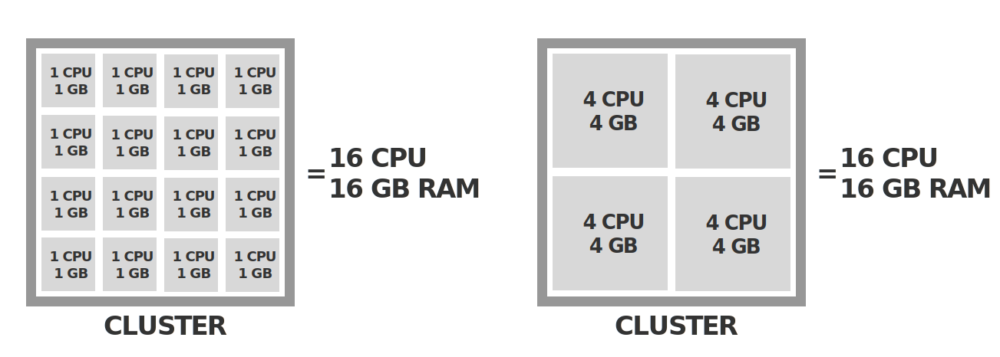

Better small cluster with large nodes or smaller nodes in a single cluster?

The level of granularity (to split across the small or big nodes) are Pods (of the same or of different applications).

## Introduction

Each cluster has a certain computing capacity which is expressed in CPU (number of cores) and memory.

Imagine that for running your applications, you need a total capacity of 10 CPU cores and 10 GB of memory.

Should you use a cluster with a single node with 10 CPU cores and 10 GB of memory, or 10 nodes with 1 CPU core and 1 GB of memory each?

## Few large nodes

Large number of Pods on each node, but few nodes.

### Pro

- Lower hardware/IaaS cost: one large node with 10 times the capacity of a small nodes may be cheaper than 10 of the small nodes together
  - With AWS, GCP, and Azure, the price scales linearly with the CPU and memory capacity
- Less management overhead: you have to manage only one node instead of 10 nodes
- If you use Amazon EKS, small instances may have a [much lower limit](https://docs.microsoft.com/bs-latn-ba/azure/aks/configure-azure-cni) of pods per node than the default of 110
  - For example, t2.micro instance has a limit of 4 Pods per node
  - On the other hand, large EC2 instances can run a large number of Pods, for example, m5.16xlarge instance 737 Pods per node

  - GKE has a limit of 100 pods per node for all types of nodes
  - AKS has a maximum limit of 250 pods per node (however, the default limit is set to 30) https://docs.microsoft.com/bs-latn-ba/azure/aks/configure-azure-cni
- If an application needs a large amount of resources, it might require large nodes
  - For example, if an application needs 10 GB of memory, it can't run on a cluster with 10 nodes of 1 GB each, but it can run on a cluster with 1 node of (at least) 10 GB 

### Contra

- It means a large number of Pods per node. The problems this introduces are:
  - The maximum number of Pods per node [is by default set to 110](https://kubernetes.io/docs/setup/best-practices/cluster-large/). This is a soft limit, powerful machines can without problems run more Pods. Yet the limit was [never removed](https://github.com/kubernetes/kubernetes/issues/23349#issuecomment-329811637) because it's hard to predict how many Pods can reliably run on a given node. 
    - There is an open Github Issue about changing the default limit (going on 3 years now) with [some graphs] (https://github.com/kubernetes/kubernetes/issues/23349#issuecomment-201004660) about the performance of large 
  - Kubelet overhead: the kubelet has to manage more containers
    - Liveness and readiness probes
  -  Every running container introduces a small level of overhead, even if it's doing nothing. Kubelet polls docker on a routine basis to gather container status, if the command takes too long to iterate through every container your node can actually go NotReady (Comment on https://github.com/kubernetes/kubernetes/issues/45419#issuecomment-304413713)
  - Each Pod on a node introduces some [overhead on the management agents](https://github.com/kubernetes/kubernetes/issues/23349#issuecomment-201084228) on the node (Docker, kubelet cAdvisor, network plugin, storage plugin)
  -  Resiliency, If you are running a node with 1000 pods and it fails, there is a lot of overhead for those pods to get rescheduled. Not just kubernetes, which can schedule pretty fast, but you have to think about nodes pulling images and the IO impact to other services running, network bottlenecks as services get restarted and retry connections as well as the cascading impact that has across your environment.
  - On GKE and AKS, there are hard limits on the number of Pods per node
    - 100 on GKE and 250 on AKS. So even if you run very powerful nodes, you can't run more Pods on them than these limits.
      - https://docs.microsoft.com/bs-latn-ba/azure/aks/configure-azure-cni#maximum-pods-per-node
      - https://cloud.google.com/kubernetes-engine/quotas
- Higher blast radius: if one node fails, a larger part of the applications is down
- If you use node autoscaling, adding a new node adds a lot of resources and may leave the new node underutilised (waste of resources)

## Many small nodes

Small number of Pods on each node, but many nodes.

### Pro

- High availability/replication: better for high-availability scenarios: if you run replicas for HA, Kubernetes can distribute them across multiple nodes, which increases HA

### Contra

- Maximum number of [nodes per cluster is 5000](https://kubernetes.io/docs/setup/best-practices/cluster-large/)
  - Number of possible communication paths, and the cumulative load on the underlying database, grows exponentially with the size of the cluster (Cloud Native DevOps with Kubernetes, p. 97)
  - While Kubernetes may still function with more than 5,000 nodes, it’s not guaranteed to work (Cloud Native DevOps with Kubernetes, p. 97).
- The larger the number of nodes, the larger the load on the master nodes → need more powerful master nodes
  - https://kubernetes.io/docs/setup/best-practices/cluster-large/#size-of-master-and-master-components
    - GKE: up to 5 nodes n1-standard-1, up to 500 nodes n1-standard-16 → factor 16
    - EKS: up to 5 nodes m3.medium, up to 500 nodes c4.4xlarge → factor 16
- More overhead for system daemons: Kubernetes runs some system daemons (kubelet, cAdvisor, Docker) on each node. If you use small nodes, the proportion of the computing resources used by these daemons is higher, thus you pay 
- Kubernetes add-ons [consume much more resources](https://github.com/kubernetes/kubernetes/issues/5880#issuecomment-113984085) when there are many nodes in the cluster
- Lower resource utilisation: more small chunks of free resources on each node that can't be assigned to any workload because they are too small

## Conclusion

- In practice, most nodes host [not more than 100 Pods](https://github.com/kubernetes/kubernetes/issues/23349#issuecomment-200484407).
- Use a mix of [different node sizes](https://stackoverflow.com/questions/40924834/selecting-a-node-size-for-a-gke-kubernetes-cluster)
- General arguments: https://stackoverflow.com/questions/52832440/use-larger-worker-nodes-or-more?rq=1

* * * 

## Different topic: many small clusters or few large clusters?

If you have 10 applications, should you run each of them on its own small cluster, or run all of them on one big cluster?

Here the level of granularty (to split across the small or big clusters) are applications, not Pods.

- https://srcco.de/posts/many-kubernetes-clusters.html
- https://thenewstack.io/the-optimal-kubernetes-cluster-size-lets-look-at-the-data/
- https://content.pivotal.io/blog/kubernetes-one-cluster-or-many

* * * 

Also, Fargate (no nodes at all)
Also Banzai telescope (query for best cheap instance type)
