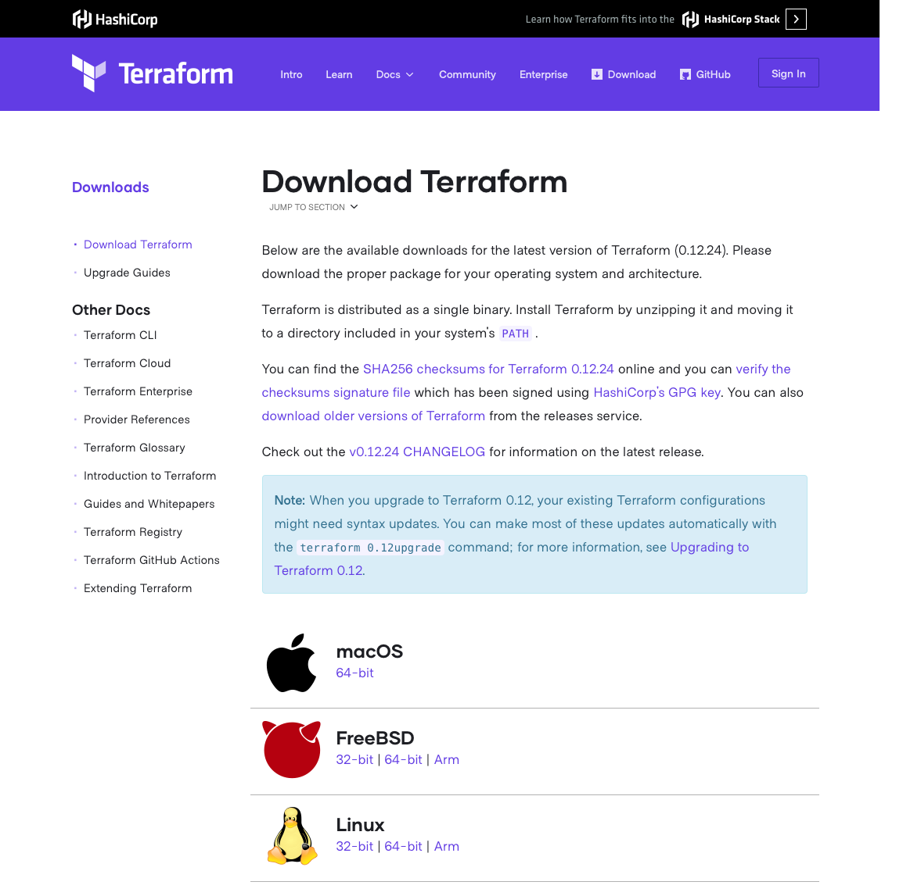

There are many ways to create a Kubernetes cluster — from simple cluster installation tools like [kubeadm](https://kubernetes.io/docs/setup/production-environment/tools/kubeadm/create-cluster-kubeadm/) to full-blown managed Kubernetes services like [GKE](https://cloud.google.com/kubernetes-engine), [EKS](https://aws.amazon.com/eks/), or [AKS](https://docs.microsoft.com/azure/aks/).

Generally, the available options pose a trade-off between automation and flexibility:

- One one hand, there are managed Kubernetes services which make creating a cluster extremely easy, but come preconfigured with many settings that you can't modify
- On the other hand, you could install Kubernetes manually [without any scripts and tools](https://github.com/kelseyhightower/kubernetes-the-hard-way) which allows you to configure every single detail of the cluster, but it's a lot of manual labour

_Often, what you want is a middle ground between these two extremes._

Such as creating freely configurable cluster in an automated way — preferrable with a single command.

This is especially true if you want to experiment with specifc settings and features of Kubernetes.

In such cases, automated cluster installation methods might not allow you to configure the settings that you want, or they apply default settings that interfere with the purpose of your experiment.

_This article presents an approach that combines both automation and flexibility._

It's a [Terraform module](https://registry.terraform.io/modules/weibeld/kubeadm/aws) based on [kubeadm](https://kubernetes.io/docs/setup/production-environment/tools/kubeadm/create-cluster-kubeadm/) that allows you to create an unopinionated cluster on AWS with a single command.


This way, spinning up flexible Kubernetes clusters trivial and becomes automatable which forms a basis for solid Kubernetes experiments.

In the following, first the available options for creating Kubernetes clusters are reviewed, then the Terraform module is presented.

## Managed Kubernetes services

Generally, the ways to create a Kubernetes cluster can be divided into two categories, managed services and installation tools.

Managed Kubernetes services create and operate a cluster for you and give you access to it.

_They allow you to use Kubernetes in a Software as a Service (SaaS) manner._

Naturally, managed Kubernetes services provide the highest degree of automation (creation and operation is entirely done for you), but the least amount of flexibiltiy (you can configure only those settings that the service provider exposes through its API).

The most popular managed Kubernetes services are provided by the major cloud providers:

- [Google Kubernetes Engine (GKE)](https://cloud.google.com/kubernetes-engine)
- [Amazon Elastic Kubernetes Service (EKS)](https://aws.amazon.com/eks/)
- [Azure Kubernetes Service (AKS)](https://docs.microsoft.com/azure/aks/)

## Kubernetes installation tools

Kubernetes installation tools allow you to install Kubernetes on your own infrastructure (both on premises or in the cloud).

_They allow you to use Kubernetes like a traditional self-managed piece of software._

Installation tools provide varying degrees of automation and flexibility depending on the extent to which the tool wants to "get it right for you".

Currently, the most popular (and officially supported) Kubernetes installation tools are:

- [kops](https://kops.sigs.k8s.io/)
- [kubespray](https://kubespray.io/)
- [kubeadm](https://kubernetes.io/docs/setup/production-environment/tools/kubeadm/create-cluster-kubeadm/)

Let's briefly look at each of them.

### kops

Of the three presented tools, [kops](https://kops.sigs.k8s.io/) provides the highest degree of automation, but it's also the most opinionated one.

What's special about kops is that it does not only install Kubernetes, but it also provisions the cloud infrastructure on which the cluster will run (currently, AWS and GCP are supported).

That means, you can go from zero to a running cluster by effectively issuing a single command.

On the other hand, kops makes many decisions for you, thus removing from your flexibility for what settings you want (and don't want) in your cluster.

Additionally, kops depends on external services, for example, it requires you to set up DNS records that resolve the name of the cluster, and you have to create an Amazon S3 bucket for kops to store its state.

### kubespray

[kubespray](https://kubespray.io/) is a collection of [Ansible](https://www.ansible.com/) playbooks that automate the installation of Kubernetes on an existing infrastructure.

That means, in contrast to kops, you need to first provision a suitable infrastructure (either on premises or in the cloud) before you can use kubespray.

Once you have your infrastructure, kubespray provides a large number of options for configuring the Kubernetes installation.

However, at the same time, kubespray attempts to create a "production-ready" cluster, which causes it to apply certain default settings and features (such as installing a CNI plugin by default).

This is great if you really want a production-ready clusters, but if all you want is an "untouched" cluster for running controlled experiments, the well-intentioned defaults applied by kubespray might get in your way.

### kubeadm

Finally, [kubeadm](https://kubernetes.io/docs/setup/production-environment/tools/kubeadm/create-cluster-kubeadm/) is the most basic and low-level one of the three installation tools.

Thus, kubeadm provides the least degree of automation but highest degree of flexibility.

kubeadm is an executable that is run directly on the infrastructure on which the cluster is to be installed.

In contrast to the other presented installation tools, kubeadm does not make any strong assumptions about the purpose of the cluster, such that it should be production-ready, or highly available.

Rather kubeadm aims to create a "minimum viable cluster" (conforming to basic best practices) that you can then customise yourself according to your requirements.

kubeadm also allows you to configure almost every aspect of the cluster in a straightforward way — for example, you can directly set command-line arguments for the individual Kubernetes components (API server, scheduler, etc.) through the [kubeadm configuration file](https://pkg.go.dev/k8s.io/kubernetes/cmd/kubeadm/app/apis/kubeadm/v1beta2).

In short, kubeadm is an ideal solution if you want to have a maximum control over the cluster configuration in order to run controlled Kubernetes experiments (for example, testing CNI plugins).

_However, the flipside of the coin is that using kubeadm is by no means done with a single command (as it's the case for kops and kubespray)._

Creating a cluster with kubeadm includes a whole series of steps and processes:

- First of all, you have to provision the infrastructure on which to create the cluster
- Then you need to log in to every future node of the cluster and install kubeadm on it
- Next, you have to run a specific command ([`kubeadm init`](https://kubernetes.io/docs/reference/setup-tools/kubeadm/kubeadm-init/)) on one of the nodes
- Then, you have to run a specific other command ([`kubeadm join`](https://kubernetes.io/docs/reference/setup-tools/kubeadm/kubeadm-join/)) on all the other nodes

The commands that you need to run on the nodes further depend on each other — the `kubeadm join` commands must include a token that is generated by the inital `kubeadm init` command.

In summary, bootstrapping a cluster with kubeadm can be a tedious manual process which is not ideal for creating the type of automatable and disposable clusters that you need for running controlled Kubernetes experiments.

_This is where the Terraform kubeadm module comes in._

## Terraform kubeadm module

Learnk8s created the [Terraform kubeadm module](https://registry.terraform.io/modules/weibeld/kubeadm/aws) to combine the simplicity and flexibility of kubeadm with a level of automation as it's featured by other tools.


The solution is a [Terraform module](https://www.terraform.io/docs/modules/index.html) that automates both the provisioning of the infrastructure and the operation of kubeadm on this infrastructure to bootstrap a Kubernetes cluster.

With the Terraform kubeadm module, you can go from zero to a running Kubernetes cluster with a single command in a few minutes.

> Currently, only AWS is supported as a target platform for the cluster, but support for GCP and Azure is planned.

This brings you the convenience of kops without any of the additional requirements and features that you might not need.

With the Terraform kubeadm module, you get exactly the "minimum viable" cluster that you also get when your manually run kubeadm.

This makes kubeadm clusters cheap and disposable and enables you to run Kubernetes experiments in an automated manner.

_In the following, the article will briefly present Terraform and then give detailed usage instructions for the Terraform kubeadm module._

## What is Terraform?

[Terraform](https://www.terraform.io/) is an open-source Infrastructure as Code (IaC) tool created by Hashicorp.

It allows to declaratively describe a set of infrastructure (e.g. compute instances, networks, cloud services) as code and then turn this description into reality.

Terraform code is written in the [Hashicorp Configuration Language (HCL)](https://www.terraform.io/docs/configuration/index.html) and a related set of Terraform code files is called a Terraform configuration.

To turn a configuraiton into reality, Terraform talks to the APIs of the relevant services (e.g. AWS, GCP, Cloudflare, GitHub).

The power and versatility of Terraform comes from the [Terraform providers](https://www.terraform.io/docs/providers/index.html).

Terraform providers are plugin-style components that encapsulate the interaction with the API of a specific service (e.g. AWS or GCP) and expose the resources that can be managed through this service as [Terraform resources](https://www.terraform.io/docs/configuration/resources.html).

For example, there exists a [Terraform provider for AWS](https://www.terraform.io/docs/providers/aws/index.html), and this provider defines a Terraform resource named [`aws_instance`](https://www.terraform.io/docs/providers/aws/r/instance.html).

The `aws_instance` Terraform resource corresponds to an [Amazon EC2 instance](https://aws.amazon.com/ec2/).

Thus, if you define an `aws_instance` resource in your Terraform configuration, Terraform will create an EC2 instance for you (which works by the AWS provider talking to the [AWS EC2 API](https://docs.aws.amazon.com/AWSEC2/latest/APIReference/Welcome.html)).

_There exist over a hundred [officially supported Terraform providers](https://www.terraform.io/docs/providers/index.html) and many more [provided by the community](https://www.terraform.io/docs/providers/type/community-index.html)._

A Terraform configuration can be organised as a [Terraform module](https://www.terraform.io/docs/modules/index.html).

Terraform modules are encapsulated pieces of Terraform configuration that can be reused and shared.

The primary place where Terraform modules are shared is the [Terraform Registry](https://registry.terraform.io/).

The [Terraform kubeadm module](https://registry.terraform.io/modules/weibeld/kubeadm/aws) is freely available on the Terraform Registry.

_The following sections first describe the prerequisites for using the module and then provide a complete walkthrough of using it._

## Prerequisites

### 1. Install Terraform

To use Terraform on your machine, you first have to install it.

> If you already have Terraform installed, make sure to update to Terraform 0.12, since this is the minimum required version by the module.

Terraform is distributed as a statically linked, precompiled binary (written in Go) and to install it, you simply have to download the binary and move it to any directory of your `PATH`.

You can find the Terraform binaries for various target platforms on the [Terraform website](https://www.terraform.io/downloads.html):



After you downloaded the correct package, unzip it, and move the contained binary to some directory in your `PATH`, such as `/usr/bin`.

On macOS, you can alternativel install Terraform with:

```terminal|command=1|title=bash
brew install terraform
```

Once Terraform is installed, you can verify the installation with:

```terminal|command=1|title=bash
terraform version
```

> Please make sure to have at least version 0.12 of Terraform since this is the minimum version required by the Terraform kubeadm module.

### 2. Configure AWS credentials

Since the Terraform kubeadm module uses AWS as an infrastructure provider, you need an [AWS account](https://aws.amazon.com/) to use it.

> As mentioned, future support for GCP and Azure is planned.

Terraform needs to have access to the [Access Key ID and Secret Access Key](https://docs.aws.amazon.com/general/latest/gr/aws-sec-cred-types.html#access-keys-and-secret-access-keys) of an [IAM User](https://docs.aws.amazon.com/IAM/latest/UserGuide/id_users.html) of your AWS account for being able to create AWS resources.

If you're already using the [AWS CLI](https://aws.amazon.com/cli/) and have an `~/.aws/credentials` file on your machine, then you should be good to go.

In all other cases, you can set the following environment variables:

```terminal|command=1,2|title=bash
export AWS_ACCESS_KEY_ID=<AccessKeyID>
export AWS_SECRET_ACCESS_KEY=<SecretAccessKey>
```

You can find out the Access Key ID and Secret Access Key of any user in your account in the [AWS IAM Console](https://console.aws.amazon.com/iam/home) (you can also generate a new Access Key ID and Secret Access Key if you can't retrieve the existing ones).

If you're using an IAM user with limited permissions, make sure that it has at least the following [IAM Policies](https://docs.aws.amazon.com/IAM/latest/UserGuide/access_policies.html) attached:

- `AmazonEC2FullAccess`
- `AmazonVPCFullAccess`

### 3. Ensure default OpenSSH keys

The Terraform kubeadm module sets up SSH access to the nodes of the cluster by using the default OpenSSH key pair, which is:

- `~/.ssh/id_rsa`: private key
- `~/.ssh/id_rsa.pub`: public key

Please make sure that you have these files on your machine, and if you haven't, generate them with the following command:

```terminal|command=1|title=bash
ssh-keygen
```

_You're now ready to use the Terraform kubeadm module!_

## Creating a minimal cluster

In the following, you will write a Terraform configuration that defines a Kubernetes cluster with minimal settings.

Start by creating a new directory:

```terminal|command=1,2|title=bash
mkdir terraform-kubeadm
cd terraform-kubeadm
```

And create a file named `main.tf` with the following content in this directory:

```hcl|title=main.tf
provider "aws" {
  region = "eu-central-1"
}

module "cluster" {
  source  = "weibeld/kubeadm/aws"
  version = "~> 0.2"
}
```

> Note that `eu-central-1` is the [AWS region](https://docs.aws.amazon.com/AWSEC2/latest/UserGuide/using-regions-availability-zones.html) in which the cluster will be created. You can replace this with any other region you like.

The above Terraform configuration first configures the [AWS provider](https://www.terraform.io/docs/providers/aws/index.html) and then invokes the [kubeadm module](https://registry.terraform.io/modules/weibeld/kubeadm/aws).

By default, the Terraform kubeadm module creates a cluster with a singel master node and two worker ndoes.

_This is all the code you have to type to create a minimal default cluster._

But first, you have to initalise Terraform in your current working directory as follows:

```terminal|command=1|title=bash
terraform init
```

The [`terraform init`](https://www.terraform.io/docs/commands/init.html) downloads both the AWS provider and the Terraform kubeadm module to your current working directory (into a subdirectory named `.terraform`).

Now you can start the process of turning your configuration into reality:

```terminal|command=1|title=bash
terraform apply
```

The [`terraform apply`](https://www.terraform.io/docs/commands/apply.html) command shows you a list of [Terraform resources](https://www.terraform.io/docs/configuration/resources.html) that Terraform is planning to create (this is called an [execution plan](https://www.terraform.io/docs/commands/plan.html)).

The command also prompts you if you want to proceed; confirm it with:

```
yes
```

At this point, you can lean back and wait for Terraform to create your cluster.

_It shouldn't take longer than 3-4 minutes._

When the command completes, your cluster should be up and running — let's test it!

In your current working directory, you should now have a file with a random pet name (e.g. `real-hedgehog`) and a `.conf` extension:

```terminal|command=1|title=bash
ls *.conf
real-hedgehog.conf
```

This is the [kubeconfig](https://kubernetes.io/docs/concepts/configuration/organize-cluster-access-kubeconfig/) file for connecting to your newly created cluster.

You can use it to access your cluster right away as follows:

```terminal|command=1|title=bash
kubectl --kubeconfig real-hedgehog.conf get pods --all-namespaces
```

> Please replace `real-hedgehog.conf` with the name of your kubeconfig file.

You should see the system Pods of your cluster.

_Congratulations, you just created your first cluster!_

> If you want, you can check the [AWS EC2 Console](console.aws.amazon.com/ec2/v2/home) to confirm that Terraform really created EC2 instances for your cluster nodes.

If you inspect the above output a bit closer, however, you should see that the `coredns` Pods are `Pending`:

```terminal|command=1|title=bash
kubectl --kubeconfig real-hedgehog.conf get pods --all-namespaces
NAMESPACE     NAME                             READY   STATUS    RESTARTS   AGE
kube-system   coredns-66bff467f8-j2mmc         0/1     Pending   0          4m2s
kube-system   coredns-66bff467f8-n265d         0/1     Pending   0          4m2s
```

And if you list the nodes of the cluster, you should see that they are `NotReady`:

```terminal|command=1|title=bash
kubectl --kubeconfig real-hedgehog.conf get nodes
NAME       STATUS     ROLES    AGE     VERSION
master     NotReady   master   8m57s   v1.18.2
worker-0   NotReady   <none>   8m41s   v1.18.2
worker-1   NotReady   <none>   8m41s   v1.18.2
```

_Don't worry! This doesn't mean that there's something wrong, but it's the expected behaviour!_

The reason is that there is currently no [CNI plugin](https://kubernetes.io/docs/concepts/extend-kubernetes/compute-storage-net/network-plugins/) installed in your cluster.

This is because, as mentioned, kubeadm doesn't install a CNI plugin by default, leaving this choice to you.

You will fix this later by installing a selected CNI plugin, but for now, let's first explore the cluster a bit more.

## Connecting to a node

In the following, you will connect to one of the cluster nodes with SSH.

To do so, you need the public IP addresses of your cluster nodes.

You could find them out by locating the EC2 instances corresponding to the nodes in the [AWS EC2 Console](console.aws.amazon.com/ec2/v2/home), but the Terraform kubeadm module allows to output this information right in Terraform.

Modify your Terraform configuration to look like this:

```hcl|highlight=10-12|title=main.tf
provider "aws" {
  region = "eu-central-1"
}

module "cluster" {
  source  = "weibeld/kubeadm/aws"
  version = "~> 0.2"
}

output "nodes" {
  value = module.cluster.cluster_nodes
}
```

The added code defines a [Terraform output](https://www.terraform.io/docs/configuration/outputs.html) that in turn refers to an output value of the kubeadm module.

> You can see an overview of all output values of the kubeadm module on the [Terraform Registry](https://registry.terraform.io/modules/weibeld/kubeadm/aws?tab=outputs).

To display this output, run the `terraform apply` command again:

```terminal|command=1|title=bash
terraform apply --auto-approve
```

> The `--auto-approve` flag automatically applies `yes` to the execution plan prompt.

This time, the `terraform apply` command won't create any AWS resources, but it will display the output value that you just defined.

It should look something like this:

```
nodes = [
  {
    "name" = "master"
    "private_ip" = "172.31.43.251"
    "public_ip" = "3.127.72.79"
    "subnet_id" = "subnet-a95feed4"
  },
  {
    "name" = "worker-0"
    "private_ip" = "172.31.41.249"
    "public_ip" = "3.127.39.172"
    "subnet_id" = "subnet-a95feed4"
  },
  {
    "name" = "worker-1"
    "private_ip" = "172.31.32.223"
    "public_ip" = "18.197.147.253"
    "subnet_id" = "subnet-a95feed4"
  },
]
```

The output includes some information about each node of the cluster, including its public IP address.

With this information, and your default OpenSSH private key, you can now SSH into any of your cluster nodes as follows:

```terminal|command=1|title=bash
ssh -i ~/.ssh/id_rsa ubuntu@3.127.72.79
```

> Please replace `3.127.72.79` with the public IP address of one of your nodes.

You should now be logged into the node, where you can do interesting things, such as inspecting the running containers:

```terminal|command=1|title=bash
sudo docker ps
```

But for now, let's go back to your local machine:

```terminal|command=1|title=bash
exit
```

_There's a way to further improve your cluster setup._

## Using a dedicated VPC

By default, the kubeadm module creates the cluster in the [default VPC](https://docs.aws.amazon.com/vpc/latest/userguide/default-vpc.html) of the configured AWS region.

That means, the cluster coexists with other AWS resources in this VPC.

Often, this is not a problem, but in general, it's a good idea to separate unrelated applications into separate VPCs.

The Terraform kubeadm module allows you to create a dedicated VPC for your cluster on-the-fly.

To do so, edit your Terraform configuration as follows:

```hcl|highlight=5-8,13-14|title=main.tf
provider "aws" {
  region = "eu-central-1"
}

module "network" {
  source  = "weibeld/kubeadm/aws//modules/network"
  version = "~> 0.2"
}

module "cluster" {
  source    = "weibeld/kubeadm/aws"
  version   = "~> 0.2"
  vpc_id    = module.network.vpc_id
  subnet_id = module.network.subnet_id
}

output "nodes" {
  value = module.cluster.cluster_nodes
}
```

The above configuration makes use of the [network submodule](https://github.com/weibeld/terraform-aws-kubeadm/tree/master/modules/network) which is distributed as part of the kubeadm module.

The network submodule creates a new VPC with a single subnet.

The IDs of this VPC and subnet are then passed to the kubeadm module via the `vpc_id` and `subnet_id` input variables, which causes the kubeadm module to create the cluster in this VPC.

> You can see all input variables of the kubeadm module on its [Terraform Registry page](https://registry.terraform.io/modules/weibeld/kubeadm/aws?tab=inputs).

This causes the kubeadm module to create the cluster in the specified VPC and subnet, which means that your cluster will run in its own brand-new dedicated VPC.

Since you added a new module invocation, you need to run `terraform init` again:

```terminal|command=1|title=bash
terraform init
```

Then you can apply your updated configurqation:

```terminal|command=1|title=bash
terraform apply
```

Terraform now figures out how to get from the current state to the updated specification and shows you the execution plan.

If you pay attention, you can see that the `aws_instance` resources get destroyed and recreated, which means that you will get effectively a new cluster.

To confirm the execution plan, type `yes`.

_When the command completes, your cluster has just been recreated in a new VPC._

> You can confirm that a new VPC has indeed been created in the [AWS VPC Console](https.//console.aws.amazon.com/vpc/home).

The kubeconfig file in your current working directory has been updated as well to point to the new cluster.

You can confirm that you can access the new cluster with:

```terminal|command=1|title=bash
kubectl --kubeconfig real-hedgehog.conf get pods --all-namespaces
```

> Please replace `real-hedgehog.conf` with the name of your kubeconfig file.

You should see the list of system Pods as before.

## Multiple clusters

So far, you created only a single cluster, but what if you wanted a whole series of clusters?

_For example, for running a series of experiments?_

The Terraform kubeadm module has you covered here.

To create two additional clusters (for a total of three), edit your configuration as follows:

```hcl|highlight=13-25,28-32|title=main.tf
module "network" {
  source  = "weibeld/kubeadm/aws//modules/network"
  version = "~> 0.2"
}

module "cluster" {
  source    = "weibeld/kubeadm/aws"
  version   = "~> 0.2"
  vpc_id    = module.network.vpc_id
  subnet_id = module.network.subnet_id
}

module "cluster_2" {
  source    = "weibeld/kubeadm/aws"
  version   = "~> 0.2"
  vpc_id    = module.network.vpc_id
  subnet_id = module.network.subnet_id
}

module "cluster_3" {
  source    = "weibeld/kubeadm/aws"
  version   = "~> 0.2"
  vpc_id    = module.network.vpc_id
  subnet_id = module.network.subnet_id
}

output "nodes" {
  value = {
    (module.cluster.cluster_name)   = module.cluster.cluster_nodes
    (module.cluster_2.cluster_name) = module.cluster_2.cluster_nodes
    (module.cluster_3.cluster_name) = module.cluster_3.cluster_nodes
  }
}
```

The main change consists in repeating the invocation of the kubeadm module.

Now, the kubeadm module is invoked three times in total, which results in the creation of three clusters.

The output value is also updated to show the node information for each of the three clusters.

> Note that the new clusters use the same VPC as the first cluster. If you wanted, you could create a dedicated VPC for each cluster by adding an invocation of the network submodule for each invocation of the kubeadm module.

Since you added module invocations, you need to run `terraform init` again:

```terminal|command=1|title=bash
terraform init
```

Now, you're ready to apply your updated configuration:

```terminal|command=1|title=bash
terraform apply
```

If you look at the execution plan Terraform presents to you, you should see that the resources corresponding to two clusters will be created.

This means, that Terraform will create two new clustes while leaving the initial cluster unchanged.

Confirm the prompt with `yes`.

_When the command completes, your three clusters should be up and running!_

In your current working directory, you should now have three kubeconfig files, one for each cluster:

```terminal|command=1|title=bash
ls *.conf
growing-cattle.conf
obliging-eft.conf
real-hedgehog.conf
```

Let's test if they allow to access each cluster:

```terminal|command=1,2,3|title=bash
kubectl get nodes --kubeconfig growing-cattle.conf
kubectl get nodes --kubeconfig obliging-eft.conf
kubectl get nodes --kubeconfig real-hedgehog.conf
```

_You should see th nodes of each cluster, so they are all up and running!_

## Installing CNI plugins

Your three clusters are now up, but they are not yet ready because, as mentioned, they don't have a CNI plugin installed yet.

_Having three freshly bootstrapped clusters is a great opportunity to compare different CNI plugins in a controlled environment._

Three of the most popular CNI plugins are [Calico](https://www.projectcalico.org/), [Weave Net](https://www.weave.works/docs/net/latest/overview/), and [Cilium](https://cilium.io/), so let's install each of them on one of the clusters.


Here's how you can [install Calico](https://docs.projectcalico.org/getting-started/kubernetes/quickstart) on the first cluster:

```terminal|command=1|title=bash
kubectl apply -f https://docs.projectcalico.org/manifests/calico.yaml --kubeconfig growing-cattle.conf 
```

Here's how you can [install Weave Net](https://www.weave.works/docs/net/latest/kubernetes/kube-addon/) on the second cluster:

```terminal|command=1|title=bash
kubectl apply -f "https://cloud.weave.works/k8s/net?k8s-version=$(kubectl version | base64 | tr -d '\n')" --kubeconfig obliging-eft.conf 
```

And here's how you can [install Cilium](https://docs.cilium.io/en/stable/gettingstarted/k8s-install-default/) on the third cluster:

```terminal|command=1|title=bash
kubectl create -f https://raw.githubusercontent.com/cilium/cilium/1.7.0/install/kubernetes/quick-install.yaml --kubeconfig real-hedgehog.conf 
```

Give the CNI plugins some time to initialise, then list the nodes of your clusters again:

```terminal|command=1,2,3|title=bash
kubectl get nodes --kubeconfig growing-cattle.conf
kubectl get nodes --kubeconfig obliging-eft.conf
kubectl get nodes --kubeconfig real-hedgehog.conf
```

Bingo!

All the nodes should be `Ready` now.

_Congratulations, you just performd your first Kubernetes experiment._

## Destroying the clusters

When you're done experimenting with the clusters, you should delete them, because running clusters on AWS costs money.

Fortunately, Terraform makes deleting infrastructure extremely easy.

All you have to is to issue the following command:

```terminal|command=1|title=bash
terraform destroy
```

The [`terraform destroy`](https://www.terraform.io/docs/commands/destroy.html) command also shows you an execution plan which consists in the deletion of all currently existing resources.

When you confirm the prompt with `yes`, Terraform will delete all the AWS resources that it previously created.

This will revert your AWS account to exactly the state it was in before you ran `terraform apply` for the first time!

## Summary

This article presented the [Terraform kubeadm module](https://registry.terraform.io/modules/weibeld/kubeadm/aws) which allows to automatically bootstrap Kubernetes clusters on AWS.

Only the most basic usage was presented so far — the module features various [input variables](https://registry.terraform.io/modules/weibeld/kubeadm/aws?tab=inputs) that allow to configure the cluster.

For example, you can define the number and type of worker nodes, the internal Pod network CIDR block, or secure access to your cluster by narrowing the range of IP addresses that may connect to it.

The module is still being extended and new configuration options will be added in the future.

Furthermore, equivalen Terraform modules for GCP and Azure will follow.
