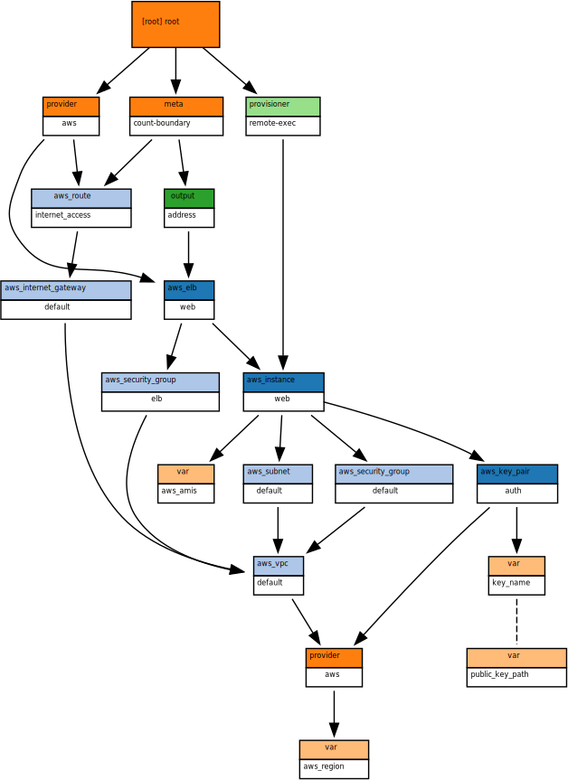
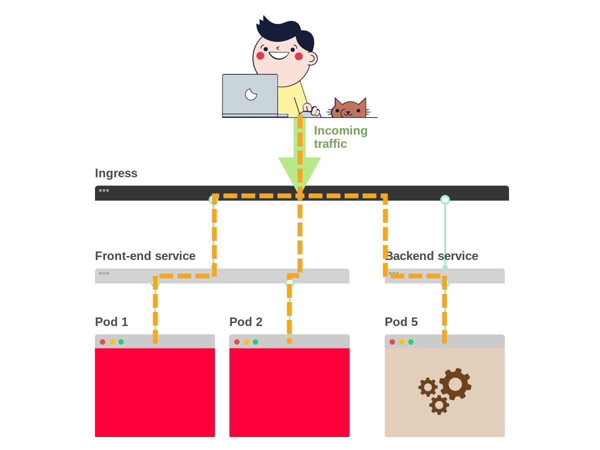

**TL;DR:** _In this tutorial you will learn how to use Terraform 0.12 and Helm 3 to provision an Azure Kubernetes Cluster (AKS) with managed identities._

Azure offers a managed Kubernetes service where you can request for a cluster, connect to it and use it to deploy applications.

Using [Azure Kubernetes Service (AKS)](https://azure.microsoft.com/en-us/services/kubernetes-service) instead of creating your cluster is convenient if you are a small team and don't want to spend time monitoring and maintaining Kubernetes control planes.

_Why worrying about scaling APIs, managing databases, provisioning compute resources, and offering five-nines reliability when you can outsource all of it to Azure._

For free — yes, **Azure doesn't charge you a penny for the master nodes in Azure Kubernetes Service (AKS).**

But while you can create a cluster with few clicks in the Azure portal, it usually a better idea to keep the configuration for your cluster under source control.

If you accidentally delete your cluster or decide to provision a copy in another region, you can replicate the exact same configuration.

And if you're working as part of a team, source control gives you peace of mind.

You know precisely why changes occurred and who made them.

## Table of contents

- [Infrastructure as code: Pulumi vs Azure Templates vs Terraform](#managing-infrastructure-as-code)
- [Getting started with Terraform](#getting-started-with-terraform)
- [Creating a resource group with Terraform](#creating-a-resource-group-with-terraform)
- [Provisioning a Kubernetes cluster on Azure with Terraform](#provisioning-a-kubernetes-cluster-on-azure-with-terraform)
- [Installing an Ingress controller](#installing-an-ingress-controller)
- [A fully configured cluster in one click](#a-fully-configured-cluster-in-one-click)
- [Creating copies of the cluster with modules](#creating-copies-of-the-cluster-with-modules)
- [What's next](#what-s-next)

## Managing infrastructure as code

You have a few options when it comes to keeping your cluster configuration under version control.

The following section is designed to compare Terraform, Pulumi and Azure Resource Manager templates as different options to create infrastructure from code.

If you prefer to jump to skip this part, [you can click here](#getting-started-with-terraform).

### Pulumi

[Pulumi](https://github.com/pulumi/pulumi) offers a novel approach to configuration management through code.

It resembles **a universal SDK that works across cloud providers**.

The infrastructure on Azure (or Google Cloud or Amazon Web Services) is exposed as a collection of objects that you can leverage from your favourite programming language.

Imagine instantiating a LoadBalancer class in Typescript and having an [Azure load balancer](https://docs.microsoft.com/en-us/azure/load-balancer/load-balancer-overview) provisioned as a side effect.

_But it doesn't end there._

Pulumi stores the current state of your infrastructure.

So if you run your code twice, it will create a single load balancer and not two.

While technically promising, it's also a new technology.

Pulumi was released at the beginning of 2018, and some of the features are not as polished as in Terraform or Azure Resource Manager templates.

Creating an Azure load balancer in Pulumi using Typescript looks like this:

```typescript|title=lb.ts
import * as azure from '@pulumi/azure'

const testResourceGroup = new azure.core.ResourceGroup('test', {
  location: 'West US',
  name: 'LoadBalancerRG',
})

const testPublicIp = new azure.network.PublicIp('test', {
  allocationMethod: 'Static',
  location: 'West US',
  name: 'PublicIPForLB',
  resourceGroupName: testResourceGroup.name,
})

const testLoadBalancer = new azure.lb.LoadBalancer('test', {
  frontendIpConfigurations: [
    {
      name: 'PublicIPAddress',
      publicIpAddressId: testPublicIp.id,
    },
  ],
  location: 'West US',
  name: 'TestLoadBalancer',
  resourceGroupName: testResourceGroup.name,
})
```

> Please note that Pulumi supports Javascript, Go, Python and Typescript out of the box. However, more languages will be supported later on.

In the example above, you created three resources:

- a resource group to store all of your resources,
- a public IP address to assign to the load balancer
- and the load balancer.

Note how IP address and load balancer are referencing the resource group.

```typescript|highlight=12,24|title=lb.ts
import * as azure from '@pulumi/azure'

const testResourceGroup = new azure.core.ResourceGroup('test', {
  location: 'West US',
  name: 'LoadBalancerRG',
})

const testPublicIp = new azure.network.PublicIp('test', {
  allocationMethod: 'Static',
  location: 'West US',
  name: 'PublicIPForLB',
  resourceGroupName: testResourceGroup.name,
})

const testLoadBalancer = new azure.lb.LoadBalancer('test', {
  frontendIpConfigurations: [
    {
      name: 'PublicIPAddress',
      publicIpAddressId: testPublicIp.id,
    },
  ],
  location: 'West US',
  name: 'TestLoadBalancer',
  resourceGroupName: testResourceGroup.name,
})
```

Assuming that you have the `pulumi` binary installed, you can execute the script and create the load balancer with:

```terminal|command=1|title=bash
pulumi up
```

### Azure Resource Manager Templates

[Azure Resource Manager templates](https://docs.microsoft.com/en-us/azure/azure-resource-manager/resource-group-authoring-templates), _often abbreviated ARM templates_, are a toolset developed by Microsoft designed to provision and control resources in Azure.

ARM templates describe a resource and its related dependencies.

The templates are akin to JSON files and not particularly human-friendly.

Also, ARM lack advanced features such as keeping track of what's being deployed, dry runs, and the ability to modularise and reuse your code.

If Pulumi gave you the extreme flexibility of writing your own code, ARM takes it away by giving you a semi-static JSON file where you can dynamically inject variables.

Azure Templates are made of two parts:

1. a generic template and
1. a parameter file that is used to inject values in the template

Here you can [find the generic template for the Azure Load Balancer](https://github.com/Azure/azure-quickstart-templates/blob/master/201-1-vm-loadbalancer-2-nics/azuredeploy.json).

Creating an Azure load balancer in ARM looks like this:

```terminal|command=1-3|title=powershell
New-AzResourceGroupDeployment -Name TestRG -Location uswest `
    -TemplateFile 'azuredeploy.json' `
    -TemplateParameterFile 'azuredeploy.parameters.json'
```

You can obtain the:

- `azuredeploy.json` from [here](https://raw.githubusercontent.com/azure/azure-quickstart-templates/master/201-2-vms-loadbalancer-lbrules/azuredeploy.json)
- `azuredeploy.parameters.json` from [here](https://raw.githubusercontent.com/azure/azure-quickstart-templates/master/201-2-vms-loadbalancer-lbrules/azuredeploy.parameters.json)

Notice how you had to specify the parameter file to customise some of the values.

If you wish to explore more examples of ARM templates [the official website has a handy collection of quickstart templates](https://azure.microsoft.com/en-us/resources/templates/).

### Terraform

[Terraform](https://www.terraform.io/intro/index.html#what-is-terraform-) gained most of its popularity from being a friendly tool to provision infrastructure on Amazon Web Services.

Terraform is not a library that you use in your favourite programming language, and it's not even a collection of JSON templates.

It's something in between.

It's a sort of DSL — a domain-specific language that's designed to be easy to read and write.

Terraform configurations can be written in HashiCorp Configuration Language (HCL).

**HCL is also fully JSON compatible.**

That is, JSON can be used as entirely valid input to a system expecting HCL.

_It looks like real code, but it lacks some of the flexibility._

Terraform doesn't know how to connect to a cloud provider and orchestrate their API.

It delegates all the work to plugins called providers.

Providers are in charge of translating the terraform DSL into HTTP requests to Azure, Amazon Web Service or any other cloud provider.

Of course, there is a [Terraform provider for Azure](https://www.terraform.io/docs/providers/azurerm/index.html), [as well as many others](https://www.terraform.io/docs/providers/).

Creating an Azure load balancer in Terraform looks like this:

```hcl|title=lb.tf
resource "azurerm_resource_group" "test" {
  name     = "LoadBalancerRG"
  location = "West US"
}

resource "azurerm_public_ip" "test" {
  name                = "PublicIPForLB"
  location            = "West US"
  resource_group_name = "${azurerm_resource_group.test.name}"
  allocation_method   = "Static"
}

resource "azurerm_lb" "test" {
  name                = "TestLoadBalancer"
  location            = "West US"
  resource_group_name = "${azurerm_resource_group.test.name}"

  frontend_ip_configuration {
    name                 = "PublicIPAddress"
    public_ip_address_id = "${azurerm_public_ip.test.id}"
  }
}
```

> Please note how the code is remarkably similar to Pulumi's.

Terraform has a powerful mechanism where it can trace dependencies across resources and store them in a graph.

The graph is used to optimise creating infrastructure: independent resources are created in parallel instead of sequentially.

The dependency graph for the load balancer above is straightforward.


But you can imagine that once you have a dozen services to maintain, things could become more complicated.

The following elaborate dependency graph was drawn with [Blast Radius](https://github.com/28mm/blast-radius) — a tool for reasoning about Terraform dependency graphs with interactive visualisations.



Terraform also keeps track of the current state of your infrastructure, so running the script twice holds the same result.

In the rest of this article, you will explore why Terraform is loved by small and large enterprises that use it every day in production.

## Getting started with Terraform

Terraform uses a different set of credentials to provision the infrastructure, so you should create those first.

The first step is to install the Azure CLI.

You can find detailed [instructions on how to install it on the official website](https://docs.microsoft.com/en-us/cli/azure/install-azure-cli?view=azure-cli-latest).

> [Sign up for an Azure account](https://azure.microsoft.com/en-us/free/), if you don't own one already. You will receive USD200 in free credits.

You can link your Azure CLI to your account with:

```terminal|command=1|title=bash
az login
```

And you can list your accounts with:

```terminal|command=1|title=bash
az account list
```

**Make a note now of your subscription id.**

> If you have more than one subscription, you can set your active subscription with `az account set --subscription="SUBSCRIPTION_ID"`. You still need to make a note of your subscription id.

Terraform needs a Service Principal to create resources on your behalf.

You can think of it as a user identity (login and password) with a specific role, and tightly controlled permissions to access your resources.

It could have fine-grained permissions such as only to create virtual machines or read from a particular blob storage.

In your case, you need a _Contributor_ Service Principal — enough permissions to create, and delete resources.

You can create the Service Principal with:

```terminal|command=1-3|title=bash
az ad sp create-for-rbac \
  --role="Contributor" \
  --scopes="/subscriptions/SUBSCRIPTION_ID"
```

The previous command should print a JSON payload like this:

```json
{
  "appId": "00000000-0000-0000-0000-000000000000",
  "displayName": "azure-cli-2017-06-05-10-41-15",
  "name": "http://azure-cli-2017-06-05-10-41-15",
  "password": "0000-0000-0000-0000-000000000000",
  "tenant": "00000000-0000-0000-0000-000000000000"
}
```

Make a note of the `appId`, `password` and `tenant`. You need those to set up Terraform.

Export the following environment variables:

```terminal|command=1,2,3,4|title=bash
export ARM_CLIENT_ID=<insert the appId from above>
export ARM_SUBSCRIPTION_ID=<insert your subscription id>
export ARM_TENANT_ID=<insert the tenant from above>
export ARM_CLIENT_SECRET=<insert the password from above>
```

## Creating a resource group with Terraform

You should install the Terraform CLI. You can [follow the instructions from the official website](https://learn.hashicorp.com/terraform/getting-started/install.html).

If the installation is successful, you should be able to test it by printing the current version of the binary:

```terminal|command=1|title=bash
terraform version
```

Let's create the most straightforward Terraform file.

Create a file named `main.tf` with the following content:

```hcl|title=main.tf
provider "azurerm" {
  version = "=2.13.0"

  features {}
}

resource "azurerm_resource_group" "rg" {
  name     = "test"
  location = "uksouth"
}
```

The file contains the provider and an empty resource group.

In the same directory initialise Terraform with:

```terminal|command=1|title=bash
terraform init
```

The command executes two crucial tasks:

1. It downloads the Azure provider that is necessary to translate the Terraform instructions into API calls.
1. It initialises the state where it keeps track of all the resources that are created.

You're ready to create your resource group using Terraform.

Two commands are frequently used in succession. The first is:

```terminal|command=1|title=bash
terraform plan
```

Terraform executes a dry run.

It's always a good idea to double-check what happens to your infrastructure before you commit the changes.

**You don't want to accidentally destroy a database** because you forgot to add or remove a resource.

Once you are happy with the changes, you can create the resources for real with:

```terminal|command=1|title=bash
terraform apply
```

Terraform created the resource group.

Congratulations, you just used Terraform to provision your infrastructure!

You can imagine that, by adding more block resources, you can create more components in your infrastructure.

You can have a look at all the resources that you could create [in the left column of the official provider page for Azure](https://www.terraform.io/docs/providers/azurerm/index.html).

> Please note that you should have sufficient knowledge of Azure and its resources to understand how components can be plugged in together. The documentation provides excellent examples, though.

Before you provision a cluster, let's clean up the existing resources.

You can delete the resource group with:

```terminal|command=1|title=bash
terraform destroy
```

Terraform prints a list of resources that are ready to be deleted.

As soon as you confirm, it destroys all the resources.

## Provisioning a Kubernetes cluster on Azure with Terraform

The bill of material to provision a Kubernetes cluster on Azure is as follow. You need:

- a resource group to contain all of the resources
- a Kubernetes master node (which is managed by Azure)

The list translates to the following Terraform code:

```hcl|highlight=7,12|title=main.tf
provider "azurerm" {
  version = "=2.13.0"

  features {}
}

resource "azurerm_resource_group" "rg" {
  name     = "aks-cluster"
  location = "uksouth"
}

resource "azurerm_kubernetes_cluster" "cluster" {
  name       = "aks"
  location   = azurerm_resource_group.rg.location
  dns_prefix = "aks"

  resource_group_name = azurerm_resource_group.rg.name
  kubernetes_version  = "1.18.2"

  default_node_pool {
    name       = "aks"
    node_count = "1"
    vm_size    = "Standard_D2s_v3"
  }

  identity {
    type = "SystemAssigned"
  }
}
```

> The code is also available as [a repository on Github](https://github.com/learnk8s/terraform-aks).

Please notice how you are referencing variables from the resource into the cluster.

Also, pay attention to the `azurerm_kubernetes_cluster` resource block:

- `default_node_pool` defines how many virtual machines should be part of the cluster and what their configuration should look like.
- `identity` is used by the API to provision a Service Principal for the cluster automatically.

Before you apply the changes, execute a dry-run with:

```terminal|command=1|title=bash
terraform plan
```

You should notice that there are a lot of resources that are ready to be created.

If the proposed changes resonate with what you asked for, you can apply them with:

```terminal|command=1|title=bash
terraform apply
```

_It's time for a cup of coffee._

Provisioning a cluster on AKS takes in average about ten minutes.

What happens in the background is that Azure receives your request, calls the Azure APIs and creates the extra resources needed (such as NICs and virtual machines) to provision the cluster.

_Done?_

**You might wonder where is your cluster.**

_How do you connect to it?_

You can head back to the Azure console and search for your cluster and download the kubeconfig file.

But there's a quicker way.

**Terraform can print information about the state.**

You could use that to print the kubeconfig file associated with the cluster.

You should add the following snippet to the end of your `main.tf` file:

```hcl|title=main.tf
output "kube_config" {
  value = azurerm_kubernetes_cluster.cluster.kube_config_raw
}
```

You should go through another cycle of `terraform plan` and `terraform apply` and verify that nothing changed.

You should also notice that after the last `terraform apply`, the kubeconfig file is printed to the terminal before the script completes.

You could copy the content and save it locally.

Or, if you prefer, you can use the following command to access the value and save it to disk:

```terminal|command=1|title=bash
echo "$(terraform output kube_config)" > azurek8s
```

You can load that kubeconfig with:

```terminal|command=1|title=bash
export KUBECONFIG="${PWD}/azurek8s"
```

Assuming you have kubectl installed locally, you can test the connection to the cluster with:

```terminal|command=1|title=bash
kubectl get pods --all-namespaces
```

**Hurrah!**

You have provisioned a cluster using Terraform.

_The cluster is empty, though._

And you don't have an Ingress controller to route the traffic to the pods.

## Installing an Ingress controller

In Kubernetes, the Ingress controller is the component in charge of routing the traffic from outside the cluster to your Pods.

You could think about the Ingress as a router.

All the traffic is proxied to the Ingress, and it's then distributed to one of the Pods.

If you wish to do intelligent path-based routing, TLS termination or route the traffic to different backends based on the domain name, you can do so with the Ingress.



While there're several kinds of Ingresses such as [Kong](https://konghq.com/blog/kong-kubernetes-ingress-controller/), [HAProxy](https://www.haproxy.com/blog/haproxy_ingress_controller_for_kubernetes/) and [Ambassador](https://www.getambassador.io/), the ingress-nginx is the most popular.

You'll use the [ingress-nginx](https://github.com/kubernetes/ingress-nginx) in this guide.

When you install the ingress controller, you have two options.

You can install the nginx-ingress controller using a [service of type NodePort](https://kubernetes.io/docs/concepts/services-networking/service/#nodeport).

Each node in your agent pool will expose a fixed port, and you can route the traffic to that port to reach the Pods in your cluster.

To reach the port on a node, you need the node's IP address.

Unfortunately, you can't reach the node's IP address directly because the IP is private.

You're left with another option: using [a Service of `type: LoadBalancer`.](https://kubernetes.io/docs/concepts/services-networking/service/#loadbalancer)

Services of this type are cloud provider aware and can create a load balancer in your current cloud provider such as Azure.

So instead of exposing your Services as NodePort and struggling to send the traffic to the nodes, you have Azure doing the work.

[Azure creates a real load balancer](https://azure.microsoft.com/en-us/services/load-balancer/) and connect all the nodes in the cluster to it.

_But how do you submit the YAML resources for your ingress?_

You could [follow the manual instructions and install the ingress-nginx](https://github.com/nginxinc/kubernetes-ingress/blob/master/docs/installation.md).

Or you could install it as a package with a single command and Helm.

[Helm is the Kubernetes package manager.](https://helm.sh/)

It's convenient when you want to install a collection of YAML resources.

You can see what packages are already [available in the public registry](https://github.com/helm/charts).

You can find the instruction on how to install the Helm CLI [in the official documentation](https://helm.sh/docs/intro/install/).

Helm automatically uses your kubectl credentials to connect to the cluster.

You can install the ingress with:

```terminal|command=1-3|title=bash
helm install ingress stable/nginx-ingress \
  --set rbac.create=true
```

Helm installed the resources such as ConfigMaps, Deployment and Service for the Nginx Ingress controller.

You can verify that by typing:

```terminal|command=1|title=bash
helm status ingress
```

It also provisions a Service of `type: Loadbalancer`.

The IP address of the load balancer is dynamically assigned.

> Please note that you might need to wait up to 10 minutes for Azure to provision a Load balancer and link it to the Ingress.

You can retrieve the IP with:

```terminal|command=1|title=bash
kubectl describe service ingress-nginx-ingress-controller
```

> The `LoadBalancer Ingress` should contain an IP address.

You can test that the Ingress is working as expected by using `curl`:

```terminal|command=1|title=bash
curl <ip address>
```

You should see a `default backend - 404` message.

That message is coming from Nginx and suggests that you haven't deployed an application yet, but the ingress controller is working.

Congratulations, you have a fully working cluster that is capable of routing the traffic using Nginx.

## A fully configured cluster in one click

_Wouldn't be great if you could create the cluster and configure the Ingress with a single command?_

You could type `terraform apply` and create a production cluster in a blink of an eye.

The good news is that [Terraform has a Helm provider](https://www.terraform.io/docs/providers/helm/index.html).

Let's try that.

However, before you continue, you should remove the existing Ingress.

Terraform doesn't recognise the resources that it hasn't created and it won't delete the load balancer created with the Ingress controller.

You can delete the existing Ingress with:

```terminal|command=1|title=bash
helm delete ingress
```

When you use the `helm` CLI locally, it uses your kubeconfig credentials to connect to the cluster.

It'd be great if Terraform could pass the login credentials to the Helm provider after the cluster is created.

The following snippet illustrates how you can integrate Helm in your existing Terraform file.

```hcl|highlight=6-9|title=main.tf
#... cluster terraform code

provider "helm" {
  version = "1.2.2"
  kubernetes {
    host = azurerm_kubernetes_cluster.cluster.kube_config[0].host

    client_key             = base64decode(azurerm_kubernetes_cluster.cluster.kube_config[0].client_key)
    client_certificate     = base64decode(azurerm_kubernetes_cluster.cluster.kube_config[0].client_certificate)
    cluster_ca_certificate = base64decode(azurerm_kubernetes_cluster.cluster.kube_config[0].cluster_ca_certificate)
    load_config_file       = false
  }
}

resource "helm_release" "ingress" {
    name      = "ingress"
    chart     = "stable/nginx-ingress"

    set {
        name  = "rbac.create"
        value = "true"
    }
}
```

> The snippet above doesn't include the terraform for the cluster. You can find [the full script on the GitHub repository](https://github.com/learnk8s/terraform-aks).

You can test the changes with `terraform plan`.

When you're ready, you can apply the changes with `terraform apply`.

If the installation was successful, you could retrieve the IP address of the new load balancer with:

```terminal|command=1|title=bash
kubectl describe service ingress-nginx-ingress-controller
```

> Please note that it takes time for Azure to provision a load balancer and attach it to the cluster.

And you can repeat the test that you did earlier:

```terminal|command=1|title=bash
curl <ip of the load balancer>
```

The command should return the same `default backend - 404`.

_Everything is precisely the same, so what's the advantage of using a single Terraform file?_

## Creating copies of the cluster with modules

The beauty of Terraform is that you can use the same code to generate several clusters with different names.

You can parametrise the name of your resources and create clusters that are exact copies.

And since the Terraform script creates fully working clusters with Ingress controllers, it's easy to provision copies for several environments such as Development, Preproduction and Production.

You can reuse the existing Terraform code and provision two clusters simultaneously using [Terraform modules](https://www.terraform.io/docs/modules/index.html) and [expressions](https://www.terraform.io/docs/configuration/expressions.html).

> Before you execute the script, it's a good idea to destroy any cluster that you created previously with `terraform destroy`.

The expression syntax is straightforward — have a look at an example of a parametrised resource group:

```hcl|highlight=7-9,12|title=main.tf
provider "azurerm" {
  version = "=2.13.0"

  features {}
}

variable "name" {
  default = "test"
}

resource "azurerm_resource_group" "rg" {
  name     = "aks-${var.name}"
  location = "uksouth"
}
```

As you notice, there's a `variable` block that defines a value that could change.

You can set the resource group name with `terraform apply -var="name=production"`.

> If you leave that empty, it defaults to _test_.

Terraform modules use variables and expressions to encapsulate resources.

Let's have a look at an example.

To create a reusable module, you have to parametrise the Terraform file.

Instead of having a fixed named for the resources, you should interpolate the variable called name:

```hcl|highlight=1,4|title=main.tf
variable "name" {}

resource "azurerm_resource_group" "rg" {
  name     = "aks-cluster-${var.name}"
  location = "uksouth"
}

# more resources...
```

Then, you can move the existing script to a new folder called `aks-module` and create a new `main.tf` file with the following content:

```hcl|title=main.tf
module "dev_cluster" {
  source = "./aks-module"
  name   = "dev"
}

module "preprod_cluster" {
  source = "./aks-module"
  name = "preprod"
}
```

> Please note that the script and module are [available in the GitHub repository in full](https://github.com/learnk8s/terraform-aks).

The `module` keyword is used to define a new module.

The `source` field in the module points to the module.

Any `variable` in the source module is an argument in the `module` block.

You should notice that both clusters have different names.

Before you can plan and apply the changes, you should run `terraform init` one more time.

The command downloads and initialises the local module.

Running `terraform plan` and `terraform apply` should create two clusters now.

_How do you connect to the Development and Production cluster, though?_

You can read the modules' output and create `output` blocks like this:

```hcl|title=main.tf
output "kubeconfig_dev" {
  value = module.dev_cluster.kube_config
}

output "kubeconfig_preprod" {
  value = module.preprod_cluster.kube_config
}
```

You should `terraform apply` the changes again to see the output with the kubeconfig file.

You should connect to the cluster, retrieve the IP address of the load balancer and make a `curl` request to it.

Everything works as expected!

Hurrah!

You have two identical clusters, but you can create a lot more now!

## What's next

Having the infrastructure defined as code in your repository makes your job easier.

If you wish to change the version of the cluster, you can do it in a centralised manner and have it applied to all clusters.

The setup described is only the beginning, if you're provisioning production-grade infrastructure you should look into:

- [How to structure your Terraform](https://www.terraform.io/docs/cloud/guides/recommended-practices/part1.html) in global and environment-specific layers.
- [Managing Terraform state](https://www.terraform.io/docs/backends/state.html) and how to work with the rest of your team.
- [How to use External DNS](https://github.com/kubernetes-sigs/external-dns/blob/master/docs/tutorials/azure.md) to point to the load balancer and use domain names instead of IP addresses.
- How to set up [TLS with cert-manager](https://github.com/jetstack/cert-manager).
- How to set up a private [Azure Container Registry (ACR)](https://azure.microsoft.com/en-us/services/container-registry/).

And the beauty is that External DNS and Cert Manager are available as charts, so you could integrate them with your AKS module and have all the cluster updated at the same time.
