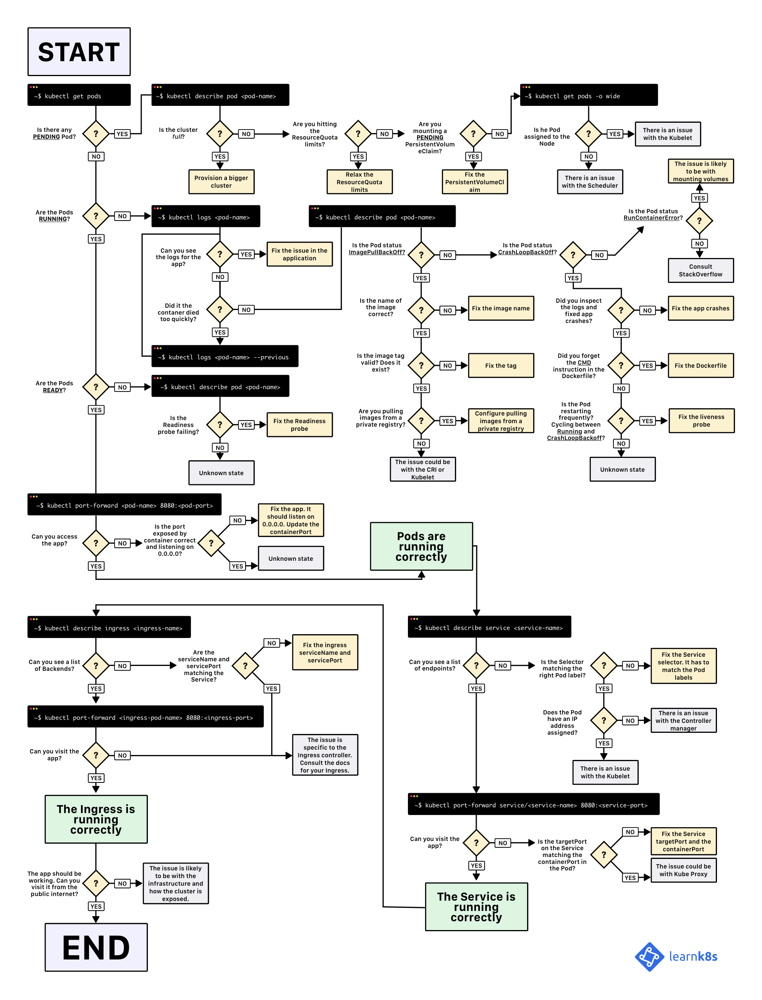

**TL;DR:** here's a diagram to help you debug your deployments in Kubernetes (and you can [download it in the PDF version here](troubleshooting-kubernetes.pdf)).



When you wish to deploy an application in Kubernetes, you usually define three components:

- a **Deployment** — which is a recipe for creating copies of your application called Pods
- a **Service** — an internal load balancer that routes the traffic to Pods
- an **Ingress** — a description of how the traffic should flow from outside the cluster to your Service.

Here's a quick visual recap.

```slideshow
{
  "description": "Kubernetes core concepts: Ingress, Service, Pod and Deployment.",
  "slides": [
    {
      "image": "core-concepts-1.svg",
      "description": "In Kubernetes your applications are exposed through two layers of load balancers: internal and external."
    },
    {
      "image": "core-concepts-2.svg",
      "description": "The internal load balancer is called Service, whereas the external one is called Ingress."
    },
    {
      "image": "core-concepts-3.svg",
      "description": "Pods are not deployed directly. Instead, the Deployment creates the Pods and whatches over them."
    }
  ]
}
```

Assuming you wish to deploy a simple _Hello World_ application, the YAML for such application should look similar to this:

```yaml|highlight=2,23,34|title=hello-world.yaml
apiVersion: apps/v1
kind: Deployment
metadata:
  name: my-deployment
  labels:
    track: canary
spec:
  selector:
    matchLabels:
      any-name: my-app
  template:
    metadata:
      labels:
        any-name: my-app
    spec:
      containers:
      - name: cont1
        image: learnk8s/app:1.0.0
        ports:
        - containerPort: 8080
---
apiVersion: v1
kind: Service
metadata:
  name: my-service
spec:
  ports:
  - port: 80
    targetPort: 8080
  selector:
    name: app
---
apiVersion: networking.k8s.io/v1beta1
kind: Ingress
metadata:
  name: my-ingress
spec:
  rules:
  - http:
    paths:
    - backend:
        serviceName: app
        servicePort: 80
      path: /
```

The definition is quite long, and it's easy to overlook how the components relate to each other.

For example:

- When should you use port 80 and when port 8080?
- Should you create a new port for every Service so that they don't clash?
- Do label names matter? Should it be the same everywhere?

Before focusing on the debugging, let's recap how the three components link to each other.

Let's start with Deployment and Service.

## Connecting Deployment and Service

The surprising news is that Service and Deployment aren't connected at all.

Instead, the Service points to the Pods directly and skips the Deployment altogether.

So what you should pay attention to is how the Pods and the Service are related to each other.

You should remember three things:

1. The Service selector should match at least one label of the Pod
1. The Service `targetPort` should match the `containerPort` of the container inside the Pod
1. The Service `port` can be any number. Multiple Services can use the same port because they have different IP addresses assigned.

The following diagram summarises the how to connect the ports:

```slideshow
{
  "description": "Connecting a Service and a Pod",
  "slides": [
    {
      "image": "ports-1.svg",
      "description": "Consider the following Pod exposed by a Service."
    },
    {
      "image": "ports-2.svg",
      "description": "When you create a Pod, you should define the port `containerPort` for each container in your Pods."
    },
    {
      "image": "ports-3.svg",
      "description": "When you create a Service, you can define a `port` and a `targetPort`. _But which one should you connect to the container?_"
    },
    {
      "image": "ports-4.svg",
      "description": "`targetPort` and `containerPort` should always match."
    },
    {
      "image": "ports-5.svg",
      "description": "If your container exposes port 3000, then the `targetPort` should match that number."
    }
  ]
}
```

If you look at the YAML, the labels and `ports`/`targetPort` should match:

```yaml|highlight=13-14,20,29,30-31|title=hello-world.yaml
apiVersion: apps/v1
kind: Deployment
metadata:
  name: my-deployment
  labels:
    track: canary
spec:
  selector:
    matchLabels:
      any-name: my-app
  template:
    metadata:
      labels:
        any-name: my-app
    spec:
      containers:
      - name: cont1
        image: learnk8s/app:1.0.0
        ports:
        - containerPort: 8080
---
apiVersion: v1
kind: Service
metadata:
  name: my-service
spec:
  ports:
  - port: 80
    targetPort: 8080
  selector:
    any-name: my-app
```

_What about the `track: canary` label at the top of the Deployment?_

_Should that match too?_

That label belongs to the deployment, and it's not used by the Service's selector to route traffic.

In other words, you can safely remove it or assign it a different value.

_And what about the `matchLabels` selector_?

**It always has to match the Pod labels** and it's used by the Deployment to track the Pods.

_Assuming that you made the correct change, how do you test it?_

You can check if the Pods have the right label with the following command:

```terminal|command=1|title=bash
kubectl get pods --show-labels
```

Or if you have Pods belonging to several applications:

```terminal|command=1|title=bash
kubectl get pods --selector any-name=my-app --show-labels
```

Where `any-name=my-app` is the label `any-name: my-app`.

_Still having issues?_

You can also connect to the Pod!

You can use the `port-forward` command in kubectl to connect to the Service and test the connection.

```terminal|command=1|title=bash
kubectl port-forward service/<service name> 3000:80
```

Where:

- `service/<service name>` is the name of the service — in the current YAML is "my-service"
- 3000 is the port that you wish to open on your computer
- 80 is the port exposed by the Service in the `port` field

If you can connect, the setup is correct.

If you can't, you most likely misplaced a label or the port doesn't match.

## Connecting Service and Ingress

The next step in exposing your app is to configure the Ingress.

The Ingress has to know how to retrieve the Service to then retrieve the Pods and route traffic to them.

The Ingress retrieves the right Service by name and port exposed.

Two things should match in the Ingress and Service:

1. The `servicePort` of the Ingress should match the `port` of the Service
1. The `serviceName` of the Ingress should match the `name` of the Service

The following diagram summarises how to connect the ports:

```slideshow
{
  "description": "Connecting an Ingress and a Service",
  "slides": [
    {
      "image": "ports-6.svg",
      "description": "You already know that the Service expose a `port`."
    },
    {
      "image": "ports-7.svg",
      "description": "The Ingress has a field called `servicePort`."
    },
    {
      "image": "ports-8.svg",
      "description": "The Service `port` and the Ingress `servicePort` should always match."
    },
    {
      "image": "ports-9.svg",
      "description": "If you decide to assign port 80 to the service, you should change `servicePort` to 80 too."
    }
  ]
}
```

In practice, you should look at these lines:

```yaml|highlight=4,7,21,22|title=hello-world.yaml
apiVersion: v1
kind: Service
metadata:
  name: my-service
spec:
  ports:
  - port: 80
    targetPort: 8080
  selector:
    any-name: my-app
---
apiVersion: networking.k8s.io/v1beta1
kind: Ingress
metadata:
  name: my-ingress
spec:
  rules:
  - http:
    paths:
    - backend:
        serviceName: my-service
        servicePort: 80
      path: /
```

_How do you test that the Ingress works?_

You can use the same strategy as before with `kubectl port-forward`, but instead of connecting to a service, you should connect to the Ingress controller.

First, retrieve the Pod name for the Ingress controller with:

```terminal|command=1|title=bash
kubectl get pods --all-namespaces
NAMESPACE   NAME                              READY STATUS
kube-system coredns-5644d7b6d9-jn7cq          1/1   Running
kube-system etcd-minikube                     1/1   Running
kube-system kube-apiserver-minikube           1/1   Running
kube-system kube-controller-manager-minikube  1/1   Running
kube-system kube-proxy-zvf2h                  1/1   Running
kube-system kube-scheduler-minikube           1/1   Running
kube-system nginx-ingress-controller-6fc5bcc  1/1   Running
```

Identify the Ingress Pod (which might be in a different Namespace) and describe it to retrieve the port:

```terminal|command=1|title=bash
kubectl describe pod nginx-ingress-controller-6fc5bcc \
 --namespace kube-system \
 | grep Ports
Ports:         80/TCP, 443/TCP, 18080/TCP
```

Finally, connect to the Pod:

```terminal|command=1|title=bash
kubectl port-forward nginx-ingress-controller-6fc5bcc 3000:80 --namespace kube-system
```

At this point, every time you visit port 3000 on your computer, the request is forwarded to port 80 on the Ingress controller Pod.

If you visit <http://localhost:3000>, you should find the app serving a web page.

## Recap on ports

Here's a quick recap on what ports and labels should match:

1. The Service selector should match the label of the Pod
1. The Service `targetPort` should match the `containerPort` of the container inside the Pod
1. The Service port can be any number. Multiple Services can use the same port because they have different IP addresses assigned.
1. The `servicePort` of the Ingress should match the `port` in the Service
1. The name of the Service should match the field `serviceName` in the Ingress

Knowing how to structure your YAML definition is only part of the story.

_What happens when something goes wrong?_

Perhaps the Pod doesn't start, or it's crashing.

## 3 steps to troubleshoot Kubernetes deployments

It's essential to have a well defined mental model of how Kubernetes works before diving into debugging a broken deployment.

Since there are three components in every deployment, you should debug all of them in order, starting from the bottom.

1. You should make sure that your Pods are running, then
1. Focus on getting the Service to route traffic to the Pods and then
1. Check that the Ingress is correctly configured

```slideshow
{
  "description": "Troubleshooting Kubernetes deployments",
  "slides": [
    {
      "image": "layers-1.svg",
      "description": "You should start troubleshooting your deployments from the bottom. First, check that the Pod is _Ready_ and _Running_."
    },
    {
      "image": "layers-2.svg",
      "description": "If the Pods is _Ready_, you should investigate if the Service can distribute traffic to the Pods."
    },
    {
      "image": "layers-3.svg",
      "description": "Finally, you should examine the connection between the Service and the Ingress."
    }
  ]
}
```

## 1. Troubleshooting Pods

Most of the time, the issue is in the Pod itself.

You should make sure that your Pods are _Running_ and _Ready_.

_How do you check that?_

```terminal|command=1|title=bash
kubectl get pods
NAME                    READY STATUS            RESTARTS  AGE
app1                    0/1   ImagePullBackOff  0         47h
app2                    0/1   Error             0         47h
app3-76f9fcd46b-xbv4k   1/1   Running           1         47h
```

In the above session, the last Pod is _Running_ and _Ready_ — however, the first two Pods are neither _Running_ nor _Ready_.

_How do you investigate on what went wrong?_

There are four useful commands to troubleshoot Pods:

1. `kubectl logs <pod name>` is helpful to retrieve the logs of the containers of the Pod
1. `kubectl describe pod <pod name>` is useful to retrieve a list of events associated with the Pod
1. `kubectl get pod <pod name>` is useful to extract the YAML definition of the Pod as stored in Kubernetes
1. `kubectl exec -ti <pod name> bash` is useful to run an interactive command within one of the containers of the Pod

_Which one should you use?_

There isn't a one-size-fits-all.

Instead, you should use a combination of them.

## Common Pods errors

Pods can have startup and runtime errors.

Startup errors include:

- ImagePullBackoff
- ImageInspectError
- ErrImagePull
- ErrImageNeverPull
- RegistryUnavailable
- InvalidImageName

Runtime errors include:

- CrashLoopBackOff
- RunContainerError
- KillContainerError
- VerifyNonRootError
- RunInitContainerError
- CreatePodSandboxError
- ConfigPodSandboxError
- KillPodSandboxError
- SetupNetworkError
- TeardownNetworkError

Some errors are more common than others.

The following is a list of the most common error and how you can fix them.

### ImagePullBackOff

This error appears when Kubernetes isn't able to retrieve the image for one of the containers of the Pod.

There are three common culprits:

1. The image name is invalid — as an example, you misspelt the name, or the image does not exist
1. You specified a non-existing tag for the image
1. The image that you're trying to retrieve belongs to a private registry, and Kubernetes doesn't have credentials to access it

The first two cases can be solved by correcting the image name and tag.

For the last, you should add the credentials to your private registry in a Secret and reference it in your Pods.

[The official documentation has an example about how you could to that.](https://kubernetes.io/docs/tasks/configure-pod-container/pull-image-private-registry/)

### CrashLoopBackOff

If the container can't start, then Kubernetes shows the CrashLoopBackOff message as a status.

Usually, a container can't start when:

1. There's an error in the application that prevents it from starting
1. You [misconfigured the container](https://stackoverflow.com/questions/41604499/my-kubernetes-pods-keep-crashing-with-crashloopbackoff-but-i-cant-find-any-lo)
1. The Liveness probe failed too many times

You should try and retrieve the logs from that container to investigate why it failed.

If you can't see the logs because your container is restarting too quickly, you can use the following command:

```terminal|command=1|title=bash
kubectl logs <pod-name> --previous
```

Which prints the error messages from the previous container.

### RunContainerError

The error appears when the container is unable to start.

That's even before the application inside the container starts.

The issue is usually due to misconfiguration such as:

- mounting a not-existent volume such as ConfigMap or Secrets
- mounting a read-only volume as read-write

You should use `kubectl describe pod <pod-name>` to collect and analyse the error.

### Pods in a _Pending_ state

When you create a Pod, the Pod stays in the _Pending_ state.

_Why?_

Assuming that your scheduler component is running fine, here are the causes:

1. The cluster doesn't have enough resources such as CPU and memory to run the Pod
1. The current Namespace has a ResourceQuota object and creating the Pod will make the Namespace go over the quota
1. The Pod is bound to a _Pending_ PersistentVolumeClaim

Your best option is to inspect the _Events_ section in the `kubectl describe` command:

```terminal|command=1|title=bash
kubectl describe pod <pod name>
```

For errors that are created as a result of ResourceQuotas, you can inspect the logs of the cluster with:

```terminal|command=1|title=bash
kubectl get events --sort-by=.metadata.creationTimestamp
```

### Pods in a not _Ready_ state

If a Pod is _Running_ but not _Ready_ it means that the Readiness probe is failing.

When the Readiness probe is failing, the Pod isn't attached to the Service, and no traffic is forwarded to that instance.

A failing Readiness probe is an application-specific error, so you should inspect the _Events_ section in `kubectl describe` to identify the error.

## 2. Troubleshooting Services

If your Pods are _Running_ and _Ready_, but you're still unable to receive a response from your app, you should check if the Service is configured correctly.

Services are designed to route the traffic to Pods based on their labels.

So the first thing that you should check is how many Pods are targeted by the Service.

You can do so by checking the Endpoints in the Service:

```terminal|command=1|title=bash
kubectl describe service <service-name> | grep Endpoints
```

An endpoint is a pair of `<ip address:port>`, and there should be at least one — when the Service targets (at least) a Pod.

If the "Endpoints" section is empty, there are two explanations:

1. you don't have any Pod running with the correct label (hint: you should check if you are in the right namespace)
1. You have a typo in the `selector` labels of the Service

If you see a list of endpoints, but still can't access your application, then the `targetPort` in your service is the likely culprit.

_How do you test the Service?_

Regardless of the type of Service, you can use `kubectl port-forward` to connect to it:

```terminal|command=1|title=bash
kubectl port-forward service/<service-name> 3000:80
```

Where:

- `<service-name>` is the name of the Service
- `3000` is the port that you wish to open on your computer
- `80` is the port exposed by the Service

## 3. Troubleshooting Ingress

If you've reached this section, then:

- the Pods are _Running_ and _Ready_
- the Service distributes the traffic to the Pod

But you still can't see a response from your app.

It means that most likely, the Ingress is misconfigured.

Since the Ingress controller being used is a third-party component in the cluster, there are different debugging techniques depending on the type of Ingress controller.

But before diving into Ingress specific tools, there's something straightforward that you could check.

The Ingress uses the `serviceName` and `servicePort` to connect to the Service.

You should check that those are correctly configured.

You can inspect that the Ingress is correctly configured with:

```terminal|command=1|title=bash
kubectl describe ingress <ingress-name>
```

If the _Backend_ column is empty, then there must be an error in the configuration.

If you can see the endpoints in the _Backend_ column, but still can't access the application, the issue is likely to be:

- how you exposed your Ingress to the public internet
- how you exposed your cluster to the public internet

You can isolate infrastructure issues from Ingress by connecting to the Ingress Pod directly.

First, retrieve the Pod for your Ingress controller (which could be located in a different namespace):

```terminal|command=1|title=bash
kubectl get pods --all-namespaces
NAMESPACE   NAME                              READY STATUS
kube-system coredns-5644d7b6d9-jn7cq          1/1   Running
kube-system etcd-minikube                     1/1   Running
kube-system kube-apiserver-minikube           1/1   Running
kube-system kube-controller-manager-minikube  1/1   Running
kube-system kube-proxy-zvf2h                  1/1   Running
kube-system kube-scheduler-minikube           1/1   Running
kube-system nginx-ingress-controller-6fc5bcc  1/1   Running
```

Describe it to retrieve the port:

```terminal|command=1|title=bash
kubectl describe pod nginx-ingress-controller-6fc5bcc
 --namespace kube-system \
 | grep Ports
```

Finally, connect to the Pod:

```terminal|command=1|title=bash
kubectl port-forward nginx-ingress-controller-6fc5bcc 3000:80 --namespace kube-system
```

At this point, every time you visit port 3000 on your computer, the request is forwarded to port 80 on the Pod.

_Does it works now?_

- If it works, the issue is in the infrastructure. You should investigate how the traffic is routed to your cluster.
- If it doesn't work, the problem is in the Ingress controller. You should debug the Ingress.

If you still can't get the Ingress controller to work, you should start debugging it.

There are many different versions of Ingress controllers.

Popular options include Nginx, HAProxy, Traefik, etc.

You should consult the documentation of your Ingress controller to find a troubleshooting guide.

Since [Ingress Nginx](https://github.com/kubernetes/ingress-nginx) is the most popular Ingress controller, we included a few tips for it in the next section.

### Debugging Ingress Nginx

The Ingress-nginx project has an [official plugin for Kubectl](https://kubernetes.github.io/ingress-nginx/kubectl-plugin/).

You can use `kubectl ingress-nginx` to:

- inspect logs, backends, certs, etc.
- connect to the Ingress
- examine the current configuration

The three commands that you should try are:

- `kubectl ingress-nginx lint`, which checks the `nginx.conf`
- `kubectl ingress-nginx backend`, to inspect the backend (similar to `kubectl describe ingress <ingress-name>`)
- `kubectl ingress-nginx logs`, to check the logs

> Please notice that you might need to specify the correct namespace for your Ingress controller with `--namespace <name>`.

## Summary

Troubleshooting in Kubernetes can be a daunting task if you don't know where to start.

You should always remember to approach the problem bottom-up: start with the Pods and move up the stack with Service and Ingress.

The same debugging techniques that you learnt in this article can be applied to other objects such as:

- failing Jobs and CronJobs
- StatefulSets and DaemonSets

Many thanks to [Gergely Risko](https://github.com/errge), [Daniel Weibel](https://medium.com/@weibeld) and [Charles Christyraj](https://www.linkedin.com/in/charles-christyraj-0bab8a36/) for offering some invaluable suggestions.
