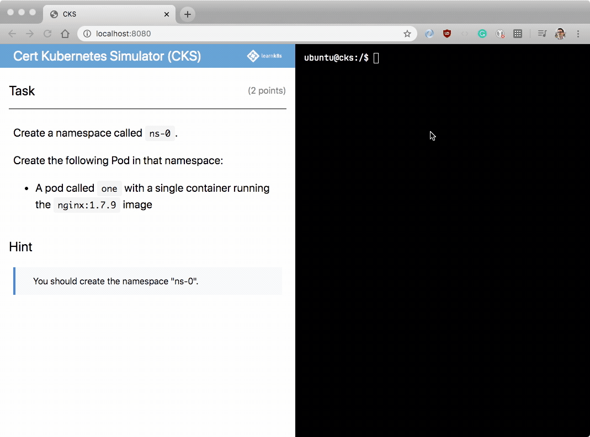
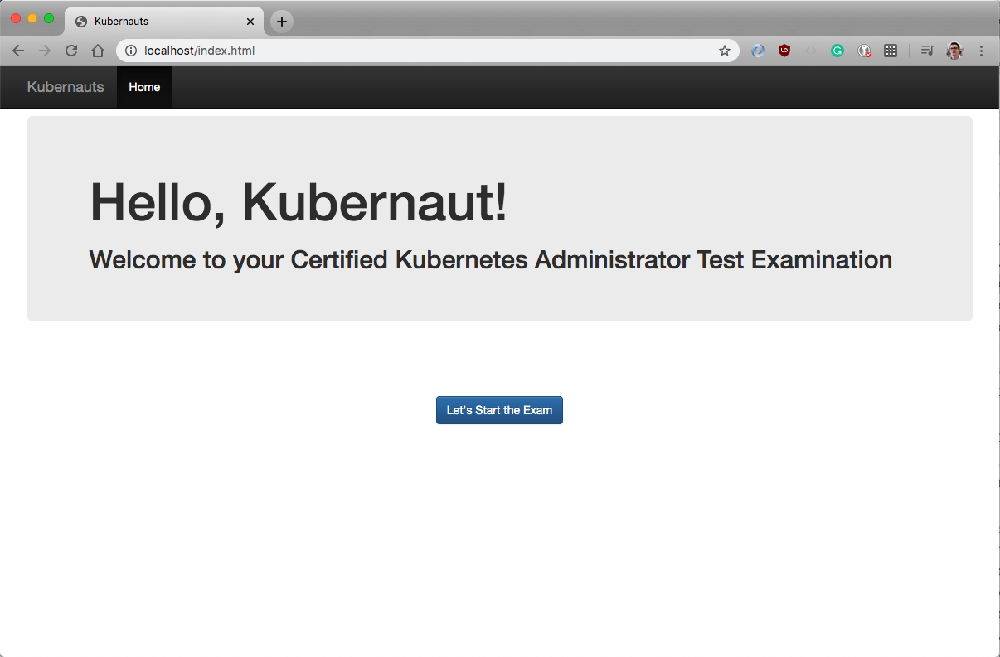
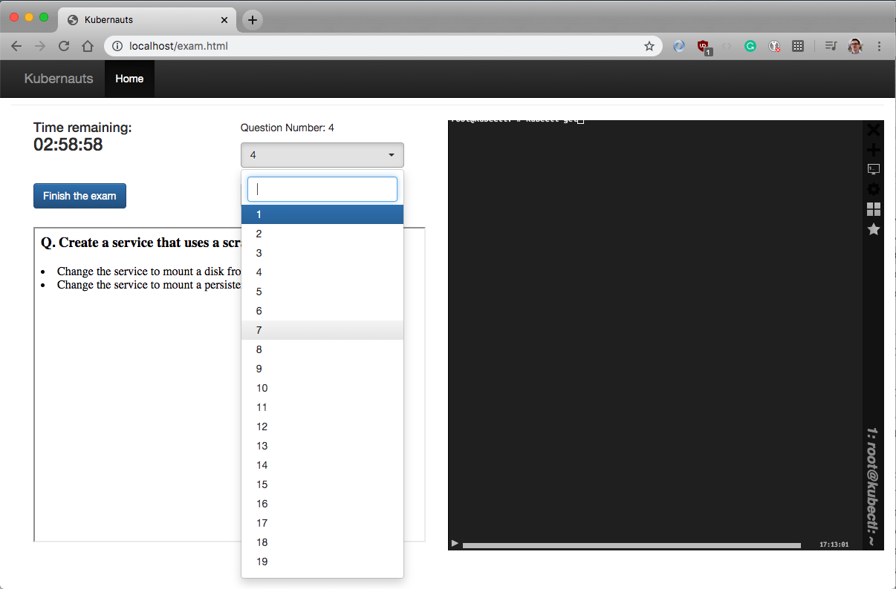
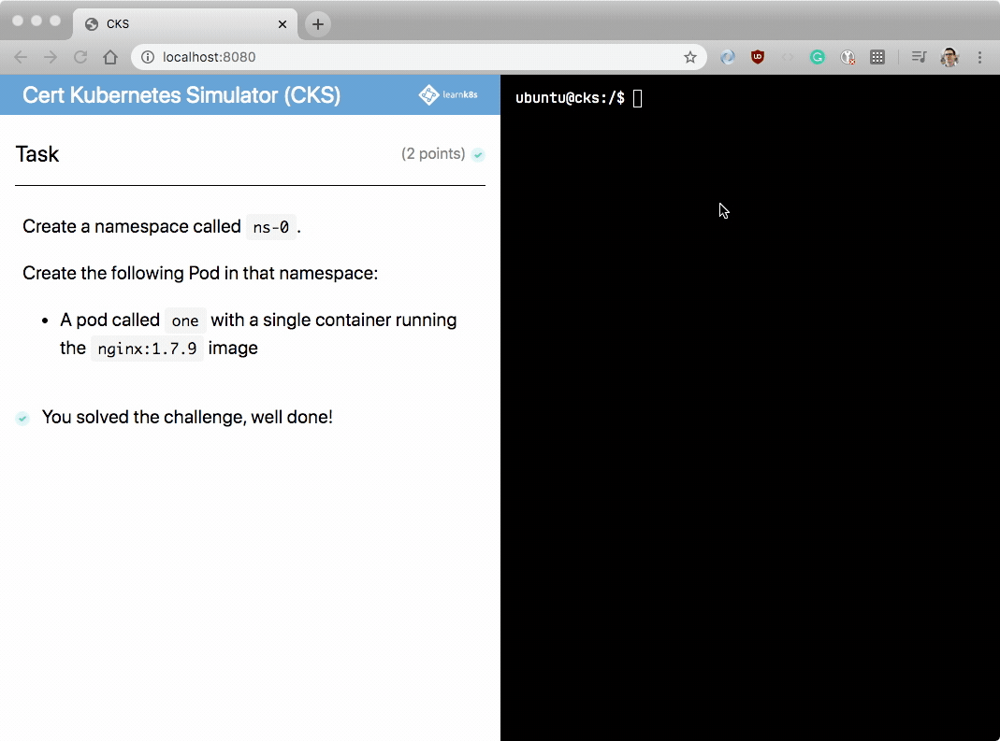

THREAD

I built a simulator for the CKA/CKAD exam.

So you can practice for the *real* exam with the same questions and environment.



---

Until now the best tool to prepare for the CKA/CKAD was @kubernauts' [arush-sal/cka-practice-environment](#link).

It's great because it's EXACTLY like the real exam:

1. Split panes
1. Clunky shell
1. Same questions

While the idea is excellent, there are a few drawbacks…






---

```
```

The Kubernauts' practice environment uses 2 different ports: web and shell.

However, it's rather hard to expose them within K8s.

Also, there is no check — how do you know if you passed?

I thought about contributing back, but the setup is too limited.

---

So I rebuilt it from scratch.

So far I managed to create a simple app that uses the exec API in Kubernetes to connect to a pod.

So you connect to the cluster with kubectl from within a pod.



---

It's still not complete. You can't paste code in the terminal, it's missing a timer, more exercises, etc.

But it's a good start and I should have a beta released some time next month.

And I've learned a lot about the K8s APIs!
